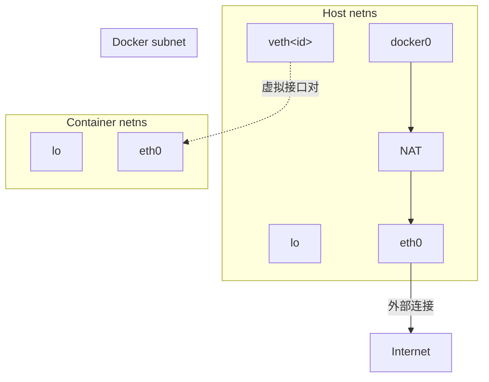

# 第17章：虚拟化

“虚拟”这个词在计算系统中可能含义模糊。它主要用于表示一种中介，将复杂或碎片化的底层转化为可供多个消费者使用的简化接口。考虑一个我们已经见过的例子——虚拟内存，它允许多个进程访问一大块内存，就好像每个进程都有自己的隔离内存空间一样。

这个定义仍然有些令人望而生畏，因此或许更好的方式是解释虚拟化的典型目的：创建隔离的环境，以便让多个系统能够在不冲突的情况下运行。

由于虚拟机在较高层面上相对容易理解，因此我们将从这里开始虚拟化的旅程。然而，讨论将停留在较高层面，旨在解释你在使用虚拟机时可能遇到的许多术语，而不会深入探讨具体实现的汪洋大海。

我们将更深入地探讨容器的技术细节。它们是用你在本书中已经见过的技术构建的，因此你可以看到这些组件如何组合在一起。此外，相对容易以交互方式探索容器。

## 17.1 虚拟机

虚拟机基于与虚拟内存相同的概念，只不过它涉及的是机器的所有硬件，而不仅仅是内存。在这种模型中，你借助软件创建一个全新的机器（处理器、内存、I/O接口等），并在其中运行一个完整的操作系统——包括内核。这种类型的虚拟机更具体地称为**系统虚拟机**，它已经存在了几十年。例如，IBM大型机传统上使用系统虚拟机来创建多用户环境；反过来，用户获得他们自己的虚拟机，运行着CMS，一个简单的单用户操作系统。

你可以完全用软件构建虚拟机（通常称为**模拟器**），或者尽可能利用底层硬件，就像虚拟内存中所做的那样。就我们在Linux中的目的而言，我们将关注后一种，因为它具有卓越的性能，但请注意，许多流行的模拟器支持旧的计算机和游戏系统，例如Commodore 64和Atari 2600。

虚拟机的世界是多样化的，有大量术语需要梳理。我们对虚拟机的探索将主要关注这些术语如何与你作为典型Linux用户的体验相关联。我们还将讨论你在虚拟硬件方面可能遇到的一些差异。

> [!NOTE] 注意
> 幸运的是，使用虚拟机远比描述它们简单。例如，在VirtualBox中，你可以使用GUI创建并运行一个虚拟机，甚至可以使用命令行工具VBoxManage，如果你需要在脚本中自动化该过程的话。云服务的Web界面也便于管理。由于这种易用性，我们将更侧重于理解虚拟机的技术和术语，而不是操作细节。

### 17.1.1 虚拟机监控器（Hypervisor）

在计算机上管理一个或多个虚拟机的软件称为**虚拟机监控器（hypervisor）** 或**虚拟化平台（VMM）**，其工作方式类似于操作系统管理进程。有两种类型的虚拟机监控器，你使用虚拟机的方式取决于类型。对于大多数用户而言，**类型2虚拟机监控器**最为熟悉，因为它运行在像Linux这样的常规操作系统上。例如，VirtualBox是一个类型2虚拟机监控器，你可以在你的系统上运行它而无需大量修改。在阅读本书时，你可能已经使用它来测试和探索不同类型的Linux系统。

另一方面，**类型1虚拟机监控器**更像是它自己的操作系统（尤其是内核），专门为快速高效地运行虚拟机而构建。这种虚拟机监控器有时会使用一个传统的配套系统（如Linux）来帮助管理任务。即使你可能永远不会在自己的硬件上运行它，你也经常与类型1虚拟机监控器交互。所有云计算服务都在类型1虚拟机监控器（例如Xen）下作为虚拟机运行。当你访问一个网站时，你几乎肯定是在访问运行在这种虚拟机上的软件。在AWS等云服务上创建操作系统实例，就是在类型1虚拟机监控器上创建虚拟机。

一般来说，虚拟机及其操作系统称为**客户机**。**宿主机**是运行虚拟机监控器的系统。对于类型2虚拟机监控器，宿主机就是你的本地系统。对于类型1虚拟机监控器，宿主机就是虚拟机监控器本身，可能结合一个专门的配套系统。

### 17.1.2 虚拟机中的硬件

理论上，虚拟机监控器为客户机提供硬件接口应该是直接的。例如，要提供一个虚拟磁盘设备，你可以在宿主机某处创建一个大的文件，并通过标准设备I/O模拟将其作为磁盘访问。这种方法是一种严格的**硬件虚拟机**；然而，它效率低下。使虚拟机适用于各种需求需要一些改变。

你可能遇到的真实硬件与虚拟硬件之间的大多数差异，都是因为采用了**半虚拟化**（paravirtualization）这种桥接方式，允许客户机更直接地访问宿主机资源。绕过宿主机和客户机之间的虚拟硬件称为**半虚拟化**。网络接口和块设备是最常受到这种影响的；例如，云计算实例上的`/dev/xvd`设备是一个Xen虚拟磁盘，它使用Linux内核驱动直接与虚拟机监控器通信。有时半虚拟化是为了方便起见；例如，在像VirtualBox这样的桌面级系统上，有可用的驱动来协调虚拟机窗口和宿主机环境之间的鼠标移动。

无论采用何种机制，虚拟化的目标始终是将问题简化到足够程度，以便客户机操作系统可以像对待任何其他设备一样对待虚拟硬件。这确保了设备之上的所有层都能正常运行。例如，在Linux客户机系统上，你希望内核能够将虚拟磁盘作为块设备访问，以便你可以使用常用工具对它们进行分区和创建文件系统。

#### 虚拟机CPU模式

关于虚拟机工作原理的大多数细节超出了本书的范围，但CPU值得一提，因为我们已经讨论过内核模式和用户模式之间的区别。这些模式的具体名称因处理器而异（例如，x86处理器使用一种称为“特权环”的系统），但理念总是相同的。在内核模式下，处理器几乎可以做任何事情；在用户模式下，某些指令不被允许，并且内存访问受限。

最初用于x86架构的虚拟机运行在用户模式下。这带来了一个问题，因为虚拟机内部运行的内核希望处于内核模式。为了应对这一点，虚拟机监控器可以检测并“捕获”来自虚拟机的任何受限指令。通过一些工作，虚拟机监控器模拟这些受限指令，使得虚拟机能够在并非为此设计的架构上运行在内核模式。由于内核执行的大部分指令并非受限指令，因此这些指令正常运行，性能影响相对较小。

在这种虚拟机监控器引入后不久，处理器制造商意识到存在一个市场，即处理器可以协助虚拟机监控器，消除指令捕获和模拟的需要。Intel和AMD分别以VT-x和AMD-V的形式发布了这些特性集，现在大多数虚拟机监控器都支持它们。在某些情况下，它们是必需的。

如果你想了解更多关于虚拟机的信息，可以从Jim Smith和Ravi Nair的《虚拟机：系统和进程的多功能平台》（Elsevier, 2005）开始。这本书还包括对进程虚拟机（例如Java虚拟机（JVM））的覆盖，我们这里不讨论。

### 17.1.3 虚拟机的常见用途

在Linux世界中，虚拟机使用通常属于以下几类之一：

- **测试和试用**   当你需要在正常或生产运行环境之外尝试某些东西时，有很多虚拟机用例。例如，在开发生产软件时，在独立于开发者的机器上测试软件是必不可少的。另一个用途是在安全且“可丢弃”的环境中试用新软件，例如新的发行版。虚拟机允许你做到这一点而无需购买新硬件。

- **应用程序兼容性**   当你需要在与你通常使用的操作系统不同的系统上运行某些东西时，虚拟机是必不可少的。

- **服务器和云服务**   如前所述，所有云服务都建立在虚拟机技术之上。如果你需要运行一个互联网服务器，例如Web服务器，最快的方式是向云提供商付费获得一个虚拟机实例。云提供商也提供专门的服务器，如数据库，这些只是运行在虚拟机上的预配置软件集。

### 17.1.4 虚拟机的缺点

多年来，虚拟机一直是隔离和扩展服务的首选方法。因为你可以通过几次点击或一个API来创建虚拟机，所以在无需安装和维护硬件的情况下创建服务器非常方便。尽管如此，在日常操作中仍有一些方面令人困扰：

- **安装和/或配置系统及应用程序可能繁琐且耗时**。诸如Ansible之类的工具可以自动化这个过程，但从零开始启动一个系统仍然需要大量时间。如果你使用虚拟机来测试软件，可以预期这个时间会快速累积。

- **即使配置得当，虚拟机启动和重启也相对缓慢**。有一些方法可以解决这个问题，但你仍然是在引导一个完整的Linux系统。

- **你必须维护一个完整的Linux系统，在每台虚拟机上保持更新和安全的最新状态**。这些系统有systemd和sshd，以及你的应用程序所依赖的任何工具。

- **你的应用程序可能与虚拟机上的标准软件集存在冲突**。一些应用程序有奇怪的依赖性，它们并不总是与生产机器上的软件和谐相处。此外，库等依赖项可能会随着机器升级而改变，破坏曾经正常工作的东西。

- **在单独的虚拟机上隔离你的服务可能浪费且昂贵**。标准的行业实践是在一个系统上运行不超过一个应用程序服务，这既健壮又易于维护。此外，一些服务可以进一步细分；如果你运行多个网站，最好将它们放在不同的服务器上。然而，这与降低成本的目标相矛盾，尤其当你在使用按虚拟机实例收费的云服务时。

这些问题与你在真实硬件上运行服务时遇到的问题其实没有区别，并且在小规模运营中不一定是障碍。然而，一旦你开始运行更多服务，它们将变得更加明显，耗费时间和金钱。这时，你可以考虑为你的服务使用容器。

# 17.2 容器

虚拟机非常适合隔离整个操作系统及其运行的应用集，但有时你需要更轻量级的替代方案。如今，容器技术已成为满足这一需求的流行方式。在深入细节之前，我们先退一步了解其演进过程。

传统上，计算机网络的操作方式是在同一台物理机上运行多项服务；例如，名称服务器也可以同时充当邮件服务器并执行其他任务。然而，你不应该真正信任任何软件（包括服务器）的安全性或稳定性。为了增强系统安全性并防止服务相互干扰，有一些基本方法可以在服务器守护进程周围设置屏障，尤其是当你非常不信任其中某个服务时。

服务隔离的一种方法是使用 `chroot()` 系统调用，将根目录更改为实际系统根目录以外的某个目录。程序可以将其根目录更改为类似 `/var/spool/my_service` 的路径，并且无法再访问该目录之外的任何内容。事实上，有一个 `chroot` 程序允许你以新的根目录运行程序。这种隔离有时被称为 **chroot 监狱**，因为进程通常无法逃脱它。

另一种限制是内核的资源限制（rlimit）特性，它限制进程可以消耗多少CPU时间，或者其文件可以有多大。

这些就是容器所基于的思想：你正在改变环境并限制进程运行所用的资源。虽然没有单一的定义性特征，但容器可以被松散地定义为一组进程的受限运行时环境，这意味着这些进程无法触及该环境之外的系统上的任何内容。一般来说，这被称为**操作系统级虚拟化**。

需要牢记的是，运行一个或多个容器的机器仍然只有一个底层的Linux内核。但是，容器内的进程可以使用与底层系统不同的Linux发行版的用户空间环境。

容器中的限制是通过多种内核特性构建的。容器中运行的进程的一些重要方面包括：

-   它们有自己的[[cgroups]]（控制组）。
-   它们有自己的设备和文件系统。
-   它们无法看到或与系统上的任何其他进程交互。
-   它们有自己的网络接口。

将所有这些东西整合在一起是一项复杂的任务。尽管可以手动更改所有内容，但这可能具有挑战性；仅仅掌握进程的 cgroups 就很棘手。为了帮助你，许多工具可以执行创建和管理有效容器所需的子任务。其中最流行的两个是 Docker 和 LXC。本章将重点介绍 Docker，但也会简要提及 LXC 以说明其不同之处。

## 17.2.1 Docker、Podman 和特权

要运行本书中的示例，你需要一个容器工具。这里的示例是使用 Docker 构建的，通常可以通过发行版包顺利安装。

有一个 Docker 的替代品叫做 Podman。这两个工具的主要区别在于，Docker 在使用容器时需要运行一个守护进程（dockerd），而 Podman 则不需要。这影响了两者设置容器的方式。大多数 Docker 配置需要超级用户权限才能访问其容器所使用的内核特性，dockerd 守护进程负责执行相关的工作。相比之下，你可以以普通用户身份运行 Podman，这称为**无根操作**。以这种方式运行时，它会使用不同的技术来实现隔离。

你也可以以超级用户身份运行 Podman，这会导致它切换到 Docker 使用的一些隔离技术。相反，新版本的 dockerd 也支持无根模式。

幸运的是，Podman 在命令行上与 Docker 兼容。这意味着你可以将这里的示例中的 `docker` 替换为 `podman`，它们仍然可以工作。但是，实现上存在差异，尤其是当你在无根模式下运行 Podman 时，因此会在适用时指出这些差异。

## 17.2.2 Docker 示例

熟悉容器的最简单方法是亲自动手操作。这里的 Docker 示例说明了使容器工作的主要特性，但提供深入的用户手册超出了本书的范围。阅读完本节后，你应该能轻松理解在线文档；如果你需要更全面的指南，可以尝试 Nigel Poulton 的 *Docker Deep Dive*（作者自出版，2016）。

首先，你需要创建一个**镜像**，它包含了文件系统以及容器运行所需的一些其他定义特性。你的镜像几乎总是基于从互联网上的仓库下载的预构建镜像。

> [!NOTE] 区分镜像和容器
> 很容易混淆镜像和容器。你可以将镜像视为容器的文件系统；进程不在镜像中运行，而是在容器中运行。这种说法并不完全准确（特别是，当你在 Docker 容器中更改文件时，你并没有更改镜像），但对于目前来说已经足够接近了。

在你的系统上安装 Docker（你的发行版的附加包可能就可以），在某个地方创建一个新目录，切换到该目录，然后创建一个名为 `Dockerfile` 的文件，其中包含以下行：

```dockerfile
FROM alpine:latest
RUN apk add bash
CMD ["/bin/bash"]
```

此配置使用了轻量级的 Alpine 发行版。我们做的唯一更改是添加 bash shell，这不仅是为了增强交互可用性，也是为了创建一个独特的镜像并了解该过程的工作方式。也可以（并且很常见）使用公共镜像而不做任何更改。在这种情况下，你不需要 Dockerfile。

使用以下命令构建镜像，该命令会读取当前目录中的 Dockerfile，并将标识符 `hlw_test` 应用于该镜像：

```bash
$ docker build -t hlw_test .
```

> [!NOTE] 用户权限
> 你可能需要将你自己添加到系统中的 `docker` 组，才能以普通用户身份运行 Docker 命令。

准备好接收大量输出。不要忽略它；第一次阅读这些输出将帮助你理解 Docker 的工作方式。让我们将其分解为与 Dockerfile 的每一行相对应的步骤。第一个任务是检索 Docker 注册表中最新版本的 Alpine 发行版容器：

```
Sending build context to Docker daemon  2.048kB
Step 1/3 : FROM alpine:latest
latest: Pulling from library/alpine
cbdbe7a5bc2a: Pull complete 
Digest: sha256:9a839e63dad54c3a6d1834e29692c8492d93f90c59c978c1ed79109ea4b9a54
Status: Downloaded newer image for alpine:latest
 ---> f70734b6a266
```

请注意大量使用 SHA256 摘要和较短的标识符。习惯就好；Docker 需要跟踪许多小部件。在此步骤中，Docker 已为基础 Alpine 发行版镜像创建了一个新镜像，其标识符为 `f70734b6a266`。稍后你可以引用那个特定镜像，但你可能不需要，因为它不是最终镜像。Docker 稍后会在此基础上构建更多内容。一个不打算成为最终产品的镜像被称为**中间镜像**。

> [!NOTE]
> 使用 Podman 时输出会不同，但步骤相同。

我们配置的下一部分是在 Alpine 中安装 bash shell。当你阅读以下内容时，你可能会识别出 `apk add bash` 命令产生的输出（以粗体显示）：

```
Step 2/3 : RUN apk add bash
 ---> Running in 4f0fb4632b31
fetch http://dl-cdn.alpinelinux.org/alpine/v3.11/main/x86_64/APKINDEX.tar.gz
fetch http://dl-cdn.alpinelinux.org/alpine/v3.11/community/x86_64/APKINDEX.tar.gz
(1/4) Installing ncurses-terminfo-base (6.1_p20200118-r4)
(2/4) Installing ncurses-libs (6.1_p20200118-r4)
(3/4) Installing readline (8.0.1-r0)
(4/4) Installing bash (5.0.11-r1)
Executing bash-5.0.11-r1.post-install
Executing busybox-1.31.1-r9.trigger
OK: 8 MiB in 18 packages
Removing intermediate container 4f0fb4632b31
 ---> 12ef4043c80a
```

不太明显的是这是如何发生的。仔细想想，你自己的机器上可能并没有运行 Alpine。那么，你怎么能运行属于 Alpine 的 `apk` 命令呢？

关键之处在于显示 `Running in 4f0fb4632b31` 的那一行。你还没有要求创建一个容器，但 Docker 已经使用上一步的中间 Alpine 镜像建立了一个新的容器。容器也有标识符；不幸的是，它们看起来与镜像标识符没有区别。更令人困惑的是，Docker 将临时容器称为**中间容器**，这与中间镜像不同。中间镜像在构建后仍会保留；中间容器则不会。

在设置好 ID 为 `4f0fb4632b31` 的（临时）容器后，Docker 在该容器内部运行了 `apk` 命令来安装 bash，然后将对文件系统所做的更改保存到一个新的中间镜像中，其 ID 为 `12ef4043c80a`。请注意，Docker 在完成后也会移除该容器。

最后，Docker 进行了最终更改，以便从新镜像启动容器时运行 bash shell：

```
Step 3/3 : CMD ["/bin/bash"]
 ---> Running in fb082e6a0728
Removing intermediate container fb082e6a0728
 ---> 1b64f94e5a54
Successfully built 1b64f94e5a54
Successfully tagged hlw_test:latest
```

> [!NOTE] RUN vs CMD
> Dockerfile 中的任何 `RUN` 命令都在镜像构建期间执行，而不是在你随后使用该镜像启动容器时。`CMD` 命令用于容器运行时；这就是它出现在最后的原因。

在此示例中，你现在有了一个最终镜像，其 ID 为 `1b64f94e5a54`，但由于你已（分两步）为其打上标签，你也可以将其称为 `hlw_test` 或 `hlw_test:latest`。运行 `docker images` 以验证你的镜像和 Alpine 镜像都存在：

```
$ docker images
REPOSITORY          TAG                 IMAGE ID            CREATED             SIZE
hlw_test            latest              1b64f94e5a54        1 minute ago        9.19MB
alpine              latest              f70734b6a266        3 weeks ago         5.61MB
```

### 运行 Docker 容器

你现在已经准备好启动一个容器了。使用 Docker 在容器中运行内容有两种基本方法：你可以先创建容器，然后在其中运行内容（分两步），也可以一步完成创建和运行。让我们直接开始，使用刚刚构建的镜像启动一个容器：

```bash
$ docker run -it hlw_test
```

你应该会得到一个 bash shell 提示符，你可以在其中运行容器内的命令。该 shell 将以 root 用户身份运行。

> [!NOTE]
> 如果你忘记了 `-it` 选项（交互模式，连接终端），你将不会得到提示符，并且容器几乎会立即终止。这些选项在日常使用中有些不寻常（尤其是 `-t`）。

如果你好奇心强，可能想查看一下容器内部。运行一些命令，例如 `mount` 和 `ps`，并探索文件系统的一般情况。你会很快注意到，虽然大多数东西看起来像典型的 Linux 系统，但有些则不然。例如，如果你运行一个完整的进程列表，你将只得到两个条目：

# 第17章：虚拟化

> [!INFO] 上下文说明  
> 本部分继续探讨容器技术，包括进程ID命名空间、Overlay文件系统、网络模型、Docker操作及服务进程模型。

## 进程ID命名空间

```bash
# ps aux
PID   USER     TIME  COMMAND
    1 root      0:00 /bin/bash
    6 root      0:00 ps aux
```

在容器中，shell 成为了进程 ID 1（在正常系统上，这通常是 init），并且除了你正在执行的进程列表外，没有其他进程在运行。

此时，请记住这些进程实际上只是你能够在正常（宿主机）系统上看到的进程。如果你在宿主机上打开另一个 shell 窗口，可以在进程列表中找到一个容器进程，但需要稍微搜索一下。它看起来像这样：

```
root     20189  0.2  0.0   2408  2104 pts/0    Ss+  08:36   0:00 /bin/bash
```

这是我们第一次遇到容器使用的内核特性：专用于进程ID的 **Linux 内核命名空间**。一个进程可以为自己及其子进程创建一整套全新的进程 ID，从 PID 1 开始，并且它们只能看到这些进程。

## Overlay 文件系统

接下来，探索容器中的文件系统。你会发现它相当精简；这是因为它基于 Alpine 发行版。我们使用 Alpine 不仅因为它体积小，还因为它可能与你习惯的系统不同。然而，当你查看根文件系统的挂载方式时，你会发现它与普通的基于设备的挂载截然不同：

```
overlay on / type overlay (rw,relatime,lowerdir=/var/lib/docker/overlay2/l/
C3D66CQYRP4SCXWFFY6HHF6X5Z:/var/lib/docker/overlay2/l/K4BLIOMNRROX3SS5GFPB
7SFISL:/var/lib/docker/overlay2/l/2MKIOXW5SUB2YDOUBNH4G4Y7KF1,upperdir=/
var/lib/docker/overlay2/d064be6692c0c6ff4a45ba9a7a02f70e2cf5810a15bcb2b728b00
dc5b7d0888c/diff,workdir=/var/lib/docker/overlay2/d064be6692c0c6ff4a45ba9a7a02
f70e2cf5810a15bcb2b728b00dc5b7d0888c/work)
```

这是一个 **Overlay 文件系统**，它允许你通过将现有目录作为层（layer）组合来创建文件系统，并将更改存储在一个单独的位置。如果你在宿主机上查看，你会看到它（并且可以访问其组件目录），还会找到 Docker 挂载原始镜像的位置。

> [!NOTE]  
> 在 rootless 模式下，Podman 使用 FUSE 版本的 overlay 文件系统。在这种情况下，你不会从文件系统挂载信息中看到这些详细数据，但可以通过检查宿主机上的 `fuse-overlayfs` 进程来获取类似信息。

在挂载输出中，你会看到 `lowerdir`、`upperdir` 和 `workdir` 目录参数。`lower` 目录实际上是一系列用冒号分隔的目录。如果你在宿主机上查找这些目录，会发现最后一个目录（最右侧的）是镜像构建第一步设置的 Alpine 基本发行版（只需查看内部，你会看到发行版根目录）。如果查看前面的两个目录，你会发现它们对应其他两个构建步骤。因此，这些目录从右到左依次“堆叠”在一起。

`upper` 目录位于这些层之上，所有对挂载文件系统的更改都会出现在这里。它不必在挂载时为空，但对于容器来说，一开始就在其中放任何东西并没有太大意义。`work` 目录是文件系统驱动程序在将更改写入 `upper` 目录之前进行工作的位置，并且在挂载时必须为空。

你可以想象，具有许多构建步骤的容器镜像会有相当多的层。这有时是个问题，有各种策略来最小化层数，例如合并 `RUN` 命令和多阶段构建。我们在此不深入讨论这些细节。

## 网络

尽管你可以选择让容器在宿主机的同一网络中运行，但为了安全，通常需要对网络栈进行某种隔离。Docker 中有几种实现方式，但默认（也是最常见）的方式称为 **桥接网络**（bridge network），它使用另一种命名空间——**网络命名空间**（network namespace，netns）。在运行任何东西之前，Docker 会在宿主机上创建一个新的网络接口（通常是 `docker0`），通常分配给一个私有网络（例如 `172.17.0.0/16`），因此接口会被分配 `172.17.0.1`。这个网络用于宿主机及其容器之间的通信。

然后，在创建容器时，Docker 会创建一个全新的网络命名空间，该空间几乎是完全空的。起初，新的命名空间（也就是容器内的命名空间）只包含一个私有的回环接口（`lo`）。为了实际使用，Docker 在宿主机上创建一个虚拟接口（veth 对），模拟两个物理网络接口之间的链路（每个接口都有自己的设备），并将其中一个设备放入新的命名空间中。通过在新命名空间的设备上配置 Docker 网络地址（本例中为 `172.17.0.0/16`）上的 IP 地址，进程可以在该网络上发送数据包，并由宿主机接收。这可能会让人困惑，因为不同命名空间中的接口可以有相同的名称（例如，容器的接口可以是 `eth0`，宿主机也可以有名为 `eth0` 的接口）。

由于这使用了私有网络（网络管理员可能不希望盲目地将流量路由到这些容器或从这些容器路由出来），如果保持这种状态，使用该命名空间的容器进程将无法访问外部世界。为了使容器能够访问外部主机，宿主机上的 Docker 网络配置了 **NAT**（网络地址转换）。

图 17-1 展示了一个典型设置。它包括物理层（接口），以及 Docker 子网的互联网层，以及将该子网连接到宿主机其他部分和外部连接的 NAT。



**图 17-1：Docker 中的桥接网络。粗链接表示虚拟接口对。**

> [!NOTE]  
> 你可能需要检查 Docker 接口网络的子网。有时它会与电信公司路由器硬件分配的基于 NAT 的网络发生冲突。

Podman 的 **rootless 操作** 网络有所不同，因为设置虚拟接口需要超级用户权限。Podman 仍然使用新的网络命名空间，但它需要一种可以在用户空间中设置和运行的接口。这是一个 **TAP 接口**（通常为 `tap0`），配合一个名为 `slirp4netns` 的转发守护进程，容器进程可以访问外部世界。这种方式能力较弱；例如，容器之间无法相互连接。

网络还有很多内容，包括如何暴露容器网络栈中的端口供外部服务使用，但理解网络拓扑结构是最重要的。

## Docker 操作

至此，我们可以继续讨论 Docker 支持的其他各种隔离和限制，但这会花费很长时间，而且你可能已经明白了要点。容器并非来自某个特定的特性，而是来自一系列特性的集合。其后果是，Docker 必须跟踪我们在创建容器时所做的所有事情，并且还必须能够清理它们。

Docker 将容器定义为“运行中”，只要它还有进程在运行。你可以使用 `docker ps` 查看当前正在运行的容器：

```bash
$ docker ps
CONTAINER ID   IMAGE       COMMAND       CREATED       STATUS      PORTS    NAMES
bda6204cecf7   hlw_test    "/bin/bash"   8 hours ago   Up 8 hours           boring_lovelace
8a48d6e85efe   hlw_test    "/bin/bash"   20 hours ago  Up 20 hours          awesome_elion
```

一旦所有进程终止，Docker 会将它们置于退出状态，但容器仍然保留（除非你使用 `--rm` 选项启动）。这包括对文件系统所做的更改。你可以使用 `docker export` 轻松访问文件系统。

你需要注意这一点，因为 `docker ps` 默认不显示已退出的容器；你必须使用 `-a` 选项才能看到所有容器。很容易积累大量已退出的容器，如果容器中运行的应用程序产生大量数据，你可能会耗尽磁盘空间而不知道原因。使用 `docker rm` 删除已终止的容器。

这也适用于旧镜像。开发镜像往往是一个重复的过程，当你用与已有镜像相同的标签来标记一个新的镜像时，Docker 不会移除原始镜像。旧镜像只是丢失了那个标签。如果你运行 `docker images` 显示系统上的所有镜像，你可以看到所有镜像。以下示例显示了一个没有标签的旧版本镜像：

```bash
$ docker images
REPOSITORY          TAG                 IMAGE ID            CREATED             SIZE
hlw_test            latest              1b64f94e5a54        43 hours ago        9.19MB
<none>              <none>              d0461f65b379        46 hours ago        9.19MB
alpine              latest              f70734b6a266        4 weeks ago         5.61MB
```

使用 `docker rmi` 删除镜像。这也会删除镜像所依赖的任何不必要的中间镜像。如果你不删除镜像，它们会随着时间的推移而堆积起来。根据镜像中的内容以及构建方式，这可能会占用系统上大量的存储空间。

总的来说，Docker 做了大量细致的版本控制和检查点管理。与稍后会看到的 LXC 等工具相比，这种管理层次反映了一种特定的理念。

## Docker 服务进程模型

Docker 容器的一个潜在令人困惑的方面是其中进程的生命周期。在一个进程完全终止之前，其父进程应该使用 `wait()` 系统调用来收集（“收割”）其退出码。然而，在容器中，某些情况下死进程可能会残留，因为它们的父进程不知道如何应对。再加上许多镜像的配置方式，你可能会得出结论：你不应该在 Docker 容器中运行多个进程或服务。这是不正确的。

你可以在一个容器中运行多个进程。我们在示例中运行的 shell 在执行命令时会启动一个新的子进程。唯一真正重要的是，当你有子进程时，父进程会在它们退出时进行清理。大多数父进程都会这样做，但在某些情况下，你可能会遇到父进程不清除子进程的情况，特别是当父进程不知道它有子进程时。当存在多级进程派生（spawn），并且容器内的 PID 1 最终成为一个它不知道的子进程的父进程时，就会发生这种情况。

为了解决这个问题，如果你有一个简单的单一服务（只派生一些进程，并且即使在容器应该终止时似乎也会留下残留进程），你可以将 `--init` 选项添加到 `docker run` 中。这会创建一个非常简单的 init 进程，作为容器中的 PID 1 运行，并充当知道如何在子进程终止时处理它们的父进程。

然而，如果你在容器内运行多个服务或任务（例如某个作业服务器的多个工作进程），与其通过脚本启动它们，不如考虑使用进程管理守护进程（如 Supervisor：`supervisord`）来启动和监控它们。这不仅提供了必要的系统功能，还让你对服务进程有更多的控制。

关于这一点，如果你正在考虑容器采用这种模型，还有一个不同的选项，它不涉及 Docker。

# 第17章：虚拟化

## 17.2.3 LXC

我们的讨论一直围绕 Docker 展开，不仅因为它是构建容器镜像最流行的系统，还因为它能让您非常轻松地入门并深入理解容器通常提供的隔离层。然而，还有其他用于创建容器的软件包，它们采取了不同的方法。其中，LXC 是最古老的之一。事实上，Docker 最初的版本就是构建在 LXC 之上的。如果您理解了 Docker 工作原理的讨论，那么 LXC 的技术概念对您来说就不会有困难，因此我们不会展开介绍任何示例。相反，我们只探讨一些实际差异。

术语 LXC 有时用于指代那些使容器成为可能的内核特性集，但大多数人用它来特指一个库和包含多个用于创建与管理 Linux 容器的实用工具的软件包。与 Docker 不同，LXC 涉及相当多的手动设置。例如，您必须自己创建容器网络接口，并且需要提供用户 ID 映射。

最初，LXC 的目标是在容器内尽可能提供一个完整的 Linux 系统——包括 init 以及所有内容。在安装了某个发行版的特殊版本后，您可以在容器内安装运行任何所需的一切。这部分与您看到的 Docker 差别不大，但需要做更多的设置；使用 Docker，您只需下载一堆文件即可开始使用。

因此，您可能会发现 LXC 在适应不同需求方面更加灵活。例如，默认情况下，LXC 并不使用您在 Docker 中看到的 overlay 文件系统，尽管您可以添加一个。由于 LXC 构建在 C API 之上，如有必要，您可以在自己的软件应用程序中使用这种细粒度控制。

一个名为 LXD 的配套管理包可以帮助您处理 LXC 的一些更精细、手动操作的点（例如网络创建和镜像管理），并提供了一个 REST API 供您替代 C API 来访问 LXC。

## 17.2.4 Kubernetes

说到管理，容器已广泛应用于各种 Web 服务器，因为您可以从单个镜像在多台机器上启动一组容器，提供出色的冗余性。不幸的是，这可能难以管理。您需要执行如下任务：

* 跟踪哪些机器能够运行容器。
* 在这些机器上启动、监控和重启容器。
* 配置容器启动。
* 根据需要配置容器网络。
* 加载新版本的容器镜像，并优雅地更新所有正在运行的容器。

这并非完整的列表，也没有恰当体现每项任务的复杂性。人们迫切需要为此开发软件，而在出现的解决方案中，谷歌的 Kubernetes 已占据主导地位。其中一个最可能的原因是它能够运行 Docker 容器镜像。

与任何客户端-服务器应用程序一样，Kubernetes 有两个基本方面。服务器端涉及可用于运行容器的机器，而客户端主要是一组命令行工具，用于启动和操作容器的集合。容器（及其组成的组）的配置文件可能非常庞大，您很快就会发现，客户端的大部分工作就是创建适当的配置。

您可以自行探索配置。如果您不想自行设置服务器，可以使用 Minikube 工具在您自己的机器上安装一台运行 Kubernetes 集群的虚拟机。

## 17.2.5 容器的陷阱

如果您思考一下像 Kubernetes 这样的服务是如何工作的，您也会意识到，使用容器的系统并非没有成本。至少，您仍然需要一台或多台机器来运行您的容器，而且这必须是一台完整的 Linux 机器，无论是真实硬件还是虚拟机。这里仍然存在维护成本，尽管维护这种核心基础设施可能比维护需要大量自定义软件安装的配置更简单。

这种成本可以有多种形式。如果您选择自行管理基础设施，那将是巨大的时间投入，并且仍然存在硬件、托管和维护成本。如果您转而使用像 Kubernetes 集群这样的容器服务，那么您将支付由他人为您完成工作的费用。

在考虑容器本身时，请记住以下几点：

* **容器在存储方面可能造成浪费。** 为了使任何应用程序能在容器内正常运行，容器必须包含 Linux 操作系统所有必要的支持，例如共享库。这可能变得相当庞大，尤其是如果您没有特别注意为容器选择的基础发行版。然后，考虑您的应用程序本身：它有多大？当您使用 overlay 文件系统运行同一容器的多个副本时，这种情况会有所缓解，因为它们共享相同的基础文件。但是，如果您的应用程序创建大量运行时数据，所有这些 overlay 的上层可能会变得很大。
* **您仍然需要考虑其他系统资源，例如 CPU 时间。** 您可以配置容器消耗多少资源的限制，但仍然受限于底层系统能处理多少。仍然存在内核和块设备。如果您过载了某些部分，那么您的容器、底层系统，或者两者都会受到影响。
* **您可能需要以不同的方式思考数据存储位置。** 在使用 overlay 文件系统的容器系统（如 Docker）中，运行时对文件系统所做的更改在进程终止后会被丢弃。在许多应用程序中，所有用户数据都进入数据库，这样问题就简化为数据库管理。但是您的日志呢？它们是运行良好的服务器应用程序所必需的，并且您仍然需要一种存储它们的方法。对于任何大规模的生产环境，独立的日志服务是必需的。
* **大多数容器工具和操作模型都面向 Web 服务器。** 如果您运行的是典型的 Web 服务器，您会发现大量关于在容器中运行 Web 服务器的支持和信息。特别是 Kubernetes，它具有许多安全功能来防止失控的服务器代码。这可能是一个优势，因为它弥补了大多数 Web 应用程序（坦率地说）编写得很糟糕的缺陷。但是，当您尝试运行其他类型的服务时，有时会感觉像是在把方钉子往圆孔里塞。
* **粗心的容器构建会导致臃肿、配置问题和故障。** 您正在创建一个隔离环境，这一事实并不能保护您不在该环境中犯错。您可能不必过多担心 systemd 的复杂性，但仍然有很多其他事情可能出错。当任何类型的系统出现问题时，缺乏经验的用户往往会添加一些东西试图让问题消失，往往是草率地。这种情况可能会持续下去（通常是盲目地），直到最终得到一个勉强可用的系统——却伴随着许多额外的问题。您需要理解您所做的更改。
* **版本管理可能很成问题。** 我们在本书的示例中使用了 `latest` 标签。这应该是容器的最新（稳定）版本，但它也意味着，当您基于某个发行版或软件包的最新版本构建容器时，底层某些东西可能会发生变化，从而破坏您的应用程序。一种标准做法是使用基础容器的特定版本标签。
* **信任可能是一个问题。** 这尤其适用于使用 Docker 构建的镜像。当您将容器基于 Docker 镜像仓库中的镜像时，您将信任寄托在一个额外的管理层上，信任这些镜像没有被篡改以引入比平常更多的安全问题，并且信任在您需要时它们会存在。这与 LXC 形成对比，在 LXC 中，建议您在一定程度上自行构建。

在考虑这些问题时，您可能会认为与其他管理系统环境的方法相比，容器有很多缺点。然而，情况并非如此。无论您选择哪种方法，这些问题都在一定程度上以某种形式存在——而其中一些问题在容器中更容易管理。只需记住，容器不会解决所有问题。例如，如果您的应用程序在正常系统上（启动后）需要很长时间才能启动，那么它在容器中同样会启动缓慢。

## 17.3 基于运行时的虚拟化

最后一种要提及的虚拟化基于用于开发应用程序的环境类型。这与我们到目前为止看到的系统虚拟机和容器不同，因为它不涉及将应用程序放置到不同机器上的概念。相反，它仅适用于特定应用程序的一种分离。

这类环境存在的理由是，同一系统上的多个应用程序可能使用相同的编程语言，从而导致潜在的冲突。例如，Python 在典型的发行版中多处使用，并可能包含许多附加包。如果您想在自己的包中使用系统版本的 Python，而您想要其中一个附加包的不同版本时，就可能遇到麻烦。

让我们看看 Python 的虚拟环境功能如何创建一个只包含您想要包的 Python 版本。开始的方法是为环境创建一个新目录，如下所示：

```bash
$ python3 -m venv test-venv
```

> [!NOTE]
> 当您读到此处时，可能只需输入 `python` 而不是 `python3`。

现在，查看新创建的 `test-venv` 目录内部。您会看到许多类似系统的目录，如 `bin`、`include` 和 `lib`。要激活虚拟环境，您需要 source（而不是执行）`test-venv/bin/activate` 脚本：

```bash
$ . test-env/bin/activate
```

之所以要 source 执行，是因为激活本质上是在设置一个环境变量，而通过运行可执行文件是无法做到的。此时，当您运行 Python 时，会得到 `test-venv/bin` 目录中的版本（该目录本身只是一个符号链接），并且 `VIRTUAL_ENV` 环境变量会被设置为环境基础目录。您可以运行 `deactivate` 来退出虚拟环境。

其复杂性不过如此。设置了此环境变量后，您将在 `test-venv/lib` 中获得一个新的空包库，并且在该环境中安装的任何新内容都会安装到那里，而不是主系统的库中。

并非所有编程语言都允许像 Python 这样的虚拟环境，但了解它还是值得的，哪怕只是为了澄清关于“虚拟”一词的一些混淆。