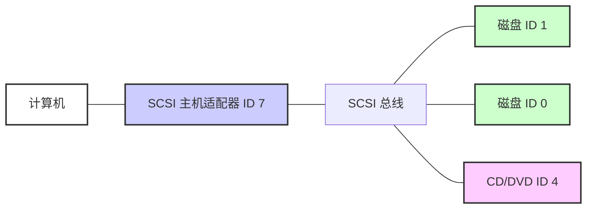

# 第3章：设备

本章将带你基本了解一个运行中的 Linux 系统中内核提供的设备基础设施。在 Linux 的发展历程中，内核向用户呈现设备的方式发生了许多变化。我们将首先考察传统的设备文件系统，看看内核如何通过 sysfs 提供设备配置信息。我们的目标是能够提取系统中设备的信息，以理解一些基础操作。后续章节将详细介绍与特定类型设备的交互。

理解内核在面对新设备时如何与用户空间交互至关重要。udev 系统使得用户空间程序能够自动配置和使用新设备。你将看到内核如何通过 udev 向用户空间进程发送消息，以及进程如何处理该消息。

## 3.1 设备文件

在 Unix 系统中操作大多数设备非常容易，因为内核将许多设备的 I/O 接口以文件的形式呈现给用户进程。这些设备文件有时被称为**设备节点**。除了程序员可以通过常规文件操作来使用设备外，有些设备甚至可以被 `cat` 这样的标准程序访问，因此你不必是程序员也能使用设备。然而，文件接口的功能是有限的，并非所有设备或设备功能都能通过标准文件 I/O 访问。

Linux 与其他 Unix 变体采用相同的设备文件设计。设备文件位于 `/dev` 目录下，运行 `ls /dev` 会显示 `/dev` 中有相当多的文件。那么，如何使用设备呢？

首先，考虑以下命令：

```bash
$ echo blah blah > /dev/null
```

与任何带有重定向输出的命令一样，这条命令将一些内容从标准输出发送到一个文件。然而，这个文件是 `/dev/null`，一个设备，因此内核会绕过通常的文件操作，而使用一个设备驱动程序来处理写入该设备的数据。在 `/dev/null` 的情况下，内核只是接受输入数据并将其丢弃。

要识别设备并查看其权限，请使用 `ls -l`。以下是一些示例：

```bash
$ ls -l
brw-rw----   1 root disk 8, 1 Sep  6 08:37 sda1
crw-rw-rw-   1 root root 1, 3 Sep  6 08:37 null
prw-r--r--   1 root root    0 Mar  3 19:17 fdata
srw-rw-rw-   1 root root    0 Dec 18 07:43 log
```

注意每一行的第一个字符（文件模式的首字符）。如果这个字符是 `b`、`c`、`p` 或 `s`，那么该文件就是一个设备。这些字母分别代表**块设备**、**字符设备**、**管道设备**和**套接字设备**：

- **块设备**：程序以固定大小的数据块访问块设备。前述例子中的 `sda1` 是一个磁盘设备，属于块设备类型。磁盘可以很容易地分割成数据块。由于块设备的总大小固定且易于索引，进程可以在内核的帮助下快速随机访问设备中的任意数据块。
- **字符设备**：字符设备处理数据流。你只能从字符设备读取字符或向字符设备写入字符，正如之前演示的 `/dev/null` 所示。字符设备没有大小；当你读取或写入字符设备时，内核通常会对其执行一次读或写操作。直接连接到计算机的打印机由字符设备表示。需要注意的是，在与字符设备交互期间，一旦数据传递给设备或进程，内核无法回溯并重新检查数据流。
- **管道设备**：命名管道类似于字符设备，但 I/O 流的另一端是另一个进程，而不是内核驱动程序。
- **套接字设备**：套接字是特殊用途的接口，常用于进程间通信。它们通常不在 `/dev` 目录下。套接字文件代表 Unix 域套接字；你将在第 10 章了解更多。

在 `ls -l` 对块设备和字符设备的文件列表中，日期之前的数字是**主设备号**和**次设备号**，内核使用它们来标识设备。类似的设备通常具有相同的主设备号，例如 `sda3` 和 `sdb1`（两者都是硬盘分区）。

> [!NOTE]
> 并非所有设备都有设备文件，因为块设备和字符设备的 I/O 接口并不适用于所有情况。例如，网络接口没有设备文件。理论上可以使用单个字符设备与网络接口交互，但这会很困难，因此内核提供了其他 I/O 接口。

## 3.2 sysfs 设备路径

传统的 Unix `/dev` 目录是用户进程引用和与内核支持的设备交互的便捷方式，但这个方案也非常简单。`/dev` 中设备的名字能告诉你一些关于设备的信息，但通常不足以提供帮助。另一个问题是内核按照设备被发现的顺序分配设备名，因此设备在重启后可能会有不同的名称。

为了根据设备实际的硬件属性提供统一的已连接设备视图，Linux 内核通过一组文件和目录提供了 sysfs 接口。设备的基础路径是 `/sys/devices`。例如，位于 `/dev/sda` 的 SATA 硬盘在 sysfs 中可能具有以下路径：

```bash
/sys/devices/pci0000:00/0000:00:17.0/ata3/host0/target0:0:0/0:0:0:0/block/sda
```

如你所见，这个路径比 `/dev/sda` 文件名长得多，同时这也是一个目录。但你不能真正比较这两个路径，因为它们的目的不同。`/dev` 文件使进程能够使用设备，而 `/sys/devices` 路径用于查看信息和管理设备。如果你列出像前面那样的设备路径的内容，会看到类似下面的内容：

```bash
alignment_offset  discard_alignment  holders   removable  size       uevent
bdi               events             inflight  ro         slaves
capability        events_async       power     sda1       stat
dev               events_poll_msecs  queue     sda2       subsystem
device            ext_range          range     sda5       trace
```

这里的文件和子目录主要是给程序读取的，而不是人，但你可以通过查看诸如 `/dev` 文件这样的例子来了解它们包含和代表什么。在这个目录中运行 `cat dev` 会显示数字 `8:0`，而这恰好是 `/dev/sda` 的主设备号和次设备号。

`/sys` 目录中有一些快捷方式。例如，`/sys/block` 应该包含系统中所有可用的块设备。然而，这些只是符号链接；你可以运行 `ls -l /sys/block` 来查看真正的 sysfs 路径。

找到 `/dev` 中某个设备的 sysfs 位置可能会比较困难。使用以下 `udevadm` 命令可以显示路径和其他几个有趣的属性：

```bash
$ udevadm info --query=all --name=/dev/sda
```

你将在 3.5 节找到关于 `udevadm` 以及整个 udev 系统的更多细节。

## 3.3 dd 与设备

程序 `dd` 在处理块设备和字符设备时非常有用。它的唯一功能是从输入文件或流读取数据，并写入输出文件或流，其间可能进行一些编码转换。关于块设备，`dd` 的一个特别有用的功能是你可以处理文件中间的一块数据，而忽略前后部分。

> [!WARNING]
> `dd` 功能非常强大，因此运行它时请确保你清楚自己在做什么。粗心大意的错误很容易损坏文件和设备上的数据。如果你不确定它的作用，通常最好将输出写入一个新文件。

`dd` 以固定大小的块复制数据。以下是如何使用 `dd` 与字符设备配合的示例，其中使用了几个常见选项：

```bash
$ dd if=/dev/zero of=new_file bs=1024 count=1
```

如你所见，`dd` 的选项格式与大多数其他 Unix 命令不同；它基于一种古老的 IBM 作业控制语言（JCL）风格。它不使用破折号（`-`）来标志选项，而是直接命名选项并设置其值，使用等号（`=`）。上面的示例从 `/dev/zero`（一个连续的零字节流）复制单个 1024 字节的块到 `new_file`。

以下是一些重要的 `dd` 选项：

- `if=file`：输入文件。默认为标准输入。
- `of=file`：输出文件。默认为标准输出。
- `bs=size`：块大小。`dd` 每次读取和写入这么多字节的数据。要缩写大块数据，可以使用 `b` 和 `k` 分别表示 512 和 1024 字节。因此，上面的示例可以写成 `bs=1k` 而不是 `bs=1024`。
- `ibs=size`、`obs=size`：输入和输出块大小。如果输入和输出可以使用相同的块大小，则使用 `bs` 选项；否则，分别使用 `ibs` 和 `obs` 指定输入和输出的块大小。
- `count=num`：要复制的总块数。当处理大文件或提供无限数据流的设备（如 `/dev/zero`）时，你希望 `dd` 在固定点停止；否则，可能会浪费大量磁盘空间、CPU 时间或两者。常结合 `skip` 参数使用 `count` 来从大文件或设备中复制一小块。
- `skip=num`：跳过输入文件或流中的前 `num` 个块，不将它们复制到输出。

## 3.4 设备名称总结

有时很难找到设备的名称（例如，在分区磁盘时）。以下是几种找出设备名称的方法：

- 使用 `udevadm` 查询 `udevd`（见 3.5 节）。
- 在 `/sys` 目录中查找该设备。
- 从 `journalctl -k` 命令（打印内核消息）或内核系统日志（见 7.1 节）的输出中猜测名称。这些输出可能包含系统中设备的描述。
- 对于系统中已经可见的磁盘设备，可以检查 `mount` 命令的输出。
- 运行 `cat /proc/devices` 查看系统当前拥有驱动程序的块设备和字符设备。每一行包含一个数字和一个名称。数字是 3.1 节中描述的主设备号。如果你能根据名称猜测出设备，那么在 `/dev` 中查找具有相应主设备号的字符或块设备，你就找到了设备文件。

在这些方法中，只有第一种是可靠的，但它需要 udev。如果你遇到 udev 不可用的情况，可以尝试其他方法，但请记住内核可能没有为你的硬件提供设备文件。

以下各节列出了最常见的 Linux 设备及其命名约定。

### 3.4.1 硬盘：/dev/sd\*

当前 Linux 系统上的大多数硬盘对应以 `sd` 为前缀的设备名称，例如 `/dev/sda`、`/dev/sdb` 等。这些设备代表整个磁盘；内核为磁盘上的分区创建单独的设备文件，如 `/dev/sda1`、`/dev/sda2`。

命名约定需要稍作解释。名称中的 `sd` 部分代表 **SCSI 磁盘**。**小型计算机系统接口（SCSI）** 最初是为磁盘及其他外围设备之间的通信而开发的硬件和协议标准。尽管传统 SCSI 硬件已不在大多数现代机器中使用，但 SCSI 协议因其适应性而无处不在。例如，USB 存储设备使用它与系统通信。至于 SATA（串行 ATA，PC 上常见的存储总线）磁盘，情况稍复杂，但 Linux 内核在与它们通信时，在某个层面仍使用 SCSI 命令。

要列出系统上的 SCSI 设备，可使用一个遍历 sysfs 提供的设备路径的工具。其中最简洁的工具之一是 `lsscsi`。运行它时你会看到类似下面的输出：

```bash
$ lsscsi
[0:0:0:0]    disk    ATA     WDC WD3200AAJS-2  01.0   /dev/sda
[2:0:0:0]    disk    FLASH   Drive UT_USB20    0.00   /dev/sdb
```

第一列 [1] 标识设备在系统中的地址，第二列 [2] 描述设备类型，最后一列 [3] 指出设备文件的位置。其余为供应商信息。

Linux 按驱动程序遇到设备的顺序将设备分配给设备文件。因此，在前面的例子中，内核先找到硬盘，然后找到闪存盘。

不幸的是，这种设备分配方案在重新配置硬件时传统上会引起问题。例如，假设系统有三个磁盘：`/dev/sda`、`/dev/sdb` 和 `/dev/sdc`。如果 `/dev/sdb` 损坏，你必须将其移除才能使机器正常工作，那么原来的 `/dev/sdc` 就会变成 `/dev/sdb`，而 `/dev/sdc` 不再存在。如果你在 fstab 文件（参见第 4.2.8 节）中直接引用了设备名称，那么必须修改该文件才能让系统（基本）恢复正常。为了解决这个问题，许多 Linux 系统使用 **通用唯一标识符（UUID）**（参见第 4.2.4 节）和/或 **逻辑卷管理器（LVM）** 的稳定磁盘设备映射。

> [!NOTE] 设备分配问题
> 依赖 `/dev/sd*` 名称可能导致设备顺序变化，推荐使用 UUID 或 LVM 实现稳定映射。

这里对 Linux 系统上使用磁盘和其他存储设备的讨论仅触及皮毛。有关使用磁盘的更多信息，请参见第 4 章。在本章后面，我们将探讨 SCSI 支持在 Linux 内核中如何工作。

### 3.4.2 虚拟磁盘：/dev/xvd\*、/dev/vd\*

某些磁盘设备针对虚拟机（如 AWS 实例和 VirtualBox）进行了优化。Xen 虚拟化系统使用 `/dev/xvd` 前缀，而 `/dev/vd` 是类似类型。

### 3.4.3 非易失性内存设备：/dev/nvme\*

现在有些系统使用 **非易失性内存快速通道（NVMe）** 接口与某些固态存储进行通信。在 Linux 中，这些设备显示为 `/dev/nvme*`。你可以使用 `nvme list` 命令获取系统上的这些设备列表。

### 3.4.4 设备映射器：/dev/dm-\*、/dev/mapper/\*

在某些系统上，LVM 比磁盘和其他直接块存储高一个层次，它使用一个名为 **设备映射器** 的内核系统。如果你看到以 `/dev/dm-` 开头的块设备和 `/dev/mapper` 中的符号链接，那么你的系统很可能使用了它。你将在第 4 章全面了解这部分内容。

### 3.4.5 CD 和 DVD 驱动器：/dev/sr\*

Linux 将大多数光存储驱动器识别为 SCSI 设备 `/dev/sr0`、`/dev/sr1` 等。但是，如果驱动器使用较旧的接口，它可能会显示为 PATA 设备（见下文）。`/dev/sr*` 设备是只读的，仅用于从光盘读取数据。对于光学设备的写入和重写功能，你应使用“通用”SCSI 设备，如 `/dev/sg0`。

### 3.4.6 PATA 硬盘：/dev/hd\*

**PATA（并行 ATA）** 是一种较旧类型的存储总线。Linux 块设备 `/dev/hda`、`/dev/hdb`、`/dev/hdc` 和 `/dev/hdd` 常见于较旧版本的 Linux 内核和较旧的硬件。这些是基于接口 0 和 1 上的设备对的固定分配。有时你可能会发现 SATA 驱动器被识别为这些磁盘之一。这意味着 SATA 驱动器运行在兼容模式下，这会降低性能。请检查 BIOS 设置，看看是否可以将 SATA 控制器切换到原生模式。

### 3.4.7 终端：/dev/tty\*、/dev/pts/\* 和 /dev/tty

终端是用于在用户进程和 I/O 设备之间传送字符的设备，通常用于在终端屏幕上进行文本输出。终端设备接口的历史可以追溯到很早以前，当时终端是基于打字机的设备，并且许多终端都连接到一台机器上。

大多数终端是 **伪终端设备**，即能够理解真实终端 I/O 特性的模拟终端。内核不会与真正的硬件打交道，而是将 I/O 接口呈现给一个软件，例如你很可能用来输入大部分命令的 shell 终端窗口。

两种常见的终端设备是 `/dev/tty1`（第一个虚拟控制台）和 `/dev/pts/0`（第一个伪终端设备）。`/dev/pts` 目录本身是一个专用文件系统。

`/dev/tty` 设备是当前进程的控制终端。如果一个程序当前正在从终端读取和写入，那么这个设备就是该终端的同义词。进程不需要附加到终端。

#### 显示模式与虚拟控制台

Linux 主要有两种显示模式：**文本模式** 和 **图形模式**（第 14 章介绍使用图形模式的窗口系统）。尽管 Linux 系统传统上以文本模式启动，但现在大多数发行版使用内核参数和临时图形显示机制（如 plymouth 的启动画面）来完全隐藏系统启动时的文本模式。在这种情况下，系统会在启动过程接近尾声时切换到全图形模式。

Linux 支持 **虚拟控制台** 来复用显示器。每个虚拟控制台可以在图形模式或文本模式下运行。在文本模式下，你可以使用 **ALT-功能键** 组合键在控制台之间切换——例如，ALT-F1 转到 `/dev/tty1`，ALT-F2 转到 `/dev/tty2`，以此类推。许多这样的虚拟控制台可能被运行登录提示符的 getty 进程占用，如第 7.4 节所述。

用于图形模式的虚拟控制台略有不同。图形环境不会从初始化配置中获得虚拟控制台分配，而是占用一个空闲的虚拟控制台，除非被指定使用特定的控制台。例如，如果 tty1 和 tty2 上运行着 getty 进程，那么新的图形环境将会占用 tty3。此外，一旦进入图形模式，你必须通常按 **CTRL-ALT-功能键** 组合键才能切换到另一个虚拟控制台，而不是简单的 **ALT-功能键** 组合键。

所有这些的要点是，如果你想在系统启动后看到文本控制台，请按 **CTRL-ALT-F1**。要返回图形环境，请按 ALT-F2、ALT-F3 等，直到返回图形环境。

> [!NOTE] 注意
> 某些发行版在图形模式中使用 tty1。在这种情况下，你需要尝试其他控制台。

如果你因输入机制故障或其他情况而无法切换控制台，可以尝试使用 `chvt` 命令强制系统更改控制台。例如，要切换到 tty1，以 root 身份运行以下命令：

```bash
# chvt 1
```

### 3.4.8 串行端口：/dev/ttyS\*、/dev/ttyUSB\*、/dev/ttyACM\*

较老的 RS-232 类型及类似的串行端口被表示为真正的终端设备。在命令行上对串行端口设备能做的事情不多，因为有太多设置需要关注，例如波特率和流控制，但你可以使用 `screen` 命令并添加设备路径作为参数来连接到终端。你可能需要对该设备具有读写权限；有时可以通过将你自己添加到某个特定组（如 `dialout`）来实现。

Windows 上的 COM1 端口对应于 `/dev/ttyS0`，COM2 对应于 `/dev/ttyS1`，以此类推。插入式 USB 串行适配器会显示为 USB 和 ACM 设备，名称分别为 `/dev/ttyUSB0`、`/dev/ttyACM0`、`/dev/ttyUSB1`、`/dev/ttyACM1` 等。

串行端口最有趣的应用之一是基于微控制器板，你可以将它们插入到 Linux 系统中进行开发和测试。例如，你可以通过 USB 串行接口访问 CircuitPython 板的控制台和读取-求值-打印循环。你只需插入一个，找到设备（通常是 `/dev/ttyACM0`），然后使用 `screen` 连接到它。

### 3.4.9 并行端口：/dev/lp0 和 /dev/lp1

表示一种已被 USB 和网络大量取代的接口类型，单向并行端口设备 `/dev/lp0` 和 `/dev/lp1` 对应于 Windows 中的 LPT1: 和 LPT2:。你可以使用 `cat` 命令将文件（例如要打印的文件）直接发送到并行端口，但之后你可能需要给打印机额外的换页或重置。像 CUPS 这样的打印服务器在处理与打印机的交互方面要好得多。

双向并行端口是 `/dev/parport0` 和 `/dev/parport1`。

### 3.4.10 音频设备：/dev/snd/\*、/dev/dsp、/dev/audio 等

Linux 有两组音频设备。有用于 **高级 Linux 声音体系结构（ALSA）** 系统接口的独立设备，以及用于较老的 **开放声音系统（OSS）** 的设备。ALSA 设备位于 `/dev/snd` 目录中，但直接使用它们很困难。如果已加载 OSS 内核支持，使用 ALSA 的 Linux 系统会支持向后兼容的 OSS 设备。

通过 OSS 的 `dsp` 和 `audio` 设备可以实现一些基本的操作。例如，计算机将你发送到 `/dev/dsp` 的任何 WAV 文件播放出来。然而，由于频率不匹配，硬件可能不会按预期工作。此外，在大多数系统上，一旦你登录，该设备通常就被占用了。

> [!NOTE] 注意
> Linux 声音是一个混乱的主题，因为它涉及许多层次。我们刚刚讨论了内核级别的设备，但通常还有用户空间的服务器（如 pulseaudio）来管理来自不同源的音频，并充当声音设备与其他用户空间进程之间的中介。

### 3.4.11 设备文件创建

在任何相对较新的 Linux 系统上，你并不自己创建设备文件；它们由 `devtmpfs` 和 `udev` 创建（参见第 3.5 节）。不过，了解如何创建还是有启发作用的，并且在极少数情况下，你可能需要创建一个命名管道或套接字文件。

`mknod` 命令用于创建单个设备。你必须知道设备名称及其主设备号和次设备号。例如，创建 `/dev/sda1` 的命令如下：

```bash
# mknod /dev/sda1 b 8 1
```

（此处原文未提供完整命令，但通常格式如此。假设原文在“例如，创建 /dev/sda1 是使用以下命令的问题：”后未给出，但根据上下文，我们可补写完整命令 `b 8 1` 作为示例。原文可能缺失了命令内容，但这里根据 mknod 用法补充一个合理命令。注意：原文“例如，创建 /dev/sda1 是一件事以下命令的事：” 翻译时改为“例如，创建 /dev/sda1 的命令如下：” 并补全命令。）

> [!TIP] 设备文件手动创建
> 在现代系统上，通常不需要手动创建块设备或字符设备，因为 udev 会自动处理。但 `mknod` 在极小的系统或恢复环境中仍可能有用。

# 第3章：设备

`mknod` 命令用于创建设备。你必须知道设备名称及其主次编号。例如，创建 `/dev/sda1` 只需使用以下命令：

```bash
# mknod /dev/sda1 b 8 1
```

其中的 `b 8 1` 指定了一个主编号为 8、次编号为 1 的块设备。对于字符设备或命名管道，应使用 `c` 或 `p` 代替 `b`（命名管道省略主次编号）。

在较早版本的 Unix 和 Linux 中，维护 `/dev` 目录是一项挑战。每次内核重大升级或添加驱动程序时，内核可能支持更多种类的设备，这意味着会有一组新的主次编号需要分配给设备文件名。为了应对这种维护挑战，每个系统中都有一个位于 `/dev` 中的 `MAKEDEV` 程序，用于创建一组设备。当你升级系统时，你会尝试找到 `MAKEDEV` 的更新版本，然后运行它以创建新设备。

这种静态系统变得笨重不堪，因此需要一种替代方案。第一次尝试修复它是 `devfs`，这是一个内核空间实现的 `/dev`，包含了当前内核支持的所有设备。然而，它存在许多局限性，这导致了 `udev` 和 `devtmpfs` 的开发。

## 3.5 udev

我们已经讨论过内核中不必要的复杂性是危险的，因为它很容易引入系统不稳定。设备文件管理就是一个例子：你可以在用户空间创建设备文件，那么为什么要在内核中做这件事呢？Linux 内核可以在检测到系统上出现新设备时（例如，当有人插入 USB 闪存驱动器时），向一个名为 `udevd` 的用户空间进程发送通知。这个 `udevd` 进程可以检查新设备的特性，创建设备文件，然后执行任何设备初始化操作。

> [!NOTE]
> 你几乎肯定会在你的系统上看到 `udevd` 以 `systemd-udevd` 的形式运行，因为它是启动机制的一部分（你将在第 6 章中看到）。

理论上是这样。不幸的是，这种方法存在一个问题——设备文件在引导过程的早期是必需的，因此 `udevd` 也必须尽早启动。但为了创建设备文件，`udevd` 不能依赖于它本应创建的任何设备，并且它需要非常快速地完成初始启动，这样系统的其余部分就不会因为等待 `udevd` 启动而停滞。

### 3.5.1 devtmpfs

`devtmpfs` 文件系统是为了解决启动期间设备可用性问题而开发的（有关文件系统的更多详细信息，请参见 4.2 节）。这个文件系统类似于旧的 `devfs` 支持，但更简化。内核根据需要创建设备文件，但也会通知 `udevd` 新设备可用。收到此信号后，`udevd` 不会创建设备文件，但它会执行设备初始化、设置权限，并通知其他进程新设备可用。此外，它还在 `/dev` 中创建许多符号链接以进一步标识设备。你可以在 `/dev/disk/by-id` 目录中找到示例，其中每个连接的磁盘都有一个或多个条目。

例如，考虑一个典型磁盘（连接到 `/dev/sda`）及其在 `/dev/disk/by-id` 中的分区链接：

```bash
$ ls -l /dev/disk/by-id
lrwxrwxrwx 1 root root  9 Jul 26 10:23 scsi-SATA_WDC_WD3200AAJS-_WD-WMAV2FU80671 -> ../../sda
lrwxrwxrwx 1 root root 10 Jul 26 10:23 scsi-SATA_WDC_WD3200AAJS-_WD-WMAV2FU80671-part1 ->
../../sda1
lrwxrwxrwx 1 root root 10 Jul 26 10:23 scsi-SATA_WDC_WD3200AAJS-_WD-WMAV2FU80671-part2 ->
../../sda2
lrwxrwxrwx 1 root root 10 Jul 26 10:23 scsi-SATA_WDC_WD3200AAJS-_WD-WMAV2FU80671-part5 ->
../../sda5
```

`udevd` 进程按接口类型命名链接，然后按制造商和型号信息、序列号以及分区（如果适用）命名。

> [!NOTE]
> `devtmpfs` 中的“tmp”表示该文件系统位于主内存中，并且用户空间进程具有读写能力；这一特性使得 `udevd` 能够创建这些符号链接。我们将在 4.2.12 节中看到更多细节。

但是 `udevd` 如何知道要创建哪些符号链接，以及如何创建它们呢？下一节将描述 `udevd` 的工作方式。不过，你不需要了解这些内容或本章其余部分的内容也能继续阅读本书。事实上，如果这是你第一次接触 Linux 设备，强烈建议你跳到下一章，开始学习如何使用磁盘。

### 3.5.2 udevd 操作与配置

`udevd` 守护进程的工作方式如下：

1.  内核通过内部网络链接向 `udevd` 发送一个通知事件，称为 **uevent**。
2.  `udevd` 加载 uevent 中的所有属性。
3.  `udevd` 解析其规则，根据这些规则过滤和更新 uevent，并相应地执行操作或设置更多属性。

`udevd` 从内核接收的一个传入 uevent 可能如下所示（你将在 3.5.4 节中学习如何使用 `udevadm monitor --property` 命令获取此输出）：

```
ACTION=change
DEVNAME=sde
DEVPATH=/devices/pci0000:00/0000:00:1a.0/usb1/1-1/1-1.2/1-1.2:1.0/host4/
target4:0:0/4:0:0:3/block/sde
DEVTYPE=disk
DISK_MEDIA_CHANGE=1
MAJOR=8
MINOR=64
SEQNUM=2752
SUBSYSTEM=block
UDEV_LOG=3
```

这个特定事件是对设备的一个更改。收到 uevent 后，`udevd` 就知道了设备名称、sysfs 设备路径以及其他许多与属性相关的信息；现在它准备好开始处理规则了。

规则文件位于 `/lib/udev/rules.d` 和 `/etc/udev/rules.d` 目录中。`/lib` 中的规则是默认规则，`/etc` 中的规则是覆盖规则。完整解释规则会变得冗长，你可以从 `udev(7)` 手册页中学到更多，但这里有一些关于 `udevd` 如何读取规则的基本信息：

1.  `udevd` 从头到尾读取一个规则文件。
2.  读取一条规则并可能执行其操作后，`udevd` 继续读取当前规则文件以寻找更多适用的规则。
3.  有些指令（如 `GOTO`）可以在必要时跳过规则文件的部分内容。这些指令通常放在规则文件的顶部，用于在某个特定设备与 `udevd` 正在配置的设备无关时跳过整个文件。

让我们看看 3.5.1 节中 `/dev/sda` 示例的符号链接。这些链接是由 `/lib/udev/rules.d/60-persistent-storage.rules` 中的规则定义的。在该文件内部，你会看到以下行：

```
# ATA
KERNEL=="sd*[!0-9]|sr*", ENV{ID_SERIAL}!="?*", SUBSYSTEMS=="scsi", ATTRS{vendor}=="ATA", 
IMPORT{program}="ata_id --export $devnode"
# ATAPI devices (SPC-3 or later)
KERNEL=="sd*[!0-9]|sr*", ENV{ID_SERIAL}!="?*", SUBSYSTEMS=="scsi", ATTRS{type}=="5",ATTRS{scsi_
level}=="[6-9]*", IMPORT{program}="ata_id --export $devnode"
```

这些规则匹配通过内核 SCSI 子系统（参见 3.6 节）呈现的 ATA 磁盘和光介质。你可以看到有几条规则用于捕获设备可能以不同方式表示的情况，但思路是 `udevd` 会尝试匹配以 `sd` 或 `sr` 开头但不带数字的设备（使用 `KERNEL=="sd*[!0-9]|sr*"` 表达式），以及子系统（`SUBSYSTEMS=="scsi"`），最后根据设备类型匹配一些其他属性。如果所有这些条件表达式在任一条规则中都为真，`udevd` 就会移动到下一个也是最后一个表达式：

```
IMPORT{program}="ata_id --export $tempnode"
```

这不是一个条件，而是一个指令，用于从 `/lib/udev/ata_id` 命令导入变量。如果你有这样的磁盘，可以在命令行上亲自尝试。它将如下所示：

```bash
# /lib/udev/ata_id --export /dev/sda
ID_ATA=1
ID_TYPE=disk
ID_BUS=ata
ID_MODEL=WDC_WD3200AAJS-22L7A0
ID_MODEL_ENC=WDC\x20WD3200AAJS22L7A0\x20\x20\x20\x20\x20\x20\x20\x20\x20\x20
\x20\x20\x20\x20\x20\x20\x20\x20\x20
ID_REVISION=01.03E10
ID_SERIAL=WDC_WD3200AAJS-22L7A0_WD-WMAV2FU80671
--snip--
```

现在导入设置了环境，使得该输出中的所有变量名称都设置为所示的值。例如，任何后续规则现在都会将 `ENV{ID_TYPE}` 识别为 `disk`。

在我们看到的这两条规则中，特别值得注意的是 `ID_SERIAL`。在每条规则中，这个条件出现在第二位：

```
ENV{ID_SERIAL}!="?*"
```

如果 `ID_SERIAL` 未设置，则此表达式求值为真。因此，如果 `ID_SERIAL` 已设置，条件为假，整个当前规则不适用，`udevd` 会移动到下一条规则。

为什么这里要有这个条件？这两条规则的目的是运行 `ata_id` 来查找磁盘设备的序列号，然后将这些属性添加到 uevent 的当前工作副本中。你会在许多 `udev` 规则中看到这种通用模式。

设置了 `ENV{ID_SERIAL}` 后，`udevd` 现在可以在规则文件后面评估这条规则，该规则查找任何连接的 SCSI 磁盘：

```
KERNEL=="sd*|sr*|cciss*", ENV{DEVTYPE}=="disk", ENV{ID_
SERIAL}=="?*",SYMLINK+="disk/by-id/$env{ID_BUS}-$env{ID_SERIAL}"
```

你可以看到这条规则要求设置 `ENV{ID_SERIAL}`，并且它有一个指令：

```
SYMLINK+="disk/by-id/$env{ID_BUS}-$env{ID_SERIAL}"
```

这个指令告诉 `udevd` 为传入的设备添加一个符号链接。现在你知道设备符号链接是从哪里来的了！

你可能想知道如何区分条件表达式和指令。条件由两个等号（`==`）或一个不等号（`!=`）表示，而指令由单个等号（`=`）、加等号（`+=`）或冒号等号（`:=`）表示。

### 3.5.3 udevadm

`udevadm` 程序是 `udevd` 的管理工具。你可以重新加载 `udevd` 规则和触发事件，但 `udevadm` 最强大的功能可能是搜索和探索系统设备，以及监控 `udevd` 从内核接收的 uevent。不过，命令语法可能有些复杂。大多数选项有长格式和短格式；这里我们使用长格式。

让我们从检查一个系统设备开始。回到 3.5.2 节的例子，为了查看与某个设备（如 `/dev/sda`）规则相关的所有 `udev` 属性以及生成的属性，运行以下命令：

```bash
$ udevadm info --query=all --name=/dev/sda
```

输出如下所示：

```
P: /devices/pci0000:00/0000:00:1f.2/host0/target0:0:0/0:0:0:0/block/sda
N: sda
S: disk/by-id/ata-WDC_WD3200AAJS-22L7A0_WD-WMAV2FU80671
S: disk/by-id/scsi-SATA_WDC_WD3200AAJS-_WD-WMAV2FU80671
S: disk/by-id/wwn-0x50014ee057faef84
S: disk/by-path/pci-0000:00:1f.2-scsi-0:0:0:0
E: DEVLINKS=/dev/disk/by-id/ata-WDC_WD3200AAJS-22L7A0_WD-WMAV2FU80671 /dev/
disk/by-id/scsi
-SATA_WDC_WD3200AAJS-_WD-WMAV2FU80671 /dev/disk/by-id/wwn-0x50014ee057faef84 /
dev/disk/by
-path/pci-0000:00:1f.2-scsi-0:0:0:0
E: DEVNAME=/dev/sda
E: DEVPATH=/devices/pci0000:00/0000:00:1f.2/host0/target0:0:0/0:0:0:0/block/
sda
E: DEVTYPE=disk
E: ID_ATA=1
E: ID_ATA_DOWNLOAD_MICROCODE=1
E: ID_ATA_FEATURE_SET_AAM=1
--snip--
```

每行中的前缀表示设备的一个属性或其他特征。在这种情况下，顶部的 `P:` 是 sysfs 设备路径，`N:` 是设备节点（即赋予 `/dev` 文件的名称），`S:` 表示指向设备节点的符号链接（由 `udevd` 根据其规则放置在 `/dev` 中），`E:` 是 `udevd` 规则中提取的额外设备信息。（此示例的输出远比这里显示的要多；请亲自尝试该命令以感受其功能。）

# 第3章：设备

### 3.5.4 设备监控

使用 `udevadm` 监控 uevent，执行 `monitor` 命令：

```bash
$ udevadm monitor
```

输出（例如，当你插入一个闪存介质设备时）类似以下缩写示例：

```
KERNEL[658299.569485] add /devices/pci0000:00/0000:00:1d.0/usb2/2-1/2-1.2 (usb)
KERNEL[658299.569667] add /devices/pci0000:00/0000:00:1d.0/usb2/2-1/2-1.2/2-1.2:1.0 (usb)
KERNEL[658299.570614] add /devices/pci0000:00/0000:00:1d.0/usb2/2-1/2-1.2/2-1.2:1.0/host15 (scsi)
KERNEL[658299.570645] add /devices/pci0000:00/0000:00:1d.0/usb2/2-1/2-1.2/2-1.2:1.0/host15/scsi_host/host15 (scsi_host)
UDEV [658299.622579] add /devices/pci0000:00/0000:00:1d.0/usb2/2-1/2-1.2 (usb)
UDEV [658299.623014] add /devices/pci0000:00/0000:00:1d.0/usb2/2-1/2-1.2/2-1.2:1.0 (usb)
UDEV [658299.623673] add /devices/pci0000:00/0000:00:1d.0/usb2/2-1/2-1.2/2-1.2:1.0/host15 (scsi)
UDEV [658299.623690] add /devices/pci0000:00/0000:00:1d.0/usb2/2-1/2-1.2/2-1.2:1.0/host15/scsi_host/host15 (scsi_host)
--snip--
```

输出中每条消息会有两份副本，因为默认行为会同时打印来自内核的传入消息（标记为 `KERNEL`）和来自 udevd 的处理消息。若只想查看内核事件，添加 `--kernel` 选项；若只想查看 udevd 处理事件，使用 `--udev`。若要查看完整的传入 uevent，包括如第 3.5.2 节所示的属性，使用 `--property` 选项。同时使用 `--udev` 和 `--property` 选项可显示处理后的 uevent。

你也可以按子系统过滤事件。例如，仅查看与 SCSI 子系统变更相关的内核消息，使用以下命令：

```bash
$ udevadm monitor --kernel --subsystem-match=scsi
```

更多关于 `udevadm` 的信息，请参阅 `udevadm(8)` 手册页。

62 页 第3章

udev 还有更多内容。例如，有一个名为 `udisksd` 的守护进程，它监听事件以自动挂载磁盘，并通知其他进程新磁盘可用。

## 3.6 深入探讨：SCSI 与 Linux 内核

在本节中，我们将通过考察 Linux 内核中的 SCSI 支持，来探索 Linux 内核架构的一部分。你不需要了解这些信息就能使用磁盘，所以如果你急于使用磁盘，可以跳到第 4 章。此外，这里的材料比之前看到的更高级、更具理论性，所以如果你希望保持动手实践，绝对应该跳到下一章。

我们先从一些背景知识开始。传统的 SCSI 硬件设置是一个主机适配器通过 SCSI 总线与一串设备相连，如图 3-1 所示。主机适配器与计算机相连。主机适配器和设备各有自己的 SCSI ID，每条总线可以有 8 或 16 个 ID，具体取决于 SCSI 版本。一些管理员可能会使用术语 **SCSI 目标** 来指代设备及其 SCSI ID，因为 SCSI 协议中会话的一端称为目标。



**图 3-1：带有主机适配器和设备的 SCSI 总线**

任何设备都可以通过 SCSI 命令集以对等关系相互通信。计算机不直接连接到设备链，因此必须通过主机适配器才能与磁盘及其他设备通信。通常，计算机将 SCSI 命令发送给主机适配器，由主机适配器转发给设备，设备再通过主机适配器将响应传回。

较新版本的 SCSI，如 **串行连接 SCSI**（SAS），性能卓越，但大多数机器中你很可能找不到真正的 SCSI 设备。更常见的是使用 SCSI 命令的 USB 存储设备。此外，支持 ATAPI（如 CD/DVD-ROM 驱动器）的设备使用 SCSI 命令集的一个变体。

SATA 磁盘在系统中也显示为 SCSI 设备，但略有不同，因为它们大多通过 libata 库中的转换层进行通信（参见第 3.6.2 节）。某些 SATA 控制器（尤其是高性能 RAID 控制器）在硬件中执行此转换。

设备 63

这一切如何组合在一起？考虑以下系统中显示的设备：

```bash
$ lsscsi
[0:0:0:0]   disk    ATA       WDC WD3200AAJS-2  01.0  /dev/sda
[1:0:0:0]   cd/dvd  Slimtype  DVD A DS8A5SH     XA15  /dev/sr0
[2:0:0:0]   disk    USB2.0    CardReader CF     0100  /dev/sdb
[2:0:0:1]   disk    USB2.0    CardReader SM XD  0100  /dev/sdc
[2:0:0:2]   disk    USB2.0    CardReader MS     0100  /dev/sdd
[2:0:0:3]   disk    USB2.0    CardReader SD     0100  /dev/sde
[3:0:0:0]   disk    FLASH     Drive UT_USB20    0.00  /dev/sdf
```

方括号中的数字从左到右分别是：SCSI 主机适配器编号、SCSI 总线编号、设备 SCSI ID 和 **LUN**（逻辑单元号，设备内部进一步细分）。此示例中有四个连接的适配器（`scsi0`、`scsi1`、`scsi2` 和 `scsi3`），每个适配器有一条总线（总线号均为 0），每条总线上只有一个设备（目标均为 0）。但 USB 读卡器 `2:0:0` 有四个逻辑单元，分别对应可插入的每种闪存卡。内核为每个逻辑单元分配了不同的设备文件。

> [!NOTE] 注意
> 即使不是 SCSI 设备，NVMe 设备有时也会出现在 `lsscsi` 输出中，适配器编号显示为 `N`。
> 
> 如果你想自己尝试 `lsscsi`，可能需要将其作为附加包安装。

图 3-2 展示了该特定系统配置下，内核内部的驱动和接口层次结构，从各个设备驱动一直到块设备驱动。图中未包含 SCSI 通用（sg）驱动。

尽管这个结构庞大，初看可能令人不知所措，但图中的数据流非常线性。让我们从拆解 SCSI 子系统及其三层驱动开始分析：

- **顶层** 处理一类设备的操作。例如，`sd`（SCSI 磁盘）驱动位于此层；它知道如何将内核块设备接口的请求转换为 SCSI 协议中特定于磁盘的命令，反之亦然。
- **中间层** 协调和路由顶层与底层之间的 SCSI 消息，并跟踪系统中所有 SCSI 总线和设备。
- **底层** 处理硬件特定的操作。此处的驱动将外发的 SCSI 协议消息发送到特定主机适配器或硬件，并从硬件提取传入消息。与顶层分离的原因是，尽管对于同一设备类（如磁盘类），SCSI 消息是统一的，但不同类型的主机适配器发送相同消息的过程却各不相同。

64 页 第3章

```mermaid
graph TD
    subgraph 硬件层
        SATA_Disk[SATA 磁盘]
        CDDVD[CD/DVD]
        USB_Flash[USB 闪存盘]
        USB_CardReader[USB 读卡器(CF, xD, MS, SD)]
    end

    subgraph 内核
        subgraph 块设备接口
            /dev/sda, /dev/sr0, 等
        end
        subgraph SCSI 子系统
            Disk_Driver[sd(磁盘驱动)]
            CDDVD_Driver[sr(CD/DVD 驱动)]
            SCSI_Mid[SCSI 协议与主机管理]
            ATA_Bridge[ATA 桥接]
            USB_Storage_Bridge[USB 存储桥接]
            libata[libata 转换器]
            SATA_Host_Driver[SATA 主机驱动]
        end
        subgraph USB 子系统
            USB_Storage_Driver[USB 存储驱动]
            USB_Core[USB 核心]
            USB_Host_Driver[USB 主机驱动]
        end
    end

    块设备接口 --> Disk_Driver
    块设备接口 --> CDDVD_Driver
    Disk_Driver --> SCSI_Mid
    CDDVD_Driver --> SCSI_Mid
    SCSI_Mid --> ATA_Bridge
    SCSI_Mid --> USB_Storage_Bridge
    ATA_Bridge --> libata
    libata --> SATA_Host_Driver
    SATA_Host_Driver --> SATA_Disk
    SATA_Host_Driver --> CDDVD
    USB_Storage_Bridge --> USB_Storage_Driver
    USB_Storage_Driver --> USB_Core
    USB_Core --> USB_Host_Driver
    USB_Host_Driver --> USB_Flash
    USB_Host_Driver --> USB_CardReader
    style /dev/sda, /dev/sr0, 等 fill:#f9f,stroke:#333,stroke-width:1px
    style 块设备接口 fill:#eef,stroke:#333,stroke-width:2px
    style SCSI 子系统 fill:#dfd,stroke:#333,stroke-width:2px
    style USB 子系统 fill:#ddf,stroke:#333,stroke-width:2px
    style 硬件层 fill:#fee,stroke:#333,stroke-width:2px
```

**图 3-2：Linux SCSI 子系统示意图**

顶层和底层包含许多不同的驱动，但重要的是要记住，对于系统上的任何一个设备文件，内核（几乎总是）使用一个顶层驱动和一个底层驱动。在我们的示例中，对于 `/dev/sda` 的磁盘，内核使用 `sd` 顶层驱动和 ATA 桥接底层驱动。

设备 65

有时你可能为一个硬件设备使用多个上层驱动（参见第 3.6.3 节）。对于真正的硬件 SCSI 设备，例如连接到 SCSI 主机适配器的磁盘或硬件 RAID 控制器，底层驱动直接与下层硬件通信。然而，对于大多数附加到 SCSI 子系统的硬件，情况则有所不同。

### 3.6.1 USB 存储与 SCSI

为了使 SCSI 子系统能够与常见的 USB 存储硬件通信，如图 3-2 所示，内核不仅需要一个底层的 SCSI 驱动。由 `/dev/sdf` 表示的 USB 闪存盘理解 SCSI 命令，但要真正与驱动器通信，内核需要知道如何通过 USB 系统进行传输。

从抽象层面看，USB 与 SCSI 非常相似——它也有设备类、总线和主机控制器。因此，Linux 内核包含一个三层 USB 子系统，与 SCSI 子系统非常相似：顶层是设备类驱动，中间是总线管理核心，底层是主机控制器驱动。正如 SCSI 子系统中组件之间传递 SCSI 命令一样，USB 子系统在其组件之间传递 USB 消息。甚至还有一个类似 `lsscsi` 的 `lsusb` 命令。

这里我们真正感兴趣的是顶层的 USB 存储驱动。该驱动充当一个转换器。一端驱动“说”SCSI，另一端“说”USB。由于存储硬件在其 USB 消息中包含了 SCSI 命令，驱动的工作相对简单：主要是重新打包数据。

在 SCSI 和 USB 子系统都就位的情况下，你几乎拥有与闪存盘通信所需的一切。最后一个缺失的环节是 SCSI 子系统中的底层驱动，因为 USB 存储驱动是 USB 子系统的一部分，而不是 SCSI 子系统的一部分。（出于组织原因，两个子系统不应共享一个驱动。）为了让这两个子系统相互通信，一个简单的底层 SCSI 桥接驱动连接到 USB 子系统的存储驱动。

### 3.6.2 SCSI 与 ATA

图 3-2 中显示的 SATA 硬盘和光驱都使用相同的 SATA 接口。为了将内核中特定于 SATA 的驱动连接到 SCSI 子系统，内核采用了一种桥接驱动，类似于 USB 驱动器，但机制不同且更复杂。光驱“说”ATAPI，这是编码在 ATA 协议中的 SCSI 命令的一个版本。然而，硬盘不使用 ATAPI，也不编码任何 SCSI 命令！

Linux 内核使用 `libata` 库的一部分，将 SATA（及 ATA）驱动器与 SCSI 子系统协调起来。对于使用 ATAPI 的光驱，这是一个相对简单的任务，只需将 SCSI 命令封装和解封装到 ATA 协议中。但对于硬盘，任务要复杂得多，因为库必须进行完整的命令转换。

66 页 第3章

光驱的工作类似于将一本英文书输入到计算机中。你不需要理解这本书的内容来执行这项任务，甚至不需要理解英语。但硬盘的任务更像是阅读一本德语书，并作为英文翻译输入到计算机中。在这种情况下，你需要同时理解这两种语言以及书的内容。

尽管存在这种困难，`libata` 仍然执行了此任务，使得 ATA/SATA 接口和设备能够附加到 SCSI 子系统上。（通常涉及的驱动不止图 3-2 中显示的一个 SATA 主机驱动，但为了简洁起见，没有全部显示。）

### 3.6.3 通用 SCSI 设备

当用户空间进程与 SCSI 子系统通信时，通常通过块设备层和/或位于 SCSI 设备类驱动程序（如 `sd` 或 `sr`）之上的其他内核服务来完成。换句话说，大多数用户进程无需了解 SCSI 设备或它们的命令。

然而，用户进程可以绕过设备类驱动程序，通过**通用设备**直接向设备发送 SCSI 协议命令。例如，考虑第 3.6 节描述的系统，但这次使用 `lsscsi` 的 `-g` 选项来显示通用设备：

```bash
$ lsscsi -g
[0:0:0:0]   disk    ATA       WDC WD3200AAJS-2  01.0  /dev/sda   /dev/sg0
[1:0:0:0]   cd/dvd  Slimtype  DVD A DS8A5SH     XA15  /dev/sr0   /dev/sg1
[2:0:0:0]   disk    USB2.0    CardReader CF     0100  /dev/sdb   /dev/sg2
[2:0:0:1]   disk    USB2.0    CardReader SM XD  0100  /dev/sdc   /dev/sg3
[2:0:0:2]   disk    USB2.0    CardReader MS     0100  /dev/sdd   /dev/sg4
[2:0:0:3]   disk    USB2.0    CardReader SD     0100  /dev/sde   /dev/sg5
[3:0:0:0]   disk    FLASH     Drive UT_USB20    0.00  /dev/sdf   /dev/sg6
```

除了通常的块设备文件外，每一行在最后一列还列出了一个 SCSI 通用设备文件 1。例如，光驱 `/dev/sr0` 的通用设备是 `/dev/sg1`。

为什么要使用通用设备？答案与内核代码的复杂性有关。随着任务变得复杂，最好将它们放在内核之外。考虑 CD/DVD 读取和写入。读取光盘是一个相当简单的操作，内核中有专门的驱动程序来处理。然而，写入光盘比读取困难得多，并且没有关键的系统服务依赖于写入操作。没有理由用这种活动来威胁内核空间。因此，在 Linux 中写入光盘时，你运行一个用户空间程序，该程序与通用 SCSI 设备（如 `/dev/sg1`）通信。这个程序可能比内核驱动程序效率稍低，但构建和维护起来容易得多。

> [!INFO] 通用设备用途
> 通用 SCSI 设备允许用户空间程序直接发送 SCSI 命令，而不需要经过设备类驱动程序。这在处理复杂或非标准操作（如光盘写入）时特别有用。

---

### 3.6.4 单个设备的多种访问方法

光驱从用户空间的两个访问点（`sr` 和 `sg`）在图 3-3 中为 Linux SCSI 子系统进行了说明（省略了 SCSI 下层以下的任何驱动程序）。进程 A 使用 `sr` 驱动程序从驱动器读取，进程 B 使用 `sg` 驱动程序向驱动器写入。但像这样的进程通常不会同时运行来访问同一个设备。

```
Linux Kernel
SCSI Subsystem
    Block Device Interface
    CD/DVD Driver (sr)
    Generic Driver (sg)
    SCSI Protocol and Host Management
    Lower-Layer Driver
User Process A (reads from drive)
User Process B (writes discs)
Optical Drive Hardware
```

> [!NOTE] 图 3-3 说明
> **图 3-3：光驱驱动程序示意图**
> 该图展示了光驱通过 `sr`（块设备接口）和 `sg`（通用驱动）两个路径访问内核 SCSI 子系统。用户进程 A 通过 `sr` 读取，用户进程 B 通过 `sg` 写入。

在图 3-3 中，进程 A 从块设备读取。但用户进程真的以这种方式读取数据吗？通常情况下，答案是否定的——不是直接读取。在块设备之上还有更多的层，对于硬盘还有更多的访问点，这将在下一章中学习。

> [!TIP] 
> 图中未显示 SCSI 下层以下的驱动程序，以简化表示。实际系统中可能涉及更多 SCSI 主机驱动程序。

---

[[第3章：设备]] | [[SCSI子系统]] | [[通用SCSI设备]] | [[块设备层]]