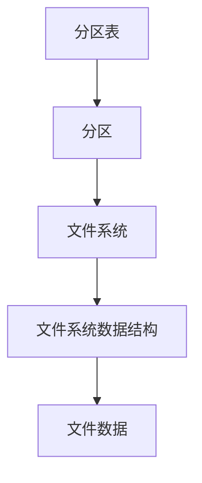

# 第4章：磁盘与文件系统

## 4 DISKS AND FILESYSTEMS

在第三章中，我们大致了解了内核提供的部分顶层磁盘设备。本章将详细讨论如何在Linux系统中处理磁盘。你将学习如何对磁盘进行分区、创建和维护分区内的文件系统，以及处理交换空间。

回想一下，磁盘设备的名称类似于 `/dev/sda`（第一个SCSI子系统磁盘）。这类块设备代表整个磁盘，但磁盘内部包含许多不同的组件和层次。

图4-1展示了一个简单Linux磁盘的示意图（注意，该图未按比例绘制）。随着本章内容的深入，你将了解每个部分的位置。


> [!NOTE]
> 图4-1说明：分区表 -> 分区 -> 文件系统 -> 文件系统数据结构 -> 文件数据。各部分层次关系如下。



分区是整个磁盘的细分。在Linux中，分区的标识是在整个块设备名称后加上数字，因此名称类似于 `/dev/sda1` 和 `/dev/sdb3`。内核将每个分区作为一个块设备呈现，就像处理整个磁盘一样。分区定义在磁盘上一个称为**分区表**（也称为**磁盘标签**）的小区域中。

> [!NOTE]
> 在过去的大磁盘系统上，多个数据分区很常见，因为老式PC只能从磁盘的特定部分启动。此外，管理员使用分区为操作系统区域保留一定空间；例如，他们不希望用户填满整个系统而阻止关键服务运行。这种做法并非Unix独有；你会发现许多新的Windows系统在单个磁盘上仍有多个分区。此外，大多数系统都有一个单独的交换分区。

内核允许你同时访问整个磁盘及其某个分区，但通常你不会这样做，除非要复制整个磁盘。

**Linux逻辑卷管理器（LVM）** 为传统的磁盘设备和分区增加了更多灵活性，现在许多系统都在使用它。我们将在4.4节介绍LVM。

分区之上的下一层是**文件系统**，即你在用户空间中习惯与之交互的文件和目录的数据库。我们将在4.2节探讨文件系统。

如图4-1所示，如果你要访问文件中的数据，你需要从分区表中找到适当的分区位置，然后在该分区上搜索文件系统数据库以找到所需的文件数据。

要访问磁盘上的数据，Linux内核使用图4-2所示的层次系统。SCSI子系统和3.6节描述的其他所有内容都由一个方框表示。请注意，你可以通过文件系统以及直接通过磁盘设备来处理磁盘。你将在本章中了解这两种工作方式。为简单起见，LVM未在图4-2中表示，但它在块设备接口中拥有组件，并且在用户空间中有一些管理组件。

为了理解所有部分如何协同工作，让我们从最底层的分区开始。


```mermaid
flowchart TD
    subgraph 用户进程
        A[用户进程]
    end
    subgraph Linux内核
        B[系统调用]
        C[设备文件(节点)]
        D[文件系统]
        E[块设备接口与分区映射]
        F[SCSI子系统及其他驱动程序]
    end
    subgraph 存储设备
        G[存储设备]
    end
    A -->|系统调用| B
    B --> C
    C --> D
    D --> E
    E --> F
    F --> G
    C -->|原始(直接)设备访问| E
```

## 4.1 磁盘设备分区

分区表有多种类型。分区表并没有什么特别之处——它只是一组描述磁盘块如何划分的数据。

传统分区表可追溯到PC时代，存在于**主引导记录（MBR）**中，但它有许多限制。较新的系统大多使用**全局唯一标识分区表（GPT）**。

以下是Linux中一些分区工具：

- **parted**（“分区编辑器”）——一种基于文本的工具，同时支持MBR和GPT。
- **gparted**——parted的图形版本。
- **fdisk**——传统的基于文本的Linux磁盘分区工具。最新版本的fdisk支持MBR、GPT以及许多其他类型的分区表，但旧版本只支持MBR。

由于parted长期以来同时支持MBR和GPT，并且易于通过单个命令获取分区标签，我们将使用parted来显示分区表。但在创建和修改分区表时，我们将使用fdisk。这将展示两种界面，以及为什么许多人更喜欢fdisk界面，因为它具有交互性，并且在你有机会审查之前不会对磁盘进行任何更改（我们稍后会讨论这一点）。

> [!NOTE]
> 分区和文件系统操作之间存在一个关键区别：分区表定义了磁盘上的简单边界，而文件系统是一个复杂得多的数据系统。因此，我们将使用不同的工具进行分区和创建文件系统（参见4.2.2节）。

### 4.1.1 查看分区表

你可以使用 `parted -l` 查看系统的分区表。以下示例输出显示两个磁盘设备，具有两种不同的分区表：

```bash
# parted -l
Model: ATA KINGSTON SM2280S (scsi)
1 Disk /dev/sda: 240GB
Sector size (logical/physical): 512B/512B
Partition Table: msdos
Disk Flags: 
Number  Start   End    Size    Type      File system     Flags
 1      1049kB  223GB  223GB   primary   ext4            boot
 2      223GB   240GB  17.0GB  extended
 5      223GB   240GB  17.0GB  logical   linux-swap(v1)
Model: Generic Flash Disk (scsi)
2 Disk /dev/sdf: 4284MB
Sector size (logical/physical): 512B/512B
Partition Table: gpt
Disk Flags: 
Number  Start   End     Size    File system  Name      Flags
 1      1049kB  1050MB  1049MB               myfirst
 2      1050MB  4284MB  3235MB               mysecond
```

第一个设备 `/dev/sda` ① 使用传统的MBR分区表（parted称之为msdos），第二个设备 `/dev/sdf` ② 包含GPT。请注意，两种表类型存储的参数集不同。特别是，MBR表没有Name列，因为该方案下不存在名称。（我在GPT中任意选择了 myfirst 和 mysecond 这些名称。）

> [!NOTE]
> 读取分区表时要注意单位大小。parted输出显示的是基于parted认为最容易读取的近似大小。另一方面，`fdisk -l` 显示精确数字，但在大多数情况下，单位是512字节的“扇区”，这可能会令人困惑，因为它看起来像是磁盘和分区的实际大小翻倍了。仔细查看fdisk的分区表视图也会显示扇区大小信息。

#### MBR基础

此示例中的MBR表包含主分区、扩展分区和逻辑分区。**主分区**是磁盘的一个正常子分区；分区1就是一个例子。基本MBR最多只能有四个主分区，因此如果需要四个以上的分区，必须将其中一个指定为**扩展分区**。扩展分区可以划分为**逻辑分区**，操作系统可以像使用任何其他分区一样使用这些逻辑分区。在此示例中，分区2是一个扩展分区，其中包含逻辑分区5。

> [!NOTE]
> parted列出的文件系统类型不一定与其MBR条目中的系统ID字段相同。MBR系统ID只是一个标识分区类型的数字；例如，83是Linux分区，82是Linux交换分区。然而，parted会尝试通过自行确定该分区上的文件系统类型来提供更多信息。如果你必须知道MBR的系统ID，请使用 `fdisk -l`。

#### LVM分区：快速预览

查看分区表时，如果你看到标记为LVM（分区类型代码为8e）的分区、名为 `/dev/dm-*` 的设备或对“device mapper”的引用，那么你的系统正在使用LVM。我们的讨论将从传统的直接磁盘分区开始，这与使用LVM的系统上的情况略有不同。

为了让你有所了解，我们快速查看一下使用LVM的系统上 `parted -l` 的示例输出（在VirtualBox上使用LVM的全新Ubuntu安装）。首先，是实际分区表的描述，它看起来大多符合预期，除了lvm标志：

```bash
Model: ATA VBOX HARDDISK (scsi)
Disk /dev/sda: 10.7GB
Sector size (logical/physical): 512B/512B
Partition Table: msdos
Disk Flags: 
Number  Start   End     Size    Type     File system  Flags
 1      1049kB  10.7GB  10.7GB  primary               boot, lvm
```

然后，有一些看起来应该是分区但被称为磁盘的设备：

```bash
Model: Linux device-mapper (linear) (dm)
Disk /dev/mapper/ubuntu--vg-swap_1: 1023MB
Sector size (logical/physical): 512B/512B
Partition Table: loop
Disk Flags: 
Number  Start  End     Size    File system     Flags
 1      0.00B  1023MB  1023MB  linux-swap(v1)

Model: Linux device-mapper (linear) (dm)
Disk /dev/mapper/ubuntu--vg-root: 9672MB
Sector size (logical/physical): 512B/512B
Partition Table: loop
Disk Flags: 
Number  Start  End     Size    File system  Flags
 1      0.00B  9672MB  9672MB  ext4
```

一个简单的理解方式是，分区已以某种方式与分区表分离。你将在4.4节中了解实际发生了什么。

> [!NOTE]
> 使用 `fdisk -l` 获得的信息会少得多；在上述情况下，你只能看到一个标记为LVM的物理分区。

#### 初始内核读取

当Linux内核最初读取MBR表时，会产生如下调试输出（请记住，你可以使用 `journalctl -k` 查看）：

```text
 sda: sda1 sda2 < sda5 >
```

输出中的 `sda2 < sda5 >` 部分表示 `/dev/sda2` 是一个扩展分区，包含一个逻辑分区 `/dev/sda5`。通常你会忽略扩展分区本身，因为你通常只关心访问它包含的逻辑分区。

# 第4章：磁盘与文件系统

## 4.1.2 修改分区表

查看分区表是一项相对简单且无害的操作。修改分区表同样相对容易，但对磁盘进行此类更改存在风险。请牢记以下几点：

- 更改分区表会使恢复已删除或重新定义的分区上的数据变得非常困难，因为这样做可能会擦除这些分区上文件系统的位置信息。如果正在分区的磁盘包含关键数据，请确保**已备份**。
- 确保目标磁盘上没有分区当前正在使用。这是一个值得关注的问题，因为大多数Linux发行版会自动挂载任何检测到的文件系统。（有关挂载和卸载的更多信息，请参见第4.2.3节。）

准备就绪后，选择你的分区程序。如果你希望使用`parted`，可以使用命令行工具`parted`或图形界面（例如`gparted`）；`fdisk`在命令行上使用起来相当方便。这些工具都带有在线帮助，并且易于学习。（如果你没有空闲磁盘，可以尝试在闪存设备或类似设备上使用它们。）

也就是说，`fdisk`和`parted`的工作方式存在一个主要区别。使用`fdisk`时，你首先设计新的分区表，然后才实际对磁盘进行更改，并且它只在你退出程序时才进行更改。而使用`parted`时，分区在你发出命令时就被创建、修改和删除。你无法在更改之前审查分区表。

这些差异也是理解这两个工具如何与内核交互的关键。`fdisk`和`parted`都在用户空间中完全修改分区；无需为重写分区表提供内核支持，因为用户空间可以读取和修改整个块设备。但无论如何，内核必须读取分区表，才能将分区呈现为块设备供你使用。

`fdisk`使用一种相对简单的方法。修改分区表后，`fdisk`会发出一个系统调用，告诉内核它应该重新读取磁盘的分区表（稍后你将看到一个如何与`fdisk`交互的示例）。然后内核会生成调试输出，你可以通过`journalctl -k`查看。例如，如果你在`/dev/sdf`上创建了两个分区，你会看到：

```
sdf: sdf1 sdf2
```

`parted`工具不使用这种磁盘范围内的系统调用；相反，当单个分区被修改时，它们会向内核发送信号。处理单个分区更改后，内核不会产生上述调试输出。

有几种方法可以查看分区更改：

- 使用`udevadm`监视内核事件更改。例如，命令`udevadm monitor --kernel`将显示旧的分区设备被移除和新的分区设备被添加。
- 检查`/proc/partitions`以获取完整的分区信息。
- 检查`/sys/block/device/`中已更改的分区系统接口，或检查`/dev`中已更改的分区设备。

> [!TIP] 强制重载分区表
> 如果你绝对必须确认对分区表的修改，可以使用`blockdev`命令来执行`fdisk`发出的旧式系统调用。例如，强制内核重新加载`/dev/sdf`上的分区表，运行：
> ```bash
> # blockdev --rereadpt /dev/sdf
> ```

## 4.1.3 创建分区表

让我们通过在一个新的空磁盘上创建新的分区表来应用你刚刚学到的所有知识。本示例展示了以下场景：

- 4GB磁盘（一个小型USB闪存设备，未使用；如果你想跟随本示例，可以使用手头任何大小的设备）
- MBR风格的分区表
- 两个打算填充ext4文件系统的分区：200MB和3.8GB
- 磁盘设备位于`/dev/sdd`；你需要使用`lsblk`找到你自己的设备位置

你将使用`fdisk`来完成这项工作。回想一下，这是一个交互式命令，因此在确保磁盘上没有挂载任何内容后，你需要在命令提示符下输入设备名称启动：

```bash
# fdisk /dev/sdd
```

你将看到一条介绍性消息，然后出现如下命令提示符：

```
Command (m for help):
```

首先，使用`p`命令打印当前表（`fdisk`命令非常简洁）。你的交互过程可能如下所示：

```
Command (m for help): p
Disk /dev/sdd: 4 GiB, 4284481536 bytes, 8368128 sectors
Units: sectors of 1 * 512 = 512 bytes
Sector size (logical/physical): 512 bytes / 512 bytes
I/O size (minimum/optimal): 512 bytes / 512 bytes
Disklabel type: dos
Disk identifier: 0x88f290cc

Device     Boot Start     End Sectors Size Id Type
/dev/sdd1        2048 8368127 8366080   4G  c W95 FAT32 (LBA)
```

大多数设备已经包含一个FAT风格的分区，就像这里的`/dev/sdd1`。因为你想要为Linux创建新分区（当然，你确定这里不需要任何东西），你可以像这样删除现有分区：

```
Command (m for help): d
Selected partition 1
Partition 1 has been deleted.
```

记住，`fdisk`直到你明确写入分区表时才会进行更改，所以你现在还没有修改磁盘。如果你犯了无法恢复的错误，可以使用`q`命令退出`fdisk`而不写入更改。

现在你将使用`n`命令创建第一个200MB分区：

```
Command (m for help): n
Partition type
   p   primary (0 primary, 0 extended, 4 free)
   e   extended (container for logical partitions)
Select (default p): p
Partition number (1-4, default 1): 1
First sector (2048-8368127, default 2048): 2048
Last sector, +sectors or +size{K,M,G,T,P} (2048-8368127, default 8368127): +200M

Created a new partition 1 of type 'Linux' and of size 200 MiB.
```

这里，`fdisk`提示你输入MBR分区风格、分区号、分区起始位置以及结束位置（或大小）。默认值通常就是你想要的。这里唯一更改的是分区结束/大小，使用了`+`语法来指定大小和单位。

创建第二个分区的方式相同，只不过你将使用所有默认值，所以我们不再赘述。当你完成分区布局后，使用`p`（打印）命令进行审查：

```
Command (m for help): p
[--snip--]
Device     Boot  Start     End Sectors  Size Id Type
/dev/sdd1         2048  411647  409600  200M 83 Linux
/dev/sdd2       411648 8368127 7956480  3.8G 83 Linux
```

当你准备好写入分区表时，使用`w`命令：

```
Command (m for help): w
The partition table has been altered.
Calling ioctl() to re-read partition table.
Syncing disks.
```

注意，`fdisk`不会询问你是否确定作为安全措施；它直接执行工作并退出。

如果你对额外的诊断消息感兴趣，可以使用`journalctl -k`查看前面提到的内核读取消息，但请记住，只有使用`fdisk`时才会得到这些消息。

至此，你已经掌握了开始分区磁盘的所有基础知识。但如果你想要了解更多关于磁盘的细节，请继续阅读。否则，请跳到第4.2节学习如何在磁盘上创建文件系统。

## 4.1.4 探索磁盘与分区几何结构

任何带有运动部件的设备都会给软件系统带来复杂性，因为存在阻碍抽象的物理元素。硬盘也不例外；即使你可以将硬盘视为一个可以随机访问任何块的块设备，但如果系统不谨慎地安排数据在磁盘上的布局，可能会产生严重的性能后果。考虑图4-3所示的简单单盘片硬盘的物理特性。


**图4-3：硬盘俯视图**

该磁盘由一个在主轴上的旋转盘片组成，带有一个附在移动磁臂上的磁头，可以扫过磁盘的半径。当磁盘在磁头下方旋转时，磁头读取数据。当磁臂处于一个位置时，磁头只能从固定的圆形区域读取数据。这个圆形被称为**柱面**，因为更大的磁盘有多个盘片，全部堆叠并围绕同一个主轴旋转。每个盘片可以有一个或两个磁头，用于盘片的顶部和/或底部，并且所有磁头都连接在同一个磁臂上并协同移动。由于磁臂移动，磁盘上有许多柱面，从中心附近的小柱面到外围的大柱面。最后，你可以将柱面分割成称为**扇区**的片。这种思考磁盘几何结构的方式称为**CHS**（柱面-磁头-扇区）；在较老的系统中，你可以通过这三个参数来定位磁盘的任何部分。

> [!NOTE] 关于磁道
> **磁道**是单个磁头访问的柱面的一部分。因此在图4-3中，柱面也是一个磁道。你无需担心磁道。

内核和各种分区程序可以告诉你磁盘报告的柱面数。然而，在任何中等近期的硬盘上，报告的值都是虚构的！使用CHS的传统寻址方案无法与现代磁盘硬件扩展，也无法解释你可以在外柱面比内柱面存储更多数据的事实。磁盘硬件支持**逻辑块寻址（LBA）**，通过块号来寻址磁盘上的位置（这是一个更直接的接口），但CHS的残余仍然存在。例如，MBR分区表既包含CHS信息，也包含LBA等价信息，并且一些引导加载程序仍然笨到相信CHS值（别担心——大多数Linux引导加载程序使用LBA值）。

> [!NOTE] “扇区”一词的混淆
> 术语“扇区”容易混淆，因为Linux分区程序可能用它来表示不同的值。

### 柱面边界重要吗？

柱面的概念曾经对分区至关重要，因为柱面是分区的理想边界。从柱面读取数据流非常快，因为磁头可以在磁盘旋转时连续获取数据。一个由相邻柱面集合组成的分区也允许快速连续的数据访问，因为磁头在柱面之间移动距离很小。

尽管磁盘看起来与以往大致相同，但精确分区对齐的概念已经过时。一些较旧的分区程序如果不在柱面边界上精确放置分区会发出警告。忽略这一点；你几乎无能为力，因为现代磁盘报告的CHS值根本就不是真实的。磁盘的LBA方案，以及较新分区工具中更好的逻辑，确保你的分区以合理的方式布局。

4.1.5 从固态硬盘读取

无移动部件的存储设备，如固态硬盘（SSD），在访问特性上与旋转磁盘有本质区别。对于SSD，随机访问不再是问题，因为没有磁头需要在盘片上移动，但某些特性会影响SSD的性能。

影响SSD性能的最重要因素之一是分区对齐。当你从SSD读取数据时，你按块读取（称为页，不要与虚拟内存页混淆）——例如每次 4,096 或 8,192 字节——并且读取必须从该大小的整数倍开始。这意味着如果你的分区及其数据未对齐到边界，对于小型常见操作（例如读取目录内容）可能需要进行两次读取而不是一次。

较新版本的分区工具包含逻辑，将新创建的分区放置到磁盘开头的正确偏移量，因此你可能无需担心分区对齐不当。当前的分区工具并不进行计算，而是直接将分区对齐到 1MB 边界，更准确地说，是 2,048 个 512 字节块。这是一种相当保守的方法，因为该边界与 4,096、8,192 直到 1,048,576 的页大小都对齐。

然而，如果你好奇或想确保分区从边界开始，可以轻松地在 `/sys/block` 目录中找到此信息。以下是对分区 `/dev/sdf2` 的示例：

```bash
$ cat /sys/block/sdf/sdf2/start
1953126
```

这里的输出是分区从设备开始的偏移量，单位为 512 字节（Linux 系统又令人困惑地称之为扇区）。如果此 SSD 使用 4,096 字节的页，那么每个页包含 8 个这样的扇区。你只需检查分区偏移量是否能被 8 整除。在此例中，不能，因此该分区无法达到最佳性能。

4.2 文件系统

内核与用户空间之间的最后一个环节通常是文件系统；当你运行 `ls` 和 `cd` 等命令时，你习惯于与之交互。如前所述，文件系统是一种数据库形式；它提供结构，将简单的块设备转换为用户可以理解的复杂的文件和子目录层次结构。

曾几何时，所有文件系统都驻留在磁盘和其他专门用于数据存储的物理介质上。然而，文件系统的树状目录结构和 I/O 接口非常通用，因此文件系统现在执行多种任务，例如你在 `/sys` 和 `/proc` 中看到的系统接口。文件系统传统上在内核中实现，但来自 Plan 9 的 9P 协议（[https://en.wikipedia.org/wiki/9P_(protocol)](https://en.wikipedia.org/wiki/9P_(protocol))）的创新启发了用户空间文件系统的发展。Linux 中的文件系统在用户空间（FUSE）特性允许用户空间文件系统。

虚拟文件系统（VFS）抽象层完善了文件系统的实现。就像 SCSI 子系统标准化不同设备类型与内核控制命令之间的通信一样，VFS 确保所有文件系统实现支持标准接口，以便用户空间应用程序以相同方式访问文件和目录。VFS 支持使 Linux 能够支持数量异常庞大的文件系统。

4.2.1 文件系统类型

Linux 文件系统支持包括针对 Linux 优化的本机设计；外来类型，如 Windows FAT 系列；通用文件系统，如 ISO 9660；以及其他许多类型。以下列表包括了最常见的数据存储文件系统类型。Linux 识别的类型名称在括号中。

- **第四扩展文件系统（ext4）** 是 Linux 本机文件系统系列的最新迭代。第二扩展文件系统（ext2）曾是 Linux 的长期默认文件系统，受到传统 Unix 文件系统如 Unix 文件系统（UFS）和快速文件系统（FFS）的启发。第三扩展文件系统（ext3）增加了日志功能（一个位于正常文件系统数据结构之外的小缓存），以增强数据完整性并加快启动速度。ext4 文件系统是增量式改进，支持比 ext2 或 ext3 更大的文件以及更多的子目录。

  扩展文件系统系列具有一定的向后兼容性。例如，你可以将 ext2 和 ext3 文件系统相互挂载，也可以将它们作为 ext4 挂载，但不能将 ext4 作为 ext2 或 ext3 挂载。

- **Btrfs 或 B-tree 文件系统（btrfs）** 是较新的 Linux 本机文件系统，旨在扩展到超越 ext4 的能力。
- **FAT 文件系统（msdos、vfat、exfat）** 与微软系统相关。简单的 msdos 类型支持 MS-DOS 系统中非常原始的单大小写变体。大多数可移动闪存介质（如 SD 卡和 U 盘）默认包含 vfat（最大 4GB）或 exfat（4GB 及以上）分区。Windows 系统可以使用基于 FAT 的文件系统或更高级的 NT 文件系统（ntfs）。
- **XFS** 是一种高性能文件系统，被某些发行版（如 Red Hat Enterprise Linux 7.0 及更高版本）默认使用。
- **HFS+（hfsplus）** 是苹果标准，用于大多数 Macintosh 系统。
- **ISO 9660（iso9660）** 是 CD-ROM 标准。大多数 CD-ROM 使用某种 ISO 9660 标准的变体。

> [!NOTE] Linux 文件系统演进
> 扩展文件系统系列长期以来对大多数用户来说完全可接受，它长期成为事实标准，既证明了其有用性，也证明了其适应性。Linux 开发社区倾向于完全替换那些不能满足当前需求的组件，但每次扩展文件系统出现不足时，都有人对其进行升级。然而，文件系统技术已经取得了许多进步，即使 ext4 也因为向后兼容性要求而无法利用这些进步。这些进步主要体现在与大量文件、大文件及类似场景相关的可扩展性增强上。
> 在撰写本书时，Btrfs 是某个主要 Linux 发行版的默认文件系统。如果此举成功，Btrfs 很可能将取代扩展系列。

4.2.2 创建文件系统

如果你正在准备一个新的存储设备，在完成第 4.1 节描述的分区过程后，你就可以创建文件系统了。与分区一样，这将在用户空间完成，因为用户空间进程可以直接访问和操作块设备。

`mkfs` 工具可以创建多种文件系统。例如，你可以使用以下命令在 `/dev/sdf2` 上创建 ext4 分区：

```bash
# mkfs -t ext4 /dev/sdf2
```

`mkfs` 程序自动确定设备中的块数并设置一些合理的默认值。除非你确实了解自己在做什么并愿意详细阅读文档，否则不要更改它们。

创建文件系统时，`mkfs` 会边工作边输出诊断信息，包括与超级块相关的输出。超级块是文件系统数据库顶层的关键组成部分，它非常重要，以至于 `mkfs` 会创建多个备份，以防原始超级块被破坏。考虑在运行 `mkfs` 时记录一些超级块备份编号，以备在磁盘故障时需要恢复超级块（参见第 4.2.11 节）。

> [!WARNING] 警告
> 文件系统创建应仅在添加新磁盘或重新分区旧磁盘后执行。对于每个没有预先存在数据（或包含你想要删除的数据）的新分区，应仅创建一次文件系统。在现有文件系统之上创建新文件系统将有效破坏旧数据。

> [!NOTE] 什么是 mkfs？
> 事实证明，`mkfs` 只是一个用于一系列文件系统创建程序 `mkfs.fs`（其中 `fs` 是文件系统类型）的前端。因此，当你运行 `mkfs -t ext4` 时，`mkfs` 依次运行 `mkfs.ext4`。
> 而且还有更多间接层。检查命令后面的 `mkfs.*` 文件，你会看到：
> ```bash
> $ ls -l /sbin/mkfs.*
> -rwxr-xr-x 1 root root 17896 Mar 29 21:49 /sbin/mkfs.bfs
> -rwxr-xr-x 1 root root 30280 Mar 29 21:49 /sbin/mkfs.cramfs
> lrwxrwxrwx 1 root root     6 Mar 30 13:25 /sbin/mkfs.ext2 -> mke2fs
> lrwxrwxrwx 1 root root     6 Mar 30 13:25 /sbin/mkfs.ext3 -> mke2fs
> lrwxrwxrwx 1 root root     6 Mar 30 13:25 /sbin/mkfs.ext4 -> mke2fs
> lrwxrwxrwx 1 root root     6 Mar 30 13:25 /sbin/mkfs.ext4dev -> mke2fs
> -rwxr-xr-x 1 root root 26200 Mar 29 21:49 /sbin/mkfs.minix
> lrwxrwxrwx 1 root root     7 Dec 19  2011 /sbin/mkfs.msdos -> mkdosfs
> lrwxrwxrwx 1 root root     6 Mar  5  2012 /sbin/mkfs.ntfs -> mkntfs
> lrwxrwxrwx 1 root root     7 Dec 19  2011 /sbin/mkfs.vfat -> mkdosfs
> ```
> 如你所见，`mkfs.ext4` 只是指向 `mke2fs` 的符号链接。如果你遇到没有特定 `mkfs` 命令的系统，或者查找特定文件系统的文档时，记住这一点很重要。每个文件系统的创建工具都有自己的手册页，例如 `mke2fs(8)`。在大多数系统上这应该不是问题，因为访问 `mkfs.ext4(8)` 手册页应该会重定向到 `mke2fs(8)` 手册页，但请记住这一点。

4.2.3 挂载文件系统

在 Unix 中，将文件系统附加到运行系统的过程称为挂载。系统启动时，内核读取一些配置数据并根据配置数据挂载根（`/`）文件系统。

要挂载文件系统，你必须知道以下信息：

- 文件系统的设备、位置或标识符（例如磁盘分区——实际文件系统数据所在位置）。某些特殊用途的文件系统（如 `proc` 和 `sysfs`）没有位置。
- 文件系统类型。
- 挂载点——当前系统目录层次结构中文件系统将附加到的位置。挂载点始终是一个普通目录。例如，你可以将 `/music` 作为包含音乐的文件系统的挂载点。挂载点不必直接在 `/` 下，它可以位于系统中的任何位置。

挂载文件系统的常用术语是“将设备挂载到挂载点”。要了解系统的当前文件系统状态，请运行 `mount`。输出（可能相当长）应如下所示：

```bash
$ mount
/dev/sda1 on / type ext4 (rw,errors=remount-ro)
proc on /proc type proc (rw,noexec,nosuid,nodev)
sysfs on /sys type sysfs (rw,noexec,nosuid,nodev)
fusectl on /sys/fs/fuse/connections type fusectl (rw)
debugfs on /sys/kernel/debug type debugfs (rw)
securityfs on /sys/kernel/security type securityfs (rw)
udev on /dev type devtmpfs (rw,mode=0755)
devpts on /dev/pts type devpts (rw,noexec,nosuid,gid=5,mode=0620)
tmpfs on /run type tmpfs (rw,noexec,nosuid,size=10%,mode=0755)
--snip--
```

每一行对应一个当前已挂载的文件系统，各项顺序如下：

1. 设备，例如 `/dev/sda3`。请注意，其中一些不是真正的设备（例如 `proc`），而是真实设备名称的代替品，因为这些特殊用途的文件系统不需要设备。
2. 单词 `on`。
3. 挂载点。
4. 单词 `type`。
5. 文件系统类型，通常以短标识符形式给出。
6. 挂载选项（括号内）。有关详细信息，请参见第 4.2.6 节。

要手动挂载文件系统，请使用 `mount` 命令，指定文件系统类型、设备和所需的挂载点：

```bash
# mount -t type device mountpoint
```

例如，要将设备 `/dev/sdf2` 上找到的第四扩展文件系统挂载到 `/home/extra`，请使用以下命令：

## 4.2.3 挂载文件系统（手动）

要手动挂载文件系统，请使用 `mount` 命令，并按照以下格式指定文件系统类型、设备和目标挂载点：

```bash
# mount -t type device mountpoint
```

例如，要将设备 `/dev/sdf2` 上的第四扩展文件系统挂载到 `/home/extra`，请使用以下命令：

```bash
# mount -t ext4 /dev/sdf2 /home/extra
```

通常你不需要提供 `-t type` 选项，因为 `mount` 通常会自动识别文件系统类型。然而，有时需要区分两个相似的类型，例如各种 FAT 风格的文件系统。

要卸载（分离）文件系统，请使用 `umount` 命令：

```bash
# umount mountpoint
```

你也可以用设备名代替挂载点来卸载文件系统。

> [!NOTE] 临时挂载点 `/mnt`
> 几乎所有 Linux 系统都包含一个临时挂载点 `/mnt`，通常用于测试。在实验系统时可以放心使用，但如果你打算长期挂载文件系统，请另寻其他位置或自行创建。

## 4.2.4 文件系统 UUID

上一节讨论的挂载文件系统的方法依赖于设备名。然而，设备名可能因为内核发现设备的顺序而改变。为了解决这个问题，你可以通过文件的[[UUID|通用唯一标识符]]来识别和挂载文件系统。UUID 是一种行业标准，用于为计算机系统中的对象分配唯一的“序列号”。`mke2fs` 等文件系统创建程序在初始化文件系统数据结构时生成 UUID。

要查看系统上的设备及其对应的文件系统和 UUID，请使用 `blkid`（块 ID）程序：

```bash
# blkid
/dev/sdf2: UUID="b600fe63-d2e9-461c-a5cd-d3b373a5e1d2" TYPE="ext4" 
/dev/sda1: UUID="17f12d53-c3d7-4ab3-943e-a0a72366c9fa" TYPE="ext4" 
PARTUUID="c9a5ebb0-01"
/dev/sda5: UUID="b600fe63-d2e9-461c-a5cd-d3b373a5e1d2" TYPE="swap" 
PARTUUID="c9a5ebb0-05"
/dev/sde1: UUID="4859-EFEA" TYPE="vfat"
```

在此示例中，`blkid` 找到了四个包含数据的分区：两个 `ext4` 文件系统、一个带有交换空间签名（参见第 4.3 节）的分区，以及一个基于 FAT 的文件系统。Linux 本机分区都有标准的 UUID，但 FAT 分区没有。你可以用 FAT 卷序列号（此例中为 `4859-EFEA`）来引用该 FAT 分区。

要按 UUID 挂载文件系统，请使用 `UUID` 挂载选项。例如，要将上面列表中的第一个文件系统挂载到 `/home/extra`，请输入：

```bash
# mount UUID=b600fe63-d2e9-461c-a5cd-d3b373a5e1d2 /home/extra
```

通常你不会像这样手动通过 UUID 挂载文件系统，因为通常你知道设备名，而且通过设备名挂载比通过复杂的 UUID 要简单得多。不过，理解 UUID 仍然很重要。首先，它们是启动时在 `/etc/fstab` 中自动挂载非 LVM 文件系统的首选方式（参见第 4.2.8 节）。此外，许多发行版在插入可移动介质时会将 UUID 用作挂载点。在上面的例子中，FAT 文件系统位于一个闪存介质卡上。一个已登录用户的 Ubuntu 系统在插入该卡后，会将其挂载到 `/media/user/4859-EFEA`。第 3 章描述的 `udevd` 守护进程处理设备插入的初始事件。

必要时可以更改文件系统的 UUID（例如，如果你从其他地方复制了整个文件系统，现在需要将其与原始文件系统区分开）。有关如何在 ext2/ext3/ext4 文件系统上执行此操作，请参阅 `tune2fs(8)` 手册页。

## 4.2.5 磁盘缓冲、缓存与文件系统

Linux 和其他 Unix 变体一样，会对磁盘写入进行缓冲。这意味着当进程请求更改时，内核通常不会立即将更改写入文件系统，而是将这些更改存储在 RAM 中，直到内核认为合适的时间再将它们实际写入磁盘。这种缓冲系统对用户透明，并能显著提升性能。

当你使用 `umount` 卸载文件系统时，内核会自动与磁盘同步，将缓冲区中的更改写入磁盘。你也可以随时通过运行 `sync` 命令强制内核执行此操作，该命令默认会同步系统上的所有磁盘。如果因某种原因你无法在关闭系统前卸载文件系统，请务必先运行 `sync`。

此外，内核会使用 RAM 缓存从磁盘读取的块。因此，如果一个或多个进程重复访问某个文件，内核不必反复访问磁盘，而可以直接从缓存中读取，从而节省时间和资源。

## 4.2.6 文件系统挂载选项

有许多方法可以改变 `mount` 命令的行为，在处理可移动介质或进行系统维护时经常需要这样做。事实上，挂载选项的总数非常惊人。详尽的 `mount(8)` 手册页是很好的参考，但很难知道从哪里开始以及哪些可以安全忽略。本节将介绍最常用的选项。

选项大致分为两类：通用选项和文件系统特定选项。通用选项通常适用于所有文件系统类型，包括用于指定文件系统类型的 `-t`，如前所示。相反，文件系统特定选项仅适用于某些文件系统类型。

要激活文件系统选项，请使用 `-o` 开关后跟选项。例如，`-o remount,rw` 会将已挂载为只读的文件系统以读写模式重新挂载。

### 短通用选项

通用选项有简短的语法。最重要的一些如下：

- **`-r`**：`-r` 选项以只读模式挂载文件系统。这在许多场景下都有用，从写保护到引导启动。当访问只读设备（如 CD-ROM）时，你不需要指定此选项，系统会自动处理（并会告知你只读状态）。
- **`-n`**：`-n` 选项确保 `mount` 不会尝试更新系统运行时挂载数据库 `/etc/mtab`。默认情况下，当无法写入此文件时，挂载操作会失败，因此此选项在启动时非常重要，因为此时根分区（包括系统挂载数据库）是只读的。在单用户模式下尝试修复系统问题时，此选项也很方便，因为此时系统挂载数据库可能不可用。
- **`-t`**：`-t type` 选项指定文件系统类型。

### 长选项

像 `-r` 这样的短选项对于日益增多的挂载选项来说过于局限；字母表里没有足够的字母来容纳所有可能的选项。短选项还有一个问题：仅凭一个字母很难确定选项的含义。许多通用选项和所有文件系统特定选项都采用更长、更灵活的选项格式。

要在命令行中使用 `mount` 的长选项，请以 `-o` 开头，后跟用逗号分隔的适当关键字。以下是一个完整示例，`-o` 后面跟着长选项：

```bash
# mount -t vfat /dev/sde1 /dos -o ro,uid=1000
```

这里的两个长选项是 `ro` 和 `uid=1000`。`ro` 选项指定只读模式，与短选项 `-r` 相同。`uid=1000` 选项告诉内核将文件系统上的所有文件视为由用户 ID 1000 所有。

最常用的长选项包括：

- **`exec`, `noexec`**：启用或禁用文件系统上程序的执行。
- **`suid`, `nosuid`**：启用或禁用 setuid 程序。
- **`ro`**：以只读模式挂载文件系统（与短选项 `-r` 相同）。
- **`rw`**：以读写模式挂载文件系统。

> [!NOTE] Unix 与 DOS 文本文件的区别
> Unix 和 DOS 文本文件之间存在差异，主要在于行的结束方式。在 Unix 中，只有换行符（`\n`，ASCII 0x0A）标记行尾，而 DOS 使用回车符（`\r`，ASCII 0x0D）后跟换行符。曾有多次尝试在文件系统层面进行自动转换，但总是存在问题。像 `vim` 这样的文本编辑器可以自动检测文件的换行风格并适当保持。这样更容易保持风格的统一。

## 4.2.7 重新挂载文件系统

有时你需要更改当前已挂载文件系统的挂载选项；最常见的情况是在崩溃恢复期间需要将只读文件系统变为可写。此时，你需要在同一挂载点重新挂载文件系统。

以下命令以读写模式重新挂载根目录（由于根目录是只读时，`mount` 命令无法写入系统挂载数据库，因此需要 `-n` 选项）：

```bash
# mount -n -o remount /
```

此命令假设 `/` 的正确设备记录在 `/etc/fstab` 中（如下一节所述）。如果不是，则必须另外指定设备。

## 4.2.8 /etc/fstab 文件系统表

为了在启动时挂载文件系统并简化 `mount` 命令的操作，Linux 系统会在 `/etc/fstab` 中维护一个永久的文件系统和选项列表。这是一个纯文本文件，格式非常简单，如列表 4-1 所示。

```
UUID=70ccd6e7-6ae6-44f6-812c-51aab8036d29 / ext4 errors=remount-ro 0 1
UUID=592dcfd1-58da-4769-9ea8-5f412a896980 none swap sw 0 0
/dev/sr0 /cdrom iso9660  ro,user,nosuid,noauto 0 0
```

*列表 4-1：/etc/fstab 中的文件系统和选项列表*

每一行对应一个文件系统，并分为六个字段。从左到右，这些字段依次是：

1. **设备或 UUID**：大多数现代 Linux 系统不再在 `/etc/fstab` 中使用设备名，而是首选 UUID。
2. **挂载点**：指示将文件系统附加到何处。
3. **文件系统类型**：你可能在此列表中不认识 `swap`；这是一个交换分区（参见第 4.3 节）。
4. **选项**：长选项，用逗号分隔。
5. **供 dump 命令使用的备份信息**：`dump` 命令是一个早已过时的备份工具；此字段已不再相关，应始终设为 `0`。
6. **文件系统完整性测试顺序**：为确保 `fsck` 始终首先在根文件系统上运行，根文件系统始终设为 `1`，硬盘或 SSD 上的其他本地文件系统设为 `2`。对于所有其他文件系统（包括只读设备、交换分区以及 `/proc` 文件系统），请使用 `0` 来禁用启动检查（参见第 4.2.11 节的 `fsck` 命令）。

使用 `mount` 时，如果待操作的文件系统已在 `/etc/fstab` 中，你可以利用一些捷径。例如，如果你使用列表 4-1 并挂载 CD-ROM，只需运行 `mount /cdrom`。

你还可以尝试用以下命令同时挂载 `/etc/fstab` 中所有不包含 `noauto` 选项的条目：

```bash
# mount -a
```

# 第4章：磁盘与文件系统

## 4.2.9 `/etc/fstab` 的替代方案

尽管 `/etc/fstab` 文件一直是表示文件系统及其挂载点的传统方式，但存在两种替代方案。第一种是 `/etc/fstab.d` 目录，其中包含单独的文件系统配置文件（每个文件系统一个文件）。这个思路与你在本书中看到的许多其他配置目录非常相似。

第二种替代方案是为文件系统配置 [[systemd]] 单元。你将在第6章中详细了解 systemd 及其单元。然而，systemd 单元配置通常是从（或基于）`/etc/fstab` 文件生成的，因此你的系统上可能会发现一些重叠之处。

## 4.2.10 文件系统容量

要查看当前已挂载文件系统的大小和使用情况，请使用 `df` 命令。输出内容可能非常丰富（由于专用文件系统的存在，输出越来越长），但它应该包含有关实际存储设备的信息。

```bash
$ df
Filesystem           1K-blocks      Used  Available Use% Mounted on
/dev/sda1            214234312 127989560   75339204  63% /
/dev/sdd2              3043836      4632    2864872   1% /media/user/uuid
```

以下是 `df` 输出中各字段的简要说明：

- **Filesystem** — 文件系统设备
- **1K-blocks** — 文件系统的总容量，以 1,024 字节的块为单位
- **Used** — 已占用的块数
- **Available** — 空闲块数
- **Use%** — 已使用块的百分比
- **Mounted on** — 挂载点

> [!NOTE]
> 如果在 `df` 输出中难以找到与特定目录对应的行，请运行 `df dir` 命令，其中 `dir` 是你想要检查的目录。这将输出仅限于该目录所在的文件系统。一个非常常见的用法是 `df .`，它将输出限制为包含当前目录的设备。

很容易看出，这里的两个文件系统大小分别约为 215GB 和 3GB。然而，容量数字可能看起来有些奇怪，因为 127,989,560 加上 75,339,204 并不等于 214,234,312，而且 127,989,560 也不是 214,234,312 的 63%。在这两种情况下，总容量的 5% 没有计入。实际上，这部分空间是存在的，但隐藏在保留块中。只有超级用户才能在文件系统开始填满时使用这些保留块。这个特性确保系统服务器不会因磁盘空间耗尽而立即失败。

### 获取磁盘使用列表

如果你的磁盘已满，需要找出那些占用大量空间的媒体文件的位置，请使用 `du` 命令。不带参数时，`du` 从当前工作目录开始，打印目录层次结构中每个目录的磁盘使用情况。（这可能会是一个很长的列表；如果你想看个例子，只需运行 `cd /; du` 即可。当你看腻了，按 `CTRL-C` 中止。）`du -s` 命令启用摘要模式，仅打印总计数。要评估特定目录中的所有内容（文件和子目录），请切换到该目录并运行 `du -s *`，但请记住，可能会有一些以点开头的目录不会被此命令捕获。

> [!NOTE]
> POSIX 标准定义块大小为 512 字节。然而，这种大小可读性较差，因此默认情况下，大多数 Linux 发行版中的 `df` 和 `du` 输出使用 1,024 字节的块。如果你坚持要以 512 字节块显示数字，请设置 `POSIXLY_CORRECT` 环境变量。要明确指定 1,024 字节块，请使用 `-k` 选项（两个实用程序都支持该选项）。`df` 和 `du` 程序还提供 `-m` 选项以 1MB 块列出容量，以及 `-h` 选项根据文件系统的总体大小自动选择最适合人阅读的单位。

## 4.2.11 检查与修复文件系统

Unix 文件系统所提供的优化得益于其复杂的数据库机制。为了让文件系统无缝运行，内核必须信任已挂载的文件系统没有错误，并且硬件能够可靠地存储数据。如果存在错误，可能会导致数据丢失和系统崩溃。

除了硬件问题，文件系统错误通常是由于用户以粗暴的方式关闭系统（例如，拔出电源线）造成的。在这种情况下，内存中之前的文件系统缓存可能与磁盘上的数据不匹配，而且当你意外踢到计算机时，系统可能正好在修改文件系统。尽管许多文件系统支持日志，使得文件系统损坏变得不那么常见，但你仍然应该始终以正确的方式关闭系统。无论使用何种文件系统，仍然需要定期进行文件系统检查，以确保一切正常。

检查文件系统的工具是 `fsck`。与 `mkfs` 程序一样，针对 Linux 支持的每种文件系统类型，都有不同版本的 `fsck`。例如，当运行在扩展文件系统系列（ext2/ext3/ext4）上时，`fsck` 会识别文件系统类型并启动 `e2fsck` 实用程序。因此，通常不需要键入 `e2fsck`，除非 `fsck` 无法确定文件系统类型，或者你在查找 `e2fsck` 的手册页。

本节提供的信息特定于扩展文件系统系列和 `e2fsck`。

要以交互式手动模式运行 `fsck`，请将设备或挂载点（如 `/etc/fstab` 中所列）作为参数。例如：

```bash
# fsck /dev/sdb1
```

> [!WARNING]
> 绝不要在已挂载的文件系统上使用 `fsck` —— 当你运行检查时，内核可能会更改磁盘数据，从而造成运行时不匹配，可能导致系统崩溃和文件损坏。只有一个例外：如果你在单用户模式下以只读方式挂载根分区，才可以在其上使用 `fsck`。

在手动模式下，`fsck` 会打印其各遍次（pass）的详细状态报告，当没有问题时输出应该类似于这样：

```
Pass 1: Checking inodes, blocks, and sizes
Pass 2: Checking directory structure
Pass 3: Checking directory connectivity
Pass 4: Checking reference counts
Pass 5: Checking group summary information
/dev/sdb1: 11/1976 files (0.0% non-contiguous), 265/7891 blocks
```

如果 `fsck` 在手动模式下发现问题，它会停止并询问与修复问题相关的问题。这些问题涉及文件系统的内部结构，例如重新连接丢失的 inode 和清除块（inode 是文件系统的构建块；你将在第 4.6 节了解它们的工作原理）。当 `fsck` 询问你是否要重新连接一个 inode 时，表示它发现了一个似乎没有名称的文件。重新连接此类文件时，`fsck` 会将该文件放入文件系统的 `lost+found` 目录中，并以数字作为文件名。如果发生这种情况，你需要根据文件内容猜测其名称；原始文件名很可能已经丢失。

一般来说，如果你刚刚非正常关闭系统，坐在那里等待 `fsck` 修复过程是毫无意义的，因为 `fsck` 可能需要修复许多小错误。幸运的是，`e2fsck` 有一个 `-p` 选项，可以自动修复常见问题而无需询问，并在遇到严重错误时中止。实际上，Linux 发行版在启动时会运行 `fsck -p` 的一个变体。（你可能还会看到 `fsck -a`，它执行相同的操作。）

如果你怀疑系统发生了重大灾难，例如硬件故障或设备配置错误，你需要决定采取什么行动，因为 `fsck` 确实会严重破坏存在较大问题的文件系统。（一个表明系统存在严重问题的迹象是，在手动模式下 `fsck` 提出了大量问题。）

如果你认为情况确实很糟，请尝试运行 `fsck -n` 来检查文件系统而不做任何修改。如果存在你认为可以解决的设备配置问题（例如松动的电缆或分区表中错误的块数），请在真正运行 `fsck` 之前修复它，否则你可能会丢失大量数据。

如果你怀疑只有超级块损坏了（例如，因为有人写入了磁盘分区的开头），你或许可以使用 `mkfs` 创建的超级块备份之一来恢复文件系统。使用 `fsck -b num` 将损坏的超级块替换为块 `num` 处的备用超级块，然后期待最好的结果。

如果你不知道在哪里可以找到备份超级块，你可以尝试在设备上运行 `mkfs -n` 来查看超级块备份编号列表，而不会破坏你的数据。（再次强调，确保你使用了 `-n`，否则你真的会搞坏文件系统。）

### 检查 ext3 和 ext4 文件系统

通常你不需要手动检查 ext3 和 ext4 文件系统，因为日志确保了数据完整性（回顾一下，日志是一个尚未写入文件系统特定位置的小型数据缓存）。如果你没有干净地关闭系统，可以预期日志中包含一些数据。要将 ext3 或 ext4 文件系统中的日志刷新到常规文件系统数据库中，请按如下方式运行 `e2fsck`：

# e2fsck –fy /dev/disk_device

不过，你可能希望将损坏的 ext3 或 ext4 文件系统以 ext2 模式挂载，因为内核不会挂载包含非空日志的 ext3 或 ext4 文件系统。

磁盘与文件系统   93

## 最坏情况

更严重的磁盘问题会让你几乎别无选择：

* 你可以尝试用 `dd` 从磁盘中提取整个文件系统映像，然后将其传输到另一个相同大小的磁盘分区上。
* 你可以尽可能修补文件系统，以只读模式挂载，然后抢救能救回的数据。
* 你可以尝试使用 `debugfs`。

在前两种情况下，你仍然需要在挂载前修复文件系统，除非你想手动筛选原始数据。如果你愿意，可以输入 `fsck -y` 来对所有 fsck 问题回答“是”，但请将其作为最后手段，因为修复过程中可能出现你更愿意手动处理的问题。

`debugfs` 工具允许你浏览文件系统上的文件并将其复制到其他地方。默认情况下，它以只读模式打开文件系统。如果你正在恢复数据，最好保持文件完整，以免把事情搞得更糟。

现在，如果你真的走投无路了——比如遭遇灾难性磁盘故障且没有备份——除了指望专业服务能够“刮擦盘片”外，你能做的真的不多。

## 4.2.12 特殊用途文件系统

并非所有文件系统都代表物理介质上的存储。大多数 Unix 版本都有用作系统接口的文件系统。也就是说，文件系统不仅仅是作为在设备上存储数据的手段，还可以表示系统信息，如进程 ID 和内核诊断。这个想法可以追溯到 `/dev` 机制，它是使用文件作为 I/O 接口的早期模型。`/proc` 概念源自第八版研究型 Unix，由 Tom J. Killian 实现，并在贝尔实验室（包括许多原始 Unix 设计者）创建 Plan 9 时得到加速——Plan 9 是一个研究型操作系统，将文件系统抽象提升到了一个全新水平（https://en.wikipedia.org/wiki/Plan_9_from_Bell_Labs）。

Linux 上常用的一些特殊文件系统类型包括：

**proc** 挂载在 `/proc` 上。名称 proc 是 **process** 的缩写。`/proc` 内每个编号的目录对应系统上当前进程的 ID；每个目录中的文件代表该进程的各个方面。目录 `/proc/self` 代表当前进程。Linux proc 文件系统在 `/proc/cpuinfo` 等文件中包含大量额外的内核和硬件信息。请记住，内核设计指南建议将与进程无关的信息移出 `/proc` 到 `/sys`，因此 `/proc` 中的系统信息可能不是最新的接口。

**sysfs** 挂载在 `/sys` 上。（你在第 3 章已经见过。）

**tmpfs** 挂载在 `/run` 和其他位置。使用 tmpfs，你可以将物理内存和交换空间用作临时存储。你可以将 tmpfs 挂载在任何你喜欢的地方，使用 `size` 和 `nr_blocks` 长选项来控制最大大小。但是，注意不要持续向 tmpfs 位置倾倒数据，因为你的系统最终会耗尽内存，程序将开始崩溃。

**squashfs** 一种只读文件系统，内容以压缩格式存储，并通过回环设备按需解压。一个示例用法是 snap 包管理系统，它将软件包挂载在 `/snap` 目录下。

**overlay** 一种将多个目录合并为复合体的文件系统。容器经常使用 overlay 文件系统；你将在第 17 章看到它们的工作原理。

---

## 4.3 交换空间

并非磁盘上的每个分区都包含文件系统。还可以用磁盘空间来扩充机器的 RAM。如果你用完了物理内存，Linux 虚拟内存系统可以自动将内存块移动到磁盘存储或从磁盘存储移回。这称为**交换**，因为空闲程序的部分被交换到磁盘，以换取磁盘上驻留的活动部分。用于存储内存页的磁盘区域称为**交换空间**（或简称 **swap**）。

`free` 命令的输出包括当前的交换使用量（以 KB 为单位），如下所示：

```bash
$ free
             total       used       free
--snip--
Swap:       514072     189804     324268
```

### 4.3.1 使用磁盘分区作为交换空间

要将整个磁盘分区用作交换空间，请按以下步骤操作：

1. 确保分区为空。
2. 运行 `mkswap dev`，其中 `dev` 是分区的设备。该命令在分区上放置一个交换签名，将其标记为交换空间（而不是文件系统或其他）。
3. 执行 `swapon dev` 将空间注册到内核。

创建交换分区后，你可以在 `/etc/fstab` 文件中添加一个新的交换条目，使系统在机器启动后立即使用该交换空间。以下示例条目使用 `/dev/sda5` 作为交换分区：

```
/dev/sda5 none swap sw 0 0
```

磁盘与文件系统   95

交换签名具有 UUID，因此请注意，现在许多系统使用 UUID 而不是原始设备名称。

### 4.3.2 使用文件作为交换空间

如果你处于被迫重新分区磁盘才能创建交换分区的情况，则可以使用常规文件作为交换空间。这样做时应该不会注意到任何问题。

使用以下命令创建一个空文件，将其初始化为交换空间，并添加到交换池中：

```bash
# dd if=/dev/zero of=swap_file bs=1024k count=num_mb
# mkswap swap_file
# swapon swap_file
```

这里，`swap_file` 是新交换文件的名称，`num_mb` 是以 MB 为单位的所需大小。

要从未内核的活动池中移除交换分区或文件，请使用 `swapoff` 命令。你的系统必须有足够的剩余内存（物理内存 + 交换空间，两者合计）来容纳正在移除的交换池部分中的任何活动页面。

### 4.3.3 确定需要多少交换空间

曾几何时，Unix 的传统智慧说你应该始终预留至少两倍于物理内存的交换空间。如今，不仅巨大的磁盘和内存容量使问题变得模糊，我们使用系统的方式也一样。一方面，磁盘空间如此充足，很容易分配超过双倍的内存大小。另一方面，你可能永远不会用到交换空间，因为你的物理内存太多了。

“双倍物理内存”规则源于多个用户登录一台机器的时代。然而，并非所有用户都处于活跃状态，因此当活跃用户需要更多内存时，可以方便地互换出非活跃用户的内存。

对于单用户机器，这仍然可能成立。如果你运行了许多进程，通常可以互换出非活跃进程的部分，甚至活跃进程的非活跃部分。但是，如果因为许多活跃进程同时想要使用内存而导致你频繁访问交换空间，你会遭遇严重的性能问题，因为磁盘 I/O（即使是 SSD）也跟不上系统其余部分的速度。唯一的解决方法是购买更多内存、终止某些进程或抱怨。

有时，Linux 内核可能会选择互换出一个进程以换取多一些磁盘缓存。为了防止这种行为，一些管理员将某些系统配置为完全没有交换空间。例如，高性能服务器绝不应涉足交换空间，并应尽可能避免磁盘访问。

96   第 4 章

> [!NOTE]
> 在通用机器上配置无交换空间是危险的。如果一台机器完全耗尽物理内存和交换空间，Linux 内核会调用 **OOM killer**（内存不足杀手）杀死一个进程来释放一些内存。你显然不希望这种情况发生在你的桌面应用程序上。另一方面，高性能服务器包含复杂的监控、冗余和负载均衡系统，以确保它们永远不会达到危险区域。
>
> 你将在第 8 章了解更多关于内存系统如何工作的知识。

---

## 4.4 逻辑卷管理器

到目前为止，我们已经探讨了通过分区直接管理和使用磁盘，指定存储设备上某些数据所在的确切位置。你已知道，访问像 `/dev/sda1` 这样的块设备会根据 `/dev/sda` 上的分区表引导你到特定设备上的某个位置，即使确切位置可能留给硬件决定。

这通常工作良好，但也有一些缺点，尤其是在安装后对磁盘进行更改时。例如，如果你想升级磁盘，必须安装新磁盘、分区、添加文件系统、可能进行一些引导加载器更改和其他任务，最后切换到新磁盘。这个过程容易出错，并且需要多次重启。更糟糕的是，如果你想安装额外磁盘以获得更多容量——这时你必须为该磁盘上的文件系统选择一个新的挂载点，并希望你能手动在旧磁盘和新磁盘之间分布数据。

LVM 通过在物理块设备和文件系统之间添加另一层来处理这些问题。其思路是，你选择一组**物理卷**（通常只是块设备，如磁盘分区）包含到一个**卷组**中，该卷组充当一种通用数据池。然后你从卷组中划分出**逻辑卷**。

图 4-4 显示了一个卷组中这些组件如何组合在一起的示意图。该图显示了几个物理卷和逻辑卷，但许多基于 LVM 的系统只有一个 PV 和两个逻辑卷（用于根目录和交换空间）。

> **图 4-4：PV 和逻辑卷在卷组中的组合方式**

磁盘与文件系统   97

逻辑卷只是块设备，它们通常包含文件系统或交换签名，因此你可以将卷组与其逻辑卷之间的关系视为类似于磁盘与其分区之间的关系。关键区别在于，你通常不需要定义逻辑卷在卷组中的布局方式——LVM 会自行处理这一切。

LVM 允许一些强大且极为有用的操作，例如：

* 向卷组添加更多 PV（例如另一个磁盘），从而增加其大小。
* 只要卷组内还有足够剩余空间容纳现有逻辑卷，就可以移除 PV。
* 调整逻辑卷大小（从而可以使用 `fsadm` 实用程序调整文件系统大小）。

所有这些都可以在不重启机器的情况下完成，并且在大多数情况下无需卸载任何文件系统。虽然添加新的物理磁盘硬件可能需要关机，但云计算环境通常允许你动态添加新的块存储设备，这使得 LVM 成为需要这种灵活性的系统的绝佳选择。

我们将以适度的细节探索 LVM。首先，我们将看到如何与逻辑卷及其组件交互和操作，然后我们将更仔细地了解 LVM 的工作原理及其构建所依赖的内核驱动程序。不过，这里的讨论对于理解本书其余部分并非必不可少，因此如果你陷入困境，请随时跳到第 5 章。

4.4.2  使用LVM

LVM 拥有多个用户空间工具，用于管理卷和卷组。其中大部分工具都基于 `lvm` 命令，这是一个交互式的通用工具。还有一些独立的命令（它们只是指向 LVM 的符号链接）用于执行特定任务。例如，`vgs` 命令的效果与在交互式 `lvm` 工具的 `lvm>` 提示符下输入 `vgs` 相同，你会发现 `vgs`（通常位于 `/sbin`）是一个指向 `lvm` 的符号链接。本书将使用这些独立的命令。

接下来几节，我们将研究使用逻辑卷的系统的各个组件。第一个例子来自一个使用 LVM 分区选项的标准 Ubuntu 安装，因此许多名称会包含 "ubuntu" 这个词。然而，没有任何技术细节是特定于该发行版的。

### 列出并理解卷组

刚才提到的 `vgs` 命令用于显示系统当前配置的卷组。输出相当简洁。以下是我们示例 LVM 安装中可能看到的内容：

```bash
# vgs
  VG        #PV #LV #SN Attr   VSize   VFree 
  ubuntu-vg   1   2   0 wz--n- <10.00g 36.00m
```

第一行是标题，后续每一行代表一个卷组。各列的含义如下：

- **VG**：卷组名称。`ubuntu-vg` 是 Ubuntu 安装程序在配置 LVM 系统时分配的通用名称。
- **#PV**：该卷组存储所包含的物理卷数量。
- **#LV**：该卷组内部的逻辑卷数量。
- **#SN**：逻辑卷快照数量。我们不会详细讨论这一点。
- **Attr**：卷组的状态属性。这里，`w`（可写）、`z`（可调整大小）和 `n`（正常分配策略）处于活动状态。
- **VSize**：卷组大小。
- **VFree**：卷组上未分配的空间量。

这种卷组概要对于大多数用途来说足够了。如果你想更深入地了解一个卷组，可以使用 `vgdisplay` 命令，它对于理解卷组的属性非常有用。以下是用 `vgdisplay` 查看同一个卷组的输出：

```bash
# vgdisplay
  --- Volume group ---
  VG Name               ubuntu-vg
  System ID             
  Format                lvm2
  Metadata Areas        1
  Metadata Sequence No  3
  VG Access             read/write
  VG Status             resizable
  MAX LV                0
  Cur LV                2
  Open LV               2
  Max PV                0
  Cur PV                1
  Act PV                1
  VG Size               <10.00 GiB
  PE Size               4.00 MiB
  Total PE              2559
  Alloc PE / Size       2550 / 9.96 GiB
  Free  PE / Size       9 / 36.00 MiB
  VG UUID               0zs0TV-wnT5-laOy-vJ0h-rUae-YPdv-pPwaAs
```

你之前已经看到了一些信息，但还有一些值得注意的新项目：

- **Open LV**：当前正在使用的逻辑卷数量。
- **Cur PV**：卷组包含的物理卷数量。
- **Act PV**：卷组中活动的物理卷数量。
- **VG UUID**：卷组的全局唯一标识符。系统上可能存在多个同名的卷组；在这种情况下，UUID 可以帮助你隔离特定的一个。大多数 LVM 工具（如 `vgrename`，它可以帮助你解决这种情况）接受 UUID 作为卷组名称的替代。请注意，你即将看到许多不同的 UUID；LVM 的每个组件都有一个。

**物理范围**（在 `vgdisplay` 输出中缩写为 PE）是物理卷的一部分，类似于块，但规模大得多。在此示例中，PE 大小为 4MB。你可以看到该卷组上的大部分 PE 都在使用中，但这不必担心。这只是卷组上为逻辑分区（在本例中是文件系统和交换空间）分配的空间量；它并不反映文件系统内的实际使用情况。

### 列出逻辑卷

与卷组类似，用于列出逻辑卷的命令是 `lvs`（简短列表）和 `lvdisplay`（更详细）。以下是 `lvs` 的示例：

```bash
# lvs
  LV     VG        Attr       LSize   Pool Origin Data%  Meta%  Move Log Cpy%Sync Convert
  root   ubuntu-vg -wi-ao----  <9.01g
  swap_1 ubuntu-vg -wi-ao---- 976.00m
```

在基本的 LVM 配置中，只需要理解前四列，其余列可能为空，就像本例中一样（我们不会涵盖这些列）。相关的列是：

- **LV**：逻辑卷名称。
- **VG**：该逻辑卷所在的卷组。
- **Attr**：逻辑卷的属性。这里，它们是 `w`（可写）、`i`（继承的分配策略）、`a`（活动）和 `o`（打开）。在更高级的卷组配置中，更多的槽位会处于活动状态——特别是第一、第七和第九个。
- **LSize**：逻辑卷的大小。

运行更详细的 `lvdisplay` 有助于阐明逻辑卷在系统中的位置。以下是其中一个逻辑卷的输出：

```bash
# lvdisplay /dev/ubuntu-vg/root
  --- Logical volume ---
  LV Path                /dev/ubuntu-vg/root
  LV Name                root
  VG Name                ubuntu-vg
  LV UUID                CELZaz-PWr3-tr3z-dA3P-syC7-KWsT-4YiUW2
  LV Write Access        read/write
  LV Creation host, time ubuntu, 2018-11-13 15:48:20 -0500
  LV Status              available
  # open                 1
  LV Size                <9.01 GiB
  Current LE             2306
  Segments               1
  Allocation             inherit
  Read ahead sectors     auto
  - currently set to     256
  Block device           253:0
```

这里面有很多有趣的内容，而且大部分都不言自明（注意逻辑卷的 UUID 与其卷组的 UUID 不同）。也许你还没看到的最重要的东西是第一个：**LV Path**，即逻辑卷的设备路径。某些系统（但不是全部）会将其用作文件系统或交换空间的挂载点（在 systemd 挂载单元或 `/etc/fstab` 中）。

尽管你可以看到逻辑卷块设备的主次设备号（此处为 253 和 0），以及看起来像设备路径的东西，但它实际上并不是内核使用的路径。快速查看 `/dev/ubuntu-vg/root` 会发现另有玄机：

```bash
$ ls -l /dev/ubuntu-vg/root
lrwxrwxrwx 1 root root 7 Nov 14 06:58 /dev/ubuntu-vg/root -> ../dm-0
```

如你所见，这只是一个指向 `/dev/dm-0` 的符号链接。我们简要地看一下这一点。

### 使用逻辑卷设备

一旦 LVM 在你的系统上完成了设置工作，逻辑卷块设备就会在 `/dev/dm-0`、`/dev/dm-1` 等处可用，并且可能按任意顺序排列。由于这些设备名称的不可预测性，LVM 还会创建指向这些设备的符号链接，这些链接具有基于卷组和逻辑卷名称的稳定名称。你在上一节中已经看到了这一点，即 `/dev/ubuntu-vg/root`。

在大多数实现中，还有一个额外的符号链接位置：`/dev/mapper`。这里的名称格式也基于卷组和逻辑卷，但没有目录层次结构；相反，链接的名称类似于 `ubuntu--vg-root`。在这里，udev 将卷组中的单破折号转换为双破折号，然后用单个破折号分隔卷组和逻辑卷名称。

许多系统在其 `/etc/fstab`、systemd 和引导加载程序配置中使用 `/dev/mapper` 中的链接，以将系统指向用于文件系统和交换空间的逻辑卷。

无论如何，这些符号链接指向逻辑卷的块设备，你可以像对待任何其他块设备一样与它们交互：创建文件系统、创建交换分区等等。

> [!NOTE] 注意
> 如果你查看 `/dev/mapper` 的周围，还会看到一个名为 `control` 的文件。你可能想知道那个文件，以及为什么真正的块设备文件以 `dm-` 开头；这是否与 `/dev/mapper` 巧合？我们将在本章末尾讨论这些问题。

### 使用物理卷

要检查的 LVM 的最后一个主要部分是**物理卷**（PV）。卷组由一个或多个 PV 构建而成。尽管 PV 可能看起来是 LVM 系统中直截了当的一部分，但它包含的信息比表面看到的要多一些。与卷组和逻辑卷非常相似，用于查看 PV 的 LVM 命令是 `pvs`（简短列表）和 `pvdisplay`（更深入的视图）。以下是我们示例系统的 `pvs` 显示：

```bash
# pvs
  PV         VG        Fmt  Attr PSize   PFree 
  /dev/sda1  ubuntu-vg lvm2 a--  <10.00g 36.00m
```

以及 `pvdisplay`：

```bash
# pvdisplay
  --- Physical volume ---
  PV Name               /dev/sda1
  VG Name               ubuntu-vg
  PV Size               <10.00 GiB / not usable 2.00 MiB
  Allocatable           yes 
  PE Size               4.00 MiB
  Total PE              2559
  Free PE               9
  Allocated PE          2550
  PV UUID               v2Qb1A-XC2e-2G4l-NdgJ-lnan-rjm5-47eMe5
```

根据之前对卷组和逻辑卷的讨论，你应该能理解这个输出的大部分内容。以下是一些说明：

- PV 没有特殊的名称，只有块设备名。不需要额外名称——引用逻辑卷所需的所有名称都在卷组级别及以上。然而，PV 确实有一个 UUID，这是组成卷组所必需的。
- 在本例中，PE 的数量与卷组中的使用情况匹配（我们之前看到过），因为这是组中唯一的 PV。
- 有一小部分空间 LVM 标记为不可用，因为它不足以填满一个完整的 PE。
- `pvs` 输出属性中的 `a` 对应于 `pvdisplay` 输出中的 `Allocatable`，它仅仅意味着如果你想在卷组中为逻辑卷分配空间，LVM 可以选择使用这个 PV。但是，在本例中，只有 9 个未分配的 PE（总共 36MB），因此新逻辑卷可用的空间不多。

如前所述，PV 包含的不仅仅是关于它们自己对卷组的单个贡献的信息。每个 PV 都包含物理卷元数据，以及关于其卷组和逻辑卷的广泛信息。我们很快就会探索 PV 元数据，但首先让我们获得一些实际经验，看看我们所学的知识是如何组合在一起的。

### 构建一个逻辑卷系统

让我们看一个例子，演示如何从两个磁盘设备创建新的卷组和一些逻辑卷。我们将两个大小为 5GB 和 15GB 的磁盘设备合并到一个卷组中，然后将这个空间划分为两个各 10GB 的逻辑卷——没有 LVM 几乎不可能完成的任务。这里展示的示例使用 VirtualBox 磁盘。尽管这些容量在任何当代系统上都相当小，但足以说明问题。

图 4-5 展示了卷的示意图。新磁盘位于 `/dev/sdb` 和 `/dev/sdc`，新卷组将被称为 `myvg`，两个新逻辑卷分别称为 `mylv1` 和 `mylv2`。

```mermaid
graph TD
    subgraph "物理卷 /dev/sdb1 (5GB)"
        A[/dev/sdb1/]
    end
    subgraph "物理卷 /dev/sdc1 (15GB)"
        B[/dev/sdc1/]
    end
    subgraph "卷组: myvg"
        VG[myvg]
    end
    subgraph "逻辑卷"
        LV1[mylv1 (10GB)]
        LV2[mylv2 (10GB)]
    end
    A --> VG
    B --> VG
    VG --> LV1
    VG --> LV2
```

**图 4-5：构建一个逻辑卷系统**

第一个任务是在每个磁盘上创建一个单一分区，并将其标记为 LVM。使用分区程序（参见 4.1.2 节）进行此操作，使用分区类型 ID `8e`，这样分区表看起来像这样：

```bash
# parted /dev/sdb print
Model: ATA VBOX HARDDISK (scsi)
Disk /dev/sdb: 5616MB
Sector size (logical/physical): 512B/512B
Partition Table: msdos
Disk Flags: 
Number  Start   End     Size    Type     File system  Flags
 1      1049kB  5616MB  5615MB  primary               lvm
```

# parted /dev/sdc print
Model: ATA VBOX HARDDISK (scsi)
Disk /dev/sdc: 16.0GB
Sector size (logical/physical): 512B/512B
Partition Table: msdos
Disk Flags: 
Number  Start   End     Size    Type     File system  Flags
 1      1049kB  16.0GB  16.0GB  primary               lvm

磁盘与文件系统 103

你不一定需要对磁盘进行分区才能将其用作 PV。PV 可以是任何块设备，甚至是整个磁盘设备，例如 `/dev/sdb`。然而，分区可以实现从磁盘引导，同时也提供了一种将块设备标识为 LVM 物理卷的方法。

## 创建物理卷与卷组

有了 `/dev/sdb1` 和 `/dev/sdc1` 这两个新分区之后，使用 LVM 的第一步是将其中一个分区指定为 PV，并将其分配给一个新的卷组。单个命令 `vgcreate` 即可完成此任务。下面演示如何创建一个名为 `myvg` 的卷组，并以 `/dev/sdb1` 作为初始 PV：

```bash
# vgcreate myvg /dev/sdb1
  Physical volume "/dev/sdb1" successfully created.
  Volume group "myvg" successfully created
```

> [!NOTE]  
> 你也可以通过 `pvcreate` 命令在单独的步骤中先创建 PV。但是，如果某个分区上当前没有任何 PV，`vgcreate` 会自动在该分区上执行创建 PV 的步骤。

此时，大多数系统会自动检测到新的卷组；运行诸如 `vgs` 之类的命令来验证（请记住，你的系统上可能已经存在其他卷组，它们也会显示出来，而不仅仅是你刚创建的那个）：

```bash
# vgs
  VG   #PV #LV #SN Attr   VSize  VFree 
  myvg   1   0   0 wz--n- <5.23g <5.23g
```

> [!NOTE]  
> 如果你没有看到新的卷组，请先尝试运行 `pvscan`。如果你的系统不能自动检测 LVM 的变化，那么每次进行更改后都需要运行 `pvscan`。

现在，你可以使用 `vgextend` 命令将位于 `/dev/sdc1` 的第二个 PV 添加到卷组中：

```bash
# vgextend myvg /dev/sdc1
  Physical volume "/dev/sdc1" successfully created.
  Volume group "myvg" successfully extended
```

再次运行 `vgs` 会显示两个 PV，并且大小是两个分区的总和：

```bash
# vgs
  VG    #PV #LV #SN Attr   VSize   VFree  
  my-vg   2   0   0 wz--n- <20.16g <20.16g
```

104 第 4 章

## 创建逻辑卷

在块设备级别的最后一步是创建逻辑卷。如前所述，我们将创建两个各 10GB 的逻辑卷，但你可以随意尝试其他可能性，例如一个大的逻辑卷或多个更小的逻辑卷。

`lvcreate` 命令在卷组中分配一个新的逻辑卷。创建简单逻辑卷时，唯一的实际复杂性在于确定每个卷组中多个逻辑卷的大小，以及指定逻辑卷的类型。请记住，PV 被划分为物理扩展区（extents）；可用的 PE 数量可能与你期望的大小不完全一致。不过，它应该足够接近，不会引起担忧，因此如果你第一次接触 LVM，并不需要特别关注 PE。

使用 `lvcreate` 时，你可以通过 `--size` 选项以字节为单位指定逻辑卷的大小，或者通过 `--extents` 选项以 PE 数量指定大小。

因此，为了演示实际运作方式，并完成图 4-5 中的 LVM 示意图，我们将使用 `--size` 创建名为 `mylv1` 和 `mylv2` 的逻辑卷：

```bash
# lvcreate --size 10g --type linear -n mylv1 myvg
  Logical volume "mylv1" created.
# lvcreate --size 10g --type linear -n mylv2 myvg
  Logical volume "mylv2" created.
```

这里的类型是线性映射，这是不需要冗余或任何其他特殊特性时的最简单类型（本书不会涉及其他类型）。在这种情况下，`--type linear` 是可选的，因为它是默认的映射类型。

运行这些命令后，使用 `lvs` 命令验证逻辑卷是否存在，然后使用 `vgdisplay` 更详细地查看卷组的当前状态：

```bash
# vgdisplay myvg
  --- Volume group ---
  VG Name               myvg
  System ID             
  Format                lvm2
  Metadata Areas        2
  Metadata Sequence No  4
  VG Access             read/write
  VG Status             resizable
  MAX LV                0
  Cur LV                2
  Open LV               0
  Max PV                0
  Cur PV                2
  Act PV                2
  VG Size               20.16 GiB
  PE Size               4.00 MiB
  Total PE              5162
  Alloc PE / Size       5120 / 20.00 GiB
```

磁盘与文件系统 105

```bash
  Free  PE / Size       42 / 168.00 MiB
  VG UUID               1pHrOe-e5zy-TUtK-5gnN-SpDY-shM8-Cbokf3
```

注意，还剩下 42 个空闲 PE，因为我们为逻辑卷选择的大小并未完全占用卷组中的所有可用扩展区。

## 操作逻辑卷：创建分区

有了新的逻辑卷后，你可以在这些设备上创建文件系统并将它们挂载，就像使用任何普通的磁盘分区一样。如前所述，`/dev/mapper` 目录中会有指向这些设备的符号链接，并且（在本例中）设备会出现在 `/dev/myvg` 目录下（对应卷组名）。因此，举例来说，你可以运行以下三个命令来创建一个文件系统、临时挂载它，然后查看逻辑卷上的实际可用空间：

```bash
# mkfs -t ext4 /dev/mapper/myvg-mylv1
mke2fs 1.44.1 (24-Mar-2018)
Creating filesystem with 2621440 4k blocks and 655360 inodes
Filesystem UUID: 83cc4119-625c-49d1-88c4-e2359a15a887
Superblock backups stored on blocks: 
        32768, 98304, 163840, 229376, 294912, 819200, 884736, 1605632
Allocating group tables: done
Writing inode tables: done
Creating journal (16384 blocks): done
Writing superblocks and filesystem accounting information: done 
# mount /dev/mapper/myvg-mylv1 /mnt
# df /mnt
Filesystem             1K-blocks  Used Available Use% Mounted on
/dev/mapper/myvg-mylv1  10255636 36888   9678076   1% /mnt
```

## 删除逻辑卷

我们还没有看过对另一个逻辑卷 `mylv2` 的任何操作，所以让我们用它来让这个例子更有趣一些。假设你发现你实际上并不使用第二个逻辑卷。你决定删除它，并调整第一个逻辑卷的大小，以接管卷组上剩余的空间。图 4-6 展示了我们的目标。

假设你已经移动或备份了要删除的逻辑卷上所有重要数据，并且该逻辑卷当前没有被系统使用（即，你已经卸载了它），那么首先使用 `lvremove` 删除它。使用此命令操作逻辑卷时，需要使用不同的语法来引用它们——通过斜杠（`/`）分隔卷组名和逻辑卷名（`myvg/mylv2`）：

```bash
# lvremove myvg/mylv2
Do you really want to remove and DISCARD active logical volume myvg/mylv2? 
[y/n]: y
  Logical volume "mylv2" successfully removed
```

106 第 4 章


> 图 4-6：重新配置逻辑卷的结果

> [!WARNING]  
> 运行 `lvremove` 时要小心。因为你之前没有在其他 LVM 命令中使用过这种语法，所以你可能失误地使用了空格而不是斜杠。如果你在这种情况下犯了那个错误，`lvremove` 会假定你想要删除卷组 `myvg` 和卷组 `mylv2` 上的所有逻辑卷。（你几乎肯定没有名为 `mylv2` 的卷组，但那时这还不是你最大的问题。）因此，如果你不注意，你可能会删除一个卷组上的所有逻辑卷，而不仅仅是其中一个。

从这次交互中可以看出，`lvremove` 会通过双重确认你真的想要删除每个被定位的逻辑卷，来尽力保护你免受错误操作。它也不会尝试删除正在使用的卷。但不要仅仅因为提示就理所当然地回答 `y`。

## 调整逻辑卷和文件系统的大小

现在你可以调整第一个逻辑卷 `mylv1` 的大小。即使卷正在被使用并且其文件系统已挂载，你也可以执行此操作。然而，理解有两个步骤是很重要的。为了使用更大的逻辑卷，你需要同时调整逻辑卷本身及其内部文件系统的大小（这也可以在挂载状态下完成）。但由于这是一个非常常见的操作，用于调整逻辑卷大小的 `lvresize` 命令有一个选项（`-r`）可以同时为你执行文件系统的大小调整。

仅作演示，让我们使用两个单独的命令来观察具体如何工作。指定逻辑卷大小变化有多种方式，但在本例中，最直接的方法是将卷组中的所有空闲 PE 全部添加到该逻辑卷中。回想一下，你可以通过 `vgdisplay` 找到这个数量；在我们的运行示例中，该数量为 2602。下面是 `lvresize` 命令，用于将所有空闲 PE 都添加到 `mylv1`：

```bash
# lvresize -l +2602 myvg/mylv1
  Size of logical volume myvg/mylv1 changed from 10.00 GiB (2560 extents) to 
20.16 GiB (5162 extents).
  Logical volume myvg/mylv1 successfully resized.
```

磁盘与文件系统 107

现在你需要调整内部文件系统的大小。你可以使用 `fsadm` 命令来完成。在详细模式（使用 `-v` 选项）下观察其工作过程会很有趣：

```bash
# fsadm -v resize /dev/mapper/myvg-mylv1 
fsadm: "ext4" filesystem found on "/dev/mapper/myvg-mylv1".
fsadm: Device "/dev/mapper/myvg-mylv1" size is 21650997248 bytes
fsadm: Parsing tune2fs -l "/dev/mapper/myvg-mylv1"
fsadm: Resizing filesystem on device "/dev/mapper/myvg-mylv1" to 21650997248 
bytes (2621440 -> 5285888 blocks of 4096 bytes)
fsadm: Executing resize2fs /dev/mapper/myvg-mylv1 5285888
resize2fs 1.44.1 (24-Mar-2018)
Filesystem at /dev/mapper/myvg-mylv1 is mounted on /mnt; on-line resizing 
required
old_desc_blocks = 2, new_desc_blocks = 3
The filesystem on /dev/mapper/myvg-mylv1 is now 5285888 (4k) blocks long.
```

从输出中可以看出，`fsadm` 只是一个脚本，它知道如何将其参数转换成特定文件系统工具（如 `resize2fs`）所使用的参数。默认情况下，如果你不指定大小，它会简单地调整为整个设备的大小。

现在你已经了解了调整卷大小的细节，可能想寻找更快捷的方法。更简单的方法是使用不同的尺寸语法，并通过下面这条单一命令让 `lvresize` 同时执行分区大小调整：

```bash
# lvresize -r -l +100%FREE myvg/mylv1
```

非常方便的是，你可以在 ext2/ext3/ext4 文件系统被挂载时对其进行扩展。不幸的是，反向操作却不能如此。你不能在文件系统挂载时收缩它。不仅必须卸载文件系统，而且收缩逻辑卷的过程需要你以相反的顺序执行步骤。因此，当手动调整大小时，你需要在调整逻辑卷之前先调整分区的大小，确保新的逻辑卷仍然足够大以容纳文件系统。同样，使用带有 `-r` 选项的 `lvresize` 会更容易，因为它可以为你协调文件系统和逻辑卷的大小。

## 4.4.3 LVM 的实现

在介绍了 LVM 更实际的操作基础之后，我们现在可以简要地考察其实现。与本书中几乎所有其他主题一样，LVM 包含多个层次和组件，内核空间和用户空间各部分之间有着相当明确的划分。

你将很快看到，发现物理卷 (PV) 以揭示卷组和逻辑卷的结构有些复杂，而 Linux 内核宁愿不去处理这些工作。这一切没有理由在内核空间发生；PV 只是块设备，用户空间可以随机访问块设备。实际上，LVM（更具体地说，当前系统中的 LVM2）本身只是知道 LVM 结构的一组用户空间工具的名称。

> [!NOTE]
> 另一方面，内核处理将逻辑卷块设备上某个位置的请求路由到实际设备上的真实位置的工作。用于此的驱动程序是**设备映射器**（有时简称为 **devmapper**），它是介于普通块设备和文件系统之间的一个新层。顾名思义，设备映射器的任务就像遵循一张地图；你几乎可以把它看作是将街道地址翻译成绝对位置（如全球经纬度坐标）。（这是一种虚拟化的形式；我们将在本书其他地方看到的虚拟内存也基于类似的概念。）

在 LVM 用户空间工具和设备映射器之间存在一些粘合代码：一些在用户空间运行的实用程序，用于管理内核中的设备映射。我们先从 LVM 开始，看看 LVM 侧和内核侧。

### LVM 实用程序与物理卷扫描

在执行任何操作之前，LVM 实用程序必须首先扫描可用的块设备以查找 PV。LVM 在用户空间中必须执行的步骤大致如下：

1. 找到系统上的所有 PV。
2. 通过 UUID 找到这些 PV 所属的所有卷组（此信息包含在 PV 中）。
3. 验证一切是否完整（即属于该卷组的所有必要 PV 都存在）。
4. 找到卷组中的所有逻辑卷。
5. 找出从 PV 到逻辑卷的数据映射方案。

每个 PV 的开头都有一个头部，标识该卷以及它的卷组和其中的逻辑卷。LVM 实用程序可以将这些信息整合起来，并确定卷组（及其逻辑卷）所需的所有 PV 是否都存在。如果一切检查通过，LVM 就可以着手将信息传递给内核。

> [!NOTE]
> 如果你对 PV 上 LVM 头部的外观感兴趣，可以运行如下命令：
> ```
> # dd if=/dev/sdb1 count=1000 | strings | less
> ```
> 这里我们使用 `/dev/sdb1` 作为 PV。不要期望输出很漂亮，但它确实显示了 LVM 所需的信息。

任何 LVM 实用程序，例如 `pvscan`、`lvs` 或 `vgcreate`，都能够执行扫描和处理 PV 的工作。

### 设备映射器

在 LVM 从所有 PV 的头部确定了逻辑卷的结构之后，它会与内核的设备映射器驱动程序通信，以便为逻辑卷初始化块设备并加载其映射表。它通过 `ioctl(2)` 系统调用（一种常用的内核接口）在 `/dev/mapper/control` 设备文件上实现这一点。试图监控这种交互并不实际，但可以使用 `dmsetup` 命令查看结果的详细信息。

要获取当前由设备映射器服务的映射设备清单，请使用 `dmsetup info`。以下是你可能得到的结果示例，对应于本章前面创建的一个逻辑卷：

```
# dmsetup info
Name:              myvg-mylv1
State:             ACTIVE
Read Ahead:        256
Tables present:    LIVE
Open count:        0
Event number:      0
Major, minor:      253, 1
Number of targets: 2
UUID: LVM-1pHrOee5zyTUtK5gnNSpDYshM8Cbokf3OfwX4T0w2XncjGrwct7nwGhpp7l7J5aQ
```

该设备的主次编号对应于映射设备的 `/dev/dm-*` 设备文件；此设备映射器的主编号是 253。由于次编号是 1，因此设备文件名为 `/dev/dm-1`。请注意，内核为该映射设备指定了一个名称和另一个 UUID。LVM 将这些信息提供给内核（内核 UUID 只是卷组 UUID 和逻辑卷 UUID 的拼接）。

> [!NOTE]
> 还记得像 `/dev/mapper/myvg-mylv1` 这样的符号链接吗？`udev` 在响应来自设备映射器的新设备时，使用如我们在 3.5.2 节中看到的规则文件创建了这些链接。

你也可以通过执行 `dmsetup table` 命令来查看 LVM 提供给设备映射器的表。以下是早期示例的输出，当时有两个 10GB 的逻辑卷（`mylv1` 和 `mylv2`）分布在两个物理卷（5GB 的 `/dev/sdb1` 和 15GB 的 `/dev/sdc1`）上：

```
# dmsetup table
myvg-mylv2: 0 10960896 linear 8:17 2048
myvg-mylv2: 10960896 10010624 linear 8:33 20973568
myvg-mylv1: 0 20971520 linear 8:33 2048
```

每一行提供了给定映射设备的一个映射段。对于设备 `myvg-mylv2`，有两个段；对于 `myvg-mylv1`，只有一个段。名称之后的字段依次为：

1. 映射设备的起始偏移量。单位是 512 字节的“扇区”，即许多其他设备中常见的标准块大小。
2. 此段的长度。
3. 映射方案。这里采用的是简单的一对一线性方案。
4. 源设备的主次设备编号对——即 LVM 所称的物理卷。此处 `8:17` 是 `/dev/sdb1`，`8:33` 是 `/dev/sdc1`。
5. 源设备上的起始偏移量。

有意思的是，在我们的示例中，LVM 选择使用 `/dev/sdc1` 上的空间来存放我们创建的第一个逻辑卷（`mylv1`）。LVM 决定以连续方式布局第一个 10GB 逻辑卷，唯一的方法就是在 `/dev/sdc1` 上。然而，在创建第二个逻辑卷（`mylv2`）时，LVM 别无选择，只能将其分成两个段分布在两个 PV 上。图 4-7 展示了这种布局。

```
LV: mylv2 (segment 1)
PV start: 2048
Length: 10960896 (5GB)

PV 8:17 (/dev/sdb1, 5GB)  [剩余空间?实际被mylv2 segment 1使用?]
PV 8:33 (/dev/sdc1, 15GB) [大部分被mylv1占用,剩余部分给mylv2 segment 2?]
```

[图 4-7: LVM 如何排列 mylv1 和 mylv2]

（此处原文为图片，描述如下：
上图展示了两个物理卷：PV 8:17 (/dev/sdb1, 5GB) 和 PV 8:33 (/dev/sdc1, 15GB)。mylv1 (完整) 位于 PV 8:33 上，起始偏移 2048，长度 20971520 (10GB)。mylv2 分为两个段：段 1 位于 PV 8:17，起始偏移 2048，长度 10960896 (5GB)；段 2 位于 PV 8:33，起始偏移 20973568，长度 10010624 (5GB)。）

进一步的结果是，当我们移除 `mylv2` 并扩展 `mylv1` 以适配卷组中的剩余空间时，原始 PV 中的起始偏移量在 `/dev/sdc1` 上保持不变，但其他所有内容都发生了变化，以包含 PV 的剩余部分：

```
# dmsetup table
myvg-mylv1: 0 31326208 linear 8:33 2048
myvg-mylv1: 31326208 10960896 linear 8:17 2048
```

图 4-8 展示了这种布局。

[图 4-8: 移除 mylv2 并扩展 mylv1 后的布局]

（此处原文为图片，描述如下：
两个物理卷不变。mylv1 分为两个段：段 1 位于 PV 8:33，起始偏移 2048，长度 31326208 (15GB)；段 2 位于 PV 8:17，起始偏移 2048，长度 10960896 (5GB)。）

你可以使用虚拟机随心所欲地试验逻辑卷和设备映射器，看看映射结果如何。许多特性，如软件 RAID 和加密磁盘，都构建在设备映射器之上。

---

## 4.5 展望：磁盘与用户空间

在 Unix 系统中，与磁盘相关的组件中，用户空间与内核之间的边界可能难以界定。如你所见，内核处理来自设备的原始块 I/O，而用户空间工具可以通过设备文件使用块 I/O。然而，用户空间通常仅在初始化操作（如分区、文件系统创建和交换空间创建）时使用块 I/O。在正常使用中，用户空间仅使用内核在块 I/O 之上提供的文件系统支持。类似地，在处理虚拟内存系统中的交换空间时，内核也处理了大多数繁琐的细节。

本章的其余部分将简要介绍 Linux 文件系统的内部结构。这是更高级的内容，你当然不必了解它也能继续阅读本书。如果你是第一次阅读，请跳到下一章，开始学习 Linux 如何启动。

---

## 4.6 传统文件系统内部

传统的 Unix 文件系统有两个主要组成部分：一个用于存储数据的数据块池，以及一个管理数据池的数据库系统。该数据库以 **inode** 数据结构为中心。一个 inode 是一组描述特定文件的数据，包括其类型、权限，以及——或许最重要的——文件数据在数据池中的位置。inode 由 inode 表中的数字标识。

文件名和目录也通过 inode 实现。一个目录 inode 包含一个文件名列表和指向其他 inode 的链接。

为了提供一个实际示例，我创建了一个新的文件系统，挂载它，并将目录切换到挂载点。然后，我使用以下命令添加了一些文件和目录：

```bash
$ mkdir dir_1
$ mkdir dir_2
$ echo a > dir_1/file_1
$ echo b > dir_1/file_2
$ echo c > dir_1/file_3
$ echo d > dir_2/file_4
$ ln dir_1/file_3 dir_2/file_5
```

请注意，我将 `dir_2/file_5` 创建为 `dir_1/file_3` 的硬链接，这意味着这两个文件名实际上表示同一个文件（稍后将详细介绍）。你完全可以自己尝试一下。不一定非要在一个新的文件系统上。

如果你要探索此文件系统中的目录，其内容将如图 4-9 所示。

[图 4-9: 文件系统目录结构示例]

（此处原文为图片，描述了一个目录树：根目录下有 `dir_1` 和 `dir_2` 两个目录。`dir_1` 包含 `file_1`、`file_2`、`file_3`；`dir_2` 包含 `file_4` 和 `file_5`（`file_5` 是硬链接，指向 `dir_1/file_3`）。）

```text
/
├── dir_1/
│   ├── file_1
│   ├── file_2
│   └── file_3
└── dir_2/
    ├── file_4
    └── file_5 (hard link to /dir_1/file_3)
```

# 第4章：磁盘与文件系统

> [!NOTE]  
> 如果你在自己的系统上尝试此操作，inode 编号可能会不同，尤其是在已有文件系统上运行创建文件和目录的命令时。具体数字并不重要；重要的是它们所指向的数据。

112 第4章

（根目录）
dir_1
dir_2
file_1
file_2
file_3
file_4
file_5

**图 4-9：文件系统的用户层表示**

文件系统作为一组 inode 的实际布局（如图 4-10 所示）远不如用户层表示那样整洁。

inode 表  
#/链接计数/类型  
2  
4  
目录  
12  
2  
13  
1  
1  
1  
2  
2  
14  
15  
16  
7633  
目录  
目录  
文件  
文件  
文件  
文件  

数据池  
.  
dir_1  
dir_2  

inode 2  
inode 12  
inode 7633  

.  
..  
file_1  
file_2  
file_3  

inode 12  
inode 2  
inode 13  
inode 14  
inode 15  

“a”  

.  
..  
file_4  
file_5  

inode 7633  
inode 2  
inode 16  
inode 15  

“b” “c” “d”

**图 4-10：图 4-9 所示文件系统的 inode 结构**

我们如何理解这些？对于任何 ext2/3/4 文件系统，从 inode 编号 2 开始，这是根 inode（注意不要将其与系统根文件系统混淆）。从图 4-10 的 inode 表中，可以看到这是一个目录 inode（dir），因此可以沿着箭头到数据池，在那里可以看到根目录的内容：两个条目分别名为 dir_1 和 dir_2，对应 inode 12 和 7633。要探索这些条目，请返回 inode 表并查看其中任一个 inode。

要访问此文件系统中的 `dir_1/file_2`，内核执行以下操作：
1. 确定路径的组成部分：一个名为 `dir_1` 的目录，后跟一个名为 `file_2` 的组成部分。
2. 跟随根 inode 到其目录数据。
3. 在 inode 2 的目录数据中找到名称 `dir_1`，它指向 inode 编号 12。
4. 在 inode 表中查找 inode 12，并验证它是一个目录 inode。
5. 跟随 inode 12 的数据链接到其目录信息（数据池中第二个方框）。
6. 在 inode 12 的目录数据中找到路径的第二个组成部分（`file_2`）。该条目指向 inode 编号 14。
7. 在目录表中查找 inode 14。这是一个文件 inode。

此时，内核知道该文件的属性，并可以通过跟随 inode 14 的数据链接来打开它。

这种 inode 指向目录数据结构、目录数据结构指向 inode 的系统，使得你可以创建所熟悉的文件系统层次结构。此外，注意目录 inode 包含 `.`（当前目录）和 `..`（父目录，根目录除外）的条目。这使得获取参考点和在目录结构中向后导航变得容易。

## 4.6.1 inode 细节与链接计数

要查看任何目录的 inode 编号，请使用 `ls -i` 命令。以下是此示例根目录下你将看到的内容（要获取更详细的 inode 信息，请使用 `stat` 命令）：

```bash
$ ls -i
  12 dir_1  7633 dir_2
```

你可能想知道 inode 表中的链接计数。你已经在常用的 `ls -l` 命令的输出中看到过链接计数，但可能忽略了它。链接计数与图 4-9 中的文件（特别是“硬链接”的 `file_5`）有何关系？链接计数字段是指向某个 inode 的目录条目总数（跨所有目录）。大多数文件的链接计数为 1，因为它们只在目录条目中出现一次。这是预期的。大多数情况下，当你创建一个文件时，你同时创建一个新的目录条目和一个新的 inode。然而，inode 15 出现了两次。它首先被创建为 `dir_1/file_3`，然后被链接为 `dir_2/file_5`。硬链接就是在目录中手动创建的指向已存在 inode 的条目。`ln` 命令（不带 `-s` 选项）允许你手动创建新的硬链接。

114 第4章

这也是为什么删除文件有时被称为“取消链接”（unlinking）。如果你运行 `rm dir_1/file_2`，内核会在 inode 12 的目录条目中搜索名为 `file_2` 的条目。当发现 `file_2` 对应 inode 14 时，内核删除该目录条目，然后将 inode 14 的链接计数减去 1。结果，inode 14 的链接计数变为 0，内核就知道不再有任何名称链接到该 inode。因此，它可以删除该 inode 及其关联的任何数据。

然而，如果你运行 `rm dir_1/file_3`，最终结果是 inode 15 的链接计数从 2 变为 1（因为 `dir_2/file_5` 仍然指向那里），内核知道不要删除该 inode。

链接计数对目录的工作方式大致相同。注意 inode 12 的链接计数为 2，因为那里有两个 inode 链接：一个是 inode 2 目录条目中的 `dir_1`，另一个是它自己目录条目中的自引用（`.`）。如果你创建一个新目录 `dir_1/dir_3`，inode 12 的链接计数将变为 3，因为新目录会包含一个指向 inode 12 的父目录（`..`）条目，就像 inode 12 的父链接指向 inode 2 一样。

有一个小的例外：根 inode 2 的链接计数为 4。然而，图 4-10 只显示了三个目录条目链接。“第四个”链接在文件系统的超级块中，因为超级块告诉你根 inode 的位置。

不要害怕在你的系统上尝试。创建目录结构并使用 `ls -i` 或 `stat` 来遍历各个部分是无害的。你不需要 root 权限（除非你挂载并创建新的文件系统）。

## 4.6.2 块分配

我们的讨论中还缺失了一个部分。当为新文件分配数据池块时，文件系统如何知道哪些块正在使用、哪些可用？最基本的方法之一是使用一个称为 [[块位图]] 的额外管理数据结构。在这种方案中，文件系统保留一系列字节，每个位对应数据池中的一个块。值为 0 表示该块空闲，值为 1 表示正在使用。因此，分配和释放块就是翻转位的问题。

当 inode 表数据与块分配数据不匹配，或者链接计数不正确时，文件系统就会出现问题；例如，当系统未正常关机时可能会发生这种情况。因此，如第 4.2.11 节所述，当你检查文件系统时，`fsck` 程序会遍历 inode 表和目录结构，以生成新的链接计数和新的块分配映射（例如块位图），然后将新生成的数据与磁盘上的文件系统进行比较。如果不匹配，`fsck` 必须修复链接计数，并决定如何处理在其遍历目录结构过程中未出现的任何 inode 和/或数据。大多数 `fsck` 程序将这些“孤儿”放入文件系统的 `lost+found` 目录中作为新文件。

Disks and Filesystems   115

## 4.6.3 在用户空间中使用文件系统

在用户空间中使用文件和目录时，你不必过多担心其底层的实现细节。进程应通过内核系统调用访问已挂载文件系统的文件和目录内容。但奇怪的是，你确实可以访问某些似乎不属于用户空间的文件系统信息——特别是 `stat()` 系统调用会返回 inode 编号和链接计数。当你不需要维护文件系统时，你需要担心 inode 编号、链接计数和其他实现细节吗？通常不需要。这些信息对用户模式程序可访问主要是为了向后兼容。此外，并非 Linux 中可用的所有文件系统都有这些内部结构。VFS 接口层确保系统调用总是返回 inode 编号和链接计数，但这些数字可能不一定有意义。

你可能无法对非传统文件系统执行传统的 Unix 文件系统操作。例如，你不能使用 `ln` 在已挂载的 VFAT 文件系统上创建硬链接，因为它的目录条目结构（为 Windows 而非 Unix/Linux 设计）不支持该概念。

幸运的是，Linux 系统上用户空间可用的系统调用提供了足够的抽象，以实现无痛的文件访问——你无需了解任何底层实现即可访问文件。此外，文件名格式灵活，支持混合大小写名称，这使得支持其他层次结构风格的文件系统变得容易。

请记住，特定的文件系统支持不一定需要在内核中实现。例如，在用户空间文件系统中，内核只需要充当系统调用的管道。