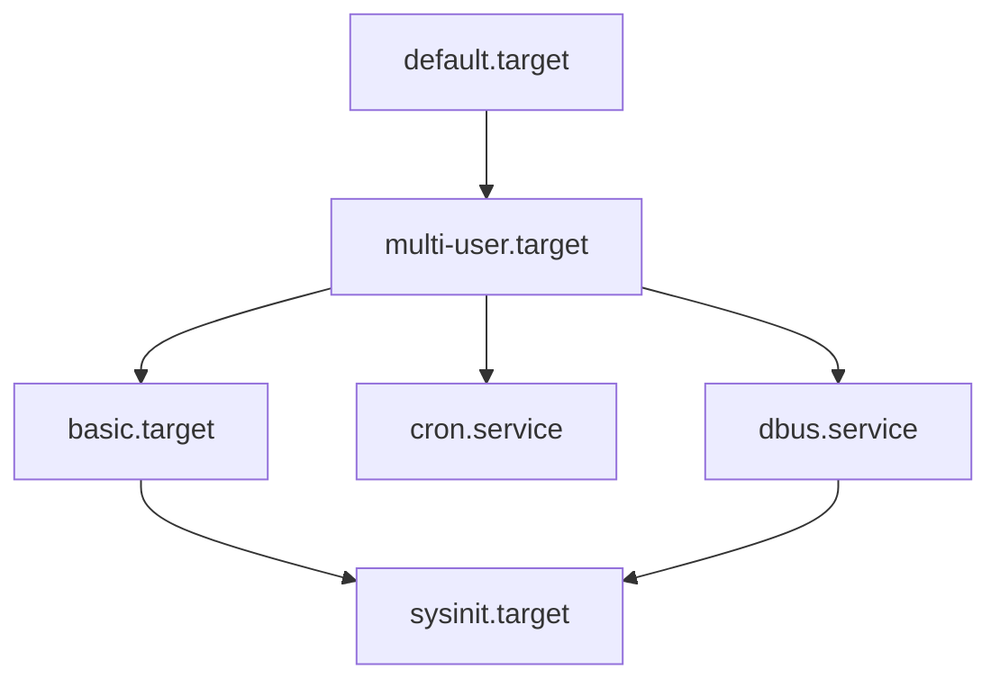
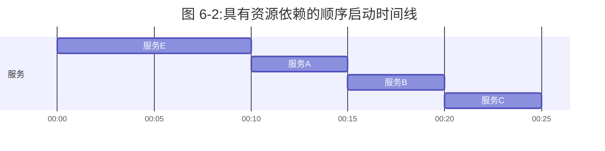

# 第6章：用户空间的启动

内核启动其第一个用户空间进程 init 的时刻意义重大——不仅因为内存和 CPU 终于准备好进行正常系统操作，还因为从这里你可以看到系统其余部分如何作为一个整体构建起来。在此之前，内核遵循由相对较少的软件开发人员定义的、控制良好的执行路径。用户空间则更加模块化、可定制，而且很容易看到用户空间启动和运行的过程。如果你有点冒险精神，可以善用这一点，因为理解和改变用户空间启动无需底层编程。

138 第6章

用户空间大致按以下顺序启动：

1.  init
2.  基本低级服务，如 udevd 和 syslogd
3.  网络配置
4.  中高级服务（cron、打印等）
5.  登录提示符、GUI 以及高级应用程序，如 Web 服务器

## 6.1 init 简介

init 是 Linux 系统上与其他程序一样的用户空间程序，你可以在 `/sbin` 中找到它，那里还有许多其他系统二进制文件。它的主要目的是启动和停止系统上的关键服务进程。

在所有主流 Linux 发行版的当前版本中，标准 init 实现是 **systemd**。本章重点介绍 systemd 的工作原理以及如何与之交互。

你可能在较老的系统上会遇到另外两种 init 变体。**System V init** 是一种传统的顺序 init（Sys V，通常读作 "sys-five"，起源于 Unix System V），见于 Red Hat Enterprise Linux (RHEL) 7.0 之前的版本以及 Debian 8。**Upstart** 是 15.04 版本之前的 Ubuntu 发行版上使用的 init。

还存在其他版本的 init，尤其是在嵌入式平台上。例如，Android 有自己的 init，而一个名为 **runit** 的版本在轻量级系统上很流行。BSD 也有自己的 init 版本，但你不太可能在当代 Linux 机器上看到它们。（一些发行版也修改了 System V init 配置以模仿 BSD 风格。）

人们开发了不同的 init 实现来解决 System V init 的若干缺陷。要理解这些问题，请考虑传统 init 的内部工作原理。它基本上是一系列脚本，init 按顺序逐个运行。每个脚本通常启动一个服务或配置系统的单个部分。在大多数情况下，解决依赖关系相对容易，而且通过修改脚本可以灵活地适应不寻常的启动需求。

然而，这种方案存在一些显著限制。它们可以归类为“性能问题”和“系统管理麻烦”。其中最重要的有：

*   **性能受损**：因为启动序列的两个部分通常无法同时运行。
*   **管理运行中的系统可能很困难**：启动脚本预期会启动服务守护进程。要找到服务守护进程的 PID，你需要使用 `ps`、某种特定于服务的其他机制，或者一种半标准化的记录 PID 的系统，例如 `/var/run/myservice.pid`。

139 第6章 用户空间的启动

*   **启动脚本往往包含大量标准的“样板”代码**，有时难以阅读和理解它们的功能。
*   **对按需服务和配置的支持很少**：大多数服务在启动时启动；系统配置也主要在这个时候设定。曾经，传统的 inetd 守护进程能够处理按需网络服务，但现在已基本不再使用。

当代 init 系统通过改变服务的启动方式、监督方式以及依赖关系的配置方式来解决这些问题。你很快就会看到这在 systemd 中是如何实现的，但首先，你应该确保你的系统正在运行它。

## 6.2 识别你的 init

确定你的系统使用的 init 版本通常并不困难。查看 `init(1)` 手册页通常会直接告诉你，但如果你不确定，请按如下方式检查你的系统：

*   如果你的系统有 `/usr/lib/systemd` 和 `/etc/systemd` 目录，那么你使用的是 **systemd**。
*   如果你有一个包含多个 `.conf` 文件的 `/etc/init` 目录，那么你可能正在运行 **Upstart**（除非你运行的是 Debian 7 或更早版本，在这种情况下你很可能使用的是 System V init）。本书不会介绍 Upstart，因为它已被 systemd 广泛取代。
*   如果以上都不成立，但你有一个 `/etc/inittab` 文件，那么你很可能正在运行 **System V init**。请转到第 6.5 节。

## 6.3 systemd

systemd init 是 Linux 上最新的 init 实现之一。除了处理常规的启动过程，systemd 还旨在整合许多标准 Unix 服务（如 cron 和 inetd）的功能。它从 Apple 的 launchd 中获得了一些灵感。

systemd 真正超越其前辈的地方在于其先进的**服务管理**能力。与传统 init 不同，systemd 可以在服务守护进程启动后跟踪它们，并将与某个服务相关的多个进程分组在一起，从而让你对系统上究竟运行着什么有更强的掌控力和洞察力。

systemd 是**面向目标**的。在最高层次上，你可以认为是为某个系统任务定义一个**目标**，称为一个**单元 (unit)**。一个单元可以包含常见启动任务（如启动一个守护进程）的指令，并且它还有**依赖关系**，即其他单元。当**启动**（或**激活**）一个单元时，systemd 会尝试激活其依赖关系，然后处理该单元的细节。

140 第6章

在启动服务时，systemd 并不遵循严格的顺序；相反，它在单元就绪时立即激活它们。启动后，systemd 可以通过激活额外的单元来响应系统事件（例如第3章中提到的 uevents）。

让我们先看看单元、激活和初始启动过程的高级视图。然后你就可以准备了解单元配置的具体细节以及各种单元依赖关系了。在此过程中，你将掌握如何查看和控制运行中的系统。

### 6.3.1 单元和单元类型

systemd 比之前的 init 版本更雄心勃勃的一个方面是，它不仅操作进程和服务；它还可以管理文件系统挂载、监控网络连接请求、运行定时器等。每种能力称为一种**单元类型**，每个具体功能（例如一个服务）称为一个**单元**。当你打开一个单元时，你就**激活**了它。每个单元都有自己的配置文件；我们将在第 6.3.3 节中探索这些文件。

以下是典型 Linux 系统上执行引导时任务的最重要的单元类型：

*   **服务单元 (Service units)**：控制 Unix 系统上的服务守护进程。
*   **目标单元 (Target units)**：控制其他单元，通常通过将它们分组来实现。
*   **套接字单元 (Socket units)**：表示传入的网络连接请求位置。
*   **挂载单元 (Mount units)**：表示文件系统附加到系统中。

> [!NOTE]
> 你可以在 `systemd(1)` 手册页中找到完整的单元类型列表。其中，服务单元和目标单元是最常见且最容易理解的。让我们看看它们在系统启动时是如何组合在一起的。

### 6.3.2 启动与单元依赖图

当你启动系统时，你是在激活一个默认单元，通常是一个名为 `default.target` 的目标单元，它将许多服务和挂载单元作为依赖关系分组在一起。因此，大致了解启动时会发生什么是相对容易的。你可能期望单元依赖关系形成一棵树——顶部有一个单元，向下分支到启动过程后期阶段的几个单元——但它们实际上形成了一个**图**。启动过程中较晚出现的单元可能依赖于多个早期单元，导致依赖关系树的早期分支重新合并在一起。你甚至可以使用 `systemd-analyze dot` 命令创建一个依赖图。整个图在典型系统上相当大（需要大量计算能力才能渲染），并且难以阅读，但有一些方法可以过滤单元并聚焦于个别部分。

141 第6章 用户空间的启动

图 6-1 显示了典型系统上 `default.target` 单元依赖图的一小部分。当你激活该单元时，其下方的所有单元也会被激活。

> [!NOTE]
> 在大多数系统上，`default.target` 是指向其他高级目标单元（例如代表用户界面启动的目标单元）的链接。在图 6-1 所示的系统上，`default.target` 分组了启动 GUI 所需的单元。



图 6-1: 单元依赖图

这个图是一个高度简化的视图。在你自己的系统上，你会发现仅仅通过查看顶部的单元配置文件并逐级向下，是不太可能描绘出依赖关系的。我们将在第 6.3.6 节中更深入地了解依赖关系的工作原理。

## 6.3.3 systemd 的配置

systemd的配置文件散布在系统中的许多目录中，因此当你查找某个特定文件时，可能需要进行一些搜索。systemd有两个主要配置目录：**系统单元目录**（全局配置，通常位于 `/lib/systemd/system` 或 `/usr/lib/systemd/system`）和**系统配置目录**（本地定义，通常位于 `/etc/systemd/system`）。

为避免混淆，请遵守以下规则：**不要修改系统单元目录**，因为发行版会为你维护它。在系统配置目录中进行本地更改。这一通用规则也适用于整个系统。当需要在 `/usr` 和 `/etc` 之间进行选择时，始终修改 `/etc`。

你可以使用以下命令检查当前 systemd 配置搜索路径（包括优先级）：

```bash
$ systemctl -p UnitPath show
UnitPath=/etc/systemd/system.control /run/systemd/system.control /run/systemd/transient /etc/systemd/system /run/systemd/system /run/systemd/generator /lib/systemd/system /run/systemd/generator.late
```

要查看系统上的系统单元和配置目录，请使用以下命令：

```bash
$ pkg-config systemd --variable=systemdsystemunitdir
/lib/systemd/system
$ pkg-config systemd --variable=systemdsystemconfdir
/etc/systemd/system
```

### 单元文件（Unit Files）

单元文件的格式源自 XDG Desktop Entry 规范（用于 `.desktop` 文件，与 Microsoft 系统中的 `.ini` 文件非常相似），其中每个部分以方括号（`[]`）中的节名开头，并包含变量和值赋值（选项）。

例如，考虑桌面总线守护进程的 `dbus-daemon.service` 单元文件：

```ini
[Unit]
Description=D-Bus System Message Bus
Documentation=man:dbus-daemon(1)
Requires=dbus.socket
RefuseManualStart=yes

[Service]
ExecStart=/usr/bin/dbus-daemon --system --address=systemd: --nofork --nopidfile --systemd-activation --syslog-only
ExecReload=/usr/bin/dbus-send --print-reply --system --type=method_call --dest=org.freedesktop.DBus / org.freedesktop.DBus.ReloadConfig
```

这里有两个节：`[Unit]` 和 `[Service]`。`[Unit]` 节提供有关单元的详细信息，包含描述和依赖关系信息。特别地，该单元依赖于 `dbus.socket` 单元。

在此类服务单元中，服务详情位于 `[Service]` 节中，包括如何准备、启动和重新加载服务。完整的列表可以在 `systemd.service(5)` 和 `systemd.exec(5)` 手册页以及第 6.3.5 节关于[[进程跟踪]]的讨论中找到。

许多其他单元配置文件也同样直观。例如，服务单元文件 `sshd.service` 通过启动 `sshd` 来启用远程安全 Shell 登录。

> [!NOTE]
> 你系统上的单元文件可能略有不同。在此示例中，你看到 Fedora 使用名称 `dbus-daemon.service`，而 Ubuntu 使用 `dbus.service`。实际文件也可能存在变化，但它们通常只是表面上的差异。

### 变量（Variables）

单元文件中经常出现变量。以下是另一个单元文件（安全 Shell，你将在第 10 章中了解）的节：

```ini
[Service]
EnvironmentFile=/etc/sysconfig/sshd
ExecStartPre=/usr/sbin/sshd-keygen
ExecStart=/usr/sbin/sshd -D $OPTIONS $CRYPTO_POLICY
ExecReload=/bin/kill -HUP $MAINPID
```

所有以美元符号（`$`）开头的内容都是变量。尽管这些变量的语法相同，但它们的来源不同。`$OPTIONS` 和 `$CRYPTO_POLICY` 选项在单元激活时可以传递给 `sshd`，它们定义在 `EnvironmentFile` 设置指定的文件中。在此特定情况下，你可以查看 `/etc/sysconfig/sshd` 以确定这些变量是否已设置以及它们的值。

相比之下，`$MAINPID` 包含服务跟踪进程的 ID（参见第 6.3.5 节）。单元激活后，systemd 会记录并存储此 PID，以便稍后用于操作特定于服务的进程。`sshd.service` 单元文件使用 `$MAINPID` 在需要重新加载配置时向 `sshd` 发送挂起（HUP）信号（这是处理重新加载和重启 Unix 守护进程的一种非常常见的技术）。

### 指示符（Specifiers）

指示符是单元文件中常见的一种类似变量的特性。指示符以百分号（`%`）开头。例如，`%n` 指示符是当前单元名称，`%H` 指示符是当前主机名。

你还可以使用指示符从单个单元文件创建单元的多个副本。一个例子是控制虚拟控制台上登录提示符的一组 `getty` 进程，例如 `tty1` 和 `tty2`。要使用此功能，需在单元名称后、单元文件名中的点之前添加 `@` 符号。

例如，在大多数发行版中，getty 单元文件名是 `getty@.service`，它允许动态创建单元，例如 `getty@tty1` 和 `getty@tty2`。`@` 之后的部分称为**实例（instance）**。当你查看其中一个单元文件时，可能会看到 `%I` 或 `%i` 指示符。当从带有实例的单元文件激活服务时，systemd 会将 `%I` 或 `%i` 指示符替换为实例，以创建新的服务名称。

## 6.3.4 systemd 的操作

你主要通过 `systemctl` 命令与 systemd 交互，该命令允许你激活和停用服务、列出状态、重新加载配置等。

最基本的命令用于获取单元信息。例如，要查看系统上活动单元的列表，执行 `list-units` 命令（这是 `systemctl` 的默认命令，所以从技术上讲，你不需要 `list-units` 参数）：

```bash
$ systemctl list-units
```

输出格式是典型的 Unix 信息列表命令。例如，`-.mount`（根文件系统）的标题和行如下：

```
UNIT                      LOAD   ACTIVE SUB       DESCRIPTION
-.mount                   loaded active mounted   Root Mount
```

默认情况下，`systemctl list-units` 产生大量输出，因为典型系统有许多活动单元，但这仍然是缩写形式，因为 `systemctl` 会截断任何过长的单元名称。要查看单元的完整名称，请使用 `--full` 选项；要查看所有单元（不仅仅是活动单元），请使用 `--all` 选项。

一个特别有用的 `systemctl` 操作是获取特定单元的状态。例如，以下是一个典型的状态命令及其部分输出：

```bash
$ systemctl status sshd.service
· sshd.service - OpenBSD Secure Shell server
   Loaded: loaded (/usr/lib/systemd/system/sshd.service; enabled; vendor preset: enabled)
   Active: active (running) since Fri 2021-04-16 08:15:41 EDT; 1 months 1 days ago
 Main PID: 1110 (sshd)
    Tasks: 1 (limit: 4915)
   CGroup: /system.slice/sshd.service
           ⌙1110 /usr/sbin/sshd -D
```

此输出后面可能还会跟有若干日志消息。如果你习惯了传统的 init 系统，可能会惊讶于这一个命令提供的有用信息之多。你不仅可以获得单元的状态，还可以获得与服务关联的进程、单元启动的时间以及若干日志消息（如果有的话）。

其他单元类型的输出也包含类似的有用信息；例如，挂载单元的输出包括挂载发生的时间、用于挂载的确切命令行及其退出状态。

输出中一个有趣的部分是控制组（cgroup）名称。在前面的示例中，控制组是 `/system.slice/sshd.service`，其下方的进程属于该 cgroup。但是，如果你单元（例如挂载单元）的进程已经终止，你也可能会看到以 `systemd:/system` 开头的控制组名称。你可以使用 `systemd-cgls` 命令查看与 systemd 相关的 cgroup，而不显示单元的其余状态。你将在第 6.3.5 节中了解更多关于 systemd 如何使用 cgroup 的信息，并在第 8.6 节中了解 cgroup 的工作原理。

`status` 命令还仅显示单元的最新诊断日志消息。要查看单元的所有消息，请使用以下命令：

```bash
$ journalctl --unit=unit_name
```

你将在第 7 章中了解更多关于 `journalctl` 的信息。

> [!NOTE]
> 根据你的系统和用户配置，你可能需要超级用户权限才能运行 `journalctl`。

### 作业（Jobs）与启动、停止和重新加载单元的关系

要激活、停用和重启单元，请使用命令 `systemctl start`、`systemctl stop` 和 `systemctl restart`。但是，如果你更改了单元配置文件，可以通过以下两种方式之一告知 systemd 重新加载该文件：

- `systemctl reload unit` — 仅重新加载指定单元的配置。
- `systemctl daemon-reload` — 重新加载所有单元配置。

激活、重新激活和重启单元的请求在 systemd 中称为**作业（jobs）**，它们本质上是单元状态的改变。你可以通过以下命令检查系统上的当前作业：

```bash
$ systemctl list-jobs
```

如果系统已运行一段时间，你可以合理预计没有活动作业，因为启动系统所需的所有激活都应该已完成。然而，在启动时，你有时可以足够快地登录，看到那些启动非常缓慢的单元的作业。例如：

```
  JOB UNIT                      TYPE            STATE  
   1 graphical.target          start           waiting
   2 multi-user.target         start           waiting
  71 systemd-...nlevel.service start           waiting
  75 sm-client.service         start           waiting
  76 sendmail.service          start           running
 120 systemd-...ead-done.timer start           waiting
```

在这种情况下，作业 76（`sendmail.service` 单元启动）花费了很长时间。其他列出的作业处于等待状态，很可能是因为它们都在等待作业 76 完成。当 `sendmail.service` 完成启动并完全激活时，作业 76 将完成，其余作业也将完成，作业列表将为空。

> [!NOTE]
> “作业”这个词可能会造成混淆，特别是因为其他一些 init 系统用它来指代更像是 systemd 单元的特性。这些作业也与 shell 的作业控制无关。

请参阅第 6.6 节了解如何关闭和重启系统。

### 向 systemd 添加单元

向 systemd 添加单元主要是创建单元文件，然后激活并可能启用它们。你应该将你自己的单元文件放在系统配置目录（`/etc/systemd/system`）中，这样就不会与发行版自带的任何文件混淆，并且发行版在升级时不会覆盖它们。

由于创建实际上不执行任何操作或不会干扰系统的目标单元很容易，不妨尝试一下。要创建两个目标，其中一个依赖于另一个，请执行以下步骤：

1. 在 `/etc/systemd/system` 中创建名为 `test1.target` 的单元文件：

```ini
[Unit]
Description=test 1
```

2. 创建一个依赖于 `test1.target` 的 `test2.target` 文件：

```ini
[Unit]
Description=test 2
Wants=test1.target
```

这里的 `Wants` 关键字定义了一个依赖关系，当你激活 `test2.target` 时，它会激活 `test1.target`。激活 `test2.target` 单元以查看其实际效果。

# systemctl start test2.target
3. 确认两个单元均为活动状态：
```bash
# systemctl status test1.target test2.target
· test1.target - test 1
   Loaded: loaded (/etc/systemd/system/test1.target; static; vendor preset: enabled)
   Active: active since Tue 2019-05-28 14:45:00 EDT; 16s ago
May 28 14:45:00 duplex systemd[1]: Reached target test 1.
· test2.target - test 2
   Loaded: loaded (/etc/systemd/system/test2.target; static; vendor preset: enabled)
   Active: active since Tue 2019-05-28 14:45:00 EDT; 17s ago
```
用户空间启动方式 147
4. 如果单元文件包含 `[Install]` 段，则需在激活前“启用”该单元：
```bash
# systemctl enable unit
```
`[Install]` 段是另一种创建依赖关系的方式。我们将在第6.3.6节更详细地讨论它（以及整体依赖关系）。

### 从 systemd 中移除单元
要移除一个单元，请遵循以下步骤：
1. 如有必要，停用该单元：
   ```bash
   # systemctl stop unit
   ```
2. 如果单元有 `[Install]` 段，则禁用该单元以移除依赖系统创建的任何符号链接：
   ```bash
   # systemctl disable unit
   ```
   之后根据需要删除单元文件。

> [!NOTE]
> 禁用隐式启用（即没有 `[Install]` 段）的单元不会产生任何效果。

## 6.3.5 systemd 的进程跟踪与同步

systemd 需要对其启动的每个进程拥有合理的信息和控制权。这在历史上一直比较困难。一个服务可能以不同方式启动：它可以 fork 自己的新实例，甚至守护化并脱离原始进程。也无法预知服务器会生成多少子进程。

为了轻松管理已激活的单元，systemd 使用前面提到的 [[cgroups]]（一种 Linux 内核特性，可以更精细地跟踪进程层次）。使用 cgroups 还有助于最小化包开发者或管理员创建可工作单元文件所需的工作量。在 systemd 中，无需考虑所有可能的启动行为；只需知道服务启动进程是否 fork。在服务单元文件中使用 `Type` 选项来指示启动行为。有两种基本的启动风格：

- **`Type=simple`**：服务进程不会 fork 和终止；它保持为主服务进程。
- **`Type=forking`**：服务 fork，systemd 期望原始服务进程终止。在此终止后，systemd 假定服务已就绪。

148 第6章

`Type=simple` 选项没有考虑到服务可能需要一些时间才能初始化，因此 systemd 无法知道何时启动那些绝对需要该服务就绪的依赖单元。处理此问题的一种方法是使用延迟启动（参见6.3.7节）。然而，某些 `Type` 启动风格可以让服务本身在就绪时通知 systemd：

- **`Type=notify`**：服务就绪时，通过特殊的函数调用向 systemd 发送特定通知。
- **`Type=dbus`**：服务就绪时，在 [[D-Bus|桌面总线]] 上注册自身。

另一种服务启动风格是 `Type=oneshot`：服务进程在启动后完全终止，不产生子进程。它类似于 `Type=simple`，但 systemd 要等到服务进程终止后才认为服务已启动。任何严格依赖（稍后会看到）都要等到该终止后才开始。使用 `Type=oneshot` 的服务还会获得默认的 `RemainAfterExit=yes` 指令，因此即使其进程终止，systemd 仍认为该服务处于活动状态。

最后一个选项是 `Type=idle`。它的工作方式类似于 simple 风格，但指示 systemd 等到所有活动作业完成后再启动服务。其目的是延迟服务启动，直到其他服务都已启动，以避免服务之间相互干扰。请记住，一旦服务启动，启动它的 systemd 作业就会终止，因此等待所有其他作业完成可确保没有其他作业正在启动。

如果你对 cgroups 的工作原理感兴趣，我们将在第8.6节中更详细地探讨。

## 6.3.6 systemd 的依赖关系

灵活的启动时和运行时依赖系统需要一定的复杂性，因为过于严格的规则可能导致系统性能不佳和不稳定。例如，假设你希望在启动数据库服务器后显示登录提示，因此你定义了一个从登录提示到数据库服务器的严格依赖关系。这意味着如果数据库服务器失败，登录提示也会失败，你将无法登录机器来修复问题！

Unix 启动任务通常具有相当好的容错能力，经常失败也不会对标准服务造成严重问题。例如，如果移除了系统的数据盘但保留了 `/etc/fstab` 条目（或 systemd 中的挂载单元），则启动时的文件系统挂载将会失败。尽管此失败可能会影响应用服务器（如 Web 服务器），但通常不会影响标准系统操作。

为了满足灵活性和容错性的需求，systemd 提供了多种依赖类型和风格。我们先来看一下基本类型，按关键字语法标记：

- **`Requires`**：严格依赖。当激活一个带有 `Requires` 依赖的单元时，systemd 会尝试激活依赖单元。如果依赖单元失败，systemd 也会停用依赖它的单元。
- **`Wants`**：仅用于激活的依赖。激活一个单元时，systemd 会激活该单元的 `Wants` 依赖，但不会在意这些依赖是否失败。
- **`Requisite`**：必须已经激活的单元。在激活一个带有 `Requisite` 依赖的单元之前，systemd 会先检查依赖的状态。如果该依赖尚未激活，则 systemd 会使带依赖的单元激活失败。
- **`Conflicts`**：负依赖。当激活一个带有 `Conflicts` 依赖的单元时，systemd 会自动停用冲突的依赖（如果它处于活动状态）。同时激活冲突的单元会失败。

`Wants` 依赖类型尤其重要，因为它不会将失败传播给其他单元。`systemd.service(5)` 手册页指出，如果可能，应该这样指定依赖，原因显而易见。这种行为产生了更健壮的系统，提供了传统 init 的优势，即早期启动组件的失败不一定阻止后续组件启动。

可以使用 `systemctl` 命令查看单元的依赖关系，只要指定了依赖类型（例如 `Wants` 或 `Requires`）：
```bash
# systemctl show -p type unit
```

### 排序

到目前为止，您看到的依赖语法并没有明确指定顺序。例如，激活大多数带有 `Requires` 或 `Wants` 依赖的服务单元会导致这些单元同时启动。这是最优的，因为希望尽可能多地尽快启动服务，以缩短启动时间。然而，在某些情况下，一个单元必须在另一个单元之后启动。例如，在图6-1所基于的系统中，`default.target` 单元被设置为在 `multi-user.target` 之后启动（图中未显示此顺序区别）。

为了按特定顺序激活单元，可以使用以下依赖修饰符：

- **`Before`**：当前单元将先于列出的单元激活。例如，如果在 `foo.target` 中出现 `Before=bar.target`，则 systemd 先激活 `foo.target`，再激活 `bar.target`。
- **`After`**：当前单元在列出的单元之后激活。

使用排序时，systemd 会等待一个单元进入活动状态后，再激活其依赖单元。

### 默认依赖与隐式依赖

当您探索依赖关系（尤其是使用 `systemd-analyze`）时，可能会注意到某些单元获得了未在单元文件或其他可见机制中显式声明的依赖。您最可能在带有 `Wants` 依赖的 target 单元中遇到这种情况——您会发现 systemd 在每个列为 `Wants` 依赖的单元旁边添加了一个 `After` 修饰符。这些额外的依赖是 systemd 内部的，在启动时计算，不存储在配置文件中。

添加的 `After` 修饰符称为 **默认依赖**，是自动添加到单元配置中的，旨在避免常见错误并保持单元文件简洁。这些依赖根据单元类型而异。例如，systemd 不会为 target 单元添加与服务单元相同的默认依赖。这些差异列在单元配置手册页（如 `systemd.service(5)` 和 `systemd.target(5)`）的“DEFAULT DEPENDENCIES”部分。

可以在单元配置文件中添加 `DefaultDependencies=no` 来禁用默认依赖。

### 条件依赖

可以使用多个条件依赖参数来测试操作系统的各种状态，而不是 systemd 单元。例如：

- **`ConditionPathExists=p`**：如果系统中存在（文件）路径 `p`，则为真。
- **`ConditionPathIsDirectory=p`**：如果 `p` 是目录，则为真。
- **`ConditionFileNotEmpty=p`**：如果 `p` 是文件且非零长度，则为真。

如果在 systemd 尝试激活单元时，某个条件依赖为假，则单元不会激活，但这仅适用于包含该条件的单元。也就是说，如果激活一个带有条件依赖和一些单元依赖的单元，无论条件是真还是假，systemd 都会尝试激活那些单元依赖。

其他依赖主要是前述依赖的变体。例如，`RequiresOverridable` 依赖在正常运行时类似于 `Requires`，但如果单元被手动激活，则其行为类似于 `Wants`。完整列表请参见 `systemd.unit(5)` 手册页。

### [Install] 段与启用单元

到目前为止，我们一直在讨论如何在依赖单元的配置文件中定义依赖关系。也可以“反向”操作——即在依赖单元的配置文件中指定依赖它的单元。可以通过在 `[Install]` 段中添加 `WantedBy` 或 `RequiredBy` 参数来实现。这种机制允许您在不修改其他配置文件的情况下改变单元的启动时机（例如，当您不想编辑系统单元文件时）。

为了说明其工作原理，回顾第6.3.4节中的示例单元。我们有两个单元：`test1.target` 和 `test2.target`，其中 `test2.target` 对 `test1.target` 有一个 `Wants` 依赖。我们可以修改它们，使 `test1.target` 如下所示：

```ini
[Unit]
Description=test 1

[Install]
WantedBy=test2.target
```

而 `test2.target` 如下所示：

```ini
[Unit]
Description=test 2
```

由于现在有一个带有 `[Install]` 段的单元，需要在启动之前使用 `systemctl` 启用它。以下是 `test1.target` 的操作方式：

```bash
# systemctl enable test1.target
Created symlink /etc/systemd/system/test2.target.wants/test1.target → /etc/systemd/system/test1.target.
```

注意这里的输出——启用单元的效果是创建一个符号链接，位于对应依赖单元（本例中是 `test2.target`）的 `.wants` 子目录中。现在可以同时启动两个单元：`systemctl start test2.target`，因为依赖关系已经就绪。

> [!NOTE]
> 启用单元并不会激活它。

禁用单元（并移除符号链接）的方法如下：

```bash
# systemctl disable test1.target
```

### 6.3.6 启用和禁用单元（续）

```bash
# systemctl disable test1.target
Removed /etc/systemd/system/test2.target.wants/test1.target.
```

此示例中的两个单元也为你提供了试验不同启动场景的机会。例如，尝试仅启动 `test1.target`，或尝试在不启用 `test1.target` 的情况下启动 `test2.target`，看看会发生什么。或者，尝试将 `WantedBy` 改为 `RequiredBy`。（记住，你可以使用 `systemctl status` 检查单元状态。）

在正常操作期间，systemd 会忽略单元中的 `[Install]` 部分，但会记录其存在，并且默认情况下将该单元视为已禁用。启用单元在重启后仍然有效。

`[Install]` 部分通常负责系统配置目录（`/etc/systemd/system`）中的 `.wants` 和 `.requires` 目录。然而，单元配置目录（`[/usr]/lib/systemd/system`）也包含 `.wants` 目录，并且你还可以添加与单元文件中 `[Install]` 部分不对应的链接。这些手动添加是一种在不修改可能被将来（例如，软件升级）覆盖的单元文件的情况下添加依赖关系的简单方法，但不太鼓励这样做，因为手动添加难以追踪。

### 6.3.7 systemd 的按需启动与资源并行化启动

systemd 的特性之一是能够将单元启动延迟到绝对需要时。该设置通常如下工作：

1.  为你想要提供的系统服务创建 systemd 单元（称其为单元 A）。
2.  确定单元 A 用于提供服务的系统资源，例如网络端口/套接字、文件或设备。
3.  创建另一个 systemd 单元（单元 R）来表示该资源。这些单元分为不同类型，例如套接字单元、路径单元和设备单元。
4.  定义单元 A 和单元 R 之间的关系。通常，这基于单元名称隐式确定，但也可以显式定义，如下文所述。

一旦就绪，操作流程如下：

1.  当单元 R 激活时，systemd 开始监控该资源。
2.  当有进程尝试访问该资源时，systemd 会阻塞该资源，并将对该资源的输入缓冲起来。
3.  systemd 激活单元 A。
4.  当单元 A 就绪后，其服务接管该资源，读取缓冲的输入，并正常运行。

这里有几个注意事项：

-   你必须确保资源单元覆盖该服务提供的所有资源。这通常不是问题，因为大多数服务只有一个访问点。
-   你需要确保资源单元与它所代表的服务单元相绑定。这可以是隐式或显式的，在某些情况下，许多选项代表了 systemd 将资源移交给服务单元的不同方式。
-   并非所有服务器都知道如何与 systemd 提供的资源单元接口。

如果你已经了解传统工具（如 `inetd`、`xinetd` 和 `automount`）的功能，你会看到许多相似之处。实际上，这个概念并不新鲜；systemd 甚至包含对自动挂载单元的支持。

#### 套接字单元和服务示例

让我们看一个示例：一个简单的网络回显服务。这有点高级，在你阅读了第 9 章关于 TCP、端口和监听的内容以及第 10 章关于套接字的内容后，你可能才能完全理解，但你应该能掌握基本概念。

回显服务的想法是重复网络客户端连接后发送的任何内容；我们的服务将在 TCP 端口 22222 上监听。我们首先创建一个套接字单元来表示该端口，如下面的 `echo.socket` 单元文件所示：

```ini
[Unit]
Description=echo socket
[Socket]
ListenStream=22222
Accept=true
```

注意，单元文件中没有提及此套接字支持的服务单元。那么，对应的服务单元文件是什么？它的名字是 `echo@.service`。这种连接是通过命名约定建立的；如果服务单元文件与 `.socket` 文件具有相同的前缀（在本例中为 `echo`），则 systemd 知道在套接字单元上有活动时激活该服务单元。在这种情况下，当 `echo.socket` 上有活动时，systemd 会创建一个 `echo@.service` 的实例。以下是 `echo@.service` 单元文件：

```ini
[Unit]
Description=echo service
[Service]
ExecStart=/bin/cat
StandardInput=socket
```

> [!NOTE]
> 如果你不喜欢基于前缀的隐式单元激活，或者你需要链接不同前缀的单元，你可以在定义资源的单元中使用显式选项。例如，在 `foo.service` 中使用 `Socket=bar.socket` 可以让 `bar.socket` 将其套接字移交给 `foo.service`。

要让这个示例单元运行，你需要启动 `echo.socket` 单元：

```bash
# systemctl start echo.socket
```

现在，你可以使用 `telnet` 等工具连接到本地 TCP 端口 22222 来测试该服务。该服务会重复你输入的内容；以下是一个示例交互：

```text
$ telnet localhost 22222
Trying 127.0.0.1...
Connected to localhost.
Escape character is '^]'.
Hi there.
Hi there.
```

当你厌烦了，想要返回 shell 时，在一行上按 `CTRL-]`，然后按 `CTRL-D`。要停止服务，停止套接字单元，如下所示：

```bash
# systemctl stop echo.socket
```

> [!NOTE]
> `telnet` 可能未在你的发行版上默认安装。

#### 实例与移交

因为 `echo@.service` 单元支持多个并发实例，名称中有一个 `@`（回想一下，`@` 指定符表示参数化）。为什么需要多个实例？假设有多个网络客户端同时连接到该服务，并且你希望每个连接都有自己的实例。在这种情况下，服务单元必须支持多个实例，因为我们在 `echo.socket` 中包含了 `Accept=true` 选项。该选项指示 systemd 不仅要监听端口，还要代表服务单元接受传入连接，并将连接传递给它，为每个连接创建一个单独的实例。每个实例从连接中读取数据作为标准输入，但它不一定需要知道数据来自网络连接。

> [!NOTE]
> 大多数网络连接需要的灵活性远不止简单地将标准输入输出作为网关，因此不要期望能够使用像这里显示的 `echo@.service` 单元文件来创建复杂的网络服务。

如果服务单元本身能够完成接受连接的工作，则不要在单元文件名中包含 `@`，也不要在套接字单元中设置 `Accept=true`。在这种情况下，服务单元完全控制从 systemd 移交过来的套接字，而 systemd 在服务单元完成之前不会再尝试监听该网络端口。

资源类型以及移交到服务单元的选项众多，使得难以给出分类总结。不仅如此，这些选项的文档分散在多个手册页中。对于面向资源的单元，请查看 `systemd.socket(5)`、`systemd.path(5)` 和 `systemd.device(5)`。服务单元的一个常被忽略的文档是 `systemd.exec(5)`，其中包含服务单元在激活时如何接收资源的信息。

#### 使用辅助单元进行启动优化

systemd 的一个总体目标是简化依赖顺序并加快启动时间。诸如套接字单元之类的资源单元提供了一种实现此目的的方法，类似于按需启动。我们仍然有一个服务单元和一个表示该服务单元提供的资源的辅助单元，但在此情况下，systemd 在激活辅助单元时立即启动服务单元，而不是等待请求。

这种方案的原因是，诸如 `systemd-journald.service` 之类的基本启动服务单元需要一些时间才能启动，并且许多其他单元依赖于它们。然而，systemd 可以非常快速地提供一个单元（例如套接字单元）的基本资源，然后它不仅可以立即激活基本单元，还可以激活任何依赖于它的单元。一旦基本单元就绪，它就会接管对该资源的控制。

图 6-2 展示了这在传统顺序系统中可能的工作方式。在这个启动时间线中，服务 E 提供基本资源 R。服务 A、B 和 C 依赖于该资源（但不相互依赖），并且必须等待服务 E 启动。由于系统在完成启动前一个服务之前不会启动新服务，因此需要相当长的时间才能开始启动服务 C。



> 图 6-2：具有资源依赖的顺序启动时间线

图 6-3 展示了可能的等效 systemd 启动配置。服务由单元 A、B、C 和 E 表示，并有一个新单元 R 表示单元 E 提供的资源。因为 systemd 可以在单元 E 启动时提供单元 R 的接口，单元 A、B、C 和 E 可以同时启动。当就绪时，单元 E 接管单元 R。有趣的一点是，单元 A、B 或 C 可能在完成启动之前不需要访问单元 R 提供的资源。我们正在做的是为它们提供尽快开始访问该资源的选项。


> 图 6-3：带有资源单元的 systemd 启动时间线

> [!NOTE]
> 当你像这样并行化启动时，系统可能会因为同时启动大量单元而暂时变慢。

要点是，虽然在这种情况下你没有创建按需单元启动，但你正在使用使按需启动成为可能的相同特性。有关常见的实际示例，请参阅运行 systemd 的机器上的 `journald` 和 D-Bus 配置单元；它们很可能以这种方式并行化。

### 6.3.8 systemd 辅助组件

随着 systemd 的普及，它已扩展到包含一些与启动和服务管理无关的任务支持，无论是直接集成还是通过辅助兼容层。你可能会注意到 `/lib/systemd` 中有许多程序；这些是与这些功能相关的可执行文件。以下是一些特定的系统服务：

- **udevd**：你在第 3 章中了解过它；它是 systemd 的一部分。
- **journald**：一种日志服务，处理多种日志记录机制，包括传统的 Unix syslog 服务。你将在第 7 章中了解更多。
- **resolved**：一个用于 DNS 的名称服务缓存守护进程；你将在第 9 章中了解它。

所有这些服务的可执行文件都以 `systemd-` 为前缀。例如，systemd 集成的 `udevd` 称为 `systemd-udevd`。

如果你深入挖掘，会发现其中一些程序是相对简单的包装器。它们的功能是运行标准系统工具并将结果通知 systemd。一个例子是 `systemd-fsck`。

如果你在 `/lib/systemd` 中看到一个你无法识别的程序，请查看其手册页。极有可能它描述的不仅是该工具，还有它旨在增强的单元类型。

# 第6章：用户空间的启动

## 6.4 System V 运行级别

现在你已经了解了 systemd 及其工作原理，让我们换个方向，看看传统 System V init 的一些方面。在 Linux 系统的任何给定时刻，都会运行一组基础的进程（例如 `crond` 和 `udevd`）。在 System V init 中，机器的这种状态被称为**运行级别**，用 0 到 6 的数字表示。系统大部分时间都处于一个单一运行级别，但当您关闭机器时，init 会切换到不同的运行级别，以便有序地终止系统服务并通知内核停止。

您可以使用 `who -r` 命令检查系统的运行级别，如下所示：

```bash
$ who -r
run-level 5  2019-01-27 16:43
```

该输出告诉我们当前运行级别是 5，以及该运行级别建立的日期和时间。

运行级别有多种用途，但最常见的用途是区分系统启动、关机、单用户模式和终端模式状态。例如，大多数系统传统上使用运行级别 2 到 4 表示文本终端；运行级别 5 表示系统启动 GUI 登录。

但运行级别正在逐渐过时。尽管 systemd 支持它们，但它认为运行级别作为系统的最终状态已经过时，而更倾向于使用 target 单元。对于 systemd 来说，运行级别主要存在于启动那些只支持 System V init 脚本的服务。

## 6.5 System V init

System V init 实现是 Linux 上使用的最古老的实现之一；其核心思想是通过精心构建的启动序列，支持有序启动到不同的运行级别。System V init 如今在大多数服务器和桌面安装中并不常见，但您可能会在 7.0 版本之前的 RHEL 以及嵌入式 Linux 环境（如路由器和手机）中遇到它。此外，一些较旧的包可能只提供为 System V init 设计的启动脚本；systemd 可以通过一种兼容模式来处理这些脚本，我们将在 6.5.5 节讨论。我们将在这里介绍基础知识，但请记住，您可能实际上不会遇到本节涵盖的任何内容。

一个典型的 System V init 安装包含两个组件：一个中央配置文件和一个大型启动脚本集，并辅以一个符号链接农场。配置文件 `/etc/inittab` 是所有一切的起点。如果您有 System V init，请在您的 `inittab` 文件中查找类似以下的行：

```
id:5:initdefault:
```

这表明默认运行级别是 5。

`inittab` 中的所有行都采用以下形式，包含四个字段，按此顺序用冒号分隔：

1.  一个唯一标识符（一个短字符串，如上一示例中的 `id`）。
2.  适用的运行级别编号。
3.  init 应采取的动作（上一示例中将默认运行级别设置为 5）。
4.  要执行的命令（可选）。

要了解 `inittab` 文件中命令如何工作，请考虑以下行：

```
l5:5:wait:/etc/rc.d/rc 5
```

这一行特别重要，因为它触发了大部分系统配置和服务。在这里，`wait` 动作决定了 System V init 何时以及如何运行该命令：在进入运行级别 5 时运行一次 `/etc/rc.d/rc 5`，然后等待该命令完成后再做其他事情。`rc 5` 命令会执行 `/etc/rc5.d` 中以数字开头的任何内容（按数字顺序）。我们稍后将更详细地介绍这一点。

除了 `initdefault` 和 `wait` 之外，以下是一些最常见的 `inittab` 动作：

- **respawn**：`respawn` 动作告诉 init 运行后面的命令，并且如果该命令执行完毕，则再次运行它。您可能会在 `inittab` 文件中看到类似这样的内容：

    ```
    1:2345:respawn:/sbin/mingetty tty1
    ```

    `getty` 程序提供登录提示。上面的行用于第一个虚拟控制台 (`/dev/tty1`)，即您按 ALT-F1 或 CTRL-ALT-F1 时看到的那一个（参见 3.4.7 节）。`respawn` 动作会在您注销后重新显示登录提示。

- **ctrlaltdel**：`ctrlaltdel` 动作控制系统在虚拟控制台上按下 CTRL-ALT-DEL 时执行的操作。在大多数系统上，这是某种使用 `shutdown` 命令的重启命令（在 6.6 节讨论）。

- **sysinit**：`sysinit` 动作是 init 在启动时、进入任何运行级别之前应该首先运行的内容。

> [!NOTE]
> 有关更多可用动作，请参阅 `inittab(5)` 手册页。

### 6.5.1 System V init：启动命令序列

现在让我们看看 System V init 如何在允许您登录之前启动系统服务。回想一下之前的 `inittab` 行：

```
l5:5:wait:/etc/rc.d/rc 5
```

这一行会触发许多其他程序。实际上，`rc` 代表**运行命令**，许多人将其称为脚本、程序或服务。但这些命令在哪里呢？

这一行中的 `5` 告诉我们当前正在讨论运行级别 5。命令可能位于 `/etc/rc.d/rc5.d` 或 `/etc/rc5.d` 中（运行级别 1 使用 `rc1.d`，运行级别 2 使用 `rc2.d`，依此类推）。例如，您可能会在 `rc5.d` 目录中找到以下项目：

```
S10sysklogd     S20ppp          S99gpm
S12kerneld      S25netstd_nfs   S99httpd
S15netstd_init  S30netstd_misc  S99rmnologin
S18netbase      S45pcmcia       S99sshd
S20acct         S89atd          
S20logoutd      S89cron         
```

`rc 5` 命令通过按以下顺序执行命令来启动 `rc5.d` 目录中的程序：

```
S10sysklogd start
S12kerneld start
S15netstd_init start
S18netbase start
--snip--
S99sshd start
```

注意每个命令中的 `start` 参数。命令名称中的大写字母 `S` 表示该命令应以**启动模式**运行，而数字（00 到 99）决定了 `rc` 启动该命令在序列中的位置。`rc*.d` 命令通常是 shell 脚本，用于启动 `/sbin` 或 `/usr/sbin` 中的程序。

通常，您可以使用 `less` 或其他分页程序查看脚本，以了解特定命令的作用。

> [!NOTE]
> 一些 `rc*.d` 目录包含以 `K`（表示“kill”或停止模式）开头的命令。在这种情况下，`rc` 使用 `stop` 参数而不是 `start` 运行命令。您最可能在关闭系统的运行级别中遇到 `K` 命令。

您可以手动运行这些命令；但通常您希望通过 `init.d` 目录而不是 `rc*.d` 目录来执行，我们接下来会介绍这一点。

### 6.5.2 System V init 链接农场

`rc*.d` 目录的内容实际上是到另一个目录 `init.d` 中文件的符号链接。如果您的目标是交互、添加、删除或修改 `rc*.d` 目录中的服务，您需要理解这些符号链接。对诸如 `rc5.d` 这样的目录执行长列表会显示如下结构：

```
lrwxrwxrwx . . . S10sysklogd -> ../init.d/sysklogd
lrwxrwxrwx . . . S12kerneld -> ../init.d/kerneld
lrwxrwxrwx . . . S15netstd_init -> ../init.d/netstd_init
lrwxrwxrwx . . . S18netbase -> ../init.d/netbase
--snip--
lrwxrwxrwx . . . S99httpd -> ../init.d/httpd
--snip--
```

像这样跨越多个子目录的大量符号链接被称为**链接农场**。Linux 发行版包含这些链接，以便它们可以在所有运行级别使用相同的启动脚本。这是一种约定，而不是要求，但它简化了组织。

#### 启动和停止服务

要手动启动和停止服务，请使用 `init.d` 目录中的脚本。例如，手动启动 `httpd` Web 服务器程序的一种方法是运行 `init.d/httpd start`。类似地，要终止正在运行的服务，可以使用 `stop` 参数（例如 `httpd stop`）。

#### 修改启动顺序

在 System V init 中更改启动顺序通常通过修改链接农场来完成。最常见的更改是阻止 `init.d` 目录中的某个命令在特定运行级别中运行。但是，您必须小心如何执行此操作。例如，您可能会考虑删除适当 `rc*.d` 目录中的符号链接。但是，如果您以后需要恢复该链接，您可能很难记住它的确切名称。最佳方法之一是在链接名称的开头添加下划线 (`_`)，如下所示：

```bash
# mv S99httpd _S99httpd
```

此更改会使 `rc` 忽略 `_S99httpd`，因为文件名不再以 `S` 或 `K` 开头，但原始名称仍然指示其用途。

要添加服务，请创建一个类似 `init.d` 目录中脚本的脚本，然后在正确的 `rc*.d` 目录中创建一个符号链接。最简单的方法是复制并修改 `init.d` 中您理解的现有脚本之一（有关 shell 脚本的更多信息，请参阅第 11 章）。

添加服务时，选择启动序列中适当的位置来启动它。如果服务启动得太早，由于依赖于其他服务，它可能无法工作。对于非必需服务，大多数系统管理员更喜欢使用 90 多位的数字，这样服务会在系统自带的大多数服务之后启动。

### 6.5.3 run-parts

System V init 用来运行 `init.d` 脚本的机制已经进入了许多 Linux 系统中，无论它们是否使用 System V init。这是一个名为 `run-parts` 的实用程序，它唯一的功能是以某种可预测的顺序运行给定目录中的一组可执行程序。您可以将 `run-parts` 视为几乎就像一个人输入 `ls` 命令进入某个目录，然后运行输出中列出的所有程序一样。

默认行为是运行目录中的所有程序，但您通常可以选择某些程序而忽略其他程序。在某些发行版中，您不需要对运行的程序进行太多控制。例如，Fedora 附带了一个非常简单的 `run-parts` 实用程序。

其他发行版，如 Debian 和 Ubuntu，有一个更复杂的 `run-parts` 程序。其功能包括能够基于正则表达式运行程序（例如，使用 `S[0-9]{2}` 表达式来运行 `/etc/init.d` 运行级别目录中的所有“启动”脚本），以及向程序传递参数。这些功能允许您使用单个命令启动和停止 System V 运行级别。

您实际上不需要理解使用 `run-parts` 的细节；事实上，大多数人甚至不知道它的存在。需要记住的主要事情是，它偶尔会出现在脚本中，并且它唯一的存在目的就是运行给定目录中的程序。

### 6.5.4 System V init 控制

有时，您需要稍微“踢”一下 init，告诉它切换运行级别、重新读取其配置或关闭系统。要控制 System V init，请使用 `telinit`。例如，要切换到运行级别 3，请输入：

```bash
# telinit 3
```

切换运行级别时，init 会尝试终止新运行级别的 `inittab` 文件中未包含的任何进程，因此在更改运行级别时要小心。当您需要添加或删除作业，或对 `inittab` 文件进行任何其他更改时，您必须告诉 init 有关更改的信息，并让它重新加载该文件。用于此目的的 `telinit` 命令是：

```bash
# telinit q
```

# 第6章：用户空间的启动

## 6.5.5 systemd的System V兼容性

systemd与其他新一代init系统的一个区别是，它试图更完整地跟踪由System V兼容的init脚本启动的服务。其工作方式如下：

1. 首先，systemd激活`runlevel<N>.target`，其中`N`是运行级别。
2. 对于`/etc/rc<N>.d`中的每个符号链接，systemd识别`/etc/init.d`中对应的脚本。
3. systemd将脚本名称关联到一个服务单元（例如，`/etc/init.d/foo`对应`foo.service`）。
4. systemd激活该服务单元，并根据脚本在`rc<N>.d`中的名称，以`start`或`stop`参数运行脚本。
5. systemd尝试将脚本产生的任何进程关联到该服务单元。

由于systemd建立了与服务单元名称的关联，您可以使用`systemctl`重启服务或查看其状态。但不要对System V兼容模式期望过高；例如，它仍然必须串行运行init脚本。

---

## 6.6 关闭系统

[[init]]控制系统如何关闭和重启。无论运行哪种init版本，关闭系统的命令都是相同的。关闭Linux机器的正确方法是使用`shutdown`命令。

`shutdown`有两种基本用法。如果**停机**（halt），系统会关闭并保持关闭状态。要使机器立即停机，运行：

```bash
# shutdown -h now
```

在大多数机器和Linux版本中，停机会切断机器电源。您也可以**重启**机器。重启时使用`-r`代替`-h`。关闭过程需要几秒钟。在关闭过程中应避免重置或断电。

在前面的示例中，`now`是关闭时间。时间参数是必须的，但有许多指定方式。例如，如果希望机器在将来某个时间关闭，可以使用`+n`，其中`n`是`shutdown`等待的分钟数。参见`shutdown(8)`手册页了解更多选项。

要使系统在10分钟后重启，输入：

```bash
# shutdown -r +10
```

在Linux中，`shutdown`会通知所有登录用户系统即将关闭，但实际工作很少。如果指定的时间不是`now`，`shutdown`会创建一个名为`/etc/nologin`的文件。当该文件存在时，系统禁止除超级用户以外的任何人登录。

当系统关闭时间最终到达时，`shutdown`通知init开始关闭过程。在systemd上，这意味着激活关闭单元；在System V init上，意味着将运行级别更改为0（停机）或6（重启）。无论init实现或配置如何，过程大致如下：

1. init要求每个进程干净地关闭。
2. 如果某个进程在一段时间后没有响应，init会杀死它，首先尝试`TERM`信号。
3. 如果`TERM`信号不起作用，init对仍然存活的进程使用`KILL`信号。
4. 系统锁定系统文件到位，并为关闭做其他准备。
5. 系统卸载除根文件系统以外的所有文件系统。
6. 系统将根文件系统重新挂载为只读。
7. 系统使用`sync`程序将所有缓冲数据写入文件系统。
8. 最后一步是使用`reboot(2)`系统调用告诉内核重启或停止。这可以由init或辅助程序（如`reboot`、`halt`或`poweroff`）完成。

> [!WARNING]
> `reboot`和`halt`程序的行为取决于它们被调用的方式，这可能导致混淆。默认情况下，这些程序使用`-r`或`-h`选项调用`shutdown`。但是，如果系统已经处于停机或重启运行级别，程序会告诉内核立即关闭自身。如果您真的想快速关闭机器，而忽略无序关闭可能造成的损害，请使用`-f`（强制）选项。

---

## 6.7 初始RAM文件系统

Linux的启动过程在很大程度上相当直接。然而，有一个组件一直有些令人困惑：[[initramfs]]，即初始RAM文件系统。可以将其视为一个位于正常用户模式启动之前的小型用户空间楔子。但首先，让我们谈谈它为什么存在。

问题源于存在许多不同类型的存储硬件。请记住，Linux内核不通过PC BIOS接口或EFI与磁盘通信，因此为了挂载其根文件系统，它需要底层存储机制的驱动程序支持。例如，如果根文件系统位于连接到第三方控制器的RAID阵列上，内核需要首先拥有该控制器的驱动程序。不幸的是，存储控制器驱动程序种类繁多，发行版无法将所有驱动程序都包含在内核中，因此许多驱动程序以可加载模块的形式提供。但可加载模块是文件，如果内核一开始没有挂载文件系统，它就无法加载所需的驱动模块。

解决方法是收集一小部分内核驱动模块以及一些其他工具，打包成一个存档。引导加载程序在运行内核之前将此存档加载到内存中。启动时，内核将存档的内容读取到临时RAM文件系统（initramfs）中，将其挂载到`/`，并执行用户模式交接给initramfs上的init。然后，initramfs中附带的工具允许内核为真正的根文件系统加载必要的驱动模块。最后，这些工具挂载真正的根文件系统并启动真正的init。

实现方式各不相同且不断演变。在某些发行版上，initramfs上的init是一个相当简单的shell脚本，它启动`udevd`来加载驱动，然后挂载真正的根并执行那里的init。在使用systemd的发行版上，您通常会看到那里有一个完整的systemd安装，没有单元配置文件，只有几个udevd配置文件。

初始RAM文件系统的一个基本特性（迄今为止）保持不变：如果不需要，可以绕过它。也就是说，如果您的内核拥有挂载根文件系统所需的所有驱动程序，您可以在引导加载程序配置中省略初始RAM文件系统。成功时，消除初始RAM文件系统会略微缩短启动时间。您可以在启动时自己尝试：使用GRUB菜单编辑器删除initrd行。（最好不要通过更改GRUB配置文件来实验，因为您可能会犯下难以修复的错误。）由于诸如按UUID挂载等功能可能无法与通用发行版内核一起使用，绕过初始RAM文件系统逐渐变得有些困难。

您可以检查初始RAM文件系统的内容，但需要做一些侦探工作。大多数系统现在使用由`mkinitramfs`创建的归档，您可以使用`unmkinitramfs`解包。其他系统可能使用较旧的压缩cpio归档（参见`cpio(1)`手册页）。

一个特别有趣的部分是初始RAM文件系统上init进程末尾附近的“转轴”（pivot）。该部分负责删除临时文件系统的内容（以节省内存）并永久切换到真正的根。

您通常不会自己创建初始RAM文件系统，因为这是一个繁琐的过程。有许多用于创建初始RAM文件系统镜像的工具，您的发行版很可能附带一个。最常见的两个是`mkinitramfs`和`dracut`。

> [!NOTE]
> 术语**初始RAM文件系统**（initramfs）指的是使用cpio归档作为临时文件系统源的实现。有一个较旧的版本称为**初始RAM磁盘**（initrd），它使用磁盘镜像作为临时文件系统的基础。由于维护cpio归档要容易得多，这种方法已不再使用。然而，您经常会看到`initrd`这个术语被用来指代基于cpio的初始RAM文件系统。通常，文件名和配置文件中仍然包含`initrd`。

---

## 6.8 紧急引导与单用户模式

当系统出现问题时，您的第一反应通常是使用发行版的“live”镜像或专用救援镜像（如SystemRescueCD）引导系统，您可以将其放在可移动介质上。Live镜像只是一个无需安装过程即可启动和运行的Linux系统；大多数发行版的安装镜像兼作live镜像。修复系统的常见任务包括：

* 系统崩溃后检查文件系统。
* 重置遗忘的密码。
* 修复关键文件中的问题，如`/etc/fstab`和`/etc/passwd`。
* 系统崩溃后从备份恢复。

快速引导到可用状态的另一个选项是**单用户模式**。其理念是系统快速引导到root shell，而不是经历整套服务。在System V init中，单用户模式通常是运行级别1。在systemd中，它由`rescue.target`表示。通常通过在引导加载程序中传递`-s`参数进入该模式。进入单用户模式可能需要输入root密码。

> [!WARNING]
> 单用户模式最大的问题是它不提供很多便利。网络几乎肯定不可用（即使可用，也很难使用），没有图形界面，终端甚至可能无法正常工作。因此，live镜像几乎总是被认为更可取。

---

## 6.9 展望

现在您已经了解了Linux系统的内核和用户空间启动阶段，以及systemd如何在服务启动后跟踪它们。接下来，我们将更深入地探讨用户空间。有两个方面需要探索，首先是一些系统配置文件，所有Linux程序在与用户空间的某些元素交互时都会使用这些文件。然后我们将看到systemd启动的基本服务。

---

*图片上下文（仅作保留，原文第163页上的图片引用）：*

[Image 2327 on Page 163]  
[Image 2321 on Page 163]  
[Image 2325 on Page 163]  
[Image 2317 on Page 163]  
[Image 2323 on Page 163]  
[Image 2316 on Page 163]  
[Image 2320 on Page 163]  
[Image 2315 on Page 163]  
[Image 2319 on Page 163]