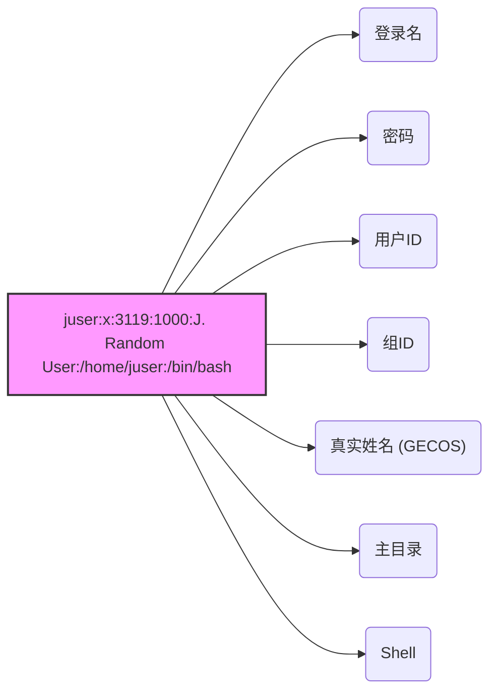
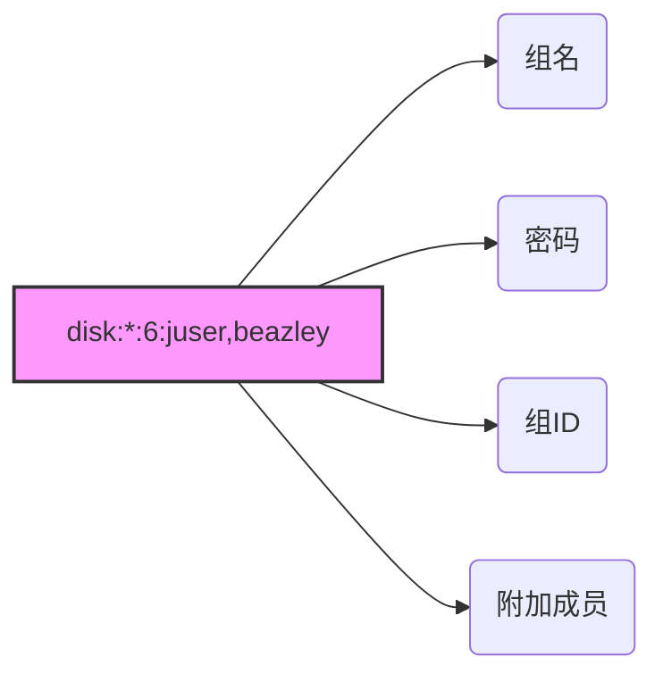

# 第7章：系统配置：日志、时间、定时任务和用户

当你第一次查看 `/etc` 目录来探索系统配置时，可能会感到有些不知所措。好消息是，尽管你看到的绝大多数文件都在某种程度上影响系统操作，但只有少数是关键性的。

本章涵盖系统的那些部分，这些部分使得第4章讨论的基础设施可供我们通常交互的用户空间软件（例如第2章介绍的工具）使用。具体来说，我们将关注以下内容：

-   系统日志记录
-   系统库用于获取服务器和用户信息的配置文件
-   一些选定的服务器程序（有时称为守护进程），它们在系统启动时运行
-   可用于调整服务器程序和配置文件的配置工具
-   时间配置
-   周期性任务调度

`systemd` 的广泛使用减少了典型 Linux 系统上基本的、独立守护进程的数量。一个例子是系统日志（syslogd）守护进程，其功能现在主要由 `systemd` 内置的守护进程（journald）提供。尽管如此，一些传统的守护进程仍然存在，例如 `crond` 和 `atd`。

与之前章节一样，本章几乎不涉及网络内容，因为网络是系统的一个独立构建模块。在第9章中，你将看到网络的定位。

## 7.1 系统日志记录

大多数系统程序将其诊断输出作为消息写入 syslog 服务。传统的 `syslogd` 守护进程通过等待消息并在收到消息后将其发送到适当的通道（例如文件或数据库）来执行此服务。在大多数现代系统上，`journald`（随 `systemd` 提供）完成大部分工作。虽然本书将重点放在 `journald` 上，但我们也会涵盖传统 `syslog` 的许多方面。

系统日志记录是系统最重要的部分之一。当出现问题时，如果你不知道从哪里开始，检查日志始终是明智的做法。如果你有 `journald`，可以使用 `journalctl` 命令，我们将在第7.1.2节中介绍。在较旧的系统上，你需要直接检查日志文件。无论哪种情况，日志消息看起来像这样：

```
Aug 19 17:59:48 duplex sshd[484]: Server listening on 0.0.0.0 port 22.
```

日志消息通常包含重要信息，例如进程名称、进程 ID 和时间戳。还可能有两个其他字段：设施（一般类别）和严重性（消息的紧急程度）。我们稍后将更详细地讨论它们。

由于旧软件组件和新软件组件的各种组合，理解 Linux 系统中的日志记录可能有点挑战性。某些发行版（如 Fedora）已转向仅使用 `journald` 的默认配置，而其他发行版则在 `journald` 旁边运行旧版 `syslogd`（例如 `rsyslogd`）的一个版本。较旧的发行版和一些专用系统可能根本不使用 `systemd`，并且只有一种 `syslogd` 版本。此外，一些软件系统完全绕过标准化日志记录，自己写入日志。

### 7.1.1 检查你的日志设置

你应该检查自己的系统以查看安装了哪种类型的日志记录。方法如下：

1.  检查 `journald`：如果你正在运行 `systemd`，几乎肯定有它。虽然你可以在进程列表中查找 `journald`，但最简单的方法是直接运行 `journalctl`。如果 `journald` 在你的系统上处于活动状态，你将得到一页一页的日志消息列表。
2.  检查 `rsyslogd`：在进程列表中查找 `rsyslogd`，并查找 `/etc/rsyslog.conf`。
3.  如果没有 `rsyslogd`，请检查 `syslog-ng`（另一个 `syslogd` 版本），查找名为 `/etc/syslog-ng` 的目录。

继续你的探索，在 `/var/log` 中查找日志文件。如果你有某个版本的 `syslogd`，此目录应包含许多文件，其中大部分是由你的 syslog 守护进程创建的。然而，这里也会有一些由其他服务维护的文件；两个例子是 `wtmp` 和 `lastlog`，它们是诸如 `last` 和 `lastlog` 之类的工具为了获取登录记录而访问的日志文件。

此外，`/var/log` 中可能还有包含日志文件的子目录。这些几乎总是来自其他服务。其中一个子目录 `/var/log/journal` 是 `journald` 存储其（二进制）日志文件的地方。

### 7.1.2 搜索和监控日志

除非你的系统没有 `journald`，或者你正在搜索由其他实用程序维护的日志文件，否则你将通过 journal 进行搜索。不指定参数时，`journalctl` 访问工具就像消防水带一样，提供 journal 中的所有消息，从最旧的开始（就像它们在日志文件中出现的那样）。幸运的是，`journalctl` 默认使用分页程序（如 `less`）来显示消息，这样你的终端就不会被淹没。你可以使用分页程序搜索消息，并使用 `journalctl -r` 反转消息时间顺序，但有更好的查找日志的方法。

> [!NOTE] **注意**
> 要获得 journal 消息的完全访问权限，你需要以 root 身份或作为属于 `adm` 或 `systemd-journal` 组的用户身份运行 `journalctl`。大多数发行版的默认用户具有访问权限。

通常，你可以通过将字段直接添加到命令行来搜索 journal 的各个字段；例如，运行 `journalctl _PID=8792` 来搜索来自进程 ID 8792 的消息。然而，最强大的过滤功能更通用。如果你需要多个条件，可以指定一个或多个。

#### 按时间过滤

`-S`（since）选项是缩小特定时间范围的最有用的选项之一。以下是一个最简单且最有效使用方式的示例：

```bash
$ journalctl -S -4h
```

此命令中的 `-4h` 部分看起来像是一个选项，但实际上它是一个时间规范，告诉 `journalctl` 搜索当前时区过去四小时内的消息。你也可以使用特定日期和/或时间的组合：

```bash
$ journalctl -S 06:00:00
$ journalctl -S 2020-01-14
$ journalctl -S '2020-01-14 14:30:00'
```

`-U`（until）选项的工作方式相同，指定 `journalctl` 应检索消息的截止时间。然而，它通常没那么有用，因为你通常会翻页或搜索消息直到找到所需内容，然后退出。

#### 按单元过滤

另一种快速有效的获取相关日志的方法是按 systemd 单元过滤。你可以通过 `-u` 选项来实现，如下所示：

```bash
$ journalctl -u cron.service
```

按单元过滤时，通常可以省略单元类型（此例中的 `.service`）。

如果你不知道特定单元的名称，请尝试使用以下命令列出 journal 中的所有单元：

```bash
$ journalctl -F _SYSTEMD_UNIT
```

`-F` 选项显示 journal 中特定字段的所有值。

#### 查找字段

有时你只需要知道要搜索哪个字段。你可以按如下方式列出所有可用字段：

```bash
$ journalctl -N
```

任何以下划线开头的字段（例如前面示例中的 `_SYSTEMD_UNIT`）都是受信任的字段；发送消息的客户端无法更改这些字段。

#### 按文本过滤

搜索日志文件的经典方法是使用 `grep` 扫描所有文件，希望找到相关行或文件中可能包含更多信息的位置。类似地，你可以使用 `-g` 选项通过正则表达式搜索 journal 消息，如下例所示，该示例将返回包含 `kernel` 后跟某处 `memory` 的消息：

```bash
$ journalctl -g 'kernel.*memory'
```

不幸的是，当你以这种方式搜索 journal 时，只能获得与表达式匹配的消息。通常，重要信息可能在时间上相近。尝试从匹配项中提取时间戳，然后使用 `-S` 选项指定稍早一点的时间运行 `journalctl`，以查看同时出现的消息。

> [!NOTE] **注意**
> `-g` 选项需要一个包含特定库的 `journalctl` 构建版本。某些发行版不包含支持 `-g` 的版本。

#### 按启动过滤

通常，你需要查看机器启动时或关机（并重启）前一段时间内的日志消息。只获取某一次启动（从机器启动到停止）的消息非常容易。例如，如果你想查找当前启动的开始，只需使用 `-b` 选项：

```bash
$ journalctl -b
```

你也可以添加一个偏移量；例如，要从前一次启动开始，使用偏移量 `-1`：

```bash
$ journalctl -b -1
```

> [!NOTE] **注意**
> 你可以通过组合 `-b` 和 `-r`（反向）选项快速检查机器在上一个周期中是否正常关机。尝试一下；如果输出看起来像这个示例，则表明关机是干净的：
> ```bash
> $ journalctl -r -b -1
> -- Logs begin at Wed 2019-04-03 12:29:31 EDT, end at Fri 2019-08-02 19:10:14 EDT. --
> Jul 18 12:19:52 mymachine systemd-journald[602]: Journal stopped
> Jul 18 12:19:52 mymachine systemd-shutdown[1]: Sending SIGTERM to remaining processes...
> Jul 18 12:19:51 mymachine systemd-shutdown[1]: Syncing filesystems and block devices.
> ```

除了像 `-1` 这样的偏移量，你还可以按 ID 查看启动。运行以下命令以获取启动 ID：

```bash
$ journalctl --list-boots
-1 e598bd09e5c046838012ba61075dccbb Fri 2019-03-22 17:20:01 EDT—Fri 2019-04-12 08:13:52 EDT
 0 5696e69b1c0b42d58b9c57c31d8c89cc Fri 2019-04-12 08:15:39 EDT—Fri 2019-08-02 19:17:01 EDT
```

最后，你可以使用 `journalctl -k` 显示内核消息（无论是否选择特定启动）。

#### 按严重性/优先级过滤

某些程序会产生大量的诊断消息，这些消息可能会掩盖重要的日志。你可以通过指定 `-p` 选项旁边的值（0 表示最重要，7 表示最不重要）来按严重性级别过滤。例如，要获取级别 0 到 3 的日志，运行：

```bash
$ journalctl -p 3
```

如果你只想要特定一组严重性级别的日志，请使用 `..` 范围语法：

```bash
$ journalctl -p 2..3
```

按严重性过滤听起来可能会节省大量时间，但你可能不会发现它有太多用处。默认情况下，大多数应用程序不会生成大量信息性数据，尽管有些包含启用更详细日志记录的配置选项。

#### 简单的日志监控

一种传统的日志监控方法是使用 `tail -f` 或 `less` 的跟随模式（`less +F`）查看日志文件，以查看系统日志记录器发送的消息。这不是非常有效的常规系统监控实践（很容易错过某些内容），但在尝试查找问题或实时更仔细地检查启动和运行时，它对于检查某个服务很有用。

`tail -f` 不适用于 `journald`，因为它不使用纯文本文件；相反，你可以使用 `journalctl` 的 `-f` 选项来产生相同的效果，即实时打印日志：

```bash
$ journalctl -f
```

这个简单的调用对于大多数需求来说已经足够好了。但是，如果你的系统有相当稳定的日志消息流，而这些消息与你正在寻找的内容无关，你可能需要添加一些前面的过滤选项。

## 7.1.3 日志文件轮换

当使用 syslog 守护进程时，系统记录的每条日志消息都会被写入某个日志文件，这意味着你需要偶尔删除旧消息，以免它们最终消耗掉所有存储空间。不同发行版的处理方式不同，但大多数都使用 `logrotate` 工具。

该机制称为**日志轮换**。由于传统文本日志文件的开头包含最旧的消息，末尾包含最新的消息，因此仅从文件中删除较旧的消息以释放空间相当困难。相反，由 `logrotate` 维护的日志被分成多个块。

> [!NOTE] 轮换示例
> 假设在 `/var/log` 中有一个名为 `auth.log` 的日志文件，包含最近的日志消息。然后还有 `auth.log.1`、`auth.log.2` 和 `auth.log.3`，每个文件包含逐渐更旧的数据。当 `logrotate` 决定删除旧数据时，它会像这样“轮换”文件：
> 1. 删除最旧的文件 `auth.log.3`。
> 2. 将 `auth.log.2` 重命名为 `auth.log.3`。
> 3. 将 `auth.log.1` 重命名为 `auth.log.2`。
> 4. 将 `auth.log` 重命名为 `auth.log.1`。

名称和一些细节在各发行版中有所不同。例如，Ubuntu 配置指定 `logrotate` 应压缩从“1”位置移动到“2”位置的文件，因此在上面的例子中，你会得到 `auth.log.2.gz` 和 `auth.log.3.gz`。在其他发行版中，`logrotate` 使用日期后缀重命名日志文件，例如 `-20200529`。这种方案的一个优点是更容易找到特定时间的日志文件。

你可能想知道，如果 `logrotate` 在另一个工具（如 `rsyslogd`）想要写入日志文件的同时进行轮换会发生什么。例如，假设日志程序打开日志文件进行写入，但在 `logrotate` 执行重命名之前没有关闭它。在这种不太常见的情况下，日志消息会成功写入，因为在 Linux 中，一旦文件打开，I/O 系统就无法知道它已被重命名。但请注意，消息出现的文件将是具有新名称的文件，例如 `auth.log.1`。

如果 `logrotate` 已经在日志程序尝试打开文件之前重命名了它，那么 `open()` 系统调用会创建一个新的日志文件（例如 `auth.log`），就像 `logrotate` 未运行一样。

## 7.1.4 日志维护

存储在 `/var/log/journal` 中的日志不需要轮换，因为 `journald` 本身可以识别并删除旧消息。与传统日志管理不同，`journald` 通常根据日志文件系统上剩余的空间量、日志应占文件系统的百分比以及设置的最大日志大小来决定删除消息。日志管理还有其他选项，例如日志消息的最大允许期限。你可以在 `journald.conf(5)` 手册页中找到默认值以及其他设置的说明。

## 7.1.5 系统日志深入分析

现在你已经了解了一些 syslog 和日志的运作细节，是时候退一步，看看日志系统为何以及如何以这种方式工作。这个讨论更偏向理论而非实践；你可以直接跳到本书的下一个主题而不会有问题。

在 1980 年代，出现了一个差距：Unix 服务器需要一种记录诊断信息的方式，但当时没有标准。当 syslog 随 sendmail 邮件服务器出现时，它被证明足够合理，以至于其他服务的开发者迅速采用了它。RFC 3164 描述了 syslog 的演变。

该机制相当简单。传统的 `syslogd` 在 Unix 域套接字 `/dev/log` 上监听并等待消息。`syslogd` 的一个额外强大功能是，除了 `/dev/log` 之外，还可以监听网络套接字，使客户端机器能够通过网络发送消息。

这使得将整个网络的所有 syslog 消息集中到一个日志服务器成为可能，因此 syslog 在网络管理员中非常流行。许多网络设备，如路由器和嵌入式设备，可以充当 syslog 客户端，将其诊断消息发送到服务器。

Syslog 具有经典的客户端-服务器架构，包括其自己的协议（目前在 RFC 5424 中定义）。然而，该协议并非一直标准化，早期版本除了基础内容外没有容纳太多结构。使用 syslog 的程序员被期望为其应用程序设计一个描述性、清晰且简洁的日志消息格式。随着时间的推移，该协议在尽可能保持向后兼容的同时增加了新功能。

### 设施、严重性和其他字段

由于 syslog 将来自不同服务的各种类型消息发送到不同目的地，它需要一种对每条消息进行分类的方法。传统方法是使用设施和严重性的编码值，这些值通常（但并非总是）包含在消息中。除了文件输出，即使是非常老版本的 `syslogd` 也能够根据消息的设施和严重性将重要消息发送到控制台或直接发送给特定的登录用户——这是早期系统监控工具。

- **设施**是服务的一般类别，标识消息发送者。设施包括服务和系统组件，例如内核、邮件系统和打印机。
- **严重性**是日志消息的紧急程度。有 8 个级别，编号为 0 到 7。它们通常通过名称引用，尽管名称并不一致且在不同实现中有所变化：
  - 0: emerg
  - 1: alert
  - 2: crit
  - 3: err
  - 4: warning
  - 5: notice
  - 6: info
  - 7: debug

设施和严重性共同构成优先级，在 syslog 协议中打包为一个数字。你可以在 RFC 5424 中阅读关于这些字段的所有内容，在 `syslog(3)` 手册页中了解如何在应用程序中指定它们，并在 `rsyslog.conf(5)` 手册页中了解如何匹配它们。

> [!WARNING] 术语差异
> 然而，当将它们转换到 journald 世界时，你可能会遇到一些混淆，在 journald 中严重性被称为优先级（例如，当你运行 `journalctl -o json` 获取机器可读的日志输出时）。不幸的是，当你开始检查协议中优先级部分的细节时，你会发现它未能跟上操作系统其他部分的变化和需求。严重性定义仍然有效，但可用的设施是硬编码的，包括很少使用的服务（如 UUCP），并且没有办法定义新的设施（只有一组通用的 `local0` 到 `local7` 插槽）。

我们已经讨论过日志数据中的一些其他字段，但 RFC 5424 还包括结构化数据的条款，即应用程序程序员可以用来定义自己字段的任意键值对集合。虽然通过这些可以用于 journald（需要一些额外工作），但更常见的是将它们发送到其他类型的数据库。

### Syslog 与 journald 的关系

某些系统上 journald 完全取代了 syslog，这可能会让你想知道为什么其他系统上仍然保留 syslog。主要有两个原因：

- **Syslog 具有定义明确的方法来汇总多台机器的日志。** 当日志只在一台机器上时，监控它们要容易得多。
- **像 `rsyslogd` 这样的 syslog 版本是模块化的，能够输出到许多不同的格式和数据库（包括日志格式）。** 这使得更容易将它们连接到分析和监控工具。

相比之下，journald 强调将单台机器的日志输出收集并组织成单一格式。

当你想要做更复杂的事情时，journald 将其日志输入不同日志记录器的能力提供了高度的灵活性。当你考虑 systemd 可以收集服务器单元的输出并将其发送到 journald 时，这一点尤其如此，从而使你能够访问比应用程序发送给 syslog 的更多的日志数据。

### 关于日志记录的最终说明

Linux 系统上的日志记录在其历史上发生了显著变化，并且几乎可以肯定它将继续演变。目前，在单台机器上收集、存储和检索日志的过程定义明确，但日志记录的其他方面尚未标准化。

首先，当你想通过网络聚合和存储日志时，有大量令人眼花缭乱的选择。集中式日志服务器不再仅仅将日志存储在文本文件中，现在日志可以进入数据库，而且集中式服务器本身常常被互联网服务取代。

其次，日志消费的性质发生了变化。曾几何时，日志不被视为“真正”的数据；它们的主要目的是在出现问题时供（人类）管理员阅读的资源。然而，随着应用程序变得越来越复杂，日志记录的需求也在增长。这些新需求包括搜索、提取、显示和分析日志内部数据的能力。虽然我们有很多将日志存储在数据库中的方法，但在应用程序中使用日志的工具仍处于起步阶段。

最后，还有确保日志可信的问题。最初的 syslog 没有身份验证可言；你只是相信发送日志的任何应用程序和/或机器说的是实话。此外，日志未加密，使其容易受到网络窃听。这在需要高安全性的网络中是一个严重风险。当代的 syslog 服务器有标准的加密日志消息和验证来源机器的方法。然而，当深入到单个应用程序时，情况变得不那么清晰。例如，你如何确定自称是你的 Web 服务器的那个东西实际上就是 Web 服务器？

我们将在本章后面探讨一些稍微高级的身份验证主题。但现在，让我们继续讨论系统配置文件组织的基础知识。

# 7.2  /etc 的结构

Linux 系统上大多数系统配置文件都位于 `/etc` 中。历史上，每个程序或系统服务在该目录下都有一个或多个配置文件，由于 Unix 系统上的组件数量庞大，`/etc` 会迅速积累大量文件。

这种做法存在两个问题：在运行的系统中很难找到特定的配置文件，而且以这种方式维护系统也很困难。例如，如果你想更改 sudo 配置，就必须编辑 `/etc/sudoers`。但修改后，发行版升级可能会覆盖你的自定义内容，因为它会重写 `/etc` 下的所有内容。

多年来的趋势是将系统配置文件放置到 `/etc` 的子目录中，正如你已经看到的 systemd 使用了 `/etc/systemd`。`/etc` 中仍有一些单独的配置文件，但如果你运行 `ls -F /etc`，会发现其中大多数项目现在都是子目录。

为了解决覆盖配置文件的问题，现在可以将自定义配置放在配置子目录中的单独文件里，例如 `/etc/grub.d` 中的文件。

`/etc` 中能找到哪些类型的配置文件？基本准则是：针对单台机器的可自定义配置（例如用户信息 `/etc/passwd` 和网络详情 `/etc/network`）放在 `/etc` 中。然而，通用的应用程序细节（例如发行版用户界面的默认设置）不属于 `/etc`。不打算被自定义的系统默认配置文件通常也位于别处，例如预打包的 systemd 单元文件位于 `/usr/lib/systemd`。

你已经看到了一些与启动相关的配置文件。接下来，让我们看看用户是如何在系统上配置的。

# 7.3  用户管理文件

Unix 系统允许多个独立用户。在内核层面，用户只是数字（用户 ID），但由于记住名字比数字容易得多，你在管理 Linux 时通常使用用户名（或登录名）。用户名只存在于用户空间，因此任何使用用户名的程序在与内核通信时都需要找到对应的用户 ID。

## 7.3.1  `/etc/passwd` 文件

纯文本文件 `/etc/passwd` 将用户名映射到用户 ID。它看起来像清单 7-1。

```text
root:x:0:0:Superuser:/root:/bin/sh
daemon:*:1:1:daemon:/usr/sbin:/bin/sh
bin:*:2:2:bin:/bin:/bin/sh
sys:*:3:3:sys:/dev:/bin/sh
nobody:*:65534:65534:nobody:/home:/bin/false
juser:x:3119:1000:J. Random User:/home/juser:/bin/bash
beazley:x:143:1000:David Beazley:/home/beazley:/bin/bash
```
*清单 7-1: `/etc/passwd` 中的用户列表*

每行代表一个用户，有七个以冒号分隔的字段。第一个是用户名。

接下来是用户的加密密码，或者至少曾经是密码的字段。在大多数 Linux 系统上，密码实际上不再存储在 passwd 文件中，而是存储在 shadow 文件中（参见第 7.3.3 节）。shadow 文件的格式与 passwd 类似，但普通用户没有 shadow 的读取权限。passwd 或 shadow 中的第二个字段是加密密码，看起来像一堆不可读的垃圾，例如 `d1CVEWiB/oppc`。Unix 密码从不以明文存储；实际上，该字段不是密码本身，而是它的派生值。在大多数情况下，从这个字段中获取原始密码异常困难（假设密码不容易猜测）。

passwd 文件第二个字段中的 `x` 表示加密密码存储在 shadow 文件中（系统应已配置）。星号 `*` 表示该用户无法登录。

如果此密码字段为空（即看到两个连续的冒号，如 `::`），则无需密码即可登录。当心这样的空密码。绝不应允许用户无需密码登录。

剩余的 passwd 字段如下：

- **用户 ID (UID)**：用户在内核中的表示。你可以有两个相同 UID 的条目，但这样会让你困惑——也可能让你的软件困惑——因此请保持用户 ID 唯一。
- **组 ID (GID)**：应该是 `/etc/group` 中的一个编号条目。组决定文件权限以及其他很少的内容。这个组也称为用户的**主组**。
- **用户真实姓名**（通常称为 GECOS 字段）。有时你会在该字段中发现逗号，表示房间号和电话号码。
- **用户主目录**。
- **用户的 shell**（用户运行终端会话时执行的程序）。

图 7-1 标识了清单 7-1 中一个条目的各个字段。



*图 7-1: 密码文件中的一个条目*

`/etc/passwd` 文件的语法相当严格，不允许有注释或空行。

> [!NOTE] 账户
> `/etc/passwd` 中的用户以及对应的主目录统称为**账户**。但请记住，这是用户空间的约定。通常，passwd 文件中的条目就足以认定一个账户；主目录不一定需要存在才能让大多数程序识别一个账户。此外，还有在不将用户显式包含在 passwd 文件中的情况下添加用户的方法；例如，使用 NIS（网络信息服务）或 LDAP（轻量级目录访问协议）从网络服务器添加用户曾经很常见。

## 7.3.2  特殊用户

你会在 `/etc/passwd` 中发现一些特殊用户。超级用户 (root) 始终具有 UID 0 和 GID 0，如清单 7-1 所示。某些用户（如 daemon）没有登录权限。nobody 用户是一个特权极低的用户；某些进程以 nobody 身份运行，因为它通常无法写入系统上的任何内容。

无法登录的用户称为**伪用户**。虽然他们无法登录，但系统可以以其用户 ID 启动进程。诸如 nobody 之类的伪用户通常出于安全原因而创建。

再次强调，这些都是用户空间的约定。这些用户对内核没有特殊含义；唯一对内核有特殊意义的用户 ID 是超级用户的 0。可以像对待任何其他用户一样，给予 nobody 用户对系统上所有内容的访问权限。

## 7.3.3  `/etc/shadow` 文件

Linux 系统上的影子密码文件 (`/etc/shadow`) 通常包含用户认证信息，包括加密密码和与 `/etc/passwd` 中用户对应的密码过期信息。

引入 shadow 文件是为了提供一种更灵活（或许也更安全）的存储密码的方式。它包含一套库和实用程序，其中许多很快被 [[PAM]]（可插拔认证模块；我们将在第 7.10 节介绍这个高级主题）的部分组件取代。PAM 没有为 Linux 引入一套全新的文件，而是使用了 `/etc/shadow`，但不会使用某些对应的配置文件（如 `/etc/login.defs`）。

## 7.3.4  操作用户和密码

普通用户通过 `passwd` 命令和其他一些工具与 `/etc/passwd` 交互。使用 `passwd` 更改密码。可以使用 `chfn` 和 `chsh` 分别更改真实姓名和 shell（shell 必须在 `/etc/shells` 中列出）。这些都是 suid-root 可执行文件，因为只有超级用户才能更改 `/etc/passwd` 文件。

### 以超级用户身份更改 `/etc/passwd`

由于 `/etc/passwd` 只是一个普通的纯文本文件，超级用户在技术上可以使用任何文本编辑器进行更改。要添加用户，可以简单地添加一行并创建用户的 home 目录；要删除，则做相反操作。

然而，像这样直接编辑 passwd 是个坏主意。不仅容易出错，而且如果同时有其他程序在进行 passwd 更改，你可能会遇到并发问题。使用终端或 GUI 提供的单独命令来更改用户要容易得多（也更安全）。例如，要设置用户密码，以超级用户身份运行 `passwd user`。分别使用 `adduser` 和 `userdel` 添加和删除用户。

但是，如果你真的必须直接编辑该文件（例如，如果它以某种方式损坏了），请使用 `vipw` 程序，它会在编辑时备份并锁定 `/etc/passwd` 作为额外的预防措施。要编辑 `/etc/shadow` 而不是 `/etc/passwd`，请使用 `vipw -s`。（希望你永远不需要执行这些操作。）

## 7.3.5  使用组

Unix 中的组提供了一种在特定用户之间共享文件的方式。其思想是，你可以为特定组设置读取或写入权限位，而排除其他所有人。这个功能曾经很重要，因为许多用户共享一台机器或网络，但随着工作站共享频率的降低，它在近年来的重要性有所下降。

`/etc/group` 文件定义了组 ID（例如在 `/etc/passwd` 文件中找到的那些）。清单 7-2 是一个示例。

```text
root:*:0:juser
daemon:*:1:
bin:*:2:
sys:*:3:
adm:*:4:
disk:*:6:juser,beazley
nogroup:*:65534:
user:*:1000:
```
*清单 7-2: 一个示例 `/etc/group` 文件*

与 `/etc/passwd` 文件一样，`/etc/group` 中的每一行都是由冒号分隔的字段集合。每个条目中的字段从左到右依次如下：

- **组名**：当你运行诸如 `ls -l` 之类的命令时会出现。
- **组密码**：Unix 组密码几乎从未使用过，你也不应使用它们（在大多数情况下，sudo 是一个很好的替代）。使用 `*` 或任何其他默认值。这里的 `x` 表示在 `/etc/gshadow` 中有对应的条目，并且这几乎总是一个禁用的密码，用 `*` 或 `!` 表示。
- **组 ID（数字）**：GID 在组文件中必须唯一。这个数字会进入相应用户的 `/etc/passwd` 条目的组字段中。
- **一个可选的属于该组的用户列表**：除了在这里列出的用户外，在 passwd 文件条目中具有相应组 ID 的用户也属于该组。

图 7-2 标识了组文件条目中的字段。



*图 7-2: 组文件中的一个条目*

要查看你所属的组，请运行 `groups`。

> [!NOTE] 用户组
> Linux 发行版通常为每个新添加的用户创建一个新组，名称与用户相同。

# 7.4  getty 和 login

getty 程序连接到终端并显示登录提示符。在大多数 Linux 系统上，getty 并不复杂，因为系统仅将其用于虚拟终端上的登录。在进程列表中，它通常看起来像这样（例如，在 `/dev/tty1` 上运行时）：

```bash
$ ps ao args | grep getty
/sbin/agetty -o -p -- \u --noclear tty1 linux
```

在许多系统上，你可能直到用类似 `Ctrl-Alt-F1` 的操作访问虚拟终端时才能看到 getty 进程。此示例展示了 agetty，这是许多 Linux 发行版默认包含的版本。

输入登录名后，getty 会替换自身为 login 程序，该程序会询问密码。如果输入正确的密码，login 会使用 `exec()` 替换自身为你的 shell。否则，你会收到“Login incorrect”消息。login 程序的许多实际认证工作由 [[PAM]] 处理（参见第 7.10 节）。

## 7.5 设置时间

Unix 机器依赖精确的时间。内核维护着系统时钟，当你运行 `date` 等命令时，使用的就是系统时钟。你也可以用 `date` 命令设置系统时钟，但这通常不是好主意，因为你永远无法精确调准时间。你的系统时钟应尽可能接近正确时间。

PC 硬件有一个电池供电的实时时钟（RTC）。RTC 虽然不是世界上最好的时钟，但总比没有好。内核通常在启动时根据 RTC 设置时间，你也可以用 `hwclock` 将系统时钟重置为当前硬件时间。为了避免时区或夏令时修正带来的麻烦，请将硬件时钟设置为协调世界时（UTC）。你可以用以下命令将 RTC 设置为内核的 UTC 时钟：

```bash
# hwclock --systohc --utc
```

不幸的是，内核比 RTC 更不擅长计时，而且由于 Unix 机器通常单次启动后持续运行数月或数年，它们很容易出现时间漂移。时间漂移是内核时间与真实时间（由原子钟或其他非常精确的时钟定义）之间的当前差异。

你不应该用 `hwclock` 来修正时间漂移，因为基于时间的系统事件可能会丢失或混乱。你可以运行 `adjtimex` 这样的工具，根据 RTC 平滑地更新时钟，但通常最好用网络时间守护进程来保持系统时间的正确（参见 7.5.2 节）。

### 7.5.1 内核时间表示与时区

内核的系统时钟将当前时间表示为自 1970 年 1 月 1 日 00:00:00 UTC 以来的秒数。要查看当前这个数字，运行：

```bash
$ date +%s
```

要将这个数字转换为人类可读的形式，用户空间程序会将其转换为本地时间，并补偿夏令时以及任何其他奇怪情况（比如生活在印第安纳州）。本地时区由 `/etc/localtime` 文件控制。（别费劲去查看它了；这是一个二进制文件。）

系统上的时区文件位于 `/usr/share/zoneinfo`。你会看到这个目录包含很多时区和时区的别名。要手动设置系统的时区，可以将 `/usr/share/zoneinfo` 中的一个文件复制（或创建符号链接）到 `/etc/localtime`，或者使用发行版的时区工具进行更改。命令行程序 `tzselect` 可能有助于你识别时区文件。

要在单个 shell 会话中使用不同于系统默认的时区，将 `TZ` 环境变量设置为 `/usr/share/zoneinfo` 中某个文件的名称，然后测试更改，如下所示：

```bash
$ export TZ=US/Central
$ date
```

与其他环境变量一样，你也可以像这样为单条命令设置时区：

```bash
$ TZ=US/Central date
```

### 7.5.2 网络时间

如果你的机器永久连接互联网，你可以运行网络时间协议（NTP）守护进程，使用远程服务器来维持时间。这曾经由 `ntpd` 守护进程处理，但与其他许多服务一样，systemd 已经用自己的包 `timesyncd` 取代了它。大多数 Linux 发行版都包含 `timesyncd`，并且默认启用。你不需要配置它，但如果你想知道如何配置，`timesyncd.conf(5)` 手册页可以帮到你。最常见的覆盖选项是更改远程时间服务器。

如果你想改用 `ntpd`，则需要禁用已安装的 `timesyncd`。前往 https://www.ntppool.org/ 查看那里的说明。如果你仍然想使用 `timesyncd` 但搭配不同的服务器，这个网站也可能有用。

如果你的机器没有永久的互联网连接，你可以使用 `chronyd` 这样的守护进程在断开连接期间维持时间。

你还可以基于网络时间设置硬件时钟，以帮助系统在重启时保持时间一致性。许多发行版会自动执行此操作，但要手动执行，请确保系统时间已通过网络设置，然后运行以下命令：

```bash
# hwclock --systohc --utc
```

## 7.6 使用 cron 和 Timer 单元调度重复任务

有两种方法可以按重复计划运行程序：cron 和 systemd timer 单元。这种能力对于自动化系统维护任务至关重要。一个例子是日志文件轮换工具，以确保你的硬盘不会填满旧的日志文件（如本章前面所述）。cron 服务长期以来一直是执行此操作的既定标准，我们将详细介绍它。然而，systemd 的 timer 单元在某些情况下是 cron 的替代方案，具有优势，因此我们也将了解如何使用它们。

你可以使用 cron 在任何合适的时间运行任何程序。通过 cron 运行的程序称为 **cron 作业**。要安装 cron 作业，你需要在 **crontab 文件** 中创建一行条目，通常通过运行 `crontab` 命令来完成。例如，以下 crontab 文件条目将 `/home/juser/bin/spmake` 命令安排在每天上午 9:15（本地时区）运行：

```
15 09 * * * /home/juser/bin/spmake
```

该行开头的五个字段由空白分隔，指定了计划时间（另见图 7-3）。字段如下，按顺序：

- **分钟**（0 到 59）。此 cron 作业设置为第 15 分钟。
- **小时**（0 到 23）。此作业设置为第 9 小时。
- **月份中的日期**（1 到 31）。
- **月份**（1 到 12）。
- **星期几**（0 到 7）。数字 0 和 7 表示星期日。

```
15 09 * * * /home/juser/bin/spmake
 ↑   ↑  ↑  ↑  ↑
命令
分钟 小时 月份中的日期 月份 星期几
```

**图 7-3：crontab 文件中的条目**

在任何字段中使用星号 (`*`) 表示匹配每个值。上面的例子每天运行 `spmake`，因为月份中的日期、月份和星期几字段都填入了星号，cron 解读为“每天、每月、每周的任何一天都运行此作业”。

要让 `spmake` 仅在每个月的第 14 天运行，你可以使用以下 crontab 行：

```
15 09 14 * * /home/juser/bin/spmake
```

你可以在每个字段中选择多个时间。例如，要在每个月的第 5 天和第 14 天运行该程序，可以在第三个字段中输入 `5,14`：

```
15 09 5,14 * * /home/juser/bin/spmake
```

> [!NOTE]
> 如果 cron 作业产生标准输出或错误，或异常退出，cron 应该通过电子邮件将信息发送给 cron 作业的所有者（假设你的系统上电子邮件正常工作）。如果你觉得邮件烦人，可以将输出重定向到 `/dev/null` 或其他日志文件。

`crontab(5)` 手册页提供了关于 crontab 格式的完整信息。

### 7.6.1 安装 Crontab 文件

每个用户都可以拥有自己的 crontab 文件，这意味着每个系统可能包含多个 crontab，通常位于 `/var/spool/cron/crontabs` 中。普通用户无法写入此目录；`crontab` 命令负责安装、列出、编辑和删除用户的 crontab。

安装 crontab 最简单的方法是将你的 crontab 条目放入一个文件，然后使用 `crontab file` 将文件安装为当前的 crontab。`crontab` 命令会检查文件格式，确保你没有犯任何错误。要列出你的 cron 作业，运行 `crontab -l`。要删除 crontab，使用 `crontab -r`。

在你创建了初始 crontab 之后，使用临时文件进行后续编辑会有点混乱。相反，你可以用 `crontab -e` 命令一步完成编辑和安装。如果你犯了错误，`crontab` 应该会告诉你错误位置，并询问你是否要重试编辑。

### 7.6.2 系统 Crontab 文件

许多常见的由 cron 激活的系统任务都以超级用户身份运行。然而，与其编辑和维护超级用户的 crontab 来调度这些任务，Linux 发行版通常会有一个系统级的 `/etc/crontab` 文件。你不会使用 `crontab` 来编辑这个文件，而且它的格式略有不同：在要运行的命令之前，有一个额外的字段指定应该运行该作业的用户。（这使你能够将系统任务分组在一起，即使它们并非都由同一个用户运行。）例如，在 `/etc/crontab` 中定义的以下 cron 作业在早上 6:42 以超级用户（root¹）身份运行：

```
42 6 * * * root¹ /usr/local/bin/cleansystem > /dev/null 2>&1
```

> [!NOTE]
> 某些发行版将额外的系统 crontab 文件存放在 `/etc/cron.d` 目录中。这些文件可以有任意名称，但它们的格式与 `/etc/crontab` 相同。也可能存在像 `/etc/cron.daily` 这样的目录，但这里的文件通常是由 `/etc/crontab` 或 `/etc/cron.d` 中的特定 cron 作业运行的脚本。有时追踪作业的位置和运行时间可能会令人困惑。

### 7.6.3 Timer 单元

为周期性任务创建 cron 作业的另一种方法是构建一个 systemd timer 单元。对于一个全新的任务，你必须创建两个单元：一个 timer 单元和一个 service 单元。需要两个单元的原因是 timer 单元不包含要执行的任务的任何细节；它只是一种激活机制，用于运行 service 单元（或者概念上，另一种单元，但最常见的用法是用于 service 单元）。

让我们看一个典型的 timer/service 单元对，首先看 timer 单元。我们将其命名为 `loggertest.timer`；与其他自定义单元文件一样，我们将其放在 `/etc/systemd/system` 中（见清单 7-3）。

```ini
[Unit]
Description=Example timer unit

[Timer]
OnCalendar=*-*-* *:00,20,40
Unit=loggertest.service

[Install]
WantedBy=timers.target
```

**清单 7-3：loggertest.timer**

这个 timer 每 20 分钟运行一次，其 `OnCalendar` 选项类似于 cron 语法。在这个例子中，它每小时整点运行，以及每小时的第 20 分钟和第 40 分钟。

`OnCalendar` 的时间格式为 `年-月-日 时:分:秒`。秒字段是可选的。与 cron 一样，`*` 表示一种通配符，逗号允许列出多个值。`/` 的周期性语法也有效；在上面的例子中，你可以将 `*:00,20,40` 改为 `*:00/20`（每 20 分钟），效果相同。

¹ 原文为 `root1`，疑为笔误，但保留原样。

## 8. 第7章：系统配置：日志、时间、定时任务和用户

> [!NOTE]
> `OnCalendar` 字段中的时间语法有许多快捷方式和变体。详情请参见 `systemd.time(7)` 手册页的“Calendar Events”部分。

关联的服务单元名为 `loggertest.service`（见清单 7-4）。我们在定时器中用 `Unit` 选项显式指定了它，但这并非严格必要，因为 systemd 默认会查找与定时器单元文件同名的 `.service` 文件。该服务单元也存放在 `/etc/systemd/system` 中，其结构与你在第 6 章中看到的服务单元非常相似。

```
[Unit]
Description=Example Test Service

[Service]
Type=oneshot
ExecStart=/usr/bin/logger -p local3.debug I\'m a logger
```

**清单 7-4：loggertest.service**

其核心是 `ExecStart` 行，即服务被激活时运行的命令。这个特定示例会向系统日志发送一条消息。

注意这里将服务类型设置为 `oneshot`，表示该服务预期运行后即退出，并且 systemd 只有在 `ExecStart` 指定的命令执行完毕后才认为服务已启动。这对定时器有以下几个优点：

*   可以在单元文件中指定多个 `ExecStart` 命令。第 6 章中看到的其他服务单元样式不允许这样做。
*   使用 `Wants` 和 `Before` 依赖指令激活其他单元时，更容易控制严格的依赖顺序。
*   在日志中可以更好地记录单元的启动和结束时间。

> [!NOTE]
> 在这个单元示例中，我们使用 `logger` 向 syslog 和日志发送一条条目。你在 7.1.2 节中曾了解到可以按单元查看日志消息。然而，单元可能在 journald 有机会接收消息之前就结束了。这是一个竞态条件，如果单元完成得太快，journald 将无法查找与 syslog 消息关联的单元（这是通过进程 ID 完成的）。因此，写入日志的消息可能不包含 `unit` 字段，从而导致 `journalctl -f -u loggertest.service` 这样的过滤命令无法显示 syslog 消息。在长时间运行的服务中，这通常不是问题。

### 7.6.4 cron 与定时器单元的对比

cron 工具是 Linux 系统中最古老的组件之一；它已经存在了几十年（甚至早于 Linux 本身），其配置格式多年来变化不大。当某个东西老到这种程度时，往往会被替代。

你刚才看到的 systemd 定时器单元可能看起来是一个合乎逻辑的替代品，事实上，许多发行版现在已将系统级别的周期性维护任务迁移到了定时器单元。但事实证明，cron 也有一些优点：

*   更简单的配置
*   与许多第三方服务的兼容性
*   用户更容易安装自己的任务

定时器单元具有以下优点：

*   使用 cgroups 对与任务/单元关联的进程进行卓越的跟踪
*   在日志中对诊断信息进行出色的跟踪
*   提供更多的激活时间和频率选项
*   能够使用 systemd 依赖关系和激活机制

也许有一天，cron 任务会有一个兼容层，就像挂载单元和 `/etc/fstab` 一样。然而，仅仅是配置这一项原因，就使得 cron 格式不太可能在短期内消失。正如你将在下一节中看到的，一个名为 `systemd-run` 的工具允许创建定时器单元及关联的服务，而无需创建单元文件，但其管理和实现方式与 cron 有足够大的差异，以至于许多用户可能更倾向于 cron。我们稍后讨论 `at` 时会看到其中一些差异。

### 7.7 使用 `at` 调度一次性任务

要使用 cron 之外的方法在将来运行一次作业，可以使用 `at` 服务。例如，要在晚上 10:30 运行 `myjob`，请输入以下命令：

```bash
$ at 22:30
at> myjob
```

用 `CTRL-D` 结束输入。（`at` 工具从标准输入读取命令。）

要检查作业是否已调度，请使用 `atq`。要移除作业，请使用 `atrm`。你还可以通过添加 `DD.MM.YY` 格式的日期来将作业安排到未来的几天——例如，`at 22:30 30.09.15`。

`at` 命令没有太多其他内容。虽然它不常用，但在需要时可能非常有用。

#### 7.7.1 定时器单元等效项

你可以使用 systemd 定时器单元作为 `at` 的替代品。创建它们比前面看到的周期性定时器单元要容易得多，并且可以像这样在命令行上运行：

```bash
# systemd-run --on-calendar='2022-08-14 18:00' /bin/echo this is a test
Running timer as unit: run-rbd000cc6ee6f45b69cb87ca0839c12de.timer
Will run service as unit: run-rbd000cc6ee6f45b69cb87ca0839c12de.service
```

`systemd-run` 命令会创建一个瞬态定时器单元，你可以使用通常的 `systemctl list-timers` 命令查看它。如果你不关心具体时间，可以通过 `--on-active` 指定一个时间偏移（例如，`--on-active=30m` 表示未来 30 分钟）。

> [!NOTE]
> 使用 `--on-calendar` 时，务必同时包含一个（未来的）日历日期和时间。否则，定时器和服务单元将继续存在，定时器会在每天指定时间运行服务，就像你创建了前文所述的普通定时器单元一样。此选项的语法与定时器单元中的 `OnCalendar` 选项相同。

### 7.8 以普通用户身份运行的定时器单元

到目前为止，我们看到的所有 systemd 定时器单元都是以 root 身份运行的。也可以以普通用户身份创建定时器单元。为此，请在 `systemd-run` 中添加 `--user` 选项。

但是，如果你在单元运行之前注销，单元将不会启动；如果你在单元完成之前注销，单元将终止。这是因为 systemd 有一个与登录用户关联的用户管理器，运行定时器单元需要这个管理器。你可以通过以下命令告诉 systemd 在注销后保留用户管理器：

```bash
$ loginctl enable-linger
```

作为 root，你还可以为其他用户启用管理器：

```bash
# loginctl enable-linger user
```

### 7.9 用户访问主题

本章的其余部分将涵盖关于用户如何获得登录权限、切换到其他用户以及执行其他相关任务的几个主题。这些内容有些高级，如果你已经准备好深入了解进程内部，可以跳到下一章。

#### 7.9.1 用户 ID 与用户切换

我们已经讨论过 `sudo` 和 `su` 等 setuid 程序如何允许你临时切换用户，也涵盖了像 `login` 这样控制用户访问的系统组件。也许你想知道这些组件如何工作，以及内核在用户切换中扮演什么角色。

当你临时切换到另一个用户时，实际上你只是在更改你的用户 ID。有两种方式可以实现这一点，内核同时支持这两种方式。第一种方式是使用 setuid 可执行文件，这在 2.17 节已经介绍过。第二种方式是通过 `setuid()` 系列系统调用。这个系统调用有几种不同的版本，以适应与进程关联的各种用户 ID，你将在 7.9.2 节中了解到这些。内核对于进程可以做什么或不能做什么有基本规则，但以下是涵盖 setuid 可执行文件和 `setuid()` 的三条基本规则：

*   只要进程具有适当的文件权限，它就可以运行 setuid 可执行文件。
*   以 root（用户 ID 0）身份运行的进程可以使用 `setuid()` 变成任何其他用户。
*   不以 root 身份运行的进程在使用 `setuid()` 时受到严格限制；在大多数情况下，它不能使用。

作为这些规则的结果，如果你希望从普通用户切换到另一个用户，通常需要组合使用这些方法。例如，`sudo` 可执行文件是 setuid root，一旦运行，它就可以调用 `setuid()` 来变成另一个用户。

> [!NOTE]
> 从本质上讲，用户切换与密码或用户名无关。这些纯粹是用户空间的概念，正如你在 7.3.1 节的 `/etc/passwd` 文件中首次看到的那样。你将在 7.9.4 节中了解更多关于这一机制如何工作的细节。

#### 7.9.2 进程所有权、有效 UID、真实 UID 和保存的 UID

到目前为止，我们对用户 ID 的讨论是简化了的。实际上，每个进程有多个用户 ID。到目前为止，你已经熟悉了有效用户 ID（effective UID，简称 euid），它定义了进程的访问权限（最重要的是文件权限）。第二个用户 ID，真实用户 ID（real UID，简称 ruid），指示了谁启动了进程。通常，这两个 ID 是相同的，但是当你运行一个 setuid 程序时，Linux 会在执行期间将 euid 设置为程序的所有者，但将你的原始用户 ID 保留在 ruid 中。

有效 UID 和真实 UID 之间的区别令人困惑，以至于关于进程所有权的许多文档都是不正确的。

将 euid 视为“演员”，ruid 视为“所有者”。ruid 定义了可以与正在运行的进程交互的用户——最重要的是，哪个用户可以杀死进程或向进程发送信号。例如，如果用户 A 启动了一个新进程，该进程以用户 B 的身份运行（基于 setuid 权限），那么用户 A 仍然拥有该进程，并且可以杀死它。

我们已经看到，大多数进程具有相同的 euid 和 ruid。因此，`ps` 和其他系统诊断程序的默认输出只显示 euid。要查看系统上的两个用户 ID，可以尝试以下命令，但不要惊讶地发现两个用户 ID 列对于系统上的所有进程都是相同的：

```bash
$ ps -eo pid,euser,ruser,comm
```

为了创建例外，让你看到列中的不同值，可以尝试创建一个 `sleep` 命令的 setuid 副本，运行该副本几秒钟，然后在副本终止之前在另一个窗口中运行前面的 `ps` 命令。

更令人困惑的是，除了真实和有效用户 ID 之外，还有一个保存的用户 ID（saved user ID，通常不缩写）。进程可以在执行期间将其 euid 切换到 ruid 或保存的用户 ID。（更复杂的是，Linux 还有另一个用户 ID：文件系统用户 ID，即 fsuid，它定义了访问文件系统的用户，但很少使用。）

**典型的 Setuid 程序行为**

ruid 的概念可能与你的先前经验相矛盾。为什么你不经常处理其他用户 ID？例如，使用 `sudo` 启动一个进程后，如果你想杀死它，你仍然需要使用 `sudo`；你不能以你自己的普通用户身份杀死它。在这种情况下，难道你的普通用户不应该是 ruid，从而给你正确的权限吗？

这种行为的原因是 `sudo` 和许多其他 setuid 程序会使用 `setuid()` 系统调用之一显式地更改 euid 和 ruid。这些程序这样做，是因为当所有用户 ID 不匹配时，通常会产生意想不到的副作用和访问问题。

> [!NOTE]
> 如果你对用户ID切换的细节和规则感兴趣，请阅读 setuid(2) 手册页，并检查 SEE ALSO 部分列出的其他手册页。针对不同情况有多种系统调用。

有些程序不喜欢将 ruid 设为 root。要阻止 sudo 更改 ruid，请在 `/etc/sudoers` 文件中添加以下行（并注意对你想要以 root 身份运行的其他程序的副作用！）：

```ini
Defaults      stay_setuid
```

## 安全影响

由于 Linux 内核通过 setuid 程序及其后的系统调用处理所有用户切换（以及由此产生的文件访问权限），系统和开发人员必须极其谨慎地对待两件事：

- 具有 setuid 权限的程序的数量和质量
- 这些程序的功能

如果你复制一个 setuid root 的 bash shell，任何本地用户都可以执行它并获得系统的完全控制权。事实就是这么简单。此外，即使是一个专门用途的 setuid root 程序，如果存在 bug，也可能构成危险。利用以 root 身份运行的程序中的漏洞是系统入侵的主要方法，这种漏洞数不胜数。

由于入侵系统的方法众多，防止入侵是一项多方面的工作。阻止系统上出现不必要的活动的最基本方法之一，是使用用户名和强密码来强制用户认证。

### 7.9.3 用户标识、认证和授权

多用户系统必须在三个领域提供对用户安全的基本支持：标识、认证和授权。安全性的标识部分回答了用户是谁的问题。认证部分要求用户证明他们就是他们声称的那个人。最后，授权用于定义和限制用户允许执行的操作。

在用户标识方面，Linux 内核只知道用于进程和文件所有权的数字用户 ID。内核知道关于如何运行 setuid 可执行文件以及用户 ID 如何运行 setuid() 系列系统调用来从一个用户切换至另一个用户的授权规则。然而，内核对于认证一无所知：用户名、密码等。几乎所有与认证相关的事情都发生在用户空间。

我们在 7.3.1 节讨论了用户 ID 和密码之间的映射关系；现在我们将介绍用户进程如何访问这个映射。我们将从一个过于简化的案例开始，在这个案例中，用户进程想要知道它的用户名（与 euid 对应的名称）。在传统 Unix 系统上，进程可以通过以下方式获取其用户名：

1.  进程使用 `geteuid()` 系统调用向内核请求其 euid。
2.  进程打开 `/etc/passwd` 文件并从文件开头开始读取。
3.  进程读取 `/etc/passwd` 文件的一行。如果没有其他内容可读，则进程查找用户名失败。
4.  进程将该行解析为字段（提取冒号之间的所有内容）。第三个字段是当前行的用户 ID。
5.  进程将步骤 4 中的 ID 与步骤 1 中的 ID 进行比较。如果相同，则步骤 4 中的第一个字段就是所需的用户名，进程可以停止搜索并使用该名称。
6.  进程转到 `/etc/passwd` 的下一行，并返回步骤 3。

这是一个很长的过程，在实际实现中通常更加复杂。

### 7.9.4 使用库获取用户信息

如果每个需要知道当前用户名的开发者都必须编写上述所有代码，那么系统将成为一个混乱、充满 bug、臃肿且难以维护的烂摊子。幸运的是，我们通常可以使用标准库来执行此类重复任务；在这种情况下，获取用户名的通常做法是在从 `geteuid()` 获得答案后，调用标准库中的 `getpwuid()` 之类的函数即可。（关于这些调用如何工作的更多信息，请参阅这些调用的手册页。）

标准库在系统上的可执行文件之间共享，因此你可以在不更改任何程序的情况下对认证实现进行重大更改。例如，你可以通过仅更改系统配置，从使用 `/etc/passwd` 迁移到使用诸如 LDAP 之类的网络服务来管理用户。

这种方法在识别与用户 ID 相关联的用户名方面效果很好，但密码问题则更为棘手。7.3.1 节描述了传统上，加密密码是 `/etc/passwd` 的一部分，因此如果要验证用户输入的密码，需要加密用户输入的内容并将其与 `/etc/passwd` 文件中的内容进行比较。

这种传统实现有许多局限性，包括：

- 不允许设置系统范围的加密协议标准。
- 假设你可以访问加密后的密码。
- 假设你希望每次用户访问需要认证的东西时都提示用户输入密码（这很烦人）。
- 假设你想使用密码。如果你想使用一次性令牌、智能卡、生物识别或其他形式的用户认证，你需要自己添加支持。

其中一些局限性促进了 7.3.3 节讨论的影子密码包的发展，它迈出了允许系统范围密码配置的第一步。但大部分问题的解决方案来自于 PAM 的设计和实现。

## 7.10 可插拔认证模块

为了在用户认证方面提供灵活性，Sun Microsystems 于 1995 年提出了一种名为可插拔认证模块（PAM）的新标准，这是一个用于认证的共享库系统（Open Software Foundation RFC 86.0，1995 年 10 月）。要认证一个用户，应用程序将用户交给 PAM，由 PAM 确定用户是否能成功标识自己。这样，相对容易添加对额外认证技术的支持，例如双因素认证和物理密钥。除了认证机制支持之外，PAM 还为服务提供了有限的授权控制（例如，如果你希望禁止某些用户使用 cron 等服务）。

由于存在多种认证场景，PAM 使用了多个动态可加载的认证模块。每个模块执行特定任务，是一个共享对象，进程可以动态加载并在其可执行空间中运行。例如，`pam_unix.so` 是一个可以检查用户密码的模块。

至少可以说，这是一项棘手的工作。编程接口并不简单，而且 PAM 是否真的能解决所有现有问题也不明确。尽管如此，在 Linux 系统上几乎所有需要认证的程序都支持 PAM，并且大多数发行版都使用 PAM。而且由于 PAM 在现有 Unix 认证 API 之上工作，将支持集成到客户端中几乎不需额外工作。

### 7.10.1 PAM 配置

我们将通过分析 PAM 的配置来探讨其工作原理。PAM 的应用程序配置文件通常位于 `/etc/pam.d` 目录中（较旧的系统可能使用单个 `/etc/pam.conf` 文件）。大多数安装包含许多文件，因此你可能不知从何入手。某些文件名，如 `cron` 和 `passwd`，对应你已经了解的系统组成部分。由于这些文件的具体配置在不同发行版之间差异很大，因此很难找到一个通用示例。我们来看一个可能在 `chsh`（更换 Shell 程序）中找到的配置行示例：

```
auth       requisite   pam_shells.so
```

这一行表明：用户的 Shell 必须列在 `/etc/shells` 中，才能成功通过 `chsh` 程序进行认证。我们来解读一下。每一行配置包含三个字段：**功能类型 (function type)**、**控制参数 (control argument)** 和 **模块 (module)**，顺序依次如下。这个例子的含义是：

- **功能类型**：用户应用程序请求 PAM 执行的功能。这里为 `auth`，即认证用户的任务。
- **控制参数**：该设置控制 PAM 在当前行操作成功或失败后的行为（本例中为 `requisite`）。稍后将详细介绍。
- **模块**：对应当前行实际运行的认证模块。这里，`pam_shells.so` 模块检查用户的当前 Shell 是否列在 `/etc/shells` 中。

PAM 配置的详细信息可参考 `pam.conf(5)` 手册页。下面我们来看几个关键点。

#### 功能类型

用户应用程序可以请求 PAM 执行以下四种功能之一：

- **auth**：认证用户（确认用户身份）。
- **account**：检查用户账户状态（例如，用户是否被授权执行某项操作）。
- **session**：仅在用户当前会话期间执行某些操作（例如显示每日消息）。
- **password**：更改用户密码或其他凭据。

对于任何配置行，模块与功能共同决定 PAM 的行为。一个模块可以拥有多个功能类型，因此在确定配置行的目的时，始终要将功能与模块视为一对。例如，`pam_unix.so` 模块在执行 `auth` 功能时用于检查密码，但在执行 `password` 功能时用于设置密码。

#### 控制参数与堆叠规则

PAM 的一个重要特性是：其配置行指定的规则可以 **堆叠**，这意味着你可以在执行某个功能时应用多条规则。这就是控制参数重要的原因：一条规则操作的成功或失败会影响后续规则，甚至导致整个功能成功或失败。

控制参数有两种类型：**简单语法** 和 **高级语法**。以下是规则中常见的三种主要简单语法控制参数：

- **sufficient**：如果此规则成功，认证即成功，PAM 无需再查看其他规则。如果此规则失败，PAM 继续执行后续规则。
- **requisite**：如果此规则成功，PAM 继续执行后续规则。如果此规则失败，认证即失败，PAM 无需再查看其他规则。
- **required**：如果此规则成功，PAM 继续执行后续规则。如果此规则失败，PAM 仍会继续执行后续规则，但无论后续规则最终结果如何，PAM 始终将认证结果返回为失败。

沿用前面的示例，下面是 `chsh` 认证功能的一个示例堆叠：

```
auth       sufficient     pam_rootok.so
auth       requisite      pam_shells.so
auth       sufficient     pam_unix.so
auth       required       pam_deny.so
```

使用此配置时，当 `chsh` 命令请求 PAM 执行认证功能时，PAM 执行以下步骤（参见图 7-4 的流程图）：

1. `pam_rootok.so` 模块检查尝试认证的用户是否为 root。如果是，则立即成功，不再尝试其他认证。这是因为控制参数设置为 `sufficient`，意味着此操作的成功足以让 PAM 立即向 `chsh` 返回成功。否则，继续步骤 2。

2. `pam_shells.so` 模块检查用户的 Shell 是否列在 `/etc/shells` 中。如果不在，模块返回失败，并且 `requisite` 控制参数指示 PAM 必须立即向 `chsh` 报告此失败，不再尝试进一步认证。否则，模块返回成功并满足 `requisite` 控制标志的要求，继续步骤 3。

3. `pam_unix.so` 模块提示用户输入密码并进行检查。控制参数设置为 `sufficient`，因此此模块的成功（密码正确）足以让 PAM 向 `chsh` 报告成功。如果密码错误，PAM 继续步骤 4。

4. `pam_deny.so` 模块总是失败，并且由于控制参数设置为 `required`，PAM 向 `chsh` 报告失败。这是当没有任何可尝试时的默认行为。（注意：`required` 控制参数不会导致 PAM 立即失败其功能——它会执行堆叠中剩余的行——但 PAM 总是会向应用程序报告失败。）

> [!NOTE]
> 使用 PAM 时，不要混淆 **功能** 和 **操作** 这两个术语。**功能**（function）是高层目标：用户应用程序希望 PAM 做什么（例如认证用户）。**操作**（action）是 PAM 为实现该目标所采取的特定步骤。只需记住：用户应用程序先调用功能，然后 PAM 通过操作处理细节。

高级控制参数语法（用方括号 `[]` 表示）允许你根据模块的具体返回值（不仅是成功或失败）手动控制反应。详细信息参见 `pam.conf(5)` 手册页；理解简单语法后，高级语法也不难掌握。

#### 模块参数

PAM 模块可以在模块名后接受参数。你经常会在 `pam_unix.so` 模块中看到如下示例：

```
auth       sufficient   pam_unix.so   nullok
```

这里的 `nullok` 参数表示允许用户没有密码（默认情况下，如果用户没有密码则失败）。

### 7.10.2 PAM 配置语法提示

鉴于 PAM 的流程控制能力和模块参数语法，其配置语法具有编程语言的许多特性以及一定程度的强大功能。到目前为止我们只触及了表面，下面提供更多关于 PAM 的提示：

- 要查看系统上存在哪些 PAM 模块，尝试执行 `man -k pam_`（注意下划线）。定位模块的位置可能比较困难，可以尝试 `locate pam_unix.so` 命令看看能定位到哪里。
- 手册页中包含了每个模块的功能和参数。
- 许多发行版会自动生成某些 PAM 配置文件，因此直接修改 `/etc/pam.d` 中的文件可能不是明智之举。在编辑 `/etc/pam.d` 文件之前，请阅读其中的注释；如果它们是生成的文件，注释会说明它们来自何处。
- `/etc/pam.d/other` 配置文件定义了任何没有自己配置文件的应用程序的默认配置。默认情况下通常是拒绝一切。
- 在 PAM 配置文件中包含其他配置文件有多种方式。`@include` 语法用于加载整个配置文件，但也可以使用控制参数仅加载特定功能的配置。不同发行版的使用方式有所不同。
- PAM 配置并不以模块参数为终点。某些模块可以访问 `/etc/security` 中的其他文件，通常用于配置针对用户的限制。

### 7.10.3 PAM 与密码

由于多年来 Linux 密码验证的演变，存在一些可能导致混淆的密码配置遗留问题。首先要注意的是 `/etc/login.defs` 文件。这是原始影子密码套件的配置文件。它包含 `/etc/shadow` 密码文件所使用的加密算法信息，但在安装了 PAM 的系统上很少使用，因为 PAM 配置中已包含此信息。尽管如此，当你遇到不支持 PAM 的应用程序时，`/etc/login.defs` 中的加密算法应与 PAM 配置保持一致。

PAM 从哪里获取密码加密方案的信息？请记住，PAM 与密码交互有两种方式：`auth` 功能（验证密码）和 `password` 功能（设置密码）。定位密码设置参数最容易。最好的方法可能是直接使用 `grep` 命令：

```bash
$ grep password.*unix /etc/pam.d/*
```

匹配的行应包含 `pam_unix.so`，看起来类似于：

```
password        sufficient      pam_unix.so obscure sha512
```

参数 `obscure` 和 `sha512` 告诉 PAM 在设置密码时要做什么。首先，PAM 检查密码是否足够“模糊”（即新密码与旧密码不能过于相似等），然后 PAM 使用 SHA512 算法加密新密码。

但这仅在用户设置密码时发生，而不是在 PAM 验证密码时发生。那么，PAM 在认证时如何知道使用哪种算法？遗憾的是，配置不会告诉你任何信息；`auth` 功能的 `pam_unix.so` 没有加密参数。手册页也没有说明。

事实证明（在撰写本书时），`pam_unix.so` 只是尝试猜测算法，通常通过请求 `libcrypt` 库来做具体工作——尝试大量算法，直到某个算法工作或没有算法可试为止。因此，通常你不必担心验证时的加密算法。

### 7.11 展望未来

我们现在大约处于本书进程的中点，已经涵盖了 Linux 系统的许多关键构建块。关于 Linux 系统中日志记录和用户的讨论，向你展示了如何将服务和任务划分为小的、独立的块，同时这些块仍能在一定程度上相互交互。

本章几乎完全涉及用户空间，现在我们需要细化对用户空间进程及其所消耗资源的视角。为此，我们将在第 8 章重新回到内核。