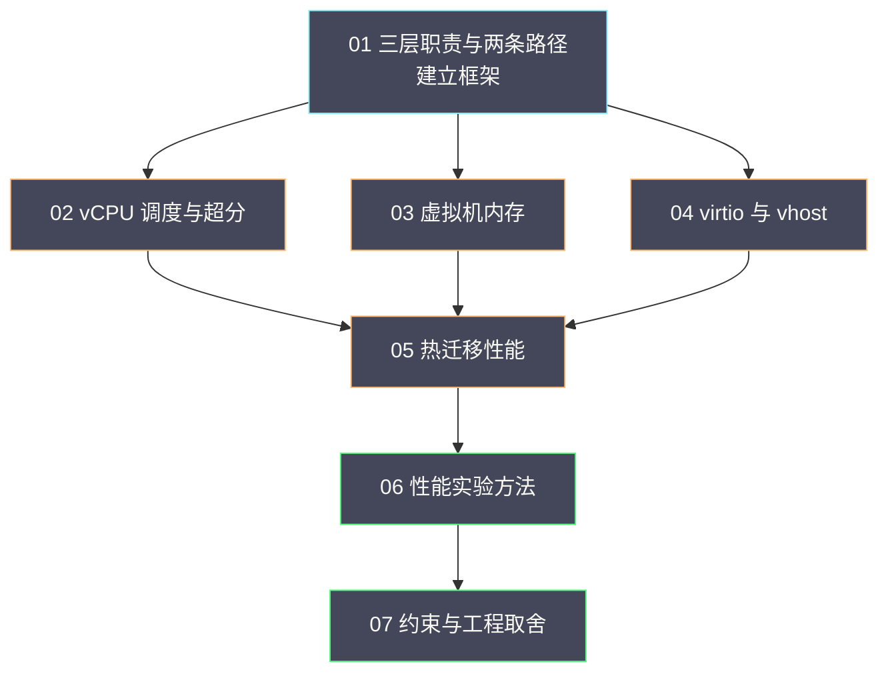

# 00 专栏导览：KVM 虚拟化与性能工程

**摘要：**

本专栏建立「从虚机指标追到宿主机机制」的能力：七篇正文依次回答一台虚机如何运行、CPU 与内存如何被分配、I/O 路径如何构成、迁移为什么可能不收敛、性能如何用实验验证、以及隔离与迁移能力之间如何取舍。全专栏的主线是「先看清机制、再量化影响、最后在约束下决策」，与既有的 OpenStack、Linux、可观测专栏互补而不重复。本文给出专栏定位、读者画像、七篇导读、两条阅读路径、与相邻专栏的分工，以及一张结构图。

---

## 第 1 章 专栏定位

### 1.1 要解决的问题

虚拟化性能的排障有一个典型困境：**虚机内部的指标看不出问题，但业务确实变慢了**。这个困境的根源是「虚机不是一台独立计算机」——它的 CPU、内存、I/O 都由宿主机在背后支撑，而虚机内部的观测看不到这一层。

**本专栏要建立的能力是：把虚机内部的现象，映射到宿主机侧的机制上**。它不追求覆盖虚拟化的全部知识，而是聚焦「当虚机变慢时，知道该看哪一层、以及为什么」。

### 1.2 与相邻专栏的分工

本专栏位于若干既有专栏的交汇处，分工需要说清楚，避免重复阅读。

| 相邻专栏 | 它讲什么 | 本专栏讲什么 |
| :--- | :--- | :--- |
| [[云原生/OpenStack/00 专栏导览\|OpenStack 专栏]] | 组件架构、部署、运维 | 单机上的虚拟化运行时 |
| [[LLM/Agent沙箱技术/00 专栏导览\|Agent 沙箱技术]] | 隔离光谱、MicroVM 机制 | 隔离能力的工程代价 |
| [[Linux/系统性能工程实战/00 专栏导览\|系统性能工程实战]] | 云环境性能与开销 | 虚拟化各层的机制与判据 |
| [[Linux/进程管理/00 专栏导览\|Linux 进程管理]] | 调度器原理与工具 | vCPU 作为线程的调度 |
| [[Linux/内存管理/00 专栏导览\|Linux 内存管理]] | 内存机制与调优 | 虚机内存的分配与回收 |
| [[SRE/CVM集群可靠性工程/00 专栏导览\|CVM 集群可靠性]] | 跨组件的故障定位与恢复 | 单机层面的性能机制 |

**一句话概括分工**：**相邻专栏讲「是什么」与「在平台上怎么用」，本专栏讲「为什么这样、开销在哪里、以及怎么验证」**。

## 第 2 章 读者画像

### 2.1 适合谁

**适合三类读者**：需要在宿主机层面定位虚机性能问题的运维与 SRE；需要在虚拟化约束下做技术选型的平台工程师；以及希望理解「云主机为什么不等于物理机」的开发与架构人员。

### 2.2 需要什么前置知识

**需要基础**：Linux 进程、内存、I/O 的基本概念；虚拟化「虚机是宿主机上的进程」这个基本事实；以及基本的观测命令使用能力。

**不需要**：不需要读内核源码，也不需要硬件虚拟化的实现细节。**本专栏关注的是机制与判据，而不是实现代码**。

### 2.3 读完之后能做什么

**能回答的问题包括**：为什么虚机 CPU 使用率不高却很慢；为什么同一台虚机在不同宿主机上表现不同；为什么迁移有时不收敛；以及为什么某些优化手段互相冲突。

**不能替代的**：不能替代现场经验的积累，也不能替代具体环境的实测。**本专栏给的是框架与判据，具体数值必须实测**。

## 第 3 章 七篇导读

### 3.1 01 一台虚拟机如何运行

建立全专栏的基础框架：**libvirt、QEMU、KVM 三层职责**，以及**控制路径与数据路径**的区分。**核心判据是「业务受影响还是操作受影响」**——它能把排查范围砍掉一半。

### 3.2 02 vCPU 调度与超分

把「虚机 CPU 慢」拆成四件事：**运行队列等待、Steal Time、超分冲突、绑核取舍**。**核心认知是「vCPU 是宿主机上的线程」**，因此虚机的 CPU 能力由宿主机调度决定，而不是由虚机配置决定。

### 3.3 03 虚拟机内存

把虚机内存拆成四层：**三层地址、NUMA 位置、大页翻译开销、气球与页共享**。**核心认知是「内存问题常常不在够不够，而在位置、开销与宿主机侧」**。

### 3.4 04 virtio 与 vhost

沿着一次 I/O 的完整往返，讲清**环形队列、通知与抑制、设备类型、后端三形态、队列与多队列**。**核心认知是「队列深度与抑制参数是吞吐与延迟之间的旋钮」**。

### 3.5 05 热迁移性能

讲清迁移为什么可能不收敛：**预拷贝与脏页速率、收敛条件、停机窗口、CPU 兼容性、带宽与并发**。**核心认知是「能不能收敛由业务写入与带宽的比值决定，是业务特征问题」**。

### 3.6 06 虚拟化性能实验

把前五篇的判据变成事实：**基线、单变量原则、分位数度量、干扰注入、跨 Guest/Host 定位**。**核心认知是「监控发现异常，实验确认原因」**。

### 3.7 07 Kata、嵌套虚拟化与迁移能力约束

收束到工程取舍：**隔离、环境自由度、运维弹性三者互相约束**，任何组合都有明确的放弃项。**核心认知是「决策的质量体现在放弃项是否被承认」**。

## 第 4 章 两条阅读路径

### 4.1 应急路径

**当手头有一台变慢的虚机时**，按以下顺序读：

1. **01 篇**：确认现象属于哪条路径（业务慢还是操作慢）。
2. **02 或 03 或 04 篇**：按现象选择（CPU 类、内存类、I/O 类）。
3. **06 篇**：用跨视角对照定位，用实验确认因果。

**这条路径的目标是「尽快定位」**，因此跳过了机制细节，只取判据与观测方法。

### 4.2 系统路径

**当需要建立完整能力时**，按正文顺序读：

1. **01 篇**建框架（三层职责与两条路径）。
2. **02 至 04 篇**逐层深入（CPU、内存、I/O）。
3. **05 篇**看一次复杂操作的完整链路（迁移）。
4. **06 篇**掌握验证方法（实验）。
5. **07 篇**回到工程取舍（约束与决策）。

**这条路径的目标是「建立体系」**，因此每篇都完整读，包括边界与反例。

## 第 5 章 结构图

**图的结构含义**：01 建框架，02 至 04 是三条并列的资源线（CPU、内存、I/O），05 是三条线的汇合（迁移涉及三者），06 是方法层，07 是决策层。**读图可以快速定位「现在的问题属于哪条线」**。

## 第 6 章 贯穿全篇的四条纪律

### 6.1 先分层，再定位

**任何现象都先判断属于哪一层、哪条路径**。跳过这一步会在错误的方向上投入——这是全专栏最省钱的一条纪律。

### 6.2 任何数字都要带口径

**统计对象、参照基准、时间窗口三者必须明确**。没有口径的数字不是度量，只是数值；跨团队、跨工具比较前必须先对齐口径。

### 6.3 任何结论都要带边界

**结论必须说明适用的负载、硬件与配置**。**「在什么条件下有多大影响」才是结论，「有影响」不是**。

### 6.4 隔离优先于精细平衡

**当两类需求冲突时，把它们放到不同的池里，往往比在同一份资源上折中更有效**。这条纪律在 02 至 07 篇反复出现。

## 第 7 章 与其他专栏的连接点

| 连接点 | 相关篇目 |
| :--- | :--- |
| 平台侧的生命周期与疏散 | [[云原生/OpenStack/05 实例生命周期与迁移实战\|05 实例生命周期与迁移]] |
| 隔离光谱与嵌套机制 | [[LLM/Agent沙箱技术/隔离原语/04 KVM 与硬件虚拟化——MicroVM 隔离的硬件基石\|KVM 与硬件虚拟化]] |
| 云盘慢的四层归因 | [[SRE/CVM集群可靠性工程/03 云盘为什么慢——Guest、QEMU、网络与 Ceph 的联合分析\|03 云盘为什么慢]] |
| 宿主机失联与恢复决策 | [[SRE/CVM集群可靠性工程/04 宿主机失联——故障检测、Fencing、Masakari 与恢复决策\|04 宿主机失联]] |
| 容量、超分与故障预留 | [[SRE/CVM集群可靠性工程/06 容量与缩容——超分、资源碎片、故障预留和恢复空间\|06 容量与缩容]] |
| 巡检、SLO 与取证自动化 | [[SRE/CVM集群可靠性工程/08 运维工程化——巡检、维护预检、SLO 与故障取证自动化\|08 运维工程化]] |

**这些连接点的作用是把单机机制放回平台语境**：**本专栏讲「单机上发生了什么」，连接篇目讲「平台上如何组织与恢复」**。

---

## 口径与事实说明

- 各篇引用的命令与观察方式取自 2026 年 8 月至 9 月的现场记录，属某时点实践，不构成唯一正确用法。
- 机制描述属于 KVM、QEMU、libvirt 与 Linux 内核的稳定行为；具体数值与阈值需按现场实测确定。
- 本专栏不涉及具体部署与变更操作，相关动作须走审批并回读。

---

## 参考资料

1. KVM 官方文档，内核虚拟化接口：<https://www.kernel.org/doc/html/latest/virt/kvm/index.html>
2. QEMU 官方文档，系统仿真与设备：<https://www.qemu.org/docs/master/system/index.html>
3. libvirt 官方文档，域配置与迁移：<https://libvirt.org/formatdomain.html>
4. virtio 规范：<https://docs.oasis-open.org/virtio/virtio/v1.2/virtio-v1.2.html>
5. Linux 内核文档，调度、内存与 PSI：<https://www.kernel.org/doc/html/latest/>
6. 内部现场素材：CVM 集群 hypervisor 监控交付与嵌套验证记录（2026-08 至 09，脱敏）

---

> [!note] 思考题
> 1. 本专栏与 OpenStack、Linux、可观测专栏的分工边界在哪里，为什么需要这层分工。
> 2. 「先分层再定位」为什么是最省钱的纪律，它能避免哪类无效排查。
> 3. 「任何数字都要带口径」在跨团队协作中为什么尤其重要。
> 4. 应急路径与系统路径的差异是什么，分别适合什么场景。
> 5. 为什么「隔离优先于精细平衡」在全专栏反复出现，它的适用边界是什么。
