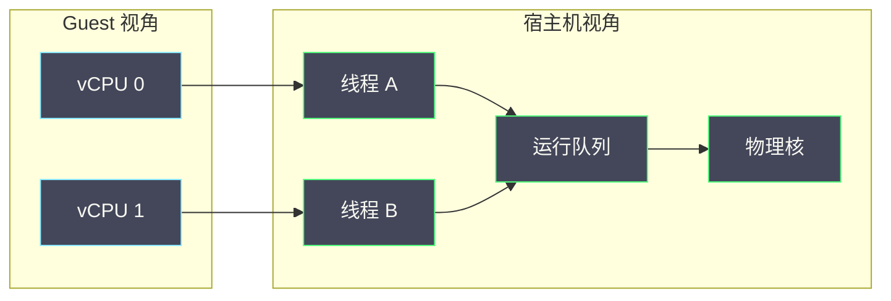

# 02 vCPU 调度与超分——运行队列、Steal Time、绑核和资源竞争

**摘要：**

虚机的 CPU 能力不是由虚机内部的核数决定的，而是由宿主机调度器如何调度它的 vCPU 线程决定的。本文从「vCPU 是宿主机上的一个线程」这个事实出发，把虚机「变慢」拆成运行队列等待、Steal Time、超分冲突与绑核取舍四件事，逐项给出判据、观测方法与误读陷阱。全文回答两个问题：虚机看到的 CPU 时间到底由谁分配，以及超分到底超的是什么、代价在哪里。文中的命令与观察方式取自 2026 年 9 月的现场记录，涉及具体数值处标注口径；vCPU 线程模型与 QEMU 结构请参见本专栏 01 篇。

---

## 第 1 章 vCPU 是宿主机上的线程

关于虚机 CPU 的讨论，最容易从错误的前提出发：把虚机当成一台「有若干核的独立计算机」。这个前提在物理机上成立，在虚机上不成立。

### 1.1 一个被忽视的事实

**虚机的每一个 vCPU，在宿主机上就是一个普通线程**。它由 QEMU 创建，参与宿主机的统一调度，与宿主机上的其他进程、其他虚机的 vCPU 一起竞争 CPU 时间。虚机内部看到的「N 核」，本质上是「N 个线程」的映射。

这个事实的直接推论是：**虚机的 CPU 能力上限，取决于宿主机的调度器给它多少时间片**，而不是虚机内部配置了多少核。配置只是「声明想要多少」，调度才是「实际给多少」。

### 1.2 为什么这个事实重要

忽略这个事实，会得出两个错误结论。**第一，把「虚机慢」归因于虚机内部**，于是去优化虚机内的应用、调整虚机内的调度参数，而真正的瓶颈在宿主机。**第二，把「加核」当成万能手段**，于是给虚机加 vCPU，结果是增加了宿主机上的竞争线程，反而更慢。

反过来，理解这个事实会带来两个正确的方向：**从宿主机侧看虚机的 CPU**（而不是只在虚机内看），以及**把「给多少」与「要多少」分开考虑**（配额与调度是两件事）。

### 1.3 从虚机视角到宿主机视角

同一个现象，两个视角的表述不同，这个对照值得记住。

| 虚机视角 | 宿主机视角 | 说明 |
| :--- | :--- | :--- |
| CPU 使用率不高但响应慢 | vCPU 线程等待调度 | 虚机想跑但没被调度 |
| CPU 使用率接近满 | vCPU 线程持续运行 | 虚机确实在计算 |
| CPU 时间增长缓慢 | 线程被抢占或限流 | 时间没给够 |
| 负载高但吞吐低 | 线程在核间迁移 | 缓存局部性差 |

**把两个视角对照起来看，才能确定「慢」的性质**。这也是本篇与 01 篇共同的方法：先确定现象属于哪一类，再选观测方向。

### 1.4 一张调度示意图



图里最关键的是那个运行队列：**虚机的 vCPU 与宿主机的其他线程在这里一起排队**。虚机内部的「核数」在图中表现为线程数，而实际能获得多少 CPU 时间，由队列与物理核的分配决定。

### 1.5 一个类比与它的边界

可以把 vCPU 想成「在公司里排会议室的人」：你预定了会议室（配额），但能不能用、等多久，取决于会议室有多少、同时有多少人在等（调度）。**预定不等于占用**，这正是配额与调度的关系。

类比的边界在于：会议室是独占的（一次只能一人用），而 CPU 核是「高速切换」的——它在一秒内可以服务成百上千个线程。因此「等会议室」的体感是分钟级，而「等 CPU」的体感是毫秒级甚至微秒级。**体感差异巨大，但机制上的「排队」是同一回事**。

### 1.6 虚机核数与宿主机核数的换算

虚机核数与宿主机核数的关系不是简单的「一对一」。几个常见概念需要区分。

**vCPU 数**是虚机声明的核数，对应宿主机上的线程数。**物理核数**是宿主机的真实计算单元数。**超线程**让一个物理核呈现为两个逻辑核，因此「逻辑核数」通常是物理核数的两倍。

换算时的关键判断是：**绑核场景下，一个 vCPU 通常对应一个逻辑核（或一个物理核的两个线程之一）**；非绑核场景下，vCPU 只是排队者，与物理核没有固定对应。

**把这个换算搞错，会导致容量规划偏差**：例如把「逻辑核数」当成「物理核数」，会让超分比例看起来只有实际的一半。

### 1.7 虚机的 CPU 时间去哪了

把虚机的 CPU 时间拆开，可以看到它由四部分组成：**真正执行 Guest 代码的时间**、**被宿主机的其他负载抢走的时间（steal）**、**虚机主动空闲的时间**、以及**处理虚拟化事件（退出）的时间**。

四部分的处置方向不同：第一部分是有效算力，第二部分要靠隔离或降超分，第三部分是正常行为（不必处理），第四部分要靠优化设备与配置。

**把四部分分开，才能回答「CPU 时间去哪了」这个问题**。日常只看到「使用率」与「steal」两个数字，实际还有两部分被隐藏：空闲时间不体现在使用率里（因为使用率按可运行时间算），退出开销混在使用率里（因为它也是「运行」）。

这也是为什么「使用率不高但很慢」的现象需要专门解释：它可能是 steal 高（被抢），也可能是退出开销高（在忙别的事）。**两者都表现为「使用率不高」，但方向完全不同**。

## 第 2 章 运行队列：vCPU 等待的地方

虚机「想跑但没被调度」这件事，在宿主机上有一个明确的位置：运行队列。

### 2.1 运行队列是什么

**运行队列（Run Queue）是处于「可运行」状态、等待 CPU 的线程集合**。每个 CPU 有一个运行队列；线程被唤醒后进入队列，被调度到就离开队列执行。队列长度反映的是「有多少线程在等 CPU」。

这个概念在虚机场景下的特殊之处在于：**vCPU 线程也在这个队列里**。它与宿主机的其他负载、其他虚机的 vCPU 平等地排队。因此队列长度不仅反映宿主机自身的负载，也反映虚机之间的竞争。

### 2.2 vCPU 的等待

vCPU 线程的等待有两种来源。**一种是主动的**：Guest 执行了空闲指令，vCPU 线程进入睡眠，把 CPU 让出来——这是正常的、有益的行为。**一种是被动的**：vCPU 线程可运行但排队等待，被别的线程抢占——这是需要关注的。

区分两者的方法是看线程的状态：**睡眠中的等待是「主动让出」，可运行态的等待是「被动排队」**。只有后者才会表现为虚机「响应慢」。这也是为什么「虚机 CPU 使用率低」既可能是好事（真的空闲）也可能是坏事（排队等待）——**必须看状态，不能只看使用率**。

### 2.3 队列长度与延迟

队列长度与等待时间的关系可以用一个近似描述：**等待时间约等于队列长度除以 CPU 的处理速率**。队列越长，新进入的线程等得越久。

这个关系带来一个重要的推论：**排队延迟是非线性的**。队列从 1 涨到 2，等待时间翻倍；从 10 涨到 20，同样翻倍但绝对值大得多。因此「稍微多一点点负载」可能导致「明显变慢」——这不是玄学，而是排队系统的性质。

对虚机而言，这意味着**超分比例的边际效应是递增的**：从 2:1 提到 3:1 的影响，小于从 4:1 提到 5:1。**临界点附近的微小变化，会带来不成比例的体验下降**。

### 2.4 观测方法

运行队列的观测有三个层次。

```bash
# 宿主机整体：运行队列长度与负载
cat /proc/loadavg
vmstat 1

# CPU 压力：反映「因等 CPU 而停滞」的时长占比
cat /proc/pressure/cpu

# 调度延迟分布：单线程等待时间的直方图（需要相应工具）
# runqlat 类工具可给出调度等待的分布
```

```bash
# 单个 vCPU 线程的调度情况
ps -T -p <qemu-pid> -o tid,comm,psr,stat,pcpu

# 内核调度统计（按 CPU 与按任务的运行/等待时间）
cat /proc/schedstat
```

**观测的要点是「看分布而不是看均值」**：调度延迟的长尾往往才是用户感知到的卡顿。均值正常但长尾很长，是超分场景的典型特征。

### 2.5 运行队列与容器配额的关系

运行队列与容器配额（cgroup 的 CPU 限制）是两层不同的机制，但都会影响 vCPU 的等待。

**配额限制的是「上限」**：即使 CPU 空闲，超过配额的线程也会被限流。**运行队列反映的是「竞争」**：在配额之内，线程仍要排队。因此「配额充足但延迟高」完全可能——配额管的是「不许用太多」，队列管的是「能不能及时用上」。

这个区分解释了为什么**给容器或虚机加配额常常解决不了延迟问题**：如果瓶颈在排队，加配额只是允许它跑得更久，不会让它更快被调度。**先判断是「限流」还是「排队」，再决定是否调配额**，是本篇一个实用的判据。

### 2.6 观测的三个陷阱

运行队列的观测有三个陷阱。**第一，把负载均值当队列长度**：负载包含运行与等待 I/O 的线程，与运行队列不完全等价。**第二，忽略采样粒度**：队列是瞬时量，低频采样会错过尖峰。**第三，跨核平均**：多个核的队列长度不同，全机平均会掩盖单核的拥塞。

三个陷阱的应对分别是：**用压力指标替代负载指标**、**提高关键时段的采样率**、以及**按核观察而不是只看平均**。

**按核观察**尤其重要：绑核场景下，拥塞往往集中在特定的核上，全机平均看起来正常。

### 2.7 一个排队延迟的算例

用一个简化算例说明排队延迟的非线性。假设一个 CPU 核每秒能处理 1000 个「线程片」，每个线程片需要 1 毫秒完成。

当队列中有 1 个线程时，新来的线程大约等 1 毫秒；队列 10 个时，等约 10 毫秒；队列 100 个时，等约 100 毫秒。

**延迟随队列长度线性增长，但队列长度随负载非线性增长**：当负载接近处理能力时，队列会急剧变长（这就是排队论里的「拐点」）。因此从负载 70% 提到 90%，延迟可能涨几倍，而不是涨 20%。

这个算例解释了超分场景的两个现象：**为什么「利用率看着不高」也会有明显延迟**（负载分布不均，局部接近拐点），以及**为什么「再加一点负载」会导致体验骤降**。

### 2.8 运行队列与 I/O 等待的区分

运行队列与 I/O 等待是两种不同的「不运行」，但它们经常被混为一谈，因为负载指标把两者加在了一起。

**运行队列中的线程是「可运行但没被调度」**，瓶颈在 CPU。**I/O 等待中的线程是「不可运行」**，瓶颈在 I/O。前者升高说明 CPU 竞争，后者升高说明 I/O 阻塞。

区分它们的方法有两个：**看线程状态**（可运行态是排队，不可中断态是 I/O 等待），以及**看 CPU 压力与 I/O 压力指标**（前者高是 CPU 竞争，后者高是 I/O 竞争）。

**这个区分在虚拟化场景下尤其重要**：虚机的 vCPU 排队是 CPU 问题，而虚机发起 I/O 后 vCPU 进入等待是 I/O 问题，两者的处置方向完全不同。把 I/O 等待误判为 CPU 竞争，会导致「加了 CPU 却没有改善」。

### 2.9 一个按核观察的方法

按核观察是运行队列分析的关键，可以用几条命令实现。

```bash
# 按核查看运行队列与利用率
mpstat -P ALL 1

# 按核查看中断与软中断分布（判断是否集中在少数核）
cat /proc/interrupts
cat /proc/softirqs
```

**观察的要点是「找那个异常的核」**：如果只有一个核的队列长、利用率高，那么瓶颈是「单核拥塞」，而不是「整机不足」。两者的处置不同：前者要调整绑定或中断亲和性，后者要加资源或降超分。

**单核拥塞在绑核场景下很常见**，因为绑定把负载固定到了特定核上。这也是为什么绑核之后仍要做「按核验证」——配置正确不代表负载均衡。

## 第 3 章 Steal Time：被偷走的 CPU

Steal Time 是虚机侧最直接的「CPU 被抢」指标，也是最容易被误读的指标。

### 3.1 定义与来源

**Steal Time 指的是虚机本可以运行、但宿主机把物理 CPU 分配给了别处的那部分时间**。它由虚拟化层统计并暴露给 Guest，因此虚机内部可以直接看到。

它的来源有两类：**其他虚机的 vCPU 抢占了同一物理核**，以及**宿主机自身的负载抢占了 CPU**。两类来源的处置方向不同：前者要调超分或隔离，后者要排查宿主机上的负载。

### 3.2 如何计算

Steal Time 通常以「占虚机总时间的百分比」表示。它可以从虚机内部的统计中读取，也可以从宿主机侧的线程等待时间推算。

```bash
# 虚机内部：/proc/stat 的 steal 字段（百分比口径）
grep '^cpu ' /proc/stat

# 或用常见工具查看 steal 占比
top -bn1 | head -5
```

两种口径的关系需要留意：**虚机侧的 steal 是「虚机视角的损失」**，它已经扣除了虚机主动空闲的时间；宿主机侧的等待时间则是「线程视角的排队」，包含更多细节。两者不能直接等同。

### 3.3 什么算高

「多高算高」没有统一答案，取决于业务对延迟的敏感度。一个实用的判断方式是**看趋势与相关性**：steal 与业务延迟是否同向变化，比 steal 的绝对值更有意义。

需要提醒的是，**steal 为零不代表 CPU 充足**。如果虚机没有可运行的任务，它就不会「被偷」——steal 只统计「本可以跑却被抢」的时间。因此 steal 低 + 业务慢，仍然可能是调度问题（例如虚机在等 I/O，而 I/O 被别的负载拖慢）。

### 3.4 观测与陷阱

Steal Time 有三个常见陷阱。

**第一，把它当成唯一判据**。steal 只反映 CPU 竞争，不反映内存、I/O 与网络的竞争。**第二，忽略它的统计口径**。不同工具给出的 steal 口径可能不同，跨工具比较前要确认定义。**第三，把「steal 高」当成「必须加核」**。加核会增加竞争线程，可能让 steal 更高。

正确的用法是**把 steal 当作一个信号**：它升高说明存在 CPU 竞争，接下来要去宿主机侧确认竞争来自哪里、能否通过隔离或配额缓解。

### 3.5 steal 与其他指标的组合解读

Steal Time 需要与其他指标组合解读才有意义。三种典型组合如下。

| steal | CPU 使用率 | 可能的解释 |
| :--- | :--- | :--- |
| 高 | 高 | 虚机在忙，同时被抢，竞争激烈 |
| 高 | 低 | 虚机想跑却被抢，配额或调度不足 |
| 低 | 高 | 虚机确实在计算，与竞争无关 |
| 低 | 低 | 虚机空闲，或瓶颈不在 CPU |

**四种组合对应四种方向**：第一种要降超分或隔离，第二种要加配额或改善调度，第三种要优化应用，第四种要往 I/O、内存或网络找原因。

这张表的用途是**避免「看到 steal 高就调超分」的条件反射**——steal 高但使用率也高时，问题可能是虚机自己太忙，而不是被抢。

### 3.6 steal 的历史与实现差异

Steal Time 这个概念并非一开始就有。早期虚拟化实现里，Guest 无法知道自己被抢了多少时间，只能观察到「时间过得比预期慢」。后来虚拟化层开始在虚拟时钟中体现这部分损失，Guest 才得以直接观测。

不同实现暴露 steal 的方式不同：有的通过虚拟时钟的统计字段，有的通过专门的接口。**因此跨平台比较 steal 数值之前，必须先确认口径**——这与第 3.4 节的陷阱二对应。

对运维而言，**更稳妥的做法是把 steal 与业务延迟对照**，而不是与其他平台的 steal 数值对照。业务延迟是共同语言，steal 不是。

### 3.7 一个 steal 排查实例

设想一台虚机的 steal 长期在 5% 到 10% 之间波动，业务反馈「偶尔卡顿」。

第一步，看 steal 与延迟的时间相关性：如果卡顿时刻与 steal 升高吻合，说明两者相关。第二步，看同宿主机上其他虚机的负载：如果卡顿时刻其他虚机也在忙，说明是超分冲突。第三步，看虚机自身的 CPU 使用率：如果使用率不高，说明不是虚机自己太忙。

三步合起来，结论是「超分冲突导致的偶发卡顿」。处置方向是隔离（绑核或配额）或迁移，而不是加核。

**这个实例的价值在于它演示了「steal 只是起点」**：单看 steal 无法定论，必须结合相关性与同机负载才能定性。

### 3.8 steal 与配额的关系

steal 与配额是两个不同层面的机制，容易混淆。

**配额是「上限」**：它规定虚机最多能用多少 CPU，超过就被限流。**steal 是「损失」**：它记录虚机本可以用但被抢走的时间。

两者的关系是：**配额充足时，steal 反映的是竞争；配额不足时，虚机会被限流，此时损失不再体现为 steal，而体现为限流**。因此「steal 低但被限流」是可能的——不是被抢，而是被自己的配额拦住。

**区分它们的方法**：看限流指标。如果限流指标升高，说明是配额问题；如果限流为零而 steal 高，说明是竞争问题。**两者的处置方向完全不同**：前者调配额，后者做隔离或降超分。

这个区分在实践中很实用：很多「虚机 CPU 不够」的抱怨，其实是配额设得太低，而不是竞争太激烈。

## 第 4 章 超分：超的到底是什么

超分是云平台提高利用率的常用手段，但它「超」的东西常被误解。

### 4.1 超分的对象

**超分超的是「分配承诺」，不是「物理资源」**。平台把一份物理 CPU 承诺给多个虚机，依据是「它们不会同时跑满」。因此超分的本质是一次**关于并发行为的赌注**，而不是资源的物理复用。

这个理解带来两个推论。**第一，超分比例应当与业务的并发特征匹配**：突发型业务可以超得多，持续满载型业务不能超。**第二，超分的风险是「同时发生」**：平时相安无事，一旦多个虚机同时忙起来，冲突就集中爆发。

### 4.2 超分比例与风险

超分比例通常表示为「vCPU 总数与物理核数之比」。风险随比例上升，但不是线性的：低比例下几乎无感，高比例下急剧恶化。

| 比例区间 | 典型表现 | 适用 |
| :--- | :--- | :--- |
| 低（约 1:1 至 2:1） | 几乎无感知 | 延迟敏感业务 |
| 中（约 2:1 至 4:1） | 高峰时段有波动 | 一般业务 |
| 高（4:1 以上） | 持续波动，长尾明显 | 仅适合可容忍抖动的负载 |

**区间的边界是经验值而非定律**，实际可用区间取决于业务的并发特征与宿主机的能力。把它当参考而不是标准。

### 4.3 超分的两种失败

超分有两种失败形态。**第一种是「持续饥饿」**：比例长期过高，虚机在大部分时间都得不到足够 CPU，表现为整体变慢。**第二种是「突发冲突」**：平时正常，多个虚机同时忙起来时短暂卡顿，表现为偶发的长尾。

两种失败的处置不同：前者要降低比例或迁移负载，后者要引入隔离（绑核、配额）而不是简单降比例。**把两种失败混淆，会导致「降了比例仍然偶发卡顿」的困惑**。

### 4.4 如何定比例

定比例的方法与 06 篇「容量与缩容」的思路一致：**先统计业务的实际使用分布，再按「大部分时间不冲突」取一个比例，最后用压测验证**。

具体三步：**第一步**，采集业务的 CPU 使用分布（P50、P95、P99）；**第二步**，按最坏并发情况估算冲突概率；**第三步**，在测试环境模拟该比例下的并发，验证延迟是否可接受。

**比例是数据推导出来的结论，不是拍脑袋的经验值**。而且它需要定期复核——业务构成变化后，原来的比例可能不再合适。

### 4.5 超分与容量规划的关系

超分与容量规划是一枚硬币的两面。**超分决定了「同样的物理资源能承诺多少」，容量规划决定了「承诺之后还剩多少余量」**。

两者的耦合点在故障预留：06 篇讲过，故障时被疏散的负载要有地方去。如果超分比例高，那么疏散时的冲突概率也高——**高超分会让故障预留更难满足**。

因此超分比例的确定不能只看日常利用率，还要看**故障场景下的可承接能力**。一个只在日常成立的超分比例，会在故障时暴露问题。这也是把超分纳入容量规划而不是孤立看待的原因。

### 4.6 超分与业务等级

超分比例应当与业务等级绑定。**核心业务**对延迟敏感，应当取低比例甚至不超分；**一般业务**可以取中等比例；**可容忍抖动的业务**（如批处理）可以取较高比例。

分级的价值在于**把确定性留给需要的业务，把利用率留给不需要的业务**。这比全平台统一一个比例更符合实际。

分级的实现方式通常与资源池或宿主机分组结合：不同等级的业务落在不同的池里，池内配置各自的超分比例。**这也让「隔离」从技术手段变成了组织手段**——不同等级的业务物理上就不共享资源。

### 4.7 超分的一个算例

用一个算例说明超分比例的推算方法。假设一台宿主机有 48 个逻辑核，上面计划放若干虚机，每台 8 个 vCPU。

如果按 1:1 不超分，最多放 6 台（48/8）。如果超分 2:1，可以放 12 台，但意味着平均每两个 vCPU 共享一个逻辑核。

关键问题是「能不能放 12 台」，取决于这 12 台虚机的 CPU 使用分布。**如果它们的 P95 使用率都不超过 25%，那么 2:1 超分后仍有较大余量**；如果某些虚机长期接近 100%，那么 12 台会明显冲突。

因此**推算的输入不是「核数」，而是「使用分布」**。这也是为什么超分比例的确定必须先采集分布数据，而不能只看核数配比。

### 4.8 超分的观测

超分需要被观测，否则它会在不知不觉中积累风险。观测的内容有四类：**超分比例**（承诺量与物理量之比）、**冲突程度**（steal 与调度延迟）、**分布均衡度**（各宿主机的负载是否均匀）、以及**长尾趋势**（延迟分位数是否在恶化）。

四类里，**分布均衡度最容易被忽略**：同样比例的超分，如果负载分布均匀，体验良好；如果集中在少数宿主机上，那些机器会明显变差。**均衡度决定了超分的实际体验**，而不只是比例。

观测的另一个要点是**按业务等级分组**：不同等级的业务对超分的敏感度不同，混在一起看会互相掩盖。这与 06 篇「容量水位要分维度分故障域」是同一条纪律。

### 4.9 超分的一个判断顺序

把超分的判断收成一个顺序：**先看使用分布，再看冲突程度，最后看分布均衡度**。

**第一步看使用分布**：如果业务的 P95 使用率都很低，超分空间大；如果有满载型业务，空间小。**第二步看冲突程度**：steal 与调度延迟是否在恶化。**第三步看分布均衡度**：负载是否集中在少数宿主机上。

三步的顺序不能颠倒：跳过第一步会不知道「该不该超」，跳过第二步会不知道「超了有没有问题」，跳过第三步会不知道「问题是不是因为不均衡」。

**判断顺序的价值在于它把「调比例」这个动作放在了最后**——很多情况下，问题不在比例，而在分布。

## 第 5 章 绑核与亲和性

绑核是控制 CPU 竞争最直接的手段，但它有明确的代价。

### 5.1 为什么绑核

**绑核（CPU Pinning）把 vCPU 线程固定到特定的物理核上**，从而避免两个后果：一是与别的负载随机争抢，二是线程在核间迁移导致缓存失效。

对延迟敏感的业务，绑核的收益是**确定性**：虚机的 CPU 供给变得可预测，长尾被压缩。这也是它常与实时业务、低延迟业务一起出现的原因。

### 5.2 绑核的代价

绑核的代价有三。**第一，牺牲调度灵活性**：被绑定的核不能给别的负载用，即使它在空闲。**第二，降低利用率**：被绑定的核上如果虚机不忙，资源就浪费了。**第三，增加管理复杂度**：绑定关系需要规划与维护，配置漂移会带来难查的问题。

**绑核是「用灵活度换确定性」**，与 06 篇里超分「用确定性换利用率」正好方向相反。因此两者不能同时追求极致：**绑核越多，可超分的空间越小**。

### 5.3 与 NUMA 的关系

绑核与 NUMA 是一对必须一起考虑的概念。**vCPU 绑在哪个核上，内存就应当尽量分配在同一个 NUMA 节点上**；否则跨节点访问会带来额外延迟。

这一点在配置层面表现为「CPU 绑定」与「内存绑定」应当一致。**只绑 CPU 不绑内存，收益会打折扣**；只绑内存不绑 CPU，同样不完整。

### 5.4 配置与观测

绑核的配置通常在虚机配置层完成，观测则可以从宿主机侧验证是否生效。

```bash
# 查看 vCPU 的绑定关系
virsh vcpupin <domain>

# 查看仿真线程（非 vCPU）的绑定
virsh emulatorpin <domain>

# 查看 NUMA 与内存绑定
virsh numatune <domain>
```

```bash
# 从宿主机侧验证：线程实际跑在哪个核上
ps -T -p <qemu-pid> -o tid,comm,psr

# 观察是否发生跨核迁移
# 多次采样对比 psr 字段是否稳定
```

**验证的要点是「实际」而非「配置」**：配置了绑定不等于生效，要从宿主机侧确认线程确实固定在预期的核上。**配置漂移是绑核场景的常见问题**，定期核对比事后排查更省事。

### 5.5 绑核的三种粒度

绑核有三种粒度，强度与代价递增。

**第一种是 vCPU 绑定**：把 vCPU 线程固定到核。**第二种是仿真线程绑定**：把处理设备 I/O 的线程也固定，避免它与 vCPU 争抢。**第三种是整机绑定**：vCPU 与仿真线程都固定，且内存也绑定到同一 NUMA 节点。

三种粒度的收益递增，代价也递增。**实践中常见的问题是只做了第一种**，结果 vCPU 稳定了，但设备 I/O 的延迟仍然波动——因为仿真线程还在与别的负载争抢。

**判断该用哪种粒度的方法很简单：看波动来自计算还是 I/O**。计算波动用第一种，I/O 波动要加第二种，两者都有波动用第三种。

### 5.6 绑核与迁移的关系

绑核与迁移之间存在张力。**迁移要求目标宿主机能满足绑定关系**：如果目标机器的核已经被占用或拓扑不同，迁移可能失败，或迁移后绑定失效。

因此绑核场景下的迁移需要额外校验：**目标机器是否有符合要求的空闲核、NUMA 拓扑是否兼容、迁移后绑定是否需要重配**。

**这也是「绑核换取确定性」的隐性成本**：它让迁移从「随时可做」变成「需要条件」。对需要频繁迁移的业务，这个成本可能高于收益——**绑核的决策必须把迁移需求算进去**。

### 5.7 绑核的一个配置实例

设想为一个延迟敏感业务配置绑核。宿主机有 48 个逻辑核，划分为两个 NUMA 节点，每节点 24 核。

配置的步骤是：**第一步**，选定虚机使用的物理核范围（例如节点 0 的 0 到 7 号核）；**第二步**，把 vCPU 逐个绑定到这些核；**第三步**，把仿真线程绑定到另一组核（避免与 vCPU 争抢）；**第四步**，把虚机内存绑定到节点 0。

配置完成后必须验证：**从宿主机侧确认线程的 `psr` 字段稳定在预期核上，且内存确实落在节点 0**。

**这个实例的关键是「CPU 与内存绑定一致」**——只绑 CPU 不绑内存，跨节点访问会把收益吃掉一半。

### 5.8 绑核与超分的协调

绑核与超分方向相反，但在同一平台上必须共存。协调的方法有三种。

**第一种是按池划分**：一部分宿主机用于超分（承载一般业务），一部分用于绑核（承载延迟敏感业务）。这是最简单也最常见的做法。**第二种是部分绑核**：在一台宿主机上，部分核用于绑核、其余用于超分，通过配置区分。**第三种是动态调整**：根据业务变化调整绑核范围。

三种方法的复杂度递增。**实践中第一种最稳妥**，因为它把矛盾变成了「资源池划分」这个组织问题，而不是「同一台机器上如何平衡」这个技术难题。

**协调的原则是「不要让两种诉求争抢同一份资源」**。这与 05 篇「共享故障域」的思路一致：隔离胜过在同一份资源上做精细平衡。

## 第 6 章 资源竞争：邻居效应

超分与绑核都是在管理竞争，但竞争本身还有别的来源。

### 6.1 竞争的三种来源

**第一种是同宿主机上的其他虚机**：这是超分的直接后果。**第二种是宿主机自身的负载**：管理 agent、监控采集、以及其他非虚机进程。**第三种是同一虚机内部的竞争**：vCPU 之间争抢，或 vCPU 与仿真线程争抢。

三种来源的处置不同：第一种靠超分与隔离，第二种靠宿主机侧的负载治理，第三种靠虚机内的配置（如 vCPU 与仿真线程的绑定关系）。

**第三种最容易被忽略**，因为它在虚机内部看不到、在宿主机侧也不显眼。它的典型表现是「虚机 CPU 不高但延迟高」——vCPU 与处理设备 I/O 的仿真线程抢同一个核。

### 6.2 竞争的度量

竞争的度量有几个可用指标：**CPU 压力（PSI）**、**调度延迟分布**、**vCPU 线程的被抢占次数**、以及**缓存相关的性能计数器**。

```bash
# 宿主机整体压力：反映「因等 CPU 而停滞」的占比
cat /proc/pressure/cpu

# 单个线程的调度统计
cat /proc/<tid>/schedstat

# 缓存相关的性能计数器（判断是否因迁移或竞争导致缓存失效）
perf stat -e cache-misses,cache-references -p <qemu-pid> sleep 5
```

**度量的要点是「区分等待与失效」**：等 CPU 是排队问题，缓存失效是局部性问题，两者的处置方向不同。

### 6.3 隔离手段

竞争有四种隔离手段，按强度递增：**配额**（限制单个虚机的 CPU 上限）、**权重**（在同级竞争时按权重分配）、**绑核**（固定物理核）、**独占核**（把核从通用调度中摘出）。

四种手段的强度与代价同向递增。**选择依据是业务的延迟敏感度**：一般业务用配额与权重，延迟敏感业务用绑核，极端场景才用独占。

需要提醒的是，**隔离手段只解决「被抢」，不解决「总量不足」**。如果宿主机整体过载，再强的隔离也只是把损失在虚机之间重新分配。

### 6.4 竞争的一个实例

设想一台虚机的「CPU 使用率不高、延迟却高」。从虚机内部看，应用在等锁或等 I/O；从宿主机侧看，vCPU 线程状态大部分时间是可运行。

关键的一步是**看同一虚机内其他线程的状态**：如果处理设备 I/O 的仿真线程与 vCPU 跑在同一个核上，两者会互相争抢，表现为 vCPU 的延迟升高而使用率不高。

处置方向是把仿真线程与 vCPU 分到不同的核（第二种绑核粒度）。**这个实例说明竞争不一定来自外部**，虚机内部线程之间的竞争同样需要管理。

### 6.5 竞争的四种隔离手段对照

| 手段 | 强度 | 代价 | 适用 |
| :--- | :--- | :--- | :--- |
| 配额 | 低 | 突发能力受限 | 一般业务 |
| 权重 | 低 | 仅在竞争时生效 | 同级混合部署 |
| 绑核 | 中 | 灵活性下降 | 延迟敏感业务 |
| 独占核 | 高 | 利用率明显下降 | 极端延迟要求 |

**四种手段可以组合**：例如先按业务等级分池，池内用权重，池内的核心业务再绑核。组合的顺序是「先粗后细」，与 06 篇「先定影响半径再定位」的思路一致。

### 6.6 一个竞争的度量组合

把竞争的度量组合起来，可以得到一个实用的判据集。

| 指标 | 含义 | 判据 |
| :--- | :--- | :--- |
| CPU 压力 | 因等 CPU 而停滞 | 持续升高说明 CPU 竞争 |
| 调度延迟分布 | 等待时间的分布 | 长尾变长说明排队严重 |
| steal | 虚机视角的损失 | 与业务延迟同向才有效 |
| 缓存失效 | 局部性问题 | 高说明核间迁移或竞争 |
| 运行队列长度 | 排队规模 | 按核看，不只看平均 |

**五个指标的组合使用，比任何单一指标都可靠**。判据的设计原则是「一个指标对应一个方向」，而不是「越多越好」——指标太多会淹没信号。

### 6.7 竞争与业务等级

竞争的影响与业务等级强相关，因此竞争管理也应当分级。

**对延迟极敏感的业务**（如交易、实时计算），竞争的容忍度极低，应当独占或绑核。**对延迟一般敏感的业务**（如 Web 服务），可以接受一定波动，用权重或配额管理。**对延迟不敏感的业务**（如批处理），可以用高比例超分，把资源让给前两类。

**分级的实现是「资源池 + 策略」的组合**：不同等级落在不同池，池内配置各自的竞争管理策略。

这条思路与第 4.6 节「超分与业务等级」一致，但强调了一个更广的结论：**竞争管理的粒度不是「虚机」，而是「业务等级」**。按虚机逐个调参，既费力又难维护。

## 第 7 章 一次 vCPU 性能定位

下面用一个实例把前面的概念串起来。

### 7.1 现象

某台虚机的业务反馈「高峰时段响应变慢」，虚机内部的 CPU 使用率显示在 40% 到 60% 之间，不算高。

### 7.2 分层收敛

第一步，确认现象属于哪一类。**虚机 CPU 不高但响应慢**，说明不是计算能力不足，而是执行被延迟或阻塞。按 01 篇的路径判据，这属于数据路径问题。

第二步，从虚机内部看 steal。若 steal 在高峰时段明显升高，说明存在 CPU 竞争，方向指向调度；若 steal 平稳，则要怀疑 I/O 或内存。

第三步，从宿主机侧看 vCPU 线程状态。若线程处于可运行态的等待，且宿主机 CPU 压力同步升高，说明是宿主机侧的 CPU 竞争。

第四步，确认竞争的来源。看同宿主机上的其他虚机是否也在高峰忙碌，或宿主机上是否有其他负载。

### 7.3 结论与处置

综合四步，结论是「高峰时段超分冲突」。处置方向有三：**降低该区域的超分比例**、**把该虚机迁移到负载较低的宿主机**、或**为该虚机绑核以获得确定性**。

三条路各有代价：降比例影响利用率，迁移有中断与风险，绑核牺牲灵活度。**选择哪一条，取决于业务对延迟的敏感度与平台的容量余量**——这又是一个权衡，没有标准答案。

### 7.4 定位方法的可迁移部分

这次定位可以提炼成三个可迁移的动作：**先看 steal 定方向、再看线程状态定性质、最后看同机负载定来源**。

三个动作的顺序不能颠倒：跳过 steal 会不知道是否与 CPU 竞争有关；跳过线程状态会分不清「空闲」与「排队」；跳过同机负载会不知道竞争来自谁。

**「定方向 → 定性质 → 定来源」** 是 vCPU 类问题的一般顺序，与 01 篇的「分层 → 收敛 → 解释」是同一种方法的不同表述。

### 7.5 另一条路径：绑定后的验证

第 7 章走的是「定位问题」的路径。反过来的路径是「验证措施是否生效」，同样值得一说。

为延迟敏感业务绑核之后，验证的要点有三个：**核是否真的固定**（`psr` 稳定）、**内存是否同节点**（NUMA 命中率）、**长尾是否真的改善**（延迟分布对比绑核前后）。

**第三个要点最容易被省略**：绑核配置正确不等于业务变快。如果业务瓶颈其实在 I/O，绑核只会浪费核。**验证必须回到业务指标**，这与 07 篇「恢复的终点是业务可用」是同一条纪律。

### 7.6 一个反例：加核反而变慢

一个常见的反例是：给虚机加 vCPU 后，业务反而变慢。

原因通常有三个。**第一，竞争加剧**：新增的 vCPU 是新增的竞争线程，如果宿主机已经超分，加核会让大家一起变慢。**第二，调度开销上升**：更多线程意味着更多上下文切换与缓存失效。**第三，Guest 内的并发问题**：某些应用的锁竞争会随核数增加而恶化，核越多越慢。

**判断「该不该加核」的方法**：先看宿主机是否有空闲算力，再看 Guest 内是否真的能并行。**两者缺一，加核都是负收益**。

这个反例的价值在于它打破了「加资源一定更好」的直觉。**在共享资源的场景下，增加自己的资源可能损害整体，从而损害自己**——这是虚拟化性能工程里最反直觉的一课。

## 第 8 章 实验：如何测出超分的影响

关于超分的讨论很容易停留在经验层面。要把它变成事实，需要实验。

### 8.1 实验设计

实验的要素有三个：**基线**（不超分时的延迟分布）、**变量**（超分比例）、**干扰**（模拟并发高峰的负载）。

设计要点是**固定其他变量**：同一台宿主机、同一份业务负载、同一套配置，只改超分比例。这样得到的差异才能归因于超分。

### 8.2 度量什么

度量的核心不是平均值，而是**延迟分布**：P50、P95、P99，以及长尾的最大值。**超分的影响主要体现在长尾上**，均值可能几乎不变。

同时要度量**吞吐**：如果超分导致吞吐下降，说明不仅是延迟问题，而是有效算力减少。

### 8.3 实验的边界

实验结论有三条边界。**第一，结论绑定业务特征**：突发型业务的结论不能外推到满载型业务。**第二，结论绑定硬件**：不同代际的 CPU 对超分的容忍度不同。**第三，结论绑定时间**：业务增长会改变并发特征，实验结论需要定期复核。

**把边界写进结论**，而不是只写数字，是实验报告的基本要求。这一点与本专栏 06 篇的实验方法一致。

### 8.4 实验的一个记录模板

实验记录应当包含以下要素：

- 环境：宿主机型号、CPU 代际、核数与 NUMA 拓扑。
- 基线：不超分时的延迟分布（P50/P95/P99）与吞吐。
- 变量：超分比例与并发负载。
- 结果：各比例下的延迟分布与吞吐变化。
- 边界：结论适用的业务特征与硬件范围。

模板的价值在于**它强制把「环境」与「边界」写下来**。没有这两项，实验结论就只是一组数字，无法被复用或质疑。

### 8.5 实验的一个简化流程

如果资源有限，可以用一个简化流程做超分实验：**在同一台宿主机上，先测单虚机的基线，再逐步增加同宿主机上的干扰虚机数量，观察目标虚机的延迟分布变化**。

这个流程的优势是**变量清晰**：干扰虚机的数量就是超分程度的代理变量，不需要精确控制比例。劣势是**结论的粒度较粗**：它只能说明「干扰增加到某个程度后体验下降」，不能给出精确的比例阈值。

**简化流程适合快速摸底，精确实验适合制定策略**。两者配合使用，能兼顾效率与严谨。这与 06 篇「先只读后写入、先高频后低频」的落地节奏是同一思路。

## 第 9 章 误判与反例

第一，**把虚机的核数当成 CPU 能力**。核数只是声明，实际能力取决于宿主机调度。

第二，**只看虚机内部的 CPU 使用率**。使用率低可能是空闲，也可能是排队，必须看状态。

第三，**把 steal 高当成必须加核**。加核会增加竞争线程，可能让情况更糟。

第四，**把超分失败笼统处理**。「持续饥饿」与「突发冲突」的处置方向不同。

第五，**只绑 CPU 不绑内存**。跨 NUMA 访问会让绑核收益打折。

第六，**把隔离当成万能**。隔离只解决「被抢」，不解决「总量不足」。

第七，**用平均值评估超分影响**。影响主要体现在长尾，均值看不出来。

第八，**把配额当成延迟的解药**。配额管上限，队列管及时性，两者不是一回事。

第九，**忽略虚机内部线程之间的竞争**。vCPU 与仿真线程争抢同一个核，同样会带来延迟。

第十，**把绑核配置正确当成业务变快**。配置生效不等于收益，验证必须回到业务指标。

第十一，**把 I/O 等待误判为 CPU 竞争**。负载指标把两者加在一起，必须看线程状态区分。

## 第 10 章 边界与反例

第一，**vCPU 线程模型不适用于所有虚拟化实现**。某些实现采用不同的 CPU 供给方式，套用前先确认。

第二，**steal 的口径因实现而异**。跨工具、跨实现比较前要确认定义。

第三，**绑核不是越多越好**。它与超分方向相反，过度绑核会让利用率失控。

第四，**超分比例没有普适值**。业务构成、硬件代际与负载特征都会影响可接受区间。

第五，**实验结论必须绑定场景**。跨业务、跨硬件、跨时间外推都会出错。

第六，**把超分比例当成全局统一值**。不同业务等级的可接受比例不同，统一值必然对一部分业务不合适。

第七，**实验只做一次**。业务与硬件会变，实验结论需要定期复核。

第八，**跨平台比较 steal 数值**。不同实现的口径不同，steal 不是共同语言，业务延迟才是。

第九，**只看超分比例不看分布均衡度**。同样比例下，分布集中会让少数机器明显变差。

第十，**把单核拥塞当成整机不足**。按核观察才能区分，两者的处置方向不同。

行文至此，把本篇落点收在两条原则上。其一，架构即权衡——超分与绑核是方向相反的一对取舍，任何一端走极端都会付出代价。其二，复杂性不会消失只会转移——超分把资源成本降了下来，却把不确定性转移到了延迟分布的长尾上，这份不确定性只能靠观测与实验来管理。下一篇转向虚机的另一项核心资源：内存如何被分配、共享与回收，以及宿主机内存压力如何传导进虚机。相邻的调度机制可参见 [[Linux/进程管理/00 专栏导览|Linux 进程管理专栏]]，虚拟化开销的整体视角见 [[Linux/系统性能工程实战/00 专栏导览|系统性能工程实战]]。

---

## 速查卡：vCPU 性能定位

这张表把 vCPU 性能问题按现象归类，用于快速定向。使用时先确认「是排队还是限流、是单核还是整机」，再选对应证据——这两句判断能砍掉大部分无效排查。表中「关键证据」一列是各现象最直接的判据，若判据不成立，就应当回到第 7 章的顺序重新收敛，而不是继续在同一方向上加深排查。

| 现象 | 优先怀疑 | 关键证据 |
| :--- | :--- | :--- |
| CPU 不高但响应慢 | 排队等待 | 线程状态、PSI、steal |
| CPU 接近满且吞吐低 | 真实算力不足 | 线程持续运行、退出频率 |
| 高峰时段长尾变长 | 超分冲突 | 延迟分布、同机负载 |
| 延迟高且缓存失效多 | 核间迁移 | `psr` 稳定性、cache 计数 |
| 绑核后仍波动 | 内存跨节点 | CPU 与内存绑定是否一致 |
| steal 长期偏高 | 持续饥饿 | 超分比例、宿主机负载 |

## 口径与事实说明

- 命令与观察方式取自 2026 年 9 月的现场记录，属某时点实践，不构成唯一正确用法。
- 机制描述（vCPU 线程模型、运行队列、Steal Time、超分与绑核、隔离手段）属于 Linux 与 KVM 的稳定行为。
- 超分比例区间为经验参考，实际可接受区间需按业务特征实测确定。
- 绑核、配额与超分策略的具体取值属业务决策，需与业务方共同确定。
- 文中涉及的宿主机规格与核数仅为算例，不代表实际资产。
- 文中命令均为只读观测类操作，绑核、迁移与配额调整等写操作须走审批并回读。
- 本专栏其余篇目与本篇共享同一套观察方法与口径纪律。

---

## 参考资料

1. Linux 内核文档，CFS 与调度统计：<https://www.kernel.org/doc/html/latest/scheduler/sched-stats.html>
2. Linux 内核文档，PSI 压力指标：<https://www.kernel.org/doc/html/latest/accounting/psi.html>
3. Linux 内核文档，cgroup v2 CPU 控制：<https://www.kernel.org/doc/html/latest/admin-guide/cgroup-v2.html>
4. libvirt 官方文档，vCPU 与 NUMA 绑定：<https://libvirt.org/formatdomain.html>
5. QEMU 官方文档，CPU 拓扑与线程：<https://www.qemu.org/docs/master/system/index.html>
6. 内部现场素材：CVM 集群 hypervisor 监控交付记录（2026-09-01，脱敏）

---

> [!note] 思考题
> 1. 「虚机 CPU 使用率低」为什么既可能是好事也可能是坏事，如何区分。
> 2. 排队延迟为什么是非线性的，这对超分比例的边际效应意味着什么。
> 3. Steal Time 为零是否说明 CPU 充足，为什么。
> 4. 超分的「持续饥饿」与「突发冲突」在处置上有什么区别。
> 5. 绑核与超分为什么方向相反，如何在同一平台上协调两者。
