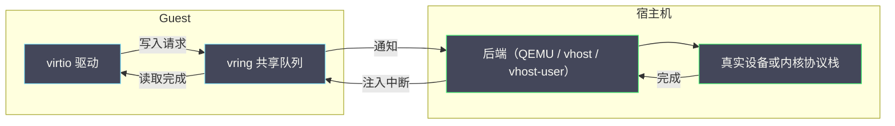

# 04 virtio 与 vhost——虚拟磁盘、网卡的 IO 路径和队列

**摘要：**

虚机的磁盘与网卡性能，取决于三件事：设备是不是半虚拟化的、后端跑在哪里、以及队列配得对不对。本文沿着一次 I/O 的完整往返，把 virtio 的环形队列机制、通知与抑制、块设备与网卡的设备类型、以及用户态与内核态三种后端形态逐一拆开，给出每一层的判据与观测方法。全文回答两个问题：一次虚拟 I/O 经过哪些环节，以及性能瓶颈通常出现在哪一环。文中的命令与观察方式取自 2026 年 9 月的现场记录，涉及具体数值处标注口径；设备后端与调用链请参见本专栏 01 篇，存储侧的四层归因见 [[SRE/CVM集群可靠性工程/03 云盘为什么慢——Guest、QEMU、网络与 Ceph 的联合分析|03 云盘为什么慢]]。

---

## 第 1 章 从全模拟到半虚拟化

虚拟 I/O 的性能差异，首先来自「设备怎么被虚拟出来」这个选择。

### 1.1 全模拟的代价

**全模拟设备让 Guest 以为自己面对的是一个真实存在的硬件设备**。Guest 用标准驱动去操作它，每次寄存器访问、每次 DMA 设置都会触发虚拟化层的介入：Guest 的写被截获，由虚拟化层解释并转化为对宿主机真实设备的操作。

这套机制的好处是**兼容性极好**——Guest 不需要任何专用驱动，老系统也能跑。代价是**每次 I/O 都要多次陷入与解释**，开销随 I/O 频率线性上升。对高吞吐场景，这个代价无法接受。

### 1.2 半虚拟化的思路

**半虚拟化（Paravirtualization）换了一个思路：不假装是硬件，而是定义一个「双方都知道的协议」**。Guest 侧用专用驱动，宿主机侧用专用后端，双方通过共享内存中的数据结构交换请求与响应，避免了大量的寄存器模拟。

这个思路的前提是「Guest 愿意配合」——它必须安装专用驱动。代价是兼容性下降，收益是性能大幅提升。**在生产环境里，这个交换几乎总是划算的**，因为主流操作系统的驱动都很成熟。

### 1.3 为什么 virtio 成为标准

半虚拟化不是只有 virtio 一条路。virtio 之所以成为事实标准，有三个原因：**它是一套开放的规范**（不是某家厂商私有）、**它覆盖了主要设备类型**（块、网、控制台、输入等）、以及**它有多种后端实现可选**（用户态、内核态、专用进程）。

**规范的开放性带来生态**：Guest 侧驱动进入主流内核，宿主机侧后端有多种实现，使用者可以在不改 Guest 的前提下更换后端。这与 01 篇「三层可替换」是同一个设计取向。

### 1.4 与物理设备路径的对照

把虚拟路径与物理路径对照，可以看出差异在哪。

| 环节 | 物理设备 | 虚拟设备（半虚拟化） |
| :--- | :--- | :--- |
| 驱动 | 硬件厂商驱动 | 半虚拟化通用驱动 |
| 提交请求 | 写寄存器、设 DMA | 写共享内存队列 |
| 通知 | 硬件自动 | 显式通知（有开销） |
| 完成 | 硬件中断 | 注入虚拟中断 |
| 数据搬运 | DMA 直达 | 可能需中转（除非零拷贝） |

**表中「通知」与「数据搬运」是虚拟路径特有的开销来源**，也是本篇后几章的重点。理解这两处，就理解了虚拟 I/O 的性能上限在哪里。

### 1.5 一张 I/O 路径示意图



图中两处「通知」是虚拟路径特有的开销：**一次提交通知、一次完成中断**。后端的位置（QEMU 内、内核模块、独立进程）决定了这两处通知的处理成本，这也是第 4 章的主题。

### 1.6 半虚拟化的历史与生态

半虚拟化不是 virtio 发明的概念。更早的实现（如某些 Unix 虚拟化方案）已经尝试「让 Guest 配合」以换取性能，但它们的接口是私有的，因此生态有限。

**virtio 的贡献在于「把半虚拟化标准化」**：它定义了一套设备规范，Guest 侧驱动与宿主机侧后端只要各自实现规范，就能互相配合。**标准化带来了生态**：主流操作系统内置了 virtio 驱动，宿主机侧出现了多种后端实现，使用者可以自由组合。

**这也解释了为什么 virtio 能长期占据主导**：不是因为它技术上最优，而是因为它**生态最完整**。这与分布式系统里「实践标准取代规范标准」是同一个规律——胜出的往往不是最优雅的设计，而是被最多实现接受的设计。

**对运维的启示是：选型时要看生态成熟度，而不只看技术指标**。一个规范再漂亮，如果驱动与后端支持不足，也用不起来。

### 1.7 全模拟与半虚拟化的一个对照实例

设想同一个业务在两套配置下运行：一套用全模拟网卡，一套用半虚拟化网卡并启用多队列。

**全模拟配置的表现**：吞吐上限低，且宿主机侧 CPU 占用高——因为每次 I/O 都要模拟寄存器与 DMA。**半虚拟化配置的表现**：吞吐显著提升，宿主机 CPU 占用下降。

**差异的来源有三处**：省掉了寄存器模拟（每次 I/O 的陷入减少）、省掉了数据复制（共享队列）、以及多队列带来的并行（不再串行化）。

**这个实例的价值在于它把「半虚拟化快」拆成了三个可解释的来源**，而不是笼统地归因于「技术先进」。**能拆开的结论才能被复用**。

### 1.8 三种设备实现方式的成本对照

把设备实现方式汇总，可以看到成本的阶梯。

| 方式 | 每次 I/O 的介入 | 性能 | 兼容性 |
| :--- | :--- | :--- | :--- |
| 全模拟 | 多次陷入与解释 | 低 | 最好 |
| 半虚拟化 | 一次通知与一次中断 | 中高 | 需专用驱动 |
| 直通 | 几乎无介入 | 最高 | 需硬件支持 |

**三级阶梯对应三类代价**：全模拟的代价是性能，半虚拟化的代价是兼容性，直通的代价是灵活性（迁移能力）。

**选择依据是「业务对哪一项最不敏感」**。**没有一种方式在所有维度上都占优**，这正是「架构即权衡」在 I/O 层的体现。

## 第 2 章 virtio 的机制：vring 与通知

virtio 的核心是一个环形队列，理解它就是理解虚拟 I/O。

### 2.1 vring 结构

**环形队列（virtqueue）由三部分组成**：**描述符表**（描述每个缓冲区的位置与长度）、**可用环**（提交方告知「哪些描述符可用了」）、**已用环**（完成方告知「哪些已处理完了」）。

这三部分位于双方共享的内存中，因此**提交与完成不需要数据拷贝，只需要写索引**。这是 virtio 高效的根本原因：**用共享内存加索引，替代了寄存器模拟**。

### 2.2 描述符链

一个请求可能由多个缓冲区组成（如「头部 + 数据 + 尾部」），因此描述符可以串成链。**链式结构让一个请求的表达更灵活**，但也增加了描述与遍历的开销。

**描述符链的长度影响处理成本**：链越长，双方遍历的成本越高。因此在设计上通常倾向于「少而大」的请求，而不是「多而碎」。

### 2.3 通知与抑制

提交与完成都需要「通知对方」，而通知是有开销的：它可能触发一次退出或一次中断。**因此 virtio 提供了抑制机制**：在队列中积攒若干请求后再通知一次，减少通知次数。

**抑制的取舍是「延迟」与「开销」**：不抑制，每次 I/O 都通知，延迟低但开销大；抑制过度，延迟升高但开销小。**这个取舍正是「延迟与吞吐」在 I/O 层的具体形态**，也是后面调优的主要旋钮。

### 2.4 一次 I/O 的完整往返

把机制串起来，一次虚拟 I/O 的往返大致是：**Guest 驱动准备缓冲区并写入描述符、更新可用环、通知后端；后端读取请求、执行实际 I/O、更新已用环、注入中断；Guest 驱动处理完成、回收缓冲区**。

这个往返里有两处「通知」，以及一次「实际 I/O」。**性能问题通常出在两处通知的开销上，或出在「实际 I/O」的后端形态上**。

### 2.5 vring 的一个类比

可以把 vring 想成「双方共用的一块公告板」：提交方把请求写在板子上并把指针前移，完成方读走并把处理结果写上，双方通过指针的位置判断对方做到哪了。

**这个类比的关键在于「共用」**：因为板子是共用的，所以不需要把内容抄一遍给对方。**这正是 virtio 高效的根本**——它省掉的是「复制」，而不是「通知」。

类比的边界在于：公告板是双方直接读写同一块内存，而 vring 位于共享内存中，两边的读写需要内存屏障保证顺序。**屏障的语义是 virtio 实现里最容易出错的地方**，也是为什么半虚拟化驱动必须与后端配套。

### 2.6 一次往返的时序

把一次 I/O 的往返按时序展开，可以看清每一步的开销来源。

| 步骤 | 执行者 | 开销来源 |
| :--- | :--- | :--- |
| 准备缓冲区 | Guest 驱动 | 内存分配与填充 |
| 写描述符与可用环 | Guest 驱动 | 内存写与屏障 |
| 提交通知 | Guest → 宿主机 | 可能触发一次退出 |
| 读取与执行 | 后端 | 实际 I/O 与后端处理 |
| 写已用环 | 后端 | 内存写与屏障 |
| 完成中断 | 宿主机 → Guest | 一次中断注入 |
| 回收缓冲区 | Guest 驱动 | 内存管理 |

**七步里，第 3、6 步是虚拟化特有的开销**；第 4 步的开销取决于后端形态；其余步骤与物理设备类似。

**这张表的用途是「对号入座」**：当 I/O 性能有问题时，先判断是哪一步慢，而不是笼统地调参数。

### 2.7 抑制机制的两种方向

抑制机制有两个方向，分别作用于「提交」与「完成」。

**提交侧的抑制**：Guest 在提交若干请求后才通知后端一次。**完成侧的抑制**：后端在完成若干请求后才注入一次中断。

**两个方向的目标一致**（减少通知次数），但**作用点不同**：提交侧影响后端的处理节奏，完成侧影响 Guest 的处理节奏。**因此两者的调优要分开考虑**。

**一个实用的判据**：如果延迟高而吞吐尚可，可能是完成侧抑制过度（Guest 等中断等太久）；如果后端 CPU 占用高而吞吐上不去，可能是提交侧通知过于频繁。

**这又是「用症状区分方向」**，与本篇 6.2 节一致。

### 2.8 队列的两个方向

队列在 virtio 里有两个方向：**提交队列**（Guest 向后端提交请求）与**完成队列**（后端向 Guest 报告完成）。

**两个方向的队列可以分开优化**：提交侧的瓶颈影响「请求能不能快速送达」，完成侧的瓶颈影响「结果能不能快速取回」。

**实践中常见的不对称**：写入密集的场景，提交侧压力大；读取密集的场景，完成侧压力大。**因此优化时要先判断哪一侧是瓶颈**。

**判断方法是看两侧的统计**：如果提交后长时间没有完成，瓶颈可能在完成侧；如果提交本身就慢，瓶颈在提交侧。**这与 2.7 节的抑制方向判据配套使用**。

### 2.9 vring 的内存布局与对齐

vring 的内存布局有几个工程细节，它们影响正确性与性能。

**三部分需要按特定对齐存放**：描述符表、可用环、已用环各有对齐要求。**对齐的目的是保证双方对同一块内存的访问是原子的**——如果索引跨越了缓存行边界，可能出现「读到半写状态」。

**另一个细节是「缓存行的争用」**：如果提交方与完成方频繁写同一缓存行，会产生缓存行在核间来回弹跳的开销。**因此实现上会把双方各自写的部分放在不同缓存行**。

**这两个细节都不体现在配置项里，却影响性能**。**它们也是「为什么半虚拟化驱动必须与后端配套实现」的原因**——协议细节不匹配，性能与正确性都会出问题。

### 2.10 一个 vring 的配置实例

设想为一个高吞吐网络业务配置队列。

**队列数**：与 vCPU 数一致（例如 8）。**队列深度**：按吞吐需求取较大值（例如 256 或更大）。**抑制**：提交侧适度抑制（积攒若干请求再通知），完成侧按延迟敏感度调整。

**配置后要验证三件事**：队列数生效、中断分散、吞吐提升。**三件事里第二件最容易漏**。

**这个实例与 5.5 节的区别在于它同时给出了深度与抑制的取值思路**。**取值的依据不是「别人怎么配」，而是「业务的吞吐与延迟需求」**。

## 第 3 章 设备类型：块、网卡与其他

virtio 是一个家族，不同设备类型有不同的取舍。

### 3.1 virtio-blk 与 virtio-scsi

块设备有两种实现：**virtio-blk**（专用的块设备驱动，结构简单、路径短）与 **virtio-scsi**（把块设备放在 SCSI 协议之下，结构更复杂但功能更多）。

**virtio-blk 的优势是路径短、开销低**；**virtio-scsi 的优势是功能完整**——它支持更多的设备数、更完整的 SCSI 命令集（如 discard、更细的错误报告）、以及更好的热插拔语义。

**选型依据是「功能需求」**：只需要基本块设备时用 blk；需要 SCSI 语义（如某些企业存储特性）时用 scsi。**这也是 01 篇「设备模型选择依据」的具体化**。

### 3.2 virtio-net

网卡的半虚拟化实现是 virtio-net。它的特点有三：**支持多队列**（每个队列可以绑定到不同 vCPU）、**支持多种卸载**（校验和、分段等）、以及**后端形态丰富**（内核态、用户态、专用进程）。

**多队列是 virtio-net 最关键的配置**：单队列在高吞吐下会成为瓶颈，多队列让流量分散到多个队列与多个 vCPU 上，显著提升吞吐。**这也是 01 篇「virtio 队列与中断」里提到的机制**。

### 3.3 其他设备

除块与网卡外，virtio 家族还包括：**控制台**（替代模拟串口）、**输入设备**、**内存气球**（03 篇讲过的机制）、**文件系统**（共享目录）、**随机数**等。

**它们的共同点是「把常见设备半虚拟化」**，覆盖了虚机运行所需的绝大多数外设。**未覆盖的设备仍走全模拟**，因此一台虚机的 I/O 路径往往是「半虚拟化为主、全模拟为辅」的混合。

### 3.4 选型依据

设备类型的选型可以按三个问题判断：**是否有性能要求**（有则必须半虚拟化）、**是否需要特定语义**（需要则选功能更全的实现）、**是否需要兼容老系统**（需要则保留全模拟）。

**三个问题的答案往往指向「混合配置」**：关键设备用半虚拟化，特殊设备保留模拟。**这与 01 篇「按约束选方案」是同一思路**。

### 3.5 设备类型的组合实例

设想一台虚机同时需要高性能磁盘与高性能网络。

**磁盘选 virtio-blk**（路径短、开销低），**网络选 virtio-net 并启用多队列**（吞吐需求高）。**控制台等辅助设备保留半虚拟化的轻量实现**，**特殊设备（如某些加密卡）保留全模拟或直通**。

这个组合的每一个选择都有理由：**关键路径追求性能，辅助路径追求兼容**。**把「所有设备都换成半虚拟化」当成目标，反而会引入不必要的复杂度**。

**这也是「按需优化」的一个实例**：优化应当集中在影响业务的关键路径上，而不是全面铺开。

### 3.6 virtio 之外：直通与 SR-IOV

virtio 不是唯一的性能手段，直通（Passthrough）与 SR-IOV 是另外两条路。

**直通把物理设备直接分配给虚机**，Guest 用原生驱动操作真实设备，几乎没有虚拟化开销。**SR-IOV 是直通的标准化形态**：一个物理设备虚拟出多个「虚拟功能」，每个可以独立分配给一台虚机。

**两者的收益是「接近物理性能」**，代价有三：**失去迁移能力**（设备状态与物理位置绑定）、**设备数量受限**（受硬件能力限制）、以及**管理复杂度上升**（需要专门的配置与监控）。

**选择依据是「性能需求是否超出 virtio 的能力上限」**。多数业务用 virtio 加多队列就能满足，只有极端场景才需要直通。**这与本篇 6.6 节「优化顺序」一致**——直通是最后一步，不是第一步。

### 3.7 块设备的缓存与直通模式

块设备还有一层配置是「缓存模式」，它与设备类型是两个独立的维度。

**缓存模式决定数据在宿主机上是否被缓存**：直写模式（不经缓存）保证一致性但延迟高；回写模式（经缓存）延迟低但可能丢数据。

**缓存模式与设备类型的组合**：virtio-blk 加回写，与 virtio-scsi 加直写，是两种完全不同的性能特征。**因此选型时要两个维度一起考虑**，而不是只选设备类型。

**这一点与 03 篇「QEMU 缓存模式」是同一件事**，只是从 I/O 路径的角度再看一次。**同一机制在不同篇目里承担不同角色，正是专栏组织方式的价值**。

### 3.8 设备类型的一个演进方向

设备类型的演进有两个方向值得留意。

**第一个方向是「功能上移」**：把更多功能放进半虚拟化设备，减少对模拟设备的依赖。例如更完整的块设备语义、更丰富的网络卸载。

**第二个方向是「数据面下沉」**：把数据面从内核移到用户态专用进程，以获得更高的灵活性。这与 4.5 节「后端形态演进」是同一趋势的另一面。

**两个方向的共同目标是「缩短路径、减少中介」**。**它们也提示了一个判断：如果一个优化手段增加了中介层，就要问它是否值得**——多数情况下，减少中介比增加中介更有效。

### 3.9 设备类型与存储后端的组合

设备类型与存储后端的组合会影响端到端性能，这一点与 03 篇「四层归因」相连。

**本地的 virtio 设备加远程存储后端**：设备路径是虚拟化的，存储路径是网络的，两段各有开销。**直通设备加本地存储**：两段都接近物理，但失去迁移能力。

**多数生产配置是「虚拟设备加共享存储」**：用虚拟化换可迁移性，用共享存储换数据可靠性。**代价是端到端路径上有两处虚拟化开销**。

**判断瓶颈在哪一段的方法**：分别测设备侧与存储侧的延迟。**如果设备侧正常而存储侧高，优化设备没有意义**——这与 03 篇「分层归因」是同一方法。

## 第 4 章 后端形态：从用户态到内核态

同一个 virtio 设备，后端可以跑在不同地方，性能差异很大。

### 4.1 用户态后端

**用户态后端指后端逻辑跑在 QEMU 进程里**。它的优点是实现简单、调试方便；缺点是**每次 I/O 都要经过用户态与内核态的切换**，且可能与 QEMU 的主循环争抢。

**用户态后端适合低频、低吞吐的设备**。在高吞吐场景下，它会成为明显瓶颈——这与 01 篇「主循环瓶颈」是同一现象。

### 4.2 vhost：内核态后端

**内核态后端（vhost）把后端逻辑放进内核模块**。它的优点是**省去了用户态与内核态之间的往返**，Guest 的通知可以直接被内核模块处理，数据也更容易直接送入内核的网络或块层。

**内核态后端的收益在高吞吐场景下明显**，代价是把逻辑放进了内核（升级与调试不如用户态灵活）。**这是「性能与可维护性」的取舍**，与 01 篇「设备后端三形态」对应。

### 4.3 vhost-user：用户态专用进程

**用户态专用进程（vhost-user）把后端放进一个独立的用户态进程**。它兼顾了两点：**性能接近内核态**（因为它绕开了 QEMU 主循环，且可以通过共享内存与 Guest 直接交换），**灵活性接近用户态**（因为它不在内核里）。

**vhost-user 是现代高性能虚拟化的主流选择**，尤其在有专用数据面（如用户态网络栈、用户态存储）的场景下。**代价是架构更复杂**：多了一个进程要管理，队列的协商也更复杂。

### 4.4 三种形态的对照

| 形态 | 后端位置 | 性能 | 复杂度 | 适用 |
| :--- | :--- | :--- | :--- | :--- |
| 用户态后端 | QEMU 进程内 | 低 | 低 | 低频设备 |
| vhost | 内核模块 | 高 | 中 | 高吞吐通用场景 |
| vhost-user | 独立用户态进程 | 高 | 高 | 专用数据面 |

**三种形态的取舍是「性能、复杂度、灵活性」的三角**。选择依据是业务吞吐需求与团队维护能力——**没有「最好的形态」，只有「最匹配的形态」**。

### 4.5 后端形态的演进

后端形态的演进有一条清晰的线索：**不断减少「用户态与内核态之间的往返」**。

**第一代是用户态后端**：后端在 QEMU 里，每次 I/O 都要从内核态把通知带回用户态处理。**第二代是内核态后端**：把后端放进内核，通知直接在内核里处理。**第三代是用户态专用进程**：把后端放进独立进程，通过共享内存与 Guest 直接交换，绕开 QEMU 主循环。

**三代演进的共同目标是「缩短路径」**：路径越短，单次 I/O 的开销越小。**这与 01 篇「Exit 开销的量级」是同一条线索**——所有优化最终都在减少「陷入与返回」的次数或成本。

### 4.6 后端形态与迁移的关系

后端形态与迁移之间存在关联，这一点与 02、03 篇的「确定性配置约束迁移」类似。

**用户态后端与内核态后端通常对迁移友好**：它们的状态在 QEMU 与内核里，可以随虚机一起搬迁。**专用进程后端则更复杂**：后端进程有自己的状态，迁移时需要协调。

**因此启用专用进程后端时，要额外确认迁移能力**。这与 03 篇「大页场景下迁移要额外校验」是同一类约束。

**把这些约束集中记录**，能让「能不能迁」成为可查表回答的问题——这是本专栏反复出现的一条工程化建议。

### 4.7 后端形态的一个选择实例

设想一个平台需要同时支持两类业务：**通用业务**（吞吐中等、需要频繁迁移）与**高性能业务**（吞吐极高、很少迁移）。

**通用业务用内核态后端**：性能足够，且对迁移友好。**高性能业务用专用进程后端**：吞吐最大化，接受迁移复杂度的上升。

**两类业务分开部署**，而不是在同一台宿主机上混用两种后端。**理由与 02 篇「按池划分」一致**：把矛盾变成资源池划分，比在同一份资源上做精细平衡更稳妥。

**这个实例也说明「后端形态」是一个需要按业务分级的配置**，而不是全局统一的选择。

### 4.8 后端形态的观测差异

不同后端形态的观测方式略有差异，这一点在排查时要注意。

**用户态后端的观测点在 QEMU 进程内**：看主循环与 I/O 线程的 CPU 占用。**内核态后端的观测点在内核**：看内核线程与软中断的占用。**专用进程后端的观测点在独立进程**：看该进程的 CPU 与内存。

**如果按老习惯只看 QEMU 进程，会漏掉后两种形态的开销**。**因此排查前要先确认后端形态**，再决定看哪里——这是「先问统计的是谁」在 I/O 场景的具体应用。

### 4.9 后端形态的一个迁移约束表

| 后端形态 | 迁移友好度 | 主要约束 |
| :--- | :--- | :--- |
| 用户态后端 | 高 | 无特殊约束 |
| vhost（内核态） | 高 | 需内核支持 |
| vhost-user | 中 | 后端进程状态需协调 |
| 直通 | 低 | 设备与位置绑定 |

**这张表的用途是「迁移前查一遍」**：确认后端形态是否支持迁移、需要哪些额外步骤。**把「能不能迁」变成查表，而不是临时推演**，是本专栏反复强调的工程化做法。

## 第 5 章 队列与多队列

队列是 virtio 性能最直接的旋钮，也是最容易被配置错误的地方。

### 5.1 队列的作用

**每个队列是一条独立的请求通道**。单队列意味着所有请求排在一个队里，由一方串行处理；多队列意味着请求可以分散到多条通道，由多方并行处理。

**队列数量的上限通常与 vCPU 数相关**：常见做法是「一个 vCPU 对应一个队列」，从而让每个 vCPU 都能独立提交请求而不互相排队。

### 5.2 多队列的收益与前提

多队列的收益来自**并行**：多个 vCPU 同时发起 I/O 时，不会被单队列串行化。**但多队列有前提**：Guest 驱动要支持、后端要支持、以及**中断要分散到不同核**。

**最后一点最容易被忽略**：如果所有队列的中断都落在同一个核上，多队列的收益会被中断处理串行化吃掉。**因此多队列配置必须与中断亲和性一起考虑**——这与 03 篇「NUMA 与中断亲和性」是同一件事。

### 5.3 队列深度

**队列深度指队列能容纳多少个未处理的请求**。深度越大，能容纳的在途请求越多，越容易填满设备的能力；深度越小，越容易因为「队列满」而让 Guest 等待。

**深度不是越大越好**：过大的深度会让延迟上升（请求排队更久），也会占用更多内存。**取舍依据是「延迟敏感还是吞吐敏感」**：吞吐敏感用较大深度，延迟敏感用较小深度。

### 5.4 配置与观测

```bash
# 查看虚机的网卡队列配置
virsh dumpxml <domain> | grep -i -A5 interface

# 查看块设备的队列与调度信息
ls /sys/block/<dev>/mq/ 2>/dev/null

# 从宿主机侧观察 virtio 相关的中断分布
grep -i virtio /proc/interrupts
```

```bash
# 虚机内部：网卡队列与统计
ethtool -l <iface>      # 队列数量
ethtool -S <iface>      # 队列级统计

# 虚机内部：块设备统计
cat /sys/block/<dev>/stat
```

**观测的要点是「按队列看」而不是只看总量**：单队列拥塞会表现为「某个队列的统计异常」，总量上看不出来。**这与 02 篇「按核观察」是同一种方法**。

### 5.5 队列配置的一个实例

设想一台 8 vCPU 的虚机，运行高吞吐网络业务。

配置的思路是：**队列数与 vCPU 数匹配**（8 个队列），**每个队列的中断绑定到对应的 vCPU**（避免中断集中在单核），**队列深度按吞吐需求设置**（吞吐敏感取较大值）。

配置完成后要验证：**队列数是否生效**（虚机内 `ethtool -l`）、**中断是否分散**（宿主机侧 `/proc/interrupts`）、**吞吐是否提升**（业务指标）。

**第二个验证最容易被省略**：队列数配对了，但中断仍集中在一核，收益会被吃掉一半。**因此多队列的验证必须包含中断分布**。

### 5.6 队列与 vCPU 的映射

队列与 vCPU 的映射关系决定了并行度的上限。

**常见做法是「一对一」**：队列数等于 vCPU 数，每个队列的中断绑定到对应的 vCPU。**这样做的好处是「每个 vCPU 独立提交与处理」**，不需要跨核同步。

**但一对一不是唯一选择**：队列数可以少于 vCPU 数（节省资源），也可以多于（应对单队列处理能力不足）。**选择依据是「I/O 压力与 vCPU 数量的关系」**。

**映射关系需要显式规划**，而不是让系统自动决定。**自动决定在多数情况下够用，但在性能敏感场景下，显式规划能带来确定的收益**——这与 02 篇「绑核」的思路一致。

### 5.7 队列配置的三个陷阱

队列配置有三个陷阱。

**第一，队列数配了但中断没分散**：收益被串行化吃掉。**第二，队列深度照抄别人的值**：深度与业务特征相关，照抄会不匹配。**第三，队列数与 vCPU 数不匹配**：队列多于 vCPU 会造成队列之间争抢 vCPU，反而增加开销。

**三个陷阱的共同点是「只看配置项，不看实际效果」**。**队列配置的验证必须包含「实际效果」**：吞吐是否提升、中断是否分散、CPU 占用是否下降。

**这与 02 篇「绑核配置正确不等于业务变快」是同一条纪律**。

### 5.8 队列与延迟的关系

队列深度与延迟之间有直接关系，值得单独说明。

**队列中的请求是排队处理的**。如果设备处理一个请求需要 T 时间，队列中有 N 个请求，那么新来的请求最多要等 N 乘以 T。**因此深度越大，最坏等待时间越长**。

**这与 02 篇「排队延迟的非线性」是同一个机制**，只是发生在 I/O 队列而不是 CPU 运行队列。

**实践含义是：深度是「吞吐与延迟」的旋钮**。**吞吐敏感的业务希望队列深，延迟敏感的业务希望队列浅**。**同一台虚机上无法同时满足两者**，只能按业务分级——这是本篇第三次回到同一个结论。

## 第 6 章 性能：瓶颈在哪里

把前面几章合起来，虚拟 I/O 的瓶颈可以归为三类。

### 6.1 三类瓶颈

**第一类是「设备类型」瓶颈**：用了全模拟设备，开销天然高。**第二类是「后端形态」瓶颈**：用户态后端在高吞吐下成为瓶颈。**第三类是「队列配置」瓶颈**：单队列或中断集中导致并行度不足。

三类瓶颈的处置分别是：**改用半虚拟化设备**、**改用内核态或专用进程后端**、**启用多队列并分散中断**。

**三类瓶颈的排查顺序应当是「从配置到架构」**：先确认设备类型与队列配置（改动小），再考虑后端形态（改动大）。**这与 06 篇「先只读后写入」的落地顺序是同一思路**。

### 6.2 退出与通知的开销

从 01 篇的分类看，虚拟 I/O 的开销集中在**退出与通知**上：每次通知可能触发一次退出，每次完成可能注入一次中断。**因此降低开销的两条路是「减少通知次数」（抑制）与「降低单次成本」（内核态后端、零拷贝）**。

**这两条路对应不同的症状**：延迟高但吞吐尚可，多半是通知过于频繁；吞吐上不去，多半是单次成本太高或并行度不足。**用症状区分方向，是本篇最实用的一条判据**。

### 6.3 零拷贝与直通

减少数据搬运的两种手段是**零拷贝**（让数据在 Guest 与后端之间不经过中间缓冲）与**直通**（把物理设备直接分配给虚机，绕过虚拟化层）。

**零拷贝的收益是减少内存带宽占用**，代价是配置复杂、与某些特性（如迁移）冲突。**直通的收益是接近物理性能**，代价是失去迁移能力、设备数量受限、以及管理复杂度上升。

**两者的共同点是「用灵活性换性能」**，与 02 篇绑核、03 篇大页是同一种取舍。**是否采用取决于业务对性能与可迁移性的优先级**。

### 6.4 观测方法

```bash
# 宿主机侧：观察 virtio 后端的 CPU 占用
ps -T -p <qemu-pid> -o tid,comm,pcpu

# 宿主机侧：观察网络软中断与队列处理
cat /proc/softirqs

# 虚机内部：块设备延迟与队列
iostat -x 1
```

**观测的要点是「同时看虚机内与宿主机侧」**：虚机内看到的是端到端延迟，宿主机侧看到的是后端处理成本。**两者对照才能定位瓶颈在后端还是在前端**——这与 03 篇「两个视角」是同一纪律。

### 6.5 三类瓶颈的一个对照

| 瓶颈 | 症状 | 改动成本 | 处置 |
| :--- | :--- | :--- | :--- |
| 设备类型 | 吞吐普遍低 | 低（配置） | 换半虚拟化 |
| 后端形态 | 高吞吐下 CPU 高 | 高（架构） | 换后端 |
| 队列配置 | 并发时上不去 | 低（配置） | 多队列加分散中断 |

**三类瓶颈的改动成本差异很大**，因此排查顺序应当是「先配置后架构」。**这与 06 篇「先只读后写入」的落地节奏是同一原则**：先做便宜且见效快的动作。

### 6.6 一个优化的顺序

虚拟 I/O 的优化可以按四步推进：**第一步，确认设备类型**（是否半虚拟化）；**第二步，确认队列配置**（数量、深度、中断分布）；**第三步，评估后端形态**（是否需要换）；**第四步，考虑零拷贝或直通**。

四步的顺序是「改动成本递增、收益递减」：前两步几乎无成本，后两步涉及架构调整与能力取舍。**多数场景的问题在前两步就能解决**，因此不必一上来就考虑直通。

**这个顺序的价值在于它抑制了「一步到位」的冲动**。**复杂方案不是更专业，而是更贵的默认选项**。

### 6.7 一个 I/O 性能的算例

用一个简化算例说明通知开销的量级。

假设每次通知的开销是 5 微秒（含退出与处理），每秒发起 10 万次 I/O。如果不做抑制，光通知的开销就是 0.5 秒 CPU 时间——**相当于半个核被通知消耗掉**。

如果抑制到每 16 个请求通知一次，通知次数降到 6250 次/秒，开销降到约 0.03 秒。**这就是抑制的收益量级**。

**但抑制也有代价**：每次通知前积攒 16 个请求，最后一个请求要多等一会儿。**如果单个请求的处理时间是 10 微秒，积攒 16 个的等待约 160 微秒**——这个延迟对延迟敏感业务可能不可接受。

**这个算例说明「抑制是延迟与吞吐的直接换算」**，调参时必须知道自己在换什么。

### 6.8 三类瓶颈的排查清单

- 设备类型：是否使用半虚拟化设备。
- 队列数量：是否与 vCPU 数匹配。
- 中断分布：是否分散到多个核。
- 队列深度：是否与业务延迟或吞吐需求匹配。
- 后端形态：是否与业务吞吐需求匹配。
- 抑制参数：是否与业务延迟敏感度匹配。

**六条检查项覆盖了「配置 → 并行 → 架构」三个层次**。按顺序检查，多数问题在前三条就能定位。

### 6.9 一个端到端性能的分解

把一次虚拟 I/O 的端到端时间分解，可以看到各段的占比。

**设备路径**（驱动准备、通知、后端处理、中断）与**存储或网络路径**（实际 I/O）是两段。**两者的占比决定了优化方向**：如果设备路径占比高，优化设备；如果实际 I/O 占比高，优化后端或网络。

**分解方法**：分别测两段的延迟。设备路径的延迟可以从 virtio 相关的中断与后端处理时间估算；实际 I/O 的延迟从存储或网络的统计获得。

**这个分解与本专栏 03 篇「四层归因」是同一种方法**，只是把层次换成了「设备路径与数据路径」。**方法一致、对象不同，正是专栏的组织逻辑**。

## 第 7 章 一次 I/O 性能定位

下面用一个实例把前面的概念串起来。

### 7.1 现象

某台虚机的磁盘吞吐上不去，虚机内的延迟并不高，但吞吐远低于同规格物理机。

### 7.2 分层收敛

第一步，确认设备类型：如果用的是全模拟设备，问题已经定位。假设是半虚拟化设备，继续。

第二步，确认后端形态：如果后端在用户态且 QEMU 主循环 CPU 占用高，说明后端是瓶颈。

第三步，确认队列配置：如果只有单队列，而虚机有多个 vCPU 在并发 I/O，说明并行度不足。

第四步，确认中断分布：如果队列的中断都落在一个核上，说明中断处理被串行化。

### 7.3 结论与处置

四步对应的结论分别是：**改用半虚拟化设备**、**改用内核态或专用进程后端**、**启用多队列**、**分散中断亲和性**。

**四步的顺序是「改动成本递增」**：前两步是配置层面，后两步涉及架构调整。**先做便宜的改动，再评估昂贵的改动**，是排查与优化的通用原则。

### 7.4 定位方法的可迁移部分

这次定位可以提炼成三个动作：**先看设备类型、再看队列与中断、最后看后端形态**。

三个动作对应「配置层 → 并行层 → 架构层」三个层次。**顺序不能颠倒**：跳过配置层会误判架构层，跳过并行层会把「并行度不足」当成「后端太慢」。

**「配置 → 并行 → 架构」** 是 I/O 类问题的一般顺序，与 02 篇「定方向 → 定性质 → 定来源」是同一方法的不同表述。

### 7.5 一个反例：优化了吞吐但延迟变差

一个常见的反例是：为了提升吞吐而加大队列深度与抑制强度，结果吞吐上去了，但延迟变差了。

**原因在于吞吐与延迟的换算关系**：加大深度与抑制，本质上是「用延迟换吞吐」。**当业务同时关心两者时，单方面优化一个会损害另一个**。

**判断方法是看延迟分布的变化**：如果 P50 变化不大但 P99 明显上升，说明优化加剧了长尾——这正是「用延迟换吞吐」的典型特征。

**处置方向是按业务分级**：吞吐敏感的业务用大深度，延迟敏感的业务用小深度。**两类业务分开部署**，而不是在同一虚机上折中——这与本篇 4.7 节「后端形态分级」是同一思路。

## 第 8 章 实验：如何测出后端形态的差异

后端形态的差异需要用实验证明，而不是凭直觉。

### 8.1 实验设计

实验的要素与 02 篇一致：**基线**（用户态后端的吞吐与延迟）、**变量**（换成内核态或专用进程后端）、**干扰**（模拟并发负载）。

**固定其他变量**是关键：同一台宿主机、同一份负载、同一套队列配置，只改后端形态。

### 8.2 度量什么

度量的核心是**吞吐与延迟的分布**，以及**宿主机侧的 CPU 占用**。后端形态的改变通常表现为「同样吞吐下 CPU 占用下降」或「同样 CPU 占用下吞吐上升」。

**同时要看「延迟是否改善」**：有些后端形态提升了吞吐但延迟不变，说明它优化的是并行度而非单次开销。

### 8.3 实验的边界

结论的边界有三条：**绑定负载特征**（小块随机与大块顺序的结论不同）、**绑定硬件**（网卡与 CPU 的能力影响结果）、**绑定配置**（队列数量与中断分布会影响后端形态的收益）。

**把边界写进结论**，是本专栏实验方法的统一要求。

### 8.4 实验的一个记录模板

实验记录应当包含：**环境**（CPU、网卡、存储类型）、**基线**（用户态后端的吞吐与延迟分布）、**变量**（后端形态）、**结果**（吞吐、延迟、宿主机 CPU 占用）、以及**边界**（适用的负载特征）。

**「宿主机 CPU 占用」是这类实验的关键度量**：后端形态优化的本质是「用更少的 CPU 做同样的事」，因此不测 CPU 就看不到收益。

**边界项尤其重要**：后端形态的收益与负载特征强相关，不写边界的结论无法复用。

### 8.5 实验的一个简化流程

如果资源有限，可以用简化流程评估后端形态：**在同一台宿主机上，用同一份负载分别跑用户态后端与内核态后端，对比吞吐、延迟与宿主机 CPU 占用**。

**简化流程的优势是「变量少」**：只改后端形态，其他都不变。**劣势是「结论粗」**：它只能说明「换了后端有收益」，不能给出精确的收益幅度与适用边界。

**快速摸底用简化流程，制定策略用完整实验**。这与 02 篇「简化流程适合快速摸底」是同一思路。

## 第 9 章 误判与反例

第一，**把全模拟设备当成「够用」**。低频场景确实够用，但一旦吞吐上升就会成为瓶颈。

第二，**认为内核态后端总是更好**。它提升吞吐，但升级与调试成本更高，低频场景收益有限。

第三，**只配多队列不分散中断**。中断集中在单核会让多队列的收益被串行化吃掉。

第四，**把队列深度调到最大**。过大的深度会抬高延迟，且占用内存。

第五，**把零拷贝当成免费的优化**。它与迁移等特性冲突，配置复杂度高。

第六，**只看虚机内的吞吐**。宿主机侧的后端处理成本才是瓶颈的所在。

第七，**把直通当成万能方案**。它牺牲迁移能力与设备灵活性。

第八，**忽略观测口径**。队列级统计与设备级统计的口径不同，混用会误判。

第九，**把队列数配好就认为多队列生效**。中断仍集中在一核时，收益会被吃掉。

第十，**跳过配置层直接评估架构改造**。多数问题在设备类型与队列配置上就能解决。

第十一，**把抑制参数当成越大越好**。抑制换的是延迟，参数过大会让延迟敏感业务受损。

第十二，**把 vring 的实现细节当成无关紧要**。对齐与缓存行布局直接影响性能与正确性。

第十三，**在同一虚机上同时追求极致吞吐与极致低延迟**。队列深度与抑制参数都是两者之间的旋钮，必须按业务分级取舍。

## 第 10 章 边界与反例

第一，**半虚拟化依赖 Guest 驱动**。老系统或特殊系统可能没有驱动，只能退回全模拟。

第二，**后端形态受平台支持限制**。并非所有环境都支持内核态或专用进程后端。

第三，**多队列有上限**。队列数受 vCPU 数与后端能力限制，不能无限增加。

第四，**零拷贝与直通都有前提**。硬件能力、平台配置与业务特性都会限制它们的使用。

第五，**性能数据必须绑定场景**。设备类型、后端形态与队列配置的组合效应很大，跨场景外推容易出错。

第六，**把设备后端形态当成纯性能问题**。它还影响迁移能力与运维复杂度。

第七，**把优化顺序倒过来**。先做贵的架构改造、再回头查配置，往往发现改造没必要。

第八，**把直通当成 virtio 的替代**。它是极端场景的最后手段，代价是迁移能力。

第九，**把队列深度当成纯粹的吞吐参数**。它同时决定最坏等待时间，是吞吐与延迟的旋钮。

第十，**把设备侧优化与存储侧优化混为一谈**。两段路径各有开销，先测出瓶颈在哪一段再优化。

行文至此，把本篇落点收在两条原则上。其一，架构即权衡——从全模拟到半虚拟化、从用户态后端到内核态与专用进程，每一步都是用兼容性或复杂度换性能。其二，复杂性不会消失只会转移——半虚拟化把寄存器模拟的开销消掉了，却把开销转移到了通知、队列与后端形态上，这正是本篇逐一拆解的对象。下一篇转向虚机运维中最复杂的一次操作：热迁移，看它的性能由什么决定，以及「迁移不收敛」到底卡在哪里。相邻的 I/O 栈机制可参见 [[Linux/网络协议栈与IO/00 专栏导览|Linux 网络协议栈与 IO]]，存储侧的四层归因见 [[SRE/CVM集群可靠性工程/03 云盘为什么慢——Guest、QEMU、网络与 Ceph 的联合分析|03 云盘为什么慢]]。

---

## 速查卡：虚拟 I/O 性能定位

这张表把虚拟 I/O 性能问题按现象归类；使用时先按「配置 → 并行 → 架构」三层定位，再选对应证据。表中「关键证据」是各现象最直接的判据，若判据不成立，应当回到第 7 章的顺序重新收敛。

| 现象 | 优先怀疑 | 关键证据 |
| :--- | :--- | :--- |
| 吞吐远低于物理机 | 设备类型 | 是否半虚拟化 |
| 高吞吐下 CPU 占用高 | 后端形态 | 主循环与后端线程占用 |
| 并发时吞吐上不去 | 队列数量 | 队列配置与 vCPU 数 |
| 队列分散但收益不明显 | 中断分布 | `/proc/interrupts` 分布 |
| 延迟高但吞吐尚可 | 通知过于频繁 | 抑制配置与退出频率 |
| 优化后吞吐升延迟不变 | 优化的是并行度 | 吞吐与延迟分开看 |

## 口径与事实说明

- 命令与观察方式取自 2026 年 9 月的现场记录，属某时点实践，不构成唯一正确用法。
- 机制描述（vring、通知与抑制、设备类型、后端形态、多队列）属于 virtio 规范与 KVM 的稳定行为。
- 队列数量、深度、抑制参数与后端形态的取舍应按业务分级确定。
- 队列与后端形态的观测方式随实现而异，排查前先确认实现形态。
- 文中涉及的队列数量与深度仅为示例，不代表实际配置。
- 本文的判据与顺序可直接用于同类虚拟化实现，具体配置项需按现场调整。
- 本文与本专栏其余篇目共享同一套观察方法与口径纪律，相邻篇目已展开的机制不在此重复推导。
- 文中命令均为只读观测类操作，设备热插拔、后端切换与迁移等写操作须走审批并回读。

---

## 参考资料

1. virtio 规范，队列与设备类型：<https://docs.oasis-open.org/virtio/virtio/v1.2/virtio-v1.2.html>
2. Linux 内核文档，vhost 与 vhost-user：<https://www.kernel.org/doc/html/latest/virt/kvm/index.html>
3. QEMU 官方文档，virtio 设备与后端：<https://www.qemu.org/docs/master/system/devices/virtio-net.html>
4. libvirt 官方文档，网络与磁盘设备配置：<https://libvirt.org/formatdomain.html>
5. Linux 内核文档，网络多队列与中断：<https://www.kernel.org/doc/html/latest/networking/index.html>
6. 内部现场素材：CVM 集群 hypervisor 监控交付记录（2026-09-01，脱敏）

---

> [!note] 思考题
> 1. 半虚拟化为什么比全模拟快，它的前提是什么。
> 2. virtio 的通知抑制在延迟与开销之间如何取舍，症状上如何区分。
> 3. 三种后端形态各适合什么场景，为什么没有「最好的形态」。
> 4. 多队列配置为什么必须与中断分布一起考虑。
> 5. 零拷贝与直通都用灵活性换性能，具体牺牲了什么。
