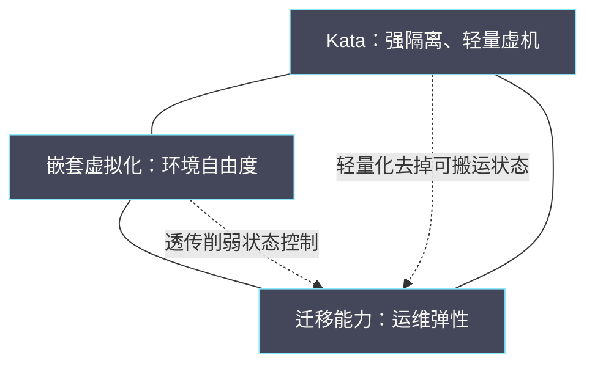

# 07 Kata、嵌套虚拟化与迁移能力约束

**摘要：**

Kata 带来更强的隔离，嵌套虚拟化带来在虚机里跑虚机的能力，迁移能力则带来运维弹性——这三者在工程上互相约束：加强隔离往往牺牲迁移，启用嵌套往往牺牲性能，而追求可迁移性又常常要求放弃前两者。本文把这三个概念放在同一个坐标系里，逐项分析它们的约束来源，给出组合决策的方法与验证门禁。全文回答两个问题：这三项能力为什么互相制约，以及当它们冲突时应当如何取舍。文中的验证记录取自 2026 年 8 月至 9 月的脱敏现场素材，涉及具体数值处标注口径；硬件虚拟化机制见 [[LLM/Agent沙箱技术/隔离原语/04 KVM 与硬件虚拟化——MicroVM 隔离的硬件基石|KVM 与硬件虚拟化]]，迁移的收敛机制见本专栏 05 篇。

---

## 第 1 章 三个约束的相互作用

先把三个概念摆在一起，看它们为什么会冲突。

### 1.1 三个概念

**Kata 是容器与虚机之间的一种折中**：它让容器以轻量虚机的方式运行，从而获得接近虚机的隔离强度与接近容器的启动速度。**嵌套虚拟化是「在虚机里再跑虚机」**：宿主层透传虚拟化能力给中间层，中间层再向最内层提供虚拟化。**迁移能力指虚机能否在不中断业务的前提下搬迁**。

三者分别对应三种诉求：**隔离强度、运行环境自由度、运维弹性**。**它们本身都是好事**，冲突发生在同时追求的时候。

### 1.2 为什么它们互相约束

冲突的根源在于**三者都依赖同一批底层能力，而它们对这些能力的用法互相排斥**。

**Kata 依赖「把虚机做得极轻」**，这要求去掉大量设备与状态，而迁移恰恰依赖这些状态的可搬运性。**嵌套虚拟化依赖「把虚拟化能力透传下去」**，这要求宿主机暴露底层特性，而透传会削弱中间层对状态的控制，进而影响迁移。**迁移依赖「状态可表达、可重建」**，而 Kata 与嵌套都让状态变得更难表达。

**一句话概括：隔离与自由度增加的是「不可搬运的状态」，而迁移要的正是「可搬运的状态」**。

### 1.3 一个三角关系

把三者画成一个三角，每条边代表一种约束。

**三角的含义是「三者难以同时最大化」**。工程上的任务不是消除冲突，而是**明确哪一项是硬需求、哪一项可以降级**。

### 1.4 本篇的定位

本篇是本专栏的收束：**01 至 06 篇给出各层的机制与方法，本篇把它们放到一个真实的工程取舍里**。

**取舍的结论不是「选哪个」，而是「在什么条件下选哪个、以及选了之后要放弃什么」**。**这与全专栏的主线一致：先理解代价，再决定是否采用**。

### 1.5 约束的三种表现

三者的约束在工程上表现为三种形态，识别它们有助于定位问题。

**第一种是「直接不可用」**：某项能力在特定组合下完全无法使用。例如直通设备与迁移的组合，结果是迁移直接失败。**它的特征明确、易于发现**。

**第二种是「有条件可用」**：能力可用但需要满足额外条件。例如嵌套与迁移的组合，两端配置一致时才可迁移。**它的特征是「在特定条件下成功」，容易被误判为「偶尔失败」**。

**第三种是「假成功」**：操作报告成功但功能异常。例如部分加速机制的状态未纳入迁移，迁移完成但功能出错。**它的特征隐蔽、危害最大**。

**三种形态里，第三种最需要在验证中专门覆盖**。**「成功」的判据不是「操作返回成功」，而是「功能实际可用」**——这与全专栏反复出现的「回读验收」是同一条纪律。

### 1.6 约束的来源：三种状态

把约束的根源抽象一层，可以看到它们都涉及「状态的归属」。

**第一类是「状态在设备上」**：直通设备的状态在物理硬件里，迁移无法搬运。**第二类是「状态在宿主层」**：嵌套与透传的状态（CPU 特性、虚拟化能力）在宿主层，跨层迁移无法保持一致。**第三类是「状态不完整」**：轻量虚机省略了部分状态，迁移缺少重建依据。

**三类状态问题对应三种约束形态**：第一类导致「直接不可用」，第二类导致「有条件可用」，第三类导致「假成功」。

**这个抽象的价值在于「它给出了统一的排查入口」**：遇到迁移问题时，先问「缺的是哪一类状态」，而不是逐项试错。**这与 05 篇「状态重建视角」是同一方法**。

### 1.7 一个类比与它的边界

可以用「搬家」来类比三者的关系。

**隔离像是「把家具都钉死在墙上」**：稳固，但搬家时搬不走。**嵌套像是「在租来的房子里再隔出房间」**：自由度大，但隔断依赖原房结构，换房时可能不兼容。**迁移像是「整屋搬迁」**：要求所有东西可拆可装。

**类比的好处是直观**：**「钉死」与「搬迁」的矛盾一目了然**。**这也是工程上最朴素的判断依据**——任何让东西更「钉死」的能力，都会削弱搬迁。

**类比的边界在于**：现实中「钉死」是物理约束，而虚拟化里「钉死」是状态表达问题。**因此虚拟化的约束有时可以通过「补上状态表达」来缓解**（如把部分状态纳入迁移范围），这在物理世界不可能。**这一点提示了优化的空间**：不是所有约束都不可解，有些只是尚未被纳入状态管理。

### 1.8 三个约束在真实决策中的表现

在真实决策中，三个约束往往以「需求冲突」的形式出现，而不是以技术名词出现。

**典型表述是「我们既要隔离又要能迁移」**。**这句话本身不是需求，而是两个需求被并列**。**决策的第一步就是把它拆开**：隔离对应安全要求，迁移对应运维要求，两者分别由谁提出、优先级如何。

**拆开之后往往发现**：两个需求的提出者不同，优先级也不同。**冲突的实质是「两个部门的需求排序不同」**，而不是「技术做不到」。

**这个视角的价值在于「把技术问题还原为需求问题」**。**技术问题的解法是权衡，需求问题的解法是排序**——两者的处理方式不同，混在一起就会陷入无解。

## 第 2 章 Kata 与 MicroVM

先从隔离这一端看。

### 2.1 Kata 的定位

**Kata 的核心思路是「用轻量虚机承载容器」**：每个容器（或每组容器）跑在一个独立的内核里，从而获得内核级隔离，而启动速度与资源占用又接近容器。

它的价值在于**填补了「容器隔离太弱」与「虚机太重」之间的空档**。**相邻专栏 [[LLM/Agent沙箱技术/00 专栏导览|Agent 沙箱技术专栏]] 讨论的隔离光谱，正是把它放在这个位置上**。

### 2.2 与常规虚机的差异

| 维度 | 常规虚机 | Kata 类轻量虚机 |
| :--- | :--- | :--- |
| 设备模型 | 完整（含半虚拟化设备） | 极简 |
| 启动时间 | 秒级 | 亚秒级 |
| 内存开销 | 较大 | 较小 |
| 状态可搬运性 | 较好 | 较差 |
| 隔离强度 | 硬件级 | 硬件级 |

**表的第四行是关键**：**轻量化去掉的不只是设备，还有迁移所需的状态**。**因此 Kata 的隔离强度与常规虚机相当，但可运维性弱于常规虚机**。

### 2.3 启动与密度

**Kata 的启动时间通常在亚秒级**，这使它适合「短生命周期、需要强隔离」的场景（如多租户的代码执行环境）。

**高密度是它的另一个卖点**：由于开销小，同一宿主机上可以承载更多实例。**但密度与隔离强度之间存在张力**：密度越高，宿主机资源越紧张，隔离的效果越依赖于资源控制而非隔离本身。

**这一点值得强调：隔离强度不等于资源保障**。**强隔离解决的是「互相干扰数据」，而资源竞争是另一回事**——这与 02 篇「隔离只解决被抢，不解决总量不足」是同一结论。

### 2.4 存储与网络

Kata 的存储与网络路径比常规虚机更短，但代价是**可配置性更低**。

**存储上**，Kata 通常使用简单的块设备或共享目录，不追求完整的块设备语义。**网络上**，通常使用简化的网络模型。**两者都服务于「轻量」，而不是「功能完整」**。

**对运维的含义是：Kata 场景下的排障手段更少**。**常规虚机可用的许多观测与调整手段，在轻量虚机上不可用**——这与 04 篇「后端形态影响观测方式」是同一类约束。

### 2.5 运维影响

Kata 对运维的影响可以归纳为三条：**观测手段变少**（设备与状态更少）、**迁移能力变弱**（状态难搬运）、以及**故障处置更依赖重建而非修复**。

**第三条尤其重要**：**当状态难以搬运时，「重建」就成了主要的恢复手段**。**这要求业务本身是无状态的，或有独立的数据持久化机制**——否则强隔离换来的好处会被「恢复困难」抵消。

### 2.6 轻量虚机的一个实例

设想一个多租户的代码执行环境：用户提交代码，平台在隔离环境中运行并返回结果。

**需求特征**：强隔离（多租户，代码不可信）、短生命周期（单次执行几分钟）、无需迁移（执行完即销毁）、需要快速启动（用户体验）。

**方案选择**：轻量虚机。**放弃项**：迁移能力（本来就不需要）、完整的设备语义（业务不需要）。**收益**：隔离强度接近虚机，启动速度接近容器。

**这个实例说明「放弃项不必是痛苦的选择」**：当业务本身不需要某项能力时，放弃它没有代价。**关键是识别出「业务不需要」这件事，而不是默认所有能力都要有**。

**这也解释了为什么轻量虚机在特定场景下很成功**：不是因为它更强，而是因为它的放弃项恰好是那些场景不需要的。

### 2.7 轻量虚机与常规虚机的选型

轻量虚机与常规虚机的选型可以按四个问题判断。

**是否需要强隔离**：需要则倾向轻量虚机或常规虚机（两者隔离强度相当）。**生命周期是否短**：短则倾向轻量虚机（启动快）。**是否需要完整设备语义**：需要则倾向常规虚机。**是否需要迁移**：需要则倾向常规虚机。

**四个问题里，第一个与第四个往往是决定性的**。**如果既需要强隔离又需要迁移，那么两者都只能部分满足**——这正是本篇讨论的核心冲突。

**选型结论应当写成「条件加选择」的形式**：在什么条件下选什么，而不是「统一选什么」——这与 06 篇「结论要带边界」是同一要求。

### 2.8 轻量虚机的一个反例

一个常见的反例：把「需要长期运行、需要迁移」的业务也放到了轻量虚机上，结果维护时无法迁移，只能停机重建。

**问题在于「场景判断错误」**：轻量虚机适合短生命周期与可重建的场景，而该业务两个条件都不满足。**技术本身没问题，用错了场景**。

**正确的判断方式是「先看生命周期与迁移需求」**：长期运行且需要迁移的业务，应当用常规虚机。**判断成本很低（问两个问题），误判成本很高（维护窗口被迫拉长）**。

**这个反例的启示是：技术的适用边界比技术本身更重要**。**知道「它不适合什么」，比知道「它能做什么」更实用**。

### 2.9 轻量虚机的运维清单

轻量虚机的运维需要专门的清单。

- 观测手段：确认可用的观测接口（可能少于常规虚机）。
- 恢复方式：确认以重建为主，验证重建流程。
- 数据持久化：确认数据不在实例内。
- 生命周期：确认实例是短周期或可重建的。
- 密度与资源：确认宿主机资源水位可控。

**五项里，「数据持久化」与「密度与资源」最容易被忽略**。**前者决定实例销毁后数据是否丢失，后者决定密度提高后隔离是否仍有效**。

**这张清单与 08 篇「巡检清单」是同一形态**：把「该检查什么」写成可执行的条目，而不是依赖经验。

### 2.10 轻量虚机的启动与密度算例

用一个算例说明轻量虚机的收益与代价。

**假设常规虚机启动需要 10 秒、内存开销 500 MiB；轻量虚机启动 0.3 秒、内存开销 100 MiB**。在需要每秒创建若干实例的场景下，常规虚机无法满足，轻量虚机可以。

**但代价同样明显**：轻量虚机的状态表达不完整，迁移可能无法完成。**因此在「创建频率高但无需迁移」的场景下，轻量虚机优势明显；在「创建频率低但需要迁移」的场景下，常规虚机更合适**。

**算例的价值在于它把「场景差异」量化了**。**「轻量虚机更快」不是结论，「在什么场景下快多少、代价是什么」才是结论**——这与 06 篇「结论要可量化」是同一要求。

### 2.11 轻量虚机与安全边界

轻量虚机的安全边界值得单独说明，因为「强隔离」常被泛化理解。

**轻量虚机提供的是「内核级隔离」**：每个实例有自己的内核，因此一个实例的内核漏洞不会直接影响另一个实例。**这是它比容器隔离更强的地方**。

**但它不提供「资源隔离」与「侧信道防护」**：**共享同一宿主机的实例仍然竞争 CPU、内存带宽与缓存**，侧信道攻击的可能性依然存在（与 03 篇 KSM 的侧信道讨论同类）。

**因此「强隔离」应当被精确表述为「内核级隔离」**。**把「内核级隔离」当成「完全隔离」，会在资源竞争与侧信道场景下产生错误的安全预期**。

**这个区分与全专栏「精确表述」的一贯要求一致**：**含糊的表述会带来错误的预期，而错误的预期比不知道更危险**。

## 第 3 章 嵌套虚拟化

再从环境自由度这一端看。

### 3.1 什么是嵌套

**嵌套虚拟化指在最内层虚机里再次运行虚拟化软件**。它的实现方式是宿主层把硬件虚拟化能力（如 CPU 的虚拟化扩展）透传给中间层，中间层再向最内层提供虚拟化。

**三层分别称为 L0（宿主层）、L1（中间层）、L2（最内层）**。相邻专栏 [[LLM/Agent沙箱技术/隔离原语/04 KVM 与硬件虚拟化——MicroVM 隔离的硬件基石|KVM 与硬件虚拟化]] 对这套机制的退出分类有系统拆解。

### 3.2 为什么需要

**需要嵌套的场景有三类**：在云主机里运行需要虚拟化的软件（如模拟器、安全研究环境）、在云主机里搭建测试集群、以及在云主机里运行 Kata 这类轻量虚机。

**第三类与本篇直接相关**：**Kata 在裸金属上不需要嵌套，但在云主机上运行就需要**。**这也是本专栏与沙箱专题的连接点**。

### 3.3 性能代价

嵌套的性能代价来自两处：**退出次数的增加**（L1 未拦截的退出要由 L0 处理），以及**地址翻译层数的增加**（多一级翻译）。

**代价的量级与负载相关**：计算密集型负载受影响较小，I/O 与内存密集型受影响较大。**因此「嵌套能不能用」必须按业务负载实测**——这与 06 篇「结论绑定负载」是同一要求。

**这一点在实践中常被忽略**：**「配置闸门通过」不等于「性能可用」**。**配置只是必要条件，性能才是充分条件**。

### 3.4 配置与门禁

嵌套的启用需要多道门禁：**宿主层是否开启嵌套支持**、**中间层是否透传虚拟化能力**、以及**最内层能否识别并加载虚拟化模块**。

**三道门禁是串联的**：任何一道不通过，整个链路都不可用。**因此验证必须逐道确认，而不是只看最内层是否成功**。

**这与 05 篇「迁移前检查清单」是同一方法**：把串联的依赖拆成逐项检查。

### 3.5 一个验证清单

- 宿主层：嵌套支持是否开启。
- 中间层：CPU 是否暴露虚拟化标志。
- 中间层：虚拟化模块能否加载。
- 最内层：虚拟化功能能否实际使用。
- 性能：实测是否满足业务要求。
- 稳定性：长时间运行是否稳定。

**六条检查项里，最后两条最容易被省略**。**「能加载」与「能用」是两件事，「能用」与「能长期稳定用」又是两件事**——这与 07 篇「能力可用才是验收标准」是全专栏反复出现的纪律。

### 3.6 嵌套的一个实例

设想在云主机上搭建一个测试集群：需要运行容器编排平台，平台内的 Pod 又要运行需要虚拟化的负载。

**需求特征**：环境自由度（需要运行虚拟化软件）、可接受性能损耗、不需要频繁迁移。

**方案选择**：嵌套虚拟化。**放弃项**：部分性能、跨层迁移能力。**验证要点**：配置门禁逐道通过、功能实际可用、性能实测达标、长期运行稳定。

**现场记录里的一条教训值得抄录**：**「能加载不等于可用」**——虚拟化模块加载成功只说明当前节点具备基础条件，**实际使用与性能表现仍需独立验证**。

**这个实例的启示是「验证要分层」**：配置、功能、性能、稳定性是四个独立的验证层次，不能用一层的结果推断另一层。

### 3.7 嵌套的一个反例

一个常见的反例：为了「让业务能跑起来」，启用了嵌套，但没有验证性能，上线后发现业务吞吐只有裸金属的三分之一。

**问题在于「只验证了功能，没验证性能」**。**嵌套的性能代价与负载强相关**：计算密集型的代价小，I/O 密集型的代价大。**不实测就无法知道代价有多大**。

**正确的做法是「功能与性能分两步验证」**：先确认能跑，再实测性能，最后决定是否放行。**现场记录里的做法正是如此**——配置闸门通过后，性能未过门禁的场景只做灰度。

**这个反例的启示是：能跑不等于可用，可用不等于够用**。**三个层次需要三次验证**。

### 3.8 嵌套的一个决策依据

是否启用嵌套，可以按三个问题判断。

**第一，业务是否真的需要虚拟化能力**：如果只是需要隔离，常规隔离手段就够了。**第二，性能损耗是否可接受**：需要实测。**第三，可迁移性是否重要**：重要则要考虑嵌套对迁移的影响。

**三个问题的答案组合决定了是否启用**：需要且可接受且不重要（迁移）则启用；否则要考虑替代方案。

**判断的依据是业务，不是技术**。**「嵌套很强」不是启用它的理由，「业务需要它」才是**。

### 3.9 嵌套与安全

嵌套虚拟化在安全上有一个值得注意的性质：**它扩大了信任边界**。

**L0 需要把虚拟化能力暴露给 L1**，这意味着 L1 获得了控制硬件虚拟化的能力。**如果 L1 不可信，这个暴露就是一个攻击面**。

**因此嵌套的启用应当与「L1 是否可信」一起评估**：**在自己的测试环境里启用嵌套，风险可控；在多租户环境里让不可信的租户使用嵌套，风险显著上升**。

**这也是「能力越强、边界越需要明确」的一个例证**。**嵌套本身是中性的，风险取决于谁在使用它**——这与 03 篇 KSM 的安全讨论是同一类判断。

## 第 4 章 迁移能力的约束

最后从运维弹性这一端看。

### 4.1 哪些能力阻碍迁移

**阻碍迁移的能力可以归纳为三类**：**设备不可搬运**（直通设备、轻量虚机的极简设备）、**状态不可表达**（部分加速机制的状态）、以及**环境不可复制**（嵌套与 CPU 透传带来的依赖）。

**三类的共同点是「它们把状态绑定到了具体环境」**。**迁移要求状态与环境解耦，而这三类能力都在加强绑定**。

### 4.2 逐个分析

**直通设备**：设备与物理位置绑定，迁移后设备不可用。**轻量虚机的极简设备**：状态表达不完整，迁移后可能无法重建。**嵌套与透传**：CPU 特性与宿主层绑定，跨层迁移可能不兼容。**部分加速机制**：状态存在于宿主机侧，未纳入迁移范围。

**四类里，「部分加速机制」最隐蔽**：它的状态不在虚机内，也不在标准迁移范围内，**因此迁移可能「成功」但功能异常**。**这与 05 篇「状态重建」视角是同一问题**。

### 4.3 迁移能力的分级

迁移能力可以分三级：**完全可迁移**（状态完整、环境无关）、**有条件可迁移**（需要额外配置或特定目标）、**不可迁移**（状态无法搬运）。

**分级的意义在于「让运维知道能做什么」**。**知道「不可迁移」比不知道要好**——前者可以提前设计替代方案（如重建），后者会在需要迁移时才发现无路可走。

**这与 04 篇「迁移约束表」是同一做法**：把「能不能迁」变成可查表回答的问题。

### 4.4 一个约束对照表

| 能力 | 对迁移的影响 | 影响的来源 |
| :--- | :--- | :--- |
| 直通设备 | 不可迁移 | 设备与物理位置绑定 |
| 轻量虚机 | 迁移能力弱 | 状态表达不完整 |
| 嵌套虚拟化 | 有条件可迁移 | CPU 特性与宿主层绑定 |
| 部分加速机制 | 可能假成功 | 状态未纳入迁移范围 |
| 大页与绑核 | 有条件可迁移 | 目标端资源需匹配 |

**五行的共同点是「它们都增加了迁移的前置条件」**。**迁移不再是「随时可做」，而是「满足条件才可做」**——这个认知是运维规划的前提。

### 4.5 迁移约束的一个实例

设想一台使用大页与绑核的虚机需要迁移。

**约束**：目标端需要有足够的大页、拓扑兼容、且能容纳绑定关系。**如果目标端不满足**，迁移会失败或需要重配。

**因此迁移前必须校验**：目标端的大页余量、NUMA 拓扑、以及空闲核。**这三项构成「能不能迁」的前置条件**——与 05 篇「CPU 兼容性检查清单」并列。

**这个实例说明「迁移能力不是二值属性」**：同一台虚机，在满足条件的目标端可迁移，在不满足的目标端不可迁移。**因此「可迁移性」应当表述为「在什么条件下可迁移」**，而不是「可迁或不可迁」。

### 4.6 迁移能力的一个分级实例

设想为一个平台的各类虚机建立「迁移能力台账」。

**分级内容**：完全可迁移（常规虚机加共享存储、无直通、无特殊绑定）、有条件可迁移（使用大页或绑核、需目标端匹配）、不可迁移（使用直通设备、轻量虚机）。

**台账的用途是「提前知道能做什么」**：需要维护时，先查台账，看该虚机属于哪一级，据此决定「迁移还是重建」。

**台账需要维护**：虚机的配置会变（加了大页、接了直通设备），**台账不及时更新会给出错误的能力判断**——这与 06 篇「基线要定期复核」是同一要求。

**这个实例的价值在于它把「能力」从隐性知识变成了可查表的事实**。

### 4.7 迁移约束与运维节奏

迁移约束会改变运维节奏，这一点值得展开。

**可迁移时，维护可以「随到随做」**：把虚机迁走、维护、迁回，业务几乎无感。**不可迁移时，维护需要「计划窗口」**：提前安排停机与重建，业务受影响。

**两者的运维节奏差异很大**：前者的维护可以频繁且碎片化，后者必须集中且提前规划。**因此迁移能力实际上决定了运维的「敏捷度」**。

**这也是「迁移能力」在需求排序中权重较高的原因**：它不只影响单次操作，还影响整个运维模式的灵活性。

## 第 5 章 三者的交互

单个能力的影响清楚了，接下来看两两与三者同时的交互。

### 5.1 Kata 加嵌套

**在云主机上运行 Kata，就是「Kata 加嵌套」的组合**。它的约束是双重的：Kata 本身的可运维性弱，嵌套又进一步削弱了性能与可迁移性。

**因此这个组合的适用场景很窄**：需要强隔离、不需要迁移、且能接受性能损耗的场景。**它不适合作为通用方案**——这与 07 篇「优化顺序」是同一思路：复杂度高的方案是特定场景的最后手段。

### 5.2 Kata 加迁移

**Kata 与迁移的冲突最直接**：轻量虚机的状态表达不完整，迁移可能无法完成或完成后功能异常。

**因此 Kata 场景的运维策略应当是「以重建替代迁移」**：需要维护时，把实例重建到目标节点，而不是搬迁。**这要求业务无状态，或数据已持久化到外部**。

**这个策略的代价是「恢复时间变长」**（重建比迁移慢），**收益是「方案简单可靠」**。**取舍依据是业务对恢复时间的容忍度**。

### 5.3 嵌套加迁移

**嵌套与迁移的冲突在于「CPU 特性与宿主层的绑定」**。**跨层迁移（从嵌套环境迁到非嵌套环境，或反之）几乎必然需要降级或重配**。

**同层迁移（两端嵌套配置一致）是可行的**，但需要**目标端满足相同的嵌套配置**。**因此嵌套场景的迁移应当限定在同构池内**——这与 02 篇「CPU 池划分」是同一做法。

### 5.4 三者同时

**三者同时追求时，冲突最严重**：强隔离（Kata）、环境自由度（嵌套）、运维弹性（迁移）都要，结果往往是**每一项都打折扣，且复杂度显著上升**。

**实践建议是「明确硬需求，其余降级」**：例如以强隔离为硬需求，则接受「不可迁移、重建恢复」；以迁移为硬需求，则放弃嵌套与轻量虚机。

**「三者都要」通常不是需求，而是没有想清楚需求**。**把这一点摆到台面上，是工程决策的第一步**。

### 5.5 三者交互的一个决策表

| 组合 | 主要约束 | 适用场景 | 主要风险 |
| :--- | :--- | :--- | :--- |
| 轻量虚机加嵌套 | 双重约束 | 强隔离且需虚拟化 | 性能与迁移双重受损 |
| 轻量虚机加迁移 | 状态不完整 | 少见 | 迁移假成功 |
| 嵌套加迁移 | 特性绑定 | 同构池内 | 跨层迁移失败 |
| 三者同时 | 全面打折 | 极窄 | 复杂度失控 |

**表的最后一行是「不要这样做」的提示**：**三者同时追求的结果通常是复杂度失控**，而不是能力叠加。**这与 04 篇「在同一虚机上同时追求极致吞吐与低延迟」是同一类反模式**。

### 5.6 交互的一个排查顺序

当三者交互出问题时，排查可以按一个固定顺序。

**第一步，确认现象属于哪一类约束形态**（直接不可用、有条件可用、假成功）。**第二步，确认缺的是哪一类状态**（设备、宿主层、不完整）。**第三步，确认哪一项能力是硬需求**，据此判断是否有替代方案。

**三步的顺序是「先分类、再定位、后决策」**。**跳过第一步会把不同形态的问题混在一起讨论，浪费时间**。

**这与 01 篇「先分层再定位」是同一方法**：分类是排查的第一步，也是最能省时间的一步。

### 5.7 交互与业务等级

三者交互的影响与业务等级强相关。

**核心业务**：通常优先保迁移与可用性，因此放弃强隔离与嵌套。**一般业务**：可以按需选择，允许有条件可迁移。**特殊业务**（如需要虚拟化的测试环境）：优先保环境自由度，接受性能与迁移的损失。

**分级的价值在于「不同等级的业务用不同组合」**，而不是全平台统一一套方案。**这与 02 篇「按业务等级配置策略」是一贯的**。

**分级的实现方式就是分层**（6.8 节）：不同等级落在不同的池里，各自采用最适合的组合。

## 第 6 章 工程决策

冲突的解法是决策，而不是技术。

### 6.1 需求的优先级

**决策的第一步是给三项需求排优先级**：哪一项是「必须有」、哪一项是「最好有」、哪一项是「可以放弃」。

**排序的依据是业务而非技术**：**隔离强度由安全要求决定，环境自由度由业务形态决定，迁移能力由运维要求决定**。**三者都不来自技术偏好**。

**因此排序必须与业务方共同完成**。**平台单方面排序，往往把技术偏好当成了业务需求**。

### 6.2 组合的选择

排完优先级后，组合的选择就清晰了。

| 硬需求 | 可选方案 | 需要放弃 |
| :--- | :--- | :--- |
| 强隔离 | 轻量虚机或常规虚机加隔离 | 迁移能力 |
| 环境自由度 | 嵌套虚拟化 | 部分性能与迁移 |
| 运维弹性 | 常规虚机加共享存储 | 部分隔离强度 |
| 强隔离加自由度 | 嵌套加轻量虚机 | 迁移能力与性能 |

**四行的共同点是「每种组合都有明确的放弃项」**。**决策的质量体现在「放弃项是否被显式承认」**，而不是「方案是否先进」。

### 6.3 退路设计

**任何一种选择都应当有退路**：当所选方案不适用时，替代路径是什么。

**退路通常有三类**：**降级**（放弃部分能力换取可用性）、**重建**（用重建替代迁移）、以及**分层**（把不同需求放到不同的池里）。

**「分层」最容易被忽略，却往往最有效**：**不同需求本来就不必在同一份资源上满足**——这与 02 篇「按池划分」是全专栏反复出现的解法。

### 6.4 一个决策实例

设想一个平台需要在云主机上提供「强隔离的代码执行环境」。

**需求排序**：强隔离是硬需求（安全要求），环境自由度是硬需求（需要运行虚拟化软件），迁移能力是最好有（可接受重建）。

**方案选择**：嵌套加轻量虚机。**放弃项**：迁移能力（改为重建恢复）、部分性能（接受嵌套损耗）。

**退路设计**：如果不能接受嵌套损耗，退到「常规虚机加隔离」，放弃环境自由度；如果不需要运行虚拟化软件，退到「裸金属加轻量虚机」，恢复性能。

**这个实例的价值在于它把「需求、方案、放弃项、退路」四件事都写清楚了**。**决策文档缺了任何一项，都会在实施时产生争议**。

### 6.5 决策的一个反例

一个常见的反例：平台为了「技术先进」，默认启用轻量虚机与嵌套，结果迁移能力丧失，维护窗口被迫拉长。

**问题在于「技术选择代替了需求分析」**。**隔离与自由度是「更强」，但「更强」不等于「更合适」**——如果业务并不需要强隔离，启用轻量虚机只是增加了运维成本。

**正确的做法是「先问需求，再选方案」**：隔离强度由安全要求决定，环境自由度由业务形态决定。**两者都不需要时，常规虚机加共享存储是最稳妥的选择**。

**这个反例的启示是：默认值的选择本身就是决策**。**把「先进方案」设为默认，等于替所有业务做了一个它们没参与的决策**。

### 6.6 决策文档的要素

决策文档应当包含：**需求与优先级**、**候选方案与放弃项**、**验证结果**（配置、功能、性能、稳定性）、**放行条件**（含代价）、以及**退路**。

**五项里，「放弃项」与「放行条件中的代价」最容易被省略**。**省略放弃项会让方案在实施时被质疑「为什么不支持某项能力」；省略代价会让问题在扩张后暴露**。

**文档的价值在于「它把决策的依据留了下来」**。**没有文档的决策，会在人员变动后变成「不知道为什么这么设计」**——这与 08 篇「有归属」是同一关切。

### 6.7 决策与组织的关系

技术决策最终要通过组织落实，这一点值得点明。

**决策需要有人拍板**（谁承担取舍的后果）、**需要有人执行**（谁落地与验证）、**需要有人维护**（谁在环境变化后复核）。

**三者缺一，决策就无法长期生效**。**最常见的缺口是「维护」**：决策做出来之后无人复核，环境变了而方案没变，问题就出现了。

**这与 08 篇「有归属」是同一关切**：**任何机制都需要归属，否则会在时间中失效**。

### 6.8 一个分层方案的实例

设想一个平台同时承载三类需求：需要强隔离的代码执行、需要环境自由度的测试集群、需要高可用与弹性的核心业务。

**分层方案**：代码执行放「轻量虚机池」（不迁移、重建恢复）、测试集群放「嵌套池」（同构、限定迁移）、核心业务放「常规虚机池」（共享存储、完全可迁移）。

**三层的收益是「每类需求在自己的池里被最优满足」**，代价是「三套池需要分别运维」。**取舍依据是运维能力**：有能力维护三套池就分层，没有则只能折中。

**这个实例的价值在于它把「冲突」变成了「划分」**。**冲突无法在单一方案里解决，但可以通过划分让冲突不在同一份资源上发生**——这是本专栏反复出现的解法。

## 第 7 章 验证与门禁

决策之后是验证。

### 7.1 为什么需要门禁

**因为「配置正确」与「能力可用」是两件事**。**配置门禁只保证前者，性能与稳定性需要独立验证**。

**门禁的作用是「阻止未验证的方案进入生产」**。**没有门禁，方案会在压力下被仓促上线，然后在真实负载下暴露问题**。

### 7.2 验证清单

- 配置：各层门禁是否逐道通过。
- 功能：目标能力是否实际可用。
- 性能：实测是否满足业务要求。
- 稳定性：长时间运行是否稳定。
- 可运维性：观测与恢复手段是否具备。
- 退路：替代方案是否验证过。

**六项里，「可运维性」与「退路」最容易被省略**。**前者决定故障时能不能查，后者决定方案失效时有没有替代**。

### 7.3 灰度与放行

**验证通过不等于全量放行**。**灰度是必要的中间步骤**：先小范围上线，观察真实负载下的表现，再逐步扩大。

**灰度的价值在于「用真实负载验证实验结论」**。**实验环境与生产总有差异，灰度是弥补差异的环节**——这与 06 篇「实验边界」是同一逻辑。

### 7.4 一个验证实例

设想验证「嵌套加轻量虚机」方案的可用性。

**配置验证**：宿主层嵌套支持开启、中间层暴露虚拟化标志、最内层虚拟化模块加载成功——三道门禁逐道通过。**功能验证**：在最内层实际启动一个轻量虚机实例，确认可运行。**性能验证**：实测启动时间与运行开销，与裸金属对照。**稳定性验证**：连续运行观察是否有异常。

**四步里，「性能验证」是最容易得出「不可用」结论的一步**——**现场记录里就出现过「配置闸门通过但性能未过门禁」的情形，因此该场景只做灰度、不全面放行**。

**这个实例的教训是：配置通过只是起点，性能与稳定性才是判据**。

### 7.5 门禁的一个组织方式

门禁要能落地，需要组织方式上的配合。

**第一是「门禁可执行」**：门禁必须是可自动校验的条件，而不是「需要人工判断」。**第二是「门禁有归属」**：谁负责维护、谁负责放行。**第三是「门禁可回滚」**：放行后出问题，能退回上一状态。

**三者与 08 篇「门禁设计」一致**（可执行、有归属、可回滚）。**这不是重复，而是同一原则在不同场景的应用**——迁移门禁、部署门禁、方案门禁本质上是同一件事。

**组织方式的收益是「门禁不被绕过」**。**不可执行、无归属、不可回滚的门禁，会在赶进度时被跳过**。

### 7.6 放行决策的一个实例

设想一个方案通过了配置与功能验证，但性能验证显示「比基线慢三成」。

**放行决策的要点有三个**：**业务能否接受这三成**、**是否有更优的替代**、以及**灰度能否覆盖风险**。

**假设业务能接受**（该场景对延迟不敏感），且替代方案需要更多改造，则决策可以是「灰度放行，限定在非核心业务」。

**这个决策的关键是「把三成这个代价显式写进放行条件」**。**不写代价的放行，会在业务扩张后暴露出问题**——因为扩张会放大性能损耗的影响面。

### 7.7 验证清单的一个使用实例

设想用验证清单检查一个「嵌套加轻量虚机」的方案。

**配置**：三道门禁逐道通过。**功能**：最内层能实际启动实例。**性能**：实测启动时间与运行开销。**稳定性**：连续运行观察。**可运维性**：确认观测手段与恢复方式。**退路**：验证「降级到常规虚机」的路径。

**六项里，「可运维性」与「退路」最容易被跳过**。**而它们恰恰是方案长期可用的关键**：**前者决定出问题时能不能查，后者决定方案失效时有没有替代**。

**这个实例的价值在于它演示了「清单要全项执行」**：只做前三项的验证，是不完整的验证。

### 7.8 门禁与灰度的关系

门禁与灰度是两道不同性质的关卡，配合使用。

**门禁是「进入前」的检查**：它验证方案是否具备上线的基本条件（配置、功能、性能、稳定性、可运维性、退路）。**灰度是「进入后」的观察**：它用小范围真实负载验证方案的实际表现。

**两者的分工是「门禁排除明显不可行的，灰度发现边界情况」**。**只有门禁没有灰度，会在真实负载下暴露问题；只有灰度没有门禁，会让明显不可行的方案进入生产**。

**两者的共同点是「都需要判定标准」**：门禁的判定标准是预设的条件，灰度的判定标准是「与预期一致」。**没有判定标准的灰度，会变成「上线了但不知道好坏」**——这与 06 篇「判定标准要明确」是同一要求。

## 第 8 章 误判与反例

第一，**把「配置通过」当成「方案可用」**。配置是必要条件，性能与稳定性才是判据。

第二，**认为三者可以同时最大化**。它们互相约束，同时追求只会让每一项都打折。

第三，**用技术偏好代替需求排序**。隔离、自由度与迁移能力都是业务需求，不应由平台单方面决定。

第四，**不设计退路**。方案失效时没有替代，只能硬扛。

第五，**用迁移思维处理不可迁移的场景**。Kata 场景应当以重建替代迁移。

第六，**在嵌套场景跨层迁移**。跨层迁移几乎必然需要降级或重配。

第七，**忽略隐蔽的状态绑定**。部分加速机制的状态不在虚机内，迁移可能「成功」但功能异常。

第八，**把隔离强度当成资源保障**。隔离解决数据互扰，不解决资源竞争。

第九，**把「更强」当成「更合适」**。更强往往意味着更多放弃项，是否合适取决于业务是否需要那些能力。

第十，**把「先进方案」设为默认**。默认值的选择本身就是决策，应当由需求驱动。

第十一，**验证清单只做前几项**。可运维性与退路是最容易被跳过、却最影响长期可用的两项。

## 第 9 章 边界与反例

第一，**轻量虚机的适用场景有限**。它适合短生命周期、强隔离、可重建的场景，不适合需要完整设备语义的场景。

第二，**嵌套的性能代价必须实测**。不同负载的代价差异很大，不能从配置推断。

第三，**迁移能力的分级是动态的**。环境变化可能让原本可迁移的场景变为不可迁移。

第四，**分层不是万能解**。池划分增加了管理复杂度，需要有对应的运维能力。

第五，**决策需要复核**。业务需求与平台能力都会变，原有的取舍可能不再适用。

第六，**把可迁移性当成二值属性**。它应当表述为「在什么条件下可迁移」。

第七，**把验证做成单层检查**。配置、功能、性能、稳定性是四个独立层次，不能互相推断。

第八，**技术决策不留归属**。没有维护者的决策会在环境变化后失效，且无人察觉。

第九，**在单一资源池里同时满足冲突需求**。冲突无法在单一方案里解决，分层往往比折中更有效。

第十，**把需求冲突当成技术难题**。它往往是两个需求排序不同，解法是排序而非权衡。

行文至此，把本篇落点收在两条原则上。其一，架构即权衡——隔离、自由度与运维弹性三者互相约束，任何组合都有明确的放弃项，决策的质量体现在放弃项是否被承认。其二，没有放之四海皆准的方案，只有因地制宜地按业务需求排序、按验证结果放行。至此，本专栏七篇正文告一段落：从虚机的运行原理到各项性能机制，再到实验方法与工程取舍，主线始终是「先看清机制、再量化影响、最后在约束下决策」。相邻的隔离光谱与嵌套机制见 [[LLM/Agent沙箱技术/00 专栏导览|Agent 沙箱技术专栏]]，迁移的收敛与停机见本专栏 05 篇。

---

## 速查卡：三项约束的取舍

这张表把三项约束的取舍整理成可查的形式；使用时先确认硬需求，再看对应的放弃项与退路。表中「退路」一列是决策的必备部分——没有退路的方案在失效时只能硬扛。

还有一条纪律值得写在表前：**放弃项必须被显式承认**。决策文档里写清「这个方案不支持什么」，比强调「这个方案支持什么」更重要——前者防止预期错位，后者容易过度承诺。

| 硬需求 | 方案 | 主要放弃项 | 退路 |
| :--- | :--- | :--- | :--- |
| 强隔离 | 轻量虚机 | 迁移能力 | 常规虚机加隔离 |
| 环境自由度 | 嵌套虚拟化 | 部分性能 | 裸金属部署 |
| 运维弹性 | 常规虚机加共享存储 | 部分隔离强度 | 重建恢复 |
| 隔离加自由度 | 嵌套加轻量虚机 | 迁移与性能 | 降级或分层 |

## 口径与事实说明

- 验证记录取自 2026 年 8 月至 9 月的脱敏现场素材，属某时点实践，不构成永久结论。
- 机制描述（轻量虚机的设备与状态、嵌套的退出与翻译、迁移的状态绑定）属于 KVM 与相关实现的稳定行为。
- 方案取舍与需求排序属业务决策，需与业务方共同确定并留下文档，不可由平台单方面决定。
- 本文涉及的启动时间与内存开销数值仅为算例，不代表实际配置，使用前需按现场实测替换。
- 轻量虚机、嵌套与迁移的实现细节随版本变化，排查前先确认实现形态。
- 本文与本专栏其余篇目共享同一套观察方法与口径纪律，相邻篇目已展开的机制不在此重复推导。
- 文中不涉及具体部署与变更操作，相关动作须走审批并回读，本文只给决策与验证方法，不替代现场预检。

---

## 参考资料

1. Kata Containers 官方文档，架构与运行时：<https://katacontainers.io/>
2. Linux 内核文档，嵌套虚拟化：<https://www.kernel.org/doc/html/latest/virt/kvm/nested-vmx.html>
3. QEMU 官方文档，MicroVM 与轻量设备：<https://www.qemu.org/docs/master/system/i386/microvm.html>
4. libvirt 官方文档，迁移与设备配置：<https://libvirt.org/migration.html>
5. Firecracker 官方文档，轻量虚机设计：<https://firecracker-microvm.github.io/>
6. 内部现场素材：CVM 嵌套虚拟化配置闸门验证（脱敏）
7. 内部现场素材：Agent 沙箱测试集群建设记录（2026-08，脱敏）

---

> [!note] 思考题
> 1. 隔离、环境自由度与运维弹性为什么会互相约束，约束的根源是什么。
> 2. 「配置闸门通过」为什么不能作为方案可用的判据。
> 3. 为什么不可迁移的场景应当以重建替代迁移，这个策略的前提是什么。
> 4. 嵌套场景为什么应当把迁移限定在同构池内。
> 5. 三者冲突时，需求排序为什么必须与业务方共同完成。
