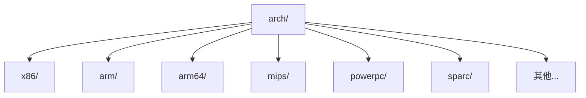
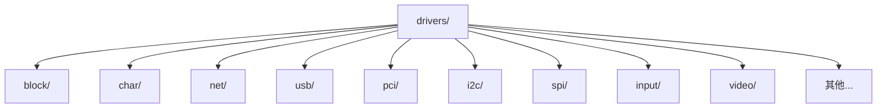
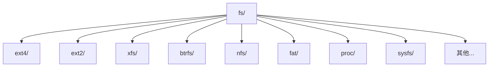

# 第1章 内核的基础层和应用层

前言中提到，内核分为**内核基础层**和**内核应用层**。这既有对整个操作系统软件架构的分析和理解，也有现实应用情况的支持。

操作系统对应用软件提供了统一的编程接口，操作系统的系统调用是稳定的、向下兼容的，但是在内核中，并不提供这种稳定且兼容的保证。实际上，同样的代码在不同的内核版本经常可能编译失败。内核的这种开发模式，造成了学习内核时版本众多而且不稳定的特点，也大大增加了学习的困难。

在长期对内核代码的分析和应用中，笔者注意到一个事实：**内核中提供了大量的软件基础设施**。这些基础设施既包括内核中对内存的使用，对进程调度的控制，也包括[[自旋锁]]、[[信号量]]等内核提供的同步函数，同时还包括内核提供的数据结构，比如链表、hash链表、[[红黑树]]等。这些软件基础设施如同操作系统提供的系统调用一样，是理解内核代码和编写内核代码的基础。而这些软件基础设施在各个内核版本中基本是稳定的。

现实情况提供了另一方面的支持。学习的动力来自于应用，传统的操作系统教科书全面，但也很少有人能完全读懂并且结合代码进行实战应用。大多数程序员在工作中应用到内核的部分，绝大多数是设备驱动，而讲操作系统的书多数不会关注到设备驱动层面。除了设备驱动之外，内核中文件系统也有较多的应用。

要做到快速流畅地阅读内核代码，前提是了解内核中的软件基础设施。这些知识使用范围很广，分布在内核代码的各个部分，如果不了解，在内核代码的理解上就容易出现障碍。

---

## 1.1　内核基础层提供的服务

操作系统通常提供的服务是内存管理、进程管理、设备管理和文件系统。本书将[[内存管理]]、[[进程管理]]以及其他内核提供的基础软件设施，比如[[工作队列]]、[[tasklet]]以及[[信号量]]和[[自旋锁]]都作为内核的基础层。本书并不分析和探讨这些基础层的原理和实现，本章只介绍如何使用这些基础软件设施。

### 1.1.1　内核中使用内存

简单说，内核提供了两个层次的内存分配接口。一个是从[[伙伴系统]]分配，另一个是从[[slab系统]]分配。伙伴系统是最底层的内存管理机制，提供页式的内存管理，而slab是伙伴系统之上的内存管理，提供基于对象的内存管理。

从伙伴系统分配内存的调用是 `alloc_pages`，注意此时得到的是页面地址，如果要获得能使用的内存地址，还需要用 `page_address` 调用来获得内存地址。

如果要直接获得内存地址，需要使用 `__get_free_pages`。`__get_free_pages` 其实封装了 `alloc_pages` 和 `page_address` 两个函数。

`alloc_pages` 申请的内存是以页为单元的，最少要一个页。如果只是申请一小块内存，一个页就浪费了，而且内核中很多应用也希望一种对象化的内存管理，希望内存管理能自动地构造和析构对象，这都很接近面向对象的思路了，这就是slab内存管理。

要从slab申请内存，需要创建一个slab对象，使用 `kmem_cache_create` 创建slab对象。`kmem_cache_create` 可以提供对象的名字和大小、构造函数和析构函数等，然后通过 `kmem_cache_alloc` 和 `kmem_cache_free` 来申请和释放内存。

内核中常用的 `kmalloc` 其实也是slab提供的对象管理，只不过内核已经构建了一些固定大小的对象，用户通过 `kmalloc` 申请的时候，就使用了这些对象。

一个内核中创建slab对象的例子如代码清单1-1所示。

**代码清单1-1　创建slab对象**

```c
bh_cachep = kmem_cache_create("buffer_head",
                        sizeof(struct buffer_head), 0,
                        (SLAB_RECLAIM_ACCOUNT|SLAB_PANIC|SLAB_MEM_SPREAD),
                        init_buffer_head,
                        NULL);
```

创建一个slab对象时指定了slab对象的大小，用以下代码申请一个slab对象：

```c
struct buffer_head *ret = kmem_cache_alloc(bh_cachep, gfp_flags);
```

内核中还有一个内存分配调用：`vmalloc`。`vmalloc` 的作用是把物理地址不连续的内存页面拼凑为逻辑地址连续的内存区间。

理解了以上几个函数调用之后，阅读内核代码的时候就可以清晰内核中对内存的使用方式。

### 1.1.2　内核中的任务调度

内核中经常需要进行进程的调度。首先看一个例子，如代码清单1-2所示。

**代码清单1-2　使用wait的任务调度**

```c
#define wait_event(wq, condition)
do {                                
        if (condition)                 
                break;                
        __wait_event(wq, condition);        
} while (0)

#define __wait_event(wq, condition)                           
do {                        
        DEFINE_WAIT(__wait);                                  
                
        for (;;) {                
                prepare_to_wait(&wq, &__wait, TASK_UNINTERRUPTIBLE);
                if (condition)                                
                          break;                              
                schedule();                                   
        }                                                     
        finish_wait(&wq, &__wait);                            
} while (0)
```

上文定义了一个wait结构，然后设置进程睡眠。如果有其他进程唤醒这个进程后，判断条件是否满足，如果满足，删除wait对象，否则进程继续睡眠。

这是一个很常见的例子，使用 `wait_event` 实现进程调度的实例在内核中很多，而且内核中还实现了一系列函数，简单介绍如下。

- **`wait_event_timeout`**：和 `wait_event` 的区别是有时间限制，如果条件满足，进程恢复运行，或者时间到达，进程同样恢复运行。
- **`wait_event_interruptible`**：和 `wait_event` 类似，不同之处是进程处于可中断的睡眠。而 `wait_event` 设置进程处于不可中断的睡眠。两者区别何在？可中断的睡眠进程可以接收到信号，而不可中断的睡眠进程不能接收信号。
- **`wait_event_interruptible_timeout`**：和 `wait_event_interruptible` 相比，多个时间限制。在规定的时间到达后，进程恢复运行。
- **`wait_event_interruptible_exclusive`**：和 `wait_event_interruptible` 区别是排他性的等待。

> [!NOTE] 排他性等待
> 何谓排他性的等待？有一些进程都在等待队列中，当唤醒的时候，内核是唤醒所有的进程。如果进程设置了排他性等待的标志，唤醒所有非排他性的进程和一个排他性进程。

### 1.1.3　软中断和tasklet

Linux内核把对应中断的软件执行代码分拆成两部分。一部分代码和硬件关系紧密，这部分代码必须关闭中断来执行，以免被后面触发的中断打断，影响代码的正确执行，这部分代码放在**中断上下文**中执行。另一部分代码和硬件关系不紧密，可以打开中断执行，这部分代码放在**软中断上下文**执行。

需要指出的是，这种划分是一种粗略、大概的划分。中断是计算机系统的宝贵资源，关闭中断意味着系统不响应中断，这常常是代价高昂的。所以为了避免关闭中断的不利影响，即使在中断上下文中，也有很多代码的执行是打开中断的。而在软中断上下文，甚至进程上下文的内核代码中，有的时候也是需要关闭中断的。哪些地方需要关闭中断，而哪些地方又可以打开中断，需要仔细地考虑，既要尽可能打开中断以防止关闭中断的不利影响，又要在需要的时候关闭中断以避免出现错误。

Linux内核定义了几个默认的软中断，网络设备有自己的发送和接收软中断，块设备也有自己的软中断。为了方便使用，内核还定义了一个 **tasklet** 软中断。tasklet是一种特殊的软中断，同一时刻一个tasklet只能有一个CPU执行，不同的tasklet可以在不同的CPU上执行。这和软中断不同，软中断同一时刻可以在不同的CPU并行执行，因此软中断必须考虑重入的问题。

内核中很多地方使用了tasklet。分析一个例子，代码如下所示：

```c
DECLARE_TASKLET_DISABLED(hil_mlcs_tasklet, hil_mlcs_process, 0);
tasklet_schedule(&hil_mlcs_tasklet);
```

上面的例子首先定义了一个tasklet，它的执行函数是 `hil_mlcs_process`。当程序中调用 `tasklet_schedule`，会把要执行的结构插入到一个tasklet链表，然后触发一个tasklet软中断。每个CPU都有自己的tasklet链表，内核会根据情况确定在何时执行tasklet。

可以看到，tasklet使用起来很简单，本节只需要了解在内核如何使用即可。

### 1.1.4　工作队列

[[工作队列]]和tasklet相似，都是一种延缓执行的机制。不同之处是工作队列有自己的进程上下文，所以工作队列可以睡眠，也可以被调度，而tasklet不可睡眠。

代码清单1-3是工作队列的例子。

**代码清单1-3　工作队列**

```c
INIT_WORK(&ioc->sas_persist_task,
   mptsas_persist_clear_table,
   (void *)ioc);
schedule_work(&ioc->sas_persist_task);
```

使用工作队列很简单，`schedule_work` 把用户定义的 `work_struct` 加入系统的队列中，并唤醒系统线程去执行。那么是哪个系统线程执行用户的 `work_struct` 呢？实际上，内核初始化的时候，就要创建一个工作队列 `keventd_wq`，同时为这个工作队列创建内核线程（默认是为每个CPU创建一个内核线程）。

内核同时还提供了 `create_workqueue` 和 `create_singlethread_workqueue` 函数，这样用户可以创建自己的工作队列和执行线程，而不用内核提供的工作队列。看内核的例子：

```c
kblockd_workqueue = create_workqueue("kblockd");
int kblockd_schedule_work(struct work_struct *work){
    return queue_work(kblockd_workqueue, work);
}
```

`kblockd_workqueue` 是内核通用块层提供的工作队列，需要由 `kblockd_workqueue` 执行的工作就要调用 `kblockd_schedule_work`，其实就是调用 `queue_work` 把work插入到 `kblockd_workqueue` 的任务链表。

`create_singlethread_workqueue` 和 `create_workqueue` 类似，不同之处是，像名字揭示的一样，`create_singlethread_workqueue` 只创建一个内核线程，而不是为每个CPU创建一个内核线程。

### 1.1.5　自旋锁

[[自旋锁]]用来在多处理器的环境下保护数据。如果内核发现数据未锁，就获取锁并运行；如果数据被锁，就一直旋转（其实是一直反复执行一条指令）。之所以说自旋锁用在多处理器环境，是因为在单处理器环境（非抢占式内核）下，自旋锁其实不起作用。在单处理器抢占式内核的情况下，自旋锁起到禁止抢占的作用。

因为被自旋锁锁着的进程一直旋转，而不是睡眠，所以自旋锁可以用在中断等禁止睡眠的场景。自旋锁的使用很简单，请参考下面的代码例子。

```c
spin_lock(shost->host_lock);
shost->host_busy++;
spin_unlock(shost->host_lock);
```

### 1.1.6　内核信号量

[[内核信号量]]和自旋锁类似，作用也是保护数据。不同之处是，进程获取内核信号量的时候，如果不能获取，则进程进入睡眠状态。参考代码如下：

```c
down(&dev->sem);
up(&dev->sem);
```

内核信号量和自旋锁很容易混淆，所以列出两者的不同之处。

- **内核信号量不能用在中断处理函数和tasklet等不可睡眠的场景。**
- 深层次的原因是Linux内核以进程为单位调度，如果在中断上下文睡眠，中断将不能被正确处理。
- 可睡眠的场景既可使用内核信号量，也可使用自旋锁。自旋锁通常用在轻量级的锁场景。即锁的时间很短，马上就释放锁的场景。

### 1.1.7　原子变量

[[原子变量]]提供了一种原子的、不可中断的操作。如下所示：

```c
atomic_t                mapped;  
```

内核提供了一系列的原子变量操作函数，如下所示。

- **`atomic_add`**：加一个整数到原子变量。
- **`atomic_sub`**：从原子变量减一个整数。
- **`atomic_set`**：设置原子变量的数值。
- **`atomic_read`**：读原子变量的数值。

---

## 1.2　内核基础层的数据结构

内核使用的数据结构有[[双向链表]]、hash链表和单向链表，另外，[[红黑树]]和[[基树]]（radix树）也是内核使用的数据结构。实际上，这也是程序代码中通常使用的数据结构。

`container_of` 是Linux中很重要的一个概念，使用 `container_of` 能实现对象的封装。代码如下所示：

```c
#define container_of(ptr, type, member) ({                    
     const typeof( ((type *)0)->member ) *__mptr = (ptr);     
     (type *)( (char *)__mptr - offsetof(type,member) );})
```

这个方法巧妙地实现了通过结构的一个成员找到整个结构的地址。内核中大量使用了这个方法。

### 1.2.1　双向链表

`list` 是双向链表的一个抽象，它定义在 `/include/linux` 目录下。首先看看list的结构定义：

```c
struct list_head {
struct list_head *next, *prev;
};
```

list库提供的 `list_entry` 使用了 `container_of`，通过 `container_of` 可以从list找到整个数据对象，这样list就成为了一种通用的数据结构：

```c
#define list_entry(ptr, type, member) 
 container_of(ptr, type, member)
```

内核定义了很多对list结构操作的内联函数和宏。

- **`LIST_HEAD`**：定义并初始化一个list链表。
- **`list_add_tail`**：加一个成员到链表尾。
- **`list_del`**：删除一个list成员。
- **`list_empty`**：检查链表是否为空。
- **`list_for_each`**：遍历链表。
- **`list_for_each_safe`**：遍历链表，和 `list_for_each` 的区别是可以删除遍历的成员。
- **`list_for_each_entry`**：遍历链表，通过 `container_of` 方法返回结构指针。

### 1.2.2　hash链表

hash链表和双向链表list很相似，它适用于hash表。看一下hash链表的头部定义：

```c
struct hlist_head {
struct hlist_node *first;
};
```

和通常的list比较，hlist只有一个指针，这样就节省了一个指针的内存。如果hash表非常庞大，每个hash表头节省一个指针，整个hash表节省的内存就很可观了。这就是内核中专门定义hash list的原因。

hash list库提供的函数和list相似，具体如下。

- **`HLIST_HEAD`**：定义并初始化一个hash list链表头。
- **`hlist_add_head`**：加一个成员到hash链表头。
- **`hlist_del`**：删除一个hash链表成员。
- **`hlist_empty`**：检查hash链表是否为空。
- **`hlist_for_each`**：遍历hash链表。
- **`hlist_for_each_safe`**：遍历hash链表，和 `hlist_for_each` 的区别是可以删除遍历的成员。
- **`hlist_for_each_entry`**：遍历hash链表，通过 `container_of` 方法返回结构指针。

### 1.2.3　单向链表

内核中没有提供单向链表的定义。但实际上，有多个地方使用了单向链表的概念，看代码清单1-4的例子。

**代码清单1-4　单向链表**

```c
for (i = 0, p -= n; i < n; i++, p++, index++) {
     struct probe **s = &domain->probes[index % 255];
     while (*s && (*s)->range < range)
         s = &(*s)->next;
     p->next = *s;
     *s = p;
}
```

上面的例子是字符设备的map表，probe结构其实就是单向链表。这种结构在内核中应用很广泛。

### 1.2.4　红黑树

[[红黑树]]是一种自平衡的二叉树，代码位于 `/lib/rbtree.c` 文件。实际上，红黑树可以看做折半查找。我们知道，排序的快速做法是取队列的中间值比较，然后在剩下的队列中再次取中间值比较，迭代进行，直到找到最合适的数据。红黑树中的“红黑”代表什么意思呢？红黑的颜色处理是避免树的不平衡。举个例子，如果1、2、3、4、5五个数字依次插入一颗红黑树，那么五个值都落在树的右侧，如果再将6插入这颗红黑树，要比较五次。为避免这种情况，“红黑规则”就要将树旋转，树的根部要落在3这个节点，这样就避免了树的不平衡导致的问题。

内核中的I/O调度算法和内存管理中都使用了红黑树。红黑树也有很多介绍的文章，读者可以结合代码分析一下。

### 1.2.5　radix树

内核提供了一个radix树库，代码在 `/lib/radix-tree.c` 文件。[[radix树]]是一种空间换时间的数据结构，通过空间的冗余减少了时间上的消耗。radix树的形象图如图1-1所示。

**图1-1　radix树的形象图**

```mermaid
graph TD
    subgraph 基树高度2
        L1_0[节点0-15]
        L1_1[节点16-31]
        L1_2[节点32-47]
        L1_3[节点48-63]
        L1_4[节点64-79]
        L1_5[节点80-95]
        L1_6[节点96-111]
        L1_7[节点112-127]
        L1_8[节点128-143]
        L1_9[节点144-159]
        L1_10[节点160-175]
        L1_11[节点176-191]
        L1_12[节点192-207]
        L1_13如图1-1所示,元素空间总数为256,但元素个数不固定.如果用数组存储,好处是插入查找只用一次操作,但是存储空间需要256,这是不可思议的.如果用链表存储,存储空间节省了,但是极限情况下查找元素的次数等于元素的个数.而采用一颗高度为2的基树,第一级最多16个冗余成员,代表元素前四位的索引,第二级代表元素后四位的索引.只要两级查找就可以找到特定的元素,而且只有少量的冗余数据.图中假设只有一个元素10001000,那么只有树的第一级有元素,而且树的第二级只有1000这个节点有数据,其他节点都不必分配空间.这样既可以快速定位查找,也减少了冗余数据.

radix树很适合稀疏的数据,内核中文件的页缓存就采用了radix树.关于radix树的文章很多,读者可以结合内核radix树的实现代码分析一下.

---

## 1.3 内核应用层

内核应用层是建立在基础层之上的功能性系统.在本书中,内核应用层指的是**文件系统、设备、驱动以及网络**.内核代码虽然庞杂,但是核心的基础层并不庞大,主要是应用层占据了大部分代码量.图1-2展示了内核各部分的代码量统计数据.

**图1-2 内核代码的统计数据**

```mermaid
pie title 内核代码行数分布（示意）
    "驱动 (Drivers)" : 50
    "文件系统 (FS)" : 20
    "网络 (Net)" : 10
    "内核基础层 (Kernel)" : 5
    "内存管理 (MM)" : 3
    "架构相关 (Arch)" : 12
```

从图1-2可以计算得出,驱动、文件系统和网络占据了内核代码的绝大部分,而代表基础层的kernel和内存管理实际上只有很少的代码量.Architectures属于内核的基础层,它是为适配不同的CPU结构提供了不同的代码,对某种CPU来说(如读者最关注的x86 CPU),实际的代码量也大大减少了.

---

## 1.4 从Linux内核源码结构纵览内核

本节通过Linux内核源码的各个目录来分析内核代码的数量和阅读难度.如图1-3所示.

**图1-3 内核中Architectures目录的分类**



从图1-3可以发现,Architectures的子目录是各个CPU架构的名字,为各种不同的CPU架构服务.虽然总体量很大,但是对读者关注的x86或者ARM来说,也只占很小的一部分.

图1-4展示了内核中drivers目录的分类.

**图1-4 内核中drivers目录的分类**



drivers目录分类为各种不同的设备驱动,而设备驱动虽然五花八门,但是它们的结构是高度相似的,读者可以根据工作需要阅读分析驱动代码.在理解设备驱动架构的基础上,这个工作具有高度重复性,可以在短时间内掌握驱动的精髓.

图1-5展示了内核中fs目录的分类.

**图1-5 内核中fs目录的分类**



Linux为文件系统统一提供了一个VFS架构，各种文件系统都要按照这个架构来设计。因此，各种不同的文件系统都具有重复的部分，读者不需要逐一分析所有的文件系统代码，只选择几种文件系统重点阅读即可。

---

## 1.5　内核学习和应用的四个阶段

如何深入学习内核？或者更进一步，如果把内核知识应用到具体的工作中，对工作产生价值？

根据所有内核核心开发人员的观点，**阅读代码、理解代码是最重要的步骤**。对于操作系统这种庞大复杂的基础软件来说，只学习操作系统教程之类的书籍，远远不能达到理解和应用的目的。这是所有工程实践类学科的特点，“只在岸上学习是永远不可能掌握游泳技巧的”。所以必须以代码为依托，以代码为依归。

其次，是如何选择代码的问题。内核代码非常庞大，如何在开始阶段选择代码，既能覆盖主要方面，同时又不至于难度太高，是分析和学习的主要问题。本书把内核代码分为了基础层和应用层，对基础层突出内核API的概念，在应用层的分析中，希望通过突出重点架构和选择典型例子来加深理解。为了便于阅读，笔者将简单的代码注释直接加在代码清单里，需要重点解释的部分，在正文加以说明。

学以致用，任何学习的坚实基础都不只是单纯的兴趣，而是要在实践中得到检验。所以检验学习效果，要看实际的应用，而不能只是单方面地阅读分析代码。实际的应用和学习过程，笔者认为，可以粗略地分为四个阶段。

### （1）起步阶段

结合中国当前的应用现状，起步阶段基本都是从驱动入手。这一阶段的表现是，实际做过几个驱动，能够移植驱动到不同的系统平台，对驱动能够做一定的修改，能够裁剪内核，以适应具体的需求；对Linux的bootloader能够根据需求做修改。根据笔者对国内现状的了解和调查，大多数国内的内核应用停留在这个层面，大多数内核相关的工作也是在这个层面进行。

### （2）熟练阶段

对内核的一个或者几个部分比较熟悉，针对熟悉部分，可以进行深度的开发应用。比如对设备驱动相关的总线、设备、中断比较熟悉，并且可以做深层次的开发。这一阶段的特点是对内核的理解还不够全面，需要时间积累增加对内核整体的把握。

### （3）高级阶段

对整个内核的重要部分都进行了比较深入的分析。这一阶段的特点是全面性，即使要学习内核某些新的重要特性，也能在短时间内迅速掌握重点。

### （4）终极阶段

此阶段是Linux内核组维护人员所达到的水准，能做开创性的工作，具有重大的应用价值。处于这个阶段的主要是欧美的资深开发人员（或者说是内核hacker），国内达到这个水准的技术人员非常少。

---

## 1.6　本章小结

内核基础层是整个内核学习的基础。基础层的实现部分是比较复杂的，尤其是内存管理基础层和进程调度基础层。但是应用这些基础层并不复杂，它们的应用接口API也比较稳定，在各个内核版本中没有太大的变化，在内核代码中经常会调用这些基础层的接口API。读者在阅读内核代码的时候，可以回顾这部分的知识，增强熟练运用的能力。