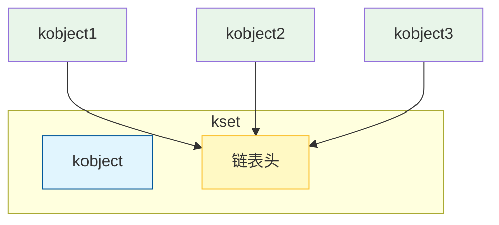

# 第3章 设备的概念和总体架构

CPU、内存和设备是计算机最重要的三个物质基础。对设备的理解，也是我们理解驱动架构、总线架构的基础。

通常的显卡、网卡、声卡等设备，都是先插入计算机系统的 PCI 总线插槽（早期还有 ISA、MCA 总线等。现在 PC 领域基本 PCI 总线统一天下），安装驱动之后，应用程序可以通过文件系统打开和读写设备文件。这个过程可以从三个层面理解：1）设备本身的特性；2）总线和操作系统对设备的管理；3）设备的驱动层。其中，后两个层面将在本书第8章重点分析，第6章和第7章也有很多内容涉及这两个层面。设备的特性这个层面是理解设备的基础，也是正确理解其他层面的基础，本章重点介绍设备的特性，对总线和操作系统对设备的管理以及设备驱动只做简单描述，细节部分放到后面章节。

## 3.1 设备的配置表

因为 PCI 设备是当前最广泛、最流行的设备，因此本章以 PCI 设备为准。以 PCI 设备为例，它本身就包含一个配置表。用图3-1来解释设备的配置表。

配置表包含设备制造商填充的厂商信息、设备属性等通用配置信息。此外，设备厂商还应该提供设备的控制寄存器信息，通过这些控制寄存器，系统可以设置设备的状态、控制设备的运行，或者从设备获得信息。另外，设备还可能配备了内存（有的设备可能没有），系统可以读写设备的内存。

设备本身有一些配置信息，如设备的 ID、制造商 ID 等。

设备内存基址，指示了设备内存的地址和长度，而设备寄存器基址，则指示了设备的寄存器地址和长度。这个设备有两个寄存器，一个输入寄存器，另一个输出寄存器。当输入寄存器写入数值后，可以从输出寄存器读到另一个数值。

设备寄存器基址，这个概念有点难。实际上，可以将其看做一个地址，对这个地址写指令就可以控制设备。所以，设备寄存器其实就是设备的控制接口。

**图3-1 设备配置表的信息**

> [!INFO] PCI 配置空间
> PCI 总线规范定义的 PCI 设备配置空间总长度为 256 字节，配置信息按一定的顺序和大小依次存放。配置空间的前 64 字节称为配置头。对于所有的设备而言，配置头的主要功能是用来识别设备、定义主机访问 PCI 卡的方式。其余 192 字节称为本地配置空间，主要定义卡上局部总线的特性、本地空间基地址及范围等。

## 3.2 访问设备寄存器和设备内存

x86 系统为控制设备设置了一个地址空间，这个空间称为计算机的 I/O 端口空间，这个空间占据了 65536 个 8 位的范围。

不同的处理器对设备控制接口有不同的访问方式。对 x86 系统来说，专门提供了特别的指令来访问设备寄存器。这就是 x86 系统的 I/O 指令。

对上文的例子设备而言，需要把设备的寄存器基址纳入到系统的 I/O 端口空间里面，然后就可以通过系统提供的 I/O 指令来访问设备的寄存器。假设设备厂商提供的寄存器基址是 0x1c00，长度是 8 字节。有两种情况：

- 一种是 0x1c00 地址和别的设备没有冲突，可以直接使用，操作系统内核就记录设备的寄存器基址为 0x1c00，驱动通过 x86 系统提供的 I/O 指令访问 I/O 地址 0x1c00，或者叫 0x1c00 I/O 端口，就可以设置设备输入寄存器的内容。通过 I/O 指令访问地址 0x1c04，就可以读到设备输出寄存器的内容。
- 另外一种情况是其他设备使用了 0x1c00 这个 I/O 地址。操作系统内核就需要寻找一个合适的寄存器基址，然后更新设备的寄存器基址，并记录到内核的设备信息里面。驱动使用 x86 的 I/O 指令访问这个更新后的地址，就可以设置设备输入寄存器的内容了。

通过设备的 I/O 端口控制设备，这就是设备驱动的功能。设备厂商会提供设备寄存器的详细内容，这也是驱动开发者所必须关注的。而发现设备、扫描设备信息、为设备提供合适的 I/O 地址空间，这是内核的总线部分要处理的事情。

访问设备的内存和前面的过程有所不同。因为设备内存不占用 I/O 端口空间，而是和系统内存占据一样的地址空间。内核读取设备内存基址，然后需要找到合适的内存空间，把设备的内存映射到内存空间。这样驱动就可以用标准的内存接口访问设备的内存了。

## 3.3 设备中断和 DMA

设备是控制输入输出的。接收到输入信息后，如何通知主机 CPU？通常情况下，通过中断来实现（CPU 也可以轮询来检查设备），每个设备都有自己的中断号（设备可以有多个中断），对于 PCI 设备而言，中断相关信息保存在设备的配置空间里。

主机的 CPU 能访问设备的内存，那么设备能否访问系统的内存？这是可以的。设备本身是挂载在 PCI 总线上的，设备使用的内存地址就是 PCI 总线可以访问的地址，称为总线地址。在 x86 系统中，总线地址和内存物理地址相同，设备直接使用物理地址访问系统内存。这种方式叫做 DMA（Direct Memory Access，直接获取内存）。

设备要通过 DMA 方式访问系统内存，就必须知道内存的总线地址。如何把内存的总线地址传送给设备？从设备的配置表可以发现，设备的寄存器里面有一个是保存 DMA 地址的，驱动设置这个寄存器的内容，然后设备就能根据该地址启动 DMA，访问主机的内存。

## 3.4 总线对设备的扫描

设备的配置信息提供了设备的信息和设备寄存器基址以及设备内存基址。因此首先要读到这些信息，然后操作系统才能探测到设备，理解设备的类型和型号，为设备安排正确的驱动，并为设备安排合适的 I/O 端口和 I/O 内存。

但是如何读取设备的配置信息？PCI 总线对这个问题的解决方法是：保留 8 字节的 I/O 端口地址，就是 0xCF8～0xCFF。要访问设备的配置信息，先往 0xCF8 地址写入目标地址信息，然后通过 0xCFC 地址读数据，就可以获得这个配置信息。这里的写和读，都是使用 x86 所特有的 I/O 指令。

写入 0xCF8 的目标地址信息，包括总线号、设备号、功能号和配置寄存器地址等综合信息。当 PCI 总线读取到设备信息，系统要为设备创建一个 PCI 设备对象，设备就这样被 PCI 总线扫描进来。这个过程在第8章将详细分析。

## 3.5 设备驱动管理

完成对设备的扫描后，接下来要为设备安装正确的驱动。设备对象创建后，要把设备注册到总线。当设备注册到总线时，总要扫描一遍总线，看是否能为设备找到驱动。设备的配置表里包含了设备的厂商信息、设备型号和类型，而设备的驱动也要包含设备的型号和类型信息，如果两者匹配，说明驱动是正确的，可以为这个设备服务。

当驱动注册到总线的时候，也要扫描一遍总线，看能否找到适合该驱动的设备。扫描的方式和设备注册扫描的方式一样。

## 3.6 本章小结

设备是很重要的概念，也是准确理解驱动、总线等概念的基础。初次接触概念理解上难免有困难，但是不要紧，我们需要在具体的流程中逐渐深化，通过细节来真正掌握概念。

---

# 第4章 为设备服务的特殊文件系统 sysfs

sysfs 是 Linux 系统提供的一个特殊文件系统。这个文件系统的主要作用是在用户态展示设备的信息。一个安装 Linux 的计算机系统中，可以在根目录下面找到 sys 目录，这个目录实际上就是利用 sysfs 文件系统创建的。打开 sys 目录，可以看到对设备的分类显示，如图4-1所示。

**图4-1 设备的分类**

操作系统通常把设备分类为 block、bus、class、dev、devices、firmware、fs 等目录。很多读者都了解，Linux 系统是通过 proc 文件系统来管理内核的重要数据，但是随着 sysfs 文件系统越来越重要，有些内核的重要数据也开始通过 sysfs 文件系统来提供，而 proc 文件系统由于本身的缺陷，越来越少被用到。

> [!WARNING] 注意
> 对 sys 目录进行操作可以发现，在 sys 目录下不能创建和删除文件，这是因为 sysfs 文件系统没有提供创建和删除文件的功能。和设备有关的另一个目录是 dev 目录。后面我们将看到，根目录下的 /dev 目录的设备文件只是个代表符号，不包括设备相关的信息。

## 4.1 文件和目录的创建

第2章给出了一个最简单的文件系统 aufs。本节利用 aufs 文件系统中学到的知识，继续对 sysfs 文件系统进行分析。基于已知来学习未知，可以保证知识点的衔接，同时每次学习的知识点不会太多，以防止造成理解的困难。

### 4.1.1 sysfs 文件系统的初始化

sysfs 本身比较简单，直接从它的初始化代码开始分析。sysfs 文件系统提供了一个初始化函数 `sysfs_init` 来完成注册和初始化的工作，如代码清单4-1所示。

**代码清单4-1 sysfs 的初始化**

```c
int __init sysfs_init(void)
{
  int err = -ENOMEM;
  sysfs_dir_cachep = kmem_cache_create("sysfs_dir_cache",
                          sizeof(struct sysfs_dirent),
                          0, 0, NULL, NULL);
  if (!sysfs_dir_cachep)
      goto out;
  err = register_filesystem(&sysfs_fs_type);
  if (!err) {
      sysfs_mount = kern_mount(&sysfs_fs_type);
  }
  // ...
}
```

`sysfs_init` 的代码中，`register_filesystem` 和 `kern_mount` 前文已经分析过。这两个函数的作用是把 sysfs 文件系统插入到文件系统的总链表中，然后为 sysfs 文件系统创建 vfsmount 对象、根 dentry 和根 inode 结构。而 `kmem_cache_create` 函数的作用是创建一个 memory cache 对象。在第1章内核基础层一节分析过，它创建了一个 slab 对象，同时指定了对象的大小，以后可以利用这个对象申请内存。

sysfs 文件系统提供了函数 `sysfs_get_sb`，它的功能是创建文件系统超级块对象。`sysfs_get_sb` 函数的实现和 aufs 文件系统一样，通过调用内核提供的 `get_sb_single` 创建超级块对象。sysfs 调用 `get_sb_single` 时，提供了 `sysfs_fill_super` 函数作为 sysfs 文件系统超级块的赋值函数。这个赋值函数和 aufs 的赋值函数很相似，留给读者自行分析。

### 4.1.2 sysfs 文件系统目录的创建

对于一个文件系统，我们最关心的是文件和目录的创建和删除，以及读写。本节先介绍目录文件的创建。

#### 1. 调用 `sysfs_create_dir` 函数创建目录文件

sysfs 文件系统使用 `sysfs_create_dir` 函数创建目录文件，其实现如代码清单4-2所示。

**代码清单4-2 sysfs_create_dir 函数**

```c
int sysfs_create_dir(struct kobject * kobj)
{
  struct dentry * dentry = NULL;
  struct dentry * parent;
  int error = 0;
  BUG_ON(!kobj);
  /*设置父dentry,如果没有父dentry,指定文件系统的root dentry为父dentry*/
  if (kobj->parent)
      parent = kobj->parent->dentry;
  else if (sysfs_mount && sysfs_mount->mnt_sb)
      parent = sysfs_mount->mnt_sb->s_root;
  else
      return -EFAULT;
  error = create_dir(kobj,parent,kobject_name(kobj),&dentry);
  if (!error)
      kobj->dentry = dentry;
  return error;
}
```

`sysfs_create_dir` 的输入参数是一个 kobject 指针。结构 `kobject` 和 sysfs 文件系统结合紧密，它的成员包含一个 dentry 指针。从第2章分析的知识点我们了解到，dentry 代表着文件系统内部的层次关系，而包含 dentry 指针的结构 `kobject` 可以对应到 sysfs 文件系统的一个目录，这个 dentry 指针就是目录文件的 dentry。

#### 2. 调用 `create_dir` 实际执行目录的创建

`sysfs_create_dir` 调用 `create_dir` 实际执行目录的创建，它的代码如代码清单4-3所示。

**代码清单4-3 调用 create_dir 实际执行目录的创建**

```c
static int create_dir(struct kobject * k, struct dentry * p,
              const char * n, struct dentry ** d)
{
   int error;
   /*指定是一个目录操作*/
   umode_t mode = S_IFDIR| S_IRWXU | S_IRUGO | S_IXUGO;

   mutex_lock(&p->d_inode->i_mutex);
   *d = lookup_one_len(n, p, strlen(n));
   if (!IS_ERR(*d)) {
       /*如果dirent对象存在,退出返回错误,否则创建一个新的dirent*/
       if (sysfs_dirent_exist(p->d_fsdata, n))
           error = -EEXIST;
       else
           error = sysfs_make_dirent(p->d_fsdata, *d, k, mode,
                                  SYSFS_DIR);
   // ...
   }
```

`create_dir` 函数的第一部分是调用 `lookup_one_len` 在 dentry cache 里面查找同名的 dentry。如果没有，则创建一个新的 dentry。`lookup_one_len` 函数前文已经分析过。

第135行引出一个新的概念：`sysfs_dirent` 结构。对 sysfs 文件系统内的每个目录和文件，都要为之创建一个 `sysfs_dirent` 对象。实际上，sysfs 文件系统的树形结构是通过 `sysfs_dirent` 保存的，而目录和文件的名字也是通过 `sysfs_dirent` 保存的。可以说，结构 `sysfs_dirent` 扮演了很重要的角色。

```c
   if (!error) {
       error = sysfs_create(*d, mode, init_dir);
       if (!error) {
           p->d_inode->i_nlink++;
           (*d)->d_op = &sysfs_dentry_ops;
           d_rehash(*d);
       }
   }
   // ...
}
```

`create_dir` 函数的第二部分首先调用 `sysfs_create` 函数为文件创建 inode 结构。如果一切正常成功，调用 `d_rehash` 函数把第一部分新创建的 dentry 对象链接到 dentry cache 的一个 hash 链表。dentry cache 的 hash 链表已经分析过，此处略过。

#### 3. 调用 `sysfs_make_dirent` 函数创建一个 `sysfs_dirent` 结构

`create_dir` 函数调用 `sysfs_make_dirent` 函数创建一个 `sysfs_dirent` 结构，如代码清单4-4所示。

**代码清单4-4 调用 sysfs_make_dirent 函数创建一个 sysfs_dirent 结构**

```c
int sysfs_make_dirent(struct sysfs_dirent * parent_sd, struct dentry * dentry,
           void * element, umode_t mode, int type)
{
  struct sysfs_dirent * sd;
  sd = sysfs_new_dirent(parent_sd, element);
  if (!sd)
      return -ENOMEM;
  sd->s_mode = mode;
  sd->s_type = type;
  /*保存目录或者文件的dentry对象*/
  sd->s_dentry = dentry;
  if (dentry) {
      /*d_fsdata保存sysfs_dirent的指针*/
      dentry->d_fsdata = sysfs_get(sd);
      dentry->d_op = &sysfs_dentry_ops;
  }
  return 0;
}
```

`sysfs_make_dirent` 函数调用 `sysfs_new_dirent` 创建一个新的 `sysfs_dirent` 结构，这个新的结构要链接到父结构的链表，而且保存传递进来的 element 参数。

#### 4. 调用 `sysfs_create` 函数为目录文件创建一个 inode 对象

现在返回 `create_dir` 函数，在获得 dentry 结构之后，还需要为目录文件创建一个 inode 对象，这是通过 `sysfs_create` 函数实现的，如代码清单4-5所示。

**代码清单4-5 调用 sysfs_create 函数为目录文件创建一个 inode 对象**

```c
int sysfs_create(struct dentry * dentry, int mode, int (*init)(struct inode *))
{
  int error = 0;
  struct inode * inode = NULL;
  if (dentry) {
      if (!dentry->d_inode) {
          struct sysfs_dirent * sd = dentry->d_fsdata;
          if ((inode = sysfs_new_inode(mode, sd))) {
               if (dentry->d_parent && dentry->d_parent->d_inode) {
                   struct inode *p_inode = dentry->d_parent->d_inode;
                   p_inode->i_mtime = p_inode->i_ctime = CURRENT_TIME;
               }
               goto Proceed;
          }
      }
  Proceed:
  if (init)
      error = init(inode);
  if (!error) {
      d_instantiate(dentry, inode);
      if (S_ISDIR(mode))
          dget(dentry);  /* pin only directory dentry in core */
  } else
      iput(inode);
 Done:
  return error;
}
```

`sysfs_create` 函数可以分成两部分：

- **第一部分**是调用 `sysfs_new_inode` 创建一个 inode 对象。
- **第二部分**调用传递进来的函数指针 `init` 执行初始化。

##### (1) 调用 `sysfs_new_inode` 创建一个 inode 对象

先从 `sysfs_new_inode` 函数开始分析，它的代码如代码清单4-6所示。

**代码清单4-6 sysfs_new_inode 函数**

```c
struct inode * sysfs_new_inode普通文件通过 `sysfs_create_file` 函数创建,它的代码如代码清单4-8所示.

**代码清单4-8 通过 sysfs_create_file 函数创建普通文件**

```c
int sysfs_create_file(struct kobject * kobj, const struct attribute * attr)
{
  BUG_ON(!kobj || !kobj->dentry || !attr);
  /*指定是一个SYSFS_KOBJ_ATTR类型，这里创建的文件是为sysfs文件系统服务*/
  return sysfs_add_file(kobj->dentry, attr, SYSFS_KOBJ_ATTR);
}

int sysfs_add_file(struct dentry * dir, const struct attribute * attr, int type)
{
  struct sysfs_dirent * parent_sd = dir->d_fsdata;
  umode_t mode = (attr->mode & S_IALLUGO) | S_IFREG;
  int error = -EEXIST;
  mutex_lock(&dir->d_inode->i_mutex);
  if (!sysfs_dirent_exist(parent_sd, attr->name))
      error = sysfs_make_dirent(parent_sd, NULL, (void *)attr,
                     mode, type);
  mutex_unlock(&dir->d_inode->i_mutex);
  return error;
}
```

普通文件的创建很简单,和目录文件的创建一样,调用 `sysfs_make_dirent` 函数创建一个 `sysfs_dirent` 结构.

读者是否发现和创建目录的不同?创建目录的时候要调用 `lookup_one_len` 函数,`lookup_one_len` 函数要为新目录创建 dentry,而创建文件并没有调用 `lookup_one_len` 函数,也就是说创建文件的时候没创建它的 dentry 对象.

> [!WARNING] 注意
> 这里有必要串联一下文件系统的知识点.从最简单文件系统 aufs 的例子我们知道,文件系统为每个文件(目录也是一种文件)创建了一个 inode 对象和 dentry 对象(也有特殊的文件系统例外).而 sysfs 文件系统在创建文件的时候只创建了 `sysfs_dirent` 对象,那么在何时创建 dentry 和 inode?实际是在打开文件的过程中创建的.

## 4.2 sysfs 文件的打开操作

回顾一下,前面已经分析过 VFS 虚拟文件系统文件打开的过程.打开文件的过程,实际就是将文件的整个路径名层层解析,最终找到目标文件的过程.如果文件曾经被打开过,dentry cache 中可能保存文件的 dentry 结构(dentry cache 也有可能为节省内存释放保存的结构,此处假定没有释放);如果在 dentry cache 中不能找到文件的 dentry 结构,那么要调用 `real_lookup` 函数,`real_lookup` 函数里再调用文件系统提供的 lookup 函数,所以在分析 sysfs 文件打开操作之前,有必要分析一下 `real_lookup` 调用.

## 4.2 sysfs文件的打开操作

### 4.2.1 real_lookup函数详解

`real_lookup` 函数在第2章并未分析,本节从其开始分析 sysfs 文件系统的文件打开操作,其代码如代码清单4-9所示.

**代码清单4-9:real_lookup函数**

```c
static struct dentry * real_lookup(struct dentry * parent,
struct qstr * name, struct nameidata *nd)
{
  struct dentry * result;
  struct inode *dir = parent->d_inode;
  mutex_lock(&dir->i_mutex);
  /*再执行一次d_lookup，检查是否有另外的进程创建文件*/
  result = d_lookup(parent, name);
  if (!result) {
      struct dentry * dentry = d_alloc(parent, name);
      result = ERR_PTR(-ENOMEM);
      if (dentry) {
          result = dir->i_op->lookup(dir, dentry, nd);
          if (result)
              dput(dentry);
          else
              result = dentry;
      }
      mutex_unlock(&dir->i_mutex);
      ……/*此处省略校验的代码*/
      return result;
}
```

根据代码中的解释,`real_lookup` 需要在 dentry cache 中再搜索一遍,这是为了防止在等信号量的时候,已经有其他用户创建了文件.

对于搜索不到的文件,`real_lookup` 创建了一个 dentry 对象,然后调用文件系统提供的 `lookup` 函数执行搜索.对 sysfs 文件系统来说,就是 `sysfs_lookup` 函数.

### 4.2.2 为文件创建inode结构

sysfs 创建文件的时候并没有创建 dentry 对象,那么在此处为文件创建了 dentry,还需要为文件创建 inode 结构,这是 `sysfs_lookup` 函数的功能,其代码如代码清单4-10所示.

**代码清单4-10:sysfs_lookup函数为文件创建inode结构**

```c
static struct dentry * sysfs_lookup(struct inode *dir, 
               struct dentry *dentry,struct nameidata *nd)
{
  struct sysfs_dirent * parent_sd = dentry->d_parent->d_fsdata
  struct sysfs_dirent * sd;
  int err = 0;
  list_for_each_entry(sd, &parent_sd->s_children, s_sibling) {
       /*SYSFS_NOT_PINNED代表文件、二进制文件和符号链接，如果不是这些
      if (sd->s_type & SYSFS_NOT_PINNED) {
          const unsigned char * name = sysfs_get_name(sd);
          if (strcmp(name, dentry->d_name.name))
              continue;
          /*如果是符号链接文件，则调用sysfs_attach_link*/ 
          if (sd->s_type & SYSFS_KOBJ_LINK)
               err = sysfs_attach_link(sd, dentry);
          else
               err = sysfs_attach_attr(sd, dentry);
          break;
      }
  }
  return ERR_PTR(err);
}
```

`sysfs_lookup` 函数首先遍历父对象 `sysfs_dirent` 的链表,逐一比较父对象的子成员,寻找名字和指定名字相同的子成员.这个过程和 dentry 的搜索过程类似,可见 sysfs 文件系统通过 `sysfs_dirent` 对象来管理文件系统的树形结构,`sysfs_dirent` 对象的部分功能和 dentry 的功能类似.

### 4.2.3 为dentry结构绑定属性

对于不同类型的文件,其 `sysfs_dirent` 对象也具有不同的属性,需要为 dentry 结构绑定各自的属性.对于普通的文件,调用 `sysfs_attach_attr` 函数来绑定属性,其代码如代码清单4-11所示.

**代码清单4-11:调用sysfs_attach_attr函数绑定属性**

```c
static int sysfs_attach_attr(struct sysfs_dirent * sd, struct 
{
  struct attribute * attr = NULL;
  struct bin_attribute * bin_attr = NULL;
  int (* init) (struct inode *) = NULL;
  int error = 0;
      /*sd保存了文件的一些私有数据。普通文件是attribute结构，而二进制文
      if (sd->s_type & SYSFS_KOBJ_BIN_ATTR) {
            bin_attr = sd->s_element;
            attr = &bin_attr->attr;
      } else {
            attr = sd->s_element;
            init = init_file;
      }
  dentry->d_fsdata = sysfs_get(sd);
  sd->s_dentry = dentry;
  error = sysfs_create(dentry, (attr->mode & S_IALLUGO) | S_IF
  if (error) {
      sysfs_put(sd);
      return error;
  }
      if (bin_attr) {
      dentry->d_inode->i_size = bin_attr->size;
      dentry->d_inode->i_fop = &bin_fops;
  }
  dentry->d_op = &sysfs_dentry_ops;
  /*dentry加入dentry cache，下次就可以在dentry cache中找到*/ 
  d_rehash(dentry);
  return 0;
}
```

`sysfs_attach_attr` 首先调用 `sysfs_create` 函数创建 inode 对象.代码执行至此,文件的 dentry 和 inode 对象都创建完成.

然后要区分二进制文件还是普通文件.如果是二进制文件,需要重新赋值文件的操作函数.在创建 inode 对象时,已经为普通文件赋值了操作函数,这些操作函数就是 sysfs 文件系统提供的 `sysfs_file_operations` 结构.但是二进制文件的操作函数不同,所以还需要重新赋值.

### 4.2.4 调用文件系统中的open函数

返回文件打开的过程,执行完 `real_lookup` 之后,还需要在 `dentry_open` 函数中执行文件系统提供的 `open` 函数.

对普通文件而言,sysfs 文件系统提供的 `open` 函数就是 `sysfs_open_file`,二进制文件的 `open` 函数和普通文件的基本类似.所以我们以普通文件的 `sysfs_open_file` 为准,如代码清单4-12所示.

**代码清单4-12:sysfs_open_file函数**

```c
static int sysfs_open_file(struct inode * inode, struct file *
{
  return check_perm(inode,filp);
}
```

`sysfs_open` 函数是 `check_perm` 函数的封装函数,`check_perm` 函数如代码清单4-13所示.

**代码清单4-13:check_perm函数**

```c
static int check_perm(struct inode * inode, struct file * file
{
  struct kobject *kobj = sysfs_get_kobject(file->f_dentry->d_p
  struct attribute * attr = to_attr(file->f_dentry);
  struct sysfs_buffer * buffer;
  struct sysfs_ops * ops = NULL;
  int error = 0;
  if (!kobj || !attr)
      goto Einval;
  /* Grab the module reference for this attribute if we have o
  if (!try_module_get(attr->owner)) {
      error = -ENODEV;
      goto Done;
  }
  /*ops实际上提供了文件的读写函数指针，后面可以见到它的应用*/
  /* if the kobject has no ktype, then we assume that it is a 
   * itself, and use ops for it.
   */
  if (kobj->kset && kobj->kset->ktype)
      ops = kobj->kset->ktype->sysfs_ops;
  else if (kobj->ktype)
      ops = kobj->ktype->sysfs_ops;
  else
      ops = &subsys_sysfs_ops;
```

`check_perm` 函数第一部分的主要作用是检查文件的权限.

sysfs 文件系统的普通文件默认具有 `attribute` 结构,而目录文件默认具有一个 `kobject` 结构.如果目录文件的 `kobject` 提供了文件的操作函数,普通文件要赋值为 `kobject` 结构提供的函数;否则就要赋值为子系统函数指针结构 `subsys_sysfs_ops`.然后根据文件的读写权限设置,分别检查 inode 结构的权限模式.

```c
/* No error? Great, allocate a buffer for the file, and store 
 * it in file->private_data for easy access.
 */
buffer = kzalloc(sizeof(struct sysfs_buffer), GFP_KERNEL);
if (buffer) {
     init_MUTEX(&buffer->sem);
     buffer->needs_read_fill = 1;
     buffer->ops = ops;
     file->private_data = buffer;
} else
     error = -ENOMEM;
 goto Done;
}
```

`check_perm` 函数第二部分创建一个私有的数据结构 `buffer`,文件的 `private_data` 指针指向了这个结构.这是一种在文件对象中保存文件系统特殊信息的方式,在实际的文件系统中,经常可以看到这种使用方式.

## 4.3 sysfs文件的读写

sysfs 是在内存中存在的文件系统,它的文件都只在内存中存在.因此对文件的读写实际是对内存的读写,不涉及对硬盘的操作.

### 4.3.1 读文件的过程分析

对文件的读仍然以普通文件为准进行分析.普通文件的读函数是 `sysfs_read_file`,其代码如代码清单4-14所示.

**代码清单4-14:读函数sysfs_read_file**

```c
static ssize_t
sysfs_read_file(struct file *file, char __user *buf, size_t co
{    
  /*获取buffer对象*/
  struct sysfs_buffer * buffer = file->private_data;
  ssize_t retval = 0;
  down(&buffer->sem);
  if (buffer->needs_read_fill) {
      if ((retval = fill_read_buffer(file->f_dentry,buffer)))
           goto out;
  }
  ……/*省略无关的输出代码*/
  retval = flush_read_buffer(buffer,buf,count,ppos);
```

`sysfs_read_file` 函数调用 `fill_read_buffer` 申请内存页,然后填充数据,最后将数据从 buffer 复制到用户的缓存.

文件的内容是通过 `fill_read_buffer` 填入的,其代码如代码清单4-15所示.

**代码清单4-15:调用fill_read_buffer函数申请内存页**

```c
static int fill_read_buffer(struct dentry * dentry, struct sys
{
  /*获取sysfs_dirent 结构和属性结构，以及文件所在目录的kobject 结构*/
  struct sysfs_dirent * sd = dentry->d_fsdata;
  struct attribute * attr = to_attr(dentry);
  struct kobject * kobj = to_kobj(dentry->d_parent);
  struct sysfs_ops * ops = buffer->ops;
  int ret = 0;
  ssize_t count;
  if (!buffer->page)
      buffer->page = (char *) get_zeroed_page(GFP_KERNEL);
  if (!buffer->page)
      return -ENOMEM;
  buffer->event = atomic_read(&sd->s_event);
  count = ops->show(kobj,attr,buffer->page);
  buffer->needs_read_fill = 0;
```

`fill_read_buffer` 函数首先申请一个内存页,然后调用 `ops->show` 向内存页填充数据.为了帮助理解,有必要从内核找个实际的例子 `show` 函数,既要简单又能说明问题.因此从 input 设备驱动找到一个简单的 `show` 函数,就是 `input_dev_show_id`,这个函数的作用是填充设备的 ID 名,其代码如代码清单4-16所示.

**代码清单4-16:input_dev_show_id函数填充设备的ID名**

```c
#define INPUT_DEV_ID_ATTR(name)                               
static ssize_t input_dev_show_id_##name(struct class_device *d
{                                                             
  struct input_dev *input_dev = to_input_dev(dev);            
  return scnprintf(buf, PAGE_SIZE, "%04x\n", input_dev->id.nam
}                                                             
static CLASS_DEVICE_ATTR(name, S_IRUGO, input_dev_show_id_##na
```

字符“##”是内核中常用的一种定义方式,作用是顶替字符串.如果输入参数 `name` 是 `bustype`,函数的真正名字是 `input_dev_show_id_bustype`.`input_dev_show_id` 函数的作用是把设备 ID 的 `name` 复制到 `buf` 处,最终 `sysfs_read_file` 函数要把 `buf` 的内容复制到用户输入的用户态缓存.这样用户读到的就是 `buf`buf` 里面填充的字符串.

至此,sysfs 文件的读过程分析完毕.

### 4.3.2 写文件的过程分析

普通文件的写函数是 `sysfs_write_file`,其代码如代码清单4-17所示.

**代码清单4-17:写函数 sysfs_write_file**

```c
static ssize_t sysfs_write_file(struct file *file, const char 
size_t count, loff_t *ppos)
{   
  /*获得buffer对象*/
  struct sysfs_buffer * buffer = file->private_data;
  ssize_t len;
  down(&buffer->sem);
  /*从用户的buf复制数据到buffer对象的页*/ 
  len = fill_write_buffer(buffer, buf, count);
  if (len > 0)
      len = flush_write_buffer(file->f_dentry, buffer, len);
  if (len > 0)
      *ppos += len;
  up(&buffer->sem);
  return len;
}
```

`sysfs_write_file` 和读文件的处理类似,首先是从用户输入的 `buf` 复制数据到 `buffer` 对象的内存页,然后调用 `flush_write_buffer` 把用户数据填入文件的 `attribute` 结构.`flush_write_buffer` 的代码如代码清单4-18所示.

**代码清单4-18:flush_write_buffer函数**

```c
static int 
flush_write_buffer(struct dentry * dentry, struct sysfs_buffer
{
  struct attribute * attr = to_attr(dentry);
  struct kobject * kobj = to_kobj(dentry->d_parent);
  struct sysfs_ops * ops = buffer->ops;
  return ops->store(kobj,attr,buffer->page,count);
}
```

函数 `flush_write_buffer` 最终调用了 `ops` 提供的 `store` 函数.

> [!NOTE]
> 因为读函数调用的是 `show` 函数,可以推理,写函数调用的 `store` 函数应该就是 `show` 函数的反过程,读者可以从内核找一个例子,自行分析一下.

## 4.4 kobject结构

`kobject` 结构是内核定义的一种特殊结构,和 sysfs 文件系统联系很紧密.前文 sysfs 创建目录时,传递的参数就是一个 `kobject` 结构.实际上,可以认为 `kobject` 代表 sysfs 文件系统的一个目录.

### 4.4.1 kobject和kset的关系

`kset` 结构里封装了一个 `kobject` 结构,同时包括一个链表头,属于这个 `kset` 的所有 `kobject` 都要链接到 `kset` 的链表头.`kobject` 和 `kset` 的关系如图4-2所示.



**图4-2 kset和kobject关系图**

### 4.4.2 kobject实例:总线的注册

为了理解 `kobject`,我们从内核挑选一个实例,就是总线的注册.这个例子极好地解释了 `kobject` 的应用.第3章已经分析过,总线对设备和驱动具有重要作用.本章引入这个例子,既可以解释 `kobject` 结构的使用,又解释了总线的一些重要概念,从而为下文的分析学习打好基础.对这个例子的分析从总线的注册开始.

总线的注册使用 `platform_bus_init` 函数,其代码如代码清单4-19所示.

**代码清单4-19:使用 platform_bus_init 函数注册总线**

```c
int __init platform_bus_init(void)
{
  device_register(&platform_bus); 
  return bus_register(&platform_bus_type);
}
```

`platform_bus_init` 函数的第一部分是设备注册函数 `device_register`.设备是 Linux 系统比较复杂的概念,此处先跳过.

然后是总线注册函数 `bus_register`,它的作用是把总线对象注册到内核,代码如代码清单4-20所示.

**代码清单4-20:调用 bus_register 函数把总线对象注册到内核**

```c
int bus_register(struct bus_type * bus)
{
  int retval;
  /*给kobject赋名字。这个kobject结构就是bus类型内含的kobject对象*/
  retval = kobject_set_name(&bus->subsys.kset.kobj, "%s", bus-
  if (retval)
      goto out;
  /*子系统注册。注册过程是往sysfs文件系统写入一个目录*/
  subsys_set_kset(bus, bus_subsys);
  retval = subsystem_register(&bus->subsys);
  if (retval)
      goto out;
  /*devices是一个kset对象，给devices内含的kobject对象赋名字，然后注册
  kobject_set_name(&bus->devices.kobj, "devices");
  bus->devices.subsys = &bus->subsys;
  retval = kset_register(&bus->devices);
  if (retval)
      goto bus_devices_fail;
  /*drivers注册和devices注册类似*/
  kobject_set_name(&bus->drivers.kobj, "drivers");
  bus->drivers.subsys = &bus->subsys;
  bus->drivers.ktype = &ktype_driver;
  retval = kset_register(&bus->drivers);
  if (retval)
      goto bus_drivers_fail;
   ……/*省略klist初始化代码*/
  bus_add_attrs(bus);
```

`bus` 对象内含两个 `kset`,一个是 `devices`,另一个是 `drivers`.`devices` 代表总线包含的设备对象,而 `drivers` 代表总线包含的驱动对象.`bus` 对象自身是一个 `subsystem` 结构,这个结构和 `kset` 基本是一回事,只是多了一个信号量成员而已.

`bus_register` 函数可以总结为三个注册.

- **第一**是注册 `bus` 对象自身;
- **第二**是注册 `bus` 内的设备对象;
- **第三**是注册 `bus` 内的驱动对象.

注册 `bus` 对象自身使用了 `subsystem_register` 函数,而设备和驱动的注册都调用了 `kset_register` 函数.因为 `subsystem` 结构和 `kset` 基本相同,它们的注册函数也相似.所以本文选择 `subsystem_register` 为例进行分析,其代码如代码清单4-21所示.

**代码清单4-21:使用 subsystem_register 函数注册 bus 对象自身**

```c
int subsystem_register(struct subsystem * s)
{
  int error;
  subsystem_init(s);
  if (!(error = kset_add(&s->kset))) {
```

`subsystem_register` 函数进行初始化之后,调用 `kset_add` 完成 `kset` 结构的注册功能.函数 `kset_add` 的功能是在 sysfs 文件系统增加一个目录文件,其代码如代码清单4-22所示.

**代码清单4-22:调用 kset_add 函数在 sysfs 文件系统增加一个目录文件**

```c
int kset_add(struct kset * k)
{   /*如果没父类，使用subsys的kobj*/
  if (!k->kobj.parent && !k->kobj.kset && k->subsys)
      k->kobj.parent = &k->subsys->kset.kobj;
  return kobject_add(&k->kobj);
}
```

`kset_add` 函数封装了 `kobject_add` 函数,`kobject_add` 执行增加一个目录文件的功能,其代码如代码清单4-23所示.

**代码清单4-23:kobject_add函数**

```c
int kobject_add(struct kobject * kobj)
{
  int error = 0;
  struct kobject * parent;
  /*获取kobj的父结构*/
  parent = kobject_get(kobj->parent);
  ……/*省略参数检查的代码*/
  if (kobj->kset) {

# 第3-4章 设备概念与sysfs

> [!NOTE] 本部分内容承接上一部分，继续分析 kobject_add 及后续函数。

```c
if (!parent)
    parent = kobject_get(&kobj->kset->kobj);
/* kobj 链接到 kset 链表的尾部*/
list_add_tail(&kobj->entry, &kobj->kset->list);
spin_unlock(&kobj->kset->list_lock);
```
```c
kobj->parent = parent;
/*创建一个目录*/
error = create_dir(kobj);
```

`kobject_add` 函数调用 `create_dir` 函数创建一个目录文件。`create_dir` 函数的输入参数是 `kobj` 结构，要为这个结构创建一个目录文件，其代码如代码清单 4-24 所示。

**代码清单 4-24　调用 create_dir 函数创建一个目录文件**

```c
static int create_dir(struct kobject * kobj)
{
    int error = 0;
    if (kobject_name(kobj)) {
        error = sysfs_create_dir(kobj);
        if (!error) {
            /*创建隶属于 kobj 的属性文件*/ 
            if ((error = populate_dir(kobj)))
        ...
```

`create_dir` 函数很简单，它调用了 sysfs 文件系统的 `sysfs_create_dir` 函数创建了一个目录文件。`sysfs_create_dir` 函数在本章前面已分析过。

`populate_dir` 函数的作用是根据 `kobj` 结构内含有的 `attribute` 结构创建文件，对每个 `attribute` 结构都调用 sysfs 文件系统创建文件的 `sysfs_create_file` 函数创建一个文件。

返回到 `subsystem_register` 函数，它的最终作用就是创建一个目录，目录名就是总线的名字，在这个目录下又创建一些属性文件。而 `kset_register` 函数的作用也是创建一个目录。这样就清楚了，`bus_register` 实际创建了一个名字和总线名相同的目录，在这个目录下又创建了 `devices` 和 `drivers` 两个目录。这些目录和目录下的属性文件，共同展示了一条总线和总线的设备以及驱动的属性信息。

## 4.5　本章小结

内核中类似 sysfs 文件系统还有不少，比如 ramfs、debugfs、configfs、proc 等。利用本章所学的知识点，读者可以自行分析这些文件系统，了解它们文件和目录的组织方式以及文件的读写方式。

[Image 388 on Page 178]
[Image 411 on Page 189]
[Image 88 on Page 190]
[Image 88 on Page 205]
[Image 88 on Page 223]
[Image 484 on Page 225]