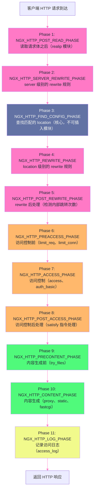

# 03 HTTP 请求处理管道：11 个阶段全解

## 摘要

当一个 HTTP 请求到达 Nginx 之后，它不是被某个单一函数"一把处理完"的，而是流经一条由 **11 个阶段（Phase）** 构成的处理管道，每个阶段有明确的职责分工，模块在特定阶段注册自己的处理函数（Handler），Nginx 依次调用。理解这条管道是理解 Nginx 配置行为的根本——为什么 `rewrite` 先于 `access` 执行？为什么 `return` 指令能"跳过"所有后续处理？为什么 `try_files` 的最后一个参数触发的是"命名 location"而非普通重定向？为什么某些模块的指令顺序不影响执行顺序？这些问题的答案，都藏在 11 个 Phase 的设计中。

---

## 第 1 章 为什么需要 Phase 机制

### 1.1 模块化架构的协作难题

Nginx 是一个高度模块化的系统，HTTP 请求处理功能分散在数十个模块中：`ngx_http_rewrite_module` 处理 URL 重写、`ngx_http_access_module` 处理 IP 访问控制、`ngx_http_limit_req_module` 处理限流、`ngx_http_proxy_module` 处理反向代理……

如果没有统一的协调机制，这些模块各自为政，就会出现以下问题：

**问题一：执行顺序无法保证**

假设 A 模块在 B 模块之前注册了处理函数，但业务上 B 应该先执行（如：必须先做访问控制，再做内容生成）。没有机制约束顺序，模块的注册顺序就决定了执行顺序——这是脆弱的。

**问题二：短路逻辑无法实现**

访问控制模块发现 IP 被封禁，应该直接返回 403，不再执行后续的内容生成。但如果处理函数是"扁平"列表，短路（提前终止）就需要每个模块检查前一个模块的结果，代码耦合极强。

**Phase 机制的设计**：将处理流程划分为语义清晰的阶段，**每个阶段有明确的职责和执行语义**，模块在编译时声明自己属于哪个阶段，Nginx 核心保证阶段间的执行顺序。每个阶段可以有多个模块的处理函数，每个阶段内部有自己的"继续/终止"语义。

### 1.2 Phase 的本质：责任链模式

Nginx 的 Phase 机制本质上是**责任链模式（Chain of Responsibility）**的实现：请求沿着 Phase 链向下传递，每个 Phase 的处理函数可以：
- **DECLINED**（拒绝处理）：将请求传给该 Phase 的下一个 Handler，或进入下一个 Phase
- **OK**（成功处理）：某些 Phase 中代表"已完成，进入下一 Phase"；某些 Phase 中代表"终止，返回响应"
- **DONE** / **ERROR** / **特定状态码**：终止整个请求处理，直接返回响应

---

## 第 2 章 11 个 Phase 详解



### 2.1 Phase 1：NGX_HTTP_POST_READ_PHASE（读后阶段）

**阶段职责**：请求行和请求头解析完成后立即执行，是最早可以插入模块的阶段。

**主要使用模块**：`ngx_http_realip_module`

**`ngx_http_realip_module` 的工作原理**：

当 Nginx 部署在负载均衡器或 CDN 之后时，直接连接 Nginx 的客户端 IP（`$remote_addr`）是负载均衡器的 IP，而真实的客户端 IP 在 `X-Forwarded-For` 或 `X-Real-IP` 请求头中。`real_ip` 模块在 POST_READ 阶段（早于一切业务处理）将 `$remote_addr` 替换为请求头中的真实 IP：

```nginx
# 信任来自负载均衡器网段的 XFF 头
set_real_ip_from 10.0.0.0/8;
set_real_ip_from 172.16.0.0/12;
real_ip_header X-Forwarded-For;
real_ip_recursive on;  # 递归移除已知的受信任 IP，取最后一个非受信 IP
```

**为什么要在最早阶段执行**：如果 `real_ip` 模块在访问控制阶段（Phase 7）之后才执行，那么 `ngx_http_access_module` 看到的 `$remote_addr` 仍然是负载均衡器 IP，IP 白名单/黑名单规则完全失效。Phase 1 执行确保后续所有阶段看到的 `$remote_addr` 都是真实客户端 IP。

### 2.2 Phase 2：NGX_HTTP_SERVER_REWRITE_PHASE（Server 级别 Rewrite）

**阶段职责**：执行 `server` 块中定义的 `rewrite` 规则（在 `location` 匹配之前）。

**关键语义**：这个阶段的 rewrite 发生在 `FIND_CONFIG_PHASE`（location 查找）之前，因此可以通过修改 `$uri` 来**影响 location 匹配的结果**。

```nginx
server {
    # SERVER_REWRITE_PHASE 执行（FIND_CONFIG_PHASE 之前）
    rewrite ^/v1/(.*)$ /api/$1 last;
    # last 标志：rewrite 完成后，重新从 FIND_CONFIG_PHASE 开始匹配 location
    # 访问 /v1/users → $uri 变为 /api/users → 重新匹配 location
    
    location /api/ {
        proxy_pass http://backend;
    }
}
```

### 2.3 Phase 3：NGX_HTTP_FIND_CONFIG_PHASE（Location 查找）

**阶段职责**：根据当前的 `$uri`，在当前 `server` 块的所有 `location` 中找到最优匹配，将请求与该 `location` 的配置绑定。

**这是整个 Phase 链中唯一不允许外部模块注册 Handler 的阶段**。location 查找是 Nginx 核心的专属职责，禁止外部模块干预，保证了路由逻辑的确定性。

location 匹配的详细优先级规则将在第 07 篇《Location 匹配》中深入讲解，这里只需要知道：匹配完成后，`$uri` 对应的 `location` 配置块生效，后续 Phase 在这个 location 的上下文中执行。

### 2.4 Phase 4：NGX_HTTP_REWRITE_PHASE（Location 级别 Rewrite）

**阶段职责**：执行当前 `location` 块中定义的 `rewrite` 规则（在 location 匹配之后）。

`rewrite` 模块在这个阶段还会执行 `return`、`set` 等指令。

**`rewrite` 的 flag 参数与 Phase 的关系**：

```nginx
location /old/ {
    # last：执行 rewrite 后，重新从 FIND_CONFIG_PHASE 开始（内部跳转）
    rewrite ^/old/(.*)$ /new/$1 last;
    
    # break：执行 rewrite 后，停止当前 location 内的 rewrite 处理，
    #         继续在当前 location 中处理（不重新匹配 location）
    rewrite ^/old/(.*)$ /new/$1 break;
    
    # redirect：返回 302 临时重定向（客户端跳转）
    rewrite ^/old/(.*)$ /new/$1 redirect;
    
    # permanent：返回 301 永久重定向（客户端跳转）
    rewrite ^/old/(.*)$ /new/$1 permanent;
}
```

`last` 和 `break` 的区别是最常被混淆的：
- **`last`**：类似于编程语言中的 `continue`，当前 rewrite 执行完后，以新 URI **重新进入** FIND_CONFIG_PHASE，重新匹配 location，就好像客户端发了一个新请求（但这是内部操作，不返回给客户端）
- **`break`**：类似于编程语言中的 `break`，停止当前 location 内的 rewrite 处理，**继续在当前 location 中**执行后续阶段（不重新匹配 location）

### 2.5 Phase 5：NGX_HTTP_POST_REWRITE_PHASE（Rewrite 后检查）

**阶段职责**：由 Nginx 核心维护，主要职责是**检测内部跳转（`last` rewrite）的次数**，防止无限循环：

```nginx
location /a/ {
    rewrite ^/a/(.*)$ /b/$1 last;  # /a/ → /b/
}
location /b/ {
    rewrite ^/b/(.*)$ /a/$1 last;  # /b/ → /a/ → 无限循环！
}
```

Nginx 为每个请求维护一个内部跳转计数器，超过 **10 次**（Nginx 硬编码的 `NGX_HTTP_MAX_REWRITES`）后返回 `500 Internal Server Error`，并在 error log 中记录：`rewrite or internal redirection cycle while processing`。

### 2.6 Phase 6：NGX_HTTP_PREACCESS_PHASE（访问控制前）

**阶段职责**：访问控制模块的"前置"阶段，执行**速率/并发限制**类的检查——这类检查的目的是保护后端资源，比实际的认证/授权（Phase 7）更早执行，因为即使是合法用户也需要受到速率限制。

**主要使用模块**：

**`ngx_http_limit_req_module`（请求速率限制）**：

```nginx
http {
    # 定义限流区（共享内存 zone，10MB，基于客户端 IP 计数）
    limit_req_zone $binary_remote_addr zone=api_limit:10m rate=10r/s;
    
    server {
        location /api/ {
            # 应用限流：允许 rate 速率 + burst 个突发请求排队
            limit_req zone=api_limit burst=20 nodelay;
            # nodelay：burst 内的请求立即处理（不排队等待），超过 burst 的直接拒绝
        }
    }
}
```

**`ngx_http_limit_conn_module`（并发连接数限制）**：

```nginx
http {
    limit_conn_zone $binary_remote_addr zone=conn_limit:10m;
    
    server {
        location /download/ {
            limit_conn conn_limit 5;  # 同一 IP 最多 5 个并发连接
        }
    }
}
```

**为什么在 PREACCESS 而非 ACCESS 阶段**：限流是资源保护措施，应在认证之前执行——即使是通过认证的合法用户，也需要受到速率限制；而且拒绝超速请求（429）不需要知道用户的身份。将限流放在认证前，可以避免为超速请求浪费认证开销（如数据库查询 session token）。

### 2.7 Phase 7：NGX_HTTP_ACCESS_PHASE（访问控制）

**阶段职责**：基于请求的**身份/来源**决定是否允许访问——IP 白名单/黑名单、HTTP Basic Auth、JWT 验证等。

**主要使用模块**：

**`ngx_http_access_module`（IP 访问控制）**：

```nginx
location /admin/ {
    allow 192.168.1.0/24;   # 允许内网
    allow 10.0.0.5;          # 允许特定 IP
    deny all;               # 拒绝其他所有
    # 规则按顺序匹配，第一个匹配的规则生效
}
```

**`ngx_http_auth_basic_module`（HTTP Basic Auth）**：

```nginx
location /protected/ {
    auth_basic "Restricted Area";
    auth_basic_user_file /etc/nginx/.htpasswd;
}
```

**`satisfy` 指令：多模块访问控制的组合逻辑**：

当同一 `location` 中有多个访问控制模块时，`satisfy` 指令控制它们的组合逻辑：

```nginx
location /secure/ {
    satisfy any;         # any = 满足其中任一条件即可（OR 逻辑）
    # satisfy all;       # all = 所有条件都必须满足（AND 逻辑，默认值）
    
    allow 192.168.0.0/24;  # 条件1：内网 IP
    deny all;
    
    auth_basic "Auth";     # 条件2：Basic Auth
    auth_basic_user_file /etc/nginx/.htpasswd;
    
    # satisfy any：内网 IP 或通过 Basic Auth，满足其一即可访问
    # satisfy all（默认）：必须同时是内网 IP 且通过 Basic Auth
}
```

### 2.8 Phase 8：NGX_HTTP_POST_ACCESS_PHASE（访问控制后处理）

**阶段职责**：Nginx 核心维护的内部阶段，处理 Phase 7 中 `satisfy` 指令的最终逻辑（汇总多个访问控制模块的结果，决定最终是 allow 还是 deny）。外部模块通常不在此阶段注册 Handler。

### 2.9 Phase 9：NGX_HTTP_PRECONTENT_PHASE（内容生成前）

**阶段职责**：内容生成前的最后处理机会，主要用于**文件存在性检查和内部跳转决策**。

**主要使用模块**：`ngx_http_try_files_module`（`try_files` 指令）

**`try_files` 的执行语义**：

```nginx
location / {
    try_files $uri $uri/ /index.php?$args;
    # 含义：
    # 1. 尝试以 $uri 为路径查找静态文件（如 /image.jpg → /var/www/html/image.jpg）
    # 2. 如果文件不存在，尝试以 $uri/ 为路径查找目录（目录首页）
    # 3. 如果目录也不存在，内部跳转到 /index.php?$args（交给 PHP 处理）
}
```

`try_files` 按顺序依次尝试每个路径参数，直到找到一个存在的文件/目录（或成功处理的 location）。**最后一个参数是必选的 fallback**，如果前面所有路径都不存在，最后一个参数无条件执行：

```nginx
# try_files 的 fallback 类型：

# 类型 1：URI 路径（内部跳转，重新进入 FIND_CONFIG_PHASE）
try_files $uri /fallback.html;

# 类型 2：命名 location（以 @ 开头）
try_files $uri @backend;

# 类型 3：状态码（直接返回）
try_files $uri $uri/ =404;  # 如果文件和目录都不存在，返回 404

location @backend {
    proxy_pass http://upstream_backend;
}
```

**`try_files` 触发命名 location 的原理**：命名 location（`@backend`）是一种只能被内部跳转触发的 location，它不参与普通的请求路由（客户端不能直接请求 `@backend`），专门用于 `error_page` 和 `try_files` 的 fallback。这种设计使得"先尝试静态文件，不存在时转给后端"的模式表达非常清晰：

```nginx
server {
    root /var/www/html;
    
    location / {
        try_files $uri $uri/ @php;  # 静态文件优先，找不到才进 PHP
    }
    
    location @php {
        fastcgi_pass unix:/var/run/php-fpm.sock;
        fastcgi_param SCRIPT_FILENAME $document_root/index.php;
        include fastcgi_params;
    }
}
```

### 2.10 Phase 10：NGX_HTTP_CONTENT_PHASE（内容生成）

**阶段职责**：实际生成 HTTP 响应内容。这是请求处理管道中最核心的阶段，也是生成响应的唯一阶段（其他阶段不生成响应正文，只做决策）。

**内容生成模块分为两类**：

**类型一：location 专属 Handler（每个 location 只能有一个）**

`proxy_pass`、`fastcgi_pass`、`uwsgi_pass`、`root/index`（静态文件）等模块注册为 location 的专属 content handler。同一个 location 中只能有一个这样的 handler 生效（后面声明的覆盖前面的）：

```nginx
location /api/ {
    proxy_pass http://backend;   # content handler：反向代理
    # root /var/www;             # !! 如果同时声明，proxy_pass 优先（它是专属 handler）
}
```

**类型二：通用 Handler（可与专属 Handler 共存）**

某些模块（如 `ngx_http_stub_status_module`）对所有 location 通用，注册为通用 content handler。

**Phase 10 中最常用的内容生成模块对比**：

| 模块 | 指令 | 用途 |
|-----|-----|-----|
| `ngx_http_proxy_module` | `proxy_pass` | HTTP/HTTPS 反向代理 |
| `ngx_http_static_module` | `root`/`alias` | 静态文件服务 |
| `ngx_http_fastcgi_module` | `fastcgi_pass` | PHP-FPM 等 FastCGI 服务 |
| `ngx_http_uwsgi_module` | `uwsgi_pass` | Python uWSGI 服务 |
| `ngx_http_grpc_module` | `grpc_pass` | gRPC 服务代理（Nginx 1.13.10+）|
| `ngx_http_return_module` | `return` | 直接返回指定状态码/内容 |
| `ngx_http_stub_status_module` | `stub_status` | Nginx 内部状态统计页 |

### 2.11 Phase 11：NGX_HTTP_LOG_PHASE（日志记录）

**阶段职责**：请求处理完成（响应已发送给客户端）后，执行日志记录。这是整个管道的最后阶段。

**关键特性**：LOG 阶段在**响应发送完成后**执行，因此它能访问响应相关的变量（`$status`、`$body_bytes_sent`、`$upstream_response_time` 等），这些变量在响应发送完成之前是不完整的。

**主要使用模块**：`ngx_http_log_module`（`access_log` 指令）

```nginx
http {
    log_format main '$remote_addr - $remote_user [$time_local] '
                    '"$request" $status $body_bytes_sent '
                    '"$http_referer" "$http_user_agent" '
                    '$request_time $upstream_response_time';
    
    access_log /var/log/nginx/access.log main buffer=16k flush=5s;
    # buffer=16k：日志先写入 16KB 内存缓冲，减少磁盘 I/O 次数
    # flush=5s：最长 5 秒后强制刷盘（即使缓冲未满）
}
```

**LOG 阶段不能影响响应**：由于响应已经发送，LOG 阶段的处理函数**不能修改响应状态码或响应内容**。如果在 LOG 阶段的处理函数中调用了 `ngx_http_send_header()` 等函数，Nginx 会报错或忽略。

---

## 第 3 章 内部跳转（Internal Redirect）的完整机制

### 3.1 什么是内部跳转

**内部跳转（Internal Redirect）** 是 Nginx 内部发起的重新处理——使用新的 URI 重新从 FIND_CONFIG_PHASE 开始整个处理流程，但**对客户端透明**（客户端看不到任何 30x 重定向，也不需要发起新请求）。

触发内部跳转的三种方式：

```nginx
# 方式 1：rewrite 的 last flag
rewrite ^/old/(.*)$ /new/$1 last;

# 方式 2：try_files 的最后一个参数（URI 或命名 location）
try_files $uri $uri/ /index.php;
try_files $uri @fallback;

# 方式 3：error_page 指令
error_page 404 /404.html;
error_page 502 503 @maintenance;
```

### 3.2 内部跳转与外部重定向的对比

```
外部重定向（redirect/permanent）：
  Client → Nginx: GET /old/page
  Nginx → Client: 301 Location: /new/page
  Client → Nginx: GET /new/page   ← 客户端发起第二次请求
  Nginx → Client: 200 响应内容

内部跳转（last）：
  Client → Nginx: GET /old/page
  （Nginx 内部：以 /new/page 重新处理）
  Nginx → Client: 200 响应内容   ← 客户端只看到一次 200，不感知重写
```

内部跳转的典型使用场景：
- URL 规范化（统一去掉尾部斜杠，或统一添加）
- 基于特征（User-Agent、Cookie 值）的请求路由
- 静态文件不存在时降级到动态处理（`try_files` 的核心功能）

### 3.3 error_page 的内部跳转

`error_page` 是一个经常被误解的指令，它的执行发生在**响应状态码确定后**，与 Phase 机制有特殊的交互：

```nginx
server {
    root /var/www/html;
    
    error_page 404 /404.html;
    # 含义：当响应状态码为 404 时，内部跳转到 /404.html（重新进入 FIND_CONFIG_PHASE）
    
    error_page 502 503 /maintenance.html;
    
    # 可以改变状态码（使用 = 语法）：
    error_page 404 =200 /not_found.html;
    # 内部跳转到 /not_found.html，但最终响应状态码改为 200
    
    # 使用命名 location：
    error_page 500 @internal_error;
    location @internal_error {
        return 200 '{"error": "Internal Server Error"}';
        add_header Content-Type application/json;
    }
}
```

> [!warning] 生产避坑：error_page 的递归陷阱
> `error_page 404 /404.html` 触发内部跳转到 `/404.html`，如果 `/404.html` 本身也不存在，会再次产生 404——再次触发 `error_page 404`……陷入递归。Nginx 会通过请求的 `internal` 标记（标识这是一个内部请求）避免无限递归，但会产生两次 404 日志。正确做法：确保 `error_page` 指向的文件实际存在，或使用命名 location（`@error_handler`）直接用 `return` 返回，不依赖文件系统。

---

## 第 4 章 Phase 机制的实际意义：常见配置问题解释

### 4.1 为什么 `return` 比 `rewrite` 更高效

```nginx
# 不好的写法：用 rewrite 做重定向
rewrite ^/(.*)$ https://new.example.com/$1 permanent;

# 好的写法：用 return 做重定向
return 301 https://new.example.com$request_uri;
```

`rewrite` 指令需要经过 PCRE 正则匹配，然后触发内部处理；`return` 指令在 REWRITE_PHASE 中直接终止处理，跳过所有后续 Phase（PREACCESS、ACCESS、CONTENT 等），代价更低。对于纯重定向场景，`return` 的 CPU 开销通常只有 `rewrite` 的 30-50%。

### 4.2 为什么 `limit_req` 在认证失败前就可能触发

基于 Phase 的执行顺序：`limit_req`（Phase 6）早于 `auth_basic`（Phase 7）执行。这意味着：即使是一个提供了错误密码的请求，如果它的速率超过了 `limit_req` 的阈值，也会先被 `limit_req` 拦截（返回 429），而不是返回 401。

这实际上是一个好的设计：攻击者暴力破解密码时，会触发速率限制，而 Nginx 不需要为每个暴力破解请求都查询密码文件。

### 4.3 为什么 `proxy_pass` 和 `root` 不能共存

同一 `location` 中，`proxy_pass` 和 `root`/`index` 都是 CONTENT_PHASE 的专属 Handler，只有最后声明的生效：

```nginx
location / {
    root /var/www/html;     # ← 这行被 proxy_pass 覆盖，实际不生效
    proxy_pass http://backend;  # ← CONTENT_PHASE 专属 handler，优先
}
```

Nginx 在配置加载时不会为这种情况报错（因为这在语法上是合法的），但运行时只有 `proxy_pass` 生效。这是一个静默的配置错误，需要工程师主动注意。

---

## 小结

Nginx 的 11 个 Phase 构成了 HTTP 请求处理的完整生命周期，是理解所有 Nginx 配置行为的底层框架：

- **Phase 1（POST_READ）**：`real_ip` 模块在此阶段修正 `$remote_addr`，必须最早执行以确保后续阶段看到真实 IP
- **Phase 2 和 4（SERVER/LOCATION REWRITE）**：URI 重写发生在 location 匹配前（Server Rewrite）和后（Location Rewrite），`last` 触发内部重路由，`break` 停止当前 location 的 rewrite
- **Phase 3（FIND_CONFIG）**：唯一禁止外部模块插入 Handler 的阶段，核心路由决策
- **Phase 6-8（PREACCESS/ACCESS/POST_ACCESS）**：速率限制（Phase 6）早于认证（Phase 7）执行，`satisfy` 指令控制多模块的 AND/OR 逻辑
- **Phase 9（PRECONTENT）**：`try_files` 在此阶段实现文件存在性检查和 fallback 跳转
- **Phase 10（CONTENT）**：唯一生成响应正文的阶段，每个 location 只能有一个专属 Handler
- **Phase 11（LOG）**：响应发送完成后执行，能访问完整的响应信息变量

第 04 篇深入反向代理与负载均衡：`upstream` 模块的连接池复用机制，五种内置负载均衡算法的数据结构与适用场景，以及健康检查的被动探测逻辑。

---

## 参考资料

- [Nginx 源码：ngx_http_core_module.h（Phase 枚举定义）](https://github.com/nginx/nginx/blob/master/src/http/ngx_http_core_module.h)
- [Nginx 官方文档：rewrite 模块](https://nginx.org/en/docs/http/ngx_http_rewrite_module.html)
- [Nginx 官方文档：try_files](https://nginx.org/en/docs/http/ngx_http_core_module.html#try_files)


---

> **下一篇**：[[04 反向代理与负载均衡：upstream 模块深度解析]]
