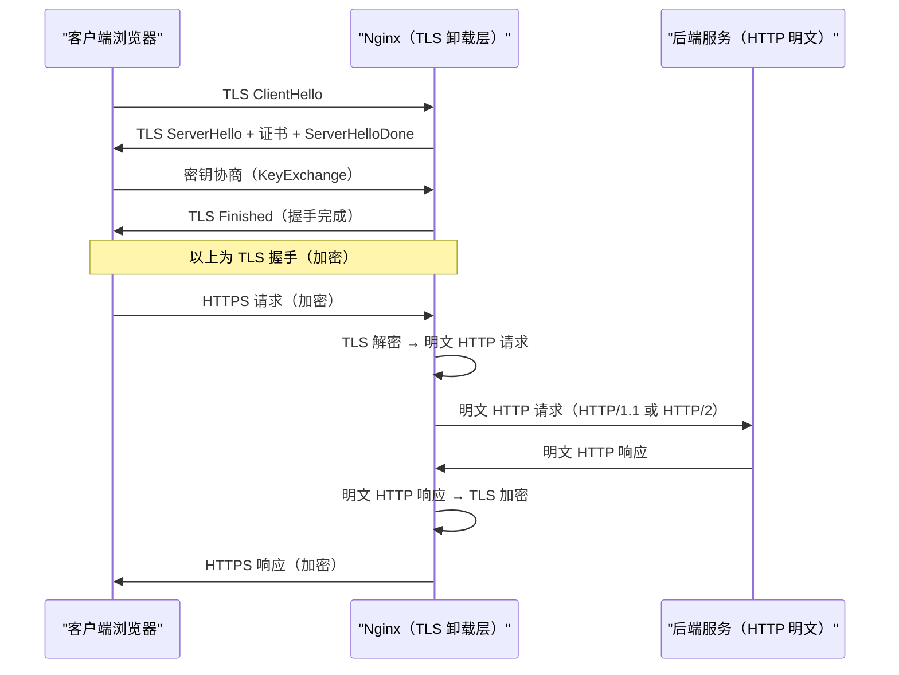

# 06 SSL/TLS 卸载：HTTPS 握手流程与性能优化

## 摘要

HTTPS 是现代 Web 的基础安全协议，而 Nginx 作为反向代理承担了 **TLS 卸载（SSL Termination）** 的职责——所有 TLS 握手和加解密由 Nginx 完成，后端服务只处理明文 HTTP，大幅降低后端的 CPU 开销。但 TLS 卸载本身有性能代价：握手需要非对称加密运算（RSA/ECDSA），每次新握手都消耗数百微秒的 CPU 时间；TLS 1.2 的握手需要 2-RTT，在高延迟链路上尤为明显。本文从 TLS 1.2 与 TLS 1.3 的握手流程对比出发，深入讲解 Session Ticket（会话票据）与 Session Cache（会话缓存）两种连接复用机制的原理差异，OCSP Stapling 的工作原理与必要性，以及 `ssl_buffer_size`、`ssl_session_cache`、`ssl_ciphers` 等关键调优参数的配置方法。

---

## 第 1 章 TLS 的历史演进与 Nginx 的角色

### 1.1 为什么需要 TLS

[[HTTP]] 是明文协议——数据在网络上以可读文本传输，任何能截获数据包的中间节点（运营商、Wi-Fi 路由器、同局域网设备）都能直接读取用户的请求和响应。在 Web 的早期，这是可以接受的（大多数内容是公开的）。但随着 Web 承载越来越多的敏感操作（网银、购物、社交），明文传输带来了严重的安全威胁：

- **监听（Eavesdropping）**：读取用户的账号密码、信用卡信息
- **中间人攻击（MITM）**：篡改响应内容（如注入广告、恶意代码），用户无法察觉
- **重放攻击（Replay Attack）**：截获并重放用户的请求（如支付请求）

**TLS（Transport Layer Security）** 在 TCP 和 HTTP 之间引入了加密层，提供三个核心保证：
- **保密性（Confidentiality）**：对称加密确保数据不能被第三方读取
- **完整性（Integrity）**：MAC（消息认证码）确保数据不能被篡改
- **真实性（Authenticity）**：证书验证确保服务端身份可信

### 1.2 SSL 与 TLS 的版本演进

| 版本 | 发布年份 | 状态 | 说明 |
|-----|--------|-----|-----|
| SSL 2.0 | 1995 | 已废弃 | 有严重漏洞（POODLE、DROWN），RFC 6176 强制禁用 |
| SSL 3.0 | 1996 | 已废弃 | POODLE 攻击，RFC 7568 禁用 |
| TLS 1.0 | 1999 | 已废弃 | BEAST 攻击，PCI DSS 要求禁用 |
| TLS 1.1 | 2006 | 已废弃 | RFC 8996（2021）正式废弃 |
| TLS 1.2 | 2008 | 广泛使用 | 主流版本，支持 AEAD 加密 |
| TLS 1.3 | 2018 | 推荐使用 | 大幅简化握手，强制前向安全，废弃弱加密套件 |

Nginx 建议的最低 TLS 版本是 TLS 1.2：

```nginx
ssl_protocols TLSv1.2 TLSv1.3;  # 禁用 TLS 1.0/1.1
```

### 1.3 TLS 卸载：Nginx 的角色



TLS 卸载的好处：
- 后端服务只需处理 HTTP，不需要 TLS 库和证书管理
- TLS 的 CPU 开销集中在 Nginx（可以通过硬件加速卡 offload）
- 证书更新只在 Nginx 层进行，后端无感知

---

## 第 2 章 TLS 握手深度解析

### 2.1 TLS 1.2 握手：2-RTT 的代价

TLS 1.2 的完整握手需要**两个完整的往返时延（2-RTT）**，这在高延迟链路（如移动网络，RTT = 50-100ms）上意味着握手本身就需要 100-200ms，还没算传输业务数据：

```
第 1 个 RTT（协商参数）：
  Client → Server: ClientHello
    - 支持的 TLS 版本列表
    - 客户端随机数（client_random）
    - 支持的加密套件列表（CipherSuites）
    - 支持的压缩方法
    - 扩展：SNI（Server Name Indication，指定域名）、支持的椭圆曲线等

  Server → Client: ServerHello + Certificate + ServerHelloDone
    - 选定的 TLS 版本
    - 服务端随机数（server_random）
    - 选定的加密套件
    - 服务端证书（含公钥）
    - 如果使用 DHE/ECDHE：ServerKeyExchange（DH 参数）
    - ServerHelloDone

第 2 个 RTT（密钥交换与验证）：
  Client → Server: ClientKeyExchange + ChangeCipherSpec + Finished
    - ClientKeyExchange：客户端的 DH 参数（用于计算预主密钥）
    - ChangeCipherSpec：通知"从现在开始使用协商好的密钥加密"
    - Finished：用协商好的密钥加密的握手摘要（验证握手完整性）

  Server → Client: ChangeCipherSpec + Finished
    - 服务端确认切换加密，握手完成

握手完成后才能发送第一个 HTTP 请求！
```

**密钥派生过程**（简化）：
```
预主密钥（pre_master_secret）：由客户端生成（RSA）或双方通过 DH/ECDH 计算（前向安全）
主密钥（master_secret）：PRF(pre_master_secret, client_random + server_random)
会话密钥（session keys）：从 master_secret 派生（4个：客户端加密、客户端MAC、服务端加密、服务端MAC）
```

### 2.2 TLS 1.3 握手：1-RTT 的革新

TLS 1.3 对握手流程进行了彻底重设计，**将握手从 2-RTT 压缩到 1-RTT**（完整握手），并支持 **0-RTT 恢复**（复用之前的会话）：

**TLS 1.3 完整握手（1-RTT）**：

```
第 1 个 RTT：

  Client → Server: ClientHello
    - TLS 1.3 版本标识
    - 客户端随机数
    - 支持的密钥交换方式（key_share 扩展：直接附上 ECDH 公钥！）
    - 支持的加密套件（TLS 1.3 只剩 5 个，全部是 AEAD）
    - 不再有压缩（TLS 1.3 废弃了压缩）

  Server → Client: ServerHello + Certificate + CertificateVerify + Finished
    - 选定参数
    - 服务端的 ECDH 公钥（key_share 响应）
    - 服务端证书
    - 证书签名（CertificateVerify）
    - Finished（握手摘要）
    
    注意：ServerHello 后的消息已经是加密的！
    （因为双方都有了对方的 ECDH 公钥，可以立即计算出对称密钥）

  Client → Server: Finished（可以附带第一个 HTTP 请求！）
    - 客户端验证服务端证书和 Finished
    - 发送自己的 Finished
    - 同时发送第一个 HTTP 请求（不需要等第二个 RTT）
```

**TLS 1.3 为什么能做到 1-RTT**：

关键改进是 **ClientHello 中直接附带 ECDH 公钥**（`key_share` 扩展）。在 TLS 1.2 中，ClientHello 只是"协商我支持哪些参数"，服务端选定参数后，第二个 RTT 才交换 DH 参数；在 TLS 1.3 中，ClientHello 直接附上了 ECDH 公钥，服务端收到后立即就能计算出对称密钥，ServerHello 之后的所有消息都是加密的，握手完成后客户端也可以立即发送业务数据。

**TLS 1.3 废弃的内容**：
- RSA 密钥交换（无前向安全性）——TLS 1.3 强制所有会话使用 ECDHE/DHE（前向安全）
- CBC 模式加密（易受 BEAST/Lucky13 攻击）——只保留 AEAD 加密（AES-GCM、ChaCha20-Poly1305）
- MD5、SHA-1（弱哈希）
- 压缩（CRIME 攻击利用压缩泄漏信息）

### 2.3 0-RTT Early Data：零握手延迟的代价

TLS 1.3 支持 **0-RTT（零往返延迟）** 会话恢复：客户端在握手完成之前就发送应用数据（Early Data），服务端在验证完成前也可以处理这些数据。

```nginx
ssl_early_data on;  # 启用 TLS 1.3 0-RTT（需要谨慎）
```

> [!warning] 生产避坑：0-RTT 的重放攻击风险
> 0-RTT Early Data 存在**重放攻击（Replay Attack）风险**。攻击者可以截获客户端的 0-RTT 数据包，然后重复发送——服务端无法区分这是合法的重传还是攻击者的重放。
>
> **因此，0-RTT 只适用于幂等的只读请求（如 GET 查询）**，对于任何会改变服务器状态的请求（POST 下单、PUT 更新），绝对不能使用 0-RTT。
>
> Nginx 配置了 `ssl_early_data on` 后，Nginx 会在 `$ssl_early_data` 变量中标记该请求是否使用了 0-RTT，可以据此拒绝非幂等操作：
> ```nginx
> location /api/order/ {
>     if ($ssl_early_data) {
>         return 425;  # 425 Too Early（RFC 8470 为此场景定义的状态码）
>     }
>     proxy_pass http://backend;
> }
> ```

---

## 第 3 章 会话复用：Session Ticket vs Session Cache

### 3.1 为什么需要会话复用

TLS 握手（即使是 TLS 1.3 的 1-RTT）仍然有不可忽视的开销：
- 非对称加密运算（ECDSA 签名验证）：在现代 CPU 上约 0.1-1ms
- 在移动网络等高延迟场景：1 RTT = 50-100ms

对于高频访问同一服务器的客户端（如浏览器），每次都做完整握手是浪费。**会话复用**机制让客户端在重连时跳过完整握手，使用之前协商好的密钥材料恢复会话——从 1-RTT 降低到 0-RTT（或更少）。

### 3.2 Session Cache（会话缓存）——服务端存储

**Session Cache** 是 TLS 1.2 时代的会话复用机制。服务端为每个会话分配一个 **Session ID**，并将会话参数（主密钥、协商的加密套件）缓存在服务端内存中：

```
首次握手：
  Client → Server: ClientHello
  Server → Client: ServerHello（含新的 Session ID）
  ... 完整握手 ...
  Server 将会话参数保存在本地 Session Cache 中

后续重连（简化握手）：
  Client → Server: ClientHello（附带上次的 Session ID）
  Server 查找 Session Cache，找到对应的会话参数
  Server → Client: ServerHello（确认恢复，使用旧 Session ID）
  Client → Server: ChangeCipherSpec + Finished
  Server → Client: ChangeCipherSpec + Finished
  只需 1-RTT（比完整握手的 2-RTT 省了一个 RTT）
```

```nginx
http {
    # Session Cache 配置（shared 表示所有 Worker 共享，内置 10MB 缓存）
    ssl_session_cache shared:SSL:10m;
    # 10MB 约可存储 40000 个 Session（每个 Session 约 256 字节）
    
    # Session 在 Cache 中的保存时间
    ssl_session_timeout 1d;  # 默认 5 分钟，生产建议 1 天
}
```

**Session Cache 的局限性**：

**局限一：水平扩展困难**

Session Cache 存在 Nginx 进程的共享内存中（Worker 进程间共享，但不跨服务器）。当 Nginx 有多台机器时，客户端第一次连接 Server A，Session 存在 Server A；下次连接可能被负载均衡到 Server B，Server B 没有这个 Session，退化为完整握手。

解决方案：要么用 Session Ticket（会话票据）彻底避免服务端存储；要么用外部共享存储（如 memcached）存储 Session，但这增加了架构复杂性。

**局限二：内存占用**

大型网站每天有数亿个 TLS 会话，全部缓存在内存中是不现实的。`ssl_session_timeout` 控制过期时间，防止内存无限增长。

### 3.3 Session Ticket（会话票据）——客户端存储

**Session Ticket** 是 TLS 1.2 引入、TLS 1.3 改进的会话复用机制。与 Session Cache 在服务端存储不同，Session Ticket 将会话状态加密后发给客户端保存：

```
首次握手：
  服务端在握手完成时，将会话参数（主密钥、加密套件等）用 Ticket Key 加密
  → 生成 Session Ticket，通过 TLS 扩展发送给客户端
  客户端保存这个加密的 Ticket

后续重连（0-RTT 或 1-RTT 恢复）：
  TLS 1.3：
    客户端在 ClientHello 的 pre_shared_key 扩展中附带 Ticket（PSK，预共享密钥）
    服务端用 Ticket Key 解密，恢复会话状态，直接完成握手（0-RTT 或 1-RTT）
  
  TLS 1.2：
    客户端在 ClientHello 的 session_ticket 扩展中附带 Ticket
    服务端解密验证，1-RTT 完成握手
```

```nginx
# Session Ticket 配置
ssl_session_tickets on;  # 默认 on，开启 Session Ticket

# Ticket Key 的轮换：定期轮换 Ticket Key，防止旧 Key 泄露导致历史会话解密
# Nginx 默认用随机生成的 Key（Nginx 启动时生成，重启后失效）
# 生产中需要手动管理 Ticket Key 文件（实现跨重启的会话复用）：
ssl_session_ticket_key /etc/nginx/ssl/ticket.key;
```

> [!warning] 生产避坑：Session Ticket Key 的轮换
> Session Ticket Key 如果长期不变（Nginx 默认每次启动随机生成，但运行期间固定），一旦 Key 泄露，攻击者可以解密所有持有有效 Ticket 的客户端的会话。
>
> **最佳实践**：每 24 小时轮换一次 Ticket Key：
> - 保留最近 2-3 个 Key（用于解密旧 Ticket）
> - 只用最新 Key 颁发新 Ticket
> - 在多台 Nginx 服务器间同步 Ticket Key（确保负载均衡后可以跨服务器恢复会话）
>
> ```bash
> # 生成新的 Ticket Key（80 字节随机数）
> openssl rand 80 > /etc/nginx/ssl/ticket.key
> # 每 24 小时替换一次，替换后 nginx -s reload
> ```

### 3.4 Session Cache vs Session Ticket 对比

| 维度 | Session Cache | Session Ticket |
|-----|-------------|---------------|
| 存储位置 | 服务端内存（共享 Zone）| 客户端本地 |
| 服务端内存开销 | 有（每 Session ~256B）| 无 |
| 水平扩展 | 困难（需要外部共享存储）| 容易（只需同步 Ticket Key）|
| 前向安全性 | 依赖实现 | 需要定期轮换 Key |
| TLS 1.3 支持 | 被 PSK 取代 | 被 PSK（Pre-Shared Key）模式支持 |
| 生产推荐 | 辅助使用（兜底）| 主力使用（水平扩展友好）|

---

## 第 4 章 OCSP Stapling：证书验证的优化

### 4.1 为什么证书需要吊销检查

数字证书有有效期（通常 90 天到 2 年），但证书可能在有效期内就被吊销（如私钥泄露、域名所有权转移）。**OCSP（Online Certificate Status Protocol）** 是证书颁发机构（CA）提供的实时证书状态查询服务：

```
标准 OCSP 流程（客户端直接查询）：

1. 浏览器建立 TLS 连接，收到服务器证书
2. 浏览器向 CA 的 OCSP Responder 发起 HTTP 请求，查询证书状态
   （OCSP URL 嵌入在证书中，如：http://ocsp.digicert.com）
3. OCSP Responder 返回：GOOD / REVOKED / UNKNOWN
4. 如果 REVOKED → 浏览器拒绝连接

问题：
  - 每次 TLS 握手都需要额外的 HTTP 请求（到 CA 服务器）
  - CA 服务器在国外 → 额外增加 50-300ms RTT
  - CA 服务器故障 → OCSP 查询失败 → 浏览器行为不确定（soft-fail：继续连接；hard-fail：拒绝）
  - OCSP Responder 收到大量查询 → CA 服务器成为瓶颈
  - 隐私问题：CA 服务器知道用户在访问哪些网站
```

### 4.2 OCSP Stapling：由 Nginx 代劳

**OCSP Stapling** 让 **Nginx 代替客户端向 CA 查询证书状态**，并将 OCSP 响应"装订（Staple）"到 TLS 握手中一并发给客户端：

```
OCSP Stapling 流程：

事先（在握手之前，Nginx 后台定期执行）：
  Nginx → CA OCSP Responder: 查询本站证书状态
  CA → Nginx: OCSP 响应（含时间戳和 CA 签名，有效期通常 24-48 小时）
  Nginx 将 OCSP 响应缓存在内存中

TLS 握手时：
  Client → Nginx: ClientHello
  Nginx → Client: ServerHello + 证书 + OCSP 响应（Stapled，夹带在握手中）
  客户端验证 OCSP 响应的 CA 签名（无需额外网络请求）
```

**OCSP Stapling 的三个核心好处**：
1. **消除额外 RTT**：客户端不需要单独查询 OCSP，握手时已获得证书状态
2. **提高可用性**：即使 CA 的 OCSP 服务器临时故障，Nginx 仍然可以提供缓存的 OCSP 响应（有效期内）
3. **保护用户隐私**：CA 看不到是哪些用户在访问哪些网站（只有 Nginx 向 CA 查询）

```nginx
server {
    listen 443 ssl;
    ssl_certificate     /etc/nginx/ssl/cert.pem;
    ssl_certificate_key /etc/nginx/ssl/key.pem;
    
    # 启用 OCSP Stapling
    ssl_stapling on;
    ssl_stapling_verify on;  # 验证 OCSP 响应的 CA 签名
    
    # CA 证书链（用于验证 OCSP 响应）
    ssl_trusted_certificate /etc/nginx/ssl/chain.pem;
    
    # DNS 解析器（Nginx 用于解析 CA OCSP Responder 的域名）
    resolver 8.8.8.8 8.8.4.4 valid=300s;
    resolver_timeout 5s;
}
```

---

## 第 5 章 TLS 性能调优参数

### 5.1 ssl_buffer_size：影响 TTFB 的关键参数

`ssl_buffer_size` 控制 Nginx 在将数据发送给客户端时，**每次 TLS 记录（TLS Record）的大小**：

```nginx
ssl_buffer_size 4k;  # 默认 16k
```

**TLS Record 的大小对 TTFB（Time To First Byte）的影响**：

TLS 要求一个完整的 TLS Record 接收完毕后才能解密。如果 `ssl_buffer_size=16k`，Nginx 会等待积累 16KB 的数据后，打包成一个 TLS Record 发出。对于小响应（如 1KB 的 JSON API），Nginx 需要等到 16KB 积满（或连接关闭）才发送，导致人为增加延迟。

```
场景：API 响应体 = 2KB

ssl_buffer_size=16k：
  Nginx 积累数据到 16KB → 等待（没有更多数据了）→ 发送（1 个 TLS Record，2KB 有效载荷）
  客户端等待时间 = 内容传输时间 + Nginx 等待填满缓冲的时间（有延迟感）

ssl_buffer_size=4k：
  Nginx 积累 4KB → 已超过 2KB 响应 → 直接发送（不等待）
  客户端等待时间 ≈ 内容传输时间（TTFB 更低）
```

**调优建议**：
- **API 服务、动态页面**（响应体通常 < 10KB）：设置 `ssl_buffer_size 4k`
- **文件下载、视频流**（响应体 > 1MB）：保持默认 `16k` 或更大（减少 TLS Record 数量，降低 CPU 加密开销）

### 5.2 加密套件的选择

```nginx
# TLS 1.3 的加密套件（由 OpenSSL 控制，Nginx 无法直接配置）：
# TLS_AES_128_GCM_SHA256（首选）
# TLS_AES_256_GCM_SHA384
# TLS_CHACHA20_POLY1305_SHA256

# TLS 1.2 的加密套件（Nginx 可配置）：
ssl_ciphers 'ECDHE-ECDSA-AES128-GCM-SHA256:ECDHE-RSA-AES128-GCM-SHA256:ECDHE-ECDSA-AES256-GCM-SHA384:ECDHE-RSA-AES256-GCM-SHA384:ECDHE-ECDSA-CHACHA20-POLY1305:ECDHE-RSA-CHACHA20-POLY1305';
# 全部是 ECDHE（前向安全）+ AEAD（认证加密）

ssl_prefer_server_ciphers on;  # 使用服务端的优先顺序（而非客户端偏好）
```

**ChaCha20-Poly1305 vs AES-GCM 的选择**：

AES-GCM 在支持 AES-NI 硬件指令的现代 CPU 上性能极佳（Intel Haswell 以后的 CPU 都支持）；ChaCha20-Poly1305 是纯软件实现的流密码，在**不支持 AES-NI 的环境**（如旧 CPU、ARM 设备、移动端）性能优于 AES-GCM。

Nginx 的默认顺序（AES-GCM 优先）在现代服务器上是合理的；如果 Nginx 主要服务移动端或老旧设备，可以将 ChaCha20-Poly1305 放在前面。

### 5.3 HSTS：强制 HTTPS 的 HTTP 响应头

```nginx
# 在 HTTPS server 块中添加 HSTS 头
add_header Strict-Transport-Security "max-age=31536000; includeSubDomains; preload" always;
```

**HSTS（HTTP Strict Transport Security）** 告诉浏览器：在未来 `max-age` 秒内（31536000 秒 = 1 年），对这个域名的所有请求都强制使用 HTTPS，不允许降级到 HTTP。这防止了 **SSL Strip 攻击**（攻击者将 HTTPS 链接替换为 HTTP，拦截明文流量）。

`preload` 参数允许将域名提交到浏览器内置的 HSTS Preload List，即使用户第一次访问也强制 HTTPS（无需等待首次 HSTS 头）。提交地址：https://hstspreload.org

### 5.4 完整的 TLS 优化配置模板

```nginx
http {
    # 全局 TLS 优化（在 http 块中）
    ssl_session_cache   shared:SSL:50m;   # 50MB Session Cache（约 20 万个 Session）
    ssl_session_timeout 1d;
    ssl_session_tickets on;

    server {
        listen 443 ssl http2;             # HTTP/2 需要 TLS
        listen [::]:443 ssl http2;
        
        ssl_certificate     /etc/nginx/ssl/example.com.crt;
        ssl_certificate_key /etc/nginx/ssl/example.com.key;
        
        # 协议版本（禁用 TLS 1.0/1.1）
        ssl_protocols TLSv1.2 TLSv1.3;
        
        # 加密套件（仅 AEAD + 前向安全）
        ssl_ciphers 'ECDHE-ECDSA-AES128-GCM-SHA256:ECDHE-RSA-AES128-GCM-SHA256:ECDHE-ECDSA-CHACHA20-POLY1305:ECDHE-RSA-CHACHA20-POLY1305:ECDHE-ECDSA-AES256-GCM-SHA384:ECDHE-RSA-AES256-GCM-SHA384';
        ssl_prefer_server_ciphers on;
        
        # ECDH 曲线（X25519 是最快的，P-256 兼容性更广）
        ssl_ecdh_curve X25519:prime256v1:secp384r1;
        
        # OCSP Stapling
        ssl_stapling on;
        ssl_stapling_verify on;
        ssl_trusted_certificate /etc/nginx/ssl/chain.pem;
        resolver 8.8.8.8 1.1.1.1 valid=300s;
        resolver_timeout 5s;
        
        # 缓冲区（小响应场景用 4k 降低 TTFB）
        ssl_buffer_size 4k;
        
        # 安全响应头
        add_header Strict-Transport-Security "max-age=31536000; includeSubDomains" always;
        add_header X-Frame-Options SAMEORIGIN always;
        add_header X-Content-Type-Options nosniff always;
    }
    
    # HTTP 重定向到 HTTPS
    server {
        listen 80;
        listen [::]:80;
        server_name example.com www.example.com;
        return 301 https://$host$request_uri;
    }
}
```

---

## 小结

TLS 卸载是 Nginx 最重要的安全功能，性能优化聚焦在减少握手次数和降低每次握手的代价：

- **TLS 1.3 vs TLS 1.2**：握手从 2-RTT 降到 1-RTT；废弃所有非 AEAD 加密和非前向安全的密钥交换；ClientHello 直接附带 ECDH 公钥是 1-RTT 成为可能的关键
- **0-RTT 的代价**：虽然延迟最低，但存在重放攻击风险，只能用于幂等只读请求
- **Session Cache vs Session Ticket**：Session Cache 适合单机场景；Session Ticket 将状态存客户端，天然支持水平扩展，但需要定期轮换 Ticket Key
- **OCSP Stapling**：Nginx 代替客户端向 CA 查询证书状态，消除额外 RTT，提高可用性，保护隐私；生产必配
- **ssl_buffer_size**：小响应（API、HTML）设 4k 降低 TTFB；大响应（文件下载）保持默认 16k

第 07 篇深入 Location 匹配的完整决策树：精确匹配、前缀匹配、正则匹配、通用匹配的四级优先级，`^~` 修饰符的特殊语义，以及 `try_files`、`alias` 与路径解析的精确行为。

---

## 参考资料

- [RFC 8446 - TLS 1.3 规范](https://datatracker.ietf.org/doc/html/rfc8446)
- [Nginx 官方文档：ngx_http_ssl_module](https://nginx.org/en/docs/http/ngx_http_ssl_module.html)
- [Mozilla SSL Configuration Generator](https://ssl-config.mozilla.org/)
- [OCSP Stapling 官方说明](https://nginx.org/en/docs/http/ngx_http_ssl_module.html#ssl_stapling)


---

> **下一篇**：[[07 Location 匹配：优先级规则与正则引擎]]
