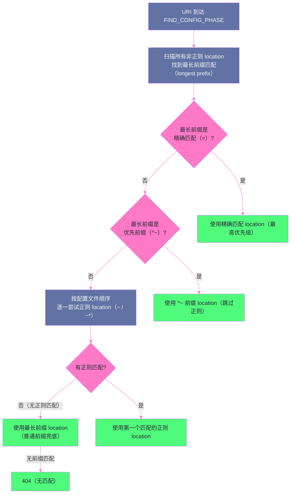

# 07 Location 匹配：优先级规则与正则引擎

## 摘要

`location` 是 Nginx 配置中使用频率最高的块指令，也是最容易出错的地方。很多工程师对 location 的理解停留在"写几个常见的例子能跑就行"，但当遇到多个 location 都能匹配同一个 URI 时，究竟哪个 location 生效？`^~` 修饰符的作用是什么？正则 location 的顺序是否重要？location 嵌套时内外层如何交互？这些问题在配置复杂系统时频繁出现，却鲜少被系统性地讲清楚。本文从 Nginx 的 location 匹配算法出发，完整推导四种匹配类型的优先级决策树，深入讲解 PCRE 正则引擎在 Nginx 中的编译与缓存机制，以及 `try_files`、命名 location、location 嵌套的精确行为语义。

---

## 第 1 章 Location 的四种匹配类型

### 1.1 匹配类型速览

Nginx 的 `location` 指令支持四种语法形式，每种对应不同的匹配语义：

```nginx
# 类型 1：精确匹配（Exact Match）
location = /exact/path { ... }

# 类型 2：前缀匹配（Prefix Match）
location /prefix/path { ... }

# 类型 3：优先前缀匹配（Priority Prefix Match）
location ^~ /static/ { ... }

# 类型 4a：区分大小写的正则匹配（Case-Sensitive Regex）
location ~ \.php$ { ... }

# 类型 4b：不区分大小写的正则匹配（Case-Insensitive Regex）
location ~* \.(jpg|png|gif)$ { ... }
```

这四种类型的最终优先级，是 Nginx 源码中 `ngx_http_core_find_location()` 函数的决策逻辑：

### 1.2 决策树：完整的匹配流程

Nginx 收到请求后，FIND_CONFIG_PHASE（第 03 篇讲的 Phase 3）按以下**确定性算法**查找最优 location：

```
Step 1：遍历所有非正则 location（精确匹配 + 前缀匹配），找到最长前缀匹配

  对所有以 = 或无修饰符 或 ^~ 开头的 location，按前缀长度从长到短扫描，
  找到匹配当前 URI 的"最长前缀"：

  例如：URI = "/static/images/logo.png"
    location /static/          → 匹配，前缀长度 8
    location /static/images/   → 匹配，前缀长度 15（更长，覆盖前者）
    location /other/           → 不匹配
  最长前缀匹配 = /static/images/

Step 2：检查最长前缀是否是精确匹配（=）或优先前缀匹配（^~）

  如果最长前缀匹配的 location 是：
    = /exact/path → 立即使用该 location（终止匹配，不检查正则）
    ^~ /prefix/   → 立即使用该 location（终止匹配，不检查正则）
    普通前缀       → 记录下来（作为候选），继续 Step 3

Step 3：按配置文件顺序，依次尝试所有正则 location（~ 和 ~*）

  逐一用正则测试 URI，第一个匹配的正则 location 获胜，立即使用（终止匹配）

Step 4：如果没有任何正则匹配，使用 Step 1/2 中记录的最长前缀 location

  如果连前缀匹配也没有 → 404（或使用兜底的 location / ）
```

用流程图表示：



---

## 第 2 章 四种匹配类型的深度解析

### 2.1 精确匹配（`=`）：优先级最高，性能最佳

```nginx
location = / {
    return 200 "This is the homepage";
}

location = /favicon.ico {
    access_log off;
    return 204;
}
```

精确匹配要求 URI 与 location 路径**完全相同**（包括末尾的斜杠）。

**优先级最高**：一旦精确匹配命中，立即使用该 location，跳过所有其他匹配（包括正则），是所有匹配类型中优先级最高的。

**性能最佳**：精确匹配使用哈希表查找（O(1)），不需要遍历所有 location，也不需要执行正则匹配。对于高频访问的固定路径（如 `/`、`/favicon.ico`、`/robots.txt`），精确匹配的性能优于其他类型。

**精确匹配的边界**：

```nginx
location = /api/ {
    proxy_pass http://backend;
}

# 请求 /api/ → 精确匹配，命中
# 请求 /api  → 不匹配（缺少末尾斜杠）
# 请求 /api/users → 不匹配（比 location 路径更长）
```

精确匹配不是前缀匹配——`/api/users` 不会匹配 `location = /api/`。这与普通前缀匹配的行为完全不同。

### 2.2 前缀匹配（无修饰符）：最灵活的兜底选项

```nginx
location /api/ {
    proxy_pass http://backend;
}

location / {
    root /var/www/html;
    index index.html;
}
```

普通前缀匹配要求 URI 以 location 路径**开头**。匹配时记录最长的匹配前缀，但不立即使用——继续尝试正则匹配，如果正则没有命中，最终使用最长的普通前缀。

```
URI: /api/users/123
  location /api/  → 匹配（前缀长度 5）
  location /       → 匹配（前缀长度 1）
  最长前缀 = /api/（记录，继续检查正则）

  如果没有正则匹配 → 使用 location /api/
```

`location /` 是所有请求的最终兜底（因为所有 URI 都以 `/` 开头），通常放在 server 块中作为默认处理。

### 2.3 优先前缀匹配（`^~`）：阻止正则尝试

`^~` 的语义容易从字面上误读（像是"以什么开头的正则"），实际上它是**普通前缀匹配 + 阻止后续正则尝试**：

```nginx
location ^~ /static/ {
    root /var/www/assets;
    expires 30d;
}

location ~* \.(jpg|png|css|js)$ {
    add_header Cache-Control "public, max-age=86400";
    root /var/www;
}
```

对于 URI `/static/images/logo.png`：
- `^~ /static/` 是最长前缀匹配
- 因为是 `^~`，Nginx **跳过正则匹配阶段**，直接使用 `^~ /static/`
- `~* \.(jpg|png|css|js)$` 虽然也能匹配，但**永远不会被尝试**

**`^~` 的设计意图**：静态资源文件通常存放在特定目录（如 `/static/`），运营人员希望对这个目录的所有请求统一处理（设置长缓存、关闭 access log 等），而不希望后面的正则匹配"干扰"这个决策。`^~` 提供了一种"就用这个，别再匹配正则了"的语义。

### 2.4 正则匹配（`~` 和 `~*`）：顺序决定命运

```nginx
# 匹配 PHP 文件（区分大小写）
location ~ \.php$ {
    fastcgi_pass unix:/run/php-fpm.sock;
    include fastcgi_params;
}

# 匹配常见静态文件（不区分大小写）
location ~* \.(jpg|jpeg|png|gif|ico|css|js|woff2)$ {
    expires 30d;
    add_header Cache-Control "public";
}
```

正则 location 按**配置文件中出现的顺序**依次尝试，第一个匹配即停止。**顺序非常重要**：

```nginx
# 错误的顺序：
location ~* \.(jpg|png)$ {
    expires 30d;
}

location ~ /secure/.*\.(jpg|png)$ {
    # 这个永远不会匹配！
    # 因为 /secure/image.jpg 会先匹配上面的 ~* \.(jpg|png)$
    deny all;
}

# 正确的顺序：更具体的正则放在前面
location ~ /secure/.*\.(jpg|png)$ {
    deny all;
}

location ~* \.(jpg|png)$ {
    expires 30d;
}
```

> [!warning] 生产避坑：正则 location 的顺序陷阱
> 正则 location 的匹配是线性扫描，第一个匹配立即生效。这意味着：**越具体（越精确）的正则必须放在越前面**，否则被更宽泛的正则提前拦截，具体规则永远不会生效。这与 `if-else if` 链的逻辑完全一致——但 Nginx 配置不会给你报任何警告，配置错误会静默地导致错误的行为。

---

## 第 3 章 PCRE 正则引擎在 Nginx 中的实现

### 3.1 Nginx 使用 PCRE 而非 POSIX 正则

Nginx 使用 **PCRE（Perl Compatible Regular Expressions）** 库而非 POSIX 标准正则库。PCRE 的功能比 POSIX 更强大，支持：
- **捕获组**（`(pattern)`）：`~* ^/api/v(?<version>\d+)/`，捕获值存入命名变量 `$version`
- **非捕获组**（`(?:pattern)`）：避免创建变量，减少内存分配
- **零宽断言**（`(?=pattern)`、`(?!pattern)`）：更精确的上下文匹配

```nginx
# 捕获组示例：从 URI 中提取版本号
location ~ ^/api/v(?<version>\d+)/(.+)$ {
    # $version 变量在 location 内部可用
    # $2 是第二个捕获组（路径部分）
    proxy_pass http://api-v$version-backend/$2;
}

# URI: /api/v3/users → version=3, $2=users
# → proxy_pass http://api-v3-backend/users
```

### 3.2 正则编译的时机与缓存

Nginx 在**配置加载时**（`nginx -s reload` 或启动时）对所有正则 location 进行**预编译**，将正则字符串编译为 PCRE 内部的 NFA/DFA 字节码，缓存在 Master 进程的内存中，由所有 Worker 进程共享。

这与某些框架（每次请求动态编译正则）不同——Nginx 的正则只编译一次，后续每次请求的匹配是对**预编译字节码**的执行（毫秒级以下），不包含编译开销。

**PCRE JIT 加速**：现代版本的 Nginx 支持启用 PCRE JIT（Just-In-Time 编译），将 PCRE 字节码进一步编译为机器码：

```nginx
# nginx.conf 中启用 PCRE JIT（需要 PCRE2 库支持）
pcre_jit on;
```

对于复杂的正则（如包含多个捕获组、嵌套量词的模式），PCRE JIT 可以将正则匹配速度提升 2-10 倍。对于简单的扩展名匹配（`~* \.css$`），JIT 的提升有限，但不会带来负面影响。

### 3.3 正则陷阱：回溯爆炸（ReDoS）

**正则表达式拒绝服务攻击（ReDoS）** 是 Nginx location 正则的一个安全风险。当正则模式存在**嵌套量词（nested quantifiers）** 时，某些特定输入会导致回溯次数指数级增长，使正则匹配消耗大量 CPU。

```nginx
# 危险的正则：嵌套量词
location ~ ^(a+)+$ {
    # 输入 "aaaaaaaaaaaaaaaaaab" 时，回溯次数呈指数级增长
    # 攻击者发送精心构造的 URI 即可消耗 Worker 进程的 CPU
}
```

**防范措施**：
1. 避免在面向公网的 location 中使用包含嵌套量词的正则
2. 为正则匹配添加长度限制（通过 `if ($uri !~ ^.{1,200}$) { return 400; }` 提前过滤超长 URI）
3. 使用 PCRE2 的 `PCRE2_MATCH_LIMIT` 限制最大回溯次数（Nginx 1.19 以后支持）

---

## 第 4 章 Location 嵌套

### 4.1 Location 嵌套的语义

Nginx 允许 location 内部嵌套其他 location，子 location 只在父 location 已匹配的前提下参与匹配：

```nginx
location /api/ {
    # 父 location：处理所有 /api/ 前缀的请求

    location = /api/health {
        # 子 location：精确匹配 /api/health（高优先级）
        return 200 "healthy";
        access_log off;
    }

    location ~* ^/api/v\d+/ {
        # 子 location：正则匹配版本化 API
        proxy_pass http://api-backend;
    }

    # 父 location 的默认处理（未被子 location 匹配时）
    proxy_pass http://legacy-backend;
}
```

**嵌套 location 的匹配规则**：

1. 首先在**外层**所有 location 中找到最佳匹配（按上文的决策树）
2. 如果外层 location 内部有嵌套 location，在其内部再次执行决策树（查找子 location 中的最佳匹配）
3. 如果有子 location 匹配，使用子 location；否则使用父 location

**嵌套的限制**：正则 location（`~`/`~*`）内部不能再嵌套 location——即嵌套 location 的父级必须是前缀类型（`=`、`^~`、无修饰符）。

### 4.2 什么时候需要嵌套 Location

嵌套 location 在以下场景有价值：

**场景一：对某个路径前缀内的特定子路径做例外处理**

```nginx
location /app/ {
    proxy_pass http://app-backend;
    proxy_set_header X-App-Version "1.0";

    location = /app/healthz {
        # 健康检查接口：绕过 proxy，直接返回
        return 200 "OK";
        access_log off;
    }

    location /app/static/ {
        # 静态资源：从本地文件系统读取，不转发到后端
        alias /var/www/app-static/;
        expires 7d;
    }
}
```

**场景二：减少正则评估次数（性能优化）**

如果有大量基于 URI 路径前缀的正则匹配，使用嵌套 location 可以先用前缀匹配缩小范围，再在子 location 中做正则（比在全局层面用正则扫描所有 location 更快）。

---

## 第 5 章 命名 Location 与内部跳转

### 5.1 命名 Location（`@name`）的语义边界

**命名 Location** 以 `@` 开头，是一种特殊的 location，只能被**内部跳转**触发，客户端无法直接请求：

```nginx
server {
    root /var/www/html;
    
    location / {
        try_files $uri $uri/ @backend;  # 静态文件不存在时，内部跳转到 @backend
    }
    
    location @backend {
        proxy_pass http://app-server;
        proxy_set_header Host $host;
        proxy_set_header X-Forwarded-For $proxy_add_x_forwarded_for;
    }
    
    # 404 页面：交给后端渲染（而非静态 HTML）
    error_page 404 @not_found;
    location @not_found {
        proxy_pass http://app-server/404;
    }
}
```

**命名 Location 的使用规则**：
- 只能出现在 `server` 块的顶层（不能嵌套在另一个 location 内部）
- 不参与普通的 URI 路由匹配（`FIND_CONFIG_PHASE` 不会选择它）
- 只能通过 `try_files`、`error_page`、`rewrite ... last/break`（特定情况）触发

**为什么命名 Location 比普通 Location 更好用于 fallback**：

```nginx
# 不好的做法：error_page 指向普通路径
error_page 404 /404.html;
# 触发内部跳转到 /404.html，这个路径本身也会经历完整的匹配流程
# 如果 /404.html 文件不存在，会再次产生 404（递归）
# 而且这个内部请求会被 access_log 记录（产生误导性的访问日志）

# 好的做法：error_page 指向命名 location
error_page 404 @not_found;
location @not_found {
    return 200 '{"error":"not found"}';
    add_header Content-Type application/json;
    # 直接返回，没有递归风险
    # 内部请求不被 access_log 记录（可配置）
}
```

### 5.2 内部请求（Internal Request）的标记

Nginx 为每个请求维护一个 `internal` 标记（布尔值），区分来自外部客户端的请求和通过内部跳转触发的请求：

- 普通客户端请求：`internal = false`
- 通过 `try_files`/`error_page`/`rewrite last` 触发的内部跳转：`internal = true`

```nginx
location @secure_files {
    # 只允许内部请求访问
    internal;  # 如果外部客户端直接请求命中此 location，返回 404
    
    root /var/secure-files;
}

# 通过 X-Accel-Redirect 实现安全的文件下载：
# 1. 客户端请求 /download/file.pdf
# 2. 应用服务器验证权限后，在响应头中添加 X-Accel-Redirect: /secure/file.pdf
# 3. Nginx 收到这个响应头，触发内部跳转到 /secure/file.pdf（@secure_files location）
# 4. 客户端直接下载文件，但不能绕过应用层权限验证
```

---

## 第 6 章 实战：从 URI 到 Location 的完整推导示例

### 6.1 综合配置示例

```nginx
server {
    listen 80;
    server_name example.com;
    root /var/www/html;
    
    # 精确匹配
    location = / {
        index index.html;
    }
    
    location = /favicon.ico {
        access_log off;
        return 204;
    }
    
    # 优先前缀匹配
    location ^~ /static/ {
        expires 30d;
        add_header Cache-Control "public";
    }
    
    # 正则匹配（顺序重要！）
    location ~ \.php$ {
        fastcgi_pass unix:/run/php-fpm.sock;
        fastcgi_param SCRIPT_FILENAME $document_root$fastcgi_script_name;
        include fastcgi_params;
    }
    
    location ~* \.(jpg|jpeg|png|gif|ico|svg|woff2|ttf)$ {
        expires 7d;
    }
    
    # 普通前缀匹配
    location /api/ {
        proxy_pass http://api-backend;
    }
    
    # 兜底
    location / {
        try_files $uri $uri/ /index.html;
    }
}
```

### 6.2 逐一推导各 URI 的匹配结果

**URI 1：`/`**
- Step 1：扫描非正则 location，最长前缀匹配 = `= /`（精确匹配）
- Step 2：`= /` 是精确匹配 → 立即使用，**跳过所有正则**
- **结果：`location = /`，返回 index.html**

**URI 2：`/favicon.ico`**
- Step 1：`= /favicon.ico` 精确匹配
- Step 2：精确匹配 → 立即使用
- **结果：`location = /favicon.ico`，返回 204**

**URI 3：`/static/css/style.css`**
- Step 1：非正则 location 中，`^~ /static/` 是最长前缀（长度 8）
- Step 2：`^~` → 跳过正则，立即使用 `^~ /static/`
  - 注意：`~* \.(jpg|jpeg|...)$` 也能匹配 `.css`，但因为 `^~` 阻止了正则扫描，永远不会被尝试
- **结果：`location ^~ /static/`，30 天缓存**

**URI 4：`/api/users.json`**
- Step 1：非正则中，`/api/` 是最长前缀（长度 5），记录（候选）
- Step 2：不是精确或 `^~`，继续
- Step 3：尝试正则
  - `~ \.php$` → 不匹配（`.json` ≠ `.php`）
  - `~* \.(jpg|jpeg|png|gif|ico|svg|woff2|ttf)$` → 不匹配（`.json` 不在列表）
  - 所有正则均不匹配
- Step 4：使用候选 `/api/`
- **结果：`location /api/`，代理到 api-backend**

**URI 5：`/upload/photo.jpg`**
- Step 1：非正则中，`/` 是最长前缀（只有 `/` 匹配），记录
- Step 2：不是精确或 `^~`，继续
- Step 3：尝试正则
  - `~ \.php$` → 不匹配
  - `~* \.(jpg|jpeg|png|gif|ico|svg|woff2|ttf)$` → **匹配**（.jpg 在列表中）
  - 第一个匹配的正则获胜
- **结果：`location ~* \.(jpg|...)$`，7 天缓存**

**URI 6：`/profile/index.php`**
- Step 1：非正则中，`/` 是最长前缀，记录
- Step 2：不是精确或 `^~`，继续
- Step 3：尝试正则
  - `~ \.php$` → **匹配**（结尾是 `.php`）
  - 第一个匹配的正则获胜
- **结果：`location ~ \.php$`，转发到 PHP-FPM**

**URI 7：`/about`**
- Step 1：非正则中，`/` 是最长前缀，记录
- Step 2：不是精确或 `^~`，继续
- Step 3：所有正则均不匹配
- Step 4：使用候选 `/`
- 执行 `try_files $uri $uri/ /index.html`：
  - 尝试 `/var/www/html/about` 文件 → 不存在
  - 尝试 `/var/www/html/about/` 目录 → 不存在
  - fallback：内部跳转到 `/index.html`
- **结果：返回 `/index.html`（SPA 路由模式）**

---

## 第 7 章 常见配置模式与最佳实践

### 7.1 SPA（单页应用）的 Location 配置

```nginx
location / {
    root /var/www/dist;
    index index.html;
    
    try_files $uri $uri/ /index.html;
    # 逻辑：先找静态文件，再找目录，最后用 index.html（由前端路由处理）
}

# 单独缓存静态资源（hash 文件名，可以长期缓存）
location ~* \.(js|css|woff2|png|jpg|svg)$ {
    root /var/www/dist;
    expires 1y;
    add_header Cache-Control "public, immutable";
}
```

### 7.2 API + 静态文件的混合配置

```nginx
server {
    root /var/www/html;
    
    # API 代理（不缓存）
    location /api/ {
        proxy_pass http://backend:8080;
        proxy_no_cache 1;
        proxy_cache_bypass 1;
    }
    
    # 静态资源（强缓存）
    location ^~ /assets/ {
        expires 1y;
        add_header Cache-Control "public, immutable";
    }
    
    # 兜底 SPA
    location / {
        try_files $uri $uri/ /index.html;
    }
}
```

### 7.3 防止爬取敏感路径

```nginx
# 直接返回 444（Nginx 特有：关闭连接，不发送响应）
location ~* \.(env|git|svn|DS_Store)$ {
    return 444;
}

location ~ /\. {
    # 禁止访问以 . 开头的隐藏文件（如 .htpasswd、.env）
    deny all;
    return 404;
}
```

---

## 小结

Nginx location 匹配遵循一个确定性的两阶段算法：

**阶段一**（非正则扫描）：找到最长前缀匹配：
- 如果是 `=` → 立即使用，终止
- 如果是 `^~` → 立即使用，跳过正则，终止
- 否则记录为候选，进入阶段二

**阶段二**（正则线性扫描）：按配置文件顺序逐一测试正则：
- 第一个匹配 → 立即使用，终止
- 全部不匹配 → 使用阶段一的候选

**关键规则总结**：
- **精确匹配**（`=`）优先级最高，哈希表查找 O(1)，高频路径推荐使用
- **`^~` 优先前缀**比普通前缀多了"跳过正则"的语义，适合静态资源目录
- **正则 location 的顺序决定结果**，具体的放前面，宽泛的放后面
- **命名 location**（`@name`）只被内部触发，不参与常规路由，是 `try_files` 和 `error_page` 的最佳搭档
- PCRE JIT（`pcre_jit on`）对复杂正则有 2-10 倍加速，生产建议开启

第 08 篇深入限流与熔断：`limit_req_zone` 的漏桶算法数学本质、`burst` 与 `nodelay` 的组合效果推导、`limit_conn` 的共享内存计数器实现。

---

## 参考资料

- [Nginx 官方文档：location](https://nginx.org/en/docs/http/ngx_http_core_module.html#location)
- [PCRE 官方文档](https://www.pcre.org/current/doc/html/)
- [Nginx location 匹配测试工具](https://nginx.viraptor.info/)


---

> **下一篇**：[[08 限流与熔断：leaky bucket 与 burst 参数的数学本质]]
