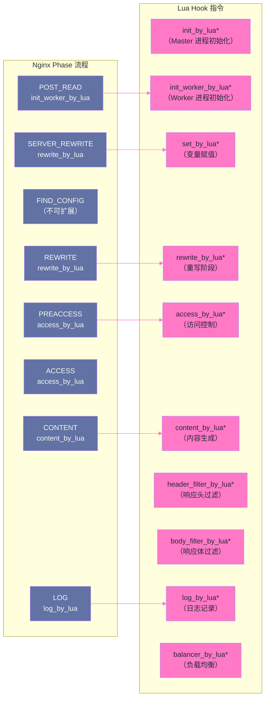

# 12 OpenResty 架构：LuaJIT、cosocket 与协程调度

## 摘要

OpenResty 是在 Nginx 基础上内嵌 LuaJIT 运行时，将 Lua 代码与 Nginx 的事件驱动模型深度融合的高性能 Web 平台。理解 OpenResty 的关键不是学会写 Lua 语法，而是理解三个底层机制：**LuaJIT 的 JIT 编译如何将 Lua 代码的执行速度提升到接近 C 的水平**、**cosocket 如何在单线程事件循环中实现非阻塞网络 I/O 而不破坏代码的顺序语义**、以及 **ngx_lua 的 Phase Hook 体系如何让 Lua 代码在 Nginx 请求处理的任意阶段介入**。这三个机制共同构成了 OpenResty "高性能、可编程、非阻塞"的能力基础，也是后续 APISIX 等网关框架的技术根基。

---

## 第 1 章 为什么 Nginx 需要可编程能力

### 1.1 纯 Nginx 配置的表达力瓶颈

在前 11 篇中，我们通过 nginx.conf 实现了大量能力：反向代理、负载均衡、限流、缓存、安全加固……但随着系统复杂度增加，纯配置的表达力开始出现明显瓶颈：

**场景一：复杂的动态路由**

```
业务需求：
  根据请求中 JWT 的 claims（用户角色、版本标志）动态选择不同的 upstream
  VIP 用户 → premium-backend
  普通用户且请求 v2 API → api-v2-backend
  普通用户且请求 v1 API → api-v1-backend

纯 Nginx 配置能做到吗？
  可以用 map + 正则，但 JWT 解析需要 base64 decode + JSON parse
  纯 Nginx 无法做 base64 解码（没有内置函数）
  map 指令无法调用外部函数
  → 无法实现
```

**场景二：外部服务查询**

```
业务需求：
  每次请求到来时，查询 Redis 中的 IP 黑名单，如果命中则拒绝

纯 Nginx 配置能做到吗？
  ngx_http_access_module 支持静态 IP 黑名单（配置中写死）
  但不支持动态查询 Redis（需要 TCP 连接和协议通信）
  → 无法实现
```

**场景三：请求/响应内容变换**

```
业务需求：
  对某些 API 响应的 JSON 进行字段过滤（移除敏感字段）
  或对响应头进行复杂的动态计算和重写

纯 Nginx 配置能做到吗？
  sub_filter 模块可以做简单的字符串替换
  但无法做 JSON 解析和字段过滤
  → 无法实现
```

**结论**：Nginx 的配置语言本质上是**声明式**的（声明规则，Nginx 执行），不具备通用的**命令式编程**能力（不能循环、不能调用函数、不能做复杂计算）。当业务需要在 Nginx 层做复杂逻辑时，需要一种嵌入式编程语言。

### 1.2 为什么选择 Lua 而非 JavaScript/Python

OpenResty 的创始人章亦春（agentzh）选择 Lua 作为嵌入语言，这个决定背后有深刻的工程考量：

**理由一：Lua 天生为嵌入设计**

Lua 从设计之初就是作为嵌入其他应用的脚本语言（与 C 互操作的 API 极为干净），而不是独立语言。Lua 虚拟机只有约 24K 行 C 代码，编译出的库文件约 250KB——嵌入到 Nginx 进程对内存的影响极小。

对比：V8（JavaScript 引擎）库文件超过 10MB，Python 解释器约 3MB。

**理由二：LuaJIT 的极致性能**

[[LuaJIT]] 是 Lua 5.1 的 JIT（Just-In-Time）编译实现，由 Mike Pall 开发。LuaJIT 的基准测试性能在某些场景下接近 C——远超其他脚本语言的解释器：

```
典型性能对比（相对 C = 1.0）：
  LuaJIT：0.6-0.9（部分场景超过 C）
  Python（CPython）：0.03-0.1
  JavaScript（V8，JIT）：0.3-0.8
  Ruby（MRI）：0.02-0.05
```

在 Nginx Worker 的单线程环境中，LuaJIT 的高性能意味着 Lua 代码的 CPU 开销不会成为瓶颈。

**理由三：协程是 Lua 的一等公民**

Lua 内置了**协程（Coroutine）**——轻量级的用户态线程，切换代价极低（微秒级，远低于系统线程的毫秒级）。这与 Nginx 的事件驱动模型天然契合：当 Lua 代码需要等待网络 I/O 时，协程挂起，让出 CPU；I/O 完成后，协程恢复执行。这正是 cosocket 的工作基础。

---

## 第 2 章 LuaJIT：从源码到机器码的三级执行模型

### 2.1 传统 Lua 解释器的执行模型

标准 Lua 5.1 是一个**字节码解释器**：
1. Lua 源码 → Lua 编译器 → Lua 字节码（.luac）
2. Lua 虚拟机（C 语言实现）逐条解释执行字节码

每条字节码指令都需要 Lua VM 的 C 代码参与（取指令、解码、执行、更新 PC），这是解释执行的固有开销——每条 Lua 语句实际上要执行数百条 CPU 指令。

### 2.2 LuaJIT 的三级执行模型

LuaJIT 通过三个执行层次，在不同时机选择最优的执行策略：

**第一级：解释器（Interpreter）**

LuaJIT 内置了用汇编语言（而非 C）精心优化的解释器，称为 **"DynASM interpreter"**。即使在不触发 JIT 的情况下，LuaJIT 的解释器也比标准 Lua 5.1 快约 2-5 倍（因为汇编实现消除了 C 函数调用开销，并充分利用了 CPU 的指令流水线）。

所有 Lua 代码初始都在解释器中执行。

**第二级：Tracing JIT（追踪式 JIT 编译）**

LuaJIT 使用独特的 **Tracing JIT** 策略（而非传统的 Method JIT）：

```
传统 Method JIT（如 Java HotSpot）：
  对整个函数进行分析和编译（函数粒度）
  
LuaJIT Tracing JIT：
  以"热路径"（hot trace）为编译单元
  监控执行，当某条代码路径被执行超过阈值次数时，
  开始记录这条路径的"trace"（从某个回边/循环头开始，
  到下一个循环头或函数返回）
  将这条 trace 编译为机器码
```

Tracing JIT 的优势在于：它能跨函数边界追踪热路径，生成的机器码包含了内联（inline）了所有调用的函数，几乎消除了函数调用开销。对于循环密集、调用链固定的代码，效果极佳。

**第三级：FFI（Foreign Function Interface）**

LuaJIT 的 [[FFI]] 库允许 Lua 代码**直接调用 C 函数和结构体**，无需编写 C 扩展模块，且 FFI 调用可以被 JIT 编译器内联：

```lua
-- 通过 FFI 直接调用 C 标准库
local ffi = require "ffi"
ffi.cdef[[
    int memcmp(const void *s1, const void *s2, size_t n);
    typedef struct { uint32_t a; uint16_t b; } MyStruct;
]]

-- 这个 memcmp 调用会被 JIT 编译器直接编译为 CPU 的 memcmp 机器码
-- 而不是经过 Lua → C 包装层 → memcmp 的间接调用
local result = ffi.C.memcmp(str1, str2, #str1)
```

OpenResty 的核心库 `lua-resty-core` 就大量使用 FFI 重写了原先的 C 扩展实现（如 `ngx.re`、`ngx.base64` 等），使得这些操作可以被 JIT 编译器优化，性能大幅提升。

### 2.3 LuaJIT 在 OpenResty 中的 JIT 编译触发

```lua
-- 一个简单的 Lua 函数
local function process_request(uri)
    -- 字符串操作、表操作、数学运算
    local parts = ngx.re.split(uri, "/")
    local result = {}
    for i, part in ipairs(parts) do
        if #part > 0 then
            result[#result + 1] = part
        end
    end
    return table.concat(result, "-")
end
```

这个函数第一次被调用时在解释器中执行；当它在循环中被多次调用（如每个 HTTP 请求都调用一次，超过热点阈值，默认 56 次），LuaJIT 开始追踪这条执行路径，将其编译为机器码。之后的调用直接执行机器码，性能接近 C。

---

## 第 3 章 ngx_lua 的 Phase Hook 体系

### 3.1 什么是 Phase Hook

在第 03 篇《HTTP 请求处理管道》中，我们讲了 Nginx 的 11 个 Phase。`ngx_lua` 模块（`lua-nginx-module`）为其中的大多数 Phase 提供了 **Lua Hook**——可以在配置文件中指定一段 Lua 代码，在该 Phase 执行时被调用：



### 3.2 关键 Phase Hook 详解

**`init_by_lua*`（Master 进程初始化）**

在 Nginx Master 进程加载配置时执行，所有 Worker 进程 `fork()` 之前。适合做**全局共享初始化**：

```nginx
# nginx.conf
http {
    init_by_lua_block {
        -- 预加载模块（利用 fork 的 Copy-on-Write 共享内存）
        require "resty.core"          -- 加载 lua-resty-core
        require "resty.lrucache"      -- 加载 LRU 缓存模块
        
        -- 编译全局正则（只编译一次，所有 Worker 共享）
        local cjson = require "cjson"
        
        -- 初始化全局配置
        _G.config = {
            redis_host = "127.0.0.1",
            redis_port = 6379,
        }
    }
}
```

**为什么 `init_by_lua` 中预加载模块能节省内存**：

Nginx 用 `fork()` 创建 Worker 进程，`fork()` 是 Copy-on-Write 的——父子进程共享同一物理内存页，只有在写入时才复制。如果在 `init_by_lua` 中加载了 Lua 模块（模块代码存入内存），`fork()` 后所有 Worker 都共享这些模块的内存页（只读，不触发 Copy-on-Write）。如果每个 Worker 独立加载，每份拷贝都占用独立内存。

**`init_worker_by_lua*`（Worker 进程初始化）**

每个 Worker 进程启动时执行一次（在该 Worker 的事件循环开始之前）。适合做**定时器初始化**、**周期性任务启动**：

```nginx
init_worker_by_lua_block {
    local delay = 60  -- 每 60 秒执行一次
    
    local function refresh_blacklist()
        -- 从 Redis 加载 IP 黑名单到本地共享内存
        local ok, err = load_blacklist_from_redis()
        if not ok then
            ngx.log(ngx.ERR, "failed to refresh blacklist: ", err)
        end
    end
    
    -- 启动定时器（ngx.timer.every 是 OpenResty 的定时器 API）
    local ok, err = ngx.timer.every(delay, refresh_blacklist)
    if not ok then
        ngx.log(ngx.ERR, "failed to start blacklist refresh timer: ", err)
    end
}
```

**`access_by_lua*`（访问控制阶段）**

在 Nginx 的 ACCESS Phase 执行，适合做**动态认证、鉴权**：

```nginx
location /api/ {
    access_by_lua_block {
        -- JWT 验证
        local jwt = require "resty.jwt"
        local auth_header = ngx.req.get_headers()["Authorization"]
        
        if not auth_header then
            ngx.status = 401
            ngx.header["WWW-Authenticate"] = "Bearer"
            ngx.say('{"error":"missing authorization"}')
            ngx.exit(401)  -- 终止请求，返回 401
        end
        
        local token = auth_header:match("^Bearer (.+)$")
        local jwt_obj = jwt:verify("secret_key", token)
        
        if not jwt_obj.verified then
            ngx.status = 401
            ngx.say('{"error":"invalid token"}')
            ngx.exit(401)
        end
        
        -- 将用户信息传递给后续处理（通过请求头）
        ngx.req.set_header("X-User-Id", jwt_obj.payload.sub)
    }
    
    proxy_pass http://backend;
}
```

**`content_by_lua*`（内容生成阶段）**

完全接管内容生成，成为该 location 的 content handler：

```nginx
location /api/hello {
    content_by_lua_block {
        local name = ngx.var.arg_name or "World"
        ngx.header["Content-Type"] = "application/json"
        ngx.say('{"message":"Hello, ' .. name .. '!"}')
    }
}
```

**`balancer_by_lua*`（负载均衡阶段）**

实现完全自定义的负载均衡逻辑（APISIX 的核心能力之一就建立在此之上）：

```nginx
upstream dynamic_backend {
    server 0.0.0.0;  # 占位，实际地址由 balancer_by_lua 决定
    balancer_by_lua_block {
        local balancer = require "ngx.balancer"
        
        -- 从请求上下文获取目标（由 access_by_lua 阶段设置）
        local target_host = ngx.ctx.target_host
        local target_port = ngx.ctx.target_port
        
        local ok, err = balancer.set_current_peer(target_host, target_port)
        if not ok then
            ngx.log(ngx.ERR, "failed to set peer: ", err)
        end
    }
}
```

---

## 第 4 章 cosocket：事件驱动模型中的同步语法

### 4.1 核心矛盾：同步语法 vs 非阻塞 I/O

这是 OpenResty 最精妙的设计，也是理解它的最关键点。

**矛盾的来源**：

Nginx Worker 是单线程的。如果在 Lua 代码中做一次普通的网络请求（如查询 Redis），有两种选择：

**选项 A：同步阻塞**

```lua
-- 同步 TCP 连接（阻塞）
local sock = socket.connect("127.0.0.1", 6379)
sock:send("PING\r\n")
local response = sock:receive()  -- 阻塞，等待响应！
```

问题：`receive()` 调用会阻塞整个 Worker 进程，在 Redis 响应到来之前，这个 Worker 无法处理任何其他请求。Redis 响应时间通常 0.1-1ms，看似不长，但 1000 QPS × 1ms = 100% CPU 时间都在等待——完全无法处理并发。

**选项 B：回调式异步**

```lua
-- 回调式异步（Node.js 风格）
tcp_connect("127.0.0.1", 6379, function(sock)
    sock:send("PING\r\n", function()
        sock:receive(function(response)
            -- 嵌套回调！回调地狱
        end)
    end)
end)
```

问题：代码逻辑碎片化，难以阅读和维护（Node.js 早期的"回调地狱"问题）。

**cosocket 的解决方案**：使用 Lua 协程，让代码看起来是同步的，但底层自动转化为非阻塞的事件驱动操作。

### 4.2 cosocket 的工作原理：协程 + epoll 的协作

```
cosocket 的核心思想：
  当 Lua 代码调用 cosocket 的 I/O 操作（如 receive()）时：
  1. 将等待的 socket fd 注册到 Nginx 的 epoll 中
  2. 挂起当前 Lua 协程（yield，让出 CPU）
  3. Nginx 事件循环继续运行，处理其他连接
  4. 当 epoll 通知该 fd 有数据可读时
  5. 恢复之前挂起的 Lua 协程（resume）
  6. Lua 代码从 receive() 处继续执行，仿佛是同步返回
```

从 Lua 代码的视角，这看起来是同步阻塞的：

```lua
local sock = ngx.socket.tcp()           -- 创建 cosocket
sock:connect("127.0.0.1", 6379)         -- 非阻塞连接（协程在此挂起，等连接建立）
sock:send("GET mykey\r\n")              -- 非阻塞发送（数据写入内核缓冲区即返回）
local data = sock:receive("*l")         -- 非阻塞接收（协程在此挂起，等数据到来）
-- 数据到来时，协程自动恢复，data 有值
sock:close()
```

但从 Nginx 事件循环的视角，Worker 进程从未阻塞：

```
时间轴：

t=0:   请求 A 到来，启动协程 A 处理
t=0.1: 协程 A 调用 cosocket.receive() → 挂起，注册 fd 到 epoll
       Nginx 事件循环空闲，此时可以处理其他事件

t=0.1: 请求 B 到来，启动协程 B 处理（Worker 没有阻塞，能处理新请求！）
t=0.2: 协程 B 调用 cosocket.receive() → 挂起

t=0.5: epoll 通知：Redis 的响应到来，fd A 可读
t=0.5: Nginx 恢复协程 A，cosocket.receive() 返回数据
t=0.5: 协程 A 继续执行，处理 Redis 响应，发送 HTTP 响应给客户端

t=0.8: epoll 通知：Redis 的响应到来，fd B 可读
t=0.8: Nginx 恢复协程 B ...
```

在整个过程中，Worker 进程没有任何"等待"——它始终在处理就绪的事件（要么处理新连接，要么处理 cosocket 的 I/O 回调）。**cosocket 的本质是：将异步 I/O 的复杂性封装在运行时内部，向 Lua 代码暴露同步的接口**。

### 4.3 cosocket 的连接池

每次创建 TCP 连接（Redis、MySQL、HTTP upstream）都需要三次握手，开销不小。cosocket 支持**连接池**，复用已建立的连接：

```lua
-- 使用 lua-resty-redis 库（基于 cosocket）
local redis = require "resty.redis"
local red = redis:new()

red:set_timeouts(1000, 1000, 1000)  -- connect/send/read 超时（毫秒）

local ok, err = red:connect("127.0.0.1", 6379)
if not ok then
    ngx.log(ngx.ERR, "failed to connect: ", err)
    return
end

local res, err = red:get("mykey")
if not res then
    ngx.log(ngx.ERR, "failed to get: ", err)
    return
end

-- 关键：将连接归还到连接池，而非真正关闭
-- pool_size：连接池大小；pool_timeout：空闲连接超时
local ok, err = red:set_keepalive(60000, 100)  -- 超时 60s，池大小 100
if not ok then
    ngx.log(ngx.ERR, "failed to set keepalive: ", err)
end
-- 此后，这条 TCP 连接回到连接池，下次 connect() 直接复用，不需要握手
```

`set_keepalive()` 不是真正的 TCP Close，而是将 cosocket 归还到 OpenResty 的**连接池**（每个 Worker 进程独立维护，按 host:port 分组）。下次调用 `connect()` 时，如果池中有空闲连接，直接复用，跳过 TCP 握手，延迟从 1ms 降低到 0.01ms。

### 4.4 cosocket 的限制：哪些阶段不可用

cosocket 依赖 Nginx 的事件循环，因此只能在**事件循环正常运行**的阶段使用。以下两个阶段不支持 cosocket：

**`init_by_lua*`（Master 进程初始化）**：Master 进程没有运行事件循环，cosocket 的协程调度机制不可用。在这里尝试使用 `ngx.socket.tcp()` 会报错：`cosocket API cannot be used in the current context`。

**`header_filter_by_lua*` 和 `body_filter_by_lua*`**：这两个 Phase 在响应发送链中，Nginx 不允许在此时发起新的网络连接（会破坏请求-响应的完整性）。

```lua
-- 错误：在 header_filter 中使用 cosocket
header_filter_by_lua_block {
    -- 这是错误的！header_filter 阶段不能使用 cosocket
    local redis = require "resty.redis"
    local red = redis:new()
    red:connect(...)  -- 报错：cosocket API cannot be used in the current context
}

-- 正确做法：在 access_by_lua 或 content_by_lua 阶段做 I/O
-- 将结果存入 ngx.ctx，在 header_filter 中读取 ngx.ctx 的值
```

---

## 第 5 章 共享内存与跨 Worker 通信

### 5.1 ngx.shared.DICT：Worker 间的共享数据

Lua 变量（全局变量、模块级变量）的生命周期是 **Worker 进程级别**的——不同 Worker 进程的 Lua 变量完全独立，无法互相访问。当需要在多个 Worker 间共享数据时（如限流计数、配置缓存、全局统计），需要使用 `ngx.shared.DICT`：

```nginx
http {
    # 在 nginx.conf 中声明共享内存区
    lua_shared_dict my_cache 10m;    # 通用 KV 缓存，10MB
    lua_shared_dict rate_limit 1m;   # 限流计数器，1MB
    lua_shared_dict config 500k;     # 动态配置缓存，500KB
}
```

```lua
-- 在 Lua 代码中使用共享内存
local shared_cache = ngx.shared.my_cache

-- 设置值（带过期时间）
local ok, err, forcible = shared_cache:set("key1", "value1", 60)
-- ok：是否设置成功
-- forcible：是否强制逐出了其他 key（内存不足时）

-- 获取值
local value = shared_cache:get("key1")

-- 原子递增（用于计数器，线程安全）
local new_val, err = shared_cache:incr("counter", 1, 0)
-- 第三个参数：初始值（key 不存在时使用）

-- 获取共享内存使用情况
local free_space, used_space = shared_cache:capacity()
```

**`ngx.shared.DICT` 的内部实现**：底层使用 Nginx 的共享内存机制（`ngx_slab_pool_t`），所有 Worker 进程共享同一块物理内存。数据存储在一个**红黑树**中（按 key 排序），同时维护一个 **LRU 队列**（用于过期 key 的淘汰）。

**对共享内存的读写操作是原子的**（使用 Nginx 的 `slab_spinlock`），因此可以安全地用 `incr` 做计数器，不需要额外的同步机制。

### 5.2 ngx.ctx：请求级别的 Lua 上下文

`ngx.ctx` 是一个 **Lua table**，生命周期是当前请求（从请求到达到响应发送完毕）。它用于在同一请求的不同 Phase Hook 之间传递数据：

```lua
-- access_by_lua 阶段：解析 JWT，存入 ngx.ctx
access_by_lua_block {
    local jwt = require "resty.jwt"
    local obj = jwt:verify("secret", token)
    ngx.ctx.user_id = obj.payload.sub
    ngx.ctx.user_role = obj.payload.role
}

-- content_by_lua 阶段：读取 ngx.ctx 中的用户信息
content_by_lua_block {
    local user_id = ngx.ctx.user_id
    -- 使用 user_id 查询数据库、生成响应...
}

-- log_by_lua 阶段：读取 ngx.ctx 中的信息写入日志
log_by_lua_block {
    ngx.log(ngx.INFO, "user:", ngx.ctx.user_id,
            " role:", ngx.ctx.user_role,
            " status:", ngx.status)
}
```

> [!warning] 生产避坑：ngx.ctx 在内部重定向后失效
> 当 `rewrite ... last` 或 `try_files` 触发内部重定向时，Nginx 会重新路由到新的 location，**ngx.ctx 被清空**（重定向后的处理被视为一个新的逻辑请求）。如果需要在内部重定向后保留上下文数据，需要在重定向前将数据存入 `ngx.var`（Nginx 变量，跨内部重定向保留）或 `ngx.shared.DICT`（共享内存，永久保留）。

---

## 第 6 章 OpenResty 的启动流程与初始化链

### 6.1 完整的初始化顺序

```
Nginx Master 进程启动：

1. 读取 nginx.conf，加载所有模块
2. 执行 init_by_lua_block：
   - 加载 Lua 模块（require）
   - 初始化全局变量
   - 预编译正则
   （此时在 Master 进程上下文，不能使用 cosocket）

3. fork() 创建 Worker 进程（Copy-on-Write，共享 Master 的内存）
   每个 Worker 继承了 Master 在 init_by_lua 中加载的所有 Lua 模块

4. 每个 Worker 进程执行 init_worker_by_lua_block：
   - 初始化 Worker 级别的状态
   - 启动定时器（ngx.timer.every、ngx.timer.at）
   - 建立初始连接（如预热连接池）
   （此时在 Worker 进程上下文，可以使用 cosocket，但事件循环还没开始）

5. 每个 Worker 进入事件循环，开始处理请求
```

### 6.2 lua_package_path 与模块加载

```nginx
http {
    # 设置 Lua 模块搜索路径
    lua_package_path "/usr/local/openresty/lualib/?.lua;/etc/nginx/lua/?.lua;;";
    # ;; 表示保留默认路径
    lua_package_cpath "/usr/local/openresty/lualib/?.so;;";
    # cpath：C 扩展模块（.so 文件）的搜索路径
}
```

`lua_package_path` 对应 Lua 的 `package.path` 变量，控制 `require "module"` 的文件搜索位置。`?` 被替换为模块名（`.` 替换为 `/`），如 `require "resty.redis"` 搜索 `resty/redis.lua`。

---

## 小结

OpenResty 的高性能可编程能力建立在三个相互配合的核心机制上：

**LuaJIT 三级执行模型**：
- 汇编优化的解释器（底线性能，2-5 倍于标准 Lua）
- Tracing JIT（热路径跨函数编译，接近 C 性能）
- FFI（直接调用 C 代码，可被 JIT 内联）
- `init_by_lua` 中预加载模块 + `fork()` 的 CoW 语义 = 零额外内存

**ngx_lua Phase Hook 体系**：
- 12 个关键 Phase 都有对应的 Lua Hook 指令（`*_by_lua*`）
- `balancer_by_lua*` 是实现动态负载均衡（APISIX 核心能力）的基础
- `init_worker_by_lua*` 的定时器机制实现了后台周期任务

**cosocket 协程模型**：
- 核心思想：协程 yield/resume + epoll 事件通知 = 同步语法 + 非阻塞执行
- `set_keepalive()` 将连接归还连接池（而非真正关闭），消除握手开销
- 不可在 `init_by_lua`、`header_filter_by_lua`、`body_filter_by_lua` 中使用

**数据共享机制**：
- `ngx.shared.DICT`：Worker 间共享，红黑树 + LRU，原子操作，适合计数器和缓存
- `ngx.ctx`：请求内共享，跨 Phase 传递数据，内部重定向后清空
- `ngx.var`：Nginx 变量，跨内部重定向保留，读写有性能开销

第 13 篇进入 OpenResty 实战：`lua-resty-*` 生态的设计模式、共享内存 LRU 缓存的实现、常见的性能陷阱（阻塞调用、全局变量滥用、正则编译位置错误）以及插件开发的规范模式。

---

## 参考资料

- [OpenResty lua-nginx-module 官方文档](https://github.com/openresty/lua-nginx-module)
- [LuaJIT 官方文档](https://luajit.org/luajit.html)
- [OpenResty 最佳实践（OpenResty 官方）](https://openresty.org/en/best-practices.html)
- [ngx.shared.DICT API 参考](https://github.com/openresty/lua-nginx-module#ngxshareddict)


---

> **下一篇**：[[13 OpenResty 实战：lua-resty 生态与性能陷阱]]
