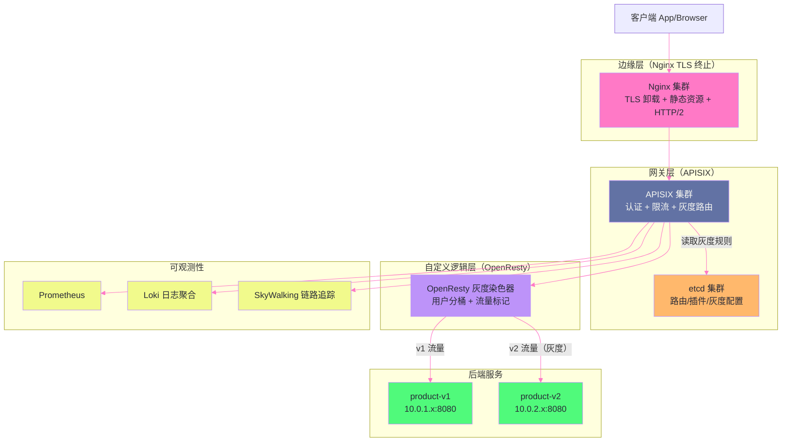

# 15 生产实战：完整流量链路与专栏知识体系总结

## 摘要

本篇作为专栏的收尾，以一个真实的大型互联网系统为背景，将前 14 篇的知识点串联在一个完整的实战场景中：**一次新版本的灰度发布全过程**。从 Nginx TLS 终止层接收外部请求，到 APISIX 执行动态路由和插件链，再到 OpenResty 自定义的灰度染色逻辑，以及每个环节的可观测性配置。在此之后，本文以知识图谱的形式梳理整个专栏的核心概念体系，帮助读者建立系统性的认知框架，并指出进阶方向。

---

## 第 1 章 场景设定：一次完整的灰度发布

### 1.1 业务背景

假设我们负责一个电商平台的核心服务：**商品详情页 API**（GET /api/product/:id）。这个接口每天承载数亿次调用，是用户购物链路的关键节点。现在，后端团队开发了 v2 版本，带来了显著的性能优化，但同时引入了响应字段的变化（某些字段的格式从 int 改为 string）。

我们需要实施一次**安全的灰度发布**：
- 先将 1% 的流量切给 v2，验证基础功能正常
- 稳定后逐步扩大到 5%、10%、50%、100%
- 若发现异常，能在 10 秒内完全回滚到 v1
- 灰度期间，同一用户始终命中同一版本（用户粘性，避免体验跳变）

### 1.2 整体架构图



---

## 第 2 章 边缘层：Nginx TLS 终止配置

### 2.1 边缘 Nginx 的职责

边缘层的 Nginx 承担三个职责：

1. **TLS 卸载**：处理所有 HTTPS 握手和加解密，内部流量统一走 HTTP（降低后端 CPU 负担）
2. **静态资源服务**：直接服务 CDN 未命中的静态资源（JS/CSS/图片），不穿透到后端
3. **HTTP/2 → HTTP/1.1 转换**：外部 HTTP/2 连接在 Nginx 终止，内部向 APISIX 使用 HTTP/1.1（APISIX 内部通信效率更高且避免 HTTP/2 的头部压缩开销）

```nginx
# /etc/nginx/nginx.conf（边缘 Nginx 配置）

worker_processes auto;
worker_cpu_affinity auto;
worker_rlimit_nofile 1048576;

events {
    use epoll;
    worker_connections 65535;
    multi_accept on;
}

http {
    # 全局 TLS 会话缓存（减少握手开销）
    ssl_session_cache   shared:SSL:50m;
    ssl_session_timeout 1d;
    ssl_session_tickets on;

    # 全局 TLS 协议限制
    ssl_protocols TLSv1.2 TLSv1.3;
    ssl_ciphers 'ECDHE-ECDSA-AES128-GCM-SHA256:ECDHE-RSA-AES128-GCM-SHA256:ECDHE-ECDSA-CHACHA20-POLY1305:ECDHE-RSA-CHACHA20-POLY1305';
    ssl_prefer_server_ciphers on;

    # 传输层优化（第 10 篇）
    sendfile            on;
    sendfile_max_chunk  512k;
    tcp_nopush          on;
    tcp_nodelay         on;

    # 文件缓存（第 10 篇）
    open_file_cache max=2000 inactive=20s;
    open_file_cache_valid 30s;

    # 结构化日志（第 09 篇）
    log_format json_edge escape=json
        '{"ts":"$time_iso8601",'
        '"req_id":"$request_id",'
        '"remote":"$remote_addr",'
        '"method":"$request_method",'
        '"uri":"$uri",'
        '"status":$status,'
        '"bytes":$body_bytes_sent,'
        '"rt":$request_time,'
        '"ssl":"$ssl_protocol/$ssl_cipher"}';

    access_log /var/log/nginx/edge.log json_edge buffer=64k flush=5s;

    # HTTP → HTTPS 重定向
    server {
        listen 80 default_server;
        return 301 https://$host$request_uri;
    }

    # 拒绝未知 Host（安全加固，第 11 篇）
    server {
        listen 443 ssl default_server;
        ssl_certificate     /etc/nginx/ssl/default.crt;
        ssl_certificate_key /etc/nginx/ssl/default.key;
        return 444;
    }

    # 主站 HTTPS
    server {
        listen 443 ssl http2 reuseport backlog=65535;
        server_name api.example.com;

        ssl_certificate     /etc/nginx/ssl/api.example.com.crt;
        ssl_certificate_key /etc/nginx/ssl/api.example.com.key;

        # OCSP Stapling（第 06 篇）
        ssl_stapling on;
        ssl_stapling_verify on;
        ssl_trusted_certificate /etc/nginx/ssl/chain.pem;
        resolver 8.8.8.8 valid=300s;

        ssl_buffer_size 4k;  # API 小响应场景，降低 TTFB

        # 安全响应头（第 11 篇）
        add_header Strict-Transport-Security "max-age=31536000; includeSubDomains" always;
        add_header X-Content-Type-Options "nosniff" always;
        add_header X-Frame-Options "SAMEORIGIN" always;
        server_tokens off;

        # 静态资源：直接服务
        location ^~ /static/ {
            root /var/www/assets;
            expires 1y;
            add_header Cache-Control "public, immutable" always;
            access_log off;
        }

        # API 请求：转发给 APISIX
        location /api/ {
            proxy_pass http://apisix_cluster;
            proxy_http_version 1.1;
            proxy_set_header Connection "";
            proxy_set_header Host $host;
            proxy_set_header X-Real-IP $remote_addr;
            proxy_set_header X-Forwarded-For $proxy_add_x_forwarded_for;
            proxy_set_header X-Forwarded-Proto $scheme;
            # 将 Request ID 传递给下游（链路追踪，第 09 篇）
            proxy_set_header X-Request-Id $request_id;

            proxy_connect_timeout 3s;
            proxy_send_timeout    30s;
            proxy_read_timeout    30s;

            proxy_next_upstream error timeout http_502 http_503 http_504;
            proxy_next_upstream_tries 2;
        }
    }

    # APISIX 上游集群
    upstream apisix_cluster {
        least_conn;
        server 10.1.0.1:9080 max_fails=3 fail_timeout=10s;
        server 10.1.0.2:9080 max_fails=3 fail_timeout=10s;
        server 10.1.0.3:9080 max_fails=3 fail_timeout=10s;
        keepalive 64;
        keepalive_requests 500;
    }
}
```

**关键设计决策分析**：

**为什么边缘 Nginx 用 `least_conn` 而非 `round-robin` 连接 APISIX**：

APISIX 节点内部需要执行多个插件（JWT 验证、限流计数、链路追踪），不同请求的处理时间差异较大（复杂 JWT 验证耗时可能是简单健康检查的 10 倍以上）。`least_conn` 根据当前活跃连接数分发请求，避免某个 APISIX 节点因处理复杂请求而积压队列。

---

## 第 3 章 网关层：APISIX 灰度路由配置

### 3.1 在 etcd 中配置灰度路由

灰度发布的核心是**流量分割**。APISIX 提供了 `traffic-split` 插件，支持按权重将流量分发到不同的 upstream：

```bash
# 通过 Admin API 创建灰度路由（初始 1% 流量给 v2）
curl -X PUT http://apisix-admin:9180/apisix/admin/routes/product-api \
  -H "X-API-KEY: ${APISIX_ADMIN_KEY}" \
  -H "Content-Type: application/json" \
  -d '{
    "id": "product-api",
    "uri": "/api/product/*",
    "host": "api.example.com",
    "methods": ["GET"],
    "plugins": {
      "jwt-auth": {},
      "limit-req": {
        "rate": 5000,
        "burst": 500,
        "key": "consumer_name",
        "rejected_code": 429
      },
      "traffic-split": {
        "rules": [
          {
            "weighted_upstreams": [
              { "upstream_id": "product-v1", "weight": 99 },
              { "upstream_id": "product-v2", "weight": 1  }
            ]
          }
        ]
      },
      "skywalking": {
        "sample_ratio": 1
      }
    }
  }'
```

**动态调整灰度比例（无需 reload）**：

```bash
# 将灰度比例从 1% 扩大到 10%（只更新 traffic-split 插件配置）
curl -X PATCH http://apisix-admin:9180/apisix/admin/routes/product-api \
  -H "X-API-KEY: ${APISIX_ADMIN_KEY}" \
  -H "Content-Type: application/json" \
  -d '{
    "plugins": {
      "traffic-split": {
        "rules": [
          {
            "weighted_upstreams": [
              { "upstream_id": "product-v1", "weight": 90 },
              { "upstream_id": "product-v2", "weight": 10 }
            ]
          }
        ]
      }
    }
  }'
# 这个 PATCH 请求写入 etcd，所有 APISIX Worker 在 ~50ms 内生效
# 整个过程零停机，零 reload
```

### 3.2 APISIX 插件执行链路分析

对于一个 GET /api/product/12345 的请求，APISIX 的插件执行顺序如下：

```
请求到达 APISIX Worker（OpenResty 事件循环）

Phase: rewrite
  └── proxy-rewrite（priority 1008）：URI 路径重写（如有）

Phase: access
  ├── real-ip（priority 2931）：从 X-Forwarded-For 提取真实 IP
  ├── jwt-auth（priority 2510）：验证 JWT Token
  │   ├── 从 Authorization 头提取 Bearer Token
  │   ├── 验证签名（LuaJIT 执行，FFI 调用 OpenSSL）
  │   ├── 验证过期时间
  │   └── 将 consumer 信息写入 ctx（供后续插件使用）
  └── limit-req（priority 1001）：限流检查
      ├── 读取 consumer_name 作为 key
      ├── 查询 ngx.shared.DICT（漏桶计数器）
      └── 超限时返回 429

Phase: before_proxy
  └── traffic-split（执行灰度路由决策）
      ├── 生成 [0, 100) 的随机数（或基于 Hash）
      ├── 随机数 < 10 → 选择 product-v2 upstream
      └── 随机数 >= 10 → 选择 product-v1 upstream

Phase: content（proxy 转发）
  └── balancer_by_lua：执行所选 upstream 的负载均衡
      ├── 从 upstream 节点列表中选择一台（round-robin 或 least_conn）
      ├── 检查健康状态（ngx.shared.DICT 中的健康检查结果）
      └── 调用 ngx.balancer.set_current_peer 设置目标地址

  → 向后端发送请求（cosocket + keepalive 连接池）

Phase: header_filter
  └── skywalking（priority 6）：注入链路追踪 Header

Phase: log
  ├── skywalking：上报 Span 数据
  └── prometheus（priority 1003）：记录 Prometheus 指标
      ├── apisix_http_requests_total（请求计数）
      └── apisix_http_latency（延迟直方图）
```

### 3.3 用户粘性灰度：基于用户 ID 的一致性分桶

`traffic-split` 的随机权重是无状态的——同一用户可能第一次请求命中 v1，下次命中 v2，体验不一致。对于需要**用户粘性**的灰度，需要基于用户 ID 做一致性哈希分桶。

APISIX 的 `traffic-split` 支持基于变量的条件分流，但用户 ID 哈希需要自定义 OpenResty 逻辑：

```lua
-- /usr/local/apisix/plugins/user-canary.lua
-- 自定义 APISIX 插件：基于用户 ID 哈希的粘性灰度

local core = require("apisix.core")

local _M = {
    version = 0.1,
    priority = 990,  -- 在 limit-req 之后、proxy 之前执行
    name = "user-canary",
    schema = {
        type = "object",
        properties = {
            canary_percentage = {
                type = "integer",
                minimum = 0,
                maximum = 100,
                description = "灰度流量百分比（0-100）"
            },
            canary_upstream = {
                type = "string",
                description = "灰度版本的 upstream id"
            }
        },
        required = {"canary_percentage", "canary_upstream"}
    }
}

function _M.access(conf, ctx)
    -- 从 JWT 中提取用户 ID（由 jwt-auth 插件写入 ctx）
    local user_id = ctx.consumer_name
    if not user_id then
        -- 未认证用户不参与灰度，使用默认 upstream
        return
    end

    -- 一致性哈希：对用户 ID 取 CRC32，映射到 [0, 100)
    local hash = ngx.crc32_short(user_id) % 100

    if hash < conf.canary_percentage then
        -- 此用户命中灰度：修改 upstream
        ctx.upstream_id = conf.canary_upstream
        -- 在响应头中标记（便于客户端感知和 A/B 测试数据收集）
        ctx.canary_version = "v2"
        core.log.info("user ", user_id, " (hash=", hash, ") routed to canary")
    end
end

function _M.header_filter(conf, ctx)
    if ctx.canary_version then
        core.response.set_header("X-Canary-Version", ctx.canary_version)
    end
end

return _M
```

**基于 CRC32 哈希的用户分桶为什么能保证粘性**：

用户 ID 是固定不变的，`ngx.crc32_short(user_id)` 对相同输入始终返回相同的哈希值。因此，用户 A 的哈希值 `h_A` 是固定的：
- 如果 `h_A < canary_percentage`（如 5%），用户 A **始终**命中灰度 v2
- 如果 `h_A >= canary_percentage`，用户 A **始终**命中 v1

当我们把 `canary_percentage` 从 1% 扩大到 10% 时：
- 原来命中灰度的用户（哈希值 0-0）依然命中
- 新增 1-9 的用户也加入灰度
- 扩大灰度是**单调的**（不会让已进入灰度的用户回退到 v1）

---

## 第 4 章 后端健康监控：主动检测与快速回滚

### 4.1 APISIX 主动健康检查配置（第 14 篇的实际应用）

```bash
# 配置 product-v2 upstream，启用主动健康检查
curl -X PUT http://apisix-admin:9180/apisix/admin/upstreams/product-v2 \
  -H "X-API-KEY: ${APISIX_ADMIN_KEY}" \
  -H "Content-Type: application/json" \
  -d '{
    "id": "product-v2",
    "type": "roundrobin",
    "nodes": {
      "10.0.2.1:8080": 1,
      "10.0.2.2:8080": 1
    },
    "checks": {
      "active": {
        "type": "http",
        "http_path": "/healthz",
        "timeout": 1,
        "healthy": {
          "interval": 5,
          "successes": 2,
          "http_statuses": [200, 204]
        },
        "unhealthy": {
          "interval": 1,
          "http_failures": 3,
          "tcp_failures": 2,
          "http_statuses": [500, 502, 503, 504]
        }
      }
    },
    "retries": 2,
    "timeout": {
      "connect": 3,
      "send": 30,
      "read": 30
    }
  }'
```

### 4.2 灰度回滚的操作流程

当监控系统检测到 v2 错误率异常升高（如 5xx 率从 0.01% 升到 2%），触发告警，SRE 执行快速回滚：

```bash
# 紧急回滚：将 traffic-split 权重改为 v2=0（完全切回 v1）
curl -X PATCH http://apisix-admin:9180/apisix/admin/routes/product-api \
  -H "X-API-KEY: ${APISIX_ADMIN_KEY}" \
  -H "Content-Type: application/json" \
  -d '{
    "plugins": {
      "traffic-split": {
        "rules": [
          {
            "weighted_upstreams": [
              { "upstream_id": "product-v1", "weight": 100 },
              { "upstream_id": "product-v2", "weight": 0   }
            ]
          }
        ]
      }
    }
  }'
```

这个 PATCH 写入 etcd 后，所有 APISIX Worker 在约 50ms 内同步生效。从触发告警到完成回滚的整个操作，端到端不超过 10 秒（人工操作 + 配置推送 + Worker 同步）。

---

## 第 5 章 可观测性：三大支柱的完整配置

### 5.1 Metrics（指标）：Prometheus 集成

APISIX 内置了 `prometheus` 插件，暴露标准的 Prometheus 格式指标：

```bash
# 启用全局 prometheus 插件
curl -X PUT http://apisix-admin:9180/apisix/admin/global_rules/prometheus \
  -H "X-API-KEY: ${APISIX_ADMIN_KEY}" \
  -d '{
    "id": "prometheus",
    "plugins": {
      "prometheus": {
        "prefer_name": true
      }
    }
  }'
```

**关键指标及其在灰度发布中的用途**：

```
apisix_http_requests_total{route="product-api", status="200"}
  → 按路由统计请求量，区分 v1/v2 的成功率

apisix_http_latency_bucket{route="product-api", le="0.1"}
  → P99 延迟监控（le=0.1 表示 100ms 以内的请求比例）

apisix_upstream_status{upstream="product-v2", address="10.0.2.1:8080"}
  → v2 节点的健康状态（1=健康，0=不健康）

# 告警规则（Prometheus AlertManager）
- alert: ProductV2HighErrorRate
  expr: |
    rate(apisix_http_requests_total{route="product-api", status=~"5.."}[5m])
    /
    rate(apisix_http_requests_total{route="product-api"}[5m])
    > 0.02  # 5xx 率超过 2%
  for: 1m
  labels:
    severity: critical
  annotations:
    summary: "product-v2 error rate too high, trigger rollback"
```

### 5.2 Logging（日志）：结构化日志聚合

结合第 09 篇的日志体系，为灰度发布添加专项日志字段：

```nginx
# APISIX 的 nginx.conf（自定义 log_format）
log_format apisix_json escape=json
    '{"req_id":"$request_id",'
    '"route_id":"$route_id",'
    '"upstream":"$upstream_addr",'
    '"canary":"$http_x_canary_version",'
    '"status":$status,'
    '"rt":$request_time,'
    '"urt":"$upstream_response_time"}';
```

**Loki 查询：分析灰度版本的错误分布**：

```logql
# 查询过去 30 分钟 v2 灰度版本的 5xx 请求
{job="apisix"}
  | json
  | canary = "v2"
  | status >= 500
  | line_format "{{.req_id}} {{.upstream}} {{.status}} {{.rt}}"
```

### 5.3 Tracing（链路追踪）：SkyWalking 集成

APISIX 的 `skywalking` 插件自动为每个请求生成 Span，并将 Trace ID 注入请求头传递给后端：

```
完整的链路追踪数据流：

浏览器 → Nginx 边缘层 → APISIX 网关 → 后端服务 → 数据库

SkyWalking Span 层级：
  Span 0（APISIX）：
    traceId: abc123
    spanId: 0
    operationName: /api/product/12345
    duration: 45ms
    tags: {canary_version: v2, upstream: 10.0.2.1:8080}

  Span 1（product-v2 服务）：
    traceId: abc123
    spanId: 1
    parentSpanId: 0
    operationName: ProductService.getProduct
    duration: 40ms

  Span 2（MySQL 查询）：
    traceId: abc123
    spanId: 2
    parentSpanId: 1
    operationName: SELECT * FROM products
    duration: 5ms
```

通过 Trace ID（等同于第 09 篇的 `$request_id`）可以在 SkyWalking UI 中看到完整的请求调用链，精确定位 v2 版本的性能瓶颈。

---

## 第 6 章 专栏知识体系总结

### 6.1 核心知识图谱

本专栏 15 篇文章构成了一个完整的 Nginx 生态知识体系，按从底层到上层的方式排列：

**底层基础（第 01-03 篇）——理解 Nginx 为什么快**

- **事件驱动模型**（第 01 篇）：epoll 的 ET 模式、Master-Worker 进程架构、惊群问题与 SO_REUSEPORT——这三个概念共同解释了 Nginx 单进程能承载数万并发连接的根本原因
- **配置体系**（第 02 篇）：指令继承的四种合并类型、变量的延迟求值、server_name 的五级匹配优先级——这是读懂任何 Nginx 配置的基础
- **HTTP 处理管道**（第 03 篇）：11 个 Phase 的职责和执行顺序——理解这个管道是理解 location 匹配、rewrite、access 控制为何有时序关系的钥匙

**中间层进阶（第 04-10 篇）——掌握 Nginx 的生产能力**

- **upstream 模块**（第 04 篇）：双 TCP 连接模型、keepalive 连接池原理、五种负载均衡算法的数学本质、被动健康检查的状态机
- **proxy_cache**（第 05 篇）：两级存储模型（内存 Zone + 磁盘文件）、MD5 哈希映射到多级目录、三种失效维度的精确语义差异
- **TLS 卸载**（第 06 篇）：TLS 1.2 vs 1.3 握手的本质差异、Session Ticket 的分布式扩展优势、OCSP Stapling 的隐私价值
- **Location 匹配**（第 07 篇）：两阶段决策算法、`^~` 的特殊语义、PCRE JIT 加速、命名 location 的安全边界
- **限流**（第 08 篇）：漏桶算法的数学模型、`burst` 的真实语义（排队缓冲而非令牌）、`nodelay` 如何将漏桶变令牌桶
- **日志与可观测性**（第 09 篇）：`$request_time` vs `$upstream_response_time` 的精确诊断语义、`$request_id` 全链路追踪实现
- **性能调优**（第 10 篇）：四层连接数限制的协调配置、sendfile/tcp_nopush/tcp_nodelay 的协议栈工作原理、open_file_cache 的系统调用减少机制

**安全与可编程（第 11-14 篇）——构建生产级系统**

- **安全加固**（第 11 篇）：Host Header 注入的攻击链与 `$host` vs `$http_host` 的本质差异、CSP 的分层防御体系、ModSecurity WAF 的集成
- **OpenResty 架构**（第 12 篇）：LuaJIT 三级执行模型、cosocket 将协程 yield/resume 与 epoll 融合的本质、Phase Hook 体系
- **OpenResty 实战**（第 13 篇）：两级缓存模型的工程实现、五大性能陷阱（正则编译、全局变量、阻塞调用、table 创建、cjson.null）
- **APISIX 架构**（第 14 篇）：etcd watch-and-sync 的配置推送模型、radixtree 路由引擎、插件优先级体系设计逻辑

### 6.2 贯穿全篇的核心设计哲学

回顾整个专栏，Nginx 生态的设计决策背后有几条一以贯之的哲学：

**哲学一：事件驱动是一切高性能的根基**

从 epoll（第 01 篇）到 cosocket（第 12 篇），再到 APISIX 的 etcd Watch（第 14 篇），Nginx 生态始终坚持：**不阻塞事件循环**是性能的第一原则。任何可能阻塞的操作（网络 I/O、磁盘 I/O、锁等待）都通过协程挂起的方式转化为事件回调，让 CPU 在等待期间处理其他请求。

**哲学二：配置驱动与代码驱动的边界**

Nginx 的 nginx.conf 是声明式配置（定义规则，框架执行），而 OpenResty 的 Lua 代码是命令式编程（定义逻辑，自己控制流程）。当业务逻辑超出声明式配置的表达力时（如动态路由、JWT 解析、外部服务调用），才引入命令式代码；能用配置解决的，不用代码。这保持了系统的可维护性和可预测性。

**哲学三：数据面与控制面分离**

APISIX 将路由配置存储在 etcd（控制面），Worker 实时同步并缓存（数据面），两者解耦。这个设计使得：控制面的变更不影响数据面的稳定性；控制面故障时，数据面用缓存继续服务；数据面的扩容不需要修改控制面。这是云原生系统设计的核心模式，在 [[Kubernetes]] 的 etcd + kube-apiserver + kubelet 架构中也有相同的体现。

**哲学四：性能优化是一个完整的栈**

第 10 篇的性能调优展示了一个典型的分层分析思维：应用层配置（`worker_processes`）→ 系统调用层（`sendfile`）→ 内核参数（`net.core.somaxconn`）→ 硬件特性（NUMA、CPU Cache）。任何单一层面的优化都可能被其他层面的瓶颈限制，系统性能调优需要整栈思考。

### 6.3 进阶方向

本专栏覆盖了 Nginx 生态的核心知识，对于希望进一步深入的读者，以下方向值得探索：

**方向一：深入 Nginx 源码**

阅读 Nginx 源码是理解其工作原理最直接的方式。推荐从以下模块入手：
- `ngx_event.c` / `ngx_epoll_module.c`：epoll 事件循环的实现
- `ngx_http_request.c`：HTTP 请求的生命周期管理
- `ngx_http_upstream.c`：upstream 连接池和负载均衡的实现

参考书目：《深入理解 Nginx》（陶辉著）、《Nginx 源码分析》

**方向二：APISIX 的生产运维**

- APISIX 的 Kubernetes Ingress Controller（使用 APISIX 作为 K8s 的 Ingress）
- APISIX 的 etcd 集群高可用配置（etcd 的 Raft 共识、节点选举、备份恢复）
- APISIX 的多集群联邦（跨 IDC 的路由同步）

**方向三：eBPF 与下一代网络加速**

eBPF（Extended Berkeley Packet Filter）允许在内核中运行沙箱程序，可以在不修改内核代码的情况下实现网络数据包的旁路加速（bypassing Nginx）。在 XDP（eXpress Data Path）模式下，数据包在网卡驱动层就被处理，不进入内核协议栈，延迟可以达到纳秒级。这是 Nginx 性能的终极挑战者，也是服务网格（Service Mesh）中 [[Cilium]] 等项目的技术基础。

**方向四：Wasm（WebAssembly）扩展**

Envoy Proxy（CNCF 项目，是 Istio 服务网格的数据面）支持通过 WebAssembly 插件扩展，兼容 Proxy-Wasm 标准。APISIX 3.x 也开始实验性支持 Wasm 插件。相比 Lua，Wasm 插件可以用任何支持 Wasm 目标的语言编写（Rust、Go、C++），且有更严格的内存安全隔离。这可能是网关插件体系的下一代技术方向。

---

## 第 7 章 FAQ：生产中的高频问题

### 7.1 502 Bad Gateway 的诊断流程

502 是生产中最常见的 Nginx 错误，诊断思路：

```
502 诊断决策树：

Step 1：检查 error_log
  grep "502" /var/log/nginx/error.log | tail -20
  常见错误：
  - "connect() failed (111: Connection refused)"
    → 后端进程未启动，或监听端口错误
  - "recv() failed (104: Connection reset by peer)"
    → 后端进程强制关闭连接（崩溃、内存溢出、被 OOM Kill）
  - "upstream timed out (110: Connection timed out) while reading response header"
    → 后端响应超时（超过 proxy_read_timeout）

Step 2：检查后端健康状态
  ss -lntp | grep :8080  # 检查后端进程是否在监听
  curl -v http://backend:8080/healthz  # 直接测试后端

Step 3：检查网络连通性
  telnet backend 8080
  netstat -an | grep 8080 | grep ESTABLISHED  # 查看已建立的连接数

Step 4：检查 upstream 健康检查状态（如果配置了）
  # Nginx: 查看是否触发了 passive health check
  grep "upstream is unhealthy" /var/log/nginx/error.log
```

### 7.2 upstream 连接数耗尽的信号与处理

```bash
# 信号：access_log 中大量 502，error_log 中出现：
# "no live upstreams while connecting to upstream"
# 所有后端都被标记为不可用

# 检查当前与后端的连接状态
ss -tn | grep :8080 | awk '{print $1}' | sort | uniq -c
# 输出各状态（ESTABLISHED、TIME_WAIT、CLOSE_WAIT）的连接数

# 如果 CLOSE_WAIT 很多：说明后端关闭了连接但 Nginx 没有及时关闭
# 解决：确保 proxy_http_version 1.1 + proxy_set_header Connection ""

# 如果 TIME_WAIT 很多：短连接场景，需要 tcp_tw_reuse=1
sysctl -w net.ipv4.tcp_tw_reuse=1
```

### 7.3 Nginx reload 期间的请求丢失问题

```bash
# nginx -s reload 的流程（第 01 篇复习）：
# 1. Master 向老 Worker 发送 SIGQUIT（优雅关闭）
# 2. Master 启动新 Worker（加载新配置）
# 3. 老 Worker 等待当前请求处理完毕后退出

# 理论上 reload 不丢请求，但以下情况会导致丢失：
# 1. proxy_read_timeout 期间 reload：老 Worker 收到 SIGQUIT，
#    如果在等待后端响应时间超过 proxy_read_timeout，连接会被强制关闭
# 解决：reload 前确认当前无长时间请求；或在低峰期 reload

# 2. WebSocket 连接在 reload 时断开
# 解决：对 WebSocket location 设置 proxy_read_timeout 为足够大的值

# 监控 reload 期间的连接状态：
watch -n 1 'ss -tn | grep :80 | awk "{print \$1}" | sort | uniq -c'
```

---

## 小结

本篇通过一个完整的灰度发布场景，将专栏的 14 个知识点整合为一个连贯的工程实践：

**从边缘到后端的分层架构**：
- **Nginx 边缘层**：TLS 卸载（第 06 篇）+ 静态资源直出 + 安全加固（第 11 篇）+ Request ID 注入（第 09 篇）
- **APISIX 网关层**：JWT 认证插件 + 限流插件（第 14 篇的插件体系）+ traffic-split 灰度路由（etcd 动态推送，第 14 篇）
- **OpenResty 自定义层**：基于用户 ID CRC32 哈希的粘性灰度（cosocket + Phase Hook，第 12-13 篇）
- **后端服务层**：主动健康检查 + 快速回滚（10 秒内，无需 reload）

**可观测性三支柱**：
- **Metrics**：Prometheus + AlertManager 监控错误率和延迟，自动触发告警
- **Logging**：结构化 JSON 日志 + Loki 聚合，通过 `X-Canary-Version` 字段区分版本
- **Tracing**：SkyWalking Span 链路，通过 `$request_id` 串联跨服务的完整调用链

至此，本专栏的全部 15 篇文章均已完成。从 epoll 的事件回调（第 01 篇）到 APISIX 的 etcd watch（第 14 篇），从 worker_processes 的 CPU 亲和性（第 10 篇）到 cosocket 的协程模型（第 12 篇）——希望这套完整的知识体系，能让你在遇到 Nginx 生态的问题时，有足够的理论储备去追溯根因，而不仅仅是套用配置模板。

---

## 参考资料

- [APISIX 官方最佳实践](https://apisix.apache.org/zh/docs/apisix/best-practices/)
- [Nginx 官方文档主页](https://nginx.org/en/docs/)
- [OpenResty 官方最佳实践](https://openresty.org/en/best-practices.html)
- [eBPF 与网络加速（Cloudflare 博客）](https://blog.cloudflare.com/tag/ebpf/)
- [Proxy-Wasm 规范（WebAssembly 网关扩展）](https://github.com/proxy-wasm/spec)
