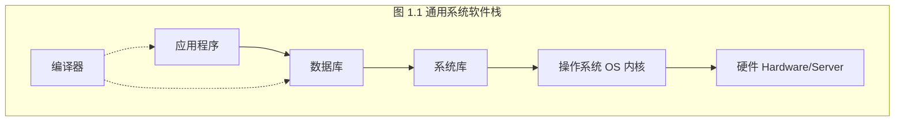
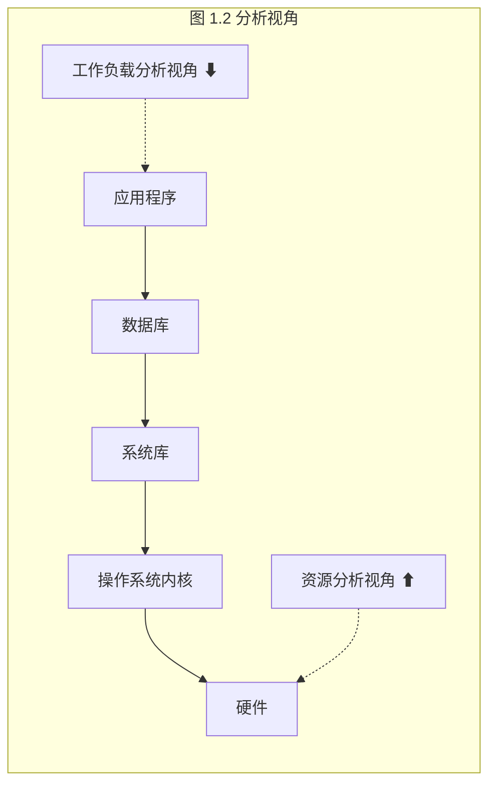
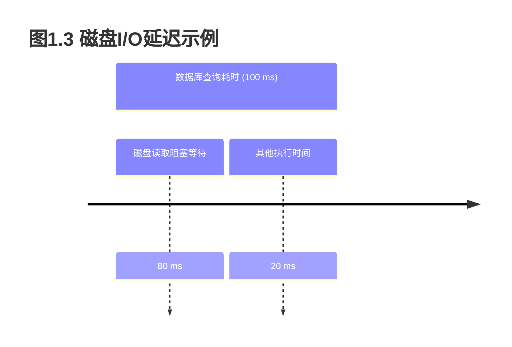
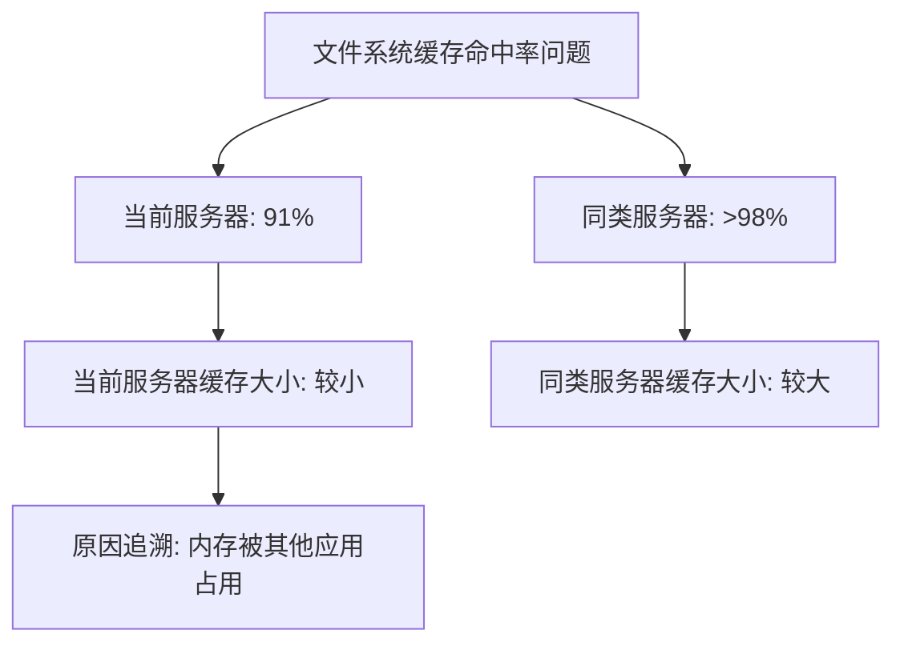
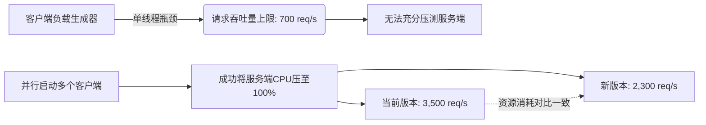

# 1.1 系统性能导论

计算机性能是一门令人兴奋、变化多端且充满挑战的学科。本章将向你介绍系统性能领域。本章的学习目标是：

- 理解系统性能、角色、活动与挑战。
- 理解可观察性工具与实验工具之间的区别。
- 对性能可观察性建立基本理解：统计学、性能剖析、火焰图、追踪、静态插桩与动态插桩。
- 学习方法论的作用以及 Linux 60秒检查清单。

文中包含了对后续章节的引用，因此本章既可以作为系统性能的入门，也可以作为本书的导览。本章最后以案例研究结尾，展示系统性能在实际中是如何运作的。

## 1.1 系统性能

系统性能研究整个计算机系统的性能，包括所有主要的软件和硬件组件。数据路径上的任何事物，从存储设备到应用软件，都被包含在内，因为它们都会影响性能。对于分布式系统，这意味着多个服务器和应用程序。

> [!TIP] 绘制你的环境图
> 如果你没有展示数据路径的环境图，请找一张或者自己画一张；这将有助于你理解组件之间的关系，并确保你不会忽略整个区域。

系统性能的典型目标是通过降低延迟来改善终端用户体验，以及降低计算成本。降低成本可以通过消除低效、提高系统吞吐量和常规调优来实现。

图 1.1 展示了单台服务器上的通用系统软件栈，包括操作系统（OS）内核，以及示例的数据库和应用层。术语“全栈”有时仅用于描述应用环境，包括数据库、应用程序和 Web 服务器。然而，当谈论系统性能时，我们使用“全栈”来指代从应用程序一直到金属（硬件）的整个软件栈，包括系统库、内核以及硬件本身。系统性能研究的就是全栈。



*图 1.1 通用系统软件栈*

编译器被包含在图 1.1 中，因为它们在系统性能中扮演着重要角色。该栈将在第 3 章“操作系统”中讨论，并在后续章节中进行更详细的探讨。以下各节将更详细地描述系统性能。

## 1.2 角色

系统性能由各种职务角色的人员共同完成，包括系统管理员、站点可靠性工程师（[[SRE]]）、应用程序开发者、网络工程师、数据库管理员、Web 管理员以及其他支持人员。对于其中许多角色而言，性能只是工作的一部分，性能分析也仅聚焦于该角色的责任领域：网络团队检查网络，数据库团队检查数据库，以此类推。对于某些性能问题，寻找根本原因或促成因素需要多个团队的协同合作。

一些公司雇佣了性能工程师，他们的主要活动就是处理性能问题。他们可以与多个团队合作，对环境进行整体研究，这种方法对于解决复杂的性能问题可能至关重要。他们还可以作为核心资源，在整个环境中寻找和开发更好的性能分析与容量规划工具。

> [!EXAMPLE] Netflix 的云性能团队
> 例如，Netflix 拥有一个云性能团队，我也是其中一员。我们协助微服务和 SRE 团队进行性能分析，并构建供所有人使用的性能工具。

雇佣多名性能工程师的公司可以让个人在一个或多个领域进行专业化，从而提供更深层次的支持。例如，一个大型性能工程团队可能包括内核性能、客户端性能、语言性能（如 Java）、运行时性能（如 [[JVM]]）、性能工具等方面的专家。

## 1.3 活动

系统性能涉及多种活动。以下是一个活动列表，这些活动也是软件项目从构思、开发到生产部署生命周期中的理想步骤。帮助执行这些活动的方法论和工具将在本书中介绍。

1. 为未来的产品设定性能目标和进行性能建模。
2. 对原型软件和硬件进行性能特征描述。
3. 在测试环境中对开发中的产品进行性能分析。
4. 对新产品版本进行非回归测试。
5. 对产品发布版进行基准测试。
6. 在目标生产环境中进行概念验证测试。
7. 在生产环境中进行性能调优。
8. 对运行中的生产软件进行监控。
9. 对生产问题进行性能分析。
10. 对生产问题进行事件复盘。
11. 开发性能工具以增强生产分析。

步骤 1 到 5 构成了传统的产品开发，无论是针对销售给客户的产品还是公司内部的服务。然后产品被发布，可能首先在目标环境（客户或本地）进行概念验证测试，或者可能直接进入部署和配置阶段。如果在目标环境中遇到问题（步骤 6 到 9），这意味着该问题在开发阶段没有被检测到或修复。

> [!IMPORTANT] 前置性能工程的重要性
> 性能工程理想情况下应该在选择任何硬件或编写任何软件之前开始：第一步应该是设定目标并创建性能模型。然而，产品通常在没有这一步的情况下开发，将性能工程工作推迟到问题出现之后的某个时间。随着开发过程的每一步推进，修复由于早期架构决策引起的性能问题可能会变得越来越困难。

云计算为概念验证测试（步骤 6）提供了新技术，这些技术鼓励跳过早期步骤（步骤 1 到 5）。其中一种技术是在单个实例上以一小部分生产负载测试新软件：这被称为金丝雀测试。另一种技术将此作为软件部署的正常步骤：流量逐渐转移到新的实例池，同时让旧实例池保持在线作为备份；这被称为蓝绿部署。^1^ 有了这些“安全失败”的选项可用，新软件通常在没有经过任何事先性能分析的情况下就在生产中进行测试，并在需要时快速回滚。我建议，在实际可行时，你也应执行早期的活动，以便实现最佳性能（尽管可能由于上市时间的原因而需要更早投入生产）。

术语[[容量规划]]可以指代前面多个活动。在设计阶段，它包括研究开发软件的资源占用量，以查看设计能多大程度满足目标需求。在部署之后，它包括监控资源使用情况，以在问题发生之前进行预测。

生产问题的性能分析（步骤 9）也可能涉及站点可靠性工程师（SRE）；此步骤之后是事件复盘会议（步骤 10），以分析发生了什么、分享调试技术，并寻找在未来避免相同事件的方法。此类会议类似于开发者回顾会（关于回顾会及其反模式，请参见 [Corry 20]）。

环境和活动因公司和产品而异，在许多情况下，并非所有十个步骤都会执行。你的工作也可能仅聚焦于其中部分或仅仅其中一个活动。

## 1.4 视角

除了侧重于不同的活动外，性能角色还可以从不同的视角来看待。图 1.2 中标出了性能分析的两种视角：工作负载分析和资源分析，它们从不同的方向切入软件栈。



*图 1.2 分析视角*

[[资源分析]]视角通常由系统管理员采用，他们负责系统资源。[[工作负载分析]]视角通常由应用程序开发者采用，他们负责工作负载交付的性能。每种视角都有其自身的优势，这将在第 2 章“方法论”中详细讨论。对于具有挑战性的问题，尝试从两种视角进行分析会有所帮助。

## 1.5 性能是具有挑战性的

系统性能工程是一个充满挑战的领域，原因有很多，包括它是主观的、复杂的，可能没有单一的根本原因，并且通常涉及多个问题。

### 1.5.1 主观性

技术学科倾向于客观，以至于业界中的人以非黑即白地看待事物而闻名。软件故障排查可能就是如此，一个 bug 要么存在要么不存在，要么修复了要么没修复。此类 bug 通常表现为错误消息，可以很容易地解释和理解为存在错误。

另一方面，性能往往是主观的。对于性能问题，可能一开始就不清楚是否存在问题，如果存在，也不清楚何时算作已修复。对于一个用户来说被认为是“糟糕”性能并因此成为问题的状况，对于另一个用户来说可能被认为是“良好”的性能。

> [!QUESTION] 考虑以下信息：
> **平均磁盘 I/O 响应时间为 1 毫秒。**
> 
> 这是“好”还是“坏”？虽然响应时间（或[[延迟]]）是可用的最佳指标之一，但解释延迟信息是很困难的。在某种程度上，给定指标是“好”还是“坏”可能取决于应用程序开发者和终端用户的性能期望。

主观的性能可以通过定义明确的目标变得客观，例如设定目标平均响应时间，或者要求一定百分比的请求落在某个延迟范围内。处理这种主观性的其他方法将在第 2 章“方法论”中介绍，包括延迟分析。

### 1.5.2 复杂性

除了主观性之外，由于系统的复杂性以及缺乏明显的分析起点，性能可能成为一门具有挑战性的学科。在云计算环境中，你可能甚至不知道首先应该查看哪台服务器实例。有时我们从一个假设开始，例如归咎于网络或数据库，性能分析师必须弄清楚这是否是正确的方向。

性能问题也可能源于子系统之间复杂的交互，而这些子系统在单独分析时表现良好。这可能是由于级联故障引起的，即一个发生故障的组件导致其他组件出现性能问题。要理解由此产生的问题，你必须理清组件之间的关系并了解它们是如何起作用的。

> [!WARNING] 瓶颈转移
> 瓶颈也可能很复杂，并以意想不到的方式相互关联；修复一个瓶颈可能只是将瓶颈转移到了系统的其他地方，而整体性能并没有像预期那样得到提升。

除了系统的复杂性外，性能问题也可能是由生产负载的复杂特征引起的。这些情况可能在实验室环境中永远无法重现，或者只能间歇性重现。

解决复杂的性能问题通常需要一种整体的方法。整个系统——包括其内部和外部交互——可能都需要进行调查。这需要广泛的技能，也使得性能工程成为一项多样化且极具智力挑战性的工作。

可以使用不同的方法论来引导我们穿越这些复杂性，如……中所介绍的

第2章介绍了可用于指导我们应对这些复杂性的不同方法论；第6章到第10章包含了针对特定系统资源（CPU、内存、文件系统、磁盘和网络）的具体方法论。（关于一般复杂系统的分析，包括石油泄漏和金融系统崩溃，已经由 [Dekker 18] 进行了研究。）

在某些情况下，性能问题可能是由这些资源之间的交互引起的。

### 1.5.3 多重原因

某些性能问题并没有单一的根本原因，而是由多个促发因素共同导致的。想象这样一个场景：三个正常事件同时发生并组合导致了性能问题：其中每一个都是孤立来看不属于根本原因的正常事件。

除了多重原因之外，还可能存在多重性能问题。

### 1.5.4 多重性能问题

发现一个性能问题通常不是难点；在复杂的软件中，往往存在许多问题。为了说明这一点，试着查找你的操作系统或应用程序的错误数据库，并搜索“performance（性能）”这个词。你可能会感到惊讶！通常，会有许多已知但尚未修复的性能问题，即使在被认为是高性能的成熟软件中也是如此。这在分析性能时带来了另一个困难：真正的任务不是找到问题；而是识别出哪个或哪些问题最为重要。

为此，性能分析师必须量化问题的严重程度。某些性能问题可能不适用于你的工作负载，或者只在极小程度上适用。理想情况下，你不仅要量化这些问题，还要估算每个问题可能带来的潜在加速比。当管理层寻找花费工程或运营资源的正当理由时，这些信息会非常有价值。

一种非常适合性能量化的指标（当其可用时）就是延迟。

## 1.6 延迟

[[延迟]]（Latency）是衡量等待时间的指标，是一项核心的性能指标。从广义上讲，它可以指任何操作完成所需的时间，例如应用程序请求、数据库查询、文件系统操作等。例如，延迟可以表示网站从点击链接到屏幕绘制完成完全加载所需的时间。这对客户和网站提供商来说都是一项重要指标：高延迟会导致挫败感，客户可能会将业务转移到别处。

作为一种指标，延迟可以用来估算最大加速比。例如，图1.3描述了一个耗时100毫秒的数据库查询（即延迟），在此期间它花了80毫秒处于阻塞状态等待磁盘读取。消除磁盘读取（例如通过缓存）带来的最大性能提升可以这样计算：从100毫秒减少到20毫秒（100 – 80），即快了五倍（5倍）。这是估算的加速比，该计算也量化了性能问题：磁盘读取导致查询运行速度慢了多达5倍。




> [!NOTE] 图1.3 磁盘I/O延迟示例
> 此图展示了一个总耗时为100毫秒的数据库查询，其中80毫秒被阻塞等待磁盘I/O读取，其余20毫秒为其他处理时间。

使用其他指标时，这样的计算是无法完成的。例如，每秒I/O操作数（[[IOPS]]）取决于I/O的类型，通常无法直接比较。如果某项更改使IOPS速率降低了80%，则很难知道对性能会有什么影响。IOPS可能减少了5倍，但如果每个I/O的大小（字节数）增加了10倍呢？

如果没有限定词，延迟也可能存在歧义。例如，在网络中，延迟可以指建立连接的时间，而不包括数据传输时间；它也可以指连接的总持续时间，包括数据传输（例如，[[DNS]]延迟通常以这种方式测量）。在本书中，我将尽可能使用澄清性的术语：前面的例子最好分别描述为连接延迟和请求延迟。延迟术语也将在每章的开头进行总结。

虽然延迟是一个有用的指标，但它并不总是在需要的时间和地点可用。某些系统区域仅提供平均延迟；有些则根本不提供延迟测量。随着基于[[BPF]]²的可观测性工具的可用性，现在可以从自定义的任意关注点测量延迟，并提供显示延迟完整分布的数据。

> [!INFO] 脚注说明
> ² BPF 现在是一个名称，不再是缩写（最初代表 Berkeley Packet Filter，伯克利包过滤器）。

## 1.7 可观测性

[[可观测性]]（Observability）是指通过观察来理解系统，并对实现这一目标的工具进行分类。这包括使用计数器、性能分析和追踪的工具。它不包括基准测试工具，因为基准测试通过执行工作负载实验来修改系统状态。对于生产环境，应尽可能优先尝试可观测性工具，因为实验工具可能通过资源竞争干扰生产工作负载。对于空闲的测试环境，你可能希望从基准测试工具开始，以确定硬件性能。

在本节中，我将介绍计数器、指标、性能分析和追踪。我将在第4章中更详细地解释可观测性，涵盖系统级与进程级的可观测性、Linux可观测性工具及其内部原理。第5章到第11章包含了针对特定章节的可观测性部分，例如，第6.6节是关于CPU可观测性工具的。

### 1.7.1 计数器、统计与指标

应用程序和内核通常提供有关其状态和活动的数据：操作计数、字节计数、延迟测量、资源利用率和错误率。它们通常实现为在软件中硬编码的称为计数器的整数变量，其中一些是累积型的且始终递增。这些累积计数器可以在不同时间被性能工具读取，以计算统计数据：随时间变化的速率、平均值、百分位数等。

例如，`vmstat(8)` 实用程序基于 `/proc` 文件系统中的内核计数器，打印虚拟内存统计信息等内容的系统级摘要。以下 `vmstat(8)` 输出示例来自一台48核CPU的生产API服务器：

```bash
$ vmstat 1 5
procs -----------memory---------- ---swap-- -----io---- -system-- ------cpu-----
 r  b   swpd   free   buff  cache   si   so    bi    bo   in   cs us sy id wa st
19  0      0 6531592  42656 1672040    0    0     1     7   21   33 51  4 46  0  0
26  0      0 6533412  42656 1672064    0    0     0     0 81262 188942 54  4 43  0  0
62  0      0 6533856  42656 1672088    0    0     0     8 80865 180514 53  4 43  0  0
34  0      0 6532972  42656 1672088    0    0     0     0 81250 180651 53  4 43  0  0
31  0      0 6534876  42656 1672088    0    0     0     0 74389 168210 46  3 51  0  0
```

这显示系统级CPU利用率约为57%（cpu us + sy 列）。这些列将在第6章和第7章中详细解释。

[[指标]]是经过选择用于评估或监控目标的统计量。大多数公司使用监控代理定期记录选定的统计量（指标），并在图形界面中绘制它们以查看随时间的变化。监控软件还可以支持从这些指标创建自定义警报，例如在检测到问题时发送电子邮件通知工作人员。

从计数器到警报的这种层次结构如图1.4所示。图1.4作为帮助你理解这些术语的指南提供，但它们在行业中的使用并非一成不变。术语计数器、统计量和指标经常互换使用。此外，警报可以由任何层生成，而不仅仅是专门的警报系统。

作为绘制指标图表的一个例子，图1.5是观察与前面 `vmstat(8)` 输出相同服务器的基于Grafana的工具的屏幕截图。


> [!NOTE] 图1.4 性能插桩术语
> 展示了从底层的计数器，向上聚合为统计数据，筛选出指标，进行可视化绘制，并最终触发警报的层级关系。


> [!NOTE] 图1.5 系统指标GUI (Grafana)
> Grafana仪表板截图，展示了随时间变化的系统指标折线图。

这些折线图对于容量规划很有用，可帮助你预测资源何时会耗尽。

你对性能统计数据的解释将随着对其计算方式的了解而改善。统计数据，包括平均值、分布、众数和异常值，在第2章“方法论”的第2.8节“统计学”中进行了总结。

### 1.7.2 性能分析

在系统性能领域，术语性能分析通常指使用执行采样的工具：获取测量值的一个子集（样本）以描绘目标的粗略概况。[[CPU]]是常见的性能分析目标。常用的分析CPU的方法涉及对CPU上的代码路径进行定时间隔采样。

[[火焰图]]是CPU性能分析的有效可视化方式。在指标之后，CPU火焰图可以帮你找到比任何其他工具都多的性能收益。它们不仅揭示CPU问题，还揭示其他类型的问题，这些问题是通过它们留下的CPU足迹发现的。通过查找自旋路径上的CPU时间可以发现锁竞争问题；通过发现在内存分配函数（`malloc()`）中花费的过多CPU时间以及导致它们的代码路径，可以分析内存问题；通过观察缓慢或遗留代码路径上的CPU时间，可能会发现涉及网络配置错误的问题；等等。

图1.6是一个CPU火焰图示例，显示了 `iperf(1)` 网络微基准测试工具所花费的CPU周期。


> [!NOTE] 图1.6 使用火焰图进行CPU性能分析
> 火焰图示例，x轴表示CPU时间占比（宽度），y轴表示调用栈深度，颜色通常为随机暖色调以区分不同栈帧。

这个火焰图显示了在复制字节（以 `copy_user_enhanced_fast_string()` 结尾的路径）与TCP传输（左侧包含 `tcp_write_xmit()` 的塔状图）上花费了多少CPU时间。宽度与花费的CPU时间成比例，纵轴显示代码路径。

性能分析器将在第4、5和6章中解释，火焰图可视化将在第6章“CPU”的第6.7.3节“火焰图”中解释。

### 1.7.3 追踪

[[追踪]]是基于事件的记录，其中事件数据被捕获并保存以供后续分析，或即时消费以生成自定义摘要和其他操作。有用于系统调用（例如Linux的 `strace(1)`）和网络数据包（例如Linux的 `tcpdump(8)`）的专用追踪工具；以及可以分析所有软件和硬件事件执行的通用追踪工具（例如Linux的Ftrace、BCC和bpftrace）。这些全局可见的追踪器使用各种事件源，特别是静态和动态插桩，以及用于可编程性的BPF。

#### 静态插桩

[[静态插桩]]描述了添加到源代码中的硬编码软件插桩点。Linux内核中有数百个这样的点，用于插桩磁盘I/O、调度器事件、系统调用等。用于内核静态插桩的Linux技术被称为跟踪点。用户空间软件也有一种静态插桩技术，称为用户静态定义追踪（USDT）。库（例如libc）使用USDT来插桩库调用，许多应用程序使用它来插桩服务请求。

作为使用静态插桩的工具示例，`execsnoop(8)` 通过对 `execve(2)` 系统调用的跟踪点进行插桩，打印在追踪（运行）期间创建的新进程。下面显示了 `execsnoop(8)` 追踪SSH登录的过程：

# 1.1 系统性能导论

# execsnoop
```
PCOMM            PID    PPID   RET ARGS
ssh              30656  20063    0 /usr/bin/ssh 0
sshd             30657  1401     0 /usr/sbin/sshd -D -R
sh               30660  30657    0   
env              30661  30660    0 /usr/bin/env -i PATH=/usr/local/sbin:/usr/local...
run-parts        30661  30660    0 /bin/run-parts --lsbsysinit /etc/update-motd.d
00-header        30662  30661    0 /etc/update-motd.d/00-header
uname            30663  30662    0 /bin/uname -o
uname            30664  30662    0 /bin/uname -r
uname            30665  30662    0 /bin/uname -m
10-help-text     30666  30661    0 /etc/update-motd.d/10-help-text
50-motd-news     30667  30661    0 /etc/update-motd.d/50-motd-news
cat              30668  30667    0 /bin/cat /var/cache/motd-news
cut              30671  30667    0 /usr/bin/cut -c -80
tr               30670  30667    0 /usr/bin/tr -d \000-\011\013\014\016-\037
head             30669  30667    0 /usr/bin/head -n 10
80-esm           30672  30661    0 /etc/update-motd.d/80-esm
lsb_release      30673  30672    0 /usr/bin/lsb_release -cs
[...]
```

这对于揭示可能被其他[[可观察性]]工具（如 `top(1)`）遗漏的短生命周期进程特别有用。这些短生命周期进程可能成为性能问题的根源。有关 [[tracepoints]] 和 [[USDT 探针]]的更多信息，请参见第 4 章。

## 动态插桩

动态插桩是在软件运行后，通过修改内存中的指令来插入插桩例程，从而创建插桩点。这类似于调试器如何在运行中的软件的任何函数上插入断点。调试器在命中断点时将执行流传递给交互式调试器，而动态插桩则运行一个例程，然后继续执行目标软件。这种能力允许从任何运行的软件中创建自定义的性能统计信息。以前由于缺乏可观察性而无法解决或极难解决的问题，现在可以得到修复。

动态插桩与传统观察方式如此不同，以至于起初可能很难掌握它的作用。考虑一个操作系统内核：分析内核内部可能就像冒险进入一个暗室，里面放置了内核工程师认为需要蜡烛（系统计数器）的地方。动态插桩就像拥有一个手电筒，你可以将它指向任何地方。

动态插桩最早创建于 20 世纪 90 年代 [Hollingsworth 94]，伴随着使用它的工具（称为动态跟踪器，例如 kerninst [Tamches 99]）一同出现。对于 Linux，动态插桩最早于 2000 年开发 [Kleen 08]，并于 2004 年开始合并到内核中（kprobes）。然而，这些技术并不为人熟知且难以使用。当 Sun Microsystems 在 2005 年推出他们自己的版本 [[DTrace]] 时，这一切发生了改变，它易于使用且生产环境安全。我开发了许多基于 DTrace 的工具，这些工具展示了它对系统性能的重要性，这些工具得到了广泛使用，并帮助使 DTrace 和动态插桩闻名。

## BPF

[[BPF]] 最初代表 Berkeley Packet Filter（伯克利数据包过滤器），目前正在为 Linux 上最新的动态跟踪工具提供动力。BPF 起初是作为一个内核内微型虚拟机，用于加速 `tcpdump(8)` 表达式的执行。自 2013 年以来，它已被扩展（因此有时被称为 eBPF^3），成为一个通用的内核内执行环境，提供安全性并快速访问资源。在它的许多新用途中，包括跟踪工具，它为 BPF Compiler Collection ([[BCC]]) 和 [[bpftrace]] 前端提供了可编程性。前面展示的 `execsnoop(8)` 就是一个 BCC 工具。^4

> [!NOTE] 脚注
> ^3 eBPF 最初用于描述这种扩展的 BPF；然而，该技术现在简称为 BPF。
> ^4 我最初为 DTrace 开发了它，后来我也为其他跟踪器（包括 BCC 和 bpftrace）开发了它。

第 3 章解释了 BPF，第 15 章介绍了 BPF 跟踪前端：BCC 和 bpftrace。其他章节在其可观察性部分介绍了许多基于 BPF 的跟踪工具；例如，CPU 跟踪工具包含在第 6 章 CPU 的第 6.6 节可观察性工具中。我之前也出版过关于跟踪工具的书籍（关于 DTrace 的 [Gregg 11a] 和关于 BPF 的 [Gregg 19]）。

`perf(1)` 和 [[Ftrace]] 也是跟踪器，具有与 BPF 前端某些类似的功能。`perf(1)` 和 Ftrace 将在第 13 章和第 14 章中介绍。

## 1.8 实验

除了可观察性工具之外，还有实验工具，其中大部分是基准测试工具。它们通过向系统施加合成工作负载并测量其性能来执行实验。这必须谨慎进行，因为实验工具可能会干扰被测系统的性能。

宏基准测试工具模拟真实世界的工作负载，例如客户端发出应用程序请求；而微基准测试工具测试特定组件，例如 CPU、磁盘或网络。打个比方：汽车在拉古纳塞卡赛道的单圈时间可以被视为宏基准测试，而其最高速度和 0 到 60 英里/小时的加速时间可以被视为微基准测试。两种基准测试都很重要，尽管微基准测试通常更容易调试、重复和理解，并且更稳定。

以下示例在一台空闲服务器上使用 `iperf(1)` 与另一台远程空闲服务器执行 TCP 网络吞吐量微基准测试。此基准测试运行了十秒（`-t 10`）并产生每秒的平均值（`-i 1`）：

```bash
# iperf -c 100.65.33.90 -i 1 -t 10
------------------------------------------------------------
Client connecting to 100.65.33.90, TCP port 5001
TCP window size: 12.0 MByte (default)
------------------------------------------------------------
[  3] local 100.65.170.28 port 39570 connected with 100.65.33.90 port 5001
[ ID] Interval       Transfer     Bandwidth
[  3]  0.0- 1.0 sec   582 MBytes  4.88 Gbits/sec
[  3]  1.0- 2.0 sec   568 MBytes  4.77 Gbits/sec
[  3]  2.0- 3.0 sec   574 MBytes  4.82 Gbits/sec
[  3]  3.0- 4.0 sec   571 MBytes  4.79 Gbits/sec
[  3]  4.0- 5.0 sec   571 MBytes  4.79 Gbits/sec
[  3]  5.0- 6.0 sec   432 MBytes  3.63 Gbits/sec
[  3]  6.0- 7.0 sec   383 MBytes  3.21 Gbits/sec
[  3]  7.0- 8.0 sec   388 MBytes  3.26 Gbits/sec
[  3]  8.0- 9.0 sec   390 MBytes  3.28 Gbits/sec
[  3]  9.0-10.0 sec   383 MBytes  3.22 Gbits/sec
[  3]  0.0-10.0 sec  4.73 GBytes  4.06 Gbits/sec
```

> [!INFO] 关于“带宽”与“吞吐量”的术语说明
> 输出使用了术语“Bandwidth（带宽）”，这是一种常见的误用。带宽指的是最大可能的吞吐量，而 `iperf(1)` 并未测量这个值。`iperf(1)` 测量的是其网络工作负载的当前速率：即吞吐量。^5
> ^5 原文脚注：The output uses the term “Bandwidth,” a common misuse. Bandwidth refers to the maximum possible throughput, which iperf(1) is not measuring. iperf(1) is measuring the current rate of its network workload: its throughput.

输出显示前五秒的吞吐量^5约为 4.8 Gbits/sec，之后下降到约 3.2 Gbits/sec。这是一个有趣的结果，显示了双峰吞吐量。为了提高性能，人们可能会关注 3.2 Gbits/sec 的模式，并寻找可以解释它的其他指标。

考虑仅使用可观察性工具在生产服务器上调试此性能问题的缺点。由于客户端工作负载的自然差异，网络吞吐量可能每秒都在变化，而网络底层的双峰行为可能并不明显。通过将 `iperf(1)` 与固定工作负载结合使用，您消除了客户端差异，揭示了由其他因素（例如，外部网络节流、缓冲区利用率等）引起的差异。

正如我之前建议的，在生产系统上，您应该首先尝试可观察性工具。然而，可观察性工具如此之多，以至于当实验工具能更快得出结果时，您可能会花几个小时去研究它们。多年前，一位高级性能工程师 教给我的一个比喻是：你有两只手，可观察性和实验。只使用一种类型的工具就像试图用一只手解决问题。

第 6 章到第 10 章包含有关实验工具的部分；例如，CPU 实验工具包含在第 6 章 CPU 的第 6.8 节实验中。

## 1.9 云计算

[[云计算]]是一种按需部署计算资源的方式，它通过支持将应用程序部署在越来越多的小型虚拟系统（称为实例）上，实现了应用程序的快速扩展。这减少了对严格容量规划的需求，因为可以随时从云中短时间增加更多容量。在某些情况下，它也增加了对性能分析的渴望，因为使用更少的资源可能意味着更少的系统。由于云使用通常按分钟或小时计费，性能提升导致系统减少可能意味着立即节省成本。将此场景与企业数据中心进行比较，在企业数据中心，您可能被锁定在长达数年的固定支持合同中，直到合同结束才能实现成本节约。

云计算和虚拟化带来的新困难包括管理来自其他租户的性能影响（有时称为性能隔离）以及每个租户对物理系统的可观察性。例如，除非由系统妥善管理，否则由于与邻居的争用，磁盘 I/O 性能可能很差。在某些环境中，每个租户可能无法观察到物理磁盘的真实使用情况，这使得识别此问题变得困难。

这些主题将在第 11 章 云计算 中涵盖。

## 1.10 方法论

方法论是一种记录执行系统性能各种任务推荐步骤的方式。如果没有方法论，性能调查可能会变成一次捕鱼探险：尝试随机的事情，希望能大获全胜。这可能既耗时又无效，同时会让重要区域被忽略。第 2 章 方法论 包含了一个系统性能方法论库。以下是我用于任何性能问题的第一个方法论：基于工具的检查清单。

### 1.10.1 60 秒 Linux 性能分析

这是一个基于 Linux 工具的检查清单，可以在性能问题调查的前 60 秒内执行，使用大多数 Linux 发行版应该提供的传统工具 [Gregg 15a]。表 1.1 显示了命令、要检查的内容以及本书中更详细涵盖该命令的章节。

**表 1.1 Linux 60 秒分析检查清单**

| # | 工具 | 检查内容 | 章节 |
|---|---|---|---|
| 1 | `uptime` | 平均负载，以识别负载是增加还是减少（比较 1 分钟、5 分钟和 15 分钟平均值）。 | 6.6.1 |
| 2 | `dmesg -T \| tail` | 内核错误，包括 OOM（内存不足）事件。 | 7.5.11 |
| 3 | `vmstat -SM 1` | 系统级统计信息：运行队列长度、交换、整体 CPU 使用率。 | 7.5.1 |
| 4 | `mpstat -P ALL 1` | 每 CPU 平衡：单个繁忙的 CPU 可能表示线程扩展性差。 | 6.6.3 |
| 5 | `pidstat 1` | 每进程 CPU 使用率：识别意外的 CPU 消耗者，以及每个进程的用户/系统 CPU 时间。 | 6.6.7 |
| 6 | `iostat -sxz 1` | 磁盘 I/O 统计信息：IOPS 和吞吐量、平均等待时间、繁忙百分比。 | 9.6.1 |
| 7 | `free -m` | 内存使用情况，包括文件系统缓存。 | 8.6.2 |
| 8 | `sar -n DEV 1` | 网络设备 I/O：数据包和吞吐量。 | 10.6.6 |
| 9 | `sar -n TCP,ETCP 1` | TCP 统计信息：连接速率、重传。 | 10.6.6 |
| 10 | `top` | 检查概览。 | 6.6.6 |

> [!TIP] 监控 GUI 代替 CLI
> 只要提供相同的指标，此检查清单也可以使用监控 GUI 来遵循。^6
> ^6 原文脚注：You could even make a custom dashboard for this checklist; however, bear in mind that this checklist was designed to make the most of readily available CLI tools, and monitoring products may have more (and better) metrics available. I’d be more inclined to make custom dashboards for the USE method and other methodologies.
> 您甚至可以为此检查清单制作自定义仪表板；但是，请记住，此检查清单旨在充分利用现成的 CLI 工具，而监控产品可能有更多（且更好）的可用指标。我更倾向于为 USE 方法和其他方法论制作自定义仪表板。

第 2 章 方法论 以及后续章节包含更多用于性能分析的方法论，包括 [[USE 方法]]、工作负载特征刻画、延迟分析等。

# 1.1 系统性能导论

## 1.11 案例研究

如果你刚接触系统性能领域，展示各种活动在何时以及为何执行的案例研究，可以帮助你将它们与你当前的环境联系起来。这里总结了两个假设的例子；一个是涉及磁盘 I/O 的性能问题，另一个是软件更改的性能测试。

这些案例研究描述了在本书其他章节中解释的活动。此处描述的方法也旨在展示的并不是“唯一正确的方法”或“唯一的方法”，而是一种这些性能活动可以被执行的方式，供你批判性地参考。

### 1.11.1 慢磁盘

Sumit 是一家中型公司的系统管理员。数据库团队提交了一张支持工单，抱怨他们的一台数据库服务器存在“慢磁盘”问题。

Sumit 的首要任务是了解更多关于该问题的信息，收集细节以形成问题描述。工单声称磁盘很慢，但并没有解释这是否导致了数据库问题。Sumit 通过提出以下问题作出回应：

- 目前是否存在数据库性能问题？是如何衡量的？
- 这个问题存在多久了？
- 数据库最近有什么变动吗？
- 为什么会怀疑是磁盘？

数据库团队回复说：“我们有一个记录超过 1,000 毫秒的慢查询日志。这些通常不会发生，但在过去一周中，它们已经增长到每小时几十次。AcmeMon 显示磁盘很忙。”

> [!INFO] 问题陈述确认
> 这证实了确实存在数据库问题，但同时也表明磁盘假设很可能只是一个猜测。Sumit 想检查磁盘，但他也想快速检查其他资源，以防那个猜测是错误的。

AcmeMon 是公司的基本服务器监控系统，提供基于标准操作系统指标的历史性能图表，这些指标与 `mpstat(1)`、`iostat(1)` 和系统实用程序打印出的指标相同。Sumit 登录到 AcmeMon 亲自查看。

Sumit 从一种称为 [[USE 方法]]（在第 2 章 方法论，第 2.5.9 节中定义）的方法论开始，以快速检查资源瓶颈。正如数据库团队所报告的，磁盘的利用率很高，约为 80%，而其他资源（CPU、网络）的利用率则低得多。历史数据显示，在过去一周磁盘利用率一直在稳步上升，而 CPU 利用率保持平稳。AcmeMon 不提供磁盘的饱和度或错误统计信息，因此要完成 USE 方法，Sumit 必须登录到服务器并运行一些命令。

他从 `/sys` 检查磁盘错误计数器；它们为零。他运行间隔为一秒的 `iostat(1)`，并随时间观察利用率和饱和度指标。AcmeMon 报告的利用率为 80%，但使用的是一分钟间隔。在一秒粒度下，Sumit 可以看到磁盘利用率在波动，经常达到 100% 并导致一定程度的饱和以及磁盘 I/O 延迟增加。

为了进一步确认这是否阻塞了数据库——而不是与数据库查询异步进行——他使用了一个名为 `offcputime(8)` 的 BCC/BPF 跟踪工具，以便在数据库被内核取消调度时捕获栈跟踪，以及花费在离 CPU（off-CPU）的时间。栈跟踪显示，数据库在查询期间经常在文件系统读取时阻塞。这对 Sumit 来说已经是足够的证据了。

下一个问题是为什么。磁盘性能统计数据似乎与高负载一致。Sumit 执行了[[工作负载特征刻画|工作负载表征]]以进一步了解这一点，使用 `iostat(1)` 测量 IOPS、吞吐量、平均磁盘 I/O 延迟和读/写比率。为了获取更多细节，Sumit 可以使用磁盘 I/O 跟踪；然而，他已满足于这已经指向了高磁盘负载的情况，而不是磁盘本身有问题。

> [!TIP] 工单更新
> Sumit 在工单中添加了更多细节，说明他检查了什么，并附上了用于研究磁盘的命令截图。他目前的总结是，磁盘处于高负载状态，这增加了 I/O 延迟并减慢了查询速度。然而，磁盘对于该负载似乎运行正常。他询问是否有一个简单的解释：数据库负载增加了吗？

数据库团队回复说没有，并且查询率（AcmeMon 未报告）一直保持平稳。这与之前的发现，即 CPU 利用率也保持平稳，听起来是一致的。

Sumit 思考还有什么其他原因可能导致更高的磁盘 I/O 负载而没有明显的 CPU 增加，并与他的同事就此进行了简短的交谈。其中一位建议是文件系统碎片化，当文件系统接近 100% 容量时这是预期会发生的。Sumit 发现它只达到 30%。

Sumit 知道他可以执行[[下钻分析|逐层下钻分析]]^[这是在第 2 章 方法论，第 2.5.12 节下钻分析中涵盖的内容。]^ 以了解磁盘 I/O 的确切原因，但这可能很耗时。他试图根据他对内核 I/O 栈的知识，先想出其他可以快速检查的简单解释。他记得这种磁盘 I/O 很大程度上是由文件系统缓存（页缓存）未命中引起的。

Sumit 使用 `cachestat(8)`^[一个 BCC 跟踪工具，在第 8 章 文件系统，第 8.6.12 节 cachestat 中涵盖。]^ 检查文件系统缓存命中率，发现目前为 91%。这听起来很高（很好），但他没有历史数据可以比较。他登录到其他提供类似工作负载的数据库服务器，发现它们的缓存命中率超过 98%。他还发现其他服务器上的文件系统缓存大小要大得多。



将注意力转向文件系统缓存大小和服务器内存使用情况，他发现了一个被忽视的问题：一个开发项目的一个原型应用程序正在消耗越来越多的内存，尽管它还没有投入生产负载。这些内存是从文件系统缓存可用的内存中占用的，降低了其命中率并导致更多的文件系统读取变成了磁盘读取。

> [!SUCCESS] 问题解决
> Sumit 联系了应用程序开发团队，要求他们关闭该应用程序并将其移至不同的服务器，并提及了数据库问题。在他们这样做之后，Sumit 在 AcmeMon 中观察到随着文件系统缓存恢复到其原始大小，磁盘利用率逐渐下降。慢查询恢复到零，他关闭了工单，标记为已解决。

### 1.11.2 软件变更

Pamela 是一家小公司的性能和可扩展性工程师，在那里她负责所有与性能相关的活动。应用程序开发者开发了一个新的核心功能，并且不确定它的引入是否会损害性能。Pamela 决定在新应用程序版本部署到生产环境之前，对其进行[[非回归测试]]^[有些人称之为回归测试，但这是一项旨在确认软件或硬件更改不会导致性能倒退的活动，因此称为非回归测试。]^。

Pamela 获取了一台空闲服务器用于测试，并寻找客户端工作负载模拟器。应用程序团队前段时间写了一个，尽管它有各种限制和已知错误。她决定尝试一下，但想确认它是否充分类似于当前的生产工作负载。

她将服务器配置为匹配当前的部署配置，并从不同的系统向服务器运行客户端工作负载模拟器。可以通过研究访问日志来刻画客户端工作负载的特征，并且已经有一个公司工具可以做到这一点，她使用了它。她还在不同时间段的生产服务器日志上运行该工具并比较工作负载。看起来客户端模拟器应用的是平均生产工作负载，但没有考虑差异。她记录了这一点并继续她的分析。

Pamela 知道在此时有许多方法可以使用。她选择了最简单的一种：增加来自客户端模拟器的负载直到达到极限（这有时被称为压力测试）。客户端模拟器可以配置为执行每秒目标数量的客户端请求，默认值为 1,000，这是她之前使用的。她决定从 100 开始增加负载，并以 100 的增量增加直到达到极限，每个级别测试一分钟。她编写了一个 shell 脚本来执行测试，该脚本将结果收集到一个文件中，以便其他工具绘图。

在负载运行的同时，她执行主动基准测试以确定限制因素是什么。服务器资源和服务器线程似乎基本空闲。客户端模拟器显示请求吞吐量在每秒 700 左右趋于平稳。

她切换到新的软件版本并重复测试。这也达到了 700 大关并趋于平稳。她还分析了服务器以寻找限制因素，但同样看不到任何问题。

她绘制了结果，显示了已完成请求率与负载的关系，以直观地识别可扩展性配置文件。两者似乎都达到了一个突然的上限。

> [!WARNING] 分析瓶颈
> 虽然看起来软件版本具有相似的性能特征，但 Pamela 对未能识别导致可扩展性上限的限制因素感到失望。她知道她只检查了服务器资源，而限制器可能是应用程序逻辑问题。它也可能在其他地方：网络或客户端模拟器。

Pamela 想知道是否需要一种不同的方法，例如运行固定速率的操作然后刻画资源使用情况（CPU、磁盘 I/O、网络 I/O），以便它可以以单个客户端请求的形式表达。她以每秒 700 的速率运行模拟器，针对当前和新软件，并测量资源消耗。当前软件在给定负载下将 32 个 CPU 驱动到平均 20% 的利用率。新软件在相同负载下将相同的 CPU 驱动到 30% 的利用率。看来这确实是一个回归，一个消耗更多 CPU 资源的回归。

出于对理解 700 限制的好奇，Pamela 启动了更高的负载，然后调查了数据路径中的所有组件，包括网络、客户端系统和客户端工作负载生成器。她还对服务器和客户端软件执行了下钻分析。她记录了检查过的内容，包括截图，以供参考。

为了调查客户端软件，她执行了线程状态分析，发现它是单线程的！那一个线程将 100% 的时间花在 CPU 上执行。这使她确信这是测试的限制器。



作为一项实验，她在不同的客户端系统上并行启动了客户端软件。通过这种方式，她将当前和新的软件的服务器 CPU 利用率驱动到了 100%。当前版本达到 3,500 请求/秒，新版本达到 2,300 请求/秒，这与早先资源消耗的发现一致。

Pamela 通知应用程序开发者新软件版本存在回归，她开始使用 [[CPU 火焰图|CPU Flame Graph]] 分析其 CPU 使用情况以了解原因：是哪些代码路径在作贡献。她指出测试的是平均生产工作负载，并没有测试变化的工作负载。她还提交了一个错误报告，指出客户端工作负载生成器是单线程的，这可能成为瓶颈。

### 1.11.3 延伸阅读

更详细的案例研究作为第 16 章 案例研究提供，它记录了我如何解决特定的云性能问题。下一章介绍了用于性能分析的方法论，其余章节涵盖了必要的背景和细节。

# 1.1 系统性能导论

## 1.12 参考文献

[Hollingsworth 94] Hollingsworth, J., Miller, B., and Cargille, J., “Dynamic Program Instrumentation for Scalable Performance Tools,” Scalable High-Performance Computing Conference (SHPCC), May 1994.

[Tamches 99] Tamches, A., and Miller, B., “Fine-Grained Dynamic Instrumentation of Commodity Operating System Kernels,” Proceedings of the 3rd Symposium on Operating Systems Design and Implementation, February 1999.

[Kleen 08] Kleen, A., “On Submitting Kernel Patches,” Intel Open Source Technology Center, http://halobates.de/on-submitting-patches.pdf, 2008.

[Gregg 11a] Gregg, B., and Mauro, J., DTrace: Dynamic Tracing in Oracle Solaris, Mac OS X and FreeBSD, Prentice Hall, 2011.

[Gregg 15a] Gregg, B., “Linux Performance Analysis in 60,000 Milliseconds,” Netflix Technology Blog, http://techblog.netflix.com/2015/11/linux-performance-analysis-in-60s.html, 2015.

[Dekker 18] Dekker, S., Drift into Failure: From Hunting Broken Components to Understanding Complex Systems, CRC Press, 2018.

[Gregg 19] Gregg, B., BPF Performance Tools: Linux System and Application Observability, Addison-Wesley, 2019.

[Corry 20] Corry, A., Retrospectives Antipatterns, Addison-Wesley, 2020.

---

> [!NOTE] 文档分页与图片上下文说明
> 本部分为该章节的最后一部分（Part 5/5），以上内容对应原书第 40-59 页的参考文献列表。原书扫描文本中包含的页码标记（如 "20 Chapter 1 Introduction"）为 PDF 提取时的页眉/页脚残留，已在此重构版中作为逻辑分隔保留。
> 
> 以下为原书对应页面中出现的图片索引上下文，供参考：
> - **第 41 页 图 845**：系统性能相关的概念或架构示意图。
> - **第 43 页 图 855**：性能活动与角色示意图。
> - **第 46 页 图 870**：性能分析视角示意图。
> - **第 48 页 图 877** 与 **图 878**：可观察性或延迟相关示意图。
> - **第 49 页 图 881**：云计算环境下的性能挑战或实验示意图。
> 
> *(注：由于原始图片资源缺失，具体图示内容无法以内联图片形式呈现，建议参考原书对应页码查看完整图表。)*