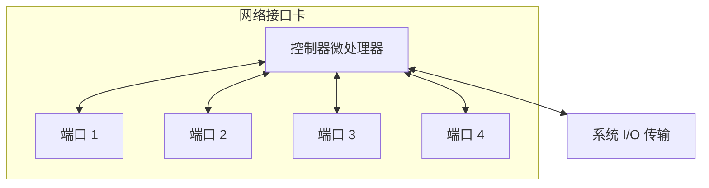
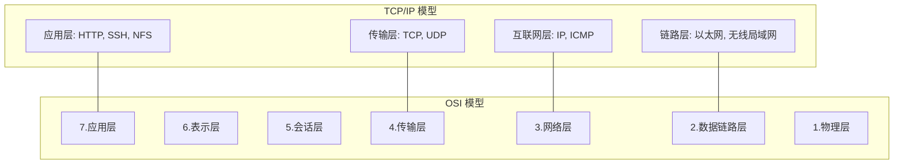
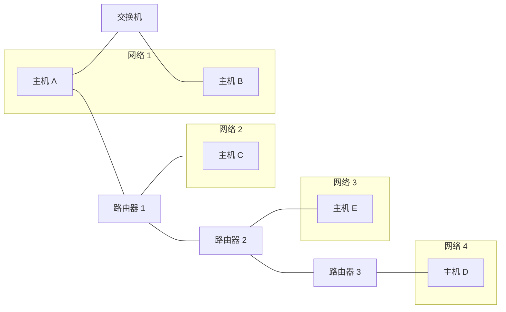
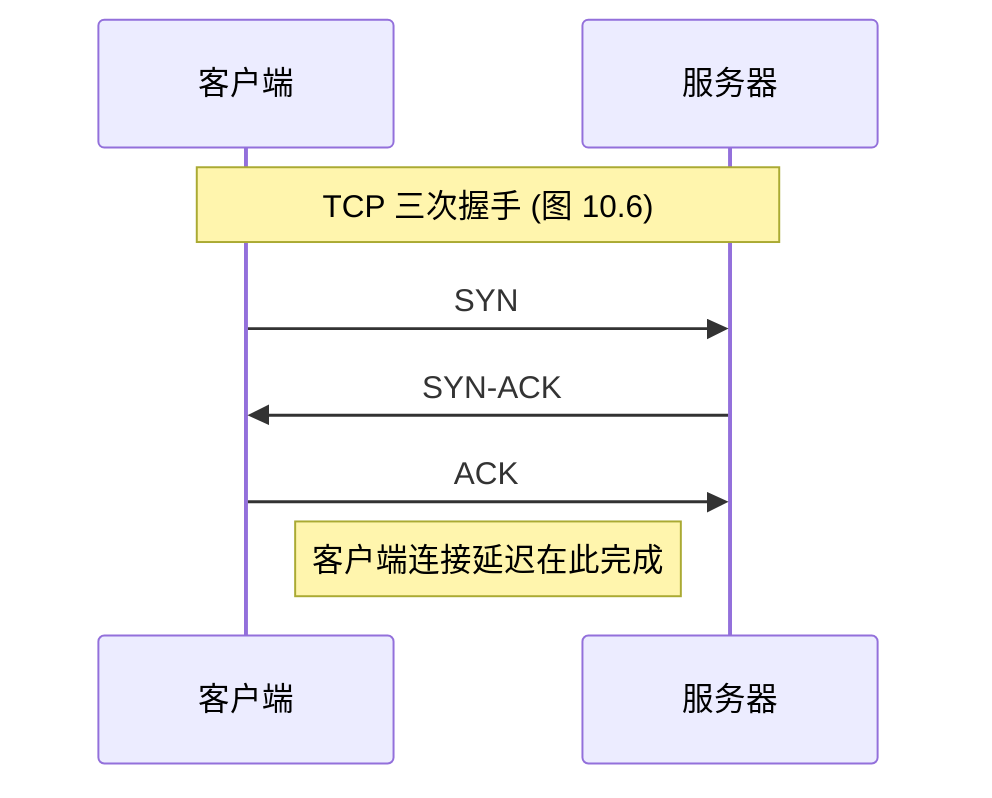
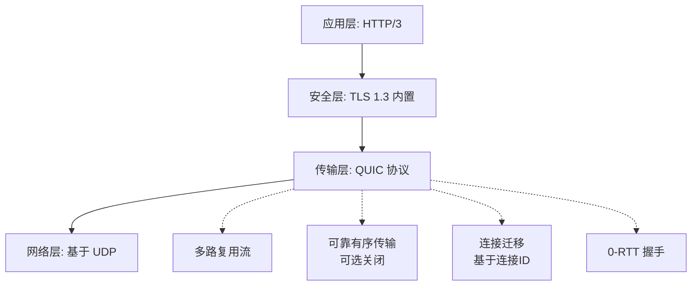
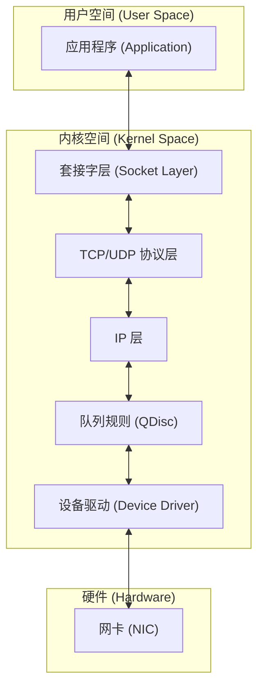
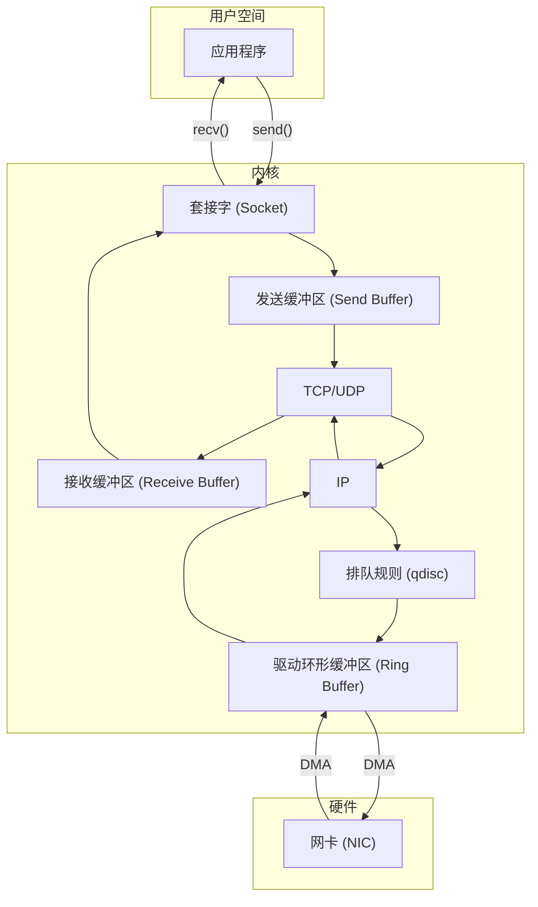
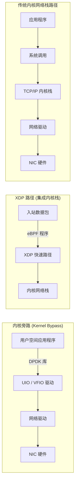

# 10.1 网络：概念与架构

> [!INFO] 章节概览
> 随着系统变得越来越分布式，特别是在云计算环境中，网络在性能中扮演着越来越重要的角色。网络性能的常见任务包括改善网络延迟和吞吐量，以及消除由丢包或包延迟引起的延迟异常值。
> 
> 网络分析跨越硬件和软件。硬件是物理网络，包括网络接口卡、交换机、路由器和网关（这些通常也包含软件）。软件是内核网络栈，包括网络设备驱动程序、包队列和包调度器，以及网络协议的实现。较低层的协议通常是内核软件（IP、TCP、UDP等），而较高层的协议通常是库或应用软件（例如 HTTP）。
> 
> 考虑到拥塞的可能性及其固有的复杂性（归咎于未知事物），网络经常成为性能不佳的替罪羊。本章将展示如何弄清楚到底发生了什么，这可能会证明网络是清白的，从而将分析推向前进。

## 学习目标

本章的学习目标如下：

- 理解网络模型和概念。
- 理解网络延迟的不同度量。
- 掌握常见网络协议的工作知识。
- 熟悉网络硬件内部结构。
- 熟悉从套接字到设备的内核路径。
- 遵循不同的网络分析方法论。
- 表征系统级和进程级的网络 I/O。
- 识别由 TCP 重传引起的问题。
- 使用追踪工具调查网络内部结构。
- 了解网络可调参数。

---

## 章节结构

本章由六个部分组成，前三个部分提供了网络分析的基础，后三个部分展示了其在基于 Linux 系统上的实际应用。各部分内容如下：

- **背景**：介绍网络相关术语、模型和关键网络性能概念。
- **架构**：提供物理网络组件和网络栈的通用描述。
- **方法论**：描述性能分析方法论，包括观察性和实验性方法论。
- **可观测性工具**：展示基于 Linux 系统的网络性能可观测性工具。
- **实验**：总结网络基准测试和实验工具。
- **调优**：描述示例可调参数。

> [!NOTE] 前提知识
> 本章假定读者已具备网络基础知识，例如 TCP 和 IP 的作用。

---

## 10.1 术语

作为参考，本章使用的网络相关术语包括：

- **接口**：术语“接口端口”指的是物理网络连接器。术语“接口”或“链路”指的是由操作系统查看和配置的网络接口端口的逻辑实例。（并非所有操作系统接口都由硬件支持：有些是虚拟的。）
- **包**：术语“包”指的是分组交换网络中的消息，例如 IP 包。
- **帧**：物理网络级别的消息，例如以太网帧。
- **套接字**：源自 BSD 的用于网络端点的 API。
- **带宽**：该网络类型的数据传输最大速率，通常以每秒比特数来衡量。“100 GbE”是带宽为 100 Gbits/s 的以太网。每个方向可能都有带宽限制，因此 100 GbE 可能能够并行发送 100 Gbits/s 和接收 100 Gbit/s（总吞吐量 200 Gbit/sec）。
- **吞吐量**：网络端点之间的当前数据传输速率，以每秒比特数或每秒字节数来衡量。
- **延迟**：网络延迟可以指消息在端点之间往返所需的时间，或者建立连接（例如 TCP 握手）所需的时间，但不包括随后的数据传输时间。

其他术语将在本章中陆续介绍。词汇表包含供参考的基本术语，包括客户端、以太网、主机、IP、RFC、服务器、SYN、ACK。另请参见第 2 章和第 3 章的术语部分。

---

## 10.2 模型

以下简单模型说明了网络和网络性能的一些基本原理。第 10.4 节“架构”将更深入地探讨，包括特定于实现的细节。

### 10.2.1 网络接口

网络接口是网络连接的操作系统端点；它是由系统管理员配置和管理的抽象。


> [!TIP] 图 10.1 网络接口
> 上图展示了网络接口的逻辑模型。网络接口作为其配置的一部分，被映射到物理网络端口。端口连接到网络，通常具有独立的发送和接收通道。

### 10.2.2 控制器

网络接口卡（NIC）为系统提供一个或多个网络端口，并容纳一个网络控制器：一种微处理器，用于在端口和系统 I/O 传输之间传输包。图 10.2 展示了一个具有四个端口的控制器示例，显示了所涉及的物理组件。



> [!TIP] 图 10.2 网络控制器
> 上图展示了包含四个端口的网络控制器内部结构。

控制器通常作为单独的扩展卡提供，或者内置于系统板中。（其他选项包括通过 USB 连接。）

### 10.2.3 协议栈

网络是由一堆协议来完成的，每一层服务于特定的目的。图 10.3 显示了两个堆栈模型，以及示例协议。



> [!TIP] 图 10.3 网络协议栈
> 上图展示了 TCP/IP 模型与 OSI 模型的对比及其示例协议。较低层画得更宽以指示协议封装。发送的消息从应用程序向下移动到物理网络。接收的消息向上移动。

请注意，以太网标准也描述了物理层，以及铜缆或光纤是如何使用的。

可能还有额外的层，例如，如果正在使用 IP 安全协议（[[IPsec]]）或 Linux [[WireGuard]]，它们位于互联网层之上以提供 IP 端点之间的安全性。此外，如果正在使用隧道（例如虚拟可扩展 LAN（[[VXLAN]]）），则一个协议栈可能封装在另一个协议栈中。

> [!NOTE] 作者注
> 虽然 TCP/IP 协议栈已成为标准，但我认为了解一下 OSI 模型也是有用的，因为它展示了应用程序内的协议层。^1^ “层”术语来自 OSI，其中第 3 层指的是网络协议。
> 
> 不同层的消息也使用不同的术语。使用 OSI 模型：在传输层，消息是段或数据报；在网络层，消息是包；在数据链路层，消息是帧。
> 
> ^1^ 我认为简要考虑一下是值得的；我不会把它列入网络知识测试中。

---

## 10.3 概念

以下是网络和网络性能中的一些重要概念选择。

### 10.3.1 网络与路由

网络是由网络协议地址关联的一组相连主机。拥有多个网络——而不是一个庞大的全球网络——是出于多种原因的期望，特别是可扩展性。某些网络消息将广播到所有相邻主机。通过创建较小的子网，此类广播消息可以在本地隔离，从而不会在大规模时造成泛洪问题。这也是将常规消息的传输隔离到仅限于源和目的之间网络的基础，从而更有效地利用网络基础设施。

路由管理着称为包的消息在这些网络之间的传递。路由的作用如图 10.4 所示。



> [!TIP] 图 10.4 通过路由器连接的网络
> 上图展示了主机通过交换机和路由器在不同网络间互连的结构。

从主机 A 的角度来看，本地主机是主机 A 本身。图示的所有其他主机都是远程主机。

主机 A 可以通过本地网络连接到主机 B，通常由网络交换机驱动（参见第 10.4 节，架构）。主机 A 可以通过路由器 1 连接到主机 C，并通过路由器 1、2 和 3 连接到主机 D。由于路由器等网络组件是共享的，来自其他流量（例如，主机 C 到主机 E）的争用可能会损害性能。

主机对之间的连接涉及单播传输。多播传输允许发送方同时传输到多个目的地，这可能跨越多个网络。这必须得到路由器配置的支持才能允许交付。在公有云环境中，它可能会被阻止。

除了路由器，典型的网络还会使用防火墙来提高安全性，阻止主机之间不需要的连接。

路由包所需的地址信息包含在 IP 头中。

### 10.3.2 协议

网络协议标准，例如 IP、TCP 和 UDP 的标准，是系统和设备之间通信的必要条件。通信是通过传输称为包的可路由消息来执行的，通常通过封装有效载荷数据来实现。

网络协议具有不同的性能特征，这源于最初的协议设计、扩展或软件/硬件的特殊处理。例如，不同版本的 IP 协议，[[IPv4]] 和 [[IPv6]]，可能由不同的内核代码路径处理，并表现出不同的性能特征。其他协议在设计上表现不同，可能在适合工作负载时被选择：示例包括流控制传输协议（[[SCTP]]）、多路径 TCP（[[MPTCP]]）和 [[QUIC]]。

通常，还有系统可调参数可以通过更改缓冲区大小、算法和各种计时器等设置来影响协议性能。这些特定协议的差异将在后面的章节中描述。

协议通常通过使用封装来传输数据。

### 10.3.3 封装

封装在有效载荷的开头（头部）、结尾（尾部）或两者添加元数据。这不会改变有效载荷数据，尽管它确实略微增加了消息的总大小，这会消耗一些传输开销。

图 10.5 显示了带有以太网的 TCP/IP 栈的封装示例。


> [!TIP] 图 10.5 网络协议封装
> 上图展示了 TCP/IP 与以太网协议栈的逐层封装过程。E.H. 是以太网头，E.F. 是可选的以太网尾。

### 10.3.4 包大小

包及其有效载荷的大小会影响性能，较大的大小会提高吞吐量并减少包开销。对于 TCP/IP 和以太网，包大小可以在 54 到 9,054 字节之间，包括 54 字节（或更多，取决于选项或版本）的协议头。

包大小通常受网络接口最大传输单元（[[MTU]]）大小的限制，对于许多以太网网络，MTU 被配置为 1,500 字节。1500 MTU 大小的起源来自于以太网的早期版本，以及平衡诸如 NIC 缓冲区等因素的需要

# 10.1 网络：概念与架构

> [!NOTE] 延续说明
> 本部分为文档第 2/6 部分，延续上一部分关于数据包大小与最大传输单元 (MTU) 的讨论。

### 最大传输单元 (MTU) 与巨型帧

数据包的大小通常受限于网络接口的[[最大传输单元|最大传输单元 (MTU)]]大小，对于许多以太网而言，该值通常被配置为 1,500 字节。1,500 MTU 大小的起源来自于早期版本的以太网，以及平衡诸如 [[NIC]] 缓冲区内存成本和传输延迟等因素的需要 [Nosachev 20]。主机们曾竞争使用共享介质（同轴电缆或以太网集线器），更大的尺寸会增加主机等待轮到自己的延迟。

以太网现在支持高达约 9,000 字节的更大数据包（帧），称为[[巨型帧]]。这些帧通过减少所需的数据包数量，可以提高网络吞吐量性能以及数据传输的延迟。

两种因素的交汇阻碍了巨型帧的采用：旧的网络硬件和配置不当的防火墙。不支持巨型帧的旧硬件既可以使用 IP 协议对数据包进行分片（导致数据包重组的性能开销），也可以响应 ICMP “无法分片”错误，让发送方知道减小数据包大小。现在配置不当的防火墙登场了：过去曾发生过基于 ICMP 的攻击（包括“死亡之 Ping”），一些防火墙管理员对此的响应是阻止所有 ICMP。这阻止了有用的“无法分片”消息到达发送方，并导致网络数据包在其大小增加到超过 1,500 时被静默丢弃。如果收到了 ICMP 消息并发生了分片，也存在分片数据包被不支持它们的设备丢弃的风险。为了避免这些问题，许多系统坚持使用 1,500 MTU 默认值。

1500 MTU 帧的性能已通过网络接口卡功能得到改善，包括 [[TCP 卸载]]和[[大段卸载]]。这些功能将更大的缓冲区发送到网卡，然后网卡可以使用专用且优化的硬件将它们拆分为更小的帧。这在一定程度上缩小了 1,500 和 9,000 MTU 网络性能之间的差距。

---

## 10.3.5 延迟

[[网络延迟|延迟]] 是网络性能的重要指标，可以通过不同的方式测量，包括名称解析延迟、Ping 延迟、连接延迟、首字节延迟、[[往返时间|往返时间]]和连接生命周期。这些是由连接到服务器的客户端测量的描述。

### 名称解析延迟
建立与远程主机的连接时，主机名通常被解析为 IP 地址，例如通过 [[DNS 解析]]。这所花费的时间可以作为名称解析延迟单独测量。这种延迟的最坏情况涉及名称解析超时，这可能需要几十秒。

操作系统通常提供带有缓存的名称解析服务，以便后续的 DNS 查找可以从缓存中快速解析。有时应用程序只使用 IP 地址而不使用名称，因此 DNS 延迟被完全避免。

### Ping 延迟
这是 ICMP 回显请求到回显响应的时间，由 `ping(1)` 命令测量。此时间用于测量主机之间的网络延迟，包括中间的跃点，并测量为网络请求进行往返所需的时间。它之所以被广泛使用，是因为它简单且通常容易获得：许多操作系统默认会响应 ping。它可能不能准确反映应用程序请求的往返时间，因为路由器可能以不同的优先级处理 ICMP。

示例 ping 延迟如表 10.1 所示。

**表 10.1 示例 Ping 延迟**

| From (从) | To (到) | Via (经由) | Latency (延迟) | Scaled (缩放比例) |
| :--- | :--- | :--- | :--- | :--- |
| Localhost (本地主机) | Localhost (本地主机) | Kernel (内核) | 0.05 ms | 1 s |
| Host (主机) | Host (同一子网主机) | 10 GbE | 0.2 ms | 4 s |
| Host (主机) | Host (同一子网主机) | 1 GbE | 0.6 ms | 12 s |
| Host (主机) | Host (同一子网主机) | Wi-Fi | 3 ms | 1 minute |
| San Francisco (旧金山) | New York (纽约) | Internet (互联网) | 40 ms | 13 minutes |
| San Francisco (旧金山) | United Kingdom (英国) | Internet (互联网) | 81 ms | 27 minutes |
| San Francisco (旧金山) | Australia (澳大利亚) | Internet (互联网) | 183 ms | 1 hour |

> [!TIP] 关于缩放比例
> 为了更好地说明所涉及的数量级，缩放比例列显示了基于假想的本地主机 ping 延迟为一秒的比较。

### 连接延迟
连接延迟是在传输任何数据之前建立网络连接的时间。对于 [[TCP 连接延迟|TCP 连接延迟]]，这是 TCP 握手时间。从客户端测量，它是从发送 SYN 到接收到相应的 SYN-ACK 的时间。连接延迟最好称为连接建立延迟，以便将其与连接生命周期明确区分开来。

连接延迟类似于 ping 延迟，尽管它执行更多的内核代码来建立连接，并包括重新传输任何丢弃数据包的时间。特别是，TCP SYN 数据包可能会在服务器的积压队列已满时被服务器丢弃，导致客户端发送基于定时器的 SYN 重传。这发生在 TCP 握手期间，因此连接延迟可能包括重传延迟，从而增加一秒或更长时间。

连接延迟之后是首字节延迟。

### 首字节延迟
也称为[[首字节时间|首字节时间 (TTFB)]]，首字节延迟是从连接建立到接收到第一个字节数据的时间。这包括远程主机接受连接、调度为其服务的线程、以及该线程执行并发送第一个字节的时间。

虽然 ping 和连接延迟测量的是网络产生的延迟，但首字节延迟包含了目标服务器的思考时间。这可能包括服务器过载时的延迟，需要时间来处理请求（例如，TCP 积压）和调度服务器（CPU 调度器延迟）。

### 往返时间
[[往返时间|往返时间 (RTT)]] 描述了网络请求在端点之间进行往返所需的时间。这包括信号传播时间和每个网络跃点的处理时间。其预期用途是确定网络的延迟，因此理想情况下，RTT 主要由请求和回复数据包在网络上的时间主导（而不是远程主机为请求提供服务所花费的时间）。ICMP 回显请求的 RTT 经常被研究，因为远程主机的处理时间是最小的。

### 连接生命周期
连接生命周期是从建立网络连接到关闭连接的时间。某些协议使用[[保活策略|保活策略]]，延长连接的持续时间，以便将来的操作可以使用现有连接，并避免连接建立（以及 [[TLS]] 建立）的开销和延迟。

有关更多网络延迟测量，请参见第 10.5.4 节“延迟分析”，其中描述了如何使用它们来诊断网络性能。

---

## 10.3.6 缓冲

尽管可能会遇到各种网络延迟，但通过在发送方和接收方使用[[缓冲|缓冲]]，网络吞吐量可以维持在高速率。较大的缓冲区可以通过在阻塞并等待确认之前继续发送数据，来减轻较高往返时间的影响。

TCP 采用缓冲以及[[滑动发送窗口]]来提高吞吐量。网络套接字也有缓冲区，应用程序也可以采用自己的缓冲区，以便在发送前聚合数据。

缓冲也可以由外部网络组件（如交换机和路由器）执行，以努力提高其自身的吞吐量。不幸的是，在这些组件上使用大型缓冲区会导致[[缓冲区膨胀|缓冲区膨胀]]，即数据包被长时间排队。这会导致主机上的 TCP 拥塞避免，从而抑制性能。Linux 3.x 内核中已添加功能来解决这个问题（包括字节队列限制、CoDel 排队规则 [Nichols 12] 和 TCP 小队列）。还有一个讨论此问题的网站 [Bufferbloat 20]。

根据称为[[端到端原则|端到端原则]]的原则 [Saltzer 84]，缓冲（或大型缓冲）的功能可能最好由端点（即主机）来提供，而不是由中间网络节点提供。

> [!INFO] 缓冲区膨胀 (Bufferbloat) 与排队
> 下图展示了中间网络设备（如路由器）过度缓冲如何导致数据包排队延迟，进而引发 TCP 拥塞避免机制降低发送速率的过程：
> ```mermaid
> flowchart LR
>     A[发送端] -->|数据包| B[路由器<br>大缓冲区]
>     B -->|排队等待| C[长队列<br>Bufferbloat]
>     C -->|延迟增加| D[接收端]
>     D -.->|ACK 确认延迟| A
>     A -.->|TCP 判定拥塞<br>降低发送速率| A
> ```

---

## 10.3.7 连接积压

另一种类型的缓冲用于初始连接请求。TCP 实现了一个[[积压|积压队列]]，其中 SYN 请求可以在被用户态进程接受之前在内核中排队。当 TCP 连接请求过多，进程无法及时接受时，积压队列达到极限，SYN 数据包将被丢弃，随后由客户端重传。这些数据包的重传会导致客户端连接时间的延迟。该限制是可调的：它是 `listen(2)` 系统调用的参数，内核也可能提供系统范围的限制。

> [!WARNING] 主机过载指标
> 积压丢弃和 SYN 重传是主机过载的指标。

---

## 10.3.8 接口协商

网络接口可以在不同的模式下运行，这些模式在连接的收发器之间自动协商。一些例子是：

- **带宽**：例如，10、100、1,000、10,000、40,000、100,000 Mbits/s
- **双工模式**：半双工或全双工

这些示例来自以太网，它倾向于使用以 10 为基数的整数来表示带宽限制。其他物理层协议，如 [[SONET]]，具有一组不同的可能带宽。

网络接口通常根据其最高带宽和协议来描述，例如，1 Gbit/s 以太网 (1 GbE)。然而，如果需要，此接口可以自动协商到较低的速度。如果另一端点无法更快地运行，或者为了适应连接介质的物理问题（布线不良），就会发生这种情况。

[[全双工|全双工]]模式允许双向同时传输，具有用于发送和接收的独立路径，每个路径都可以在全带宽下运行。[[半双工|半双工]]模式一次只允许一个方向。

---

## 10.3.9 拥塞避免

网络是共享资源，当流量负载较高时可能会变得拥塞。这可能会导致性能问题：例如，路由器或交换机可能会丢弃数据包，导致引起延迟的 TCP 重传。主机在接收高数据包速率时也可能变得不堪重负，并且可能自己丢弃数据包。

有许多机制可以避免这些问题；应该研究这些机制，并在必要时进行调整，以提高负载下的可扩展性。不同协议的示例包括：

- **以太网**：不堪重负的主机可能会向发送方发送[[暂停帧]]，请求它们暂停传输 (IEEE 802.3x)。还有优先级类别和每个类别的优先级暂停帧。
- **IP**：包含[[显式拥塞通知|显式拥塞通知 (ECN)]]字段。
- **TCP**：包含[[拥塞窗口]]，可以使用各种[[拥塞控制算法]]。

后面的章节将更详细地描述 IP ECN 和 TCP 拥塞控制算法。

---

## 10.3.10 利用率

网络接口[[利用率|利用率]]可以计算为当前吞吐量除以最大带宽。考虑到由于自动协商导致的可变带宽和双工模式，计算利用率并不像听起来那么简单。

对于全双工，利用率适用于每个方向，并测量为该方向的当前吞吐量除以当前协商的带宽。通常只有一个方向最为重要，因为主机通常是不对称的：服务器是发送密集型的，而客户端是接收密集型的。

一旦网络接口的某个方向达到 100% 的利用率，它就成为瓶颈，限制了性能。

> [!WARNING] 数据包计数无法直接等同于利用率
> 某些性能工具仅以数据包的形式报告活动，而不是字节。由于数据包大小可能有很大差异（如前所述），因此无法将数据包计数与字节计数相关联来计算吞吐量或（基于吞吐量的）利用率。

```markdown
# 10.1 网络：概念与架构

> [!NOTE] 延续上下文说明
> 本部分为第 3/6 部分，承接前文关于网络瓶颈、数据包与字节计数差异的讨论。

## 10.3.11 本地连接

网络连接可以发生在同一系统上的两个应用程序之间。这些是 localhost 连接，并使用虚拟网络接口：[[回环|loopback]]。

分布式应用环境通常被划分为通过网络进行通信的逻辑部分。这些部分可以包括 Web 服务器、数据库服务器、缓存服务器、代理服务器和应用服务器。如果它们运行在同一主机上，它们的连接就是到 localhost 的。

通过 IP 连接到 localhost 是进程间通信（[[IPC]]）的 IP 套接字技术。另一种技术是 Unix 域套接字（[[UDS|Unix Domain Sockets]]），它在文件系统上创建一个文件用于通信。使用 UDS 的性能可能会更好，因为可以绕过内核的 TCP/IP 协议栈，跳过内核代码和协议数据包封装的开销。

对于 TCP/IP 套接字，内核可能会在握手后检测到 localhost 连接，然后为数据传输走捷径（shortcut）绕过 TCP/IP 协议栈，从而提高性能。这最初是作为 Linux 内核的一个功能开发的，称为 TCP friends，但并未被合并入主线 [Corbet 12]。现在可以在 Linux 上使用 [[BPF]] 来实现此目的，正如 Cilium 软件为容器网络性能和安全性所做的那样 [Cilium 20a]。

## 10.4 架构

本节介绍网络架构：协议、硬件和软件。这些内容作为性能分析和调优的背景进行了总结，并重点关注性能特征。有关更多细节，包括通用网络主题，请参阅网络教材 [Stevens 93][Hassan 03]、RFC 文档以及网络硬件的供应商手册。其中一些列在本章末尾。

### 10.4.1 协议

在本节中，总结了 IP、TCP、UDP 和 QUIC 的性能特征和特性。这些协议如何在硬件和软件中实现（包括诸如分段卸载、连接队列和缓冲等功能）将在后面的硬件和软件部分中描述。

#### IP

互联网协议（[[IP]]）版本 4 和 6 包含一个用于设置连接所需性能的字段：IPv4 中的服务类型（Type of Service）字段，以及 IPv6 中的流量类别（Traffic Class）字段。这些字段后来被重新定义，以包含差分服务代码点（[[DSCP|Differentiated Services Code Point]]）（RFC 2474）[Nichols 98] 和显式拥塞通知（[[ECN|Explicit Congestion Notification]]）字段（RFC 3168）[Ramakrishnan 01]。

DSCP 旨在支持不同的服务类别，每个类别具有不同的特性，包括数据包丢弃概率。示例服务类别包括：电话、广播视频、低延迟数据、高吞吐量数据和低优先级数据。

ECN 是一种机制，允许路径上的服务器、路由器或交换机通过在 IP 头部中设置一个比特位来显式发出拥塞信号，而不是丢弃数据包。接收方会将此信号回显给发送方，发送方随后可以限制传输。这提供了拥塞避免的好处，而不会招致数据包丢弃的惩罚（前提是在整个网络中正确使用了 ECN 比特位）。

#### TCP

传输控制协议（[[TCP|Transmission Control Protocol]]）是用于创建可靠网络连接的常用互联网标准。TCP 由 RFC 793 [Postel 81] 及其后续增补规定。

在性能方面，TCP 通过使用缓冲和滑动窗口，即使在高延迟网络上也能提供高吞吐率。TCP 还采用拥塞控制和由发送方设置的拥塞窗口，以便它能够在不同且多变的网络中维持高但也可靠的传输速率。拥塞控制避免了发送过多数据包，这会导致拥塞和性能崩溃。

以下是 TCP 性能特性的总结，包括自原始规范以来的增补：

- **滑动窗口**：这允许在接收到确认之前，在网络上发送最多达到窗口大小的多个数据包，即使在延迟高的网络上也能提供高吞吐量。窗口大小由接收方通告，以指示它当时愿意接收多少数据包。
- **拥塞避免**：防止发送过多数据导致饱和，从而引起数据包丢弃和更差的性能。
- **慢启动**：TCP 拥塞控制的一部分，它从一个小的拥塞窗口开始，然后在特定时间内收到确认（ACK）时增大该窗口。如果没有收到，则减小拥塞窗口。
- **选择性确认（[[SACK|Selective Acknowledgments]]）**：允许 TCP 确认不连续的数据包，减少所需的重传次数。
- **快速重传**：无需等待定时器，TCP 可以基于重复 ACK 的到达来重传丢弃的数据包。这些是往返时间的函数，而不是通常慢得多的定时器。
- **快速恢复**：在检测到重复 ACK 后，通过重置连接以执行慢启动来恢复 TCP 性能。
- **TCP 快速打开**：允许客户端在 SYN 数据包中包含数据，以便服务器请求处理可以更早开始，而无需等待 SYN 握手（RFC7413）。这可以使用加密 Cookie 来验证客户端。
- **TCP 时间戳**：包含发送数据包的时间戳，该时间戳在 ACK 中返回，以便可以测量往返时间（RFC 1323）[Jacobson 92]。
- **TCP SYN Cookie**：在可能发生 SYN 洪泛攻击（积压队列满）期间向客户端提供加密 Cookie，以便合法客户端可以继续连接，而服务器无需为这些连接尝试存储额外数据。

在某些情况下，这些特性是通过添加到协议头部的扩展 TCP 选项来实现的。

TCP 性能的重要主题包括三次握手、重复 ACK 检测、拥塞控制算法、Nagle 算法、延迟 ACK、SACK 和 FACK。

##### 三次握手

连接是使用主机之间的三次握手建立的。一个主机被动地监听连接；另一个主动发起连接。为了澄清术语：被动和主动源自 RFC 793 [Postel 81]；然而，在套接字 API 之后，它们通常分别被称为 listen 和 connect。对于客户端/服务器模型，服务器执行 listen，客户端执行 connect。

三次握手如图 10.6 所示。



图中指示了来自客户端的连接延迟，该延迟在发送最终 ACK 时完成。之后，数据传输可能开始。

此图显示了握手的最佳情况延迟。数据包可能会被丢弃，从而在超时和重传时增加延迟。

一旦三次握手完成，TCP 会话就会进入 ESTABLISHED 状态。

##### 状态和定时器

TCP 会话基于数据包和套接字事件在 TCP 状态之间切换。这些状态包括 LISTEN、SYN-SENT、SYN-RECEIVED、ESTABLISHED、FIN-WAIT-1、FIN-WAIT-2、CLOSE-WAIT、CLOSING、LAST-ACK、TIME-WAIT 和 CLOSED [Postal 80]。性能分析通常重点关注处于 ESTABLISHED 状态的连接，这些是活动连接。此类连接可能正在传输数据，或处于空闲状态等待下一个事件：数据传输或关闭事件。

> [!WARNING] TIME_WAIT 状态与端口耗尽
> 完全关闭的会话进入 `TIME_WAIT` 状态，以便迟到的数据包不会被错误地关联到相同端口上的新连接。这可能导致端口耗尽的性能问题，这在第 10.5.7 节“TCP 分析”中解释。

某些状态具有与之关联的定时器。`TIME_WAIT` 通常为两分钟（某些内核，例如 Windows 内核，允许对其进行调优）。在 `ESTABLISHED` 状态上也可能有一个“保持活动”定时器，设置为很长的持续时间（例如两小时），以触发探测数据包检查远程主机是否仍存活。

##### 重复 ACK 检测

重复 ACK 检测被快速重传和快速恢复算法用于快速检测发送的数据包（或其 ACK）何时丢失。其工作原理如下：

1. 发送方发送序列号为 10 的数据包。
2. 接收方回复确认序列号为 11 的 ACK。
3. 发送方发送 11、12 和 13。
4. 数据包 11 被丢弃。
5. 接收方对接收到的 12 和 13 都回复发送对 11 的 ACK，因为它仍然期待收到 11。
6. 发送方收到对 11 的重复 ACK。

各种拥塞避免算法也使用重复 ACK 检测。

##### 重传

TCP 用于检测和重传丢失数据包的两种常用机制是：

- **基于定时器的重传**：当经过了一段时间且尚未收到数据包确认时发生。此时间为 TCP 重传超时，基于连接往返时间（RTT）动态计算。在 Linux 上，首次重传至少为 200 ms（`TCP_RTO_MIN`），随后的重传将慢得多，遵循使超时时间翻倍的指数退避算法。
- **快速重传**：当重复 ACK 到达时，TCP 可以假设数据包被丢弃并立即重传。

为了进一步提高性能，已经开发出额外的机制来避免基于定时器的重传。当最后传输的数据包丢失，并且没有后续数据包触发重复 ACK 检测时，就会出现一个问题。（考虑前面的例子中数据包 13 丢失的情况。）这由尾部丢失探测（[[TLP|Tail Loss Probe]]）解决，它在最后一次传输后的短暂超时后发送一个额外的数据包（探测）以帮助检测数据包丢失 [Dukkipati 13]。

拥塞控制算法也可能在出现重传时限制吞吐量。

> [!NOTE] 脚注说明
> 2. 虽然通常被写成（并且被编程为）`TIME_WAIT`，但 RFC 793 使用的是 `TIME-WAIT`。
> 3. 这似乎违反了 RFC6298，该规范规定了 1 秒的 RTO 最小值 [Paxson 11]。
```

# 10.1 网络：概念与架构

## 10.4 架构

### 拥塞控制

拥塞控制算法已被开发出来，用于在拥塞的网络中维持性能。一些操作系统（包括基于 Linux 的系统）允许将算法的选择作为系统调优的一部分。这些算法包括：

- **Reno**：三次重复 ACK 触发：拥塞窗口减半、慢启动阈值减半、快速重传和快速恢复。
- **Tahoe**：三次重复 ACK 触发：快速重传、慢启动阈值减半、拥塞窗口设置为一个最大分段大小（MSS），并进入慢启动状态。（与 Reno 一起，Tahoe 最初是为 4.3BSD 开发的。）
- **CUBIC**：使用三次函数（因此得名）来缩放窗口，并使用“混合启动”函数退出慢启动。CUBIC 往往比 Reno 更具侵略性，并且是 Linux 中的默认算法。
- **BBR**：与基于窗口的算法不同，BBR 使用探测阶段来构建网络路径特征（RTT 和带宽）的显式模型。BBR 可以在某些网络路径上提供显著更好的性能，而在其他路径上则会损害性能。BBRv2 目前正在开发中，有望修复 v1 的一些缺陷。
- **DCTCP**：数据中心 TCP 依赖于配置为在队列占用率非常浅时发出显式拥塞通知（ECN）标记的交换机，以快速攀升到可用带宽（RFC 8257）[Bensley 17]。这使得 DCTCP 不适合在互联网上部署，但在适当配置的受控环境中，它可以显著提高性能。

> [!INFO] 其他算法
> 前面未列出的其他算法包括 Vegas、New Reno 和 Hybla。

拥塞控制算法可以对网络性能产生巨大影响。例如，Netflix 云服务使用 BBR，并发现在严重丢包期间，它可以将吞吐量提高三倍 [Ather 17]。了解这些算法在不同网络条件下的反应是分析 TCP 性能时的一项重要活动。

2020 年发布的 Linux 5.6 增加了对使用 [[BPF]] 开发新拥塞控制算法的支持 [Corbet 20]。这允许由终端用户定义它们并按需加载。

---

### Nagle 算法

此算法（RFC 896）[Nagle 84] 通过延迟小数据包的传输来减少网络上的小数据包数量，以允许更多数据到达并合并。仅当管道中存在数据且已经遇到延迟时，这才会延迟数据包。

系统可能会提供可调参数或套接字选项来禁用 Nagle，如果其操作与延迟 ACK 冲突，则可能需要禁用它（参见第 10.8.2 节，套接字选项）。

---

### 延迟 ACK

此算法（RFC 1122）[Braden 89] 将 ACK 的发送延迟最多 500 毫秒，以便可以合并多个 ACK。其他 TCP 控制消息也可以合并，从而减少网络上的数据包数量。

与 Nagle 一样，系统可能会提供可调参数来禁用此行为。

---

### SACK、FACK 和 RACK

TCP 选择性确认（SACK）算法允许接收方通知发送方它收到了一个不连续的数据块。如果没有这个功能，一个数据包的丢失最终将导致整个发送窗口被重传，以维护顺序确认方案。这会损害 TCP 性能，而大多数支持 SACK 的现代操作系统都避免了这种情况。

SACK 已经由前向确认（FACK）进行了扩展，Linux 默认支持 FACK。FACK 跟踪额外的状态并更好地调节网络中未完成数据的数量，从而提高整体性能 [Mathis 96]。

SACK 和 FACK 都用于改善丢包恢复。一种较新的算法，最近确认（RACK；现在由于合并了 TLP 而被称为 RACK-TLP）使用来自 ACK 的时间信息来实现更好的丢包检测和恢复，而不仅仅是单独依赖 ACK 序列 [Cheng 20]。对于 FreeBSD，Netflix 基于 RACK、TLP 和其他功能开发了一个新的重构 TCP 协议栈，称为 RACK [Stewart 18]。

> [!TIP] 核心概念
> - **SACK (Selective ACK)**: 允许接收方告知发送方收到了哪些不连续的数据块，避免不必要的重传。
> - **FACK (Forward ACK)**: 进一步跟踪网络中未完成的数据状态，提升整体性能。
> - **RACK (Recent ACK)**: 利用 ACK 的时间信息（而非单纯序列号）来更精确地检测和恢复丢包。

---

### 初始窗口

初始窗口（IW）是 TCP 发送方在连接开始时，在等待发送方确认之前将传输的数据包数量。对于短流（例如典型的 HTTP 连接），一个足够大以覆盖传输数据的 IW 可以大大缩短完成时间，从而提高性能。然而，较大的 IW 可能会带来拥塞和数据包丢失的风险。当多个流同时启动时，这种情况尤其严重。

Linux 默认值（10 个数据包，即 IW10）在慢速链路上或许多连接同时启动时可能过高；其他操作系统默认为 2 或 4 个数据包（IW2 或 IW4）。

---

### UDP

用户数据报协议（UDP）是用于在网络中发送消息（称为数据报）的常用互联网标准（RFC 768）[Postel 80]。在性能方面，UDP 提供：

- **简单性**：简单且小的协议头减少了计算和大小的开销。
- **无状态**：连接和传输的开销更低。
- **无重传**：重传会为 TCP 连接增加显著的延迟。

虽然 UDP 简单且通常具有高性能，但它的设计并不保证可靠性，数据可能会丢失或乱序接收。这使其不适用于许多类型的连接。UDP 也没有拥塞避免机制，因此可能会导致网络拥塞。

某些服务（包括某些版本的 [[NFS]]）可以根据需要配置为通过 TCP 或 UDP 运行。其他执行广播或组播数据的服务可能只能使用 UDP。

UDP 的一个主要用途一直是 [[DNS]]。由于 UDP 的简单性、缺乏拥塞控制以及互联网支持（通常不被防火墙拦截），现在有建立在 UDP 之上的新协议，它们实现了自己的拥塞控制和其他功能。其中一个例子就是 QUIC。

---

### QUIC 和 HTTP/3

QUIC 是由 Google 的 Jim Roskind 设计的一种网络协议，作为 TCP 的更高性能、更低延迟的替代方案，针对 HTTP 和 TLS 进行了优化 [Roskind 12]。QUIC 构建在 UDP 之上，并在其之上提供了几个功能，包括：

- 在同一“连接”之上多路复用多个应用定义的流的能力。
- 类似 TCP 的可靠有序流传输，可以为单个子流选择性地关闭该功能。
- 当客户端更改其网络地址时的连接恢复，基于连接 ID 的加密身份验证。
- 有效载荷数据的全加密，包括 QUIC 头部。
- 0-RTT 连接握手，包括加密（用于之前已通信的对端）。

> [!NOTE] 
> Chrome 网络浏览器大量使用 QUIC。

虽然 QUIC 最初由 Google 开发，但互联网工程任务组（IETF）正在标准化 QUIC 传输本身，以及在 QUIC 上使用 HTTP 的特定配置（后一种组合被命名为 HTTP/3）。



---

## 10.4.2 硬件

网络硬件包括接口、控制器、交换机、路由器和防火墙。了解它们的操作是有用的，即使它们由其他人员（网络管理员）管理。

### 接口

物理网络接口在所连接的网络上发送和接收称为帧的消息。它们管理涉及的电、光或无线信号，包括处理传输错误。

接口类型基于第 2 层标准，每种都提供最大带宽。更高带宽的接口以更高的成本提供更低的数据传输延迟。在设计新服务器时，关键决策通常是如何平衡服务器价格与所需的网络性能。

对于以太网，选择包括铜缆或光缆，最大速度为 1 Gbit/s (1 GbE)、10 GbE、40 GbE、100 GbE、200 GbE 和 400 GbE。许多供应商制造以太网接口控制器，尽管您的操作系统可能没有其中一些的驱动程序支持。

接口利用率可以检查为当前吞吐量除以当前协商的带宽。大多数接口有独立的发送和接收通道，并且在全双工模式下运行时，必须单独研究每个通道的利用率。

> [!WARNING] 无线接口性能
> 无线接口可能会因信号强度弱和干扰而出现性能问题 <sup>4</sup>。

---

### 控制器

物理网络接口通过控制器提供给系统，这些控制器要么内置在系统板中，要么通过扩展卡提供。

控制器由微处理器驱动，并通过 I/O 传输（例如 PCI）连接到系统。这两者中的任何一个都可能成为网络吞吐量或 IOPS 的限制因素。

> [!EXAMPLE] 示例：PCIe 带宽瓶颈
> 例如，一块双端口 10 GbE 网络接口卡连接到四通道 PCI express (PCIe) Gen 2 插槽。
> - 该卡的最大发送或接收带宽为：2 × 10 GbE = 20 Gbits/s
> - 双向带宽为：40 Gbit/s
> - 插槽的最大带宽为：4 × 4 Gbits/s = 16 Gbits/s
> 
> 因此，两个端口上的网络吞吐量将受到 PCIe Gen 2 带宽的限制，将无法同时以线速驱动它们（这是我从实践中得知的！）。

---

### 交换机和路由器

**交换机**在任何两个连接的主机之间提供专用的通信路径，允许主机对之间进行多个传输而不会产生干扰。这项技术取代了集线器（以及更早之前的共享物理总线：常用的粗以太网同轴电缆），后者与所有主机共享所有数据包。当主机同时传输时，这种共享会导致争用，接口使用“带有冲突检测的载波侦听多路访问”（CSMA/CD）算法将其识别为冲突。该算法会呈指数退避并重传直到成功，这在负载下会产生性能问题。随着交换机的使用，这已成为过去，但一些可观测性工具仍然有冲突计数器——尽管这些通常只由于错误（协商或布线不良）而发生。

**路由器**在网络之间传递数据包，并使用网络协议和路由表来确定有效的传递路径。在两个城市之间传递一个数据包可能涉及十几个或更多路由器，以及其他网络硬件。路由器和路由通常配置为动态更新，以便网络可以自动响应网络和路由器中断，并平衡负载。这意味着在给定的时间点，没有人能确定数据包实际正在走哪条路径。由于可能存在多条路径，因此数据包也有可能乱序交付，这可能导致 TCP 性能问题。

网络上这种神秘因素经常被指责为性能不佳的原因：也许是来自其他不相关主机的繁重网络流量正在使源和目的地之间的路由器饱和？因此，网络管理团队经常被要求为其基础设施开脱责任。他们可以使用先进的实时监控工具来检查所涉及的所有路由器和其他网络组件。

---

> [!QUOTE] 脚注 4
> 我开发了一个 BPF 软件，可以将 Linux Wi-Fi 信号强度转换为可听见的音调，并在 2019 年 AWS re:Invent 演讲中进行了演示 [Gregg 19b]。我本想将其包含在本章中，但我尚未将其用于企业或云环境，因为迄今为止这些环境都是有线的。

# 10.1 网络：概念与架构

## 10.4 架构

路由器和交换机都包含缓冲区和微处理器，它们本身在负载下可能成为性能瓶颈。作为一个极端的例子，我曾发现一款早期的 10 GbE 交换机由于其 CPU 容量有限，所有端口的总吞吐量无法超过 11 Gbits/s。

> [!NOTE] 速率转换与缓冲
> 请注意，交换机和路由器通常也是发生速率转换的地方（从一种带宽切换到另一种带宽，例如，10 Gbps 链路转换为 1 Gbps 链路）。当这种情况发生时，一定的缓冲是必要的，以避免过度丢包，但许多交换机和路由器过度缓冲（参见 10.3.6 节，[[缓冲|Buffering]] 中的缓冲膨胀问题），导致高延迟。更好的队列管理算法有助于消除这个问题，但并非所有网络设备供应商都支持它们。源端的流量整形也可以通过使流量不那么突发来缓解速率转换问题。

### 防火墙

防火墙通常用于根据配置的规则集仅允许授权的通信，从而提高网络的安全性。它们既可以作为物理网络设备存在，也可以作为内核软件存在。

防火墙可能成为性能瓶颈，尤其是在配置为有状态防火墙时。有状态规则为每个已看到的连接存储元数据，当处理大量连接时，防火墙可能会经历过多的内存负载。这可能发生在拒绝服务攻击试图用大量连接淹没目标时。这也可能发生在出站连接速率很高的情况下，因为它们可能需要类似的连接跟踪。

由于防火墙是定制的硬件或软件，可用于分析它们的工具取决于每种防火墙产品。请参阅其各自的文档。

由于扩展 BPF（[[eBPF|Extended BPF]]）的性能、可编程性、易用性和最终成本，在商用硬件上实现防火墙的使用正在增长。采用 BPF 防火墙和 DDoS 解决方案的公司包括 Facebook [Deepak 18]、Cloudflare [Majkowski 18] 和 Cilium [Cilium 20a]。

> [!WARNING] 性能测试的阻碍
> 防火墙在性能测试期间也可能是个麻烦：在调试问题时执行带宽实验可能涉及修改防火墙规则以允许连接（并与安全团队进行协调）。

### 其他

您的环境可能包括其他物理网络设备，例如集线器、网桥、中继器和调制解调器。其中任何一种都可能成为性能瓶颈和丢包的来源。

## 10.4.3 软件

网络软件包括网络栈、[[TCP]] 和设备驱动程序。与性能相关的主题将在本节中讨论。

### 网络栈

涉及的组件和层取决于操作系统类型、版本、协议和使用的接口。图 10.7 描绘了一个通用模型，展示了软件组件。

**图 10.7 通用网络栈**



在现代内核上，栈是多线程的，入站数据包可以由多个 CPU 处理。

#### Linux

图 10.8 展示了 Linux 网络栈，包括套接字发送/接收缓冲区和数据包队列的位置。

在 Linux 系统中，网络栈是核心内核组件，而设备驱动程序是附加模块。数据包作为 `struct sk_buff`（套接字缓冲区）数据类型通过这些内核组件传递。请注意，IP 层中可能还有用于数据包重组的排队（未图示）。

以下部分讨论与性能相关的 Linux 实现细节：TCP 连接队列、TCP 缓冲、排队规则、网络设备驱动程序、CPU 扩展和内核旁路。TCP 协议在上一节中已描述。

**图 10.8 Linux 网络栈**



##### TCP 连接队列

突发的入站连接通过使用积压队列来处理。有两个这样的队列，一个用于在 TCP 握手完成时的不完整连接（也称为 SYN 积压），另一个用于等待应用程序接受的已建立会话（也称为监听积压）。这些如图 10.9 所示。

**图 10.9 TCP 积压队列**


在早期内核中只使用一个队列，它容易受到 SYN 洪水攻击。SYN 洪水是一种 DoS 攻击，涉及从伪造的 IP 地址向监听的 TCP 端口发送大量 SYN。这会在 TCP 等待完成握手时填满积压队列，从而阻止真实客户端连接。

使用两个队列时，第一个队列可以作为潜在伪造连接的暂存区，只有在连接建立后才被提升到第二个队列。第一个队列可以设置得很长以吸收 SYN 洪水，并优化为仅存储所需的最少元数据。

> [!TIP] SYN Cookie
> SYN cookie 的使用绕过了第一个队列，因为它们表明客户端已经被授权。

这些队列的长度可以独立调整（参见 10.8 节，调优）。第二个队列也可以由应用程序通过 `listen(2)` 的 backlog 参数来设置。

##### TCP 缓冲

通过使用与套接字关联的发送和接收缓冲区可以提高数据吞吐量。这些如图 10.10 所示。

**图 10.10 TCP 发送和接收缓冲区**


发送和接收缓冲区的大小都是可调的。更大的大小可以提高吞吐量性能，代价是每个连接消耗更多的主内存。如果预期服务器执行更多的发送或接收操作，则可以将一个缓冲区设置得比另一个大。Linux 内核还将根据连接活动动态增加这些缓冲区的大小，并允许调整其最小、默认和最大大小。

###### 分段卸载：GSO 和 TSO

网络设备和网络接受最大达到最大段大小（[[MSS]]）的数据包，该大小可能小至 1500 字节。为了避免发送许多小数据包的网络栈开销，Linux 使用通用分段卸载（[[GSO|Generic Segmentation Offload]]）发送大小高达 64 Kbytes 的数据包（“超级数据包”），这些数据包在交付给网络设备之前被拆分为 MSS 大小的段。如果 NIC 和驱动程序支持 TCP 分段卸载（[[TSO|TCP Segmentation Offload]]），GSO 会将拆分工作留给设备，从而提高网络栈吞吐量。^5 还有与 GSO 互补的通用接收卸载（[[GRO|Generic Receive Offload]]）。^6 GRO 和 GSO 在内核软件中实现，而 TSO 由 NIC 硬件实现。

##### 排队规则

这是一个可选层，用于管理网络数据包的流量分类（`tc`）、调度、操纵、过滤和整形。Linux 提供了许多排队规则算法（`qdiscs`），可以使用 `tc(8)` 命令进行配置。由于每个算法都有手册页，可以使用 `man(1)` 命令列出它们：

```bash
# man -k tc-
tc-actions (8)       - independently defined actions in tc
tc-basic (8)         - basic traffic control filter
tc-bfifo (8)         - Packet limited First In, First Out queue
tc-bpf (8)           - BPF programmable classifier and actions for ingress/egress 
                       queueing disciplines
tc-cbq (8)           - Class Based Queueing
tc-cbq-details (8)   - Class Based Queueing
tc-cbs (8)           - Credit Based Shaper (CBS) Qdisc
tc-cgroup (8)        - control group based traffic control filter
tc-choke (8)         - choose and keep scheduler
tc-codel (8)         - Controlled-Delay Active Queue Management algorithm
tc-connmark (8)      - netfilter connmark retriever action
tc-csum (8)          - checksum update action
tc-drr (8)           - deficit round robin scheduler
tc-ematch (8)        - extended matches for use with "basic" or "flow" filters
tc-flow (8)          - flow based traffic control filter
tc-flower (8)        - flow based traffic control filter
tc-fq (8)            - Fair Queue traffic policing
tc-fq_codel (8)      - Fair Queuing (FQ) with Controlled Delay (CoDel)
[...] 
```

Linux 内核将 `pfifo_fast` 设置为默认的 qdisc，而 systemd 则不那么保守，将其设置为 `fq_codel` 以减少潜在的缓冲膨胀，代价是 qdisc 层的复杂性略高。

BPF 可以通过类型为 `BPF_PROG_TYPE_SCHED_CLS` 和 `BPF_PROG_TYPE_SCHED_ACT` 的程序来增强此层的功能。这些 BPF 程序可以附加到内核的入口和出口点，用于数据包过滤、篡改和转发，正如负载均衡器和防火墙所使用的那样。

> [!INFO] 脚注
> ^5：某些网卡提供 TCP 卸载引擎（[[TOE|TCP Offload Engine]]）以卸载部分或全部的 TCP/IP 协议处理。由于各种原因，包括安全性、复杂性甚至性能，Linux 不支持 TOE [Linux 16]。
> 
> ^6：Linux 在 2018 年添加了对 UDP 的 GSO 和 GRO 支持，其中 [[QUIC]] 是一个关键用例 [Bruijn 18]。

##### 网络设备驱动程序

网络设备驱动程序通常有一个额外的缓冲区——环形缓冲区——用于在内核内存和 NIC 之间发送和接收数据包。这在图 10.8 中作为驱动队列被描绘。

随着高速网络的发展，一个变得越来越普遍的性能特性是使用中断合并模式。不是为每个到达的数据包中断内核，而是仅在达到计时器（轮询）或一定数量的数据包时才发送中断。这降低了内核与 NIC 通信的频率，允许缓冲更大的传输，从而带来更高的吞吐量，尽管代价是一些延迟。

Linux 内核使用新 API（[[NAPI|New API]]）框架，该框架使用中断缓解技术：对于低数据包速率，使用中断（通过 softirq 调度处理）；对于高数据包速率，禁用中断并使用轮询以允许合并 [Corbet 03][Corbet 06b]。这根据工作负载提供低延迟或高吞吐量。NAPI 的其他特性包括：

- **数据包节流**：允许在网络适配器中早期丢包，以防止系统被数据包风暴淹没。
- **接口调度**：使用配额来限制轮询周期中处理的缓冲区，以确保繁忙网络接口之间的公平性。
- **支持 `SO_BUSY_POLL` 套接字选项**：用户级应用程序可以通过请求在套接字上忙等待（自旋 CPU 直到事件发生）来减少网络接收延迟 [Dumazet 17a]。

合并对于改善虚拟机网络特别重要，并被 AWS EC2 使用的 `ena` 网络驱动程序所使用。

###### NIC 发送与接收

对于发送的数据包，NIC 会被通知，并且通常使用直接内存访问（[[DMA|Direct Memory Access]]）从内核内存中读取数据包（帧）以提高效率。NIC 提供发送描述符来管理 DMA 数据包；如果 NIC 没有空闲描述符，网络栈将暂停传输以允许 NIC 赶上。^7

对于接收的数据包，NIC 可以使用 DMA 将数据包放入内核环形缓冲区内存，然后使用中断通知内核（为了允许合并，该中断可能会被忽略）。中断触发 softirq 以将数据包交付给网络栈进行进一步处理。

> [!INFO] 脚注
> ^7：字节队列限制（[[BQL|Byte Queue Limits]]），在“其他优化”标题下总结，通常可防止 TX 描述符耗尽。

##### CPU 扩展

通过利用多个 CPU 来处理数据包和 TCP/IP 栈，可以实现高数据包速率。Linux 支持多种多 CPU 数据包处理方法（参见 `Documentation/networking/scaling.txt`）：

- **RSS：接收端扩展**：适用于支持多个队列并能将数据包散列到不同队列的现代 NIC，这些队列进而由不同的 CPU 处理，中断不同的 CPU。

# 10.1 网络：概念与架构

■**RSS（接收端缩放，Receive Side Scaling）**：对于支持多队列并能将数据包哈希分配到不同队列的现代 NIC，这些队列转而由不同的 CPU 处理，从而直接中断它们。这种哈希可以基于 IP 地址和 TCP 端口号，使得来自同一连接的数据包最终由同一个 CPU 处理。^8^

■**RPS（接收数据包导向，Receive Packet Steering）**：RSS 的软件实现，适用于不支持多队列的 NIC。它包含一个简短的中断服务例程，用于将入站数据包映射到某个 CPU 进行处理。可以使用类似的哈希方式，基于数据包报头中的字段将数据包映射到 CPU。

■**RFS（接收流导向，Receive Flow Steering）**：类似于 RPS，但它对套接字上次在 CPU 上处理的位置具有亲和性，以提高 CPU 缓存命中率和内存局部性。

■**加速接收流导向**：在硬件层面实现 RFS，适用于支持此功能的 NIC。它涉及使用流信息更新 NIC，以便 NIC 能够决定中断哪个 CPU。

■**XPS（发送数据包导向，Transmit Packet Steering）**：对于具有多个发送队列的 NIC，这支持多个 CPU 向这些队列进行发送。

> [!WARNING]
> 如果没有针对网络数据包的 CPU 负载均衡策略，NIC 可能只会中断一个 CPU，该 CPU 可能会达到 100% 的利用率并成为瓶颈。这可能表现为单个 CPU 上的高 softirq（软中断）CPU 时间（例如，使用 Linux 的 `mpstat(1)`：参见第 6 章《CPU》，第 6.6.3 节，mpstat）。这种情况尤其容易发生在负载均衡器或代理服务器（例如 [[nginx]]）上，因为它们的预期工作负载就是高频率的入站数据包。

基于缓存一致性等因素将中断映射到 CPU（正如 RFS 所做的那样），可以显著提高网络性能。这也可以通过 `irqbalance` 进程来完成，该进程负责将中断请求（IRQ）线分配给 CPU。

## 内核旁路

图 10.8 展示了最常通过的 TCP/IP 协议栈路径。应用程序可以使用诸如数据平面开发套件（[[DPDK]]，Data Plane Development Kit）等技术绕过内核网络栈，以实现更高的数据包速率和性能。这涉及应用程序在用户空间中实现自己的网络协议，并通过 DPDK 库以及内核用户空间 I/O（UIO）或虚拟功能 I/O（VFIO）驱动程序向网络驱动程序进行写入。通过直接访问 NIC 上的内存，可以避免复制数据包数据的开销。

eXpress Data Path（[[XDP]]）技术为网络数据包提供了另一条路径：一条使用扩展 BPF（[[eBPF]]）的可编程快速路径，它集成到现有的内核栈中，而不是绕过它 [Høiland-Jørgensen 18]。（DPDK 现在支持使用 XDP 接收数据包，将部分功能移回了内核 [DPDK 20]。）

> [!CAUTION]
> 使用内核网络栈旁路时，使用传统工具和指标的性能监测将不可用，因为它们所依赖的计数器和追踪事件也被旁路了。这使得性能分析变得更加困难。

除了完全旁路协议栈之外，还有一些功能可以避免复制数据的开销：`MSG_ZEROCOPY` `send(2)` 标志，以及通过 `mmap(2)` 实现的零拷贝接收 [Linux 20c][Corbet 18b]。

> [!NOTE] 脚注 8
> Netflix 的 FreeBSD [[CDN]] 使用 RSS 来辅助 TCP 大接收卸载（[[LRO]]，Large Receive Offload），允许同一连接的数据包即使被其他数据包隔开也能被聚合 [Gallatin 17]。

---

> [!INFO] 图像上下文说明
> *以下为原书对应页面上包含的图表信息，由于提取限制仅保留文本描述，部分图表已通过 Mermaid 补充展示：*
> - **Image 2809 (Page 540)** 与 **Image 2810 (Page 540)**: 涉及网络栈结构或数据包流经协议栈的示意图。
> - **Image 2816 (Page 541)**: 协议栈封装或相关架构细节图。
> - **Image 2821 (Page 542)**: 网络路由或拓扑相关架构图。
> - **Image 2826 (Page 543)**: 延迟或拥塞控制相关图表。
> - **Image 2853 (Page 550)**: TCP/IP 细节或性能状态图。
> - **Image 2871 (Page 557)**, **Image 2874 (Page 558)**, **Image 2877 (Page 559)**, **Image 2878 (Page 559)**: 涵盖软硬件架构与相关优化策略图。

