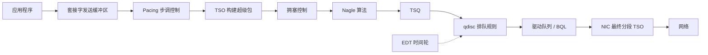

# 10.2 网络：方法、工具与调优

## 其他优化

在 Linux 整个网络协议栈中，还使用了其他算法来提升性能。图 10.11 展示了 TCP 发送路径中的这些算法（其中许多是从 `tcp_write_xmit()` 内核函数调用的）。

**图 10.11 TCP 发送路径**

> [!NOTE] 图像描述
> 该示意图展示了 TCP 发送路径的流程，包含以下关键组件与算法的交互顺序：应用程序将数据写入套接字发送缓冲区，随后依次经过 Pacing（步调控制）、TSO（TCP 分段卸载，构建超级包）、拥塞控制、Nagle 算法、TCP Small Queues (TSQ)，再由排队规则进行排队，接着经过驱动队列和BQL（字节队列限制），最终到达 NIC（网卡接口），NIC 在最终分段时再次使用 TSO 将数据发送到网络。此外，Earliest Departure Time (EDT) 也可作为一种替代队列的时序控制机制作用于该路径。



其中一些组件和算法在前面已经描述过（[[Socket 发送缓冲区]]、[[TSO]]⁹、[[拥塞控制]]、[[Nagle 算法]] 和 [[qdisc 排队规则]]）；其他包括：

- **Pacing（步调控制）**：控制何时发送数据包，通过分散传输来避免可能损害性能的突发流量（这可能有助于避免可能导致排队延迟的 TCP 微突发，甚至避免网络交换机丢包。它也可能有助于解决 incast 问题，即当许多端点同时向一个端点发送数据时 [Fritchie 12]）。
  
- **TCP Small Queues (TSQ)**：控制（减少）网络栈排队的数量，以避免包括 [[Bufferbloat|缓冲区膨胀]] 在内的问题 [Bufferbloat 20]。
  
- **Byte Queue Limits (BQL)**：自动将驱动队列大小调整得足够大以避免饥饿，同时又足够小以减少排队数据包的最大延迟，并避免耗尽 NIC TX 描述符 [Hrubý 12]。它的工作原理是在必要时暂停向驱动队列添加数据包，该功能在 Linux 3.3 中被加入 [Siemon 13]。
  
- **Earliest Departure Time (EDT)**：使用时间轮而不是队列来对发送到 NIC 的数据包进行排序。根据策略和速率配置在每个数据包上设置时间戳。该功能在 Linux 4.20 中被加入，并具有类似 BQL 和 TSQ 的功能 [Jacobson 18]。

> [!TIP] 算法协同
> 这些算法通常协同工作以提高性能。一个 TCP 发送的数据包在到达 NIC 之前，可能会经过拥塞控制、TSO、TSQ、步调控制和排队规则中的任何一种处理 [Cheng 16]。

⁹ 注意，TSO 在图中出现了两次：第一次是在 Pacing 之后用于构建超级包，第二次是在 NIC 中用于最终分段。

---

## 10.5 方法论

本节描述了网络分析和调优的方法论和练习。表 10.2 总结了这些主题。

**表 10.2 网络性能方法论**

| 小节 | 方法论 | 类型 |
| :--- | :--- | :--- |
| 10.5.1 | 工具法 | 观测分析 |
| 10.5.2 | USE 方法 | 观测分析 |
| 10.5.3 | 工作负载特征归纳 | 观测分析，容量规划 |
| 10.5.4 | 延迟分析 | 观测分析 |
| 10.5.5 | 性能监控 | 观测分析，容量规划 |
| 10.5.6 | 抓包分析 | 观测分析 |
| 10.5.7 | TCP 分析 | 观测分析 |
| 10.5.8 | 静态性能调优 | 观测分析，容量规划 |
| 10.5.9 | 资源控制 | 调优 |
| 10.5.10 | 微基准测试 | 实验分析 |

有关更多策略以及其中许多方法的介绍，请参见第 2 章 方法论。

这些方法可以单独使用，也可以组合使用。我的建议是按以下顺序开始使用这些策略：性能监控、USE 方法、静态性能调优和工作负载特征归纳。

第 10.6 节 观测工具，展示了应用这些方法的操作系统工具。

### 10.5.1 工具法

工具法是一个遍历可用工具并检查它们提供的关键指标的过程。它可能会忽略那些工具提供不佳或没有可见性的问题，并且执行起来可能很耗时。

对于网络，工具法可以包括检查：

- **`nstat/netstat -s`**：寻找高重传率和乱序数据包。什么构成“高”重传率取决于客户端：面对不可靠远程客户端的面向互联网的系统，其重传率应该高于客户端位于同一数据中心的内部系统。
  
- **`ip -s link/netstat -i`**：检查接口错误计数器，包括 “errors”、“dropped”、“overruns”。
  
- **`ss -tiepm`**：检查重要套接字的 limiter 标志以查看其瓶颈是什么，以及其他显示套接字健康状况的统计信息。
  
- **`nicstat/ip -s link`**：检查发送和接收的字节速率。高吞吐量可能受限于协商的数据链路速度或外部网络节流。它还可能导致系统上网络用户之间的争用和延迟。
  
- **`tcplife`**：记录 TCP 会话及其进程详细信息、持续时间（生命周期）和吞吐量统计信息。
  
- **`tcptop`**：实时观察顶级 TCP 会话。
  
- **`tcpdump`**：虽然就 CPU 和存储成本而言，使用 `tcpdump(8)` 的代价可能很高，但在短时间内使用它可能有助于识别异常的网络流量或协议头。
  
- **`perf(1)/BCC/bpftrace`**：检查应用程序与网络链路之间的选定数据包，包括检查内核状态。

> [!INFO] 深入排查
> 如果发现问题，请检查可用工具的所有字段以了解更多上下文。有关每个工具的更多信息，请参见第 10.6 节 观测工具。其他方法论可以识别更多类型的问题。

### 10.5.2 USE 方法

USE 方法用于快速识别所有组件的瓶颈和错误。对于每个网络接口，以及在每个方向上——发送（TX）和接收（RX）——检查：

- **使用率**：接口忙于发送或接收帧的时间比例
  
- **饱和度**：由于接口完全被使用而导致的额外排队、缓冲或阻塞的程度
  
- **错误**：对于接收：校验和错误、帧太短（小于数据链路头）或太长、冲突（在交换网络中不太可能发生）；对于发送：延迟冲突（布线不良）

> [!TIP] 检查顺序
> 可以首先检查错误，因为它们通常检查起来很快且最容易解释。

使用率通常不由操作系统或监控工具直接提供（`nicstat(1)` 是个例外）。它可以计算为当前吞吐量除以当前协商速度，针对每个方向（RX、TX）计算。当前吞吐量应以网络上的每秒字节数来衡量，包括所有协议头。

对于实施网络带宽限制（资源控制）的环境，如某些云计算环境中发生的情况，除了物理限制外，可能还需要根据施加的限制来衡量网络使用率。

网络接口的饱和度很难衡量。某些网络缓冲是正常的，因为应用程序发送数据的速度可能比接口传输数据的速度快得多。它可以尝试衡量为应用程序线程在网络发送上被阻塞的时间，该时间应随着饱和度的增加而增加。还要检查是否有其他与接口饱和度更密切相关的内核统计信息，例如 Linux 的 “overruns”。请注意，Linux 使用 [[BQL]] 来调节 NIC 队列大小，这有助于避免 NIC 饱和。

TCP 级别的重传通常很容易作为统计信息获取，并且可以作为网络饱和度的指标。然而，它们是在服务器与其客户端之间的整个网络中测量的，可能由任何跃点处的问题引起。

USE 方法也可以应用于网络控制器，以及它们与处理器之间的传输。由于这些组件的观测工具稀少，基于网络接口统计信息和拓扑推断指标可能更容易。例如，如果网络控制器 A 包含端口 A0 和 A1，则网络控制器吞吐量可以计算为接口吞吐量 A0 + A1 的总和。在已知最大吞吐量的情况下，就可以计算网络控制器的使用率。

### 10.5.3 工作负载特征归纳

在进行容量规划、基准测试和模拟工作负载时，表征所施加的负载是一项重要的练习。通过识别可以消除的不必要工作，它还可以带来一些最大的性能收益。

以下是需要测量的最基本特征：

- **网络接口吞吐量**：RX 和 TX，每秒字节数
  
- **网络接口 IOPS**：RX 和 TX，每秒帧数
  
- **TCP 连接率**：主动和被动，每秒连接数

> [!NOTE] 术语解释
> 术语主动和被动在 10.4.1 节 协议 的三次握手部分中已有描述。

这些特征可能会随时间而变化，因为使用模式在一天中会有所不同。随时间推移的监控在 10.5.5 节 性能监控 中有描述。

以下是一个工作负载描述示例，展示如何将这些属性表达在一起：

> [!EXAMPLE] 工作负载描述示例
> 网络吞吐量因用户而异，并且执行写入（TX）多于读取（RX）。峰值写入速率为 200 Mbytes/s 和 210,000 packets/s，峰值读取速率为 10 Mbytes/s 和 70,000 packets/s。入站（被动）TCP 连接率达到 3,000 connections/s。

除了描述这些系统范围的特征外，它们也可以按接口表达。这使得能够确定接口瓶颈，如果观察到吞吐量已达到线路速率的话。如果存在网络带宽限制（资源控制），它们可能会在达到线路速率之前限制网络吞吐量。

#### 高级工作负载特征归纳/检查清单

可以包含额外的细节来表征工作负载。这里将它们列为需要考虑的问题，在深入研究 CPU 问题时也可以作为检查清单：

- 平均包大小是多少？RX 和 TX 各是多少？
  
- 每一层的协议分布是什么？对于传输协议：TCP、UDP（可以包括 [[QUIC]]）。
  
- 哪些 TCP/UDP 端口是活动的？每秒字节数，每秒连接数？
  
- 广播和多播数据包速率是多少？
  
- 哪些进程正在主动使用网络？

后续小节回答了其中一些问题。有关此方法论和要测量特征（谁、为什么、什么、如何）的更高级别总结，请参见第 2 章 方法论。

# 10.2 网络：方法、工具与调优

### 10.5.4 延时分析

可以通过研究各种时间（延时）来帮助理解和表达网络性能。其中一些在 10.3.5 节（延时）中已介绍过，表 10.3 提供了更完整的列表。尽可能多地测量这些延时，以缩小延时的真正来源范围。

**表 10.3 网络延时**

| 延时 | 描述 |
| :--- | :--- |
| 名称解析延时 | 将主机名解析为 IP 地址的时间，通常通过 DNS 解析完成——这是性能问题的常见来源。 |
| Ping 延时 | 从发送 ICMP 回显请求到收到响应的时间。这测量了数据包在两端主机上的网络传输和内核协议栈处理时间。 |
| TCP 连接初始化延时 | 从发送 SYN 到收到 SYN,ACK 的时间。由于不涉及应用程序，这测量了两端主机上的网络和内核协议栈延时，类似于 Ping 延时，但包含了 TCP 会话额外的一些内核处理时间。可使用 TCP Fast Open (TFO) 来降低此延时。 |
| TCP 首字节延时 | 也称为首字节时间（TTFB, time-to-first-byte latency），测量从连接建立到客户端接收到第一个数据字节的时间。这包含了主机的 CPU 调度和应用思考时间（think time），因此相比 TCP 连接延时，它更是应用性能和当前负载的一种衡量指标。 |
| TCP 重传 | 如果发生重传，可能会给网络 I/O 增加数千毫秒的延时。 |
| TCP TIME_WAIT 延时 | 本地关闭的 TCP 会话为迟到数据包而保持等待的持续时间。 |
| 连接/会话寿命 | 网络连接从初始化到关闭的持续时间。某些协议（如 HTTP）可以使用 keep-alive（保活）策略，让连接保持打开和空闲状态以备后续请求，从而避免重复建立连接的开销和延时。 |
| 系统调用发送/接收延时 | 套接字读/写调用（任何对套接字进行读/写的系统调用，包括 `read(2)`、`write(2)`、`recv(2)`、`send(2)` 及其变体）的时间。 |
| 系统调用连接延时 | 用于建立连接的时间；注意某些应用程序会以非阻塞系统调用的方式执行此操作。 |
| 网络往返时间 | 网络请求在端点之间完成一次往返的时间。内核可能会将此类测量结果与拥塞控制算法结合使用。 |
| 中断延时 | 从网络控制器发出接收数据包中断到内核为其提供服务的时间。 |
| 协议栈内部延时 | 数据包穿过内核 TCP/IP 协议栈的时间。 |

延时可以表示为：

- **按时间间隔的平均值**：最好针对每个客户端/服务器对分别执行，以隔离中间网络的差异。
- **完整分布**：如直方图或热力图。
- **按操作延时**：列出每个事件的详细信息，包括源 IP 地址和目的 IP 地址。

> [!WARNING] 延时异常
> 问题的一个常见来源是由 TCP 重传引起的延时异常值。可以通过完整分布或按操作延时追踪来识别这些问题，包括通过过滤最小延时阈值来发现它们。

延时可以使用追踪工具来测量，对于某些延时，还可以使用套接字选项来测量。在 Linux 上，套接字选项包括用于传入数据包时间的 `SO_TIMESTAMP`（以及用于纳秒级分辨率的 `SO_TIMESTAMPNS`）和用于每个事件时间戳的 `SO_TIMESTAMPING` [Linux 20j]。`SO_TIMESTAMPING` 可以识别传输延迟、网络往返时间和协议栈内部延时；这在分析涉及隧道等复杂的数据包延时时特别有用 [Hassas Yeganeh 19]。

> [!TIP] 负载下的延时测量
> 请注意，某些额外延时的来源是瞬态的，仅在系统负载期间才会出现。为了更真实地测量网络延时，重要的是不仅要测量空闲系统，还要测量负载下的系统。

### 10.5.5 性能监控

性能监控可以识别随着时间的推移出现的活跃问题和行为模式，包括终端用户的日常模式，以及计划内的活动（如网络备份）。

网络监控的关键指标有：

- **吞吐量**：每个网络接口每秒接收和发送的字节数，最好针对每个接口分别统计。
- **连接数**：每秒的 TCP 连接数，作为网络负载的另一个指标。
- **错误**：包括丢包计数器。
- **TCP 重传**：记录此指标也有助于与网络问题进行关联分析。
- **TCP 乱序数据包**：也可能导致性能问题。

> [!INFO] 云环境资源限制
> 对于实施网络带宽限制（资源控制）的环境（如某些云计算环境），也可以收集与施加限制相关的统计数据。

### 10.5.6 数据包嗅探

数据包嗅探（也称数据包抓取/捕获）涉及从网络中捕获数据包，以便可以逐包检查其协议头和数据。对于观察分析来说，这可能是最后的手段，因为它在 CPU 和存储开销方面可能非常昂贵。网络内核代码路径通常是针对周期进行优化的，因为它们每秒需要处理多达数百万个数据包，对任何额外开销都很敏感。为了降低这种开销，内核可以使用环形缓冲区通过共享内存映射将数据包数据传递给用户级追踪工具——例如 [^1]，将 BPF 与 `perf(1)` 的输出环形缓冲区一起使用，以及使用 [[AF_XDP]] [Linux 20k]。解决开销的另一种不同方法是使用带外数据包嗅探器：一台连接到交换机“分接”或“镜像”端口的独立服务器。Amazon 和 Google 等公共云提供商将其作为一项服务提供 [Amazon 19][Google 20b]。

[^1]: 另一种选择是使用 PF_RING 代替逐包的 PF_PACKET，尽管 PF_RING 尚未包含在 Linux 内核中 [Deri 04]。

数据包嗅探通常涉及将数据包捕获到文件中，然后以不同方式分析该文件。一种方式是生成日志，其中每个数据包可以包含以下内容：

- 时间戳
- 整个数据包，包括：
  - 所有协议头（如 Ethernet、IP、TCP）
  - 部分或完整的有效载荷数据
- 元数据：数据包数量，丢弃数量
- 接口名称

作为数据包捕获的示例，以下显示了 Linux `tcpdump(8)` 工具的默认输出：

```bash
# tcpdump -ni eth4
tcpdump: verbose output suppressed, use -v or -vv for full protocol decode
listening on eth4, link-type EN10MB (Ethernet), capture size 65535 bytes
01:20:46.769073 IP 10.2.203.2.22 > 10.2.0.2.33771: Flags [P.], seq 
4235343542:4235343734, ack 4053030377, win 132, options [nop,nop,TS val 328647671 ecr 
2313764364], length 192
01:20:46.769470 IP 10.2.0.2.33771 > 10.2.203.2.22: Flags [.], ack 192, win 501, 
options [nop,nop,TS val 2313764392 ecr 328647671], length 0
01:20:46.787673 IP 10.2.203.2.22 > 10.2.0.2.33771: Flags [P.], seq 192:560, ack 1, 
win 132, options [nop,nop,TS val 328647672 ecr 2313764392], length 368
01:20:46.788050 IP 10.2.0.2.33771 > 10.2.203.2.22: Flags [.], ack 560, win 501, 
options [nop,nop,TS val 2313764394 ecr 328647672], length 0
01:20:46.808491 IP 10.2.203.2.22 > 10.2.0.2.33771: Flags [P.], seq 560:896, ack 1, 
win 132, options [nop,nop,TS val 328647674 ecr 2313764394], length 336
[...]
```

此输出有一行汇总每个数据包，包括 IP 地址、TCP 端口和其他 TCP 协议头详细信息的详情。这可用于调试各种问题，包括消息延时和丢包。

由于数据包捕获可能是一项耗费 CPU 的活动，因此大多数实现都包含在过载时丢弃事件而不是捕获它们的能力。丢弃的数据包计数可能包含在日志中。

除了使用环形缓冲区来降低开销外，数据包捕获实现通常还允许用户提供过滤表达式，并在内核中执行此过滤。这通过不将不需要的数据包传输到用户级别来减少开销。过滤表达式通常使用 Berkeley Packet Filter ([[BPF]]) 进行优化，它将表达式编译为 BPF 字节码，内核可将其 JIT 编译为机器码。近年来，BPF 在 Linux 中已被扩展为一个通用执行环境，为许多可观察性工具提供动力：参见第 3 章“操作系统”第 3.4.4 节“扩展 BPF”以及第 15 章“BPF”。

### 10.5.7 TCP 分析

除了 10.5.4 节“延时分析”中涵盖的内容外，还可以调查其他特定的 TCP 行为，包括：

- TCP（套接字）发送/接收缓冲区的使用情况
- TCP 积压队列的使用情况
- 由于积压队列已满导致的内核丢包
- 拥塞窗口大小，包括零大小通告
- 在 TCP TIME_WAIT 间隔期间收到的 SYN

> [!IMPORTANT] TCP TIME_WAIT 耗尽与扩展性问题
> 当一台服务器频繁连接到另一台服务器上的同一目标端口，且使用相同的源和目的 IP 地址时，最后一种行为可能会成为一个可扩展性问题。每个连接的唯一区分因素是客户端源端口——临时端口，对于 TCP 来说这是一个 16 位的值，并且可能进一步受到操作系统参数（最小值和最大值）的限制。结合可能长达 60 秒的 TCP TIME_WAIT 间隔，高连接速率（60 秒内超过 65,536 次）可能会在新连接时发生冲突。在这种情况下，当该临时端口仍与处于 TIME_WAIT 状态的先前 TCP 会话相关联时发送了新的 SYN，如果新 SYN 被误认为是旧连接的一部分（冲突），则它可能会被拒绝。为避免此问题，Linux 内核尝试快速重用或回收连接（这通常效果很好）。服务器使用多个 IP 地址是另一种可能的解决方案，带有低逗留时间（linger time）的 `SO_LINGER` 套接字选项也是一样。

### 10.5.8 静态性能调优

静态性能调优关注已配置环境中的问题。对于网络性能，请检查静态配置的以下方面：

- 有多少网络接口可用？当前有多少正在使用？
- 网络接口的最大速度是多少？
- 网络接口当前协商的速度是多少？
- 网络接口是协商为半双工还是全双工？
- 为网络接口配置的 MTU 是多少？
- 网络接口是否进行了链路聚合？
- 设备驱动程序存在哪些可调参数？IP 层呢？TCP 层呢？
- 是否有任何可调参数已从默认值更改？
- 路由是如何配置的？默认网关是什么？
- 数据路径中网络组件（所有组件，包括交换机和路由器背板）的最大吞吐量是多少？
- 数据路径的最大 MTU 是多少，是否会发生分片？
- 数据路径中是否存在无线连接？它们是否受到干扰？
- 是否启用了转发？系统是否充当路由器？
- DNS 是如何配置的？服务器有多远？
- 网络接口固件版本或任何其他网络硬件是否存在已知的性能问题（缺陷）？
- 网络设备驱动程序是否存在已知的性能问题（缺陷）？内核 TCP/IP 协议栈呢？
- 存在哪些防火墙？
- 是否存在软件强加的网络吞吐量限制（资源控制）？它们是什么？

这些问题的答案可能会揭示被忽视的配置选择。最后一个问题对于云计算环境尤其相关，因为此类环境可能会对网络吞吐量施加限制。

# 10.2 网络：方法、工具与调优

## 10.5.9 资源控制

操作系统可能会提供控制机制，以限制特定连接类型、进程或进程组的网络资源。这些控制可以包括以下类型：

- **网络带宽限制**：由内核施加的、针对不同协议或应用的允许带宽（最大吞吐量）。
- **IP 服务质量**：由网络组件（例如路由器）执行的网络流量优先级划分。这可以通过不同的方式实现：IP 头部包含服务类型 位，其中包括优先级；这些位后来被重新定义为更新的 QoS 方案，包括差分服务（参见 10.4.1 节 协议 中 IP 标题下的内容）。其他协议层可能也实现了其他优先级机制，用于同样的目的。
- **包延迟**：额外的数据包延迟（例如，使用 Linux 的 `tc-netem(8)`），可用于在测试性能时模拟其他网络环境。

> [!NOTE] 流量优先级与资源控制
> 您的网络中可能混合了可被分类为低优先级和高优先级的流量。低优先级流量可能包括备份传输和性能监控流量；高优先级流量可能是生产服务器与客户端之间的通信。任何一种资源控制方案都可以用来限制低优先级流量，从而为高优先级流量提供更有利的性能。

这些机制的具体工作原理取决于具体的实现：请参见 10.8 节 调优。

## 10.5.10 微基准测试

网络领域有许多基准测试工具。在调查分布式应用环境的吞吐量问题时，这些工具特别有用，可以用来确认网络至少能够达到预期的网络吞吐量。如果无法达到，可以通过网络微基准测试工具来调查网络性能，这通常比调试应用程序要简单得多，也快得多。在网络调优到期望的速度后，注意力就可以重新回到应用程序上。

可以测试的典型因素包括：

- **方向**：发送或接收
- **协议**：TCP 或 UDP，以及端口
- **线程数**
- **缓冲区大小**
- **接口 MTU 大小**

> [!TIP] 高速网络接口的测试
> 更快的网络接口（例如 100 Gbits/s）可能需要多个客户端线程才能驱动至最大带宽。

网络微基准测试工具示例 `iperf(1)` 将在 10.7.4 节 iperf 中介绍，其他工具列在 10.7 节 实验工具 中。

---

## 10.6 观测工具

本节介绍基于 Linux 操作系统的网络性能观测工具。使用这些工具时应遵循的策略请参见前一节。

本节介绍的工具列于表 10.4 中。

**表 10.4 网络观测工具**

| 小节 | 工具 | 描述 |
| :--- | :--- | :--- |
| 10.6.1 | [[ss]] | 套接字统计 |
| 10.6.2 | [[ip]] | 网络接口与路由统计 |
| 10.6.3 | `ifconfig` | 网络接口统计 |
| 10.6.4 | [[nstat]] | 网络栈统计 |
| 10.6.5 | `netstat` | 各种网络栈与接口统计 |
| 10.6.6 | `sar` | 历史统计 |
| 10.6.7 | `nicstat` | 网络接口吞吐量与利用率 |
| 10.6.8 | `ethtool` | 网络接口驱动统计 |
| 10.6.9 | `tcplife` | 跟踪 TCP 会话生命周期及连接详情 |
| 10.6.10 | `tcptop` | 按主机和进程显示 TCP 吞吐量 |
| 10.6.11 | `tcpretrans` | 跟踪 TCP 重传（含地址与 TCP 状态） |
| 10.6.12 | [[bpftrace]] | TCP/IP 栈跟踪：连接、数据包、丢包、延迟 |
| 10.6.13 | `tcpdump` | 网络数据包嗅探器 |
| 10.6.14 | Wireshark | 图形化网络数据包检查 |

> [!INFO] 工具选择背景
> 这是一组支持 10.5 节 方法论 的工具和功能选编，从传统工具和统计数据开始，接着是跟踪工具，最后是数据包捕获工具。一些传统工具可能在其发源的其他类 Unix 操作系统上也可用，包括：`ifconfig(8)`、`netstat(8)` 和 `sar(1)`。
> 
> 跟踪工具基于 BPF，并使用 BCC 和 bpftrace 前端（第 15 章）；它们是：`socketio(8)`、`tcplife(8)`、`tcptop(8)` 和 `tcpretrans(8)`。
> 
> 首先介绍的统计工具是 `ss(8)`、`ip(8)` 和 `nstat(8)`，因为它们来自由网络内核工程师维护的 `iproute2` 软件包。该软件包中的工具最有可能支持最新的 Linux 内核特性。来自 `net-tools` 软件包的类似工具，即 `ifconfig(8)` 和 `netstat(8)`，也会被涵盖，因为它们仍被广泛使用，尽管 Linux 内核网络工程师认为它们已被弃用。

### 10.6.1 ss

`ss(8)` 是一个套接字统计工具，用于汇总打开的套接字。默认输出提供有关套接字的高级信息，例如：

```bash
# ss
Netid State     Recv-Q  Send-Q    Local Address:Port      Peer Address:Port 
[...]
tcp   ESTAB     0       0         100.85.142.69:65264    100.82.166.11:6001 
tcp   ESTAB     0       0         100.85.142.69:6028     100.82.16.200:6101 
[...]
```

此输出是当前状态的快照。第一列显示套接字使用的协议：这里是 TCP。由于此输出列出了所有带有 IP 地址信息的已建立连接，因此可用于表征当前的工作负载，并回答包括打开了多少客户端连接、到依赖服务有多少并发连接等问题。

使用较老的 `netstat(8)` 工具也可以获得类似的逐套接字信息。然而，`ss(8)` 在使用选项时可以显示更多信息。例如，仅显示 TCP 套接字 (`-t`)，并附带 TCP 内部信息 (`-i`)、扩展套接字信息 (`-e`)、进程信息 (`-p`) 和内存使用情况 (`-m`)：

```bash
# ss -tiepm
State     Recv-Q  Send-Q    Local Address:Port      Peer Address:Port              
                                                                                        
ESTAB     0       0         100.85.142.69:65264     100.82.166.11:6001   
 users:(("java",pid=4195,fd=10865)) uid:33 ino:2009918 sk:78 <->
         skmem:(r0,rb12582912,t0,tb12582912,f266240,w0,o0,bl0,d0) ts sack bbr ws
cale:9,9 rto:204 rtt:0.159/0.009 ato:40 mss:1448 pmtu:1500 rcvmss:1448 advmss:14
48 cwnd:152 bytes_acked:347681 bytes_received:1798733 segs_out:582 segs_in:1397 
data_segs_out:294 data_segs_in:1318 bbr:(bw:328.6Mbps,mrtt:0.149,pacing_gain:2.8
8672,cwnd_gain:2.88672) send 11074.0Mbps lastsnd:1696 lastrcv:1660 lastack:1660 
pacing_rate 2422.4Mbps delivery_rate 328.6Mbps app_limited busy:16ms rcv_rtt:39.
822 rcv_space:84867 rcv_ssthresh:3609062 minrtt:0.139
[...]
```

输出中以粗体（此处由上下文指出）高亮显示的是端点地址及以下详细信息：

- **"java",pid=4195**：进程名 “java”，PID 为 4195。
- **fd=10865**：文件描述符 10865（对应 PID 4195）。
- **rto:204**：TCP 重传超时：204 毫秒。
- **rtt:0.159/0.009**：平均往返时间为 0.159 毫秒，平均偏差为 0.009 毫秒。
- **mss:1448**：最大段大小：1448 字节。
- **cwnd:152**：拥塞窗口大小：152 × MSS。
- **bytes_acked:347681**：成功传输了 340 KB。
- **bytes_received:1798733**：接收了 1.72 MB。
- **bbr:...**：BBR 拥塞控制统计信息。
- **pacing_rate 2422.4Mbps**：步调速率为 2422.4 Mbps。
- **app_limited**：表明拥塞窗口未被充分利用，暗示该连接受限于应用程序。
- **minrtt:0.139**：最小往返时间（毫秒）。将其与平均值和平均偏差（前面列出）进行比较，以了解网络变化和拥塞情况。

> [!NOTE] 连接受限标志
> 这个特定的连接被标记为受限于应用程序 (`app_limited`)，到远程端点的 RTT 很低，且传输的总字节数也很少。`ss(1)` 可以打印的可能“受限”标志有：
> - **app_limited**：受限于应用程序。
> - **rwnd_limited:Xms**：受接收窗口限制。包括受限的时间（毫秒）。
> - **sndbuf_limited:Xms**：受发送缓冲区限制。包括受限的时间（毫秒）。

上述输出中缺失的一个细节是连接的持续时间，这是计算平均吞吐量所必需的。我发现的一种变通方法是使用 `/proc` 中文件描述符文件的更改时间戳：对于此连接，我会在 `/proc/4195/fd/10865` 上运行 `stat(1)`。

#### netlink

`ss(8)` 从 `netlink(7)` 接口读取这些扩展细节，该接口通过 `AF_NETLINK` 族的套接字运行以从内核获取信息。您可以使用 `strace(1)` 观察其工作过程（有关 `strace(1)` 开销的警告，请参见第 5 章 应用程序，第 5.5.4 节 strace）：

```bash
# strace -e sendmsg,recvmsg ss -t
sendmsg(3, {msg_name={sa_family=AF_NETLINK, nl_pid=0, nl_groups=00000000}, 
msg_namelen=12, msg_iov=[{iov_base={{len=72, type=SOCK_DIAG_BY_FAMILY, 
flags=NLM_F_REQUEST|NLM_F_DUMP, seq=123456, pid=0}, {sdiag_family=AF_INET, 
sdiag_protocol=IPPROTO_TCP, idiag_ext=1<<(INET_DIAG_MEMINFO-1)|...
recvmsg(3, {msg_name={sa_family=AF_NETLINK, nl_pid=0, nl_groups=00000000},...
[...]
```

而 `netstat(8)` 则使用 `/proc/net` 文件作为信息来源：

```bash
# strace -e openat netstat -an
[...]
openat(AT_FDCWD, "/proc/net/tcp", O_RDONLY) = 3
openat(AT_FDCWD, "/proc/net/tcp6", O_RDONLY) = 3
[...]
```

> [!TIP] 数据源选择建议
> 由于 `/proc/net` 文件是文本格式的，我发现它们作为临时报告的数据源非常方便，只需要 `awk(1)` 进行处理即可。但严肃的监控工具应该使用 `netlink(7)` 接口，它以二进制格式传递信息，并避免了文本解析的开销。

### 10.6.2 ip

`ip(8)` 是一个用于管理路由、网络设备、接口和隧道的工具。在可观测性方面，它可用于打印有关：链路、地址、路由等方面的统计信息。例如，打印接口（链路 link）的额外统计信息 (`-s`)：

```bash
# ip -s link
1: lo: <LOOPBACK,UP,LOWER_UP> mtu 65536 qdisc noqueue state UNKNOWN mode DEFAULT 
group default qlen 1000
    link/loopback 00:00:00:00:00:00 brd 00:00:00:00:00:00
    RX: bytes  packets  errors  dropped overrun mcast   
    26550075   273178   0       0       0       0       
    TX: bytes  packets  errors  dropped carrier collsns 
    26550075   273178   0       0       0       0      
 
2: eth0: <BROADCAST,MULTICAST,UP,LOWER_UP> mtu 1500 qdisc mq state UP mode DEFAULT 
group default qlen 1000
    link/ether 12:c0:0a:b0:21:b8 brd ff:ff:ff:ff:ff:ff
    RX: bytes  packets  errors  dropped overrun mcast   
    512473039143 568704184 0       0       0       0       
    TX: bytes  packets  errors  dropped carrier collsns 
    573510263433 668110321 0       0       0       0     
```

在静态性能调优期间，检查所有接口的配置会非常有用，以便发现配置错误。输出中还包含错误指标：对于接收 (RX)：接收错误、丢包和溢出；对于发送 (TX)：发送错误、丢包、载波错误和冲突。这些错误可能是性能问题的根源，并且根据错误类型，可能是由有故障的网络硬件引起的。这些是全局计数器，显示了自接口激活（用网络术语说，即被设为 “UP”）以来的所有错误。

指定两次 `-s` 选项 (`-s -s`) 可以提供更多关于错误类型的统计信息。

尽管 `ip(8)` 提供了 RX 和 TX 的字节计数器，但它不包含打印时间间隔内当前吞吐量的选项。为此，请使用 `sar(1)`（10.6.6 节 sar）。

#### 路由表

`ip(1)` 确实具有观测其他网络组件的功能。例如，`route` 对象可显示路由表：

```bash
# ip route
default via 100.85.128.1 dev eth0 
default via 100.85.128.1 dev eth0 proto dhcp src 100.85.142.69 metric 100 
100.85.128.0/18 dev eth0 proto kernel scope link src 100.85.142.69 
100.85.128.1 dev eth0 proto dhcp scope link src 100.85.142.69 metric 100 
```

> [!WARNING] 路由配置与性能
> 配置错误的路由也可能成为性能问题的根源（例如，管理员添加了特定路由条目，但该条目已不再需要，且现在其性能比默认路由还要差）。

#### 监控

使用监控子命令 `ip monitor` 来监视 netlink 消息。

# 10.2 网络：方法、工具与调优

### 10.6.3 ifconfig

`ifconfig(8)` 命令是传统的接口管理工具，也可以列出所有接口的配置。Linux 版本在输出中包含了统计信息 ¹¹：

```bash
$ ifconfig
eth0      Link encap:Ethernet  HWaddr 00:21:9b:97:a9:bf  
          inet addr:10.2.0.2  Bcast:10.2.0.255  Mask:255.255.255.0
          inet6 addr: fe80::221:9bff:fe97:a9bf/64 Scope:Link
          UP BROADCAST RUNNING MULTICAST  MTU:1500  Metric:1
          RX packets:933874764 errors:0 dropped:0 overruns:0 frame:0
          TX packets:1090431029 errors:0 dropped:0 overruns:0 carrier:0
          collisions:0 txqueuelen:1000
          RX bytes:584622361619 (584.6 GB)  TX bytes:537745836640 (537.7 GB)
          Interrupt:36 Memory:d6000000-d6012800 
eth3      Link encap:Ethernet  HWaddr 00:21:9b:97:a9:c5  
[...]
```

¹¹ 它还显示了一个可调参数 `txqueuelen`，但并非所有驱动程序都使用该值（它调用带有 `NETDEV_CHANGE_TX_QUEUE_LEN` 的 netdevice 通知器，而某些驱动程序未实现此功能），并且字节队列限制会自动调整设备队列。

这些计数器与 `ip(8)` 命令中描述的计数器相同。

> [!INFO] 工具演进
> 在 Linux 上，`ifconfig(8)` 已被视为过时，被 `ip(8)` 所取代。

### 10.6.4 nstat

`nstat(8)` 打印内核维护的各种网络指标，并带有它们的 [[SNMP]] 名称。例如，使用 `-s` 选项来避免重置计数器：

```bash
# nstat -s
#kernel
IpInReceives                    462657733          0.0
IpInDelivers                    462657733          0.0
IpOutRequests                   497050986          0.0
IpOutDiscards                   42                 0.0
IpFragOKs                       2298               0.0
IpFragCreates                   13788              0.0
IcmpInMsgs                      91                 0.0
[...]
TcpActiveOpens                  362997             0.0
TcpPassiveOpens                 9663983            0.0
TcpAttemptFails                 12718              0.0
TcpEstabResets                  14591              0.0
TcpInSegs                       462181482          0.0
TcpOutSegs                      938958577          0.0
TcpRetransSegs                  129212             0.0
TcpOutRsts                      52362              0.0
UdpInDatagrams                  476072             0.0
UdpNoPorts                      88                 0.0
UdpOutDatagrams                 476197             0.0
UdpIgnoredMulti                 2                  0.0
Ip6OutRequests                  29                 0.0
[...]
```

关键指标包括：

- **IpInReceives**：入站 IP 数据包。
- **IpOutRequests**：出站 IP 数据包。
- **TcpActiveOpens**：TCP 主动连接（`connect(2)` 套接字系统调用）。
- **TcpPassiveOpens**：TCP 被动连接（`accept(2)` 套接字系统调用）。
- **TcpInSegs**：TCP 入站段。
- **TcpOutSegs**：TCP 出站段。
- **TcpRetransSegs**：TCP 重传段。与 `TcpOutSegs` 比较可得出重传率。

> [!WARNING] 计数器重置行为
> 如果不使用 `-s` 选项，`nstat(8)` 的默认行为是重置内核计数器。这可能很有用，因为您可以随后第二次运行 `nstat(8)` 并查看跨越该时间间隔的计数，而不是自启动以来的总数。如果您有一个可以通过命令复现的网络问题，那么可以在该命令之前和之后运行 `nstat(8)`，以显示哪些计数器发生了变化。
> 
> 如果您忘记使用 `-s` 并且错误地重置了计数器，可以使用 `-rs` 将它们恢复为自启动以来的汇总值。

`nstat(8)` 还具有守护进程模式（`-d`）用于收集间隔统计信息，使用时这些信息将显示在最后一列中。

### 10.6.5 netstat

`netstat(8)` 命令根据使用的选项报告各种类型的网络统计信息。它就像一个具有多种不同功能的多功能工具。这些功能包括：

- **（默认）**：列出已连接的套接字
- **-a**：列出所有套接字的信息
- **-s**：网络栈统计信息
- **-i**：网络接口统计信息
- **-r**：列出路由表

其他选项可以修改输出，包括 `-n`（不将 IP 地址解析为主机名）和 `-v`（在可用的情况下提供详细细节）。

以下是 `netstat(8)` 接口统计信息的示例：

```bash
$ netstat -i
Kernel Interface table
Iface    MTU     RX-OK RX-ERR RX-DRP RX-OVR      TX-OK TX-ERR TX-DRP TX-OVR Flg
eth0    1500 933760207      0      0 0      1090211545      0      0      0 BMRU
eth3    1500 718900017      0      0 0       587534567      0      0      0 BMRU
lo     16436 21126497       0      0 0        21126497      0      0      0 LRU
ppp5    1496     4225       0      0 0            3736      0      0      0 MOPRU
ppp6    1496     1183       0      0 0            1143      0      0      0 MOPRU
tun0    1500   695581       0      0 0          692378      0      0      0 MOPRU
tun1    1462        0       0      0 0               4      0      0      0 PRU
```

列包括网络接口（`Iface`）、`MTU`，以及一系列接收（`RX-`）和发送（`TX-`）的指标：

- **-OK**：成功传输的数据包
- **-ERR**：数据包错误
- **-DRP**：数据包丢弃
- **-OVR**：数据包溢出

> [!TIP] USE 方法应用
> 数据包丢弃和溢出是网络接口饱和的迹象，可以作为 [[USE 方法]] 的一部分与错误一起检查。

`-c` 连续模式可以与 `-i` 一起使用，每秒打印这些累积计数器。这为计算数据包速率提供了数据。

以下是 `netstat(8)` 网络栈统计信息的示例（已截断）：

```bash
$ netstat -s
Ip:
    Forwarding: 2
    454143446 total packets received
    0 forwarded
    0 incoming packets discarded
    454143446 incoming packets delivered
    487760885 requests sent out
    42 outgoing packets dropped
    2260 fragments received ok
    13560 fragments created
Icmp:
    91 ICMP messages received
[...]
Tcp:
    359286 active connection openings
    9463980 passive connection openings
    12527 failed connection attempts
    14323 connection resets received
    13545 connections established
    453673963 segments received
    922299281 segments sent out
    127247 segments retransmitted
    0 bad segments received
    51660 resets sent
Udp:
    469302 packets received
    88 packets to unknown port received
    0 packet receive errors
    469427 packets sent
    0 receive buffer errors
    0 send buffer errors
    IgnoredMulti: 2
TcpExt:
    21 resets received for embryonic SYN_RECV sockets
    12252 packets pruned from receive queue because of socket buffer overrun
    201219 TCP sockets finished time wait in fast timer
    11727438 delayed acks sent
    1445 delayed acks further delayed because of locked socket
    Quick ack mode was activated 17624 times
    169257582 packet headers predicted
    76058392 acknowledgments not containing data payload received
    111925821 predicted acknowledgments
    TCPSackRecovery: 1703
    Detected reordering 876 times using SACK
    Detected reordering 19 times using time stamp
    2 congestion windows fully recovered without slow start
    19 congestion windows partially recovered using Hoe heuristic
    TCPDSACKUndo: 164
    88 congestion windows recovered without slow start after partial ack
    TCPLostRetransmit: 901
    TCPSackFailures: 31
    28248 fast retransmits
    709 retransmits in slow start
    TCPTimeouts: 12684
    TCPLossProbes: 73383
    TCPLossProbeRecovery: 132
    TCPSackRecoveryFail: 24
    805315 packets collapsed in receive queue due to low socket buffer
[...]
    TCPAutoCorking: 13520259
    TCPFromZeroWindowAdv: 257
    TCPToZeroWindowAdv: 257
    TCPWantZeroWindowAdv: 18941
    TCPSynRetrans: 24816
[...]
```

输出列出了各种网络统计信息，大部分来自 TCP，并按其协议分组。幸运的是，其中许多具有较长的描述性名称，因此其含义可能很明显。其中一些统计信息已加粗突出显示，以展示可用的性能相关信息。其中许多需要对 TCP 行为有深入的理解，包括近年来引入的新特性和算法。

> [!EXAMPLE] 需要关注的一些统计信息示例
> - **转发数据包与接收总数据包的高比率**：检查服务器是否应该转发（路由）数据包。
> - **被动连接打开**：可以对其进行监控，以客户端连接为单位显示负载。
> - **重传段与发送段的高比率**：可能表明网络不可靠。这可能是预期之中的（例如 Internet 客户端）。
> - **TCPSynRetrans**：显示重传的 SYN，这可能是由于远程端点因负载而丢弃了监听积压队列中的 SYN 引起的。
> - **由于套接字缓冲区溢出而从接收队列中修剪的数据包**：这是网络饱和的标志，可以通过增加套接字缓冲区来修复，前提是有足够的系统资源让应用程序跟上速度。

> [!BUG] 统计名称拼写错误
> 某些统计名称包含拼写错误（例如 "packetes rejected"）。如果其他监控工具是基于相同的输出构建的，那么简单地修复这些问题可能会带来麻烦。此类工具最好通过处理使用标准 SNMP 名称的 `nstat(8)` 输出来提供服务，或者更好的是，直接读取这些统计信息的 `/proc` 源文件，即 `/proc/net/snmp` 和 `/proc/net/netstat`。例如：
> ```bash
> $ grep ^Tcp /proc/net/snmp
> Tcp: RtoAlgorithm RtoMin RtoMax MaxConn ActiveOpens PassiveOpens AttemptFails 
> EstabResets CurrEstab InSegs OutSegs RetransSegs InErrs OutRsts InCsumErrors
> Tcp: 1 200 120000 -1 102378 126946 11940 19495 24 627115849 325815063 346455 5 24183 
> 0
> ```
> 这些 `/proc/net/snmp` 统计信息还包括 [[SNMP]] 管理信息库（MIB）。MIB 文档描述了每个统计信息应该是什么（如果内核已正确实现了它）。扩展统计信息位于 `/proc/net/netstat` 中。

可以将以秒为单位的时间间隔与 `netstat(8)` 一起使用，以便它每隔该时间间隔连续打印累积计数器。然后可以对此输出进行后处理，以计算每个计数器的速率。

### 10.6.6 sar

系统活动报告器 `sar(1)` 可用于观察当前活动，并且可以配置为归档和报告历史统计信息。它在第 4 章“可观测性工具”中进行了介绍，并在其他相关章节中也有所提及。

Linux 版本通过以下选项提供网络统计信息：

- **-n DEV**：网络接口统计信息
- **-n EDEV**：网络接口错误
- **-n IP**：IP 数据报统计信息
- **-n EIP**：IP 错误统计信息
- **-n TCP**：TCP 统计信息
- **-n ETCP**：TCP 错误统计信息
- **-n SOCK**：套接字使用情况

提供的统计信息包括表 10.5 中所示的内容。

**表 10.5 Linux sar 网络统计信息**

| 选项 | 统计信息 | 描述 | 单位 |
| :--- | :--- | :--- | :--- |
| -n DEV | rxpkt/s | 接收的数据包 | 数据包/秒 |
| -n DEV | txpkt/s | 发送的数据包 | 数据包/秒 |
| -n DEV | rxkB/s | 接收的千字节 | 千字节/秒 |
| -n DEV | txkB/s | 发送的千字节 | 千字节/秒 |
| -n DEV | rxcmp/s | 接收的压缩数据包 | 数据包/秒 |
| -n DEV | txcmp/s | 发送的压缩数据包 | 数据包/秒 |
| -n DEV | rxmcst/s | 接收的多播数据包 | 数据包/秒 |
| -n DEV | %ifutil | 接口利用率：对于全双工，取 rx 或 tx 中的较大值 | 百分比 |
| -n EDEV | rxerr/s | 接收的数据包错误 | 数据包/秒 |
| -n EDEV | txerr/s | 发送的数据包错误 | 数据包/秒 |
| -n EDEV | coll/s | 冲突 | 数据包/秒 |
| -n EDEV | rxdrop/s | 接收时丢弃的数据包（缓冲区满） | 数据包/秒 |
| -n EDEV | txdrop/s | 发送时丢弃的数据包（缓冲区满） | 数据包/秒 |
| -n EDEV | txcarr/s | 发送载波错误 | 错误/秒 |
| -n EDEV | rxfram/s | 接收对齐错误 | 错误/秒 |
| -n EDEV | rxfifo/s | 接收数据包 FIFO 溢出错误 | 数据包/秒 |
| -n EDEV | txfifo/s | 发送数据包 FIFO 溢出错误 | 数据包/秒 |

# 10.2 网络：方法、工具与调优

| 选项 | 统计项 | 描述 | 单位 |
| :--- | :--- | :--- | :--- |
| -n IP | irec/s | 输入数据报（已接收） | Datagrams/s |
| -n IP | fwddgm/s | 转发的数据报 | Datagrams/s |
| -n IP | idel/s | 输入 IP 数据报（包括 ICMP） | Datagrams/s |
| -n IP | orq/s | 输出数据报请求（传输） | Datagrams/s |
| -n IP | asmrq/s | 已接收的 IP 分片 | Fragments/s |
| -n IP | asmok/s | 已重组的 IP 数据报 | Datagrams/s |
| -n IP | fragok/s | 已分片的 IP 数据报 | Datagrams/s |
| -n IP | fragcrt/s | 已创建的 IP 数据报分片 | Fragments/s |
| -n EIP | ihdrerr/s | IP 首部错误 | Datagrams/s |
| -n EIP | iadrerr/s | 无效的 IP 目的地址错误 | Datagrams/s |
| -n EIP | iukwnpr/s | 未知协议错误 | Datagrams/s |
| -n EIP | idisc/s | 输入丢弃（如：缓冲区满） | Datagrams/s |
| -n EIP | odisc/s | 输出丢弃（如：缓冲区满） | Datagram/s |
| -n EIP | onort/s | 输出数据报无路由错误 | Datagrams/s |
| -n EIP | asmf/s | IP 重组失败 | Failures/s |
| -n EIP | fragf/s | IP 不分片丢弃 | Datagrams/s |
| -n TCP | active/s | 新增主动 TCP 连接 (connect(2)) | Connections/s |
| -n TCP | passive/s | 新增被动 TCP 连接 (accept(2)) | Connections/s |
| -n TCP | iseg/s | 输入报文段（已接收） | Segments/s |
| -n TCP | oseg/s | 输出报文段（已接收） | Segments/s |
| -n ETCP | atmptf/s | 主动 TCP 连接失败 | Connections/s |
| -n ETCP | estres/s | 已建立连接的重置 | Resets/s |
| -n ETCP | retrans/s | TCP 报文段重传 | Segments/s |
| -n ETCP | isegerr/s | 报文段错误 | Segments/s |
| -n ETCP | orsts/s | 已发送的重置 | Segments/s |
| -n SOCK | totsck | 正在使用的套接字总数 | Sockets |
| -n SOCK | tcpsck/s | 正在使用的 TCP 套接字总数 | Sockets |
| -n SOCK | udpsck/s | 正在使用的 UDP 套接字总数 | Sockets |
| -n SOCK | rawsck/s | 正在使用的 RAW 套接字总数 | Sockets |
| -n SOCK | ip-frag | 当前排队的 IP 分片 | Fragments |
| -n SOCK | tcp-tw | 处于 TIME_WAIT 状态的 TCP 套接字 | Sockets |

> [!INFO] 未列出的统计组
> 此处未列出的还包括 ICMP、NFS 和 SOFT（软件网络处理）组，以及 IPv6 变体：IP6、EIP6、SOCK6 和 UDP6。请参阅手册页获取完整的统计信息列表，其中还注明了一些等效的 SNMP 名称（例如，`irec/s` 对应 `ipInReceives`）。许多 `sar(1)` 统计名称在实践中很容易记忆，因为它们包含了方向和测量单位：`rx` 代表“received（已接收）”，`i` 代表“input（输入）”，`seg` 代表“segments（报文段）”等等。

以下示例每秒打印一次 TCP 统计信息：

```bash
$ sar -n TCP 1
Linux 5.3.0-1010-aws (ip-10-1-239-218)    02/27/20        _x86_64_  (2 CPU)
07:32:45     active/s passive/s    iseg/s    oseg/s
07:32:46         0.00     12.00    186.00  28837.00
07:32:47         0.00     13.00    203.00  33584.00
07:32:48         0.00     11.00   1999.00  24441.00
07:32:49         0.00      7.00     92.00   8908.00
07:32:50         0.00     10.00    114.00  13795.00
 [...]
```

输出显示被动连接速率（入站）约为每秒 10 次。

当检查网络设备 (DEV) 时，网络接口统计列 (IFACE) 会列出所有接口；然而，通常我们只关心其中一个。以下示例使用一点 `awk(1)` 来过滤输出：

```bash
$ sar -n DEV 1 | awk 'NR == 3 || $2 == "ens5"'
07:35:41 IFACE  rxpck/s   txpck/s  rxkB/s   txkB/s rxcmp/s txcmp/s rxmcst/s %ifutil
07:35:42  ens5   134.00  11483.00   10.22  6328.72    0.00    0.00     0.00    0.00
07:35:43  ens5   170.00  20354.00   13.62  6925.27    0.00    0.00     0.00    0.00
07:35:44  ens5   185.00  28228.00   14.33  8586.79    0.00    0.00     0.00    0.00
07:35:45  ens5   180.00  23093.00   14.59  7452.49    0.00    0.00     0.00    0.00
07:35:46  ens5  1525.00  19594.00  137.48  7044.81    0.00    0.00     0.00    0.00
07:35:47  ens5   146.00  10282.00   12.05  6876.80    0.00    0.00     0.00    0.00
[...]
```

这显示了传输和接收的网络吞吐量以及其他统计信息。

`atop(1)` 工具也能够归档统计信息。

## 10.6.7 nicstat

[[nicstat|nicstat(1)]]^12 打印网络接口统计信息，包括吞吐量和利用率。它遵循传统资源统计工具 `iostat(1)` 和 `mpstat(1)` 的风格。

> [!NOTE] 脚注 12
> 12 我为 Solaris 开发了原始版本；Tim Cook 开发了 Linux 版本 [Cook 09]。

以下是在 Linux 上 1.92 版本的输出：

```bash
# nicstat -z 1
    Time      Int   rKB/s   wKB/s   rPk/s   wPk/s    rAvs    wAvs %Util    Sat
01:20:58     eth0    0.07    0.00    0.95    0.02   79.43   64.81  0.00   0.00
01:20:58     eth4    0.28    0.01    0.20    0.10  1451.3   80.11  0.00   0.00
01:20:58  vlan123    0.00    0.00    0.00    0.02   42.00   64.81  0.00   0.00
01:20:58      br0    0.00    0.00    0.00    0.00   42.00   42.07  0.00   0.00
    Time      Int   rKB/s   wKB/s   rPk/s   wPk/s    rAvs    wAvs %Util    Sat
01:20:59     eth4 42376.0   974.5 28589.4 14002.1  1517.8   71.27  35.5   0.00
    Time      Int   rKB/s   wKB/s   rPk/s   wPk/s    rAvs    wAvs %Util    Sat
01:21:00     eth0    0.05    0.00    1.00    0.00   56.00    0.00  0.00   0.00
01:21:00     eth4 41834.7   977.9 28221.5 14058.3  1517.9   71.23  35.1   0.00
    Time      Int   rKB/s   wKB/s   rPk/s   wPk/s    rAvs    wAvs %Util    Sat
01:21:01     eth4 42017.9   979.0 28345.0 14073.0  1517.9   71.24  35.2   0.00
```

第一行输出是自启动以来的摘要，随后是间隔摘要。间隔摘要显示 eth4 接口的利用率为 35%（这报告的是 RX 或 TX 方向中当前较高的利用率），并且读取速度为 42 Mbytes/s。

字段包括接口名称 (Int)、最大利用率 (%Util)、反映接口饱和度统计信息的值 (Sat)，以及一系列以 `r` 表示“read（读取/接收）”和 `w` 表示“write（写入/传输）”为前缀的统计信息：

- **KB/s**：每秒千字节数
- **Pk/s**：每秒数据包数
- **Avs/s**：平均数据包大小，字节

此版本支持的选项包括 `-z` 用于跳过全零行（空闲接口），以及 `-t` 用于 TCP 统计信息。

> [!TIP] USE 方法利器
> `nicstat(1)` 对于 [[USE 方法]] 特别有用，因为它提供了利用率和饱和度数值。

## 10.6.8 ethtool

[[ethtool|ethtool(8)]] 可用于通过 `-i` 和 `-k` 选项检查网络接口的静态配置，还可以使用 `-S` 打印驱动程序统计信息。例如：

```bash
# ethtool -S eth0
NIC statistics:
     tx_timeout: 0
     suspend: 0
     resume: 0
     wd_expired: 0
     interface_up: 1
     interface_down: 0
     admin_q_pause: 0
     queue_0_tx_cnt: 100219217
     queue_0_tx_bytes: 84830086234
     queue_0_tx_queue_stop: 0
     queue_0_tx_queue_wakeup: 0
     queue_0_tx_dma_mapping_err: 0
     queue_0_tx_linearize: 0
     queue_0_tx_linearize_failed: 0
     queue_0_tx_napi_comp: 112514572
     queue_0_tx_tx_poll: 112514649
     queue_0_tx_doorbells: 52759561
[...]
```

这从许多网络设备驱动程序支持的内核 ethtool 框架中获取统计信息。设备驱动程序可以定义自己的 ethtool 统计信息。

`-i` 选项显示驱动程序详细信息，`-k` 显示接口可调参数。例如：

```bash
# ethtool -i eth0
driver: ena
version: 2.0.3K
[...]
# ethtool -k eth0
Features for eth0:
rx-checksumming: on
[...]
tcp-segmentation-offload: off
        tx-tcp-segmentation: off [fixed]
        tx-tcp-ecn-segmentation: off [fixed]
        tx-tcp-mangleid-segmentation: off [fixed]
        tx-tcp6-segmentation: off [fixed]
udp-fragmentation-offload: off
generic-segmentation-offload: on
generic-receive-offload: on
large-receive-offload: off [fixed]
rx-vlan-offload: off [fixed]
tx-vlan-offload: off [fixed]
ntuple-filters: off [fixed]
receive-hashing: on
highdma: on
[...]
```

此示例是使用 ena 驱动程序的云实例，其 `tcp-segmentation-offload` 处于关闭状态。可以使用 `-K` 选项更改这些可调参数。

## 10.6.9 tcplife

[[tcplife|tcplife(8)]]^13 是一个 BCC 和 bpftrace 工具，用于跟踪 TCP 会话的生命周期，显示其持续时间、地址详细信息、吞吐量，并在可能的情况下显示负责的进程 ID 和名称。

以下显示了来自 BCC 的 `tcplife(8)`，在一个 48 CPU 的生产实例上运行：

```bash
# tcplife
PID   COMM       LADDR           LPORT RADDR           RPORT TX_KB RX_KB MS
4169  java       100.1.111.231   32648 100.2.0.48      6001      0     0 3.99
4169  java       100.1.111.231   32650 100.2.0.48      6001      0     0 4.10
4169  java       100.1.111.231   32644 100.2.0.48      6001      0     0 8.41
4169  java       100.1.111.231   40158 100.2.116.192   6001      7    33 3590.91
4169  java       100.1.111.231   56940 100.5.177.31    6101      0     0 2.48
4169  java       100.1.111.231   6001  100.2.176.45    49482     0     0 17.94
4169  java       100.1.111.231   18926 100.5.102.250   6101      0     0 0.90
4169  java       100.1.111.231   44530 100.2.31.140    6001      0     0 2.64
4169  java       100.1.111.231   44406 100.2.8.109     6001     11    28 3982.11
34781 sshd       100.1.111.231   22    100.2.17.121    41566     5     7 2317.30
4169  java       100.1.111.231   49726 100.2.9.217     6001     11    28 3938.47
4169  java       100.1.111.231   58858 100.2.173.248   6001      9    30 2820.51
[...]
```

此输出显示了一系列短期存活（少于 20 毫秒）或长期存活（超过 3 秒）的连接，如持续时间列所示（MS 代表毫秒）。这是一个监听端口 6001 的应用服务器池。此屏幕截图中的大多数会话显示的是与远程应用服务器上端口 6001 的连接，只有一个连接到本地端口 6001。还看到了一个 ssh 会话，由 sshd 拥有，本地端口为 22——这是一个入站会话。

BCC 版本的 `tcplife(8)` 支持的选项包括：

- **-t**：包含时间列 (HH:MM:SS)
- **-w**：更宽的列（以更好地适应 IPv6 地址）
- **-p PID**：仅跟踪此进程
- **-L PORT[,PORT[,...]]**：仅跟踪具有这些本地端口的会话
- **-D PORT[,PORT[,...]]**：仅跟踪具有这些远程端口的会话

> [!INFO] 工作原理与开销
> 此工具通过跟踪 TCP 套接字状态更改事件来工作，并在状态更改为 `TCP_CLOSE` 时打印摘要详细信息。这些状态更改事件的频率远低于数据包，使得此方法的开销远低于按数据包嗅探的工具。这使得 `tcplife(8)` 可以被接受在 Netflix 生产服务器上作为 TCP 流记录器持续运行。^14

> [!NOTE] 脚注
> 13 来源：我基于 Julia Evans 的想法于 2016 年 10 月 18 日创建了 `tcplife(8)`，并于 2019 年 4 月 17 日创建了 bpftrace 版本。
> 14 它与所有打开会话的快照结合使用。

创建用于跟踪 UDP 会话的 `udplife(8)` 是 BPF Performance Tools 书 [Gregg 19] 中第 10 章的练习；我已经发布了一个初始解决方案 [Gregg 19d]。

## 10.6.10 tcptop

[[tcptop|tcptop(8)]]^15 是一个 BCC 工具，用于显示使用 TCP 的顶级进程。例如，来自一个 36 CPU 的生产 Hadoop 实例：

```bash
# tcptop
09:01:13 loadavg: 33.32 36.11 38.63 26/4021 123015
PID    COMM       LADDR                RADDR                 RX_KB  TX_KB
118119 java       100.1.58.46:36246    100.2.52.79:50010     16840      0
122833 java       100.1.58.46:52426    100.2.6.98:50010          0   3112
122833 java       100.1.58.46:50010    100.2.50.176:55396     3112      0
120711 java       100.1.58.46:50010    100.2.7.75:23358       2922      0
121635 java       100.1.58.46:50010    100.2.5.101:56426      2922      0
121219 java       100.1.58.46:50010    100.2.62.83:40570      2858      0
121219 java       100.1.58.46:42324    100.2.4.58:50010          0   2858
122927 java       100.1.58.46:50010    100.2.2.191:29338      2351      0
[...]
```

此输出显示顶部的一个连接在此间隔期间接收了超过 16 Mbytes 的数据。默认情况下，屏幕每秒更新一次。

其工作原理是跟踪 TCP 发送和接收代码路径，并高效地将数据汇总在 BPF map 中。即便如此，这些事件可能仍然很频繁，在高网络吞吐量的系统上，其开销可能会变得可测量。

选项包括：

- **-C**：不清除屏幕。
- **-p PID**：仅测量此进程。

`tcptop(8)` 还接受可选的间隔和计数参数。

# 10.2 网络：方法、工具与调优

## 10.6.11 tcpretrans

`tcpretrans(8)`[^16] 是一个 BCC 和 bpftrace 工具，用于追踪 TCP 重传事件，显示 IP 地址、端口详情以及 TCP 状态。以下展示了在生产实例上运行的 BCC 版 `tcpretrans(8)`：

```bash
# tcpretrans
Tracing retransmits ... Hit Ctrl-C to end
TIME     PID    IP LADDR:LPORT         T> RADDR:RPORT         STATE
00:20:11 72475  4  100.1.58.46:35908   R> 100.2.0.167:50010   ESTABLISHED
00:20:11 72475  4  100.1.58.46:35908   R> 100.2.0.167:50010   ESTABLISHED
00:20:11 72475  4  100.1.58.46:35908   R> 100.2.0.167:50010   ESTABLISHED
00:20:12 60695  4  100.1.58.46:52346   R> 100.2.6.189:50010   ESTABLISHED
00:20:12 60695  4  100.1.58.46:52346   R> 100.2.6.189:50010   ESTABLISHED
00:20:12 60695  4  100.1.58.46:52346   R> 100.2.6.189:50010   ESTABLISHED
00:20:12 60695  4  100.1.58.46:52346   R> 100.2.6.189:50010   ESTABLISHED
00:20:13 60695  6  ::ffff:100.1.58.46:13562 R> ::ffff:100.2.51.209:47356 FIN_WAIT1
00:20:13 60695  6  ::ffff:100.1.58.46:13562 R> ::ffff:100.2.51.209:47356 FIN_WAIT1
[...]
```

此输出显示重传速率较低（根据 TIME 列判断，每秒几次），且大部分发生在 `ESTABLISHED` 状态的会话中。`ESTABLISHED` 状态下的高重传率可能指向外部网络问题。`SYN_SENT` 状态下的高重传率可能指向服务器应用过载，未能足够快地消耗其 SYN 积压队列（SYN backlog）。

该工具的工作原理是追踪内核中的 TCP 重传事件。由于这些事件应该不频繁发生，因此其开销可以忽略不计。相比之下，历史上分析重传的方法是使用[[数据包嗅探器|数据包嗅探器]]（packet sniffer）捕获所有数据包，然后进行后处理以找出重传——这两个步骤都可能产生显著的 CPU 开销。数据包捕获只能看到线路上的细节，而 `tcpretrans(8)` 则直接从内核打印 TCP 状态，并可根据需要增强以打印更多内核状态。

BCC 版本的选项包括：

- **`-l`**：包含尾部丢失探测尝试（为 `tcp_send_loss_probe()` 添加一个 kprobe）
- **`-c`**：按流统计重传次数

`-c` 选项会改变 `tcpretrans(8)` 的行为，使其打印计数摘要而不是每个事件的详细信息。

## 10.6.12 bpftrace

[[bpftrace]] 是一个基于 BPF 的追踪器，它提供了一种高级编程语言，允许创建强大的单行程序和短脚本。它非常适合根据其他工具提供的线索进行自定义网络分析。它可以检查内核和应用程序内部的网络事件，包括套接字连接、套接字 I/O、TCP 事件、数据包传输、积压丢弃（backlog drops）、TCP 重传和其他细节。这些能力支持工作负载特征分析和延迟分析。

`bpftrace` 将在第 15 章中详细解释。本节展示一些网络分析的示例：单行程序、套接字追踪和 TCP 追踪。

### 单行程序

以下单行程序非常有用，并展示了 `bpftrace` 的不同功能。

按 PID 和进程名统计套接字 `accept(2)` 调用次数：

```bash
bpftrace -e 't:syscalls:sys_enter_accept* { @[pid, comm] = count(); }'
```

按 PID 和进程名统计套接字 `connect(2)` 调用次数：

```bash
bpftrace -e 't:syscalls:sys_enter_connect { @[pid, comm] = count(); }'
```

按用户栈轨迹统计套接字 `connect(2)` 调用次数：

```bash
bpftrace -e 't:syscalls:sys_enter_connect { @[ustack, comm] = count(); }'
```

按方向、当前在 CPU 上运行的 PID 和进程名统计套接字发送/接收次数 [^17]：

```bash
bpftrace -e 'k:sock_sendmsg,k:sock_recvmsg { @[func, pid, comm] = count(); }'
```

按当前在 CPU 上运行的 PID 和进程名统计套接字发送/接收字节数：

```bash
bpftrace -e 'kr:sock_sendmsg,kr:sock_recvmsg /(int32)retval > 0/ { @[pid, comm] =
    sum((int32)retval); }'
```

按当前在 CPU 上运行的 PID 和进程名统计 TCP 连接次数：

```bash
bpftrace -e 'k:tcp_v*_connect { @[pid, comm] = count(); }'
```

按当前在 CPU 上运行的 PID 和进程名统计 TCP 接受连接次数：

```bash
bpftrace -e 'k:inet_csk_accept { @[pid, comm] = count(); }'
```

按当前在 CPU 上运行的 PID 和进程名统计 TCP 发送/接收次数：

```bash
bpftrace -e 'k:tcp_sendmsg,k:tcp_recvmsg { @[func, pid, comm] = count(); }'
```

以直方图显示 TCP 发送字节数：

```bash
bpftrace -e 'k:tcp_sendmsg { @send_bytes = hist(arg2); }'
```

以直方图显示 TCP 接收字节数：

```bash
bpftrace -e 'kr:tcp_recvmsg /retval >= 0/ { @recv_bytes = hist(retval); }'
```

按类型和远程主机统计 TCP 重传次数（假设为 IPv4）：

```bash
bpftrace -e 't:tcp:tcp_retransmit_* { @[probe, ntop(2, args->saddr)] = count(); }'
```

统计所有 TCP 函数调用（会给 TCP 增加高开销）：

```bash
bpftrace -e 'k:tcp_* { @[func] = count(); }'
```

按当前在 CPU 上运行的 PID 和进程名统计 UDP 发送/接收次数：

```bash
bpftrace -e 'k:udp*_sendmsg,k:udp*_recvmsg { @[func, pid, comm] = count(); }'
```

以直方图显示 UDP 发送字节数：

```bash
bpftrace -e 'k:udp_sendmsg { @send_bytes = hist(arg2); }'
```

以直方图显示 UDP 接收字节数：

```bash
bpftrace -e 'kr:udp_recvmsg /retval >= 0/ { @recv_bytes = hist(retval); }'
```

统计传输内核栈轨迹：

```bash
bpftrace -e 't:net:net_dev_xmit { @[kstack] = count(); }'
```

显示每个设备的接收 CPU 直方图：

```bash
bpftrace -e 't:net:netif_receive_skb { @[str(args->name)] = lhist(cpu, 0, 128, 1); }'
```

统计 ieee80211 层函数调用（会给数据包增加高开销）：

```bash
bpftrace -e 'k:ieee80211_* { @[func] = count(); }'
```

统计所有 ixgbevf 设备驱动程序函数（会给 ixgbevf 增加高开销）：

```bash
bpftrace -e 'k:ixgbevf_* { @[func] = count(); }'
```

统计所有 iwl 设备驱动程序跟踪点（会给 iwl 增加高开销）：

```bash
bpftrace -e 't:iwlwifi:*,t:iwlwifi_io:* { @[probe] = count(); }'
```

### 套接字追踪

在套接字层追踪网络事件的优势在于，负责该操作的进程仍然在 CPU 上，从而可以直接识别负责的应用程序和代码路径。例如，统计调用 `accept(2)` 系统调用的应用程序：

```bash
# bpftrace -e 't:syscalls:sys_enter_accept { @[pid, comm] = count(); }'
Attaching 1 probe...
^C

@[573, sshd]: 2
@[1948, mysqld]: 41
```

输出显示，在追踪期间 `mysqld` 调用了 41 次 `accept(2)`，`sshd` 调用了 2 次 `accept(2)`。

可以包含栈轨迹以显示导致 `accept(2)` 的代码路径。例如，按用户级栈轨迹和进程名进行统计：

```bash
# bpftrace -e 't:syscalls:sys_enter_accept { @[ustack, comm] = count(); }'
Attaching 1 probe...
^C

@[
    accept+79
    Mysqld_socket_listener::listen_for_connection_event()+283
    mysqld_main(int, char**)+15577
    __libc_start_main+243
    0x49564100fe8c4b3d
, mysqld]: 22
```

此输出显示 `mysqld` 通过包含 `Mysqld_socket_listener::listen_for_connection_event()` 的代码路径接受连接。将“accept”更改为“connect”，此单行程序将识别导致 `connect(2)` 的代码路径。我曾使用此类单行程序来解释神秘的网络连接，展示了调用它们的代码路径。

#### 套接字跟踪点

除了套接字系统调用之外，还有套接字跟踪点。来自 5.3 内核：

```bash
# bpftrace -l 't:sock:*'
tracepoint:sock:sock_rcvqueue_full
tracepoint:sock:sock_exceed_buf_limit
tracepoint:sock:inet_sock_set_state
```

`sock:inet_sock_set_state` 跟踪点被先前的 `tcplife(8)` 工具使用。以下是使用它来统计新连接的源 IPv4 地址和目标 IPv4 地址的单行程序示例：

```bash
# bpftrace -e 't:sock:inet_sock_set_state
    /args->newstate == 1 && args->family == 2/ {
    @[ntop(args->saddr), ntop(args->daddr)] = count() }'
Attaching 1 probe...
^C

@[127.0.0.1, 127.0.0.1]: 2
@[10.1.239.218, 10.29.225.81]: 18
```

这个单行程序变得很长，将其保存为 bpftrace 程序文件（`.bt`）进行编辑和执行会更容易。作为文件，它还可以包含适当的内核头文件，以便过滤行可以重写为使用常量名称而不是硬编码数字（硬编码数字是不可靠的），如下所示：

```c
/args->newstate == TCP_ESTABLISHED && args->family == AF_INET/ {
```

下一个示例是程序文件：`socketio.bt`。

#### socketio.bt

作为更复杂的示例，`socketio(8)` 工具显示套接字 I/O 以及进程详情、方向、协议和端口。示例输出：

```bash
# ./socketio.bt
Attaching 2 probes...
^C
[...]
@io[sshd, 21925, read, UNIX, 0]: 40
@io[sshd, 21925, read, TCP, 37408]: 41
@io[systemd, 1, write, UNIX, 0]: 51
@io[systemd, 1, read, UNIX, 0]: 57
@io[systemd-udevd, 241, write, NETLINK, 0]: 65
@io[systemd-udevd, 241, read, NETLINK, 0]: 75
@io[dbus-daemon, 525, write, UNIX, 0]: 98
@io[systemd-logind, 526, read, UNIX, 0]: 105
@io[systemd-udevd, 241, read, UNIX, 0]: 127
@io[snapd, 31927, read, NETLINK, 0]: 150
@io[dbus-daemon, 525, read, UNIX, 0]: 160
@io[mysqld, 1948, write, TCP, 55010]: 8147
@io[mysqld, 1948, read, TCP, 55010]: 24466
```

这显示最多的套接字 I/O 来自 `mysqld`，对 TCP 端口 55010（客户端正在使用的临时端口）进行读写。

`socketio(8)` 的源码如下：

```c
#!/usr/local/bin/bpftrace
#include <net/sock.h>

kprobe:sock_recvmsg
{
        $sock = (struct socket *)arg0;
        $dport = $sock->sk->__sk_common.skc_dport;
        $dport = ($dport >> 8) | (($dport << 8) & 0xff00);
        @io[comm, pid, "read", $sock->sk->__sk_common.skc_prot->name, $dport] =
            count();
}

kprobe:sock_sendmsg
{
        $sock = (struct socket *)arg0;
        $dport = $sock->sk->__sk_common.skc_dport;
        $dport = ($dport >> 8) | (($dport << 8) & 0xff00);
        @io[comm, pid, "write", $sock->sk->__sk_common.skc_prot->name, $dport] =
            count();
}
```

> [!INFO] 内核结构体与字节序转换
> 这是一个从内核结构体（本例中为 `struct socket`）获取详细信息的示例，该结构体提供了协议名和目标端口。目标端口是大端序的，在包含到 `@io` 映射表之前，由该工具将其转换为小端序（针对此 x86 处理器）[^18]。可以修改此脚本以显示传输的字节数而不是 I/O 计数。

### TCP 追踪

在 TCP 层级进行追踪可以为 TCP 协议事件和内部机制提供洞察，以及那些未与套接字关联的事件（例如，TCP 端口扫描）。

#### TCP 跟踪点

检测 TCP 内部通常需要使用 kprobes，但也有一些可用的 TCP 跟踪点。来自 5.3 内核：

```bash
# bpftrace -l 't:tcp:*'
tracepoint:tcp:tcp_retransmit_skb
tracepoint:tcp:tcp_send_reset
tracepoint:tcp:tcp_receive_reset
tracepoint:tcp:tcp_destroy_sock
tracepoint:tcp:tcp_rcv_space_adjust
tracepoint:tcp:tcp_retransmit_synack
tracepoint:tcp:tcp_probe
```

`tcp:tcp_retransmit_skb` 跟踪点被先前的 `tcpretrans(8)` 工具使用。跟踪点因其稳定性而更受青睐，但是当它们无法解决您的问题时，您可以对内核 TCP 函数使用 kprobes。统计它们：

```bash
# bpftrace -e 'k:tcp_* { @[func] = count(); }'
Attaching 336 probes...
^C

@[tcp_try_keep_open]: 1
@[tcp_ooo_try_coalesce]: 1
@[tcp_reset]: 1
[...]
@[tcp_push]: 3191
@[tcp_established_options]: 3584
@[tcp_wfree]: 4408
@[tcp_small_queue_check.isra.0]: 4617
@[tcp_rate_check_app_limited]: 7022
@[tcp_poll]: 8898
@[tcp_release_cb]: 18330
```

---

[^16]: 来源：我在 2011 年创建了类似的工具，2014 年创建了 Ftrace 版的 `tcpretrans(8)`，并于 2016 年 2 月 14 日创建了此 BCC 版本。Dale Hamel 于 2018 年 11 月 23 日创建了 bpftrace 版本。
[^17]: 早期的套接字系统调用处于进程上下文中，其中 PID 和 comm 是可靠的。这些 kprobes 处于内核更深层的位置，并且这些连接的进程端点此时可能不在 CPU 上运行，这意味着 bpftrace 显示的 pid 和 comm 可能是不相关的。它们通常可以正常工作，但情况可能并不总是如此。
[^18]: 为了使此工具在大端序处理器上工作，该工具应测试处理器字节序并仅在必要时使用转换；例如，通过使用 `#ifdef LITTLE_ENDIAN`。

# 10.2 网络：方法、工具与调优

@[tcp_send_mss]: 28168
@[tcp_sendmsg]: 31450
@[tcp_sendmsg_locked]: 31949
@[tcp_write_xmit]: 33276
@[tcp_tx_timestamp]: 33485

这表明调用最频繁的函数是 `tcp_tx_timestamp()`，在跟踪期间被调用了 33,485 次。对函数进行计数可以识别出需要更详细跟踪的目标。请注意，由于被跟踪函数的数量和频率较高，计数所有 TCP 调用可能会增加明显的开销。对于这项特定任务，我会改用 Ftrace 功能分析，通过我的 `funccount(8)` perf-tools 工具来实现，因为它的开销和初始化时间要低得多。参见第 14 章，Ftrace。

### tcpsynbl.bt

`tcpsynbl(8)`[^19] 工具是使用 kprobes 插桩 TCP 的一个示例。它显示了 `listen(2)` 积压队列的长度，并按队列长度进行细分，以便您可以判断队列距离溢出（这会导致 TCP SYN 数据包被丢弃）有多近。示例输出：

```bash
# tcpsynbl.bt
Attaching 4 probes...
Tracing SYN backlog size. Ctrl-C to end.
04:44:31 dropping a SYN.
04:44:31 dropping a SYN.
04:44:31 dropping a SYN.
04:44:31 dropping a SYN.
04:44:31 dropping a SYN.
[...]
^C
@backlog[backlog limit]: histogram of backlog size
@backlog[128]: 
[0]                  473 |@                                                   |
[1]                  502 |@                                                   |
[2, 4)              1001 |@@@                                                 |
[4, 8)              1996 |@@@@@@                                              |
[8, 16)             3943 |@@@@@@@@@@@                                         |
[16, 32)            7718 |@@@@@@@@@@@@@@@@@@@@@@@                             |
[32, 64)           14460 |@@@@@@@@@@@@@@@@@@@@@@@@@@@@@@@@@@@@@@@@@@@         |
[64, 128)          17246 |@@@@@@@@@@@@@@@@@@@@@@@@@@@@@@@@@@@@@@@@@@@@@@@@@@@@|
[128, 256)          1844 |@@@@@                                               |
```

[^19]: 来源：我于 2019 年 4 月 19 日为 [Gregg 19] 创建了 tcpsynbl.bt。

在运行期间，如果在跟踪时发生 SYN 丢弃，`tcpsynbl.bt` 会打印时间戳和 SYN 丢弃信息。当终止时（通过键入 Ctrl-C），将为使用中的每个积压队列限制打印一份积压大小的直方图。此输出显示在 4:44:31 发生了几次 SYN 丢弃，直方图摘要显示限制为 128，并且达到该限制的分布为 1844 次（128 到 256 桶）。此分布显示了 SYN 到达时的积压长度。

> [!TIP] 容量规划预警
> 通过监控积压长度，您可以检查它是否随时间增长，从而为您提供 SYN 丢弃即将发生的早期预警。这是您可以在容量规划中完成的工作。

`tcpsynbl(8)` 的源代码如下：

```c
#!/usr/local/bin/bpftrace
#include <net/sock.h>
BEGIN
{
        printf("Tracing SYN backlog size. Ctrl-C to end.\n");
}
kprobe:tcp_v4_syn_recv_sock,
kprobe:tcp_v6_syn_recv_sock
{
        $sock = (struct sock *)arg0;
        @backlog[$sock->sk_max_ack_backlog & 0xffffffff] =
            hist($sock->sk_ack_backlog);
        if ($sock->sk_ack_backlog > $sock->sk_max_ack_backlog) {
                time("%H:%M:%S dropping a SYN.\n");
        }
}
END
{
        printf("\n@backlog[backlog limit]: histogram of backlog size\n");
}
```

先前打印的分布形状在很大程度上与 `hist()` 使用的 log2 刻度有关，其中后面的桶跨越了更大的范围。您可以使用以下命令将 `hist()` 更改为 `lhist()`：

```c
lhist($sock->sk_ack_backlog, 0, 1000, 10);
```

这将打印一个线性直方图，每个桶的范围是均匀的：在这种情况下，范围是从 0 到 1000，桶大小为 10。有关 bpftrace 编程的更多信息，请参见第 15 章，BPF。

---

## 事件来源

bpftrace 可以进行更多插桩；表 10.6 显示了用于插桩不同网络事件的事件来源。

**表 10.6 网络事件和来源**

| 网络事件 | 事件来源 |
| :--- | :--- |
| 应用程序协议 | uprobes |
| 套接字 | syscalls 跟踪点 |
| TCP | tcp 跟踪点, kprobes |
| UDP | kprobes |
| IP 和 ICMP | kprobes |
| 数据包 | skb 跟踪点, kprobes |
| QDiscs 和驱动队列 | qdisc 和 net 跟踪点, kprobes |
| XDP | xdp 跟踪点 |
| 网络设备驱动程序 | kprobes，部分具有跟踪点 |

> [!INFO] 稳定接口优先
> 请尽可能使用跟踪点，因为它们是稳定的接口。

### 10.6.13 tcpdump

在 Linux 上，可以使用 `tcpdump(8)` 实用程序捕获和检查网络数据包。它既可以在标准输出 (STDOUT) 上打印数据包摘要，也可以将数据包数据写入文件以供日后分析。后者通常更实用：数据包速率可能太高，无法实时跟踪其摘要。

将 `eth4` 接口上的数据包转储到 `/tmp` 中的文件：

```bash
# tcpdump -i eth4 -w /tmp/out.tcpdump
tcpdump: listening on eth4, link-type EN10MB (Ethernet), capture size 65535 bytes
^C273893 packets captured
275752 packets received by filter
1859 packets dropped by kernel
```

输出指出了有多少数据包被内核丢弃而不是传递给 `tcpdump(8)`，当数据包速率过高时就会发生这种情况。请注意，您可以使用 `-i any` 从所有接口捕获数据包。

从转储文件检查数据包：

```bash
# tcpdump -nr /tmp/out.tcpdump
reading from file /tmp/out.tcpdump, link-type EN10MB (Ethernet)
02:24:46.160754 IP 10.2.124.2.32863 > 10.2.203.2.5001: Flags [.], seq 
3612664461:3612667357, ack 180214943, win 64436, options [nop,nop,TS val 692339741 
ecr 346311608], length 2896
 
02:24:46.160765 IP 10.2.203.2.5001 > 10.2.124.2.32863: Flags [.], ack 2896, win 
18184, options [nop,nop,TS val 346311610 ecr 692339740], length 0
02:24:46.160778 IP 10.2.124.2.32863 > 10.2.203.2.5001: Flags [.], seq 2896:4344, ack 
1, win 64436, options [nop,nop,TS val 692339741 ecr 346311608], length 1448
02:24:46.160807 IP 10.2.124.2.32863 > 10.2.203.2.5001: Flags [.], seq 4344:5792, ack 
1, win 64436, options [nop,nop,TS val 692339741 ecr 346311608], length 1448
02:24:46.160817 IP 10.2.203.2.5001 > 10.2.124.2.32863: Flags [.], ack 5792, win 
18184, options [nop,nop,TS val 346311610 ecr 692339741], length 0
[...]
```

输出的每一行显示数据包的时间（微秒分辨率）、其源和目标 IP 地址以及 TCP 头值。通过研究这些内容，可以详细了解 TCP 的操作，包括高级功能在您的工作负载下的运行状况。

`-n` 选项用于不将 IP 地址解析为主机名。其他选项包括在可用时打印详细详细信息 (`-v`)、链路层头 (`-e`) 和十六进制地址转储 (`-x` 或 `-X`)。例如：

```bash
# tcpdump -enr /tmp/out.tcpdump -vvv -X
reading from file /tmp/out.tcpdump, link-type EN10MB (Ethernet)
02:24:46.160754 80:71:1f:ad:50:48 > 84:2b:2b:61:b6:ed, ethertype IPv4 (0x0800), 
length 2962: (tos 0x0, ttl 63, id 46508, offset 0, flags [DF], proto TCP (6), length 
2948)
    10.2.124.2.32863 > 10.2.203.2.5001: Flags [.], cksum 0x667f (incorrect -> 
0xc4da), seq 3612664461:3612667357, ack 180214943, win 64436, options [nop,nop,TS val 
692339741 ecr 346311608], length 2896
        0x0000:  4500 0b84 b5ac 4000 3f06 1fbf 0a02 7c02  E.....@.?.....|.
        0x0010:  0a02 cb02 805f 1389 d754 e28d 0abd dc9f  ....._...T......
        0x0020:  8010 fbb4 667f 0000 0101 080a 2944 441d  ....f.......)DD.
        0x0030:  14a4 4bb8 3233 3435 3637 3839 3031 3233  ..K.234567890123
        0x0040:  3435 3637 3839 3031 3233 3435 3637 3839  4567890123456789
[...]
```

在性能分析期间，将时间戳列更改为显示数据包之间的增量时间 (`-ttt`) 或自第一个数据包以来的运行时间 (`-ttttt`) 可能会很有用。

还可以提供一个表达式来描述如何过滤数据包（参见 `pcap-filter(7)`），以专注于感兴趣的数据包。这为了提高效率而在内核中执行（Linux 2.0 及更早版本除外），使用的是 BPF。

> [!WARNING] 抓包的性能开销
> 数据包捕获在 CPU 成本和存储方面都非常昂贵。如果可能，请仅在短时间内使用 `tcpdump(8)` 以限制性能成本，并寻找使用高效的基于 BPF 的工具（例如 bpftrace）来代替的方法。

`tshark(1)` 是一个类似的命令行数据包捕获工具，它提供了更好的过滤和输出选项。它是 Wireshark 的 CLI 版本。

### 10.6.14 Wireshark

虽然 `tcpdump(8)` 适用于随意的调查，但对于更深入的分析，在命令行中使用可能会很耗时。Wireshark 工具（前身为 Ethereal）提供了一个用于数据包捕获和检查的图形界面，还可以导入来自 `tcpdump(8)` 的数据包转储文件 [Wireshark 20]。有用的功能包括识别网络连接及其相关数据包，以便可以单独研究它们，以及数百个协议头的翻译。

**图 10.12 Wireshark 截图**


图 10.12 显示了 Wireshark 的示例截图。窗口水平分为三个部分。顶部是一个表格，将数据包显示为行，将详细信息显示为列。中间部分显示协议详细信息：在此示例中，TCP 协议被展开并选中了目标端口。底部部分左侧显示十六进制的原始数据包，右侧显示文本：TCP 目标端口的位置被高亮显示。

### 10.6.15 其他工具

本书其他章节以及 BPF Performance Tools [Gregg 19] 中包含的网络分析工具列于表 10.7 中。

**表 10.7 其他网络分析工具**

| 章节 | 工具 | 描述 |
| :--- | :--- | :--- |
| 5.5.3 | offcputime | Off-CPU 分析可以显示网络 I/O |
| [Gregg 19] | sockstat | 高层级套接字统计 |
| [Gregg 19] | sofamily | 按进程统计新套接字的地址族 |
| [Gregg 19] | soprotocol | 按进程统计新套接字的传输协议 |
| [Gregg 19] | soconnect | 跟踪套接字 IP 协议连接及详情 |
| [Gregg 19] | soaccept | 跟踪套接字 IP 协议接受及详情 |
| [Gregg 19] | socketio | 汇总套接字详情及 I/O 计数 |
| [Gregg 19] | socksize | 以直方图显示每个进程的套接字 I/O 大小 |
| [Gregg 19] | sormem | 显示套接字接收缓冲区使用和溢出 |
| [Gregg 19] | soconnlat | 汇总带栈的 IP 套接字连接延迟 |
| [Gregg 19] | so1stbyte | 汇总 IP 套接字首字节延迟 |
| [Gregg 19] | tcpconnect | 跟踪 TCP 主动连接 (connect()) |
| [Gregg 19] | tcpaccept | 跟踪 TCP 被动连接 (accept()) |
| [Gregg 19] | tcpwin | 跟踪 TCP 发送拥塞窗口参数 |
| [Gregg 19] | tcpnagle | 跟踪 TCP Nagle 使用和传输延迟 |
| [Gregg 19] | udpconnect | 跟踪来自 localhost 的新 UDP 连接 |
| [Gregg 19] | gethostlatency | 通过库调用跟踪 DNS 查找延迟 |
| [Gregg 19] | ipecn | 跟踪 IP 入站显式拥塞通知 |
| [Gregg 19] | superping | 从网络栈测量 ICMP 回显时间 |
| [Gregg 19] | qdisc-fq (...) | 显示 FQ qdisc 队列延迟 |
| [Gregg 19] | netsize | 显示网络设备 I/O 大小 |
| [Gregg 19] | nettxlat | 显示网络设备传输延迟 |
| [Gregg 19] | skbdrop | 跟踪带有内核栈踪迹的 sk_buff 丢包 |
| [Gregg 19] | skblife | sk_buff 的生命周期作为栈间延迟 |
| [Gregg 19] | ieee80211scan | 跟踪 IEEE 802.11 WiFi 扫描 |

其他 Linux 网络可观测性工具和来源包括：

- [[strace|strace(1)]]：跟踪与套接字相关的系统调用并检查使用的选项（注意 `strace(1)` 具有高开销）
- [[lsof|lsof(8)]]：按进程 ID 列出打开的文件，包括套接字详情
- [[nfsstat|nfsstat(8)]]：NFS 服务器和客户端统计信息
- [[ifpps|ifpps(8)]]：类 Top 的网络和系统统计信息
- [[iftop|iftop(8)]]：按主机汇总网络接口吞吐量（嗅探器）
- [[perf|perf(1)]]：计数和记录网络跟踪点和内核函数。
- `/proc/net`：包含许多网络统计文件
- BPF iterator：允许 BPF 程序在 `/sys/fs/bpf` 中导出自定义统计信息

此外，还有许多网络监控解决方案，要么基于 SNMP，要么运行其自定义代理。

# 10.2 网络：方法、工具与调优

## 10.7 实验

网络性能通常使用执行实验而非仅仅观察系统状态的工具来进行测试。此类实验工具包括 `ping(8)`、`traceroute(8)` 以及诸如 `iperf(8)` 这样的网络微基准测试工具。这些工具可用于确定主机之间的网络健康状况，在调试应用程序性能问题时，这有助于判断端到端网络吞吐量是否是问题所在。

### 10.7.1 ping

`ping(8)` 命令通过发送 ICMP 回显请求报文来测试网络连通性。例如：

```bash
# ping www.netflix.com
PING www.netflix.com(2620:108:700f::3423:46a1 (2620:108:700f::3423:46a1)) 56 data bytes
64 bytes from 2620:108:700f::3423:46a1 (2620:108:700f::3423:46a1): icmp_seq=1 ttl=43 time=32.3 ms
64 bytes from 2620:108:700f::3423:46a1 (2620:108:700f::3423:46a1): icmp_seq=2 ttl=43 time=34.3 ms
64 bytes from 2620:108:700f::3423:46a1 (2620:108:700f::3423:46a1): icmp_seq=3 ttl=43 time=34.0 ms
^C
--- www.netflix.com ping statistics ---
3 packets transmitted, 3 received, 0% packet loss, time 2003ms
rtt min/avg/max/mdev = 32.341/33.579/34.389/0.889 ms
```

输出包含每个报文的往返时间（`time`），并有一个显示各种统计信息的摘要。

> [!NOTE] 往返时间测量精度
> 旧版本的 `ping(8)` 从用户空间测量往返时间，由于内核执行和调度器延迟，时间会略有膨胀。较新的内核和 `ping(8)` 版本使用内核时间戳支持（`SIOCGSTAMP` 或 `SO_TIMESTAMP`）来提高报告的 ping 时间的准确性。

所使用的 ICMP 报文可能会被路由器以低于应用协议的优先级处理，并且延迟可能显示出比平时更高的方差。^20^

### 10.7.2 traceroute

`traceroute(8)` 命令发送一系列测试报文，通过实验确定到主机的当前路由。这是通过将每个报文的 IP 协议生存时间（TTL）逐个递增来实现的，使得通往目标主机的一系列网关通过发送 ICMP 超时响应消息来暴露自己（前提是防火墙没有阻止它们）。

例如，测试从加利福尼亚主机到我网站当前的路由：

```bash
# traceroute www.brendangregg.com
traceroute to www.brendangregg.com (184.168.188.1), 30 hops max, 60 byte packets
 1  _gateway (10.0.0.1)  3.453 ms  3.379 ms  4.769 ms
 2  196.120.89.153 (196.120.89.153)  19.239 ms  19.217 ms  13.507 ms
 3  be-10006-rur01.sanjose.ca.sfba.comcast.net (162.151.1.145)  19.141 ms  19.102 ms  19.050 ms
 4  be-231-rar01.santaclara.ca.sfba.comcast.net (162.151.78.249)  19.018 ms  18.987 ms  18.941 ms
 5  be-299-ar01.santaclara.ca.sfba.comcast.net (68.86.143.93)  21.184 ms  18.849 ms  21.053 ms
 6  lag-14.ear3.SanJose1.Level3.net (4.68.72.105)  18.717 ms  11.950 ms  16.471 ms
 7  4.69.216.162 (4.69.216.162)  24.905 ms 4.69.216.158 (4.69.216.158)  21.705 ms  28.043 ms
 8  4.53.228.238 (4.53.228.238)  35.802 ms  37.202 ms  37.137 ms
 9  ae0.ibrsa0107-01.lax1.bb.godaddy.com (148.72.34.5)  24.640 ms  24.610 ms  24.579 ms
10  148.72.32.16 (148.72.32.16)  33.747 ms  35.537 ms  33.598 ms
11  be38.trmc0215-01.ars.mgmt.phx3.gdg (184.168.0.69)  33.646 ms  33.590 ms  35.220 ms
12  * * *
13  * * *
[...]
```

每一跳显示一系列三个 RTT，可以用作网络延迟统计的粗略来源。与 `ping(8)` 一样，所使用的报文是低优先级的，可能显示出比其他应用协议更高的延迟。某些测试显示“*”：表示未返回 ICMP 超时消息。所有三次测试都显示“*”可能是由于某一跳根本不返回 ICMP，或者 ICMP 被防火墙阻止。一种解决方法是使用 `-T` 选项切换到 TCP 而不是 ICMP（也作为命令 `tcptraceroute(1)` 提供；更高级的版本是 `astraceroute(8)`，它可以自定义标志）。

> [!TIP] 脚注 20
> 尽管某些网络可能反而以更高的优先级处理 ICMP，以便在基于 ping 的基准测试中表现更好。

所经过的路径也可以作为[[静态性能调优]]的一部分来研究。网络被设计为动态响应中断的，并且性能可能随着路径的改变而下降。请注意，路径在 `traceroute(8)` 运行期间也可能发生变化：前面输出中的第 7 跳首先从 `4.69.216.162` 返回，然后从 `4.69.216.158` 返回。如果地址发生变化，则会打印出来；否则，后续测试仅打印 RTT 时间。

有关解释 `traceroute(8)` 的高级详细信息，请参见 [Steenbergen 09]。

`traceroute(8)` 最初由 Van Jacobson 编写。他后来创建了一个名为 `pathchar` 的惊人工具。

### 10.7.3 pathchar

`pathchar` 类似于 `traceroute(8)`，但包含了跳之间的带宽。这是通过多次发送各种大小的系列网络报文并执行统计分析来确定的。以下是示例输出：

```bash
# pathchar 192.168.1.10
pathchar to 192.168.1.1 (192.168.1.1)
 doing 32 probes at each of 64 to 1500 by 32
 0 localhost
 |    30 Mb/s,   79 us (562 us)
 1 neptune.test.com (192.168.2.1)
 |    44 Mb/s,   195 us (1.23 ms)
 2 mars.test.com (192.168.1.1)
2 hops, rtt 547 us (1.23 ms), bottleneck  30 Mb/s, pipe 7555 bytes
```

不幸的是，`pathchar` 不知为何未能流行起来（据我所知，可能是因为没有发布源代码），并且很难运行原始版本（`pathchar` 网站上最新的 Linux 二进制文件是 1997 年发布的针对 Linux 2.0.30 的版本 [Jacobson 97]）。由 Bruce A. Mah 编写的新版本 `pchar(8)` 更容易获取。`pathchar` 运行也非常耗时，根据跳数可能需要数十分钟，尽管已经提出了减少此时间的方法 [Downey 99]。

### 10.7.4 iperf

`iperf(1)` 是一个用于测试最大 TCP 和 UDP 吞吐量的开源工具。它支持多种选项，包括使用多个客户端线程的并行模式，这可能是将网络驱动到极限所必需的。`iperf(1)` 必须在服务器和客户端上同时执行。

例如，在服务器上执行 `iperf(1)`：

```bash
$ iperf -s -l 128k
------------------------------------------------------------
Server listening on TCP port 5001
TCP window size: 85.3 KByte (default)
------------------------------------------------------------
```

这将套接字缓冲区大小从默认的 8 Kbytes 增加到了 128 Kbytes（`-l 128k`）。

以下是在客户端上执行的：

```bash
# iperf -c 10.2.203.2 -l 128k -P 2 -i 1 -t 60
------------------------------------------------------------
Client connecting to 10.2.203.2, TCP port 5001
TCP window size: 48.0 KByte (default)
------------------------------------------------------------
[  4] local 10.2.124.2 port 41407 connected with 10.2.203.2 port 5001
[  3] local 10.2.124.2 port 35830 connected with 10.2.203.2 port 5001
[ ID] Interval       Transfer     Bandwidth
[  4]  0.0- 1.0 sec  6.00 MBytes  50.3 Mbits/sec
[  3]  0.0- 1.0 sec  22.5 MBytes   189 Mbits/sec
[SUM]  0.0- 1.0 sec  28.5 MBytes   239 Mbits/sec
[  3]  1.0- 2.0 sec  16.1 MBytes   135 Mbits/sec
[  4]  1.0- 2.0 sec  12.6 MBytes   106 Mbits/sec
[SUM]  1.0- 2.0 sec  28.8 MBytes   241 Mbits/sec
[...]
[  4]  0.0-60.0 sec   748 MBytes   105 Mbits/sec
[  3]  0.0-60.0 sec   996 MBytes   139 Mbits/sec
[SUM]  0.0-60.0 sec  1.70 GBytes   244 Mbits/sec
```

这里使用了以下选项：

- `-c host`：连接到主机名或 IP 地址
- `-l 128k`：使用 128 Kbyte 的套接字缓冲区
- `-P 2`：以两个客户端线程并行运行
- `-i 1`：每秒打印间隔摘要
- `-t 60`：测试总持续时间：60 秒

最后一行显示了测试期间的平均吞吐量，对所有并行线程求和：244 Mbits/s。

可以检查每个间隔的摘要以查看随时间的变化方差。可以使用 `--reportstyle C` 选项输出 CSV，以便随后可以将其导入其他工具，例如绘图软件。

### 10.7.5 netperf

`netperf(1)` 是一个高级微基准测试工具，可以测试请求/响应性能 [HP 18]。我使用 `netperf(1)` 来测量 TCP 往返延迟；以下是一些示例输出：

```bash
server$ netserver -D -p 7001 
Starting netserver with host 'IN(6)ADDR_ANY' port '7001' and family AF_UNSPEC
[...]

client$ netperf -v 100 -H 100.66.63.99 -t TCP_RR -p 7001
MIGRATED TCP REQUEST/RESPONSE TEST from 0.0.0.0 (0.0.0.0) port 0 AF_INET to 100.66.63.99 () port 0 AF_INET : demo : first burst 0
Alignment      Offset         RoundTrip  Trans    Throughput
Local  Remote  Local  Remote  Latency    Rate     10^6bits/s
Send   Recv    Send   Recv    usec/Tran  per sec  Outbound   Inbound
    8      0       0      0   98699.102   10.132 0.000     0.000
```

这显示了 98.7 ms 的 TCP 往返延迟。

### 10.7.6 tc

流量控制实用程序 `tc(8)` 允许选择各种排队规则（[[qdiscs|排队规则]]）来改善或管理性能。为了进行实验，也有一些可以限制或干扰性能的 qdisc，这对于测试和模拟很有用。本节演示网络模拟器（`netem`）qdisc。

首先，以下命令列出接口 `eth0` 的当前 qdisc 配置：

```bash
# tc qdisc show dev eth0
qdisc noqueue 0: root refcnt 2
```

现在将添加 `netem` qdisc。每个 qdisc 支持不同的可调参数。对于此示例，我将使用 `netem` 的丢包参数，并将丢包率设置为 1%：

```bash
# tc qdisc add dev eth0 root netem loss 1%
# tc qdisc show dev eth0
qdisc netem 8001: root refcnt 2 limit 1000 loss 1%
```

现在，`eth0` 上后续的网络 I/O 将遭受 1% 的丢包。

`tc(8)` 的 `-s` 选项显示统计信息：

```bash
# tc -s qdisc show dev eth0
qdisc netem 8001: root refcnt 2 limit 1000 loss 1%
 Sent 75926119 bytes 89538 pkt (dropped 917, overlimits 0 requeues 0) 
 backlog 0b 0p requeues 0
```

此输出显示丢弃报文数量的计数。

要删除 qdisc：

```bash
# tc qdisc del dev eth0 root
# tc qdisc show dev eth0
qdisc noqueue 0: root refcnt 2
```

有关完整的选项列表，请参阅每个 qdisc 的手册页（对于 `netem`，手册页是 `tc-netem(8)`）。

### 10.7.7 其他工具

其他值得提及的实验工具：

- **pktgen**：Linux 内核中包含的报文生成器 [Linux 20l]。
- **Flent**：FLExible Network Tester 启动多个微基准测试并绘制结果图 [Høiland-Jørgensen 20]。
- **mtr(8)**：包含 ping 统计信息的类似 traceroute 的工具。
- **tcpreplay(1)**：重放先前捕获的网络流量（来自 `tcpdump(8)`）的工具，包括模拟报文计时。虽然它对一般调试比性能测试更有用，但可能存在仅在特定报文序列或位模式下才会出现的性能问题，此工具可能能够重现它们。

---

## 10.8 调优

网络可调参数通常已经被调优以提供高性能。网络栈通常也被设计为动态响应不同的工作负载，提供最佳性能。

在尝试调整可调参数之前，首先了解网络使用情况是值得的。这也可能识别出可以消除的不必要工作，从而带来更大的性能收益。尝试使用上一节中的工具进行[[工作负载表征|工作负载特征分析]]和[[静态性能调优]]方法。

可用的可调参数因操作系统的版本而异。请参阅其文档。以下各节提供了有关可能可用的参数及其调整方法的思路；它们应被视为根据您的工作负载和环境进行修订的起点。

### 10.8.1 系统级

在 Linux 上，可以使用 `sysctl(8)` 命令查看和设置系统级可调参数，并写入 `/etc/sysctl.conf`。也可以从 `/proc` 文件系统下的 `/proc/sys/net` 中读取和写入它们。

例如，要查看当前可用于 TCP 的参数，可以从 `sysctl(8)` 中搜索文本“tcp”：

# 10.2 网络：方法、工具与调优

参数可以通过 `sysctl(8)` 命令查看和设置，并写入 `/etc/sysctl.conf`。它们也可以在 `/proc` 文件系统下的 `/proc/sys/net` 中进行读写。

例如，要查看当前 TCP 可用的参数，可以使用 `sysctl(8)` 搜索文本 “tcp”：

```bash
# sysctl -a | grep tcp
net.ipv4.tcp_abort_on_overflow = 0
net.ipv4.tcp_adv_win_scale = 1
net.ipv4.tcp_allowed_congestion_control = reno cubic
net.ipv4.tcp_app_win = 31
net.ipv4.tcp_autocorking = 1
net.ipv4.tcp_available_congestion_control = reno cubic
net.ipv4.tcp_available_ulp = 
```

`568 • 第10章 网络`

```bash
net.ipv4.tcp_base_mss = 1024
net.ipv4.tcp_challenge_ack_limit = 1000
net.ipv4.tcp_comp_sack_delay_ns = 1000000
net.ipv4.tcp_comp_sack_nr = 44
net.ipv4.tcp_congestion_control = cubic
net.ipv4.tcp_dsack = 1
[...]
```

在这个内核（5.3）上，有 70 个包含 “tcp” 的参数，而在 “net.” 下还有更多参数，包括针对 IP、以太网、路由和网络接口的参数。

其中一些设置可以基于每个 Socket 进行调优。例如，`net.ipv4.tcp_congestion_control` 是系统范围的默认拥塞控制算法，可以使用 `TCP_CONGESTION` Socket 选项针对每个 Socket 进行设置（参见 10.8.2 节，Socket 选项）。

> [!EXAMPLE] 生产环境示例
> 以下展示了 Netflix 如何调整其云实例 [Gregg 19c]；这在启动期间的启动脚本中应用：
>
> ```bash
> net.core.default_qdisc = fq
> net.core.netdev_max_backlog = 5000
> net.core.rmem_max = 16777216
> net.core.somaxconn = 1024
> net.core.wmem_max = 16777216
> net.ipv4.ip_local_port_range = 10240 65535
> net.ipv4.tcp_abort_on_overflow = 1
> net.ipv4.tcp_congestion_control = bbr
> net.ipv4.tcp_max_syn_backlog = 8192
> net.ipv4.tcp_rmem = 4096 12582912 16777216
> net.ipv4.tcp_slow_start_after_idle = 0
> net.ipv4.tcp_syn_retries = 2
> net.ipv4.tcp_tw_reuse = 1
> net.ipv4.tcp_wmem = 4096 12582912 16777216
> ```
> 
> 这仅设置了所有可能可调参数中的 14 个，并且仅作为特定时间点的示例提供，而非通用配方。Netflix 正在考虑在 2020 年期间更新其中两项（将 `net.core.netdev_max_backlog` 设置为 1000，将 `net.core.somaxconn` 设置为 4096）^21^，等待非回归测试完成。

^21^ 感谢 Daniel Borkmann 在审阅本书期间提出的建议。这些新值已被 Google 使用 [Dumazet 17b][Dumazet 19]。

`10.8 调优 • 569`

以下各节讨论各个可调参数。

### Socket 和 TCP 缓冲区

对于所有协议类型，读取（`rmem_max`）和写入（`wmem_max`）的最大 Socket 缓冲区大小，可以使用以下命令设置：

```bash
net.core.rmem_max = 16777216 
net.core.wmem_max = 16777216 
```

该值以字节为单位。可能需要将其设置为 16 MB 或更高，以支持全速的 10 GbE（万兆以太网）连接。

启用 TCP 接收缓冲区的自动调优：

```bash
net.ipv4.tcp_moderate_rcvbuf = 1
```

设置 TCP 读写缓冲区的自动调优参数：

```bash
net.ipv4.tcp_rmem = 4096 87380 16777216
net.ipv4.tcp_wmem = 4096 65536 16777216
```

每个参数都有三个值：要使用的最小字节数、默认字节数和最大字节数。使用的大小会从默认值开始自动调整。为了提高 TCP 吞吐量，可以尝试增加最大值。增加最小值和默认值将消耗每连接更多的内存，这可能是不必要的。

### TCP 积压队列

第一个积压队列，用于半开连接：

```bash
net.ipv4.tcp_max_syn_backlog = 4096
```

第二个积压队列，即监听积压队列，用于将连接传递给 `accept(2)`：

```bash
net.core.somaxconn = 1024
```

这两个值可能都需要从其默认值增加，例如增加到 4,096 和 1,024 或更高，以更好地处理负载突发。

### 设备积压队列

增加每个 CPU 的网络设备积压队列长度：

```bash
net.core.netdev_max_backlog = 10000
```

对于 10 GbE 网卡，可能需要增加此值，例如增加到 10,000。

`570 • 第10章 网络`

### TCP 拥塞控制

Linux 支持可插拔的拥塞控制算法。列出当前可用的算法：

```bash
# sysctl net.ipv4.tcp_available_congestion_control
net.ipv4.tcp_available_congestion_control = reno cubic
```

有些算法可能可用但当前未加载。例如，添加 `htcp`：

```bash
# modprobe tcp_htcp
# sysctl net.ipv4.tcp_available_congestion_control
net.ipv4.tcp_available_congestion_control = reno cubic htcp
```

可以使用以下命令选择当前算法：

```bash
net.ipv4.tcp_congestion_control = cubic
```

### TCP 选项

其他可以设置的 TCP 参数包括：

```bash
net.ipv4.tcp_sack = 1
net.ipv4.tcp_fack = 1
net.ipv4.tcp_tw_reuse = 1
net.ipv4.tcp_tw_recycle = 0
```

[[SACK]] 和 FACK 扩展可以提高高延迟网络上的吞吐量性能，但代价是增加一些 CPU 负载。

`tcp_tw_reuse` 可调参数允许在看起来安全的情况下重用 [[TIME_WAIT]] 会话。这可以允许两台主机之间（例如 Web 服务器和数据库之间）更高的连接速率，而不会因处于 TIME_WAIT 状态的会话而达到 16 位临时端口限制。

`tcp_tw_recycle` 是重用 TIME_WAIT 会话的另一种方法，尽管它不如 `tcp_tw_reuse` 安全。

> [!WARNING] 废弃警告
> `tcp_tw_recycle` 在 Linux 4.12 中已被移除，因为它在 NAT 环境下会导致严重的连接问题。在现代内核中不应使用。

### ECN

显式拥塞通知可以使用以下命令控制：

```bash
net.ipv4.tcp_ecn = 1
```

值为 0 表示禁用 ECN，1 表示允许传入连接并在传出连接上请求 ECN，2 表示允许传入连接但在传出连接上不请求 ECN。默认值为 2。

还有 `net.ipv4.tcp_ecn_fallback`，默认设置为 1（真），如果内核检测到连接行为异常，它将为该连接禁用 ECN。

`10.8 调优 • 571`

### 字节队列限制

这可以通过 `/sys` 进行调优。显示这些限制的控制文件内容（此输出中截断了路径，您的系统和接口的路径会有所不同）：

```bash
# grep . /sys/devices/pci.../net/ens5/queues/tx-0/byte_queue_limits/limit*
/sys/devices/pci.../net/ens5/queues/tx-0/byte_queue_limits/limit:16654
/sys/devices/pci.../net/ens5/queues/tx-0/byte_queue_limits/limit_max:1879048192
/sys/devices/pci.../net/ens5/queues/tx-0/byte_queue_limits/limit_min:0
```

此接口的限制为 16654 字节，由自动调优设置。要控制此值，可以设置 `limit_min` 和 `limit_max` 来限制可接受的范围。

### 资源控制

容器组（[[cgroups]]）网络优先级（`net_prio`）子系统可用于为进程或进程组的传出网络流量应用优先级。这可以用来优先处理高优先级的网络流量（如生产负载），而不是低优先级的流量（如备份或监控）。还有网络分类器（`net_cls`）cgroup，用于用类 ID 标记属于 cgroup 的数据包：然后这些 ID 可以被排队规则用于应用数据包或带宽限制，也可以被 BPF 程序使用。BPF 程序还可以使用其他信息，例如 cgroup v2 ID 来实现容器感知，并可以通过将分类、测量和标记移动到 tc 出口钩子来提高可扩展性，从而减轻根 qdisc 锁的压力 [Fomichev 20]。

有关资源控制的更多信息，请参见第 11 章“云计算”中第 11.3.3 节“资源控制”下的网络 I/O 标题。

### 排队规则

如 10.4.3 节“软件”中所述，并在图 10.8 中所示，[[排队规则]]（qdiscs）是用于调度、操作、过滤和整形网络数据包的算法。10.7.6 节“tc”展示了使用 `netem` qdisc 创建数据包丢失。还有各种 qdisc 可以改善不同工作负载的性能。您可以使用以下命令列出系统上的 qdisc：

```bash
# man -k tc-
```

每个 qdisc 都有自己的 man 页面。Qdiscs 可用于设置数据包速率或带宽策略，设置 IP ECN 标志等。

默认的 qdisc 可以使用以下命令查看和设置：

```bash
# sysctl net.core.default_qdisc
net.core.default_qdisc = fq_codel
```

许多 Linux 发行版已经切换到 `fq_codel` 作为默认值，因为它在大多数情况下提供了良好的性能。

`572 • 第10章 网络`

### Tuned 项目

由于有如此多的可调参数可用，逐一处理它们可能会很繁琐。Tuned 项目基于可选配置文件为其中一些可调参数提供自动调优，并支持包括 RHEL、Fedora、Ubuntu 和 CentOS 在内的 Linux 发行版 [Tuned Project 20]。安装 tuned 后，可以使用以下命令列出可用配置文件：

```bash
# tuned-adm list
Available profiles:
[...]
- balanced                    - General non-specialized tuned profile
[...]
- network-latency             - Optimize for deterministic performance at the cost of 
increased power consumption, focused on low latency network performance
- network-throughput          - Optimize for streaming network throughput, generally 
only necessary on older CPUs or 40G+ networks
[...]
```

此输出已被截断：完整列表显示了 28 个配置文件。要激活 network-latency 配置文件：

```bash
# tuned-adm profile network-latency
```

要查看此配置文件设置了哪些可调参数，可以从 tuned 源代码读取其配置文件 [Škarvada 20]：

```bash
$ more tuned/profiles/network-latency/tuned.conf 
[...]
[main]
summary=Optimize for deterministic performance at the cost of increased power 
consumption, focused on low latency network performance
include=latency-performance
[vm]
transparent_hugepages=never
[sysctl]
net.core.busy_read=50
net.core.busy_poll=50
net.ipv4.tcp_fastopen=3
kernel.numa_balancing=0
[bootloader]
cmdline_network_latency=skew_tick=1
```

请注意，这里有一个 `include` 指令，它也包含了 `latency-performance` 配置文件中的可调参数。

`10.8 调优 • 573`

## 10.8.2 Socket 选项

应用程序可以通过 `setsockopt(2)` 系统调用单独调整 Socket。这可能只有在您正在开发或重新编译软件，并且能够修改源代码的情况下才有可能实现^22。

`setsockopt(2)` 允许调整不同的层（例如，Socket、TCP）。表 10.8 显示了 Linux 上的一些调优可能性。

**表 10.8 Socket 选项示例**

| 选项名称 | 描述 |
| :--- | :--- |
| `SO_SNDBUF`, `SO_RCVBUF` | 发送和接收缓冲区大小（这些可以向上调整到前面描述的系统限制；还有 `SO_SNDBUFFORCE` 可覆盖发送限制）。 |
| `SO_REUSEPORT` | 允许多个进程或线程绑定到同一端口，允许内核在它们之间分配负载以提高可扩展性（自 Linux 3.9 起）。 |
| `SO_MAX_PACING_RATE` | 设置最大步调速率，以字节/秒为单位（参见 `tc-fq(8)`）。 |
| `SO_LINGER` | 可用于减少 TIME_WAIT 延迟。 |
| `SO_TXTIME` | 请求基于时间的数据包传输，可以提供截止时间（自 Linux 4.19 起）[Corbet 18c]（用于 UDP 步调 [Bruijn 18]）。 |
| `TCP_NODELAY` | 禁用 Nagle 算法，尽可能快地发送段。这可能会以更高的网络利用率（更多数据包）为代价来改善延迟。 |
| `TCP_CORK` | 暂停传输直到可以发送完整的数据包，从而提高吞吐量。（还有一个系统范围的设置供内核自动尝试阻塞：`net.ipv4.tcp_autocorking`。） |
| `TCP_QUICKACK` | 立即发送 ACK（可以增加发送带宽）。 |
| `TCP_CONGESTION` | Socket 的拥塞控制算法。 |

有关可用的 Socket 选项，请参见 `socket(7)`、`tcp(7)`、`udp(7)` 等的 man 页面。

还有一些 Socket I/O 系统调用标志可以影响性能。例如，Linux 4.14 为 `send(2)` 系统调用添加了 `MSG_ZEROCOPY` 标志：它允许在传输期间使用用户空间缓冲区，以避免将其复制到内核空间的开销^23 [Linux 20c]。

^22^ 有一些危险的方法可以将其强行注入到正在运行的二进制文件中，但在这里展示它们是不负责任的。
^23^ 使用 `MSG_ZEROCOPY` 并不像仅仅设置标志那么简单：`send(2)` 系统调用可能会在数据发送之前返回，因此发送应用程序必须等待内核通知，以了解何时允许释放或重用缓冲区内存。

`574 • 第10章 网络`

# 10.2 网络：方法、工具与调优

## 10.8.3 配置

以下配置选项也可用于网络性能调优：

- **以太网巨型帧（Ethernet jumbo frames）**：如果网络基础设施支持巨型帧，将默认的 MTU 从 1,500 增加到约 9,000 可以提高网络吞吐量性能。
- **链路聚合（Link aggregation）**：可以将多个网络接口组合在一起，使它们作为一个具有合并带宽的整体来工作。这需要交换机的支持和配置才能正常工作。
- **防火墙配置**：例如，可以使用 egress 钩子上的 `iptables` 或 BPF 程序，根据防火墙规则在 IP 头中设置 IP ToS（DSCP）级别。这可以用于基于端口优先处理流量，以及其他用例。

## 10.9 练习

1. 回答以下关于网络术语的问题：
   - [[带宽（Bandwidth）]]与[[吞吐量（Throughput）]]有什么区别？
   - 什么是 TCP 连接延迟（TCP connection latency）？
   - 什么是首字节延迟（first-byte latency）？
   - 什么是往返时间（round-trip time）？

2. 回答以下概念性问题：
   - 描述网络接口的利用率和饱和度。
   - 什么是 TCP 监听积压队列（TCP listen backlog），它是如何使用的？
   - 描述中断合并（interrupt coalescing）的优缺点。

3. 回答以下更深层的问题：
   - 对于 TCP 连接，解释网络帧（或数据包）错误如何损害性能。
   - 描述当网络接口工作过载时会发生什么，包括对应用程序性能的影响。

4. 为您的操作系统制定以下流程：
   - 针对网络资源（网络接口和控制器）的 [[USE 方法]] 检查清单。包括如何获取每个指标（例如，执行哪个命令）以及如何解释结果。在安装或使用其他软件产品之前，尝试使用现有的操作系统可观测性工具。

5. 针对网络资源的工作负载特征归纳检查清单。包括如何执行这些任务（可能需要使用动态追踪）：
   - 测量出站（主动）TCP 连接的首字节延迟。
   - 测量 TCP 连接延迟。脚本应处理非阻塞的 `connect(2)` 调用。

6. （可选，高级）测量 RX 和 TX 的 TCP/IP 栈间延迟（inter-stack latency）。对于 RX，这测量从中断到套接字读取的时间；对于 TX，测量从套接字写入到设备发送的时间。在负载下进行测试。能否包含额外信息来解释任何延迟异常值的原因？

## 10.10 参考文献

[Postel 80] Postel, J., “RFC 768: User Datagram Protocol,” Information Sciences Institute, https://tools.ietf.org/html/rfc768, 1980.

[Postel 81] Postel, J., “RFC 793: Transmission Control Protocol,” Information Sciences Institute, https://tools.ietf.org/html/rfc768, 1981.

[Nagle 84] Nagle, J., “RFC 896: Congestion Control in IP/TCP Internetworks,” https://tools.ietf.org/html/rfc896,1984.

[Saltzer 84] Saltzer, J., Reed, D., and Clark, D., “End-to-End Arguments in System Design,” ACM TOCS, November 1984.

[Braden 89] Braden, R., “RFC 1122: Requirements for Internet Hosts—Communication Layers,” https://tools.ietf.org/html/rfc1122, 1989.

[Jacobson 92] Jacobson, V., et al., “TCP Extensions for High Performance,” Network Working Group, https://tools.ietf.org/html/rfc1323, 1992.

[Stevens 93] Stevens, W. R., TCP/IP Illustrated, Volume 1, Addison-Wesley, 1993.

[Mathis 96] Mathis, M., and Mahdavi, J., “Forward Acknowledgement: Refining TCP Congestion Control,” ACM SIGCOMM, 1996.

[Jacobson 97] Jacobson, V., “pathchar-a1-linux-2.0.30.tar.gz,” ftp://ftp.ee.lbl.gov/pathchar, 1997.

[Nichols 98] Nichols, K., Blake, S., Baker, F., and Black, D., “Definition of the Differentiated Services Field (DS Field) in the IPv4 and IPv6 Headers,” Network Working Group, https://tools.ietf.org/html/rfc2474, 1998.

[Downey 99] Downey, A., “Using pathchar to Estimate Internet Link Characteristics,” ACM SIGCOMM, October 1999.

[Ramakrishnan 01] Ramakrishnan, K., Floyd, S., and Black, D., “The Addition of Explicit Congestion Notification (ECN) to IP,” Network Working Group, https://tools.ietf.org/html/rfc3168, 2001.

[Corbet 03] Corbet, J., “Driver porting: Network drivers,” LWN.net, https://lwn.net/Articles/30107, 2003.

[Hassan 03] Hassan, M., and R. Jain., High Performance TCP/IP Networking, Prentice Hall, 2003.

[Deri 04] Deri, L., “Improving Passive Packet Capture: Beyond Device Polling,” Proceedings of SANE, 2004.

[Corbet 06b] Corbet, J., “Reworking NAPI,” LWN.net, https://lwn.net/Articles/214457, 2006.

[Cook 09] Cook, T., “nicstat - the Solaris and Linux Network Monitoring Tool You Did Not Know You Needed,” https://blogs.oracle.com/timc/entry/nicstat_the_solaris_and_linux, 2009.

[Steenbergen 09] Steenbergen, R., “A Practical Guide to (Correctly) Troubleshooting with Traceroute,” https://archive.nanog.org/meetings/nanog47/presentations/Sunday/RAS_Traceroute_N47_Sun.pdf, 2009.

[Paxson 11] Paxson, V., Allman, M., Chu, J., and Sargent, M., “RFC 6298: Computing TCP's Retransmission Timer,” Internet Engineering Task Force (IETF), https://tools.ietf.org/html/rfc6298, 2011.

[Corbet 12] “TCP friends,” LWN.net, https://lwn.net/Articles/511254, 2012.

[Fritchie 12] Fritchie, S. L., “quoted,” https://web.archive.org/web/20120119110658/http://www.snookles.com/slf-blog/2012/01/05/tcp-incast-what-is-it, 2012.

[Hrubý 12] Hrubý, T., “Byte Queue Limits,” Linux Plumber’s Conference, https://blog.linuxplumbersconf.org/2012/wp-content/uploads/2012/08/bql_slide.pdf, 2012.

[Nichols 12] Nichols, K., and Jacobson, V., “Controlling Queue Delay,” Communications of the ACM, July 2012.

[Roskind 12] Roskind, J., “QUIC: Quick UDP Internet Connections,” https://docs.google.com/document/d/1RNHkx_VvKWyWg6Lr8SZ-saqsQx7rFV-ev2jRFUoVD34/edit#, 2012.

[Dukkipati 13] Dukkipati, N., Cardwell, N., Cheng, Y., and Mathis, M., “Tail Loss Probe (TLP): An Algorithm for Fast Recovery of Tail Losses,” TCP Maintenance Working Group, https://tools.ietf.org/html/draft-dukkipati-tcpm-tcp-loss-probe-01, 2013.

[Siemon 13] Siemon, D., “Queueing in the Linux Network Stack,” https://www.coverfire.com/articles/queueing-in-the-linux-network-stack, 2013.

[Cheng 16] Cheng, Y., and Cardwell, N., “Making Linux TCP Fast,” netdev 1.2, https://netdevconf.org/1.2/papers/bbr-netdev-1.2.new.new.pdf, 2016.

[Linux 16] “TCP Offload Engine (TOE),” https://wiki.linuxfoundation.org/networking/toe, 2016.

[Ather 17] Ather, A., “BBR TCP congestion control offers higher network utilization and throughput during network congestion (packet loss, latencies),” https://twitter.com/amernetflix/status/892787364598132736, 2017.

[Bensley 17] Bensley, S., et al., “Data Center TCP (DCTCP): TCP Congestion Control for Data Centers,” Internet Engineering Task Force (IETF), https://tools.ietf.org/html/rfc8257, 2017.

[Dumazet 17a] Dumazet, E., “Busy Polling: Past, Present, Future,” netdev 2.1, https://netdevconf.info/2.1/slides/apr6/dumazet-BUSY-POLLING-Netdev-2.1.pdf, 2017.

[Dumazet 17b] Dumazet, E., “Re: Something hitting my total number of connections to the server,” netdev mailing list, https://lore.kernel.org/netdev/1503423863.2499.39.camel@edumazet-glaptop3.roam.corp.google.com, 2017.

[Gallatin 17] Gallatin, D., “Serving 100 Gbps from an Open Connect Appliance,” Netflix Technology Blog, https://netflixtechblog.com/serving-100-gbps-from-an-open-connect-appliance-cdb51dda3b99, 2017.

[Bruijn 18] Bruijn, W., and Dumazet, E., “Optimizing UDP for Content Delivery: GSO, Pacing and Zerocopy,” Linux Plumber’s Conference, http://vger.kernel.org/lpc_net2018_talks/willemdebruijn-lpc2018-udpgso-paper-DRAFT-1.pdf, 2018.

[Corbet 18b] Corbet, J., “Zero-copy TCP receive,” LWN.net, https://lwn.net/Articles/752188, 2018.

[Corbet 18c] Corbet, J., “Time-based packet transmission,” LWN.net, https://lwn.net/Articles/748879, 2018.

[Deepak 18] Deepak, A., “eBPF / XDP firewall and packet filtering,” Linux Plumber’s Conference, http://vger.kernel.org/lpc_net2018_talks/ebpf-firewall-LPC.pdf, 2018.

[Jacobson 18] Jacobson, V., “Evolving from AFAP: Teaching NICs about Time,” netdev 0x12, July 2018, https://www.files.netdevconf.org/d/4ee0a09788fe49709855/files/?p=/Evolving%20from%20AFAP%20%E2%80%93%20Teaching%20NICs%20about%20time.pdf, 2018.

[Høiland-Jørgensen 18] Høiland-Jørgensen, T., et al., “The eXpress Data Path: Fast Programmable Packet Processing in the Operating System Kernel,” Proceedings of the 14th International Conference on emerging Networking EXperiments and Technologies, 2018.

[HP 18] “Netperf,” https://github.com/HewlettPackard/netperf, 2018.

[Majkowski 18] Majkowski, M., “How to Drop 10 Million Packets per Second,” https://blog.cloudflare.com/how-to-drop-10-million-packets, 2018.

[Stewart 18] Stewart, R., “This commit brings in a new refactored TCP stack called Rack,” https://reviews.freebsd.org/rS334804, 2018.

[Amazon 19] “Announcing Amazon VPC Traffic Mirroring for Amazon EC2 Instances,” https://aws.amazon.com/about-aws/whats-new/2019/06/announcing-amazon-vpc-traffic-mirroring-for-amazon-ec2-instances, 2019.

[Dumazet 19] Dumazet, E., “Re: [LKP] [net] 19f92a030c: apachebench.requests_per_second -37.9% regression,” netdev mailing list, https://lore.kernel.org/lkml/20191113172102.GA23306@1wt.eu, 2019.

[Gregg 19] Gregg, B., BPF Performance Tools: Linux System and Application Observability, Addison-Wesley, 2019.

[Gregg 19b] Gregg, B., “BPF Theremin, Tetris, and Typewriters,” http://www.brendangregg.com/blog/2019-12-22/bpf-theremin.html, 2019.

[Gregg 19c] Gregg, B., “LISA2019 Linux Systems Performance,” USENIX LISA, http://www.brendangregg.com/blog/2020-03-08/lisa2019-linux-systems-performance.html, 2019.

[Gregg 19d] Gregg, B., “udplife.bt,” https://github.com/brendangregg/bpf-perf-tools-book/blob/master/exercises/Ch10_Networking/udplife.bt, 2019.

# 10.2 网络：方法、工具与调优

## 参考文献

[Hassas Yeganeh 19] Hassas Yeganeh, S., 与 Cheng, Y., “TCP SO_TIMESTAMPING with OPT_STATS for Performance Analytics,” netdev 0x13, https://netdevconf.info/0x13/session.html?talk-tcp-timestamping, 2019.

[Bufferbloat 20] “Bufferbloat,” https://www.bufferbloat.net, 2020.

[Cheng 20] Cheng, Y., Cardwell, N., Dukkipati, N., 与 Jha, P., “RACK-TLP: A Time-Based Efficient Loss Detection for TCP,” TCP Maintenance Working Group, https://tools.ietf.org/html/draft-ietf-tcpm-rack-09, 2020.

[Cilium 20a] “API-aware Networking and Security,” https://cilium.io, 访问于 2020 年。

[Corbet 20] Corbet, J., “Kernel operations structures in BPF,” LWN.net, https://lwn.net/Articles/811631, 2020.

[DPDK 20] “AF_XDP Poll Mode Driver,” DPDK documentation, http://doc.dpdk.org/guides/index.html, 访问于 2020 年。

[Fomichev 20] Fomichev, S., 等人, “Replacing HTB with EDT and BPF,” netdev 0x14, https://netdevconf.info/0x14/session.html?talk-replacing-HTB-with-EDT-and-BPF, 2020.

[Google 20b] “Packet Mirroring Overview,” https://cloud.google.com/vpc/docs/packet-mirroring, 访问于 2020 年。

[Høiland-Jørgensen 20] Høiland-Jørgensen, T., “The FLExible Network Tester,” https://flent.org, 访问于 2020 年。

[Linux 20i] “Segmentation Offloads,” Linux documentation, https://www.kernel.org/doc/Documentation/networking/segmentation-offloads.rst, 访问于 2020 年。

[Linux 20c] “MSG_ZEROCOPY,” Linux documentation, https://www.kernel.org/doc/html/latest/networking/msg_zerocopy.html, 访问于 2020 年。

[Linux 20j] “timestamping.txt,” Linux documentation, https://www.kernel.org/doc/Documentation/networking/timestamping.txt, 访问于 2020 年。

[Linux 20k] “AF_XDP,” Linux documentation, https://www.kernel.org/doc/html/latest/networking/af_xdp.html, 访问于 2020 年。

[Linux 20l] “HOWTO for the Linux Packet Generator,” Linux documentation, https://www.kernel.org/doc/html/latest/networking/pktgen.html, 访问于 2020 年。

[Nosachev 20] Nosachev, D., “How 1500 Bytes Became the MTU of the Internet,” https://blog.benjojo.co.uk/post/why-is-ethernet-mtu-1500, 2020.

[Škarvada 20] Škarvada, J., “network-latency/tuned.conf,” https://github.com/redhat-performance/tuned/blob/master/profiles/network-latency/tuned.conf, 最后更新于 2020 年。

[Tuned Project 20] “The Tuned Project,” https://tuned-project.org, 访问于 2020 年。

[Wireshark 20] “Wireshark,” https://www.wireshark.org, 访问于 2020 年。

---

> [!INFO] 图片上下文说明
> - **Image 2888 (Page 563)**: 本章网络性能分析相关的概念或架构图。
> - **Image 2989 (Page 599)**: 涉及网络观察工具或数据包捕获流程示意图。
> - **Image 2990 (Page 599)**: 涉及网络实验工具或流量生成器示意图。
> - **Image 2991 (Page 599)**: 涉及系统级与 Socket 级调优参数或原理示意图。