# 第11章 云计算

云计算的兴起解决了性能领域的一些老问题，同时也带来了新的问题。云环境可以即时创建并按需扩展，而无需构建和管理本地数据中心的典型开销。云还允许部署具有更好的粒度——不同的客户可以根据需要使用服务器的部分资源。然而，这也带来了其自身的挑战：虚拟化技术的性能开销，以及与相邻租户的资源争用。

本章的学习目标是：

- 理解云计算架构及其对性能的影响。
- 理解虚拟化的类型：硬件虚拟化、操作系统虚拟化和轻量级硬件虚拟化。
- 熟悉虚拟化内部原理，包括 I/O 代理的使用，以及调优技术。
- 掌握不同工作负载在各类虚拟化下的预期开销的实用知识。
- 从宿主机和客户机诊断性能问题，理解工具的使用如何因所使用的虚拟化类型而异。

> [!INFO] 全书与本章的适用关系
> 虽然整本书都适用于云性能分析，但本章重点关注云特有的性能主题：Hypervisor 和虚拟化如何工作、如何将资源控制应用于客户机，以及从宿主机和客户机角度的可观察性如何运作。云供应商通常提供他们自己的自定义服务和 API，此处不予涵盖：请参阅各云供应商为其自身服务集提供的文档。

本章由四个主要部分组成：

- **背景**：介绍一般的云计算架构及其对性能的影响。
- **硬件虚拟化**：Hypervisor 管理多个客户操作系统实例作为虚拟机，每个虚拟机运行自己的内核及虚拟化设备。本节以 Xen、KVM 和 Amazon Nitro Hypervisor 为例。
- **操作系统虚拟化**：单个内核管理系统，创建彼此隔离的虚拟操作系统实例。本节以 Linux 容器为例。
- **轻量级硬件虚拟化**：提供了一种两全其美的解决方案，轻量级硬件虚拟化实例运行专用内核，同时具有类似于容器的启动时间和密度优势。本节以 AWS Firecracker 为例的 Hypervisor。

> [!NOTE] 虚拟化类型的编排顺序
> 虚拟化各节按照它们在云中广泛可用的先后顺序进行排列。例如，Amazon 弹性计算云（EC2）在 2006 年提供了硬件虚拟化实例，在 2017 年提供了操作系统虚拟化容器，在 2019 年提供了轻量级虚拟化机器。

---

## 11.1 背景

云计算允许将计算资源作为服务交付，从小到服务器的一小部分，大到多服务器系统。您云环境的构建模块取决于安装和配置了多少软件栈。本章重点关注以下云产品，它们都提供了可能如下的服务器实例：

- **硬件实例**：也称为基础设施即服务，通过硬件虚拟化提供。每个服务器实例都是一个虚拟机。
- **操作系统实例**：用于提供轻量级实例，通常通过操作系统虚拟化提供。

这两者可以统称为服务器实例、云实例或简称实例。支持这些实例的云供应商示例包括 Amazon Web Services (AWS)、Microsoft Azure 和 Google Cloud Platform (GCP)。还有其他类型的云原语，包括函数即服务（参见 11.5 节，其他类型）。

总结关键云术语：云计算描述了一个动态配置实例的框架。一个或多个实例作为物理宿主机系统的客户机运行。客户机也被称为租户，术语**多租户**用于描述它们在同一宿主机上运行的情况。宿主机可以由运营公有云的云供应商管理，也可以由您的公司作为私有云的一部分进行管理以供内部使用。一些公司构建了跨越公有云和私有云的混合云。^1^ 云客户机（租户）由其最终用户管理。

对于硬件虚拟化，一种称为 [[Hypervisor]]（或虚拟机监视器，VMM）的技术创建并管理虚拟机实例，这些实例表现为专用计算机，并允许安装完整的操作系统和内核。

实例通常可以在几分钟或几秒钟内创建（和销毁），并立即投入生产使用。通常提供云 API，以便这种配置可以由另一个程序自动化。

> [!TIP] 脚注
> ^1^ 例如，Google Anthos 是一个应用管理平台，它支持带有 GCP 实例的本地 Google Kubernetes Engine (GKE) 以及其他云。

通过讨论各种与性能相关的主题，可以进一步理解云计算：实例类型、架构、容量规划、存储和多租户。这些将在以下各节中总结。

### 11.1.1 实例类型

云供应商通常提供不同的实例类型和大小。

一些实例类型是通用的，在各资源间保持平衡。其他类型可能针对特定资源进行了优化：内存、CPU、磁盘等。例如，AWS 将类型分组为“家族”（由一个字母缩写）和代际（一个数字），目前提供：

- **m5**：通用型（均衡）
- **c5**：计算优化型
- **i3, d2**：存储优化型
- **r4, x1**：内存优化型
- **p1, g3, f1**：加速计算型（GPU、FPGA 等）

每个家族内有多种大小。例如，AWS m5 家族的范围从 m5.large（2 个 vCPU 和 8 GB 主存）到 m5.24xlarge（二十四个超大型：96 个 vCPU 和 384 GB 主存）。

各种大小之间通常有相当一致的性价比，允许客户选择最适合其工作负载的大小。

> [!NOTE] 自定义机器类型
> 一些供应商，如 Google Cloud Platform，还提供自定义机器类型，其中可以选择资源的数量。

由于有如此多的选项以及重新部署实例的便利性，实例类型已变得像一个可调参数，可以根据需要进行修改。相比于传统企业模型中选择和订购公司可能数年无法更改的物理硬件，这是一个巨大的进步。

### 11.1.2 可扩展架构

企业环境在历史上使用垂直可扩展性方法来处理负载：构建更大的单一系统（大型机）。这种方法有其局限性。计算机的物理尺寸有一个实际限制（可能受电梯门或运输集装箱尺寸的限制），并且随着 CPU 数量的增加，CPU 缓存一致性越来越困难，同时还有电力和冷却问题。解决这些限制的方案是在多个（可能是小型的）系统之间分配负载；这被称为**水平可扩展性**。在企业中，它已被用于计算机群集和集群，特别是高性能计算（HPC，其使用早于云）。

云计算也基于水平可扩展性。图 11.1 显示了一个示例环境，其中包括负载均衡器、Web 服务器、应用程序服务器和数据库。

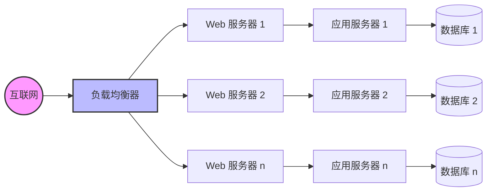
*图 11.1 云架构：水平扩展*

每个环境层由并行运行的一个或多个服务器实例组成，并添加更多实例以处理负载。实例可以单独添加，或者架构可以划分为垂直分区，其中由数据库服务器、应用程序服务器和 Web 服务器组成的组作为单个单元添加。^2^

这种模型的一个挑战是传统数据库的部署，其中一个数据库实例必须是主库。这些数据库（如 MySQL）的数据可以在逻辑上拆分为称为分片的组，每个分片由其自己的数据库（或主/从对）管理。分布式数据库架构（如 Riak）动态处理并行执行，将负载分散到可用实例上。现在有了专为云使用设计的云原生数据库，包括 Cassandra、CockroachDB、Amazon Aurora 和 Amazon DynamoDB。

由于每个服务器实例的大小通常很小，例如 8 GB（在具有 512 GB 及以上 DRAM 的物理宿主机上），可以使用细粒度扩展来实现最佳的性价比，而不是预先投资可能大部分时间闲置的庞大系统。

> [!TIP] 脚注
> ^2^ 例如，Shopify 将这些单元称为“pods” [Denis 18]。

### 11.1.3 容量规划

本地服务器可能是一项重大的基础设施成本，包括硬件和可能持续数年的服务合同费用。新服务器投入生产也可能需要数月时间：花在审批、等待零件 availability、发货、上架、安装和测试上的时间。容量规划至关重要，这样可以购买适当规模的系统：太小意味着失败，太大则成本高昂（并且由于服务合同，可能在未来数年内成本高昂）。还需要容量规划来提前预测需求的增长，以便能够及时完成冗长的采购流程。

# 11.1 云计算

## 11.1 背景

本地服务器和数据中心曾是企业环境的常态。云计算则截然不同。服务器实例价格低廉，并且几乎可以瞬间创建和销毁。公司无需花费时间规划可能需要的资源，而是可以根据实际负载，按需增加使用的服务器实例数量。这可以通过云 API 基于性能监控软件的指标自动完成。一家小企业或初创公司可以从单个小型实例增长到数千个实例，而无需像企业环境预期的那样进行详细的容量规划研究。^3

对于快速成长的初创公司，另一个需要考虑的因素是代码变更的节奏。网站通常每周、每天甚至每天多次更新其生产代码。容量规划研究可能需要数周时间，并且由于它是基于性能指标的快照，可能在完成时就已经过时了。这与运行商业软件的企业环境不同，后者一年可能只变更几次。

在云中为容量规划执行的活动包括：

- **动态调整规模**：自动添加和移除服务器实例
- **可扩展性测试**：短期购买大型云环境，以测试针对合成负载的可扩展性（这是一项基准测试活动）

考虑到时间限制，还有可能对可扩展性进行建模（类似于企业研究），以估计实际可扩展性与理论水平之间的差距。

### 动态调整规模（自动扩缩容）

云供应商通常支持部署可以随负载增加自动扩容的服务器实例组（例如，AWS 自动扩缩容组 (ASG)）。这也支持微服务架构，在这种架构中，应用程序被拆分为更小的网络化部分，这些部分可以根据需要单独扩缩容。

自动扩缩容可以解决快速响应负载变化的需求，但它也存在过度配置的风险，如图 11.2 所示。例如，DoS 攻击可能表现为负载增加，从而触发代价高昂的服务器实例增加。应用程序变更导致性能回退也存在类似风险，这需要更多实例来处理相同的负载。监控对于验证这些增加是否合理非常重要。

**图 11.2 动态调整规模**

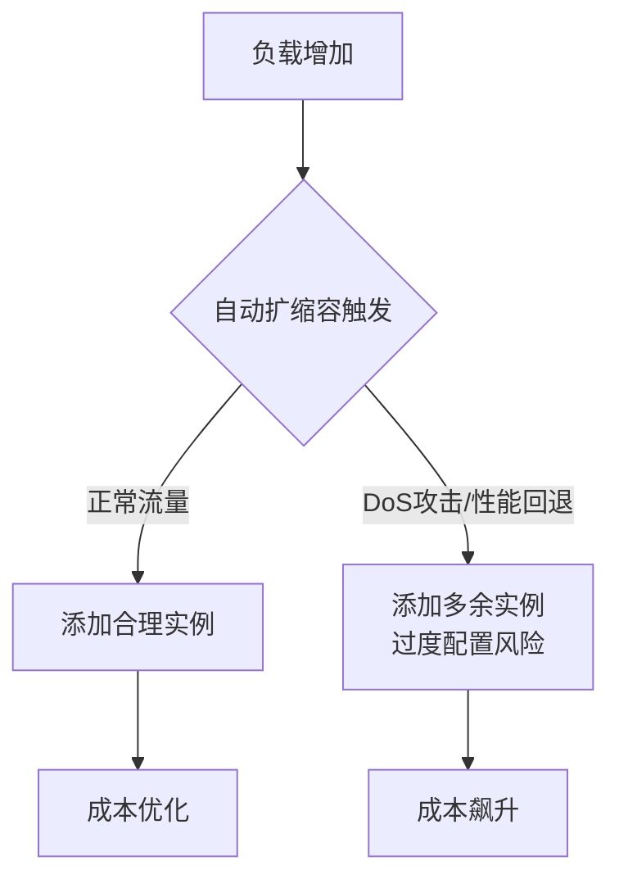

> [!NOTE] 脚注 3
> 随着公司规模扩展到数十万个实例，情况可能会变得复杂，因为云供应商可能会由于需求而暂时耗尽特定类型的可用实例。如果达到这种规模，请与您的客户代表讨论缓解此问题的方法（例如，购买预留容量）。

云供应商按小时、分钟甚至秒计费，允许用户快速扩容和缩容。当缩容时可以立即实现成本节约。这可以实现自动化，使实例数量与日常模式相匹配，仅在一天中每一分钟按需配置足够的容量。^4 Netflix 为其云执行了此操作，每天添加和移除数万个实例以匹配其每秒流数的日常模式，图 11.3 显示了一个示例 [Gregg 14b]。

**图 11.3 Netflix 每秒流数**

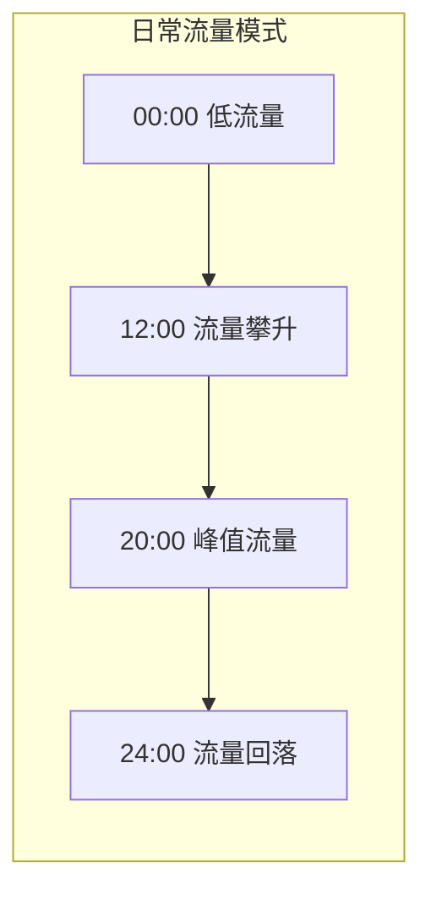

作为其他例子，2012 年 12 月，Pinterest 报告称通过在下班后响应流量负载自动关闭其云系统，将成本从 54 美元/小时降至 20 美元/小时 [Hoff 12]；2018 年 Shopify 迁移到云并实现了巨大的基础设施节省：从平均空闲时间为 61% 的服务器迁移到平均空闲时间为 19% 的云实例 [Kwiatkowski 19]。性能调优也可以带来即时节省，因为处理负载所需的实例数量减少了。

> [!INFO] 脚注 4
> 请注意，自动化这一点可能很复杂，无论是扩容还是缩容。缩容可能不仅需要等待请求完成，还需要等待长时间运行的批处理作业完成，以及数据库传输本地数据。

某些云架构（参见 11.3 节，操作系统虚拟化）可以立即动态分配更多 CPU 资源（如果可用），使用一种称为突发 的策略。这可以免费提供，旨在通过提供一个缓冲期来帮助防止过度配置，在此期间可以检查增加的负载以确定其是否真实且可能持续。如果是这样，可以配置更多实例，从而保证未来的资源供应。

任何这些技术都应该比企业环境高效得多——尤其是那些选择固定大小以处理服务器生命周期内预期峰值负载的环境：此类服务器可能大部分时间处于空闲状态。

## 11.1.4 存储

云实例需要存储操作系统、应用程序软件和临时文件。在 Linux 系统上，这是根卷和其他卷。这可以由本地物理存储或网络存储提供。此实例存储是易失性的，当实例被销毁时它也会被销毁（并被称为临时驱动器）。对于持久存储，通常使用独立服务，该服务作为以下任一形式向实例提供存储：

- **文件存储**：例如，通过 [[NFS]] 的文件
- **块存储**：例如，通过 [[iSCSI]] 的块
- **对象存储**：通过 API，通常基于 HTTP

这些操作都在网络上进行，并且网络基础设施和存储设备都与其他租户共享。由于这些原因，性能可能比本地磁盘更不可预测，尽管云供应商可以通过使用资源控制来提高性能一致性。

云供应商通常为此提供自己的服务。例如，亚马逊提供 Amazon Elastic File System (EFS) 作为文件存储，Amazon Elastic Block Store (EBS) 作为块存储，以及 Amazon Simple Storage Service (S3) 作为对象存储。

本地存储和网络存储如图 11.4 所示。

**图 11.4 云存储**

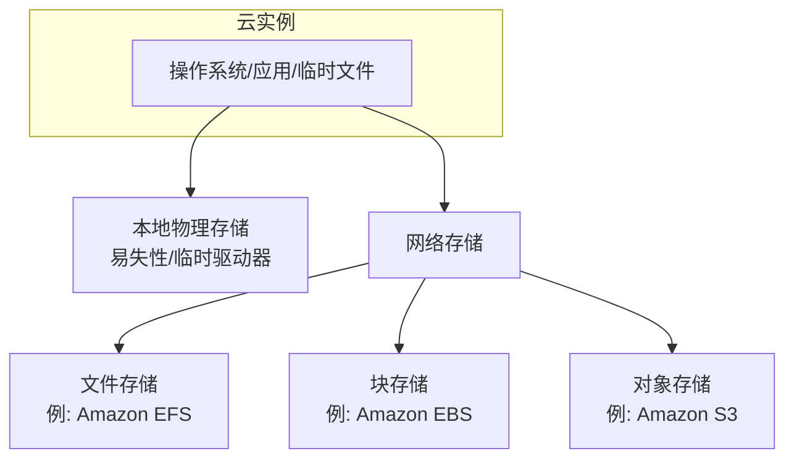

网络存储访问增加的延迟通常通过为频繁访问的数据使用内存缓存来缓解。

某些存储服务允许在需要可靠性能时购买 IOPS 速率（例如，Amazon EBS Provisioned IOPS 卷）。

## 11.1.5 多租户

Unix 是一个多任务操作系统，旨在处理访问相同资源的多个用户和进程。Linux 后来添加了资源限制和控制，以更公平地共享这些资源，并提供了可观察性，以识别和量化涉及资源争用的性能问题。

云计算的不同之处在于，整个操作系统实例可以共存于同一物理系统上。每个客户机 都是其自身隔离的操作系统：客户机（通常^5）无法观察同一主机上来自其他客户机的用户和进程——这将被视为信息泄露——即使它们共享相同的物理资源。

由于资源在租户之间共享，性能问题可能由**吵闹的邻居** 引起。例如，同一主机上的另一个客户机可能在您的峰值负载期间执行完整的数据库转储，干扰您的磁盘和网络 I/O。更糟的是，邻居可能通过执行刻意使资源饱和的微基准测试来评估云供应商，以找到其极限。

> [!TIP] 脚注 5
> Linux 容器可以通过命名空间 和 cgroup 以不同方式组装。应该可以创建彼此共享进程命名空间的容器，这可用于能够调试其他容器进程的内省（“Sidecar”）容器。在 [[Kubernetes]] 中，主要的抽象是 [[Pod]]，它共享一个网络命名空间。

这个问题有一些解决方案。多租户效应可以通过资源管理来控制：设置提供性能隔离（也称为资源隔离）的操作系统资源控制。这是对系统资源的使用施加每个租户的限制或优先级：CPU、内存、磁盘或文件系统 I/O 以及网络吞吐量。

除了限制资源使用外，能够观察多租户争用可以帮助云运营商调整限制并更好地在可用主机上平衡租户。可观察性的程度取决于虚拟化类型。

## 11.1.6 编排

许多公司使用运行在自己的裸机或云系统上的编排软件来运行自己的私有云。最受欢迎的此类软件是 [[Kubernetes]]（缩写为 k8s），最初由 Google 创建。Kubernetes 在希腊语中意为“舵手”，它是一个开源系统，使用容器管理应用程序部署（通常是 Docker 容器，尽管任何实现开放容器接口 的运行时也可以工作，例如 containerd）[Kubernetes 20b]。公共云供应商也创建了 Kubernetes 服务以简化向这些供应商的部署，包括 Google Kubernetes Engine (GKE)、Amazon Elastic Kubernetes Service (Amazon EKS) 和 Microsoft Azure Kubernetes Service (AKS)。

Kubernetes 将容器部署为称为 [[Pod]] 的并置组，其中容器可以共享资源并在本地 (localhost) 相互通信。每个 Pod 都有自己的 IP 地址，可用于与其他 Pod 通信（通过网络）。Kubernetes 服务 是对由一组 Pod 提供的端点的抽象，包含元数据（包括 IP 地址），并且是这些端点的持久稳定接口，而 Pod 本身可能会被添加和移除，从而允许它们被视为可丢弃的。Kubernetes 服务支持微服务架构。Kubernetes 包括自动扩缩容策略，例如“水平 Pod 自动扩缩器”，它可以根据目标资源利用率或其他指标扩缩 Pod 的副本。

在 Kubernetes 中，物理机器称为节点，如果一组节点连接到同一个 Kubernetes API 服务器，则它们属于同一个 Kubernetes 集群。

> [!WARNING] Kubernetes 中的性能挑战
> Kubernetes 中的性能挑战包括调度（在集群上何处运行容器以最大化性能）和网络性能，因为使用了额外的组件来实现容器网络和负载均衡。

对于调度，Kubernetes 会考虑 CPU 和内存的请求与限制，以及诸如节点污点（其中节点被标记为排除在调度之外）和标签选择器（自定义元数据）等元数据。Kubernetes 目前不限制块 I/O（未来可能会添加使用 blkio cgroup 对此的支持 [Xu 20]），这使得磁盘争用成为可能的性能问题来源。

对于网络，Kubernetes 允许使用不同的网络组件，确定使用哪一个是确保最大性能的重要活动。容器网络可以通过插件容器网络接口 (CNI) 软件实现；示例 CNI 软件包括基于 netfilter 或 iptables 的 Calico，以及基于 [[BPF]] 的 Cilium。两者都是开源的 [Calico 20][Cilium 20b]。对于负载均衡，Cilium 还提供了 kube-proxy 的 BPF 替代方案 [Borkmann 19]。

# 11.1 云计算

## 11.2 硬件虚拟化

硬件虚拟化（Hardware Virtualization）创建了一个可以运行完整操作系统（包括其自身内核）的虚拟机（VM）。虚拟机由 [[Hypervisor]]（也称为虚拟机管理器，VMM）创建。Hypervisor 的一种常见分类将其划分为类型 1 或类型 2 [Goldberg 73]，分别是：

- **类型 1**：直接在处理器上执行。Hypervisor 的管理可以由一个特权客户机（privileged guest）来执行，该客户机可以创建和启动新的客户机。类型 1 也称为原生 Hypervisor 或裸机 Hypervisor。这种 Hypervisor 包含其自己的客户机 VM CPU 调度器。一个流行的例子是 Xen Hypervisor。
- **类型 2**：在宿主 OS 内执行，宿主 OS 拥有管理 Hypervisor 和启动新客户机的特权。对于这种类型，系统先引导一个常规 OS，然后由该 OS 运行 Hypervisor。这种 Hypervisor 由宿主内核的 CPU 调度器进行调度，而客户机在宿主上表现为进程。

> [!NOTE] 类型 1 与类型 2 的演变
> 尽管您可能仍会遇到类型 1 和类型 2 这两个术语，但随着 Hypervisor 技术的进步，这种分类已不再严格适用 [Liguori, 07]——类型 2 通过使用内核模块，使得 Hypervisor 的一部分能够直接访问硬件，从而变得像类型 1 一样。一种更实用的分类如图 11.5 所示，展示了我将其命名为配置 A 和配置 B 的两种常见配置 [Gregg 19]。

**图 11.5 常见 Hypervisor 配置**

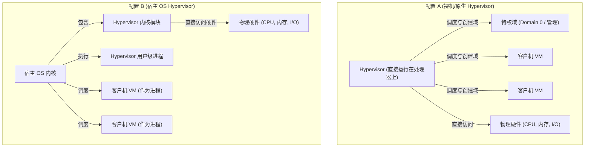

这些配置具体为：

- **配置 A**：也称为原生 Hypervisor 或裸机 Hypervisor。Hypervisor 软件直接在处理器上运行，创建用于运行客户机虚拟机的域，并将虚拟客户机 CPU 调度到真实 CPU 上。一个特权域（图 11.5 中的编号 0）可以管理其他域。一个流行的例子是 Xen Hypervisor。
- **配置 B**：Hypervisor 软件由宿主 OS 内核执行，并且可以由内核级模块和用户级进程组成。宿主 OS 拥有管理 Hypervisor 的特权，其内核将 VM CPU 与宿主上的其他进程一起调度。通过使用内核模块，此配置还提供了对硬件的直接访问。一个流行的例子是 KVM Hypervisor。

这两种配置都可能涉及在域 0（Xen）或宿主 OS（KVM）中运行 I/O 代理（例如，使用 QEMU 软件），以为客户机提供 I/O 服务。这增加了 I/O 的开销，多年来，通过添加共享内存传输和其他技术，这一问题已得到优化。

最早的硬件 Hypervisor 由 VMware 于 1998 年首创，使用二进制翻译（binary translations）来执行完整的硬件虚拟化 [VMware 07]。这涉及在执行之前重写特权指令（如系统调用 syscall 和页表操作）。非特权指令可以直接在处理器上运行。这提供了一个由虚拟化硬件组件组成的完整虚拟系统，可以在其上安装未经修改的操作系统。为此付出的高性能开销通常是可以接受的，因为服务器整合带来了成本节约。

此后，这已通过以下方式得到改进：

- **处理器虚拟化支持**：AMD-V 和 Intel VT-x 扩展于 2005–2006 年引入，为处理器的 VM 操作提供了更快的硬件支持。这些扩展提高了虚拟化特权指令和 MMU 的速度。
- **半虚拟化（Paravirtualization，简称 paravirt 或 PV）**：提供一个虚拟系统，该系统包含一个接口，供客户操作系统高效使用宿主资源（通过超级调用 hypercall），而无需对所有组件进行完全虚拟化。例如，装备定时器通常涉及多个必须由 Hypervisor 模拟的特权指令。这可以简化为单个超级调用供半虚拟化客户机使用，以便 Hypervisor 更高效地处理。为了进一步提高效率，Xen Hypervisor 将这些超级调用批量处理为多重调用（multicall）。半虚拟化还可以包括客户机使用半虚拟化网络设备驱动程序，以更有效地将数据包传递给宿主中的物理网络接口。虽然性能得到了提升，但这依赖于客户机 OS 对半虚拟化的支持（历史上 Windows 并未提供此支持）。
- **设备硬件支持**：为了进一步优化 VM 性能，处理器以外的硬件设备也一直在添加虚拟机支持。这包括用于网络和存储设备的单根 I/O 虚拟化（SR-IOV），它允许客户机 VM 直接访问硬件。这需要驱动程序支持（示例驱动程序有 ixgbe、ena、hv_netvsc 和 nvme）。

多年来，Xen 不断发展和提高其性能。现代 Xen VM 通常以硬件 VM 模式（HVM）引导，然后使用支持 HVM 的 PV 驱动程序以提高性能：这种配置称为 PVHVM。通过在某些驱动程序（例如网络和存储设备的 SR-IOV）上完全依赖硬件虚拟化，可以进一步提升性能。

### 11.2.1 实现

硬件虚拟化有许多不同的实现，其中一些已经被提及（Xen 和 KVM）。示例如下：

- **VMware ESX**：VMware ESX 于 2001 年首次发布，是一款用于服务器整合的企业级产品，也是 VMware vSphere 云计算产品的关键组件。其 Hypervisor 是一个运行在裸机上的微内核，第一个虚拟机称为服务控制台（service console），它可以管理 Hypervisor 和新的虚拟机。
- **Xen**：Xen 于 2003 年首次发布，最初是剑桥大学的一个研究项目，后来被 Citrix 收购。Xen 是一种类型 1 Hypervisor，可运行半虚拟化客户机以实现高性能；后来添加了对硬件辅助客户机的支持，以支持未修改的 OS（Windows）。虚拟机称为域（domains），其中特权最高的是 dom0，通过它可以管理 Hypervisor 并启动新域。Xen 是开源的，可以从 Linux 启动。Amazon 弹性计算云（EC2）以前基于 Xen。
- **Hyper-V**：随 Windows Server 2008 发布，Hyper-V 是一种类型 1 Hypervisor，它创建分区（partitions）来执行客户操作系统。Microsoft Azure 公有云可能正在运行定制版的 Hyper-V（确切细节未公开）。
- **KVM**：这由 Qumranet 开发，Qumranet 是一家在 2008 年被 Red Hat 收购的初创公司。KVM 是一种类型 2 Hypervisor，作为内核模块执行。它支持硬件辅助扩展，为了获得高性能，在客户机 OS 支持的情况下，它对某些设备使用半虚拟化。为了创建完整的硬件辅助虚拟机实例，它与一个名为 QEMU（Quick Emulator）的用户进程配对使用，QEMU 是一个可以创建和管理虚拟机的 VMM（Hypervisor）。QEMU 最初是一个使用二进制翻译的高质量开源类型 2 Hypervisor，由 Fabrice Bellard 编写。KVM 是开源的，被 Google 用于 Google Compute Engine [Google 20c]。
- **Nitro**：由 AWS 于 2017 年推出，该 Hypervisor 使用基于 KVM 的部分，并对所有主要资源提供硬件支持：处理器、网络、存储、中断和定时器 [Gregg 17e]。不使用 QEMU 代理。Nitro 为客户机 VM 提供了接近裸机的性能。

以下各节描述了与硬件虚拟化相关的性能主题：开销、资源控制和可观察性。这些因实现及其配置而异。

### 11.2.2 开销

在调查云性能问题时，了解何时预期以及何时不预期虚拟化带来的性能开销是非常重要的。

硬件虚拟化通过各种方式实现。资源访问可能需要 Hypervisor 的代理和转换，从而增加开销；或者可以使用基于硬件的技术来避免这些开销。以下各节总结了 CPU 执行、内存映射、内存大小、执行 I/O 以及来自其他租户的争用的性能开销。

#### CPU

通常，客户机应用程序直接在处理器上执行，受限于 CPU 的应用程序可能会体验到与裸机系统几乎相同的性能。当发出特权处理器调用、访问硬件和映射主内存时，可能会遇到 CPU 开销，具体取决于 Hypervisor 如何处理它们。以下描述了不同硬件虚拟化类型如何处理 CPU 指令：

- **二进制翻译**：对物理资源进行操作的客户机内核指令会被识别并翻译。二进制翻译在硬件辅助虚拟化可用之前被使用。在没有硬件虚拟化支持的情况下，VMware 采用的方案是在处理器环 0 中运行虚拟机监视器（VMM），并将客户机内核移至环 1，而环 1 以前是未使用的（应用程序运行在环 3，大多数处理器提供四个环；保护环在第 3 章操作系统第 3.2.2 节内核态与用户态中介绍过）。因为一些客户机内核指令假设它们运行在环 0，为了从环 1 执行，它们需要被翻译，调用 VMM 以应用虚拟化。这种翻译在运行期间执行，消耗大量的 CPU 开销。
- **半虚拟化**：客户机 OS 中必须被虚拟化的指令被替换为对 Hypervisor 的超级调用。如果修改客户机 OS 以优化超级调用，使其意识到自己正运行在虚拟化硬件上，则可以提高性能。
- **硬件辅助**：操作硬件的未修改客户机内核指令由 Hypervisor 处理，Hypervisor 在低于 0 的环级别运行 VMM。客户机内核特权指令不再通过翻译二进制指令，而是被强制陷入（trap）到更高特权的 VMM，然后 VMM 可以模拟该特权以支持虚拟化 [Adams 06]。

> [!TIP] 虚拟化模式选择
> 硬件辅助虚拟化通常是首选（取决于实现和工作负载），而如果客户机 OS 支持，半虚拟化可用于提高某些工作负载（尤其是 I/O）的性能。

作为实现差异的一个例子，VMware 的二进制翻译模型多年来得到了高度优化，正如他们在 2007 年所写的那样 [VMware 07]：

> 由于 Hypervisor 到客户机的转换开销很高且编程模型僵化，VMware 的二进制翻译方法目前在大多数情况下的性能优于第一代硬件辅助实现。第一代实现中僵化的编程模型，使得软件在管理 Hypervisor 到客户机转换的频率或成本方面几乎没有灵活调整的空间。

客户机与 Hypervisor 之间的转换速率以及在 Hypervisor 中花费的时间，可以作为 CPU 开销的指标进行研究。这些事件通常被称为客户机退出（guest exits），因为当这种情况发生时，虚拟 CPU 必须停止在客户机内部的执行。图 11.6 显示了与 KVM 内部客户机退出相关的 CPU 开销。

**图 11.6 与 KVM 内部客户机退出相关的 CPU 开销**

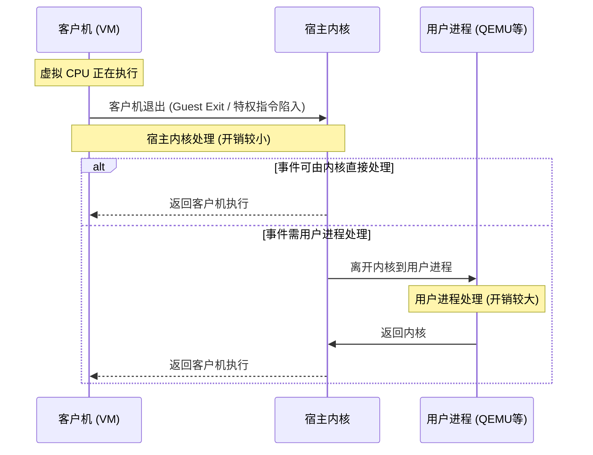

该图显示了用户进程、宿主内核和客户机之间客户机退出的流程。在客户机之外处理退出的时间就是硬件虚拟化的 CPU 开销；处理退出花费的时间越多，开销就越大。当客户机退出时，一部分事件可以直接在内核中处理。那些无法在内核中处理的事件必须离开内核并返回到用户进程；与可由内核处理的退出相比，这会导致更大的开销。

# 11.1 云计算

## 11.2 硬件虚拟化

> [!INFO] 延续上下文说明
> 处理虚拟机退出（VM Exit）所花费的时间越长，开销就越大。当客户机退出时，一部分事件可以直接在内核中处理。那些无法在内核中处理的事件必须离开内核并返回到用户空间进程；与可以由内核处理的退出相比，这会引发更大的开销。

<br>

**图 11.6 硬件虚拟化 CPU 开销**

> [!NOTE] 图片描述
> *由于原始文档提取限制，此处为图 11.6 的文字描述：该图展示了硬件虚拟化下的 CPU 开销模型。Guest（客户机）执行时遇到特权指令或事件触发 VM Exit，陷入 Hypervisor（虚拟机监控器）。Hypervisor 分为内核态和用户态处理，处理完毕后通过 VM Entry 返回 Guest 继续执行。开销主要产生在 VM Exit、Hypervisor 处理逻辑以及 VM Entry 的过程中。*

例如，在 Linux KVM 的实现中，这些开销可以通过其客户机退出函数来研究，这些函数在源代码中的映射如下（截取自 Linux 5.2 的 `arch/x86/kvm/vmx/vmx.c`，已截断）：

```c
/*
 * 退出处理程序如果完全处理了该退出，并且客户机执行可以恢复，
 * 则返回 1。否则，它们会设置 kvm_run 参数以指示需要
 * 对用户空间执行什么操作，并返回 0。
 */
static int (*kvm_vmx_exit_handlers[])(struct kvm_vcpu *vcpu) = {
        [EXIT_REASON_EXCEPTION_NMI]           = handle_exception,
        [EXIT_REASON_EXTERNAL_INTERRUPT]      = handle_external_interrupt,
        [EXIT_REASON_TRIPLE_FAULT]            = handle_triple_fault,
        [EXIT_REASON_NMI_WINDOW]              = handle_nmi_window,
        [EXIT_REASON_IO_INSTRUCTION]          = handle_io,
        [EXIT_REASON_CR_ACCESS]               = handle_cr,
        [EXIT_REASON_DR_ACCESS]               = handle_dr,
        [EXIT_REASON_CPUID]                   = handle_cpuid,
        [EXIT_REASON_MSR_READ]                = handle_rdmsr,
        [EXIT_REASON_MSR_WRITE]               = handle_wrmsr,
        [EXIT_REASON_PENDING_INTERRUPT]       = handle_interrupt_window,
        [EXIT_REASON_HLT]                     = handle_halt,
        [EXIT_REASON_INVD]                    = handle_invd,
        [EXIT_REASON_INVLPG]                  = handle_invlpg,
        [EXIT_REASON_RDPMC]                   = handle_rdpmc,
        [EXIT_REASON_VMCALL]                  = handle_vmcall,
   [...]
        [EXIT_REASON_XSAVES]                  = handle_xsaves,
        [EXIT_REASON_XRSTORS]                 = handle_xrstors,
        [EXIT_REASON_PML_FULL]                = handle_pml_full,
        [EXIT_REASON_INVPCID]                 = handle_invpcid,
        [EXIT_REASON_VMFUNC]                  = handle_vmx_instruction,
        [EXIT_REASON_PREEMPTION_TIMER]        = handle_preemption_timer,
        [EXIT_REASON_ENCLS]                   = handle_encls,
};
```

虽然这些名称很简短，但它们可以让我们了解客户机调用 [[Hypervisor|虚拟机监控器（Hypervisor）]] 并由此引发 CPU 开销的原因。

一种常见的客户机退出是 [[HLT 指令|停止（halt）指令]]，通常由空闲线程在内核找不到更多工作可执行时调用（这允许处理器在被中断之前以低功耗模式运行）。它由 `handle_halt()` 函数处理（在前面的 `EXIT_REASON_HLT` 列表中可以看到），该函数最终调用 `kvm_vcpu_halt()`（`arch/x86/kvm/x86.c`）：

```c
int kvm_vcpu_halt(struct kvm_vcpu *vcpu)
{
        ++vcpu->stat.halt_exits;
        if (lapic_in_kernel(vcpu)) {
                vcpu->arch.mp_state = KVM_MP_STATE_HALTED;
                return 1;
        } else {
                vcpu->run->exit_reason = KVM_EXIT_HLT;
                return 0;
        }
}
```

与许多客户机退出类型一样，该代码保持精简以最小化 CPU 开销。这个例子以一个 vcpu 统计计数增量开始，用于跟踪发生了多少次 halt。剩余的代码执行此特权指令所需的硬件仿真。在 Linux 上，可以在 Hypervisor 宿主机上使用 [[kprobes]] 对这些函数进行插桩，以跟踪它们的类型及其退出的持续时间。也可以使用 `kvm:kvm_exit` [[Tracepoint|追踪点]] 全局跟踪退出，这将在 11.2.4 节“可观察性”中使用。

虚拟化硬件设备（例如中断控制器和高精度定时器）也会产生一些 CPU（以及少量内存）开销。

### 内存映射

如第 7 章“内存”中所述，操作系统与 [[MMU]]（内存管理单元）协同工作，创建从虚拟内存到物理内存的页映射，并将它们缓存在 [[TLB]]（转译后备缓冲器）中以提高性能。

对于虚拟化，将新的一页内存（页错误）从客户机映射到硬件涉及两个步骤：

1. **虚拟到客户机物理的转译**，由客户机内核执行
2. **客户机物理到宿主机物理（实际）的转译**，由 Hypervisor VMM 执行

然后，从客户机虚拟到宿主机物理的映射可以被缓存在 TLB 中，这样后续的访问就可以以正常速度运行——不需要额外的转译。现代处理器支持 [[MMU 虚拟化]]，因此已经离开 TLB 的映射可以纯粹在硬件中更快地被回调（页表漫步），而无需调用 Hypervisor。支持此功能的特性在 Intel 上称为 [[EPT|扩展页表]]，在 AMD 上称为 [[NPT|嵌套页表]] [Milewski 11]。

> [!TIP] EPT 与 NPT
> **EPT (Extended Page Tables)** 和 **NPT (Nested Page Tables)** 是现代 x86 处理器提供的硬件辅助虚拟化技术，极大地减少了由于内存虚拟化带来的 VM Exit 开销。

如果没有 EPT/NPT，另一种提高性能的方法是维护从客户机虚拟到宿主机物理映射的**影子页表**，这些页表由 Hypervisor 管理，然后在客户机执行期间通过覆盖客户机的 CR3 寄存器来访问。使用这种策略，客户机内核像往常一样维护自己的页表，这些页表从客户机虚拟映射到客户机物理。Hypervisor 拦截对这些页表的更改，并在影子页表中创建到宿主机物理页的等效映射。然后，在客户机执行期间，Hypervisor 覆盖 CR3 寄存器以指向影子页表。

### 内存大小

与操作系统虚拟化不同，使用硬件虚拟化时会有一些额外的内存消耗者。每个客户机运行自己的内核，这会消耗少量内存。存储架构也可能导致**双重缓存**，即客户机和宿主机缓存了相同的数据。KVM 类型的 Hypervisor 还会为每个 VM 运行一个 VMM 进程（例如 QEMU），其本身也会消耗一些主存。

### I/O

从历史上看，I/O 是硬件虚拟化最大的开销来源。这是因为每个设备 I/O 都必须由 Hypervisor 进行转译。对于高频 I/O，例如 10 Gbit/s 网络，每次 I/O（数据包）很小的开销都可能导致整体性能的显著下降。为了缓解这些 I/O 开销，业界创造了多种技术，最终演变为通过硬件支持来完全消除这些开销。此类硬件支持包括 [[I/O MMU 虚拟化]]（AMD-Vi 和 Intel VT-d）。

改进 I/O 性能的一种方法是使用**半虚拟化驱动程序**，它们可以合并 I/O 并执行更少的设备中断，从而减少 Hypervisor 的开销。

另一种技术是 **PCI 直通**，它将 PCI 设备直接分配给客户机，因此可以像在裸机系统上一样使用它。PCI 直通可以提供现有选项中最佳的性能，但它降低了配置多租户系统时的灵活性，因为某些设备现在由客户机拥有且无法共享。这也可能使[[实时迁移]]复杂化 [Xen 19]。

有一些技术可以提高在虚拟化中使用 PCI 设备的灵活性，包括**单根 I/O 虚拟化**（[[SR-IOV]]，前文已提及）和**多根 I/O 虚拟化**（[[MR-IOV]]）。这些术语指的是暴露的根复合体 PCI 拓扑的数量，以不同方式提供硬件虚拟化。Amazon EC2 云一直在采用这些技术来加速先是网络然后是存储的 I/O，这些技术默认在 Nitro Hypervisor 中使用 [Gregg 17e]。

Xen、KVM 和 Nitro Hypervisor 的常见配置如图 11.7 所示。

**图 11.7 Xen、KVM 和 Nitro I/O 路径**

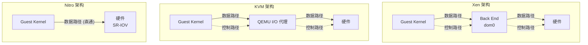

> [!NOTE] 图表说明
> GK 表示“客户机内核”，BE 表示“后端”。虚线箭头表示控制路径，组件通过该路径同步或异步地相互通知有更多数据已准备好传输。数据路径（实线箭头）在某些情况下可以通过共享内存和环形缓冲区来实现。Nitro 没有显示控制路径，因为它使用相同的数据路径直接访问硬件。

Xen 和 KVM 有多种配置方式，此处未全部展示。该图展示了它们使用 I/O 代理进程（通常是 QEMU 软件）的情况，这些进程是按客户机 VM 创建的。但它们也可以配置为使用 SR-IOV，允许客户机 VM 直接访问硬件（图 11.7 中未展示 Xen 或 KVM 的这种情况）。Nitro 需要这种硬件支持，从而消除了对 I/O 代理的需求。

Xen 使用**设备通道**来提高其 I/O 性能——这是 dom0 和客户域之间的异步共享内存传输。这避免了在域之间传递 I/O 数据时创建额外副本所带来的 CPU 和总线开销。它也可能使用独立的域来执行 I/O，如 11.2.3 节“资源控制”中所述。

I/O 路径中（包括控制和数据）的步骤数量对性能至关重要：越少越好。在 2006 年，KVM 开发人员将像 Xen 这样的特权客户机系统与 KVM 进行了比较，发现 KVM 执行 I/O 的步骤可以只有 Xen 的一半（五步对十步，尽管该测试是在没有半虚拟化的情况下进行的，因此不能反映大多数现代配置）[Qumranet 06]。

> [!WARNING] 性能关键点
> I/O 路径的步骤数是性能的关键：步骤越少，性能越好。任何多余的数据拷贝和控制路径交互都会增加延迟并消耗 CPU 周期。

由于 Nitro Hypervisor 消除了额外的 I/O 步骤，我预计所有寻求最高性能的大型云提供商都会效仿，利用硬件支持来消除 I/O 代理。

### 多租户争用

根据 Hypervisor 的配置以及在租户之间共享 CPU 和 CPU 缓存的程度，可能会出现由其他租户引起的 **CPU 窃取时间**和 **CPU 缓存污染**，从而降低性能。通常，这在使用容器时比使用 VM 时问题更大，因为容器推崇这种共享以支持 CPU 突发。

根据 Hypervisor 的配置，执行 I/O 的其他租户可能会导致中断执行的中断发生。

对资源的争用可以通过资源控制来管理。

## 11.2.3 资源控制

作为客户机配置的一部分，CPU 和主存通常配置有资源限制。Hypervisor 软件还可能提供针对网络和磁盘 I/O 的资源控制。

对于类似 KVM 的 Hypervisor，宿主机操作系统最终控制着物理资源，除了 Hypervisor 提供的控制之外，操作系统中可用的资源控制也可以应用于客户机。对于 Linux，这意味着 [[cgroups]]、[[tasksets]] 和其他资源控制。有关宿主机操作系统可能提供的资源控制的更多信息，请参见 11.3 节“操作系统虚拟化”。以下各节以 Xen 和 KVM Hypervisor 为例，描述它们的资源控制。

### CPU

CPU 资源通常以虚拟 CPU（[[vCPU]]）的形式分配给客户机。然后这些 vCPU 由 Hypervisor 进行调度。分配的 vCPU 数量粗略地限制了 CPU 资源的使用。

对于 Xen，可以通过 Hypervisor 的 CPU 调度器为客户机应用细粒度的 CPU 配额。调度器包括 [Cherkasova 07][Matthews 08]：

- **借用虚拟时间**：一种基于虚拟时间分配的公平共享调度器，可以提前借用虚拟时间，为实时和交互式应用提供低延迟执行。
- **简单最早截止时间优先**：一种实时调度器，允许配置运行时保证，调度器优先处理最早截止时间的任务。
- **基于信用**：支持 CPU 使用的优先级（权重）和上限，以及跨多个 CPU 的负载均衡。

对于 KVM，细粒度的 CPU 配额可以由宿主机操作系统应用，例如使用前面提到的宿主机内核公平共享调度器时。在 Linux 上，这可以使用 cgroup 的 CPU 带宽控制来应用。

这两种技术在如何尊重客户机优先级方面都存在局限性。客户机的 CPU 使用情况对 Hypervisor 通常是不可见的，并且通常无法看到客户机内核线程的优先级

# 第11章 云计算

……前文所述的调度器。在 Linux 上，这可以通过 cgroup 的 CPU 带宽控制来实施。

无论是哪种技术，在尊重客户机优先级方面都存在局限性。客户机的 CPU 使用情况对 Hypervisor 通常是不可见的，客户机内核线程的优先级通常也无法被看到或尊重。例如，一个客户机中的低优先级日志轮转守护进程，在 Hypervisor 中可能与另一个客户机中的关键应用服务器具有相同的优先级。

对于 Xen，CPU 资源的使用可能会因高 I/O 负载而变得更加复杂，因为这些负载会在 dom0 中消耗额外的 CPU 资源。仅客户机域中的后端驱动和 I/O 代理就可能消耗超过其 CPU 分配额度的资源，但这部分消耗并未被计入 [Cherkasova 05]。一种解决方案是创建隔离驱动域，将 I/O 服务分离出来以实现安全性、性能隔离和资源计量。如图 11.8 所示。

> [!NOTE] 图 11.8 带有隔离驱动域的 Xen 架构
> 以下 Mermaid 图表展示了 Xen 中使用隔离驱动域 (IDD) 分离 I/O 服务的逻辑架构：
> ```mermaid
> graph TD
>     Dom0[dom0: 控制域] --> IDD[隔离驱动域 IDD]
>     DomU1[客户机域 Guest 1] --> IDD
>     DomU2[客户机域 Guest 2] --> IDD
>     IDD --> Hardware[硬件设备]
> ```

IDD 的 CPU 使用情况可以被监控，并且可以向客户机收取这部分使用费用。摘自 [Gupta 06]：

> 我们修改后的调度器 SEDF-DC（SEDF-债务收集器），定期从 XenMon 接收关于 IDD 代表客户机域进行 I/O 处理所消耗的 CPU 反馈。利用这些信息，SEDF-DC 会限制分配给客户机域的 CPU，以满足指定的综合 CPU 使用限制。

Xen 中使用的一项更新的技术是存根域，它运行一个微型 OS。

### CPU 缓存

除了 vCPU 的分配外，还可以使用 Intel 缓存分配技术 来控制 CPU 缓存的使用。它允许在客户机之间对 LLC（末级缓存）进行分区，并允许分区共享。虽然这可以防止一个客户机污染另一个客户机的缓存，但也可能因限制缓存使用而损害性能。

### 内存容量

内存限制作为客户机配置的一部分被强制设定，客户机只能看到设定数量的内存。然后，客户机内核执行自己的操作（分页、交换）以保持在限制范围内。

为了提高静态配置的灵活性，VMware 开发了一个气球驱动 [Waldspurger 02]，它能够通过在运行中的客户机内部“膨胀”一个气球模块来减少其消耗的内存，该模块会占用客户机内存。然后，Hypervisor 会回收这些内存，供其他客户机使用。气球也可以“放气”，将内存返还给客户机内核使用。在此过程中，客户机内核执行其正常的内存管理例程来释放内存（例如，分页）。VMware、Xen 和 KVM 都支持气球驱动。

> [!WARNING] 性能注意事项
> 当气球驱动在使用时（要从客户机中检查，可以在 `dmesg(1)` 的输出中搜索“balloon”），我建议您要密切关注它们可能引起的性能问题。

### 文件系统容量

客户机从主机获取虚拟磁盘卷。对于类似 KVM 的 Hypervisor，这些可能是由操作系统创建并相应调整大小的软件卷。例如，ZFS 文件系统可以创建所需大小的虚拟卷。

### 设备 I/O

硬件虚拟化软件的资源控制历来侧重于控制 CPU 使用率，这可以间接控制 I/O 使用率。

网络吞吐量可以通过外部专用设备来限制，或者对于类似 KVM 的 Hypervisor，可以通过主机内核功能来限制。例如，Linux 具有来自 cgroups 的网络带宽控制以及不同的 qdiscs（排队规则），可以应用于客户机网络接口。

Xen 的网络性能隔离已被研究，得出以下结论 [Adamczyk 12]：

> ……当考虑网络虚拟化时，Xen 的弱点在于缺乏适当的性能隔离。

[Adamczyk 12] 的作者还提出了一个 Xen 网络 I/O 调度的解决方案，该方案为网络 I/O 优先级和速率添加了可调参数。如果您正在使用 Xen，请检查此技术或类似技术是否已可用。

对于具有完整硬件支持的 Hypervisor（例如 Nitro），I/O 限制可能由硬件或外部设备支持。在 Amazon EC2 云中，对网络附加设备的网络 I/O 和磁盘 I/O 使用外部系统限制到配额。

## 11.2.4 可观察性

在虚拟化系统上可观察到的内容取决于 Hypervisor 以及启动可观察性工具的位置。一般来说：

- **从特权客户机 或主机 (KVM) 观察**：使用前面章节介绍的标准 OS 工具，所有物理资源都应该是可观察的。如果使用了 I/O 代理，可以通过分析 I/O 代理来观察客户机 I/O。Hypervisor 应提供每个客户机的资源使用统计信息。客户机内部状态（包括其进程）无法直接观察。如果设备使用直通或 SR-IOV，某些 I/O 可能无法观察。

- **从硬件支持的主机 (Nitro) 观察**：使用 SR-IOV 可能会使从 Hypervisor 观察设备 I/O 变得更加困难，因为客户机直接访问硬件，而不是通过代理或主机内核。（Amazon 实际如何在 Nitro 上实现 Hypervisor 可观察性属于未公开的知识。）

- **从客户机观察**：可以看到虚拟化资源及其被客户机使用的情况，并推断出物理问题。由于 VM 有自己专用的内核，可以分析内核内部状态，并且内核追踪工具（包括基于 BPF 的工具）都能正常工作。

> [!INFO] 观察策略提示
> 从特权客户机或主机（Xen 或 KVM Hypervisor）看，物理资源使用情况通常可以在较高层面上观察到：利用率、饱和度、错误、IOPS、吞吐量、I/O 类型。这些因素通常可以按客户机表示，以便快速识别重度使用者。无法直接观察哪些客户机进程正在执行 I/O 及其应用程序调用栈的细节。可以通过登录到客户机（前提是已授权并配置了登录方式，例如 SSH）并使用客户机 OS 提供的可观察性工具来观察它们。

当使用直通或 SR-IOV 时，客户机可能直接向硬件发出 I/O 调用。这可能会绕过 Hypervisor 中的 I/O 路径以及它们通常收集的统计信息。结果是 I/O 对 Hypervisor 变得不可见，并且不会出现在 `iostat(1)` 或其他工具中。一种可能的解决方法是使用 PMC（性能监控计数器）来检查与 I/O 相关的计数器，并以此推断 I/O 情况。

为了确定客户机性能问题的根本原因，云运营商可能需要同时登录到 Hypervisor 和客户机，并从两者执行可观察性工具。由于涉及的步骤众多，追踪 I/O 路径变得复杂，可能还需要分析 Hypervisor 内部状态和 I/O 代理（如果使用）。

从客户机的角度看，物理资源的使用情况可能完全无法观察。这可能会诱使客户机用户将神秘的性能问题归咎于由吵闹的邻居引起的资源争用。为了让云客户安心（并减少支持工单），可以通过其他方式提供有关物理资源使用情况（经过编辑处理）的信息，包括 SNMP 或云 API。

为了使容器性能更易于观察和理解，有各种监控解决方案提供图表、仪表板和有向图来展示您的容器环境。此类软件包括 Google cAdvisor [Google 20d] 和 Cilium Hubble [Cilium 19]（两者均是开源的）。

以下各节演示了可以从不同位置使用的原始可观察性工具，并描述了分析性能的策略。Xen 和 KVM 用于演示虚拟化软件可能提供的信息类型（未包含 Nitro，因为它是 Amazon 的专有技术）。

### 11.2.4.1 特权客户机/主机

所有系统资源（CPU、内存、文件系统、磁盘、网络）都应使用前面章节介绍的工具进行观察（通过直通/SR-IOV 的 I/O 除外）。

#### Xen

对于类似 Xen 的 Hypervisor，客户机 vCPU 存在于 Hypervisor 中，使用标准 OS 工具在特权客户机 (dom0) 中不可见。对于 Xen，可以改用 `xentop(1)` 工具：

```bash
# xentop
xentop - 02:01:05   Xen 3.3.2-rc1-xvm
2 domains: 1 running, 1 blocked, 0 paused, 0 crashed, 0 dying, 0 shutdown
Mem: 50321636k total, 12498976k used, 37822660k free    CPUs: 16 @ 2394MHz
      NAME  STATE   CPU(sec) CPU(%)     MEM(k) MEM(%)  MAXMEM(k) MAXMEM(%) VCPUS NETS 
NETTX(k) NETRX(k) VBDS   VBD_OO   VBD_RD   VBD_WR SSID
  Domain-0 -----r    6087972    2.6    9692160   19.3   no limit       n/a    16    0    
0        0    0        0        0        0    0
Doogle_Win --b---     172137    2.0    2105212    4.2    2105344       4.2     1    2    
0        0    2        0        0        0    0
[...]
```

输出字段包括：

- **CPU(%)**：CPU 使用百分比（多个 CPU 的总和）
- **MEM(k)**：主内存使用量（KB）
- **MEM(%)**：主内存占系统内存的百分比
- **MAXMEM(k)**：主内存限制大小（KB）
- **MAXMEM(%)**：主内存限制占系统内存的百分比
- **VCPUS**：分配的 vCPU 数量
- **NETS**：虚拟化网络接口数量
- **NETTX(k)**：网络传输（KB）
- **NETRX(k)**：网络接收（KB）
- **VBDS**：虚拟块设备数量
- **VBD_OO**：虚拟块设备请求阻塞并排队（饱和度）
- **VBD_RD**：虚拟块设备读请求数
- **VBD_WR**：虚拟块设备写请求数

`xentop(1)` 的输出默认每 3 秒更新一次，可以使用 `-d delay_secs` 选项设置更新间隔。

对于高级 Xen 分析，有 `xentrace(8)` 工具，它可以从 Hypervisor 检索固定事件类型的日志。然后可以使用 `xenanalyze` 查看这些日志，以调查 Hypervisor 及其使用的 CPU 调度器的调度问题。Xen 源码中还有 `xenoprof`，它是 Xen（MMU 和客户机）的系统全局分析器。

# 11.1 云计算

## KVM

对于类似 KVM 的 [[Hypervisor|虚拟机监控器]]，客户机实例在宿主机操作系统中是可见的。例如：

```bash
host$ top
top - 15:27:55 up 26 days, 22:04,  1 user,  load average: 0.26, 0.24, 0.28
Tasks: 499 total,   1 running, 408 sleeping,   2 stopped,  0 zombie
%Cpu(s): 19.9 us,  4.8 sy,  0.0 ni, 74.2 id,  1.1 wa,  0.0 hi,  0.1 si,  0.0 st
KiB Mem : 24422712 total,  6018936 free, 12767036 used,  5636740 buff/cache
KiB Swap: 32460792 total, 31868716 free,   592076 used.  8715220 avail Mem 
  PID USER      PR  NI    VIRT    RES    SHR S  %CPU %MEM     TIME+ COMMAND                                       
24881 libvirt+  20   0 6161864 1.051g  19448 S 171.9  4.5   0:25.88 qemu-system-x86               
                  
21897 root       0 -20       0      0      0 I   2.3  0.0   0:00.47 kworker/u17:8                        
23445 root       0 -20       0      0      0 I   2.3  0.0   0:00.24 kworker/u17:7                        
15476 root       0 -20       0      0      0 I   2.0  0.0   0:01.23 kworker/u17:2                        
23038 root       0 -20       0      0      0 I   2.0  0.0   0:00.28 kworker/u17:0                        
         
22784 root       0 -20       0      0      0 I   1.7  0.0   0:00.36 kworker/u17:1   
[...]
```

`qemu-system-x86` 进程是一个 KVM 客户机，它包含了每个 [[vCPU]] 的线程以及用于 I/O 代理的线程。客户机的总体 CPU 使用情况可以在前面的 `top(1)` 输出中看到，而每个 vCPU 的使用情况可以使用其他工具来检查。例如，使用 `pidstat(1)`：

```bash
host$ pidstat -tp 24881 1
03:40:44 PM   UID  TGID   TID  %usr %system %guest %wait   %CPU CPU Command
03:40:45 PM 64055 24881     - 17.00   17.00 147.00  0.00 181.00   0 qemu-system-x86
03:40:45 PM 64055     - 24881  9.00    5.00   0.00  0.00  14.00   0 |__qemu-system-x86
03:40:45 PM 64055     - 24889  0.00    0.00   0.00  0.00   0.00   6 |__qemu-system-x86
03:40:45 PM 64055     - 24897  1.00    3.00  69.00  1.00  73.00   4 |__CPU 0/KVM
03:40:45 PM 64055     - 24899  1.00    4.00  79.00  0.00  84.00   5 |__CPU 1/KVM
03:40:45 PM 64055     - 24901  0.00    0.00   0.00  0.00   0.00   2 |__vnc_worker
03:40:45 PM 64055     - 25811  0.00    0.00   0.00  0.00   0.00   7 |__worker
03:40:45 PM 64055     - 25812  0.00    0.00   0.00  0.00   0.00   6 |__worker
[...]
```

此输出显示了名为 `CPU 0/KVM` 和 `CPU 1/KVM` 的 CPU 线程，它们分别消耗了 73% 和 84% 的 CPU。

将 QEMU 进程映射到其客户机实例名称通常需要检查它们的进程参数（`ps -wwfp PID`）以读取 `-name` 选项。

> [!TIP] 映射 QEMU 进程
> 通过检查进程参数（如 `ps -wwfp PID`）中的 `-name` 选项，即可确定 QEMU 进程对应的客户机实例名称。

另一个重要的分析领域是客户机 vCPU 退出。发生的退出类型可以显示客户机正在做什么：某个给定的 vCPU 是空闲、正在执行 I/O，还是在执行计算。在 Linux 上，`perf(1)` 的 `kvm` 子命令提供了 KVM 退出的高级统计信息。例如：

```bash
host# perf kvm stat live
11:12:07.687968
Analyze events for all VMs, all VCPUs:
           VM-EXIT Samples Samples%   Time%  Min Time    Max Time       Avg time
         MSR_WRITE    1668   68.90%   0.28%    0.67us     31.74us    3.25us ( +-  2.20% )
               HLT     466   19.25%  99.63%    2.61us 100512.98us 4160.68us ( +- 14.77% )
  PREEMPTION_TIMER     112    4.63%   0.03%    2.53us     10.42us    4.71us ( +-  2.68% )
 PENDING_INTERRUPT      82    3.39%   0.01%    0.92us     18.95us    3.44us ( +-  6.23% )
EXTERNAL_INTERRUPT      53    2.19%   0.01%    0.82us      7.46us    3.22us ( +-  6.57% )
    IO_INSTRUCTION      37    1.53%   0.04%    5.36us     84.88us   19.97us ( +- 11.87% )
          MSR_READ       2    0.08%   0.00%    3.33us      4.80us    4.07us ( +- 18.05% )
     EPT_MISCONFIG       1    0.04%   0.00%   19.94us     19.94us   19.94us ( +-  0.00% )
Total Samples:2421, Total events handled time:1946040.48us.
[...]
```

这显示了虚拟机退出的原因，以及每种原因的统计信息。在此示例输出中，持续时间最长的退出是 HLT（停机）退出，因为虚拟 CPU 进入了空闲状态。各列的含义如下：

- **VM-EXIT**：退出类型
- **Samples**：跟踪期间的退出次数
- **Samples%**：退出次数占总退出次数的百分比
- **Time%**：退出花费的时间占总时间的百分比
- **Min Time**：最小退出时间
- **Max Time**：最大退出时间
- **Avg time**：平均退出时间

> [!INFO] 理解 VM Exit 与租户影响
> 虽然运维人员可能无法直接看到客户机虚拟机内部，但检查退出可以让你描绘出硬件虚拟化的开销是否正在影响租户。如果你看到退出的数量很少，并且其中很大比例是 HLT，你就知道客户机的 CPU 相当空闲。另一方面，如果有大量的 I/O 操作，既有产生的中断又被注入到客户机中，那么客户机极有可能正在通过其虚拟网卡和磁盘进行 I/O 操作。

对于高级 KVM 分析，有许多跟踪点：

```bash
host# perf list | grep kvm
  kvm:kvm_ack_irq                                    [Tracepoint event]
  kvm:kvm_age_page                                   [Tracepoint event]
  kvm:kvm_apic                                       [Tracepoint event]
  kvm:kvm_apic_accept_irq                            [Tracepoint event]
  kvm:kvm_apic_ipi                                   [Tracepoint event]
  kvm:kvm_async_pf_completed                         [Tracepoint event]
  kvm:kvm_async_pf_doublefault                       [Tracepoint event]
  kvm:kvm_async_pf_not_present                       [Tracepoint event]
  kvm:kvm_async_pf_ready                             [Tracepoint event]
  kvm:kvm_avic_incomplete_ipi                        [Tracepoint event]
  kvm:kvm_avic_unaccelerated_access                  [Tracepoint event]
  kvm:kvm_cpuid                                      [Tracepoint event]
  kvm:kvm_cr                                         [Tracepoint event]
  kvm:kvm_emulate_insn                               [Tracepoint event]
  kvm:kvm_enter_smm                                  [Tracepoint event]
  kvm:kvm_entry                                      [Tracepoint event]
  kvm:kvm_eoi                                        [Tracepoint event]
  kvm:kvm_exit                                       [Tracepoint event]
[...]
```

特别值得关注的是 `kvm:kvm_exit`（前面提到过）和 `kvm:kvm_entry`。使用 `bpftrace` 列出 `kvm:kvm_exit` 的参数：

```bash
host# bpftrace -lv t:kvm:kvm_exit
tracepoint:kvm:kvm_exit
    unsigned int exit_reason;
    unsigned long guest_rip;
    u32 isa;
    u64 info1;
    u64 info2;
```

这提供了退出原因（`exit_reason`）、客户机返回指令指针（`guest_rip`）以及其他细节。结合显示 KVM 客户机何时被进入（或者换句话说，退出何时完成）的 `kvm:kvm_entry`，可以测量退出的持续时间及其退出原因。在 *BPF Performance Tools* [Gregg 19] 中，我发布了 `kvmexits.bt`，这是一个用于将退出原因显示为直方图的 bpftrace 工具（它也是开源的，可在线获取 [Gregg 19e]）。示例输出：

```bash
host# kvmexits.bt
Attaching 4 probes...
Tracing KVM exits. Ctrl-C to end
^C
[...]
@exit_ns[30, IO_INSTRUCTION]: 
[1K, 2K)               1 |                                                    |
[2K, 4K)              12 |@@@                                                 |
[4K, 8K)              71 |@@@@@@@@@@@@@@@@@@                                  |
[8K, 16K)            198 |@@@@@@@@@@@@@@@@@@@@@@@@@@@@@@@@@@@@@@@@@@@@@@@@@@@@|
[16K, 32K)           129 |@@@@@@@@@@@@@@@@@@@@@@@@@@@@@@@@@                   |
[32K, 64K)            94 |@@@@@@@@@@@@@@@@@@@@@@@@                            |
[64K, 128K)           37 |@@@@@@@@@                                           |
[128K, 256K)          12 |@@@                                                 |
[256K, 512K)          23 |@@@@@@                                              |
[512K, 1M)             2 |                                                    |
[1M, 2M)               0 |                                                    |
[2M, 4M)               1 |                                                    |
[4M, 8M)               2 |                                                    |
@exit_ns[48, EPT_VIOLATION]: 
[512, 1K)           6160 |@@@@@@@@@@@@@@@@@@@@@@@@@@@@@@@@@@@@@@@@@           |
[1K, 2K)            6885 |@@@@@@@@@@@@@@@@@@@@@@@@@@@@@@@@@@@@@@@@@@@@@@      |
[2K, 4K)            7686 |@@@@@@@@@@@@@@@@@@@@@@@@@@@@@@@@@@@@@@@@@@@@@@@@@@@@|
[4K, 8K)            2220 |@@@@@@@@@@@@@@@                                     |
[8K, 16K)            582 |@@@                                                 |
[16K, 32K)           244 |@                                                   |
[32K, 64K)            47 |                                                    |
[64K, 128K)            3 |                                                    |
```

输出包含了每次退出的直方图：这里只包含了其中的两个。这表明 `IO_INSTRUCTION` 退出通常花费不到 512 微秒，少数异常值达到了 2 到 8 毫秒的范围。

高级分析的另一个例子是对 CR3 寄存器内容进行分析。客户机中的每个进程都有自己的地址空间和一组描述虚拟到物理内存转换的页表。该页表的根存储在寄存器 CR3 中。通过从宿主机采样 CR3 寄存器（例如，使用 `bpftrace`），您可以识别客户机中是单个进程处于活动状态（相同的 CR3 值），还是在多个进程之间进行切换（不同的 CR3 值）。

> [!NOTE] 进一步分析限制
> 如需获取更多信息，您必须登录到客户机内部。

### 11.2.4.2 客户机

从硬件虚拟化客户机的角度来看，只能看到虚拟设备（除非使用了直通/SR-IOV 技术）。这包括 CPU，它显示了分配给该客户机的 vCPU。例如，在一个 KVM 客户机上使用 `mpstat(1)` 检查 CPU：

```bash
kvm-guest$ mpstat -P ALL 1
Linux 4.15.0-91-generic (ubuntu0)    03/22/2020        _x86_64_  (2 CPU)
10:51:34 PM CPU   %usr %nice   %sys %iowait  %irq %soft %steal %guest %gnice  %idle
10:51:35 PM all  14.95  0.00  35.57    0.00  0.00  0.00   0.00   0.00   0.00  49.48
10:51:35 PM   0  11.34  0.00  28.87    0.00  0.00  0.00   0.00   0.00   0.00  59.79
10:51:35 PM   1  17.71  0.00  42.71    0.00  0.00  0.00   0.00   0.00   0.00  39.58
```

# 11.1 云计算

10:51:36 PM CPU   %usr %nice   %sys %iowait  %irq %soft %steal %guest %gnice  %idle
10:51:36 PM all  11.56  0.00  37.19    0.00  0.00  0.00   0.50   0.00   0.00  50.75
10:51:36 PM   0   8.05  0.00  22.99    0.00  0.00  0.00   0.00   0.00   0.00  68.97
10:51:36 PM   1  15.04  0.00  48.67    0.00  0.00  0.00   0.00   0.00   0.00  36.28
[...]

输出仅显示了两个客户机 CPU 的状态。

Linux 的 `vmstat(8)` 命令包含一个 CPU 被窃取百分比（st）的列，这是虚拟化感知统计信息的罕见示例。被窃取时间（Stolen）显示了客户机不可用的 CPU 时间：它可能被其他租户或其他 Hypervisor 功能消耗（例如处理您自己的 I/O，或由于实例类型导致的限流）：

```bash
xen-guest$ vmstat 1
procs -----------memory---------- ---swap-- -----io---- --system-- -----cpu-----
 r  b   swpd   free   buff  cache   si   so    bi    bo   in   cs us sy id wa st
 1  0      0 107500 141348 301680    0    0     0     0 1006    9 99  0  0  0  1
 1  0      0 107500 141348 301680    0    0     0     0 1006   11 97  0  0  0  3
 1  0      0 107500 141348 301680    0    0     0     0  978    9 95  0  0  0  5
 3  0      0 107500 141348 301680    0    0     0     4  912   15 99  0  0  0  1
 2  0      0 107500 141348 301680    0    0     0     0   33    7  3  0  0  0 97
 3  0      0 107500 141348 301680    0    0     0     0   34    6 100  0  0  0 0
 5  0      0 107500 141348 301680    0    0     0     0   35    7  1  0  0  0 99
 2  0      0 107500 141348 301680    0    0     0    48   38   16  2  0  0  0 98
[...]
```

> [!NOTE] 上下文说明
> 在此示例中，测试了一个具有激进 CPU 限制策略的 Xen 客户机。在前 4 秒，超过 90% 的 CPU 时间处于客户机的用户模式，只有少量百分比被窃取。随后这种行为开始急剧变化，大部分 CPU 时间被窃取。

在周期级别理解 CPU 使用情况通常需要使用硬件计数器（参见第 4 章[[Observability Tools|可观察性工具]]，第 4.3.9 节，Hardware Counters (PMCs)）。这些计数器在客户机中可能可用，也可能不可用，取决于 Hypervisor 的配置。例如，Xen 有一个虚拟性能监控单元（vpmu）来支持客户机使用 PMC，并通过调优来指定允许哪些 PMC [Gregg 17f]。

由于磁盘和网络设备是虚拟化的，因此需要分析的一个重要指标是[[Latency|延迟]]，它展示了设备在虚拟化、限制和其他租户影响下的响应情况。如果在不知道底层设备是什么的情况下，诸如繁忙百分比（percent busy）之类的指标是难以解读的。

可以使用内核跟踪工具（包括 `perf(1)`、Ftrace 和 BPF（第 13、14 和 15 章））来详细研究设备延迟。幸运的是，这些工具在客户机中都应该可以工作，因为它们运行专用的内核，并且 root 用户拥有完整的内核访问权限。例如，在 KVM 客户机中运行基于 BPF 的 `biosnoop(8)`：

```bash
kvm-guest# biosnoop
TIME(s)        COMM           PID    DISK    T  SECTOR    BYTES   LAT(ms)
0.000000000    systemd-journa 389    vda     W  13103112  4096       3.41
0.001647000    jbd2/vda2-8    319    vda     W  8700872   360448     0.77
0.011814000    jbd2/vda2-8    319    vda     W  8701576   4096       0.20
1.711989000    jbd2/vda2-8    319    vda     W  8701584   20480      0.72
1.718005000    jbd2/vda2-8    319    vda     W  8701624   4096       0.67
[...]
```

输出显示了虚拟磁盘设备的延迟。请注意，对于容器（第 11.3 节，[[OS Virtualization|操作系统虚拟化]]），这些内核跟踪工具可能无法工作，因此最终用户可能无法详细检查设备 I/O 和各种其他目标。

## 11.2.4.3 策略

前面的章节已经介绍了针对物理系统资源的分析技术，物理系统的管理员可以遵循这些技术来寻找瓶颈和错误。还可以检查对客户机施加的资源控制，以查看客户机是否始终处于其限制边缘，并应通知和鼓励他们进行升级。如果不登录到客户机，管理员无法识别更多问题，而对于任何严肃的性能调查，登录客户机可能是必要的。^6^

对于客户机，前面章节中介绍的用于分析资源的工具和策略同样适用，但请记住，这种情况下的资源通常是虚拟的。由于 Hypervisor 不可见的资源控制或其他租户的竞争，某些资源可能没有被驱动到其极限。理想情况下，云软件或供应商提供一种让客户检查隐去细节的（redacted）物理资源使用情况的方法，以便他们可以自行进一步调查性能问题。如果不是这样，竞争和限制可以从 I/O 和 CPU 调度延迟的增加中推断出来。这种延迟可以在系统调用层或客户机内核中进行测量。

> [!TIP] 识别资源竞争的策略
> 我用来从客户机识别磁盘和网络资源竞争的一种策略是仔细分析 I/O 模式。这可以包括记录 `biosnoop(8)` 的输出（参见前面的示例），然后检查 I/O 序列以查看是否存在任何延迟异常值，以及它们是否是由其大小（大 I/O 较慢）、其访问模式（例如，排在写刷新之后的读）引起的，或者两者都不是——在这种情况下，这很可能是物理资源竞争或设备问题。

---

## 11.3 操作系统虚拟化

操作系统虚拟化将操作系统划分为多个实例，Linux 将其称为[[Containers|容器]]，它们就像独立的客户机服务器一样，可以独立于主机进行管理和重启。这些为云客户提供了小型、高效、快速启动的实例，并为云运营商提供了高密度服务器。操作系统虚拟化的客户机如图 11.9 所示。

> [!INFO] 脚注 6
> 一位审阅者指出了另一种可能的技术（请注意，这不是建议）：可以分析客户机存储的快照（前提是它未加密）。例如，给定先前磁盘 I/O 地址的日志，可以使用文件系统状态的快照来确定可能访问了哪些文件。

**图 11.9 操作系统虚拟化**

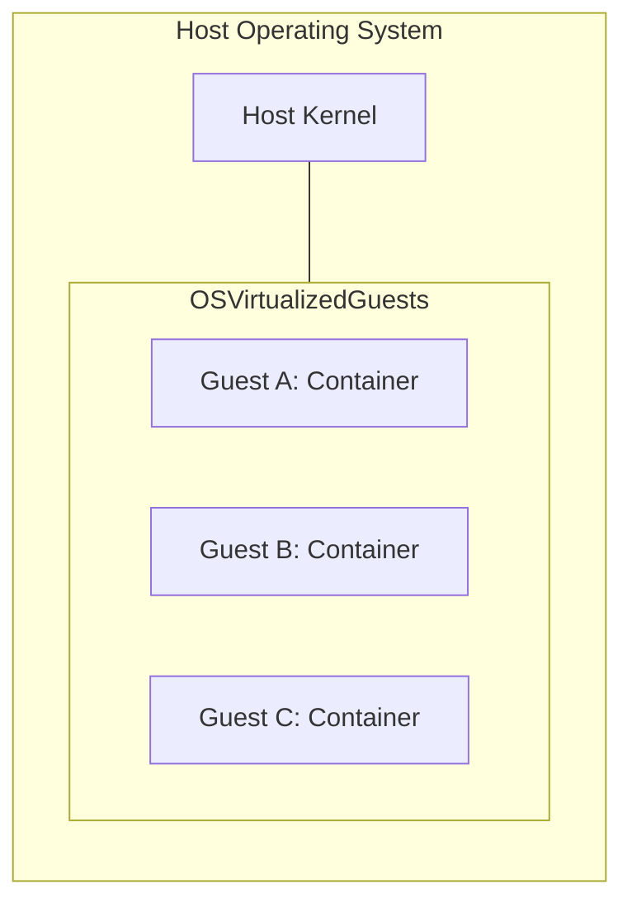

这种方法起源于 Unix 的 `chroot(8)` 命令，该命令将进程隔离到 Unix 全局文件系统的某个子树中（它将进程看到的顶级目录“/”更改为指向其他位置）。1998 年，FreeBSD 将此进一步发展为 FreeBSD jails，提供了充当独立服务器的安全隔离间。2005 年，Solaris 10 包含了一个名为 Solaris Zones 的版本，带有各种资源控制。同时，Linux 一直在分部分添加进程隔离功能，命名空间最早于 2002 年在 Linux 2.4.19 中添加，控制组最早于 2008 年在 Linux 2.6.24 中添加 [Corbet 07a][Corbet 07b][Linux 20m]。命名空间和 cgroups 结合起来创建了容器，它们通常还使用 `seccomp-bpf` 来控制[[Syscall|系统调用]]访问。

与硬件虚拟化技术的一个关键区别在于，只有一个内核在运行。以下是容器相对于硬件 VM（第 11.2 节，[[Hardware Virtualization|硬件虚拟化]]）的性能优势：

- **快速初始化时间**：通常以毫秒为单位。
- **客户机可以将内存完全用于应用程序**（没有额外的内核）。
- **存在统一的文件系统缓存**——这可以避免主机和客户机之间的双重缓存场景。
- **更细粒度的资源共享控制**（cgroups）。
- **对于主机运营商**：提高了性能可观察性，因为客户机进程及其交互是直接可见的。
- **容器可以共享公共文件的内存页**，从而释放页面缓存中的空间并提高 CPU 缓存命中率。
- **CPU 是真实的 CPU**；自适应互斥锁的假设仍然有效。

> [!WARNING] 容器的缺点
> - **增加了内核资源的竞争**（锁、缓存、缓冲区、队列）。
> - **对于客户机**：降低了性能可观察性，因为通常无法分析内核。
> - **任何内核崩溃都会影响所有客户机**。
> - **客户机无法运行自定义内核模块**。
> - **客户机无法运行长时间运行的 PGO 内核**（参见第 3.5.1 节，PGO Kernels）。
> - **客户机无法运行不同的内核版本或内核**。^7^

将前两个缺点综合考虑：一个从 VM 迁移到容器的客户机更有可能遇到内核竞争问题，同时也失去了分析这些问题的能力。他们将变得更加依赖主机运营商来进行此类分析。

容器在非性能方面的缺点是，由于它们共享内核，因此被认为安全性较低。

所有这些缺点都由第 11.4 节（[[Lightweight Virtualization|轻量级虚拟化]]）涵盖的轻量级虚拟化解决，尽管代价是失去了一些优点。

以下各节描述了 Linux 操作系统虚拟化的具体细节：实现、开销、资源控制和可观察性。

> [!INFO] 脚注 7
> 有些技术可以模拟不同的系统调用接口，以便不同的操作系统可以在一个内核下运行，但这在实践中具有性能影响。例如，这种模拟通常只提供基本的系统调用功能集，高级性能功能会返回 ENOTSUP（错误：不支持）。

### 11.3.1 实现

在 Linux 内核中没有容器的概念。但是，存在命名空间和 cgroups，用户空间软件（例如 Docker）使用它们来创建它所谓的容器。^8^ 典型的容器配置如图 11.10 所示。

**图 11.10 Linux 容器**

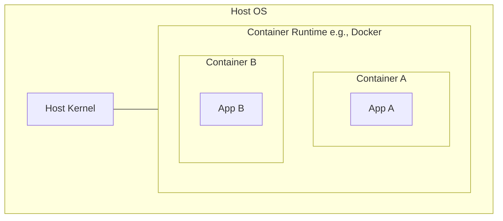

> [!INFO] 脚注 8
> 内核确实使用一个 `struct nsproxy` 来链接到进程的命名空间。由于此结构定义了进程如何被包容，因此它可以被认为是内核对容器最好的概念定义。

尽管每个容器内都有一个 ID 为 1 的进程，但由于它们属于不同的命名空间，因此它们是不同的进程。

由于许多容器部署使用 Kubernetes，其架构如图 11.11 所示。Kubernetes 在第 11.1.6 节，编排中介绍。

**图 11.11 Kubernetes 节点**

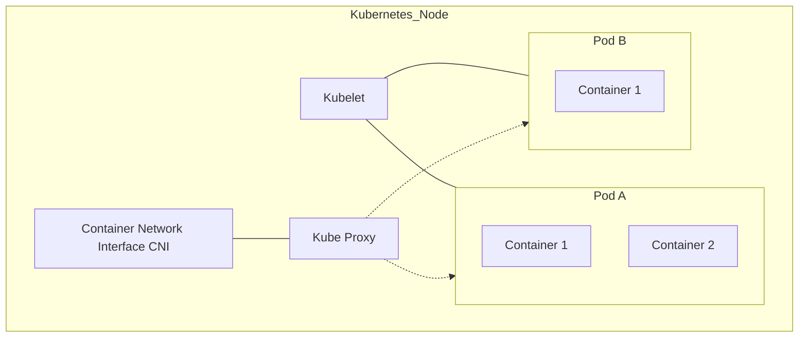

图 11.11 还显示了 Pod 之间通过 Kube Proxy 的网络路径，以及由 CNI 配置的容器网络。

Kubernetes 的一个优势是可以轻松创建多个容器以共享相同的命名空间，作为 Pod 的一部分。这允许容器之间使用更快的通信方法。

#### 命名空间

命名空间过滤了系统的视图，以便容器只能看到和管理自己的进程、挂载点和其他资源。这是提供容器与系统上其他容器隔离的主要机制。选定的命名空间列在表 11.1 中。

**表 11.1 选定的 Linux 命名空间**

| Namespace | 描述 |
| :--- | :--- |
| `cgroup` | 用于 cgroup 可见性 |
| `ipc` | 用于进程间通信可见性 |
| `mnt` | 用于文件系统挂载 |
| `net` | 用于网络栈隔离；过滤可见的接口、套接字、路由等 |
| `pid` | 用于进程可见性；过滤 `/proc` |
| `time` | 用于每个容器的独立系统时钟 |
| `user` | 用于用户 ID |
| `uts` | 用于主机信息；`uname(2)` 系统调用 |

系统上的当前命名空间可以使用 `lsns(8)` 列出：

# 11.1 云计算

`lsns` 命令的输出显示了 init 进程拥有六个不同的命名空间，被超过 100 个进程所使用。

在 Linux 源码以及手册页中（以 `namespaces(7)` 开头），有一些关于命名空间的文档。

## [[Control Groups|控制组]]

[[Control Groups|控制组]]（cgroups）用于限制资源的使用。Linux 内核中存在两个版本的 cgroups，即 v1 和 v2^9^；许多项目（如 Kubernetes）仍在使用 v1（v2 正在推进中）。v1 版本的 cgroups 包含表 11.2 中列出的内容。

> [!NOTE] 译注
> 9 也存在混合模式配置，可以同时并行使用 v1 和 v2 的部分功能。

**表 11.2 选定的 Linux cgroups**

| cgroup | 描述 |
| :--- | :--- |
| blkio | 限制块 I/O（磁盘 I/O）：字节和 IOPS |
| cpu | 基于份额限制 CPU 使用率 |
| cpuacct | 进程组的 CPU 使用量记账 |
| cpuset | 将 CPU 和内存节点分配给容器 |
| devices | 控制设备管理 |
| hugetlb | 限制大页内存的使用 |
| memory | 限制进程内存、内核内存和交换区使用量 |
| net_cls | 在数据包上设置 classid，供 qdiscs 和防火墙使用 |
| net_prio | 设置网络接口优先级 |
| perf_event | 允许 perf 监控 cgroup 中的进程 |
| pids | 限制可创建的进程数量 |
| rdma | 限制 RDMA 和 InfiniBand 资源的使用 |

这些 cgroups 可以被配置为限制容器之间的资源争用，例如对 CPU 和内存使用设置硬性限制，或者对 CPU 和磁盘使用设置软性限制（基于份额的）。cgroups 也可以存在层级结构，包括在容器之间共享的系统 cgroups，如图 11.10 所示。

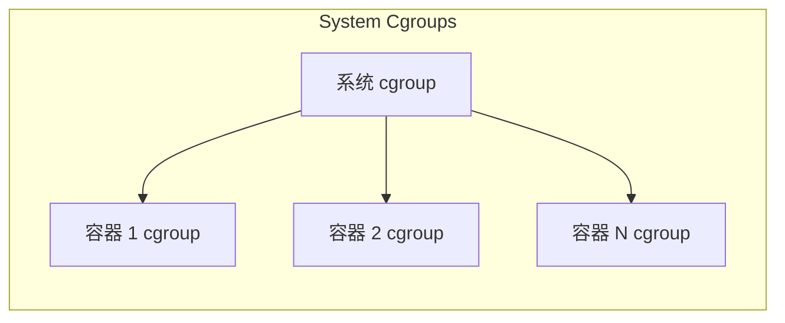
*图 11.10 容器共享系统 cgroup 层级结构示意图*

cgroups v2 是基于层级的，并解决了 v1 的各种缺点。预计容器技术将在未来几年内向 v2 迁移，v1 最终将被弃用。2019 年发布的 Fedora 31 操作系统已经切换到了 cgroups v2。

在 Linux 源码的 `Documentation/cgroup-v1` 和 `Documentation/admin-guide/cgroup-v2.rst` 目录下，以及 `cgroups(7)` 手册页中，都有关于 cgroups 的一些文档。

以下小节将描述容器虚拟化的相关主题：开销、资源控制和可观察性。这些内容会因具体的容器实现及其配置而有所不同。

### 11.3.2 开销

容器执行的开销应该是轻量级的：应用程序的 CPU 和内存使用应该能达到裸金属性能，尽管由于文件系统和网络路径中的各层，内核在处理 I/O 时可能会有一些额外的调用。最大的性能问题是由多租户争用引起的，因为容器促进了对内核和物理资源更重的共享。以下小节总结了 CPU 执行、内存使用、执行 I/O 以及来自其他租户争用的性能开销。

#### CPU

当容器线程在用户态运行时，没有直接的 CPU 开销：线程直接在 CPU 上运行，直到它们主动让出或被抢占。在 Linux 上，在命名空间和 cgroups 中运行进程也没有额外的 CPU 开销：无论是否使用容器，所有进程都已经运行在默认的命名空间和 cgroup 集合中。

CPU 性能最有可能因为与其他租户的争用而下降（参见后面的“多租户争用”小节）。

借助 Kubernetes 等编排器，额外的网络组件可能会增加处理网络数据包的 CPU 开销（例如，对于大量服务（数千个），当必须处理由于使用了大量 Kubernetes 服务而产生的大型 iptables 规则集时，`kube-proxy` 会遇到首包开销。这种开销可以通过使用 BPF 替代 `kube-proxy` 来克服 [Borkmann 20]）。

#### 内存映射

内存映射、加载和存储的执行应该没有开销。

#### 内存大小

应用程序可以利用为容器分配的全部内存。将此与硬件 VM 进行比较，硬件 VM 为每个租户运行一个内核，每个内核都会消耗少量的主存。

一种常见的容器配置（使用 OverlayFS）允许在访问相同文件的容器之间共享页缓存。与在内存中复制公共文件（例如系统库）的 VM 相比，这可以释放一些内存。

#### I/O

I/O 开销取决于容器配置，因为它可能包含用于隔离的额外层，用于：

- **文件系统 I/O**：例如 overlayfs
- **网络 I/O**：例如桥接网络

以下是一个内核栈跟踪信息，显示了一个由 overlayfs 处理（并由 XFS 文件系统支持）的容器文件系统写操作：

```
blk_mq_make_request+1
generic_make_request+420
submit_bio+108
_xfs_buf_ioapply+798
__xfs_buf_submit+226
xlog_bdstrat+48
xlog_sync+703
__xfs_log_force_lsn+469
xfs_log_force_lsn+143
xfs_file_fsync+244
xfs_file_buffered_aio_write+629
do_iter_readv_writev+316
do_iter_write+128
ovl_write_iter+376
__vfs_write+274
vfs_write+173
ksys_write+90
do_syscall_64+85
entry_SYSCALL_64_after_hwframe+68
```

在栈跟踪中，可以通过 `ovl_write_iter()` 函数看到 Overlayfs 的存在。

这有多大影响取决于工作负载及其 IOPS 速率。对于低 IOPS 的服务器（例如，<1000 IOPS），其产生的开销应该可以忽略不计。

#### 多租户争用

其他正在运行的租户的存在可能会导致资源争用和中断，从而损害性能，包括：

- **CPU 缓存**的命中率可能较低，因为其他租户正在消耗和驱逐缓存条目。对于某些处理器和内核配置，上下文切换到其他容器线程甚至可能会刷新 L1 缓存。^10^
- **TLB 缓存**的命中率也可能由于其他租户的使用而降低，并且也会在上下文切换时刷新（如果使用了 PCID，则可以避免此刷新）。
- **CPU 执行**可能会被其他租户设备（例如网络 I/O）执行中断服务例程而短时间中断。
- **内核执行**可能会遇到缓冲区、缓存、队列和锁的额外争用，因为多租户容器系统可能会使它们的负载增加一个数量级或更多。这种争用可能会轻微降低应用程序性能，具体取决于内核资源及其可伸缩性特征。
- **网络 I/O** 可能会由于使用 iptables 实现容器网络而遇到 CPU 开销。
- 可能会存在来自其他正在使用系统资源（CPU、磁盘、网络接口）的租户对**系统资源**的争用。

> [!NOTE] 译注
> 10 例如，在 2020 年 6 月，Linus Torvalds 拒绝了一个允许进程选择性加入 L1 数据缓存刷新的内核补丁 [Torvalds 20b]。该补丁是针对云环境的安全预防措施，但被拒绝的原因是担心在不必要的情况下产生性能成本。虽然该补丁未被包含在 Linux 主线中，但我不会惊讶如果这个补丁正运行在某些云环境中的 Linux 发行版里。

Gianluca Borello 的一篇文章描述了当系统上存在某些其他容器时，容器的性能是如何被发现在缓慢而稳定地下降的 [Borello 17]。他追踪发现 `lstat(2)` 延迟变高，这是由其他容器的工作负载及其对 dcache（目录缓存）的影响造成的。

Maxim Leonovich 报告的另一个问题显示了从单租户 VM 迁移到多租户容器如何增加了内核的 `posix_fadvise()` 调用速率，从而造成了瓶颈 [Leonovich 18]。

列表中的最后一项由资源控制来管理。虽然其中一些因素在传统的多用户环境中也存在，但它们在多租户容器系统中要普遍得多。

### 11.3.3 资源控制

资源控制通过对资源访问进行限流，以便更公平地共享资源。在 Linux 上，这些主要通过 cgroups 提供。

单个资源控制可以被分类为优先级或限制。优先级根据重要性的值引导资源消耗，以平衡相邻者之间的使用。限制是资源消耗的上限值。两者视情况适当使用——对于某些资源，这意味着两者都会被使用。示例列于表 11.3 中。

**表 11.3 Linux 容器资源控制**

| 资源 | 优先级 | 限制 |
| :--- | :--- | :--- |
| CPU | CFS 份额 | cpusets（整个 CPU），<br>CFS 带宽（小数 CPU） |
| 内存容量 | 内存软限制 | 内存限制 |
| 交换区容量 | - | 交换区限制 |
| 文件系统容量 | - | 文件系统配额/限制 |
| 文件系统缓存 | - | 内核内存限制 |
| 磁盘 I/O | blkio 权重 | blkio IOPS 限制<br>blkio 吞吐量限制 |
| 网络 I/O | net_prio 优先级<br>自定义 BPF | qdiscs (fq 等)<br>自定义 BPF |

以下小节基于 cgroup v1 概括性地描述了这些内容。配置这些控制的步骤取决于您使用的容器平台（Docker、Kubernetes 等）；请参阅其相关文档。

# 第11章 云计算

## 11.3 操作系统虚拟化

### 资源控制（续）

#### CPU

CPU 可以通过 cpusets cgroup 在容器间进行分配，也可以使用 CFS 调度器的份额和带宽进行分配。

##### cpusets

cpusets cgroup 允许将完整的 CPU 分配给特定的容器。其好处是这些容器可以在 CPU 上运行而不被其他容器中断，并且它们可用的 CPU 容量是一致的。缺点是空闲的 CPU 容量无法供其他容器使用。

##### 份额与带宽

由 CFS 调度器提供的 CPU 份额是 CPU 分配的另一种不同方法，它允许容器共享其空闲的 CPU 容量。份额支持突发的概念，即容器可以通过使用其他容器的空闲 CPU 来有效地运行得更快。当没有空闲容量时（包括主机被超额配置时），份额在需要 CPU 资源的容器之间提供一种尽力而为的分配。

CPU 份额的工作原理是将称为份额的分配单位分配给容器，这些份额用于计算繁忙容器在给定时间将获得的 CPU 数量。此计算使用以下公式：

$$\text{容器 CPU} = (\text{所有 CPU} \times \text{容器份额}) / \text{系统上的总繁忙份额}$$

考虑一个在多个容器之间分配了 100 个份额的系统。在某一时刻，只有容器 A 和容器 B 需要 CPU 资源。容器 A 有 10 个份额，容器 B 有 30 个份额。因此，容器 A 可以使用系统上总 CPU 资源的 25%：所有 CPU × 10 / (10 + 30)。

现在考虑一个所有容器同时繁忙的系统。给定容器的 CPU 分配将是：

$$\text{容器 CPU} = \text{所有 CPU} \times \text{容器份额} / \text{系统上的总份额}$$

对于所描述的场景，容器 A 将获得 10% 的 CPU 容量（CPU × 10/100）。份额分配提供了 CPU 使用率的最低保证。突发可能允许容器使用更多。容器 A 可以使用 10% 到 100% 之间的任何 CPU 容量，具体取决于有多少其他容器处于繁忙状态。

份额的一个问题是，突发可能会混淆容量规划，特别是因为许多监控系统不显示突发统计数据（它们应该显示）。测试容器的最终用户可能对其性能感到满意，却没有意识到这种性能只是通过突发才实现的。后来，当其他租户加入时，他们的容器无法再突发，并将遭受较低的性能。想象一下，容器 A 最初在空闲系统上测试并获得 100% 的 CPU，但后来由于添加了其他容器，只获得了 10%。我曾在现实生活中多次看到这种情况发生，最终用户认为肯定存在系统性能问题并请我帮忙调试。当他们了解到系统按预期工作，并且因为其他容器加入导致慢十倍成为新常态时，他们感到很失望。对客户来说，这感觉就像诱饵替换。

> [!WARNING] 突发性能陷阱
> 容器在空闲时通过突发获得的性能，在其他租户加入后将无法维持。这种性能落差常被误认为系统故障，实则是份额分配机制的正常行为。监控工具应当包含突发统计数据以避免误导。

可以通过限制过度突发来减轻此问题，使得性能下降不那么严重（尽管这也限制了性能）。在 Linux 上，这是使用 CFS 带宽控制完成的，它可以设置 CPU 使用率的上限。例如，容器 A 的带宽可以设置为全系统 CPU 容量的 20%，这样结合份额，它现在在 10% 到 20% 的范围内运行，具体取决于空闲可用性。从基于份额的最低 CPU 到带宽最大值的范围如图 11.12 所示。它假设每个容器中有足够的繁忙线程来使用可用的 CPU（否则容器将在达到系统强加的限制之前，由于其自身工作负载而受到 CPU 限制）。

**图 11.12 CPU 份额与带宽**


带宽控制通常以整个 CPU 的百分比形式公开：2.5 意味着两个半 CPU。这映射到内核设置，它们实际上是微秒级的周期和配额：容器在每个周期获得一定配额的 CPU 微秒数。

管理突发的另一种方法是，容器操作员在最终用户突发一段时间（例如，几天）时通知他们，以便他们不会对性能产生错误的期望。然后可以鼓励最终用户升级其容器大小，以便他们获得更多份额，以及更高的 CPU 分配最低保证。

#### CPU 缓存

可以使用 Intel 缓存分配技术 ([[CAT|Intel Cache Allocation Technology]]) 来控制 CPU 缓存的使用，以避免容器污染 CPU 缓存。这在第 11.2.3 节“资源控制”中已有描述，并且有同样的警告：限制缓存访问也会损害性能。

#### 内存容量

memory cgroup 提供了四种机制来管理内存使用。表 11.4 通过它们的 memory cgroup 设置名称进行了描述。

**表 11.4 Linux memory cgroup 设置**

| 名称 | 描述 |
|---|---|
| `memory.limit_in_bytes` | 大小限制，以字节为单位。如果容器尝试使用超过分配大小的内存，它会遇到交换（如果已配置）或 OOM killer。 |
| `memory.soft_limit_in_bytes` | 大小限制，以字节为单位。一种尽力而为的方法，涉及回收内存以将容器引向其软限制。 |
| `memory.kmem.limit_in_bytes` | 内核内存的大小限制，以字节为单位。 |
| `memory.kmem.tcp.limit_in_bytes` | TCP 缓冲区内存的大小限制，以字节为单位。 |
| `memory.pressure_level` | 低内存通知器，可通过 `eventfd(2)` 系统调用使用。这需要应用程序支持来配置压力级别并使用该系统调用。 |

还有通知机制，以便应用程序可以在内存不足时采取措施：`memory.pressure_level` 和 `memory.oom_control`。这些需要通过 `eventfd(2)` 系统调用配置通知。

> [!TIP] 内存突发
> 请注意，容器未使用的内存可以由内核页缓存中的其他容器使用，从而提高其性能（这是突发的一种内存形式）。

#### 交换容量

memory cgroup 还允许配置交换限制。实际设置是 `memory.memsw.limit_in_bytes`，即内存加交换空间。

#### 文件系统容量

文件系统容量通常可以由文件系统限制。例如，XFS 文件系统支持用户、组和项目的软硬配额，其中软限制允许在硬限制下有一些临时的超额使用。[[ZFS]] 和 [[btrfs]] 也有配额。

#### 文件系统缓存

在 Linux 中，容器用于文件系统页缓存的内存会在 memory cgroup 中计入该容器：不需要额外的设置。如果容器配置了交换空间，则可以通过 `memory.swappiness` 设置控制倾向于交换还是页缓存逐出的程度，这类似于系统范围的 `vm.swappiness`（第 7 章 内存，第 7.6.1 节 可调参数）。

#### 磁盘 I/O

blkio cgroup 提供了管理磁盘 I/O 的机制。表 11.5 通过它们的 blkio cgroup 设置名称进行了描述。

**表 11.5 Linux blkio cgroup 设置**

| 名称 | 描述 |
|---|---|
| `blkio.weight` | 一个 cgroup 权重，用于控制负载期间磁盘资源的份额，类似于 CPU 份额。它与 BFQ I/O 调度器一起使用。 |
| `blkio.weight_device` | 特定设备的权重设置。 |
| `blkio.throttle.read_bps_device` | 读取字节/秒的限制。 |
| `blkio.throttle.write_bps_device` | 写入字节/秒的限制。 |
| `blkio.throttle.read_iops_device` | 读取 IOPS 的限制。 |
| `blkio.throttle.write_iops_device` | 写入 IOPS 的限制。 |

与 CPU 份额和带宽一样，blkio 权重和节流设置允许基于优先级和限制的策略来共享磁盘 I/O 资源。

#### 网络 I/O

`net_prio` cgroup 允许为出站网络流量设置优先级。这些与 `SO_PRIORITY` 套接字选项（参见 `socket(7)`）相同，并控制网络栈中数据包处理的优先级。`net_cls` cgroup 可以使用类 ID 标记数据包，以便稍后由 [[qdisc|排队规则]] 管理。（这也适用于 Kubernetes Pod，每个 Pod 可以使用一个 `net_cls`。）

排队规则（qdiscs，见第 10 章 网络，第 10.4.3 节 软件）可以基于类 ID 操作，或者分配给容器的虚拟网络接口，以对网络流量进行优先级排序和节流。有超过 50 种不同的 qdisc 类型，每种都有自己的策略、功能和可调参数。例如，Kubernetes 的 `kubernetes.io/ingress-bandwidth` 和 `kubernetes.io/egress-bandwidth` 设置是通过创建令牌桶过滤器 ([[TBF|Token Bucket Filter]]) qdisc 来实现的 [CNI 18]。第 10.7.6 节 `tc` 提供了向网络接口添加和删除 qdisc 的示例。

[[BPF]] 程序可以附加到 cgroup，以实现自定义的编程资源控制和防火墙。一个例子是 [[Cilium]] 软件，它使用在各种层（如 XDP、cgroup 和 tc (qdiscs)）的 BPF 程序组合，以支持容器之间的安全、负载均衡和防火墙功能 [Cilium 20a]。

### 11.3.4 可观察性

什么是可观察的取决于启动可观察性工具的位置以及主机的安全设置。因为容器可以以许多不同的方式配置，我将描述典型情况。一般来说：

> [!INFO] 从主机（最高特权命名空间）观察
> 一切都可以被观察到，包括硬件资源、文件系统、客户机进程、客户机 TCP 会话等。无需登录到客户机即可查看和分析客户机进程。也可以从主机（云提供商）轻松浏览客户机文件系统。

> [!WARNING] 从客户机观察
> 容器通常只能看到自己的进程、文件系统、网络接口和 TCP 会话。一个主要的例外是系统范围的统计信息，例如 CPU 和磁盘的统计信息：这些通常显示的是主机而不仅仅是容器。这些统计信息的状态通常没有文档记录（我在下一节“传统工具”中编写了自己的文档）。内核内部通常无法检查，因此使用内核跟踪框架（第 13 章至第 15 章）的性能工具通常不起作用。

最后一点在前面已经描述过：容器更有可能遇到内核争用问题，同时它们又剥夺了最终用户诊断这些问题的能力。

容器性能分析的一个常见关注点是可能存在“吵闹的邻居”，即激进地消耗资源并导致其他容器访问争用的其他容器租户。由于这些容器进程都在一个内核下，并且可以同时从主机进行分析，因此这与在分时系统上运行多个进程的传统性能分析没有太大区别。主要区别在于 [[cgroup|cgroups]] 可能会强加在达到硬件限制之前遇到的额外软件限制（资源控制）。

许多为独立系统编写的监控工具尚未开发对操作系统虚拟化（容器）的支持，并且对 cgroup 和其他软件限制视而不见。尝试在容器中使用这些工具的客户可能会发现它们似乎可以工作，但实际上只显示了物理系统资源。由于缺乏对云资源控制的观察支持，这些工具可能会错误地报告系统还有余量，而实际上它们已经达到了软件限制。它们也可能显示实际上由其他租户导致的高资源使用率。

在 Linux 上，由于内核中目前没有容器 ID [11]，而且传统性能工具对容器的支持也不多，这使得从主机和客户机进行的容器可观察性变得更加复杂和耗时。

以下各节将描述这些挑战，总结传统性能工具的现状，探讨从主机和容器的可观察性，并描述分析性能的策略。

# 11.1 云计算

## 11.3 OS 虚拟化

### 11.3.4.1 传统工具

作为对传统性能工具的总结，表 11.6 描述了在 Linux 5.2 内核上，从宿主机和从典型容器（使用进程和挂载命名空间的容器）运行时，各种工具分别会显示什么内容。可能出乎意料的情况（例如容器可以观察到宿主机统计信息时）以**粗体**突出显示。

> [!NOTE] 脚注 11
> 容器管理软件可能会以容器 ID 来命名 cgroup，在这种情况下，内核中的 cgroup 名称确实会显示用户级别的容器名。默认的 cgroup v2 ID 是另一个可用的内核内 ID 候选者，BPF 和 bpftrace 就将其用于此目的。11.3.4 节“可观察性”下的 BPF 跟踪部分展示了另一种可能的解决方案：使用来自 UTS 命名空间的 nodename，它通常被设置为容器名。

**表 11.6 Linux 传统工具**

| 工具 | 从宿主机运行 | 从容器中运行 |
| :--- | :--- | :--- |
| `top` | 摘要标题显示宿主机信息；进程表显示所有宿主机和容器进程 | 摘要标题显示混合统计信息；部分来自宿主机，部分来自容器。进程表显示容器进程 |
| `ps` | 显示所有进程 | 显示容器进程 |
| `uptime` | 显示宿主机（系统范围）平均负载 | **显示宿主机平均负载** |
| `mpstat` | 显示宿主机 CPU 及其使用率 | **显示宿主机 CPU，以及宿主机 CPU 使用率** |
| `vmstat` | 显示宿主机 CPU、内存和其他统计信息 | **显示宿主机 CPU、内存和其他统计信息** |
| `pidstat` | 显示所有进程 | 显示容器进程 |
| `free` | 显示宿主机内存 | **显示宿主机内存** |
| `iostat` | 显示宿主机磁盘 | **显示宿主机磁盘** |
| `pidstat -d` | 显示所有进程的磁盘 I/O | 显示容器进程的磁盘 I/O |
| `sar -n DEV, TCP 1` | 显示宿主机网络接口和 TCP 统计信息 | **显示宿主机网络接口和 TCP 统计信息** |
| `perf` | 可以分析所有内容 | 要么运行失败，要么被启用后可以分析其他租户 |
| `tcpdump` | 可以嗅探所有接口 | 仅嗅探容器接口 |
| `dmesg` | 显示内核日志 | 运行失败 |

随着时间的推移，工具对容器的支持可能会有所改善，使得它们在容器内运行时只显示特定于容器的统计信息，甚至更好，能够显示容器与宿主机统计信息的细分。宿主机工具可以显示所有内容，它们也可以通过增加按容器或 cgroup 进行细分和过滤的支持来得到改进。这些主题将在下面关于宿主机和客户机可观察性的章节中详细说明。

### 11.3.4.2 宿主机

当登录到宿主机时，可以使用前面章节介绍的工具检查所有系统资源（CPU、内存、文件系统、磁盘、网络）。在使用容器时，还需要检查两个额外的因素：

- 每个容器的统计信息
- [[资源控制]]的影响

正如 11.3.1 节“实现”中所述，内核中没有“容器”的概念：容器只是命名空间和 cgroup 的集合。你看到的容器 ID 是由用户空间软件创建和管理的。以下是来自 Kubernetes（在此例中，是一个包含单个容器的 Pod）和 Docker 的容器 ID 示例：

```bash
# kubectl get pod
NAME                         READY   STATUS              RESTARTS   AGE
kubernetes-b94cb9bff-kqvml   0/1     ContainerCreating   0          3m
[...]
```

```bash
# docker ps
CONTAINER ID  IMAGE   COMMAND   CREATED      STATUS      PORTS  NAMES
6280172ea7b9  ubuntu  "bash"    4 weeks ago  Up 4 weeks         eager_bhaskara
[...]
```

这对于 `ps(1)`、`top(1)` 等传统性能工具提出了一个问题。要显示容器 ID，它们需要支持 Kubernetes、Docker 以及其他所有容器平台。相反，如果内核支持容器 ID，那么它将成为所有性能工具都需要支持的标准。Solaris 内核就是这种情况，其容器被称为 zones，具有基于内核的 zone ID，可以使用 `ps(1)` 和其他工具观察到。（下面的 BPF 跟踪标题展示了一个 Linux 解决方案，使用来自 UTS 命名空间的 nodename 作为容器 ID。）

在实践中，在 Linux 上按容器 ID 检查性能统计信息可以通过以下方式进行：

- 容器平台提供的**容器工具**；例如，Docker 提供了按容器显示资源使用情况的工具。
- **性能监控软件**，通常具有针对各种容器平台的插件。
- **Cgroup 统计信息**及使用它们的工具。这需要额外的步骤来弄清哪些 cgroup 映射到哪个容器。
- 从宿主机进行的**命名空间映射**，例如使用 `nsenter(1)`，允许在容器内运行宿主机性能工具。与 `-p`（PID 命名空间）选项一起使用时，可以将可见进程缩减为仅来自容器的进程。尽管性能工具的统计信息可能并不仅限于该容器：参见表 11.6。`-n`（网络命名空间）选项对于在相同的网络命名空间内运行网络工具（`ping(8)`、`tcpdump(8)`）也很有用。
- **BPF 跟踪**，可以从内核中读取 cgroup 和命名空间信息。

以下各节提供了容器工具、cgroup 统计信息、命名空间进入以及 BPF 跟踪的示例，以及资源控制可观察性的内容。

#### 容器工具

Kubernetes 容器编排系统提供了一种使用 `kubectl top` 检查基本资源使用情况的方法。

检查宿主机（“节点”）：

```bash
# kubectl top nodes
NAME                         CPU(cores)   CPU%   MEMORY(bytes)   MEMORY%
bgregg-i-03cb3a7e46298b38e   1781m        10%    2880Mi          9%
```

`CPU(cores)` 时间显示了 CPU 时间的累积毫秒数，而 `CPU%` 显示了节点的当前使用率。

检查容器（“Pods”）：

```bash
# kubectl top pods
NAME                         CPU(cores)   MEMORY(bytes)
kubernetes-b94cb9bff-p7jsp   73m          9Mi
```

这显示了累积的 CPU 时间和当前的内存大小。

这些命令需要运行指标服务器，根据你初始化 Kubernetes 的方式，它可能会被默认添加。其他监控工具也可以在 GUI 中显示这些指标，包括 cAdvisor、Sysdig 和 Google Cloud Monitoring [Kubernetes 20c]。

Docker 容器技术提供了一些 `docker(1)` 分析子命令，包括 `stats`。例如，来自一个生产宿主机：

```bash
# docker stats
CONTAINER     CPU %    MEM USAGE / LIMIT     MEM %   NET I/O    BLOCK I/O       PIDS
353426a09db1  526.81%  4.061 GiB / 8.5 GiB   47.78%  0 B / 0 B  2.818 MB / 0 B  247
6bf166a66e08  303.82%  3.448 GiB / 8.5 GiB   40.57%  0 B / 0 B  2.032 MB / 0 B  267
58dcf8aed0a7  41.01%   1.322 GiB / 2.5 GiB   52.89%  0 B / 0 B  0 B / 0 B       229
61061566ffe5  85.92%   220.9 MiB / 3.023 GiB 7.14%   0 B / 0 B  43.4 MB / 0 B   61
bdc721460293  2.69%    1.204 GiB / 3.906 GiB 30.82%  0 B / 0 B  4.35 MB / 0 B   66
[...]
```

这显示 UUID 为 `353426a09db1` 的容器在此更新间隔内总共消耗了 527% 的 CPU，并使用了 4 Gbytes 的主存，而限制为 8.5 Gbytes。在此间隔期间没有网络 I/O，只有少量（Mbytes 级）的磁盘 I/O。

#### Cgroup 统计信息

各种按 cgroup 分类的统计信息可从 `/sys/fs/cgroups` 获取。各种容器监控产品和工具会读取并绘制这些统计信息的图表，也可以直接在命令行中检查它们：

```bash
# cd /sys/fs/cgroup/cpu,cpuacct/docker/02a7cf65f82e3f3e75283944caa4462e82f...
# cat cpuacct.usage
1615816262506
```

```bash
# cat cpu.stat
nr_periods 507
nr_throttled 74
throttled_time 3816445175
```

`cpuacct.usage` 文件以总纳秒数显示此 cgroup 的 CPU 使用情况。`cpu.stat` 文件显示此 cgroup 受到 CPU 限制的次数（`nr_throttled`），以及总的限制时间（纳秒）。此示例显示，在 507 个时间段中，此 cgroup 受到了 74 次 CPU 限制，总共被限制了 3.8 秒。

还有一个 `cpuacct.usage_percpu`，这里展示一个 Kubernetes cgroup 的例子：

```bash
# cd /sys/fs/cgroup/cpu,cpuacct/kubepods/burstable/pod82e745...
# cat cpuacct.usage_percpu
37944772821 35729154566 35996200949 36443793055 36517861942 36156377488 36176348313 
35874604278 37378190414 35464528409 35291309575 35829280628 36105557113 36538524246 
36077297144 35976388595 
```

输出包含针对此 16 CPU 系统的 16 个字段，以纳秒为单位显示总 CPU 时间。这些 cgroupv1 指标记录在内核源码的 `Documentation/cgroup-v1/cpuacct.txt` 中。

读取这些统计信息的命令行工具包括 `htop(1)` 和 `systemd-cgtop(1)`。例如，在生产容器宿主机上运行 `systemd-cgtop(1)`：

```bash
# systemd-cgtop
Control Group                              Tasks   %CPU   Memory  Input/s Output/s
/                                              -  798.2    45.9G        -        -
/docker                                     1082  790.1    42.1G        -        -
/docker/dcf3a...9d28fc4a1c72bbaff4a24834     200  610.5    24.0G        -        -
/docker/370a3...e64ca01198f1e843ade7ce21     170  174.0     3.0G        -        -
/system.slice                                748    5.3     4.1G        -        -
/system.slice/daemontools.service            422    4.0     2.8G        -        -
/docker/dc277...42ab0603bbda2ac8af67996b     160    2.5     2.3G        -        -
/user.slice                                    5    2.0    34.5M        -        -
/user.slice/user-0.slice                       5    2.0    15.7M        -        -
/user.slice/u....slice/session-c26.scope       3    2.0    13.3M        -        -
/docker/ab452...c946f8447f2a4184f3ccff2a     174    1.0     6.3G        -        -
/docker/e18bd...26ffdd7368b870aa3d1deb7a     156    0.8     2.9G        -        -
[...]
```

此输出显示名为 `/docker/dcf3a...` 的 cgroup 在此更新间隔期间（跨越多个 CPU）消耗了总计 610.5% 的 CPU 和 24 Gbytes 的主存，有 200 个运行中的任务。输出还显示了由 systemd 为系统服务（`/system.slice`）和用户会话（`/user.slice`）创建的许多 cgroup。

# 11.1 云计算

## 11.3 操作系统虚拟化

### 命名空间映射

容器通常为进程 ID 和挂载点使用不同的 [[命名空间]]。

对于进程命名空间而言，这意味着客户机中的 PID 极有可能与主机中的 PID 不匹配。在诊断性能问题时，我通常会先登录到容器中，以便能从终端用户的视角来观察问题。之后，我可能会登录到主机，使用系统级的工具继续调查，但此时 PID 可能已经不同了。这种映射关系显示在 `/proc/PID/status` 文件中。例如，从主机的视角看：

```bash
host# grep NSpid /proc/4915/status
NSpid:   4915    753
```

这表明主机上的 PID 4915 对应的是客户机中的 PID 753。然而不幸的是，我通常需要做的是反向映射：给定容器中的 PID，去寻找主机中的 PID。一种（稍微有点低效的）方法是扫描所有的 status 文件：

```bash
host# awk '$1 == "NSpid:" && $3 == 753 { print $2 }' /proc/*/status
4915
```

在这个例子中，结果显示客户机 PID 753 对应的是主机 PID 4915。需要注意的是，输出可能会显示多个主机 PID，因为“753”可能出现在多个进程命名空间中。在这种情况下，您需要弄清楚哪个 753 属于匹配的命名空间。`/proc/PID/ns` 文件是包含命名空间 ID 的符号链接，可用于此目的。分别从客户机和主机检查它们：

```bash
guest# ls -lh /proc/753/ns/pid
lrwxrwxrwx 1 root root 0 Mar 15 20:47 /proc/753/ns/pid -> 'pid:[4026532216]'

host# ls -lh /proc/4915/ns/pid
lrwxrwxrwx 1 root root 0 Mar 15 20:46 /proc/4915/ns/pid -> 'pid:[4026532216]'
```

注意相匹配的命名空间 ID（4026532216）：这确认了主机 PID 4915 和客户机 PID 753 是同一个进程。

挂载命名空间也会带来类似的挑战。例如，从主机运行 `perf(1)` 命令时，它会在 `/tmp/perf-PID.map` 中搜索补充的符号文件，但容器应用程序会将它们输出到容器内的 `/tmp` 中，这与主机上的 `/tmp` 并不是同一个目录。此外，由于进程命名空间的存在，PID 很可能也是不同的。Alice Goldfuss 最早发布了一种针对此问题的变通方法，涉及移动和重命名这些符号文件，以便它们能在主机上被访问 [Goldfuss 17]。此后，`perf(1)` 已经获得了命名空间支持以避免此问题，并且内核提供了 `/proc/PID/root` 挂载命名空间映射，用于直接访问容器的根目录（“/”）。例如：

```bash
host# ls -lh /proc/4915/root/tmp
total 0
-rw-r--r-- 1 root root 0 Mar 15 20:54 I_am_in_the_container.txt
```

这里列出的是容器 `/tmp` 中的一个文件。

除了 `/proc` 文件之外，`nsenter(1)` 命令可以在选定的命名空间中执行其他命令。以下命令从主机上运行 `top(1)` 命令，并进入 PID 4915 的挂载（`-m`）和进程（`-p`）命名空间（`-t 4915`）：

```bash
# nsenter -t 4915 -m -p top
top - 21:14:24 up 32 days, 23:23,  0 users,  load average: 0.32, 0.09, 0.02
Tasks:   3 total,   2 running,   1 sleeping,   0 stopped,   0 zombie
%Cpu(s):  0.2 us,  0.1 sy,  0.0 ni, 99.4 id,  0.0 wa,  0.0 hi,  0.0 si,  0.2 st
KiB Mem :  1996844 total,    98400 free,   858060 used,  1040384 buff/cache
KiB Swap:        0 total,        0 free,        0 used.   961564 avail Mem 
  PID USER      PR  NI    VIRT    RES    SHR S  %CPU %MEM     TIME+ COMMAND 
  753 root      20   0  818504  93428  11996 R 100.0  0.2   0:27.88 java 
    1 root      20   0   18504   3212   2796 S   0.0  0.2   0:17.57 bash 
  766 root      20   0   38364   3420   2968 R   0.0  0.2   0:00.00 top   
```

这显示 PID 为 753 的 java 进程是占用 CPU 最高的进程。

### BPF 追踪

一些 [[BPF|BPF 追踪]]工具已经支持容器，但许多还没有。幸运的是，在需要时为 `bpftrace` 工具添加支持通常并不困难；下面是一个例子。有关 `bpftrace` 编程的解释请参见第 15 章。

`forks.bt` 工具通过插桩 `clone(2)`、`fork(2)` 和 `vfork(2)` 系统调用来计算追踪期间创建的新进程数量。其源码如下：

```bash
#!/usr/local/bin/bpftrace

tracepoint:syscalls:sys_enter_clone,
tracepoint:syscalls:sys_enter_fork,
tracepoint:syscalls:sys_enter_vfork
{
        @new_processes = count();
}
```

输出示例：

```bash
# ./forks.bt 
Attaching 3 probes...
^C
@new_processes: 590
```

这显示在追踪期间，系统范围内共创建了 590 个新进程。

为了按容器对这些数据进行细分，一种方法是打印来自 uts 命名空间的 nodename（主机名）。这依赖于容器软件配置了该命名空间，通常情况也是如此。修改后的代码如下，新增部分已高亮显示：

```bash
#!/usr/local/bin/bpftrace

#include <linux/sched.h>
#include <linux/nsproxy.h>
#include <linux/utsname.h>

tracepoint:syscalls:sys_enter_clone,
tracepoint:syscalls:sys_enter_fork,
tracepoint:syscalls:sys_enter_vfork
{
        $task = (struct task_struct *)curtask;
        $nodename = $task->nsproxy->uts_ns->name.nodename;
        @new_processes[$nodename] = count();
}
```

这些额外的代码从当前的内核 `task_struct` 遍历到 uts 命名空间的 nodename，并将其作为键包含在 `@new_processes` 输出映射中。

输出示例：

```bash
# ./forks.bt 
Attaching 3 probes...
^C
@new_processes[ip-10-1-239-218]: 171
@new_processes[efe9f9be6185]: 743
```

输出现在按容器进行了细分，显示 nodename 为 6280172ea7b9（一个容器）在追踪期间创建了 252 个进程（*译者注：此处原文中的数字 6280172ea7b9 及 252 与上方输出示例中的 efe9f9be6185 及 743 存在不一致，但忠实保留了原文信息*）。另一个 nodename，ip-10-1-239-218，则是主机系统。

这种做法之所以有效，是因为系统调用是在任务（进程）上下文中运行的，因此 `curtask` 会返回负责的 `task_struct`，我们可以从中获取 nodename。如果追踪的是进程异步事件，例如来自磁盘 I/O 的完成中断，那么发起该操作的进程可能不在 CPU 上运行，`curtask` 将无法识别出正确的 nodename。

由于获取 uts nodename 在 `bpftrace` 中可能会变得非常常用，我想象未来我们会添加一个内置变量 `nodename`，这样一来新增的代码就只需：

```bash
@new_processes[nodename] = count();
```

请检查 `bpftrace` 的更新，看看此功能是否已经被加入。

### 资源控制

必须检查第 11.3.3 节“资源控制”中列出的[[资源控制]]，以识别容器是否受其限制。传统的性能工具和文档侧重于物理资源，对这些软件施加的限制视而不见。

检查资源控制在 USE 方法中已有描述（第 2 章，方法论，第 2.5.9 节，USE 方法），该方法遍历资源并检查使用率、饱和度和错误。当存在资源控制时，也必须对每个资源进行检查。

之前名为“Cgroup 统计信息”的小节展示了 `/sys/fs/cgroup/.../cpu.stat` 文件，该文件提供了 CPU 节流（`nr_throttled`）和以纳秒为单位的节流时间（`throttled_time`）的统计数据。此节流指的是 CPU 带宽限制，判断容器是否受到带宽节流非常简单：只需看 `throttled_time` 是否在增加。如果使用的是 cpusets，则它们的 CPU 利用率可以通过每 CPU 的工具和指标来检查，包括 `mpstat(1)`。

CPU 也可以通过份额来管理，如前文“份额和带宽”小节所述。受份额限制的容器更难被识别，因为没有相关的统计数据。我开发了图 11.13 所示的流程图，用于确定容器 CPU 是否受到节流以及如何节流的过程 [Gregg 17g]：

> [!note] 图 11.13 容器 CPU 节流分析
> *(此处原文档包含一张图片，描述容器 CPU 节流分析的流程图)*

图 11.13 中的流程使用五个统计信息来确定容器 CPU 是否受到节流以及如何节流：

- **节流时间**：cpu cgroup 的 `throttled_time`
- **非自愿上下文切换**：可以从 `/proc/PID/status` 中读取 `nonvoluntary_ctxt_switches` 的增加量
- **主机有空闲 CPU**：可以从 `mpstat(1)` 的 `%idle`、`/proc/stat` 以及其他工具中读取
- **cpuset CPU 100% 繁忙**：如果使用了 cpusets，其利用率可以从 `mpstat(1)`、`/proc/stat` 等处读取
- **所有其他租户空闲**：可以通过特定于容器的工具（`docker stat`）或显示缺乏 CPU 资源竞争的系统工具来确定（例如，如果 `top(1)` 仅显示该一个容器在消耗 %CPU）

可以为其他资源开发类似的过程，并且包括 cgroup 统计信息在内的支持性统计信息应该在监控软件和工具中提供。理想的监控产品或工具会替您做出判断，并报告每个容器是否受到节流以及是如何节流的。

#### 客户机（容器）

您可能认为从容器中运行性能工具只会显示容器的统计信息，但情况往往并非如此。例如，在一个空闲的容器上运行 `iostat(1)`：

```bash
container# iostat -sxz 1
[...]
avg-cpu:  %user   %nice %system %iowait  %steal   %idle
          57.29    0.00    8.54   33.17    0.00    1.01
Device             tps      kB/s    rqm/s   await aqu-sz  areq-sz  %util
nvme0n1        2578.00  12436.00   331.00    0.33   0.00     4.82 100.00
avg-cpu:  %user   %nice %system %iowait  %steal   %idle
          51.78    0.00    7.61   40.61    0.00    0.00
Device             tps      kB/s    rqm/s   await aqu-sz  areq-sz  %util
nvme0n1        2664.00  11020.00    88.00    0.32   0.00     4.14  98.80
[...]
```

这个输出同时显示了 CPU 和磁盘工作负载，然而这个容器本身完全是空闲的。这对于刚接触操作系统虚拟化的人来说可能会很困惑——为什么我的容器很忙？这是因为这些工具显示的是主机的统计信息，其中包含了来自其他租户的活动。

> [!INFO] 传统工具的局限性
> 这些性能工具的状况在第 11.3.4 节“可观察性”的“传统工具”小节中进行了总结。随着时间的推移，这些工具正变得越来越“容器感知”，支持 cgroup 统计信息并在容器内提供仅限该容器的统计信息。

# 第11章 云计算

块 I/O 也有相应的 cgroup 统计信息。从同一个容器中执行：

```bash
container# cat /sys/fs/cgroup/blkio/blkio.throttle.io_serviced
259:0 Read 452
259:0 Write 352
259:0 Sync 692
259:0 Async 112
259:0 Discard 0
259:0 Total 804
Total 804

container# sleep 10

container# cat /sys/fs/cgroup/blkio/blkio.throttle.io_serviced
259:0 Read 452
259:0 Write 352
259:0 Sync 692
259:0 Async 112
259:0 Discard 0
259:0 Total 804
Total 804
```

这些计数统计了不同类型的操作。我通过中间插入 `sleep 10` 打印了两次以设定一个时间间隔：你可以看到在该时间间隔内计数并没有增加；因此，该容器没有发出磁盘 I/O。还有一个统计字节数的文件：`blkio.throttle.io_service_bytes`。

不幸的是，这些计数器并没有提供 `iostat(1)` 所需的全部统计信息。cgroup 需要暴露更多的计数器，以便 `iostat(1)` 能够感知容器。

### 容器感知

让工具变得容器感知，并不一定意味着将其视图限制在它自己的容器内：让容器看到物理资源的状态也是有好处。这取决于使用容器的目的，可能是：

**A) 容器是一个隔离的服务器：** 如果这是目标，通常对于云供应商来说也是如此，那么让工具感知容器就意味着它们只显示当前容器的活动。例如，`iostat(1)` 应该只显示由该容器调用而非其他的磁盘 I/O。这可以通过隔离所有统计信息源以仅显示当前容器（`/proc`、`/sys`、netlink 等）来实现。这种隔离对客户机（guest）的分析既有帮助也有阻碍：诊断来自其他租户的资源争用问题将更加耗时，并且需要依赖从无法解释的设备延迟增加中进行推断。

**B) 容器是一种打包方案：** 对于运营自己容器云的公司来说，隔离容器的统计信息可能并非必需。允许容器查看主机统计信息（正如目前通常的情况一样，如前面 `iostat(1)` 所示）意味着最终用户可以更好地了解硬件设备的状态以及吵闹的邻居引起的问题。在这种情况下，让 `iostat(1)` 更具容器感知能力可能意味着提供一个细分项，显示当前容器与主机或其他容器使用情况的对比，而不是隐藏这些统计信息。

对于这两种场景，作为容器感知的一部分，工具还应该在适当的地方支持显示资源控制信息。继续以 `iostat(1)` 为例，除了设备 `%util`（在场景 A 中不可见）之外，它还可以提供一个基于 blkio 吞吐量和 IOPS 限制的 `%cap`，这样容器就知道磁盘 I/O 是否受到了资源控制的限制。^12

如果允许对物理资源进行观察，客户机将能够排除某些类型的问题，包括吵闹的邻居。这可以减轻容器运营商的支持负担：人们倾向于归咎于他们无法观察到的东西。这也是与硬件虚拟化的一个重要区别，硬件虚拟化对客户机隐藏了物理资源，并且无法共享这些统计信息（除非使用外部手段）。理想情况下，Linux 未来会有一个设置来控制主机统计信息的共享，以便每个容器环境可以根据需要在 A 或 B 之间进行选择。

### 追踪工具

高级的基于内核的追踪工具，如 `perf(1)`、Ftrace 和 BPF，也有类似的问题，并且需要做更多的工作才能变得容器感知。由于各种系统调用（`perf_event_open(2)`、`bpf(2)` 等）所需的权限以及对各种 `/proc` 和 `/sys` 文件的访问限制，它们目前无法在容器内部工作。针对前面场景 A 和 B 描述它们的未来发展：

**A) 需要隔离：** 允许容器使用追踪工具可能可以通过以下方式实现：
- **内核过滤：** 事件及其参数可以由内核进行过滤，例如，追踪 `block:block_rq_issue` 追踪点只显示当前容器的磁盘 I/O。
- **主机 API：** 主机通过安全的 API 或 GUI 暴露对某些追踪工具的访问。例如，一个容器可以请求执行常见的 BCC 工具，如 `execsnoop(8)` 和 `biolatency(8)`，主机将验证该请求，执行过滤版本的工具，并返回输出。

**B) 不需要隔离：** 资源（系统调用、`/proc` 和 `/sys`）在容器中可用，以便追踪工具能够工作。追踪工具本身可以变得容器感知，以便促进仅针对当前容器的事件过滤。

> [!NOTE]
> 让工具和统计信息变得容器感知在 Linux 和其他内核中一直是一个缓慢的过程，可能还需要很多年才能全部完成。这最伤害那些登录到系统在命令行使用性能工具的高级用户；许多用户使用带有已经（在某种程度上）具备容器感知能力的代理的监控产品。

## 11.3.4.4 策略

前面的章节已经涵盖了物理系统资源的分析技术，并包含了各种方法论。主机运营商可以遵循这些方法，客户机在一定程度上也可以，但需记住前面提到的限制。对于客户机，通常可以观察到高级别的资源使用情况，但深入到内核通常是不可能的。

除了物理资源外，主机运营商和客户租户也应该检查由资源控制施加的云限制。由于这些限制（如果存在的话）在达到物理限制之前很久就会遇到，因此它们更可能生效，应该首先被检查。

因为许多传统的可观察性工具是在容器和资源控制存在之前创建的（例如 `top(1)`、`iostat(1)`），它们默认不包括资源控制信息，用户可能会忘记检查它们。

以下是检查每种资源控制的一些评论和策略：

- **CPU：** 参见图 11.13 流程图。需要检查 cpusets、带宽和份额的使用情况。
- **内存：** 对于主内存，检查当前使用量与任何内存 cgroup 限制的对比。
- **文件系统容量：** 这应该像任何其他文件系统一样可观察（包括使用 `df(1)`）。
- **磁盘 I/O：** 检查 blkio cgroup 节流配置（`/sys/fs/cgroup/blkio`）以及来自 `blkio.throttle.io_serviced` 和 `blkio.throttle.io_service_bytes` 文件的统计信息：如果它们以与节流相同的速率递增，这就是磁盘 I/O 受到节流限制的证据。如果 BPF 追踪可用，还可以使用 `blkthrot(8)` 工具来确认 blkio 节流 [Gregg 19]。
- **网络 I/O：** 检查当前网络吞吐量与任何已知带宽限制的对比，这可能只能从主机观察到。遇到限制会导致网络 I/O 延迟增加，因为租户受到了节流。

> [!TIP] 最后的评论
> 本节大部分内容描述的是 cgroup v1 和 Linux 容器的当前状态。内核能力正在快速变化，导致供应商文档和工具容器感知能力等其他领域在努力追赶。为了跟上 Linux 容器的最新发展，您需要检查新内核版本中的新增内容，并阅读 Linux 源码中的 Documentation 目录。我还推荐阅读 cgroups v2 首席开发者 Tejun Heo 撰写的任何文档，包括 Linux 源码中的 Documentation/admin-guide/cgroup-v2.rst [Heo 15]。

---

^12 `iostat(1) -x` 目前有太多的字段，以至于我最宽的终端都放不下，我对于鼓励添加更多字段感到犹豫。我宁愿添加另一个开关，比如 `-l`，来显示软件限制列。

## 11.4 轻量级虚拟化

轻量级硬件虚拟化被设计为两全其美：硬件虚拟化的安全性加上容器的效率和快速启动时间。图 11.14 基于 Firecracker 展示了它们，并与容器进行了比较。

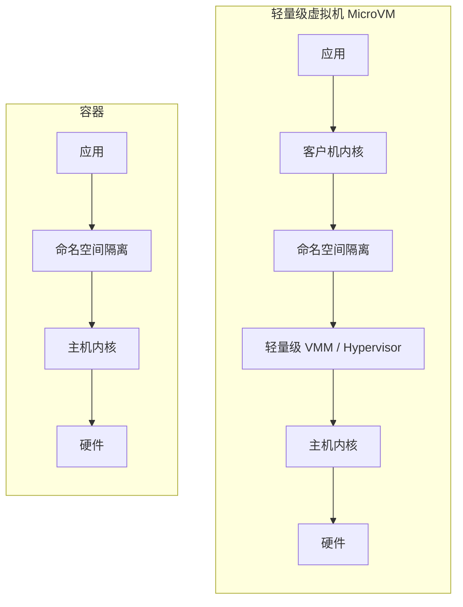
*图 11.14 轻量级虚拟化*

轻量级硬件虚拟化使用基于处理器虚拟化的轻量级 Hypervisor，以及最少数量的模拟设备。这与全机硬件 Hypervisor（第 11.2 节，硬件虚拟化）不同，后者起源于桌面虚拟机，包括对视频、音频、BIOS、PCI 总线和其他设备的支持，以及不同级别的处理器支持。一个仅用于服务器计算的 Hypervisor 不需要支持这些设备，而且如今编写的 Hypervisor 可以假定现代处理器虚拟化功能是可用的。

为了描述这种差异：快速模拟器（QEMU）是用于 KVM 的全机硬件 Hypervisor，拥有超过 140 万行代码（QEMU 4.2 版本）。Amazon Firecracker 是一个轻量级 Hypervisor，只有 5 万行代码 [Agache 20]。

轻量级 VM 的行为类似于第 11.2 节中描述的配置 B 硬件 VM。与硬件 VM 相比，轻量级 VM 具有更快的启动时间、更低的内存开销和更高的安全性。轻量级 Hypervisor 可以通过将命名空间配置为另一层安全层来进一步提高安全性，如图 11.14 所示。

一些实现将轻量级虚拟机描述为容器，另一些则使用术语 MicroVM。我更喜欢术语 MicroVM，因为术语容器通常与操作系统虚拟化相关联。

### 11.4.1 实现

目前有几个轻量级硬件虚拟化项目，包括：

- **Intel Clear Containers：** 于 2015 年推出，使用 Intel VT 功能提供轻量级虚拟机。该项目证明了轻量级容器的潜力，实现了低于 45 毫秒的启动时间 [Kadera 16]。2017 年，Intel Clear Containers 并入了 Kata Containers 项目，并在那里继续开发。
- **Kata Containers：** 于 2017 年推出，该项目基于 Intel Clear Containers 和 Hyper.sh RunV，由 OpenStack 基金会管理。其网站口号是：“容器的速度，VM 的安全性” [Kata Containers 20]。
- **Google gVisor：** 于 2018 年作为开源发布，gVisor 为客户机使用专门的用 Go 编写的用户空间内核，从而提高了容器安全性。
- **Amazon Firecracker：** 于 2019 年作为开源发布 [Firecracker 20]，它使用 KVM 配合新的轻量级 VMM 代替 QEMU，并实现了大约 100 毫秒的启动时间（系统启动）[Agache 20]。

以下小节描述了常用的实现：轻量级硬件 Hypervisor（Intel Clear Containers、Kata Containers 和 Firecracker）。gVisor 是一种不同的方法，它实现了自己的轻量级内核，其特性更接近于容器（第 11.3 节，操作系统虚拟化）。

### 11.4.2 开销

开销类似于第 11.2.2 节“开销”中描述的 KVM 虚拟化，但由于 VMM 要小得多，内存占用更低。Intel Clear Containers 2.0 报告每个容器的内存开销为 48–50 Mbytes [Kadera 16]；Amazon Firecracker 报告少于 5 Mbytes [Agache 20]。

### 11.4.3 资源控制

由于 VMM 进程运行在主机上，它们可以由操作系统级资源控制管理：cgroups、qdiscs 等，类似于第 11.2.3 节“资源控制”中描述的 KVM 虚拟化。这些操作系统级资源控制也在之前的容器部分进行了更详细的讨论

# 11.1 云计算

### 11.4.4 可观察性

可观察性与第 11.2.4 节“可观察性”中描述的 KVM 虚拟化类似。总结如下：

- **从宿主机观察**：可以使用前几章介绍的标准操作系统工具观察所有物理资源。客户机 VM 作为进程可见。客户机内部状态（包括 VM 内部的进程及其文件系统）无法直接观察。Hypervisor 运维人员若要分析客户机内部，必须获得访问权限（例如通过 SSH）。
- **从客户机观察**：可以看到虚拟化资源及其在客户机中的使用情况，并推断出物理问题。内核追踪工具（包括基于 BPF 的工具）都可以正常工作，因为 VM 拥有自己专用的内核。

作为可观察性的一个示例，以下展示了从宿主机使用 `top(1)` 观察一个 Firecracker VM 的输出结果 13：

```text
host# top
top - 15:26:22 up 25 days, 22:03,  2 users,  load average: 4.48, 2.10, 1.18
Tasks: 495 total,   1 running, 398 sleeping,   2 stopped,   0 zombie
%Cpu(s): 25.4 us,  0.1 sy,  0.0 ni, 74.4 id,  0.0 wa,  0.0 hi,  0.0 si,  0.0 st
KiB Mem : 24422712 total,  8268972 free, 10321548 used,  5832192 buff/cache
KiB Swap: 32460792 total, 31906152 free,   554640 used. 11185060 avail Mem 
  PID USER      PR  NI    VIRT    RES    SHR S  %CPU %MEM     TIME+ COMMAND
30785 root      20   0 1057360 297292 296772 S 200.0  1.2   0:22.03 firecracker
31568 bgregg    20   0  110076   3336   2316 R  45.7  0.0   0:01.93 sshd
31437 bgregg    20   0   57028   8052   5436 R  22.8  0.0   0:01.09 ssh  
30719 root      20   0  120320  16348  10756 S   0.3  0.1   0:00.83 ignite-spawn
    1 root      20   0  227044   7140   3540 S   0.0  0.0  15:32.13 systemd
[..]
```

> [!NOTE] 脚注 13
> 此 VM 是使用 Weave Ignite（一个微 VM 容器管理器 [Weaveworks 20]）创建的。

整个 VM 显示为一个名为 `firecracker` 的单个进程。此输出显示它正在消耗 200% 的 CPU（2 个 CPU）。从宿主机上，您无法判断是哪些客户机进程在消耗这些 CPU。

以下展示了从客户机内部运行 `top(1)` 的结果：

```text
guest# top
top - 22:26:30 up 16 min,  1 user,  load average: 1.89, 0.89, 0.38
Tasks:  67 total,   3 running,  35 sleeping,   0 stopped,   0 zombie
%Cpu(s): 81.0 us, 19.0 sy,  0.0 ni,  0.0 id,  0.0 wa,  0.0 hi,  0.0 si,  0.0 st
KiB Mem :  1014468 total,   793660 free,    51424 used,   169384 buff/cache
KiB Swap:        0 total,        0 free,        0 used.   831400 avail Mem 
  PID USER      PR  NI    VIRT    RES    SHR S  %CPU %MEM     TIME+ COMMAND
 1104 root      20   0   18592   1232    700 R 100.0  0.1   0:05.77 bash
 1105 root      20   0   18592   1232    700 R 100.0  0.1   0:05.59 bash
 1106 root      20   0   38916   3468   2944 R   4.8  0.3   0:00.01 top
    1 root      20   0   77224   8352   6648 S   0.0  0.8   0:00.38 systemd
    3 root       0 -20       0      0      0 I   0.0  0.0   0:00.00 rcu_gp
[...]
```

现在的输出显示 CPU 是被两个 `bash` 程序消耗的。

还可以比较头部摘要信息之间的差异：宿主机的 1 分钟平均负载为 4.48，而客户机为 1.89。其他细节也有所不同，因为客户机有自己的内核来维护仅限客户机的统计数据。正如第 11.3.4 节“可观察性”中所述，容器的情况则不同，从容器的角度看到的统计数据可能会意外地显示宿主机系统范围的统计数据。

作为另一个示例，以下展示了从客户机执行 `mpstat(1)` 的结果：

```text
guest# mpstat -P ALL 1
Linux 4.19.47 (cd41e0d846509816)    03/21/20        _x86_64_  (2 CPU)
22:11:07  CPU   %usr %nice  %sys %iowait  %irq %soft %steal %guest %gnice  %idle
22:11:08  all  81.50  0.00 18.50    0.00  0.00  0.00   0.00   0.00   0.00   0.00
22:11:08    0  82.83  0.00 17.17    0.00  0.00  0.00   0.00   0.00   0.00   0.00
22:11:08    1  80.20  0.00 19.80    0.00  0.00  0.00   0.00   0.00   0.00   0.00
[...]
```

此输出仅显示两个 CPU，因为为客户机分配了两个 CPU。

## 11.5 其他类型

其他云计算原语和技术包括：

- **函数即服务**：开发者将应用函数提交给云，云按需运行。虽然这简化了软件开发体验，因为没有服务器需要管理（“无服务器”/serverless），但也带来了性能方面的影响。函数的启动时间可能很长，而且由于没有服务器，最终用户无法运行传统的命令行可观察性工具。性能分析通常仅限于应用程序提供的时间戳。
- **软件即服务**：提供高级软件，而最终用户无需自行配置服务器或应用程序。性能分析仅限于运维人员：由于无法访问服务器，最终用户除了基于客户端的计时外几乎无能为力。
- **Unikernels（单内核/一体化内核）**：这种技术将应用程序与最少的内核部分一起编译成单个软件二进制文件，可由硬件 Hypervisor 直接执行，无需操作系统。虽然这可以带来性能提升（例如最小化指令文本从而减少 CPU 缓存污染），以及由于剥离了未使用代码而带来的安全性提升，但 Unikernels 也带来了可观察性挑战，因为没有操作系统可以运行可观察性工具。内核统计信息（例如 `/proc` 中的统计信息）也可能不存在。幸运的是，实现通常允许将 Unikernel 作为普通进程运行，提供了一种分析途径（尽管与 Hypervisor 环境不同）。Hypervisor 也可以开发检查它们的方法，例如堆栈分析：我开发了一个原型，可以为正在运行的 MirageOS Unikernel 生成火焰图 [Gregg 16a]。

> [!WARNING] 可观察性限制
> 对于上述所有技术，最终用户都没有可以登录的操作系统（或可以进入的容器）来进行传统的性能分析。FaaS 和 SaaS 必须由运维人员进行分析。Unikernel 需要自定义工具和统计数据，理想情况下还需要 Hypervisor 的分析支持。

## 11.6 比较

比较各种技术可以帮助您更好地理解它们，即使您无法改变公司使用的技术。本章讨论的三种技术的性能属性比较如表 11.7 所示 14。

**表 11.7 虚拟化技术性能属性比较**

| 属性 | 硬件虚拟化 | 操作系统虚拟化（容器） | 轻量级虚拟化 |
| :--- | :--- | :--- | :--- |
| 示例 | KVM | 容器 (Containers) | FireCracker |
| CPU 性能 | 高（有 CPU 支持） | 高 | 高（有 CPU 支持） |
| CPU 分配 | 固定到 vCPU | 灵活（共享 + 带宽） | 固定到 vCPU |
| I/O 吞吐量 | 高（带有 SR-IOV） | 高（无固有开销） | 高（带有 SR-IOV） |
| I/O 延迟 | 低（带有 SR-IOV 且无 QEMU） | 低（无固有开销） | 低（带有 SR-IOV） |
| 内存访问开销 | 有一些（EPT/NPT 或影子页表） | 无 | 有一些（EPT/NPT 或影子页表） |
| 内存损失 | 有一些（额外的内核、页表） | 无 | 有一些（额外的内核、页表） |
| 内存分配 | 固定（可能存在双重缓存） | 灵活（未使用的客户机内存用作文件系统缓存） | 固定（可能存在双重缓存） |
| 资源控制 | 最多（内核加 Hypervisor 控制） | 许多（取决于内核） | 最多（内核加 Hypervisor 控制） |
| 可观察性：从宿主机 | 中（资源使用率、Hypervisor 统计信息、对类似 KVM 的 Hypervisor 可进行 OS 检查，但无法看到客户机内部） | 高（可以看到一切） | 中（资源使用率、Hypervisor 统计信息、对类似 KVM 的 Hypervisor 可进行 OS 检查，但无法看到客户机内部） |
| 可观察性：从客户机 | 高（完整的内核和虚拟设备检查） | 中（仅用户态、内核计数器、完整的内核可见性受限），并带有额外的宿主机范围指标（例如 `iostat(1)`） | 高（完整的内核和虚拟设备检查） |
| 可观察性优势方 | 最终用户 | 宿主机运维人员 | 最终用户 |
| Hypervisor 复杂度 | 最高（增加了复杂的 Hypervisor） | 中（操作系统） | 高（增加了轻量级 Hypervisor） |
| 不同的客户机 OS | 是 | 通常否（有时可通过系统调用转换实现，但这会增加开销） | 是 |

> [!TIP] 脚注 14
> 请注意，此表仅关注性能。还有其他差异，例如，容器被描述为具有较弱的安全性 [Agache 20]。

虽然随着这些虚拟化技术更多功能的发展，该表将逐渐过时，但它仍然展示了需要关注的事项，即使出现了完全不符合这些类别的全新虚拟化技术。

---

虚拟化技术通常通过微基准测试进行比较，以查看哪个性能最佳。不幸的是，这忽视了观察系统能力的重要性，而可观察性可能带来最大的性能收益。可观察性通常使识别和消除不必要的工作成为可能，从而获得远超微小 Hypervisor 差异的性能胜利。

对于云运维人员，可观察性最高的选项是容器，因为从宿主机他们可以看到所有进程及其交互。对于最终用户，可观察性最高的是虚拟机，因为这为用户提供了内核访问权限，可以运行所有基于内核的性能工具，包括第 13、14 和 15 章中的工具。另一种选择是具有内核访问权限的容器，这为运维人员和用户提供了对所有内容的完全可见性；然而，只有当客户也运行容器宿主机时，这才是一种选择，因为容器之间缺乏安全隔离。

虚拟化仍然是一个不断发展的领域，轻量级硬件 Hypervisor 仅在近年才出现。考虑到它们的优势，特别是对最终用户可观察性的优势，我预计它们的使用将会增长。

## 11.7 练习

1. 回答以下关于虚拟化术语的问题：
   - 宿主机和客户机之间有什么区别？
   - 什么是租户？
   - 什么是 Hypervisor？
   - 什么是硬件虚拟化？
   - 什么是操作系统虚拟化？

2. 回答以下概念性问题：
   - 描述性能隔离的作用。
   - 描述现代硬件虚拟化（例如 Nitro）的性能开销。
   - 描述操作系统虚拟化（例如 Linux 容器）的性能开销。
   - 描述从硬件虚拟化客户机（Xen 或 KVM）观察物理系统的情况。
   - 描述从操作系统虚拟化客户机观察物理系统的情况。
   - 解释硬件虚拟化（例如 Xen 或 KVM）与轻量级硬件虚拟化（例如 Firecracker）之间的区别。

3. 选择一种虚拟化技术，并针对客户机回答以下问题：
   - 描述如何应用内存限制，以及如何从客户机内部看到它。（当客户机内存耗尽时，系统管理员会看到什么？）
   - 如果有强加的 CPU 限制，描述它是如何应用的，以及如何从客户机内部看到它。
   - 如果有强加的磁盘 I/O 限制，描述它是如何应用的，以及如何从客户机内部看到它。
   - 如果有强加的网络 I/O 限制，描述它是如何应用的，以及如何从客户机内部看到它。

4. 为资源控制制定一个 USE 方法检查清单。包括如何获取每个指标（例如，执行哪个命令）以及如何解释结果。在安装或使用其他软件产品之前，尽量使用现有的操作系统可观察性工具。

# 11.1 云计算

## 11.8 参考文献

[Goldberg 73] Goldberg, R. P., *Architectural Principles for Virtual Computer Systems*, Harvard University (Thesis), 1972.

[Waldspurger 02] Waldspurger, C., “Memory Resource Management in VMware ESX Server,” *Proceedings of the 5th Symposium on Operating Systems Design and Implementation*, 2002.

[Cherkasova 05] Cherkasova, L., and Gardner, R., “Measuring CPU Overhead for I/O Processing in the Xen Virtual Machine Monitor,” USENIX ATEC, 2005.

[Adams 06] Adams, K., and Agesen, O., “A Comparison of Software and Hardware Techniques for x86 Virtualization,” ASPLOS, 2006.

[Gupta 06] Gupta, D., Cherkasova, L., Gardner, R., and Vahdat, A., “Enforcing Performance Isolation across Virtual Machines in Xen,” ACM/IFIP/USENIX Middleware, 2006.

[Qumranet 06] “KVM: Kernel-based Virtualization Driver,” Qumranet Whitepaper, 2006.

[Cherkasova 07] Cherkasova, L., Gupta, D., and Vahdat, A., “Comparison of the Three CPU Schedulers in Xen,” ACM SIGMETRICS, 2007.

[Corbet 07a] Corbet, J., “Process containers,” LWN.net, https://lwn.net/Articles/236038, 2007.

[Corbet 07b] Corbet, J., “Notes from a container,” LWN.net, https://lwn.net/Articles/256389, 2007.

[Liguori, 07] Liguori, A., “The Myth of Type I and Type II Hypervisors,” http://blog.codemonkey.ws/2007/10/myth-of-type-i-and-type-ii-hypervisors.html, 2007.

[VMware 07] “Understanding Full Virtualization, Paravirtualization, and Hardware Assist,” https://www.vmware.com/techpapers/2007/understanding-full-virtualization-paravirtualizat-1008.html, 2007.

[Matthews 08] Matthews, J., et al. *Running Xen: A Hands-On Guide to the Art of Virtualization*, Prentice Hall, 2008.

[Milewski 11] Milewski, B., “Virtual Machines: Virtualizing Virtual Memory,” http://corensic.wordpress.com/2011/12/05/virtual-machines-virtualizing-virtual-memory, 2011.

[Adamczyk 12] Adamczyk, B., and Chydzinski, A., “Performance Isolation Issues in Network Virtualization in Xen,” *International Journal on Advances in Networks and Services*, 2012.

[Hoff 12] Hoff, T., “Pinterest Cut Costs from $54 to $20 Per Hour by Automatically Shutting Down Systems,” http://highscalability.com/blog/2012/12/12/pinterest-cut-costs-from-54-to-20-per-hour-by-automatically.html, 2012.

[Gregg 14b] Gregg, B., “From Clouds to Roots: Performance Analysis at Netflix,” http://www.brendangregg.com/blog/2014-09-27/from-clouds-to-roots.html, 2014.

[Heo 15] Heo, T., “Control Group v2,” Linux documentation, https://www.kernel.org/doc/Documentation/cgroup-v2.txt, 2015.

[Gregg 16a] Gregg, B., “Unikernel Profiling: Flame Graphs from dom0,” http://www.brendangregg.com/blog/2016-01-27/unikernel-profiling-from-dom0.html, 2016.

[Kadera 16] Kadera, M., “Accelerating the Next 10,000 Clouds,” https://www.slideshare.net/Docker/accelerating-the-next-10000-clouds-by-michael-kadera-intel, 2016.

[Borello 17] Borello, G., “Container Isolation Gone Wrong,” Sysdig blog, https://sysdig.com/blog/container-isolation-gone-wrong, 2017.

[Goldfuss 17] Goldfuss, A., “Making FlameGraphs with Containerized Java,” https://blog.alicegoldfuss.com/making-flamegraphs-with-containerized-java, 2017.

[Gregg 17e] Gregg, B., “AWS EC2 Virtualization 2017: Introducing Nitro,” http://www.brendangregg.com/blog/2017-11-29/aws-ec2-virtualization-2017.html, 2017.

[Gregg 17f] Gregg, B., “The PMCs of EC2: Measuring IPC,” http://www.brendangregg.com/blog/2017-05-04/the-pmcs-of-ec2.html, 2017.

[Gregg 17g] Gregg, B., “Container Performance Analysis at DockerCon 2017,” http://www.brendangregg.com/blog/2017-05-15/container-performance-analysis-dockercon-2017.html, 2017.

[CNI 18] “bandwidth plugin,” https://github.com/containernetworking/plugins/blob/master/plugins/meta/bandwidth/README.md, 2018.

[Denis 18] Denis, X., “A Pods Architecture to Allow Shopify to Scale,” https://engineering.shopify.com/blogs/engineering/a-pods-architecture-to-allow-shopify-to-scale, 2018.

[Leonovich 18] Leonovich, M., “Another reason why your Docker containers may be slow,” https://hackernoon.com/another-reason-why-your-docker-containers-may-be-slow-d37207dec27f, 2018.

[Borkmann 19] Borkmann, D., and Pumputis, M., “Kube-proxy Removal,” https://cilium.io/blog/2019/08/20/cilium-16/#kubeproxy-removal, 2019.

[Cilium 19] “Announcing Hubble - Network, Service & Security Observability for Kubernetes,” https://cilium.io/blog/2019/11/19/announcing-hubble/, 2019.

[Gregg 19] Gregg, B., *BPF Performance Tools: Linux System and Application Observability*, Addison-Wesley, 2019.

[Gregg 19e] Gregg, B., “kvmexits.bt,” https://github.com/brendangregg/bpf-perf-tools-book/blob/master/originals/Ch16_Hypervisors/kvmexits.bt, 2019.

[Kwiatkowski 19] Kwiatkowski, A., “Autoscaling in Reality: Lessons Learned from Adaptively Scaling Kubernetes,” https://conferences.oreilly.com/velocity/vl-eu/public/schedule/detail/78924, 2019.

[Xen 19] “Xen PCI Passthrough,” http://wiki.xen.org/wiki/Xen_PCI_Passthrough, 2019.

[Agache 20] Agache, A., et al., “Firecracker: Lightweight Virtualization for Serverless Applications,” https://www.amazon.science/publications/firecracker-lightweight-virtualization-for-serverless-applications, 2020.

[Calico 20] “Cloud Native Networking and Network Security,” https://github.com/projectcalico/calico, last updated 2020.

[Cilium 20a] “API-aware Networking and Security,” https://cilium.io, accessed 2020.

[Cilium 20b] “eBPF-based Networking, Security, and Observability,” https://github.com/cilium/cilium, last updated 2020.

[Firecracker 20] “Secure and Fast microVMs for Serverless Computing,” https://github.com/firecracker-microvm/firecracker, last updated 2020.

[Google 20c] “Google Compute Engine FAQ,” https://developers.google.com/compute/docs/faq#whatis, accessed 2020.

[Google 20d] “Analyzes Resource Usage and Performance Characteristics of Running containers,” https://github.com/google/cadvisor, last updated 2020.

[Kata Containers 20] “Kata Containers,” https://katacontainers.io, accessed 2020.

[Linux 20m] “mount_namespaces(7),” http://man7.org/linux/man-pages/man7/mount_namespaces.7.html, accessed 2020.

[Weaveworks 20] “Ignite a Firecracker microVM,” https://github.com/weaveworks/ignite, last updated 2020.

[Kubernetes 20b] “Production-Grade Container Orchestration,” https://kubernetes.io, accessed 2020.

[Kubernetes 20c] “Tools for Monitoring Resources,” https://kubernetes.io/docs/tasks/debug-application-cluster/resource-usage-monitoring, last updated 2020.

[Torvalds 20b] Torvalds, L., “Re: [GIT PULL] x86/mm changes for v5.8,” https://lkml.org/lkml/2020/6/1/1567, 2020.

[Xu 20] Xu, P., “iops limit for pod/pvc/pv #92287,” https://github.com/kubernetes/kubernetes/issues/92287, 2020.

<br>

> [!NOTE] 页面留白
> 此处原书页面有意留白。

---

> [!INFO] 原书图表上下文参考
> 以下是本章节前面部分出现的图表上下文记录（原图表散落于章节各页）：
> - **第 621 页，图 3159**：相关图表上下文
> - **第 622 页，图 3164**：相关图表上下文
> - **第 623 页，图 3167**：相关图表上下文
> - **第 624 页，图 3171**：相关图表上下文
> - **第 626 页，图 3178**：相关图表上下文
> - **第 630 页，图 3190**：相关图表上下文
> - **第 633 页，图 3198**：相关图表上下文
> - **第 635 页，图 3204**：相关图表上下文
> - **第 645 页，图 3228**：相关图表上下文
> - **第 646 页，图 3231**：相关图表上下文
> - **第 647 页，图 3235**：相关图表上下文
> - **第 654 页，图 3253**：相关图表上下文
> - **第 665 页，图 3281**：相关图表上下文
> - **第 670 页，图 3300**：相关图表上下文