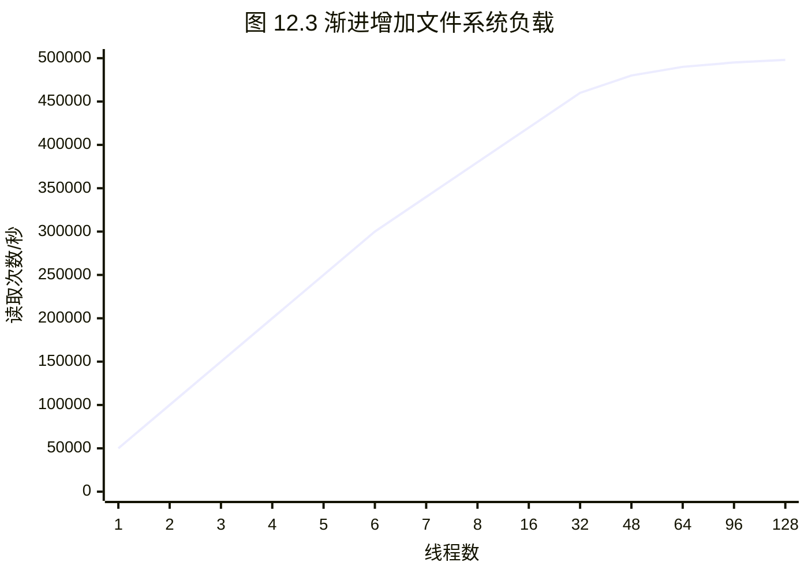

# 第12章 基准测试

> 世界上有谎言，该死的谎言，然后还有性能指标。
> —— Anon et al., “A Measure of Transaction Processing Power” [Anon 85]

[[基准测试]]（Benchmarking）以一种受控的方式测试性能，允许对不同的选择进行比较，识别性能回退，并在性能极限于生产环境中遇到之前理解它们——这些极限可能是系统资源、虚拟化环境（云计算）中的软件限制，或目标应用程序中的限制。前面的章节已经探讨了这些组件，描述了存在的限制类型以及用于分析它们的工具。

前面的章节还介绍了用于[[微基准测试]]（Micro-benchmarking）的工具，这些工具使用简单的人工工作负载（例如文件系统 I/O）来测试组件。此外还有[[宏基准测试]]（Macro-benchmarking），它模拟客户端工作负载以测试整个系统。宏基准测试可能涉及客户端工作负载模拟或跟踪回放（trace replay）。无论您使用哪种类型，分析基准测试都很重要，这样您才能确认正在测量的是什么。基准测试只能告诉您系统运行该基准测试有多快；而理解结果并确定它如何应用于您的环境，则取决于您自己。

本章的学习目标是：

- 理解微基准测试和宏基准测试。
- 了解需要避免的众多基准测试失败原因。
- 遵循主动基准测试方法论。
- 使用基准测试清单来检查结果。
- 提高执行和解释基准测试的准确性。

本章总体讨论基准测试，提供建议和方法论以帮助您避免常见错误并准确测试您的系统。当您需要解释他人（包括供应商和行业基准测试）的结果时，这也是有用的背景知识。

## 12.1 背景

本节描述基准测试活动、有效的基准测试，并总结常见错误。

### 12.1.1 原因

执行基准测试可能出于以下原因：

- **系统设计**：比较不同的系统、系统组件或应用程序。对于商业产品，基准测试可以提供数据以辅助购买决策，特别是可用选项的性价比（price/performance ratio）¹。在某些情况下，可以使用已发布的行业基准测试结果，从而避免了客户自己执行基准测试的需要。
- **概念验证**：在购买或承诺投入生产部署之前，测试软件或硬件在负载下的性能。
- **调优**：测试可调参数和配置选项，以识别那些值得使用生产工作负载进一步研究的参数和选项。
- **开发**：用于产品开发期间的[[非回归测试]]（Non-regression testing）和极限调查。非回归测试可能是一个定期运行的自动化性能测试组，以便可以及早发现任何性能回退，并快速将其与产品更改匹配。对于极限调查，可以在开发期间使用基准测试将产品推向极限，以便确定在何处投入工程精力最能提高产品性能。
- **容量规划**：确定系统和应用程序限制以进行容量规划，要么为性能建模提供数据，要么直接找到容量极限。
- **故障排查**：验证组件是否仍能以最大性能运行。例如：测试主机之间的最大网络吞吐量，以检查是否存在网络问题。
- **营销**：确定供营销使用的最大产品性能（也称为 benchmarketing）。

> [!INFO] 企业本地环境与云计算环境
> 在企业本地环境中，在承诺进行大型硬件采购之前，在概念验证期间对硬件进行基准测试可能是一项重要的工作，并且可能是一个持续数周或数月的过程。这包括运输、上架和连接系统电缆的时间，然后在测试之前安装操作系统。这样的过程可能每一两年发生一次，即当新硬件发布时。
> 
> 然而，在云计算环境中，资源可以按需获取，无需昂贵的硬件初始投资，并且还可以根据需要快速修改（在不同的实例类型上重新部署）。这些环境在选择使用哪种应用程序编程语言，以及运行哪种操作系统、数据库、Web 服务器和负载均衡器时，仍然涉及长期投资。其中一些选择在日后很难更改。可以执行基准测试以调查各种选项在需要时能扩展到何种程度。云计算模型使基准测试变得容易：可以在几分钟内创建大规模环境，用于基准测试运行，然后销毁，所有这些成本极低。

请注意，容错和分布式的云环境也使实验变得容易：当新实例类型可用时，环境可能允许立即使用生产工作负载对其进行测试，从而跳过传统的基准测试评估。在那种情况下，仍然可以使用基准测试通过比较组件性能来帮助更详细地解释性能差异。例如，Netflix 性能工程团队拥有自动化软件，可以使用各种微基准测试来分析新实例类型。这包括自动收集系统统计信息和 CPU 性能分析（profiles），以便可以分析和解释发现的任何差异。

### 12.1.2 有效的基准测试

做好基准测试出奇地困难，有很多出错和疏忽的机会。正如论文《文件系统和存储基准测试的九年研究》[Traeger 08] 所总结的：

> 在这篇文章中，我们调查了 106 篇近期论文中的 415 个文件系统和存储基准测试。我们发现大多数流行的基准测试都是有缺陷的，并且许多研究论文并没有提供真实性能的清晰指标。

该论文还对应该做些什么提出了建议；特别是，基准测试评估应该解释测试了什么以及为什么测试，并且它们应该对系统的预期行为进行一些分析。

一个好的基准测试的本质也被总结为 [Smaalders 06]：

- **可重复**：以便于比较
- **可观察**：以便可以分析和理解性能
- **可移植**：以允许在竞争对手和不同产品发布之间进行基准测试
- **易于展示**：以便每个人都能理解结果
- **贴近现实**：以便测量反映客户体验的现实
- **可运行**：以便开发人员可以快速测试更改

在比较不同系统并有购买意图时，必须增加另一个特征：性价比。价格可以量化为设备的五年资本成本 [Anon 85]。

有效的基准测试也关乎您如何应用基准测试：分析以及得出的结论。

#### 基准测试分析

使用基准测试时，您需要了解：

- 正在测试什么
- 限制因素是什么（一个或多个）
- 可能影响结果的任何干扰
- 从结果中可以得出什么结论

这些需求要求深入理解基准测试软件正在做什么、系统如何响应，以及结果与目标环境有何关系。

给定一个基准测试工具并访问运行它的系统，最好通过在基准测试运行时对系统进行性能分析来满足这些需求。一个常见的错误是让初级人员执行基准测试，然后在基准测试完成后请性能专家来解释结果。最好在基准测试期间让性能专家参与，以便他们可以在系统仍在运行时对其进行分析。这可能包括下钻分析（drill-down analysis）以解释和量化限制因素。

以下是一个有趣的分析示例：

> 作为研究由此产生的 TCP/IP 实现性能的实验，我们在不同机器上的两个用户进程之间传输了 4 兆字节的数据。传输被划分为 1024 字节的记录，并封装在 1068 字节的以太网数据包中。通过 TCP/IP 从我们的 11/750 向我们的 11/780 发送数据需要 28 秒。这包括建立和拆除连接所需的所有时间，用户到用户的吞吐量为 1.2 兆波特。在此期间，11/750 处于 CPU 饱和状态，但 11/780 有大约 30% 的空闲时间。系统中处理数据所花费的时间分布在以太网处理（20%）、IP 数据包处理（10%）、TCP 处理（30%）、校验和计算（25%）和用户系统调用处理（15%）中，处理时间的任何单一部分都没有主导系统中的时间。

这段引文描述了检查限制因素（“11/750 处于 CPU 饱和状态”²），然后解释了导致它们的内核组件的细节。顺便说一句，能够执行这种分析并总结内核 CPU 时间在高层次上的花费，直到最近随着火焰图的才变得容易。这段引文远早于火焰图：它来自 Bill Joy 在 1981 年描述最初的 BSD TCP/IP 协议栈 [Joy 81]！

> [!TIP] 自定义基准测试
> 与其使用给定的基准测试工具，您可能会发现开发您自己的自定义基准测试软件，或至少自定义负载生成器更有效。这些可以保持简短，仅专注于您的测试所需的内容，从而使它们易于分析和调试。

在某些情况下，您无法访问基准测试工具或系统，例如在阅读他人的基准测试结果时。根据可用的材料考虑前面的要点列表，此外还要问：系统环境是什么？它是如何配置的？有关更多问题，请参见第 12.4 节“基准测试问题”。

---

> [!NOTE] 脚注
> ¹ 虽然通常引用的是性价比，但我认为在实践中性能价格比可能更容易理解，因为作为一个数学比率（而不仅仅是一个说法），它具有“越大越好”的属性，这与人们倾向于对性能数字做出的假设相匹配。
> 
> ² 11/750 是 VAX-11/750 的简称，这是 DEC 于 1980 年制造的小型计算机。

# 12.1 基准测试

## 12.1 背景

### 12.1.3 基准测试的失败案例

以下各节提供了各种基准测试失败案例的检查清单——包括错误、谬误和不当行为——以及如何避免它们。第 12.3 节“方法论”描述了如何执行基准测试。

#### 1. 随意基准测试 (Casual Benchmarking)

做好基准测试绝不是一项“发射后不管”（fire-and-forget）的活动。基准测试工具提供数字，但这些数字可能并未反映你以为它们反映的内容，因此你得出的关于这些数字的结论可能是虚假的。我将其总结为：

> [!QUOTE] 随意基准测试定律
> 随意基准测试：你对 A 进行基准测试，但实际测量的是 B，却得出结论说你测量了 C。

做好基准测试需要严谨地检查实际测量了什么，并理解测试了什么，以便形成有效的结论。

例如，许多工具声称或暗示它们测量的是磁盘性能，但实际上测试的是文件系统性能。这种差异可能是数量级上的，因为文件系统使用缓存和缓冲来用内存 I/O 替代磁盘 I/O。即使基准测试工具可能运行正确并且测试了文件系统，你关于磁盘的结论也会大错特错。

对于初学者来说，理解基准测试尤其困难，因为他们对于数字是否可疑没有直觉。如果你买了一个温度计，显示你所在房间的温度是 1,000 华氏度（或摄氏度），你会立刻知道出了问题。但基准测试并非如此，它们产生的数字对你来说可能很陌生。

#### 2. 盲目信任 (Blind Faith)

人们可能很容易相信一个流行的基准测试工具是值得信赖的，特别是如果它是开源的并且存在了很长时间。认为流行等同于有效的误解被称为**诉诸群众**（argumentum ad populum，拉丁语，意为“向人们呼吁”）。

分析你正在使用的基准测试很耗时，并且需要专业知识才能正确执行。而且，对于一个流行的基准测试，分析那些必定有效的东西似乎是一种浪费。

如果一项流行的基准测试是由顶尖科技公司推广的，你会信任它吗？这种情况以前发生过，资深性能工程师都知道，那个被推广的[[微基准测试]]是有缺陷的，绝不应该被使用。没有什么简单的方法可以阻止这种情况发生（我试过）。

问题甚至不一定出在基准测试软件上——尽管确实会有 Bug——而是出在对基准测试结果的解释上。

#### 3. 只有数字没有分析 (Numbers Without Analysis)

裸露的基准测试结果，如果没有提供任何分析细节，可能是作者缺乏经验的标志，并且假设基准测试结果是可信和最终的。通常，这只是调查的开始——而调查最终会发现结果是错误的或令人困惑的。

每个基准测试数字都应附带对遇到的限制和所执行分析的描述。我这样总结了这种风险：

> [!WARNING] 分析时间定律
> 如果你在研究一个基准测试结果上花费的时间不到一周，那它很可能是错的。

本书的大部分内容都侧重于分析性能，这应该在基准测试期间进行。在你没有时间进行仔细分析的情况下，列出你还没有时间检查的假设并将其与结果一起包含是一个好主意，例如：

- 假设基准测试工具没有 Bug
- 假设磁盘 I/O 测试实际测量的是磁盘 I/O
- 假设基准测试工具按预期将磁盘 I/O 驱动到了极限
- 假设这种类型的磁盘 I/O 与此应用程序相关

如果基准测试结果后来被认为足够重要，值得投入更多精力，这可以成为进一步验证的待办事项清单。

#### 4. 复杂的基准测试工具 (Complex Benchmark Tools)

重要的是，基准测试工具不能因其自身的复杂性而阻碍基准测试分析。理想情况下，程序是开源的，以便可以研究它，并且足够短，以便可以快速阅读和理解。

对于[[微基准测试]]，建议选择用 C 编程语言编写的那些。对于客户端模拟基准测试，建议使用与客户端相同的编程语言，以最小化差异。

一个常见的问题是**对基准测试进行基准测试**——即报告的结果受限于基准测试软件本身。造成这种情况的一个常见原因是单线程的基准测试软件。

复杂的基准测试套件由于需要理解和分析的代码量巨大，会使分析变得困难。

#### 5. 测试了错误的对象 (Testing the Wrong Thing)

虽然有许多基准测试工具可用于测试各种工作负载，但其中许多可能与目标应用程序无关。

例如，一个常见的错误是基于磁盘基准测试工具的可用性来测试磁盘性能——即使目标环境工作负载预计完全在文件系统缓存中运行，并且不受磁盘 I/O 的影响。

同样，开发产品的工程团队可能会标准化某项特定的基准测试，并将其所有性能精力花在改进由该基准测试所衡量的性能上。然而，如果它实际上并不像客户的工作负载，那么工程努力将优化错误的行为 [Smaalders 06]。

对于现有的生产环境，[[工作负载特征分析]]方法论（在前几章中介绍过）可以测量从设备 I/O 到应用程序请求的真实工作负载构成。这些测量可以指导你选择最相关的基准测试。如果没有可供分析的生产环境，你可以设置模拟进行分析，或对预期工作负载进行建模。还应与基准测试数据的预期受众确认，看看他们是否同意这些测试。

一个基准测试可能曾经测试过合适的工作负载，但现在已经多年没有更新，正在测试错误的东西。

#### 6. 忽略环境 (Ignoring the Environment)

生产环境与测试环境匹配吗？想象一下，你被指派评估一个新的数据库。你配置了一台测试服务器并运行了数据库基准测试，结果后来发现你错过了一个重要的步骤：你的测试服务器是默认设置，带有默认的可调参数、默认文件系统等。生产数据库服务器针对高磁盘 IOPS 进行了调优，因此在未调优的系统上进行测试是不切实际的：你错过了首先了解生产环境这一步。

#### 7. 忽略错误 (Ignoring Errors)

仅仅因为基准测试工具产生了结果，并不意味着该结果反映了成功的测试。部分——甚至全部——请求可能导致了错误。虽然这个问题已被前面的错误所涵盖，但这个问题特别常见，值得单独提出。

我在一次 Web 服务器性能基准测试中想起了这一点。运行测试的人报告说，Web 服务器的平均延迟对于他们的需求来说太高了：平均超过一秒。一秒钟？一些快速的分析确定了问题所在：Web 服务器在测试期间什么也没做，因为所有请求都被防火墙阻止了。所有请求。显示的延迟是基准测试客户端超时并报错所花费的时间！

#### 8. 忽略方差 (Ignoring Variance)

基准测试工具，尤其是[[微基准测试]]，通常基于对现实世界特征（例如在一天中的不同时间或某个间隔期间）的一系列测量的平均值，施加稳定且一致的工作负载。例如，可能发现磁盘工作负载的平均速率为 500 次读取/秒和 50 次写入/秒。然后，基准测试工具可以模拟此速率，或者模拟 10:1 的读/写比率，以便可以测试更高的速率。

这种方法忽略了方差：操作率可能是可变的。操作的类型也可能不同，并且某些类型可能正交发生。例如，写入可能每 10 秒突发应用一次（异步回写数据刷新），而同步读取是稳定的。写入突发可能会在生产中引起真正的问题，例如通过排队读取，但如果基准测试施加稳定的平均速率，则不会模拟到这种情况。

模拟方差的一种可能解决方案是基准测试使用[[马尔可夫模型]]：这可以反映一次写入之后接着另一次写入的概率。

#### 9. 忽略扰动 (Ignoring Perturbations)

考虑可能影响结果的外部扰动。定时的系统活动（例如系统备份）是否会在基准测试运行期间执行？监控代理是否每分钟收集一次统计信息？对于云，扰动可能是由同一主机系统上不可见的租户引起的。

消除扰动的一种常见策略是使基准测试运行时间更长——几分钟而不是几秒钟。通常，基准测试的持续时间不应短于一秒。短时间的测试可能会受到设备中断（在执行中断服务程序时固定线程）、内核 CPU 调度决策（在迁移排队线程之前等待以保持 CPU 亲和性）和 CPU 缓存热度效应的异常扰动。尝试运行基准测试几次并检查标准偏差——这应该尽可能小。

还要收集数据，以便如果存在扰动，可以对其进行研究。这可能包括收集操作延迟的分布——而不仅仅是基准测试的总运行时间——以便可以看到异常值并记录其细节。

#### 10. 改变多个因素 (Changing Multiple Factors)

在比较两次测试的基准测试结果时，请小心了解两次测试之间所有不同的因素。

例如，如果通过网络对两台主机进行基准测试，它们之间的网络是否相同？如果一台主机跳数更多、通过更慢的网络或通过更拥塞的网络会怎样？任何此类额外因素都可能使基准测试结果变得虚假。

在云中，基准测试有时通过创建实例、测试它们然后销毁它们来执行。这产生了许多不可见因素的潜在可能：实例可能创建在更快或更慢的系统上，或者创建在具有来自其他租户的更高负载和争用的系统上。我建议测试多个实例并取中位数（或者更好，记录分布），以避免由测试一个异常快或慢的系统引起的异常值。

#### 11. 基准测试悖论 (Benchmark Paradox)

潜在客户经常使用基准测试来评估你的产品，而它们通常极不准确，以至于你不如抛硬币。一位推销员曾告诉我，他对这种概率很满意：赢一半的产品评估就能达到他的销售目标。但是忽略基准测试本身就是一个基准测试陷阱，而且实际中的概率要糟糕得多。我将其总结为：

> [!QUOTE] 基准测试悖论
> “如果你的产品在基准测试中获胜的几率是 50/50，你通常会输掉。” [Gregg 14c]

这种看似矛盾的现象可以用一些简单的概率来解释。

在基于性能购买产品时，客户通常希望非常确定它能达标。这可能意味着不是运行一个基准测试，而是运行几个，并希望产品能赢得所有测试。如果基准测试获胜的概率是 50%，那么：

# 12.1 基准测试

> [!NOTE] 背景延续
> 赢得三项基准测试的概率 = 0.5 × 0.5 × 0.5 = 0.125 = 12.5%
> 基准测试越多——且要求全部获胜——胜算就越低。

### 12. 基准测试竞争产品

你的市场营销部门希望基准测试结果能展示你们的产品如何击败竞争对手。这远比听起来要困难得多。

当客户选择一款产品时，他们不会只用五分钟；他们会使用几个月。在这段时间里，他们会分析并调优产品的性能，也许在最初的几周内就会解决最糟糕的问题。

你没有几周的时间去分析和调优竞争对手的产品。在可用的时间内，你只能收集到未调优的——因此也是不切实际的——结果。你竞争对手的客户——也就是这项营销活动的目标受众——很可能会发现你发布的是未调优的结果，这样你的公司反而会在那些原本想打动的人面前失去信誉。

如果你必须对竞争对手进行基准测试，你需要花大量时间认真调优他们的产品。使用前面章节中描述的技术来分析性能。还要搜索最佳实践、客户论坛和错误数据库。你甚至可能需要引入外部专家来调优系统。然后，在最终进行面对面的基准测试之前，对你自己公司的产品也要付出同样的努力。

### 13. 友军火力

在对自己的产品进行基准测试时，务必确保已经测试了性能最好的系统和配置，并且系统已被推向其真正的极限。在发布之前，将结果与工程团队分享；他们可能会发现你遗漏的配置项。如果你是工程团队的成员，请留意来自你们公司或签约第三方的基准测试工作，并提供帮助。

在其中一个案例中，我看到一个工程团队努力开发了一款高性能产品。其性能的关键是一项尚未记录在案的新技术。在产品发布时，一个基准测试团队被要求提供数据。他们不了解这项新技术（因为它没有被记录在案），配置错误，然后发布了贬低该产品性能的数据。

有时系统可能配置正确，但只是没有被推向极限。问一个问题：这个基准测试的瓶颈是什么？这可能是一个物理资源（如 [[CPU|CPU]]、磁盘或互连），已被驱动到 100% 的利用率，并且可以通过分析来识别。参见第 12.3.2 节，主动基准测试。

另一个友军火力问题是，当基准测试的是存在性能问题的旧版软件（这些问题在后续版本中已修复），或者在碰巧可用的有限设备上进行测试，产生的结果并非最佳。你的潜在客户可能会认为公司发布的任何基准测试都展示了最佳可能的性能——如果不提供这一点，就会贬低产品的价值。

### 14. 误导性基准测试

误导性的基准测试结果在业内很常见。它们可能是由于无意中限制了关于基准测试实际测量内容的信息，或者是故意遗漏信息造成的。通常，基准测试结果在技术上是正确的，但随后向客户传达时却被误述了。

考虑这个假设的情况：一个供应商通过构建一款昂贵到令人望而却步、且永远不会卖给实际客户的定制产品，获得了一个极好的结果。该价格未随基准测试结果一起披露，而结果重点关注的是非价格/性能指标。营销部门大量分享该结果的模糊摘要（“我们快了 2 倍！”），在客户脑海中将其与整个公司或某个产品线联系起来。这是一个为了有利地误述产品而遗漏细节的案例。虽然这可能不是作弊——数字不是假的——但这是通过遗漏来撒谎。

这样的供应商基准测试对你来说仍然可以作为性能的上限。它们是你不应期望超过的值（友军火力的情况除外）。

考虑另一个不同的假设情况：一个营销部门有一笔用于营销活动的预算，并希望得到一个好的基准测试结果来使用。他们聘请了几家第三方对其产品进行基准测试，并从该组中挑选最好的结果。这些第三方不是因为其专业知识而被选中的；他们被选中是因为能提供快速且廉价的结果。事实上，缺乏专业知识可能被认为是有利的：结果偏离现实越远越好——理想情况下，其中一个在积极方向上偏离很大！

在使用供应商结果时，请仔细检查附属细则，了解测试的是什么系统、使用了什么磁盘类型及数量、使用了什么网络接口以及采用何种配置，以及其他因素。关于需要警惕的具体细节，参见第 12.4 节，基准测试问题。

### 15. 基准测试特供

基准测试特供是指供应商研究一种流行的或行业的基准测试，然后对产品进行工程设计，使其在该基准测试上获得高分，而无视实际的客户性能。这也被称为针对基准测试进行优化。

“基准测试特供”一词在 1993 年随着 TPC-A 基准测试开始使用，正如事务处理性能委员会 (TPC) 历史页面 [Shanley 98] 所描述的：

> 位于马萨诸塞州的咨询公司 Standish Group 指控 Oracle 在其数据库软件中添加了一个特殊选项（离散事务），其唯一目的是抬高 Oracle 的 TPC-A 结果。Standish Group 声称 Oracle“违反了 TPC 的精神”，因为典型客户不会使用离散事务选项，因此，这是一个基准测试特供。Oracle 强烈反驳了这一指控，并有一些正当理由地声明，他们遵守了基准测试规范中的字面法律。Oracle 辩称，由于 TPC 基准测试规范中没有涉及基准测试特供，更不用说 TPC 的精神，因此指责他们违反任何规定是不公平的。

TPC 添加了一项反基准测试特供条款：

> 所有提高基准测试结果但不提高现实世界性能或定价的“基准测试特供”实现，均被禁止。

由于 TCP 侧重于价格/性能，抬高数字的另一种策略可能是基于特殊定价——客户实际上无法获得的深度折扣。与特殊的软件更改一样，当真实客户购买系统时，结果与现实不符。TPC 在其价格要求 [TPC 19a] 中解决了这个问题：

> TPC 规范要求总价格必须在客户为该配置支付价格的 2% 以内。

虽然这些例子可能有助于解释基准测试特供的概念，但 TPC 在多年前就在其规范中解决了这些问题，您今天不一定要期望它们还会出现。

### 16. 作弊

基准测试的最后一个失败是作弊：分享虚假结果。幸运的是，这要么很罕见，要么根本不存在；我还没有见过分享纯粹捏造数字的案例，即使是在最血腥的基准测试大战中。

---

## 12.2 基准测试类型

图 12.1 展示了一系列基于其测试工作负载的基准测试类型。生产工作负载也包含在该频谱中。

**图 12.1 基准测试类型**


以下各节描述了三种基准测试类型：[[微基准测试|微观基准测试]] (micro-benchmarks)、模拟 (simulations) 和 [[追踪回放|追踪/回放]] (trace/replay)。还将讨论行业标准基准测试。

### 12.2.1 微观基准测试

微观基准测试使用人工工作负载来测试特定类型的操作，例如，执行单一类型的文件系统 I/O、数据库查询、CPU 指令或系统调用。其优势在于简单：减少涉及的组件和代码路径数量，使得研究目标更容易，并允许性能差异被快速找到根本原因。测试通常也是可重复的，因为来自其他组件的变化已被尽可能剔除。微观基准测试通常也很容易在不同的系统上进行测试。并且因为它们是刻意人工设计的，所以不容易与真实的工作负载模拟混淆。

为了使用微观基准测试结果，需要将它们映射到目标工作负载。一个微观基准测试可能会测试多个维度，但可能只有一两个是相关的。目标系统的性能分析或建模可以帮助确定哪些微观基准测试结果是合适的，以及适用的程度。

前面章节中提到的按资源类型分类的微观基准测试工具示例如下：

- **CPU**：SysBench
- **内存 I/O**：lmbench（在第 6 章，CPU 中）
- **文件系统**：fio
- **磁盘**：hdparm，dd 或使用直接 I/O 的 fio
- **网络**：iperf

还有非常多可用的基准测试工具。但是，请记住来自 [Traeger 08] 的警告：“大多数流行的基准测试都是有缺陷的。”

你也可以开发自己的基准测试。目标是让它们尽可能简单，识别可以单独测试的工作负载属性。（有关此内容的更多信息，请参见第 12.3.6 节，自定义基准测试。）使用外部工具来验证它们是否执行了它们声称要执行的操作。

#### 设计示例

考虑设计一个文件系统微观基准测试来测试以下属性：顺序或随机 I/O、I/O 大小和方向（读或写）。表 12.1 展示了调查这些维度的五个示例测试，以及每个测试的原因。

**表 12.1 示例文件系统微观基准测试**

| # | 测试 | 目的 |
|---|---|---|
| 1 | 顺序 512 字节读取³ | 测试最大（现实的）IOPS |
| 2 | 顺序 1 兆字节读取⁴ | 测试最大读取吞吐量 |
| 3 | 顺序 1 兆字节写入 | 测试最大写入吞吐量 |
| 4 | 随机 512 字节读取 | 测试随机 I/O 的影响 |
| 5 | 随机 512 字节写入 | 测试重写的影响 |

> [!NOTE] 脚注说明
> ³ 这里的目的是通过使用更多、更小的 I/O 来最大化 IOPS。1 字节的大小听起来更适合此目的，但磁盘至少会将其向上舍入到扇区大小（512 字节或 4 千字节）。
> ⁴ 这里的目的是通过使用更少、更大的 I/O 来最大化吞吐量（花在 I/O 初始化上的时间更少）。虽然越大越好，但由于文件系统、内核分配器、内存页和其他细节，可能存在一个“最佳点”。例如，Solaris 内核在使用 128 KB I/O 时表现最佳，因为那是最大的 slab 缓存大小（更大的 I/O 会移动到超大规模区域，性能较低）。

可以根据需要添加更多测试。所有这些测试都乘以两个额外的因素：

- **工作集大小**：正在访问的数据的大小（例如，总文件大小）：
    - 远小于主内存：以便数据完全缓存在文件系统缓存中，从而可以研究文件系统软件的性能。
    - 远大于主内存：以尽量减少文件系统缓存的影响，并驱使基准测试走向测试磁盘 I/O。
- **线程数**：假设工作集大小较小：
    - 单线程：测试基于当前 CPU 时钟速度的文件系统性能。
    - 足以使所有 CPU 饱和的多线程：测试系统、文件系统和 CPU 的最大性能。

这些因素会迅速倍增，形成一个庞大的测试矩阵。可以使用统计分析技术来减少所需的测试集合。

创建专注于最高速度的基准测试一直被称为“晴天性能测试”。为了不忽略问题，您还需要考虑“多云天”或“雨天性能测试”，这涉及测试非理想情况，包括争用、扰动和工作负载差异。

# 12.1 基准测试

## 12.2.2 模拟

许多基准测试会模拟客户应用程序的工作负载；这些有时被称为[[宏基准测试|宏基准测试]]。它们可能基于对生产环境的[[工作负载特征归纳|工作负载特征归纳]]（参见第 2 章，方法学）来确定要模拟的特征。例如，您可能会发现一个生产环境的 NFS 工作负载由以下操作类型及其概率组成：读取，40%；写入，7%；获取属性，19%；读取目录，1%；等等。其他特征也可以被测量和模拟。

如果模拟结果不能紧密反映客户端在真实世界工作负载下的表现，至少也足够接近而具有实用价值。模拟可以涵盖许多因素，如果使用[[微基准测试]]来研究这些因素将非常耗时。模拟还可以包含复杂的系统交互效应，而这些效应在使用微基准测试时可能会被完全遗漏。

第 6 章 CPU 中介绍过的 CPU 基准测试 Whetstone 和 Dhrystone 就是模拟的例子。Whetstone 开发于 1972 年，旨在模拟当时的科学计算工作负载。Dhrystone 开发于 1984 年，模拟当时的基于整数的工作负载。

许多公司使用内部或外部的负载生成软件来模拟客户端 HTTP 负载（示例软件包括 wrk [Glozer 19]、siege [Fulmer 12] 和 hey [Dogan 20]）。这些工具可用于评估软件或硬件的变更，也可用于模拟峰值负载（例如，在线购物平台上的“限时秒杀”活动），以暴露可以分析和解决的瓶颈。

> [!TIP] 无状态与有状态模拟
> 工作负载模拟可以是无状态的，即每个服务器请求都与前一个请求无关。例如，前面描述的 NFS 服务器工作负载可以通过请求一系列操作来模拟，其中每种操作类型是根据测量到的概率随机选择的。
> 
> 模拟也可以是有状态的，即每个请求依赖于客户端状态，至少依赖于前一个请求。您可能会发现 NFS 的读写操作倾向于成组到达，因此写操作后跟写操作的概率远高于写操作后跟读操作的概率。这样的工作负载最好使用[[马尔可夫模型]]来模拟，将请求表示为状态并测量状态转移的概率 [Jain 91]。

模拟的一个问题是它们可能会忽略方差，如第 12.1.3 节“基准测试失败”中所述。客户的使用模式也可能随时间而改变，这就要求这些模拟必须更新和调整以保持相关性。然而，如果已经有基于旧版基准测试发布的结果，可能会有人抵触更新，因为旧结果将不再适用于与新版本进行比较。

## 12.2.3 回放

第三种类型的基准测试涉及尝试向目标[[回放]]跟踪日志，使用实际捕获的客户端操作来测试其性能。这听起来很理想——就像在生产环境中测试一样好，对吧？然而，这是有问题的：当服务器上的特征和交付延迟发生变化时，捕获的客户端工作负载不太可能对这些差异做出自然响应，这可能证明其并不比模拟的客户工作负载更好。如果对它过分信任，情况可能会变得更糟。

> [!WARNING] 回放的陷阱：假设情境
> 考虑这个假设情境：一位客户正在考虑升级存储基础设施。当前的生产工作负载被跟踪并在新硬件上回放。不幸的是，性能更差了，销售也因此流失。问题在于：跟踪/回放是在磁盘 I/O 级别操作的。旧系统配备的是 10,000 rpm 磁盘，而新系统配备的是较慢的 7,200 rpm 磁盘。然而，新系统提供了 16 倍的文件系统缓存和更快的处理器。实际的生产工作负载本应显示出性能提升，因为它大部分会从缓存返回——而这不是通过回放磁盘事件所能模拟的。

虽然这是一个测试对象错误的案例，但其他微妙的时间效应也可能把事情搞砸，即使在正确的跟踪/回放级别也是如此。与所有基准测试一样，分析和理解正在发生什么是至关重要的。

## 12.2.4 行业标准

行业标准基准测试可由独立组织提供，这些组织旨在创建公平且相关的基准测试。这些通常是一组不同的微基准测试和工作负载模拟的集合，它们定义明确且有文档记录，并且必须在特定准则下执行，以便结果符合预期。供应商可以参与（通常需要付费），这为供应商提供了执行基准测试的软件。他们的结果通常需要完全公开配置的环境，该环境可能会被审计。

对于客户来说，这些基准测试可以节省大量时间，因为各种供应商和产品的基准测试结果可能已经可用。那么，您的任务是找到最接近您未来或当前生产工作负载的基准测试。对于当前工作负载，这可以通过工作负载特征归纳来确定。

对行业标准基准测试的需求在 Jim Gray 等人 1985 年题为《事务处理能力的度量》的论文中得到了明确阐述 [Anon 85]。它描述了度量性价比的需求，并详细说明了供应商可以执行的三个基准测试，称为 Sort、Scan 和 DebitCredit。它还建议了一个基于 DebitCredit 的行业标准的每秒事务数（TPS）度量，它可以像汽车的每加仑英里数一样使用。Jim Gray 及其工作后来促成了 TPC 的创建 [DeWitt 08]。

> [!INFO] 其他度量指标
> 除了 TPS 度量之外，其他用于相同角色的度量指标包括：
> - **MIPS**：每秒百万条指令。虽然这是一种性能度量，但执行的工作取决于指令的类型，这可能很难在不同的处理器架构之间进行比较。
> - **FLOPS**：每秒浮点运算次数——与 MIPS 类似的角色，但针对大量使用浮点计算的工作负载。

行业基准测试通常度量基于该基准测试的自定义指标，该指标仅用于与自身进行比较。

### TPC

事务处理性能委员会创建并管理专注于数据库性能的行业基准测试。这些包括：

- **TPC-C**：一个完整计算环境的模拟，其中一群用户对数据库执行事务。
- **TPC-DS**：决策支持系统的模拟，包括查询和数据维护。
- **TPC-E**：联机事务处理（OLTP）工作负载，对经纪人公司数据库进行建模，客户生成与交易、账户查询和市场研究相关的事务。
- **TPC-H**：决策支持基准测试，模拟即席查询和并发数据修改。
- **TPC-VMS**：TPC 虚拟测量单系统，允许为虚拟化数据库收集其他基准测试的结果。
- **TPCx-HS**：使用 Hadoop 的大数据基准测试。
- **TPCx-V**：在虚拟机中测试数据库工作负载。

TPC 结果在线共享 [TPC 19b] 并包含性价比。

### SPEC

标准性能评估组织开发和发布一套标准化的行业基准测试，包括：

- **SPEC Cloud IaaS 2018**：使用多个多实例工作负载测试云资源配置、计算、存储和网络资源。
- **SPEC CPU 2017**：计算密集型工作负载的度量，包括整数和浮点性能，以及可选的能耗指标。
- **SPECjEnterprise 2018 Web Profile**：针对 Java Enterprise Edition (Java EE) Web Profile 版本 7 或更高版本的应用服务器、数据库和支持基础设施的全系统性能度量。
- **SPECsfs2014**：针对 NFS 服务器、通用互联网文件系统（CIFS）服务器和类似文件系统的客户端文件访问工作负载的模拟。
- **SPECvirt_sc2013**：对于虚拟化环境，度量虚拟化硬件、平台以及客户操作系统和应用软件的端到端性能。

SPEC 结果在线共享 [SPEC 20]，包括系统如何调优的详细信息和组件列表，但通常不包括它们的价格。

---

## 12.3 方法论

本节描述执行基准测试（无论是微基准测试、模拟还是回放）的方法论和练习。这些主题总结在表 12.2 中。

**表 12.2 基准测试分析方法论**

| 小节 | 方法论 | 类型 |
| :--- | :--- | :--- |
| 12.3.1 | 被动基准测试 | 实验分析 |
| 12.3.2 | 主动基准测试 | 观测分析 |
| 12.3.3 | CPU 性能剖析 | 观测分析 |
| 12.3.4 | USE 方法 | 观测分析 |
| 12.3.5 | 工作负载特征归纳 | 观测分析 |
| 12.3.6 | 自定义基准测试 | 软件开发 |
| 12.3.7 | 爬升负载 | 实验分析 |
| 12.3.8 | 合理性检查 | 观测分析 |
| 12.3.9 | 统计分析 | 统计分析 |

### 12.3.1 被动基准测试

这是基准测试的“发射后不管”策略——即执行基准测试，然后直到它完成之前都对其置之不理。主要目标是收集基准测试数据。这是基准测试通常的执行方式，并作为一种反方法论被描述，以便与主动基准测试进行比较。

以下是一些被动基准测试的示例步骤：

1. 选择一个基准测试工具。
2. 使用各种选项运行它。
3. 制作结果幻灯片。
4. 将幻灯片交给管理层。

> [!DANGER] 被动基准测试的风险
> 这种方法的问题前面已经讨论过。总而言之，结果可能是：
> - 由于基准测试软件错误而**无效**
> - 受到基准测试软件的限制（例如，单线程）
> - 受到与基准测试目标无关的组件限制（例如，网络拥塞）
> - 受到配置的限制（未启用性能功能，不是最大配置）
> - 受到干扰的影响（且不可重现）
> - 完全测试了错误的东西

被动基准测试很容易执行，但容易出错。当由供应商执行时，它可能会产生错误的警报，浪费工程资源或导致销售流失。当由客户执行时，可能会导致糟糕的产品选择，从而在以后困扰公司。

### 12.3.2 主动基准测试

通过主动基准测试，您可以在基准测试运行时（而不仅仅是在它完成之后）使用可观测性工具分析性能 [Gregg 14d]。您可以确认基准测试确实测试了它声称要测试的内容，并且您理解那是什么。主动基准测试还可以识别被测系统或基准测试本身的真正限制因素。在共享基准测试结果时，包含遇到的限制的具体细节会非常有帮助。

作为额外收获，这可能是培养您使用性能可观测性工具技能的好时机。理论上，您正在检查一个已知负载，并且可以看到它从这些工具中呈现的样子。

理想情况下，基准测试可以配置为在稳定状态下持续运行，以便可以在数小时或数天内进行分析。

#### 分析案例研究

例如，让我们看看 bonnie++ 微基准测试工具的第一次测试。其 man page 如此描述（重点为我所加）：

```
NAME
       bonnie++ - program to test hard drive performance.
```

在其主页上 [Coker 01]：

> Bonnie++ is a benchmark suite that is aimed at performing a number of simple tests of hard drive and file system performance.

# 12.1 基准测试

在 Ubuntu Linux 上运行 bonnie++：

```text
# bonnie++
[...]
Version  1.97       ------Sequential Output------ --Sequential Input- --Random-
Concurrency   1     -Per Chr- --Block-- -Rewrite- -Per Chr- --Block-- --Seeks--
Machine        Size K/sec %CP K/sec %CP K/sec %CP K/sec %CP K/sec %CP  /sec %CP
ip-10-1-239-21   4G   739  99 549247  46 308024  37  1845  99 1156838  38 +++++ +++
Latency             18699us     983ms     280ms   11065us    4505us    7762us
[...]
```

第一个测试是“Sequential Output”（顺序输出）和“Per Chr”（按字符），根据 bonnie++ 的结果得分为 739 Kbytes/sec。

> [!WARNING] 健全性检查
> 如果这真的是按字符（per character）进行 I/O，那就意味着系统实现了每秒 739,000 次 I/O。该基准测试被描述为测试硬盘性能，但我怀疑这个系统能否实现如此之高的磁盘 IOPS。

在运行第一个测试时，我使用 `iostat(1)` 检查了磁盘 IOPS：

```text
$ iostat -sxz 1
[...]
avg-cpu:  %user   %nice %system %iowait  %steal   %idle
          11.44    0.00   38.81    0.00    0.00   49.75
Device             tps      kB/s    rqm/s   await aqu-sz  areq-sz  %util
[...]
```

结果显示没有磁盘 I/O。

现在使用 `bpftrace` 来统计块 I/O 事件（参见第 9 章 [[Disks|磁盘]]，第 9.6.11 节，bpftrace）：

```text
# bpftrace -e 'tracepoint:block:* { @[probe] = count(); }'
Attaching 18 probes...
^C
@[tracepoint:block:block_dirty_buffer]: 808225
@[tracepoint:block:block_touch_buffer]: 1025678
```

这也表明没有发出块 I/O（没有 `block:block_rq_issue`）或完成块 I/O（`block:block_rq_complete`）；然而，缓冲区被弄脏了（dirtied）。使用 `cachestat(8)`（第 8 章 [[File Systems|文件系统]]，第 8.6.12 节，cachestat）来查看文件系统缓存的状态：

```text
# cachestat 1
    HITS   MISSES  DIRTIES HITRATIO   BUFFERS_MB  CACHED_MB
       0        0        0    0.00%           49        361
     293        0    54299  100.00%           49        361
     658        0   298748  100.00%           49        361
     250        0   602499  100.00%           49        362
[...]
```

bonnie++ 在输出的第二行开始执行，这证实了“脏页”工作负载：写入文件系统缓存。

在 I/O 栈更上层检查 I/O，即 VFS 层面（参见第 8 章 [[File Systems|文件系统]]，第 8.6.15 节，bpftrace）：

```text
# bpftrace -e 'kprobe:vfs_* /comm == "bonnie++"/ { @[probe] = count(); }'
Attaching 65 probes...
^C
@[kprobe:vfs_fsync_range]: 2
@[kprobe:vfs_statx_fd]: 6
@[kprobe:vfs_open]: 7
@[kprobe:vfs_read]: 13
@[kprobe:vfs_write]: 1176936
```

这表明确实存在繁重的 `vfs_write()` 工作负载。使用 bpftrace 进一步向下钻取以验证大小：

```text
# bpftrace -e 'k:vfs_write /comm == "bonnie++"/ { @bytes = hist(arg2); }'
Attaching 1 probe...
^C
@bytes: 
[1]               668839 |@@@@@@@@@@@@@@@@@@@@@@@@@@@@@@@@@@@@@@@@@@@@@@@@@@@@|
[2, 4)                 0 |                                                    |
[4, 8)                 0 |                                                    |
[8, 16)                0 |                                                    |
[16, 32)               1 |                                                    |
```

`vfs_write()` 的第三个参数是字节数，它通常是 1 字节（在 16 到 31 字节范围内的单次写入可能是 bonnie++ 关于开始基准测试的消息）。

> [!TIP] 主动基准测试发现
> 通过在基准测试运行时对其进行分析（主动基准测试），我们了解到 bonnie++ 的第一个测试是一个 1 字节的文件系统写入，它在文件系统缓存中进行缓冲。它并不像 bonnie++ 的描述所暗示的那样测试磁盘 I/O。

根据手册页，bonnie++ 提供了一个 `-b` 选项用于“无写入缓冲”，在每次写入后调用 `fsync(2)`。我将使用 `strace(1)` 来分析此行为，因为 `strace(1)` 以人类可读的方式打印所有系统调用。`strace(1)` 也会产生较高的开销，因此在使用 `strace(1)` 时的基准测试结果应予以丢弃。

```text
$ strace bonnie++ -b
[...]
write(3, "6", 1)                        = 1
write(3, "7", 1)                        = 1
write(3, "8", 1)                        = 1
write(3, "9", 1)                        = 1
write(3, ":", 1)                        = 1
[...]
```

输出显示 bonnie++ 并没有在每次写入后调用 `fsync(2)`。它还有一个用于直接 IO 的 `-D` 选项，然而，这在我的系统上失败了。实际上没有办法进行真正的按字符磁盘写入测试。

> [!NOTE] 术语与误导
> 有些人可能会争辩说 bonnie++ 并没有坏，它确实做了“顺序输出”和“按字符”测试：这两个术语都没有承诺一定是磁盘 I/O。但对于一个声称测试“硬盘”性能的基准测试来说，这至少是误导性的。

Bonnie++ 并不是一个异常糟糕的基准测试工具；它在许多场合为人们提供了很好的服务。我挑选它作为这个例子（并且也选择了它最可疑的测试来研究），是因为它很有名，我以前研究过它，而且这样的发现并不罕见。但这只是一个例子。

旧版本的 bonnie++ 在此测试中还有一个额外的问题：它允许 libc 在将写入发送到文件系统之前对其进行缓冲，因此 VFS 写入大小为 4 Kbytes 或更高，具体取决于 libc 和操作系统版本。^5 这使得在具有不同 libc 缓冲大小的不同操作系统之间比较 bonnie++ 结果具有误导性。这个问题在最新版本的 bonnie++ 中已得到修复，但这又带来了另一个问题：bonnie++ 的新结果无法与旧结果进行比较。

有关 Bonnie++ 性能分析的更多信息，请参阅 Roch Bourbonnais 关于“Decoding Bonnie++”的文章 [Bourbonnais 08]。

^5 以防您想知道，libc 缓冲区大小可以使用 `setbuffer(3)` 进行调优，并且由于 bonnie++ 使用了 libc 的 `putc(3)`，该缓冲区曾被使用。

## 12.3.3 CPU 性能分析

对基准测试目标和基准测试软件都进行 CPU 性能分析，作为一种方法论值得单独提出，因为它可以带来一些快速的发现。它通常作为主动基准测试调查的一部分来执行。

其目的是快速检查所有软件在做什么，看看是否会出现任何有趣的结果。这也可以将您的研究范围缩小到最重要的软件组件：那些在基准测试中起作用的组件。

用户态和内核态的栈都可以进行分析。用户级 CPU 性能分析已在第 5 章 [[Applications|应用程序]]中介绍。两者都在第 6 章 [[CPUs|CPU]] 中进行了介绍，并在第 6.6 节可观测性工具中提供了示例，包括火焰图。

### 示例

在一个提议的新系统上执行了磁盘微基准测试，但结果令人失望：磁盘吞吐量比旧系统还要差。我被要求找出问题所在，人们预期是磁盘或磁盘控制器较差，应该升级。

我从 USE 方法（第 2 章 [[Methodologies|方法论]]）开始，发现磁盘并不是很忙。存在一些 CPU 使用率，处于系统时间（内核）中。

对于磁盘基准测试，您可能认为 CPU 不是一个有趣的分析目标。考虑到内核中有一些 CPU 使用率，我认为值得快速检查一下是否有有趣的结果出现，尽管我并不期望有。我进行了性能分析并生成了图 12.2 所示的火焰图。

**图 12.2 内核时间的性能分析火焰图**

```mermaid
fluxion
%% 图 12.2 的文本表述：火焰图显示 62.17% 的 CPU 样本包含 zfs_zone_io_throttle() 函数
```

浏览栈帧显示，62.17% 的 CPU 样本包含一个名为 `zfs_zone_io_throttle()` 的函数。我不需要阅读此函数的代码，因为它的名称已经提供了足够的线索：一个资源控制，ZFS I/O 节流（throttling）处于活动状态，正在人为地限制基准测试！这是新系统（而不是旧系统）上的默认设置，在执行基准测试时被忽略了。

## 12.3.4 USE 方法

USE 方法在第 2 章 [[Methodologies|方法论]]中介绍，并在研究资源的各个章节中进行了描述。在基准测试期间应用 USE 方法可以确保找到限制。要么某个组件（硬件或软件）已达到 100% 的利用率，要么您没有将系统驱动到其极限。

## 12.3.5 工作负载特征归纳

工作负载特征归纳也在第 2 章 [[Methodologies|方法论]]中介绍，并在后面的章节中进行了讨论。这种方法可以通过对生产工作负载进行特征归纳以进行比较，从而确定给定的基准测试与当前生产环境的关联程度。

## 12.3.6 自定义基准测试

对于简单的基准测试，您可能希望自己编写软件。尽量使程序尽可能短，以避免阻碍分析的复杂性。

C 编程语言通常是微基准测试的好选择，因为它与执行的内容紧密映射——尽管您应该仔细考虑编译器优化将如何影响您的代码：如果编译器认为输出未使用，因此没有必要计算，它可能会省略简单的基准测试例程。在基准测试运行时，始终使用其他工具进行检查以确认其操作。反汇编编译后的二进制文件以查看实际将要执行的内容可能也是值得的。

涉及虚拟机、异步垃圾收集和动态运行时编译的语言在调试和精确控制方面可能要困难得多。如果需要模拟用这些语言编写的客户端软件，您可能无论如何都需要使用此类语言：宏基准测试。

编写自定义基准测试还可以揭示关于目标的细微细节，这些细节以后可能会证明是有用的。例如，在开发数据库基准测试时，您可能会发现 API 支持各种提高性能的选项，而当前生产环境中并未使用这些选项，因为生产环境是在这些选项存在之前开发的。

您的软件可能只是生成负载（负载生成器），而将测量留给其他工具。执行此操作的一种方法是渐进增加负载。

## 12.3.7 渐进增加负载

这是一种确定系统可以处理的最大吞吐量的简单方法。它涉及以小增量添加负载并测量交付的吞吐量，直到达到极限。结果可以绘制成图表，显示可扩展性配置文件。可以通过视觉或使用可扩展性模型来研究此配置文件（参见第 2 章 [[Methodologies|方法论]]）。

例如，图 12.3 显示了文件系统和服务器如何随线程扩展。每个线程对缓存文件执行 8 Kbyte 随机读取，并且这些线程被逐一添加。

该系统峰值接近每秒 50 万次读取。使用 VFS 级别的统计数据检查了结果，确认 I/O 大小为 8 Kbytes，并且在峰值时传输了超过 3.5 Gbytes/s 的数据。

**图 12.3 渐进增加文件系统负载**



此测试的负载生成器是用 Perl 编写的，且足够简短，可以完全作为示例包含在此：

```perl
#!/usr/bin/perl -w
#
# randread.pl - randomly read over specified file.
use strict;
my $IOSIZE = 8192;                      # size of I/O, bytes
my $QUANTA = $IOSIZE;                   # seek granularity, bytes
die "USAGE: randread.pl filename\n" if @ARGV != 1 or not -e $ARGV[0];
my $file = $ARGV[0];
my $span = -s $file;                    # span to randomly read, bytes
my $junk;
open FILE, "$file" or die "ERROR: reading $file: $!\n";
while (1) {
        seek(FILE, int(rand($span / $QUANTA)) * $QUANTA, 0);
        sysread(FILE, $junk, $IOSIZE);
}
close FILE;
```

# 12.1 基准测试

为了避免缓冲，该程序使用了 `sysread()` 来直接调用 `read(2)` 系统调用。

该程序最初是为对 NFS 服务器进行微基准测试而编写的，并在一个客户端集群上并行执行，每个客户端都对 NFS 挂载的文件执行随机读取。微基准测试的结果（每秒读取次数）是在 NFS 服务器上使用 `nfsstat(8)` 及其他工具测量得出的。

所使用的文件数量及其总大小是受控的（这构成了工作集大小），因此某些测试可以完全从服务器上的缓存返回，而另一些则从磁盘返回。（参见 12.2.1 节“微基准测试”中的设计示例。）

客户端集群上执行的实例数量逐一增加，以逐步增加负载，直到达到极限。这个过程也被绘制成图表以研究可扩展性配置文件，同时结合资源利用率（USE 方法），确认某个资源已被耗尽。在这种情况下，瓶颈是服务器上的 CPU 资源，这引发了进一步的调查以提升性能。

> [!TIP] 实战案例：世界纪录的诞生
> 我使用这个程序和方法找到了 Sun ZFS Storage Appliance 的极限 [Gregg 09b]。这些极限被用作官方结果——据我们所知，这创造了世界纪录。我也有一套用 C 语言编写的类似软件，我通常会使用它，但在这种情况下并不需要：我有充足的客户端 CPU，虽然切换到 C 语言降低了它们的利用率，但对结果并没有产生影响，因为在目标系统上达到了相同的瓶颈。我们也尝试了其他更复杂的基准测试以及其他语言，但它们都无法超越这个基于 Perl 的结果。

当遵循这种方法时，请同时测量延迟和吞吐量，尤其是延迟分布。一旦系统接近其极限，排队延迟可能会变得非常显著，从而导致延迟增加。如果你将负载推得过高，延迟可能会变得非常高，以至于不再能将结果视为有效。请问问自己，交付的延迟对客户来说是否可以接受。

> [!EXAMPLE] 延迟与吞吐量的权衡
> 例如：你使用大量客户端驱动目标系统达到 990,000 IOPS，系统响应的平均 I/O 延迟为 5 ms。你非常希望突破 100 万 IOPS，但系统已经达到饱和。通过不断增加客户端，你勉强超过了 100 万 IOPS；然而，此时所有操作都严重排队，平均延迟超过 50 ms，这是不可接受的！你会给市场部门哪个结果？（答案：990,000 IOPS。）

## 12.3.8 完整性检查

这是一种通过调查是否有任何特征不合常理来检查基准测试结果的练习。它包括检查结果是否需要某些组件超越其已知极限，例如网络带宽、控制器带宽、互连带宽或磁盘 IOPS。如果超过了任何极限，就值得进一步详细调查。在大多数情况下，这项练习最终会发现基准测试结果是伪造的。

> [!WARNING] 伪造结果示例
> 这是一个例子：一个 NFS 服务器使用 8 KB 读取进行基准测试，报告交付了 50,000 IOPS。它使用单个 1 Gbit/s 以太网端口连接到网络。驱动 50,000 IOPS × 8 KB = 400,000 KB/s 所需的网络吞吐量，还要加上协议头。这超过了 3.2 Gbit/s——远远超过了 1 Gbit/s 的已知极限。肯定有问题！
> 
> 这样的结果通常意味着基准测试只测试了客户端缓存，并没有将整个工作负载驱动到 NFS 服务器上。

我使用这种计算方法识别了许多伪造的基准测试，其中包括通过单个 1 Gbit/s 接口的以下吞吐量 [Gregg 09c]：

- 120 MB/s (0.96 Gbit/s)
- 200 MB/s (1.6 Gbit/s)
- 350 MB/s (2.8 Gbit/s)
- 800 MB/s (6.4 Gbit/s)
- 1.15 GB/s (9.2 Gbit/s)

这些都是单方向的吞吐量。120 MB/s 的结果可能是正常的——1 Gbit/s 接口在实践中应该能达到大约 119 MB/s。200 MB/s 的结果只有在双向都有大量流量并且将其相加的情况下才有可能；然而，这些是单方向的结果。350 MB/s 及以上的结果显然是伪造的。

当你得到一个需要检查的基准测试结果时，寻找你可以对提供的数字执行的任何简单加法，以发现此类极限。

如果你有权限访问该系统，可以通过构建新的观察或实验来进一步测试结果。这可以遵循科学方法：你现在测试的问题是基准测试结果是否有效。由此，可以得出假设和预测，然后进行测试以进行验证。

## 12.3.9 统计分析

[[统计分析]] 可用于研究基准测试数据。它分为三个阶段：

1. 选择基准测试工具、其配置以及要捕获的系统性能指标
2. 执行基准测试，收集大量的结果和指标数据集
3. 通过统计分析解释数据，生成报告

与侧重于在基准测试运行时分析系统的主动基准测试不同，统计分析侧重于分析结果。它也不同于根本不进行分析的被动基准测试。

这种方法用于访问大型系统可能既时间有限又昂贵的环境。例如，可能只有一个“最高配置”系统可用，但许多团队希望同时访问以运行测试，包括：

- **销售**：在概念验证期间，运行模拟的客户负载以展示最高配置系统能提供什么
- **市场**：为营销活动获取最佳数据
- **支持**：调查仅在最高配置系统上在严重负载下出现的病理问题
- **工程**：测试新功能和代码更改的性能
- **质量**：执行非回归测试和认证

每个团队可能只有有限的时间在系统上运行其基准测试，但之后有更多的时间来分析结果。

由于收集指标代价高昂，请额外努力确保它们是可靠和值得信赖的，以避免在发现问题时以后不得不重做。除了从技术上检查它们是如何生成的外，你还可以收集更多的统计属性，以便更快地发现问题。这些可能包括变异统计、完整分布、误差范围等（参见第 2 章方法论，第 2.8 节统计）。在对代码更改或非回归测试进行基准测试时，理解变异和误差范围对于解释一对结果的意义至关重要。

还要尽可能多地从运行中的系统收集性能数据（不因收集开销而损害结果），以便之后可以对这些数据进行取证分析。数据收集可能包括使用 `sar(1)` 等工具、监控产品以及转储所有可用统计信息的自定义工具。

> [!INFO] Linux 数据收集示例
> 例如，在 Linux 上，自定义 shell 脚本可以在运行前后复制 `/proc` 计数器文件的内容。^6^ 只要需要，可以包含所有可能的内容。如果性能开销可以接受，此类脚本也可以在基准测试期间以间隔执行。也可以使用其他统计工具来创建日志。
> 
> ^6^ 不要为此目的使用 `tar(1)`，因为它会被零大小的 `/proc` 文件（根据 `stat(2)` 的判断）弄糊涂，从而无法读取其内容。

结果和指标的统计分析可以包括可扩展性分析和排队论，以将系统建模为排队网络。这些主题在第 2 章方法论中介绍过，也是独立文献的主题 [Jain 91][Gunther 97][Gunther 07]。

## 12.3.10 基准测试清单

受性能咒语清单（第 2 章方法论，第 2.5.20 节性能咒语）的启发，我创建了一个基准测试清单，列出了你可以从基准测试中寻求答案以验证其准确性的问题 [Gregg 18d]：

- 为什么不能翻倍？
- 它打破极限了吗？
- 它出错了吗？
- 它能复现吗？
- 它重要吗？
- 它真的发生了吗？

更详细地说：

- **为什么不能翻倍？** 为什么操作速率不是基准测试结果的两倍？这实际上是在问限制因素是什么。当你发现限制因素不是测试的预期目标时，回答这个问题可以解决许多基准测试问题。
- **它打破极限了吗？** 这是一种完整性检查（第 12.3.8 节，完整性检查）。
- **它出错了吗？** 错误的执行方式与正常操作不同，高错误率会使基准测试结果产生偏差。
- **它能复现吗？** 结果的一致性如何？
- **它重要吗？** 特定基准测试测试的工作负载可能与你的生产需求无关。某些微基准测试测试单个系统调用和库调用，但你的应用程序甚至可能都没有使用它们。
- **它真的发生了吗？** 前面第 12.1.3 节“基准测试失败”中的“忽略错误”标题描述了一种情况，即防火墙阻止了基准测试到达目标，并将基于超时的延迟作为其结果报告。

下一节包含一个更长的清单，它也适用于你可能无法访问目标系统来自己分析基准测试的场景。

## 12.4 基准测试问题

如果供应商给你一个基准测试结果，你可以提出许多问题来更好地理解并将其应用到你的环境中，即使你无法访问运行中的基准测试来分析它。目标是确定真正被测量的是什么，以及结果的真实性或可重复性如何。

- **一般问题：**
  - 该基准测试是否与我的生产工作负载相关？
  - 被测系统的配置是什么？
  - 测试的是单个系统，还是集群系统的结果？
  - 被测系统的成本是多少？
  - 基准测试客户端的配置是什么？
  - 测试的持续时间是多少？收集了多少结果？
  - 结果是平均值还是峰值？平均值是多少？
  - 其他分布细节是什么（标准差、百分位数或完整的分布细节）？
  - 基准测试的限制因素是什么？
  - 操作成功/失败的比率是多少？
  - 操作属性是什么？
  - 是否选择操作属性来模拟工作负载？它们是如何选择的？
  - 基准测试是模拟方差，还是平均工作负载？
  - 基准测试结果是否使用其他分析工具确认过？（提供截图。）
  - 基准测试结果能否表达误差范围？
  - 基准测试结果是否可复现？

- **对于与 CPU/内存相关的基准测试：**
  - 使用了什么处理器？
  - 处理器是否超频？是否使用了定制散热（例如水冷）？

# 12.1 基准测试

> [!NOTE] 延续说明
> 本部分为文档第 7/7 部分，接续前文关于基准测试清单的 CPU/内存相关基准测试部分。

## 基准测试清单（续）

### ■ 针对 CPU/内存相关基准测试：

 q 使用了多少内存模块（例如 [[DIMM]]）？它们是如何插在插槽上的？
 q 是否禁用了某些 [[CPU]]？
 q 系统[[整体 CPU 利用率|CPU 利用率]]（System-wide CPU utilization）是多少？（轻负载系统由于具有更高的[[睿频加速|睿频]]（turbo boosting）水平，可能运行得更快。）
 q 被测试的 CPU 是物理核心（cores）还是超线程（hyperthreads）？
 q 安装了多少[[主存|主内存]]（Main memory）？是什么类型的？
 q 是否使用了任何自定义的 [[BIOS]] 设置？

### ■ 针对存储相关基准测试：

 q [[存储设备|存储设备]]配置是什么（使用了多少个、它们的类型、存储协议、[[RAID]] 配置、缓存大小、写回 write-back 还是写透 write-through 等）？
 q [[文件系统|文件系统]]配置是什么（什么类型、使用了多少个、它们的配置例如是否使用日志功能 journaling，以及它们的调优设置）？
 q [[工作集|工作集大小]]（Working set size）是多少？
 q 工作集缓存到了什么程度？缓存在哪里？
 q 访问了多少文件？

> [!TIP] 存储与缓存
> 在评估存储基准测试时，工作集大小及其在缓存中的命中情况对结果有决定性影响。了解数据是落盘还是命中缓存，是理解存储性能的关键。

### ■ 针对网络相关基准测试：

 q [[网络配置|网络配置]]是什么（使用了多少个接口、它们的类型和配置）？
 q [[网络拓扑|网络拓扑]]是什么？
 q 使用了什么协议？[[套接字选项|套接字选项]]（Socket options）是什么？
 q 调优了哪些[[网络协议栈|网络栈]]设置？[[TCP/UDP]] 可调参数是什么？

在研究行业基准测试时，其中许多问题可以从披露细节中找到答案。

## 12.5 练习

1. 回答以下概念性问题：
 
 ■ 什么是[[微基准测试|微基准测试]]（Micro-benchmark）？
 
 ■ 什么是[[工作集|工作集大小]]（Working set size），它如何影响存储基准测试的结果？
 
 ■ 研究[[性价比|性价比]]（price/performance ratio）的原因是什么？

2. 选择一个微基准测试并执行以下任务：
 
 ■ 缩放一个维度（[[线程|线程]]、[[I/O 大小|I/O 大小]]……）并测量性能。
 
 ■ 绘制结果图表（[[可扩展性|可扩展性]] Scalability）。
 
 ■ 使用微基准测试将目标驱动至[[峰值性能|峰值性能]]（peak performance），并分析限制因素。 

## 12.6 参考文献

[Joy 81] Joy, W., “tcp-ip digest contribution,” http://www.rfc-editor.org/rfc/museum/
tcp-ip-digest/tcp-ip-digest.v1n6.1, 1981.

[Anon 85] Anon et al., “A Measure of Transaction Processing Power,” Datamation, April 1, 
1985.

[Jain 91] Jain, R., The Art of Computer Systems Performance Analysis: Techniques for Experimental 
Design, Measurement, Simulation, and Modeling, Wiley, 1991.

[Gunther 97] Gunther, N., The Practical Performance Analyst, McGraw-Hill, 1997.

[Shanley 98] Shanley, K., “History and Overview of the TPC,” http://www.tpc.org/
information/about/history.asp, 1998.

[Coker 01] Coker, R., “bonnie++,” https://www.coker.com.au/bonnie++, 2001.

[Smaalders 06] Smaalders, B., “Performance Anti-Patterns,” ACM Queue 4, no. 1, February 
2006.

[Gunther 07] Gunther, N., Guerrilla Capacity Planning, Springer, 2007.

[Bourbonnais 08] Bourbonnais, R., “Decoding Bonnie++,” https://blogs.oracle.com/roch/
entry/decoding_bonnie, 2008.

[DeWitt 08] DeWitt, D., and Levine, C., “Not Just Correct, but Correct and Fast,” SIGMOD 
Record, 2008.

[Traeger 08] Traeger, A., Zadok, E., Joukov, N., and Wright, C., “A Nine Year Study of File 
System and Storage Benchmarking,” ACM Transactions on Storage, 2008.

[Gregg 09b] Gregg, B., “Performance Testing the 7000 series, Part 3 of 3,” http://
www.brendangregg.com/blog/2009-05-26/performance-testing-the-7000-series3.html, 2009.

[Gregg 09c] Gregg, B., and Straughan, D., “Brendan Gregg at FROSUG, Oct 2009,” http://
www.beginningwithi.com/2009/11/11/brendan-gregg-at-frosug-oct-2009, 2009.

[Fulmer 12] Fulmer, J., “Siege Home,” https://www.joedog.org/siege-home, 2012.

[Gregg 14c] Gregg, B., “The Benchmark Paradox,” http://www.brendangregg.com/
blog/2014-05-03/the-benchmark-paradox.html, 2014.

[Gregg 14d] Gregg, B., “Active Benchmarking,” http://www.brendangregg.com/
activebenchmarking.html, 2014.

[Gregg 18d] Gregg, B., “Evaluating the Evaluation: A Benchmarking Checklist,” 
http://www.brendangregg.com/blog/2018-06-30/benchmarking-checklist.html, 2018.

[Glozer 19] Glozer, W., “Modern HTTP Benchmarking Tool,” https://github.com/wg/wrk, 
2019.

[TPC 19a] “Third Party Pricing Guideline,” http://www.tpc.org/information/other/
pricing_guidelines.asp, 2019.

[TPC 19b] “TPC,” http://www.tpc.org, 2019.

[Dogan 20] Dogan, J., “HTTP load generator, ApacheBench (ab) replacement, formerly 
known as rakyll/boom,” https://github.com/rakyll/hey, last updated 2020.

[SPEC 20] “Standard Performance Evaluation Corporation,” https://www.spec.org, 
accessed 2020.