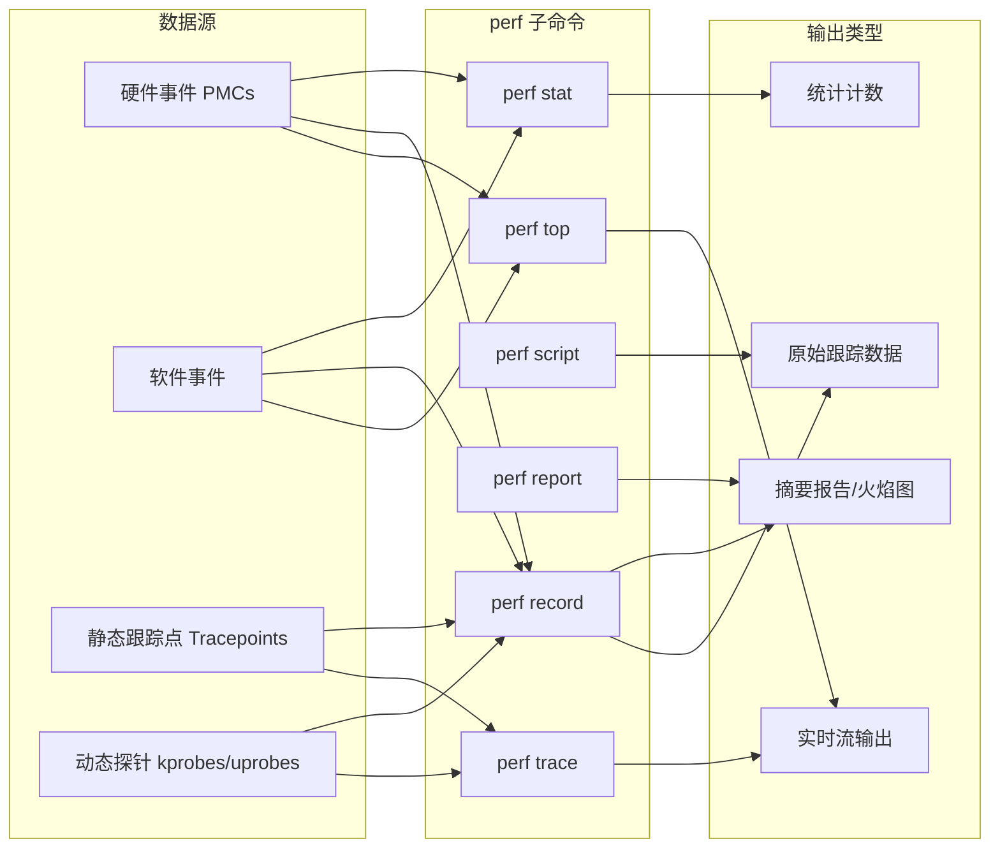

# 第13章 perf

`perf(1)` 是官方的 Linux 性能分析器，位于 Linux 内核源码的 `tools/perf` 目录下。^1 它是一个多功能工具，具备性能分析、跟踪和脚本编程能力，同时也是内核 [[perf_events]] 可观测性子系统的前端。`perf_events` 也被称为 Linux 性能计数器（Performance Counters for Linux, PCL）或 Linux 性能事件。`perf_events` 和 `perf(1)` 前端最初仅具备性能监控计数器（[[PMC|Performance Monitoring Counter, PMC]]）功能，但后来已扩展为支持基于事件的跟踪源：[[tracepoints|跟踪点]]、[[kprobes]]、[[uprobes]] 和 [[USDT]]。

本章与第14章 Ftrace 和第15章 BPF 一样，是为希望更深入了解一个或多个系统跟踪器的读者提供的可选阅读内容。

与其他跟踪器相比，`perf(1)` 特别适合用于 CPU 分析：对 CPU 栈踪进行性能分析（采样）、跟踪 CPU 调度器行为，以及检查 PMC 以理解包括周期行为在内的微架构级 CPU 性能。它的跟踪能力使其也能分析其他目标，包括磁盘 I/O 和软件函数。

`perf(1)` 可用于回答如下问题：

- 哪些代码路径正在消耗 CPU 资源？
- CPU 是否因内存加载/存储而停顿？
- 线程离开 CPU 的原因是什么？
- 磁盘 I/O 的模式是什么？

以下各节的结构旨在介绍 `perf(1)`，展示事件源，然后展示使用它们的子命令。各节内容如下：

- **13.1：子命令概述**
- **13.2：单行命令示例**
- **事件**：
  - 13.3：事件概述
  - 13.4：硬件事件
  - 13.5：软件事件
  - 13.6：跟踪点
  - 13.7：探测事件
- **命令**：
  - 13.8：perf stat
  - 13.9：perf record
  - 13.10：perf report
  - 13.11：perf script
  - 13.12：perf trace
  - 13.13：其他命令
- **13.14：文档**
- **13.15：参考资料**

前面的章节已经展示了如何使用 `perf(1)` 来分析特定目标。本章重点介绍 `perf(1)` 本身。

---

^1 `perf(1)` 的特殊之处在于，它是一个庞大且复杂的用户态程序，却位于 Linux 内核源码树中。维护者 Arnaldo Carvalho de Melo 向我描述这种情况为一个“实验”。虽然这有利于 `perf(1)` 和 Linux 同步开发，但有些人对其被包含在内核源码中感到不适，而且它可能仍然是唯一被包含在 Linux 源码中的复杂用户软件。

## 13.1 子命令概述

`perf(1)` 的功能通过子命令调用。作为一个常见的用例，以下命令使用了两个子命令：`record` 用于检测事件并将其保存到文件中，然后 `report` 用于汇总文件的内容。这些子命令将在 13.9 节 perf record 和 13.10 节 perf report 中解释。

```bash
# perf record -F 99 -a -- sleep 30
[ perf record: Woken up 193 times to write data ]
[ perf record: Captured and wrote 48.916 MB perf.data (11880 samples) ]

# perf report --stdio
[...]
# Overhead  Command          Shared Object              Symbol                      
# ........  ...............  .........................  ............................
#
    21.10%  swapper          [kernel.vmlinux]           [k] native_safe_halt
     6.39%  mysqld           [kernel.vmlinux]           [k] _raw_spin_unlock_irqrest
     4.66%  mysqld           mysqld                     [.] _Z8ut_delaym
     2.64%  mysqld           [kernel.vmlinux]           [k] finish_task_switch
[...]
```

此特定示例以 99 赫兹的频率对所有 CPU 上运行的任何程序采样 30 秒，然后显示采样频率最高的函数。

近期 `perf(1)` 版本（来自 Linux 5.6）的部分子命令列于表 13.1 中。

**表 13.1 选定的 perf 子命令**

| 节号 | 命令 | 描述 |
| :--- | :--- | :--- |
| - | `annotate` | 读取 perf.data（由 perf record 创建）并显示带注解的代码。 |
| - | `archive` | 创建包含调试和符号信息的可移植 perf.data 文件。 |
| - | `bench` | 系统微基准测试。 |
| - | `buildid-cache` | 管理 build-id 缓存（由 USDT 探针使用）。 |
| - | `c2c` | 缓存行分析工具。 |
| - | `diff` | 读取两个 perf.data 文件并显示差异分析。 |
| - | `evlist` | 列出 perf.data 文件中的事件名称。 |
| 14.12 | `ftrace` | Ftrace 跟踪器的 `perf(1)` 接口。 |
| - | `inject` | 过滤器，用于用附加信息扩充事件流。 |
| - | `kmem` | 跟踪/测量内核内存属性。 |
| 11.3.3 | `kvm` | 跟踪/测量 kvm 客户机实例。 |
| 13.3 | `list` | 列出事件类型。 |
| - | `lock` | 分析锁事件。 |
| - | `mem` | 分析内存访问。 |
| 13.7 | `probe` | 定义新的动态跟踪点。 |
| 13.9 | `record` | 运行命令并将其性能记录到 perf.data 中。 |
| 13.10 | `report` | 读取 perf.data（由 perf record 创建）并显示性能分析报告。 |
| 6.6.13 | `sched` | 跟踪/测量调度器属性（延迟）。 |
| 5.5.1 | `script` | 读取 perf.data（由 perf record 创建）并显示跟踪输出。 |
| 13.8 | `stat` | 运行命令并收集性能计数器统计信息。 |
| - | `timechart` | 可视化工作负载期间的整体系统行为。 |
| - | `top` | 具有实时屏幕更新的系统性能分析工具。 |
| 13.12 | `trace` | 实时跟踪器（默认跟踪系统调用）。 |

图 13.1 显示了常用的 `perf` 子命令及其数据源和输出类型。

> [!INFO] 图 13.1 常用的 perf 子命令
> *（原图展示了常用 perf 子命令、其数据源与输出类型的映射关系，此处以 Mermaid 图表形式呈现其核心拓扑）*



这些及其他许多子命令将在以下各节中解释。部分子命令已在前面的章节中介绍过，如表 13.1 所示。

未来的 `perf(1)` 版本可能会增加更多功能：请运行不带参数的 `perf` 以获取您系统的完整子命令列表。

## 13.2 单行命令

以下单行命令通过示例展示了 `perf(1)` 的各种功能。这些摘自我在网上发布的一个更大的列表 [Gregg 20h]，这已被证明是解释 `perf(1)` 功能的有效方式。这些命令的语法将在后面的章节以及 `perf(1)` 的 man 手册页中介绍。

> [!TIP] 关于 `-a` 参数的说明
> 请注意，这些单行命令中有许多使用 `-a` 来指定所有 CPU，但这在 Linux 4.11 中已成为默认设置，在该版本及更高版本的内核中可以省略。

### 列出事件

列出当前已知的所有事件：
```bash
perf list
```

列出 sched 跟踪点：
```bash
perf list 'sched:*'
```

列出名称包含字符串 “block” 的事件：
```bash
perf list block
```

列出当前可用的动态探针：
```bash
perf probe -l
```

### 计数事件

显示指定命令的 PMC 统计信息：
```bash
perf stat command
```

显示指定 PID 的 PMC 统计信息，直到按下 Ctrl-C：
```bash
perf stat -p PID
```

显示整个系统 5 秒内的 PMC 统计信息：
```bash
perf stat -a sleep 5
```

显示命令的 CPU 最后一级缓存（LLC）统计信息：
```bash
perf stat -e LLC-loads,LLC-load-misses,LLC-stores,LLC-prefetches command
```

使用原始 PMC 规范计算非停机核心周期：
```bash
perf stat -e r003c -a sleep 5 
```

使用详细的 PMC 原始规范计算前端停顿：
```bash
perf stat -e cpu/event=0x0e,umask=0x01,inv,cmask=0x01/ -a sleep 5
```

全系统范围内每秒的系统调用计数：
```bash
perf stat -e raw_syscalls:sys_enter -I 1000 -a
```

按类型计算指定 PID 的系统调用：
```bash
perf stat -e 'syscalls:sys_enter_*' -p PID
```

计算整个系统 10 秒内的块设备 I/O 事件：
```bash
perf stat -e 'block:*' -a sleep 10
```

### 性能分析

以 99 赫兹频率对指定命令的在线CPU函数进行采样：
```bash
perf record -F 99 command
```

全系统范围内 10 秒的 CPU 栈踪采样（通过帧指针）：
```bash
perf record -F 99 -a -g sleep 10
```

使用 dwarf（调试信息）展开栈，对指定 PID 的 CPU 栈踪进行采样：
```bash
perf record -F 99 -p PID --call-graph dwarf sleep 10
```

通过其 `/sys/fs/cgroup/perf_event` cgroup 对容器的 CPU 栈踪进行采样：
```bash
perf record -F 99 -e cpu-clock --cgroup=docker/1d567f439319...etc... -a sleep 10
```

使用最后分支记录（LBR; Intel）对整个系统的 CPU 栈踪进行采样：
```bash
perf record -F 99 -a --call-graph lbr sleep 10
```

每发生 100 次最后一级缓存未命中采样一次 CPU 栈踪，持续 5 秒：
```bash
perf record -e LLC-load-misses -c 100 -ag sleep 5 
```

精确采样在线CPU的用户指令（例如，使用 Intel PEBS），持续 5 秒：
```bash
perf record -e cycles:up -a sleep 5 
```

以 49 赫兹频率对 CPU 采样，并实时显示顶层进程名称和段：
```bash
perf top -F 49 -ns comm,dso
```

### 静态跟踪

跟踪新进程，直到按下 Ctrl-C：
```bash
perf record -e sched:sched_process_exec -a
```

对上下文切换的子集及栈踪采样 1 秒：
```bash
perf record -e context-switches -a -g sleep 1
```

跟踪所有上下文切换及栈踪 1 秒：
```bash
perf record -e sched:sched_switch -a -g sleep 1
```

跟踪所有上下文切换及 5 层深度的栈踪 1 秒：
```bash
perf record -e sched:sched_switch/max-stack=5/ -a -g sleep 1
```

跟踪 `connect(2)` 调用（出站连接）及栈踪，直到按下 Ctrl-C：
```bash
perf record -e syscalls:sys_enter_connect -a -g
```

每秒最多采样 100 个块设备请求，直到按下 Ctrl-C：
```bash
perf record -F 100 -e block:block_rq_issue -a
```

跟踪所有块设备发出和完成事件（带有时间戳），直到按下 Ctrl-C：
```bash
perf record -e block:block_rq_issue,block:block_rq_complete -a
```

跟踪大小至少为 64 KB 的所有块请求，直到按下 Ctrl-C：
```bash
perf record -e block:block_rq_issue --filter 'bytes >= 65536'
```

跟踪所有 ext4 调用，并写入非 ext4 位置，直到按下 Ctrl-C：
```bash
perf record -e 'ext4:*' -o /tmp/perf.data -a 
```

跟踪 `http__server__request` USDT 事件（来自 Node.js; Linux 4.10+）：
```bash
perf record -e sdt_node:http__server__request -a
```

跟踪块设备请求并实时输出（无 perf.data），直到按下 Ctrl-C：
```bash
perf trace -e block:block_rq_issue
```

跟踪块设备请求和完成事件并实时输出：
```bash
perf trace -e block:block_rq_issue,block:block_rq_complete
```

全系统范围内实时输出跟踪系统调用（详细模式）：
```bash
perf trace
```

### 动态跟踪

为内核 `tcp_sendmsg()` 函数入口添加探针（`--add` 可选）：
```bash
perf probe --add tcp_sendmsg
```

删除 `tcp_sendmsg()` 跟踪点（或使用 `-d`）：
```bash
perf probe --del tcp_sendmsg
```

列出 `tcp_sendmsg()` 可用的变量，以及外部变量（需要内核调试信息）：
```bash
perf probe -V tcp_sendmsg --externs
```

列出 `tcp_sendmsg()` 可用的行探针（需要调试信息）：
```bash
perf probe -L tcp_sendmsg
```

列出 `tcp_sendmsg()` 在第 81 行可用的变量（需要调试信息）：
```bash
perf probe -V tcp_sendmsg:81
```

为 `tcp_sendmsg()` 添加带有入口参数寄存器（特定于处理器）的探针：
```bash
perf probe 'tcp_sendmsg %ax %dx %cx'
```

为 `tcp_sendmsg()` 添加探针，并为 `%cx` 寄存器设置别名：
```bash
perf probe 'tcp_sendmsg bytes=%cx'
```

跟踪先前创建的探针，当字节大于 100 时触发：
```bash
perf record -e probe:tcp_sendmsg --filter 'bytes > 100'
```

为 `tcp_sendmsg()` 返回添加跟踪点，并捕获返回值：
```bash
perf probe 'tcp_sendmsg%return $retval'
```

为 `tcp_sendmsg()` 添加跟踪点，包含大小和套接字状态（需要调试信息）：
```bash
perf probe 'tcp_sendmsg size sk->__sk_common.skc_state'
```

为 `do_sys_open()` 添加跟踪点，并将文件名作为字符串捕获（需要调试信息）：
```bash
perf probe 'do_sys_open filename:string'
```

为来自 libc 的用户态 `fopen(3)` 函数添加跟踪点：
```bash
perf probe -x /lib/x86_64-linux-gnu/libc.so.6 --add fopen
```

### 报告

如果可能，在 ncurses 浏览器（TUI）中显示 perf.data：
```bash
perf report
```

将 perf.data 显示为文本报告，合并数据并显示计数和百分比：
```bash
perf report -n --stdio
```

列出所有 perf.data 事件，包含数据头（推荐）：
```bash
perf script --header
```

列出所有 perf.data 事件，使用推荐字段（需要 record -a；Linux < 4.1 使用 `-f` 代替 `-F`）：
```bash
perf script --header -F comm,pid,tid,cpu,time,event,ip,sym,dso 
```

生成火焰图可视化（Linux 5.8+）：
```bash
perf script report flamegraph
```

反汇编并按百分比注解指令（需要部分调试信息）：
```bash
perf annotate --stdio
```

> [!NOTE] 更多能力
> 以上是我精选的单行命令；还有更多未在此处涵盖的功能。请参阅上一节中的子命令，以及本章和其他章节后续内容中的更多 `perf(1)` 命令。

# 13.1 perf

## 13.3 perf 事件

可以使用 `perf list` 列出事件。我这里选取了 Linux 5.8 中的一部分输出，以展示不同类型的事件，并进行了高亮标注：

```bash
# perf list

List of pre-defined events (to be used in -e):

  branch-instructions OR branches                    [Hardware event]
  branch-misses                                      [Hardware event]
  bus-cycles                                         [Hardware event]
  cache-misses                                       [Hardware event]
[...]
  context-switches OR cs                             [Software event]
  cpu-clock                                          [Software event]
[...]
  L1-dcache-load-misses                              [Hardware cache event]
  L1-dcache-loads                                    [Hardware cache event]
[...]
  branch-instructions OR cpu/branch-instructions/    [Kernel PMU event]
  branch-misses OR cpu/branch-misses/                [Kernel PMU event]
[...]
cache:
  l1d.replacement                                   
       [L1D data line replacements] [...]
floating point:
  fp_arith_inst_retired.128b_packed_double          
       [Number of SSE/AVX computational 128-bit packed double precision [...]
frontend:
  dsb2mite_switches.penalty_cycles                  
       [Decode Stream Buffer (DSB)-to-MITE switch true penalty cycles] [...]
memory:
  cycle_activity.cycles_l3_miss                     
       [Cycles while L3 cache miss demand load is outstanding] [...]
  offcore_response.demand_code_rd.l3_miss.any_snoop 
       [DEMAND_CODE_RD & L3_MISS & ANY_SNOOP] [...]
other:
  hw_interrupts.received                            
       [Number of hardware interrupts received by the processor]
pipeline:
  arith.divider_active                              
       [Cycles when divide unit is busy executing divide or square root [...]
uncore:
  unc_arb_coh_trk_requests.all                      
       [Unit: uncore_arb Number of entries allocated. Account for Any type:
        e.g. Snoop, Core aperture, etc]
[...]
  rNNN                                               [Raw hardware event descriptor]
  cpu/t1=v1[,t2=v2,t3 ...]/modifier                  [Raw hardware event descriptor]
   (see 'man perf-list' on how to encode it)
  mem:<addr>[/len][:access]                          [Hardware breakpoint]
  alarmtimer:alarmtimer_cancel                       [Tracepoint event]
  alarmtimer:alarmtimer_fired                        [Tracepoint event]
[...]
  probe:do_nanosleep                                 [Tracepoint event]
[...]
  sdt_hotspot:class__initialization__clinit          [SDT event]
  sdt_hotspot:class__initialization__concurrent      [SDT event]
[...]
List of pre-defined events (to be used in --pfm-events):
ix86arch:
  UNHALTED_CORE_CYCLES
    [count core clock cycles whenever the clock signal on the specific core is 
running (not halted)]
  INSTRUCTION_RETIRED
[...]
```

上述输出在很多地方都被大幅度截断了，因为在这台测试系统上，完整的输出多达 4,402 行。事件类型如下：

- **Hardware event（硬件事件）**：主要是处理器事件（使用 [[PMC]] 实现性能监视计数器）
- **Software event（软件事件）**：内核计数器事件
- **Hardware cache event（硬件缓存事件）**：处理器缓存事件（PMC）
- **Kernel PMU event（内核 PMU 事件）**：性能监视单元（[[PMU]]）事件（PMC）
- **cache, floating point...（缓存、浮点等）**：处理器厂商事件（PMC）及简要描述
- **Raw hardware event descriptor（原始硬件事件描述符）**：使用原始代码指定的 PMC
- **Hardware breakpoint（硬件断点）**：处理器断点事件
- **Tracepoint event（跟踪点事件）**：内核静态插桩事件
- **SDT event（SDT 事件）**：用户级静态插桩事件（[[USDT]]）
- **pfm-events（pfm 事件）**：[[libpfm]] 事件（在 Linux 5.8 中新增）

跟踪点和 SDT 事件主要列出的是静态插桩点，但如果您创建了一些动态插桩探针，它们也会被列出来。我在输出中包含了一个示例：`probe:do_nanosleep` 被描述为一个基于 kprobe 的“Tracepoint event”。

`perf list` 命令可以接受一个搜索子串作为参数。例如，列出包含“mem_load_l3”的事件，并将事件以粗体高亮显示：

```bash
# perf list mem_load_l3

List of pre-defined events (to be used in -e):

cache:
  mem_load_l3_hit_retired.xsnp_hit                  
       [Retired load instructions which data sources were L3 and cross-core snoop 
hits in on-pkg core cache Supports address when precise (Precise event)]
  mem_load_l3_hit_retired.xsnp_hitm                 
       [Retired load instructions which data sources were HitM responses from shared 
L3 Supports address when precise (Precise event)]
  mem_load_l3_hit_retired.xsnp_miss                 
       [Retired load instructions which data sources were L3 hit and cross-core snoop 
missed in on-pkg core cache Supports address when precise (Precise event)]
  mem_load_l3_hit_retired.xsnp_none                 
       [Retired load instructions which data sources were hits in L3 without snoops 
required Supports address when precise (Precise event)]
[...]
```

这些是硬件事件（基于 PMC），输出中包含了简要描述。`(Precise event)` 指的是支持基于精确事件采样（[[PEBS]]）的事件。

## 13.4 硬件事件

硬件事件在第 4 章“可观测性工具”第 4.3.9 节“硬件计数器（PMC）”中已介绍过。它们通常使用 PMC 实现，而 PMC 是使用特定于处理器的代码进行配置的；例如，在 Intel 处理器上的分支指令通常可以通过 `perf(1)` 使用原始硬件事件描述符“r00c4”来进行插桩，该描述符是寄存器代码的简写：umask 为 `0x0`，event select 为 `0xc4`。这些代码发布在处理器手册中 [Intel 16][AMD 18][ARM 19]；Intel 还以 JSON 文件的形式提供它们 [Intel 20c]。

> [!TIP] 不必死记硬背原始代码
> 您不需要记住这些代码，只会在需要时去查阅处理器手册。为了便于使用，`perf(1)` 提供了人类可读的映射关系，可以用来替代原始代码。例如，事件“branch-instructions”有望映射到您系统上的分支指令 PMC。^2^ 其中一些人类可读的名称已在前面的列表中可见（硬件和 PMU 事件）。

处理器类型繁多，且新版本定期发布。您的处理器的人类可读映射可能尚未在 `perf(1)` 中提供，或者可能包含在更新的内核版本中。有些 PMC 可能永远不会通过人类可读的名称暴露出来。一旦我深入到缺乏映射的 PMC 层面，我经常不得不从人类可读的名称切换到原始事件描述符。映射中也可能存在错误，如果您遇到过可疑的 PMC 结果，您可能希望尝试使用原始事件描述符进行双重检查。

### 13.4.1 频率采样

将 PMC 与 `perf record` 一起使用时，会使用默认的采样频率，因此不会记录每一个事件。例如，记录 `cycles` 事件：

```bash
# perf record -vve cycles -a sleep 1
Using CPUID GenuineIntel-6-8E
intel_pt default config: tsc,mtc,mtc_period=3,psb_period=3,pt,branch
------------------------------------------------------------
perf_event_attr:
  size                             112
  { sample_period, sample_freq }   4000
  sample_type                      IP|TID|TIME|CPU|PERIOD
  disabled                         1
  inherit                          1
  mmap                             1
  comm                             1
  freq                             1
[...]
[ perf record: Captured and wrote 3.360 MB perf.data (3538 samples) ]
```

输出显示频率采样已启用（`freq 1`），采样频率为 4000。这告诉内核调整采样速率，以便每个 CPU 每秒大约捕获 4,000 个事件。这是可取的，因为某些 PMC 插桩的事件每秒可能发生数十亿次（例如，CPU 周期），记录每个事件的开销将是无法承受的。^3^ 但这也是一个陷阱：`perf(1)` 的默认输出（不带非常详细的选项：`-vv`）不会说明正在使用频率采样，而您可能期望记录所有事件。此事件频率仅影响 `record` 子命令；`stat` 子命令会计算所有事件。

^2^ 我过去遇到过映射问题，即人类可读的名称没有映射到正确的 PMC。仅从 `perf(1)` 的输出很难识别这一点：您需要对 PMC 有先验经验，并对正常情况有预期，才能发现异常。请注意这种可能性。随着处理器更新的速度，我预计未来的映射也会出现错误。

^3^ 尽管内核会限制采样率并丢弃事件以保护自身。请始终检查丢失的事件，以确认是否发生了这种情况（例如，通过以下命令检查汇总计数器：`perf report -D | tail -20`）。

可以使用 `-F` 选项修改事件频率，或者使用 `-c` 将其更改为周期，这会捕获周期分之一的间隔事件（也称为溢出采样）。使用 `-F` 的示例：

```bash
perf record -F 99 -e cycles -a sleep 1
```

这将以 99 赫兹（每秒事件数）的目标速率进行采样。这类似于第 13.2 节“单行命令”中的性能分析单行命令：它们没有指定事件（没有 `-e cycles`），这导致 `perf(1)` 在 PMC 可用时默认使用 `cycles`，或者在不可用时默认使用 `cpu-clock` 软件事件。有关更多详细信息，请参见第 13.9.2 节“CPU 性能分析”。

> [!WARNING] 频率与 CPU 利用率限制
> 请注意，频率速率有一个限制，并且 `perf(1)` 也有一个 CPU 利用率百分比限制，可以使用 `sysctl(8)` 查看和设置：

```bash
# sysctl kernel.perf_event_max_sample_rate
kernel.perf_event_max_sample_rate = 15500
# sysctl kernel.perf_cpu_time_max_percent
kernel.perf_cpu_time_max_percent = 25
```

这显示此系统上的最大采样率为 15,500 赫兹，`perf(1)`（具体为 [[PMU 中断]]）允许的最大 CPU 利用率为 25%。

## 13.5 软件事件

这些事件通常映射到硬件事件，但在软件中进行插桩。与硬件事件一样，它们可能具有默认的采样频率（通常为 4000），因此在使用 `record` 子命令时仅捕获一部分事件。

请注意 `context-switches` 软件事件与等效跟踪点之间的以下区别。从软件事件开始：

```bash
# perf record -vve context-switches -a -- sleep 1
[...]
------------------------------------------------------------
perf_event_attr:
  type                             1
  size                             112
  config                           0x3
  { sample_period, sample_freq }   4000
  sample_type                      IP|TID|TIME|CPU|PERIOD
[...]
  freq                             1
[...]
[ perf record: Captured and wrote 3.227 MB perf.data (660 samples) ]
```

此输出显示软件事件已默认使用 4000 赫兹的频率采样。现在看看等效的跟踪点：

```bash
# perf record -vve sched:sched_switch -a sleep 1
[...]
------------------------------------------------------------
perf_event_attr:
  type                             2
  size                             112
  config                           0x131
  { sample_period, sample_freq }   1
  sample_type                      IP|TID|TIME|CPU|PERIOD|RAW
[...]
[ perf record: Captured and wrote 3.360 MB perf.data (3538 samples) ]
```

这次使用了周期采样（没有 `freq 1`），采样周期为 1（等同于 `-c 1`）。这会捕获每一个事件。您可以通过指定 `-c 1` 对软件事件执行相同的操作，例如：

```bash
perf record -vve context-switches -a -c 1 -- sleep 1
```

> [!CAUTION] 记录所有事件的开销
> 记录每一个事件时请务必注意数据量以及涉及的开销，特别是对于上下文切换这种可能非常频繁的事件。您可以使用 `perf stat` 检查它们的频率：见

# 13.1 perf

## 13.6 跟踪点事件

[[跟踪点]] (Tracepoints) 最初在第4章“可观测性工具”的第4.3.5节“跟踪点”中介绍过，其中包含了使用 `perf(1)` 对其进行插桩的示例。回顾一下，我曾使用 `block:block_rq_issue` 跟踪点以及以下示例。

全系统跟踪10秒并打印事件：

```bash
perf record -e block:block_rq_issue -a sleep 10; perf script
```

打印此跟踪点的参数及其格式字符串（元数据摘要）：

```bash
cat /sys/kernel/debug/tracing/events/block/block_rq_issue/format
```

过滤块 I/O，仅保留大于 65536 字节的请求：

```bash
perf record -e block:block_rq_issue --filter 'bytes > 65536' -a sleep 10
```

在第13.2节“单行命令”以及本书的其他章节中，还有更多关于 `perf(1)` 和跟踪点的示例。

> [!NOTE]
> 请注意，`perf list` 将显示已初始化的探测事件（包括 [[kprobes]]（动态内核插桩））为“Tracepoint event”；请参阅第13.7节“探测点事件”。

## 13.7 探测点事件

`perf(1)` 使用术语“探测点事件”来指代 [[kprobes]]、[[uprobes]] 和 [[USDT]] 探针。这些是“动态的”，必须首先初始化然后才能被跟踪：默认情况下它们不会出现在 `perf list` 的输出中（某些 USDT 探针可能因为已被自动初始化而存在）。一旦初始化，它们就会被列为“Tracepoint event”。

### 13.7.1 kprobes

[[kprobes]] 最初在第4章“可观测性工具”的第4.3.6节“kprobes”中介绍过。以下是创建和使用 kprobe 的典型工作流程，在此示例中用于插桩 `do_nanosleep()` 内核函数：

```bash
perf probe --add do_nanosleep
perf record -e probe:do_nanosleep -a sleep 5
perf script
perf probe --del do_nanosleep
```

kprobe 使用 `probe` 子命令和 `--add` 创建（`--add` 是可选的），当不再需要时，使用 `probe` 和 `--del` 删除。以下是此序列的输出，包括列出探测事件：

```bash
# perf probe --add do_nanosleep
Added new event:
  probe:do_nanosleep   (on do_nanosleep)

You can now use it in all perf tools, such as:

        perf record -e probe:do_nanosleep -aR sleep 1

# perf list probe:do_nanosleep

List of pre-defined events (to be used in -e):
  probe:do_nanosleep                                 [Tracepoint event]

# perf record -e probe:do_nanosleep -aR sleep 1
[ perf record: Woken up 1 times to write data ]
[ perf record: Captured and wrote 3.368 MB perf.data (604 samples) ]

# perf script
           sleep 11898 [002] 922215.458572: probe:do_nanosleep: (ffffffff83dbb6b0)
 SendControllerT 15713 [002] 922215.459871: probe:do_nanosleep: (ffffffff83dbb6b0)
 SendControllerT  5460 [001] 922215.459942: probe:do_nanosleep: (ffffffff83dbb6b0)
[...]

# perf probe --del probe:do_nanosleep
Removed event: probe:do_nanosleep 
```

`perf script` 的输出显示了在跟踪期间发生的 `do_nanosleep()` 调用，首先是来自 `sleep(1)` 命令的调用（可能是 `perf(1)` 运行的 `sleep(1)` 命令），随后是 `SendControllerT` 的调用（已截断）。

可以通过添加 `%return` 来插桩函数的返回：

```bash
perf probe --add do_nanosleep%return
```

这使用了 [[kretprobes]]。

#### kprobe 参数

至少有四种不同的方法可以插桩内核函数的参数。

**第一种**，如果内核 debuginfo 可用，那么关于函数变量（包括参数）的信息就可供 `perf(1)` 使用。使用 `--vars` 选项列出 `do_nanosleep()` kprobe 的变量：

```bash
# perf probe --vars do_nanosleep
Available variables at do_nanosleep
        @<do_nanosleep+0>
                enum hrtimer_mode       mode
                struct hrtimer_sleeper* t
```

此输出显示了名为 `mode` 和 `t` 的变量，它们是 `do_nanosleep()` 的入口参数。可以在创建探针时添加它们，以便在记录时包含它们。例如，添加 `mode`：

```bash
# perf probe 'do_nanosleep mode'
[...]
# perf record -e probe:do_nanosleep -a
[...]
# perf script
          svscan  1470 [012] 4731125.216396: probe:do_nanosleep: (ffffffffa8e4e440) mode=0x1
```

此输出显示 `mode=0x1`。

**第二种**，如果内核 debuginfo 不可用（正如我在生产环境中经常发现的那样），则可以通过它们的寄存器位置来读取参数。一个技巧是使用一个相同的系统（相同的硬件和内核）并在其上安装内核 debuginfo 以供参考。然后可以使用 `perf probe` 的 `-n`（试运行/dry run）和 `-v`（详细/verbose）选项查询此参考系统以查找寄存器位置：

```bash
# perf probe -nv 'do_nanosleep mode'
[...]
Writing event: p:probe/do_nanosleep _text+10806336 mode=%si:x32
[...]
```

由于这是试运行，它不会创建事件。但输出显示了 `mode` 变量的位置（加粗高亮显示）：它位于寄存器 `%si` 中，并作为32位十六进制数（x32）打印。（此语法在下一节关于 uprobes 的内容中解释。）现在，可以通过复制和粘贴 `mode` 声明字符串（`mode=%si:x32`）在没有 debuginfo 的系统上使用它：

```bash
# perf probe 'do_nanosleep mode=%si:x32'
[...]
# perf record -e probe:do_nanosleep -a
[...]
# perf script
          svscan  1470 [000] 4732120.231245: probe:do_nanosleep: (ffffffffa8e4e440) mode=0x1
```

这仅在系统具有相同的处理器 ABI 和内核版本时才有效，否则可能会插桩错误的寄存器位置。

**第三种**，如果您了解处理器 ABI，您可以自己确定寄存器位置。下一节中关于 uprobes 的示例提供了此方法的示例。

**第四种**，还有一种新的内核调试信息来源：BPF 类型格式 ([[BTF]])。这更有可能默认可用，未来版本的 `perf(1)` 应该会支持它作为替代的 debuginfo 来源。

对于使用 kretprobe 插桩的 `do_nanosleep` 的返回，可以使用特殊的 `$retval` 变量读取返回值：

```bash
perf probe 'do_nanosleep%return $retval'
```

请查阅内核源代码以确定返回值包含的内容。

### 13.7.2 uprobes

[[uprobes]] 最初在第4章“可观测性工具”的第4.3.7节“uprobes”中介绍过。在使用 `perf(1)` 时，uprobes 的创建方式与 kprobes 类似。例如，为 libc 文件打开函数 `fopen(3)` 创建一个 uprobe：

```bash
# perf probe -x /lib/x86_64-linux-gnu/libc.so.6 --add fopen
Added new event:
  probe_libc:fopen     (on fopen in /lib/x86_64-linux-gnu/libc-2.27.so)

You can now use it in all perf tools, such as:

        perf record -e probe_libc:fopen -aR sleep 1
```

二进制文件路径使用 `-x` 指定。名为 `probe_libc:fopen` 的 uprobe 现在可以与 `perf record` 一起使用以记录事件。

当您使用完 uprobe 后，可以使用 `--del` 将其删除：

```bash
# perf probe --del probe_libc:fopen
Removed event: probe_libc:fopen
```

可以通过添加 `%return` 来插桩函数的返回：

```bash
perf probe -x /lib/x86_64-linux-gnu/libc.so.6 --add fopen%return
```

这使用了 [[uretprobes]]。

#### uprobe 参数

如果您的系统具有目标二进制文件的 debuginfo，那么变量信息（包括参数）可能可用。可以使用 `--vars` 将其列出：

```bash
# perf probe -x /lib/x86_64-linux-gnu/libc.so.6 --vars fopen
Available variables at fopen
        @<_IO_vfscanf+15344>
                char*   filename
                char*   mode
```

输出显示 `fopen(3)` 具有 `filename` 和 `mode` 变量。可以在创建探针时添加它们：

```bash
perf probe -x /lib/x86_64-linux-gnu/libc.so.6 --add 'fopen filename mode'
```

Debuginfo 可能通过 `-dbg` 或 `-dbgsym` 软件包提供。如果目标系统上没有，但另一个系统上有，则可以使用另一个系统作为参考系统，如上一节关于 kprobes 的内容所示。

即使任何地方都没有 debuginfo，您仍然有其他选择。一种选择是使用 debuginfo 重新编译软件（如果软件是开源的）。另一种选择是根据处理器 ABI 自己确定寄存器位置。以下是针对 x86_64 的示例：

```bash
# perf probe -x /lib/x86_64-linux-gnu/libc.so.6 --add 'fopen filename=+0(%di):string mode=%si:u8'
[...]
# perf record -e probe_libc:fopen -a
[...]
# perf script
             run 28882 [013] 4503285.383830: probe_libc:fopen: (7fbe130e6e30) filename="/etc/nsswitch.conf" mode=147
             run 28882 [013] 4503285.383997: probe_libc:fopen: (7fbe130e6e30) filename="/etc/passwd" mode=17
       setuidgid 28882 [013] 4503285.384447: probe_libc:fopen: (7fed1ad56e30) filename="/etc/nsswitch.conf" mode=147
       setuidgid 28882 [013] 4503285.384589: probe_libc:fopen: (7fed1ad56e30) filename="/etc/passwd" mode=17
             run 28883 [014] 4503285.392096: probe_libc:fopen: (7f9be2f55e30) filename="/etc/nsswitch.conf" mode=147
             run 28883 [014] 4503285.392251: probe_libc:fopen: (7f9be2f55e30) filename="/etc/passwd" mode=17
           mkdir 28884 [015] 4503285.392913: probe_libc:fopen: (7fad6ea0be30) filename="/proc/filesystems" mode=22
           chown 28885 [015] 4503285.393536: probe_libc:fopen: (7efcd22d5e30) filename="/etc/nsswitch.conf" mode=147
[...]
```

输出包含许多 `fopen(3)` 调用，显示了 `/etc/nsswitch.conf`、`/etc/passwd` 等文件名。

分解我使用的语法：

- **`filename=`**：这是一个别名（“filename”），用于注释输出。
- **`%di`, `%si`**：在 x86_64 上，根据 AMD64 ABI [Matz 13]，包含前两个函数参数的寄存器。
- **`+0(...)`**：解引用偏移量为零处的内容。如果没有这个，我们会不小心将地址作为字符串打印，而不是将地址的内容作为字符串打印。
- **`:string`**：将其作为字符串打印。
- **`:u8`**：将其作为无符号8位整数打印。

该语法记录在 `perf-probe(1)` 手册页中。

对于 uretprobe，可以使用 `$retval` 读取返回值：

```bash
perf probe -x /lib/x86_64-linux-gnu/libc.so.6 --add 'fopen%return $retval'
```

请查阅应用程序源代码以确定返回值包含的内容。

> [!WARNING]
> 虽然 uprobes 可以提供对应用程序内部的可见性，但它们是一个不稳定的接口，因为它们直接对二进制文件进行插桩，而二进制文件可能会在软件版本之间发生变化。只要可用，就应首选 [[USDT]] 探针。

### 13.7.3 USDT

[[USDT]] 探针最初在第4章“可观测性工具”的第4.3.8节“USDT”中介绍过。它们为跟踪事件提供了一个稳定的接口。

给定一个带有 USDT 探针的二进制文件，可以使用 `buildid-cache` 子命令让 `perf(1)` 感知它们。例如，对于使用 USDT 探针编译的 Node.js 二进制文件（使用以下命令构建：`./configure --with-dtrace`）：

```bash
# perf buildid-cache --add $(which node)
```

然后可以在 `perf list` 的输出中看到 USDT 探针：

```bash
# perf list | grep sdt_node
  sdt_node:gc__done                                  [SDT event]
  sdt_node:gc__start                                 [SDT event]
  sdt_node:http__client__request                     [SDT event]
  sdt_node:http__client__response                    [SDT event]
  sdt_node:http__server__request                     [SDT event]
  sdt_node:http__server__response                    [SDT event]
  sdt_node:net__server__connection                   [SDT event]
  sdt_node:net__stream__end                          [SDT event]
```

此时它们是 SDT 事件（静态定义的跟踪事件）：描述事件在程序指令文本中位置的元数据。要真正插桩它们，必须以与上一节中的 uprobes 相同的方式创建事件（USDT 探针也使用 uprobes 来插桩 USDT 位置）。例如，对于 `sdt_node:http__server_request`：

```bash
# perf probe sdt_node:http__server__request
Added new event:
  sdt_node:http__server__request (on %http__server__request in /home/bgregg/Build/node-v12.4.0/out/Release/node)

You can now use it in all perf tools, such as:

        perf record -e sdt_node:http__server__request -aR sleep 1
```

```markdown
# perf record -e sdt_node:http__server__request -a
^C[ perf record: Woken up 1 times to write data ]
[ perf record: Captured and wrote 3.924 MB perf.data (2 samples) ]
# perf script
            node 16282 [006] 510375.595203: sdt_node:http__server__request: 
(55c3d8b03530) arg1=140725176825920 arg2=140725176825888 arg3=140725176829208 
arg4=39090 arg5=140725176827096 arg6=140725176826040 arg7=20
            node 16282 [006] 510375.844040: sdt_node:http__server__request: 
(55c3d8b03530) arg1=140725176825920 arg2=140725176825888 arg3=140725176829208 
arg4=39092 arg5=140725176827096 arg6=140725176826040 arg7=20
```

输出显示在记录期间有两个 `sdt_node:http__server__request` 探测点被触发。它还打印了 USDT 探测的参数，但其中一些是结构体和字符串，因此 `perf(1)` 将它们作为指针地址打印出来。在创建探测点时，应该可以将参数强制转换为正确的类型；例如，将第三个参数转换为一个名为 “address” 的字符串：

```bash
perf probe --add 'sdt_node:http__server__request address=+0(arg3):string'
```

在撰写本文时，这还不起作用。

> [!WARNING] 常见问题：USDT 信号量
> 一个常见的问题（已在 Linux 4.20 中修复）是，某些 USDT 探测需要递增进程地址空间中的信号量才能正确激活它们。`sdt_node:http__server__request` 就是这样一个探测点，如果不递增信号量，它将不会记录任何事件。

---

# 13.8 perf stat

`perf stat` 子命令用于计数事件。这可用于测量事件的发生率，或检查事件是否发生。`perf stat` 非常高效：它在内核上下文中计数软件事件，并使用 [[PMC]] 寄存器计数硬件事件。这使得它适合通过首先使用 `perf stat` 检查事件发生率，来评估开销更大的 `perf record` 子命令的开销。

例如，计数跟踪点 `sched:sched_switch`（使用 `-e` 指定事件）、全系统范围（`-a`）并持续一秒钟（`sleep 1`：一个虚拟命令）：

```bash
# perf stat -e sched:sched_switch -a -- sleep 1

 Performance counter stats for 'system wide':

             5,705      sched:sched_switch                                          
       1.001892925 seconds time elapsed
```

这显示 `sched:sched_switch` 跟踪点在一秒钟内触发了 5,705 次。

> [!TIP] 命令分隔符
> 我经常在 `perf(1)` 命令选项和它运行的虚拟命令之间使用 `--` shell 分隔符，尽管在这种情况下这并不是严格必要的。

以下各节将解释选项和使用示例。

## 13.8.1 选项

`stat` 子命令支持许多选项，包括：

- **`-a`**：跨所有 CPU 记录（这在 Linux 4.11 中成为默认设置）
- **`-e event`**：记录此事件（或多个事件）
- **`--filter filter`**：为事件设置布尔过滤器表达式
- **`-p PID`**：仅记录此 PID
- **`-t TID`**：仅记录此线程 ID
- **`-G cgroup`**：仅记录此 cgroup（用于容器）
- **`-A`**：显示每个 CPU 的计数
- **`-I interval_ms`**：每隔指定间隔（毫秒）打印输出
- **`-v`**：显示详细消息；`-vv` 显示更多消息

事件可以是跟踪点、软件事件、硬件事件、[[kprobes]]、[[uprobes]] 和 [[USDT]] 探测（参见 13.3 到 13.7 节）。可以使用通配符以文件 glob 匹配的风格来匹配多个事件（`*` 匹配任何内容，`?` 匹配任何一个字符）。例如，以下命令匹配 `sched` 类型的所有跟踪点：

```bash
# perf stat -e 'sched:*' -a
```

可以使用多个 `-e` 选项来匹配多个事件描述。例如，要同时计数 `sched` 和 `block` 跟踪点，可以使用以下任一命令：

```bash
# perf stat -e 'sched:*' -e 'block:*' -a
# perf stat -e 'sched:*,block:*' -a
```

如果没有指定事件，`perf stat` 将默认使用架构相关的 [[PMC]]：您可以在第 4 章“可观测性工具”第 4.3.9 节“硬件计数器 (PMCs)”中看到这样的示例。

## 13.8.2 间隔统计

可以使用 `-I` 选项打印每个间隔的统计信息。例如，每 1000 毫秒打印一次 `sched:sched_switch` 的计数：

```bash
# perf stat -e sched:sched_switch -a -I 1000
#           time             counts unit events
     1.000791768              5,308      sched:sched_switch                                          
     2.001650037              4,879      sched:sched_switch                                          
     3.002348559              5,112      sched:sched_switch                                          
     4.003017555              5,335      sched:sched_switch                                          
     5.003760359              5,300      sched:sched_switch                                          
^C     5.217339333              1,256      sched:sched_switch    
```

`counts` 列显示自上一个间隔以来事件的数量。浏览此列可以显示基于时间的变化。最后一行显示前一行与我键入 Ctrl-C 结束 `perf(1)` 的时间之间的计数。该时间为 0.214 秒，如 `time` 列中的差值所示。

## 13.8.3 每 CPU 平衡

可以使用 `-A` 选项检查跨 CPU 的平衡情况：

```bash
# perf stat -e sched:sched_switch -a -A -I 1000
#           time CPU                counts unit events
     1.000351429 CPU0                 1,154      sched:sched_switch                          
     1.000351429 CPU1                   555      sched:sched_switch                          
     1.000351429 CPU2                   492      sched:sched_switch                             
     1.000351429 CPU3                   925      sched:sched_switch                                        
[...]
```

这将分别打印每个逻辑 CPU 每个间隔的事件增量。

还有 `--per-socket` 和 `--per-core` 选项用于 CPU 插槽和核心聚合。

## 13.8.4 事件过滤器

可以为某些事件类型（跟踪点事件）提供过滤器，以使用布尔表达式测试事件参数。只有当表达式为真时，事件才会被计数。例如，当之前的 PID 为 25467 时，计数 `sched:sched_switch` 事件：

```bash
# perf stat -e sched:sched_switch --filter 'prev_pid == 25467' -a -I 1000
#           time             counts unit events
     1.000346518                131      sched:sched_switch
     2.000937838                145      sched:sched_switch
     3.001370500                 11      sched:sched_switch
     4.001905444                217      sched:sched_switch
[...]  
```

有关这些参数的说明，请参见第 4 章“可观测性工具”第 4.3.5 节“跟踪点”中的跟踪点参数。它们针对每个事件是自定义的，可以从 `/sys/kernel/debug/tracing/events` 中的格式文件中列出。

## 13.8.5 影子统计

`perf(1)` 具有多种影子统计信息，当检测到某些事件组合时，将打印这些统计信息。例如，当检测周期和指令的 [[PMC]] 时，将打印每周期指令数 (IPC) 统计信息：

```bash
# perf stat -e cycles,instructions -a
^C
 Performance counter stats for 'system wide':
     2,895,806,892      cycles                                                      
     6,452,798,206      instructions              #    2.23  insn per cycle         
       1.040093176 seconds time elapsed
```

在此输出中，IPC 为 2.23。这些影子统计信息打印在右侧，在井号 (`#`) 之后。没有事件的 `perf stat` 输出包含几个这样的影子统计信息（有关示例，请参见第 4 章“可观测性工具”第 4.3.9 节“硬件计数器 (PMCs)”）。

要更详细地检查事件，可以使用 `perf record` 来捕获它们。

---

# 13.9 perf record

`perf record` 子命令将事件记录到文件中以供后续分析。事件在 `-e` 之后指定，可以同时记录多个事件（使用多个 `-e` 或以逗号分隔）。

默认情况下，输出文件名为 `perf.data`。例如：

```bash
# perf record -e sched:sched_switch -a
^C[ perf record: Woken up 9 times to write data ]
[ perf record: Captured and wrote 6.060 MB perf.data (23526 samples) ]
```

> [!INFO] 输出字段解析
> 请注意，输出包括 `perf.data` 文件的大小（6.060 兆字节）、它包含的样本数量（23,526）以及 `perf(1)` 唤醒以记录数据的次数（9 次）。数据通过每 CPU 环形缓冲区从内核传递到用户空间，并且为了将上下文切换开销保持在最低限度，`perf(1)` 被唤醒的次数是不频繁且动态的。

前一个命令一直记录到键入 Ctrl-C。可以使用一个虚拟的 `sleep(1)` 命令（或任何命令）来设置持续时间（就像之前的 `perf stat` 一样）。例如：

```bash
perf record -e tracepoint -a -- sleep 1
```

此命令仅在 1 秒内全系统范围 (`-a`) 记录跟踪点。

## 13.9.1 选项

`record` 子命令支持许多选项，包括：

- **`-a`**：跨所有 CPU 记录（这在 Linux 4.11 中成为默认设置）
- **`-e event`**：记录此事件（或多个事件）
- **`--filter filter`**：为事件设置布尔过滤器表达式
- **`-p PID`**：仅记录此 PID
- **`-t TID`**：仅记录此线程 ID
- **`-G cgroup`**：仅记录此 cgroup（用于容器）
- **`-g`**：记录栈跟踪
- **`--call-graph mode`**：使用给定方法（`fp`、`dwarf` 或 `lbr`）记录栈跟踪
- **`-o file`**：设置输出文件
- **`-v`**：显示详细消息；`-vv` 显示更多消息

可以记录与 `perf stat` 相同的事件，并使用 `perf trace` 实时打印（随着事件的发生）。

## 13.9.2 CPU 性能分析

`perf(1)` 的一个常见用途是作为 CPU 分析器。以下分析示例以 99 赫兹的频率在所有 CPU 上采样栈跟踪，持续 30 秒：

```bash
perf record -F 99 -a -g -- sleep 30
```

未指定事件（没有 `-e`），因此 `perf(1)` 将默认使用以下可用事件中的第一个（许多使用精确事件，在第 4 章“可观测性工具”第 4.3.9 节“硬件计数器 (PMCs)”中介绍）：

1. **`cycles:ppp`**：基于 CPU 周期的频率采样，精确度设置为零滑点
2. **`cycles:pp`**：基于 CPU 周期的频率采样，精确度设置为请求零滑点（在实践中可能不为零）
3. **`cycles:p`**：基于 CPU 周期的频率采样，精确度设置为请求恒定滑点
4. **`cycles`**：基于 CPU 周期的频率采样（无精确度）
5. **`cpu-clock`**：基于软件的 CPU 频率采样

> [!NOTE] 精确事件采样机制
> 该排序会选择可用的最准确的 CPU 分析机制。`:ppp`、`:pp` 和 `:p` 语法会激活精确事件采样模式，并且可以应用于支持它们的其他事件（除了 `cycles` 之外）。事件也可能支持不同级别的精确度。在 Intel 上，精确事件使用 PEBS；在 AMD 上，它们使用 IBS。这些在第 4.3.9 节的“PMC 挑战”标题下定义。

## 13.9.3 栈遍历

除了使用 `-g` 指定记录栈跟踪之外，还可以使用 `max-stack` 配置选项。它有两个好处：可以指定栈的最大深度，并且可以为不同的事件使用不同的设置。例如：

# 13.1 perf

## 13.9.3 栈回溯

除了使用 `-g` 来指定记录栈追踪之外，还可以使用 `max-stack` 配置选项。它有两个好处：可以指定栈的最大深度，并且可以为不同的事件使用不同的设置。例如：

```bash
# perf record -e sched:sched_switch/max-stack=5/,sched:sched_wakeup/max-stack=1/ \
    -a -- sleep 1
```

这将记录 `sched_switch` 事件时采集 5 层栈帧，而记录 `sched_wakeup` 事件时仅采集 1 层栈帧。

> [!NOTE]
> 请注意，如果栈追踪出现断裂，可能是由于软件未遵循帧指针寄存器。这在第 5 章“应用程序”的第 5.6.2 节“缺失的栈”中已讨论过。

除了使用帧指针重新编译软件（例如，`gcc(1) -fno-omit-frame-pointer`）之外，使用不同的栈回溯方法也可能奏效，可以通过 `--call-graph` 来选择。选项包括：

- `--call-graph dwarf`：选择基于调试信息（debuginfo）的栈回溯，这要求可执行文件的调试信息可用（对于某些软件，可以通过安装名称以“-dbgsym”或“-dbg”结尾的包来提供）。
- `--call-graph lbr`：选择 Intel 最后分支记录（LBR）栈回溯，这是一种处理器提供的方法（尽管它通常被限制为最多只有 16 帧的栈深度^7^，因此其用途也受到限制）。
- `--call-graph fp`：选择基于帧指针的栈回溯（默认）。

^7^ 自 Haswell 架构起栈深度为 16，自 Skylake 架构起为 32。

> [!INFO] 相关参考
> 基于帧指针的栈回溯在第 3 章“操作系统”的第 3.2.7 节“栈”中描述。其他类型（dwarf、LBR 和 ORC）在 *BPF Performance Tools* [Gregg 19] 一书的第 2 章“技术”的第 2.4 节“栈追踪回溯”中描述。

记录事件后，可以使用 `perf report` 或 `perf script` 来检查这些事件。

## 13.10 perf report

`perf report` 子命令用于汇总 `perf.data` 文件的内容。选项包括：

- `--tui`：使用 TUI 界面（默认）
- `--stdio`：输出文本报告
- `-i file`：输入文件
- `-n`：包含采样计数的列
- `-g options`：修改调用图（栈追踪）显示选项

也可以使用外部工具来汇总 `perf.data`。这些工具可能会处理 `perf script` 的输出，这将在第 13.11 节“perf script”中介绍。您可能会发现 `perf report` 在许多情况下已经足够，仅在必要时才使用外部工具。`perf report` 使用交互式文本用户界面（TUI）或文本报告（STDIO）进行汇总。

### 13.10.1 TUI

例如，以 99 赫兹对指令指针进行 CPU 性能分析持续 10 秒（无栈追踪），并启动 TUI：

```bash
# perf record -F 99 -a -- sleep 30
[ perf record: Woken up 193 times to write data ]
[ perf record: Captured and wrote 48.916 MB perf.data (11880 samples) ]
# perf report
```

```text
Samples: 11K of event 'cpu-clock:pppH', Event count (approx.): 119999998800
Overhead  Command          Shared Object              Symbol
  21.10%  swapper          [kernel.vmlinux]           [k] native_safe_halt
   6.39%  mysqld           [kernel.vmlinux]           [k] _raw_spin_unlock_irqrestor
   4.66%  mysqld           mysqld                     [.] _Z8ut_delaym
   2.64%  mysqld           [kernel.vmlinux]           [k] finish_task_switch
   2.59%  oltp_read_write  [kernel.vmlinux]           [k] finish_task_switch
   2.03%  mysqld           [kernel.vmlinux]           [k] exit_to_usermode_loop
   1.68%  mysqld           mysqld                     [.] _Z15row_search_mvccPh15pag
   1.40%  oltp_read_write  [kernel.vmlinux]           [k] _raw_spin_unlock_irqrestor
[...]
```

`perf report` 是一个交互式界面，您可以在其中导航数据，选择函数和线程以获取更多详细信息。

### 13.10.2 STDIO

第 13.1 节“子命令概述”中展示了使用基于文本的报告（`--stdio`）的相同 CPU 性能分析结果。它不是交互式的，但适合重定向到文件，以便将完整的摘要保存为文本。这种独立的文本报告对于通过聊天系统、电子邮件和支持工单系统与他人共享非常有用。我通常使用 `-n` 来包含一列采样计数。

作为另一个 STDIO 示例，以下显示了带有栈追踪（`-g`）的 CPU 性能分析：

```bash
# perf record -F 99 -a -g -- sleep 30
[ perf record: Woken up 8 times to write data ]
[ perf record: Captured and wrote 2.282 MB perf.data (11880 samples) ]
# perf report --stdio
```

```text
[...]
# Children      Self  Command          Shared Object               Symbol           
# ........  ........  ...............  ..........................  .................
#
    50.45%     0.00%  mysqld           libpthread-2.27.so          [.] start_thread
            |
            ---start_thread
               |          
               |--44.75%--pfs_spawn_thread
               |          |          
               |           --44.70%--handle_connection
               |                     |          
               |                      --44.55%--_Z10do_commandP3THD
               |                                |          
               |                                |--42.93%--_Z16dispatch_commandP3THD
               |                                |          |          
               |                                |           --40.92%--_Z19mysqld_stm
               |                                |                     |          
[...]
```

栈追踪样本被合并为一个层级结构，从左侧的根函数开始，向下并向右移动经过子函数。最右侧的函数是事件函数（在这种情况下，是占用 CPU 的函数），其左侧是它的祖先调用路径。此路径显示 `mysqld` 进程（守护进程）运行了 `start_thread()`，后者调用了 `pfs_spawn_thread()`，后者又调用了 `handle_connection()`，依此类推。最右侧的函数在此输出中被截断了。

> [!TIP] 调用顺序显示
> 这种从左到右的顺序被 `perf(1)` 称为 **caller** 顺序。您可以使用 `-g callee` 将其翻转为 **callee** 顺序，此时事件函数在左侧，其祖先调用链向下并向右展示（这曾经是默认值；`perf(1)` 在 Linux 4.4 中切换到了 caller 顺序）。

## 13.11 perf script

`perf script` 子命令默认打印 `perf.data` 中的每个样本，对于发现在报告摘要中可能丢失的随时间变化的模式很有用。其输出可用于生成火焰图，它还能够运行以自定义方式自动记录和报告事件的追踪脚本。本节将总结这些主题。

首先，这显示了之前收集的不带栈追踪的 CPU 性能分析的输出：

```bash
# perf script
          mysqld  8631 [000] 4142044.582702:   10101010 cpu-clock:pppH:            
c08fd9 _Z19close_thread_tablesP3THD+0x49 (/usr/sbin/mysqld)
          mysqld  8619 [001] 4142044.582711:   10101010 cpu-clock:pppH:            
79f81d _ZN5Field10make_fieldEP10Send_field+0x1d (/usr/sbin/mysqld)
          mysqld 22432 [002] 4142044.582713:   10101010 cpu-clock:pppH:  
ffffffff95530302 get_futex_key_refs.isra.12+0x32 (/lib/modules/5.4.0-rc8-virtua...
[...]
```

输出字段及其第一行输出的字段内容如下：

- **Process name（进程名）**：`mysqld`
- **Thread ID（线程 ID）**：`8631`
- **CPU ID**：`[000]`
- **Timestamp（时间戳）**：`4142044.582702`（秒）
- **Period（周期）**：`10101010`（由 `-F 99` 派生）；包含在某些采样模式中
- **Event name（事件名称）**：`cpu-clock:pppH`
- **Event arguments（事件参数）**：此字段及其后的字段是事件参数，特定于具体事件。对于 `cpu-clock` 事件，它们是指令指针、函数名和偏移量以及段名。有关这些参数的来源，请参见第 4 章第 4.3.5 节中的“跟踪点参数和格式字符串”。

> [!INFO] 
> 这些输出字段恰好是此事件的当前默认值，但在更高版本的 `perf(1)` 中可能会更改。其他事件不包含 period 字段。

由于生成一致的输出可能很重要，特别是对于后处理，您可以使用 `-F` 选项来指定字段。我经常使用它来包含进程 ID，因为默认字段集中缺少它。我还建议添加 `--header` 以包含 `perf.data` 的元数据。例如，这次显示一个带有栈追踪的 CPU 性能分析：

```bash
# perf script --header -F comm,pid,tid,cpu,time,event,ip,sym,dso,trace
```

```text
# ========
# captured on    : Sun Jan  5 23:43:56 2020
# header version : 1
# data offset    : 264
# data size      : 2393000
# feat offset    : 2393264
# hostname : bgregg-mysql
# os release : 5.4.0
# perf version : 5.4.0
# arch : x86_64
# nrcpus online : 4
# nrcpus avail : 4
# cpudesc : Intel(R) Xeon(R) Platinum 8175M CPU @ 2.50GHz
# cpuid : GenuineIntel,6,85,4
# total memory : 15923672 kB
# cmdline : /usr/bin/perf record -F 99 -a -g -- sleep 30 
# event : name = cpu-clock:pppH, , id = { 5997, 5998, 5999, 6000 }, type = 1, size = 
112, { sample_period, sample_freq } = 99, sample_ty
[...]
# ========
#
mysqld 21616/8583  [000] 4142769.671581: cpu-clock:pppH: 
                  c36299 [unknown] (/usr/sbin/mysqld)
                  c3bad4 _ZN13QEP_tmp_table8end_sendEv (/usr/sbin/mysqld)
                  c3c1a5 _Z13sub_select_opP4JOINP7QEP_TABb (/usr/sbin/mysqld)
                  c346a8 _ZN4JOIN4execEv (/usr/sbin/mysqld)
                  ca735a _Z12handle_queryP3THDP3LEXP12Query_resultyy 
[...]
```

输出包含以“#”为前缀的头部信息，描述了系统和用于创建 `perf.data` 文件的 `perf(1)` 命令。如果您将此输出保存到文件以备后用，您会很庆幸包含了头部，因为它提供了您以后可能需要的大量信息。这些文件可以由其他可视化工具读取，包括用于生成火焰图的工具。

### 13.11.1 火焰图

[[火焰图]] 可视化栈追踪。虽然通常用于 CPU 性能分析，但它们可以可视化由 `perf(1)` 收集的任何栈追踪集合，包括在上下文切换事件上查看线程离开 CPU 的原因，以及在块 I/O 创建事件上查看哪些代码路径正在创建磁盘 I/O。

两种常用的火焰图实现（我自己开发的一种，以及一个 d3 版本）可以将 `perf script` 的输出可视化。Linux 5.8 中添加了对 `perf(1)` 的火焰图支持。使用 `perf(1)` 创建火焰图的步骤包含在第 6 章“CPU”的第 6.6.13 节“perf”中的“CPU 火焰图”标题下。可视化本身在第 6.7.3 节“火焰图”中进行了解释。

FlameScope 是另一个用于可视化 `perf script` 输出的工具，它结合了亚秒偏移热力图来研究与火焰图相关的时间变化。它也包含在第 6 章“CPU”的第 6.7.4 节“FlameScope”中。

### 13.11.2 追踪脚本

可以使用 `-l` 列出可用的 `perf(1)` 追踪脚本：

```bash
# perf script -l
List of available trace scripts:
[...]
  event_analyzing_sample               analyze all perf samples
  mem-phys-addr                        resolve physical address samples
  intel-pt-events                      print Intel PT Power Events and PTWRITE
  sched-migration                      sched migration overview
  net_dropmonitor                      display a table of dropped frames
  syscall-counts-by-pid [comm]         system-wide syscall counts, by pid
  failed-syscalls-by-pid [comm]        system-wide failed syscalls, by pid
  export-to-sqlite [database name] [columns] [calls] export perf data to a sqlite3 
database
  stackcollapse                        produce callgraphs in short form for scripting 
use
```

这些可以作为 `perf script` 的参数来执行。您还可以使用 Perl 或 Python 开发额外的追踪脚本。

## 13.12 perf trace

`perf trace` 子命令默认将跟踪系统调用并实时打印输出（不产生 `perf.data` 文件）。它在第 5 章“应用程序”的第 5.5.1 节“perf”中作为 `strace(1)` 的低开销版本引入，可以进行系统级范围的跟踪。`perf trace` 还可以使用与 `perf record` 类似的语法来检查任何事件。

例如，跟踪磁盘 I/O 的下发和完成：

```bash
# perf trace -e block:block_rq_issue,block:block_rq_complete
     0.000 auditd/391 block:block_rq_issue:259,0 WS 8192 () 16046032 + 16 [auditd]
```

0.566 systemd-journa/28651 block:block_rq_complete:259,0 WS () 16046032 + 16 [0]
     0.748 jbd2/nvme0n1p1/174 block:block_rq_issue:259,0 WS 61440 () 2100744 + 120 
[jbd2/nvme0n1p1-]
     1.436 systemd-journa/28651 block:block_rq_complete:259,0 WS () 2100744 + 120 [0]
     1.515 kworker/0:1H-k/365 block:block_rq_issue:259,0 FF 0 () 0 + 0 [kworker/0:1H]
     1.543 kworker/0:1H-k/365 block:block_rq_issue:259,0 WFS 4096 () 2100864 + 8 
[kworker/0:1H]
     2.074 sshd/6463 block:block_rq_complete:259,0 WFS () 2100864 + 8 [0]
     2.077 sshd/6463 block:block_rq_complete:259,0 WFS () 2100864 + 0 [0]
  1087.562 kworker/0:1H-k/365 block:block_rq_issue:259,0 W 4096 () 16046040 + 8 
[kworker/0:1H]
[...]

与 `perf record` 一样，事件也可以使用过滤器。这些过滤器可以包含一些由内核头文件生成的字符串常量。例如，跟踪标志为 `MAP_SHARED` 的 `mmap(2)` 系统调用，使用字符串 “SHARED”：

```bash
# perf trace -e syscalls:*enter_mmap --filter='flags==SHARED'
     0.000 env/14780 syscalls:sys_enter_mmap(len: 27002, prot: READ, flags: SHARED, 
fd: 3)
    16.145 grep/14787 syscalls:sys_enter_mmap(len: 27002, prot: READ, flags: SHARED, 
fd: 3)
    18.704 cut/14791 syscalls:sys_enter_mmap(len: 27002, prot: READ, flags: SHARED, 
fd: 3)
[...]
```

> [!NOTE] 可读性增强（Beautification）
> 请注意，`perf(1)` 也使用字符串来提高格式字符串的可读性：它打印出的是 “prot: READ” 而不是 “prot: 1”。`perf(1)` 将此功能称为“美化”。

### 13.12.1 内核版本

在 Linux 4.19 之前，除了指定的事件（`-e`）之外，`perf trace` 默认会插桩所有系统调用（`--syscalls` 选项）。要禁用跟踪其他系统调用，请指定 `--no-syscalls`（这现在是默认设置）。例如：

```bash
# perf trace -e block:block_rq_issue,block:block_rq_complete --no-syscalls
```

请注意，自 Linux 3.8 起，跨所有 CPU 跟踪（`-a`）已成为默认设置。过滤器（`--filter`）是在 Linux 5.5 中添加的。

### 13.13 其他命令

`perf(1)` 还有更多的子命令和功能，其中一些在其他章节中使用过。回顾一下额外的子命令（完整列表见表 13.1）：

- **`perf c2c`**（Linux 4.10+）：[[Cache-to-Cache|缓存到缓存]]与缓存行伪共享分析
- **`perf kmem`**：内核内存分配分析
- **`perf kvm`**：KVM 客户机分析
- **`perf lock`**：锁分析
- **`perf mem`**：内存访问分析
- **`perf sched`**：内核调度器统计
- **`perf script`**：自定义 perf 工具

高级的额外功能包括在事件上启动 [[BPF]] 程序，以及使用硬件跟踪（如 Intel 处理器跟踪 [[Intel PT|PT]] 或 ARM [[CoreSight]]）进行逐指令分析 [Hunter 20]。

> [!EXAMPLE] Intel 处理器跟踪基础示例
> 以下是一个 Intel 处理器跟踪的基础示例。它记录了 `date(1)` 命令的用户态周期：
> 
> ```bash
> # perf record -e intel_pt/cyc/u date
> Sat Jul 11 05:52:40 PDT 2020
> [ perf record: Woken up 1 times to write data ]
> [ perf record: Captured and wrote 0.049 MB perf.data ]
> ```
> 
> 这可以打印为指令跟踪（指令以粗体突出显示）：
> 
> ```bash
> # perf script --insn-trace 
>         date 31979 [003] 653971.670163672:      7f3bfbf4d090 _start+0x0 (/lib/x86_64-
> linux-gnu/ld-2.27.so) insn: 48 89 e7
>         date 31979 [003] 653971.670163672:      7f3bfbf4d093 _start+0x3 (/lib/x86_64-
> linux-gnu/ld-2.27.so) insn: e8 08 0e 00 00
> [...]
> ```
> 
> 此输出包含机器码形式的指令。安装并使用 Intel X86 编码器解码器（[[XED]]）可以将指令打印为汇编代码 [Intelxed 19]：
> 
> ```bash
> # perf script --insn-trace --xed
> date 31979 [003] 653971.670163672: ... (/lib/x86_64-linux-gnu/ld-2.27.so) mov %rsp, 
> %rdi  
> date 31979 [003] 653971.670163672: ... (/lib/x86_64-linux-gnu/ld-2.27.so) callq 
> 0x7f3bfbf4dea0   
> date 31979 [003] 653971.670163672: ... (/lib/x86_64-linux-gnu/ld-2.27.so) pushq %rbp   
> [...]
> date 31979 [003] 653971.670439432: ... (/bin/date) xor %ebp, %ebp  
> date 31979 [003] 653971.670439432: ... (/bin/date) mov %rdx, %r9  
> date 31979 [003] 653971.670439432: ... (/bin/date) popq %rsi   
> date 31979 [003] 653971.670439432: ... (/bin/date) mov %rsp, %rdx  
> date 31979 [003] 653971.670439432: ... (/bin/date) and $0xfffffffffffffff0, %rsp  
> [...]
> ```

> [!WARNING] 数据详细度与冗长性
> 虽然这提供了令人难以置信的细节，但同时也非常冗长。仅针对 `date(1)` 命令，完整输出就达到了 266,105 行。其他示例请参见 `perf(1)` wiki [Hunter 20]。

### 13.14 perf 文档

每个子命令也应该有一个以 “perf-” 开头的手册页供参考，例如，`record` 子命令对应 `perf-record(1)`。这些手册页位于 Linux 源码树的 `tools/perf/Documentation` 目录下。

wiki.kernel.org 上有一个 `perf(1)` 教程 [Perf 15]，Vince Weaver 维护了一个非官方的 `perf(1)` 页面 [Weaver 11]，我自己也维护了另一个非官方的 `perf(1)` 示例页面 [Gregg 20f]。

我自己的页面包含了完整的 `perf(1)` 单行命令列表，以及更多的示例。

由于 `perf(1)` 经常增加新功能，请检查后续内核版本的更新。一个很好的来源是 KernelNewbies 上发布的每个内核更新日志中的 perf 部分 [KernelNewbies 20]。

### 13.15 参考文献

- [Weaver 11] Weaver, V., “The Unofficial Linux Perf Events Web-Page,” http://web.eece.maine.edu/~vweaver/projects/perf_events, 2011.
- [Matz 13] Matz, M., Hubička, J., Jaeger, A., and Mitchell, M., “System V Application Binary Interface, AMD64 Architecture Processor Supplement, Draft Version 0.99.6,” http://x86-64.org/documentation/abi.pdf, 2013.
- [Perf 15] “Tutorial: Linux kernel profiling with perf,” perf wiki, https://perf.wiki.kernel.org/index.php/Tutorial, last updated 2015.
- [Intel 16] Intel 64 and IA-32 Architectures Software Developer’s Manual Volume 3B: System Programming Guide, Part 2, September 2016, https://www.intel.com/content/www/us/en/architecture-and-technology/64-ia-32-architectures-software-developer-vol-3b-part-2-manual.html, 2016.
- [AMD 18] Open-Source Register Reference for AMD Family 17h Processors Models 00h-2Fh, https://developer.amd.com/resources/developer-guides-manuals, 2018.
- [ARM 19] Arm® Architecture Reference Manual Armv8, for Armv8-A architecture profile, https://developer.arm.com/architectures/cpu-architecture/a-profile/docs?_ga=2.78191124.1893781712.1575908489-930650904.1559325573, 2019.
- [Intelxed 19] “Intel XED,” https://intelxed.github.io, 2019.
- [Gregg 20h] Gregg, B., “One-Liners,” http://www.brendangregg.com/perf.html#OneLiners, last updated 2020.
- [Gregg 20f] Gregg, B., “perf Examples,” http://www.brendangregg.com/perf.html, last updated 2020.
- [Hunter 20] Hunter, A., “Perf tools support for Intel® Processor Trace,” https://perf.wiki.kernel.org/index.php/Perf_tools_support_for_Intel%C2%AE_Processor_Trace, last updated 2020.
- [Intel 20c] “/perfmon/,” https://download.01.org/perfmon, accessed 2020.
- [KernelNewbies 20] “KernelNewbies: LinuxVersions,” https://kernelnewbies.org/LinuxVersions, accessed 2020.