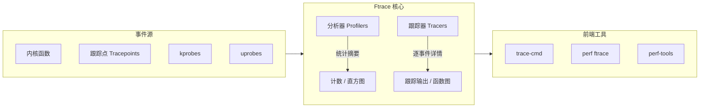
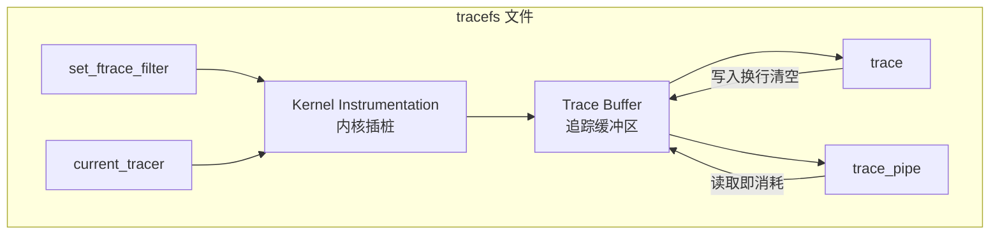
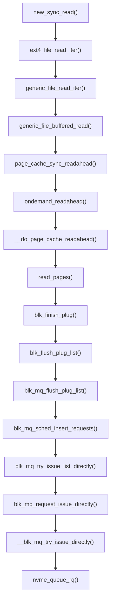
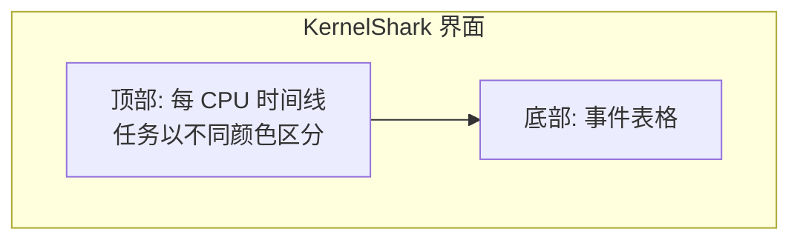
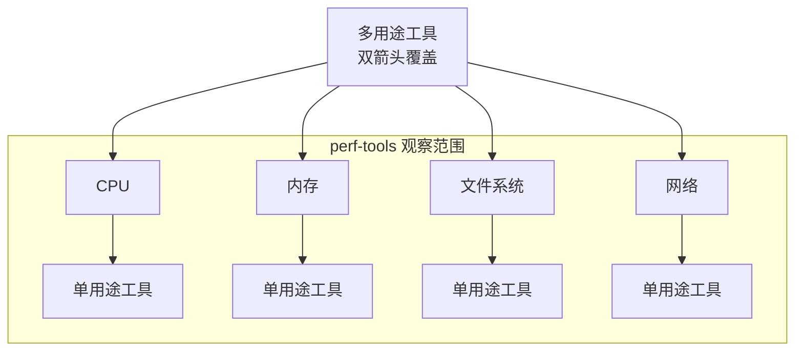

# 第14章 Ftrace

[[Ftrace]] 是 Linux 官方的跟踪器，是一个由不同跟踪实用程序组成的多功能工具集。Ftrace 由 Steven Rostedt 创建，并首次添加到 Linux 2.6.27（2008 年）中。它可以在不使用任何额外的用户级前端的情况下运行，这使其特别适合存储空间非常有限的嵌入式 Linux 环境。同时，它在服务器环境中也非常有用。

本章与第 13 章 [[perf]] 以及第 15 章 [[BPF]] 一样，供希望更详细地学习一个或多个系统跟踪器的读者选读。

Ftrace 可用于回答如下问题：

- 某些内核函数被调用的频率是多少？
- 是什么代码路径导致了该函数的调用？
- 该内核函数调用了哪些子函数？
- 由禁用抢占的代码路径引起的最高延迟是多少？

以下各节的结构旨在介绍 Ftrace，展示其部分分析器和跟踪器，然后展示使用它们的前端工具。各节内容包括：

- 14.1：功能概述
- 14.2：tracefs (/sys)
- 分析器：
  - 14.3：Ftrace 函数分析器
  - 14.10：Ftrace Hist 触发器
- 跟踪器：
  - 14.4：Ftrace 函数跟踪
  - 14.5：跟踪点
  - 14.6：kprobes
  - 14.7：uprobes
  - 14.8：Ftrace function_graph
  - 14.9：Ftrace hwlat
- 前端：
  - 14.11：trace-cmd
  - 14.12：perf ftrace
  - 14.13：perf-tools
- 14.14：Ftrace 文档
- 14.15：参考文献

Ftrace hist 触发器是一个高级主题，需要先介绍分析器和跟踪器，因此放在本章的较后部分。kprobes 和 uprobes 部分也包括了基本的性能分析功能。

图 14.1 是 Ftrace 及其前端的概述，箭头显示了从事件到输出类型的路径。

> [!INFO] 图 14.1 概念重构
> 图 14.1 Ftrace 分析器、跟踪器和前端



这些内容将在以下各节中进行解释。

## 14.1 功能概述

虽然 [[perf]](1) 使用子命令来实现不同的功能，但 Ftrace 拥有分析器和跟踪器。分析器提供统计摘要，例如计数和直方图，而跟踪器提供每个事件的详细信息。

作为 Ftrace 的一个示例，以下 `funcgraph(8)` 工具使用 Ftrace 跟踪器来显示 `vfs_read()` 内核函数的子调用：

```bash
# funcgraph vfs_read
Tracing "vfs_read"... Ctrl-C to end.
 1)               |  vfs_read() {
 1)               |    rw_verify_area() {
 1)               |      security_file_permission() {
 1)               |        apparmor_file_permission() {
 1)               |          common_file_perm() {
 1)   0.763 us    |            aa_file_perm();
 1)   2.209 us    |          }
 1)   3.329 us    |        }
 1)   0.571 us    |        __fsnotify_parent();
 1)   0.612 us    |        fsnotify();
 1)   7.019 us    |      }
 1)   8.416 us    |    }
 1)               |    __vfs_read() {
 1)               |      new_sync_read() {
 1)               |        ext4_file_read_iter() {
[...]
```

输出显示 `vfs_read()` 调用了 `rw_verify_area()`，后者又调用了 `security_file_permission()` 等等。第二列显示了在每个函数中花费的持续时间（“us”表示微秒），以便您进行性能分析，找出导致父函数变慢的子函数。这种特定的 Ftrace 功能称为函数图跟踪，将在第 14.8 节 Ftrace function_graph 中介绍。

来自近期 Linux 版本（5.2）的 Ftrace 分析器和跟踪器列在表 14.1 和 14.2 中，连同 Linux 事件跟踪器：跟踪点、kprobes 和 uprobes 一起。这些事件跟踪器类似于 Ftrace，共享相似的配置和输出接口，因此包含在本章中。表 14.2 中显示的等宽字体跟踪器名称是 Ftrace 跟踪器，也是用于配置它们的命令行关键字。

**表 14.1 Ftrace 分析器**

| 分析器 | 描述 | 章节 |
| --- | --- | --- |
| function | 内核函数统计 | 14.3 |
| kprobe profiler | 已启用的 kprobe 计数 | 14.6.5 |
| uprobe profiler | 已启用的 uprobe 计数 | 14.7.4 |
| hist triggers | 基于事件的自定义直方图 | 14.10 |

**表 14.2 Ftrace 和事件跟踪器**

| 跟踪器 | 描述 | 章节 |
| --- | --- | --- |
| function | 内核函数调用跟踪器 | 14.4 |
| tracepoints | 内核静态插桩（事件跟踪器） | 14.5 |
| kprobes | 内核动态插桩（事件跟踪器） | 14.6 |
| uprobes | 用户级动态插桩（事件跟踪器） | 14.7 |
| function_graph | 带有子调用层次图的内核函数调用跟踪 | 14.8 |
| wakeup | 测量最大 CPU 调度延迟 | - |
| wakeup_rt | 测量实时（RT）任务的最大 CPU 调度延迟 | - |
| irqsoff | 跟踪 IRQ 关闭事件及代码位置和延迟（中断禁止延迟）¹ | - |
| preemptoff | 跟踪禁用抢占事件及代码位置和延迟 | - |
| preemptirqsoff | 结合 irqsoff 和 preemptoff 的跟踪器 | - |
| blk | 块 I/O 跟踪器（由 blktrace(8) 使用） | - |
| hwlat | 硬件延迟跟踪器：可检测导致延迟的外部干扰 | 14.9 |
| mmiotrace | 跟踪模块对硬件的调用 | - |
| nop | 用于禁用其他跟踪器的特殊跟踪器 | - |

> [!NOTE] 脚注 1
> ¹ 此跟踪器（以及 preemptoff、preemptirqsoff）需要启用 CONFIG_PREEMPTIRQ_EVENTS。

您可以使用以下命令列出您的内核版本中可用的 Ftrace 跟踪器：

```bash
# cat /sys/kernel/debug/tracing/available_tracers
hwlat blk mmiotrace function_graph wakeup_dl wakeup_rt wakeup function nop
```

这使用了挂载在 `/sys` 下的 tracefs 接口，这将在下一节中介绍。后续各节将介绍分析器、跟踪器以及使用它们的工具。

如果您想直接跳到基于 Ftrace 的工具，请查看第 14.13 节 perf-tools，其中包含了前面显示的 `funcgraph(8)`。

未来的内核版本可能会向 Ftrace 添加更多的分析器和跟踪器：请查阅 Linux 源码中 `Documentation/trace/ftrace.rst` 下的 Ftrace 文档 [Rostedt 08]。

## 14.2 tracefs (/sys)

使用 Ftrace 功能的接口是 tracefs 文件系统。它应该挂载在 `/sys/kernel/tracing`；例如，可以使用：

```bash
mount -t tracefs tracefs /sys/kernel/tracing
```

Ftrace 最初是 debugfs 文件系统的一部分，后来才拆分为独立的 tracefs。当挂载 debugfs 时，它仍然通过将 tracefs 挂载为 tracing 子目录来保留原始目录结构。您可以使用以下命令列出 debugfs 和 tracefs 的挂载点：

```bash
# mount -t debugfs,tracefs
debugfs on /sys/kernel/debug type debugfs (rw,relatime)
tracefs on /sys/kernel/debug/tracing type tracefs (rw,relatime)
```

此输出来自 Ubuntu 19.10，显示 tracefs 挂载在 `/sys/kernel/debug/tracing`。以下各节中的示例使用此位置，因为它仍被广泛使用，但将来它应该会变更为 `/sys/kernel/tracing`。

> [!WARNING] 挂载失败排查
> 请注意，如果 tracefs 挂载失败，一个可能的原因是您的内核在编译时未包含 Ftrace 配置选项（CONFIG_FTRACE 等）。

### 14.2.1 tracefs 内容

一旦挂载了 tracefs，您应该能够在 tracing 目录中看到控制和输出文件：

```bash
# ls -F /sys/kernel/debug/tracing
available_events            max_graph_depth      stack_trace_filter
available_filter_functions  options/             synthetic_events
available_tracers           per_cpu/             timestamp_mode
buffer_percent              printk_formats       trace
buffer_size_kb              README               trace_clock
buffer_total_size_kb        saved_cmdlines       trace_marker
current_tracer              saved_cmdlines_size  trace_marker_raw
dynamic_events              saved_tgids          trace_options
dyn_ftrace_total_info       set_event            trace_pipe
enabled_functions           set_event_pid        trace_stat
error_log                   set_ftrace_filter    tracing_cpumask
events/                     set_ftrace_notrace   tracing_max_latency
free_buffer                 set_ftrace_pid       tracing_on
function_profile_enabled    set_graph_function   tracing_thresh
hwlat_detector/             set_graph_notrace    uprobe_events
instances/                  snapshot             uprobe_profile
kprobe_events               stack_max_size
kprobe_profile              stack_trace
```

其中许多文件的名称是直观的。关键文件和目录包括表 14.3 中列出的那些。

**表 14.3 tracefs 关键文件**

| 文件 | 访问方式 | 描述 |
| --- | --- | --- |
| available_tracers | 读取 | 列出可用的跟踪器（见表 14.2） |
| current_tracer | 读/写 | 显示当前启用的跟踪器 |
| function_profile_enabled | 读/写 | 启用函数分析器 |
| available_filter_functions | 读取 | 列出可供跟踪的函数 |
| set_ftrace_filter | 读/写 | 选择要跟踪的函数 |
| tracing_on | 读/写 | 启用/禁用输出环形缓冲区的开关 |
| trace | 读/写 | 跟踪器的输出（环形缓冲区） |
| trace_pipe | 读取 | 跟踪器的输出；此版本会消耗跟踪内容并阻塞等待输入 |
| trace_options | 读/写 | 用于自定义跟踪缓冲区输出的选项 |
| trace_stat (目录) | 读/写 | 函数分析器的输出 |
| kprobe_events | 读/写 | 已启用的 kprobe 配置 |
| uprobe_events | 读/写 | 已启用的 uprobe 配置 |
| events (目录) | 读/写 | 事件跟踪器控制文件：tracepoints、kprobes、uprobes |
| instances (目录) | 读/写 | 用于并发用户的 Ftrace 实例 |

此 `/sys` 接口记录在 Linux 源码的 `Documentation/trace/ftrace.rst` [Rostedt 08] 中。它可以直接从 shell 使用，也可以由前端和库使用。例如，要查看当前是否有任何 Ftrace 跟踪器正在使用，您可以 `cat(1)` current_tracer 文件：

```bash
# cat /sys/kernel/debug/tracing/current_tracer 
nop
```

输出显示 `nop`（无操作），这意味着当前没有使用任何跟踪器。要启用跟踪器，请将其名称写入此文件。例如，要启用 blk 跟踪器：

```bash
# echo blk > /sys/kernel/debug/tracing/current_tracer
```

其他 Ftrace 控制和输出文件也可以通过 `echo(1)` 和 `cat(1)` 使用。这意味着 Ftrace 的使用几乎具有零依赖性（只需要一个 shell²）。

> [!TIP] 脚注 2：极简环境下的 Ftrace 零依赖方案
> ² `echo(1)` 是 shell 内置命令，`cat(1)` 可以通过函数近似实现：`function shellcat { (while read line; do echo "$line"; done) < $1; }`。或者可以使用 Busybox 来包含 shell、`cat(1)` 和其他基本工具。

Steven Rostedt 在开发实时补丁集时为自己构建了 Ftrace，最初它不支持并发用户。例如，`current_tracer` 文件一次只能设置一个跟踪器。并发用户支持是后来以实例的形式添加的，可以在“instances”目录中创建。每个实例都有自己的 `current_tracer` 和输出文件，以便它可以独立执行跟踪。

以下各节（14.3 到 14.10）展示了更多 `/sys` 接口示例；随后的各节（14.11 到 14.13）展示了基于此构建的前端：trace-cmd、`perf(1)` ftrace 子命令和 perf-tools。

# 14.1 Ftrace

## 14.3 Ftrace 函数性能分析器

函数性能分析器提供内核函数调用的统计信息，适合用于探索哪些内核函数正在被使用，并识别哪些函数最慢。我经常使用函数性能分析器作为理解给定工作负载下内核代码执行的起点，特别是因为它非常高效且开销相对较低。使用它，我可以识别出需要使用开销更高的逐事件追踪来分析的函数。它需要启用 `CONFIG_FUNCTION_PROFILER=y` 内核选项。

函数性能分析器的工作原理是在每个内核函数的起始处使用编译时插入的性能分析调用。这种方法基于编译器性能分析器的工作原理，例如 gcc(1) 的 `-pg` 选项，该选项会插入 `mcount()` 调用供 gprof(1) 使用。从 gcc(1) 4.6 版本开始，这个 `mcount()` 调用现在变成了 `__fentry__()`。在每个内核函数中添加调用听起来似乎会带来显著的开销，这对于可能很少使用的功能来说是个问题，但开销问题已经被解决了：当不使用时，这些调用通常会被替换为快速的 nop 指令，只有在需要时才会切换回 `__fentry__()` 调用 [Gregg 19f]。

> [!TIP] 开销优化机制
> 在每个内核函数入口插入追踪调用听起来开销巨大，但内核开发人员通过动态补丁技术解决了这个问题：未启用追踪时，这些调用点被替换为单周期的 `nop` 指令；仅在启用追踪时，才会动态将其修改为 `__fentry__()` 调用。

以下演示了使用 `/sys` 中的 [[tracefs]] 接口进行函数性能分析。作为参考，以下显示了函数性能分析器最初未启用的状态：

```bash
# cd /sys/kernel/debug/tracing
# cat set_ftrace_filter
#### all functions enabled ####
# cat function_profile_enabled 
0
```

现在（从同一目录中），以下命令使用函数性能分析器对大约 10 秒内所有以 “tcp” 开头的内核调用进行计数：

```bash
# echo 'tcp*' > set_ftrace_filter
# echo 1 > function_profile_enabled
# sleep 10
# echo 0 > function_profile_enabled 
# echo > set_ftrace_filter
```

这里使用 sleep(1) 命令来设置一个（大致的）性能分析持续时间。之后的命令禁用了函数性能分析并重置了过滤器。

> [!WARNING] 重定向语法陷阱
> 务必使用 `0 >` 而不是 `0>`——它们并不相同；后者是将文件描述符 0 进行重定向。同样，避免使用 `1>`，因为它是文件描述符 1 的重定向。

现在可以从 `trace_stat` 目录读取性能分析统计信息，该目录将它们保存在每个 CPU 对应的 "function" 文件中。这是一个 2 CPU 系统。使用 head(1) 仅显示每个文件的前十行：

```bash
# head trace_stat/function*
==> trace_stat/function0 <==
  Function                       Hit    Time            Avg             s^2
  --------                       ---    ----            ---             ---
  tcp_sendmsg                 955912    2788479 us      2.917 us        3734541 us  
  tcp_sendmsg_locked          955912    2248025 us      2.351 us        2600545 us  
  tcp_push                    955912    852421.5 us     0.891 us        1057342 us  
  tcp_write_xmit              926777    674611.1 us     0.727 us        1386620 us  
  tcp_send_mss                955912    504021.1 us     0.527 us        95650.41 us 
  tcp_current_mss             964399    317931.5 us     0.329 us        136101.4 us 
  tcp_poll                    966848    216701.2 us     0.224 us        201483.9 us 
  tcp_release_cb              956155    102312.4 us     0.107 us        188001.9 us 
==> trace_stat/function1 <==
  Function                       Hit    Time            Avg             s^2
  --------                       ---    ----            ---             ---
  tcp_sendmsg                 317935    936055.4 us     2.944 us        13488147 us 
  tcp_sendmsg_locked          317935    770290.2 us     2.422 us        8886817 us  
  tcp_write_xmit              348064    423766.6 us     1.217 us        226639782 us 
  tcp_push                    317935    310040.7 us     0.975 us        4150989 us  
  tcp_tasklet_func             38109    189797.2 us     4.980 us        2239985 us  
  tcp_tsq_handler              38109    180516.6 us     4.736 us        2239552 us  
  tcp_tsq_write.part.0         29977    173955.7 us     5.802 us        1037352 us  
  tcp_send_mss                317935    165881.9 us     0.521 us        352309.0 us 
```

各列分别显示了函数名（Function）、调用次数（Hit）、函数内的总时间（Time）、平均函数时间（Avg）和标准差（s^2）。输出显示 `tcp_sendmsg()` 函数在两个 CPU 上都是最频繁的；它在 CPU0 上被调用了超过 95.5 万次，在 CPU1 上被调用了超过 31.7 万次。其平均持续时间为 2.9 微秒。

> [!INFO] 输出字段说明
> - **Function**: 被分析的内核函数名称
> - **Hit**: 函数被调用的次数
> - **Time**: 函数花费的总时间（微秒 us）
> - **Avg**: 函数调用的平均时间（微秒 us）
> - **s^2**: 标准差（方差），用于衡量时间的波动程度

在进行性能分析期间，被分析的函数会增加少量开销。如果 `set_ftrace_filter` 留空，则所有内核函数都会被分析（正如我们之前看到的初始状态警告：“all functions enabled”）。在使用性能分析器时请牢记这一点，并尽量使用函数过滤器来限制开销。

稍后介绍的 Ftrace 前端工具可以自动执行这些步骤，并将每个 CPU 的输出合并为系统范围的摘要。

---

## 14.4 Ftrace 函数追踪

函数追踪器为内核函数调用打印逐事件的详细信息，并使用上一节中描述的函数性能分析插桩机制。它可以显示各种函数的序列、基于时间戳的模式，以及可能负责该调用的 CPU 上的进程名和 PID。函数追踪的开销高于函数性能分析，因此追踪最适合于调用相对不频繁的函数（每秒少于 1,000 次调用）。您可以使用上一节中的函数性能分析来了解函数的调用速率，然后再对它们进行追踪。

函数追踪涉及的关键 [[tracefs]] 文件如图 14.2 所示。



*图 14.2 Ftrace 函数追踪 tracefs 文件*

最终的追踪输出是从 `trace` 或 `trace_pipe` 文件读取的，将在以下小节中描述。这两个接口也都有清除输出缓冲区的方法（因此图中有指回缓冲区的箭头）。

### 14.4.1 使用 trace

以下演示了使用 `trace` 输出文件进行函数追踪。作为参考，以下显示了函数追踪器最初未启用的状态：

```bash
# cd /sys/kernel/debug/tracing
# cat set_ftrace_filter 
#### all functions enabled ####
# cat current_tracer 
nop
```

当前没有正在使用其他追踪器。

在此示例中，追踪了所有以 “sleep” 结尾的内核函数，并且事件最终被保存到了 `/tmp/out.trace01.txt` 文件中。使用了一个虚拟的 sleep(1) 命令来收集至少 10 秒的追踪。此命令序列最后禁用了函数追踪器并将系统恢复为正常状态：

```bash
# cd /sys/kernel/debug/tracing
# echo 1 > tracing_on
# echo '*sleep' > set_ftrace_filter
# echo function > current_tracer 
# sleep 10
# cat trace > /tmp/out.trace01.txt
# echo nop > current_tracer
# echo > set_ftrace_filter
```

设置 `tracing_on` 可能是一个不必要的步骤（在我的 Ubuntu 系统上，它默认被设置为 1）。我将其包含在内，以防您的系统上没有设置它。

在我们追踪 “sleep” 函数调用时，虚拟的 sleep(1) 命令被捕获到了追踪输出中：

```bash
# more /tmp/out.trace01.txt
# tracer: function
#
# entries-in-buffer/entries-written: 57/57   #P:2
#
#                              _-----=> irqs-off
#                             / _----=> need-resched
#                            | / _---=> hardirq/softirq
#                            || / _--=> preempt-depth
#                            ||| /     delay
#           TASK-PID   CPU#  ||||    TIMESTAMP  FUNCTION
#              | |       |   ||||       |         |
      multipathd-348   [001] .... 332762.532877: __x64_sys_nanosleep <-do_syscall_64
      multipathd-348   [001] .... 332762.532879: hrtimer_nanosleep <-
__x64_sys_nanosleep
      multipathd-348   [001] .... 332762.532880: do_nanosleep <-hrtimer_nanosleep
           sleep-4203  [001] .... 332762.722497: __x64_sys_nanosleep <-do_syscall_64
           sleep-4203  [001] .... 332762.722498: hrtimer_nanosleep <-
__x64_sys_nanosleep
           sleep-4203  [001] .... 332762.722498: do_nanosleep <-hrtimer_nanosleep
      multipathd-348   [001] .... 332763.532966: __x64_sys_nanosleep <-do_syscall_64
[...]
```

> [!INFO] 追踪输出头部字段解析
> 输出包含字段标题和追踪元数据。上述示例展示了一个名为 `multipathd`、进程 ID 为 348 的进程调用 sleep 函数，以及 `sleep(1)` 命令本身。最后的字段显示了当前函数和调用它的父函数。例如，对于第一行，函数是 `__x64_sys_nanosleep()`，由 `do_syscall_64()` 调用。
> - **irqs-off**: 'd' 表示中断被禁用，'.' 表示中断启用
> - **need-resched**: 'N' 表示需要重新调度，'.' 表示不需要
> - **hardirq/softirq**: 'H' 表示硬中断，'s' 表示软中断，'.' 表示不在中断上下文
> - **preempt-depth**: 抢占深度

`trace` 文件是追踪事件缓冲区的接口。读取它会显示缓冲区的内容；您可以通过向其写入换行符来清除内容：

```bash
# > trace
```

正如我在示例步骤中禁用追踪时所做的那样，当 `current_tracer` 被设置回 `nop` 时，追踪缓冲区也会被清除。当使用 `trace_pipe` 时，它也会被清除。

### 14.4.2 使用 trace_pipe

`trace_pipe` 文件是读取追踪缓冲区的另一种接口。从这个文件读取会返回无限的事件流。它也会消耗事件，因此读取一次之后，它们就不会再保留在追踪缓冲区中。

例如，使用 `trace_pipe` 实时观察 sleep 事件：

```bash
# echo '*sleep' > set_ftrace_filter 
# echo function > current_tracer 
# cat trace_pipe
      multipathd-348   [001] .... 332624.519190: __x64_sys_nanosleep <-do_syscall_64
      multipathd-348   [001] .... 332624.519192: hrtimer_nanosleep <-
__x64_sys_nanosleep
      multipathd-348   [001] .... 332624.519192: do_nanosleep <-hrtimer_nanosleep
      multipathd-348   [001] .... 332625.519272: __x64_sys_nanosleep <-do_syscall_64
      multipathd-348   [001] .... 332625.519274: hrtimer_nanosleep <-
__x64_sys_nanosleep
      multipathd-348   [001] .... 332625.519275: do_nanosleep <-hrtimer_nanosleep
            cron-504   [001] .... 332625.560150: __x64_sys_nanosleep <-do_syscall_64
            cron-504   [001] .... 332625.560152: hrtimer_nanosleep <-
__x64_sys_nanosleep
            cron-504   [001] .... 332625.560152: do_nanosleep <-hrtimer_nanosleep
^C
# echo nop > current_tracer 
# echo > set_ftrace_filter 
```

输出显示了来自 `multipathd` 和 `cron` 进程的一些 sleep 操作。这些字段与前面显示的 `trace` 文件输出相同，但这次没有列标题。

`trace_pipe` 文件非常适合观察低频事件，但对于高频事件，您会希望使用前面展示的 `trace` 文件将它们捕获到文件中以便日后分析。

### 14.4.3 选项

Ftrace 提供了用于自定义追踪输出的选项，可以通过 `trace_options` 文件或 `options` 目录进行控制。例如（从同一目录中）禁用标志列（在前面的输出中这是 “....” 部分）：

```bash
# echo 0 > options/irq-info 
# cat trace
# tracer: function
#
# entries-in-buffer/entries-written: 3300/3300   #P:2
#
#           TASK-PID     CPU#   TIMESTAMP  FUNCTION
#              | |         |       |         |
      multipathd-348   [001]  332762.532877: __x64_sys_nanosleep <-do_syscall_64
      multipathd-348   [001]  332762.532879: hrtimer_nanosleep <-__x64_sys_nanosleep
      multipathd-348   [001]  332762.532880: do_nanosleep <-hrtimer_nanosleep
[...]
```

现在标志列已不在输出中。您可以使用以下命令将其设置回来：

```bash
# echo 1 > options/irq-info
```

还有更多选项，您可以从 `options` 目录中列出它们；它们的名称相当直观。

```markdown
# ls options/
annotate          funcgraph-abstime   hex              stacktrace
bin               funcgraph-cpu       irq-info         sym-addr
blk_cgname        funcgraph-duration  latency-format   sym-offset
blk_cgroup        funcgraph-irqs      markers          sym-userobj
blk_classic       funcgraph-overhead  overwrite        test_nop_accept
block             funcgraph-overrun   print-parent     test_nop_refuse
context-info      funcgraph-proc      printk-msg-only  trace_printk
disable_on_free   funcgraph-tail      raw              userstacktrace
display-graph     function-fork       record-cmd       verbose
event-fork        function-trace      record-tgid
func_stack_trace  graph-time          sleep-time
```

这些选项包括 `stacktrace` 和 `userstacktrace`，它们会在输出中追加内核和用户栈跟踪信息：这对于理解函数被调用的原因非常有用。所有这些选项都在 Linux 源码的 Ftrace 文档中进行了说明 [Rostedt 08]。

## 14.5 Tracepoints

[[Tracepoints]]（跟踪点）是内核静态插桩技术，在第 4 章“可观测性工具”第 4.3.5 节“Tracepoints”中曾介绍过。从技术上讲，Tracepoints 只是放置在内核源码中的跟踪函数；它们通过一个定义和格式化其参数的 [[Trace Events|跟踪事件接口]] 来使用。Trace events 在 [[tracefs]] 中可见，并与 Ftrace 共享输出和控制文件。

> [!EXAMPLE] 启用并观察 Tracepoint
> 作为示例，以下命令启用了 `block:block_rq_issue` 跟踪点并实时观察事件。该示例最后以禁用该跟踪点结束：
> 
> ```bash
> # cd /sys/kernel/debug/tracing
> # echo 1 > events/block/block_rq_issue/enable
> # cat trace_pipe
>             sync-4844  [001] .... 343996.918805: block_rq_issue: 259,0 WS 4096 () 
> 2048 + 8 [sync]
>             sync-4844  [001] .... 343996.918808: block_rq_issue: 259,0 WSM 4096 () 
> 10560 + 8 [sync]
>             sync-4844  [001] .... 343996.918809: block_rq_issue: 259,0 WSM 4096 () 
> 38424 + 8 [sync]
>             sync-4844  [001] .... 343996.918809: block_rq_issue: 259,0 WSM 4096 () 
> 4196384 + 8 [sync]
>             sync-4844  [001] .... 343996.918810: block_rq_issue: 259,0 WSM 4096 () 
> 4462592 + 8 [sync]
> ^C
> # echo 0 > events/block/block_rq_issue/enable
> ```

前五列与 4.6.4 节中显示的相同，分别是：进程名“-”PID、CPU ID、标志位、时间戳（秒）和事件名。其余部分是跟踪点的格式字符串，这在第 4.3.5 节中已有描述。

从这个示例可以看出，Tracepoints 在 `events` 下的目录结构中拥有控制文件。每个跟踪系统（例如 “block”）都有一个对应的目录，而在这些子目录下又有每个事件（例如 “block_rq_issue”）的目录。列出该目录内容：

```bash
# ls events/block/block_rq_issue/
enable  filter  format  hist  id  trigger
```

这些控制文件在 Linux 源码的 `Documentation/trace/events.rst` 中有文档说明 [Ts’o 20]。在此示例中，`enable` 文件被用来打开和关闭跟踪点。其他文件提供了过滤和触发功能。

### 14.5.1 Filter

可以包含一个[[Filter|过滤器]]，以便仅当布尔表达式满足时才记录事件。它具有受限的语法：

```
field operator value
```

`field`（字段）来自第 4.3.5 节中描述的 `format` 文件，位于 Tracepoints Arguments and Format String 标题下（这些字段也会在前面描述的格式字符串中打印出来）。数字的操作符是以下之一：`==`, `!=`, `<`, `<=`, `>`, `>=`, `&`；字符串的操作符是：`==`, `!=`, `~`。`~` 操作符执行 shell glob 风格的匹配，支持通配符：`*`, `?`, `[]`。这些布尔表达式可以用括号分组，并使用 `&&`, `||` 组合。

> [!EXAMPLE] 基于 Filter 追踪大型 I/O
> 作为示例，以下命令在一个已启用的 `block:block_rq_insert` 跟踪点上设置过滤器，仅跟踪 `bytes` 字段大于 64 Kbytes 的事件：
> 
> ```bash
> # echo 'bytes > 65536' > events/block/block_rq_insert/filter 
> # cat trace_pipe 
>     kworker/u4:1-7173  [000] .... 378115.779394: block_rq_insert: 259,0 W 262144 () 
> 5920256 + 512 [kworker/u4:1]
>     kworker/u4:1-7173  [000] .... 378115.784654: block_rq_insert: 259,0 W 262144 () 
> 5924336 + 512 [kworker/u4:1]
>     kworker/u4:1-7173  [000] .... 378115.789136: block_rq_insert: 259,0 W 262144 () 
> 5928432 + 512 [kworker/u4:1]
> ^C
> ```
> 
> 现在输出仅包含较大的 I/O。
> 
> ```bash
> # echo 0 > events/block/block_rq_insert/filter
> ```
> 
> 此 `echo 0` 命令重置了过滤器。

### 14.5.2 Trigger

[[Trigger|触发器]]在事件触发时运行一个额外的跟踪命令。该命令可以是启用或禁用其他跟踪、打印栈跟踪，或者对跟踪缓冲区进行快照。当未设置任何触发器时，可以从 `trigger` 文件中列出可用的触发器命令。例如：

```bash
# cat events/block/block_rq_issue/trigger 
# Available triggers:
# traceon traceoff snapshot stacktrace enable_event disable_event enable_hist 
disable_hist hist
```

触发器的一个用例是当您希望查看到导致错误条件的事件时：可以在错误条件上放置一个触发器，使其要么禁用跟踪（`traceoff`），以便跟踪缓冲区仅包含之前的事件；要么进行快照（`snapshot`）以将其保存。

通过使用 `if` 关键字，触发器可以与上一节中展示的过滤器结合使用。这对于匹配错误条件或感兴趣的事件可能是必要的。例如，当大于 64 Kbytes 的块 I/O 排队时停止记录事件：

```bash
# echo 'traceoff if bytes > 65536' > events/block/block_rq_insert/trigger
```

可以使用 `hist` 触发器执行更复杂的操作，这将在第 14.10 节“Ftrace Hist Triggers”中介绍。

## 14.6 kprobes

[[kprobes]] 是内核动态插桩技术，在第 4 章“可观测性工具”第 4.3.6 节“kprobes”中曾介绍过。kprobes 为跟踪器创建 kprobe 事件以供使用，这些事件与 Ftrace 共享 tracefs 输出和控制文件。kprobes 与第 14.4 节中介绍的 Ftrace 函数跟踪器类似，都是跟踪内核函数。然而，kprobes 可以进行进一步的自定义，可以放置在函数偏移量处（单条指令），并且可以报告函数参数和返回值。

本节涵盖 kprobe 事件跟踪和 Ftrace kprobe 探查器。

### 14.6.1 Event Tracing

> [!EXAMPLE] 使用 kprobes 插桩内核函数
> 作为示例，以下命令使用 kprobes 插桩 `do_nanosleep()` 内核函数：
> 
> ```bash
> # echo 'p:brendan do_nanosleep' >> kprobe_events 
> # echo 1 > events/kprobes/brendan/enable 
> # cat trace_pipe
>       multipathd-348   [001] .... 345995.823380: brendan: (do_nanosleep+0x0/0x170)
>       multipathd-348   [001] .... 345996.823473: brendan: (do_nanosleep+0x0/0x170)
>       multipathd-348   [001] .... 345997.823558: brendan: (do_nanosleep+0x0/0x170)
> ^C
> # echo 0 > events/kprobes/brendan/enable 
> # echo '-:brendan' >> kprobe_events
> ```

kprobe 通过向 `kprobe_events` 追加特殊语法来创建和删除。创建之后，它会出现在 `events` 目录中与 Tracepoints 并列，并可以以类似的方式使用。

kprobe 语法在内核源码的 `Documentation/trace/kprobetrace.rst` 中有完整说明 [Hiramatsu 20]。kprobes 能够跟踪内核函数的进入和返回以及函数偏移量。其语法摘要为：

```
  p[:[GRP/]EVENT] [MOD:]SYM[+offs]|MEMADDR [FETCHARGS]  : Set a probe
  r[MAXACTIVE][:[GRP/]EVENT] [MOD:]SYM[+0] [FETCHARGS]  : Set a return probe
  -:[GRP/]EVENT                                         : Clear a probe
```

在我的示例中，字符串 `p:brendan do_nanosleep` 为内核符号 `do_nanosleep()` 创建了一个名为 “brendan” 的探针（`p:`）。字符串 `-:brendan` 删除了名为 “brendan” 的探针。

自定义名称已被证明对于区分 kprobes 的不同用户非常有用。BCC 跟踪器（在第 15 章“BPF”第 15.1 节“BCC”中介绍）使用的名称包含被跟踪的函数、字符串 “bcc” 以及 BCC 的 PID。例如：

```bash
# cat /sys/kernel/debug/tracing/kprobe_events
p:kprobes/p_blk_account_io_start_bcc_19454 blk_account_io_start
p:kprobes/p_blk_mq_start_request_bcc_19454 blk_mq_start_request
```

> [!NOTE] BCC 与 kprobe_events
> 请注意，在较新的内核上，BCC 已切换为使用基于 `perf_event_open(2)` 的接口来使用 kprobes，而不是 `kprobe_events` 文件（并且使用 `perf_event_open(2)` 启用的事件不会出现在 `kprobe_events` 中）。

### 14.6.2 Arguments

与函数跟踪（第 14.4 节“Ftrace Function Tracing”）不同，kprobes 可以检查函数参数和返回值。作为示例，以下是前面跟踪的 `do_nanosleep()` 函数的声明，来自 `kernel/time/hrtimer.c`，参数变量类型已高亮显示：

```c
static int __sched do_nanosleep(struct hrtimer_sleeper *t, enum hrtimer_mode mode)
{
[...]
```

在 Intel x86_64 系统上跟踪前两个参数并以十六进制打印（默认）：

```bash
# echo 'p:brendan do_nanosleep hrtimer_sleeper=$arg1 hrtimer_mode=$arg2' >> 
kprobe_events 
# echo 1 > events/kprobes/brendan/enable 
# cat trace_pipe
      multipathd-348   [001] .... 349138.128610: brendan: (do_nanosleep+0x0/0x170) 
hrtimer_sleeper=0xffffaa6a4030be80 hrtimer_mode=0x1
      multipathd-348   [001] .... 349139.128695: brendan: (do_nanosleep+0x0/0x170) 
hrtimer_sleeper=0xffffaa6a4030be80 hrtimer_mode=0x1
      multipathd-348   [001] .... 349140.128785: brendan: (do_nanosleep+0x0/0x170) 
hrtimer_sleeper=0xffffaa6a4030be80 hrtimer_mode=0x1
^C
# echo 0 > events/kprobes/brendan/enable 
# echo '-:brendan' >> kprobe_events 
```

第一行的事件描述中添加了额外的语法：例如，字符串 `hrtimer_sleeper=$arg1` 跟踪函数的第一个参数并使用自定义名称 “hrtimer_sleeper”。这在输出中已被高亮显示。

以 `$arg1`, `$arg2` 等方式访问函数参数的功能是在 Linux 4.20 中添加的。之前的 Linux 版本需要使用寄存器名称。^3 以下是使用寄存器名称的等效 kprobe 定义：

```bash
# echo 'p:brendan do_nanosleep hrtimer_sleeper=%di hrtimer_mode=%si' >> kprobe_events
```

要使用寄存器名称，您需要知道处理器类型和正在使用的函数调用约定。x86_64 使用 AMD64 ABI [Matz 13]，因此前两个参数可以在寄存器 rdi 和 rsi 中使用。^4 这种语法也被 `perf(1)` 使用，我在第 13 章“perf”第 13.7.2 节“uprobes”中提供了一个更复杂的示例，该示例解引用了一个字符串指针。

^3：对于尚未添加别名的处理器架构，这也可能是必要的。
^4：译注：在 AT&T 汇编语法中，rdi 寄存器写作 %di，rsi 写作 %si（实际上通常为 %rdi 和 %rsi，此处原文保留）。

### 14.6.3 Return Values

返回值的特殊别名 `$retval` 可用于 kretprobes。以下示例使用它来显示 `do_nanosleep()` 的返回值：

```bash
# echo 'r:brendan do_nanosleep ret=$retval' >> kprobe_events 
# echo 1 > events/kprobes/brendan/enable 
# cat trace_pipe 
      multipathd-348   [001] d... 349782.180370: brendan: 
(hrtimer_nanosleep+0xce/0x1e0 <- do_nanosleep) ret=0x0
      multipathd-348   [001] d... 349783.180443: brendan: 
(hrtimer_nanosleep+0xce/0x1e0 <- do_nanosleep) ret=0x0
      multipathd-348   [001] d... 349784.180530: brendan: 
(hrtimer_nanosleep+0xce/0x1e0 <- do_nanosleep) ret=0x0
^C
# echo 0 > events/kprobes/brendan/enable 
# echo '-:brendan' >> kprobe_events 
```

此输出显示，在跟踪期间，`do_nanosleep()` 的返回值始终为 “0”（成功）。

### 14.6.4 Filters and Triggers

过滤器和触发器可以从 `events/kprobes/...` 目录中使用，就像 Tracepoints 一样（参见第 14.5 节“Tracepoints”）。以下是之前带有参数（来自第 14.6.2 节“Arguments”）的 `do_nanosleep()` kprobe 的 `format` 文件：

# 14.1 Ftrace

> [!NOTE] 延续上下文
> 本部分为 Ftrace 章节的第 4/8 部分，紧接上文关于 kprobes 过滤器与触发器的讨论。

## 14.6.4 过滤器与触发器

可以在 `events/kprobes/...` 目录下使用过滤器与触发器，这与跟踪点（tracepoints）的使用方式相同（参见第 14.5 节“跟踪点”）。以下是前文对 `do_nanosleep()` 带参数 kprobe（来自第 14.6.2 节“参数”）的 format 文件内容：

```bash
# cat events/kprobes/brendan/format 
name: brendan
ID: 2024
format:
        field:unsigned short common_type;  offset:0;  size:2;    signed:0;
        field:unsigned char common_flags;  offset:2;  size:1;    signed:0;
        field:unsigned char common_preempt_count;   offset:3;  size:1;  signed:0;
        field:int common_pid;    offset:4; size:4;    signed:1;
        field:unsigned long __probe_ip;    offset:8;   size:8;   signed:0;
        field:u64 hrtimer_sleeper;     offset:16;  size:8;    signed:0;
        field:u64 hrtimer_mode;  offset:24;     size:8;     signed:0;
print fmt: "(%lx) hrtimer_sleeper=0x%Lx hrtimer_mode=0x%Lx", REC->__probe_ip, REC-
>hrtimer_sleeper, REC->hrtimer_mode
```

请注意，我自定义的 `hrtimer_sleeper` 和 `hrtimer_mode` 变量名作为字段可见，可以与过滤器配合使用。例如：

```bash
# echo 'hrtimer_mode != 1' > events/kprobes/brendan/filter
```

这将仅跟踪 `hrtimer_mode` 不等于 1 的 `do_nanosleep()` 调用。

## 14.6.5 kprobe 性能分析

当 kprobes 被启用时，Ftrace 会对它们的事件进行计数。这些计数可以打印在 `kprobe_profile` 文件中。例如：

```bash
# cat /sys/kernel/debug/tracing/kprobe_profile 
  p_blk_account_io_start_bcc_19454                        1808               0
  p_blk_mq_start_request_bcc_19454                         677               0
  p_blk_account_io_completion_bcc_19454                    521              11
  p_kbd_event_1_bcc_1119                                   632               0
```

各列分别为：探针名称（可以通过打印 `kprobe_events` 文件查看其定义）、命中计数以及未命中计数（miss-hits count，即探针被命中但随后遇到错误且未被记录的情况：即被遗漏的次数）。

虽然您已经可以使用函数性能分析器（function profiler，第 14.3 节）来获取函数计数，但我发现 kprobe 性能分析器对于检查监控软件所使用的“始终启用”的 kprobes 非常有用，以防某些探针触发过于频繁而应该被禁用（如果可能的话）。

## 14.7 uprobes

[[uprobes]] 是用户级动态插桩工具，在第 4 章“可观测性工具”第 4.3.7 节“uprobes”中已作介绍。uprobes 为跟踪器创建 uprobe 事件以供使用，这些事件与 Ftrace 共享 tracefs 输出和控制文件。

本节涵盖 uprobe 事件跟踪和 Ftrace uprobe 性能分析器。

### 14.7.1 事件跟踪

对于 uprobes，控制文件是 `uprobe_events`，其语法记录在 Linux 源码的 `Documentation/trace/uprobetracer.rst` 中 [Dronamraju 20]。概要如下：

```text
  p[:[GRP/]EVENT] PATH:OFFSET [FETCHARGS] : 设置一个 uprobe
  r[:[GRP/]EVENT] PATH:OFFSET [FETCHARGS] : 设置一个返回 uprobe (uretprobe)
  -:[GRP/]EVENT                           : 清除 uprobe 或 uretprobe 事件
```

该语法现在要求为 uprobe 提供一个路径（PATH）和偏移量（OFFSET）。内核没有用户空间软件的符号信息，因此必须使用用户空间工具确定此偏移量并将其提供给内核。

以下示例使用 uprobes 插桩 `bash(1)` shell 中的 `readline()` 函数，首先查找符号偏移量：

```bash
# readelf -s /bin/bash | grep -w readline
   882: 00000000000b61e0   153 FUNC    GLOBAL DEFAULT   14 readline
# echo 'p:brendan /bin/bash:0xb61e0' >> uprobe_events 
# echo 1 > events/uprobes/brendan/enable 
# cat trace_pipe
            bash-3970  [000] d... 347549.225818: brendan: (0x55d0857b71e0)
            bash-4802  [000] d... 347552.666943: brendan: (0x560bcc1821e0)
            bash-4802  [000] d... 347552.799480: brendan: (0x560bcc1821e0)
^C
# echo 0 > events/uprobes/brendan/enable 
# echo '-:brendan' >> uprobe_events
```

> [!WARNING] 危险操作
> 如果您误用了一个位于指令中间的符号偏移量，您将会损坏目标进程（对于共享指令文本，则会损坏所有共享它的进程！）。如果目标二进制文件被编译为位置无关可执行文件（PIE）并启用了地址空间布局随机化（ASLR），则使用 `readelf(1)` 查找符号偏移量的示例技术可能不起作用。我根本不建议您使用此接口：请切换到可以为您处理符号映射的更高级别的跟踪器（例如，BCC 或 bpftrace）。

### 14.7.2 参数与返回值

这些与第 14.6 节“kprobes”中演示的类似。可以在创建 uprobe 时指定 uprobe 参数和返回值以进行检查。语法见 `uprobetracer.rst` [Dronamraju 20]。

### 14.7.3 过滤器与触发器

可以在 `events/uprobes/...` 目录下使用过滤器与触发器，这与 kprobes 的使用方式相同（参见第 14.6 节“kprobes”）。

### 14.7.4 uprobe 性能分析

当 uprobes 被启用时，Ftrace 会对它们的事件进行计数。这些计数可以打印在 `uprobe_profile` 文件中。例如：

```bash
# cat /sys/kernel/debug/tracing/uprobe_profile 
  /bin/bash brendan                                                   11
```

各列分别为：路径、探针名称（可以通过打印 `uprobe_events` 文件查看其定义）以及命中计数。

## 14.8 Ftrace function_graph

`function_graph` 跟踪器打印函数的调用图，揭示了代码的执行流程。本章开头通过 perf-tools 中的 `funcgraph(8)` 给出了一个示例。以下展示 Ftrace 的 tracefs 接口。

作为参考，以下是函数图跟踪器最初未启用时的状态：

```bash
# cd /sys/kernel/debug/tracing
# cat set_graph_function 
#### all functions enabled ####
# cat current_tracer 
nop
```

当前没有使用其他跟踪器。

### 14.8.1 图跟踪

以下对 `do_nanosleep()` 函数使用 `function_graph` 跟踪器，以显示其子函数调用：

```bash
# echo do_nanosleep > set_graph_function 
# echo function_graph > current_tracer 
# cat trace_pipe 
 1)   2.731 us    |  get_xsave_addr();
 1)               |  do_nanosleep() {
 1)               |    hrtimer_start_range_ns() {
 1)               |      lock_hrtimer_base.isra.0() {
 1)   0.297 us    |        _raw_spin_lock_irqsave();
 1)   0.843 us    |      }
 1)   0.276 us    |      ktime_get();
 1)   0.340 us    |      get_nohz_timer_target();
 1)   0.474 us    |      enqueue_hrtimer();
 1)   0.339 us    |      _raw_spin_unlock_irqrestore();
 1)   4.438 us    |    }
 1)               |    schedule() {
 1)               |      rcu_note_context_switch() {
[...]
 5) $ 1000383 us  |  } /* do_nanosleep */
^C
# echo nop > current_tracer 
# echo > set_graph_function 
```

输出显示了子调用和代码流程：`do_nanosleep()` 调用了 `hrtimer_start_range_ns()`，后者又调用了 `lock_hrtimer_base.isra.0()`，依此类推。左侧的列显示了 CPU（在此输出中主要是 CPU 1）以及函数内的持续时间，以便识别延迟。高延迟包含一个字符符号以帮助引起您的注意，在此输出中，在 1000383 微秒（1.0 秒）的延迟旁边显示了一个“$”。这些字符含义如下 [Rostedt 08]：

- **$**: 大于 1 秒
- **@**: 大于 100 毫秒
- **\***: 大于 10 毫秒
- **#**: 大于 1 毫秒
- **!**: 大于 100 微秒
- **+**: 大于 10 微秒

此示例故意未设置函数过滤器（`set_ftrace_filter`），以便可以看到所有子调用。然而，这确实会产生一些开销，使报告的持续时间膨胀。它对于定位高延迟的来源通常仍然很有用，因为高延迟足以使增加的开销相形见绌。当您希望获得给定函数更准确的时间时，可以使用函数过滤器来减少被跟踪的函数数量。例如，要仅跟踪 `do_nanosleep()`：

```bash
# echo do_nanosleep > set_ftrace_filter
# cat trace_pipe
[...]
 7) $ 1000130 us  |  } /* do_nanosleep */
^C
```

我正在跟踪相同的工作负载（`sleep 1`）。应用过滤器后，`do_nanosleep()` 报告的持续时间从 1000383 μs 下降到了 1000130 μs（对于这些示例输出而言），因为它不再包括跟踪所有子函数的开销。

这些示例也使用了 `trace_pipe` 来实时观察输出，但这比较冗长，将 trace 文件重定向到输出文件更为实用，正如我在第 14.4 节“Ftrace 函数跟踪”中所演示的那样。

### 14.8.2 选项

有一些选项可用于更改输出，可以在 `options` 目录中列出：

```bash
# ls options/funcgraph-*
options/funcgraph-abstime   options/funcgraph-irqs      options/funcgraph-proc
options/funcgraph-cpu       options/funcgraph-overhead  options/funcgraph-tail
options/funcgraph-duration  options/funcgraph-overrun
```

这些选项可以调整输出，包含或排除细节，例如 CPU ID（`funcgraph-cpu`）、进程名（`funcgraph-proc`）、函数持续时间（`funcgraph-duration`）和延迟标记（`funcgraph-overhead`）。

## 14.9 Ftrace hwlat

硬件延迟检测器（[[hwlat]]，hardware latency detector）是专用跟踪器的一个示例。它可以检测外部硬件事件何时扰乱 CPU 性能：这些事件对内核和其他工具通常是不可见的。例如，系统管理中断（SMI）事件和管理程序干扰（包括由吵闹的邻居引起的干扰）。

其工作原理是通过运行一个禁用中断的代码循环作为实验，测量循环每次迭代运行所需的时间。此循环一次在一个 CPU 上执行，并在各 CPU 之间轮换。只要超过了阈值（10 微秒，可通过 `tracing_thresh` 文件配置），就会打印每个 CPU 上最慢的循环迭代。

以下是一个示例：

```bash
# cd /sys/kernel/debug/tracing
# echo hwlat > current_tracer
# cat trace_pipe
           <...>-5820  [001] d... 354016.973699: #1     inner/outer(us): 2152/1933  
ts:1578801212.559595228
           <...>-5820  [000] d... 354017.985568: #2     inner/outer(us):   19/26    
ts:1578801213.571460991
           <...>-5820  [001] dn.. 354019.009489: #3     inner/outer(us): 1699/5894  
ts:1578801214.595380588
           <...>-5820  [000] d... 354020.033575: #4     inner/outer(us):   43/49    
ts:1578801215.619463259
           <...>-5820  [001] d... 354021.057566: #5     inner/outer(us):   18/45    
ts:1578801216.643451721
           <...>-5820  [000] d... 354022.081503: #6     inner/outer(us):   18/38    
ts:1578801217.667385514
^C
# echo nop > current_tracer 
```

其中许多字段已在前面的小节中描述过（参见第 14.4 节“Ftrace 函数跟踪”）。有趣的是时间戳之后的内容：有一个序列号（#1, ...），然后是“inner/outer(us)”数字，以及最后的时间戳。内部/外部（inner/outer）数字显示了循环内部的循环计时和包装到下一次循环迭代的代码逻辑耗时。第一行显示一次迭代花费了 2,152 微秒和 1,933 微秒。这远远超过了 10 微秒的阈值，并且是由外部干扰引起的。

hwlat 具有可配置的参数：循环运行一段称为宽度的时间，并在称为窗口的时间段内运行一次宽度实验。在每个宽度期间超过阈值（10 微秒）的最慢迭代会被记录下来。这些参数可以通过 `/sys/kernel/debug/tracing/hwlat_detector` 中的文件进行修改：即 `width` 和 `window` 文件，它们使用微秒作为单位。

> [!WARNING] 工具定性警告
> 我倾向于将 hwlat 归类为微基准测试工具而不是可观测性工具，因为它执行的实验本身就会干扰系统：它会在宽度期间使一个 CPU 处于忙循环状态，并禁用其中断。

---
*Footnote 4: `syscall(2)` man page 总结了不同处理器的调用约定。摘录见第 14.13.4 节“perf-tools One-Liners”。*

# 14.1 Ftrace

## 14.10 Ftrace Hist 触发器

Hist 触发器是 Tom Zanussi 在 Linux 4.7 中添加的一项高级 Ftrace 功能，它允许在事件上创建自定义直方图。它是统计摘要的另一种形式，允许将计数按一个或多个组件进行细分。

单个直方图的总体用法如下：
1. `echo 'hist:expression' > events/.../trigger`：创建一个 hist 触发器。
2. `sleep duration`：让直方图随时间填充数据。
3. `cat events/.../hist`：打印直方图。
4. `echo '!hist:expression' > events/.../trigger`：移除它。

hist 表达式的格式如下：
```text
hist:keys=<field1[,field2,...]>[:values=<field1[,field2,...]>]
  [:sort=<field1[,field2,...]>][:size=#entries][:pause][:continue]
  [:clear][:name=histname1][:<handler>.<action>] [if <filter>]
```

该语法的完整文档位于 Linux 源码的 `Documentation/trace/histogram.rst` 中，以下是一些示例 [Zanussi 20]。

### 14.10.1 单一键

以下示例使用 hist 触发器通过 `raw_syscalls:sys_enter` 跟踪点来统计系统调用，并按进程 ID 提供直方图细分：

```bash
# cd /sys/kernel/debug/tracing
# echo 'hist:key=common_pid' > events/raw_syscalls/sys_enter/trigger
# sleep 10
# cat events/raw_syscalls/sys_enter/hist
# event histogram
#
# trigger info: hist:keys=common_pid.execname:vals=hitcount:sort=hitcount:size=2048 
[active]
#
{ common_pid:        347 } hitcount:          1
{ common_pid:        345 } hitcount:          3
{ common_pid:        504 } hitcount:          8
{ common_pid:        494 } hitcount:         20
{ common_pid:        502 } hitcount:         30
{ common_pid:        344 } hitcount:         32
{ common_pid:        348 } hitcount:         36
{ common_pid:      32399 } hitcount:        136
{ common_pid:      32400 } hitcount:        138
{ common_pid:      32379 } hitcount:        177
{ common_pid:      32296 } hitcount:        187
{ common_pid:      32396 } hitcount:     882604
Totals:
    Hits: 883372
    Entries: 12
    Dropped: 0
# echo '!hist:key=common_pid' > events/raw_syscalls/sys_enter/trigger
```

> [!INFO] 输出解析
> 输出显示 PID 32396 在跟踪期间执行了 882,604 次系统调用，并列出了其他 PID 的计数。最后几行显示统计信息：写入哈希表的次数（Hits）、哈希表中的条目数（Entries），以及如果条目超出哈希表大小时丢弃的写入次数（Dropped）。

如果发生丢弃，你可以在声明哈希表时增加其大小；默认大小为 2048。

### 14.10.2 字段

哈希字段来自事件的 `format` 文件。对于上面的示例，使用了 `common_pid` 字段：

```bash
# cat events/raw_syscalls/sys_enter/format 
[...]
        field:int common_pid;       offset:4;  size:4;    signed:1;
        field:long id;   offset:8;  size:8;    signed:1;
        field:unsigned long args[6];    offset:16;   size:48;  signed:0;
```

你也可以使用其他字段。对于此事件，`id` 字段是系统调用 ID。将其用作哈希键：

```bash
# echo 'hist:key=id' > events/raw_syscalls/sys_enter/trigger
# cat events/raw_syscalls/sys_enter/hist
[...]
{ id:         14 } hitcount:         48
{ id:          1 } hitcount:      80362
{ id:          0 } hitcount:      80396
[...]
```

直方图显示最频繁的系统调用 ID 为 0 和 1。在我的系统上，系统调用 ID 位于此头文件中：

```bash
# more /usr/include/x86_64-linux-gnu/asm/unistd_64.h
[...]
#define __NR_read 0
#define __NR_write 1
[...]
```

这表明 0 和 1 分别对应 `read(2)` 和 `write(2)` 系统调用。

### 14.10.3 修饰符

由于按 PID 和系统调用 ID 细分非常常见，hist 触发器支持对输出进行注解的修饰符：针对 PID 的 `.execname`，以及针对系统调用 ID 的 `.syscall`。例如，在前面的示例中添加 `.execname` 修饰符：

```bash
# echo 'hist:key=common_pid.execname' > events/raw_syscalls/sys_enter/trigger
[...]
{ common_pid: bash            [     32379] } hitcount:        166
{ common_pid: sshd            [     32296] } hitcount:        259
{ common_pid: dd              [     32396] } hitcount:     869024
[...]
```

输出现在包含进程名，其后方括号中是 PID，而不仅仅是 PID。

### 14.10.4 PID 过滤器

基于之前按 PID 和按系统调用 ID 的输出，你可能会假设两者是相关的，即 `dd(1)` 命令正在执行 `read(2)` 和 `write(2)` 系统调用。要直接测量这一点，你可以为系统调用 ID 创建直方图，然后使用过滤器来匹配 PID：

```bash
# echo 'hist:key=id.syscall if common_pid==32396' > \
    events/raw_syscalls/sys_enter/trigger
# cat events/raw_syscalls/sys_enter/hist 
# event histogram
#
# trigger info: hist:keys=id.syscall:vals=hitcount:sort=hitcount:size=2048 if common_
pid==32396 [active]
#
{ id: sys_write                     [  1] } hitcount:     106425
{ id: sys_read                      [  0] } hitcount:     106425
Totals:
    Hits: 212850
    Entries: 2
    Dropped: 0
```

直方图现在显示了那一个 PID 的系统调用，并且 `.syscall` 修饰符包含了系统调用名称。这证实了 `dd(1)` 确实在调用 `read(2)` 和 `write(2)`。解决此问题的另一种方法是使用多个键，如下一节所示。

### 14.10.5 多键

以下示例将系统调用 ID 作为第二个键包含在内：

```bash
# echo 'hist:key=common_pid.execname,id' > events/raw_syscalls/sys_enter/trigger  
# sleep 10
# cat events/raw_syscalls/sys_enter/hist
# event histogram
#
# trigger info: hist:keys=common_pid.execname,id:vals=hitcount:sort=hitcount:size=2048 
[active]
#
[...]
{ common_pid: sshd            [   14250], id:         23 } hitcount:         36
{ common_pid: bash            [   14261], id:         13 } hitcount:         42
{ common_pid: sshd            [   14250], id:         14 } hitcount:         72
{ common_pid: dd              [   14325], id:          0 } hitcount:    9195176
{ common_pid: dd              [   14325], id:          1 } hitcount:    9195176
Totals:
    Hits: 18391064
    Entries: 75
    Dropped: 0
    Dropped: 0
```

输出现在显示进程名和 PID，并进一步按系统调用 ID 细分。此输出显示 PID 为 14325 的 `dd` 进程正在执行 ID 为 0 和 1 的两个系统调用。你可以向第二个键添加 `.syscall` 修饰符以使其包含系统调用名称。

### 14.10.6 栈跟踪键

我经常希望知道导致事件的代码路径，因此我建议 Tom Zanussi 为 Ftrace 添加将整个内核栈跟踪作为键的功能。

例如，计算导致 `block:block_rq_issue` 跟踪点的代码路径：

```bash
# echo 'hist:key=stacktrace' > events/block/block_rq_issue/trigger 
# sleep 10
# cat events/block/block_rq_issue/hist
[...]
{ stacktrace:
         nvme_queue_rq+0x16c/0x1d0
         __blk_mq_try_issue_directly+0x116/0x1c0
         blk_mq_request_issue_directly+0x4b/0xe0
         blk_mq_try_issue_list_directly+0x46/0xb0
         blk_mq_sched_insert_requests+0xae/0x100
         blk_mq_flush_plug_list+0x1e8/0x290
         blk_flush_plug_list+0xe3/0x110
         blk_finish_plug+0x26/0x34
         read_pages+0x86/0x1a0
         __do_page_cache_readahead+0x180/0x1a0
         ondemand_readahead+0x192/0x2d0
         page_cache_sync_readahead+0x78/0xc0
         generic_file_buffered_read+0x571/0xc00
         generic_file_read_iter+0xdc/0x140
         ext4_file_read_iter+0x4f/0x100
         new_sync_read+0x122/0x1b0
} hitcount:        266
Totals:
    Hits: 522
    Entries: 10
    Dropped: 0
```

我截断了输出，仅显示最后一个也是最频繁的栈跟踪。它显示磁盘 I/O 是通过 `new_sync_read()` 发出的，该函数调用了 `ext4_file_read_iter()`，依此类推。



### 14.10.7 合成事件

从这里开始，事情变得真正不可思议了（如果之前还没有的话）。可以创建由其他事件触发的[[Synthetic Events|合成事件]]，并且可以以自定义方式组合它们的事件参数。要访问先前事件的事件参数，可以将它们保存到直方图中，然后由稍后的合成事件获取。

结合一个关键用例，这就变得非常有意义：自定义延迟直方图。使用合成事件，可以在一个事件上保存时间戳，然后在另一个事件上检索它，从而可以计算时间差。

例如，以下使用名为 `syscall_latency` 的合成事件来计算所有系统调用的延迟，并按系统调用 ID 和名称将其呈现为直方图：

```bash
# cd /sys/kernel/debug/tracing
# echo 'syscall_latency u64 lat_us; long id' >> synthetic_events
# echo 'hist:keys=common_pid:ts0=common_timestamp.usecs' >> \
    events/raw_syscalls/sys_enter/trigger
# echo 'hist:keys=common_pid:lat_us=common_timestamp.usecs-$ts0:'\
    'onmatch(raw_syscalls.sys_enter).trace(syscall_latency,$lat_us,id)' >>\
    events/raw_syscalls/sys_exit/trigger
# echo 'hist:keys=lat_us,id.syscall:sort=lat_us' >> \
    events/synthetic/syscall_latency/trigger
# sleep 10
# cat events/synthetic/syscall_latency/hist
[...]
{ lat_us:    5779085, id: sys_epoll_wait                [232] } hitcount:          1
{ lat_us:    6232897, id: sys_poll                      [  7] } hitcount:          1
{ lat_us:    6233840, id: sys_poll                      [  7] } hitcount:          1
{ lat_us:    6233884, id: sys_futex                     [202] } hitcount:          1
{ lat_us:    7028672, id: sys_epoll_wait                [232] } hitcount:          1
{ lat_us:    9999049, id: sys_poll                      [  7] } hitcount:          1
{ lat_us:   10000097, id: sys_nanosleep                 [ 35] } hitcount:          1
{ lat_us:   10001535, id: sys_wait4                     [ 61] } hitcount:          1
{ lat_us:   10002176, id: sys_select                    [ 23] } hitcount:          1
[...]
```

> [!NOTE] 输出解析
> 输出被截断为仅显示最高的延迟。直方图正在统计延迟（以微秒为单位）和系统调用 ID 的配对：此输出显示 `sys_nanosleep` 发生了一次 10000097 微秒的延迟。这很可能显示了用于设置记录持续时间的 `sleep 10` 命令。

输出也非常长，因为它为每一微秒和系统调用 ID 的组合记录了一个键，在实践中我已经超过了 2048 的默认 hist 大小。你可以通过在 hist 声明中添加 `:size=...` 操作符来增加大小，或者你可以使用 `.log2` 修饰符将延迟记录为以 2 为底的对数。这大大减少了 hist 条目的数量，并且仍然有足够的分辨率来分析延迟。

> [!WARNING] 清理合成事件
> 要禁用和清理此事件，请以相反的顺序 echo 所有字符串，并加上 `!` 前缀。

在表 14.4 中，我将通过代码片段解释此合成事件是如何工作的。

**表 14.4 合成事件示例说明**

| 描述 | 语法 |
| :--- | :--- |
| 我想创建一个名为 `syscall_latency` 的合成事件，它有两个参数：`lat_us` 和 `id`。 | `echo 'syscall_latency u64 lat_us; long id' >> synthetic_events` |
| 当 `sys_enter` 事件发生时，使用 `common_pid`（当前 PID）作为键记录一个直方图， | `echo 'hist:keys=common_pid: ... >> events/raw_syscalls/sys_enter/trigger` |
| 并将当前时间（以微秒为单位）保存到名为 `ts0` 的直方图变量中，该变量与直方图键（`common_pid`）相关联。 | `ts0=common_timestamp.usecs` |

# 14.1 Ftrace

## 14.10 Ftrace Hist 触发器

> [!INFO] 语法与逻辑说明：计算系统调用延迟
> **在 `sys_exit` 事件上**，使用 `common_pid` 作为直方图键，并执行：
> ```bash
> echo 'hist:keys=common_pid: ... >> events/raw_syscalls/sys_exit/trigger
> ```
> **计算延迟**，即当前时间减去先前事件保存在 `ts0` 中的起始时间，并将其保存为名为 `lat_us` 的直方图变量：
> ```bash
> lat_us=common_timestamp.usecs-$ts0
> ```
> **比较**此事件与 `sys_enter` 事件的直方图键。如果它们匹配（相同的 `common_pid`），则 `lat_us` 具有正确的延迟计算结果（同一 PID 从 `sys_enter` 到 `sys_exit` 的时间），因此：
> ```bash
> onmatch(raw_syscalls.sys_enter)
> ```
> **最后**，触发我们的合成事件 `syscall_latency`，并将 `lat_us` 和 `id` 作为参数传入：
> ```bash
> .trace(syscall_latency,$lat_us,id)
> ```
> **将此合成事件显示**为直方图，以其 `lat_us` 和 `id` 作为字段：
> ```bash
> echo 'hist:keys=lat_us,id.syscall:sort=lat_us' >> events/synthetic/syscall_latency/trigger
> ```

Ftrace 直方图被实现为哈希对象（键/值存储），之前的示例仅将这些哈希用于输出：按 PID 和 ID 显示系统调用计数。借助[[Synthetic Events|合成事件]]，我们对这些哈希做了两件额外的事情：A) 存储不属于输出部分的值（时间戳）；B) 在一个事件中，获取由另一个事件设置的键/值对。我们还执行了算术运算：减法操作。在某种程度上，我们开始编写迷你程序了。

关于合成事件还有更多内容，在文档 [Zanussi 20] 中有涵盖。多年来，我直接或间接地向 Ftrace 和 BPF 工程师提供了反馈，从我的角度来看，Ftrace 的演进是合理的，因为它正在解决我之前提出的问题。我将这种演进总结为：

> “Ftrace 很棒，但我需要使用 BPF 来按 PID 和栈踪迹进行计数。”
> “给你，hist 触发器。”
> “那很棒，但我仍然需要使用 BPF 来做自定义的延迟计算。”
> “给你，合成事件。”
> “那很棒，等我写完《BPF Performance Tools》之后再去看看。”
> “认真的吗？”

是的，我现在确实需要探索在某些用例中采用合成事件了。它令人难以置信地强大，内置于内核中，并且可以仅通过 shell 脚本使用。（我确实写完了那本 BPF 的书，但随后又忙于写这本了。）

## 14.11 trace-cmd

`trace-cmd` 是一个由 Steven Rostedt 及其他人开发的开源 Ftrace 前端工具 [trace-cmd 20]。它支持用于配置跟踪系统的子命令和选项、二进制输出格式以及其他功能。对于事件源，它可以使用 Ftrace 的 function 和 function_graph 跟踪器，以及跟踪点和已经配置好的 [[kprobes]] 和 [[uprobes]]。

例如，使用 `trace-cmd` 通过 function 跟踪器记录内核函数 `do_nanosleep()` 十秒钟（使用一个虚拟的 `sleep(1)` 命令）：

```bash
# trace-cmd record -p function -l do_nanosleep sleep 10
  plugin 'function'
CPU0 data recorded at offset=0x4fe000
    0 bytes in size
CPU1 data recorded at offset=0x4fe000
    4096 bytes in size
# trace-cmd report
CPU 0 is empty
cpus=2
           sleep-21145 [001] 573259.213076: function:             do_nanosleep
      multipathd-348   [001] 573259.523759: function:             do_nanosleep
      multipathd-348   [001] 573260.523923: function:             do_nanosleep
      multipathd-348   [001] 573261.524022: function:             do_nanosleep
      multipathd-348   [001] 573262.524119: function:             do_nanosleep
[...]
```

输出以 `trace-cmd` 调用的 `sleep(1)` 开始（它配置跟踪，然后启动提供的命令），接着是来自 multipathd PID 348 的各种调用。这个例子也表明，`trace-cmd` 比在 `/sys` 中等效的 tracefs 命令更简洁。它也更安全：许多子命令在完成时会处理跟踪状态的清理。

`trace-cmd` 通常可以通过 `trace-cmd` 软件包安装，如果不可以，源代码可在 trace-cmd 网站 [trace-cmd 20] 上获取。

本节展示了 `trace-cmd` 子命令和跟踪功能的选择。有关其所有功能以及以下示例中使用的语法，请参阅附带的 `trace-cmd` 文档。

### 14.11.1 子命令概览

`trace-cmd` 的功能通过首先指定一个子命令来使用，例如 `trace-cmd record` 用于 record 子命令。最新 `trace-cmd` 版本（2.8.3）中的部分子命令列于表 14.5 中。

**表 14.5 trace-cmd 选定的子命令**

| 命令 | 描述 |
| :--- | :--- |
| `record` | 跟踪并记录到 trace.dat 文件 |
| `report` | 从 trace.dat 文件读取跟踪信息 |
| `stream` | 跟踪然后打印到标准输出 |
| `list` | 列出可用的跟踪事件 |
| `stat` | 显示内核跟踪子系统的状态 |
| `profile` | 跟踪并生成显示内核时间和延迟的自定义报告 |
| `listen` | 接受网络的跟踪请求 |

其他子命令包括 `start`、`stop`、`restart` 和 `clear`，用于在单次调用 `record` 之外控制跟踪。未来版本的 `trace-cmd` 可能会添加更多子命令；不带参数运行 `trace-cmd` 可获取完整列表。

每个子命令支持多种选项。可以使用 `-h` 列出这些选项，例如，对于 `record` 子命令：

```bash
# trace-cmd record -h
trace-cmd version 2.8.3
usage:
 trace-cmd record [-v][-e event [-f filter]][-p plugin][-F][-d][-D][-o file] \
           [-q][-s usecs][-O option ][-l func][-g func][-n func] \
           [-P pid][-N host:port][-t][-r prio][-b size][-B buf][command ...]
           [-m max][-C clock]
          -e run command with event enabled
          -f filter for previous -e event
          -R trigger for previous -e event
          -p run command with plugin enabled
          -F filter only on the given process
          -P trace the given pid like -F for the command
          -c also trace the children of -F (or -P if kernel supports it)
          -C set the trace clock
          -T do a stacktrace on all events
          -l filter function name
          -g set graph function
          -n do not trace function
[...]
```

此输出中的选项已被截断，显示了 35 个选项中的前 12 个。这前 12 个包括最常用的选项。请注意，术语 plugin（`-p`）指的是 Ftrace 跟踪器，包括 `function`、`function_graph` 和 `hwlat`。

### 14.11.2 trace-cmd 单行命令

以下单行命令通过示例展示了不同的 `trace-cmd` 功能。这些命令的语法在它们的手册页中有涵盖。

#### 列出事件

- 列出所有跟踪事件源和选项：
  ```bash
  trace-cmd list
  ```
- 列出 Ftrace 跟踪器：
  ```bash
  trace-cmd list -t
  ```
- 列出事件源（跟踪点、kprobe 事件和 uprobe 事件）：
  ```bash
  trace-cmd list -e
  ```
- 列出系统调用跟踪点：
  ```bash
  trace-cmd list -e syscalls:
  ```
- 显示给定跟踪点的格式文件：
  ```bash
  trace-cmd list -e syscalls:sys_enter_nanosleep -F
  ```

#### 函数跟踪

- 在系统范围内跟踪内核函数：
  ```bash
  trace-cmd record -p function -l function_name
  ```
- 在系统范围内跟踪所有以 “tcp_” 开头的内核函数，直到按下 Ctrl-C：
  ```bash
  trace-cmd record -p function -l 'tcp_*'
  ```
- 在系统范围内跟踪所有以 “tcp_” 开头的内核函数，持续 10 秒：
  ```bash
  trace-cmd record -p function -l 'tcp_*' sleep 10
  ```
- 针对 `ls(1)` 命令跟踪所有以 “vfs_” 开头的内核函数：
  ```bash
  trace-cmd record -p function -l 'vfs_*' -F ls
  ```
- 针对 `bash(1)` 及其子进程跟踪所有以 “vfs_” 开头的内核函数：
  ```bash
  trace-cmd record -p function -l 'vfs_*' -F -c bash
  ```
- 针对 PID 21124 跟踪所有以 “vfs_” 开头的内核函数：
  ```bash
  trace-cmd record -p function -l 'vfs_*' -P 21124
  ```

#### 函数图跟踪

- 在系统范围内跟踪内核函数及其子调用：
  ```bash
  trace-cmd record -p function_graph -g function_name
  ```
- 在系统范围内跟踪内核函数 `do_nanosleep()` 及其子调用，持续 10 秒：
  ```bash
  trace-cmd record -p function_graph -g do_nanosleep sleep 10
  ```

#### 事件跟踪

- 通过 `sched:sched_process_exec` 跟踪点跟踪新进程，直到按下 Ctrl-C：
  ```bash
  trace-cmd record -e sched:sched_process_exec
  ```
- 通过 `sched:sched_process_exec` 跟踪新进程（较短版本）：
  ```bash
  trace-cmd record -e sched_process_exec
  ```
- 跟踪带有内核栈踪迹的块 I/O 请求：
  ```bash
  trace-cmd record -e block_rq_issue -T
  ```
- 跟踪所有块跟踪点，直到按下 Ctrl-C：
  ```bash
  trace-cmd record -e block
  ```
- 跟踪先前创建的名为 “brendan” 的 kprobe 10 秒钟：
  ```bash
  trace-cmd record -e probe:brendan sleep 10
  ```
- 针对 `ls(1)` 命令跟踪所有系统调用：
  ```bash
  trace-cmd record -e syscalls -F ls 
  ```

#### 报告

- 打印 trace.dat 输出文件的内容：
  ```bash
  trace-cmd report
  ```
- 仅打印 trace.dat 输出文件中 CPU 0 的内容：
  ```bash
  trace-cmd report --cpu 0
  ```

#### 其他功能

- 跟踪来自 `sched_switch` 插件的事件：
  ```bash
  trace-cmd record -p sched_switch
  ```
- 在 TCP 端口 8081 上侦听跟踪请求：
  ```bash
  trace-cmd listen -p 8081
  ```
- 连接到远程主机以运行 record 子命令：
  ```bash
  trace-cmd record ... -N addr:port
  ```

### 14.11.3 trace-cmd 与 perf(1) 对比

`trace-cmd` 子命令的风格可能会让你想起第 13 章介绍的 `perf(1)`，而且这两个工具确实具有相似的功能。表 14.6 比较了 `trace-cmd` 和 `perf(1)`。

**表 14.6 perf(1) 与 trace-cmd 对比**

| 属性 | perf(1) | trace-cmd |
| :--- | :--- | :--- |
| 二进制输出文件 | `perf.data` | `trace.dat` |
| 跟踪点 | 是 | 是 |
| kprobes | 是 | 部分(1) |
| uprobes | 是 | 部分(1) |
| USDT | 是 | 部分(1) |
| PMCs | 是 | 否 |
| 定时采样 | 是 | 否 |
| 函数跟踪 | 部分(2) | 是 |
| 函数图跟踪 | 部分(2) | 是 |
| 网络客户端/服务器 | 否 | 是 |
| 输出文件开销 | 低 | 极低 |
| 前端 | 各种 | KernelShark |
| 来源 | 在 Linux tools/perf 中 | git.kernel.org |

> [!NOTE] 脚注说明
> - **部分(1)**：`trace-cmd` 仅支持那些已经通过其他方式创建并出现在 `/sys/kernel/debug/tracing/events` 中的事件。
> - **部分(2)**：`perf(1)` 通过 `ftrace` 子命令支持这些功能，尽管它并未完全集成到 `perf(1)` 中（例如，它不支持 `perf.data`）。

作为相似性的一个例子，以下命令在系统范围内跟踪 `syscalls:sys_enter_read` 跟踪点 10 秒钟，然后使用 `perf(1)` 列出跟踪结果：

```bash
# perf record -e syscalls:sys_enter_nanosleep -a sleep 10
# perf script
```

...而使用 `trace-cmd` 则是：

```bash
# trace-cmd record -e syscalls:sys_enter_nanosleep sleep 10
# trace-cmd report
```

`trace-cmd` 的一个优势是它对 `function` 和 `function_graph` 跟踪器有更好的支持。

### 14.11.4 trace-cmd function_graph

本节开头演示了使用 `trace-cmd` 的 function 跟踪器。下面演示针对同一内核函数 `do_nanosleep()` 使用 `function_graph` 跟踪器：

```bash
# trace-cmd record -p function_graph -g do_nanosleep sleep 10
  plugin 'function_graph'
CPU0 data recorded at offset=0x4fe000
    12288 bytes in size
CPU1 data recorded at offset=0x501000
    45056 bytes in size
# trace-cmd report | cut -c 66-
              |  do_nanosleep() {
              |    hrtimer_start_range_ns() {
              |      lock_hrtimer_base.isra.0() {
   0.250 us   |        _raw_spin_lock_irqsave();
   0.688 us   |      }
   0.190 us   |      ktime_get();
   0.153 us   |      get_nohz_timer_target();
   [...]
```

为了在此示例中保持清晰，我使用了 `cut(1)` 来隔离函数图和计时列。这截断了先前函数跟踪示例中显示的典型跟踪字段。

### 14.11.5 KernelShark

KernelShark 是一个用于 `trace-cmd` 输出文件的可视化用户界面，由 Ftrace 的创建者 Steven Rostedt 创建。KernelShark 最初基于 GTK，后来由维护该项目的 Yordan Karadzhov 用 Qt 重写。如果有的话，KernelShark 可以从 `kernelshark` 软件包安装，或者通过其网站上的源代码链接安装 [KernelShark 20]。1.0 版本是 Qt 版本，0.99 及更早版本是 GTK 版本。

作为使用 KernelShark 的示例，以下命令记录所有调度器跟踪点，然后将它们可视化：

# 14.1 Ftrace

作为使用 KernelShark 的示例，以下命令记录了所有调度器跟踪点，然后对其进行可视化：

```bash
# trace-cmd record -e 'sched:*'
# kernelshark
```

KernelShark 会读取默认的 `trace-cmd` 输出文件 `trace.dat`（你可以使用 `-i` 指定不同的文件）。图 14.3 展示了 KernelShark 对该文件的可视化结果。




> [!INFO] 图 14.3 说明
> 图 14.3 KernelShark

屏幕顶部显示了按 CPU 划分的时间线，其中任务以不同的颜色区分。底部是事件表格。KernelShark 是交互式的：点击并向右拖动将放大到选定的时间范围，点击并向左拖动将缩小。右键单击事件可提供额外的操作，例如设置过滤器。

KernelShark 可用于识别由不同线程之间的交互引起的性能问题。

### 14.11.6 trace-cmd 文档

对于软件包安装的方式，`trace-cmd` 的文档应该可以作为 `trace-cmd(1)` 及其他 man 手册页（例如 `trace-cmd-record(1)`）使用，这些文档也位于 `trace-cmd` 源代码的 `Documentation` 目录下。我还推荐观看维护者 Steven Rostedt 关于 Ftrace 和 trace-cmd 的演讲，例如“Understanding the Linux Kernel (via ftrace)”：
- ■幻灯片：https://www.slideshare.net/ennael/kernel-recipes-2017-understanding-the-linux-kernel-via-ftrace-steven-rostedt
- ■视频：https://www.youtube.com/watch?v=2ff-7UTg5rE

---

## 14.12 perf ftrace

在第 13 章中介绍过的 `perf(1)` 工具包含一个 `ftrace` 子命令，因此它可以访问 [[函数跟踪]] 和 [[function_graph]] 跟踪器。

例如，对内核 `do_nanosleep()` 函数使用 function 跟踪器：

```bash
# perf ftrace -T do_nanosleep -a sleep 10
 0)  sleep-22821   |               |  do_nanosleep() {
 1)  multipa-348   |               |  do_nanosleep() {
 1)  multipa-348   | $ 1000068 us  |  }
 1)  multipa-348   |               |  do_nanosleep() {
 1)  multipa-348   | $ 1000068 us  |  }
[...]
```

使用 function_graph 跟踪器：

```bash
# perf ftrace -G do_nanosleep -a sleep 10
 1)  sleep-22828   |               |  do_nanosleep() {
 1)  sleep-22828   |   ==========> |
 1)  sleep-22828   |               |    smp_irq_work_interrupt() {
 1)  sleep-22828   |               |      irq_enter() {
 1)  sleep-22828   |   0.258 us    |        rcu_irq_enter();
 1)  sleep-22828   |   0.800 us    |      }
 1)  sleep-22828   |               |      __wake_up() {
 1)  sleep-22828   |               |        __wake_up_common_lock() {
 1)  sleep-22828   |   0.491 us    |          _raw_spin_lock_irqsave();
[...]
```

`ftrace` 子命令支持一些选项，包括 `-p` 用于匹配 PID。这只是一个简单的封装，并没有与其他 `perf(1)` 的功能集成：例如，它将跟踪输出打印到标准输出，而不使用 `perf.data` 文件。

---

## 14.13 perf-tools

[[perf-tools]] 是由我自己开发并默认安装在 Netflix 服务器上的基于 Ftrace 和 `perf(1)` 的高级性能分析开源工具集 [Gregg 20i]。我设计这些工具的初衷是易于安装（依赖极少）且简单易用：每个工具只做一件事并将其做好。perf-tools 本身大部分以 shell 脚本实现，自动化了设置 tracefs `/sys` 文件的操作。

例如，使用 `execsnoop(8)` 跟踪新进程：

```bash
# execsnoop 
Tracing exec()s. Ctrl-C to end.
   PID   PPID ARGS
  6684   6682 cat -v trace_pipe
  6683   6679 gawk -v o=1 -v opt_name=0 -v name= -v opt_duration=0 [...]
  6685  20997 man ls
  6695   6685 pager
  6691   6685 preconv -e UTF-8
  6692   6685 tbl
  6693   6685 nroff -mandoc -rLL=148n -rLT=148n -Tutf8
  6698   6693 locale charmap
  6699   6693 groff -mtty-char -Tutf8 -mandoc -rLL=148n -rLT=148n
  6700   6699 troff -mtty-char -mandoc -rLL=148n -rLT=148n -Tutf8
  6701   6699 grotty
[...]
```

该输出首先显示了 `execsnoop(8)` 自身使用的一条 `cat(1)` 和一条 `gawk(1)` 命令，随后是 `man ls` 执行的命令。它可用于调试那些对其他工具不可见的短生命周期进程问题。

`execsnoop(8)` 支持包括 `-t`（时间戳）和 `-h`（汇总命令行用法）在内的选项。`execsnoop(8)` 及所有其他工具也都有 man 手册页和示例文件。

### 14.13.1 工具覆盖范围

图 14.4 展示了不同的 perf-tools 及它们可以观察的系统范围。




> [!INFO] 图 14.4 说明
> 图 14.4 perf-tools

许多是单用途工具，用单箭头显示；有些是多用途工具，列在左侧并用双箭头显示其覆盖范围。

### 14.13.2 单用途工具

单用途工具在图 14.4 中以单箭头显示。其中一些在之前的章节中已经介绍过。

像 `execsnoop(8)` 这样的单用途工具只做一项工作并把它做好（Unix 哲学）。这种设计包括使其默认输出简洁且通常足够使用，这有助于学习。你可以“直接运行 `execsnoop`”，而无需学习任何命令行选项，并获得刚好足以解决问题的输出，而没有不必要的杂乱信息。通常也存在用于自定义的选项。

单用途工具的描述见表 14.7。

**表 14.7 单用途 perf-tools**

| 工具 | 使用技术 | 描述 |
| :--- | :--- | :--- |
| `bitesize(8)` | perf | 以直方图形式汇总磁盘 I/O 大小 |
| `cachestat(8)` | Ftrace | 显示页缓存命中/未命中统计信息 |
| `execsnoop(8)` | Ftrace | 跟踪带有参数的新进程（通过 `execve(2)`） |
| `iolatency(8)` | Ftrace | 以直方图形式汇总磁盘 I/O 延迟 |
| `iosnoop(8)` | Ftrace | 跟踪磁盘 I/O，包含延迟等详细信息 |
| `killsnoop(8)` | Ftrace | 跟踪 `kill(2)` 信号，显示进程和信号详情 |
| `opensnoop(8)` | Ftrace | 跟踪 `open(2)` 系列系统调用，显示文件名 |
| `tcpretrans(8)` | Ftrace | 跟踪 TCP 重传，显示地址和内核状态 |

前面已经演示了 `execsnoop(8)`。作为另一个示例，`iolatency(8)` 以直方图形式显示磁盘 I/O 延迟：

```bash
# iolatency 
Tracing block I/O. Output every 1 seconds. Ctrl-C to end. 
  >=(ms) .. <(ms)   : I/O      |Distribution                          |
       0 -> 1       : 731      |######################################|
       1 -> 2       : 318      |#################                     |
       2 -> 4       : 160      |#########                             |
  >=(ms) .. <(ms)   : I/O      |Distribution                          |
       0 -> 1       : 2973     |######################################|
       1 -> 2       : 497      |#######                               |
       2 -> 4       : 26       |#                                     |
       4 -> 8       : 3        |#                                     |
  >=(ms) .. <(ms)   : I/O      |Distribution                          |
       0 -> 1       : 3130     |######################################|
       1 -> 2       : 177      |###                                   |
       2 -> 4       : 1        |#                                     |
^C
```

此输出表明 I/O 延迟通常很低，在 0 到 1 毫秒之间。

> [!NOTE] 实现方式与 BPF 的需求
> 我实现此工具的方式有助于解释引入扩展 BPF 的必要性。`iolatency(8)` 跟踪块 I/O 的发出和完成跟踪点，在用户空间读取所有事件，解析它们，并使用 `awk(1)` 将其后处理为这些直方图。由于磁盘 I/O 在大多数服务器上的频率相对较低，这种方法可以在没有繁重开销的情况下实现。但对于更频繁的事件（例如网络 I/O 或调度），其开销将是无法承受的。扩展 BPF 解决了这个问题，它允许在内核空间计算直方图汇总，并且只将汇总结果传递给用户空间，从而大大降低了开销。Ftrace 现在通过 [[hist 触发器]] 和合成事件支持某些类似的功能，这将在第 14.10 节“Ftrace Hist 触发器”中介绍（我需要更新 `iolatency(8)` 来利用它们）。

我确实开发了一种用于自定义直方图的 BPF 之前的解决方案，并将其作为多用途工具 `perf-stat-hist(8)` 公开。

### 14.13.3 多用途工具

多用途工具在图 14.4 中列出并描述。它们支持多种事件源并能扮演多种角色，类似于 `perf(1)` 和 `trace-cmd`，尽管这也使得它们使用起来比较复杂。

**表 14.8 多用途 perf-tools**

| 工具 | 使用技术 | 描述 |
| :--- | :--- | :--- |
| `funccount(8)` | Ftrace | 计数内核函数调用 |
| `funcgraph(8)` | Ftrace | 跟踪内核函数，显示子函数代码流 |
| `functrace(8)` | Ftrace | 跟踪内核函数 |
| `funcslower(8)` | Ftrace | 跟踪慢于阈值的内核函数 |
| `kprobe(8)` | Ftrace | 内核函数的动态跟踪 |
| `perf-stat-hist(8)` | perf(1) | 对跟踪点参数的自定义 2 的幂次聚合 |
| `syscount(8)` | perf(1) | 汇总系统调用 |
| `tpoint(8)` | Ftrace | 跟踪跟踪点 |
| `uprobe(8)` | Ftrace | 用户级函数的动态跟踪 |

为了帮助使用这些工具，你可以收集并分享单行命令。我在下一节中提供了这些命令，类似于我为 `perf(1)` 和 `trace-cmd` 提供的单行命令节。

### 14.13.4 perf-tools 单行命令

以下单行命令对全系统进行跟踪，直到键入 `Ctrl-C` 为止，除非另有说明。它们被分为使用 Ftrace 性能分析、Ftrace 跟踪器和事件跟踪（跟踪点、kprobes、uprobes）几类。

#### Ftrace Profilers (Ftrace 性能分析器)

统计所有内核 TCP 函数的调用次数：
```bash
funccount 'tcp_*'
```

统计所有内核 VFS 函数的调用次数，每 1 秒打印前 10 名：
```bash
funccount -t 10 -i 1 'vfs*'
```

#### Ftrace Tracers (Ftrace 跟踪器)

跟踪内核函数 `do_nanosleep()` 并显示所有子调用：
```bash
funcgraph do_nanosleep
```

跟踪内核函数 `do_nanosleep()` 并显示最深达 3 层的子调用：
```bash
funcgraph -m 3 do_nanosleep
```

统计 PID 为 198 的进程中所有以“sleep”结尾的内核函数：
```bash
functrace -p 198 '*sleep'
```

跟踪慢于 10 毫秒的 `vfs_read()` 调用：
```bash
funcslower vfs_read 10000
```

#### Event Tracing (事件跟踪)

使用 kprobe 跟踪内核函数 `do_sys_open()`：
```bash
kprobe p:do_sys_open
```

使用 kretprobe 跟踪 `do_sys_open()` 的返回，并打印返回值：
```bash
kprobe 'r:do_sys_open $retval'
```

跟踪 `do_sys_open()` 的文件模式参数：
```bash
kprobe 'p:do_sys_open mode=$arg3:u16'
```

跟踪 `do_sys_open()` 的文件模式参数（x86_64 特定）：
```bash
kprobe 'p:do_sys_open mode=%dx:u16'
```

以字符串形式跟踪 `do_sys_open()` 的文件名参数：
```bash
kprobe 'p:do_sys_open filename=+0($arg2):string'
```

以字符串形式跟踪 `do_sys_open()` 的文件名参数（x86_64 特定）：
```bash
kprobe 'p:do_sys_open filename=+0(%si):string'
```

当文件名匹配“\*stat”时跟踪 `do_sys_open()`：
```bash
kprobe 'p:do_sys_open file=+0($arg2):string' 'file ~ "*stat"'
```

跟踪 `tcp_retransmit_skb()` 并附带内核栈跟踪：
```bash
kprobe -s p:tcp_retransmit_skb
```

列出跟踪点：
```bash
tpoint -l
```

跟踪磁盘 I/O 并附带内核栈跟踪：
```bash
tpoint -s block:block_rq_issue
```

跟踪所有“bash”可执行文件中的用户级 `readline()` 调用：
```bash
uprobe p:bash:readline
```

跟踪“bash”中 `readline()` 的返回，并将其返回值作为字符串打印：
```bash
uprobe 'r:bash:readline +0($retval):string'
```

跟踪 `/bin/bash` 中 `readline()` 的入口及其入口参数（x86_64）作为字符串：
```bash
uprobe 'p:/bin/bash:readline prompt=+0(%di):string'
```

仅跟踪 PID 为 1234 的进程的 libc `gettimeofday()` 调用：
```bash
uprobe -p 1234 p:libc:gettimeofday
```

仅当 `fopen()` 返回 NULL 时跟踪其返回（并使用“file”别名）：
```bash
uprobe 'r:libc:fopen file=$retval' 'file == 0'
```

#### CPU 寄存器

> [!TIP] 函数参数别名与寄存器
> 函数参数别名（`$arg1`、...、`$argN`）是一项较新的 Ftrace 功能（Linux 4.20+）。对于较旧的内核（或缺少别名的处理器架构），你需要改用 CPU 寄存器名称，正如第 14.6.2 节“参数”中所介绍的那样。这些单行命令包含了一些 x86_64 寄存器（`%di`、`%si`、`%dx`）作为示例。调用约定记录在 `syscall(2)` 的 man 手册页中：

```bash
$ man 2 syscall
[...]
       Arch/ABI      arg1  arg2  arg3  arg4  arg5  arg6  arg7  Notes
       ──────────────────────────────────────────────────────────────
[...]
       sparc/32      o0    o1    o2    o3    o4    o5    -
       sparc/64      o0    o1    o2    o3    o4    o5    -
       tile          R00   R01   R02   R03   R04   R05   -
       x86-64        rdi   rsi   rdx   r10   r8    r9    -
       x32           rdi   rsi   rdx   r10   r8    r9    -
[...]
```

# 14.1 Ftrace

## 14.13.5 示例

作为使用工具的一个示例，下面使用 `funccount(8)` 来统计 VFS 调用（匹配 “vfs_*” 的函数名）：

```bash
# funccount 'vfs_*'
Tracing "vfs_*"... Ctrl-C to end.
^C
FUNC                              COUNT
vfs_fsync_range                      10
vfs_statfs                           10
vfs_readlink                         35
vfs_statx                           673
vfs_write                           782
vfs_statx_fd                        922
vfs_open                           1003
vfs_getattr                        1390
vfs_getattr_nosec                  1390
vfs_read                           2604
```

该输出显示，在跟踪期间，`vfs_read()` 被调用了 2,604 次。我经常使用 `funccount(8)` 来确定哪些内核函数被频繁调用，以及哪些函数根本被调用过。由于它的开销相对较低，我可以用它来检查函数调用率是否足够低，从而适合使用开销更高的跟踪方式。

## 14.13.6 perf-tools 与 BCC/BPF

我最初为 Netflix 云开发 perf-tools 时，它运行的是 Linux 3.2，当时缺乏扩展 BPF。从那时起，Netflix 已经迁移到了更新的内核，我也已经将许多这类工具重写为使用 BPF。例如，perf-tools 和 BCC 都有它们自己版本的 `funccount(8)`、`execsnoop(8)`、`opensnoop(8)` 等等。

BPF 提供了可编程性和更强大的功能，BCC 和 bpftrace 这些 BPF 前端将在第 15 章中介绍。然而，perf-tools^5 也有一些优势：

- **funccount(8)**：perf-tools 版本使用 Ftrace 函数性能分析（function profiling），这比 BCC 中当前基于 kprobe 的 BPF 版本效率更高，且限制更少。
- **funcgraph(8)**：该工具在 BCC 中不存在，因为它使用的是 Ftrace 的 function_graph 跟踪。
- **Hist 触发器**：这将为未来的 perf-tools 提供支持，使其应该比基于 kprobe 的 BPF 版本更高效。
- **依赖项**：perf-tools 在资源受限的环境（例如，嵌入式 Linux）中仍然非常有用，因为它们通常只需要一个 shell 和 `awk(1)`。

我有时也会使用 perf-tools 来交叉检查和调试 BPF 工具的问题。^6

> [!NOTE] 译者注
> 5. 我原本以为当我们完成 BPF 跟踪后就会让 perf-tools 退役，但由于这些原因，我让它继续保留了下来。
> 6. 我可以化用一句名言：拥有一个跟踪器的人知道发生了什么事件；拥有两个跟踪器的人知道其中一个肯定是坏了，并在 lkml 上搜索希望能找到一个补丁。

## 14.13.7 文档

工具通常会有一个用法消息来总结其语法。例如：

```bash
# funccount -h
USAGE: funccount [-hT] [-i secs] [-d secs] [-t top] funcstring
                 -d seconds      # total duration of trace
                 -h              # this usage message
                 -i seconds      # interval summary
                 -t top          # show top num entries only
                 -T              # include timestamp (for -i)
  eg,
       funccount 'vfs*'          # trace all funcs that match "vfs*"
       funccount -d 5 'tcp*'     # trace "tcp*" funcs for 5 seconds
       funccount -t 10 'ext3*'   # show top 10 "ext3*" funcs
       funccount -i 1 'ext3*'    # summary every 1 second
       funccount -i 1 -d 5 'ext3*' # 5 x 1 second summaries
```

每个工具在 perf-tools 仓库中（例如 `funccount_example.txt`）也有一个 man 手册页和一个示例文件，其中包含带有注释的输出示例。

## 14.14 Ftrace 文档

Ftrace（以及跟踪事件）在 Linux 源码的 `Documentation/trace` 目录下有详尽的文档。这些文档也可以在线访问：

- [Ftrace - Function Tracer](https://www.kernel.org/doc/html/latest/trace/ftrace.html)
- [Kprobe-based Event Tracing](https://www.kernel.org/doc/html/latest/trace/kprobetrace.html)
- [Uprobe-tracer: Uprobe-based Event Tracing](https://www.kernel.org/doc/html/latest/trace/uprobetracer.html)
- [Event Tracing](https://www.kernel.org/doc/html/latest/trace/events.html)
- [Event Histograms](https://www.kernel.org/doc/html/latest/trace/histogram.html)

前端工具的相关资源如下：

- **trace-cmd**: [https://trace-cmd.org](https://trace-cmd.org)
- **perf ftrace**: 位于 Linux 源码中：`tools/perf/Documentation/perf-ftrace.txt`
- **perf-tools**: [https://github.com/brendangregg/perf-tools](https://github.com/brendangregg/perf-tools)

## 14.15 参考文献

- **[Rostedt 08]** Rostedt, S., “ftrace - Function Tracer,” Linux documentation, [https://www.kernel.org/doc/html/latest/trace/ftrace.html](https://www.kernel.org/doc/html/latest/trace/ftrace.html), 2008+.
- **[Matz 13]** Matz, M., Hubička, J., Jaeger, A., and Mitchell, M., “System V Application Binary Interface, AMD64 Architecture Processor Supplement, Draft Version 0.99.6,” [http://x86-64.org/documentation/abi.pdf](http://x86-64.org/documentation/abi.pdf), 2013.
- **[Gregg 19f]** Gregg, B., “Two Kernel Mysteries and the Most Technical Talk I’ve Ever Seen,” [http://www.brendangregg.com/blog/2019-10-15/kernelrecipes-kernel-ftrace-internals.html](http://www.brendangregg.com/blog/2019-10-15/kernelrecipes-kernel-ftrace-internals.html), 2019.
- **[Dronamraju 20]** Dronamraju, S., “Uprobe-tracer: Uprobe-based Event Tracing,” Linux documentation, [https://www.kernel.org/doc/html/latest/trace/uprobetracer.html](https://www.kernel.org/doc/html/latest/trace/uprobetracer.html), accessed 2020.
- **[Gregg 20i]** Gregg, B., “Performance analysis tools based on Linux perf_events (aka perf) and ftrace,” [https://github.com/brendangregg/perf-tools](https://github.com/brendangregg/perf-tools), last updated 2020.
- **[Hiramatsu 20]** Hiramatsu, M., “Kprobe-based Event Tracing,” Linux documentation, [https://www.kernel.org/doc/html/latest/trace/kprobetrace.html](https://www.kernel.org/doc/html/latest/trace/kprobetrace.html), accessed 2020.
- **[KernelShark 20]** “KernelShark,” [https://www.kernelshark.org](https://www.kernelshark.org), accessed 2020.
- **[trace-cmd 20]** “TRACE-CMD,” [https://trace-cmd.org](https://trace-cmd.org), accessed 2020.
- **[Ts’o 20]** Ts’o, T., Zefan, L., and Zanussi, T., “Event Tracing,” Linux documentation, [https://www.kernel.org/doc/html/latest/trace/events.html](https://www.kernel.org/doc/html/latest/trace/events.html), accessed 2020.
- **[Zanussi 20]** Zanussi, T., “Event Histograms,” Linux documentation, [https://www.kernel.org/doc/html/latest/trace/histogram.html](https://www.kernel.org/doc/html/latest/trace/histogram.html), accessed 2020.

---

> [!INFO] 图片上下文说明
> 本部分关联以下图片内容：
> - **Image 3643 (Page 745)**: 涉及 tracefs 和函数跟踪器配置的相关截图。
> - **Image 3663 (Page 752)**: 涉及跟踪点（Tracepoints）的相关截图。
> - **Image 3755 & 3756 (Page 779)**: 涉及 kprobes/uprobes 及 hist 触发器的相关截图。
> - **Image 3767 (Page 781)**: 涉及 trace-cmd 等前端工具输出的相关截图。