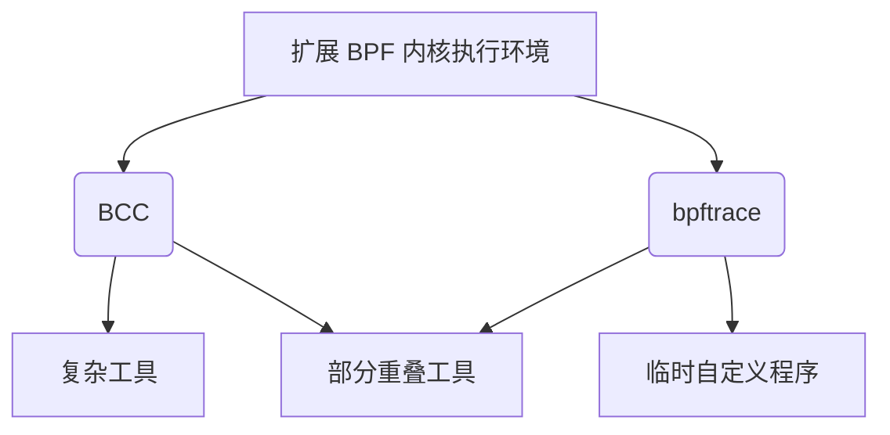
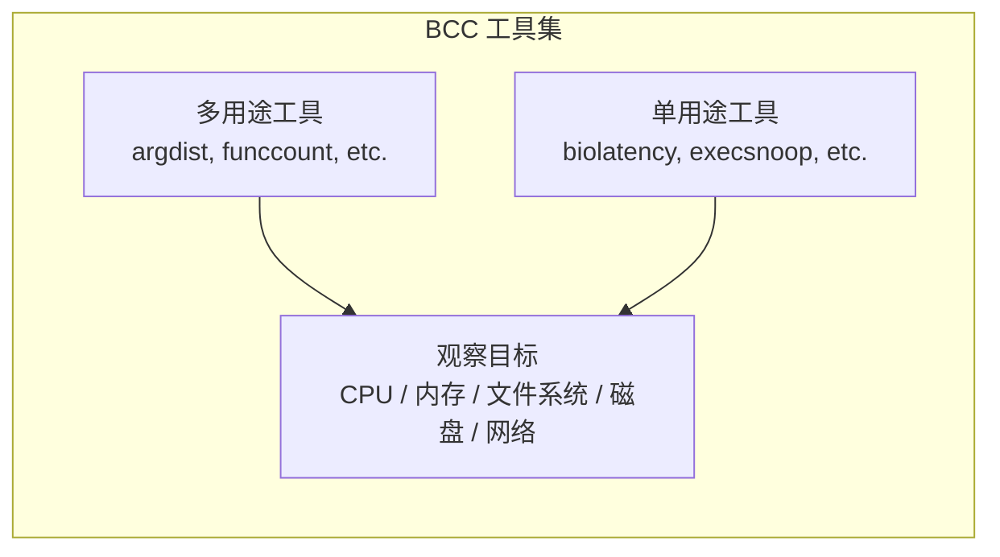

# 第15章 BPF

本章介绍扩展 BPF 的 [[BCC]] 和 [[bpftrace]] 追踪前端。这些前端提供了丰富的性能分析工具集，我们在之前的章节中也使用过这些工具。[[BPF]] 技术在第3章“操作系统”的 3.4.4 节“扩展 BPF”中已经介绍过。简而言之，扩展 BPF 是一个内核执行环境，可以为追踪器（tracers）提供可编程能力。

本章与第13章 [[perf]] 以及第14章 [[Ftrace]]，是为希望更详细了解一种或多种系统追踪器的读者提供的选读内容。

扩展 BPF 工具可用于回答如下问题：

- 磁盘 I/O 的延迟是多少（以直方图形式展示）？
- CPU 调度器延迟是否高到足以引发问题？
- 应用程序是否正在遭受文件系统延迟？
- 正在发生哪些 TCP 会话，持续时间为多久？
- 哪些代码路径在阻塞，阻塞了多长时间？

BPF 与其他追踪器的不同之处在于它是可编程的。它允许在事件发生时执行用户自定义的程序，这些程序可以执行过滤、保存和检索信息、计算延迟、执行内核内聚合和自定义摘要等操作。虽然其他追踪器可能需要将所有事件转储到用户空间并进行后处理，但 BPF 允许此类处理在内核上下文中高效完成。这使得创建原本对生产环境来说开销过大的性能工具变得切实可行。

本章为每个推荐的前端设有一个主要小节。关键小节包括：

- 15.1: [[BCC]]
  - 15.1.1: 安装
  - 15.1.2: 工具覆盖范围
  - 15.1.3: 单用途工具
  - 15.1.4: 多用途工具
  - 15.1.5: 单行命令
- 15.2: [[bpftrace]]
  - 15.2.1: 安装
  - 15.2.2: 工具
  - 15.2.3: 单行命令
  - 15.2.4: 编程
  - 15.2.5: 参考

从前几章的使用中，BCC 和 bpftrace 之间的区别可能已经很直观了：BCC 适合复杂的工具，而 bpftrace 适合临时自定义程序。有些工具在两者中都有实现，如图 15.1 所示。

> [!INFO] 图 15.1 BPF 追踪前端
> （展示了 BCC 和 bpftrace 之间的关系，两者部分工具存在交集，并共同构建于扩展 BPF 之上）



BCC 和 bpftrace 之间的具体差异总结在表 15.1 中。

**表 15.1 BCC 与 bpftrace 对比**

| 特性 | BCC | bpftrace |
| :--- | :--- | :--- |
| 仓库中的工具数量 | >80 (bcc)<br>>30 (bpftrace)<br>>120 (bpf-perf-tools-book) | >80 (bcc)<br>>30 (bpftrace)<br>>120 (bpf-perf-tools-book) |
| 工具用法 | 通常支持复杂的选项（-h, -P PID 等）和参数 | 通常很简单：无选项，零或一个参数 |
| 工具文档 | Man 手册，示例文件 | Man 手册，示例文件 |
| 编程语言 | 用户空间：Python, Lua, C 或 C++<br>内核空间：C | bpftrace |
| 编程难度 | 困难 | 简单 |
| 每事件输出类型 | 任何内容 | 文本，JSON |
| 汇总类型 | 任何内容 | 计数、最小值、最大值、总和、平均值、log2 直方图、线性直方图；按零个或多个键分组 |
| 库支持 | 是（例如 Python import） | 否 |
| 平均程序长度¹（不含注释） | 228 行 | 28 行 |

> [!NOTE] ¹ 译注
> 基于官方仓库和我（作者）的 BPF 书籍仓库中提供的工具计算。

BCC 和 bpftrace 都在包括 Facebook 和 Netflix 在内的许多公司中使用。Netflix 在所有云实例上默认安装它们，并在云级监控和仪表盘之后，使用它们进行更深入的分析，具体如下 [Gregg 18e]：

- **BCC**：在命令行中使用现成的工具，根据需要分析存储 I/O、网络 I/O 和进程执行。某些 BCC 工具由图形性能仪表盘系统自动执行，为调度器和磁盘 I/O 延迟热力图、脱离 CPU 火焰图等提供数据。此外，一个自定义的 BCC 工具始终作为守护进程运行（基于 `tcplife(8)`），将网络事件记录到云存储中以进行流分析。
- **bpftrace**：在需要理解内核和应用程序病理时，开发自定义的 bpftrace 工具。

以下各节将解释 BCC 工具、bpftrace 工具和 bpftrace 编程。

---

## 15.1 BCC

BPF 编译器集合（BPF Compiler Collection，或根据项目和包名称简称为“bcc”）是一个开源项目，包含大量高级性能分析工具，以及用于构建这些工具的框架。BCC 由 Brenden Blanco 创建；我协助了它的开发并创建了许多追踪工具。

作为 BCC 工具的一个示例，`biolatency(8)` 以2的幂次直方图形式显示磁盘 I/O 延迟的分布，并可以按 I/O 标志进行细分：

```bash
# biolatency.py -mF
Tracing block device I/O... Hit Ctrl-C to end.
^C
flags = Priority-Metadata-Read
     msecs               : count     distribution
         0 -> 1          : 90       |****************************************|

flags = Write
     msecs               : count     distribution
         0 -> 1          : 24       |****************************************|
         2 -> 3          : 0        |                                        |
         4 -> 7          : 8        |*************                           |

flags = ReadAhead-Read
     msecs               : count     distribution
         0 -> 1          : 3031     |****************************************|
         2 -> 3          : 10       |                                        |
         4 -> 7          : 5        |                                        |
         8 -> 15         : 3        |                                        |
```

此输出显示了一个双峰写入分布，以及许多带有“ReadAhead-Read”标志的 I/O。该工具使用 BPF 在内核空间中汇总直方图以提高效率，因此用户空间组件只需读取已经汇总的直方图（count 列）并打印即可。

这些 BCC 工具通常在 BCC 仓库中包含使用信息（`-h`）、man 手册和示例文件：
<https://github.com/iovisor/bcc>

本节总结了 BCC 及其单用途和多用途性能分析工具。

### 15.1.1 安装

许多 Linux 发行版都提供了 BCC 的软件包，包括 Ubuntu、Debian、RHEL、Fedora 和 Amazon Linux，这使得安装非常简单。您可以搜索“bcc-tools”或“bpfcc-tools”或“bcc”（包维护者为其命名各不相同）。

您也可以从源代码构建 BCC。有关最新的安装和构建说明，请查看 BCC 仓库中的 INSTALL.md [Iovisor 20b]。INSTALL.md 还列出了内核配置要求（包括 `CONFIG_BPF=y`、`CONFIG_BPF_SYSCALL=y`、`CONFIG_BPF_EVENTS=y`）。BCC 至少需要 Linux 4.4 才能使某些工具工作；对于大多数工具，需要 4.9 或更高版本。

### 15.1.2 工具覆盖范围

BCC 追踪工具如图 15.2 所示（部分使用通配符分组：例如，`java*` 表示所有以“java”开头的工具）。

> [!INFO] 图 15.2 BCC 工具
> （展示了各类 BCC 性能分析工具及其观察的目标子系统，如 CPU、内存、文件系统、磁盘 I/O、网络等。左侧列出多用途工具，右侧列出单用途工具）



许多是单用途工具，用单箭头显示；一些是多用途工具，列在左侧，用双箭头显示其覆盖范围。

### 15.1.3 单用途工具

我根据第14章 perf-tools 中“只做一件事并做好”的相同理念开发了其中许多工具。这种设计包括使其默认输出简洁且通常刚好够用。您可以“直接运行 `biolatency`”而无需学习任何命令行选项，通常就能获得刚好足以解决问题而不会杂乱的输出。通常也存在用于自定义的选项，例如前面展示的 `biolatency(8)` 的 `-F` 选项，用于按 I/O 标志细分。

选定的单用途工具描述在表 15.2 中，包括它们在本书中的位置（如果存在）。完整列表请参见 BCC 仓库 [Iovisor 20a]。

**表 15.2 选定的单用途 BCC 工具**

| 工具 | 描述 | 章节 |
| :--- | :--- | :--- |
| `biolatency(8)` | 以直方图形式汇总块 I/O（磁盘 I/O）延迟 | 9.6.6 |
| `biotop(8)` | 按进程汇总块 I/O | 9.6.8 |
| `biosnoop(8)` | 追踪块 I/O 及其延迟和其他细节 | 9.6.7 |
| `bitesize(8)` | 以进程直方图汇总块 I/O 大小 | - |
| `btrfsdist(8)` | 以直方图汇总 btrfs 操作延迟 | 8.6.13 |
| `btrfsslower(8)` | 追踪慢速 btrfs 操作 | 8.6.14 |
| `cpudist(8)` | 以直方图形式汇总每个进程的 CPU 上和脱离 CPU 时间 | 6.6.15, 16.1.7 |
| `cpuunclaimed(8)` | 显示尽管有需求但未被认领且空闲的 CPU | - |
| `criticalstat(8)` | 追踪长原子关键内核区段 | - |
| `dbslower(8)` | 追踪数据库慢查询 | - |
| `dbstat(8)` | 以直方图形式汇总数据库查询延迟 | - |
| `drsnoop(8)` | 追踪直接内存回收事件，包含 PID 和延迟 | 7.5.11 |
| `execsnoop(8)` | 通过 `execve(2)` 系统调用追踪新进程 | 1.7.3, 5.5.5 |
| `ext4dist(8)` | 以直方图汇总 ext4 操作延迟 | 8.6.13 |
| `ext4slower(8)` | 追踪慢速 ext4 操作 | 8.6.14 |
| `filelife(8)` | 追踪短生命周期文件的寿命 | - |
| `gethostlatency(8)` | 通过解析器函数追踪 DNS 延迟 | - |
| `hardinqs(8)` | 汇总硬中断事件时间 | 6.6.19 |
| `killsnoop(8)` | 追踪由 `kill(2)` 系统调用发出的信号 | - |
| `klockstat(8)` | 汇总内核互斥锁统计信息 | - |
| `llcstat(8)` | 按进程汇总 CPU 缓存引用和未命中 | - |
| `memleak(8)` | 显示未完成的内存分配 | - |
| `mysqld_qslower(8)` | 追踪 MySQL 慢查询 | - |
| `nfsdist(8)` | 追踪慢速 NFS 操作 | 8.6.13 |
| `nfsslower(8)` | 以直方图汇总 NFS 操作延迟 | 8.6.14 |
| `offcputime(8)` | 按栈踪迹汇总脱离 CPU 时间 | 5.5.3 |
| `offwaketime(8)` | 按脱离 CPU 栈和唤醒者栈汇总阻塞时间 | - |
| `oomkill(8)` | 追踪内存不足（OOM）杀手 | - |
| `opensnoop(8)` | 追踪 `open(2)` 系列系统调用 | 8.6.10 |
| `profile(8)` | 使用栈踪迹定时采样分析 CPU 使用情况 | 5.5.2 |
| `runqlat(8)` | 以直方图形式汇总运行队列（调度器）延迟 | 6.6.16 |
| `runqlen(8)` | 使用定时采样汇总运行队列长度 | 6.6.17 |
| `runqslower(8)` | 追踪长运行队列延迟 | - |
| `syncsnoop(8)` | 追踪 `sync(2)` 系列系统调用 | - |
| `syscount(8)` | 汇总系统调用计数和延迟 | 5.5.6 |
| `tcplife(8)` | 追踪 TCP 会话并汇总其生命周期 | 10.6.9 |
| `tcpretrans(8)` | 追踪 TCP 重传，包含内核状态等细节 | 10.6.11 |
| `tcptop(8)` | 按主机和 PID 汇总 TCP 发送/接收吞吐量 | 10.6.10 |
| `wakeuptime(8)` | 按唤醒者栈汇总休眠到唤醒的时间 | - |
| `xfsdist(8)` | 以直方图汇总 xfs 操作延迟 | 8.6.13 |
| `xfsslower(8)` | 追踪慢速 xfs 操作 | 8.6.14 |
| `zfsdist(8)` | 以直方图汇总 zfs 操作延迟 | 8.6.13 |
| `zfsslower(8)` | 追踪慢速 zfs 操作 | 8.6.14 |

有关这些工具的示例，请参见前面的章节以及 BCC 仓库中的 `*_example.txt` 文件（其中许多也是我编写的）。对于本书未涵盖的工具，另请参见 [Gregg 19]。

### 15.1.4 多用途工具

多用途工具列在图 15.2 的左侧。它们支持多种事件源并能扮演多种角色，类似于 `perf(1)`，但这也使得它们使用起来较为复杂。它们的描述见表 15.3。

**表 15.3 多用途性能工具**

| 工具 | 描述 | 章节 |
| :--- | :--- | :--- |
| `argdist(8)` | 以直方图或计数形式显示函数参数值 | 15.1.15 |
| `funccount(8)` | 计算内核或用户级函数调用次数 | 15.1.15 |
| `funcslower(8)` | 追踪慢速内核或用户级函数调用 | - |
| `funclatency(8)` | 以直方图形式汇总函数延迟 | - |
| `stackcount(8)` | 计算导致事件的栈踪迹数量 | 15.1.15 |
| `trace(8)` | 使用过滤器追踪任意函数 | 15.1.15 |

为了帮助您记住有用的调用方式，您可以收集单行命令。我在下一节中提供了一些，类似于我为 `perf(1)` 和 `trace-cmd` 提供的单行命令节。

### 15.1.5 单行命令

除非另有说明，以下单行命令将追踪全系统范围，直到键入 `Ctrl-C` 为止。它们按工具分组。

#### funccount(8)

计算 VFS 内核调用：
```bash
funcgraph 'vfs_*'
```

计算 TCP 内核调用：
```bash
funccount 'tcp_*'
```

# 第15章 BPF

统计每秒的 TCP 发送调用次数：
```bash
funccount -i 1 'tcp_send*'
```
显示每秒块 I/O 事件的发生速率：
```bash
funccount -i 1 't:block:*'
```
显示每秒 libc `getaddrinfo()`（名称解析）的调用速率：
```bash
funccount -i 1 c:getaddrinfo
```

### stackcount(8)

统计产生块 I/O 的栈跟踪：
```bash
stackcount t:block:block_rq_insert
```
统计导致发送 IP 数据包的栈跟踪，并显示负责的 PID：
```bash
stackcount -P ip_output
```
统计导致线程阻塞并离开 CPU 的栈跟踪：
```bash
stackcount t:sched:sched_switch
```

### trace(8)

跟踪内核 `do_sys_open()` 函数并打印文件名：
```bash
trace 'do_sys_open "%s", arg2'
```
跟踪内核函数 `do_sys_open()` 的返回并打印返回值：
```bash
trace 'r::do_sys_open "ret: %d", retval'
```
跟踪内核函数 `do_nanosleep()` 并打印模式和用户级栈：
```bash
trace -U 'do_nanosleep "mode: %d", arg2'
```
通过 pam 库跟踪认证请求：
```bash
trace 'pam:pam_start "%s: %s", arg1, arg2'
```

### argdist(8)

按返回值（大小或错误）汇总 VFS 读取：
```bash
argdist -H 'r::vfs_read()'
```
按返回值（大小或错误）汇总 PID 1005 的 libc `read()`：
```bash
argdist -p 1005 -H 'r:c:read()'
```

> [!NOTE] 页码延续标记
> 15.1 BCC 
> 759

按系统调用 ID 统计系统调用次数：
```bash
argdist.py -C 't:raw_syscalls:sys_enter():int:args->id'
```
使用计数汇总内核函数 `tcp_sendmsg()` 的 size 参数：
```bash
argdist -C 'p::tcp_sendmsg(struct sock *sk, struct msghdr *msg, size_t size):u32:size'
```
以 2 的幂次直方图汇总 `tcp_sendmsg()` 的 size：
```bash
argdist -H 'p::tcp_sendmsg(struct sock *sk, struct msghdr *msg, size_t size):u32:size'
```
按文件描述符统计 PID 181 的 libc `write()` 调用：
```bash
argdist -p 181 -C 'p:c:write(int fd):int:fd'
```
按进程汇总延迟 >100 μs 的读取操作：
```bash
argdist -C 'r::__vfs_read():u32:$PID:$latency > 100000
```

## 15.1.6 多工具示例

作为使用多工具的示例，以下展示了 `trace(8)` 工具跟踪内核函数 `do_sys_open()`，并将第二个参数作为字符串打印出来：

```bash
# trace 'do_sys_open "%s", arg2'
PID     TID     COMM        FUNC             -
28887   28887   ls          do_sys_open      /etc/ld.so.cache
28887   28887   ls          do_sys_open      /lib/x86_64-linux-gnu/libselinux.so.1
28887   28887   ls          do_sys_open      /lib/x86_64-linux-gnu/libc.so.6
28887   28887   ls          do_sys_open      /lib/x86_64-linux-gnu/libpcre2-8.so.0
28887   28887   ls          do_sys_open      /lib/x86_64-linux-gnu/libdl.so.2
28887   28887   ls          do_sys_open      /lib/x86_64-linux-gnu/libpthread.so.0
28887   28887   ls          do_sys_open      /proc/filesystems
28887   28887   ls          do_sys_open      /usr/lib/locale/locale-archive
[...]
```

`trace` 语法受 `printf(3)` 启发，支持格式字符串和参数。在此例中，`arg2`（第二个参数）因为包含文件名，所以被作为字符串打印出来。

`trace(8)` 和 `argdist(8)` 都支持允许创建许多自定义单行命令的语法。接下来将介绍的 [[bpftrace]] 则更进一步，提供了一种成熟完备的语言，用于编写单行或多行程序。

> [!NOTE] 页码延续标记
> 760 
> 第15章 BPF

## 15.1.7 BCC 与 bpftrace 的对比

这些差异在本章开头已经总结过了。[[BCC]] 适合于自定义和复杂的工具，这些工具支持各种参数，或使用各种库。[[bpftrace]] 则非常适合单行命令或短小工具，这些工具不接受参数，或只接受单个整数参数。

BCC 允许作为跟踪工具核心的 BPF 程序用 C 语言开发，从而实现完全控制。这是以复杂性为代价的：开发 BCC 工具所需的时间可能是 bpftrace 工具的十倍，代码行数也可能是其十倍。由于开发一个工具通常需要多次迭代，我发现先在 bpftrace 中开发工具（这更快捷），然后在需要时再将它们移植到 BCC 中，可以节省时间。

BCC 和 bpftrace 之间的区别就像 C 语言编程和 shell 脚本编程之间的区别一样，其中 BCC 就像 C 语言编程（部分确实是 C 语言编程），而 bpftrace 就像 shell 脚本编程。在我的日常工作中，我使用许多预构建的 C 程序（`top(1)`、`vmstat(1)` 等），并开发自定义的一次性 shell 脚本。同样，我也使用许多预构建的 BCC 工具，并开发自定义的一次性 bpftrace 工具。

我在本书中提供的材料支持这种用法：许多章节展示了您可以使用的 BCC 工具，而本章后面的部分展示了如何开发自定义的 bpftrace 工具。

## 15.1.8 文档

工具通常会有一个用法消息来总结其语法。例如：

```bash
# funccount -h
usage: funccount [-h] [-p PID] [-i INTERVAL] [-d DURATION] [-T] [-r] [-D]
                 pattern
Count functions, tracepoints, and USDT probes
positional arguments:
  pattern               search expression for events
optional arguments:
  -h, --help            show this help message and exit
  -p PID, --pid PID     trace this PID only
  -i INTERVAL, --interval INTERVAL
                        summary interval, seconds
  -d DURATION, --duration DURATION
                        total duration of trace, seconds
  -T, --timestamp       include timestamp on output
  -r, --regexp          use regular expressions. Default is "*" wildcards
                        only.
  -D, --debug           print BPF program before starting (for debugging
                        purposes)
```

> [!NOTE] 页码延续标记
> 15.2 bpftrace 
> 761

示例：
```bash
    ./funccount 'vfs_*'             # count kernel fns starting with "vfs"
    ./funccount -r '^vfs.*'         # same as above, using regular expressions
    ./funccount -Ti 5 'vfs_*'       # output every 5 seconds, with timestamps
    ./funccount -d 10 'vfs_*'       # trace for 10 seconds only
    ./funccount -p 185 'vfs_*'      # count vfs calls for PID 181 only
    ./funccount t:sched:sched_fork  # count calls to the sched_fork tracepoint
    ./funccount -p 185 u:node:gc*   # count all GC USDT probes in node, PID 185
    ./funccount c:malloc            # count all malloc() calls in libc
    ./funccount go:os.*             # count all "os.*" calls in libgo
    ./funccount -p 185 go:os.*      # count all "os.*" calls in libgo, PID 185
    ./funccount ./test:read*        # count "read*" calls in the ./test binary
```

每个工具在 bcc 仓库中也有一个 man 帮助页（`man/man8/funccount.8`）和一个示例文件（`examples/funccount_example.txt`）。示例文件包含带有注释的输出示例。

我还在 BCC 仓库中创建了以下文档 [Iovisor 20b]：

- **最终用户教程**：`docs/tutorial.md`
- **BCC 开发者教程**：`docs/tutorial_bcc_python_developer.md`
- **参考指南**：`docs/reference_guide.md`

我之前的书的第 4 章重点介绍了 BCC [Gregg 19]。

---

# 15.2 bpftrace

[[bpftrace]] 是一个基于 BPF 和 BCC 构建的开源跟踪器，它不仅提供了一套性能分析工具，还提供了一种高级语言来帮助您开发新的工具。该语言被设计得简单易学。它是跟踪领域的 `awk(1)`，并且是基于 `awk(1)` 设计的。在 `awk(1)` 中，您编写一个程序段来处理输入行，而在 bpftrace 中，您编写一个程序段来处理输入事件。bpftrace 由 Alastair Robertson 创建，我已成为其主要贡献者之一。

作为 bpftrace 的示例，以下单行命令按进程名称显示了 TCP 接收消息大小的分布：

```bash
# bpftrace -e 'kr:tcp_recvmsg /retval >= 0/ { @recv_bytes[comm] = hist(retval); }'
Attaching 1 probe...
^C

@recv_bytes[sshd]: 
[32, 64)               7 |@@@@@@@@@@@@@@@@@@@@@@@@@@@@@@@@@@@@@@@@@@@@@@@@@@@@|
[64, 128)              2 |@@@@@@@@@@@@@@                                      |

@recv_bytes[nodejs]: 
[0]                   82 |@@@@@@@@@@@@@@@@@@@@@@@@@@                          |
[1]                  135 |@@@@@@@@@@@@@@@@@@@@@@@@@@@@@@@@@@@@@@@@@@@@        |
[2, 4)               153 |@@@@@@@@@@@@@@@@@@@@@@@@@@@@@@@@@@@@@@@@@@@@@@@@@@  |
[4, 8)                12 |@@@                                                 |
[8, 16)                6 |@                                                   |
[16, 32)              32 |@@@@@@@@@@                                          |
[32, 64)             158 |@@@@@@@@@@@@@@@@@@@@@@@@@@@@@@@@@@@@@@@@@@@@@@@@@@@@|
[64, 128)            155 |@@@@@@@@@@@@@@@@@@@@@@@@@@@@@@@@@@@@@@@@@@@@@@@@@@@ |
[128, 256)            14 |@@@@                                                |
```

> [!NOTE] 页码延续标记
> 762 
> 第15章 BPF

此输出显示了具有双峰接收大小的 nodejs 进程，其中一个峰值大致在 0 到 4 字节之间，另一个峰值在 32 到 128 字节之间。

使用简洁的语法，这条 bpftrace 单行命令使用了 kretprobe 来插桩 `tcp_recvmsg()`，过滤了返回值为正的情况（以排除负的错误代码），并填充了一个名为 `@recv_bytes` 的 [[BPF maps|BPF map]] 对象，其中包含返回值的直方图，并使用进程名（`comm`）作为键进行保存。当键入 Ctrl-C 且 bpftrace 接收到信号（`SIGINT`）时，它会结束并自动打印出 BPF maps。此语法将在以下各节中更详细地解释。

除了让您编写自己的单行命令外，bpftrace 在其仓库中还附带了许多随时可用的工具：
[https://github.com/iovisor/bpftrace](https://github.com/iovisor/bpftrace)

本节总结了 bpftrace 工具和 bpftrace 编程语言。这基于我在 [Gregg 19] 中的 bpftrace 材料，该书更深入地探讨了 bpftrace。

## 15.2.1 安装

许多 Linux 发行版（包括 Ubuntu）都提供了 bpftrace 软件包，使得安装变得非常简单。搜索名为 “bpftrace” 的软件包；它们适用于 Ubuntu、Fedora、Gentoo、Debian、OpenSUSE 和 CentOS。RHEL 8.2 将 bpftrace 作为技术预览版提供。

除了软件包之外，还有 bpftrace 的 Docker 镜像、除了 glibc 之外不需要任何其他依赖的 bpftrace 二进制文件，以及从源代码构建 bpftrace 的说明。有关这些选项的文档，请参阅 bpftrace 仓库中的 `INSTALL.md` [Iovisor 20a]，其中还列出了内核要求（包括 `CONFIG_BPF=y`、`CONFIG_BPF_SYSCALL=y`、`CONFIG_BPF_EVENTS=y`）。bpftrace 需要 Linux 4.9 或更高版本。

## 15.2.2 工具

bpftrace 跟踪工具如图 15.3 所示。

bpftrace 仓库中的工具以黑色显示。对于我之前的书，我开发了更多的 bpftrace 工具，并在 bpf-perf-tools-book 仓库中以开源形式发布：它们以红/灰色显示 [Gregg 19g]。

> [!NOTE] 页码延续标记
> 15.2 bpftrace 
> 763

*图 15.3 bpftrace 工具*

```mermaid
graph TD
    subgraph bpftrace_tools[bpftrace 工具列表]
        direction LR
        A[bpftrace 仓库自带工具 <br> (黑色显示)] --> B[开源扩展工具 <br> bpf-perf-tools-book <br> (红/灰色显示)]
    end
```

## 15.2.3 单行命令

以下单行命令在全系统范围内进行跟踪，直到键入 Ctrl-C 为止，除非另有说明。除了其内在的实用性外，它们还可以作为 bpftrace 编程语言的微型示例。这些按目标分组。更长的 bpftrace 单行命令列表可以在每个资源章节中找到。

### CPU

跟踪带参数的新进程：
```bash
bpftrace -e 'tracepoint:syscalls:sys_enter_execve { join(args->argv); }'
```
按进程统计系统调用：
```bash
bpftrace -e 'tracepoint:raw_syscalls:sys_enter { @[pid, comm] = count(); }'
```
以 49 赫兹采样 PID 189 的用户级栈：
```bash
bpftrace -e 'profile:hz:49 /pid == 189/ { @[ustack] = count(); }'
```

### 内存

按代码路径统计进程堆扩展（`brk()`）：
```bash
bpftrace -e tracepoint:syscalls:sys_enter_brk { @[ustack, comm] = count(); }
```

> [!NOTE] 页码延续标记
> 764

# 第15章 BPF

按用户级栈轨迹统计用户缺页异常：
```bash
bpftrace -e 'tracepoint:exceptions:page_fault_user { @[ustack, comm] = count(); }'
```
按 [[tracepoint]] 统计 vmscan 操作：
```bash
bpftrace -e 'tracepoint:vmscan:* { @[probe]++; }'
```

### 文件系统

追踪通过 `openat(2)` 打开的文件并显示进程名：
```bash
bpftrace -e 't:syscalls:sys_enter_openat { printf("%s %s\n", comm, str(args->filename)); }'
```
显示 `read()` 系统调用读取字节数（及错误）的分布：
```bash
bpftrace -e 'tracepoint:syscalls:sys_exit_read { @ = hist(args->ret); }'
```
统计 [[VFS]] 调用：
```bash
bpftrace -e 'kprobe:vfs_* { @[probe] = count(); }'
```
统计 ext4 [[tracepoint]] 调用：
```bash
bpftrace -e 'tracepoint:ext4:* { @[probe] = count(); }'
```

### 磁盘

以直方图形式汇总块 I/O 大小：
```bash
bpftrace -e 't:block:block_rq_issue { @bytes = hist(args->bytes); }'
```
统计块 I/O 请求的用户栈轨迹：
```bash
bpftrace -e 't:block:block_rq_issue { @[ustack] = count(); }'
```
统计块 I/O 类型标志：
```bash
bpftrace -e 't:block:block_rq_issue { @[args->rwbs] = count(); }'
```

### 网络

按 PID 和进程名统计 socket `accept(2)` 调用：
```bash
bpftrace -e 't:syscalls:sys_enter_accept* { @[pid, comm] = count(); }'
```
按占用 CPU 的 PID 和进程名统计 socket 发送/接收字节数：
```bash
bpftrace -e 'kr:sock_sendmsg,kr:sock_recvmsg /retval > 0/ { @[pid, comm] = sum(retval); }'
```

> [!NOTE] 页码标记
> 765

以直方图形式显示 TCP 发送字节数：
```bash
bpftrace -e 'k:tcp_sendmsg { @send_bytes = hist(arg2); }'
```
以直方图形式显示 TCP 接收字节数：
```bash
bpftrace -e 'kr:tcp_recvmsg /retval >= 0/ { @recv_bytes = hist(retval); }'
```
以直方图形式显示 UDP 发送字节数：
```bash
bpftrace -e 'k:udp_sendmsg { @send_bytes = hist(arg2); }'
```

### 应用程序

按用户栈轨迹汇总 `malloc()` 请求字节数（开销较高）：
```bash
bpftrace -e 'u:/lib/x86_64-linux-gnu/libc-2.27.so:malloc { @[ustack(5)] = sum(arg0); }'
```
追踪 `kill()` 信号，显示发送者进程名、目标 PID 和信号编号：
```bash
bpftrace -e 't:syscalls:sys_enter_kill { printf("%s -> PID %d SIG %d\n", comm, args->pid, args->sig); }'
```

### 内核

按系统调用函数统计系统调用：
```bash
bpftrace -e 'tracepoint:raw_syscalls:sys_enter { @[ksym(*(kaddr("sys_call_table") + args->id * 8))] = count(); }'
```
统计以 “attach” 开头的内核函数调用：
```bash
bpftrace -e 'kprobe:attach* { @[probe] = count(); }'
```
频率统计 `vfs_write()` 的第三个参数（大小）：
```bash
bpftrace -e 'kprobe:vfs_write { @[arg2] = count(); }'
```
计算内核函数 `vfs_read()` 的耗时并以直方图汇总：
```bash
bpftrace -e 'k:vfs_read { @ts[tid] = nsecs; } kr:vfs_read /@ts[tid]/ { @ = hist(nsecs - @ts[tid]); delete(@ts[tid]); }'
```
统计上下文切换栈轨迹：
```bash
bpftrace -e 't:sched:sched_switch { @[kstack, ustack, comm] = count(); }'
```
以 99 赫兹对内核级栈进行采样，排除空闲状态：
```bash
bpftrace -e 'profile:hz:99 /pid/ { @[kstack] = count(); }'
```

> [!NOTE] 页码标记
> 766

## 15.2.4 编程

本节提供了使用 [[bpftrace]] 及其编程语言的简短指南。本节的格式受到了 awk 原始论文 [Aho 78][Aho 88] 的启发，该论文仅用六页就涵盖了那种语言。[[bpftrace]] 语言本身受到了 awk 和 C 的启发，同时也受到了包括 [[DTrace]] 和 [[SystemTap]] 在内的追踪器的启发。

以下是一个 bpftrace 编程示例：它测量 `vfs_read()` 内核函数中的耗时，并以微秒为单位将时间打印为直方图。

```bash
#!/usr/local/bin/bpftrace
// this program times vfs_read()
kprobe:vfs_read
{
        @start[tid] = nsecs;
}
kretprobe:vfs_read
/@start[tid]/
{
        $duration_us = (nsecs - @start[tid]) / 1000;
        @us = hist($duration_us);
        delete(@start[tid]);
}
```

以下各节解释了此工具的组成部分，可作为教程使用。第 15.2.5 节“参考”是一份参考指南摘要，包括探针类型、测试、运算符、变量、函数和映射类型。

### 1. 用法

命令
```bash
bpftrace -e program
```
将执行该程序，并对它定义的任何事件进行插桩。程序将一直运行，直到按下 Ctrl-C，或者直到它显式调用 `exit()`。作为 `-e` 参数运行的 bpftrace 程序被称为单行程序。或者，程序可以保存到文件中并使用以下命令执行：
```bash
bpftrace file.bt
```
`.bt` 扩展名不是必需的，但有助于后续识别。通过在文件顶部放置解释器行^2^：
```bash
#!/usr/local/bin/bpftrace
```
该文件可以变为可执行文件（`chmod a+x file.bt`）并像任何其他程序一样运行：
```bash
./file.bt
```
bpftrace 必须由 root 用户（超级用户）执行。^3^ 对于某些环境，可以直接使用 root shell 执行程序，而其他环境可能倾向于通过 `sudo(1)` 运行特权命令：
```bash
sudo ./file.bt
```

> [!INFO] 脚注 2
> 有些人喜欢使用 `#!/usr/bin/env bpftrace`，这样就可以从 `$PATH` 中找到 bpftrace。然而，`env(1)` 存在各种问题，其在其他项目中的使用已被撤销。

> [!NOTE] 页码标记
> 767

### 2. 程序结构

一个 bpftrace 程序是一系列带有相关动作的探针：
```text
probes { actions }
probes { actions }
...
```
当探针触发时，相关的动作将被执行。动作之前可以包含一个可选的过滤表达式：
```text
probes /filter/ { actions }
```
仅当过滤表达式为真时，动作才会触发。这类似于 `awk(1)` 的程序结构：
```text
/pattern/ { actions }
```
`awk(1)` 编程也类似于 bpftrace 编程：可以定义多个动作块，它们可能以任何顺序执行，当它们的模式（即探针 + 过滤表达式）为真时触发。

### 3. 注释

对于 bpftrace 程序文件，可以使用 `//` 前缀添加单行注释：
```c
// this is a comment
```
这些注释不会被执行。多行注释使用与 C 语言相同的格式：
```c
/*
 * This is a
 * multi-line comment.
 */
```
此语法也可用于行内部分注释（例如，`/* comment */`）。

> [!INFO] 脚注 3
> bpftrace 当前检查 UID 是否为 0；未来的更新可能会检查特定的权限（capabilities）。

> [!NOTE] 页码标记
> 768

### 4. 探针格式

探针以探针类型名称开始，然后是冒号分隔的标识符层次结构：
```text
type:identifier1[:identifier2[...]] 
```
该层次结构由探针类型定义。考虑这两个例子：
```text
kprobe:vfs_read
uprobe:/bin/bash:readline
```
`kprobe` 探针类型对内核函数调用进行插桩，只需要一个标识符：内核函数名。`uprobe` 探针类型对用户级函数调用进行插桩，同时需要二进制文件的路径和函数名。

可以使用逗号分隔符指定多个探针，以执行相同的动作。例如：
```text
probe1,probe2,... { actions }
```
有两种特殊的探针类型不需要额外的标识符：`BEGIN` 和 `END` 在 bpftrace 程序的开始和结束时触发（就像 `awk(1)` 一样）。例如，要在追踪开始时打印一条提示信息：
```text
BEGIN { printf("Tracing. Hit Ctrl-C to end.\n"); }
```
要了解更多关于探针类型及其用法的信息，请参阅第 15.2.5 节“参考”中标题为“1. 探针类型”的部分。

### 5. 探针通配符

某些探针类型接受通配符。探针
```text
kprobe:vfs_*
```
将对所有以 “vfs_” 开头的 kprobe（内核函数）进行插桩。

插桩过多的探针可能会造成不必要的性能开销。为了避免意外发生这种情况，bpftrace 有一个可调的最大探针启用数量，通过 `BPFTRACE_MAX_PROBES` 环境变量设置（当前默认值为 512^4^）。

在使用通配符之前，可以通过运行 `bpftrace -l` 列出匹配的探针来测试它们：
```bash
# bpftrace -l 'kprobe:vfs_*'
kprobe:vfs_fallocate
kprobe:vfs_truncate
```

> [!INFO] 脚注 4
> 目前超过 512 个会使 bpftrace 的启动和关闭变慢，因为它是一个接一个地插桩它们的。未来的内核工作计划批量处理探针插桩。到那时，这个限制可以大大增加，甚至取消。

> [!NOTE] 页码标记
> 769

```text
kprobe:vfs_open
kprobe:vfs_setpos
kprobe:vfs_llseek
[…]
```
```bash
bpftrace -l 'kprobe:vfs_*' | wc -l
56
```
这里匹配了 56 个探针。探针名称放在引号中是为了防止意外的 shell 展开。

### 6. 过滤器

过滤器是布尔表达式，用于控制是否执行动作。过滤器
```text
/pid == 123/
```
仅当内置变量 `pid`（进程 ID）等于 123 时才执行动作。

如果未指定测试
```text
/pid/
```
过滤器将检查内容是否非零（`/pid/` 与 `/pid != 0/` 相同）。过滤器可以与布尔运算符结合使用，例如逻辑与（`&&`）。例如：
```text
/pid > 100 && pid < 1000/
```
这要求两个表达式的求值结果都为“真”。

### 7. 动作

动作可以是单个语句，也可以是用分号分隔的多个语句：
```text
{ action one; action two; action three }
```
最后一个语句也可以附加分号。这些语句是用类似于 C 语言的 bpftrace 语言编写的，可以操作变量并执行 bpftrace 函数调用。例如，动作
```text
{ $x = 42; printf("$x is %d", $x); }
```
将变量 `$x` 设置为 42，然后使用 `printf()` 打印它。有关其他可用函数调用的摘要，请参阅第 15.2.5 节“参考”中标题为“4. 函数”和“5. 映射函数”的部分。

> [!NOTE] 页码标记
> 770

### 8. Hello, World!

现在您应该能理解以下基本程序了，它会在 bpftrace 开始运行时打印 “Hello, World!”：
```bash
# bpftrace -e 'BEGIN { printf("Hello, World!\n"); }'
Attaching 1 probe...
Hello, World!
^C
```
作为文件，它的格式可以写为：
```bash
#!/usr/local/bin/bpftrace
BEGIN
{
        printf("Hello, World!\n");
}
```
将动作块跨越多行并缩进并不是必需的，但这可以提高可读性。

### 9. 函数

除了用于打印格式化输出的 `printf()` 之外，其他内置函数还包括：

- **`exit()`**：退出 bpftrace
- **`str(char *)`**：从指针返回字符串
- **`system(format[, arguments ...])`**：在 shell 中运行命令

动作
```text
printf("got: %llx %s\n", $x, str($x)); exit();
```
将以十六进制整数形式打印变量 `$x`，然后将其视为以 NULL 结尾的字符数组指针（`char *`）并作为字符串打印，最后退出。

### 10. 变量

变量共有三种类型：内置变量、临时变量和映射。

内置变量是预定义的，由 bpftrace 提供，通常是只读的信息源。它们包括表示进程 ID 的 `pid`，表示进程名的 `comm`，表示纳秒级时间戳的 `nsecs`，以及表示当前线程的 `task_struct` 地址的 `curtask`。

临时变量可用于临时计算，带有 `$` 前缀。它们的名称和类型在首次赋值时设定。语句：

```markdown
$x = 1;
$y = "hello";
$z = (struct task_struct *)curtask;
```

以上语句将 `$x` 声明为整数，将 `$y` 声明为字符串，并将 `$z` 声明为指向 `struct task_struct` 的指针。这些变量只能在赋值它们的动作块中使用。如果变量在没有赋值的情况下被引用，bpftrace 会打印错误（这有助于你捕获拼写错误）。

[[Map 变量|Map 变量]]使用 BPF map 存储对象，并带有前缀“@”。它们可用于全局存储，在动作之间传递数据。如下程序：

```
probe1 { @a = 1; }
probe2 { $x = @a; }
```

当 `probe1` 触发时将 1 赋给 `@a`，然后当 `probe2` 触发时将 `@a` 赋给 `$x`。如果 `probe1` 先触发，然后 `probe2` 触发，`$x` 将被设置为 1；否则为 0（未初始化）。

可以提供一个或多个元素作为键，将 map 用作哈希表（关联数组）。语句：

```
@start[tid] = nsecs;
```

这是经常使用的：将 `nsecs` 内置变量赋值给名为 `@start` 的 map，并以 `tid`（当前线程 ID）作为键。这允许线程存储自定义的时间戳，而不会被其他线程覆盖。

```
@path[pid, $fd] = str(arg0);
```

这是一个多键 map 的例子，它同时使用 `pid` 内置变量和 `$fd` 变量作为键。

### 11. Map 函数

Maps 可以被赋值为特殊的函数。这些函数以自定义的方式存储和打印数据。赋值语句：

```
@x = count();
```

计算事件发生的次数，打印时将打印该计数值。它使用每 CPU map，并且 `@x` 成为 `count` 类型的特殊对象。以下语句也计算事件：

```
@x++;
```

然而，这使用的是全局 CPU map，而不是每 CPU map，将 `@x` 作为整数提供。对于某些需要整数而不是 `count` 类型的程序，这种全局整数类型有时是必需的，但请记住，由于并发更新，可能存在较小的误差幅度。

赋值语句：

```
@y = sum($x);
```

对 `$x` 变量求和，打印时将打印总和。赋值语句：

```
@z = hist($x);
```

将 `$x` 存储在 2 的幂次直方图中，打印时将打印桶计数和 ASCII 直方图。

某些 map 函数直接对 map 进行操作。例如：

```
print(@x);
```

将打印 `@x` map。例如，这可以用于在间隔事件上打印 map 内容。这不常被使用，因为为了方便，当 bpftrace 终止时，所有的 map 都会自动打印。^5

某些 map 函数对 map 键进行操作。例如：

```
delete(@start[tid]);
```

从 `@start` map 中删除键为 `tid` 的键值对。

> [!NOTE] 脚注 5
> 在 bpftrace 终止时打印 map 的开销也更小，因为在运行时 map 正在经历更新，这会减慢 map 遍历例程的速度。

### 12. 计时 vfs_read()

你现在已经学习了理解一个更复杂、更实际的例子所需的语法。这个程序 `vfsread.bt`，对 `vfs_read` 内核函数进行计时，并打印出其以微秒为单位的持续时间直方图：

```bash
#!/usr/local/bin/bpftrace

// this program times vfs_read()
kprobe:vfs_read
{
        @start[tid] = nsecs;
}

kretprobe:vfs_read
/@start[tid]/
{
        $duration_us = (nsecs - @start[tid]) / 1000;
        @us = hist($duration_us);
        delete(@start[tid]);
}
```

这通过使用 `kprobe` 探测其开始并将时间戳存储在以线程 ID 为键的 `@start` 哈希中，然后使用 `kretprobe` 探测其结束并计算差值：现在 - 开始，来计时 `vfs_read()` 内核函数的持续时间。使用过滤器确保记录了开始时间；否则，对于在跟踪开始时已在进行中的 `vfs_read()` 调用，差值计算将变得无效，因为看到了结束但没看到开始（差值将变成：现在 - 0）。

示例输出：

```bash
# bpftrace vfsread.bt
Attaching 2 probes...
^C

@us:
[0]                   23 |@                                                   |
[1]                  138 |@@@@@@@@@                                           |
[2, 4)               538 |@@@@@@@@@@@@@@@@@@@@@@@@@@@@@@@@@@@@@               |
[4, 8)               744 |@@@@@@@@@@@@@@@@@@@@@@@@@@@@@@@@@@@@@@@@@@@@@@@@@@@@|
[8, 16)              641 |@@@@@@@@@@@@@@@@@@@@@@@@@@@@@@@@@@@@@@@@@@@@        |
[16, 32)             122 |@@@@@@@@                                            |
[32, 64)              13 |                                                    |
[64, 128)             17 |@                                                   |
[128, 256)             2 |                                                    |
[256, 512)             0 |                                                    |
[512, 1K)              1 |                                                    |
```

程序一直运行到输入 Ctrl-C；然后它打印此输出并终止。这个直方图 map 被命名为“us”，作为在输出中包含单位的一种方式，因为 map 名称会被打印出来。通过给 map 起有意义的名称，如“bytes”和“latency_ns”，你可以注释输出并使其不言自明。

这个脚本可以根据需要自定义。考虑将 `hist()` 赋值行更改为：

```
@us[pid, comm] = hist($duration_us);
```

这为每个进程 ID 和进程名称对存储一个直方图。使用传统的系统工具，如 `iostat(1)` 和 `vmstat(1)`，输出是固定的，不易自定义。但使用 bpftrace，你看到的指标可以进一步分解，并用来自其他探针的指标进行增强，直到你得到所需的答案。

有关按类型（文件系统、套接字等）细分 `vfs_read()` 延迟的扩展示例，请参见第 8 章 文件系统，第 8.6.15 节 bpftrace，标题 VFS 延迟跟踪。

---

## 15.2.5 参考

以下是 bpftrace 编程主要组件的摘要：探针类型、流程控制、变量、函数和 map 函数。

### 1. 探针类型

表 15.4 列出了可用的探针类型。其中许多还有快捷别名，有助于创建更短的单行命令。

**表 15.4 bpftrace 探针类型**

| 类型 | 快捷方式 | 描述 |
| :--- | :--- | :--- |
| `tracepoint` | `t` | 内核静态插桩点 |
| `usdt` | `U` | 用户级静态定义跟踪 |
| `kprobe` | `k` | 内核动态函数插桩 |
| `kretprobe` | `kr` | 内核动态函数返回插桩 |
| `kfunc` | `f` | 内核动态函数插桩（基于 BPF） |
| `kretfunc` | `fr` | 内核动态函数返回插桩（基于 BPF） |
| `uprobe` | `u` | 用户级动态函数插桩 |
| `uretprobe` | `ur` | 用户级动态函数返回插桩 |
| `software` | `s` | 基于内核软件的事件 |
| `hardware` | `h` | 基于硬件计数器的插桩 |
| `watchpoint` | `w` | 内存观察点插桩 |
| `profile` | `p` | 跨所有 CPU 的定时采样 |
| `interval` | `i` | 定时报告（来自一个 CPU） |
| `BEGIN` | | bpftrace 开始 |
| `END` | | bpftrace 结束 |

大多数探针类型是现有内核技术的接口。第 4 章解释了这些技术是如何工作的：kprobes、uprobes、tracepoints、USDT 和 PMCs（由硬件探针类型使用）。`kfunc`/`kretfunc` 探针类型是基于 eBPF trampolines 和 BTF 的新的低开销接口。

> [!WARNING] 性能开销
> 某些探针可能频繁触发，例如调度器事件、内存分配和网络数据包。为了减少开销，尽量通过尽可能使用频率较低的事件来解决你的问题。如果你不确定探针的频率，可以使用 bpftrace 来测量它。例如，仅统计一秒钟内 `vfs_read()` kprobe 的调用次数：
> ```bash
> # bpftrace -e 'k:vfs_read { @ = count(); } interval:s:1 { exit(); }'
> ```

我选择了一个短暂的持续时间来最小化开销成本，以防它很显著。我认为高或低频率取决于你的 CPU 速度、数量和剩余空间，以及探针插桩的成本。作为当今计算机的粗略指南，我认为每秒少于 10 万次 kprobe 或 tracepoint 事件属于低频率。

#### 探针参数

每种探针类型提供不同类型的参数，以提供有关事件的进一步上下文。例如，tracepoints 使用格式文件中的字段名在 `args` 数据结构中提供字段。例如，以下插桩 `syscalls:sys_enter_read` tracepoint，并使用 `args->count` 参数记录 `count` 参数（请求大小）的直方图：

```bash
bpftrace -e 'tracepoint:syscalls:sys_enter_read { @req_bytes = hist(args->count); }'
```

这些字段可以从 `/sys` 中的格式文件列出，或者使用 bpftrace 的 `-lv` 选项列出：

```bash
# bpftrace -lv 'tracepoint:syscalls:sys_enter_read'
tracepoint:syscalls:sys_enter_read
    int __syscall_nr;
    unsigned int fd;
    char * buf;
    size_t count;
```

有关每种探针类型及其参数的描述，请参见在线“bpftrace 参考指南” [Iovisor 20c]。

### 2. 流程控制

bpftrace 中有三种类型的测试：过滤器、三元运算符和 if 语句。这些测试基于布尔表达式有条件地改变程序的流程，支持表 15.5 中所示的表达式。

**表 15.5 bpftrace 布尔表达式**

| 表达式 | 描述 |
| :--- | :--- |
| `==` | 等于 |
| `!=` | 不等于 |
| `>` | 大于 |
| `<` | 小于 |
| `>=` | 大于或等于 |
| `<=` | 小于或等于 |
| `&&` | 与 |
| `\|\|` | 或 |

表达式可以使用括号进行分组。

#### 过滤器

前面介绍过，它们控制是否执行动作。格式：

```
probe /filter/ { action }
```

可以使用布尔运算符。过滤器 `/pid == 123/` 仅在 `pid` 内置变量等于 123 时执行动作。

#### 三元运算符

三元运算符是由一个测试和两个结果组成的三元运算符。格式：

```
test ? true_statement : false_statement
```

例如，你可以使用三元运算符来查找 `$x` 的绝对值：

```
$abs = $x >= 0 ? $x : - $x;
```

#### If 语句

If 语句具有以下语法：

```
if (test) { true_statements }
if (test) { true_statements } else { false_statements }
```

一个用例是在对 IPv4 和 IPv6 执行不同操作的程序中。例如（为简单起见，这忽略了 IPv4 和 IPv6 以外的族）：

```c
if ($inet_family == $AF_INET) {
    // IPv4
    ...
} else {
    // assume IPv6
    ...
}
```

`else if` 语句自 bpftrace v0.10.0 起受支持。^6

#### 循环

bpftrace 支持使用 `unroll()` 的展开循环。对于 Linux 5.3 及更高版本的内核，还支持 `while()` 循环 ^7：

> [!NOTE] 脚注
> ^6 感谢 Daniel Xu (PR#1211)。
> ^7 感谢 Bas Smit 添加了 bpftrace 逻辑 (PR#1066)。

```c
while (test) {
    statements
}
```

这使用了 Linux 5.3 中添加的内核 BPF 循环支持。

#### 运算符

前面的一节列出了用于测试的布尔运算符。bpftrace 还支持表 15.6 中所示的运算符。

**表 15.6 bpftrace 运算符**

| 运算符 | 描述 |
| :--- | :--- |
| `=` | 赋值 |
| `+`, `-`, `*`, `/` | 加、减、乘、除（仅限整数） |
| `++`, `--` | 自增、自减 |
| `&`, `\|`, `^` | 按位与、按位或、按位异或 |
| `!` | 逻辑非 |
| `<<`, `>>` | 逻辑左移、逻辑右移 |
| `+=`, `-=`, `*=`, `/=`, `%=`, `&=`, `^=`, `<<=`, `>>=` | 复合运算符 |

这些运算符是仿照 C 编程语言中的类似运算符建模的。

### 3. 变量

bpftrace 提供的内置变量通常用于只读访问信息。重要的内置变量列在表 15.7 中。

**表 15.7 bpftrace 部分内置变量**

| 内置变量 | 类型 | 描述 |
| :--- | :--- | :--- |
| `pid` | integer | 进程 ID（内核 tgid） |
| `tid` | integer | 线程 ID（内核 pid） |
| `uid` | integer | 用户 ID |
| `username` | string | 用户名 |
| `nsecs` | integer | 时间戳，以纳秒为单位 |
| `elapsed` | integer | 时间戳，以纳秒为单位，自 bpftrace 初始化以来 |
| `cpu` | integer | 处理器 ID |
```

# 第15章 BPF

### 内置变量（续）

| 内置变量 | 类型 | 描述 |
| :--- | :--- | :--- |
| comm | string | 进程名 |
| kstack | string | 内核栈回溯 |
| ustack | string | 用户级栈回溯 |
| arg0, ..., argN | integer | 某些探针类型的参数 |
| args | struct | 某些探针类型的参数 |
| sarg0, ..., sargN | integer | 某些探针类型的基于栈的参数 |
| retval | integer | 某些探针类型的返回值 |
| func | string | 被追踪函数的名称 |
| probe | string | 当前探针的全名 |
| curtask | struct/integer | 内核 task_struct（根据类型信息的可用性，表现为 task_struct 或无符号 64 位整数） |
| cgroup | integer | 当前进程的默认 cgroup v2 ID（用于与 cgroupid() 进行比较） |
| $1, ..., $N | int, char * | bpftrace 程序的位置参数 |

> [!NOTE] 整数类型说明
> 目前所有的整数均为 `uint64`。这些变量均指代探针触发时当前正在运行的线程、探针、函数和 CPU。

本章前面已经演示了各种内置变量：`retval`、`comm`、`tid` 和 `nsecs`。有关内置变量的完整和最新列表，请参阅在线的“bpftrace Reference Guide”[Iovisor 20c]。

---

## 4. 函数

表 15.8 列出了用于各种任务的部分内置函数。其中一些已在之前的示例中使用过，例如 `printf()`。

**表 15.8 bpftrace 部分内置函数**

| 函数 | 描述 |
| :--- | :--- |
| `printf(char *fmt [, ...])` | 打印格式化输出 |
| `time(char *fmt)` | 打印格式化时间 |
| `join(char *arr[])` | 打印字符串数组，以空格字符连接 |
| `str(char *s [, int len])` | 从指针 `s` 返回字符串，带有可选的长度限制 |
| `buf(void *d [, int length])` | 返回数据指针的十六进制字符串版本 |
| `strncmp(char *s1, char *s2, int length)` | 比较两个字符串最多到 `length` 个字符 |
| `sizeof(expression)` | 返回表达式或数据类型的大小 |
| `kstack([int limit])` | 返回深度最多为 `limit` 帧的内核栈 |
| `ustack([int limit])` | 返回深度最多为 `limit` 帧的用户栈 |
| `ksym(void *p)` | 解析内核地址并返回字符串符号 |
| `usym(void *p)` | 解析用户空间地址并返回字符串符号 |
| `kaddr(char *name)` | 将内核符号名解析为地址 |
| `uaddr(char *name)` | 将用户空间符号名解析为地址 |
| `reg(char *name)` | 返回存储在命名寄存器中的值 |
| `ntop([int af,] int addr)` | 返回 IPv4/IPv6 地址的字符串表示 |
| `cgroupid(char *path)` | 返回给定路径（/sys/fs/cgroup/...）的 cgroup ID |
| `system(char *fmt [, ...])` | 执行 shell 命令 |
| `cat(char *filename)` | 打印文件内容 |
| `signal(char[] sig \| u32 sig)` | 向当前任务发送信号（例如 SIGTERM） |
| `override(u64 rc)` | 覆盖 kprobe 返回值^8 |
| `exit()` | 退出 bpftrace |

> [!WARNING] 危险操作
> ^8 警告：只有在您清楚自己在做什么时才使用此功能：一个小错误就可能导致内核崩溃或损坏。

> [!INFO] 同步与异步
> 其中一些函数是异步的：内核将事件排队，并在稍后于用户空间进行处理。异步函数包括 `printf()`、`time()`、`cat()`、`join()` 和 `system()`。函数 `kstack()`、`ustack()`、`ksym()` 和 `usym()` 同步记录地址，但异步进行符号转换。

作为示例，以下同时使用了 `printf()` 和 `str()` 函数来显示 `openat(2)` 系统调用的文件名：

```bash
# bpftrace -e 't:syscalls:sys_enter_open { printf("%s %s\n", comm,
    str(args->filename)); }'
Attaching 1 probe...
top /etc/ld.so.cache
top /lib/x86_64-linux-gnu/libprocps.so.7
top /lib/x86_64-linux-gnu/libtinfo.so.6
top /lib/x86_64-linux-gnu/libc.so.6
[...]
```

有关函数的完整和最新列表，请参阅在线的“bpftrace Reference Guide”[Iovisor 20c]。

---

## 5. Map 函数

[[Maps]] 是来自 BPF 的特殊哈希表存储对象，可用于不同目的——例如，作为存储键/值对的哈希表或用于统计摘要。bpftrace 提供了用于映射赋值和操作的内置函数，主要用于支持统计摘要映射。最重要的映射函数列在表 15.9 中。

**表 15.9 bpftrace 部分映射函数**

| 函数 | 描述 |
| :--- | :--- |
| `count()` | 计数出现次数 |
| `sum(int n)` | 对值求和 |
| `avg(int n)` | 计算值的平均值 |
| `min(int n)` | 记录最小值 |
| `max(int n)` | 记录最大值 |
| `stats(int n)` | 返回计数、平均值和总和 |
| `hist(int n)` | 打印值的 2 的幂直方图 |
| `lhist(int n, const int min, const int max, int step)` | 打印值的线性直方图 |
| `delete(@m[key])` | 删除映射键/值对 |
| `print(@m [, top [, div]])` | 打印映射，带有可选的限制和除数 |
| `clear(@m)` | 删除映射中的所有键 |
| `zero(@m)` | 将所有映射值设置为零 |

> [!INFO] 异步操作提示
> 其中一些函数是异步的：内核将事件排队，并在稍后于用户空间进行处理。异步操作包括 `print()`、`clear()` 和 `zero()`。在编写程序时请牢记这种延迟。

作为使用映射函数的另一个示例，以下使用 `lhist()` 按进程名创建系统调用 `read(2)` 大小的线性直方图，步长为 1，以便可以独立查看每个文件描述符编号：

```bash
# bpftrace -e 'tracepoint:syscalls:sys_enter_read {
    @fd[comm] = lhist(args->fd, 0, 100, 1); }'
Attaching 1 probe...
^C
[...]
@fd[sshd]: 
[4, 5)                22 |                                                    |
[5, 6)                 0 |                                                    |
[6, 7)                 0 |                                                    |
[7, 8)                 0 |                                                    |
[8, 9)                 0 |                                                    |
[9, 10)                0 |                                                    |
[10, 11)               0 |                                                    |
[11, 12)               0 |                                                    |
[12, 13)            7760 |@@@@@@@@@@@@@@@@@@@@@@@@@@@@@@@@@@@@@@@@@@@@@@@@@@@@|
```

> [!TIP] 输出解读
> 输出显示在此系统上 `sshd` 进程通常从文件描述符 12 读取。输出使用集合表示法，其中“`[`”表示 >=，“`)`”表示 <（即有界的左闭右开区间）。

有关映射函数的完整和最新列表，请参阅在线的“bpftrace Reference Guide”[Iovisor 20c]。

---

## 15.2.6 文档

本书前面的章节中还有更多关于 bpftrace 的内容，位于以下部分：

- 第 5 章，应用程序，第 5.5.7 节
- 第 6 章，CPU，第 6.6.20 节
- 第 7 章，内存，第 7.5.13 节
- 第 8 章，文件系统，第 8.6.15 节
- 第 9 章，磁盘，第 9.6.11 节
- 第 10 章，网络，第 10.6.12 节

在第 4 章“可观测性工具”和第 11 章“云计算”中也有 bpftrace 示例。

在 bpftrace 存储库中，我还创建了以下文档：

- 参考指南：docs/reference_guide.md [Iovisor 20c]
- 教程：docs/tutorial_one_liners.md [Iovisor 20d]

有关 bpftrace 的更多内容，请参阅我之前的书《BPF Performance Tools》[Gregg 19]，其中第 5 章“bpftrace”通过许多示例探讨了编程语言，后面的章节提供了更多用于分析不同目标的 bpftrace 程序。

> [!NOTE] 功能更新说明
> 请注意，在 [Gregg 19] 中描述为“计划中”的一些 bpftrace 功能此后已添加到 bpftrace 中，并包含在本章中。它们是：`while()` 循环、`else-if` 语句、`signal()`、`override()` 和 `watchpoint` 事件。添加到 bpftrace 的其他功能还包括 `kfunc` 探针类型、`buf()` 和 `sizeof()`。请查看 bpftrace 存储库中的发布说明以了解未来的新增内容，尽管计划中的新增功能并不多：bpftrace 已经为 120 多个已发布的 bpftrace 工具提供了足够的能力。

---

## 15.3 参考文献

- [Aho 78] Aho, A. V., Kernighan, B. W., and Weinberger, P. J., “Awk: A Pattern Scanning and Processing Language (Second Edition),” Unix 7th Edition man pages, 1978. Online at http://plan9.bell-labs.com/7thEdMan/index.html.
- [Aho 88] Aho, A. V., Kernighan, B. W., and Weinberger, P. J., The AWK Programming Language, Addison Wesley, 1988. 
- [Gregg 18e] Gregg, B., “YOW! 2018 Cloud Performance Root Cause Analysis at Netflix,” http://www.brendangregg.com/blog/2019-04-26/yow2018-cloud-performance-netflix.html, 2018.
- [Gregg 19] Gregg, B., BPF Performance Tools: Linux System and Application Observability, Addison-Wesley, 2019.
- [Gregg 19g] Gregg, B., “BPF Performance Tools (book): Tools,” http://www.brendangregg.com/bpf-performance-tools-book.html#tools, 2019.
- [Iovisor 20a] “bpftrace: High-level Tracing Language for Linux eBPF,” https://github.com/iovisor/bpftrace, last updated 2020.
- [Iovisor 20b] “BCC - Tools for BPF-based Linux IO Analysis, Networking, Monitoring, and More,” https://github.com/iovisor/bcc, last updated 2020.
- [Iovisor 20c] “bpftrace Reference Guide,” https://github.com/iovisor/bpftrace/blob/master/docs/reference_guide.md, last updated 2020.
- [Iovisor 20d] Gregg, B., et al., “The bpftrace One-Liner Tutorial,” https://github.com/iovisor/bpftrace/blob/master/docs/tutorial_one_liners.md, last updated 2020.