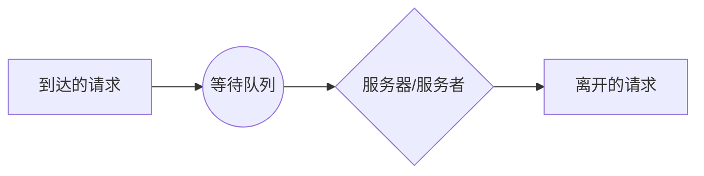
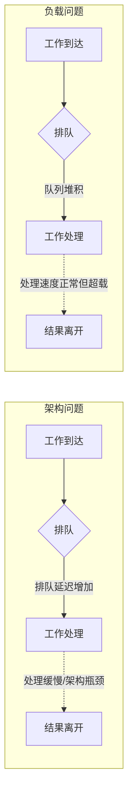
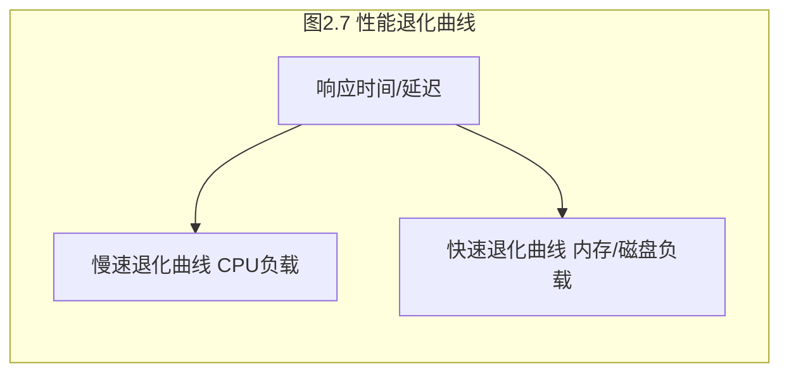
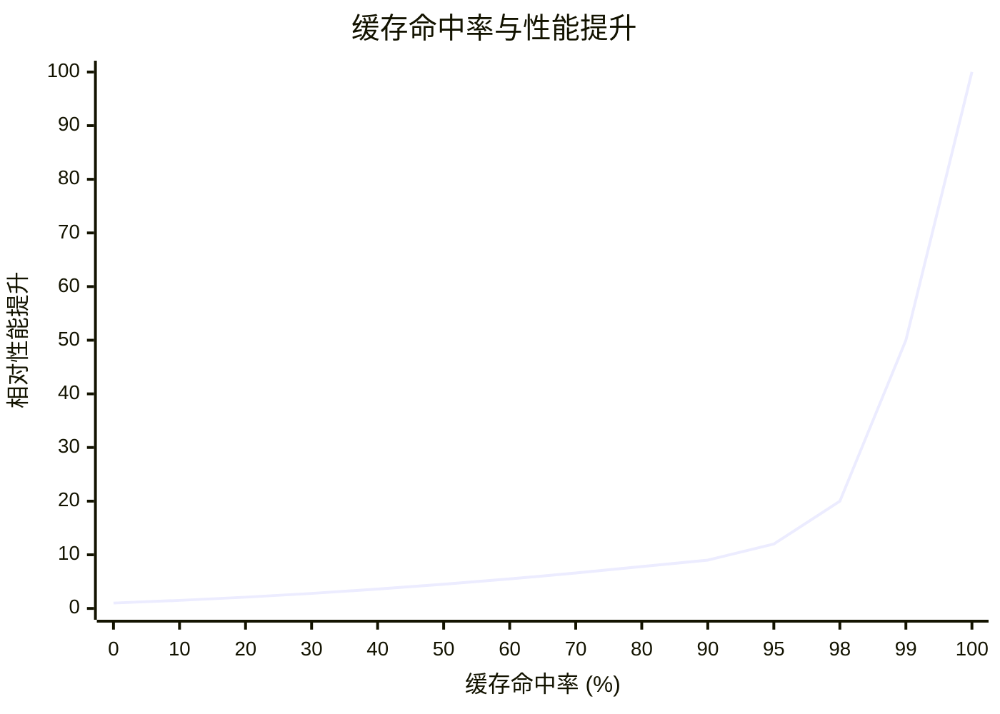

# 第2章 方法论

> 授人以鱼，不如授人以渔。
> ——中国谚语（英文等价表达）

我的技术生涯始于一名初级系统管理员，当时我以为仅仅通过学习命令行工具和指标就能掌握性能分析。我错了。我从头到尾阅读了 man 手册，学习了缺页中断、上下文切换以及各种其他系统指标的定义，但我不知道该怎么用它们：不知道如何从信号追踪到解决方案。

我注意到，每当出现性能问题时，资深系统管理员都有自己的一套思维程序，能够快速穿梭于工具和指标之间，找到根本原因。他们明白哪些指标重要，什么时候这些指标指向了问题，以及如何利用它们来缩小调查范围。这正是 man 手册中所缺失的诀窍——它通常只能通过在资深管理员或工程师身后观摩来学习。

从那以后，我收集、记录、分享并发展了我自己的性能方法论。本章包含了这些方法论以及系统性能的其他必要背景知识：概念、术语、统计和可视化。这涵盖了理论基础，以便后续章节深入探讨具体实现。

本章的学习目标是：

- 理解关键性能指标：[[延迟]]（Latency）、[[利用率]]（Utilization）和[[饱和度]]（Saturation）。
- 培养对测量时间量级的直觉，精确到纳秒级别。
- 学习调优的权衡、目标以及何时停止分析。
- 区分负载问题与架构问题。
- 考量资源分析与负载分析的区别。
- 遵循不同的性能方法论，包括：USE 方法、负载特征刻画、延迟分析、静态性能调优以及性能箴言。
- 理解统计学和排队论的基础知识。

在本书所有章节中，自第一版以来，本章的变动是最小的。在我的职业生涯中，软件、硬件、性能工具和性能可调参数都发生了变化。但保持不变的是理论和方法论：也就是本章所涵盖的持久技能。

本章分为三个部分：

- **背景**：介绍术语、基本模型、关键性能概念和视角。本书其余大部分内容都将假定读者已掌握这些知识。
- **方法论**：讨论性能分析方法论，包括观察性和实验性方法论；建模；以及容量规划。
- **指标**：介绍性能统计、监控和可视化。

这里介绍的许多方法论将在后续章节中更详细地探讨，包括第 5 章到第 10 章中的方法论部分。

## 2.1 术语

以下是系统性能的关键术语。后续章节将提供额外的术语，并在不同的上下文中描述其中部分术语。

- **IOPS**：每秒输入/输出操作数，是衡量数据传输操作速率的指标。对于磁盘 I/O，IOPS 指的是每秒的读取和写入次数。
- **吞吐量**：执行工作的速率。特别是在通信领域，该术语用于指代数据速率（每秒字节数或每秒比特数）。在某些上下文中（例如数据库），吞吐量可以指操作速率（每秒操作数或每秒事务数）。
- **响应时间**：操作完成所需的时间。这包括任何等待时间以及接受服务的时间（服务时间），包括传输结果的时间。
- **延迟**：衡量操作等待被服务的时间。在某些上下文中，它可以指操作的整个耗时，等同于响应时间。有关示例，请参见第 2.3 节概念。
- **利用率**：对于处理请求的资源，利用率是衡量资源繁忙程度的指标，基于其在给定间隔内主动执行工作的时间比例。对于提供存储的资源，利用率可以指已消耗的容量（例如，内存利用率）。
- **饱和度**：资源无法服务而排队的程度。
- **瓶颈**：在系统性能中，瓶颈是指限制系统性能的资源。识别并消除系统性瓶颈是系统性能分析的关键活动。
- **负载**：系统的输入或施加的负载即为负载。对于数据库，负载由客户端发送的数据库查询和命令组成。
- **缓存**：一个快速存储区域，可以复制或缓冲有限数量的数据，以避免直接与较慢的存储层通信，从而提高性能。出于经济原因，缓存通常小于较慢的存储层。

> [!TIP] 术语补充
> 词汇表（Glossary）包含了更多术语，以供需要时参考。

## 2.2 模型

以下简单模型说明了系统性能的一些基本原理。

### 2.2.1 被测系统

被测系统的性能如图 2.1 所示。

**图 2.1 被测系统框图**


需要注意的是，扰动（干扰）可能会影响结果，包括由计划内的系统活动、系统的其他用户和其他工作负载引起的扰动。扰动的来源可能并不明显，可能需要仔细研究系统性能才能确定。在某些云环境中，这可能特别困难，因为从客户 SUT 内部可能无法观察到物理主机系统上的其他活动（由客户租户执行）。

现代环境的另一个困难在于，它们可能由多个网络组件组成，共同处理输入的负载，包括负载均衡器、代理服务器、Web 服务器、缓存服务器、应用程序服务器、数据库服务器和存储系统。仅仅是对环境进行映射，就可能有助于揭示以前被忽视的扰动源。该环境也可以被建模为排队系统的网络，以便进行分析研究。

### 2.2.2 排队系统

某些组件和资源可以被建模为排队系统，以便基于模型预测它们在不同情况下的性能。磁盘通常被建模为排队系统，这可以预测响应时间在负载下如何下降。图 2.2 显示了一个简单的排队系统。

**图 2.2 简单排队模型**



排队论领域（在第 2.6 节建模中介绍）研究排队系统以及排队系统的网络。

## 2.3 概念

以下是系统性能的重要概念，也是本章和本书其余部分的预备知识。这些主题以通用方式进行描述，后续章节的架构部分将介绍特定于实现的细节。

### 2.3.1 延迟

对于某些环境，延迟是性能的唯一焦点。对于其他环境，它是分析中排在前一两位的关键指标，与吞吐量并列。

作为延迟的示例，图 2.3 显示了一次网络传输（例如 HTTP GET 请求），其时间被拆分为延迟和数据传输部分。

**图 2.3 网络连接延迟**

```mermaid
gantt
    title 网络请求时间分解
    dateFormat X
    axisFormat %s
    section 连接阶段
    延迟 (网络连接建立) : 0, 50
    section 传输阶段
    数据传输 (操作执行) : 50, 150
```



延迟是在执行操作之前等待所花费的时间。在这个例子中，操作是传输数据的网络服务请求。在此操作发生之前，系统必须等待建立网络连接，这就是该操作的延迟。响应时间跨越了这段延迟和操作时间。

由于延迟可以从不同的位置测量，因此通常在表述时会带上测量的目标。例如，网站的加载时间可能由从不同位置测量的三个不同时间组成：DNS 延迟、TCP 连接延迟，然后是 TCP 数据传输时间。DNS 延迟指的是整个 DNS 操作。TCP 连接延迟仅指初始化（TCP 握手）。

在更高的层面上，所有这些，包括 TCP 数据传输时间，都可以被视为其他事物的延迟。例如，从用户点击网站链接到结果页面完全加载的时间可以称为延迟，其中包括浏览器通过网络获取网页并将其渲染的时间。由于“延迟”这个词单独使用可能会产生歧义，最好包含限定词来解释它测量的是什么：请求延迟、TCP 连接延迟等。

> [!INFO] 延迟的可计算性
> 由于延迟是基于时间的指标，因此可以进行各种计算。性能问题可以使用延迟来量化，然后进行排名，因为它们使用相同的单位（时间）表示。通过考虑何时可以减少或消除延迟，还可以计算预期的加速比。例如，这些都无法使用 IOPS 指标准确执行。

作为参考，时间数量级及其缩写列在表 2.1 中。

**表 2.1 时间单位**

| 单位 | 缩写 | 一秒的分数 |
| --- | --- | --- |
| 分钟 | m | 60 |
| 秒 | s | 1 |
| 毫秒 | ms | 0.001 或 1/1000 或 1 × 10^-3 |
| 微秒 | μs | 0.000001 或 1/1000000 或 1 × 10^-6 |
| 纳秒 | ns | 0.000000001 或 1/1000000000 或 1 × 10^-9 |
| 皮秒 | ps | 0.000000000001 或 1/1000000000000 或 1 × 10^-12 |

在可能的情况下，将其他指标类型转换为延迟或时间可以允许它们进行比较。如果你必须在 100 次网络 I/O 或 50 次磁盘 I/O 之间做出选择，你怎么知道哪个性能更好？这是一个复杂的问题，涉及许多因素：网络跳数、网络丢包和重传率、I/O 大小、随机或顺序 I/O、磁盘类型等。但如果你比较 100 毫秒的总网络 I/O 和 50 毫秒的总磁盘 I/O，差异就很明显了。

### 2.3.2 时间尺度

虽然时间可以在数值上进行比较，但对时间拥有一种直觉，并对不同来源的延迟有合理的期望也是很有帮助的。系统组件在截然不同的时间尺度（数量级）上运行，以至于很难理解这些差异到底有多大。在表 2.2 中，提供了示例延迟，从 3.5 GHz 处理器的 CPU 寄存器访问开始。为了展示我们所处理的时间尺度差异，该表显示了每个操作可能花费的平均时间，并将其缩放到一个假想的系统中——在该系统中，一个 CPU 周期（现实生活中的 0.3 纳秒，大约是十亿分之一秒^1）耗时整整一秒。

^1 美制十亿分之一：1/1,000,000,000

**表 2.2 系统延迟的时间尺度示例**

| 事件 | 延迟 | 缩放后 |
| --- | --- | --- |
| 1 个 CPU 周期 | 0.3 ns | 1 秒 |
| 一级缓存访问 | 0.9 ns | 3 秒 |
| 二级缓存访问 | 3 ns | 10 秒 |
| 三级缓存访问 | 10 ns | 33 秒 |
| 主内存访问（DRAM，来自 CPU） | 100 ns | 6 分钟 |
| 固态磁盘 I/O（闪存） | 10–100 μs | 9–90 小时 |
| 旋转磁盘 I/O | 1–10 ms | 1–12 个月 |
| 互联网：旧金山到纽约 | 40 ms | 4 年 |
| 互联网：旧金山到英国 | 81 ms | 8 年 |
| 轻量级硬件虚拟化启动 | 100 ms | 11 年 |
| 互联网：旧金山到澳大利亚 | 183 ms | 19 年 |
| 操作系统虚拟化系统启动 | < 1 s | 105 年 |
| 基于 TCP 定时器的重传 | 1–3 s | 105–317 年 |
| SCSI 命令超时 | 30 s | 3 个千年 |
| 硬件 (HW) 虚拟化系统启动 | 40 s | 4 个千年 |
| 物理系统重启 | 5 m | 32 个千年 |

> [!NOTE] 纳秒级别的感知
> 如你所见，CPU 周期的时间尺度极其微小。光传播 0.5 米（也许是从你的眼睛到这页纸的距离）所需的时间大约是 1.7 纳秒。在这段时间内，现代 CPU 可能已经执行了五个 CPU 周期并处理了几条指令。

有关 CPU 周期和延迟的更多信息，请参见第 6 章 CPU；有关磁盘 I/O 延迟的信息，请参见第 9 章磁盘。包含的互联网延迟数据来自第 10 章网络，该章有更多示例。

# 2.1 方法论：术语、模型与概念

## 2.3.3 权衡 (Trade-Offs)

您应该了解一些常见的性能权衡。图 2.4 展示了“好/快/便宜”的“择其二”权衡，以及针对 IT 项目调整后的术语。

**图 2.4 权衡：择其二**


> [!NOTE] 译者注
> 原图 2.4 为三角形示意图，此处使用 Mermaid 图表作为补充，展示了“好/快/便宜”及其对应 IT 项目中的“功能/质量、按时、低成本”的权衡关系。

许多 IT 项目选择按时和低成本，将性能问题留待以后解决。当早期的决策阻碍了性能的提升时，这种选择就会变得有问题，例如：选择并填充了次优的存储架构、使用实现效率低下的编程语言或操作系统，或者选择缺乏全面性能分析工具的组件。

性能调优中一个常见的权衡是 CPU 与内存之间的权衡，因为内存可用于缓存结果，从而减少 CPU 的使用。在拥有充足 CPU 的现代系统上，这种权衡可能会反过来：可以花费 CPU 时间来压缩数据，从而减少内存的使用。

可调参数通常伴随着权衡。以下是几个例子：

- **文件系统记录大小（或块大小）**：接近应用程序 I/O 大小的较小记录大小，在随机 I/O 工作负载下性能更好，并且在应用程序运行时能更有效地利用文件系统缓存。较大的记录大小将改善流式工作负载，包括文件系统备份。
- **网络缓冲区大小**：较小的缓冲区大小将减少每个连接的内存开销，有助于系统扩展。较大的缓冲区大小将提高网络吞吐量。

在更改系统时，请注意此类权衡。

## 2.3.4 调优工作

性能调优在最接近执行工作的地方进行时最为有效。对于由应用程序驱动的工作负载，这意味着在应用程序本身内部进行。表 2.3 展示了一个具有调优可能性的示例软件栈。

通过在应用程序层面进行调优，您可能能够消除或减少数据库查询，并将性能提高很大倍数（例如，20 倍）。向下调优到存储设备级别可能会消除或改善存储 I/O，但在执行更高级别的操作系统（OS）堆栈代码时已经付出了代价，因此这可能只会使最终的应用程序性能提高百分之几（例如，20%）。

**表 2.3 调优的示例目标**

| 层级 | 示例调优目标 |
| :--- | :--- |
| 应用程序 | 应用程序逻辑、请求队列大小、执行的数据库查询 |
| 数据库 | 数据库表布局、索引、缓冲 |
| 系统调用 | 内存映射或读/写、同步或异步 I/O 标志 |
| 文件系统 | 记录大小、缓存大小、文件系统可调参数、日志记录 |
| 存储 | RAID 级别、磁盘数量和类型、存储可调参数 |

> [!TIP] 调优层级的影响差异
> 在应用层调优可能带来数量级的提升（如 20x），而在底层存储设备调优往往只能带来百分比的提升（如 20%），因为高层 OS 栈代码执行的损耗已经产生。

在应用程序层面找到巨大性能收益还有另一个原因。当今的许多环境都以快速部署功能和特性为目标，每周或每天将软件更改推送到生产环境。^2^ 因此，应用程序的开发和测试往往侧重于正确性，在生产部署前几乎没有或完全没有时间进行性能测量或优化。这些活动往往是在后来性能成为问题时才进行的。

^2^ 快速变更的环境示例包括 Netflix 云和 Shopify，它们每天会推送多次更改。

虽然应用程序可能是最有效的调优层面，但它未必是最有效的观测基础层面。慢查询可能最好通过其在 [[CPU]] 上花费的时间，或者通过它们执行的文件系统和磁盘 I/O 来理解。这些都可以通过操作系统工具进行观测。

在许多环境中（尤其是云计算），应用程序层面处于持续开发中，每周或每天将软件更改推送到生产环境。随着应用程序代码的更改，经常可以发现巨大的性能收益，包括对回归问题的修复。在这些环境中，针对操作系统的调优和从操作系统进行的观测很容易被忽视。请记住，操作系统性能分析也可以识别应用程序层面的问题，而不仅仅是 OS 层面的问题，在某些情况下，甚至比仅从应用程序出发更容易识别。

## 2.3.5 合适的层级

不同的组织和环境对性能有不同的要求。您可能加入了一个这样的组织，在那里深入分析的常态超出了您以前所见，甚至超出了您认为可能的程度。或者您可能会发现，在您的新工作场所，您认为基础的分析被认为是高级的，并且以前从未执行过（好消息：[[低垂的果实|容易实现的目标]]！）。

这并不一定意味着某些组织做得对，某些组织做得错。这取决于性能专业知识的投资回报率（ROI）。拥有大型数据中心或大型云环境的组织可能会雇用一个性能工程师团队，他们分析所有内容，包括[[内核]]内部原理和[[CPU 性能计数器]]，并频繁使用各种[[追踪|tracing]]工具。他们还可能对性能进行正式建模，并对未来的增长制定准确的预测。对于每年在计算上花费数百万美元的环境来说，雇佣这样一个性能团队是很容易证明其合理性的，因为他们找到的收益就是 ROI。计算支出适中的小型初创公司可能只进行表面检查，依赖第三方监控解决方案来检查其性能并提供警报。

然而，正如第 1 章所介绍的，系统性能不仅仅关乎成本：它还关乎最终用户体验。一家初创公司可能会发现有必要投资于性能工程，以改善网站或应用程序[[延迟|latency]]。这里的 ROI 未必是成本的降低，而是更快乐的客户而不是流失的客户。

最极端的环境包括股票交易所和高频交易商，在这些环境中，性能和延迟至关重要，可以证明密集的努力和费用是合理的。作为一个例子，规划中的纽约和伦敦交易所之间的一条跨大西洋电缆耗资 3 亿美元，旨在将传输延迟减少 6 毫秒 [Williams 11]。

> [!EXAMPLE] 极端性能投资案例
> 纽约与伦敦交易所之间的跨大西洋光缆，耗资 3 亿美元，仅为了将传输延迟降低 6 毫秒。这体现了特定行业对极端低延迟的 ROI 计算方式。

在进行性能分析时，合适的层级在决定何时停止分析时也会发挥作用。

## 2.3.6 何时停止分析

进行性能分析时的一个挑战是知道何时停止。有太多的工具，也有太多的东西需要检查！

当我教授性能课程时（正如我最近开始做的那样），我可以给学生一个由三个原因共同导致的性能问题，并发现有些学生在找到一个原因后停止，有些在找到两个后停止，还有些人找到了全部三个。有些学生继续尝试，试图找到导致性能问题的更多原因。谁做得对？可能很容易说您应该在找到所有三个原因后停止，但对于现实生活中的问题，您并不知道原因的数量。

以下是您可能考虑停止分析的三种情况，并附有一些个人例子：

- **当您已经解释了性能问题的大部分时**。一个 Java 应用程序消耗的 CPU 是以前的三倍。我发现的第一个问题是消耗 CPU 的异常堆栈之一。然后我量化了这些堆栈中的时间，发现它们仅占总 CPU 占用的 12%。如果那个数字接近 66%，我就可以停止分析——3 倍的减速就已经被解释了。但在这种情况下，在 12% 时，我需要继续寻找。
- **当潜在的 ROI 低于分析成本时**。我处理的一些性能问题可以带来每年数千万美元的收益。对于这些，我可以证明花几个月我自己的时间（工程成本）进行分析是合理的。其他性能收益，比如微小的微服务，可能只有数百美元：甚至可能不值得花一个小时的工程时间来分析它们。例外情况可能包括当我没有更好的事情来打发公司时间时（这在实践中从未发生过），或者如果我怀疑这可能是更大问题的“金丝雀”（先兆），因此在问题扩大之前值得调试。
- **当其他地方有更大的 ROI 时**。即使前两种情况尚未满足，其他地方也可能有更大的 ROI 优先处理。

> [!INFO] 性能工程师的日常
> 如果您全职担任性能工程师，根据潜在的投资回报率（ROI）优先分析不同的问题，很可能是您的日常工作。

如果您全职担任性能工程师，根据潜在的 ROI 优先分析不同的问题可能是一项日常任务。

## 2.3.7 特定时间点的建议

环境的性能特征会随着时间的推移而变化，这是由于增加了更多用户、更新的硬件以及更新的软件或固件。当前受限于 10 Gbit/s 网络基础设施的环境，在升级到 100 Gbit/s 后可能会开始在磁盘或 CPU 性能方面遇到瓶颈。

性能建议，尤其是可调参数的值，仅在特定时间点有效。性能专家一周前给出的最佳建议，可能在一周后软件或硬件升级后，或者增加更多用户后变得无效。

在网上搜索到的可调参数值可以提供快速收益——在某些情况下。但是，如果它们不适合您的系统或工作负载，曾经适合但现在不适合，或者仅作为软件错误的临时解决方案（该错误在随后的软件升级中已得到适当修复），它们也会削弱性能。这就好比去翻别人的药箱，吃下了可能不适合您、可能已经过期、或者本来只应该短期服用的药物。

浏览此类建议可能有助于了解存在哪些可调参数以及过去哪些需要更改。然后您的任务就变成了查看并确定这些参数是否以及应该如何针对您的系统和工作负载进行调优。但是，如果其他人以前不需要调优某个重要参数，或者调优了但没有在任何地方分享他们的经验，您仍然可能会错过该参数。

> [!WARNING] 互联网调参的风险
> 直接使用互联网上搜索到的可调参数值犹如“乱吃药”。这些参数可能不适用于当前系统/负载、已过期（针对旧版本软件），或仅是某已知 Bug 的临时规避方案。建议在修改此类参数时，务必使用版本控制系统记录详细历史。

在更改可调参数时，将它们存储在带有详细历史的版本控制系统中会有所帮助。（您可能在使用诸如 Puppet、Salt、Chef 等配置管理工具时已经在做类似的事情。）这样，以后可以检查更改可调参数的时间和原因。

## 2.3.8 负载与架构

应用程序性能不佳可能是由于其运行的软件配置和硬件存在问题：即其架构和实现。然而，应用程序性能不佳也可能仅仅是因为施加了过多的负载，导致[[排队系统|排队]]和长延迟。负载与架构如图 2.5 所示。

**图 2.5 负载与架构**



如果对架构的分析显示工作正在排队，但工作执行方式没有问题，则问题可能是施加的负载过多。在云计算环境中，这就是可以按需引入更多服务器实例来处理工作的节点。

例如，架构问题可能是一个单线程应用程序在 CPU 上忙碌，请求在排队，而其他 CPU 可用且空闲。在这种情况下，性能受限于应用程序的单线程架构。另一个架构问题可能是一个多线程程序争用单个[[锁|lock]]，使得只有一个线程可以向前推进，而其他线程等待。

负载问题可能是一个多线程应用程序在所有可用 CPU 上都很忙，请求仍在排队。在这种情况下，性能受限于可用的 CPU 容量，或者换种说法，负载超过了 CPU 的处理能力。

# 2.1 方法论：术语、模型与概念

> [!NOTE] 延续说明
> 本部分为文档的第 3/4 部分，接续前文关于负载（Load）的讨论。

2.3.9 可扩展性

系统在不断增加的负载下所表现出的性能，即为它的[[可扩展性]]（Scalability）。图 2.6 展示了随着系统负载增加时的一个典型吞吐量曲线。

**图 2.6 吞吐量与负载的关系**


在某一段时间内，可以观察到线性的可扩展性。随后会达到一个以虚线标记的点，在这个点上，对资源的竞争开始导致吞吐量下降。这个点可以被描述为**拐点**（knee point），因为它是两个函数之间的边界。超过这个点后，随着对资源竞争的增加，吞吐量曲线偏离了线性可扩展性。最终，由于竞争和一致性开销的增加，导致完成的工作量减少，吞吐量也随之下降。

这个点可能发生在一个组件达到 100% 利用率时：即[[饱和点]]（saturation point）。它也可能发生在一个组件接近 100% 利用率，且排队开始变得频繁且显著的时候。

一个可能表现出这种曲线的示例系统是：一个执行繁重计算的应用程序，随着额外线程的加入而增加了更多负载。当 CPU 接近 100% 利用率时，由于 CPU 调度器延迟的增加，响应时间开始退化。在 100% 利用率下的峰值性能之后，随着更多线程的加入，吞吐量开始下降，因为这会导致更多的上下文切换，从而消耗 CPU 资源并导致实际完成的工作量减少。

如果将 x 轴上的“负载”替换为诸如 CPU 核心之类的资源，也可以看到相同的曲线。有关此主题的更多信息，请参见第 2.6 节“建模”。

非线性可扩展性导致的性能退化，在平均响应时间或延迟方面的表现如图 2.7 所示 [Cockcroft 95]。

32

第 2 章 方法论

**图 2.7 性能退化**



响应时间变高当然是不好的。“快速”退化曲线可能发生在内存负载中，当系统开始将内存页面移动到磁盘以释放主内存时。“慢速”退化曲线可能发生在 CPU 负载中。

另一个“快速”退化曲线的例子是磁盘 I/O。随着负载（以及由此产生的磁盘利用率）的增加，I/O 变得更有可能排在其他 I/O 之后等待。一个空闲的旋转磁盘（非固态硬盘）处理 I/O 的响应时间可能在 1 毫秒左右，但当负载增加时，这可能接近 10 毫秒。这将在第 2.6.5 节“排队理论”中的 M/D/1 和 60% 利用率部分进行建模，磁盘性能将在第 9 章“磁盘”中介绍。

如果应用程序在资源不可用时开始返回错误，而不是将工作排入队列，则可能会出现响应时间的线性可扩展性。例如，Web 服务器可能会返回 503 “Service Unavailable”，而不是将请求添加到队列中，这样那些被服务的请求就可以以一致的响应时间执行。

2.3.10 指标

[[性能指标]]（Metrics）是由系统、应用程序或额外工具生成的选定统计数据，用于测量感兴趣的活动。研究它们是为了进行性能分析和监控，可以在命令行以数字方式查看，也可以使用可视化工具以图形方式查看。

常见的系统性能指标类型包括：

- **吞吐量**：每秒的操作次数或数据量
- **IOPS**：每秒的 I/O 操作次数
- **利用率**：资源繁忙程度的百分比
- **延迟**：操作时间，以平均值或百分位数表示

吞吐量的用法取决于其上下文。数据库吞吐量通常是每秒查询或请求（操作）数的度量。网络吞吐量是每秒比特或字节（数据量）的度量。

IOPS 是专门针对 I/O 操作（读和写）的吞吐量度量。同样，上下文很重要，定义也可能有所不同。

2.3 概念

33

> [!WARNING] 开销
> 性能指标并不是免费的；在某些时候，必须花费 CPU 周期来收集和存储它们。这会导致[[开销]]（Overhead），从而对测量目标的性能产生负面影响。这被称为**观察者效应**（observer effect）。（它经常与海森堡不确定性原理混淆，后者描述了可以同时精确知道的位置和动量等成对物理属性的精度极限。）

> [!CAUTION] 问题
> 您可能会假设软件供应商提供的指标是经过精心挑选、没有错误且提供完全可见性的。实际上，指标可能令人困惑、复杂、不可靠、不准确，甚至是完全错误的（由于漏洞）。有时某个指标在某个软件版本中是正确的，但没有得到更新以反映新代码和代码路径的添加。
> 
> 有关指标问题的更多信息，请参见第 4 章“可观测性工具”，第 4.6 节“观测可观测性”。

2.3.11 利用率

术语[[利用率]]（Utilization）³ 在操作系统中常用于描述设备使用情况，例如 CPU 和磁盘设备。利用率可以是基于时间的，也可以是基于容量的。

**基于时间的利用率**

基于时间的利用率在排队理论中有正式定义。例如 [Gunther 97]：

> 服务器或资源处于繁忙状态的平均时间量

以及比率：

$$U = B/T$$

其中 $U$ = 利用率，$B$ = 在观测周期 $T$ 内系统繁忙的总时间。

这也是操作系统性能工具最容易获取的“利用率”。磁盘监控工具 `iostat(1)` 将此指标称为 `%b`（percent busy，繁忙百分比），这个术语更好地传达了其底层指标的含义：$B/T$。

这个利用率指标告诉我们一个组件有多繁忙：当一个组件接近 100% 利用率时，如果存在资源竞争，性能可能会严重下降。可以检查其他指标以确认，并查看该组件是否因此成为了系统瓶颈。

某些组件可以并行处理多个操作。对于它们来说，在 100% 利用率时性能可能不会下降太多，因为它们还可以接受更多工作。要理解这一点，可以考虑一栋大楼的电梯。当它在楼层之间移动时可以被认为是被利用的，而当它空闲等待时是未被利用的。然而，即使电梯在 100% 的时间里都在响应呼叫而处于繁忙状态——也就是说，它处于 100% 利用率——它仍然可能能够接纳更多的乘客。

一个 100% 繁忙的磁盘也可能能够接受并处理更多的工作，例如，通过将写入操作缓存在磁盘高速缓存中以便稍后完成。存储阵列经常在 100% 利用率下运行，因为某些磁盘在 100% 的时间内都很繁忙，但阵列有大量空闲磁盘，可以接受更多工作。

**基于容量的利用率**

IT 专业人员在容量规划的上下文中使用了另一种利用率的定义 [Wong 97]：

> 一个系统或组件（例如磁盘驱动器）能够提供一定量的吞吐量。在任何性能水平下，系统或组件都在按其容量的某种比例工作。该比例即称为利用率。

这从容量而不是时间的角度定义了利用率。它意味着处于 100% 利用率的磁盘无法再接受任何更多工作。而在基于时间的定义中，100% 利用率仅意味着它在 100% 的时间内都是繁忙的。

> [!IMPORTANT] 关键区别
> 100% 繁忙 ≠ 100% 容量

对于电梯的例子，100% 容量可能意味着电梯达到了其最大有效载荷容量，无法再接纳更多乘客。

在理想的世界中，我们能够测量设备的两种利用率，例如，您可以知道磁盘何时 100% 繁忙且由于竞争导致性能开始下降，以及何时达到 100% 容量且无法再接受更多工作。不幸的是，这通常是不可能的。对于磁盘，这将需要了解磁盘板载控制器正在做什么以及容量的预测。磁盘目前不提供此信息。

在本书中，利用率通常指的是基于时间的版本，您也可以将其称为非空闲时间。基于容量的版本用于某些基于容量的指标，例如内存使用量。

³ 在世界某些地区拼写为 *utilisation*。

34

第 2 章 方法论

2.3.12 饱和度

对资源请求的工作量超过其处理能力的程度即为[[饱和度]]（Saturation）。饱和度在达到 100% 利用率（基于容量）时开始出现，因为额外的工作无法被处理并开始排队。如图 2.8 所示。

该图显示，随着负载继续增加，饱和度在 100% 基于容量的利用率标记之外呈线性增加。任何程度的饱和度都是性能问题，因为时间被花费在等待上（延迟）。对于基于时间的利用率（繁忙百分比），排队及由此产生的饱和度可能不会在 100% 利用率标记处开始，这取决于资源并行处理工作的程度。

2.3 概念

35

**图 2.8 利用率与饱和度**


2.3.13 性能剖析

[[性能剖析]]（Profiling）构建了一个可以供研究和理解的目标画像。在计算性能领域，剖析通常通过按时间间隔采样系统状态，然后研究样本集合来执行。

与之前涵盖的指标（包括 IOPS 和吞吐量）不同，采样的使用提供了目标活动的粗略视图。粗略的程度取决于采样率。

作为性能剖析的一个例子，可以通过频繁间隔采样 CPU 指令指针或栈跟踪来收集消耗 CPU 资源的代码路径的统计数据，从而以合理的细节理解 CPU 使用情况。此主题将在第 6 章“CPU”中介绍。

2.3.14 缓存

[[缓存]]（Caching）经常被用来提高性能。缓存将来自较慢存储层的结果存储在较快的存储层中，以供参考。一个例子是在主内存（RAM）中缓存磁盘块。

可以使用多级缓存。CPU 通常对主内存采用多个硬件缓存（1 级、2 级和 3 级），从非常快但很小的缓存（1 级）开始，在存储大小和访问延迟上依次增加。这是密度和延迟之间的经济权衡；层级和大小是为在可用芯片空间内获得最佳性能而选择的。这些缓存将在第 6 章“CPU”中介绍。

系统中还有许多其他缓存，其中许多是使用主内存作为存储在软件中实现的。有关缓存层的列表，请参见第 3 章“操作系统”，第 3.2.11 节“缓存”。

理解缓存性能的一个指标是每个缓存的**命中率**——即在缓存中找到所需数据的次数（命中）与总访问次数（命中 + 未命中）的比值：

$$hit\ ratio = hits / (hits + misses)$$

越高越好，因为较高的比率反映了更多数据成功地从较快的介质中访问。图 2.9 显示了提高缓存命中率所带来的预期性能改进。

36

# 2.1 方法论：术语、模型与概念

## 缓存（续）

图 2.9 展示了随着缓存命中率提高而预期的性能提升情况。

**图 2.9 缓存命中率与性能**



98% 和 99% 之间的性能差异远大于 10% 和 11% 之间的差异。由于缓存命中和未命中（即起作用的两个存储层级）之间存在速度差异，这呈现出一种非线性特征。速度差异越大，曲线的斜率就变得越陡峭。

理解缓存性能的另一个指标是**缓存未命中率**（cache miss rate），以每秒的未命中次数来表示。这与每次未命中带来的性能惩罚成正比（线性关系），并且通常更容易解读。

> [!EXAMPLE] 缓存命中率与未命中率对比示例
> 例如，工作负载 A 和 B 使用不同的算法执行相同的任务，并使用主内存缓存来避免从磁盘读取数据。工作负载 A 的缓存命中率为 90%，而工作负载 B 的缓存命中率为 80%。仅凭这些信息，似乎表明工作负载 A 性能更好。
> 
> 但如果工作负载 A 的未命中率为 200 次/秒，而工作负载 B 为 20 次/秒呢？按照这种指标，工作负载 B 执行的磁盘读取操作少了 10 倍，这可能会使任务比 A 完成得快得多。
> 
> 为了确定起见，每个工作负载的总运行时间可以按以下公式计算：
> 
> `运行时间 = (命中率 × 命中延迟) + (未命中率 × 未命中延迟)`
> 
> 此计算使用了平均命中和未命中延迟，并假设工作负载是串行执行的。

### 缓存算法

[[缓存管理算法]]和策略决定了在缓存的有限可用空间中存储什么内容。

- **最近使用**（Most Recently Used, [[MRU]]）指的是一种缓存保留策略，它决定优先在缓存中保留什么：即最近被使用过的对象。
- **最近最少使用**（Least Recently Used, [[LRU]]）可以指代对应的缓存驱逐策略，决定当需要更多空间时从缓存中移除哪些对象。
- 此外还有**最经常使用**（Most Frequently Used, [[MFU]]）和**最不经常使用**（Least Frequently Used, [[LFU]]）策略。
- 您可能还会遇到**不经常使用**（Not Frequently Used, [[NFU]]），它可能是 LRU 的一种开销较低但不够彻底的版本。

### 热、冷和温缓存

这些词通常用于描述缓存的状态：

- **冷**：冷缓存是空的，或者填充了不需要的数据。冷缓存的命中率为零（或在开始变暖时接近零）。
- **温**：温缓存填充了有用的数据，但命中率还不够高，不足以被认为是热缓存。
- **热**：热缓存填充了经常被请求的数据，并且具有高命中率，例如超过 99%。
- **温度**：缓存温度描述了缓存是热还是冷。提高缓存温度的活动，其目标就是提高缓存命中率。

> [!INFO] 缓存预热时间
> 当缓存首次初始化时，它们处于冷状态，然后随着时间的推移逐渐变暖。当缓存容量很大或下一级存储速度很慢（或两者兼有）时，缓存可能需要很长时间才能被填充并变暖。
> 
> 例如，我曾参与过一个存储设备的开发，它有 128 GB 的 DRAM 作为文件系统缓存，600 GB 的闪存作为二级缓存，以及旋转磁盘用于存储。在随机读工作负载下，磁盘交付大约 2,000 次读取/秒。在 8 KB 的 I/O 大小下，这意味着缓存最多只能以 16 MB/s（2,000 × 8 KB）的速率变暖。当两个缓存都开始处于冷状态时，DRAM 缓存需要超过 2 小时才能变暖，而闪存缓存需要超过 10 小时才能变暖。

## 2.3.15 已知与未知

在前言中介绍过，**已知已知**（known-knowns）、**已知未知**（known-unknowns）和**未知未知**（unknown-unknowns）的概念对于性能领域非常重要。其分类如下，并附有系统性能分析的示例：

- **已知已知**：这些是你知道的事情。你知道你应该检查某个性能指标，并且你也知道它当前的值。例如，你知道你应该检查 CPU 利用率，并且你也知道该值平均为 10%。
- **已知未知**：这些是你知道你不知道的事情。你知道你可以检查某个指标或子系统的存在，但你还没有去观察它。例如，你知道你可以使用性能分析（profiling）来检查是什么让 CPU 处于繁忙状态，但还没有去做。
- **未知未知**：这些是你不知道你不知道的事情。例如，你可能不知道设备中断会成为繁重的 CPU 消耗者，因此你没有去检查它们。

> [!QUOTE] 性能领域的认知边界
> 性能是一个“**你越知道，你不知道的就越多**”的领域。你对系统了解得越多，你就会意识到越多的“未知未知”，随后这些就会变成你可以去检查的“已知未知”。

## 2.4 视角

性能分析有两种常见的视角，每种视角都有不同的受众、指标和方法。它们是**工作负载分析**和**资源分析**。它们可以被视为对操作系统软件栈的自顶向下或自底向上的分析，如图 2.10 所示。

**图 2.10 工作负载分析与资源分析视角**

```mermaid
flowchart TD
    subgraph 工负载分析 [工作负载分析 (自顶向下)]
        direction TB
        A[应用程序 / 工作负载] --> B[系统调用接口]
        B --> C[操作系统内核]
    end

    subgraph 资源分析 [资源分析 (自底向上)]
        direction BT
        D[硬件资源 <br> CPU, 内存, 磁盘, 网络] --> E[设备驱动程序]
        E --> F[操作系统内核]
    end
```