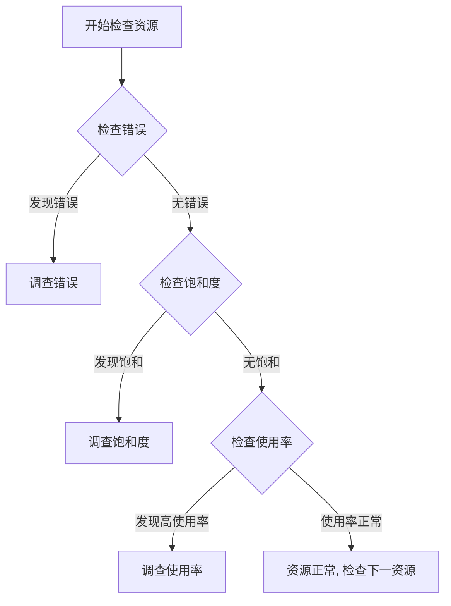
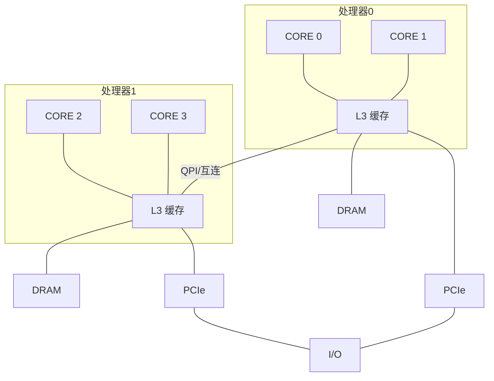
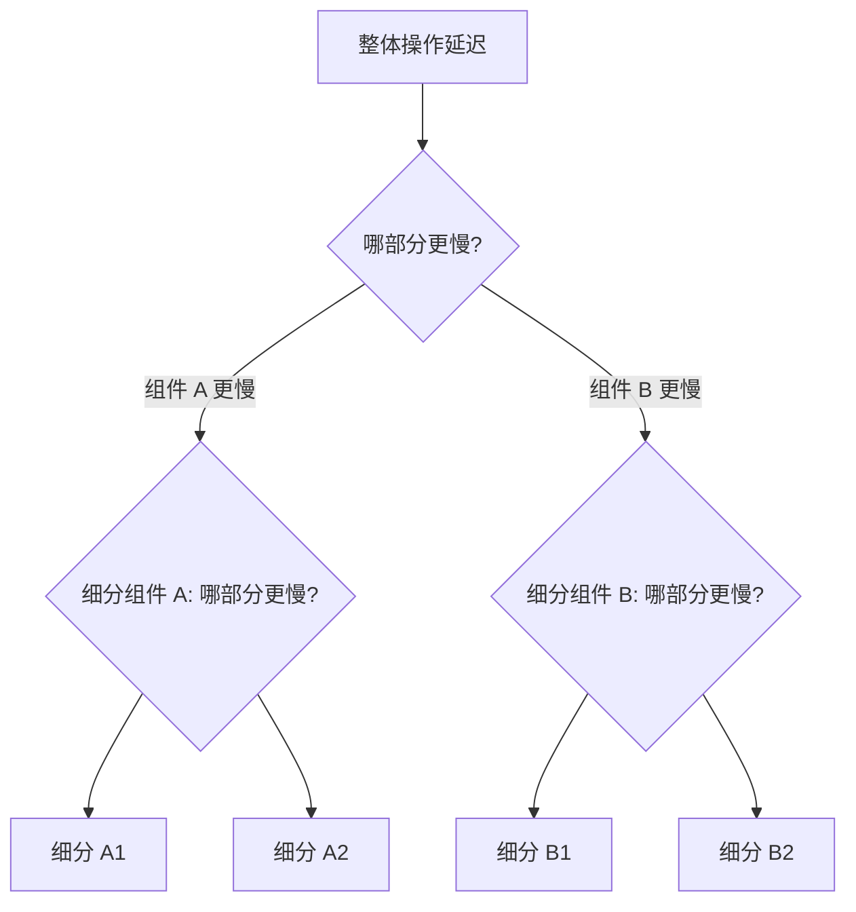

# 2.2 方法论：分析视角与方法

图 2.10 分析视角

> [!INFO] 上下文说明
> 第 2.5 节“方法论”为每种视角提供了具体的执行策略。这里将对这些分析视角进行更详细的介绍。

## 2.4.1 资源分析

[[资源分析]]（Resource analysis）从分析系统资源开始：CPU、内存、磁盘、网络接口、总线以及互连。这通常由系统管理员——即负责物理资源的人员——来执行。相关活动包括：

- **性能问题调查**：查看是否是某种特定类型的资源导致了问题
- **容量规划**：获取信息以帮助确定新系统的规模，并查看现有系统资源何时可能会耗尽

这种视角关注[[利用率]]（utilization），以识别资源何时达到或接近其极限。某些资源类型（如 CPU）具有现成可用的利用率指标。其他资源的利用率可以根据可用指标进行估算，例如，通过将每秒发送和接收的兆比特数（[[吞吐量]]）与已知或预期的最大带宽进行比较，来估算网络接口的利用率。

最适合资源分析的指标包括：

- [[IOPS]]
- [[吞吐量]]（Throughput）
- [[利用率]]（Utilization）
- [[饱和度]]（Saturation）

这些指标衡量了资源被要求做的工作，以及在给定负载下它的利用率或饱和度如何。其他类型的指标（包括[[延迟]]）对于查看资源在给定工作负载下的响应情况也很有用。

资源分析是性能分析的一种常见方法，部分原因在于关于该主题的文档非常丰富。这些文档主要关注操作系统的“stat”工具：`vmstat(8)`、`iostat(1)`、`mpstat(1)`。在阅读此类文档时，重要的是要理解这仅仅是一种视角，而不是唯一的视角。

## 2.4.2 工作负载分析

[[工作负载分析]]（Workload analysis，见图 2.11）检查应用程序的性能：所施加的工作负载以及应用程序的响应方式。它最常被应用程序开发人员和支持人员——即负责应用程序软件和配置的人员——所使用。

图 2.11 工作负载分析

工作负载分析的目标是：

- **请求**：施加的工作负载
- **延迟**：应用程序的响应时间
- **完成情况**：寻找错误

研究工作负载请求通常涉及检查和总结其属性：这就是[[工作负载特征归纳]]的过程（在第 2.5 节“方法论”中有更详细的描述）。对于数据库，这些属性可能包括客户端主机、数据库名称、表和查询字符串。这些数据可能有助于识别不必要的工作或不平衡的工作。即使系统当前工作负载执行得很好（低延迟），检查这些属性也可能找到减少或消除所施加工作的方法。请记住，最快的查询就是您根本不执行的查询。

[[延迟]]（响应时间）是表达应用程序性能的最重要指标。对于 MySQL 数据库，它是查询延迟；对于 Apache，它是 HTTP 请求延迟；以此类推。在这些上下文中，术语“延迟”的含义与“响应时间”相同（更多关于上下文的信息，请参阅第 2.3.1 节“延迟”）。

工作负载分析的任务包括识别和确认问题——例如，通过寻找超出可接受阈值的延迟——然后找到延迟的来源，并确认在应用修复后延迟是否有所改善。请注意，起点是应用程序。调查延迟通常涉及向下钻取（drill down）深入到应用程序、库和操作系统（内核）中。

可以通过研究与事件完成相关的特征（包括其错误状态）来识别系统问题。虽然一个请求可能很快完成，但它可能带着导致请求被重试的错误状态完成，从而累积延迟。

最适合工作负载分析的指标包括：

- **吞吐量**（每秒事务数）
- **延迟**

这些指标衡量请求的速率和由此产生的性能。

---

## 2.5 方法论

面对性能低下且复杂的系统环境时，第一个挑战可能是不知道从哪里开始分析以及如何继续。正如我在第 1 章中所说，性能问题可能出现在任何地方，包括软件、硬件以及数据路径上的任何组件。方法论可以通过告诉您从哪里开始分析并建议遵循的有效程序，来帮助您应对这些复杂的系统。

本节描述了许多用于系统性能和调优的性能方法论和程序，其中一些是我开发的。这些方法论帮助初学者入门，也为专家提供提醒。其中还包含了一些反方法论。

为了帮助总结它们的作用，这些方法论被分类为不同的类型，例如观察分析和实验分析，如表 2.4 所示。

**表 2.4 通用系统性能方法论**

| 小节 | 方法论 | 类型 |
| :--- | :--- | :--- |
| 2.5.1 | 路灯反方法 | 观察分析 |
| 2.5.2 | 随机变动反方法 | 实验分析 |
| 2.5.3 | 甩锅反方法 | 假设分析 |
| 2.5.4 | 临时清单法 | 观察和实验分析 |
| 2.5.5 | 问题陈述 | 信息收集 |
| 2.5.6 | 科学方法 | 观察分析 |
| 2.5.7 | 诊断循环 | 分析生命周期 |
| 2.5.8 | 工具法 | 观察分析 |
| 2.5.9 | USE 方法 | 观察分析 |
| 2.5.10 | RED 方法 | 观察分析 |
| 2.5.11 | 工作负载特征归纳 | 观察分析，容量规划 |
| 2.5.12 | 下钻分析 | 观察分析 |
| 2.5.13 | 延迟分析 | 观察分析 |
| 2.5.14 | Method R | 观察分析 |
| 2.5.15 | 事件追踪 | 观察分析 |
| 2.5.16 | 基线统计 | 观察分析 |
| 2.5.17 | 静态性能调优 | 观察分析，容量规划 |
| 2.5.18 | 缓存调优 | 观察分析，调优 |
| 2.5.19 | 微基准测试 | 实验分析 |
| 2.5.20 | 性能调优法则 | 调优 |
| 2.6.5 | 排队论 | 统计分析，容量规划 |
| 2.7 | 容量规划 | 容量规划，调优 |
| 2.8.1 | 量化性能收益 | 统计分析 |
| 2.9 | 性能监控 | 观察分析，容量规划 |

性能监控、排队论和容量规划将在本章稍后介绍。其他章节也将在不同的上下文中重新应用其中一些方法论，并提供一些针对特定性能分析目标的额外方法论。表 2.5 列出了这些额外的方法论。

**表 2.5 额外的性能方法论**

| 小节 | 方法论 | 类型 |
| :--- | :--- | :--- |
| 1.10.1 | 60 秒 Linux 性能分析 | 观察分析 |
| 5.4.1 | CPU 性能剖析 | 观察分析 |
| 5.4.2 | 离核 CPU 分析 | 观察分析 |
| 6.5.5 | 周期分析 | 观察分析 |
| 6.5.8 | 优先级调优 | 调优 |
| 6.5.8 | 资源控制 | 调优 |
| 6.5.9 | CPU 绑定 | 调优 |
| 7.4.6 | 泄漏检测 | 观察分析 |
| 7.4.10 | 内存收缩 | 实验分析 |
| 8.5.1 | 磁盘分析 | 观察分析 |
| 8.5.7 | 工作负载分离 | 调优 |
| 9.5.10 | 扩展 | 容量规划，调优 |
| 10.5.6 | 抓包 | 观察分析 |
| 10.5.7 | TCP 分析 | 观察分析 |
| 12.3.1 | 被动基准测试 | 实验分析 |
| 12.3.2 | 主动基准测试 | 观察分析 |
| 12.3.6 | 自定义基准测试 | 软件开发 |
| 12.3.7 | 负载爬坡 | 实验分析 |
| 12.3.8 | 健全性检查 | 观察分析 |

以下各节将从常用但较弱的方法论开始，包括反方法论，以供对比。对于性能问题的分析，您应该首先尝试的方法论是[[问题陈述]]法，然后再转向其他方法。

### 2.5.1 路灯反方法

这种方法实际上是没有刻意方法论的体现。用户通过选择熟悉的、在网上找到的或仅仅随意挑选的可观测工具来分析性能，看看是否会出现明显的问题。这种方法全凭运气，可能会忽略许多类型的问题。

性能调优也可能以类似的试错方式尝试，将已知和熟悉的可调参数设置为不同的值，看看是否有帮助。

即使这种方法确实揭示了一个问题，它也可能很慢，因为与问题无关的工具或调优被发现并尝试，仅仅是因为它们很熟悉。因此，这种方法以一种称为[[路灯效应]]的观察偏差命名，以下寓言说明了这一点：

> [!NOTE] 路灯效应寓言
> 一天晚上，一名警察看到一个醉汉在路灯下寻找东西，就问他在找什么。醉汉说他丢了钥匙。警察也找不到，于是问：“你确定是在这儿丢的吗，就在路灯下面？”醉汉回答说：“不是，但这里的光线最好。”

性能领域的等价物就是查看 `top(1)`，并不是因为这么做有意义，而是因为用户不知道如何使用其他工具。

这种方法论确实发现的问题可能是一个问题，但不是*那个*核心问题。其他方法论会对发现进行量化，这样可以更快地排除误报，并优先处理更大的问题。

### 2.5.2 随机变动反方法

这是一种实验性的反方法论。用户随机猜测问题可能出在哪里，然后不断改变东西直到问题消失。为了确定每次更改后性能是否有所提高，需要研究一个指标，例如应用程序运行时间、操作时间、延迟、操作率（每秒操作数）或吞吐量（每秒字节数）。其步骤如下：

1. 随机选择一个要更改的项目（例如，一个可调参数）。
2. 朝一个方向更改它。
3. 测量性能。
4. 朝另一个方向更改它。
5. 测量性能。
6. 步骤 3 或步骤 5 的结果是否比基线更好？如果是，保留更改并回到步骤 1。

虽然这个过程最终可能会发掘出适用于受测工作负载的调优方案，但它非常耗时，并且可能导致在长期看来毫无意义的调优。例如，一个应用程序的更改可能提高了性能，因为它绕过了一个后来被修复的数据库或操作系统错误。但是该应用程序仍将保留那个不再有意义的调优，而且最初也没有人真正理解它。

另一个风险是，一个未被正确理解的更改可能会在生产峰值负载期间导致更严重的问题，并且需要回退更改。

### 2.5.3 甩锅反方法

这种反方法论遵循以下步骤：

1. 找到一个您不负责的系统或环境组件。
2. 假设问题出在该组件上。
3. 将问题转交给负责该组件的团队。
4. 当被证明错误时，回到步骤 1。

> [!EXAMPLE] 典型甩锅言论
> “可能是网络的问题。你能跟网络团队确认一下他们是否有丢包之类的情况吗？”

这种方法论的使用者不是去调查性能问题，而是把问题变成别人的问题，当最终发现不是对方的问题时，这就会浪费其他团队的资源。这种反方法论的特征是缺乏支持其假设的数据。

> [!TIP] 如何避免成为甩锅的受害者
> 为了避免成为[[甩锅反方法]]的受害者，请要求指控者提供屏幕截图，显示他们运行了哪些工具以及如何解释输出。您可以将这些屏幕截图和解释拿给其他人，以获取第二意见。

# 2.2 方法论：分析视角与方法

### 2.5.4 临时检查清单法

逐步执行一份现成的检查清单，是支持专业人员在被要求检查和调优系统时常用的一种方法论，通常是在较短的时间框架内进行。典型的场景包括在生产环境中部署新的服务器或应用程序，然后由支持专业人员花半天时间检查系统在承受真实负载后出现的常见问题。这些检查清单是临时的，是基于该系统类型的近期经验和问题构建的。

以下是一个检查清单条目的示例：

> 运行 `iostat –x 1` 并检查 `r_await` 列。如果在负载期间该值持续超过 10（毫秒），那么要么是磁盘读取缓慢，要么是磁盘过载。

一份检查清单可能由十几个这样的检查项组成。

虽然这些检查清单能在最短的时间内提供最大的价值，但它们是特定时间点的建议（参见第 2.3 节，[[概念]]），需要经常刷新以保持最新。它们也往往只关注那些有已知修复方案且易于记录的问题，例如可调参数的设置，而不是针对源代码或环境的自定义修复。

> [!TIP] 团队管理提示
> 如果你正在管理一个支持专业人员的团队，临时检查清单可以成为确保每个人都知道如何检查常见问题的有效方法。清单可以写得清晰且具有指导性，展示如何识别每个问题以及修复方法是什么。但请记住，此列表必须不断更新。

### 2.5.5 问题陈述法

定义问题陈述是支持人员在首次响应问题时的常规任务。这是通过向客户提出以下问题来完成的：

1. 是什么让你认为存在性能问题？
2. 这个系统以前表现良好过吗？
3. 最近有什么变动？软件？硬件？负载？
4. 问题可以用延迟或运行时间来表述吗？
5. 问题是否影响了其他人或应用程序（还是仅仅影响了你）？
6. 环境是什么？使用了什么软件和硬件？版本？配置？

仅仅提出并回答这些问题，往往就能指出直接的原因和解决方案。因此，问题陈述法在这里被作为独立的方法论纳入，并且应该成为你处理新问题时使用的第一种方法。

> [!NOTE] 个人经验
> 我曾仅通过问题陈述法就在电话中解决了性能问题，而无需登录任何服务器或查看任何指标。

### 2.5.6 科学方法

科学方法通过提出假设然后进行测试来研究未知事物。它可以概括为以下步骤：

1. 提问
2. 假设
3. 预测
4. 测试
5. 分析

问题就是性能问题的陈述。由此你可以假设性能不佳的原因可能是什么。然后你构建一个测试，可以是观察性的或实验性的，用于测试基于该假设的预测。最后，你对收集到的测试数据进行分析。

> [!EXAMPLE] 场景示例
> 例如，你可能发现在迁移到主内存较少的系统后应用程序性能下降，因此你假设性能不佳的原因是文件系统缓存较小。你可能会使用观察性测试来测量两个系统上的缓存未命中率，预测较小系统上的缓存未命中率会更高。实验性测试则是增加缓存大小（添加 RAM），预测性能会改善。另一个可能更简单的实验性测试是人为减少缓存大小（使用可调参数），预测性能会变差。

以下是更多示例。

**示例（观察性）**

1. **提问：** 是什么导致数据库查询变慢？
2. **假设：** 嘈杂邻居（其他云计算租户）正在执行磁盘 I/O，与数据库磁盘 I/O 发生竞争（通过文件系统）。
3. **预测：** 如果在查询期间测量文件系统 I/O 延迟，它将显示文件系统是导致查询变慢的原因。
4. **测试：** 将数据库文件系统延迟作为查询延迟的比率进行追踪，结果显示等待文件系统的时间不到 5%。
5. **分析：** 文件系统和磁盘不是导致查询变慢的原因。

> [!INFO] 分析说明
> 尽管问题仍未解决，但环境中的一些大型组件已被排除。进行调查的人可以返回第 2 步并制定新的假设。

**示例（实验性）**

1. **提问：** 为什么从主机 A 到主机 C 的 HTTP 请求比从主机 B 到主机 C 花费的时间更长？
2. **假设：** 主机 A 和主机 B 位于不同的数据中心。
3. **预测：** 将主机 A 移至与主机 B 相同的数据中心将解决问题。
4. **测试：** 移动主机 A 并测量性能。
5. **分析：** 性能问题已修复——与假设一致。

> [!WARNING] 实验控制
> 如果问题没有得到修复，在开始新的假设之前，请撤销实验性更改（在这种情况下，将主机 A 移回）——一次更改多个因素会使识别哪个因素起作用变得更加困难！

**示例（实验性）**

1. **提问：** 为什么随着文件系统缓存大小的增加，文件系统性能反而下降了？
2. **假设：** 较大的缓存存储了更多的记录，管理较大的缓存比管理较小的缓存需要更多的计算。
3. **预测：** 使记录大小逐渐减小，从而导致使用更多记录来存储相同数量的数据，将使性能逐渐变差。
4. **测试：** 使用逐渐减小的记录大小测试相同的工作负载。
5. **分析：** 结果绘制成图并与预测一致。现在对缓存管理例程执行下钻分析。

> [!NOTE] 负面测试
> 这是一个负面测试的示例——故意损害性能以了解更多关于目标系统的信息。

### 2.5.7 诊断循环

与科学方法类似的是诊断循环：

**假设 → 插桩 → 数据 → 假设**

与科学方法一样，这种方法也通过收集数据来有意识地测试假设。该循环强调数据可以快速引出新的假设，然后对新假设进行测试和细化，依此类推。这类似于医生进行一系列小测试来诊断患者，并根据每个测试的结果细化假设。

> [!TIP] 理论与数据的平衡
> 这两种方法都在理论和数据之间取得了良好的平衡。尽量快速地从假设推进到数据，这样就能及早识别并丢弃糟糕的理论，从而开发出更好的理论。

### 2.5.8 工具法

面向工具的方法如下：

1. 列出可用的性能工具（可选：安装或购买更多）。
2. 对于每个工具，列出它提供的有用指标。
3. 对于每个指标，列出可能的解释方式。

这样做的结果是一份指导性的检查清单，显示运行哪个工具、读取哪些指标以及如何解释它们。虽然这可能相当有效，但它完全依赖于可用（或已知）的工具，这可能提供不完整的系统视图，类似于[[街灯反方法]]。更糟糕的是，用户没有意识到他们的视图是不完整的——并且可能一直意识不到。需要自定义工具（例如，[[动态追踪]]）的问题可能永远不会被识别和解决。

在实践中，工具法确实可以识别某些资源瓶颈、错误和其他类型的问题，尽管效率可能不高。

当有大量工具和指标可用时，遍历它们可能非常耗时。当多个工具似乎具有相同的功能，而你需要花费额外的时间试图了解每种工具的优缺点时，情况会变得更糟。在某些情况下，例如文件系统微基准测试工具，有十几种工具可供选择，而你可能只需要一种。^[4]^

> [!NOTE] 脚注 4
> 顺便说一句，我遇到过支持多个重叠工具的论点是“竞争是好事”。对此我会保持谨慎：虽然拥有重叠工具用于交叉核对结果可能会有所帮助（我经常使用 Ftrace 交叉核对 BPF 工具），但多个重叠工具可能会浪费开发人员的时间，而这些时间本可以更有效地用于其他地方，同时也浪费了必须评估每种选择的最终用户的时间。

### 2.5.9 USE 方法

使用率、饱和度和错误（[[USE方法]]）应在性能调查的早期使用，以识别系统性瓶颈 [Gregg 13b]。这是一种专注于系统资源的方法论，可以概括为：

> **对于每一个资源，检查使用率、饱和度和错误。**

这些术语定义如下：

- **资源：** 所有物理服务器的功能组件（CPU、总线……）。某些软件资源也可以被检查，前提是指标有意义。
- **使用率：** 对于设定的时间间隔，资源忙于服务工作的百分比时间。在忙碌时，资源可能仍然能够接受更多工作；它不能接受更多工作的程度由饱和度来识别。
- **饱和度：** 资源有无法服务的额外工作的程度，通常在队列中等待。此术语的另一种说法是压力。
- **错误：** 错误事件的计数。

> [!INFO] 容量与时间定义
> 对于某些资源类型，包括主存，使用率是指已使用的资源容量。这不同于基于时间的定义，已在前面第 2.3.11 节“使用率”中解释过。一旦容量资源达到 100% 的使用率，就无法接受更多工作，资源要么将工作排队（饱和度），要么返回错误，这些也可使用 USE 方法来识别。

应该调查错误，因为它们可能会降低性能，但当故障模式是可恢复的时，可能不会立即被注意到。这包括失败并重试的操作，以及在冗余设备池中发生故障的设备。

与工具法相比，USE 方法涉及迭代系统资源而不是工具。这有助于你创建一个完整的问题列表，然后才去寻找工具来回答它们。即使找不到工具来回答某些问题，知道这些问题未获解答对性能分析师来说也极具价值：它们现在成了“已知的未知”。

USE 方法还将分析导向数量有限的关键指标，以便尽可能快地检查所有系统资源。之后，如果没有发现问题，则可以使用其他方法论。

#### 步骤

USE 方法如图 2.12 中的流程图所示。首先检查错误，因为它们通常可以快速解释（它们通常是客观的而非主观的指标），在调查其他指标之前排除它们可以节省时间。其次检查饱和度，因为它比使用率更容易解释：任何水平的饱和度都可能是一个问题。


*图 2.12 USE 方法流程*

> [!NOTE] 关于瓶颈的说明
> 此方法识别可能成为系统瓶颈的问题。不幸的是，一个系统可能遭受多个性能问题，因此你首先发现的可能是一个问题，但不是那个根本问题。可以使用进一步的方法论调查每个发现，然后根据需要返回 USE 方法以迭代更多资源。

#### 表达指标

USE 方法的指标通常表示如下：

- **使用率：** 作为时间间隔内的百分比（例如，“一个 CPU 以 90% 的使用率运行”）
- **饱和度：** 作为等待队列长度（例如，“CPU 的平均运行队列长度为 4”）
- **错误：** 报告的错误数量（例如，“此磁盘驱动器已发生 50 个错误”）

# 2.2 方法论：分析视角与方法

虽然这可能看起来有悖直觉，但短暂的高利用率突发也可能导致饱和与性能问题，即使在一个较长的时间间隔内整体利用率很低。一些监控工具报告的是 5 分钟的平均利用率。例如，CPU 利用率可能每秒都在剧烈变化，因此 5 分钟的平均值可能会掩盖短时间内 100% 利用率的时段，从而掩盖了饱和状态。

> [!EXAMPLE] 高速公路收费站类比]
> 考虑高速公路上的收费站。利用率可以定义为有多少个收费亭正在忙于为一辆车服务。100% 的利用率意味着你找不到一个空闲的收费亭，必须排在某人后面（饱和）。如果我告诉你这些收费亭全天的利用率是 40%，你能告诉我那天是否有任何时间点有汽车排队了吗？它们很可能在高峰时段排了队，当时的利用率为 100%，但这在日平均值中是看不出来的。

### 资源列表

USE 方法的第一步是创建一个资源列表。尽量做到完整。以下是服务器硬件资源的通用列表，以及具体的示例：

- **CPU**：插槽、核心、硬件线程（虚拟 CPU）
- **主存**：DRAM
- **网络接口**：以太网端口、Infiniband
- **存储设备**：磁盘、存储适配器
- **加速器**：GPU、TPU、FPGA 等（如果在使用中）
- **控制器**：存储、网络
- **互连**：CPU、内存、I/O

每个组件通常充当单一资源类型。例如，主存是一种容量资源，而网络接口是一种 I/O 资源（可以指 IOPS 或吞吐量）。有些组件可以表现为多种资源类型：例如，存储设备既是 I/O 资源，也是容量资源。请考虑所有可能导致性能瓶颈的类型。还要注意，I/O 资源可以作为排队系统进一步研究，这些系统将请求排队然后提供服务。

某些物理组件，例如硬件缓存（如 CPU 缓存），可以从你的检查清单中排除。USE 方法对于那些在高利用率或饱和状态下性能会下降从而导致瓶颈的资源最为有效，而缓存在高利用率下反而会提高性能。这些可以使用其他方法论来检查。如果你不确定是否应该包含某个资源，先将其包含在内，然后看看这些指标在实践中表现如何。

### 功能框图

迭代资源的另一种方法是找到或绘制系统的功能框图，例如图 2.13 所示的图表。这种图还显示了关系，这在寻找数据流中的瓶颈时非常有用。




CPU、内存和 I/O 互连及总线经常被忽视。幸运的是，它们通常不是系统的瓶颈，因为它们的设计通常提供了过剩的吞吐量。但不幸的是，如果它们成了瓶颈，问题可能很难解决。也许你可以升级主板，或者减少负载；例如，“零拷贝”软件技术可以减轻内存总线负载。

要调查互连情况，请参见第 6 章 CPU，第 6.4.1 节硬件中的 CPU 性能计数器。

### 指标

一旦你有了资源列表，就要考虑适用于每种资源的指标类型：利用率、饱和度和错误。表 2.6 显示了一些示例资源和指标类型，以及可能的指标（通用操作系统）。

**表 2.6 USE 方法指标示例**

| 资源 | 类型 | 指标 |
| :--- | :--- | :--- |
| CPU | 利用率 | CPU 利用率（每个 CPU 或系统范围平均值） |
| CPU | 饱和度 | 运行队列长度、调度器延迟、CPU 压力 |
| 内存 | 利用率 | 可用空闲内存（系统范围） |
| 内存 | 饱和度 | 交换空间使用（匿名分页）、页面扫描、内存不足事件、内存压力 |
| 网络接口 | 利用率 | 接收吞吐量/最大带宽、发送吞吐量/最大带宽 |
| 存储设备 I/O | 利用率 | 设备忙碌百分比 |
| 存储设备 I/O | 饱和度 | 等待队列长度、I/O 压力 |
| 存储设备 I/O | 错误 | 设备错误（“软错误”、“硬错误”） |

> [!NOTE] 指标的表达形式
> 这些指标可以是每个时间间隔的平均值，也可以是计数。

对所有组合重复此过程，并包含获取每个指标的说明。记下当前不可用的指标；这些是已知的未知项。你最终会得到一个大约 30 个指标的列表，其中一些很难测量，另一些则根本无法测量。幸运的是，最常见的问题通常可以通过较容易的指标发现（例如，CPU 饱和度、内存容量饱和度、网络接口利用率、磁盘利用率），因此可以优先检查这些。

表 2.7 提供了一些较难组合的示例。

**表 2.7 USE 方法高级指标示例**

| 资源 | 类型 | 指标 |
| :--- | :--- | :--- |
| CPU | 错误 | 例如，机器检查异常、CPU 缓存错误^5^ |
| 内存 | 错误 | 例如，失败的 `malloc()`（尽管默认的 Linux 内核配置由于过度提交使得这种情况很罕见） |
| 网络 | 饱和度 | 与饱和度相关的网络接口或操作系统错误，例如 Linux 中的“overruns” |
| 存储控制器 | 利用率 | 取决于控制器；它可能有一个最大 IOPS 或吞吐量，可以与当前活动进行比较检查 |
| CPU 互连 | 利用率 | 每端口吞吐量/最大带宽（CPU 性能计数器） |
| 内存互连 | 饱和度 | 内存停顿周期、高 CPI（每指令周期数）（CPU 性能计数器） |
| I/O 互连 | 利用率 | 总线吞吐量/最大带宽（您的硬件上可能存在性能计数器，例如 Intel 的 “uncore” 事件） |

^5^ 例如，CPU 缓存行的可恢复纠错码 (ECC) 错误（如果支持）。一些内核在检测到这些错误增加时会使 CPU 离线。

其中一些指标可能无法从标准操作系统工具中获取，可能需要使用动态追踪或 CPU 性能监控计数器。

附录 A 是一个针对 Linux 系统的 USE 方法检查表示例，它使用 Linux 可观测性工具集遍历了硬件资源的所有组合，并包含了一些软件资源，如下一节所述。

### 软件资源

某些软件资源也可以类似地进行检查。这通常适用于较小的软件组件（而不是整个应用程序），例如：

- **互斥锁**：利用率可以定义为锁被持有的时间，饱和度由排队等待该锁的线程来定义。
- **线程池**：利用率可以定义为线程忙于处理工作的时间，饱和度由等待线程池服务的请求数量来定义。
- **进程/线程容量**：系统可能具有有限数量的进程或线程，其当前使用量可以定义为利用率；等待分配可以定义为饱和度；而错误则是指分配失败（例如，“cannot fork”）。
- **文件描述符容量**：与进程/线程容量类似，但针对的是文件描述符。

如果这些指标在你的场景中表现良好，就使用它们；否则，可以应用其他方法论，如[[延迟分析]]。

### 建议的解读方式

以下是对指标类型解读的一些一般性建议：

- **利用率**：100% 的利用率通常是瓶颈的迹象（检查饱和度及其影响以确认）。超过 60% 的利用率可能成为问题，原因有二：根据时间间隔的不同，它可能掩盖短暂的 100% 利用率突发。此外，某些资源（如硬盘，但 CPU 不是）在操作期间通常无法被中断，即使是更高优先级的工作也不行。随着利用率的增加，排队延迟变得更频繁且更明显。有关 60% 利用率的更多信息，请参见第 2.6.5 节[[排队论]]。
- **饱和度**：任何程度的饱和度（非零）都可能是个问题。它可以被测量为等待队列的长度，或花费在队列中等待的时间。
- **错误**：非零的错误计数器值得调查，特别是当性能不佳且错误正在增加时。

> [!TIP] 排除法的作用
> 反向情况的解读很容易：低利用率、无饱和度、无错误。这比听起来更有用——缩小调查范围可以帮助你快速聚焦到问题区域，因为你已经识别出它可能不是资源问题。这就是**排除法**的过程。

### 资源控制

在云计算和容器环境中，可能存在软件资源控制，以限制或节流共享一个系统的租户。这些可能限制内存、CPU、磁盘 I/O 和网络 I/O。例如，Linux 容器使用 `cgroups` 来限制资源使用。这些资源限制中的每一个都可以使用 USE 方法进行检查，类似于检查物理资源。

例如，“内存容量利用率”可以是租户的内存使用量与其内存上限的对比。“内存容量饱和度”可以通过该租户因限制导致的分配错误或交换看出来，即使主机系统没有经历内存压力。这些限制将在第 11 章[[云计算]]中讨论。

### 微服务

微服务架构提出了一个与过多资源指标类似的问题：每个服务可能有太多的指标，以至于检查所有指标非常费力，而且它们可能会忽略尚不存在指标的区域。USE 方法同样可以解决微服务的这些问题。例如，对于典型的 Netflix 微服务，USE 指标是：

- **利用率**：整个实例集群的平均 CPU 利用率。
- **饱和度**：一个近似值是第 99 百分位延迟与平均延迟的差值（假设第 99 百分位是由饱和驱动的）。
- **错误**：请求错误。

Netflix 已经在使用 Atlas 云范围监控工具 [Harrington 14] 检查每个微服务的这三个指标。

还有一种专门为服务设计的类似方法论：RED 方法。

## 2.5.10 RED 方法

这种方法论的关注点是服务，通常是微服务架构中的云服务。它从用户角度识别了三个监控健康的指标，可以总结为 [Wilkie 18]：

> [!QUOTE] RED 方法核心原则
> 对于每个服务，检查请求率、错误和持续时间。

这三个指标是：

- **请求率**：每秒的服务请求数量
- **错误**：失败的请求数量
- **持续时间**：请求完成的时间（除了平均值之外，还要考虑分布统计信息，如百分位数：参见第 2.8 节[[统计学]]）

> [!TASK] 你的任务
> 你的任务是绘制你的微服务架构图，并确保每个服务都监控了这三个指标。（分布式追踪工具可能会为你提供此类图表。）

其优点与 USE 方法类似：RED 方法快速、易于遵循且全面。

RED 方法由 Tom Wilkie 创建，他还开发了用于 Prometheus 的 USE 和 RED 方法指标的实现，以及使用 Grafana 的仪表板 [Wilkie 18]。这些方法论是互补的：USE 方法用于机器健康，RED 方法用于用户健康。

> [!INFO] 请求率的关键线索
> 包含请求率为调查提供了一个重要的早期线索：性能问题是负载问题还是架构问题（参见第 2.3.8 节，[[负载与架构]]）。
> - 如果**请求率**一直稳定，但**请求持续时间**增加了，这指向**架构问题**：服务本身。
> - 如果**请求率**和**持续时间**都增加了，那么问题可能是所施加的**负载问题**。
> 
> 这可以使用[[工作负载特征归纳]]进一步调查。

# 2.2 方法论：分析视角与方法

## 2.5.11 工作负载特征归纳

[[工作负载特征归纳]]（Workload Characterization）是一种简单且有效的方法，用于识别一类特定的问题：那些由施加的负载引起的问题。它关注的是系统的输入，而不是由此产生的性能。您的系统可能目前不存在任何架构、实现或配置问题，但所承受的负载可能超出了其合理处理的范围。

可以通过回答以下问题来对工作负载进行特征归纳：

- **谁引发了负载？** 进程ID、用户ID、远程IP地址？
- **为什么调用该负载？** 代码路径、栈追踪（stack trace）？
- **负载的特征是什么？** IOPS、吞吐量、方向（读/写）、类型？在适当的情况下包含方差（标准差）。
- **负载随时间如何变化？** 是否存在日周期模式？

> [!TIP] 即使您对答案有强烈的预期，检查所有这些问题也可能非常有用，因为结果可能会让您大吃一惊。

考虑这样一个场景：您遇到了一个数据库性能问题，其客户端是一个Web服务器池。您是否应该检查谁正在使用数据库的IP地址？按照配置，您已经预期它们是那些Web服务器。但您还是检查了一下，结果发现整个互联网似乎都在向数据库抛送负载，摧毁了它们的性能。您实际上正在遭受拒绝服务攻击！

> [!NOTE] 最大的性能收益往往源于消除不必要的工作。有时不必要的工作是由应用程序故障引起的，例如，一个线程卡在循环中产生不必要的CPU工作。它也可能由糟糕的配置引起——例如，在高峰时段运行全系统备份——甚至是由前述的DoS攻击引起的。对工作负载进行特征归纳可以识别这些问题，通过维护或重新配置，这些问题可能被消除。

如果识别出的工作负载无法被消除，另一种方法可能是使用系统资源控制来对其进行限流。例如，系统备份任务可能通过消耗CPU资源来压缩备份，然后消耗网络资源来传输它，从而干扰了生产数据库。可以使用资源控制（如果系统支持）来限制这种CPU和网络的使用，使备份运行得更慢，但不会损害数据库。

除了识别问题之外，工作负载特征归纳还可以作为设计模拟基准测试的输入。如果工作负载测量值是一个平均值，理想情况下您还应该收集分布和变异的详细信息。这对于模拟预期工作负载的多样性非常重要，而不是仅仅测试平均工作负载。有关平均值和变异（标准差）的更多信息，请参见第2.8节“统计”；有关基准测试的内容，请参见第12章。

对工作负载的分析还有助于将负载问题与架构问题区分开来，通过识别前者。负载与架构的对比已在第2.3.8节“负载与架构”中介绍过。

> [!INFO] 用于执行工作负载特征归纳的具体工具和指标取决于目标对象。一些应用程序记录了客户端活动的详细日志，这可以成为统计分析的来源。它们可能也已经提供了客户端使用情况的日度或月度报告，可以从中挖掘详细信息。

---

## 2.5.12 下钻分析

[[下钻分析]]（Drill-Down Analysis）从高层级别检查问题开始，然后根据之前的发现缩小焦点，丢弃看似无趣的区域，并深入挖掘有趣的区域。该过程可能涉及向下穿透软件栈的更深层次，必要时一直到硬件，以找到问题的根本原因。

以下是一个用于系统性能的三阶段下钻分析方法论 [McDougall 06a]：

1. **监控：** 用于持续记录一段时间内的高层统计数据，并在可能存在问题时进行识别或告警。
2. **识别：** 针对可疑问题，将调查范围缩小到特定的资源或关注区域，识别可能的瓶颈。
3. **分析：** 对特定的系统区域进行进一步检查，试图找到根本原因并量化问题。

监控可以在全公司范围内执行，并将所有服务器或云实例的结果汇总。执行此操作的历史技术是简单网络管理协议（SNMP），它可用于监控任何支持它的网络连接设备。现代监控系统使用导出器：在每个系统上运行以收集和发布指标的软件代理。生成的数据由监控系统记录，并由前端GUI可视化。这可能会揭示使用命令行工具在短时间内观察时容易错过的长期模式。许多监控解决方案在怀疑存在问题时提供警报，促使分析进入下一阶段。

识别通过直接分析服务器并检查系统组件来执行：CPU、磁盘、内存等。历史上，这一直是使用命令行工具如 `vmstat(8)`、`iostat(1)` 和 `mpstat(1)` 来执行的。如今，有许多GUI仪表板公开了相同的指标，以允许更快的分析。

分析工具包括基于追踪或性能分析的工具，用于对可疑区域进行更深入的检查。这种更深入的分析可能涉及创建自定义工具和检查源代码（如果可用）。这是大部分下钻发生的地方，根据需要剥离软件栈的各层以找到根本原因。在Linux上执行此操作的工具包括 `strace(1)`、`perf(1)`、BCC工具、bpftrace和Ftrace。

作为这种三阶段方法论的一个实施示例，以下是Netflix云使用的技术：

1. **监控：** Netflix Atlas：一个开源的云端监控平台 [Harrington 14]。
2. **识别：** Netflix perfdash（正式名称为Netflix Vector）：一个用于通过仪表板分析单个实例的GUI，包括USE方法指标。
3. **分析：** Netflix FlameCommander，用于生成不同类型的火焰图；以及通过SSH会话使用的命令行工具，包括基于Ftrace的工具、BCC工具和bpftrace。

作为我们在Netflix如何使用这一序列的示例：Atlas可能识别出一个有问题的微服务，perfdash随后可将问题缩小到某个资源，然后FlameCommander显示消耗该资源的代码路径，之后可以使用BCC工具和自定义bpftrace工具对其进行插桩。

### 五个为什么 (Five Whys)

在下钻分析阶段您可以使用的一种额外方法论是“五个为什么”技术 [Wikipedia 20]：问自己“为什么？”，然后回答这个问题，总共重复五次（或更多次）。以下是一个示例过程：

1. 数据库对许多查询开始表现出性能不佳。为什么？
2. 由于内存分页，它被磁盘I/O延迟了。为什么？
3. 数据库内存使用量增长过大。为什么？
4. 分配器消耗了比它应该消耗的更多的内存。为什么？
5. 分配器存在内存碎片问题。

> [!SUCCESS] 这是一个真实世界的例子，出乎意料地导致了系统内存分配库的修复。正是持续的追问和下钻到核心问题，才促成了这次修复。

---

## 2.5.13 延迟分析

[[延迟分析]]（Latency Analysis）检查完成一个操作所花费的时间，然后将其分解为更小的组件，继续细分具有最高延迟的组件，以便识别和量化根本原因。与下钻分析类似，延迟分析可能会向下穿透软件栈的各层，以寻找延迟问题的起源。

分析可以从施加的工作负载开始，检查该工作负载在应用程序中是如何处理的，然后下钻到操作系统库、系统调用、内核和设备驱动程序。

例如，对MySQL查询延迟的分析可能涉及回答以下问题（此处给出了示例答案）：

1. 是否存在查询延迟问题？（是）
2. 查询时间主要花费在CPU上还是在CPU外等待？（CPU外等待）
3. CPU外等待的时间花在了等待什么上？（文件系统I/O）
4. 文件系统I/O时间是由于磁盘I/O还是锁争用？（磁盘I/O）
5. 磁盘I/O时间主要是花费在排队还是服务I/O上？（服务I/O）
6. 磁盘服务时间主要是I/O初始化还是数据传输？（数据传输）

对于这个例子，过程的每一步都提出了一个问题，将延迟分为两部分，然后继续分析较大的部分：如果愿意的话，这可以说是一种对延迟的二分搜索。该过程如图2.14所示。

当识别出A或B中较慢的一个时，它会进一步被拆分为A或B，进行分析，依此类推。

数据库查询的延迟分析是方法R的目标。


*图2.14 延迟分析过程（图中展示了将较高延迟的组件持续进行二分下钻的过程）*

---

## 2.5.14 方法 R

[[方法 R]]（Method R）是一种为Oracle数据库开发的性能分析方法论，专注于基于Oracle跟踪事件寻找延迟的起源 [Millsap 03]。它被描述为“一种基于响应时间的性能改进方法，可为您的业务产生最大经济价值”，并侧重于识别和量化查询期间时间消耗的位置。虽然这用于数据库研究，但其方法可应用于任何系统，因此值得在此作为可能的研究途径加以提及。

---

## 2.5.15 事件追踪

系统通过处理离散事件来运行。这些事件包括CPU指令、磁盘I/O和其他磁盘命令、网络数据包、系统调用、库调用、应用程序事务、数据库查询等。性能分析通常研究这些事件的摘要，例如每秒操作数、每秒字节数或平均延迟。有时重要的细节会在摘要中丢失，而逐个检查事件能最好地理解它们。

网络故障排除通常需要逐包检查，使用的工具如 `tcpdump(8)`。以下示例将数据包摘要显示为单行文本：

```bash
# tcpdump -ni eth4 -ttt
tcpdump: verbose output suppressed, use -v or -vv for full protocol decode
listening on eth4, link-type EN10MB (Ethernet), capture size 65535 bytes
00:00:00.000000 IP 10.2.203.2.22 > 10.2.0.2.33986: Flags [P.], seq 1182098726:1182098918, ack 4234203806, win 132, options [nop,nop,TS val 1751498743 ecr 1751639660], length 192
00:00:00.000392 IP 10.2.0.2.33986 > 10.2.203.2.22: Flags [.], ack 192, win 501, options [nop,nop,TS val 1751639684 ecr 1751498743], length 0
00:00:00.009561 IP 10.2.203.2.22 > 10.2.0.2.33986: Flags [P.], seq 192:560, ack 1, win 132, options [nop,nop,TS val 1751498744 ecr 1751639684], length 368
00:00:00.000351 IP 10.2.0.2.33986 > 10.2.203.2.22: Flags [.], ack 560, win 501, options [nop,nop,TS val 1751639685 ecr 1751498744], length 0
00:00:00.010489 IP 10.2.203.2.22 > 10.2.0.2.33986: Flags [P.], seq 560:896, ack 1, win 132, options [nop,nop,TS val 1751498745 ecr 1751639685], length 336
00:00:00.000369 IP 10.2.0.2.33986 > 10.2.203.2.22: Flags [.], ack 896, win 501, options [nop,nop,TS val 1751639686 ecr 1751498745], length 0
[...]
```

可以根据需要通过 `tcpdump(8)` 打印不同数量的信息（参见第10章“网络”）。

块设备层的存储设备I/O可以使用 `biosnoop(8)`（基于BCC/BPF）进行追踪：

```bash
# biosnoop
TIME(s)     COMM           PID    DISK    T SECTOR     BYTES   LAT(ms)
0.000004    supervise      1950   xvda1   W 13092560   4096       0.74
0.000178    supervise      1950   xvda1   W 13092432   4096       0.61
0.001469    supervise      1956   xvda1   W 13092440   4096       1.24
```

0.001588    supervise      1956   xvda1   W 13115128   4096       1.09
1.022346    supervise      1950   xvda1   W 13115272   4096       0.98
[...]

上述 `biosnoop(8)` 的输出包含了 I/O 完成时间（`TIME(s)`）、发起进程详情（`COMM`、`PID`）、磁盘设备（`DISK`）、I/O 类型（`T`）、大小（`BYTES`）以及 I/O 持续时间（`LAT(ms)`）。有关此工具的更多信息，请参见[第 9 章，磁盘]。

系统调用层是另一个常见的追踪位置。在 Linux 上，可以使用 `strace(1)` 和 `perf(1)` 的 `trace` 子命令对其进行追踪（参见[第 5 章，应用程序]）。这些工具也提供了打印时间戳的选项。

在执行事件追踪时，请关注以下信息：

- **输入**：事件请求的所有属性：类型、方向、大小等
- **时间**：开始时间、结束时间、延迟（差值）
- **结果**：错误状态、事件结果（例如，成功传输的大小）

有时，通过检查事件的属性（无论是请求还是结果的属性），可以理解性能问题。事件时间戳对于分析延迟特别有用，通常可以通过事件追踪工具将其包含在内。前面的 `tcpdump(8)` 输出就包含了增量时间戳，使用 `-ttt` 选项来测量数据包之间的时间间隔。

对先前事件的研究能提供更多信息。一个异常高的延迟事件，被称为**延迟异常值**，可能是由先前的事件引起的，而不是事件本身。例如，位于队列尾部的事件可能具有很高的延迟，但这可能是由先前排队的事件造成的，而非其自身的属性。这种情况可以从追踪到的事件中识别出来。

---

## 2.5 方法论

### 2.5.16 基线统计

环境通常使用监控解决方案来记录服务器性能指标，并将其可视化为折线图，x 轴为时间（参见[第 2.9 节，监控]）。这些折线图只需通过观察线条的变化，就能显示某个指标最近是否发生了变化，如果发生了变化，现在有何不同。有时会添加额外的线条以包含更多历史数据，例如历史平均值，或者仅仅是历史时间范围，以便与当前范围进行比较。例如，许多 Netflix 的仪表板会绘制一条额外的线条来显示相同时间范围但属于上一周的数据，这样就可以将周二下午 3 点的行为与上周二下午 3 点的行为进行直接比较。

这些方法对于已经监控的指标和用于可视化它们的 GUI 来说效果很好。然而，在命令行中有更多可能未被监控的系统指标和细节可用。您可能会面对不熟悉的系统统计数据，并想知道它们对服务器来说是否“正常”，或者它们是否是问题的证据。

这不是一个新问题，并且有一种方法可以在广泛使用折线图监控解决方案之前解决它。这就是**基线统计**的收集。这可以包括在系统处于“正常”负载时收集所有系统指标，并将它们记录在文本文件或数据库中以供日后参考。基线软件可以是一个运行可观测性工具并收集其他来源（例如 `/proc` 文件的 `cat(1)` 输出）的 shell 脚本。剖析器和追踪工具也可以包含在基线中，提供比监控产品通常记录的详细得多的信息（但要注意这些工具的开销，以免干扰生产系统）。这些基线可以定期（每天）收集，也可以在系统或应用程序更改之前和之后收集，以便分析性能差异。

> [!TIP] 缺乏基线时的替代方案
> 如果没有收集基线且监控不可用，某些可观测性工具（基于内核计数器的工具）可以显示自启动以来的摘要平均值，以便与当前活动进行比较。这很粗糙，但总比没有好。

### 2.5.17 静态性能调优

静态性能调优侧重于已配置架构的问题。其他方法论侧重于所施加负载的性能：即**动态性能** [Elling 00]。静态性能分析可以在系统处于静止状态且未施加负载时执行。

对于静态性能分析和调优，请逐步检查系统的所有组件并核对以下内容：

- 组件本身是否合理？（过时、性能不足等）
- 配置对于预期的工作负载是否合理？
- 组件是否已针对预期工作负载自动配置为最佳状态？
- 组件是否经历过错误，导致其现在处于降级状态？

> [!EXAMPLE] 静态性能调优发现的问题示例
> 以下是一些使用静态性能调优可能发现的问题示例：
> - **网络接口协商**：选择了 1 Gbit/s 而不是 10 Gbit/s
> - **RAID 池中的磁盘故障**
> - **使用了旧版本的操作系统、应用程序或固件**
> - **文件系统几乎已满**（可能导致性能问题）
> - **文件系统记录大小与工作负载 I/O 大小不匹配**
> - **应用程序在意外启用的高成本调试模式下运行**
> - **服务器意外配置为网络路由器**（启用了 IP 转发）
> - **服务器配置为使用远程数据中心的资源**（如身份验证），而不是本地资源

幸运的是，这些问题很容易检查；困难的是记得去做！

### 2.5.18 缓存调优

应用程序和操作系统可能采用多个缓存来提高 I/O 性能，从应用程序一直到磁盘。完整列表请参见[第 3 章，操作系统]，[第 3.2.11 节，缓存]。以下是调优每个缓存级别的一般策略：

1. 尽量在栈中尽可能高的位置进行缓存，更靠近执行工作的地方，从而减少缓存命中的操作开销。该位置还应该有更多可用的元数据，可用于改进缓存保留策略。
2. 检查缓存是否已启用并正常工作。
3. 检查缓存命中/未命中率以及未命中速率。
4. 如果缓存大小是动态的，检查其当前大小。
5. 针对工作负载调优缓存。此任务取决于可用的缓存可调参数。
6. 针对缓存调优工作负载。这包括减少缓存的不必要消耗者，从而为目标工作负载释放更多空间。

> [!WARNING] 双重缓存
> 当心双重缓存——例如，两个不同的缓存消耗主存并将相同的数据缓存两次。

同时还要考虑每一级缓存调优的整体性能收益。调优 CPU 一级缓存可能只能节省纳秒，因为缓存未命中随后可以由二级缓存提供服务。但改进 CPU 三级缓存可能避免慢得多的 DRAM 访问，从而带来更大的整体性能收益。（这些 CPU 缓存在[第 6 章，CPU]中描述。）

### 2.5.19 微基准测试

微基准测试（[[Micro-Benchmarking]]）测试简单和人工工作负载的性能。这与宏基准测试（或行业基准测试）不同，后者通常旨在测试真实世界的自然工作负载。宏基准测试是通过运行工作负载模拟来执行的，实施和理解起来可能变得很复杂。

由于起作用的因素较少，微基准测试在实施和理解上不那么复杂。一个常用的微基准测试工具是 Linux `iperf(1)`，它执行 TCP 吞吐量测试：这可以通过在生产工作负载期间检查 TCP 计数器来识别外部网络瓶颈（否则这些瓶颈将很难发现）。

微基准测试可以由施加工作负载并测量其性能的微基准测试工具来执行，或者您可以使用仅施加工作负载的负载生成器工具，将性能测量留给其他可观测性工具（负载生成器示例见[第 12 章，基准测试]，[第 12.2.2 节，模拟]）。哪种方法都可以，但使用微基准测试工具并使用其他工具双重检查性能可能是最安全的。

微基准测试的一些示例目标，包括测试的第二个维度，如下：

- **系统调用时间**：对于 `fork(2)`、`execve(2)`、`open(2)`、`read(2)`、`close(2)`
- **文件系统读取**：从缓存文件读取，读取大小从一字节到一兆字节不等
- **网络吞吐量**：在 TCP 端点之间传输数据，针对不同的套接字缓冲区大小

微基准测试通常尽可能快地执行目标操作，并测量大量此类操作完成的时间。然后可以计算平均时间（平均时间 = 运行时间 / 操作计数）。

后面的章节包括特定的微基准测试方法论，列出了要测试的目标和属性。基准测试的主题在[第 12 章，基准测试]中有更详细的介绍。

### 2.5.20 性能箴言

这是一种调优方法论，展示了如何最好地改进性能，按从最有效到最不有效的顺序列出了可操作项。即：

1. 别做它。（Don’t do it.）
2. 做了，但别再做。（Do it, but don’t do it again.）
3. 少做它。（Do it less.）
4. 晚点做它。（Do it later.）
5. 趁没人看的时候做。（Do it when they’re not looking.）
6. 并发做它。（Do it concurrently.）
7. 更便宜地做它。（Do it more cheaply.）

> [!INFO] 性能箴言示例详解
> 以下是每一项的一些示例：
> 1. **别做它**：消除不必要的工作。
> 2. **做了，但别再做**：缓存。
> 3. **少做它**：将刷新、轮询或更新调优得不那么频繁。
> 4. **晚点做它**：写回缓存。
> 5. **趁没人看的时候做**：安排工作在非高峰时段运行。
> 6. **并发做它**：从单线程切换到多线程。
> 7. **更便宜地做它**：购买更快的硬件。

这是我最喜欢的方法论之一，我是从 Netflix 的 Scott Emmons 那里学到的。他将其归功于 Craig Hanson 和 Pat Crain（尽管我还没找到公开发表的参考文献）。