# 2.3 方法论：建模、统计与可视化

## 2.6 建模

系统的[[分析建模]]（Analytical modeling）可用于多种目的，特别是[[可扩展性分析]]（scalability analysis）：研究性能如何随着负载或资源的增加而扩展。资源可以是硬件（例如 CPU 核心）或软件（进程或线程）。

分析建模可以被视为性能评估活动的第三种类型，与生产系统的可观测性（“测量”）和实验测试（“仿真”）并列 [Jain 91]。当至少执行其中两种活动时（例如：分析建模与仿真，或者仿真与测量），对性能的理解最为透彻。

如果分析针对的是现有系统，你可以从测量开始：表征负载及其导致的性能。如果系统尚未投入生产负载，或者为了测试超出生产所见范围的负载，可以通过测试负载仿真来进行实验分析。分析建模可用于预测性能，并且可以基于测量或仿真的结果。

可扩展性分析可能会揭示，由于资源限制，性能在特定点停止线性扩展。这被称为**拐点**（knee point）：当一个函数切换到另一个函数时，在这种情况下，即从线性扩展切换到竞争。寻找这些点是否存在以及存在于何处，可以将调查导向抑制可扩展性的性能问题，以便在生产中遇到它们之前将其修复。

> [!TIP] 关联阅读
> 有关这些步骤的更多信息，请参见第 2.5.11 节“工作负载表征”和第 2.5.19 节“微基准测试”。

### 2.6.1 企业级 vs. 云

虽然建模允许我们模拟大规模企业系统而无需承担拥有该系统的费用，但大规模环境的性能通常很复杂，难以准确建模。

借助云计算，可以短期租用任何规模的环境——基准测试的持续时间长度。与其创建一个数学模型来预测性能，不如对工作负载进行表征、仿真，然后在不同规模的云上进行测试。一些发现（例如拐点）可能是相同的，但它们现在将基于测量数据而不是理论模型，并且通过测试真实环境，你可能会发现模型中未包含的限制因素。

### 2.6.2 视觉识别

当可以通过实验收集到足够的结果时，将它们绘制为已交付性能与扩展参数的关系图，可能会揭示出某种模式。

图 2.15 显示了随着线程数量扩展的应用程序吞吐量。在大约八个线程处似乎存在一个拐点，斜率在此处发生了变化。现在可以对此进行调查，例如通过查看应用程序和系统配置中围绕数值八的任何设置。

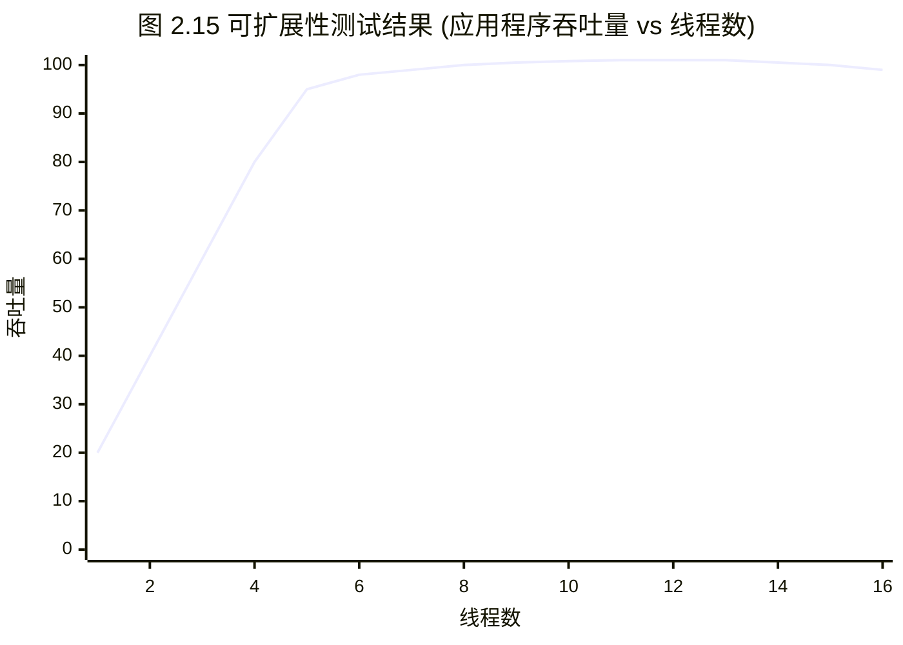
*图 2.15 可扩展性测试结果*

在这种情况下，系统是一个八核系统，每个核心有两个硬件线程。为了进一步确认这与 CPU 核心数有关，可以调查并比较少于八个线程和多于八个线程时的 CPU 效应（例如 IPC；参见第 6 章，CPU）。或者，可以通过在不同核心数量的系统上重复扩展测试并确认拐点按预期移动来实验性地调查这一点。

有许多可扩展性配置文件（profiles）可以通过视觉识别，而无需使用正式模型。这些如图 2.16 所示。

对于其中每一种，x 轴是可扩展性维度，y 轴是结果性能（吞吐量、每秒事务数等）。这些模式是：

- **线性可扩展性**（Linear scalability）：性能随着资源的扩展成比例增加。这可能不会永远持续下去，而可能是另一种可扩展性模式的早期阶段。
- **竞争**（Contention）：架构的某些组件是共享的，并且只能串行使用，对这些共享资源的竞争开始降低扩展的有效性。
- **一致性**（Coherence）：维持数据一致性（包括更改的传播）的代价开始超过扩展带来的收益。
- **拐点**（Knee point）：在某个可扩展性点遇到一个因素，该因素改变了可扩展性配置文件。
- **可扩展性上限**（Scalability ceiling）：达到了硬性限制。这可能是设备瓶颈（例如总线或互连达到最大吞吐量），或者是软件施加的限制（系统资源控制）。


*图 2.16 可扩展性配置文件*

> [!INFO]
> 虽然视觉识别可能简单有效，但通过使用数学模型，你可以了解更多关于系统可扩展性的信息。模型可能会以意想不到的方式偏离数据，这对于调查是有用的：要么模型存在问题（因而你对系统的理解存在问题），要么问题出在系统的真实可扩展性上。接下来的几节将介绍[[阿姆达尔可扩展性定律]]（Amdahl’s Law of Scalability）、[[通用可扩展性定律]]（Universal Scalability Law）和[[排队论]]（Queueing theory）。

### 2.6.3 阿姆达尔可扩展性定律

以计算机架构师吉恩·阿姆达尔（Gene Amdahl）命名 [Amdahl 67]，该定律对系统可扩展性进行建模，考虑了工作负载中无法并行扩展的串行组件。它可用于研究 CPU、线程、工作负载等的扩展。

阿姆达尔可扩展性定律在之前的可扩展性配置文件中显示为竞争，描述了对串行资源或工作负载组件的竞争。它可以定义为 [Gunther 97]：

$$C(N) = \frac{N}{1 + \alpha(N - 1)}$$

相对容量为 $C(N)$，$N$ 是扩展维度，例如 CPU 数量或用户负载。参数 $\alpha$（其中 $0 \le \alpha \le 1$）代表串行化程度，即它偏离线性可扩展性的程度。

> [!TIP] 应用阿姆达尔定律的步骤
> 1. 收集一定范围 $N$ 的数据，可以通过观测现有系统，也可以通过使用微基准测试或负载生成器进行实验。
> 2. 执行回归分析以确定阿姆达尔参数（$\alpha$）；这可以使用统计软件完成，例如 `gnuplot` 或 R。
> 3. 展示结果以进行分析。可以将收集的数据点与模型函数一起绘制，以预测扩展并揭示数据与模型之间的差异。这同样可以使用 `gnuplot` 或 R 来完成。

以下是用于阿姆达尔可扩展性定律回归分析的示例 `gnuplot` 代码，用于提供如何执行此步骤的感知：

```gnuplot
inputN = 10                     # 作为模型输入包含的行数
alpha = 0.1                     # 起始点（种子）
amdahl(N) = N1 * N/(1 + alpha * (N - 1))
# 回归分析（非线性最小二乘拟合）
fit amdahl(x) filename every ::1::inputN using 1:2 via alpha
```

在 R 中处理此问题需要类似数量的代码，涉及使用 `nls()` 函数进行非线性最小二乘拟合以计算系数，然后在绘图期间使用这些系数。有关 `gnuplot` 和 R 中的完整代码，请参见本章末尾参考文献中的性能可扩展性模型工具包 [Gregg 14a]。

阿姆达尔可扩展性定律函数的示例将在下一节中展示。

### 2.6.4 通用可扩展性定律

[[通用可扩展性定律]]（Universal Scalability Law，USL），以前被称为超串行模型 [Gunther 97]，由尼尔·冈瑟（Neil Gunther）博士开发，以包含一致性延迟的参数。这在之前被描绘为一致性可扩展性配置文件，其中包含了竞争的影响。

USL 可以定义为：

$$C(N) = \frac{N}{1 + \alpha(N - 1) + \beta N(N - 1)}$$

$C(N)$、$N$ 和 $\alpha$ 与阿姆达尔可扩展性定律中的相同。$\beta$ 是一致性参数。当 $\beta == 0$ 时，这就变成了阿姆达尔可扩展性定律。

USL 和阿姆达尔可扩展性定律分析的示例如图 2.17 所示。

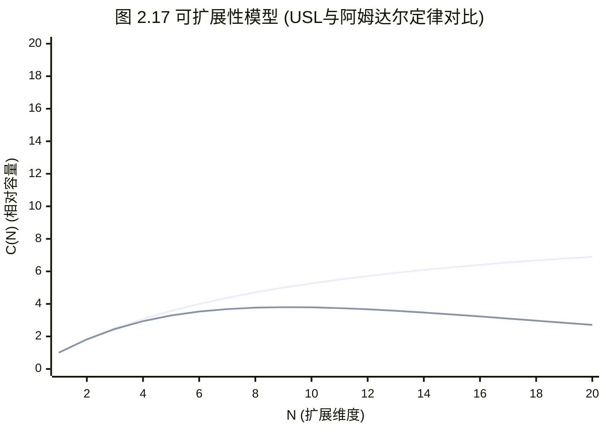
*图 2.17 可扩展性模型*

输入数据集具有高度的方差，使得视觉上难以确定可扩展性配置文件。前十个数据点（绘制为圆圈）被提供给模型。另外十个数据点也被绘制出来（绘制为十字），用于检查模型预测与现实的对比。

> [!INFO] 扩展阅读
> 有关 USL 分析的更多信息，请参见 [Gunther 97] 和 [Gunther 07]。

### 2.6.5 排队论

[[排队论]]（Queueing theory）是对带有队列的系统的数学研究，提供了分析其排队长度、等待时间（延迟）和利用率（基于时间）的方法。计算中的许多组件，包括软件和硬件，都可以建模为排队系统。多个排队系统的建模被称为排队网络。

本节总结了排队论的作用，并提供了一个示例来帮助你理解该作用。这是一个庞大的研究领域，在其他文献中有详细介绍 [Jain 91][Gunther 97]。

排队论建立在数学和统计学的各个领域之上，包括概率分布、随机过程、[[爱尔朗C公式]]（Erlang’s C formula，Agner Krarup Erlang 发明了排队论）和[[利特尔定律]]（Little’s Law）。利特尔定律可以表示为：

$$L = \lambda W$$

这确定了系统中的平均请求数 $L$ 等于平均到达率 $\lambda$ 乘以系统中的平均请求时间 $W$。这可以应用于队列，使得 $L$ 是队列中的请求数，而 $W$ 是队列中的平均等待时间。

> [!EXAMPLE] 排队系统可以回答的问题
> 排队系统可用于回答各种问题，包括以下内容：
> - 如果负载翻倍，平均响应时间将是多少？
> - 增加额外的处理器后，对平均响应时间会有什么影响？
> - 当负载翻倍时，系统能否提供低于 100 毫秒的第 90 百分位响应时间？

除响应时间外，还可以研究其他因素，包括利用率、队列长度和驻留作业数。

一个简单的排队系统模型如图 2.18 所示。


*图 2.18 排队模型*

它有一个单一的服务中心，处理来自队列的作业。排队系统可以有多个并行处理工作的服务中心。在排队论中，服务中心通常被称为服务器。

排队系统可以通过三个因素进行分类：

- **到达过程**（Arrival process）：描述排队系统请求的到达间隔时间，它可能是随机的、固定时间的，或者是诸如[[泊松过程]]（Poisson）的过程（它使用指数分布来表示到达时间）。
- **服务时间分布**（Service time distribution）：描述服务中心的服务时间。它们可能是固定的（确定性）、指数的或另一种分布类型。
- **服务中心数量**（Number of service centers）：一个或多个。

这些因素可以用[[肯德尔记号]]（Kendall’s notation）来书写。

#### 肯德尔记号

这种记号为每个属性分配代码。其形式为：

`A/S/m`

这些分别代表到达过程（A）、服务时间分布（S）和服务中心数量。肯德尔记号还有一种扩展形式，包含更多因素：系统中的缓冲区数量、总体规模和服务规则。

常见研究的排队系统示例如下：

- **M/M/1**：马尔可夫到达（指数分布的到达时间）、马尔可夫服务时间（指数分布）、一个服务中心。

# 2.3 方法论：建模、统计与可视化

■ M/M/c：与 M/M/1 相同，但是多服务台模型

■ M/G/1：马尔可夫到达，一般服务时间分布（任意分布），单服务台

■ M/D/1：马尔可夫到达，确定性服务时间（固定），单服务台

M/G/1 通常用于研究旋转硬盘的性能。

> [!EXAMPLE] M/D/1 与 60% 利用率
> 作为排队论的一个简单示例，考虑一个以确定性方式响应工作负载的磁盘（这是一个简化模型）。该模型为 M/D/1。
> 
> 提出的问题是：磁盘的响应时间如何随着利用率的增加而变化？
> 
> 排队论允许计算 M/D/1 的响应时间：
> 
> $$r = \frac{s(2 - \rho)}{2(1 - \rho)}$$
> 
> 其中，响应时间 $r$ 是由服务时间 $s$ 和利用率 $\rho$ 定义的。
> 
> 对于 1 ms 的服务时间，以及从 0 到 100% 的利用率，这种关系已在图 2.19 中绘制出来。


> [!INFO] 图 2.19 描述：M/D/1 平均响应时间与利用率的关系图。该图展示了随着利用率（横轴）从 0% 增加到 100%，平均响应时间（纵轴）起初缓慢增长，但在越过 60% 后呈指数级急剧上升的曲线。

超过 60% 的利用率后，平均响应时间会翻倍。到了 80%，它已经翻了三倍。由于磁盘 I/O 延迟通常是应用程序的瓶颈资源，将平均延迟增加一倍或更高会对应用程序性能产生显著的负面影响。这就是为什么磁盘利用率在远未达到 100% 之前就可能成为问题，因为这是一个排队系统，请求（通常）不能被中断，必须等待轮到它们。这与 CPU 不同，例如在 CPU 中，高优先级的工作可以抢占。

当利用率与负载相关时，该图表可以直观地回答前面的问题——如果负载翻倍，平均响应时间将是多少？

这个模型很简单，而且在某些方面它展示了最好的情况。服务时间的变化会使平均响应时间变得更高（例如，使用 M/G/1 或 M/M/1）。还存在一个响应时间分布，图 2.19 中未显示，使得第 90 百分位和第 99 百分位在利用率超过 60% 时退化得更快。

与之前 Amdahl 可扩展性定律的 gnuplot 示例一样，展示一些实际代码可能会更具说明性，以了解可能涉及的内容。这次使用了 R 统计软件 [R Project 20]：

```r
svc_ms <- 1                   # 平均磁盘 I/O 服务时间, ms
util_min <- 0                 # 绘图范围起点
util_max <- 100               # 绘图范围终点
ms_min <- 0                   # 响应时间轴起点
ms_max <- 10                  # 响应时间轴终点
# 绘制平均响应时间与利用率的关系 (M/D/1)
plot(x <- c(util_min:util_max), svc_ms * (2 - x/100) / (2 * (1 - x/100)),
    type="l", lty=1, lwd=1,
    xlim=c(util_min, util_max), ylim=c(ms_min, ms_max),
    xlab="Utilization %", ylab="Mean Response Time (ms)")
```

之前的 M/D/1 方程已传递给 `plot()` 函数。这段代码的大部分内容是指定图表的限制、线条属性和轴标签。

---

## 2.7 容量规划

容量规划检查系统处理负载的能力以及随着负载扩展它将如何扩展。它可以通过多种方式执行，包括研究资源限制和因子分析（在此介绍），以及前面介绍的建模。本节还包括用于扩展的解决方案，包括负载均衡器和分片。有关此主题的更多信息，请参阅 *The Art of Capacity Planning* [Allspaw 08]。

对于特定应用程序的容量规划，最好有一个量化的性能目标来为之规划。确定此目标的内容将在第 5 章“应用程序”的早期部分讨论。

### 2.7.1 资源限制

这种方法是寻找在负载下将成为瓶颈的资源。对于容器，资源可能会遇到成为瓶颈的软件强加限制。此方法的步骤是：

1. 测量服务器请求的速率，并随时间监控此速率。
2. 测量硬件和软件资源使用情况。随时间监控此速率。
3. 用所使用的资源来表示服务器请求。
4. 将服务器请求外推到每个资源的已知（或实验确定）限制。

首先确定服务器的角色及其服务的请求类型。例如，Web 服务器提供 HTTP 请求，网络文件系统 (NFS) 服务器提供 NFS 协议请求（操作），数据库服务器提供查询请求（或命令请求，查询是其中的子集）。

下一步是确定每个请求的系统资源消耗。对于现有系统，可以测量当前的请求速率以及资源利用率。然后可以使用外推法查看哪个资源将首先达到 100% 利用率，以及请求速率将是多少。

对于未来的系统，可以使用微基准测试或负载生成工具在测试环境中模拟预期的请求，同时测量资源利用率。如果有足够的客户端负载，您可能能够通过实验找到限制。

要监控的资源包括：

- **硬件**：CPU 利用率、内存使用量、磁盘 IOPS、磁盘吞吐量、磁盘容量（已用卷）、网络吞吐量
- **软件**：虚拟内存使用量、进程/任务/线程、文件描述符

> [!TIP] 示例计算
> 假设您正在查看一个当前执行 1,000 请求/秒的现有系统。最繁忙的资源是 16 个 CPU，平均利用率为 40%；您预测一旦它们达到 100% 利用率，它们将成为此工作负载的瓶颈。问题变成了：在那一刻，每秒请求速率将是多少？
> 
> 每个请求的 CPU% = 总 CPU% / 请求数 = 16 × 40% / 1,000 = 每个请求 0.64% CPU
> 
> 最大请求/秒 = 100% × 16 个 CPU / 每个请求的 CPU% = 1,600 / 0.64 = 2,500 请求/秒

预测为 2,500 请求/秒，此时 CPU 将 100% 繁忙。这是容量的粗略最佳情况估计，因为在请求达到该速率之前可能会遇到其他限制因素。

此练习仅使用了一个数据点：1,000 的应用程序吞吐量（每秒请求数）与 40% 的设备利用率的对比。如果启用了随时间推移的监控，则可以包含不同吞吐量和利用率下的多个数据点，以提高估计的准确性。图 2.20 展示了处理这些数据并外推最大应用程序吞吐量的可视化方法。


> [!INFO] 图 2.20 描述：资源限制分析图。该图通常以设备利用率为横轴，应用程序吞吐量为纵轴，通过散点图描绘不同时间点测量的数据，并绘制一条外推趋势线穿过这些数据点，延伸至 100% 利用率线，以预测系统最大可支持的请求速率。

2,500 请求/秒足够吗？回答这个问题需要了解峰值工作负载将是多少，这体现在日常访问模式中。对于您随时间监控的现有系统，您可能已经对峰值会有什么样子有了一个概念。

考虑一个每天处理 100,000 次网站点击的 Web 服务器。这听起来可能很多，但作为平均只有 1 个请求/秒——并不多。然而，可能是 100,000 次网站点击中的大部分发生在发布新内容后的几秒钟内，因此峰值是显著的。

### 2.7.2 因子分析

在购买和部署新系统时，通常有许多因素可以改变以实现所需的性能。这些可能包括改变磁盘和 CPU 的数量、RAM 的数量、闪存设备的使用、RAID 配置、文件系统设置等。任务通常是以最低成本实现所需的性能。

测试所有组合将确定哪个具有最佳性价比；然而，这可能会很快失控：八个二元因素将需要 256 次测试。

一个解决方案是测试有限的一组组合。这是一种基于已知最大系统配置的方法：

1. 测试所有因素配置为最大时的性能。
2. 逐一更改因素，测试性能（每个因素的测试性能都应该下降）。
3. 根据测量结果，将性能下降百分比连同节省的成本归因于每个因素。
4. 从最大性能（和成本）开始，选择因素以节省成本，同时根据它们的综合性能下降维持所需的每秒请求数。
5. 重新测试计算出的配置，以确认交付的性能。

对于一个八因素系统，这种方法可能只需要十次测试。

> [!EXAMPLE] 存储系统因子分析示例
> 作为一个例子，考虑为一个新存储系统进行容量规划，要求 1 Gbyte/s 的读取吞吐量和 200 Gbyte 的工作集大小。最大配置可实现 2 Gbytes/s，包括四个处理器、256 Gbytes 的 DRAM、2 块双端口 10 GbE 网卡、巨型帧，并且未启用压缩或加密（激活这些成本很高）。
> 
> 切换到两个处理器会使性能降低 30%，一块网卡降低 25%，非巨型帧降低 35%，加密降低 10%，压缩降低 40%，较少的 DRAM 降低 90%，因为工作负载不再期望被完全缓存。
> 
> 鉴于这些性能下降及其已知的节省，现在可以计算出满足要求的最佳性价比系统；它可能是一个带有单一网卡的双处理器系统，满足所需的吞吐量：
> `2 × (1 – 0.30) × (1 – 0.25) = 1.04 Gbytes/s` 估计值。
> 
> 然后测试此配置是明智的，以防这些组件组合使用时的性能与预期不同。

### 2.7.3 扩展解决方案

满足更高的性能需求通常意味着更大的系统，这种策略称为[[垂直扩展]] (Vertical Scaling)。将负载分散到众多系统上，通常由称为[[负载均衡器]] (Load Balancers) 的系统作为前端，使它们看起来像一个系统，这称为[[水平扩展]] (Horizontal Scaling)。

云计算通过建立在更小的虚拟化系统而不是完整系统之上，进一步推动了水平扩展。这在购买计算资源以处理所需负载时提供了更细的粒度，并允许以小而高效的增量进行扩展。由于不需要像企业大型机（包括支持合同承诺）那样进行初始的巨额购买，因此在项目的早期阶段对严格容量规划的需求较少。

有些技术可以基于性能指标自动执行云扩展。AWS 的此类技术称为自动伸缩组 ([[Auto Scaling Group]], ASG)。可以创建自定义扩展策略，以根据使用率指标增加和减少实例数量。如图 2.21 所示。


> [!INFO] 图 2.21 描述：自动伸缩组 (ASG) 示意图。图中展示了外部流量通过负载均衡器分发到由多个 EC2 实例组成的自动伸缩组中，并且 CloudWatch 指标反馈给 ASG 以动态调整实例数量。

Netflix 通常使用目标 CPU 利用率为 60% 的 ASG，并会随着负载上下伸缩以维持该目标。

容器编排系统也可以提供对自动伸缩的支持。例如，Kubernetes 提供了水平 Pod 伸缩器 ([[Horizontal Pod Autoscalers]], HPAs)，它可以根据 CPU 利用率或其他自定义指标扩展 Pod（容器）的数量 [Kubernetes 20a]。

对于数据库，一种常见的扩展策略是[[分片]] (Sharding)，即将数据拆分为逻辑组件，每个组件由其自己的数据库（或冗余数据库组）管理。例如，客户数据库可以通过将客户姓名拆分为字母范围来拆分为多个部分。选择有效的分片键 ([[Sharding Key]]) 对于在数据库之间均匀分散负载至关重要。

---

## 2.8 统计

> [!IMPORTANT] 核心观点
> 良好地理解如何使用统计及其局限性是非常重要的。

本节讨论使用统计（指标）量化性能问题，以及统计类型，包括平均值、标准差和百分位数。

# 2.3 方法论：建模、统计与可视化

## 2.8 统计

很好地理解如何使用统计以及其局限性是至关重要的。本节讨论使用统计（指标）和统计类型（包括平均值、标准差和百分位数）来量化性能问题。

### 2.8.1 量化性能收益

量化问题及修复它们所带来的潜在性能提升，可以使得这些问题能够被比较和排定优先级。此任务可以通过观察或实验来执行。

#### 基于观察

使用观察来量化性能问题：

1. 选择一个可靠的指标。
2. 估算解决该问题所带来的性能收益。

例如：

- **观察结果**：应用程序请求耗时 10 ms。
- **观察结果**：其中，9 ms 是磁盘 I/O。
- **建议**：配置应用程序以在内存中缓存 I/O，预期的 DRAM 延迟大约为 ~10 μs。
- **估算收益**：10 ms → 1.01 ms（10 ms - 9 ms + 10 μs）= 约 9 倍收益。

如第 2.3 节概念中所介绍的，[[延迟]]（时间）非常适合用于此目的，因为它可以在组件之间直接进行比较，从而使得此类计算成为可能。

当使用延迟时，请确保它是作为应用程序请求的同步组件来测量的。某些事件是异步发生的，例如后台磁盘 I/O（写入刷盘到磁盘），并不会直接影响应用程序性能。

#### 基于实验

通过实验量化性能问题：

1. 应用修复方案。
2. 使用可靠的指标量化前后的差异。

例如：

- **观察结果**：应用程序事务延迟平均为 10 ms。
- **实验**：增加应用程序线程数以允许更多并发，而不是排队。
- **观察结果**：应用程序事务延迟平均为 2 ms。
- **收益**：10 ms → 2 ms = 5 倍。

> [!WARNING] 生产环境风险
> 如果在生产环境中尝试应用修复方案的成本很高，那么这种方法可能是不合适的！对于这种情况，应该使用基于观察的方法。

### 2.8.2 平均值

平均值通过单个值来表示一个数据集：即集中趋势指数。最常用的平均值类型是算术平均值（或简称均值），它是值的总和除以值的数量。其他类型包括几何平均数和调和平均数。

#### 几何平均数

几何平均数是相乘值的 n 次方根（其中 n 是值的数量）。这在 [Jain 91] 中有所描述，其中包含一个将其用于网络性能分析的示例：如果内核网络栈每一层的性能提升是单独测量的，那么平均性能提升是多少？由于各层在同一个数据包上协同工作，性能提升具有“乘法”效应，这可以通过几何平均数得到最好的总结。

#### 调和平均数

调和平均数是值的数量除以其倒数之和。它更适合用于求取速率的平均值，例如，计算传输 800 Mbytes 数据的平均传输速率，当最初的 100 Mbytes 以 50 Mbytes/s 发送，而剩余的 700 Mbytes 以 10 Mbytes/s 的节流速率发送时。使用调和平均数的答案是 800 / (100/50 + 700/10) = 11.1 Mbytes/s。

#### 随时间的平均值

在性能方面，我们研究的许多指标都是随时间的平均值。CPU 永远不会是“处于 50% 利用率”；它是在某个时间间隔（可能是一秒、一分钟或一小时）内被利用了 50%。在考虑平均值时，检查时间间隔是至关重要的。

> [!EXAMPLE] 监控间隔掩盖的峰值
> 例如，我曾遇到一个问题，客户遇到了由 CPU 饱和（调度器延迟）引起的性能问题，尽管他们的监控工具显示 CPU 利用率从未超过 80%。该监控工具报告的是 5 分钟的平均值，这掩盖了 CPU 利用率一次达到 100% 持续数秒的时期。

#### 衰减平均值

衰减平均值有时用于系统性能中。一个例子是各种工具（包括 `uptime(1)`）报告的系统“负载均值”。

衰减平均值仍然是在一个时间间隔内测量的，但最近的时间比较远的时间被赋予更大的权重。这减少了（抑制了）平均值中的短期波动。

关于此内容的更多信息，请参见第 6 章 CPU，第 6.6 节可观测性工具中的负载均值。

#### 局限性

平均值是一种隐藏了细节的汇总统计量。我分析过许多偶尔出现磁盘 I/O 延迟异常值超过 100 ms 的情况，而平均延迟接近 1 ms。为了更好地理解数据，你可以使用第 2.8.3 节标准差、百分位数、中位数（下一节）中涵盖的附加统计量，以及第 2.10 节可视化中涵盖的可视化方法。

### 2.8.3 标准差、百分位数、中位数

标准差和百分位数（例如，第 99 百分位数）是提供数据分布信息的统计技术。标准差是方差的度量，值越大表示与平均值（均值）的方差越大。第 99 百分位数显示了分布中包含 99% 值的那个点。图 2.22 描绘了正态分布的这些值，连同最小值和最大值。

**图 2.22 统计值**

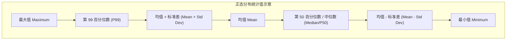

> [!INFO] 图像描述补充
> 原图 2.22 展示了一个典型的正态分布钟形曲线，并在曲线上标注了均值、中位数（在正态分布下与均值重合）、标准差区间、第 99 百分位数、最大值和最小值的位置。

诸如第 90、第 95、第 99 和第 99.9 百分位数等百分位数，用于请求延迟的性能监控中，以量化总体中最慢的部分。这些也可以在服务级别协议（SLA）中指定，作为衡量性能对大多数用户是否可接受的一种方式。

第 50 百分位数，称为[[中位数]]，可以进行检查以显示大部分数据所在的位置。

### 2.8.4 变异系数

由于标准差是相对于均值的，因此只有在同时考虑标准差和均值时才能理解方差。单独的标准差为 50 告诉我们的信息很少。加上均值 200 就能告诉我们很多信息。

有一种方法可以将变异表达为单个指标：标准差与均值的比率，称为[[变异系数]]（CoV 或 CV）。对于此示例，CV 为 25%。较低的 CV 意味着较小的方差。

将方差表达为单个指标的另一种表现形式是 $z$ 值，即一个值偏离均值多少个标准差。

### 2.8.5 多模态分布

均值、标准差和百分位数存在一个问题，这从上一张图表中可能很明显：它们是为类正态分布或单峰分布设计的。系统性能通常是双峰的，快速代码路径返回低延迟，慢速代码路径返回高延迟，或者缓存命中返回低延迟，缓存未命中返回高延迟。也可能存在两种以上的模式（多模态）。

图 2.23 显示了读写混合工作负载（包括随机和顺序 I/O）的磁盘 I/O 延迟分布。

**图 2.23 延迟分布**

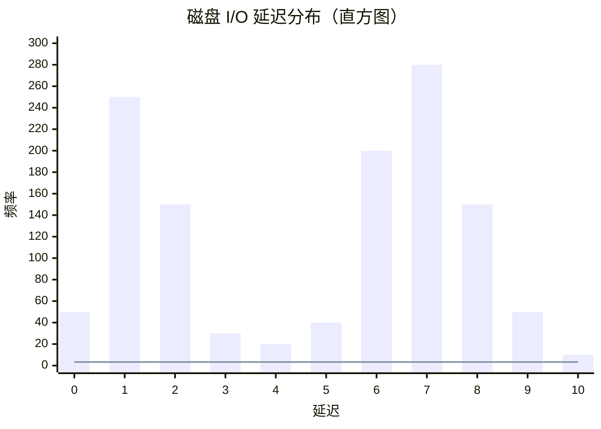

> [!INFO] 图像描述补充
> 原图 2.23 以直方图形式展示了双模态分布。左侧模式位于 1 ms 以下（磁盘缓存命中），右侧模式在 7 ms 左右达到峰值（磁盘缓存未命中：随机读取）。一条垂直线标示了平均 I/O 延迟为 3.3 ms，这恰恰落在了两个峰值的谷底，极具误导性。

这以直方图的形式呈现，显示了两种模式。左侧的模式显示延迟小于 1 ms，这是磁盘缓存命中。右侧的峰值在 7 ms 左右，是磁盘缓存未命中：随机读取。平均（均值）I/O 延迟为 3.3 ms，被绘制为一条垂直线。这个平均值不是集中趋势指数（如前所述）；事实上，它几乎是相反的。作为指标，这种分布的平均值具有严重的误导性。

> [!QUOTE] 著名引言
> 曾有人涉水渡过一条平均深度为六英寸的溪流，结果却淹死了。——W. I. E. Gates

每次你看到平均值被用作性能指标，特别是平均延迟时，请问：**分布是什么样的？** 第 2.10 节可视化提供了另一个示例，并展示了不同的可视化和指标在显示这种分布时有多么有效。

### 2.8.6 异常值

另一个统计问题是[[异常值]]的存在：极少数不符合预期分布（单模态或多模态）的极高或极低值。

磁盘 I/O 延迟异常值就是一个例子——极偶尔出现的磁盘 I/O 可能会耗费超过 1,000 ms，而大多数磁盘 I/O 在 0 到 10 ms 之间。像这样的延迟异常值会导致严重的性能问题，但除了最大值之外，很难从大多数指标类型中识别出它们的存在。另一个例子是由基于 TCP 定时器的重传引起的网络 I/O 延迟异常值。

对于正态分布，异常值的存在可能会略微偏移均值，但不会偏移中位数（考虑这一点可能很有用）。标准差和第 99 百分位数有更好的机会识别异常值，但这仍然取决于它们的频率。

为了更好地理解多模态分布、异常值以及其他复杂但常见的行为，请检查完整的分布，例如使用直方图。有关执行此操作的更多方法，请参见第 2.10 节可视化。

## 2.9 监控

[[系统性能监控]]随着时间的推移（时间序列）记录性能统计信息，以便可以将过去与现在进行比较，并可以识别基于时间的使用模式。这对于容量规划、量化增长和显示峰值使用情况非常有用。历史值还可以通过显示过去“正常”范围和平均值的情况，为理解性能指标的当前值提供上下文。

### 2.9.1 基于时间的模式

基于时间的模式的示例显示在图 2.24、2.25 和 2.26 中，这些图绘制了云计算服务器在不同时间间隔内的文件系统读取情况。

**图 2.24 监控活动：一天**

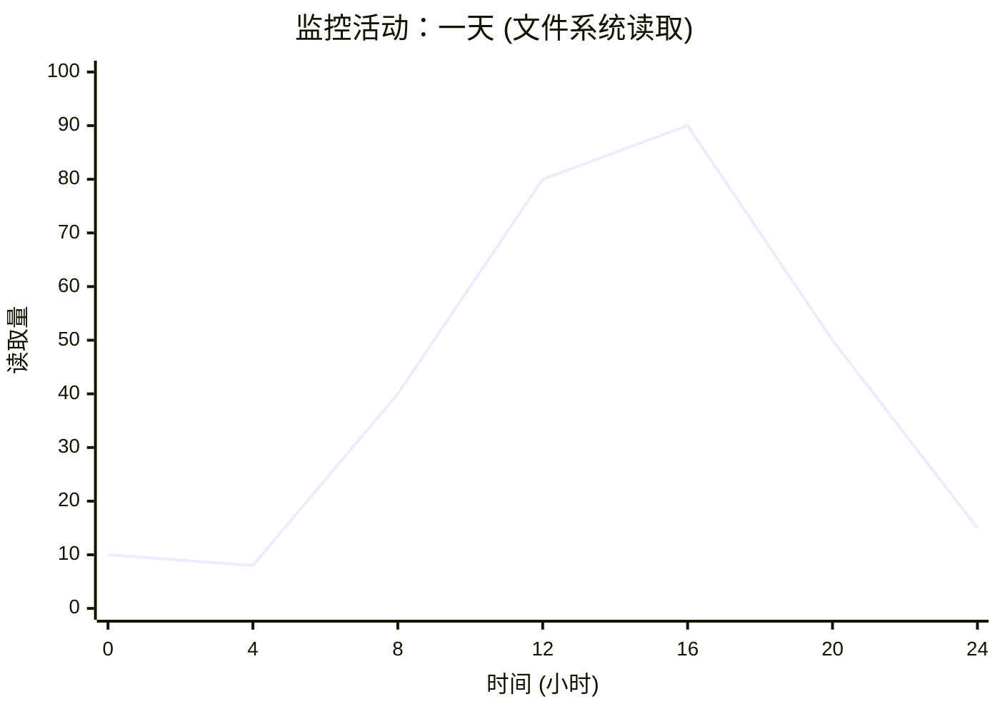

**图 2.25 监控活动：五天**

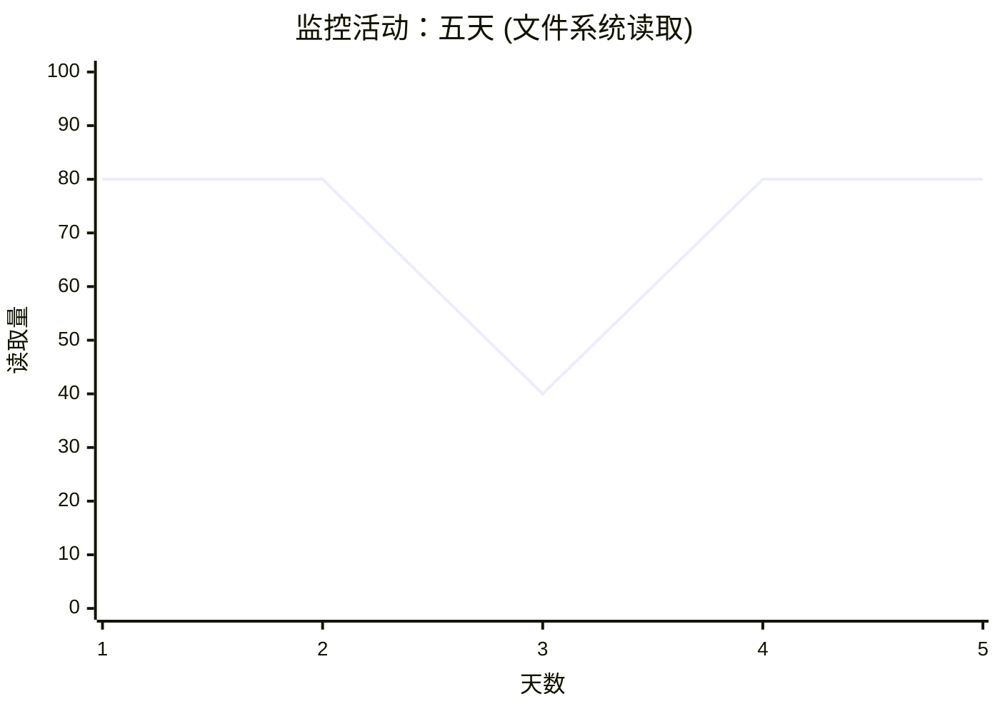

**图 2.26 监控活动：30 天**

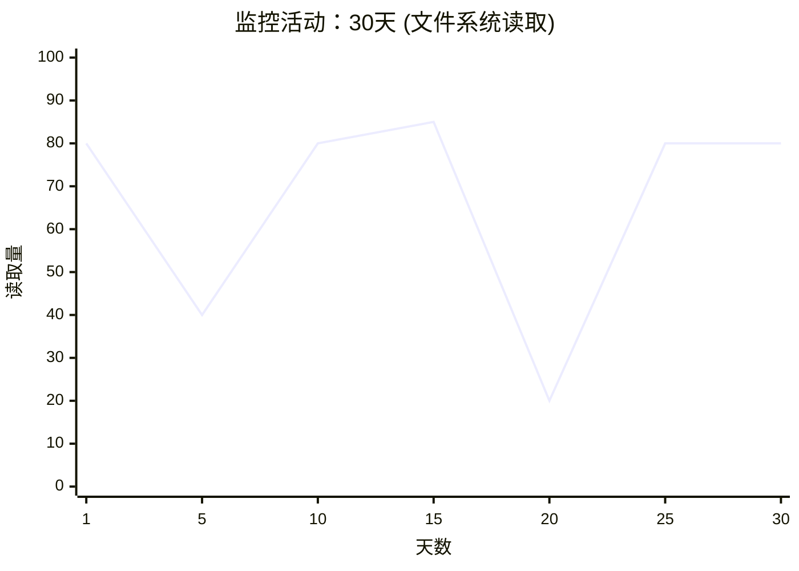

> [!INFO] 图像描述补充
> 原图 2.24 展示了一天内的活动，上午 8 点左右开始攀升，下午略有下降，然后在夜间衰减。图 2.25 显示了五天的趋势，表明周末活动较低。图 2.26 显示了 30 天的趋势，其中可见几个短暂的尖峰，并再次印证了周末活动的下降。

这些图表显示了一种每日模式，大约在上午 8 点开始攀升，在下午略有下降，然后在夜间衰减。更长尺度的图表显示，周末的活动较低。在 30 天的图表中还可以看到几个短暂的尖峰。

在历史数据中通常可以看到各种行为周期，包括图中所示的那些，包括：

- **每小时**：活动可能每小时从应用程序环境中发生，例如监控和报告任务。这些任务以 5 或 10 分钟的周期执行也是很常见的。
- **每天**：可能存在与工作时间（上午 9 点到下午 5 点）一致的使用日常模式，如果服务器跨多个时区，这种模式可能会被拉长。对于互联网服务器，该模式可能会跟随全球用户活跃的时间。其他日常活动可能包括每晚的日志轮换和备份。
- **每周**：除了每日模式外，可能还存在基于工作日和周末的每周模式。
- **每季度**：财务报告按季度计划进行。
- **每年**：负载的年度模式可能是由于学校日程和假期造成的。

负载的不规则增加可能伴随其他活动发生，例如在网站上发布新内容，以及销售活动（美国的黑色星期五/网络星期一）。负载的不规则减少可能是由于外部活动造成的，例如大范围的停电或互联网中断，以及体育总决赛（每个人都观看比赛而不是使用你的产品）^6^。

# 2.3 方法论：建模、统计与可视化

### 2.9.2 监控产品

市面上有许多用于系统性能监控的第三方产品。典型的功能包括归档数据，并将其呈现为基于浏览器的交互式图表，以及提供可配置的警报。

其中一些产品通过在系统上运行代理（也称为导出器/exporters）来收集统计数据来运作。这些代理要么执行操作系统的可观测性工具（如 `iostat(1)` 或 `sar(1)`）并解析输出的文本（这被认为是低效的），要么直接从操作系统库和内核接口读取数据。监控产品支持一系列自定义代理，用于从特定目标导出统计数据：Web 服务器、数据库和语言运行时环境。

随着系统变得更加分布式以及云计算使用的持续增长，您将更频繁地需要监控大量系统：数百、数千甚至更多。这就是集中式监控产品特别有用的地方，它允许从一个界面监控整个环境。

作为一个具体的例子：Netflix 云由超过 200,000 个实例组成，并使用 Atlas 云级监控工具进行监控，该工具由 Netflix 定制构建以在此规模下运行，并且是开源的 [Harrington 14]。其他监控产品将在第 4 章“可观测性工具”第 4.2.4 节“监控”中讨论。

### 2.9.3 自启动以来的摘要

如果没有进行监控，请检查操作系统是否至少提供了自启动以来的摘要值，这些值可用于与当前值进行比较。

## 2.10 可视化

可视化允许检查比文本更容易理解（有时甚至更容易显示）的更多数据。它们还支持模式识别和模式匹配。这可以是识别不同指标源之间相关性的有效方法，这种相关性可能很难通过编程方式实现，但在视觉上却很容易做到。

> [!NOTE] 脚注 6
> 当我在 Netflix SRE 待命轮值期间，我学到了一些针对这些情况的非传统分析工具：查看社交媒体以确认疑似停电，以及在团队聊天室询问是否有人知道有体育决赛。

### 2.10.1 折线图

折线图（也称为线图/line graph）是一种广为人知的基础可视化方式。它通常用于检查随时间变化的性能指标，在 x 轴上显示时间的推移。

图 2.27 是一个例子，显示了 20 秒时间内的平均（均值）磁盘 I/O 延迟。这是在一个运行 MySQL 数据库的生产云服务器上测量的，该服务器被怀疑磁盘 I/O 延迟导致了查询缓慢。

**图 2.27 平均延迟折线图**

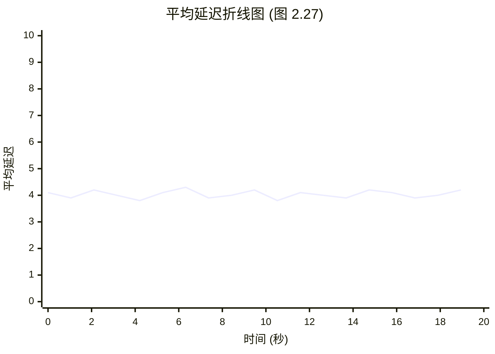

这张折线图显示了相当一致的大约 4 毫秒的平均读取延迟，这高于这些磁盘的预期值。

可以绘制多条线，在同一组坐标轴上显示相关数据。在这个例子中，可以为每个磁盘绘制一条单独的线，以显示它们是否表现出相似的性能。

也可以绘制统计值，提供有关数据分布的更多信息。图 2.28 显示了相同范围的磁盘 I/O 事件，并添加了每秒中位数、标准差和百分位数的线条。请注意，y 轴现在的范围比前一张折线图大得多（大了 8 倍）。

这说明了为什么平均值高于预期：分布包含了更高延迟的 I/O。具体来说，1% 的 I/O 超过 20 毫秒，如第 99 百分位数所示。中位数也显示了 I/O 延迟的预期位置，大约为 1 毫秒。

**图 2.28 中位数、均值、标准差、百分位数**

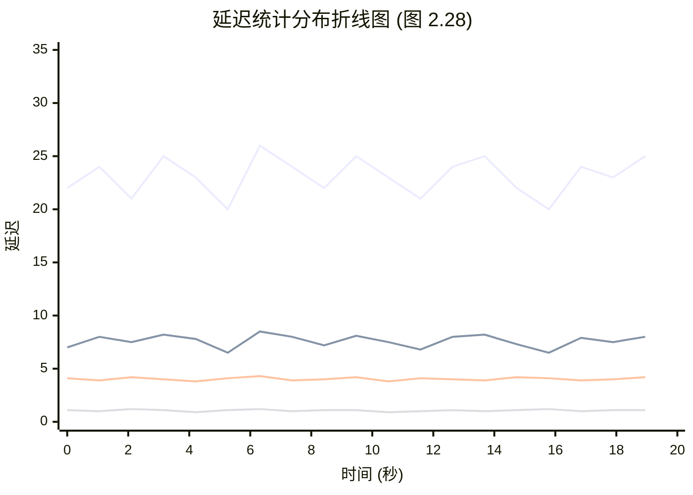

### 2.10.2 散点图

图 2.29 显示了相同时间范围内的磁盘 I/O 事件的散点图，它允许查看所有数据。每个磁盘 I/O 绘制为一个点，其完成时间在 x 轴上，延迟在 y 轴上。

**图 2.29 散点图**

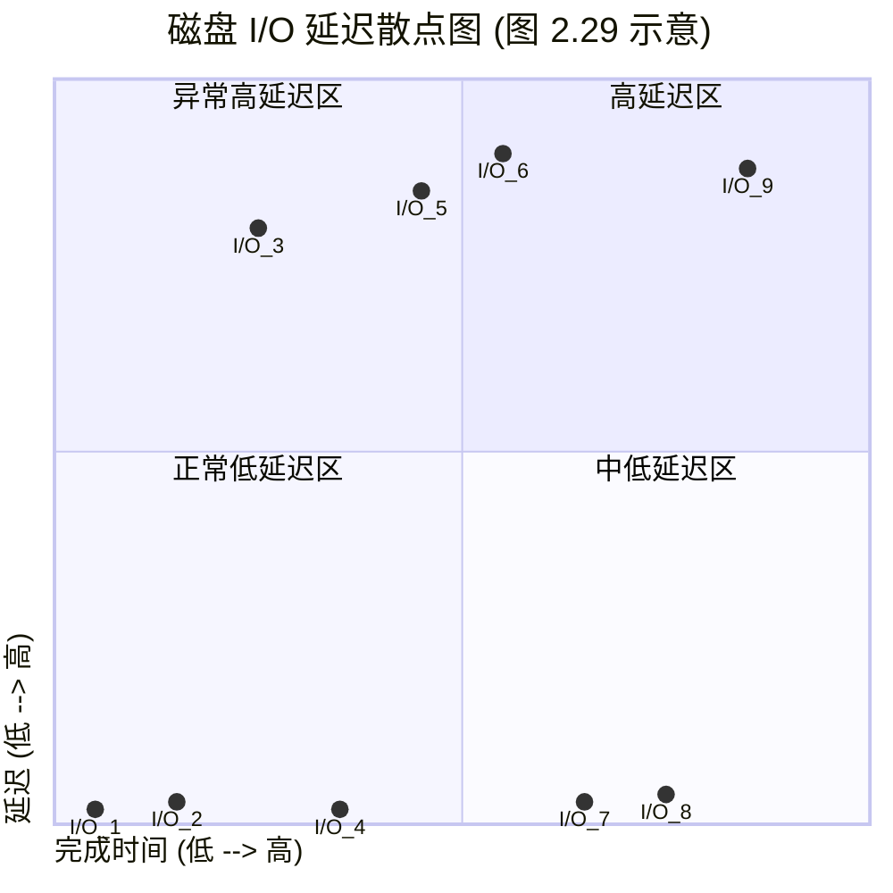

现在，高于预期的平均延迟的来源可以被完全理解了：有许多磁盘 I/O 的延迟为 10 毫秒、20 毫秒，甚至超过 50 毫秒。散点图显示了所有数据，揭示了这些异常值的存在。

许多 I/O 是亚毫秒级的，显示在靠近 x 轴的位置。这就是散点图分辨率开始成为问题的地方，因为点会重叠并变得难以区分。随着数据量的增加，这种情况会变得更糟：想象一下在一个散点图上绘制整个云的事件，涉及数百万个数据点：这些点会合并并变成一面“颜料墙”。

另一个问题是必须收集和处理的数据量：每个 I/O 的 x 和 y 坐标。

### 2.10.3 热力图

热力图（更准确地称为列量化/column quantization）可以通过将 x 和 y 范围量化为称为桶的组来解决散点图的可扩展性问题。这些桶显示为大像素，根据该 x 和 y 范围内的事件数量进行着色。这种量化也解决了散点图的视觉密度限制，允许热力图以相同的方式显示来自单个系统或数千个系统的数据。热力图以前曾用于磁盘偏移量等位置（例如，TazTool [McDougall 06a]）；我发明了它们在计算中用于延迟、利用率和其他指标的用途。延迟热力图首次包含在 Sun Microsystems ZFS 存储设备的 Analytics 中，于 2008 年发布 [Gregg 10a][Gregg 10b]，现在已在 Grafana [Grafana 20] 等性能监控产品中变得很常见。

先前绘制的相同数据集在图 2.30 中显示为热力图。

**图 2.30 热力图**

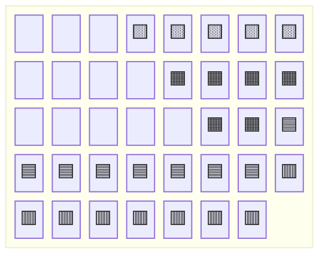

高延迟异常值可以被识别为热力图中位置较高的块，通常颜色较浅，因为它们跨越的 I/O 很少（通常是单个 I/O）。大量数据中的模式开始显现，这在散点图中可能是无法看到的。

此磁盘 I/O 跟踪的完整秒数范围（前面未显示）如图 2.31 的热力图所示。

**图 2.31 热力图：完整范围**

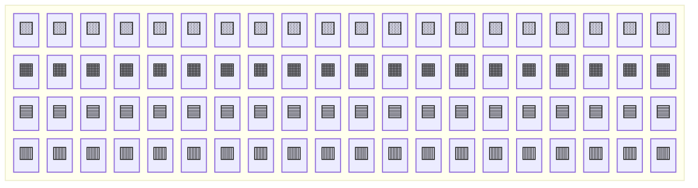

尽管跨越了 9 倍的范围，该可视化仍然非常易读。在大部分范围内可以看到双峰分布，一些 I/O 以接近零的延迟返回（可能是磁盘缓存命中），而另一些则以略低于 1 毫秒的延迟返回（可能是磁盘缓存未命中）。

本书后面还有其他热力图的例子，包括第 6 章“CPU”第 6.7 节“可视化”；第 8 章“文件系统”第 8.6.18 节“可视化”；以及第 9 章“磁盘”第 9.7.3 节“延迟热力图”。我的网站也有延迟、利用率和亚秒偏移热力图的示例 [Gregg 15b]。

### 2.10.4 时间轴图表

时间轴图表将一组活动显示为时间轴上的条形。这些通常用于前端性能分析（Web 浏览器），在那里它们也被称为瀑布图，并显示网络请求的时序。图 2.32 显示了来自 Firefox Web 浏览器的一个示例。

在图 2.32 中，第一个网络请求被突出显示：除了将其持续时间显示为水平条外，该持续时间的组成部分也显示为彩色条。右侧面板也对此进行了解释：第一个请求中最慢的组件是“等待”，即等待来自服务器的 HTTP 响应。请求 2 到 6 在第一个请求开始接收数据后开始，并且可能依赖于该数据。如果图表中包含显式的依赖箭头，它就变成了一种甘特图。

对于后端性能分析（服务器），类似的图表用于显示线程或 CPU 的时间轴。示例软件包括 KernelShark [KernelShark 20] 和 Trace Compass [Eclipse 20]。有关 KernelShark 屏幕截图的示例，请参见第 14 章“Ftrace”第 14.11.5 节“KernelShark”。Trace Compass 还绘制显示依赖关系的箭头，其中一个线程唤醒了另一个线程。

**图 2.32 Firefox 时间轴图表**

```mermaid
gantt
    title 网络请求时间轴 (Firefox 瀑布图示意)
    dateFormat X
    axisFormat %s
    section 请求 1
    阻塞     :a1, 0, 1
    DNS解析  :a2, after a1, 1
    TCP连接   :a3, after a2, 2
    发送请求  :a4, after a3, 1
    等待     :crit, a5, after a4, 5
    接收数据  :a6, after a5, 3
    section 请求 2-6
    阻塞     :b1, 10, 11
    发送请求  :b2, after b1, 1
    等待     :b3, after b2, 2
    接收数据  :b4, after b3, 3
```

### 2.10.5 曲面图

这是三维空间的表示，渲染为三维曲面。当第三维度的值不会频繁地从一个点到下一个点发生剧烈变化时，效果最好，产生类似于连绵起伏的山丘的表面。曲面图通常渲染为线框模型。

图 2.33 显示了每个 CPU 利用率的线框曲面图。它包含来自许多服务器的 60 秒每秒值（这是从横跨超过 300 台物理服务器和 5,312 个 CPU 的数据中心图像中裁剪出来的）[Gregg 11b]。

每台服务器通过将其 16 个 CPU 绘制为曲面上的行，将 60 个每秒利用率测量值绘制为列，然后将曲面的高度设置为利用率值来表示。颜色也设置为反映利用率值。如果需要，可以使用色相和饱和度来向可视化添加第四和第五维度的数据。（如果有足够的分辨率，可以使用模式来指示第六维度。）

然后，这些 16 × 60 的服务器矩形作为棋盘格映射到整个曲面上。即使没有标记，在图像中也可以清楚地看到一些服务器矩形。右侧显示为隆起高原的那个矩形表明其 CPU 几乎始终处于 100% 状态。

网格线的使用突出了海拔的细微变化。一些隐约可见的线条表明单个 CPU 持续以低利用率（百分之几）运行。

**图 2.33 线框曲面图：数据中心 CPU 利用率**

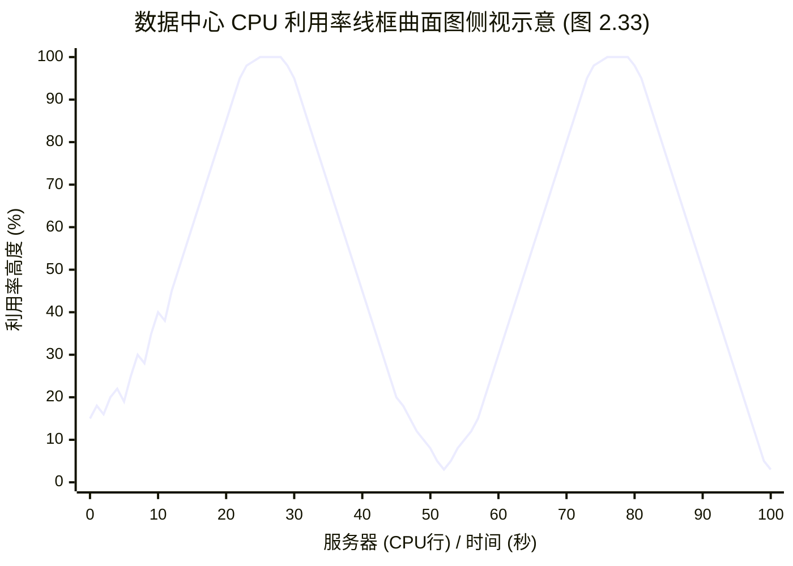

### 2.10.6 可视化工具

从历史上看，Unix 性能分析一直专注于使用基于文本的工具，部分原因是图形支持有限。这类工具可以通过登录会话快速执行并实时报告数据。访问可视化则更加耗时，并且通常需要“跟踪-然后-报告”的周期。在处理紧急性能问题时，您访问指标的速度可能至关重要。

现代可视化工具提供了系统性能的实时视图，可通过浏览器和移动设备访问。有许多产品可以做到这一点，包括许多可以监控您整个云环境的产品。第 1 章“介绍”，第 1.7.1 节“计数器、统计信息和指标”包含了一个来自此类产品 Grafana 的示例屏幕截图，其他监控产品将在第 4 章“可观测性工具”，第 4.2.4 节“监控”中讨论。

## 2.11 练习

1. 回答以下关于关键性能术语的问题：
   - 什么是 [[IOPS]]？
   - 什么是 [[利用率]]？
   - 什么是 [[饱和度]]？
   - 什么是 [[延迟]]？
   - 什么是 [[微基准测试]]？

2. 选择五种方法论用于您（或假设的）环境。选择它们可以进行的顺序，并解释选择每种方法论的原因。

3. 总结使用平均延迟作为唯一性能指标时的问题。这些问题可以通过包含第 99 百分位数来解决吗？

# 2.3 方法论：建模、统计与可视化

## 2.12 参考文献

[Amdahl 67] Amdahl, G., “Validity of the Single Processor Approach to Achieving Large Scale Computing Capabilities,” AFIPS, 1967. 

[Jain 91] Jain, R., The Art of Computer Systems Performance Analysis: Techniques for Experimental Design, Measurement, Simulation and Modeling, Wiley, 1991.

[Cockcroft 95] Cockcroft, A., Sun Performance and Tuning, Prentice Hall, 1995. 

[Gunther 97] Gunther, N., The Practical Performance Analyst, McGraw-Hill, 1997. 

[Wong 97] Wong, B., Configuration and Capacity Planning for Solaris Servers, Prentice Hall, 1997. 

[Elling 00] Elling, R., “Static Performance Tuning,” Sun Blueprints, 2000.

[Millsap 03] Millsap, C., and J. Holt., Optimizing Oracle Performance, O’Reilly, 2003. 

[McDougall 06a] McDougall, R., Mauro, J., and Gregg, B., Solaris Performance and Tools: DTrace and MDB Techniques for Solaris 10 and OpenSolaris, Prentice Hall, 2006.

[Gunther 07] Gunther, N., Guerrilla Capacity Planning, Springer, 2007. 

[Allspaw 08] Allspaw, J., The Art of Capacity Planning, O’Reilly, 2008.

[Gregg 10a] Gregg, B., “Visualizing System Latency,” Communications of the ACM, July 2010.

[Gregg 10b] Gregg, B., “Visualizations for Performance Analysis (and More),” USENIX LISA, https://www.usenix.org/legacy/events/lisa10/tech/#gregg, 2010.

[Gregg 11b] Gregg, B., “Utilization Heat Maps,” http://www.brendangregg.com/HeatMaps/utilization.html, published 2011.

[Williams 11] Williams, C., “The $300m Cable That Will Save Traders Milliseconds,” The Telegraph, https://www.telegraph.co.uk/technology/news/8753784/The-300m-cable-that-will-save-traders-milliseconds.html, 2011.

[Gregg 13b] Gregg, B., “Thinking Methodically about Performance,” Communications of the ACM, February 2013.

[Gregg 14a] Gregg, B., “Performance Scalability Models,” https://github.com/brendangregg/PerfModels, 2014.

[Harrington 14] Harrington, B., and Rapoport, R., “Introducing Atlas: Netflix’s Primary Telemetry Platform,” Netflix Technology Blog, https://medium.com/netflix-techblog/introducing-atlas-netflixs-primary-telemetry-platform-bd31f4d8ed9a, 2014.

[Gregg 15b] Gregg, B., “Heatmaps,” http://www.brendangregg.com/heatmaps.html, 2015.

[Wilkie 18] Wilkie, T., “The RED Method: Patterns for Instrumentation & Monitoring,” Grafana Labs, https://www.slideshare.net/grafana/the-red-method-how-to-monitoring-your-microservices, 2018.

[Eclipse 20] Eclipse Foundation, “Trace Compass,” https://www.eclipse.org/tracecompass, accessed 2020.

[Wikipedia 20] Wikipedia, “Five Whys,” https://en.wikipedia.org/wiki/Five_whys, accessed 2020.

[Grafana 20] Grafana Labs, “Heatmap,” https://grafana.com/docs/grafana/latest/features/panels/heatmap, accessed 2020.

[KernelShark 20] “KernelShark,” https://www.kernelshark.org, accessed 2020.

[Kubernetes 20a] Kubernetes, “Horizontal Pod Autoscaler,” https://kubernetes.io/docs/tasks/run-application/horizontal-pod-autoscale, accessed 2020.

[R Project 20] R Project, “The R Project for Statistical Computing,” https://www.r-project.org, accessed 2020.

> [!NOTE] 关于图像占位符的说明
> 原文在此部分包含以下图像占位符（页码范围 102-124）。由于提取文本中未包含具体的图像内容与说明，此处保留其索引记录。根据本书前文关于可视化图表的讨论，这些图像通常涵盖了线图、散点图、热力图以及性能扩展性模型的图解：
> - Image 1075 on Page 102
> - Image 1078 on Page 103
> - Image 1085 on Page 105
> - Image 1089 on Page 106
> - Image 1092 on Page 107
> - Image 1101 on Page 110
> - Image 1105 on Page 111
> - Image 1117 on Page 114
> - Image 1121 on Page 115
> - Image 1131 on Page 117
> - Image 1132 on Page 117
> - Image 1133 on Page 117
> - Image 1141 on Page 119
> - Image 1145 on Page 120
> - Image 1146 on Page 120
> - Image 1150 on Page 121
> - Image 1155 on Page 122
> - Image 1159 on Page 123
> - Image 1163 on Page 124