# 第3章 操作系统

对操作系统及其内核的理解对于系统性能分析至关重要。你将经常需要提出并验证关于系统行为的假设，例如系统调用是如何执行的、内核如何在 CPU 上调度线程、有限的内存可能如何影响性能，或者文件系统如何处理 I/O。这些活动都需要你运用关于操作系统和内核的知识。

本章的学习目标是：

- 学习内核术语：上下文切换、交换、分页、抢占等。
- 理解内核和系统调用的作用。
- 掌握内核内部机制的工作知识，包括：中断、调度器、虚拟内存和 I/O 栈。
- 了解从 Unix 到 Linux 增加了哪些内核性能特性。
- 建立对扩展 BPF 的基本理解。

本章概述了操作系统和内核，这也是本书其余部分的预备知识。如果你错过了操作系统课程，可以将其视为速成班。请留意你知识体系中的任何空白，因为最后会有一次考试（开个玩笑；只是一个小测验）。有关内核内部机制的更多信息，请参阅本章末尾的参考文献。

本章包含三个部分：

- **术语** 列出核心术语。
- **背景** 总结关键的操作系统和内核概念。
- **内核** 总结 Linux 及其他内核的实现细节。

与性能相关的领域，包括 CPU 调度、内存、磁盘、文件系统、网络以及许多特定的性能工具，将在随后的章节中更详细地介绍。

## 3.1 术语

供参考，以下是本书使用的核心操作系统术语。其中许多也是本章及后续章节中将详细解释的概念。

- **操作系统**：指安装在系统上以便其能够启动和执行程序的软件和文件。它包括内核、管理工具和系统库。
- **内核**：内核是管理系统的程序，包括（取决于内核模型）硬件设备、内存和 CPU 调度。它运行在允许直接访问硬件的特权 CPU 模式下，称为内核态。
- **进程**：操作系统用于执行程序的抽象和环境。程序运行在用户态，通过系统调用或陷入内核来访问内核态（例如，执行设备 I/O）。
- **线程**：一个可以被调度在 CPU 上运行的可执行上下文。内核有多个线程，一个进程包含一个或多个线程。
- **任务**：Linux 中的可运行实体，可以指进程（单线程）、多线程进程中的线程或内核线程。
- **BPF 程序**：在 BPF¹ 执行环境中运行的内核态程序。
- **主存**：系统的物理内存（例如，RAM）。
- **虚拟内存**：主存的抽象，支持多任务和超额订阅。实际上，它是一种无限资源。
- **内核空间**：内核的虚拟内存地址空间。
- **用户空间**：进程的虚拟内存地址空间。
- **用户态**：用户级程序和库（`/usr/bin`、`/usr/lib`...）。
- **上下文切换**：从运行一个线程或进程切换到另一个。这是内核 CPU 调度器的正常功能，涉及将正在运行的 CPU 寄存器集合（线程上下文）切换到新的集合。
- **模式切换**：内核态和用户态之间的切换。
- **系统调用**：用户程序请求内核执行特权操作（包括设备 I/O）的定义良好的协议。
- **处理器**：不要与进程混淆，处理器是包含一个或多个 CPU 的物理芯片。
- **陷入**：发送给内核以请求系统例程（特权操作）的信号。陷入类型包括系统调用、处理器异常和中断。
- **硬件中断**：物理设备发送给内核的信号，通常用于请求 I/O 服务。中断是一种陷入类型。

> [!NOTE] 脚注
> ¹ BPF 最初代表伯克利数据包过滤器，但今天的技术与伯克利、数据包或过滤几乎无关，因此 BPF 已经成为一个独立的名称，而不是缩写。

词汇表包含更多术语供参考，如果本章需要，包括地址空间、缓冲区、CPU、文件描述符、POSIX 和寄存器。

## 3.2 背景

以下各节描述了通用的操作系统和内核概念，将帮助你理解任何操作系统。为了帮助理解，本节包含了一些 Linux 实现细节。接下来的 3.3 节“内核”和 3.4 节“Linux”，重点关注 Unix、BSD 和 Linux 内核的实现细节。

### 3.2.1 内核

内核是操作系统的核心软件。它的功能取决于内核模型：包括 Linux 和 BSD 在内的类 Unix 操作系统拥有一个单体内核，管理 CPU 调度、内存、文件系统、网络协议和系统设备（磁盘、网络接口等）。这种内核模型如图 3.1 所示。

> [!INFO] 图 3.1 单体操作系统内核的角色
> （原文图示描述：展示了应用程序、系统库与单体内核之间的关系，内核管理着 CPU 调度、内存、文件系统、网络协议和系统设备）

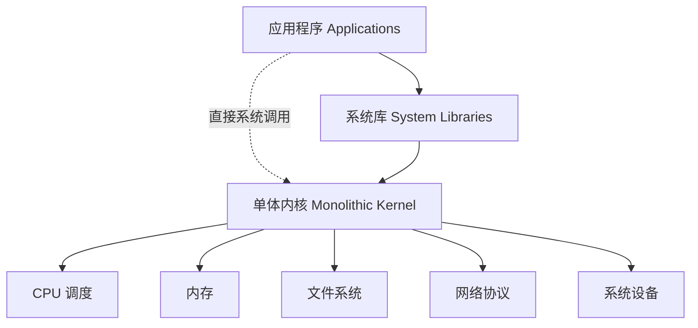

图中还显示了系统库，它们通常用于提供比仅使用系统调用更丰富、更简单的编程接口。应用程序包括所有正在运行的用户级软件，包括数据库、Web 服务器、管理工具和操作系统 shell。

> [!NOTE] 
> 这里的系统库被画成一个断裂的环，以表明应用程序可以直接调用系统调用²。例如，Golang 运行时有自己的系统调用层，不需要系统库 libc。传统上，此图被绘制为完整的同心环，反映了从中心的内核开始的特权级别递减（这种模型起源于 Multics [Graham 68]，Unix 的前身）。

还存在其他内核模型：微内核采用一个小型内核，将功能移至用户模式程序；单内核将内核和应用程序代码编译在一起作为单个程序。还有混合内核，如 Windows NT 内核，同时使用单体内核和微内核的方法。这些在第 3.5 节“其他主题”中进行了总结。

Linux 最近通过允许一种新的软件类型改变了其模型：扩展 BPF，它支持安全的内核态应用程序以及其自己的内核 API：BPF helpers。这允许用 BPF 重写一些应用程序和系统功能，提供更高级别的安全性和性能。如图 3.2 所示。

> [!INFO] 图 3.2 BPF 应用程序
> （原文图示描述：展示了扩展 BPF 作为内核态应用程序，与内核及 BPF helpers 交互的新模型）

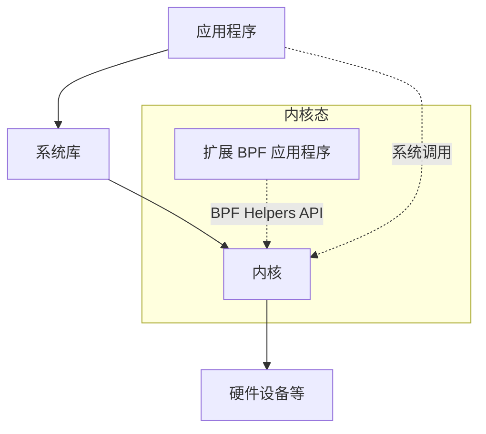

扩展 BPF 在第 3.4.4 节“扩展 BPF”中进行了总结。

#### 内核执行

内核是一个大型程序，通常有数百万行代码。它主要按需执行，当用户级程序发出系统调用或设备发送中断时运行。一些内核线程异步执行内务处理，这可能包括内核时钟例程和内存管理任务，但这些任务尽量保持轻量级并消耗很少的 CPU 资源。

> [!NOTE] 脚注
> ² 此模型有一些例外。有时用于网络的内核旁路技术允许用户级直接访问硬件（见第 10 章“网络”，第 10.4.3 节“软件”，标题“内核旁路”）。对硬件的 I/O 也可以在没有系统调用接口开销的情况下提交（尽管初始化需要系统调用），例如，使用内存映射 I/O、主缺页异常（见第 7 章“内存”，第 7.2.3 节“按需分页”）、`sendfile(2)` 和 Linux `io_uring`（见第 5 章“应用程序”，第 5.2.6 节“非阻塞 I/O”）。

执行频繁 I/O 的工作负载（如 Web 服务器）主要在内核上下文中执行。计算密集型的工作负载通常在用户模式下运行，不受内核中断。可能很容易认为内核不会影响这些计算密集型工作负载的性能，但在许多情况下它确实会影响。最明显的是 CPU 争用，当其他线程竞争 CPU 资源时，内核调度器需要决定哪个运行、哪个等待。内核还选择线程将在哪个 CPU 上运行，并且可以选择具有更暖的硬件缓存或更好的进程内存局部性的 CPU，以显著提高性能。

### 3.2.2 内核态与用户态

内核运行在称为内核态的特殊 CPU 模式下，允许完全访问设备和执行特权指令。内核仲裁设备访问以支持多任务，防止进程和用户访问彼此的数据，除非明确允许。

用户程序（进程）运行在用户态，它们通过系统调用向内核请求特权操作，例如 I/O。

内核态和用户态是在处理器上使用特权环（或保护环）实现的，遵循图 3.1 中的模型。例如，x86 处理器支持四个特权环，编号为 0 到 3。通常只使用两个或三个：用于用户态、内核态，以及如果存在的话的管理程序。访问设备的特权指令只允许在内核态执行；在用户态执行它们会导致异常，然后由内核处理（例如，生成权限拒绝错误）。

在传统内核中，系统调用通过切换到内核态然后执行系统调用代码来执行。如图 3.3 所示。

> [!INFO] 图 3.3 系统调用执行模式
> （原文图示描述：展示了用户态程序执行系统调用时，向内核态切换并执行内核代码的过程）

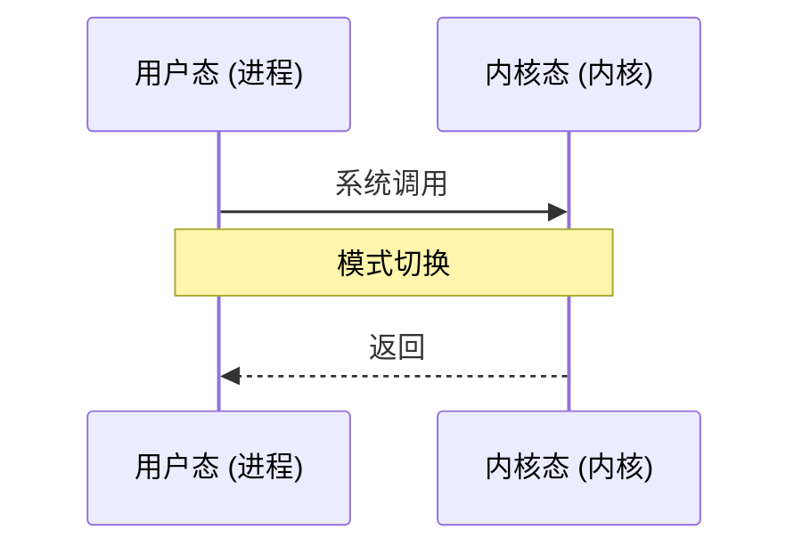

在用户态和内核态之间切换是模式切换。

> [!IMPORTANT] 
> 所有系统调用都会发生模式切换。有些系统调用也会发生上下文切换：那些阻塞型的系统调用，例如用于磁盘和网络 I/O 的调用，会发生上下文切换，以便在第一个线程被阻塞时另一个线程可以运行。

由于模式和上下文切换会花费少量开销（CPU 周期）³，因此有各种优化措施来避免它们，包括：

- **用户态系统调用**：可以仅在用户态库中实现某些系统调用。Linux 内核通过导出映射到进程地址空间的虚拟动态共享对象（[[vDSO]]）来实现这一点，其中包含诸如 `gettimeofday(2)` 和 `getcpu(2)` 的系统调用 [Drysdale 14]。
- **内存映射**：用于按需分页（见第 7 章“内存”，第 7.2.3 节“按需分页”），也可用于数据存储和其他 I/O，避免系统调用开销。
- **内核旁路**：允许用户态程序直接访问设备，绕过系统调用和典型的内核代码路径。例如，用于网络的 DPDK：数据平面开发套件。
- **内核态应用程序**：包括在内核中实现的 TUX Web 服务器 [Lever 00]，以及最近出现的如图 3.2 所示的扩展 BPF 技术。

> [!NOTE] 脚注
> ³ 由于模式和上下文切换会花费少量开销（CPU 周期）……

内核态和用户态有它们自己的软件执行上下文，包括栈和寄存器。某些处理器架构（例如 SPARC）为内核使用单独的地址空间，这意味着模式切换还必须更改虚拟内存上下文。

# 3.1 操作系统

## 3.2.3 系统调用

系统调用请求内核执行特权系统例程。可用的系统调用有数百种之多，但内核维护者会尽量将这个数量保持在尽可能小的范围内，以保持内核的简洁性（Unix 哲学；[Thompson 78]）。更复杂的接口可以在用户态作为系统库建立在它们之上，在用户态开发和维护起来更容易。操作系统通常包含一个 C 标准库，为许多常见的系统调用提供了更易于使用的接口（例如，`libc` 或 `glibc` 库）。

需要记住的关键系统调用列于表 3.1 中。

**表 3.1 关键系统调用**

| 系统调用 | 描述 |
| :--- | :--- |
| `read(2)` | 读取字节 |
| `write(2)` | 写入字节 |
| `open(2)` | 打开文件 |
| `close(2)` | 关闭文件 |
| `fork(2)` | 创建新进程 |
| `clone(2)` | 创建新进程或线程 |
| `exec(2)` | 执行新程序 |
| `connect(2)` | 连接到网络主机 |
| `accept(2)` | 接受网络连接 |
| `stat(2)` | 获取文件统计信息 |
| `ioctl(2)` | 设置 I/O 属性，或其他杂项功能 |
| `mmap(2)` | 将文件映射到内存地址空间 |
| `brk(2)` | 扩展堆指针 |
| `futex(2)` | 快速用户空间互斥锁 |

> [!NOTE] 脚注 3
> 针对当前 Meltdown 漏洞的缓解措施，使得上下文切换现在的开销变得更大。参见 3.4.3 节 KPTI (Meltdown)。

系统调用都有完善的文档记录，每个系统调用都有一个通常随操作系统一起发布的手册页（man page）。它们还有一个通常简单且一致的接口，并在需要时使用错误代码来描述错误（例如，`ENOENT` 表示“没有那个文件或目录”[^4]）。

这些系统调用中有许多目的显而易见。以下是几个常见用法可能不太明显的系统调用：

- **`ioctl(2)`**：通常用于向内核请求杂项操作，特别是对于系统管理工具，当另一个（更明显的）系统调用不合适时。参见后面的示例。
- **`mmap(2)`**：通常用于将可执行文件和库映射到进程地址空间，以及用于内存映射文件。它有时被用来分配进程的工作内存，而不是基于 `brk(2)` 的 `malloc(2)`，以降低系统调用率并提高性能（由于涉及权衡：内存映射管理，这并不总是有效）。
- **`brk(2)`**：用于扩展堆指针，堆指针定义了进程工作内存的大小。当 `malloc(3)`（内存分配）调用无法从堆中的现有空间得到满足时，通常由系统内存分配库执行此操作。参见第 7 章，内存。
- **`futex(2)`**：此系统调用用于处理用户空间锁的一部分：即可能阻塞的部分。

如果对某个系统调用不熟悉，你可以在其手册页中了解更多信息（它们位于手册页的第 2 节：syscalls）。

`ioctl(2)` 系统调用由于其模糊的性质，可能是最难学习的。作为其用法的一个示例，Linux `perf(1)` 工具（在第 6 章 CPU 中介绍）执行特权操作以协调性能监测。不是为每个操作添加系统调用，而是添加了一个单一的系统调用：`perf_event_open(2)`，它返回一个用于 `ioctl(2)` 的文件描述符。然后可以使用不同的参数调用此 `ioctl(2)` 以执行不同的所需操作。例如，`ioctl(fd, PERF_EVENT_IOC_ENABLE)` 启用监测。在这个例子中，参数 `PERF_EVENT_IOC_ENABLE` 可以由开发者更轻松地添加和更改。

[^4]: glibc 将这些错误存储在一个 `errno`（错误号）整型变量中。

## 3.2.4 中断

中断是向处理器发出的信号，表示发生了某个需要处理的事件，并中断处理器当前的执行来处理它。它通常会导致处理器进入内核态（如果它还没有在内核态的话），保存当前线程状态，然后运行中断服务例程（[[Interrupt Service Routine|ISR]]）来处理该事件。

由外部硬件产生的异步中断和由软件指令产生的同步中断。这些如图 3.4 所示。

**图 3.4 中断类型**

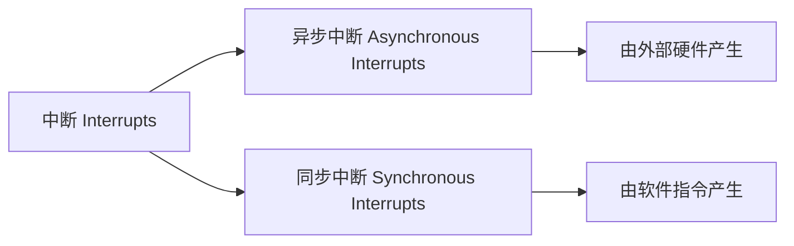

为简单起见，图 3.4 显示了所有发送到内核进行处理的中断；这些中断首先发送到 CPU，由 CPU 选择内核中的 ISR 来运行该事件。

### 异步中断

硬件设备可以向处理器发送中断服务请求（[[IRQ|IRQs]]），这些请求相对于当前正在运行的软件是异步到达的。硬件中断的例子包括：

- 磁盘设备发出磁盘 I/O 完成的信号
- 硬件指示故障状况
- 网络接口发出数据包到达的信号
- 输入设备：键盘和鼠标输入

为了解释异步中断的概念，图 3.5 描绘了一个示例场景，显示了在 CPU 0 上运行的数据库从文件系统读取时的时间流逝。文件系统内容必须从磁盘获取，因此调度器上下文切换到另一个线程（一个 Java 应用程序），而数据库在等待。一段时间后，磁盘 I/O 完成，但此时数据库已不再 CPU 0 上运行。完成中断相对于数据库是异步发生的，在图 3.5 中用虚线表示。

**图 3.5 异步中断示例**

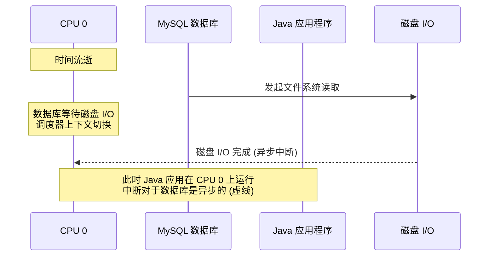

### 同步中断

同步中断由软件指令产生。下面使用陷阱、异常和故障等术语描述了不同类型的软件中断；然而，这些术语经常被交替使用。

- **陷阱**：故意调用内核，例如通过 `int`（中断）指令。系统调用的一种实现涉及使用系统调用处理程序的向量来调用 `int` 指令（例如，Linux x86 上的 `int 0x80`）。`int` 引发一个软件中断。
- **异常**：一种特殊情况，例如执行除零操作的指令。
- **故障**：常用于内存事件的术语，例如由于访问没有 [[MMU]] 映射的内存位置而触发的缺页异常。参见第 7 章，内存。

对于这些中断，负责的软件和指令仍在 CPU 上。

### 中断线程

中断服务例程（ISR）被设计为尽可能快地运行，以减少中断活动线程的影响。如果一个中断需要执行稍微多一点的工作，特别是如果它可能在锁上阻塞，它可以由一个可被内核调度的中断线程来处理。这如图 3.6 所示。

**图 3.6 中断处理**

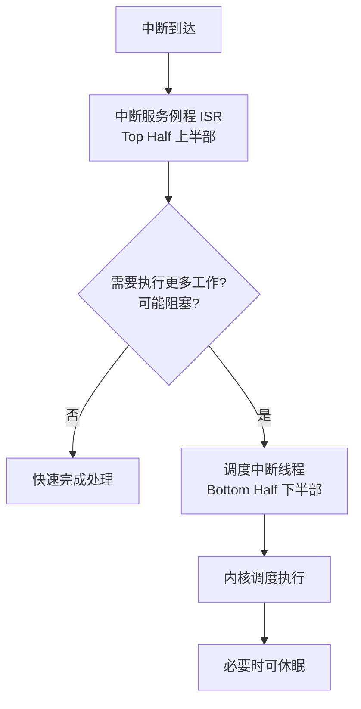

这是如何实现的取决于内核版本。在 Linux 上，设备驱动程序可以被建模为两半，上半部快速处理中断，并将工作调度到下半部以便稍后处理 [Corbet 05]。快速处理中断很重要，因为上半部在中断禁用模式下运行以推迟新中断的传递，如果它运行时间过长，可能会导致其他线程的延迟问题。下半部可以是 tasklet 或工作队列；后者是可由内核调度并在必要时可以休眠的线程。

例如，Linux 网络驱动程序有一个上半部来处理入站数据包的 IRQ，它调用下半部将数据包向上推送到网络栈。下半部被实现为 `softirq`（软件中断）。

从中断到达至其得到服务的时间称为中断延迟，这取决于硬件和实现。这是实时或低延迟系统的研究课题。

### 中断屏蔽

内核中的某些代码路径不能被安全地中断。一个例子是在系统调用期间获取自旋锁的内核代码，而该自旋锁可能也是中断所需要的。在持有这种锁的情况下接受中断可能会导致死锁。为了防止这种情况，内核可以通过设置 CPU 的中断屏蔽寄存器来临时屏蔽中断。中断禁用时间应尽可能短，因为它可能会干扰由其他中断唤醒的应用程序的及时执行。这对于实时系统——那些有严格响应时间要求的系统——是一个重要因素。中断禁用时间也是性能分析的一个目标（这种分析直接由 Ftrace `irqsoff` 跟踪器支持，在第 14 章 Ftrace 中提及）。

一些高优先级事件不应被忽略，因此被实现为不可屏蔽中断。例如，Linux 可以使用智能平台管理接口（[[IPMI|IPMI]]]]）看门狗定时器，根据一段时间内缺乏中断来检查内核是否似乎已锁定。如果是这样，看门狗可以发出 NMI 中断以重启系统[^5]。

[^5]: Linux 还有一个软件 NMI 看门狗用于检测锁定 [Linux 20d]。

## 3.2.5 时钟与空闲

原始 Unix 内核的一个核心组件是 `clock()` 例程，从定时器中断执行。历史上它以每秒 60、100 或 1,000 次的频率执行[^6]（通常以赫兹表示：每秒周期数），每次执行称为一个滴答[^7]。它的功能包括更新系统时间、使线程调度的定时器和时间片过期、维护 CPU 统计信息以及执行已调度的内核例程。

时钟一直存在一些性能问题，在后来的内核中得到了改进，包括：

- **滴答延迟**：对于 100 赫兹的时钟，定时器在等待下一个滴答处理时可能会遇到高达 10 毫秒的额外延迟。这已通过使用高分辨率实时中断来修复，从而可以立即执行。
- **滴答开销**：滴答消耗 CPU 周期并略微干扰应用程序，这是所谓的操作系统抖动的原因之一。现代处理器还具有动态电源功能，可以在空闲期间关闭部分电源。时钟例程打断了这段空闲时间，可能会无谓地消耗电量。

现代内核已将许多功能移出时钟例程，转为按需中断，以努力创建无滴答内核。这通过允许处理器在睡眠状态停留更长时间，减少了开销并提高了电源效率。

Linux 的时钟例程是 `scheduler_tick()`，Linux 有办法在没有 CPU 负载时省略调用时钟。时钟本身通常以 250 赫兹运行（由 `CONFIG_HZ` Kconfig 选项及其变体配置），并且其调用通过 `NO_HZ` 功能（由 `CONFIG_NO_HZ` 及其变体配置）减少，该功能现在通常已启用 [Linux 20a]。

### 空闲线程

当 CPU 没有工作要执行时，内核会调度一个等待工作的占位符线程，称为空闲线程。一个简单的实现是在循环中检查是否有新工作可用。在现代 Linux 中，空闲任务可以调用 `hlt`（停机）指令来关闭 CPU 电源，直到接收到下一个中断，从而节省电量。

## 3.2.6 进程

[[Process|进程]]是执行用户级程序的环境。它由内存地址空间、文件描述符、线程栈和寄存器组成。在某些方面，进程就像一台早期的虚拟计算机，其中只有一个程序在使用自己的寄存器和栈执行。

[^6]: 其他速率包括 Linux 2.6.13 的 250，Ultrix 的 256，以及 OSF/1 的 1,024 [Mills 94]。
[^7]: Linux 还跟踪 `jiffies`，一种类似于滴答的时间单位。

# 3.1 操作系统

进程由内核进行多任务处理，内核通常支持在单个系统上执行数千个进程。它们通过各自的进程 ID（PID）进行单独标识，PID 是一个唯一的数字标识符。

一个进程包含一个或多个[[线程]]，这些线程在进程地址空间中运行并共享相同的文件描述符。线程是一个可执行的上下文，由栈、寄存器和指令指针（也称为程序计数器）组成。多个线程允许单个进程在多个 CPU 上并行执行。在 Linux 上，线程和进程都是[[任务]]。

内核启动的第一个进程称为“init”，默认来自 `/sbin/init`，PID 为 1，它负责启动用户空间服务。在 Unix 中，这涉及从 `/etc` 运行启动脚本，这种方法现在被称为 SysV（源自 Unix System V）。现在的 Linux 发行版通常使用 [[systemd]] 软件来启动服务并跟踪它们的依赖关系。

## 进程创建

在 Unix 系统上，进程通常使用 `fork(2)` [[系统调用]]来创建。在 Linux 上，C 库通常通过封装多功能的 `clone(2)` 系统调用来实现 `fork` 函数。这些系统调用创建进程的副本，并拥有自己的进程 ID。然后可以调用 `exec(2)` 系统调用（或其变体，如 `execve(2)`）来开始执行不同的程序。

图 3.7 展示了 bash shell（`bash`）执行 `ls` 命令时的进程创建示例。

**图 3.7 进程创建**

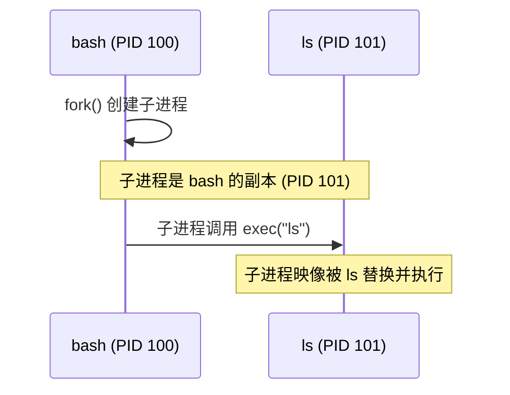

`fork(2)` 或 `clone(2)` 系统调用可能使用[[写时复制]]（COW）策略来提高性能。这会添加对先前地址空间的引用，而不是复制所有内容。一旦任何一个进程修改了多引用的内存，就会为修改部分创建单独的副本。这种策略要么推迟要么消除了复制内存的需要，从而减少了内存和 CPU 的使用。

## 进程生命周期

进程的生命周期如图 3.8 所示。这是一个简化的图表；对于现代多线程操作系统，被调度和运行的是线程，并且关于这些线程如何映射到进程状态还有一些额外的实现细节（更多详细图表请参见第 5 章的图 5.6 和 5.7）。

**图 3.8 进程生命周期**

```mermaid
stateDiagram-v2
    [*] --> on_proc : 被调度执行
    on_proc --> ready_to_run : 被抢占/让出CPU
    ready_to_run --> on_proc : 获得CPU
    on_proc --> sleep : 执行I/O等阻塞操作
    sleep --> ready_to_run : I/O完成/被唤醒
    on_proc --> zombie : 进程退出
    zombie --> [*] : 被父进程回收/内核移除

    state on_proc {
        note right of on_proc: 正在CPU上运行
    }
    state ready_to_run {
        note right of ready_to_run: 可运行，等待CPU
    }
    state sleep {
        note right of sleep: 阻塞等待I/O
    }
    state zombie {
        note right of zombie: 终止中，等待状态回收
    }
```

`on-proc` 状态表示正在处理器（CPU）上运行。`ready-to-run`（就绪）状态是指进程可运行但在 CPU 运行队列中等待轮到自己使用 CPU。大多数 I/O 会阻塞，将进程置于 `sleep`（睡眠）状态，直到 I/O 完成并且进程被唤醒。`zombie`（僵尸）状态发生在进程终止期间，此时进程等待其进程状态被父进程回收或直到被内核移除。

## 进程环境

进程环境如图 3.9 所示；它由进程地址空间中的数据和内核中的元数据（上下文）组成。

**图 3.9 进程环境**

```mermaid
graph TD
    subgraph UserAddressSpace[用户地址空间]
        Executable[可执行段]
        Libraries[库段]
        Heap[堆]
        UserStack1[用户栈 (线程1)]
        UserStack2[用户栈 (线程2)]
    end

    subgraph KernelContext[内核上下文]
        PID[PID]
        UID[UID]
        Times[各种时间统计]
        FDs[文件描述符集合]
        ThreadMeta1[线程1元数据 (优先级等)]
        ThreadMeta2[线程2元数据 (优先级等)]
    end

    KernelContext -->|包含| FDs
    KernelContext -->|包含| ThreadMeta1
    KernelContext -->|包含| ThreadMeta2
    ThreadMeta1 -.->|对应| UserStack1
    ThreadMeta2 -.->|对应| UserStack2
```

内核上下文由各种进程属性和统计信息组成：其进程 ID（PID）、所有者的用户 ID（UID）以及各种时间。这些通常通过 `ps(1)` 和 `top(1)` 命令来查看。它还有一组文件描述符，指向打开的文件，并且（通常）在线程之间共享。

> [!NOTE] 页面原图说明
> 此示例描绘了两个线程，每个线程包含一些元数据，包括内核上下文中的优先级⁸ 和用户地址空间中的用户栈。图表未按比例绘制；与进程地址空间相比，内核上下文非常小。

用户地址空间包含进程的内存段：可执行文件、库和堆。有关更多详细信息，请参见第 7 章，内存。

在 Linux 上，每个线程都有自己的用户栈和内核异常栈⁹ [Owens 20]。

## 3.2.7 栈

[[栈]]是一个用于临时数据的内存存储区域，组织为后进先出（LIFO）列表。它用于存储不如 CPU 寄存器集适合的数据重要的数据。当调用函数时，返回地址被保存到栈中。如果调用后需要某些寄存器的值，这些寄存器也可能被保存到栈中¹⁰。当被调用函数完成时，它会恢复任何必需的寄存器，并通过从栈中获取返回地址，将执行权传递给调用函数。栈还可以用于向函数传递参数。栈上与函数执行相关的一组数据被称为[[栈帧]]。

通过检查线程栈中所有栈帧中保存的返回地址（一个称为[[栈遍历]]的过程），可以看到当前执行函数的调用路径¹¹。此调用路径被称为栈回溯或[[栈跟踪]]。在性能工程中，通常简称为“栈”。这些栈可以回答为什么某物正在执行，是调试和性能分析的宝贵工具。

### 如何阅读栈

以下示例内核栈（来自 Linux）显示了 TCP 传输所采用的路径，由跟踪工具打印：

```text
tcp_sendmsg+1
sock_sendmsg+62
SYSC_sendto+319
sys_sendto+14
do_syscall_64+115
entry_SYSCALL_64_after_hwframe+61
```

> [!TIP] 栈的阅读顺序
> 栈通常以**从叶到根**（leaf-to-root）的顺序打印，因此打印的第一行是当前正在执行的函数，其下方是其父函数，然后是祖父函数，依此类推。在这个例子中，正在执行的是 `tcp_sendmsg()` 函数，由 `sock_sendmsg()` 调用。

在这个栈示例中，函数名右侧是指令偏移量，显示函数内的位置。第一行显示 `tcp_sendmsg()` 偏移量为 1（这将是第二条指令），由 `sock_sendmsg()` 偏移量 62 调用。这种偏移量只有在您希望低级别地理解代码路径（直至指令级别）时才有用。

通过向下阅读栈，可以看到完整的祖先关系：函数、父函数、祖父函数等。或者，通过自下而上阅读，您可以跟踪执行到当前函数的路径：我们是如何到达这里的。

由于栈暴露了通过源代码所采取的内部路径，因此除了代码本身之外，通常没有关于这些函数的文档。对于此示例栈，这是 Linux 内核源代码。例外情况是函数是 API 的一部分并被文档化。

### 用户栈和内核栈

在执行系统调用时，进程线程有两个栈：用户级栈和内核级栈。它们的范围如图 3.10 所示。

**图 3.10 用户栈和内核栈**

```mermaid
graph LR
    subgraph UserLevel[用户级别]
        UserStack[用户级栈]
    end
    subgraph KernelLevel[内核级别]
        KernelStack[内核级栈]
    end

    UserLevel <|.. KernelLevel : 系统调用/中断切换
    NoteOver UserStack,KernelStack: 执行系统调用时线程同时拥有两者
```

被阻塞线程的用户级栈在系统调用期间不会改变，因为线程在内核上下文中执行时使用单独的内核级栈。（一个例外可能是信号处理程序，根据其配置，它们可能会借用用户级栈。）

在 Linux 上，有多个用于不同目的的内核栈。系统调用使用与每个线程关联的内核异常栈，还有与软中断和硬中断（IRQ）关联的栈 [Bovet 05]。

## 3.2.8 虚拟内存

[[虚拟内存]]是主存的抽象，为进程和内核提供它们自己的、几乎无限的¹² 主存私有视图。它支持多任务处理，允许进程和内核在各自的私有地址空间上操作而无需担心争用。它还支持主存的[[超订]]，允许操作系统根据需要透明地在主存和辅助存储（磁盘）之间映射虚拟内存。

虚拟内存的作用如图 3.11 所示。主存是主存储器（RAM），辅存是存储设备（磁盘）。

**图 3.11 虚拟内存地址空间¹³**

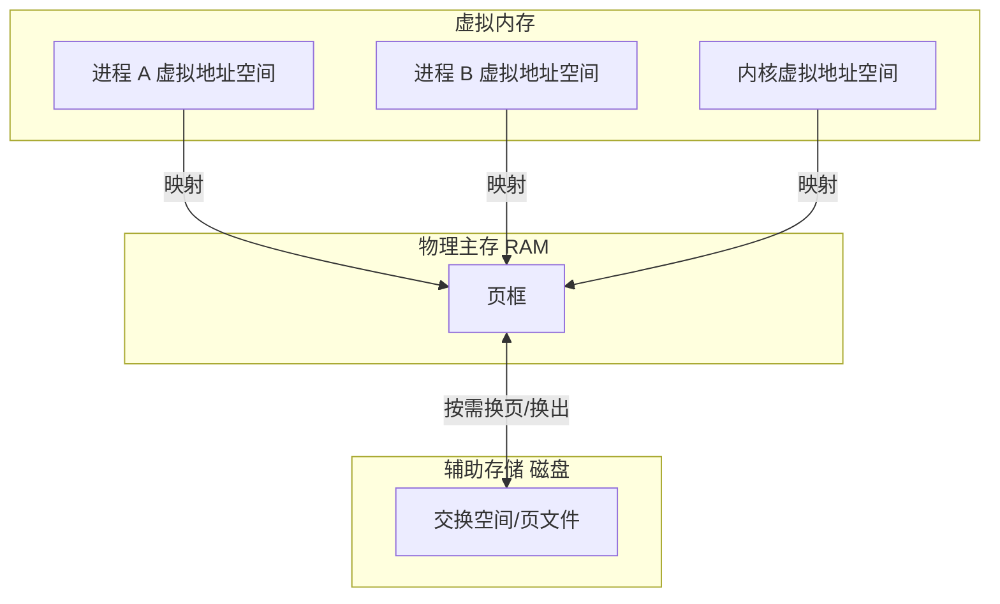

虚拟内存的实现得益于处理器和操作系统的双重支持。它不是真正的内存，大多数操作系统仅在首次填充（写入）内存时才按需将虚拟内存映射到真实内存。

> [!INFO] 延伸阅读
> 有关虚拟内存的更多信息，请参见第 7 章，内存。

### 内存管理

虽然虚拟内存允许使用辅助存储扩展主存，但内核努力将最活跃的数据保留在主存中。为此，内核有两种方案：

- **进程交换**：在主存和辅助存储之间移动整个进程。
- **分页**：移动称为[[页]]的小内存单元（例如，4 KB）。

进程交换是原始的 Unix 方法，可能导致严重的性能损失。分页更高效，随着分页虚拟内存的引入被添加到 BSD 中。在这两种情况下，最近最少使用（或最近未使用）的内存被移至辅助存储，仅在再次需要时移回主存。

> [!WARNING] Linux 术语差异
> 在 Linux 中，术语**交换**用于指代**分页**。Linux 内核不支持（较旧的）Unix 风格的整个线程和进程的交换。

有关分页和交换的更多信息，请参见第 7 章，内存。

## 3.2.9 调度器

Unix 及其衍生系统是[[分时系统]]，通过在多个进程之间划分执行时间来允许多个进程同时运行。进程在处理器和各个 CPU 上的调度由[[调度器]]执行，调度器是操作系统内核的关键组件。

调度器的作用如图 3.12 所示，显示调度器操作线程（在 Linux 中是任务），将它们映射到 CPU。

**图 3.12 内核调度器**

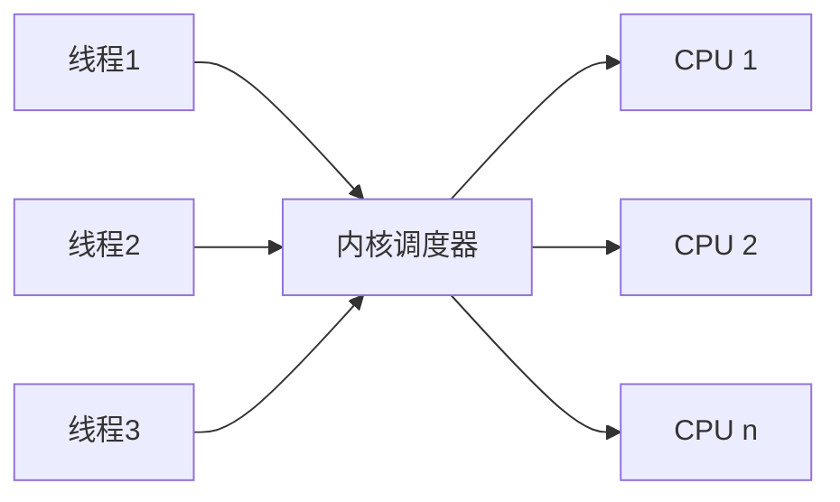

其基本意图是在活动进程和线程之间分配 CPU 时间，并维护优先级概念，以便更重要的工作可以更早执行。调度器跟踪所有处于就绪状态的线程，传统上它们位于按优先级划分的队列中，称为[[运行队列]] [Bach 86]。现代内核可能按 CPU 实现这些队列，并且除了队列之外，还可能使用其他数据结构来跟踪线程。当想要运行的线程多于可用 CPU 时，较低优先级的线程就会等待轮到自己。大多数内核线程以比用户级进程更高的优先级运行。

进程优先级可以由调度器动态修改，以提高某些工作负载的性能。工作负载可分为：

---

> [!NOTE] 脚注区域
> ⁸ 内核上下文可以是其自己的完整地址空间（如 SPARC 处理器），也可以是不与用户地址重叠的受限范围（如 x86 处理器）。
> ⁹ 每个 CPU 还有专用内核栈，包括用于中断的栈。
> ¹⁰ 处理器 ABI 的调用约定指定了哪些寄存器在函数调用后应保留其值（它们是非易失性的），并由被调用函数保存到栈中（“被调用者保存”）。其他寄存器是易失性的，可能会被调用函数覆盖；如果调用者希望保留它们的值，则必须将它们保存到栈中（“调用者保存”）。
> ¹¹ 有关栈遍历和不同可能技术（包括：基于帧指针、调试信息、最后分支记录和 ORC）的更多详细信息，请参见《BPF Performance Tools》[Gregg 19] 的第 2 章，技术，第 2.4 节，栈跟踪遍历。
> ¹² 至少在 64 位处理器上是这样。对于 32 位处理器，由于 32 位地址的限制，虚拟内存被限制为 4 GB（内核可能将其限制为更小的量）。
> ¹³ 进程虚拟内存显示为从 0 开始是一种简化。今天的内核通常从某个偏移量（如 0x10000）或随机地址开始进程的虚拟地址空间。一个好处是，解引用 NULL（0）指针的常见编程错误将导致程序崩溃（SIGSEGV），因为 0 地址无效。这通常比错误地解引用地址 0 处的数据更可取，因为程序将继续使用损坏的数据运行。

# 3.1 操作系统

■ **CPU密集型（CPU-bound）**：执行繁重计算的应用程序，例如科学和数学分析，预期运行时间较长（几秒、几分钟、几小时、几天甚至更长）。这些工作负载受限于CPU资源。

■ **I/O密集型（I/O-bound）**：执行I/O操作而计算较少的应用程序，例如Web服务器、文件服务器和交互式Shell，这些场景期望获得低延迟响应。当它们的负载增加时，受限于存储或网络的I/O资源。

一种可追溯到UNIX的常用调度策略会识别CPU密集型工作负载并降低其优先级，使得更期望获得低延迟响应的I/O密集型工作负载能够更快运行。这可以通过计算近期计算时间（在CPU上执行的时间）与真实时间（流逝的时间）的比率来实现，并降低具有高（计算）比率进程的优先级 [Thompson 78]。这种机制优先照顾较短运行的进程，这些进程通常是执行I/O的进程，包括人类交互进程。

现代内核支持多种调度类或调度策略（Linux），它们应用不同的算法来管理优先级和可运行线程。这些可能包括实时调度，它使用的优先级高于所有非关键工作（包括内核线程）。连同抢占支持（稍后描述），实时调度为有需求的系统提供了可预测且低延迟的调度。

有关内核调度器和其他调度算法的更多信息，请参见第6章 CPU。

## 3.2.10 文件系统

文件系统是将数据组织为文件和目录的一种形式。它们提供了一个基于文件的接口来访问数据，通常基于POSIX标准。内核支持多种文件系统类型和实例。提供文件系统是操作系统最重要的角色之一，曾被描述为最重要的角色 [Ritchie 74]。

操作系统提供了一个全局文件命名空间，组织为自顶向下的树状拓扑结构，从根级别（“/”）开始。文件系统通过挂载加入该树，将其自身的树附加到一个目录（挂载点）上。这允许最终用户透明地导航文件命名空间，而不管底层文件系统类型是什么。

典型的操作系统可以组织成如图3.13所示的样子。

*图3.13 操作系统文件层次结构*

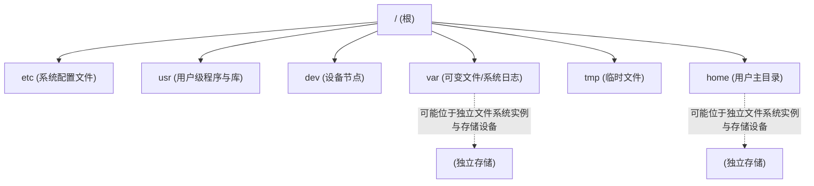

顶层目录包括用于系统配置文件的 `etc`，用于系统提供的用户级程序和库的 `usr`，用于设备节点的 `dev`，用于包含系统日志在内的可变文件的 `var`，用于临时文件的 `tmp`，以及用于用户主目录的 `home`。在图示的示例中，`var` 和 `home` 可能驻留在它们各自的文件系统实例和独立的存储设备上；然而，它们可以像树中的任何其他组件一样被访问。

大多数文件系统类型使用存储设备（磁盘）来存储其内容。某些文件系统类型是由内核动态创建的，例如 `/proc` 和 `/dev`。

内核通常提供不同的方式将进程隔离到文件命名空间的一部分，包括 `chroot(8)`，以及在Linux上的挂载命名空间，后者通常用于容器（见第11章 云计算）。

### VFS

虚拟文件系统（VFS）是一个抽象文件系统类型的内核接口，最初由Sun Microsystems开发，以便Unix文件系统（UFS）和网络文件系统（NFS）能更容易地共存。其作用如图3.14所示。

*图3.14 虚拟文件系统*

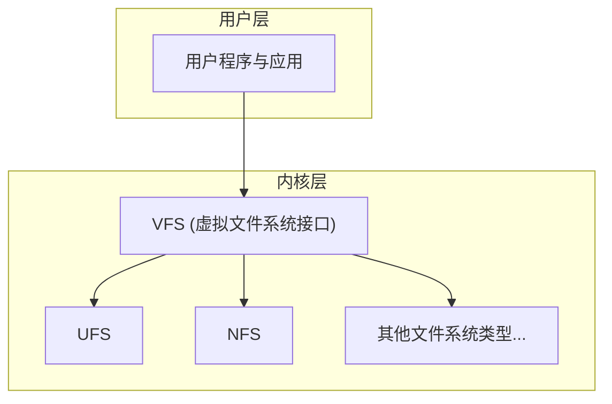

VFS接口使得向内核添加新文件系统类型变得更加容易。它还支持提供前面提到的全局文件命名空间，使得用户程序和应用程序能够透明地访问各种文件系统类型。

### I/O栈

对于基于存储设备的文件系统，从用户级软件到存储设备的路径称为I/O栈。这是前面展示的整个软件栈的一个子集。通用的I/O栈如图3.15所示。

图3.15左侧显示了直接通往块设备的路径，绕过了文件系统。此路径有时被管理工具和数据库使用。

文件系统及其性能将在第8章 文件系统中详细讨论，而构建在其上的存储设备将在第9章 磁盘中讨论。

*图3.15 通用I/O栈*

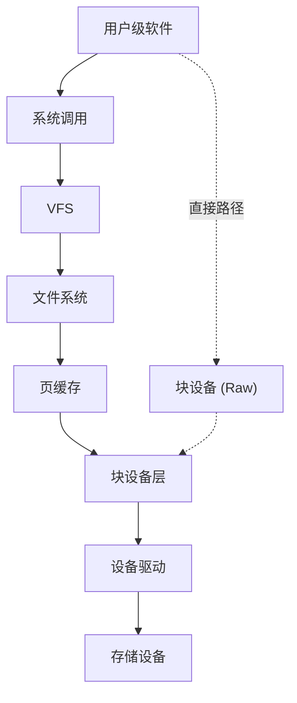

## 3.2.11 缓存

由于磁盘I/O历史上一直具有较高的延迟，软件栈的许多层都试图通过缓存读取和缓冲写入来避免它。缓存可能包括表3.2中所示的那些（按检查顺序排列）。

**表3.2 磁盘I/O的缓存层示例**

| 序号 | 缓存 | 示例 |
| :--- | :--- | :--- |
| 1 | 客户端缓存 | Web浏览器缓存 |
| 2 | 应用程序缓存 | — |
| 3 | Web服务器缓存 | Apache缓存 |
| 4 | 缓存服务器 | memcached |
| 5 | 数据库缓存 | MySQL缓冲缓存 |
| 6 | 目录缓存 | dcache |
| 7 | 文件元数据缓存 | inode缓存 |
| 8 | 操作系统缓冲缓存 | Buffer cache |
| 9 | 文件系统主缓存 | Page cache, ZFS ARC |
| 10 | 文件系统二级缓存 | ZFS L2ARC |
| 11 | 设备缓存 | ZFS vdev |
| 12 | 块缓存 | Buffer cache |
| 13 | 磁盘控制器缓存 | RAID卡缓存 |
| 14 | 存储阵列缓存 | — |
| 15 | 磁盘自带缓存 | — |

例如，缓冲缓存是一块存储最近使用的磁盘块的主存区域。如果请求的块存在于缓存中，磁盘读取可以立即从缓存中提供，从而避免了磁盘I/O的高延迟。

系统与环境中存在的缓存类型将有所不同。

## 3.2.12 网络

现代内核提供了一系列内置的网络协议栈，允许系统通过网络进行通信并参与分布式系统环境。这被称为网络栈或TCP/IP栈，以常用的TCP和IP协议命名。用户级应用程序通过称为套接字的可编程端点访问网络。

连接到网络的物理设备是网络接口，通常由网络接口卡（NIC）提供。系统管理员的一项历史职责是将IP地址与网络接口关联，以便它能与网络通信；这些映射现在通常通过动态主机配置协议（DHCP）自动化。

网络协议不常更改，但有一种新的传输协议正在得到越来越多的采用：QUIC（在第10章 网络中总结）。协议增强和选项更改得更为频繁，例如较新的TCP选项和TCP拥塞控制算法。较新的协议和增强通常需要内核支持（用户空间协议实现除外）。另一个变化是对不同网络接口卡的支持，这需要为内核提供新的设备驱动程序。

有关网络和网络性能的更多信息，请参见第10章 网络。

## 3.2.13 设备驱动程序

内核必须与各种物理设备进行通信。这种通信是使用设备驱动程序实现的：用于设备管理和I/O的内核软件。设备驱动程序通常由开发硬件设备的供应商提供。某些内核支持可插拔的设备驱动程序，可以在不需要重启系统的情况下加载和卸载。

设备驱动程序可以为其设备提供字符和/或块接口。字符设备，也称为原始设备，提供未缓冲的顺序访问，I/O大小可小至单个字符，具体取决于设备。此类设备包括键盘和串行端口（在最初的Unix中，还有纸带和行式打印机设备）。

块设备以块为单位执行I/O，历史上每个块为512字节。这些可以根据其块偏移量进行随机访问，块偏移量从块设备起始处的0开始。在最初的Unix中，块设备接口还提供了块设备缓冲区的缓存以提高性能，这块主存区域称为缓冲缓存。在Linux中，此缓冲缓存现在是页缓存的一部分。

## 3.2.14 多处理器

多处理器支持允许操作系统使用多个CPU实例并行执行工作。它通常实现为对称多处理（SMP），即所有CPU被同等对待。这在技术上很难实现，对并行运行的线程之间访问和共享内存及CPU提出了问题。在多处理器系统上，还可能存在以非统一内存访问（NUMA）架构连接到不同插口（物理处理器）的主存库，这也带来了性能挑战。详细信息请参见第6章 CPU，包括调度和线程同步，以及第7章 内存，了解内存访问和架构的详细信息。

### IPIs

对于多处理器系统，有时CPU需要进行协调，例如为了内存转换项的缓存一致性（通知其他CPU某个条目如果被缓存了，现在已过时）。一个CPU可以使用处理器间中断（IPI）（也称为SMP调用或CPU交叉调用）请求其他CPU或所有CPU立即执行此类工作。IPI是被设计为快速执行的处理器中断，以尽量减少对其他线程的中断。

IPI也可以用于抢占。

## 3.2.15 抢占

内核抢占支持允许高优先级的用户级线程中断内核并执行。这使得实时系统能够在给定的时间约束内执行工作，包括航空器和医疗设备中使用的系统。支持抢占的内核被称为完全可抢占的，尽管实际上它仍然会有一些无法被中断的微小关键代码路径。

Linux支持的另一种方法是自愿内核抢占，在内核代码中的逻辑停止点可以检查并执行抢占。这避免了支持完全可抢占内核带来的一些复杂性，并为常见工作负载提供了低延迟抢占。自愿内核抢占在Linux中通常通过 `CONFIG_PREEMPT_VOLUNTARY` Kconfig选项启用；还有 `CONFIG_PREEMPT` 允许所有内核代码（临界区除外）可被抢占，以及 `CONFIG_PREEMPT_NONE` 禁用抢占，以更高延迟为代价提高吞吐量。

## 3.2.16 资源管理

操作系统可以提供各种可配置的控制，用于微调对系统资源（如CPU、内存、磁盘和网络）的访问。这些是资源控制，可用于管理运行不同应用程序或托管多个租户（云计算）的系统的性能。这些控制可以对每个进程（或进程组）的资源使用施加固定限制，或者采用更灵活的方法——允许它们之间共享空闲的使用量。

早期版本的Unix和BSD具有基本的每进程资源控制，包括使用 `nice(1)` 设置CPU优先级，以及使用 `ulimit(1)` 设置一些资源限制。

对于Linux，控制组已被开发并集成到Linux 2.6.24（2008）中，此后又添加了各种额外的控制。这些在内核源码的 `Documentation/cgroups` 下有文档记录。还有一个改进的统一层级方案称为cgroup v2，在Linux 4.5（2016）中提供，并在 `Documentation/admin-guide/cgroup-v2.rst` 中有文档记录。

特定的资源控制将在后面的章节中适当地提及。一个示例用例在第11章 云计算中描述，用于管理OS虚拟化租户的性能。

# 3.1 操作系统

## 3.2.17 可观测性

操作系统由内核、库和程序组成。这些程序包括用于观察系统活动和分析性能的工具，通常安装在 `/usr/bin` 和 `/usr/sbin` 中。系统上也可以安装第三方工具以提供额外的可观测性。

可观测性工具及其赖以构建的操作系统组件将在第 4 章中介绍。

## 3.3 内核

以下各节讨论类 Unix 内核的实现细节，重点在于性能。作为背景，本节将讨论早期内核的性能特性：Unix、BSD 和 Solaris。Linux 内核将在第 3.4 节 Linux 中更详细地讨论。

内核的差异可以包括它们支持的文件系统（见第 8 章，文件系统）、系统调用接口、网络栈架构、实时支持，以及针对 CPU、磁盘 I/O 和网络的调度算法。

表 3.3 展示了 Linux 和其他内核版本的比较，系统调用计数基于 OS man pages 第 2 节中的条目数量。这是一种粗略的比较，但足以看出一些差异。

**表 3.3 带有已记录系统调用数量的内核版本**

| 内核版本 | 系统调用数 |
| :--- | :--- |
| UNIX Version 7 | 48 |
| SunOS (Solaris) 5.11 | 142 |
| FreeBSD 12.0 | 222 |
| Linux 2.6.32-21-server | 408 |
| Linux 2.6.32-220.el6.x86_64 | 427 |
| Linux 3.2.6-3.fc16.x86_64 | 431 |
| Linux 4.15.0-66-generic | 480 |
| Linux 5.3.0-1010-aws | 493 |

*112  Chapter 3  Operating Systems*

这些只是有文档记录的系统调用；内核通常还会提供更多的系统调用供操作系统软件私有使用。

> [!QUOTE] Ken Thompson, ACM 图灵百年庆典, 2012
> UNIX 最初只有二十个系统调用，而今天作为其直系后裔的 Linux 已经有超过一千个……我只是担心事物不断增长所带来的复杂性和规模。

Linux 的复杂性在不断增长，并通过添加新的系统调用或通过其他内核接口将这种复杂性暴露给用户态。额外的复杂性使得学习、编程和调试更加耗时。

### 3.3.1 Unix

Unix 由 Ken Thompson、Dennis Ritchie 及 AT&T 贝尔实验室的其他人在 1969 年及随后的几年中开发。它的确切起源在《The UNIX Time-Sharing System》[Ritchie 74] 中有所描述：

> [!QUOTE] The UNIX Time-Sharing System [Ritchie 74]
> 第一个版本是我们中的一个人在对可用的计算机设施感到不满意时写的，他发现了一台很少使用的 PDP-7，并着手创造一个更适宜的环境。

UNIX 的开发者之前曾参与过 Multics（多路信息与计算服务）操作系统的开发。UNIX 最初是作为一个轻量级的多任务操作系统和内核开发的，原名 UNiplexed Information and Computing Service (UNICS)，这是对 Multics 的一种双关语。摘自《UNIX Implementation》[Thompson 78]：

> [!QUOTE] UNIX Implementation [Thompson 78]
> 内核是唯一不能由用户根据自己的喜好替换的 UNIX 代码。因此，内核应该尽可能少做真正的决定。这并不意味着允许用户有一百万个选项来做同一件事。相反，它意味着只允许一种方式来做一件事，但这种方式是所有可能提供的选项的最小公约数。

虽然内核很小，但它确实提供了一些高性能特性。进程具有调度器优先级，减少了高优先级工作的运行队列延迟。磁盘 I/O 以大（512 字节）块执行以提高效率，并缓存在内存中的每设备缓冲区缓存中。空闲进程可以被换出到存储设备，从而允许更繁忙的进程在主内存中运行。当然，该系统是多任务的——允许同时运行多个进程，提高了作业吞吐量。

为了支持网络、多文件系统、分页以及我们现在认为标准的其他功能，内核必须增长。随着包括 BSD、SunOS (Solaris) 以及后来的 Linux 在内的多个衍生版本的出现，内核性能变得具有竞争性，这推动了更多功能和代码的添加。

*113  3.3 Kernels*

### 3.3.2 BSD

伯克利软件发行版操作系统起源于加州大学伯克利分校对 Unix 第六版的增强，并于 1978 年首次发布。由于最初的 Unix 代码需要 AT&T 软件许可证，到 20 世纪 90 年代初，这些 Unix 代码已在 BSD 下以新的 BSD 许可证重写，允许包括 FreeBSD 在内的自由发行。

主要的 BSD 内核发展，特别是与性能相关的，包括：

- **分页虚拟内存**：BSD 将分页虚拟内存引入了 Unix：不是将整个进程换出以释放主内存，而是可以移动（分页）较小的最近最少使用的内存块。参见第 7 章，内存，第 7.2.2 节，分页。
- **按需分页**：这将物理内存到虚拟内存的映射推迟到首次写入时进行，避免了对于可能永远不会使用的页面进行早期且有时不必要的性能和内存开销。按需分页是由 BSD 引入 Unix 的。参见第 7 章，内存，第 7.2.2 节，分页。
- **FFS**：伯克利快速文件系统将磁盘分配分组为柱面组，大大减少了碎片并提高了旋转磁盘的性能，同时支持更大的磁盘和其他增强功能。FFS 成为许多其他文件系统（包括 UFS）的基础。参见第 8 章，文件系统，第 8.4.5 节，文件系统类型。
- **TCP/IP 网络栈**：BSD 为 Unix 开发了第一个高性能 TCP/IP 网络栈，包含在 4.2BSD (1983) 中。BSD 仍然以其高性能的网络栈而闻名。
- **套接字**：伯克利套接字是用于连接端点的 API。包含在 4.2BSD 中，它们已成为网络的标准。参见第 10 章，网络。
- **Jails**：轻量级操作系统级虚拟化，允许多个客户机共享一个内核。Jails 首次在 FreeBSD 4.0 中发布。
- **内核 TLS**：由于传输层安全 (TLS) 现在在互联网上普遍使用，内核 TLS 将大部分 TLS 处理移至内核，提高了性能 [Stewart 15]。

> [!NOTE] 脚注 14
> 14 开发此功能是为了提高作为 Netflix CDN 的 Netflix FreeBSD Open Connect 设备 (OCA) 的性能。

虽然不如 Linux 流行，但 BSD 被用于一些性能至关重要的环境，包括 Netflix 内容分发网络 (CDN)，以及来自 NetApp、Isilon 等的文件服务器。Netflix 在 2019 年这样总结其 CDN 上的 FreeBSD 性能 [Looney 19]：

> [!QUOTE] Netflix CDN 性能 [Looney 19]
> “使用 FreeBSD 和商用部件，我们在 16 核 2.6-GHz CPU 上以约 55% 的 CPU 负载实现了 90 Gb/s 的 TLS 加密连接服务。”

有一本关于 FreeBSD 内部机制的优秀参考书，由出版本书的同一家出版社出版：《The Design and Implementation of the FreeBSD Operating System》，第 2 版 [McKusick 15]。

*114  Chapter 3  Operating Systems*

### 3.3.3 Solaris

Solaris 是由 Sun Microsystems 于 1982 年创建的源自 Unix 和 BSD 的内核及操作系统。它最初被命名为 SunOS，并针对 Sun 工作站进行了优化。到了 20 世纪 80 年代末，AT&T 基于 SVR3、SunOS、BSD 和 Xenix 的技术开发了一个新的 Unix 标准——Unix System V Release 4 (SVR4)。Sun 基于 SVR4 创建了一个新内核，并以 Solaris 的名称重新命名了该操作系统。

主要的 Solaris 内核发展，特别是与性能相关的，包括：

- **VFS**：虚拟文件系统 (VFS) 是一种抽象和接口，允许多个文件系统轻松共存。Sun 最初创建它是为了让 NFS 和 UFS 能够共存。VFS 在第 8 章，文件系统中介绍。
- **完全可抢占内核**：这为高优先级工作（包括实时工作）提供了低延迟。
- **多处理器支持**：在 20 世纪 90 年代初，Sun 在多处理器操作系统支持上投入巨资，开发了针对非对称和对称多处理 (ASMP 和 SMP) 的内核支持 [Mauro 01]。
- **Slab 分配器**：取代了 SVR4 的伙伴分配器，内核 slab 内存分配器通过可快速重用的预分配缓冲区的每 CPU 缓存提供了更好的性能。这种分配器类型及其衍生版本已成为包括 Linux 在内的内核标准。
- **DTrace**：一个静态和动态追踪框架及工具，可在实时和生产环境中为整个软件栈提供几乎无限的可观测性。Linux 拥有 BPF 和 bpftrace 来实现此类可观测性。
- **Zones**：一种基于操作系统的虚拟化技术，用于创建共享一个内核的操作系统实例，类似于早期的 FreeBSD jails 技术。操作系统虚拟化现在作为 Linux 容器被广泛使用。参见第 11 章，云计算。
- **ZFS**：具有企业级特性和性能的文件系统。它现在可用于其他操作系统，包括 Linux。参见第 8 章，文件系统。

Oracle 于 2010 年收购了 Sun Microsystems，Solaris 现在被称为 Oracle Solaris。Solaris 在本书的第一版中有更详细的介绍。

## 3.4 Linux

Linux 由 Linus Torvalds 于 1991 年创建，最初是作为 Intel 个人电脑的免费操作系统。他在一篇 Usenet 帖子中宣布了这个项目：

> [!QUOTE] Linus Torvalds, Usenet 帖子
> 我正在做一个（免费的）操作系统（只是个爱好，不会像 gnu 那样庞大和专业），面向 386(486) AT 兼容机。这从四月份就开始酝酿了，现在开始准备就绪。我想听听人们喜欢/不喜欢 minix 的哪些方面，因为我的操作系统有点像它（由于实际原因，文件系统的物理布局相同，除此之外还有其他东西）。

这里指的是 MINIX 操作系统，它当时正被开发为面向小型计算机的免费且小型的 Unix 版本。BSD 也致力于提供免费的 Unix 版本，尽管当时它面临法律纠纷。

*115  3.4 Linux*

Linux 内核的开发汲取了许多先辈的通用思想，包括：

- **Unix (以及 Multics)**：操作系统分层、系统调用、多任务、进程、进程优先级、虚拟内存、全局文件系统、文件系统权限、设备节点、缓冲区缓存
- **BSD**：分页虚拟内存、按需分页、快速文件系统 (FFS)、TCP/IP 网络栈、套接字
- **Solaris**：VFS、NFS、页缓存、统一页缓存、slab 分配器
- **Plan 9**：资源分支，用于在进程和线程（任务）之间创建不同级别的共享

> [!INFO] Linux 的应用现状
> Linux 现在已被广泛用于服务器、云实例以及包括移动电话在内的嵌入式设备。

### 3.4.1 Linux 内核发展

Linux 内核的发展，特别是与性能相关的发展，包括以下内容（许多描述中包含了它们首次引入时的 Linux 内核版本）：

■ **CPU 调度类**：开发了各种高级 CPU 调度算法，包括调度域 (2.6.7)，以便针对非统一内存访问 (NUMA) 做出更好的决策。参见第 6 章，CPU。

■ **I/O 调度类**：开发了不同的块 I/O 调度算法，包括 deadline (2.5.39)、anticipatory (2.5.75) 和完全公平队列 (CFQ) (2.6.6)。这些调度器在 Linux 5.0 之前的内核中可用，5.0 中将它们移除，以仅支持较新的多队列 I/O 调度器。参见第 9 章，磁盘。

■ **TCP 拥塞算法**：Linux 允许配置不同的 TCP 拥塞控制算法，并支持 Reno、Cubic 以及此列表中提到的后续内核中的更多算法。另见第 10 章，网络。

■ **Overcommit（超卖）**：与内存不足 (OOM) 杀手一起，这是一种用较少主内存做更多事情的策略。参见第 7 章，内存。

■ **Futex (2.5.7)**：快速用户空间互斥锁的简称，用于提供高性能的用户级同步原语。

■ **大页 (Huge pages) (2.5.36)**：这提供了内核和内存管理单元 (MMU) 对预分配大内存页的支持。参见第 7 章，内存。

■ **OProfile (2.5.43)**：一个系统分析器，用于研究 CPU 使用率和其他事件，适用于内核和应用程序。

■ **RCU (2.5.43)**：内核提供了读-拷贝更新同步机制，允许在更新的同时进行多个读取，提高了大部分为读取操作的数据的性能和可扩展性。

■ **epoll (2.5.46)**：一个系统调用，用于在许多打开的文件描述符中高效等待 I/O，这提高了服务器应用程序的性能。

■ **模块化 I/O 调度 (2.6.10)**：Linux 为调度块设备 I/O 提供了可插拔的调度算法。参见第 9 章，磁盘。

■ **DebugFS (2.6.11)**：一个简单的非结构化接口，用于内核向用户级别暴露数据，被一些性能工具使用。

■ **Cpusets (2.6.12)**：进程的独占 CPU 分组。

■ **自愿内核抢占 (2.6.13)**：此过程提供了低延迟调度，而没有完全抢占的复杂性。

■ **inotify (2.6.13)**：一个用于监视文件系统事件的框架。

■ **blktrace (2.6.17)**：一个用于跟踪块 I/O 事件的框架和工具（后来迁移到了 tracepoints 中）。

■ **splice (2.6.17)**：一个系统调用，用于在文件描述符和管道之间快速移动数据，而无需经过用户空间。（在文件描述符之间高效移动数据的 `sendfile(2)` 系统调用，现在已成为 `splice(2)` 的包装器。）

■ **延迟记账 (Delay accounting) (2.6.18)**：跟踪每个任务的延迟状态。参见第 4 章，可观测性工具。

■ **IO 记账 (IO accounting) (2.6.20)**：测量每个进程的各种存储 I/O 统计信息。

■ **DynTicks (2.6.21)**：动态时钟节拍允许内核定时器中断（时钟）在空闲期间不触发，从而节省 CPU 资源和功耗。

■ **SLUB (2.6.22)**：slab 内存分配器的新简化版本。

■ **CFS (2.6.23)**：完全公平调度器。参见第 6 章，CPU。

■ **cgroups (2.6.24)**：控制组允许测量和限制进程组的资源使用。

■ **TCP LRO (2.6.24)**：TCP 大接收卸载 (LRO) 允许网络驱动程序和硬件在将数据包发送到网络协议栈之前将其聚合成更大的尺寸。Linux 还支持发送路径的大发送卸载 (LSO)。

■ **latencytop (2.6.25)**：用于观察操作系统中延迟来源的插桩和工具。

■ **Tracepoints (2.6.28)**：静态内核跟踪点（即静态探针），用于在内核中的逻辑执行点进行插桩，供跟踪工具使用（以前称为内核标记）。跟踪工具在第 4 章，可观测性工具中介绍。

■ **perf (2.6.31)**：Linux 性能事件 是一组用于性能可观测性的工具，包括 CPU 性能计数器分析以及静态和动态跟踪。介绍见第 6 章，CPU。

■ **无 BKL (2.6.37)**：最终移除了大内核锁 (BKL) 这一性能瓶颈。

■ **透明大页 (2.6.38)**：这是一个允许轻松使用巨大（大）内存页的框架。参见第 7 章，内存。

■ **KVM**：基于内核的虚拟机 技术由 Qumranet 为 Linux 开发，该公司于 2008 年被 Red Hat 收购。KVM 允许创建运行自己内核的虚拟操作系统实例。参见第 11 章，云计算。

■ **BPF JIT (3.0)**：伯克利数据包过滤器 的即时 (JIT) 编译器，通过将 BPF 字节码编译为本机指令来提高数据包过滤性能。

■ **CFS 带宽控制 (3.2)**：一种支持 CPU 配额和限流的 CPU 调度算法。

■ **TCP 抗缓冲区膨胀 (3.3+)**：从 Linux 3.3 开始进行了各种增强以对抗缓冲区膨胀 问题，包括用于数据包数据传输的字节队列限制 (BQL) (3.3)、CoDel 队列管理 (3.5)、TCP 小队列 (3.6) 和比例积分控制器增强 (PIE) 数据包调度器 (3.14)。

■ **uprobes (3.5)**：用于动态跟踪用户级软件的基础设施，供其他工具（perf、SystemTap 等）使用。

■ **TCP 早期重传 (3.5)**：RFC 5827，用于减少触发快速重传所需的重复合确认数量。

■ **TFO (3.6, 3.7, 3.13)**：TCP 快速打开 可以通过带有 TFO cookie 的单个 SYN 数据包来减少 TCP 三次握手，从而提高性能。它在 3.13 中成为默认设置。

■ **NUMA 平衡 (3.8+)**：这增加了内核在多 NUMA 系统上自动平衡内存位置的方法，减少了 CPU 互连流量并提高了性能。

■ **SO_REUSEPORT (3.9)**：一个套接字选项，允许多个监听套接字绑定到同一个端口，提高了多线程可扩展性。

■ **SSD 缓存设备 (3.9)**：设备映射器支持将 SSD 设备用作较慢旋转磁盘的缓存。

■ **bcache (3.10)**：一种用于块接口的 SSD 缓存技术。

■ **TCP TLP (3.10)**：TCP 尾部丢失探测 是一种方案，通过在较短的探测超时后发送新数据或最后一个未确认的段，来触发更快的恢复，从而避免昂贵的基于定时器的重传。

■ **NO_HZ_FULL (3.10, 3.12)**：也称为无定时器多任务处理或无节拍内核，这允许非空闲线程在没有时钟节拍的情况下运行，避免了工作负载扰动 [Corbet 13a]。

■ **多队列块 I/O (3.13)**：提供每 CPU 的 I/O 提交队列，而不是单一的请求队列，提高了可扩展性，特别是对于高 IOPS 的 SSD 设备 [Corbet 13b]。

■ **SCHED_DEADLINE (3.14)**：一种可选的调度策略，实现了最早截止时间优先 (EDF) 调度 [Linux 20b]。

■ **TCP 自动阻塞 (3.14)**：这允许内核合并小的写入，减少发送的数据包。这是 `TCP_CORK` `setsockopt(2)` 的自动版本。

■ **MCS 锁和 qspinlocks (3.15)**：高效的内核锁，使用了诸如每 CPU 结构等技术。MCS 以最初的锁发明者（Mellor-Crummey 和 Scott）命名 [Mellor-Crummey 91][Corbet 14]。

> [!INFO] 扩展 BPF (eBPF) 的演进历程
> ■ **Extended BPF (3.18+)**：一个用于运行安全内核态程序的内核执行环境。扩展 BPF 的主体部分在 4.x 系列中添加。支持附加到 kprobes 的功能在 3.19 中添加，附加到 tracepoints 在 4.7 中，附加到软件和硬件事件在 4.9 中，附加到 cgroups 在 4.10 中。有界循环在 5.3 中添加，这也增加了指令限制以允许复杂的应用程序。参见 3.4.4 节，扩展 BPF。

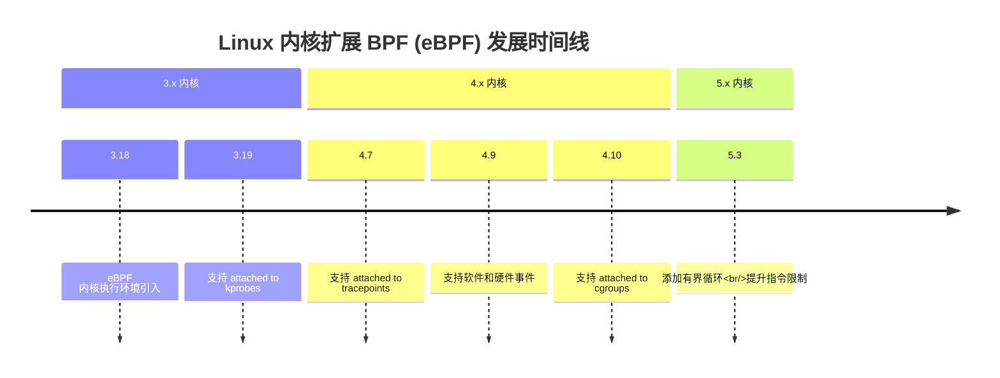

■ **Overlayfs (3.18)**：Linux 中包含的一种联合挂载文件系统。它在其他文件系统之上创建虚拟文件系统，也可以在不更改第一个文件系统的情况下进行修改。通常用于容器。

■ **DCTCP (3.18)**：数据中心 TCP (DCTCP) 拥塞控制算法，旨在提供高突发容忍度、低延迟和高吞吐量 [Borkmann 14a]。

■ **DAX (4.0)**：直接访问 允许用户空间直接从持久内存存储设备读取，而没有缓冲开销。ext4 可以使用 DAX。

■ **排队自旋锁 (4.2)**：在争用下提供更好的性能，在 4.2 中成为默认的自旋锁内核实现。

■ **TCP 无锁监听器 (4.4)**：TCP 监听器快速路径变为无锁，提高了性能。

■ **cgroup v2 (4.5, 4.15)**：cgroups 的统一层次结构在早期的内核中就已存在，并在 4.5 中被认为是稳定并暴露出来，命名为 cgroup v2 [Heo 15]。cgroup v2 CPU 控制器在 4.15 中添加。

■ **epoll 可扩展性 (4.5)**：为了多线程可扩展性，`epoll(7)` 避免了为每个事件唤醒所有在相同文件描述符上等待的线程，这曾导致了惊群 性能问题 [Corbet 15]。

■ **KCM (4.6)**：内核连接多路复用器 提供了一个基于 TCP 的高效的基于消息的接口。

■ **TCP NV (4.8)**：New Vegas (NV) 是一种新的 TCP 拥塞控制算法，适用于高带宽网络（运行在 10+ Gbps 的网络）。

■ **XDP (4.8, 4.18)**：eXpress 数据路径 是一个基于 BPF 的可编程快速路径，用于高性能网络 [Herbert 16]。可以绕过大部分网络协议栈的 AF_XDP 套接字地址系列在 4.18 中添加。

■ **TCP BBR (4.9)**：瓶颈带宽和 RTT (BBR) 是一种 TCP 拥塞控制算法，在遭受丢包和缓冲区膨胀的网络上提供改善的延迟和吞吐量 [Cardwell 16]。

■ **硬件延迟跟踪器 (4.9)**：一个 Ftrace 跟踪器，可以检测由硬件和固件引起的系统延迟，包括系统管理中断 (SMI)。

■ **perf c2c (4.10)**：缓存到缓存 (c2c) perf 子命令可以帮助识别 CPU 缓存性能问题，包括伪共享。

■ **Intel CAT (4.10)**：对 Intel 缓存分配技术 (CAT) 的支持，允许任务拥有专用的 CPU 缓存空间。这可被容器用来帮助解决吵闹的邻居 问题。

> [!TIP] 技术术语对照与释义
> - **Thundering herd (惊群问题)**：多进程/多线程同时阻塞等待同一事件，事件触发时所有等待者都被唤醒，但最终只有一个能成功处理，导致大量无效的 CPU 上下文切换和资源消耗。
> - **False sharing (伪共享)**：在多核 CPU 中，不同核心的线程各自修改位于同一缓存行中的不同变量，导致缓存行在核心间频繁失效和传输，严重影响性能。
> - **Noisy neighbor (吵闹的邻居)**：在云计算或容器化环境中，同一物理机上的不同租户或容器由于共享资源（如 CPU 缓存、内存带宽、磁盘 I/O），一方过度消耗资源导致另一方性能下降的现象。

# 3.1 操作系统

■多队列 I/O 调度器：BPQ、Kyber (4.12)：Budget Fair Queueing (BFQ) 多队列 I/O 调度器为交互式应用程序提供了低延迟 I/O，特别是对于较慢的存储设备。BFQ 在 5.2 中得到了显著改进。Kyber I/O 调度器适用于快速多队列设备 [Corbet 17]。

■内核 TLS (4.13, 4.17)：Linux 版本的内核 TLS [Edge 15]。

■MSG_ZEROCOPY (4.14)：一个 `send(2)` 标志，用于避免在应用程序和网络接口之间额外复制数据包字节 [Linux 20c]。

■PCID (4.14)：Linux 增加了对进程上下文 ID (Process-Context ID, PCID) 的支持，这是一种处理器 MMU 功能，有助于避免上下文切换时的 TLB 刷新。这降低了为缓解 Meltdown 漏洞所需的内核页表隔离 (KPTI) 补丁带来的性能开销。参见第 3.4.3 节，KPTI (Meltdown)。

■PSI (4.20, 5.2)：压力失速信息 (Pressure Stall Information, PSI) 是一组新的指标，用于显示在 CPU、内存或 I/O 上花费的停滞时间。5.2 中添加了 PSI 阈值通知以支持 PSI 监控。

■TCP EDT (4.20)：TCP 协议栈切换到提前出发时间 (Early Departure Time, EDT)：这使用时间轮调度器来发送数据包，提供了更好的 CPU 效率和更小的队列 [Jacobson 18]。

■多队列 I/O (5.0)：多队列块 I/O 调度器在 5.0 中成为默认，经典调度器被移除。

■UDP GRO (5.0)：UDP 通用接收卸载 (Generic Receive Offload, GRO) 允许驱动程序和网卡聚合数据包并向上传递给协议栈，从而提高了性能。

■io_uring (5.1)：一个通用的异步接口，用于应用程序和内核之间的快速通信，利用了共享环形缓冲区。主要用途包括快速磁盘和网络 I/O。

■MADV_COLD、MADV_PAGEOUT (5.4)：这些 `madvise(2)` 标志向内核提示内存是需要的，但不是马上需要。`MADV_PAGEOUT` 还提示内存可以立即回收。这些对于内存受限的嵌入式 Linux 设备特别有用。

■多路径 TCP (5.6)：可以使用多个网络链路（例如 3G 和 WiFi）来提高单个 TCP 连接的性能和可靠性。

■启动时追踪 (5.6)：允许 Ftrace 追踪早期启动过程。（systemd 可以提供晚期启动过程的时间信息：参见第 3.4.2 节，systemd。）

■热压力 (5.7)：调度器将热量节流计算在内，以做出更好的任务放置决策。

■perf 火焰图 (5.8)：`perf(1)` 支持火焰图可视化。

这里没有列出的是针对锁、驱动程序、VFS、文件系统、异步 I/O、内存分配器、NUMA、新处理器指令支持、GPU 以及性能工具 `perf(1)` 和 Ftrace 的许多小性能改进。系统启动时间也因 systemd 的采用而得到了改善。

接下来的几节将更详细地描述对性能至关重要的三个 Linux 主题：systemd、KPTI 和扩展 BPF。

## 3.4.2 systemd

systemd 是 Linux 常用的服务管理器，作为原始 UNIX init 系统的替代品而开发。systemd 具有多种功能，包括感知依赖的服务启动和服务时间统计。

系统性能调优中偶尔会涉及的一项任务是调整系统的启动时间，而 systemd 的时间统计可以显示需要调优的地方。可以使用 `systemd-analyze(1)` 报告总体启动时间：

```bash
# systemd-analyze
Startup finished in 1.657s (kernel) + 10.272s (userspace) = 11.930s 
graphical.target reached after 9.663s in userspace
```

此输出显示系统在 9.663 秒内启动（在本例中达到了 `graphical.target`）。可以使用 `critical-chain` 子命令查看更多信息：

```bash
# systemd-analyze critical-chain
The time when unit became active or started is printed after the "@" character.
The time the unit took to start is printed after the "+" character.
graphical.target @9.663s
└─multi-user.target @9.661s
  └─snapd.seeded.service @9.062s +62ms
    └─basic.target @6.336s
      └─sockets.target @6.334s
        └─snapd.socket @6.316s +16ms
          └─sysinit.target @6.281s
            └─cloud-init.service @5.361s +905ms
              └─systemd-networkd-wait-online.service @3.498s +1.860s
                └─systemd-networkd.service @3.254s +235ms
                  └─network-pre.target @3.251s
                    └─cloud-init-local.service @2.107s +1.141s
                      └─systemd-remount-fs.service @391ms +81ms
                        └─systemd-journald.socket @387ms
                          └─system.slice @366ms
                            └─-.slice @366ms
```

> [!INFO] systemd-analyze critical-chain 输出解读
> - **`@` 字符后**打印的时间：单元变为活动状态或启动的时间点。
> - **`+` 字符后**打印的时间：该单元启动所花费的时长。

此输出显示了关键路径：导致延迟的步骤序列（在本例中为服务）。最慢的服务是 `systemd-networkd-wait-online.service`，花费了 1.86 秒启动。

还有其他有用的子命令：`blame` 显示最慢的初始化时间，`plot` 生成 SVG 图表。更多信息请参见 `systemd-analyze(1)` 的 man 手册页。

## 3.4.3 KPTI (Meltdown)

2018 年添加到 Linux 4.14 中的内核页表隔离 (Kernel Page Table Isolation, KPTI) 补丁是对名为“Meltdown”的 Intel 处理器漏洞的缓解措施。较旧的 Linux 内核版本有用于类似目的的 KAISER 补丁，其他内核也采用了缓解措施。虽然这些措施解决了安全问题，但由于额外的 CPU 周期以及在上下文切换和系统调用时额外的 TLB 刷新，它们也降低了处理器性能。Linux 在同一版本中添加了进程上下文 ID (PCID) 支持，只要处理器支持 pcid，就可以避免一些 TLB 刷新。

> [!NOTE] KPTI 的性能影响
> 针对 Netflix 云生产工作负载，我评估了 KPTI 的性能影响在 0.1% 到 6% 之间，具体取决于工作负载的系统调用速率（速率越高，开销越大）[Gregg 18a]。
> 
> 额外的调优将进一步降低开销：使用大页 (huge pages) 以便刷新后的 TLB 更快变热，以及使用追踪工具检查系统调用以找出降低其速率的方法。许多此类追踪工具都是使用扩展 BPF 实现的。

## 3.4.4 扩展 BPF

BPF 全称为伯克利数据包过滤器 (Berkeley Packet Filter)，这是一项冷门技术，最初于 1992 年开发，旨在提高数据包捕获工具的性能 [McCanne 92]。2013 年，Alexei Starovoitov 提议对 BPF 进行重大重写 [Starovoitov 13]，随后由他本人和 Daniel Borkmann 进一步开发，并于 2014 年包含在 Linux 内核中 [Borkmann 14b]。这将 BPF 变成了一个通用执行引擎，可用于各种用途，包括网络、可观测性和安全。

BPF 本身是一项灵活且高效的技术，由指令集、存储对象（映射/maps）和辅助函数组成。由于其虚拟指令集规范，它可以被视为一台虚拟机。BPF 程序在内核模式下运行（如前文图 3.2 所示），并被配置为在事件发生时运行：套接字事件、追踪点 (tracepoints)、USDT 探针、kprobes、uprobes 和 `perf_events`。这些如图 3.16 所示。

**图 3.16 BPF 组件**

```mermaid
graph TD
    subgraph BPF执行引擎
        BPF_Program[BPF程序]
    end

    subgraph 事件源
        A[套接字事件 Socket Events]
        B[追踪点 Tracepoints]
        C[USDT 探针]
        D[kprobes]
        E[uprobes]
        F[perf_events]
    end

    A --> BPF_Program
    B --> BPF_Program
    C --> BPF_Program
    D --> BPF_Program
    E --> BPF_Program
    F --> BPF_Program

    subgraph 输出机制
        G[perf 环形缓冲区 <br> (每事件数据)]
        H[映射/Maps <br> (统计数据)]
    end

    BPF_Program --> G
    BPF_Program --> H
```

BPF 字节码必须首先通过一个验证器，该验证器检查安全性，确保 BPF 程序不会崩溃或破坏内核。它还可能使用 BPF 类型格式 (BPF Type Format, BTF) 系统来理解数据类型和结构。BPF 程序可以通过 perf 环形缓冲区输出数据，这是一种发出每事件数据的高效方式；也可以通过映射输出，映射更适合统计数据。

> [!TIP] BPF 在系统性能分析中的重要性
> 由于 BPF 正在推动新一代高效、安全和高级的追踪工具，因此它对系统性能分析非常重要。它为现有的内核事件源提供了可编程性：追踪点、kprobes、uprobes 和 `perf_events`。例如，一个 BPF 程序可以在 I/O 的开始和结束记录时间戳以计算其持续时间，并将其记录在自定义直方图中。本书包含许多使用 BCC 和 bpftrace 前端的基于 BPF 的程序。这些前端将在第 15 章中介绍。

# 3.5 其他主题

其他一些值得总结的内核和操作系统主题包括 PGO 内核、Unikernels、微内核、混合内核和分布式操作系统。

## 3.5.1 PGO 内核

配置文件引导优化 (Profile-guided optimization, PGO)，也称为反馈定向优化 (feedback-directed optimization, FDO)，使用 CPU 配置文件信息来改进编译器决策 [Yuan 14a]。这可以应用于内核构建，其过程如下：

1. 在生产环境中运行时，获取 CPU 剖析文件。
2. 基于该 CPU 剖析文件重新编译内核。
3. 将新内核部署到生产环境中。

这创建了一个针对特定工作负载提升了性能的内核。诸如 JVM 之类的运行时会自动执行此操作，结合即时 编译，根据运行时性能重新编译 Java 方法。然而，创建 PGO 内核的过程则涉及手动步骤。

一种相关的编译优化是链接时优化，它将整个二进制文件一次性编译，以允许在整个程序范围内进行优化。Microsoft Windows 内核大量使用了 LTO 和 PGO，从 PGO 中看到了 5% 到 20% 的性能提升 [Bearman 20]。Google 也使用 LTO 和 PGO 内核来提高性能 [Tolvanen 20]。

`gcc` 和 `clang` 编译器以及 Linux 内核都支持 PGO。内核 PGO 通常涉及运行一个特殊插桩的内核来收集剖析数据。Google 发布了一个 AutoFDO 工具，它绕过了对这种特殊内核的需求：AutoFDO 允许使用 `perf(1)` 从普通内核收集剖析文件，然后将其转换为编译器使用的正确格式 [Google 20a]。

> [!INFO] 关于构建 PGO/AutoFDO Linux 内核的最新文档
> 最近关于使用 PGO 或 AutoFDO 构建 Linux 内核的唯一文档是 Microsoft [Bearman 20] 和 Google [Tolvanen 20] 在 2020 年 Linux Plumber’s Conference 上的两次演讲。^15
> 
> ^15：有一段时间，最新的文档是 2014 年针对 Linux 3.13 的 [Yuan 14b]，这阻碍了在较新内核上的采用。

## 3.5.2 Unikernels

Unikernel 是一种单应用程序机器镜像，它将内核、库和应用软件结合在一起，通常可以在硬件虚拟机或裸机上的单一地址空间中运行。这可能带来性能和安全方面的好处：更少的指令文本意味着更高的 CPU 缓存命中率和更少的安全漏洞。但这也带来了一个问题：可能没有 SSH、shell 或性能工具供你登录和调试系统，也没有任何方法添加它们。

> [!WARNING] Unikernel 的可观测性挑战
> 为了在生产中对 Unikernels 进行性能调优，必须构建新的性能工具和指标来支持它们。作为概念验证，我构建了一个基本的 CPU 分析器，它从 Xen dom0 运行以分析 domU Unikernel 客户机，然后构建了一个 CPU 火焰图，仅仅为了证明这是可能的 [Gregg 16a]。

Unikernels 的示例包括 MirageOS [MirageOS 20]。

### 3.5.3 微内核与混合内核

本章的大部分内容都在讨论类 Unix 内核，也被称为[[单体内核]]，即所有管理设备的代码作为一个单一的大型内核程序一起运行。而对于[[微内核]]模型，内核软件被保持在最低限度。微内核仅支持内存管理、线程管理和进程间通信（IPC）等核心基础功能。文件系统、网络协议栈和驱动程序则作为用户模式软件实现，这使得那些用户模式组件更容易被修改和替换。想象一下，你不仅可以选择安装哪种数据库或 Web 服务器，还可以选择安装哪种网络协议栈。微内核也具有更高的容错性：驱动程序的崩溃不会导致整个内核崩溃。微内核的例子包括 QNX 和 Minix 3。

微内核的一个缺点是，在执行 I/O 和其他功能时会有额外的 IPC 步骤，从而降低了性能。针对此问题的一个解决方案是[[混合内核]]，它结合了微内核和单体内核的优点。混合内核将性能关键型服务移回内核空间（使用直接函数调用而不是 IPC），就像在单体内核中那样，但同时保留了微内核的模块化设计和容错性。混合内核的例子包括 Windows NT 内核和 Plan 9 内核。

### 3.5.4 分布式操作系统

[[分布式操作系统]]在一组连接在一起的独立计算机节点上运行单个操作系统实例。每个节点上通常使用微内核。分布式操作系统的例子包括贝尔实验室的 Plan 9 和 Inferno 操作系统。

虽然这是一种创新的设计，但该模型并未得到广泛应用。Plan 9 和 Inferno 的共同创造者 Rob Pike 描述了造成这种情况的各种原因，包括 [Pike 00]：

> “在 20 世纪 70 年代末和 80 年代初，有一种说法认为 Unix 扼杀了操作系统的研究，因为没有人愿意尝试其他东西。当时，我不相信。今天，我勉强接受这个说法可能是对的（尽管有微软的存在）。”

在云端，当今扩展计算节点的常见模型是在一组相同的 OS 实例之间进行负载均衡，这些实例可以根据负载进行扩展（参见第 11 章，云计算，第 11.1.3 节，容量规划）。

### 3.6 内核比较

哪个内核最快？这在一定程度上取决于操作系统的配置、工作负载以及内核的参与程度。总的来说，我预计 [[Linux]] 将优于其他内核，因为其在性能改进、应用程序和驱动程序支持方面进行了大量工作，以及其广泛的使用和发现并报告性能问题的庞大社区。自 1993 年以来由 TOP500 列表追踪的排名前 500 的超级计算机，在 2017 年已 100% 成为 Linux [TOP500 17]。也会有一些例外；例如，Netflix 在云端使用 Linux，而在其 [[CDN]] 上使用 FreeBSD。^16

> [!NOTE] 脚注 16
> FreeBSD 为 Netflix CDN 工作负载提供了更高的性能，这尤其归功于 Netflix OCA 团队所做的内核改进。这是经过常规测试的，最近一次是在 2019 年，对 Linux 5.0 与 FreeBSD 进行了生产环境对比，我协助分析了该结果。

内核性能通常使用[[微基准测试]]进行比较，但这很容易出错。这类基准测试可能会发现某个内核在特定系统调用上快得多，但该系统调用并未在生产工作负载中使用。（或者虽然使用了，但带有未被微基准测试覆盖的某些标志，而这些标志极大地影响了性能。）准确比较内核性能是高级性能工程师的任务——这项任务可能需要数周时间。请参见第 12 章，基准测试，第 12.3.2 节，主动基准测试，作为可遵循的方法论。

在本书的第一版中，我在总结本节时指出，Linux 没有成熟的动态跟踪器，没有它，你可能会错失巨大的性能提升。自第一版以来，我转入了全职的 Linux 性能岗位，并帮助开发了 Linux 之前缺失的动态跟踪器：基于扩展 BPF 的 BCC 和 bpftrace。这些内容在第 15 章及我之前的书 [Gregg 19] 中有所涵盖。

第 3.4.1 节，Linux 内核发展，列出了在第一版和本版之间发生的许多其他 Linux 性能发展，跨越了内核版本 3.1 和 5.8。前面未列出的一个主要发展是，OpenZFS 现在支持将 Linux 作为其主要内核，为 Linux 提供了一个高性能且成熟的文件系统选项。

> [!WARNING] 复杂性与调优
> 然而，伴随 Linux 的所有这些发展而来的是复杂性。Linux 上有如此多的性能特性和可调参数，以至于为每个工作负载配置和调优它们变得非常费力。我见过许多未加调优就运行的部署。在比较内核性能时请牢记这一点：每个内核都经过调优了吗？本书的后续章节及其调优部分可以帮助您解决这个问题。

### 3.7 练习

1. 回答以下关于操作系统术语的问题：
	- [[进程]]、[[线程]]和[[任务]]之间有什么区别？
	- 什么是[[模式切换]]和[[上下文切换]]？
	- [[分页]]和[[进程交换]]有什么区别？
	- [[I/O 密集型]]和[[CPU 密集型]]工作负载有什么区别？
2. 回答以下概念性问题：
	- 描述内核的作用。
	- 描述系统调用的作用。
	- 描述 [[VFS]] 的作用及其在 I/O 栈中的位置。
3. 回答以下更深层的问题：
	- 列出线程离开当前 CPU 的原因。
	- 描述[[虚拟内存]]和[[按需分页]]的优点。

### 3.8 参考文献

- [Graham 68] Graham, B., “Protection in an Information Processing Utility,” Communications of the ACM, May 1968.
- [Ritchie 74] Ritchie, D. M., and Thompson, K., “The UNIX Time-Sharing System,” Communications of the ACM 17, no. 7, pp. 365–75, July 1974.
- [Thompson 78] Thompson, K., UNIX Implementation, Bell Laboratories, 1978. 
- [Bach 86] Bach, M. J., The Design of the UNIX Operating System, Prentice Hall, 1986. 
- [Mellor-Crummey 91] Mellor-Crummey, J. M., and Scott, M., “Algorithms for Scalable Synchronization on Shared-Memory Multiprocessors,” ACM Transactions on Computing Systems, Vol. 9, No. 1, https://www.cs.rochester.edu/u/scott/papers/1991_TOCS_synch.pdf, 1991.
- [McCanne 92] McCanne, S., and Jacobson, V., “The BSD Packet Filter: A New Architecture for User-Level Packet Capture”, USENIX Winter Conference, 1993.
- [Mills 94] Mills, D., “RFC 1589: A Kernel Model for Precision Timekeeping,” Network Working Group, 1994.
- [Lever 00] Lever, C., Eriksen, M. A., and Molloy, S. P., “An Analysis of the TUX Web Server,” CITI Technical Report 00-8, http://www.citi.umich.edu/techreports/reports/citi-tr-00-8.pdf, 2000.
- [Pike 00] Pike, R., “Systems Software Research Is Irrelevant,” http://doc.cat-v.org/bell_labs/utah2000/utah2000.pdf, 2000.
- [Mauro 01] Mauro, J., and McDougall, R., Solaris Internals: Core Kernel Architecture, Prentice Hall, 2001.
- [Bovet 05] Bovet, D., and Cesati, M., Understanding the Linux Kernel, 3rd Edition, O’Reilly, 2005.
- [Corbet 05] Corbet, J., Rubini, A., and Kroah-Hartman, G., Linux Device Drivers, 3rd Edition, O’Reilly, 2005.
- [Corbet 13a] Corbet, J., “Is the whole system idle?” LWN.net, https://lwn.net/Articles/558284, 2013.
- [Corbet 13b] Corbet, J., “The multiqueue block layer,” LWN.net, https://lwn.net/Articles/552904, 2013.
- [Starovoitov 13] Starovoitov, A., “[PATCH net-next] extended BPF,” Linux kernel mailing list, https://lkml.org/lkml/2013/9/30/627, 2013.
- [Borkmann 14a] Borkmann, D., “net: tcp: add DCTCP congestion control algorithm,” https://git.kernel.org/pub/scm/linux/kernel/git/torvalds/linux.git/commit/?id=e3118e8359bb7c59555aca60c725106e6d78c5ce, 2014.
- [Borkmann 14b] Borkmann, D., “[PATCH net-next 1/9] net: filter: add jited flag to indicate jit compiled filters,” netdev mailing list, https://lore.kernel.org/netdev/1395404418-25376-1-git-send-email-dborkman@redhat.com/T, 2014.
- [Corbet 14] Corbet, J., “MCS locks and qspinlocks,” LWN.net, https://lwn.net/Articles/590243, 2014.
- [Drysdale 14] Drysdale, D., “Anatomy of a system call, part 2,” LWN.net, https://lwn.net/Articles/604515, 2014.
- [Yuan 14a] Yuan, P., Guo, Y., and Chen, X., “Experiences in Profile-Guided Operating System Kernel Optimization,” APSys, 2014.
- [Yuan 14b] Yuan P., Guo, Y., and Chen, X., “Profile-Guided Operating System Kernel Optimization,” http://coolypf.com, 2014.
- [Corbet 15] Corbet, J., “Epoll evolving,” LWN.net, https://lwn.net/Articles/633422, 2015.
- [Edge 15] Edge, J., “TLS in the kernel,” LWN.net, https://lwn.net/Articles/666509, 2015.
- [Heo 15] Heo, T., “Control Group v2,” Linux documentation, https://www.kernel.org/doc/Documentation/cgroup-v2.txt, 2015.
- [McKusick 15] McKusick, M. K., Neville-Neil, G. V., and Watson, R. N. M., The Design and Implementation of the FreeBSD Operating System, 2nd Edition, Addison-Wesley, 2015.
- [Stewart 15] Stewart, R., Gurney, J. M., and Long, S., “Optimizing TLS for High-Bandwidth Applicationsin FreeBSD,” AsiaBSDCon, https://people.freebsd.org/~rrs/asiabsd_2015_tls.pdf, 2015.
- [Cardwell 16] Cardwell, N., Cheng, Y., Stephen Gunn, C., Hassas Yeganeh, S., and Jacobson, V., “BBR: Congestion-Based Congestion Control,” ACM queue, https://queue.acm.org/detail.cfm?id=3022184, 2016.
- [Gregg 16a] Gregg, B., “Unikernel Profiling: Flame Graphs from dom0,” http://www.brendangregg.com/blog/2016-01-27/unikernel-profiling-from-dom0.html, 2016.
- [Herbert 16] Herbert, T., and Starovoitov, A., “eXpress Data Path (XDP): Programmable and High Performance Networking Data Path,” https://github.com/iovisor/bpf-docs/raw/master/Express_Data_Path.pdf, 2016.
- [Corbet 17] Corbet, J., “Two new block I/O schedulers for 4.12,” LWN.net, https://lwn.net/Articles/720675, 2017.

# 3.1 操作系统

## 3.8 参考文献 

[TOP500 17] TOP500, “List Statistics,” https://www.top500.org/statistics/list, 2017.
[Gregg 18a] Gregg, B., “KPTI/KAISER Meltdown Initial Performance Regressions,” http://www.brendangregg.com/blog/2018-02-09/kpti-kaiser-meltdown-performance.html, 2018.
[Jacobson 18] Jacobson, V., “Evolving from AFAP: Teaching NICs about Time,” netdev 0x12, https://netdevconf.info/0x12/session.html?evolving-from-afap-teaching-nics-about-time, 2018.
[Gregg 19] Gregg, B., BPF Performance Tools: Linux System and Application Observability, Addison-Wesley, 2019.
[Looney 19] Looney, J., “Netflix and FreeBSD: Using Open Source to Deliver Streaming Video,” FOSDEM, https://papers.freebsd.org/2019/fosdem/looney-netflix_and_freebsd, 2019.
[Bearman 20] Bearman, I., “Exploring Profile Guided Optimization of the Linux Kernel,” Linux Plumber’s Conference, https://linuxplumbersconf.org/event/7/contributions/771, 2020.
[Google 20a] Google, “AutoFDO,” https://github.com/google/autofdo, accessed 2020.
[Linux 20a] “NO_HZ: Reducing Scheduling-Clock Ticks,” Linux documentation, https://www.kernel.org/doc/html/latest/timers/no_hz.html, accessed 2020.
[Linux 20b] “Deadline Task Scheduling,” Linux documentation, https://www.kernel.org/doc/Documentation/scheduler/sched-deadline.rst, accessed 2020.
[Linux 20c] “MSG_ZEROCOPY,” Linux documentation, https://www.kernel.org/doc/html/latest/networking/msg_zerocopy.html, accessed 2020.
[Linux 20d] “Softlockup Detector and Hardlockup Detector (aka nmi_watchdog),” Linux documentation, https://www.kernel.org/doc/html/latest/admin-guide/lockup-watchdogs.html, accessed 2020.
[MirageOS 20] MirageOS, “Mirage OS,” https://mirage.io, accessed 2020.
[Owens 20] Owens, K., et al., “4. Kernel Stacks,” Linux documentation, https://www.kernel.org/doc/html/latest/x86/kernel-stacks.html, accessed 2020.
[Tolvanen 20] Tolvanen, S., Wendling, B., and Desaulniers, N., “LTO, PGO, and AutoFDO in the Kernel,” Linux Plumber’s Conference, https://linuxplumbersconf.org/event/7/contributions/798, 2020.

### 3.8.1 延伸阅读

> [!TIP] 延伸学习
> 操作系统及其[[内核]]是一个引人入胜且内容广泛的主题。本章仅总结了其中的核心要点。除了本章中提及的资料外，以下也是极佳的参考文献，适用于基于 Linux 的操作系统以及其他操作系统：

[Goodheart 94] Goodheart, B., and Cox J., The Magic Garden Explained: The Internals of UNIX System V Release 4, an Open Systems Design, Prentice Hall, 1994. 
[Vahalia 96] Vahalia, U., UNIX Internals: The New Frontiers, Prentice Hall, 1996.
[Singh 06] Singh, A., Mac OS X Internals: A Systems Approach, Addison-Wesley, 2006.

---

> [!INFO] 页面图表上下文注记
> 本部分源文本涵盖页码 128-166，在原始排版中包含以下图表（由于缺乏原始图像文件，此处保留上下文索引记录）：
> - 第 130 页，图像 1204
> - 第 131 页，图像 1209
> - 第 132 页，图像 1213
> - 第 135 页，图像 1222
> - 第 136 页，图像 1226
> - 第 137 页，图像 1229
> - 第 139 页，图像 1236
> - 第 140 页，图像 1239 与 1240
> - 第 142 页，图像 1247
> - 第 143 页，图像 1250
> - 第 144 页，图像 1254
> - 第 145 页，图像 1258
> - 第 146 页，图像 1262
> - 第 147 页，图像 1265
> - 第 160 页，图像 1308