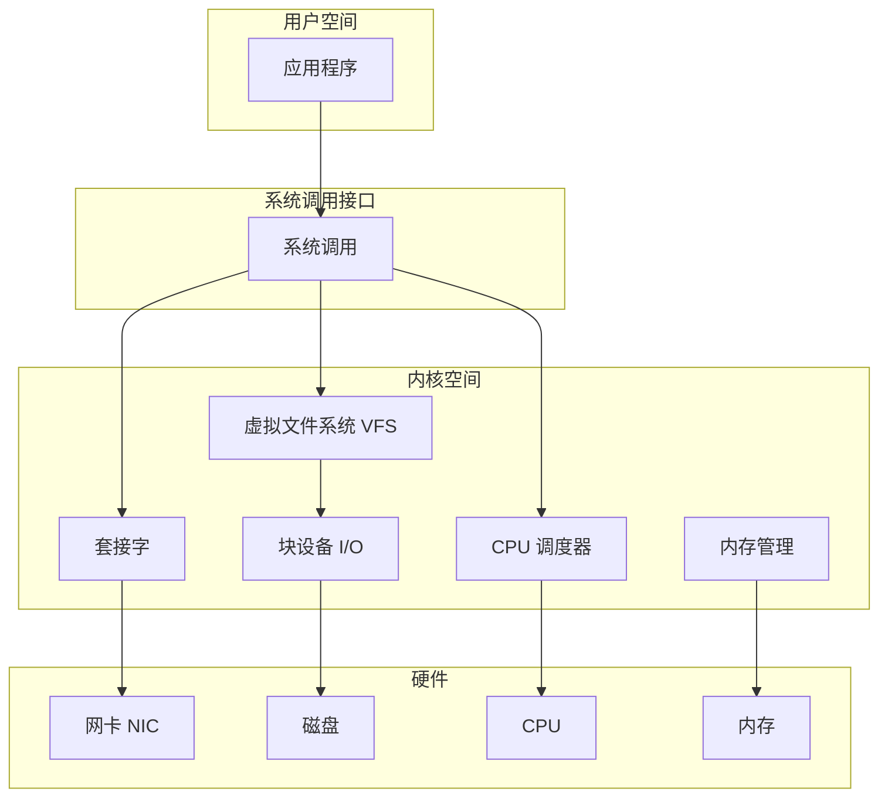
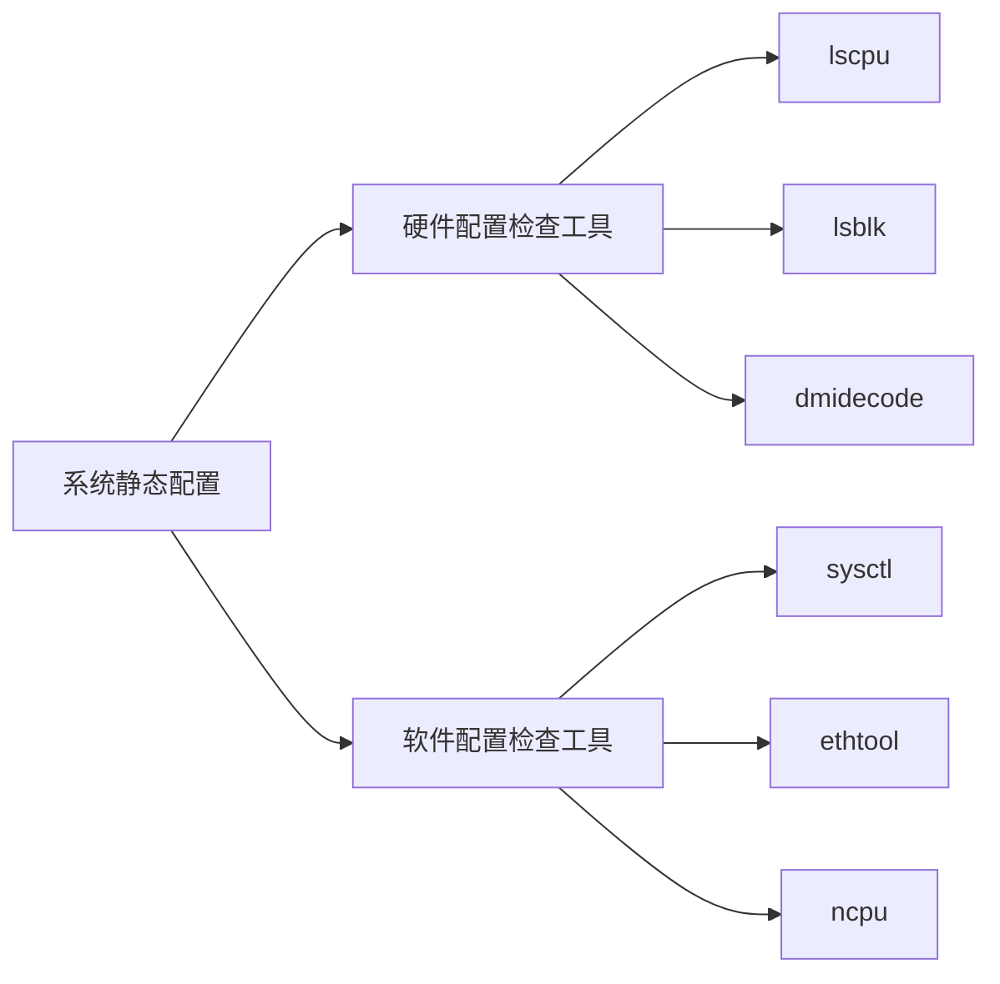
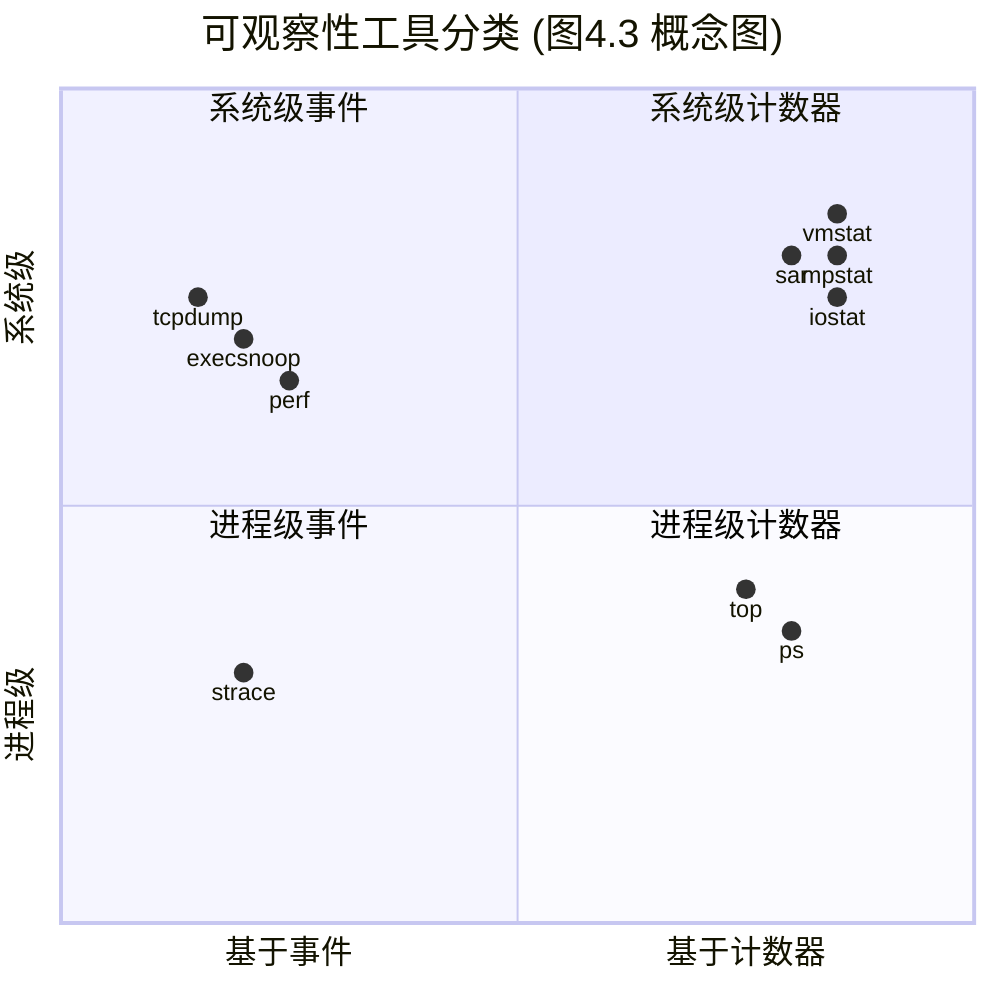
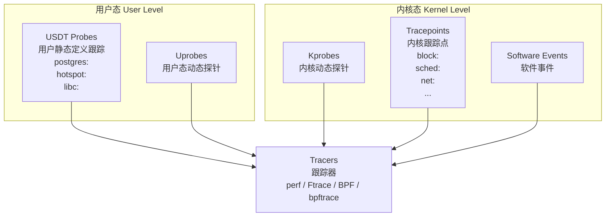
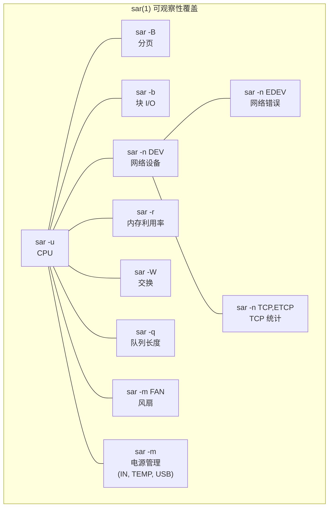
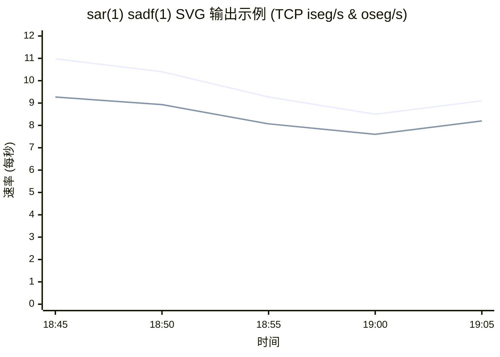

# 第四章 可观察性工具

操作系统在历史上提供了许多用于观察系统软件和硬件组件的工具。对于新手来说，种类繁多的可用工具和指标似乎暗示着一切——或者至少是一切重要的事物——都是可观察的。但实际上存在许多盲区，系统性能专家变得精通推断和解释的艺术：通过间接工具和统计数据来推测出系统活动。例如，网络数据包可以被逐个检查（抓包），但磁盘 I/O 却不能（至少不容易做到）。

得益于动态追踪工具的兴起，包括基于 BPF 的 BCC 和 bpftrace，Linux 的可观察性已经有了极大的改善。曾经的暗角现在被照亮了，包括使用 `biosnoop(8)` 观察单个磁盘 I/O。然而，许多公司和商业监控产品尚未采用系统追踪，因此错失了它所带来的深刻洞察力。我通过开发、发布和解释新的追踪工具引领了这一方向，这些工具已经在 Netflix 和 Facebook 等公司投入使用。

本章的学习目标是：

- 识别静态性能工具和危机工具。
- 理解工具类型及其开销：计数器、性能剖析和追踪。
- 了解可观察性数据源，包括：`/proc`、`/sys`、[[tracepoints]]、[[kprobes]]、[[uprobes]]、[[USDT]] 和 [[PMCs]]。
- 学习如何配置 `sar(1)` 以归档统计数据。

在第 1 章中，我介绍了不同类型的可观察性：计数器、性能剖析和追踪，以及静态和动态插桩。本章详细解释了可观察性工具及其数据源，包括 `sar(1)`（系统活动报告器）的总结以及追踪工具的介绍。这为您理解 Linux 可观察性提供了必备知识；后续章节（第 6 到 11 章）将使用这些工具和数据源来解决特定问题。第 13 到 15 章将深入讲解追踪器。

本章以 Ubuntu Linux 发行版为例；大多数这些工具在其他 Linux 发行版中是相同的，并且在这些工具发源的其他内核和操作系统中也存在一些类似的工具。

---

## 4.1 工具覆盖范围

图 4.1 显示了一个操作系统图表，我在其中标注了与各个组件相关的 Linux 工作负载可观察性工具 [1]。

**图 4.1 Linux 工作负载可观察性工具**



*（注：上图为图 4.1 的概念示意，原书插图详细标注了各类工具如 `top`, `iostat`, `tcpdump`, `perf` 等在对应层级的位置）*

这些工具大多专注于特定资源，例如 CPU、内存或磁盘，并将在后续致力于该资源的章节中进行介绍。有一些多用途工具可以分析许多领域，它们将在本章稍后介绍：`perf`、`Ftrace`、`BCC` 和 `bpftrace`。

> [!NOTE] 脚注 1
> 在 2000 年代中期教授性能课程时，我会在白板上绘制自己的内核图，并用不同的性能工具及其观察对象进行标注。我发现这是一种解释工具覆盖范围作为心智图的有效方法。从那以后，我发布了这些图的数字版本，它们装饰着世界各地的隔间墙壁。您可以在我的网站上下载它们 [Gregg 20a]。

### 4.1.1 静态性能工具

还有另一种类型的可观察性，它检查的是系统在静止状态下的属性，而不是在活跃工作负载下的属性。这在第 2 章“方法论”的 2.5.17 节“静态性能调优”中被描述为静态性能调优方法论，这些工具显示在图 4.2 中。

**图 4.2 Linux 静态性能调优工具**



*（注：上图为图 4.2 的概念示意，原书插图标注了各类用于检查静态配置和组件状态的工具）*

> [!TIP] 提示
> 记住使用图 4.2 中的工具来检查配置和组件的问题。有时性能问题仅仅是由于配置错误引起的。

### 4.1.2 危机工具

当您遇到生产环境性能危机并需要各种性能工具来调试时，您可能会发现它们都没有被安装。更糟的是，由于服务器正遭受性能问题，安装工具可能比平时花费更长的时间，从而延长了危机。

对于 Linux，表 4.1 列出了提供这些危机工具的推荐安装包或源代码库。此表中显示了 Ubuntu/Debian 的包名称（这些包名称在不同的 Linux 发行版中可能有所不同）。

**表 4.1 Linux 危机工具包**

| 包名 | 提供的工具 |
| --- | --- |
| procps | `ps(1)`, `vmstat(8)`, `uptime(1)`, `top(1)` |
| util-linux | `dmesg(1)`, `lsblk(1)`, `lscpu(1)` |
| sysstat | `iostat(1)`, `mpstat(1)`, `pidstat(1)`, `sar(1)` |
| iproute2 | `ip(8)`, `ss(8)`, `nstat(8)`, `tc(8)` |
| numactl | `numastat(8)` |
| linux-tools-common <br> linux-tools-$(uname -r) | `perf(1)`, `turbostat(8)` |
| bcc-tools (又名 bpfcc-tools) | `opensnoop(8)`, `execsnoop(8)`, `runqlat(8)`, `runqlen(8)`, `softirqs(8)`, `hardirqs(8)`, `ext4slower(8)`, `ext4dist(8)`, `biotop(8)`, `biosnoop(8)`, `biolatency(8)`, `tcptop(8)`, `tcplife(8)`, `trace(8)`, `argdist(8)`, `funccount(8)`, `stackcount(8)`, `profile(8)` 以及更多 |
| bpftrace | `bpftrace`，`opensnoop(8)`, `execsnoop(8)`, `runqlat(8)`, `runqlen(8)`, `biosnoop(8)`, `biolatency(8)` 的基础版本以及更多 |
| perf-tools-unstable | 基于 Ftrace 的 `opensnoop(8)`, `execsnoop(8)`, `iolatency(8)`, `iosnoop(8)`, `bitesize(8)`, `funccount(8)`, `kprobe(8)` |
| trace-cmd | `trace-cmd(1)` |
| nicstat | `nicstat(1)` |
| ethtool | `ethtool(8)` |
| tiptop | `tiptop(1)` |
| msr-tools | `rdmsr(8)`, `wrmsr(8)` |
| github.com/brendangregg/msr-cloud-tools | `showboost(8)`, `cpuhot(8)`, `cputemp(8)` |
| github.com/brendangregg/pmc-cloud-tools | `pmcarch(8)`, `cpucache(8)`, `icache(8)`, `tlbstat(8)`, `resstalls(8)` |

大型公司（如 Netflix）拥有操作系统和性能团队，他们确保生产系统安装了所有这些包。默认的 Linux 发行版可能只安装了 `procps` 和 `util-linux`，因此必须添加所有其他包。

> [!INFO] 容器环境提示
> 在容器环境中，可能需要创建一个特权调试容器，使其拥有对系统的完全访问权限 [2] 并安装了所有工具。此容器的镜像可以安装在容器宿主机上，并在需要时进行部署。

仅仅添加工具包通常是不够的：内核和用户空间软件可能也需要进行配置以支持这些工具。追踪工具通常需要启用特定的内核 CONFIG 选项，例如 `CONFIG_FTRACE` 和 `CONFIG_BPF`。性能剖析工具通常需要软件配置为支持栈回溯，要么通过使用所有软件（包括系统库：libc、libpthread 等）的带有帧指针编译的版本，要么安装 `debuginfo` 包以支持 DWARF 栈回溯。如果您的公司尚未这样做，您应该检查每个性能工具是否正常工作，并在危机中急需它们之前修复那些不能工作的工具。

> [!NOTE] 脚注 2
> 它也可以配置为与目标容器共享命名空间以进行分析。

以下部分将更详细地解释性能可观察性工具。

---

## 4.2 工具类型

对可观察性工具的一种有用分类是：它们提供的是系统级还是进程级的可观察性，以及它们是基于计数器还是基于事件。这些属性如图 4.3 所示，并附带了 Linux 工具示例。

**图 4.3 可观察性工具类型**



有些工具适合放在多个象限中；例如，`top(1)` 也有系统级摘要，而系统级事件工具通常可以过滤特定进程（`-p PID`）。

基于事件的工具包括性能剖析器和追踪器。性能剖析器通过在事件发生时拍摄一系列快照来观察活动，从而描绘出目标的粗略图景。追踪器对感兴趣的每一个事件进行插桩，并可能对它们进行处理，例如生成自定义计数器。计数器、追踪和性能剖析已在第 1 章中介绍过。

以下部分描述了使用固定计数器、追踪和性能剖析的 Linux 工具，以及执行监控（指标）的工具。

### 4.2.1 固定计数器

内核维护各种计数器以提供系统统计信息。它们通常实现为无符号整数，在事件发生时递增。例如，有用于统计接收到的网络数据包数、发出的磁盘 I/O 数以及发生的中断数的计数器。这些计数器由监控软件作为指标公开（参见 4.2.4 节“监控”）。

一种常见的内核方法是维护一对累积计数器：一个用于计数事件，另一个用于记录事件的总时间。它们直接提供事件计数，并通过将总时间除以计数提供事件中的平均时间（或延迟）。由于它们是累积的，通过以时间间隔（例如一秒）读取这对计数器，可以计算出差值，并由此得出每秒的计数和平均延迟。这就是许多系统统计信息的计算方式。

在性能方面，计数器被认为是“免费”使用的，因为它们默认启用并由内核持续维护。使用它们时唯一的额外成本是从用户空间读取其值的操作（这应该可以忽略不计）。以下示例工具读取这些系统级或进程级信息。

#### 系统级

这些工具在系统软件或硬件资源的上下文中使用内核计数器检查系统级活动。Linux 工具包括：

- `vmstat(8)`：虚拟和物理内存统计信息，系统级
- `mpstat(1)`：每个 CPU 的使用情况
- `iostat(1)`：每个磁盘的 I/O 使用情况，从块设备接口报告
- `nstat(8)`：TCP/IP 协议栈统计信息
- `sar(1)`：各种统计信息；也可以将它们归档用于历史报告

这些工具通常可供系统上的所有用户（非 root）查看。它们的统计数据也常被监控软件绘制成图表。

许多工具遵循一种使用惯例，即接受可选的间隔和计数，例如，`vmstat(8)` 设置间隔为一秒，输出计数为三次：

```bash
$ vmstat 1 3
procs -----------memory---------- ---swap-- -----io---- -system-- ------cpu-----
 r  b   swpd   free   buff  cache   si   so    bi    bo   in   cs us sy id wa st
 4  0 1446428 662012 142100 5644676    1    4    28   152   33    1 29  8 63  0  0
 4  0 1446428 665988 142116 5642272    0    0     0   284 4957 4969 51  0 48  0  0
 4  0 1446428 685116 142116 5623676    0    0     0     0 4488 5507 52  0 48  0  0
```

第一行输出是自启动以来的摘要，显示系统启动整个时间内的平均值。后续行是一秒间隔的摘要，显示当前活动。至少，这是其意图：此 Linux 版本在第一行中混合了自启动以来的摘要和当前值（内存列是当前值；`vmstat(8)` 将在第 7 章中解释）。

#### 进程级

这些工具面向进程，使用内核为每个进程维护的计数器。Linux 工具包括：

- `ps(1)`：显示进程状态，显示各种进程统计信息，包括内存和 CPU 使用情况。
- `top(1)`：显示排名靠前的进程，按 CPU 使用率或其他统计信息排序。
- `pmap(1)`：列出进程内存段及其使用统计信息。

这些工具通常从 `/proc` 文件系统读取统计信息。

# 4.1 可观察性工具

## 4.2 工具类型

### 4.2.2 剖析

[[Profiling|剖析]]通过收集目标行为的一组样本或快照来刻画目标的特征。[[CPU 使用率]]是剖析的常见目标，通过基于定时器的指令指针或栈跟踪采样，来刻画消耗 CPU 的代码路径。这些样本通常以固定速率收集，例如所有 CPU 上以 100 Hz（每秒周期数）的频率，持续较短的时间（如一分钟）。剖析工具（或称剖析器）通常使用 99 Hz 而不是 100 Hz，以避免与目标活动同步采样，这可能导致过度计数或计数不足。

剖析也可以基于非定时的硬件事件，例如 CPU 硬件缓存未命中或总线活动。它可以显示哪些代码路径是责任方，这些信息特别有助于开发人员优化其代码的内存使用。

与固定计数器不同，剖析（以及跟踪）通常仅按需启用，因为它们在收集时会产生一定的 CPU 开销，在存储时会产生存储开销。这些开销的大小取决于工具及其检测的事件速率。基于定时器的剖析器通常更安全：事件速率是已知的，因此其开销可以预测，并且可以选择事件速率使其开销微不足道。

#### 系统级

Linux 系统级剖析器包括：

- **`perf(1)`**：标准的 Linux 剖析器，包含剖析子命令。
- **`profile(8)`**：来自 BCC 仓库的基于 BPF 的 CPU 剖析器（在第 15 章 BPF 中介绍），在内核上下文中对栈跟踪进行频率计数。
- **Intel VTune Amplifier XE**：Linux 和 Windows 剖析工具，带有包含源码浏览的图形界面。

这些工具也可以用于定位单个进程。

#### 进程级

面向进程的剖析器包括：

- **`gprof(1)`**：GNU 剖析工具，分析由编译器（例如 `gcc -pg`）添加的剖析信息。
- **`cachegrind`**：来自 valgrind 工具包的工具，可以剖析硬件缓存使用情况（及更多内容），并使用 kcachegrind 可视化剖析结果。
- **Java Flight Recorder (JFR)**：编程语言通常有其 own 特殊用途的剖析器，可以检查语言上下文。例如，Java 的 JFR。

> [!INFO] 参考信息
> 有关剖析工具的更多信息，请参见第 6 章 CPU 和第 13 章 perf。

---

### 4.2.3 跟踪

[[Tracing|跟踪]]对事件的每次发生进行检测，并可以存储基于事件的详细信息以供后续分析，或生成摘要。这与剖析类似，但其意图是收集或检查所有事件，而不仅仅是样本。跟踪可能会比剖析产生更高的 CPU 和存储开销，这可能会减慢跟踪的目标。这一点需要考虑到，因为它可能会对生产工作负载产生负面影响，并且测量的时间戳也可能被跟踪器扭曲。与剖析一样，跟踪通常仅在需要时使用。

[[Logging|日志记录]]，即将错误和警告等不频繁的事件写入日志文件以供以后阅读，可以被视为默认启用的低频跟踪。日志包括系统日志。

以下是系统级和进程级跟踪工具的示例。

#### 系统级

这些跟踪工具使用内核跟踪设施，在系统软件或硬件资源的上下文中检查系统级活动。Linux 工具包括：

- **`tcpdump(8)`**：网络数据包跟踪（使用 libpcap）
- **`biosnoop(8)`**：块 I/O 跟踪（使用 BCC 或 bpftrace）
- **`execsnoop(8)`**：新进程跟踪（使用 BCC 或 bpftrace）
- **`perf(1)`**：标准的 Linux 剖析器，也可以跟踪事件
- **`perf trace`**：一个特殊的 perf 子命令，用于系统级系统调用跟踪
- **`Ftrace`**：Linux 内置的跟踪器
- **`BCC`**：基于 BPF 的跟踪库和工具包
- **`bpftrace`**：基于 BPF 的跟踪器（`bpftrace(8)`）和工具包

> [!TIP] 扩展阅读
> `perf(1)`、Ftrace、BCC 和 bpftrace 在 4.5 节跟踪工具中介绍，并在第 13 章到 15 章中详细讲述。使用 BCC 和 bpftrace 构建的跟踪工具有一百多种，包括此列表中的 `biosnoop(8)` 和 `execsnoop(8)`。本书中将提供更多示例。

#### 进程级

这些跟踪工具是面向进程的，它们所基于的操作系统框架也是如此。Linux 工具包括：

- **`strace(1)`**：系统调用跟踪
- **`gdb(1)`**：源码级调试器

调试器可以检查每个事件的数据，但它们必须通过停止和启动目标的执行来做到这一点。这可能会带来巨大的开销成本，使其不适合在生产环境中使用。

> [!WARNING] 生产环境警告
> 系统级跟踪工具（如 `perf(1)` 和 `bpftrace`）支持过滤器以检查单个进程，并且可以以低得多的开销运行，使其在可用时成为首选。

---

### 4.2.4 监控

[[Monitoring|监控]]在第 2 章方法论中介绍过。与前面介绍的工具类型不同，监控持续记录统计数据，以备日后需要。

#### `sar(1)`

用于监控单个操作系统主机的传统工具是系统活动报告器，即 `sar(1)`，起源于 AT&T Unix。`sar(1)` 基于计数器，并有一个在预定时间（通过 cron）执行以记录系统级计数器状态的代理。`sar(1)` 工具允许在命令行查看这些数据，例如：

```bash
# sar
Linux 4.15.0-66-generic (bgregg)  12/21/2019        _x86_64_        (8 CPU)

12:00:01 AM     CPU     %user     %nice   %system   %iowait    %steal     %idle
12:05:01 AM     all      3.34      0.00      0.95      0.04      0.00     95.66
12:10:01 AM     all      2.93      0.00      0.87      0.04      0.00     96.16
12:15:01 AM     all      3.05      0.00      1.38      0.18      0.00     95.40
12:20:01 AM     all      3.02      0.00      0.88      0.03      0.00     96.06
[...]
Average:        all      0.00      0.00      0.00      0.00      0.00      0.00
```

默认情况下，`sar(1)` 读取其统计存档（如果已启用）以打印最近的历史统计信息。您可以指定可选的间隔和次数，以便以指定的速率检查当前活动。

`sar(1)` 可以记录数十种不同的统计数据，以提供对 CPU、内存、磁盘、网络、中断、功耗等方面的深入了解。这将在 4.4 节 sar 中更详细地介绍。

第三方监控产品通常基于 `sar(1)` 或其使用的相同可观察性统计信息构建，并通过网络公开这些指标。

#### SNMP

用于网络监控的传统技术是[[SNMP|简单网络管理协议]]（SNMP）。设备和操作系统可以支持 SNMP，并且在某些情况下默认提供，从而避免安装第三方代理或导出器的需要。SNMP 包含许多基本的操作系统指标，尽管它尚未扩展到涵盖现代应用程序。大多数环境已经转向基于自定义代理的监控。

#### 代理

现代监控软件在每个系统上运行代理（也称为导出器或插件）以记录内核和应用程序指标。这些可以包括用于特定应用程序和目标的代理，例如，MySQL 数据库服务器、Apache Web 服务器和 Memcached 缓存系统。此类代理可以提供单独从系统计数器无法获得的详细应用程序请求指标。

Linux 的监控软件和代理包括：

- **Performance Co-Pilot (PCP)**：PCP 支持数十种不同的代理（称为性能指标域代理：PMDAs），包括基于 BPF 的指标 [PCP 20]。
- **Prometheus**：Prometheus 监控软件支持数十种不同的导出器，用于数据库、硬件、消息传递、存储、HTTP、API 和日志记录 [Prometheus 20]。
- **collectd**：支持数十种不同的插件。

图 4.4 展示了一个示例监控架构，涉及一个用于存档指标的监控数据库服务器，以及一个用于提供客户端 UI 的监控 Web 服务器。指标由代理发送（或使其可用）到数据库服务器，然后提供给客户端 UI，以折线图和仪表板的形式显示。例如，Graphite Carbon 是一个监控数据库服务器，而 Grafana 是一个监控 Web 服务器/仪表板。

> [!NOTE] 图 4.4 示例监控架构
> *（原始图像描述：展示了代理、监控数据库服务器、监控 Web 服务器/仪表板以及客户端 UI 之间的交互流程）*


监控产品有数十种，针对不同目标类型的代理有数百种。涵盖它们超出了本书的范围。然而，这里有一个共同点需要涵盖：系统统计信息（基于内核计数器）。监控产品显示的系统统计信息通常与系统工具显示的相同：`vmstat(8)`、`iostat(1)` 等。学习这些将有助于您理解监控产品，即使您从不使用命令行工具。这些工具将在后面的章节中介绍。

> [!INFO] 实现差异
> 某些监控产品通过运行系统工具并解析文本输出来读取其系统指标，这是低效的。更好的监控产品使用库和内核接口直接读取指标——与命令行工具使用的接口相同。这些来源将在下一节中介绍，重点关注最常见的共同点：内核接口。

---

## 4.3 可观察性数据源

以下各节描述了为 Linux 上的可观察性工具提供数据的各种接口。它们总结在表 4.2 中。

**表 4.2 Linux 可观察性数据源**

| 类型 | 数据源 |
| :--- | :--- |
| 进程级计数器 | `/proc` |
| 系统级计数器 | `/proc`, `/sys` |
| 设备配置和计数器 | `/sys` |
| Cgroup 统计信息 | `/sys/fs/cgroup` |
| 进程级跟踪 | `ptrace` |
| 硬件计数器 (PMCs) | `perf_event` |
| 网络统计信息 | `netlink` |
| 网络数据包捕获 | `libpcap` |
| 每线程延迟指标 | Delay accounting (延迟记账) |
| 系统级跟踪 | Function profiling (Ftrace), [[tracepoints|跟踪点]], software events (软件事件), [[kprobes]], [[uprobes]], `perf_event` |

接下来将介绍系统性能统计信息的主要来源：`/proc` 和 `/sys`。然后介绍其他 Linux 来源：延迟记账、netlink、跟踪点、kprobes、USDT、uprobes、PMC 等。

第 13 章 perf、第 14 章 Ftrace 和第 15 章 BPF 中介绍的跟踪器利用了许多这些数据源，尤其是系统级跟踪。图 4.5 描绘了这些跟踪源的范围，以及事件和组名称：例如，`block:` 用于所有的块 I/O 跟踪点，包括 `block:block_rq_issue`。

> [!NOTE] 图 4.5 Linux 跟踪源
> *（原始图像描述：展示了 Linux 内核上下文中的各种跟踪源（Tracepoints, kprobes, uprobes, USDT）及其分组和事件名称，例如块 I/O、调度、网络等，以及用户态的 USDT 探针）*



图 4.5 中仅描绘了几个 USDT 来源的示例，用于 PostgreSQL 数据库（`postgres:`）、JVM 热点编译器（`hotspot:`）和 libc（`libc:`）。根据您的用户级软件，您可能会有更多。

> [!TIP] 深入了解
> 有关跟踪点、kprobes 和 uprobes 工作原理的更多信息，其内部机制记录在 *BPF Performance Tools* [Gregg 19] 一书的第 2 章中。

# 4.1 可观察性工具

## 4.3 可观察性数据源

### 4.3.1 /proc

这是用于内核统计信息的文件系统接口。`/proc` 包含许多目录，其中每个目录以它所代表的进程的进程 ID（PID）命名。在每个目录中，有许多文件包含有关每个进程的信息和统计信息，这些信息是从内核数据结构映射而来的。`/proc` 中还有用于系统级统计信息的额外文件。

`/proc` 是由内核动态创建的，不受存储设备支持（它在内存中运行）。它大部分是只读的，为可观察性工具提供统计信息。有些文件是可写的，用于控制进程和内核行为。

> [!INFO] 文件系统接口的优势
> 文件系统接口非常方便：它是一个直观的框架，通过目录树将内核统计信息暴露给用户态，并且具有众所周知的编程接口（通过 POSIX 文件系统调用：`open()`、`read()`、`close()`）。您也可以在命令行中使用 `cd`、`cat(1)`、`grep(1)` 和 `awk(1)` 来浏览它。文件系统还通过文件访问权限提供用户级安全性。在无法执行典型的进程可观察性工具（`ps(1)`、`top(1)` 等）的罕见情况下，仍然可以通过 `/proc` 目录使用 Shell 内置命令执行一些进程调试。

读取大多数 `/proc` 文件的开销可以忽略不计；例外情况包括一些遍历页表的与内存映射相关的文件。

#### 单进程统计信息

`/proc` 中提供了各种用于单进程统计信息的文件。以下是可能可用的文件示例（Linux 5.4），这里查看的是 PID 187333：

```bash
$ ls -F /proc/18733
arch_status      environ     mountinfo      personality   statm
attr/            exe@        mounts         projid_map    status
autogroup        fd/         mountstats     root@         syscall
auxv             fdinfo/     net/           sched         task/
cgroup           gid_map     ns/            schedstat     timers
clear_refs       io          numa_maps      sessionid     timerslack_ns
cmdline          limits      oom_adj        setgroups     uid_map
comm             loginuid    oom_score      smaps         wchan
coredump_filter  map_files/  oom_score_adj  smaps_rollup
cpuset           maps        pagemap        stack
cwd@             mem         patch_state    stat
```

> [!TIP] 
> 3 您也可以查看 `/proc/self` 来获取当前进程（Shell）的信息。

可用文件的精确列表取决于内核版本和 `CONFIG` 选项。

与单进程性能可观察性相关的文件包括：

- **limits**：生效的资源限制
- **maps**：已映射的内存区域
- **sched**：各种 CPU 调度器统计信息
- **schedstat**：CPU 运行时间、延迟和时间片
- **smaps**：带有使用统计信息的已映射内存区域
- **stat**：进程状态和统计信息，包括总 CPU 和内存使用量
- **statm**：以页为单位的内存使用摘要
- **status**：带标签的 stat 和 statm 信息
- **fd**：文件描述符符号链接目录（另见 fdinfo）
- **cgroup**：Cgroup 成员信息
- **task**：单任务（线程）统计信息目录

以下显示了 `top(1)` 如何读取单进程统计信息，这是使用 `strace(1)` 跟踪得到的：

```bash
stat("/proc/14704", {st_mode=S_IFDIR|0555, st_size=0, ...}) = 0
open("/proc/14704/stat", O_RDONLY)      = 4
read(4, "14704 (sshd) S 1 14704 14704 0 -"..., 1023) = 232
close(4)   
```

这在以进程 ID（14704）命名的目录中打开了一个名为 “stat” 的文件，然后读取了文件内容。

`top(1)` 对系统上的所有活动进程重复此操作。在某些系统上，特别是具有许多进程的系统，执行这些操作的开销可能会变得很明显，特别是对于那些在每次屏幕更新时为每个进程重复此序列的 `top(1)` 版本。这可能导致 `top(1)` 报告它自身就是最高的 CPU 消耗者的情况！

#### 系统级统计信息

Linux 还扩展了 `/proc` 以包含系统级统计信息，包含在这些额外的文件和目录中：

```bash
$ cd /proc; ls -Fd [a-z]*
acpi/      dma          kallsyms     mdstat        schedstat      thread-self@
buddyinfo  driver/      kcore        meminfo       scsi/          timer_list
bus/       execdomains  keys         misc          self@          tty/
cgroups    fb           key-users    modules       slabinfo       uptime
cmdline    filesystems  kmsg         mounts@       softirqs       version
consoles   fs/          kpagecgroup  mtrr          stat           vmallocinfo
cpuinfo    interrupts   kpagecount   net@          swaps          vmstat
crypto     iomem        kpageflags   pagetypeinfo  sys/           zoneinfo
devices    ioports      loadavg      partitions    sysrq-trigger
diskstats  irq/         locks        sched_debug   sysvipc/
```

与性能可观察性相关的系统级文件包括：

- **cpuinfo**：物理处理器信息，包括每个虚拟 CPU、型号名称、时钟速度和缓存大小。
- **diskstats**：所有磁盘设备的磁盘 I/O 统计信息
- **interrupts**：每个 CPU 的中断计数器
- **loadavg**：负载平均值
- **meminfo**：系统内存使用明细
- **net/dev**：网络接口统计信息
- **net/netstat**：系统级网络统计信息
- **net/tcp**：活动 TCP 套接字信息
- **pressure/**：压力失速信息（PSI）文件
- **schedstat**：系统级 CPU 调度器统计信息
- **self**：指向当前进程 ID 目录的符号链接，为了方便使用
- **slabinfo**：内核 Slab 分配器缓存统计信息
- **stat**：内核和系统资源统计信息摘要：CPU、磁盘、分页、交换、进程
- **zoneinfo**：内存区域信息

这些由系统级工具读取。例如，以下是 `vmstat(8)` 读取 `/proc` 的情况，由 `strace(1)` 跟踪：

```bash
open("/proc/meminfo", O_RDONLY)         = 3
lseek(3, 0, SEEK_SET)                   = 0
read(3, "MemTotal:         889484 kB\nMemF"..., 2047) = 1170
open("/proc/stat", O_RDONLY)            = 4
read(4, "cpu  14901 0 18094 102149804 131"..., 65535) = 804
open("/proc/vmstat", O_RDONLY)          = 5
lseek(5, 0, SEEK_SET)                   = 0
read(5, "nr_free_pages 160568\nnr_inactive"..., 2047) = 1998
```

此输出显示 `vmstat(8)` 正在读取 `meminfo`、`stat` 和 `vmstat`。

#### CPU 统计信息准确性

`/proc/stat` 文件提供系统级 CPU 利用率统计信息，并被许多工具（`vmstat(8)`、`mpstat(1)`、`sar(1)`、监控代理）使用。这些统计信息的准确性取决于内核配置。默认配置（`CONFIG_TICK_CPU_ACCOUNTING`）以时钟滴答的粒度测量 CPU 利用率 [Weisbecker 13]，可能是 4 毫秒（取决于 `CONFIG_HZ`）。这通常已经足够了。有一些选项可以通过使用更高分辨率的计数器来提高准确性，尽管会有少量的性能开销（`VIRT_CPU_ACCOUNTING_NATIVE` 和 `VIRT_CPU_ACCOUTING_GEN`），以及一个用于更准确 IRQ 时间的选项（`IRQ_TIME_ACCOUNTING`）。获取准确 CPU 利用率测量的另一种不同方法是使用 [[MSRs]] 或 [[PMCs]]。

#### 文件内容

`/proc` 文件通常采用文本格式，允许从命令行轻松读取并由 Shell 脚本工具处理。例如：

```bash
$ cat /proc/meminfo 
MemTotal:       15923672 kB
MemFree:        10919912 kB
MemAvailable:   15407564 kB
Buffers:           94536 kB
Cached:          2512040 kB
SwapCached:            0 kB
Active:          1671088 kB
[...]

$ grep Mem /proc/meminfo 
MemTotal:       15923672 kB
MemFree:        10918292 kB
MemAvailable:   15405968 kB
```

> [!INFO] 文本格式的开销
> 虽然这很方便，但它确实为内核将统计信息编码为文本以及随后解析文本的用户态工具增加了一小部分开销。[[netlink]]（在第 4.3.4 节 netlink 中介绍）是一种更高效的二进制接口。

`/proc` 的内容记录在 `proc(5)` man 手册页和 Linux 内核文档：`Documentation/filesystems/proc.txt` [Bowden 20] 中。某些部分有扩展文档，例如 `Documentation/iostats.txt` 中的 `diskstats` 和 `Documentation/scheduler/sched-stats.txt` 中的调度器统计信息。除了文档之外，您还可以研究内核源代码以了解 `/proc` 中所有项目的确切来源。阅读使用这些数据的工具的源代码也可能有所帮助。

一些 `/proc` 条目依赖于 `CONFIG` 选项：`schedstats` 由 `CONFIG_SCHEDSTATS` 启用，`sched` 由 `CONFIG_SCHED_DEBUG` 启用，`pressure` 由 `CONFIG_PSI` 启用。

### 4.3.2 /sys

Linux 提供了一个 `sysfs` 文件系统，挂载在 `/sys` 上，它是在 2.6 内核中引入的，旨在为内核统计信息提供基于目录的结构。这与 `/proc` 不同，`/proc` 随着时间的推移而发展，并且将各种系统统计信息大多添加到了顶级目录中。`sysfs` 最初旨在提供设备驱动程序统计信息，但已扩展为包含任何统计信息类型。

例如，以下列出了 CPU 0 的 `/sys` 文件（已截断）：

```bash
$ find /sys/devices/system/cpu/cpu0 -type f
/sys/devices/system/cpu/cpu0/uevent
/sys/devices/system/cpu/cpu0/hotplug/target
/sys/devices/system/cpu/cpu0/hotplug/state
/sys/devices/system/cpu/cpu0/hotplug/fail
/sys/devices/system/cpu/cpu0/crash_notes_size
/sys/devices/system/cpu/cpu0/power/runtime_active_time
/sys/devices/system/cpu/cpu0/power/runtime_active_kids
/sys/devices/system/cpu/cpu0/power/pm_qos_resume_latency_us
/sys/devices/system/cpu/cpu0/power/runtime_usage
[...]
/sys/devices/system/cpu/cpu0/topology/die_id
/sys/devices/system/cpu/cpu0/topology/physical_package_id
/sys/devices/system/cpu/cpu0/topology/core_cpus_list
/sys/devices/system/cpu/cpu0/topology/die_cpus_list
/sys/devices/system/cpu/cpu0/topology/core_siblings
[...]
```

列出的许多文件提供了有关 CPU 硬件缓存的信息。以下输出显示了它们的内容（使用 `grep(1)` 以便输出中包含文件名）：

```bash
$ grep . /sys/devices/system/cpu/cpu0/cache/index*/level 
/sys/devices/system/cpu/cpu0/cache/index0/level:1
/sys/devices/system/cpu/cpu0/cache/index1/level:1
/sys/devices/system/cpu/cpu0/cache/index2/level:2
/sys/devices/system/cpu/cpu0/cache/index3/level:3

$ grep . /sys/devices/system/cpu/cpu0/cache/index*/size  
/sys/devices/system/cpu/cpu0/cache/index0/size:32K
/sys/devices/system/cpu/cpu0/cache/index1/size:32K
/sys/devices/system/cpu/cpu0/cache/index2/size:1024K
/sys/devices/system/cpu/cpu0/cache/index3/size:33792K
```

这显示 CPU 0 可以访问两个一级缓存（每个 32 KB），一个 1 MB 的二级缓存，以及一个 33 MB 的三级缓存。

`/sys` 文件系统通常在只读文件中包含数以万计的统计信息，以及许多用于更改内核状态的可写文件。例如，可以通过向名为 “online” 的文件写入 “1” 或 “0” 来将 CPU 设置为在线或离线。与读取统计信息一样，某些状态设置可以通过在命令行中使用文本字符串（`echo 1 > filename`）来进行，而不是使用二进制接口。

### 4.3.3 延迟记账

具有 `CONFIG_TASK_DELAY_ACCT` 选项的 Linux 系统会按任务跟踪以下状态的时间：

■调度器延迟：等待轮流上 CPU 运行的时间

■块 I/O：等待块 I/O 完成的时间

■交换：等待换页的时间（内存压力）

■内存回收：等待内存回收例程的时间
从技术上讲，调度器延迟统计数据来源于 [[schedstats]]（前文在 /proc 中提到过），但它是与其他延迟记账状态一起暴露的。（它位于 `struct sched_info` 中，而不是 `struct task_delay_info` 中。）

> [!INFO] 延迟记账的数据读取
> 这些统计数据可以被用户级工具使用 [[taskstats]] 读取，taskstats 是一个基于 netlink 的接口，用于获取按任务和进程的统计信息。在内核源码中包含：
> - ■Documentation/accounting/delay-accounting.txt：相关文档
> - ■tools/accounting/getdelays.c：一个示例消费者程序

以下是 `getdelays.c` 的一些输出示例：
```bash
$ ./getdelays -dp 17451
print delayacct stats ON
PID    17451
CPU             count     real total  virtual total    delay total  delay average
                  386     3452475144    31387115236     1253300657          3.247ms
IO              count    delay total  delay average
                  302     1535758266              5ms
SWAP            count    delay total  delay average
                    0              0              0ms
RECLAIM         count    delay total  delay average
                    0              0              0ms
```
除非另有说明，时间均以纳秒为单位给出。此示例取自一个 CPU 负载很重的系统，被检查的进程正遭受调度器延迟。

### 4.3.4 netlink

[[netlink]] 是一种特殊的套接字地址族（`AF_NETLINK`），用于获取内核信息。netlink 的使用涉及使用 `AF_NETLINK` 地址族打开一个网络套接字，然后使用一系列 `send(2)` 和 `recv(2)` 调用来传递请求并以二进制结构体接收信息。虽然这是一个比 /proc 更复杂的接口，但它效率更高，并且还支持通知。[[libnetlink]] 库有助于简化其使用。

与前面的工具一样，可以使用 `strace(1)` 来显示内核信息的来源。检查套接字统计工具 `ss(8)`：

```bash
# strace ss
[...]
socket(AF_NETLINK, SOCK_RAW|SOCK_CLOEXEC, NETLINK_SOCK_DIAG) = 3
[...]
```

这是为 `NETLINK_SOCK_DIAG` 组打开了一个 `AF_NETLINK` 套接字，它返回有关套接字的信息。这在 `sock_diag(7)` man 页面中有文档说明。netlink 组包括：

- ■NETLINK_ROUTE：路由信息（另外也有 /proc/net/route）
- ■NETLINK_SOCK_DIAG：套接字信息
- ■NETLINK_SELINUX：SELinux 事件通知
- ■NETLINK_AUDIT：审计（安全）
- ■NETLINK_SCSITRANSPORT：SCSI 传输
- ■NETLINK_CRYPTO：内核加密信息

使用 netlink 的命令包括 `ip(8)`、`ss(8)`、`routel(8)`，以及较老的 `ifconfig(8)` 和 `netstat(8)`。

### 4.3.5 跟踪点

[[跟踪点]]（Tracepoints）是基于静态插桩的 Linux 内核事件源，这个术语在第 1 章“介绍”的第 1.7.3 节“跟踪”中介绍过。跟踪点是放置在内核代码逻辑位置上的硬编码插桩点。例如，在系统调用的开始和结束、调度器事件、文件系统操作和磁盘 I/O 处都有跟踪点。^4^ 跟踪点基础设施由 Mathieu Desnoyers 开发，并于 2009 年在 Linux 2.6.32 版本中首次提供。跟踪点是一个稳定的 API^5^，并且在数量上是有限的。

> [!TIP] 跟踪点对性能分析的重要性
> 跟踪点是性能分析的重要资源，因为它们为超越汇总统计的高级跟踪工具提供了动力，从而提供对内核行为的更深入洞察。虽然基于函数的跟踪可以提供类似的能力（例如第 4.3.6 节“kprobes”），但只有跟踪点提供了稳定的接口，允许开发健壮的工具。

本节解释了跟踪点。它们可以被第 4.5 节“跟踪工具”中介绍的跟踪器使用，并将在第 13 章到第 15 章中深入探讨。

^4^ 有些受 Kconfig 选项门控，如果内核编译时没有包含它们，可能就无法使用；例如，rcu 跟踪点和 CONFIG_RCU_TRACE。
^5^ 我称之为“尽力稳定”。这种情况很少见，但我确实见过跟踪点发生改变。

#### 跟踪点示例

可用的跟踪点可以使用 `perf list` 命令列出（`perf(1)` 的语法在第 14 章中介绍）：

```bash
# perf list tracepoint

List of pre-defined events (to be used in -e):

[...]
  block:block_rq_complete                            [Tracepoint event]
  block:block_rq_insert                              [Tracepoint event]
  block:block_rq_issue                               [Tracepoint event]
[...]
  sched:sched_wakeup                                 [Tracepoint event]
  sched:sched_wakeup_new                             [Tracepoint event]
  sched:sched_waking                                 [Tracepoint event]

  scsi:scsi_dispatch_cmd_done                        [Tracepoint event]
  scsi:scsi_dispatch_cmd_error                       [Tracepoint event]
  scsi:scsi_dispatch_cmd_start                       [Tracepoint event]
  scsi:scsi_dispatch_cmd_timeout                     [Tracepoint event]
[...]
  skb:consume_skb                                    [Tracepoint event]
  skb:kfree_skb                                      [Tracepoint event]
[...]
```

我截断了输出，以显示来自块设备层、调度器和 SCSI 的十几个示例跟踪点。在我的系统上有 1808 个不同的跟踪点，其中 634 个用于插桩系统调用。

除了显示事件发生的时间外，跟踪点还可以提供有关事件上下文的数据。例如，以下 `perf(1)` 命令跟踪 `block:block_rq_issue` 跟踪点并实时打印事件：

```bash
# perf trace -e block:block_rq_issue
[...]
     0.000 kworker/u4:1-e/20962 block:block_rq_issue:259,0 W 8192 () 875216 + 16 
[kworker/u4:1]
   255.945 :22696/22696 block:block_rq_issue:259,0 RA 4096 () 4459152 + 8 [bash]
   256.957 :22705/22705 block:block_rq_issue:259,0 RA 16384 () 367936 + 32 [bash]
[...]
```

前三个字段是时间戳（秒）、进程详情（名称/线程 ID）和事件描述（后跟一个冒号分隔符而不是空格）。其余字段是跟踪点的参数，由接下来要解释的格式字符串生成；有关特定的 `block:block_rq_issue` 格式字符串，请参见第 9 章“磁盘”，第 9.6.5 节“perf”。

> [!NOTE] 术语说明
> 术语方面：跟踪点（tracepoints 或 trace points）在技术上是指放置在内核源码中的跟踪函数（也称为跟踪钩子）。例如，`trace_sched_wakeup()` 是一个跟踪点，你会发现它在 `kernel/sched/core.c` 中被调用。这个跟踪点可以通过跟踪器使用名称“sched:sched_wakeup”来插桩；然而，这在技术上是一个**跟踪事件**（trace event），由 `TRACE_EVENT` 宏定义。`TRACE_EVENT` 还定义并格式化其参数，自动生成 `trace_sched_wakeup()` 代码，并将跟踪事件放置在 tracefs 和 `perf_event_open(2)` 接口中 [Ts’o 20]。跟踪工具主要插桩的是跟踪事件，尽管它们可能将其称为“跟踪点”。`perf(1)` 将跟踪事件称为“Tracepoint event”，这令人困惑，因为基于 kprobe 和 uprobe 的跟踪事件也被标记为“Tracepoint event”。

#### 跟踪点参数与格式字符串

每个跟踪点都有一个包含事件参数的格式字符串：关于事件的额外上下文。此格式字符串的结构可以在 `/sys/kernel/debug/tracing/events` 下的“format”文件中看到。例如：

```bash
# cat /sys/kernel/debug/tracing/events/block/block_rq_issue/format 

name: block_rq_issue
ID: 1080
format:
        field:unsigned short common_type;  offset:0;  size:2;  signed:0;
        field:unsigned char common_flags;  offset:2;  size:1;  signed:0;
        field:unsigned char common_preempt_count;  offset:3;  size:1;  signed:0;
        field:int common_pid;   offset:4;  size:4;  signed:1;

        field:dev_t dev;        offset:8;  size:4;  signed:0;
        field:sector_t sector;  offset:16;  size:8;  signed:0;
        field:unsigned int nr_sector;  offset:24;  size:4;  signed:0;
        field:unsigned int bytes;      offset:28;  size:4;  signed:0;
        field:char rwbs[8];   offset:32;  size:8;  signed:1;
        field:char comm[16];  offset:40;  size:16;  signed:1;
        field:__data_loc char[] cmd;  offset:56;  size:4;  signed:1;

print fmt: "%d,%d %s %u (%s) %llu + %u [%s]", ((unsigned int) ((REC->dev) >> 20)), 
((unsigned int) ((REC->dev) & ((1U << 20) - 1))), REC->rwbs, REC->bytes, 
__get_str(cmd), (unsigned long long)REC->sector, REC->nr_sector, REC->comm
```

最后一行显示了字符串格式和参数。下面展示了根据此输出格式化后的格式字符串，以及来自之前 `perf script` 输出的一个格式化字符串示例：

```text
%d,%d %s %u (%s) %llu + %u [%s]
259,0 W 8192 () 875216 + 16 [kworker/u4:1]
```

这两者是匹配的。

跟踪器通常可以通过名称访问格式字符串中的参数。例如，以下使用 `perf(1)` 仅在大小（bytes 参数）大于 65536 时跟踪块 I/O 发出事件：^6^

```bash
# perf trace -e block:block_rq_issue --filter 'bytes > 65536'
     0.000 jbd2/nvme0n1p1/174 block:block_rq_issue:259,0 WS 77824 () 2192856 + 152 
[jbd2/nvme0n1p1-]
     5.784 jbd2/nvme0n1p1/174 block:block_rq_issue:259,0 WS 94208 () 2193152 + 184 
[jbd2/nvme0n1p1-]
[...]
```

作为使用不同跟踪器的示例，以下使用 `bpftrace` 仅打印此跟踪点的 bytes 参数（bpftrace 语法在第 15 章“BPF”中介绍；我将在后续示例中使用 bpftrace，因为它使用简明，需要的命令更少）：

```bash
# bpftrace -e 't:block:block_rq_issue { printf("size: %d bytes\n", args->bytes); }'
Attaching 1 probe...
size: 4096 bytes
size: 49152 bytes
size: 40960 bytes
[...]
```

输出为每个 I/O 发出一行，显示其大小。

跟踪点是一个稳定的 API，由跟踪点名称、格式字符串和参数组成。

#### 跟踪点接口

跟踪工具可以通过 tracefs（通常挂载在 /sys/kernel/debug/tracing）中的跟踪事件文件或 `perf_event_open(2)` 系统调用来使用跟踪点。例如，我基于 Ftrace 的 `iosnoop(8)` 工具使用了 tracefs 文件：

```bash
# strace -e openat ~/Git/perf-tools/bin/iosnoop
chdir("/sys/kernel/debug/tracing")      = 0
openat(AT_FDCWD, "/var/tmp/.ftrace-lock", O_WRONLY|O_CREAT|O_TRUNC, 0666) = 3
[...]
openat(AT_FDCWD, "events/block/block_rq_issue/enable", O_WRONLY|O_CREAT|O_TRUNC, 
0666) = 3
openat(AT_FDCWD, "events/block/block_rq_complete/enable", O_WRONLY|O_CREAT|O_TRUNC, 
0666) = 3
[...]
```

^6^ `perf trace` 的 `--filter` 参数是在 Linux 5.5 中添加的。在较旧的内核上，你可以通过以下方式实现：`perf trace -e block:block_rq_issue --filter 'bytes > 65536' -a; perf script`

输出包括一个切换到 tracefs 目录的 `chdir(2)` 调用，以及为块跟踪点打开“enable”文件。它还包括一个 `/var/tmp/.ftrace-lock`：这是我编码的一个预防措施，用于阻止并发工具用户，而 tracefs 接口并不容易支持并发用户。`perf_event_open(2)` 接口确实支持并发用户，在可能的情况下是首选。它被我新版的同一工具的 BCC 版本所使用：

```markdown
# strace -e perf_event_open /usr/share/bcc/tools/biosnoop 
perf_event_open({type=PERF_TYPE_TRACEPOINT, size=0 /* PERF_ATTR_SIZE_??? */, 
config=2323, ...}, -1, 0, -1, PERF_FLAG_FD_CLOEXEC) = 8
perf_event_open({type=PERF_TYPE_TRACEPOINT, size=0 /* PERF_ATTR_SIZE_??? */, 
config=2324, ...}, -1, 0, -1, PERF_FLAG_FD_CLOEXEC) = 10
[...]

`perf_event_open(2)` 是内核 [[perf_events]] 子系统的接口，提供各种分析和跟踪能力。更多细节请查阅其 man 手册，以及第 13 章中的 `perf(1)` 前端工具。

### 跟踪点开销

当跟踪点被激活时，它们会为每个事件增加少量的 CPU 开销。跟踪工具在后期处理事件时可能也会增加 CPU 开销，加上记录事件带来的文件系统开销。这些开销是否足以干扰生产环境应用程序，取决于事件的发生率和 CPU 的数量，这是在使用跟踪点时需要考虑的问题。

在当今的典型系统（4 到 128 个 CPU）上，我发现每秒少于 10,000 的事件率所产生的开销微乎其微，只有超过 100,000 时，开销才开始变得可测量。以事件为例，您可能会发现磁盘事件通常每秒少于 10,000 个，但调度器事件可能远超每秒 100,000 个，因此跟踪它们可能成本很高。

我之前曾对特定系统的开销进行分析，发现最小的跟踪点开销为 96 纳秒的 CPU 时间 [Gregg 19]。现在有一种称为原始跟踪点的新型跟踪点，于 2018 年在 Linux 4.7 中加入，它避免了创建稳定跟踪点参数的成本，从而降低了这种开销。

> [!NOTE] 禁用状态的开销
> 除了使用跟踪点时产生的启用开销外，还有使其可用而产生的禁用开销。一个禁用的跟踪点会变成少量指令：对于 x86_64，它是一条 5 字节的无操作（nop）指令。此外，函数末尾还会添加一个跟踪点处理程序，这会略微增加其文本大小。虽然这些开销非常小，但在向内核添加跟踪点时，您应该对其进行分析和理解。

### 跟踪点文档

跟踪点技术记录在内核源码的 `Documentation/trace/tracepoints.rst` 中。跟踪点本身（有时）记录在定义它们的头文件中，位于 Linux 源码的 `include/trace/events` 下。我在《BPF Performance Tools》第 2 章 [Gregg 19] 中总结了高级跟踪点主题：它们是如何添加到内核代码中的，以及它们在指令级别是如何工作的。

有时您可能希望跟踪没有跟踪点的软件执行：为此，您可以尝试不稳定的 kprobes 接口。

## 4.3.6 kprobes

[[kprobes]]（kernel probes 的缩写）是基于动态插桩的 Linux 内核事件源，这是一个在第 1 章引言第 1.7.3 节“跟踪”中介绍的术语。kprobes 可以跟踪任何内核函数或指令，并在 2004 年发布的 Linux 2.6.9 中提供。它们被认为是不稳定的 API，因为它们暴露了可能在不同内核版本之间发生变化的原始内核函数和参数。

kprobes 在内部可以以不同的方式工作。标准方法是修改正在运行的内核代码的指令文本，以便在需要的地方插入插桩。在对函数入口进行插桩时，可以使用一种优化，即 kprobes 利用现有的 Ftrace 函数跟踪，因为它具有更低的开销。^7

> [!IMPORTANT] kprobes 的重要性
> kprobes 非常重要，因为它们是关于生产环境中内核行为几乎无限量信息的“最后手段”^8 来源，这对于观察其他工具无法察觉的性能问题至关重要。它们可以由第 4.5 节“跟踪工具”中介绍的跟踪器使用，并在第 13 到 15 章中深入探讨。

kprobes 和跟踪点的比较见表 4.3。

**表 4.3 kprobes 与 tracepoints 比较**

| 细节 | kprobes | Tracepoints |
| :--- | :--- | :--- |
| 类型 | 动态 | 静态 |
| 事件粗略数量 | 50,000+ | 1,000+ |
| 内核维护 | 无 | 必需 |
| 禁用开销 | 无 | 极小 (NOPs + 元数据) |
| 稳定 API | 否 | 是 |

kprobes 可以跟踪函数入口以及函数内的指令偏移量。使用 kprobes 会创建 kprobe 事件（基于 kprobe 的跟踪事件）。这些 kprobe 事件仅在跟踪器创建它们时才存在：默认情况下，内核代码未经修改地运行。

^7：它也可以通过 `debug.kprobes-optimization` sysctl(8) 来启用/禁用。
^8：如果没有 kprobes，最后的手段选项将是修改内核代码以在需要的地方添加插桩，重新编译并重新部署。

### kprobes 示例

作为使用 kprobes 的示例，以下 `bpftrace` 命令对 `do_nanosleep()` 内核函数进行插桩，并打印占用 CPU 的进程：

```bash
# bpftrace -e 'kprobe:do_nanosleep { printf("sleep by: %s\n", comm); }'
Attaching 1 probe...
sleep by: mysqld
sleep by: mysqld
sleep by: sleep
^C
#
```

输出显示名为 `mysqld` 的进程进行了两次休眠，以及一个 `sleep` 进程（可能是 `/bin/sleep`）的一次休眠。`do_nanosleep()` 的 kprobe 事件在 `bpftrace` 程序开始运行时创建，并在 `bpftrace` 终止时（Ctrl-C）移除。

### kprobes 参数

由于 kprobes 可以跟踪内核函数调用，通常需要检查函数的参数以获取更多上下文。每个跟踪工具都以自己的方式暴露它们，这将在后面的章节中介绍。例如，使用 `bpftrace` 打印 `do_nanosleep()` 的第二个参数，即 `hrtimer_mode`：

```bash
# bpftrace -e 'kprobe:do_nanosleep { printf("mode: %d\n", arg1); }'
Attaching 1 probe...
mode: 1
mode: 1
mode: 1
[...]
```

在 `bpftrace` 中，可以使用 `arg0..argN` 内置变量获取函数参数。

### kretprobes

内核函数的返回及其返回值可以使用 [[kretprobes]]（kernel return probes 的缩写）进行跟踪，它们类似于 kprobes。kretprobes 使用针对函数入口的 kprobe 来实现，该 kprobe 插入一个跳床函数来检测返回。

当 kprobes 与记录时间戳的跟踪器配对使用时，可以测量内核函数的持续时间。例如，使用 `bpftrace` 测量 `do_nanosleep()` 的持续时间：

```bash
# bpftrace -e 'kprobe:do_nanosleep { @ts[tid] = nsecs; }
    kretprobe:do_nanosleep /@ts[tid]/ {
    @sleep_ms = hist((nsecs - @ts[tid]) / 1000000); delete(@ts[tid]); }
    END { clear(@ts); }'
Attaching 3 probes...
^C
@sleep_ms: 
[0]                 1280 |@@@@@@@@@@@@@@@@@@@@@@@@@@@@@@@@@@@@@@@@@@@@@@@@@@@@|
[1]                    1 |                                                    |
[2, 4)                 1 |                                                    |
[4, 8)                0 |                                                    |
[8, 16)                0 |                                                    |
[16, 32)               0 |                                                    |
[32, 64)               0 |                                                    |
[64, 128)              0 |                                                    |
[128, 256)             0 |                                                    |
[256, 512)             0 |                                                    |
[512, 1K)              2 |                                                    |
```

输出显示 `do_nanosleep()` 通常是一个快速函数，有 1,280 次在零毫秒内返回（向下取整）。有两次达到了 512 到 1024 毫秒的范围。

`bpftrace` 语法将在第 15 章 BPF 中解释，其中包括一个针对 `vfs_read()` 计时的类似示例。

### kprobes 接口与开销

kprobes 接口类似于跟踪点。可以通过 `/sys` 文件系统、`perf_event_open(2)` 系统调用（首选）以及 `register_kprobe()` 内核 API 对其进行插桩。当跟踪函数入口时（如果可用，采用 Ftrace 方法），其开销类似于跟踪点；当跟踪函数偏移量时（断点方法）或使用 kretprobes 时（跳床方法），开销更高。对于特定系统，我测量到最小的 kprobe CPU 成本为 76 纳秒，最小的 kretprobe CPU 成本为 212 纳秒 [Gregg 19]。

### kprobes 文档

kprobes 记录在 Linux 源码的 `Documentation/kprobes.txt` 中。它们插桩的内核函数通常在内核源码之外没有文档记录（因为大多数不是 API，它们不需要文档）。我在《BPF Performance Tools》第 2 章 [Gregg 19] 中总结了高级 kprobe 主题：它们在指令级别是如何工作的。

## 4.3.7 uprobes

[[uprobes]]（user-space probes）类似于 kprobes，但用于用户空间。它们可以动态地对应用程序和库中的函数进行插桩，并提供不稳定的 API，以便深入探索超出其他工具范围的软件内部机制。uprobes 在 2012 年发布的 Linux 3.5 中提供。

uprobes 可由第 4.5 节“跟踪工具”中介绍的跟踪器使用，并在第 13 到 15 章中深入探讨。

### uprobes 示例

作为 uprobes 的示例，以下 `bpftrace` 命令列出了 `bash(1)` shell 中可能的 uprobe 函数入口位置：

```bash
# bpftrace -l 'uprobe:/bin/bash:*'
uprobe:/bin/bash:rl_old_menu_complete
uprobe:/bin/bash:maybe_make_export_env
uprobe:/bin/bash:initialize_shell_builtins
uprobe:/bin/bash:extglob_pattern_p
uprobe:/bin/bash:dispose_cond_node
uprobe:/bin/bash:decode_prompt_string
[..]
```

完整输出显示了 1,507 个可能的 uprobes。uprobes 在需要时对代码进行插桩并创建 uprobe 事件（基于 uprobe 的跟踪事件）：默认情况下，用户空间代码未经修改地运行。这类似于使用调试器向函数添加断点：在添加断点之前，函数未经修改地运行。

### uprobes 参数

用户函数的参数由 uprobes 提供。作为示例，以下使用 `bpftrace` 对 `decode_prompt_string()` bash 函数进行插桩，并将第一个参数作为字符串打印：

```bash
# bpftrace -e 'uprobe:/bin/bash:decode_prompt_string { printf("%s\n", str(arg0)); }'
Attaching 1 probe...
\[\e[31;1m\]\u@\h:\w>\[\e[0m\] 
\[\e[31;1m\]\u@\h:\w>\[\e[0m\] 
^C
```

输出显示了此系统上的 `bash(1)` 提示字符串。`decode_prompt_string()` 的 uprobe 在 `bpftrace` 程序开始运行时创建，并在 `bpftrace` 终止时（Ctrl-C）移除。

### uretprobes

用户函数的返回及其返回值可以使用 [[uretprobes]]（user-level return probes 的缩写）进行跟踪，它们类似于 uprobes。当与 uprobes 和记录时间戳的跟踪器配对使用时，可以测量用户级函数的持续时间。请注意，uretprobes 的开销可能会显著扭曲对快速函数的这种测量。

### uprobes 接口与开销

uprobes 接口类似于 kprobes。可以通过 `/sys` 文件系统以及（最好）通过 `perf_event_open(2)` 系统调用对其进行插桩。

> [!WARNING] uprobes 的性能开销
> uprobes 目前通过陷入内核来工作。这造成的 CPU 开销远高于 kprobes 或 tracepoints。对于我测量的特定系统，最小的 uprobe 成本为 1,287 纳秒，最小的 uretprobe 成本为 1,931 纳秒 [Gregg 19]。uretprobe 开销更高，因为它是一个 uprobe 加上一个跳床函数。

### uprobe 文档

uprobes 记录在 Linux 源码的 `Documentation/trace/uprobetracer.rst` 中。我在《BPF Performance Tools》第 2 章 [Gregg 19] 中总结了高级 uprobe 主题：它们在指令级别是如何工作的。它们插桩的用户函数通常在应用程序源码之外没有文档记录（因为大多数不太可能是 API，它们不需要文档）。对于有文档记录的用户空间跟踪，请使用 [[USDT]]。
```

# 4.1 可观察性工具

### 4.3.8 USDT

用户级静态定义跟踪是跟踪点的用户空间版本。USDT 之于 [[uprobes]] 就像跟踪点之于 [[kprobes]]。一些应用程序和库已经在它们的代码中添加了 USDT 探针，为跟踪应用程序级别的事件提供了一个稳定（且有文档记录）的 API。例如，在 Java JDK、PostgreSQL 数据库以及 libc 中都有 USDT 探针。以下使用 `bpftrace` 列出了 OpenJDK 的 USDT 探针：

```bash
# bpftrace -lv 'usdt:/usr/lib/jvm/openjdk/libjvm.so:*'
usdt:/usr/lib/jvm/openjdk/libjvm.so:hotspot:class__loaded
usdt:/usr/lib/jvm/openjdk/libjvm.so:hotspot:class__unloaded
usdt:/usr/lib/jvm/openjdk/libjvm.so:hotspot:method__compile__begin
usdt:/usr/lib/jvm/openjdk/libjvm.so:hotspot:method__compile__end
usdt:/usr/lib/jvm/openjdk/libjvm.so:hotspot:gc__begin
usdt:/usr/lib/jvm/openjdk/libjvm.so:hotspot:gc__end
[...]
```

这里列出了用于 Java 类加载和卸载、方法编译以及垃圾收集的 USDT 探针。更多的探针被截断了：完整列表显示该 JDK 版本有 524 个 USDT 探针。

许多应用程序已经有自定义的事件日志，可以启用和配置，这对于性能分析很有用。USDT 探针的不同之处在于，它们可以被各种跟踪器使用，这些跟踪器可以将应用程序上下文与内核事件（如磁盘和网络 I/O）结合起来。应用程序级别的记录器可能只会告诉你数据库查询由于文件系统 I/O 而变慢，但跟踪器可以揭示更多信息：例如，查询变慢是由于文件系统中的锁争用，而不是你可能假设的磁盘 I/O。

> [!NOTE] 打包版本中的 USDT 探针
> 某些应用程序包含 USDT 探针，但它们当前在应用程序的打包版本中并未启用（OpenJDK 就是这种情况）。使用它们需要使用适当的配置选项从源代码重新构建应用程序。该选项在 DTrace 跟踪器之后可能被称为 `--enable-dtrace-probes`，正是 DTrace 推动了 USDT 在应用程序中的采用。

USDT 探针必须被编译到它们插桩的可执行文件中。对于诸如 Java 这样通常即时（JIT）编译的语言，这是不可能的。对此的一种解决方案是动态 USDT，它将探针预编译为共享库，并提供一个接口以便从 JIT 编译的语言中调用它们。Java、Node.js 和其他语言都存在动态 USDT 库。解释型语言也有类似的问题和对动态 USDT 的需求。

USDT 探针在 Linux 中是使用 [[uprobes]] 实现的：有关 uprobes 及其开销的描述，请参见上一节。除了启用时的开销外，USDT 探针与跟踪点一样，会在代码中放置 `nop` 指令。

USDT 探针可以由第 4.5 节“跟踪工具”中介绍的跟踪器使用，这将在第 13 章到第 15 章中深入介绍（尽管将 USDT 与 Ftrace 结合使用需要一些额外的工作）。

**USDT 文档**

如果应用程序提供了 USDT 探针，它们应该记录在应用程序的文档中。我在 *BPF Performance Tools* 一书的第 2 章 [Gregg 19] 中总结了高级 USDT 主题：如何将 USDT 探针添加到应用程序代码中、它们的内部工作原理以及动态 USDT。

---

### 4.3.9 硬件计数器

处理器和其他设备通常支持用于观察活动的硬件计数器。主要的来源是处理器，它们通常被称为性能监控计数器。它们也有其他名称：CPU 性能计数器、性能插桩计数器和性能监控单元事件。这些都指的是同一样东西：处理器上的可编程硬件寄存器，提供 CPU 周期级别的低级性能信息。

> [!IMPORTANT] PMCs 的重要性
> PMCs 是性能分析的重要资源。只有通过 PMCs，你才能测量 CPU 指令的执行效率、CPU 缓存的命中率、内存和设备总线的利用率、互联总线利用率、停顿周期等。利用这些来分析性能可以带来各种性能优化。

**PMC 示例**

虽然有很多 PMCs，但 Intel 选择了七个作为“架构集”，提供了某些核心功能的高层次概述 [Intel 16]。可以使用 `cpuid` 指令检查这些架构集 PMCs 的存在。表 4.4 展示了该集合，作为一组有用的 PMCs 示例。

*表 4.4 Intel 架构 PMCs*

| 事件名称 | UMask | Event Select | 示例事件掩码助记符 |
| :--- | :--- | :--- | :--- |
| UnHalted Core Cycles | 00H | 3CH | CPU_CLK_UNHALTED.THREAD_P |
| Instruction Retired | 00H | C0H | INST_RETIRED.ANY_P |
| UnHalted Reference Cycles | 01H | 3CH | CPU_CLK_THREAD_UNHALTED.REF_XCLK |
| LLC References | 4FH | 2EH | LONGEST_LAT_CACHE.REFERENCE |
| LLC Misses | 41H | 2EH | LONGEST_LAT_CACHE.MISS |
| Branch Instruction Retired | 00H | C4H | BR_INST_RETIRED.ALL_BRANCHES |
| Branch Misses Retired | 00H | C5H | BR_MISP_RETIRED.ALL_BRANCHES |

作为 PMCs 的一个示例，如果你运行 `perf stat` 命令而不指定事件（没有 `-e`），它默认会插桩架构 PMCs。例如，以下在 `gzip(1)` 命令上运行 `perf stat`：

```bash
# perf stat gzip words
 Performance counter stats for 'gzip words':
        156.927428      task-clock (msec)         #    0.987 CPUs utilized          
                 1      context-switches          #    0.006 K/sec                  
                 0      cpu-migrations            #    0.000 K/sec                  
               131      page-faults               #    0.835 K/sec                  
       209,911,358      cycles                    #    1.338 GHz                    
       288,321,441      instructions              #    1.37  insn per cycle         
        66,240,624      branches                  #  422.110 M/sec                  
         1,382,627      branch-misses             #    2.09% of all branches        
       0.159065542 seconds time elapsed 
```

原始计数是第一列；在井号（`#`）之后是一些统计数据，包括一个重要的性能指标：每周期指令数。这显示了 CPU 执行指令的效率——越高越好。该指标将在第 6 章“CPU”的第 6.3.7 节“IPC, CPI”中解释。

**PMC 接口**

在 Linux 上，PMCs 通过 `perf_event_open(2)` 系统调用访问，并由包括 `perf(1)` 在内的工具使用。

虽然有数百个 PMCs 可用，但 CPU 中同时用于测量它们的寄存器数量是固定的，可能少至六个。你需要选择想要在这六个寄存器上测量的 PMCs，或者通过循环不同的 PMC 集合作为一种对它们进行采样的方式（Linux `perf(1)` 自动支持此功能）。其他软件计数器不受这些约束的影响。

PMCs 可以在不同的模式下使用：
- **计数**：它们以几乎为零的开销对事件进行计数；
- **溢出采样**：在可配置的事件数量中每隔一个事件触发一次中断，以便可以捕获状态。计数可用于量化问题；溢出采样可用于显示导致问题的代码路径。

`perf(1)` 可以使用 `stat` 子命令执行计数，使用 `record` 子命令执行采样；参见第 13 章“perf”。

**PMC 挑战**

使用 PMCs 时的两个常见挑战是溢出采样的准确性及其在云环境中的可用性。

由于中断延迟（通常称为“滑动/skid”）或乱序指令执行，溢出采样可能无法记录触发事件的正确指令指针。对于 CPU 周期分析，这种滑动可能不是问题，并且一些分析器故意引入抖动以避免同步采样（或使用诸如 99 Hertz 的偏移采样率）。但是，对于测量其他事件，如 LLC 未命中，采样的指令指针需要是准确的。

> [!TIP] 解决方案：精确事件
> 解决方案是处理器对所谓的精确事件的支持。在 Intel 上，精确事件使用一种称为基于精确事件的采样（PEBS）^9 的技术，该技术使用硬件缓冲区在 PMC 事件发生时记录更准确（“精确”）的指令指针。在 AMD 上，精确事件使用基于指令的采样（IBS）[Drongowski 07]。Linux `perf(1)` 命令支持精确事件（参见第 13 章“perf”，第 13.9.2 节“CPU 分析”）。

另一个挑战是云计算，因为许多云环境为其客户机禁用了 PMC 访问。从技术上讲，启用它是可能的：例如，Xen 虚拟机管理器具有 `vpmu` 命令行选项，允许将不同的 PMC 集合暴露给客户机^10 [Xenbits 20]。Amazon 已经为其 Nitro 虚拟机管理器客户机启用了许多 PMCs^11。此外，一些云提供商提供“裸金属实例”，其中客户机拥有完整的处理器访问权限，因此也拥有完整的 PMC 访问权限。

**PMCs 文档**

PMCs 是特定于处理器的，并记录在相应处理器的软件开发人员手册中。各处理器制造商的示例包括：

- **Intel**：*Intel® 64 and IA-32 Architectures Software Developer’s Manual Volume 3* [Intel 16] 的第 19 章“Performance Monitoring Events”。
- **AMD**：*Open-Source Register Reference For AMD Family 17h Processors Models 00h-2Fh* [AMD 18] 的第 2.1.1 节“Performance Monitor Counters”。
- **ARM**：*Arm® Architecture Reference Manual Armv8, for Armv8-A architecture profile* [ARM 19] 的第 D7.10 节“PMU Events and Event Numbers”。

目前已经有工作在开发一种可以在所有处理器上支持的标准 PMC 命名方案，称为性能应用程序编程接口（PAPI）[UTK 20]。操作系统对 PAPI 的支持褒贬不一：它需要频繁更新以将 PAPI 名称映射到供应商的 PMC 代码。

第 6 章“CPU”，第 6.4.1 节“硬件”，子节“硬件计数器”更详细地描述了它们的实现，并提供了额外的 PMC 示例。

---

> [!FOOTNOTE] 脚注
> ^9 Intel 的一些文档将 PEBS 不同地扩展为：基于处理器事件的采样。
> ^10 我编写了允许不同 PMC 模式的 Xen 代码：“ipc”仅用于每周期指令 PMC，而“arch”用于 Intel 架构集。我的代码只是在 Xen 中现有 vpmu 支持上的一个防火墙。
> ^11 目前仅适用于较大的 Nitro 实例，其中 VM 拥有完整的处理器插槽（或更多）。

# 4.1 可观察性工具

## 4.3 可观察性来源

### 4.3.10 其他可观察性来源

其他可观察性来源包括：

- **MSRs**：性能监视计数器（PMCs）是使用特定型号寄存器（Model-Specific Registers，MSRs）实现的。还有其他一些 MSR 用于显示系统的配置和健康状况，包括 CPU 时钟频率、使用率、温度和功耗。可用的 MSR 取决于处理器类型（特定型号）、BIOS 版本和设置，以及管理程序设置。其用途之一是进行基于精确周期的 CPU 利用率测量。

- **[[ptrace(2)]]**：该系统调用控制进程跟踪，被 `gdb(1)` 用于进程调试，被 `strace(1)` 用于跟踪系统调用。它基于断点机制，可能会使目标进程的速度减慢一百倍以上。Linux 还具有跟踪点（tracepoints），在第 4.3.5 节“跟踪点”中介绍，用于更高效的系统调用跟踪。

- **函数性能分析**：函数调用分析插入点（`mcount()` 或 `__fentry__()`）被添加到 x86 上所有非内联内核函数的开头，以实现高效的 Ftrace 函数跟踪。在不需要时，它们会被转换为 `nop` 指令。参见第 14 章 Ftrace。

- **网络嗅探**：这些接口提供了一种从网络设备捕获数据包的方法，用于深入调查数据包和协议性能。在 Linux 上，嗅探是通过 libpcap 库和 `/proc/net/dev` 提供的，并由 `tcpdump(8)` 工具使用。捕获和检查所有数据包会带来 CPU 和存储方面的开销。有关网络嗅探的更多信息，请参见第 10 章。

- **netfilter conntrack**：Linux netfilter 技术允许在事件上执行自定义处理程序，不仅用于防火墙，还用于连接跟踪。这允许创建网络流的日志 [Ayuso 12]。

- **进程记账**：这可以追溯到大型机时代，当时需要根据进程的执行和运行时间向各部门和用户收取计算机使用费。它在 Linux 和其他系统上以某种形式存在，有时有助于进程级别的性能分析。例如，Linux 的 `atop(1)` 工具使用进程记账来捕获和显示短生命周期进程的信息，否则在对 `/proc` 进行快照时这些进程会被遗漏 [Atoptool 20]。

- **软件事件**：这些事件与硬件事件相关，但是通过软件插桩实现的。缺页异常就是一个例子。软件事件通过 `perf_event_open(2)` 接口提供，并由 `perf(1)` 和 `bpftrace` 使用。它们如图 4.5 所示。

- **系统调用**：一些系统或库调用可能可用来提供某些性能指标。这些包括 `getrusage(2)`，这是一个系统调用，供进程获取自身的资源使用统计信息，包括用户时间和系统时间、缺页、消息和上下文切换。

> [!NOTE] 开发者文档
> 如果您对上述每一项的工作原理感兴趣，您会发现通常有可用的文档，这些文档是为在这些接口之上构建工具的开发人员准备的。

#### 以及更多

根据您的内核版本和启用的选项，甚至可能有更多的可观察性来源可用。本书后面的章节中会提到其中一些。对于 Linux，这些包括 I/O 记账、blktrace、timer_stats、lockstat 和 debugfs。

寻找此类来源的一种方法是阅读您感兴趣观察的内核代码，看看那里放置了哪些统计信息或跟踪点。

在某些情况下，可能没有针对您所需内容的内核统计信息。除了动态插桩（Linux kprobes 和 uprobes）之外，您可能会发现诸如 `gdb(1)` 和 `lldb(1)` 之类的调试器可以获取内核和应用程序变量，从而为调查提供一些线索。

#### Solaris Kstat

作为提供系统统计信息不同方式的一个例子，基于 Solaris 的系统使用内核统计信息框架，该框架提供了一致的内核统计信息层次结构，每个统计信息使用以下四元组命名：

`module:instance:name:statistic`

它们分别是：

- **module**：这通常是指创建该统计信息的内核模块，例如 SCSI 磁盘驱动程序的 `sd`，或者 ZFS 文件系统的 `zfs`。
- **instance**：某些模块存在多个实例，例如每个 SCSI 磁盘都有一个 `sd` 模块。实例是一个枚举值。
- **name**：这是统计信息组的名称。
- **statistic**：这是单独的统计信息名称。

Kstat 使用二进制内核接口访问，并且存在各种库。

作为一个 Kstat 示例，以下使用 `kstat(1M)` 读取 “nproc” 统计信息，并指定完整的四元组：

```bash
$ kstat -p unix:0:system_misc:nproc
unix:0:system_misc:nproc        94
```

此统计信息显示当前正在运行的进程数量。

相比之下，Linux 上 `/proc/stat` 风格的来源格式不一致，通常需要文本解析来处理，这会消耗一些 CPU 周期。

---

## 4.4 sar

`sar(1)` 在第 4.2.4 节“监控”中作为关键的监控工具被介绍。虽然最近 BPF 跟踪超级功能引起了极大的兴奋（我也部分负有责任），但您不应忽视 `sar(1)` 的实用性——它是一个必不可少的系统性能工具，可以自行解决许多性能问题。Linux 版本的 `sar(1)` 也设计得很好，具有自描述性的列标题、网络指标组和详细的文档（man 手册）。

`sar(1)` 通过 `sysstat` 软件包提供。

### 4.4.1 sar(1) 覆盖范围

图 4.6 显示了不同 `sar(1)` 命令行选项的可观察性覆盖范围。

*图 4.6 Linux sar(1) 可观察性*



该图显示 `sar(1)` 提供了对内核和设备的广泛覆盖，甚至具有风扇的可观察性。`-m`（电源管理）选项还支持此图中未显示的其他参数，包括 `IN`（电压输入）、`TEMP`（设备温度）和 `USB`（USB 设备电源统计信息）。

### 4.4.2 sar(1) 监控

您可能会发现您的 Linux 系统已经启用了 `sar(1)` 数据收集（监控）。如果没有，您需要启用它。要检查，只需不带选项运行 `sar`。例如：

```bash
$ sar
Cannot open /var/log/sysstat/sa19: No such file or directory
Please check if data collecting is enabled
```

输出表明此系统上尚未启用 `sar(1)` 数据收集（`sa19` 文件是指当月 19 日的每日存档）。启用它的步骤可能因发行版而异。

#### 配置

在这个 Ubuntu 系统上，我可以通过编辑 `/etc/default/sysstat` 文件并将 `ENABLED` 设置为 `true` 来启用 `sar(1)` 数据收集：

```bash
ubuntu# vi /etc/default/sysstat 
#
# Default settings for /etc/init.d/sysstat, /etc/cron.d/sysstat
# and /etc/cron.daily/sysstat files
#
# Should sadc collect system activity informations? Valid values
# are "true" and "false". Please do not put other values, they
# will be overwritten by debconf!
ENABLED="true"
```

然后使用以下命令重启 sysstat：

```bash
ubuntu# service sysstat restart
```

可以在 sysstat 的 crontab 文件中修改统计信息记录的时间表：

```bash
ubuntu# cat /etc/cron.d/sysstat 
# The first element of the the path is a directory where the debian-sa1
# script is located
PATH=/usr/lib/sysstat:/usr/sbin:/usr/sbin:/usr/bin:/sbin:/bin
# Activity reports every 10 minutes everyday
5-55/10 * * * * root command -v debian-sa1 > /dev/null && debian-sa1 1 1
# Additional run at 23:59 to rotate the statistics file
59 23 * * * root command -v debian-sa1 > /dev/null && debian-sa1 60 2
```

语法 `5-55/10` 意味着它将在每小时的第 5 到第 55 分钟范围内每 10 分钟记录一次。您可以调整此设置以适应所需的分辨率：该语法记录在 `crontab(5)` man 手册页中。更频繁的数据收集将增加 `sar(1)` 存档文件的大小，这些文件可以在 `/var/log/sysstat` 中找到。

我经常将数据收集更改为：

```bash
*/5 * * * * root command -v debian-sa1 > /dev/null && debian-sa1 1 1 -S ALL
```

`*/5` 将每五分钟记录一次，而 `-S ALL` 将记录所有统计信息。默认情况下，`sar(1)` 将记录大多数（但不是全部）统计信息组。`-S ALL` 选项用于记录所有统计信息组——它被传递给 `sadc(1)`，并记录在 `sadc(1)` 的 man 手册页中。还有一个扩展版本 `-S XALL`，它记录统计信息的额外细分。

#### 报告

可以使用图 4.6 中所示的任何选项执行 `sar(1)`，以报告选定的统计信息组。可以指定多个选项。例如，以下命令报告 CPU 统计信息（`-u`）、TCP（`-n TCP`）和 TCP 错误（`-n ETCP`）：

```bash
$ sar -u -n TCP,ETCP
Linux 4.15.0-66-generic (bgregg)  01/19/2020         _x86_64_        (8 CPU)

10:40:01 AM     CPU     %user     %nice   %system   %iowait    %steal     %idle
10:45:01 AM     all      6.87      0.00      2.84      0.18      0.00     90.12
10:50:01 AM     all      6.87      0.00      2.49      0.06      0.00     90.58
[...]

10:40:01 AM  active/s passive/s    iseg/s    oseg/s
10:45:01 AM      0.16      0.00     10.98      9.27
10:50:01 AM      0.20      0.00     10.40      8.93
[...]

10:40:01 AM  atmptf/s  estres/s retrans/s isegerr/s   orsts/s
10:45:01 AM      0.04      0.02      0.46      0.00      0.03
10:50:01 AM      0.03      0.02      0.53      0.00      0.03
[...]
```

第一行输出是系统摘要，显示内核类型和版本、主机名、日期、处理器架构和 CPU 数量。

运行 `sar -A` 将转储所有统计信息。

#### 输出格式

`sysstat` 软件包附带了 `sadf(1)` 命令，用于以不同格式查看 `sar(1)` 统计信息，包括 JSON、SVG 和 CSV。以下示例以这些格式输出 TCP（`-n TCP`）统计信息。

**JSON (`-j`)**：
JavaScript 对象表示法（JSON）可以很容易地被多种编程语言解析和导入，使其成为在 `sar(1)` 之上构建其他软件时合适的输出格式。

```bash
$ sadf -j -- -n TCP
{"sysstat": {
  "hosts": [
    {
      "nodename": "bgregg",
      "sysname": "Linux",
      "release": "4.15.0-66-generic",
      "machine": "x86_64",
      "number-of-cpus": 8,
      "file-date": "2020-01-19",
      "file-utc-time": "18:40:01",
      "statistics": [
        {
          "timestamp": {"date": "2020-01-19", "time": "18:45:01", "utc": 1, 
"interval": 300},
          "network": {
            "net-tcp": {"active": 0.16, "passive": 0.00, "iseg": 10.98, "oseg": 9.27}
          }
        },
[...]
```

> [!TIP] 命令行处理 JSON
> 您可以使用 `jq(1)` 工具在命令行处理 JSON 输出。

**SVG (`-g`)**：
`sadf(1)` 可以生成可在 Web 浏览器中查看的可缩放矢量图形（SVG）文件。图 4.7 显示了一个示例。您可以使用此输出格式构建基本的仪表板。

*图 4.7 sar(1) sadf(1) SVG 输出^12^*



^12^ 注意，我编辑了 SVG 文件以使此图更清晰，更改了颜色并增加了字体大小。

**CSV (`-d`)**：
逗号分隔值（CSV）格式旨在供数据库导入（并使用分号）：

```bash
$ sadf -d -- -n TCP
# hostname;interval;timestamp;active/s;passive/s;iseg/s;oseg/s
bgregg;300;2020-01-19 18:45:01 UTC;0.16;0.00;10.98;9.27
bgregg;299;2020-01-19 18:50:01 UTC;0.20;0.00;10.40;8.93
bgregg;300;2020-01-19 18:55:01 UTC;0.12;0.00;9.27;8.07
[...]
```

### 4.4.3 sar(1) 实时模式

当使用时间间隔和可选的次数执行时，`sar(1)` 会进行实时报告。即使未启用数据收集，也可以使用此模式。

例如，以一秒为间隔、次数为五次来显示 TCP 统计信息：

```bash
$ sar -n TCP 1 5
Linux 4.15.0-66-generic (bgregg)  01/19/2020         _x86_64_        (8 CPU)
03:09:04 PM  active/s passive/s    iseg/s    oseg/s
03:09:05 PM      1.00      0.00     33.00     42.00
03:09:06 PM      0.00      0.00    109.00     86.00
03:09:07 PM      0.00      0.00    107.00     67.00
03:09:08 PM      0.00      0.00    104.00    119.00
03:09:09 PM      0.00      0.00     70.00     70.00
Average:         0.20      0.00     84.60     76.80
```

数据收集通常针对较长的时间间隔，例如五分钟或十分钟，而实时报告则允许您观察每秒的变化。

后面的章节包含了各种实时 `sar(1)` 统计信息的示例。

### 4.4.4 sar(1) 文档

`sar(1)` 的 man 手册页记录了各项统计信息，并在方括号中包含了 SNMP 名称。例如：

```bash
$ man sar
[...]
              active/s
                     The number of times TCP connections have  made  a  direct
                     transition  to  the  SYN-SENT state from the CLOSED state
                     per second [tcpActiveOpens].
166 
Chapter 4}}Observability Tools
              passive/s
                     The number of times TCP connections have  made  a  direct
                     transition  to  the  SYN-RCVD state from the LISTEN state
                     per second [tcpPassiveOpens].
              iseg/s
                     The total number of segments received per second, includ-
                     ing  those  received  in  error  [tcpInSegs].  This count
                     includes segments received on currently established  con-
                     nections.
[...]
```

> [!INFO] 译文补充
> 以上手册内容译意如下：
> - **active/s**：每秒 TCP 连接从 CLOSED 状态直接转换到 SYN-SENT 状态的次数 [tcpActiveOpens]。
> - **passive/s**：每秒 TCP 连接从 LISTEN 状态直接转换到 SYN-RCVD 状态的次数 [tcpPassiveOpens]。
> - **iseg/s**：每秒接收到的网段总数，包括接收错误的网段 [tcpInSegs]。此计数包括在当前已建立的连接上接收到的网段。

本书稍后将介绍 `sar(1)` 的具体用法；请参见第 6 章至第 10 章。附录 C 是 `sar(1)` 选项和指标的摘要。

## 4.5 跟踪工具

Linux 跟踪工具使用前面描述的事件接口（[[tracepoints|跟踪点]]、[[kprobes]]、[[uprobes]]、[[USDT]]）进行高级性能分析。主要的跟踪工具包括：

- **`perf(1)`**：官方的 Linux 性能分析器。它非常适合 CPU 分析（堆栈跟踪采样）和 PMC（性能监视计数器）分析，并且可以检测其他事件，通常记录到输出文件中以供后处理。
- **[[Ftrace]]**：官方的 Linux 跟踪器，它是一个由不同跟踪实用程序组成的多功能工具。它适用于内核代码路径分析和资源受限的系统，因为它可以在没有依赖项的情况下使用。
- **[[BPF]] (BCC, bpftrace)**：扩展 BPF 已在第 3 章“操作系统”的第 3.4.4 节“扩展 BPF”中介绍。它为高级跟踪工具提供支持，主要工具是 BCC 和 bpftrace。BCC 提供了强大的工具，而 bpftrace 提供了一种高级语言，用于自定义单行程序和短程序。
- **[[SystemTap]]**：一种高级语言和跟踪器，具有许多用于跟踪不同目标的 tapset（库）[Eigler 05][Sourceware 20]。它最近正在开发 BPF 后端，我推荐使用它（参见 `stapbpf(8)` man 手册页）。
- **[[LTTng]]**：一种针对黑盒记录优化的跟踪器：优化记录大量事件以供后续分析 [LTTng 20]。

> [!TIP] 工具使用策略
> 在 Netflix，我使用 `perf(1)` 进行 CPU 分析，使用 Ftrace 进行内核代码挖掘，并将 BCC/bpftrace 用于其他所有方面（内存、文件系统、磁盘、网络和应用程序跟踪）。

前三个跟踪器将在第 13 章“perf”、第 14 章“Ftrace”和第 15 章“BPF”中介绍。接下来的章节（5 到 12 章）包含了这些跟踪器的各种用途，展示了要输入的命令以及如何解释输出。这种排序是经过深思熟虑的，首先侧重于用途和性能收益，然后根据需要在稍后更详细地介绍这些跟踪器。

## 4.6 观察可观察性

可观察性工具及其所基于的统计信息都是在软件中实现的，而所有软件都有可能存在 bug。描述软件的文档也是如此。对于您不熟悉的任何统计信息，应保持合理的怀疑态度，质疑它们的真正含义以及它们是否真的正确。

指标可能会遇到以下任何问题：

- 工具和测量有时是错误的。
- Man 手册页并不总是正确的。
- 可用的指标可能是不完整的。
- 可用的指标可能设计不佳且令人困惑。
- 指标收集器（例如，解析工具输出的收集器）可能有 bug。¹³
- 指标处理（算法/电子表格）也可能引入错误。

> [!NOTE] 脚注 13
> 在这种情况下，工具和测量是正确的，但自动化收集器引入了错误。在 Surge 2013 大会上，我做了一个关于一个惊人案例的闪电演讲 [Gregg 13c]：一家基准测试公司报告了我所支持的产品的糟糕指标，我深入调查了一下。事实证明，他们用于自动化基准测试的 shell 脚本有两个 bug。首先，在处理 `fio(1)` 的输出时，它会获取诸如“100KB/s”之类的结果，并使用正则表达式省略非数字字符，包括“KB/s”，将其变为“100”。由于 `fio(1)` 报告的结果使用不同的单位（字节、千字节、兆字节），这引入了巨大的（1024 倍）误差。其次，他们还省略了小数位，因此“1.6”的结果变成了“16”。

当多个可观察性工具具有重叠的覆盖范围时，您可以使用它们来相互交叉检查。理想情况下，它们应源自不同的检测框架，以便同时检查框架中的 bug。动态检测特别适合此目的，因为可以创建自定义工具来复核指标。

另一种验证技术是施加已知的工作负载，然后检查可观察性工具是否与您期望的结果一致。这可能涉及使用微基准测试工具，这些工具会报告自己的统计信息以供比较。

有时出错的不是工具或统计信息，而是描述它的文档（包括 man 手册页）。软件可能已经演进，但文档没有更新。

实际上，您可能没有时间复核您使用的每一个性能测量，只有在遇到异常结果或对公司至关重要的结果时才会这样做。即使您没有进行复核，意识到自己没有复核并假设工具是正确的，这也是有价值的。

指标也可能是不完整的。面对大量的工具和指标，人们可能会倾向于假设它们提供了完整且有效的覆盖。但情况往往并非如此：指标可能是由程序员添加以调试自己的代码的，后来被构建到可观察性工具中，而没有对真实客户需求进行太多研究。一些程序员可能根本没有向新子系统添加任何指标。

缺失指标可能比存在糟糕指标更难识别。第 2 章“方法论”可以通过研究性能分析中需要回答的问题，来帮助您找到这些缺失的指标。

## 4.7 练习

回答以下关于可观察性工具的问题（您可能希望重温第 1 章中对其中一些术语的介绍）：

1. 列举一些静态性能工具。
2. 什么是性能分析？
3. 为什么性能分析器使用 99 赫兹而不是 100 赫兹？
4. 什么是跟踪？
5. 什么是静态检测？
6. 描述为什么动态检测很重要。
7. 跟踪点和 kprobes 之间有什么区别？
8. 描述以下各项的预期 CPU 开销（低/中/高）：
   - 磁盘 IOPS 计数器（如 `iostat(1)` 所见）
   - 通过跟踪点或 kprobes 跟踪每个事件的磁盘 I/O
   - 跟踪每个事件的上下文切换（tracepoints/kprobes）
   - 跟踪每个事件的进程执行（`execve(2)`）（tracepoints/kprobes）
   - 通过 uprobes 跟踪每个事件的 libc `malloc()`
9. 描述为什么 PMC 对性能分析很有价值。
10. 给定一个可观察性工具，描述您如何确定它使用了哪些检测源。

## 4.8 参考文献

- [Eigler 05] Eigler, F. Ch., et al. “Architecture of SystemTap: A Linux Trace/Probe Tool,” http://sourceware.org/systemtap/archpaper.pdf, 2005.
- [Drongowski 07] Drongowski, P., “Instruction-Based Sampling: A New Performance Analysis Technique for AMD Family 10h Processors,” AMD (Whitepaper), 2007.
- [Ayuso 12] Ayuso, P., “The Conntrack-Tools User Manual,” http://conntrack-tools.netfilter.org/manual.html, 2012.
- [Gregg 13c] Gregg, B., “Benchmarking Gone Wrong,” Surge 2013: Lightning Talks, https://www.youtube.com/watch?v=vm1GJMp0QN4#t=17m48s, 2013.
- [Weisbecker 13] Weisbecker, F., “Status of Linux dynticks,” OSPERT, http://www.ertl.jp/~shinpei/conf/ospert13/slides/FredericWeisbecker.pdf, 2013.
- [Intel 16] Intel 64 and IA-32 Architectures Software Developer’s Manual Volume 3B: System Programming Guide, Part 2, September 2016, https://www.intel.com/content/www/us/en/architecture-and-technology/64-ia-32-architectures-software-developer-vol-3b-part-2-manual.html, 2016.
- [AMD 18] Open-Source Register Reference for AMD Family 17h Processors Models 00h-2Fh, https://developer.amd.com/resources/developer-guides-manuals, 2018.
- [ARM 19] Arm® Architecture Reference Manual Armv8, for Armv8-A architecture profile, https://developer.arm.com/architectures/cpu-architecture/a-profile/docs?_ga=2.78191124.1893781712.1575908489-930650904.1559325573, 2019.
- [Gregg 19] Gregg, B., BPF Performance Tools: Linux System and Application Observability, Addison-Wesley, 2019.
- [Atoptool 20] “Atop,” www.atoptool.nl/index.php, accessed 2020.
- [Bowden 20] Bowden, T., Bauer, B., et al., “The /proc Filesystem,” Linux documentation, https://www.kernel.org/doc/html/latest/filesystems/proc.html, accessed 2020.
- [Gregg 20a] Gregg, B., “Linux Performance,” http://www.brendangregg.com/linuxperf.html, accessed 2020.
- [LTTng 20] “LTTng,” https://lttng.org, accessed 2020.
- [PCP 20] “Performance Co-Pilot,” https://pcp.io, accessed 2020.
- [Prometheus 20] “Exporters and Integrations,” https://prometheus.io/docs/instrumenting/exporters, accessed 2020.
- [Sourceware 20] “SystemTap,” https://sourceware.org/systemtap, accessed 2020.
- [Ts’o 20] Ts’o, T., Zefan, L., and Zanussi, T., “Event Tracing,” Linux documentation, https://www.kernel.org/doc/html/latest/trace/events.html, accessed 2020.
- [Xenbits 20] “Xen Hypervisor Command Line Options,” https://xenbits.xen.org/docs/4.11-testing/misc/xen-command-line.html, accessed 2020.
- [UTK 20] “Performance Application Programming Interface,” http://icl.cs.utk.edu/papi, accessed 2020.

---

> [!INFO] 图像上下文说明
> 原文 PDF 中包含以下图片占位符，因其仅作为页面提取副产物，未提供具体图表内容，故在此保留上下文索引记录：[Image 1398 on Page 169]、[Image 1403 on Page 170]、[Image 1412 on Page 172]、[Image 1428 on Page 177]、[Image 1432 on Page 178]、[Image 1493 on Page 200]、[Image 1503 on Page 203]。