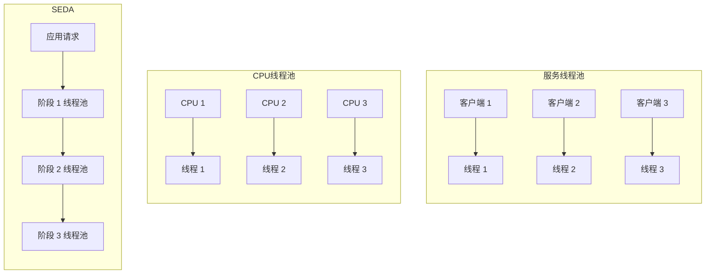
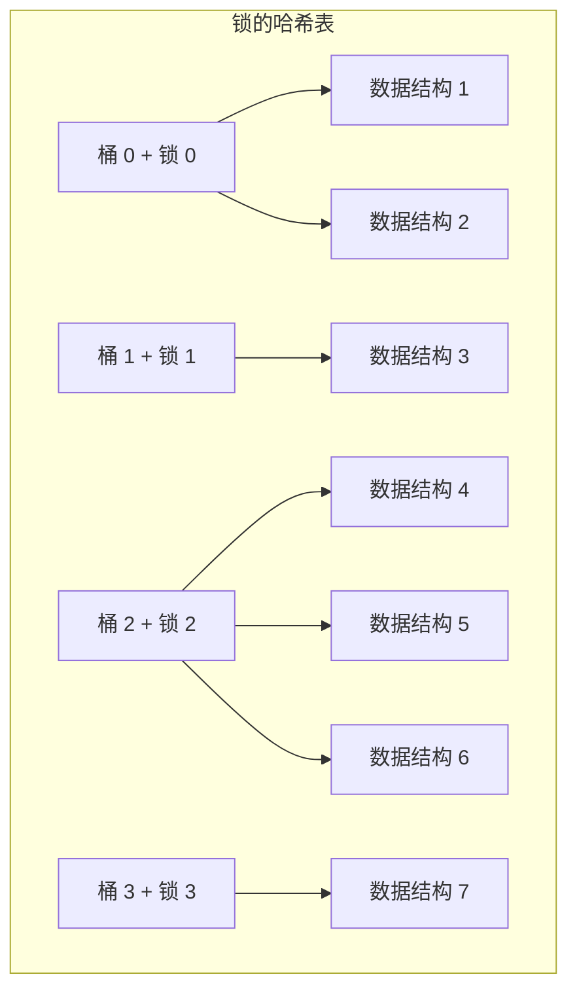
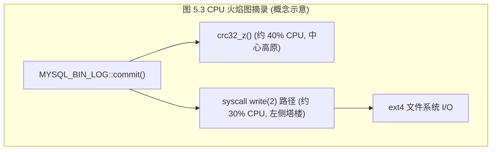
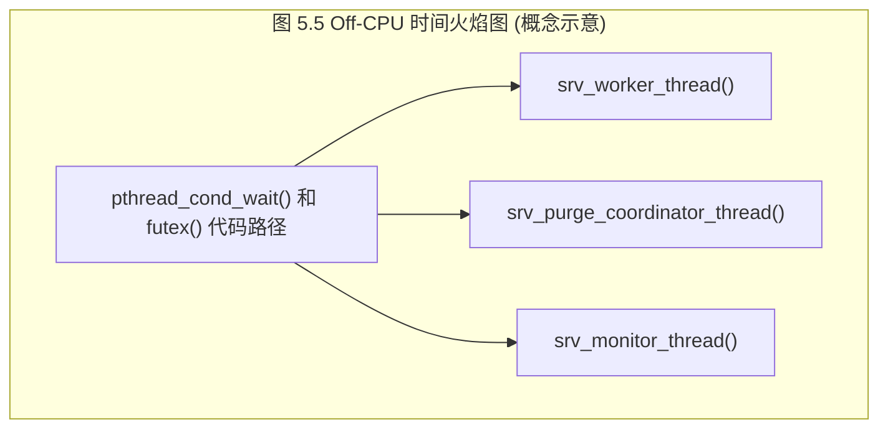

# 第5章 应用程序

性能调优的最佳位置是离工作执行最近的地方：应用程序内部。这些应用程序包括数据库、Web服务器、应用服务器、负载均衡器、文件服务器等等。接下来的章节将从应用程序所消耗的资源角度来探讨它们：CPU、内存、文件系统、磁盘和网络。本章则聚焦于应用层级。

应用程序本身可能变得极其复杂，特别是在涉及许多组件的分布式环境中。对应用程序内部机制的研究通常是应用开发者的领域，并且可能包括使用第三方工具进行内省。对于那些研究系统性能的人来说，应用程序性能分析包括对应用程序进行配置以最佳地利用系统资源、刻画应用程序使用系统的方式特征，以及分析常见的性能病理。

本章的学习目标是：

- 描述性能调优的目标。
- 熟悉提升性能的技术，包括多线程编程、哈希表和非阻塞I/O。
- 理解常见的锁与同步原语。
- 理解不同编程语言带来的挑战。
- 遵循线程状态分析方法论。
- 执行CPU剖析和Off-CPU剖析。
- 执行系统调用分析，包括跟踪进程执行。
- 了解栈跟踪的陷阱：缺失符号和栈帧。

本章讨论应用程序基础、应用程序性能基础、编程语言与编译器、通用应用程序性能分析策略，以及基于系统的应用程序可观测性工具。

---

## 5.1 应用程序基础

在深入探讨应用程序性能之前，您应该熟悉应用程序的角色、基本特征及其在行业中的生态系统。这构成了您理解应用程序活动的上下文。它还为您提供了了解常见性能问题及调优的机会，并为进一步的学习提供了途径。要学习这些上下文，请尝试回答以下问题：

- **功能**：应用程序的角色是什么？它是数据库服务器、Web服务器、负载均衡器、文件服务器、对象存储吗？
- **操作**：应用程序服务于什么请求，或者它执行什么操作？数据库服务于查询（和命令），Web服务器服务于HTTP请求等等。这可以作为一个速率来衡量，以评估负载并进行容量规划。
- **性能需求**：运行该应用程序的公司是否有服务级别目标 ([[SLO|Service Level Objective]]) （例如，99.9%的请求延迟 < 100 毫秒）？
- **CPU模式**：应用程序是作为用户级还是内核级软件实现的？大多数应用程序是用户级的，作为一个或多个进程执行，但有些是作为内核服务实现的（例如，NFS），并且 [[BPF]] 程序也是内核级的。
- **配置**：应用程序是如何配置的，为什么这样配置？这些信息可能在配置文件中或通过管理工具找到。检查是否有任何与性能相关的可调参数已被更改，包括缓冲区大小、缓存大小、并行度（进程或线程）以及其他选项。
- **宿主环境**：什么承载了应用程序？服务器还是云实例？CPU、内存拓扑、存储设备等是什么？它们的限制是什么？
- **指标**：是否提供了应用程序指标，例如操作速率？它们可能由捆绑的工具或第三方工具提供，通过API请求，或通过处理操作日志提供。
- **日志**：应用程序创建了什么操作日志？可以启用什么日志？日志中提供了哪些性能指标（包括延迟）？例如，MySQL支持慢查询日志，为每个慢于特定阈值的查询提供有价值的性能细节。
- **版本**：应用程序是最新版本吗？在最近版本的发行说明中是否有性能修复或改进的记录？
- **缺陷**：应用程序是否有缺陷数据库？您所用版本的应用程序有哪些“性能”缺陷？如果您当前有性能问题，请搜索缺陷数据库以查看以前是否发生过类似问题，是如何调查的，以及还涉及了什么其他内容。
- **源代码**：应用程序是开源的吗？如果是这样，可以研究由剖析器和跟踪器识别出的代码路径，这可能会带来性能提升。您也许能够自己修改应用程序代码以提高性能，并将您的改进提交给上游以包含在官方应用程序中。
- **社区**：应用程序是否有一个分享性能发现的社区？社区可能包括论坛、博客、互联网中继聊天 ([[IRC]]) 频道、其他聊天频道（例如，Slack）、聚会和会议。聚会和会议经常在网上发布幻灯片和视频，这些是多年后仍然有用的资源。他们可能还有一位社区经理，负责分享社区更新和新闻。
- **书籍**：是否有关于该应用程序和/或其性能的书籍？它们是好书吗（例如，由专家撰写、实用/可操作、充分利用读者时间、最新等）？
- **专家**：谁是该应用程序公认的专家？了解他们的名字可以帮助您找到他们撰写的材料。

> [!TIP] 纵观全局
> 无论信息来源如何，您的目标都是要在宏观层面上理解应用程序——它做什么，它如何运作，以及它表现如何。如果您能找到一份说明应用程序内部机制的功能图，那将是一个极其有用的资源。

接下来的部分涵盖其他应用程序基础：设定目标、优化常见情况、可观测性和大O表示法。

### 5.1.1 目标

性能目标为您的性能分析工作提供了方向，并帮助您选择要执行的活动。没有明确的目标，性能分析就有可能变成一次随机的“钓鱼探险”。

对于应用程序性能，您可以从应用程序执行的操作（如前所述）以及性能的目标开始。目标可能是：

- **延迟**：低或一致的应用程序响应时间
- **吞吐量**：高的应用程序操作速率或数据传输速率
- **资源利用率**：给定应用程序工作负载的效率
- **价格**：改善性价比，降低计算成本

> [!NOTE] 量化目标
> 如果这些目标能够使用可能源自业务或服务质量要求的指标进行量化，那就更好了。例如：
> - 应用程序平均请求延迟为 5 毫秒
> - 95% 的请求在 100 毫秒或更短的时间内完成
> - 消除延迟异常值：超过 1,000 毫秒的请求数为零
> - 给定大小的服务器每秒最大吞吐量至少为 10,000 个应用程序请求 ^1
> - 在每秒 10,000 个应用程序请求下，平均磁盘利用率低于 50%

一旦选择了目标，您就可以着手解决该目标的限制因素。对于延迟，限制因素可能是磁盘或网络I/O；对于吞吐量，限制因素可能是CPU使用率。本章及其他章节中的策略将帮助您识别它们。

^1：如果服务器大小是可变的（如云实例）。这用边界资源来表达可能更好：例如，对于受CPU限制的工作负载，每个CPU每秒最多 1,000 个应用程序请求。

对于基于吞吐量的目标，请注意并非所有操作在性能或成本上都是等同的。如果目标是某个操作速率，那么指定它们是什么类型的操作可能也很重要。这可能是基于预期或测量工作负载的分布。

第5.2节“应用程序性能技术”描述了提高应用程序性能的常用方法。其中一些可能对一个目标有意义，但对另一个目标则不然；例如，选择更大的I/O大小可能会提高吞吐量，但代价是增加延迟。在确定哪些主题最适用时，请记住您正在追求的目标。

#### Apdex

一些公司使用目标应用程序性能指数 ([[Apdex|Application Performance Index]]) 作为目标和监控指标。它可以更好地传达客户体验，包括首先将客户事件分类为“满意”、“可容忍”或“沮丧”。然后使用以下公式计算Apdex [Apdex 20]：

$$Apdex = \frac{满意 + 0.5 \times 可容忍 + 0 \times 沮丧}{总事件数}$$

得到的Apdex范围从0（没有满意的客户）到1（所有客户都满意）。

### 5.1.2 优化常见情况

软件内部可能非常复杂，具有许多不同的代码路径和行为。如果您浏览源代码，这一点可能尤为明显：应用程序通常有数万行代码，而操作系统内核则高达数十万行。随机选择优化区域可能会涉及大量工作却收效甚微。

有效提高应用程序性能的一种方法是找到生产工作负载中最常见的代码路径，并从改进该路径开始。如果应用程序是受CPU限制的 ([[CPU-bound]])，那可能意味着频繁在CPU上运行的代码路径。如果应用程序是受I/O限制的 ([[I/O-bound]])，您应该查看频繁导致I/O的代码路径。这些可以通过应用程序的分析和剖析来确定，包括研究栈跟踪和火焰图，这将在后面的章节中介绍。应用程序可观测性工具也可以提供更高级别的上下文来理解常见情况。

### 5.1.3 可观测性

正如我在本书许多章节中反复强调的那样，最大的性能收益可能来自于消除不必要的工作。

当基于性能选择应用程序时，这个事实有时会被忽视。如果基准测试显示应用程序A比应用程序B快10%，可能会诱使您选择应用程序A。然而，如果应用程序A是不透明的，而应用程序B提供了丰富的可观测性工具，从长远来看，应用程序B很可能是更好的选择。那些可观测性工具使得查看和消除不必要的工作成为可能，并更好地理解和调优活跃的工作。通过增强可观测性获得的性能收益可能会使最初10%的性能差异相形见绌。语言和运行时的选择也是如此：例如选择Java或C，它们很成熟并且有许多可观测性工具，对比选择一种新语言。

### 5.1.4 大O表示法

大O表示法 ([[Big O Notation]]) 通常作为计算机科学科目教授，用于分析算法的复杂性，并模拟它们随着输入数据集扩展时的表现。O指的是函数的阶，描述其增长率。这种表示法帮助程序员在开发应用程序时选择更高效和性能更好的算法 [Knuth 76][Knuth 97]。

常见的大O表示法和算法示例如表5.1所列。

**表5.1 大O表示法示例**

| 表示法 | 示例 |
| :--- | :--- |
| O(1) | 布尔测试 |
| O(log n) | 有序数组的二分查找 |
| O(n) | 链表的线性查找 |
| O(n log n) | 快速排序（平均情况） |
| O(n^2) | 冒泡排序（平均情况） |
| O(2^n) | 数字因式分解；指数增长 |
| O(n!) | 旅行商问题的暴力破解 |

这种表示法允许程序员估计不同算法的加速比，从而确定哪些代码区域将带来最大的改进。例如，对于搜索包含100个元素的有序数组，线性查找和二分查找之间的差异是一个21的因子（$100 / \log(100)$）。

这些算法的性能如图5.1所示，展示了它们随规模扩大的趋势。

**图5.1 不同算法的运行时间与输入规模的关系**

```mermaid
quadratic
title 不同大O表示法算法的运行时间与输入规模趋势
x-axis "输入规模" --> "规模增大"
y-axis "运行时间" --> "时间增加"
curve O(1) {0, 0}, {10, 1}
curve O(log n) {0, 0}, {10, 3}
curve O(n) {0, 0}, {10, 8}
curve O(n log n) {0, 0}, {10, 20}
curve O(n^2) {0, 0}, {5, 15}, {10, 80}
```

> [!INFO] 图表说明
> 上述 Mermaid 图表定性地展示了表5.1中不同大O表示法算法随输入规模增加时运行时间的增长趋势。其中 $O(1)$ 保持平缓，$O(n!)$ 和 $O(2^n)$ 增长极快（图表中未完全展示极端情况以保持可读性），$O(n^2)$ 呈二次曲线增长，而 $O(\log n)$ 和 $O(n \log n)$ 则相对平缓得多。

# 5.1 应用程序性能

这种分类有助于系统性能分析师理解，某些算法在规模扩展时表现会非常糟糕。当应用程序被推向服务比以往更多的用户或数据对象时，就可能出现性能问题，此时诸如 O(n^2) 的算法可能开始变得具有破坏性（病态）。修复方法可能是让开发人员使用更高效的算法，或者以不同的方式对总体进行分区。

> [!NOTE] Big O 常数成本
> Big O 表示法确实忽略了每种算法所产生的一些固定计算成本。在 n（输入数据大小）较小的情况下，这些成本可能会占据主导地位。

## 5.2 应用程序性能技术

本节介绍了一些常用于提升应用程序性能的技术：选择 I/O 大小、缓存、缓冲、轮询、并发与并行、非阻塞 I/O 以及处理器绑定。请参考应用程序文档以了解其中使用了哪些技术，以及任何特定于应用程序的附加功能。

### 5.2.1 选择 I/O 大小

与执行 I/O 相关的成本可能包括：初始化缓冲区、发起系统调用、模式或上下文切换、分配内核元数据、检查进程权限和限制、将地址映射到设备、执行内核和驱动程序代码以交付 I/O，以及最后释放元数据和缓冲区。无论 I/O 大小如何，都需要支付这种“初始化税（Initialization tax）”。为了提高效率，每次 I/O 传输的数据越多越好。

增加 I/O 大小是应用程序用来提高吞吐量的常用策略。考虑到任何固定的单次 I/O 成本，将 128 KB 数据作为单次 I/O 传输通常比作为 128 次 1 KB 的 I/O 传输高效得多。特别是旋转磁盘 I/O，由于寻道时间的存在，历史上一直具有较高的单次 I/O 成本。

> [!TIP] 核心原则
> 每次 I/O 传输的数据量越大，越能摊薄固定的初始化开销，从而提升整体 I/O 效率。

然而，当应用程序不需要更大的 I/O 大小时，就会产生负面影响。执行 8 KB 随机读取的数据库如果使用 128 KB 的磁盘 I/O 大小，运行速度可能会变慢，因为 120 KB 的数据传输被浪费了。这会引入 I/O 延迟，通过选择更接近应用程序请求的较小 I/O 大小可以降低这种延迟。不必要的大 I/O 尺寸还会浪费缓存空间。

### 5.2.2 缓存

操作系统使用缓存来提高文件系统读取性能和内存分配性能；应用程序出于类似的原因也经常使用缓存。与其总是执行昂贵的操作，不如将常用操作的结果存储在本地缓存中供将来使用。一个例子是[[数据库缓冲区缓存]]（Database Buffer Cache），它存储来自常用数据库查询的数据。

部署应用程序时的一项常见任务是确定提供了哪些缓存、或可以启用哪些缓存，然后配置其大小以适应系统。

虽然缓存提高了读取性能，但其存储空间通常被用作缓冲区以提高写入性能。

### 5.2.3 缓冲

为了提高写入性能，数据可以在发送到下一层之前合并在缓冲区中。这增加了 I/O 大小和操作效率。根据写入类型的不同，它也可能增加写入延迟，因为第一次写入缓冲区的数据需要等待后续写入后才能被发送。

[[环形缓冲区]]（Ring Buffer，或称循环缓冲区）是一种固定大小的缓冲区，可用于组件之间的连续传输，这些组件异步地对缓冲区进行操作。它可以使用起始和结束指针来实现，每个组件在追加或移除数据时可以移动这些指针。


### 5.2.4 轮询

轮询是一种系统通过在循环中检查事件状态来等待事件发生的技术，在检查之间会有停顿。当几乎没有工作要做时，轮询存在一些潜在的性能问题：

- 反复检查带来的高昂 CPU 开销
- 事件发生与下一次轮询检查之间的高延迟

如果这成为性能问题，应用程序可以改变其行为来监听事件的发生，这会立即通知应用程序并执行所需的例程。

#### poll() 系统调用

有一个 `poll(2)` 系统调用用于检查文件描述符的状态，其功能与轮询类似，但它是基于事件的，因此不会遭受轮询的性能损失。

`poll(2)` 接口支持将多个文件描述符作为数组，这要求应用程序在事件发生时扫描该数组以找到相关的文件描述符。这种扫描是 O(n) 的（参见 5.1.4 节，Big O 表示法），其开销在规模扩展时可能成为性能问题。Linux 上的替代方案是 `epoll(2)`，它可以避免扫描，因此是 O(1) 的。在 BSD 上，等效的是 `kqueue(2)`。

> [!INFO] I/O 多路复用演进
> - `poll()`: O(n) 复杂度，每次事件需全量扫描数组。
> - `epoll()`: O(1) 复杂度，仅返回就绪的文件描述符，更适合高并发。

### 5.2.5 并发与并行

分时系统（包括所有源自 Unix 的系统）提供程序并发：加载并开始执行多个可运行程序的能力。虽然它们的运行时间可能会重叠，但它们不一定在同一时刻在 CPU 上执行。这些程序中的每一个都可以是一个应用程序进程。

为了利用多处理器系统，应用程序必须在多个 CPU 上同时执行。这就是并行，应用程序可以通过使用多个进程（多进程）或多个线程（多线程）来实现，每个进程或线程执行自己的任务。由于第 6 章 CPU、第 6.3.13 节多进程、多线程中解释的原因，多线程（或等效的任务）效率更高，因而是首选方法。

除了提高 CPU 工作的吞吐量外，多线程（或进程）也是一种允许并发执行 I/O 的方式，因为当一个线程在 I/O 上阻塞等待时，其他线程可以继续执行。（另一种方式是异步 I/O。）

使用多进程或多线程架构意味着允许内核通过 CPU 调度器决定运行谁，并伴随着上下文切换的开销。另一种不同的方法是用户模式应用程序实现自己的调度机制和程序模型，以便它可以在同一个 OS 线程中服务不同的应用程序请求（或程序）。机制包括：

- **纤程**：也称为轻量级线程，它们是线程的用户模式版本，其中每个纤程代表一个可调度的程序。应用程序可以使用自己的调度逻辑来选择运行哪个纤程。例如，可以使用纤程来分配处理每个应用程序请求，与使用 OS 线程执行相同操作相比开销更小。例如，Microsoft Windows 支持纤程。^2^
- **协程**：比纤程更轻量，协程是一个可以由用户模式应用程序调度的子例程，提供了一种并发机制。
- **基于事件的并发**：程序被分解为一系列事件处理器，可运行的事件可以从队列中进行规划和执行。例如，可以通过为每个应用程序请求分配元数据来使用它们，这些元数据由事件处理器引用。例如，Node.js 运行时使用单个事件工作线程使用基于事件的并发（这可能成为瓶颈，因为它只能在一个 CPU 上执行）。

> [!WARNING] 纤程的局限性 (Footnote 2)
> 微软官方文档警告了纤程可能带来的问题：例如，线程本地存储在纤程之间是共享的，因此程序员必须切换到纤程本地存储；任何退出线程的例程都会退出该线程上的所有纤程。文档指出：“一般来说，与设计良好的多线程应用程序相比，纤程并没有提供优势” [Microsoft 18]。

> [!NOTE] 内核态 I/O 与线程切换 (Footnote 3)
> 对于所有这些机制，I/O 仍然必须由内核处理，因此 OS 线程切换通常是不可避免的。^3^ 此外，为了实现并行，必须使用多个 OS 线程，以便它们可以跨多个 CPU 进行调度。
> 
> ^3^ 也有一些例外，例如使用 `sendfile(2)` 来避免 I/O 系统调用，以及 Linux 的 `io_uring`，它允许用户空间通过读写 `io_uring` 队列来调度 I/O（这些在 5.2.6 节非阻塞 I/O 中进行了总结）。

某些运行时同时使用协程实现轻量级并发，以及使用多个 OS 线程实现并行。一个例子是 Golang 运行时，它在一组 OS 线程池上使用 goroutine（协程）。为了提高性能，当一个 goroutine 发起阻塞调用时，Golang 的调度器会自动将阻塞线程上的其他 goroutine 移动到其他线程上运行 [Golang 20]。

多线程编程的三种常见模型是：

- **服务线程池**：一组线程服务于网络请求，其中每个线程一次服务一个客户端连接。
- **CPU 线程池**：每个 CPU 创建一个线程。这通常用于长时间运行的批处理，例如视频编码。
- **分阶段事件驱动架构**：应用程序请求被分解为多个阶段，这些阶段可以由一个或多个线程池处理。



# 5.1 应用程序性能

## 5.2 应用程序性能技术

由于多线程编程与进程共享相同的地址空间，线程可以直接读写相同的内存，而无需使用更昂贵的接口（例如多进程编程中使用的[[进程间通信|进程间通信 (IPC)]]）。为了保证数据完整性，会使用[[同步原语]]，以防止数据因多个线程同时读写而损坏。

### 同步原语

同步原语管理对内存的访问以确保完整性，其运作方式类似于调节路口交通的红绿灯。而且，就像红绿灯一样，它们会阻断交通流，导致等待时间（延迟）。应用程序常用的三种类型包括：

- **互斥锁**：只有锁的持有者才能操作。其他线程会阻塞并在[[Off-CPU|Off-CPU]]状态下等待。
- **自旋锁**：自旋锁允许持有者操作，而其他线程则在[[On-CPU|On-CPU]]状态下以紧凑循环自旋，不断检查锁是否被释放。虽然这可以提供低延迟的访问——被阻塞的线程永远不会离开 CPU，并且一旦锁可用，只需几个周期就能准备好运行——但它们在线程自旋等待时也会浪费 CPU 资源。
- **读写锁**：读者/写者锁通过允许多个读者或仅一个写者（且无读者）来确保完整性。
- **信号量**：这是一种变量类型，可以进行计数以允许给定数量的并行操作，或者是二元的以仅允许一个操作（实际上是一个互斥锁）。

> [!INFO] 互斥锁的实现路径
> 互斥锁可能由库或内核实现为自旋锁和互斥锁的混合体：如果持有者当前正在另一个 CPU 上运行，则自旋；如果不在运行（或达到了自旋阈值），则阻塞。它们最初于 2009 年在 Linux 中实现 [Zijlstra 09]，现在根据锁的状态有三条路径（如 `Documentation/locking/mutex-design.rst` [Molnar 20] 中所述）：
> 1. **fastpath（快速路径）**：尝试使用 `cmpxchg` 指令获取锁以设置所有者。仅在锁未被持有时才会成功。
> 2. **midpath（中速路径）**：也称为乐观自旋，当锁持有者也在运行时，在 CPU 上自旋，希望锁很快被释放且无需阻塞即可获取。
> 3. **slowpath（慢速路径）**：阻塞并取消调度该线程，以便稍后在锁可用时被唤醒。

Linux 的[[读-拷贝-更新|读-拷贝-更新 (RCU)]]机制是内核代码中大量使用的另一种同步机制。它允许读操作而无需获取锁，与其他锁类型相比提高了性能。使用 RCU 时，写操作会创建受保护数据的副本并更新该副本，而进行中的读操作仍可访问原始数据。它可以检测何时不再有任何读者（基于各种每 CPU 条件），然后用更新的副本替换原始数据 [Linux 20e]。

调查涉及锁的性能问题可能非常耗时，并且通常需要熟悉应用程序源代码。这通常是开发人员的活动。

### 哈希表

锁的哈希表可用于为大量数据结构采用最佳数量的锁。虽然这里总结了哈希表，但这是一个高级主题，需要具备编程背景。

设想以下两种方法：

- 为所有数据结构设置一个**单一全局互斥锁**。虽然这种解决方案很简单，但并发访问会遇到锁争用以及等待锁的延迟。需要锁的多个线程将串行化——顺序执行，而不是并发执行。
- 为**每个数据结构设置一个互斥锁**。虽然这仅将争用减少到真正需要的时候——即对同一数据结构的并发访问——但锁存在存储开销，并且为每个数据结构创建和销毁锁也存在 CPU 开销。

锁的哈希表是一种介于两者之间的解决方案，适用于预期锁争用较轻的情况。它创建固定数量的锁，并使用哈希算法来选择哪个锁用于哪个数据结构。这避免了随数据结构产生的创建和销毁成本，也避免了只有一个锁的问题。

图 5.2 所示的示例哈希表有四个条目，称为桶，每个桶都包含自己的锁。


*图 5.2 示例哈希表*

> [!NOTE] 图表说明
> 上述 Mermaid 图表展示了图 5.2 的概念：四个哈希桶，每个桶带有独立的锁。当多个数据结构哈希到同一个桶时（如桶 0 和桶 2），会通过链表结构串联起来。

此示例还展示了一种解决哈希冲突的方法，即两个或更多输入数据结构哈希到同一个桶。在这里，创建了一个数据结构链将它们全部存储在同一个桶下，哈希函数将再次找到它们。如果这些哈希链变得太长并被串行遍历，它们可能会成为性能问题，因为它们仅受一个锁保护，该锁可能开始具有较长的保持时间。可以选择哈希函数和表大小，目标是将数据结构均匀分布在多个桶中，以使哈希链长度保持最小。应检查生产工作负载下的哈希链长度，以防哈希算法未按预期工作，而是创建了性能不佳的长哈希链。

理想情况下，哈希表桶的数量应等于或大于 CPU 数量，以实现最大并行度的潜力。哈希算法可以很简单，例如取数据结构地址的低位⁴并以此作为 2 的幂次方大小锁数组的索引。这种简单的算法也很快，允许快速定位数据结构。

⁴ 或者中间位。结构体数组地址的最低位可能有太多冲突。

在内存中具有相邻锁数组的情况下，当锁位于同一[[缓存行|缓存行]]内时，可能会出现性能问题。两个 CPU 更新同一缓存行中的不同锁将遇到缓存一致性开销，每个 CPU 都会使另一个 CPU 缓存中的缓存行失效。这种情况称为[[伪共享|伪共享]]，通常通过用未使用的字节填充锁来解决，以便内存中的每个缓存行中只存在一个锁。

### 5.2.6 非阻塞 I/O

第 3 章“操作系统”中描绘的 Unix 进程生命周期显示了进程在 I/O 期间阻塞并进入睡眠状态。此模型存在几个性能问题：

- 每次 I/O 操作在阻塞时都会消耗一个线程（或进程）。为了支持大量并发 I/O，应用程序必须创建许多线程（通常每个客户端一个），这与线程创建和销毁的成本以及保持它们所需的栈空间相关联。
- 对于频繁的短生命周期 I/O，频繁上下文切换的开销会消耗 CPU 资源并增加应用程序延迟。

[[非阻塞 I/O|非阻塞 I/O]]模型异步发出 I/O，不会阻塞当前线程，当前线程随后可以执行其他工作。这一直是 Node.js [Node.js 20] 的一个关键特性，Node.js 是一个服务器端 JavaScript 应用程序环境，它指导代码以非阻塞方式开发。

有多种执行非阻塞或异步 I/O 的机制，包括：

- `open(2)`：通过 `O_ASYNC` 标志。当文件描述符上可能进行 I/O 时，使用信号通知进程。
- `io_submit(2)`：Linux 异步 I/O (AIO)。
- `sendfile(2)`：这会将数据从一个文件描述符复制到另一个文件描述符，将 I/O 推迟到内核而不是用户级 I/O。⁵
- `io_uring_enter(2)`：Linux `io_uring` 允许使用在用户空间和内核空间之间共享的环形缓冲区提交异步 I/O [Axboe 19]。

> [!TIP] 查阅文档
> 请检查您的操作系统文档以了解其他方法。

⁵ Netflix CDN 使用此方法将视频资产发送给客户，而不会产生用户级 I/O 开销。

### 5.2.7 处理器绑定

对于[[NUMA|NUMA]]环境，进程或线程保持在单个 CPU 上运行，并在执行 I/O 后在与以前相同的 CPU 上运行可能是有利的。这可以提高应用程序的内存局部性，减少内存 I/O 的周期数并提高整体应用程序性能。操作系统对此非常清楚，并被设计为将应用程序线程保持在相同的 CPU 上（[[CPU 亲和性|CPU 亲和性]]）。这些主题在第 7 章“内存”中介绍。

一些应用程序通过将自身绑定到 CPU 来强制执行此行为。这可以显著提高某些系统的性能。当绑定与其他 CPU 绑定（例如设备中断映射到 CPU）冲突时，它也可能降低性能。

> [!WARNING] CPU 绑定的风险
> 当同一系统上运行其他租户或应用程序时，请特别注意 CPU 绑定的风险。这是我在操作系统虚拟化（容器）环境中遇到的一个问题，应用程序可以看到所有 CPU，然后绑定到其中一些，前提是假设它是服务器上唯一的应用程序。当服务器由同样正在绑定的其他租户应用程序共享时，多个租户可能在不知情的情况下绑定到相同的 CPU，导致 CPU 争用和调度器延迟，即使其他 CPU 处于空闲状态。

在应用程序的生命周期内，主机系统也可能发生变化，未更新的绑定可能不仅无益反而损害性能，例如当它们不必要地跨多个插槽绑定到 CPU 时。

### 5.2.8 性能法则

有关提高应用程序性能的更多技术，请参阅第 2 章的性能法则方法论。总结如下：

1. 别做它。
2. 做了，但别再做。
3. 少做它。
4. 晚点做。
5. 趁他们不注意做。
6. 并发做。
7. 更便宜地做。

第一项“别做它”是消除不必要的工作。有关此方法论的更多详细信息，请参阅第 2 章“方法论”，第 2.5.20 节，性能法则。

## 5.3 编程语言

编程语言可以被编译或解释，也可以通过虚拟机执行。许多语言将“性能优化”列为特性，但严格来说，这些通常是执行该语言的软件的特性，而不是语言本身的特性。例如，Java HotSpot 虚拟机软件包含一个即时 ([[JIT|JIT]]) 编译器来动态提高性能。

解释器和语言虚拟机也通过其特定的工具提供不同级别的性能可观测性支持。对于系统性能分析师来说，使用这些工具进行基本剖析可以带来一些快速收益。例如，高 CPU 使用率可能被识别为[[垃圾回收|垃圾回收 (GC)]]的结果，然后通过一些常用的可调参数进行修复。或者它可能是由某个代码路径引起的，该代码路径在错误数据库中被发现是一个已知错误，并通过升级软件版本来修复（这种情况经常发生）。

以下各节描述了每种编程语言类型的基本性能特征。有关个别语言性能的更多信息，请查找有关该语言的文献。

# 5.1 应用程序性能

## 5.3 编程语言

### 5.3.1 编译型语言

编译过程会在运行前获取程序并生成机器指令，这些指令存储在称为二进制文件的可执行文件中。在 Linux 和其他 Unix 衍生系统上，这些文件通常使用可执行与可链接格式；而在 Windows 上，则使用可移植可执行格式。这些二进制文件可以在任何时候运行，而无需重新编译。编译型语言包括 C、C++ 和汇编语言。有些语言可能同时具有解释器和编译器。编译后的代码通常具有高性能，因为它在由 CPU 执行前不需要进一步的转换。编译代码的一个常见例子是 Linux 内核，它主要由 C 语言编写，部分关键路径由汇编语言编写。

编译型语言的性能分析通常很简单，因为执行的机器代码通常与原始程序映射紧密（尽管这取决于编译优化）。在编译期间，可以生成一个符号表，将地址映射到程序函数和对象名。之后对 CPU 执行的剖析和跟踪可以直接映射到这些程序名称，从而允许分析师研究程序执行。栈回溯及其包含的数字地址也可以被映射并翻译为函数名，以提供代码路径的祖先关系。

编译器可以通过使用编译器优化来提高性能——这些例程用于优化 CPU 指令的选择和放置。

#### 编译器优化

`gcc(1)` 编译器提供了七个优化级别：0、1、2、3、s、fast 和 g。数字表示范围，其中 0 使用的优化最少，3 使用的优化最多。还有“s”用于优化大小，“g”用于调试，“fast”用于使用所有优化以及无视标准合规性的额外优化。你可以查询 `gcc(1)` 以显示它在不同级别下使用的优化。例如：

```bash
$ gcc -Q -O3 --help=optimizers
The following options control optimizations:
  -O<number> 
  -Ofast 
  -Og 
  -Os 
  -faggressive-loop-optimizations         [enabled]
  -falign-functions                       [disabled]
  -falign-jumps                           [disabled]
  -falign-label                           [enabled]
  -falign-loops                           [disabled]
  -fassociative-math                      [disabled]
  -fasynchronous-unwind-tables            [enabled]
  -fauto-inc-dec                          [enabled]
  -fbranch-count-reg                      [enabled]
  -fbranch-probabilities                  [disabled]
  -fbranch-target-load-optimize           [disabled]
[...]
  -fomit-frame-pointer                    [enabled]
[...]
```

gcc 7.4.0 版本的完整列表包含大约 230 个选项，其中一些甚至在 `-O0` 级别也被启用。作为这些选项功能的一个例子，此列表中看到的 `-fomit-frame-pointer` 选项在 `gcc(1)` man 手册页中描述如下：

> 不需要帧指针的函数不要在寄存器中保留帧指针。这避免了保存、建立和恢复帧指针的指令；这也使得许多函数中多出了一个可用的寄存器。但这也会使得在某些机器上无法进行调试。

这是一个权衡的例子：省略帧指针通常会破坏那些剖析栈回溯的分析器的操作。

> [!WARNING] 权衡考量
> 鉴于栈剖析器的实用性，此选项可能会在后续性能优化上牺牲很多（这些优化不再容易被发现），这可能会远远超过该选项最初提供的性能提升。在这种情况下，一种解决方案是使用 `-fno-omit-frame-pointer` 进行编译，以避免此优化。^6^ 另一个推荐的选项是 `-g` 以包含调试信息，以辅助后续调试。如果需要，调试信息以后可以被移除或剥离。^7^

如果出现性能问题，可能很容易想当然地以降低的优化级别（例如从 `-O3` 降到 `-O2`）重新编译应用程序，希望能借此满足调试需求。事实证明这并不简单：编译器输出的改变可能是巨大且重要的，并且可能会影响你最初试图分析的问题的行为。

---

### 5.3.2 解释型语言

解释型语言在运行时通过将程序翻译为动作来执行程序，这个过程增加了执行开销。解释型语言预期不会展现高性能，它们用于其他因素更重要的场景，例如编程和调试的便利性。Shell 脚本就是解释型语言的一个例子。

除非提供了可观测性工具，否则解释型语言的性能分析可能会很困难。CPU 剖析可以显示解释器的操作——包括解析、翻译和执行动作——但它可能无法显示原始程序的函数名，使得基本的程序上下文成为一个谜。这种解释器分析可能并非完全徒劳，因为解释器本身可能存在性能问题，即使它正在执行的代码看起来设计得很好。

根据解释器的不同，程序上下文可以作为解释器函数的参数获取，这可以通过动态插桩看到。另一种方法是在了解程序布局的情况下检查进程内存（例如，使用 Linux 的 `process_vm_readv(2)` 系统调用）。

通常，这些程序仅仅是通过添加打印语句和时间戳来研究的。更严格的性能分析并不常见，因为解释型语言通常一开始就不会被选择用于高性能应用程序。

---

### 5.3.3 虚拟机

语言虚拟机（也称为进程虚拟机）是模拟计算机的软件。一些编程语言，包括 Java 和 Erlang，通常使用虚拟机执行，虚拟机为它们提供了平台无关的编程环境。应用程序被编译为虚拟机指令集（[[字节码|字节码]]），然后由虚拟机执行。只要在目标平台上有可运行它们的虚拟机，这就允许了编译对象的可移植性。

字节码可以由语言虚拟机以不同方式执行。Java HotSpot 虚拟机支持通过解释执行，也支持 JIT 编译，即将字节码编译为机器代码以供处理器直接执行。这提供了编译代码的性能优势，以及虚拟机的可移植性。

> [!INFO] 虚拟机的可观测性
> 虚拟机通常是所有语言类型中最难观测的。当程序在 CPU 上执行时，可能已经经过了多个编译或解释阶段，有关原始程序的信息可能不容易获取。性能分析通常侧重于语言虚拟机随附的工具集（其中许多提供 USDT 探针）以及第三方工具。

---

### 5.3.4 垃圾回收

一些语言使用自动内存管理，其中分配的内存不需要显式释放，而是将其留给异步的垃圾回收过程。虽然这使得程序更容易编写，但也可能存在缺点：

- **内存增长**：对应用程序的内存使用控制较少，当对象未被自动识别为符合释放条件时，内存可能会增长。如果应用程序变得太大，它可能会达到其自身限制或遇到系统换页（Linux swapping），严重损害性能。
- **CPU 开销**：GC 通常会间歇性运行，并涉及搜索或扫描内存中的对象。这会消耗 CPU 资源，在短时间内减少应用程序可用的 CPU。随着应用程序内存的增长，GC 的 CPU 消耗也可能增长。在某些情况下，这可能达到 GC 持续消耗整个 CPU 的程度。
- **延迟异常值**：在 GC 执行期间，应用程序的执行可能会被暂停，导致偶尔出现被 GC 中断的高延迟应用程序响应。^8^ 这取决于 GC 的类型：Stop-the-World、增量式或并发式。

> [!TIP] GC 调优
> GC 是性能调优的常见目标，旨在降低 CPU 开销和减少延迟异常值的发生。例如，Java VM 提供了许多可调参数来设置 GC 类型、GC 线程数、最大堆大小、目标堆空闲比率等。

如果调优无效，问题可能在于应用程序产生了太多垃圾，或者引用泄漏。这些是应用程序开发人员需要解决的问题。一种方法是在可能的情况下分配更少的对象，以减少 GC 负载。显示对象分配及其代码路径的可观测性工具可用于寻找潜在的消除目标。

---

## 5.4 方法论

本节描述了应用程序分析和调优的方法论。用于分析的工具要么在此处介绍，要么引用自其他章节。这些方法论总结在表 5.2 中。

**表 5.2 应用程序性能方法论**

| 小节   | 方法论       | 类型               |
| :----- | :----------- | :----------------- |
| 5.4.1  | CPU 剖析     | 观测分析           |
| 5.4.2  | Off-CPU 剖析 | 观测分析           |
| 5.4.3  | 系统调用分析 | 观测分析           |
| 5.4.4  | USE 方法     | 观测分析           |
| 5.4.5  | 线程状态分析 | 观测分析           |
| 5.4.6  | 锁分析       | 观测分析           |
| 5.4.7  | 静态性能调优 | 观测分析，调优     |
| 5.4.8  | 分布式追踪   | 观测分析           |

有关其中一些的介绍，请参见第 2 章，方法论，以及额外的通用方法论：对于应用程序，特别要考虑 CPU 剖析、工作负载特征归纳和下钻分析。另请参阅后续章节以了解系统资源和虚拟化的分析。

这些方法论可以单独遵循，也可以组合使用。我的建议是按表中列出的顺序尝试它们。

除了这些之外，还应针对特定应用程序及其开发所用的编程语言寻找自定义的分析技术。这些技术可能会考虑应用程序的逻辑行为，包括已知问题，并带来一些快速的性能收益。

---

### 5.4.1 CPU 剖析

CPU 剖析是应用程序性能分析的一项基本活动，将在第 6 章 CPU 中从 6.5.4 节剖析开始解释。本节总结 CPU 剖析和 CPU 火焰图，并描述 CPU 剖析如何用于某些 Off-CPU 分析。

Linux 有许多 CPU 剖析器，包括 `perf(1)` 和 `profile(8)`，总结如下：

---

^6^ 根据剖析器的不同，可能还有其他可用的栈遍历解决方案，例如使用调试信息、LBR（Last Branch Record）、BTS（Branch Trace Store）等。对于 `perf(1)` 剖析器，使用不同栈遍历器的方法在第 13 章 perf 第 13.9 节 `perf record` 中描述。
^7^ 如果你确实分发剥离后的二进制文件，请考虑制作调试信息包，以便在需要时可以安装调试信息。
^8^ 在减少 GC 时间或应用程序被 GC 中断方面已经做了大量工作。一个例子是使用系统和应用程序指标来确定何时最适合调用 GC [Schwartz 18]。

# 5.1 应用程序性能

[CONTEXT_OVERLAP]相关上下文已省略[/CONTEXT_OVERLAP]

在第 5.5 节，可观测性工具中进行了总结，这两种工具都使用了定时采样。这些剖析器在内核模式下运行，可以同时捕获内核和用户栈，从而生成混合模式剖析。这为 CPU 使用情况提供了（几乎）完整的可见性。

应用程序和运行时有时会提供它们自己的运行在用户模式下的剖析器，这类剖析器无法显示内核的 CPU 使用情况。这些基于用户的剖析器对 CPU 时间的认知可能会产生偏差，因为它们可能不知道内核何时取消了应用程序的调度，并且不会将其计算在内。我总是从基于内核的剖析器（`perf(1)` 和 `profile(8)`）开始，而将基于用户的剖析器作为最后的选择。

基于采样的剖析器会产生大量样本：在 Netflix 的一个典型 CPU 剖析中，会在（大约）32 个 CPU 上以 49 赫兹的频率收集 30 秒的栈追踪：这总共会产生 47,040 个样本。为了理解这些样本，剖析器通常提供不同的汇总或可视化方式。一种常用于采样栈追踪的可视化方式被称为火焰图，这是我发明的。

## CPU 火焰图

第 1 章展示过一个 CPU 火焰图，图 2.15 则展示了另一个不同的摘录示例。图 5.3 的示例包含了一个 `ext4` 的注释，供后续参考。这些都是混合模式火焰图，同时显示了用户态和内核态栈。

在火焰图中，每个矩形代表栈追踪中的一个栈帧，y 轴显示代码流：自顶向下显示当前函数及其祖先。栈帧的宽度与其在剖析中出现的比例成正比，x 轴的顺序没有实际意义（它是按字母排序的）。你需要寻找那些宽大的“高原”或“塔楼”——那就是 CPU 时间主要消耗的地方。关于火焰图的更多细节，请参见第 6 章，CPU，第 6.7.3 节，火焰图。

在图 5.3 中，`crc32_z()` 是占用 CPU 最多的函数，占据了该摘录约 40% 的时间（中间的高原）。左侧的一座塔楼显示了一个进入内核的 `syscall write(2)` 路径，总共占用了约 30% 的 CPU 时间。通过快速一瞥，我们就确定了这两个可能成为底层优化的目标。浏览代码路径的祖先（向下看）可以揭示高层次的优化目标：在这个例子中，所有的 CPU 使用都来自于 `MYSQL_BIN_LOG::commit()` 函数。

> [!NOTE]
> 我不知道 `crc32_z()` 或 `MYSQL_BIN_LOG::commit()` 是做什么的（尽管我大概能猜到）。CPU 剖析揭示了应用程序的内部工作原理，除非你是应用程序的开发者，否则你不应该被期望知道这些函数是什么。你需要研究它们以制定可操作的性能改进方案。

188 

第 5 章 应用程序

**图 5.3 CPU 火焰图摘录**



举个例子，我对 `MYSQL_BIN_LOG::commit()` 进行了互联网搜索，很快找到了描述 MySQL 二进制日志的文章，这种日志用于数据库恢复和复制，以及如何对其进行调优或完全禁用。快速搜索 `crc32_z()` 发现它是来自 `zlib` 的校验和函数。也许有一个更新、更快的 `zlib` 版本？处理器是否有优化的 CRC 指令，而 `zlib` 是否在使用它？MySQL 到底需不需要计算 CRC，还是可以将其关闭？关于这种思维方式，请参见第 2 章，方法论，第 2.5.20 节，性能箴言。

第 5.5.1 节，`perf`，总结了使用 `perf(1)` 生成 CPU 火焰图的说明。

## Off-CPU 足迹

CPU 剖析能显示的不仅仅是 CPU 使用情况。你可以寻找其他 Off-CPU 问题类型的证据。例如，磁盘 I/O 在一定程度上可以通过其用于文件系统访问和块 I/O 初始化的 CPU 使用情况看出来。这就像发现了熊的脚印：你没有看到熊，但你发现熊存在过。

通过浏览 CPU 火焰图，你可能会发现文件系统 I/O、磁盘 I/O、网络 I/O、锁竞争等证据。图 5.3 以 `ext4` 文件系统 I/O 为例突出了显示。如果你浏览足够多的火焰图，你会熟悉需要寻找的函数名：内核 TCP 函数查找 `“tcp_*”`，内核块 I/O 函数查找 `“blk_*”` 等等。以下是针对 Linux 系统的一些推荐搜索词：

- **“ext4”**（或 “btrfs”、“xfs”、“zfs”）：用于查找文件系统操作。
- **“blk”**：用于查找块 I/O。
- **“tcp”**：用于查找网络 I/O。
- **“utex”**：用于显示锁竞争（“mutex” 或 “futex”）。
- **“alloc”** 或 **“object”**：用于显示执行内存分配的代码路径。

> [!INFO]
> 此方法仅能识别这些活动的**存在**，而不能识别其**规模**。CPU 火焰图显示的是 CPU 使用的规模，而不是阻塞在 Off-CPU 的时间。要直接测量 Off-CPU 时间，你可以使用接下来要讲的 Off-CPU 分析，尽管测量它通常会产生更大的开销。

## 5.4.2 Off-CPU 分析

[[Off-CPU 分析|Off-CPU 分析]]是对当前未在 CPU 上运行的线程的研究：这种状态被称为 Off-CPU。它包括线程阻塞的所有原因：磁盘 I/O、网络 I/O、锁竞争、显式休眠、调度器抢占等。对这些原因及其引起的性能问题的分析通常涉及各种各样的工具。Off-CPU 分析是分析它们所有的一种方法，并且可以由单个 Off-CPU 剖析工具支持。

Off-CPU 剖析可以通过不同的方式执行，包括：

- **采样**：收集处于 Off-CPU 状态的基于定时器的线程样本，或者简单地收集所有线程的样本（称为挂钟时间采样 wallclock sampling）。
- **调度器追踪**：对内核 CPU 调度器进行插桩，以计时线程处于 Off-CPU 状态的持续时间，并使用 Off-CPU 栈追踪记录这些时间。栈追踪在线程处于 Off-CPU 时不会改变（因为它没有运行，所以无法改变它），因此对于每个阻塞事件，栈追踪只需要读取一次。
- **应用程序插桩**：某些应用程序对常见的阻塞代码路径（如磁盘 I/O）内置了插桩。这种插桩可能包含特定于应用程序的上下文。虽然方便且有用，但这种方法通常对 Off-CPU 事件（调度器抢占、页面错误等）是盲目的。

> [!TIP]
> 前两种方法更可取，因为它们适用于所有应用程序，并且可以看到所有的 Off-CPU 事件；然而，它们伴随着巨大的开销。

在 8 个 CPU 的系统上，以 49 赫兹采样应该花费的开销可以忽略不计，但是 Off-CPU 采样必须采样线程池而不是 CPU 池。同样的系统可能有 10,000 个线程，其中大部分是空闲的，因此对它们进行采样会使开销增加 1,000 倍^9（想象一下对一个 10,000 个 CPU 的系统进行 CPU 剖析）。调度器追踪也可能产生显著的开销，因为同一个系统每秒可能有 100,000 个或更多的调度器事件。

^9：可能更高，因为这将需要为处于 Off-CPU 的线程采样栈追踪，而它们的栈不太可能被 CPU 缓存（与 CPU 剖析不同）。将其限制为单个应用程序应该有助于减少线程数量，尽管剖析将是不完整的。

190 

第 5 章 应用程序

现在常用的技术是调度器追踪，基于我自己开发的工具如 `offcputime(8)`（第 5.5.3 节，`offcputime`）。我使用的一项优化是仅记录超过极短持续时间的 Off-CPU 事件，这减少了样本数量。^10 我还使用 BPF 在内核上下文中聚合栈，而不是将所有样本发送到用户空间，从而进一步降低了开销。尽管这些技术有所帮助，但在生产环境中进行 Off-CPU 剖析时仍应小心谨慎，并在使用前在测试环境中评估其开销。

^10：在你质疑“如果这种优化排除了雪崩般的大量微小休眠持续时间怎么办？”之前——你应该会在 CPU 剖析中看到由于如此频繁地调用调度器而产生的证据，从而提示你关闭此优化。

### Off-CPU 时间火焰图

Off-CPU 剖析可以可视化为 Off-CPU 时间火焰图。图 5.4 显示了一个 30 秒的系统级 Off-CPU 剖析，其中我放大显示了处理命令（查询）的 MySQL 服务器线程。

**图 5.4 Off-CPU 时间火焰图，放大显示**


大部分 Off-CPU 时间花费在 `fsync()` 代码路径和 `ext4` 文件系统中。鼠标指针悬停在 `Prepared_statement::execute()` 函数上，以演示底部的信息行显示了该函数的 Off-CPU 时间：总计 3.97 秒。其解释与 CPU 火焰图类似：寻找最宽的塔楼并优先调查它们。

通过同时使用 On-CPU 和 Off-CPU 火焰图，您可以按代码路径获得 On-CPU 和 Off-CPU 时间的完整视图：这是一个强大的工具。我通常将它们显示为单独的火焰图。也可以将它们组合成一个单一的火焰图，我称之为冷热火焰图。但这效果并不好：由于冷热火焰图的大部分显示的是等待时间，CPU 时间被挤压成一个细长的塔楼。这是因为 Off-CPU 线程的数量可能比正在运行的 On-CPU 线程数量高出两个数量级，导致冷热火焰图由 99% 的 Off-CPU 时间组成，（除非经过过滤）这些时间大部分是等待时间。

### 等待时间

除了收集 Off-CPU 剖析的开销之外，另一个问题是解释它们：它们可能被等待时间主导。这是线程等待工作所花费的时间。图 5.5 显示了相同的 Off-CPU 时间火焰图，但没有放大到某个有趣的线程。

**图 5.5 Off-CPU 时间火焰图，完整视图**



现在，此火焰图中的大部分时间都处于类似的 `pthread_cond_wait()` 和 `futex()` 代码路径中：这些是等待工作的线程。可以在火焰图中看到线程函数：从右到左，依次是 `srv_worker_thread()`、`srv_purge_coordinator_thread()`、`srv_monitor_thread()` 等。

192 

第 5 章 应用程序

有几种技术可以用来找到有影响的 Off-CPU 时间：

- **放大（或过滤）应用程序请求处理函数**，因为我们最关心的是在处理应用程序请求期间的 Off-CPU 时间。对于 MySQL 服务器，这就是 `do_command()` 函数。搜索 `do_command()` 然后放大，会产生类似于图 5.4 的火焰图。虽然这种方法有效，但您需要知道在您的特定应用程序中要搜索什么函数。
- **在收集期间使用内核过滤器排除不感兴趣的线程状态**。其有效性取决于内核；在 Linux 上，匹配 `TASK_UNINTERRUPTIBLE` 可以聚焦于许多有趣的 Off-CPU 事件，但也会排除一些事件。

> [!WARNING]
> 您有时会发现应用程序阻塞的代码路径正在等待其他东西，例如锁。要深入分析，您需要知道锁的持有者为什么花了这么长时间才释放它。除了第 5.4.7 节静态性能调优中描述的锁分析之外，一种通用技术是对唤醒者事件进行插桩。这是一项高级活动：请参阅 BPF Performance Tools [Gregg 19] 的第 14 章，以及 BCC 中的工具 `wakeuptime(8)` 和 `offwaketime(8)`。

第 5.5.3 节，`offcputime`，展示了使用 BCC 的 `offcputime(8)` 生成 Off-CPU 火焰图的说明。除了调度器事件外，系统调用事件是研究应用程序的另一个有用目标。

# 5.1 应用程序性能

## 5.4.3 系统调用分析

可以通过对系统调用进行插桩，来研究基于资源的性能问题。其目的是找出系统调用的时间花在了哪里，包括系统调用的类型及其被调用的原因。

系统调用分析的目标包括：

- **新进程追踪**：通过追踪 `execve(2)` 系统调用，你可以记录新进程的执行情况，并分析短生命周期进程的问题。参见 5.5.5 节“execsnoop”中的 `execsnoop(8)` 工具。
- **I/O 性能剖析**：追踪 `read(2)/write(2)/send(2)/recv(2)` 及其变体，并研究它们的 I/O 大小、标志和代码路径，将有助于你识别非最优 I/O 的问题，例如大量的小型 I/O。参见 5.5.7 节“bpftrace”中的 `bpftrace` 工具。
- **内核时间分析**：当系统显示大量的内核 CPU 时间（通常报告为“%sys”）时，对系统调用进行插桩可以定位原因。参见 5.5.6 节“syscount”中的 `syscount(8)` 工具。系统调用解释了大部分但并非全部的内核 CPU 时间；例外情况包括缺页异常、异步内核线程和中断。

系统调用是有完善文档记录的 API（man 手册页），这使它们成为易于研究的事件源。它们也与应用程序同步调用，这意味着从系统调用收集的栈追踪将显示负责的应用程序代码路径。这样的栈追踪可以被可视化为火焰图。

---

## 5.4.4 USE 方法

正如第 2 章“方法论”中所介绍并在后续章节中所应用的那样，USE 方法检查所有硬件资源的使用率、饱和度和错误。通过显示某个资源已成为瓶颈，许多应用程序性能问题可以以此方式解决。

USE 方法也可以应用于软件资源。如果你能找到显示应用程序内部组件的功能图，请考虑每个软件资源的使用率、饱和度和错误指标，看看哪些是有意义的。

例如，应用程序可能使用一个工作线程池来处理请求，并带有一个供请求排队等待的队列。将其视为一种资源，这三个指标可以这样定义：

- **使用率**：在某个时间间隔内，忙于处理请求的平均线程数，占总线程数的百分比。例如，50% 意味着平均有一半的线程在忙于处理请求。
- **饱和度**：在某个时间间隔内请求队列的平均长度。这显示了有多少请求在排队等待工作线程。
- **错误**：因任何原因被拒绝或失败的请求。

你接下来的任务是找出如何测量这些指标。应用程序可能已经在某处提供了这些指标，或者可能需要使用其他工具（如动态追踪）来添加或测量它们。

像这个例子一样的排队系统，也可以使用排队论来研究（见第 2 章“方法论”）。

换一个不同的例子，考虑文件描述符。系统可能会施加限制，使得它们成为一种有限资源。这三个指标可以如下：

- **使用率**：正在使用的文件描述符数量，占限制数量的百分比
- **饱和度**：取决于操作系统行为：如果线程阻塞等待文件描述符，这可以是等待此资源的阻塞线程数
- **错误**：分配错误，例如 `EFILE`，“Too many open files”（打开的文件过多）

针对你应用程序的组件重复此练习，并跳过任何没有意义的指标。这个过程可能会帮助你开发一份简短的检查清单，用于在转向其他方法论之前检查应用程序的健康状况。

---

## 5.4.5 线程状态分析

这是我处理每个性能问题时使用的第一种方法论，但它也是 Linux 上的一项高级活动。目标是在高层次上识别应用程序线程将时间花在了哪里，这能立即解决一些问题，并为其他问题的调查指明方向。你可以通过将每个应用程序的线程时间划分为若干有意义的状态来做到这一点。

至少，存在两种线程状态：[[On-CPU]] 和 [[Off-CPU]]。你可以使用标准指标和工具（例如 `top(1)`）来识别线程是否处于 on-CPU 状态，并根据情况随后进行 CPU 剖析或 Off-CPU 分析（见 5.4.1 节“CPU 剖析”和 5.4.2 节“Off-CPU 分析”）。这种方法论在状态越多时越有效。

### 九状态模型

这是我选定的九种线程状态列表，旨在比之前的两种状态（on-CPU 和 off-CPU）为分析提供更好的起点：

- **User（用户）**：在用户模式下 on-CPU
- **Kernel（内核）**：在内核模式下 on-CPU
- **Runnable（可运行）**：off-CPU 并等待轮流上 CPU
- **Swapping（交换，匿名换页）**：可运行，但因匿名页换入而阻塞
- **Disk I/O（磁盘 I/O）**：等待块设备 I/O：读/写，数据/代码页换入
- **Net I/O（网络 I/O）**：等待网络设备 I/O：套接字读/写
- **Sleeping（休眠）**：自愿休眠
- **Lock（锁）**：等待获取同步锁（等待其他人）
- **Idle（空闲）**：等待工作

这个九状态模型如图 5.6 所示。

> [!INFO] 图 5.6 九状态线程模型
> 以下 Mermaid 图表展示了九状态线程模型的状态流：
> 
> ```mermaid
> flowchart TD
>     Idle[Idle: 等待工作] --> User[User: 用户模式 On-CPU]
>     Idle --> Kernel[Kernel: 内核模式 On-CPU]
>     User --> Runnable[Runnable: 等待上 CPU]
>     Kernel --> Runnable
>     Runnable --> User
>     Runnable --> Kernel
>     Runnable --> Swapping[Swapping: 匿名换页阻塞]
>     Swapping --> Runnable
>     User --> Disk_IO[Disk I/O: 等待块设备]
>     Kernel --> Disk_IO
>     User --> Net_IO[Net I/O: 等待网络设备]
>     Kernel --> Net_IO
>     User --> Sleeping[Sleeping: 自愿休眠]
>     Kernel --> Sleeping
>     User --> Lock[Lock: 等待同步锁]
>     Kernel --> Lock
>     Disk_IO --> Kernel
>     Net_IO --> Kernel
>     Sleeping --> Runnable
>     Lock --> Runnable
> ```

除了 Idle 状态之外，减少在其他每个状态中花费的时间就可以提升应用程序请求的性能。在其他条件相同的情况下，这意味着应用程序请求的延迟更低，并且应用程序可以处理更多的负载。

一旦你确定了线程在哪些状态上花费了时间，你就可以进一步调查它们：

- **User 或 Kernel**：性能剖析可以确定哪些代码路径正在消耗 CPU，包括在锁上自旋花费的时间。见 5.4.1 节“CPU 剖析”。
- **Runnable**：处于此状态的时间意味着应用程序需要更多的 CPU 资源。检查整个系统的 CPU 负载，以及应用程序存在的任何 CPU 限制（例如资源控制）。
- **Swapping（匿名换页）**：应用程序可用主内存不足会导致交换延迟。检查整个系统的内存使用情况以及存在的任何内存限制。详见第 7 章“内存”。
- **Disk**：此状态包括直接磁盘 I/O 和缺页异常。要进行分析，参见 5.4.3 节“系统调用分析”、第 8 章“文件系统”和第 9 章“磁盘”。工作负载特征刻画可以帮助解决许多磁盘 I/O 问题；检查文件名、I/O 大小和 I/O 类型。
- **Network**：此状态是网络 I/O（发送/接收）期间阻塞的时间，而不包括监听新连接（那是空闲时间）。要进行分析，参见 5.4.3 节“系统调用分析”；5.5.7 节“bpftrace”和“I/O 性能剖析”标题；以及第 10 章“网络”。工作负载特征刻画对于网络 I/O 问题也很有用；检查主机名、协议和吞吐量。
- **Sleeping**：分析休眠的原因（代码路径）和持续时间。
- **Lock**：识别锁、持有锁的线程，以及持有者持有它那么长时间的原因。原因可能是持有者被另一个锁阻塞，这需要进一步的回溯。这是一项高级活动，通常由对应用程序及其锁定层次结构有深入了解的软件开发人员执行。我开发了一个 BCC 工具来辅助此类分析：`offwaketime(8)`（包含在 BCC 中），它显示了阻塞栈追踪以及唤醒者。

由于应用程序等待工作的典型方式，你通常会发现网络 I/O 和 Lock 状态中的时间实际上是空闲时间。应用程序工作线程可能通过等待网络 I/O 以获取下一个请求（例如 HTTP keep-alive）或通过等待条件变量（Lock 状态）被唤醒来处理工作，从而实现空闲。

以下总结了在 Linux 上如何测量这些线程状态。

### Linux

图 5.7 显示了基于内核线程状态的 Linux 线程状态模型。

> [!INFO] 图 5.7 Linux 线程状态
> 此图展示了基于内核 `task_struct` 状态成员的 Linux 线程状态模型流转。

内核线程状态基于内核 `task_struct` 状态成员：Runnable 是 `TASK_RUNNING`，Disk 是 `TASK_UNINTERRUPTIBLE`，Sleep 是 `TASK_INTERRUPTIBLE`。这些状态由 `ps(1)` 和 `top(1)` 等工具使用单字母代码显示：分别为 R、D 和 S。（还有更多状态，例如被调试器停止，我在此处未包含。）

虽然这为进一步分析提供了一些线索，但它远没有将时间划分为前面描述的九种状态。需要更多信息：例如，可以使用 `/proc` 或 `getrusage(2)` 统计信息将 Runnable 拆分为用户时间和内核时间。

其他内核通常提供更多状态，使得这种方法论更容易应用。我最初是在 Solaris 内核上开发并使用这种方法论的，灵感来自其微状态记账功能，该功能在八种不同状态中记录线程时间：用户、系统、陷阱、代码缺页、数据缺页、锁、休眠和运行队列（调度器延迟）。这些与我理想的状态并不匹配，但是一个更好的起点。

我将讨论我在 Linux 上使用的三种方法：基于线索法、Off-CPU 分析和直接测量。

#### 基于线索法

你可以从使用常见的操作系统工具开始，例如 `pidstat(1)` 和 `vmstat(8)`，来提示线程状态时间可能花在哪里。相关的工具和列包括：

- **User**：`pidstat(1)` “%usr”（此状态被直接测量）
- **Kernel**：`pidstat(1)` “%system”（此状态被直接测量）
- **Runnable**：`vmstat(8)` “r”（系统级）
- **Swapping**：`vmstat(8)` “si” 和 “so”（系统级）
- **Disk I/O**：`pidstat(1)` -d “iodelay”（包括 Swapping 状态）
- **Network I/O**：`sar(1)` -n DEV “rxkB/s” 和 “txkB/s”（系统级）
- **Sleeping**：不易获取
- **Lock**：`perf(1)` top（可能直接识别自旋锁时间）
- **Idle**：不易获取

其中一些统计信息是系统级的。如果你通过 `vmstat(8)` 发现存在系统级的交换率，你可以使用更深入的工具调查该状态，以确认应用程序是否受到影响。这些工具将在以下小节和章节中介绍。

# 5.1 应用程序性能

## 5.4 方法论

### Off-CPU 分析

由于许多状态都是 Off-CPU 的（除了用户态和内核态之外的所有状态），你可以应用 Off-CPU 分析来确定线程状态。参见第 5.4.2 节，Off-CPU 分析。

### 直接测量

按线程状态精确测量线程时间如下：

- **用户态**：用户态 CPU 可以从多种工具以及 `/proc/PID/stat` 和 `getrusage(2)` 中获取。`pidstat(1)` 将此报告为 `%usr`。
- **内核态**：内核态 CPU 同样位于 `/proc/PID/stat` 和 `getrusage(2)` 中。`pidstat(1)` 将此报告为 `%system`。
- **可运行**：这由内核的 `schedstats` 功能以纳秒为单位进行跟踪，并通过 `/proc/PID/schedstat` 暴露。它也可以通过跟踪工具（包括第 6 章“CPU”中介绍的 `perf(1) sched` 子命令和 BCC 的 `runqlat(8)`）进行测量，但这会带来一些性能开销。
- **交换**：以纳秒为单位的交换时间（匿名页换入换出）可以通过延迟记账来测量，这在第 4 章“可观测性工具”第 4.3.3 节“延迟记账”中介绍过，其中包括一个示例工具：`getdelays.c`。跟踪工具也可用于检测交换延迟。
- **磁盘**：`pidstat(1) -d` 将 “iodelay” 显示为进程因块 I/O 和交换而延迟的时钟滴答数；如果没有系统级的交换发生（如 `vmstat(8)` 所报告），你可以断定任何 iodelay 都是 I/O 状态。延迟记账和其他记账功能（如果启用）也提供块 I/O 时间，`iotop(8)` 就使用了这些时间。你也可以使用来自 BCC 的 `biotop(8)` 等跟踪工具。
- **网络**：可以使用 BCC 和 bpftrace 等跟踪工具来调查网络 I/O，包括用于 TCP 网络 I/O 的 `tcptop(8)` 工具。应用程序本身可能也具有检测 I/O（网络和磁盘）耗时的插桩。
- **休眠**：进入自愿休眠的时间可以使用跟踪器和事件（包括 `syscalls:sys_enter_nanosleep` 跟踪点）来检查。我的 `naptime.bt` 工具可以跟踪这些休眠并打印 PID 和持续时间 [Gregg 19][Gregg 20b]。
- **锁**：锁时间可以使用跟踪工具来调查，包括 BCC 的 `klockstat(8)`，以及来自 bpf-perf-tools-book 代码库中用于 pthread 互斥锁的 `pmlock.bt` 和 `pmheld.bt`，和用于内核互斥锁的 `mlock.bt` 和 `mheld.bt`。
- **空闲**：跟踪工具可用于检测处理等待工作的应用程序代码路径。

> [!WARNING]
> 有时应用程序可能看起来完全处于休眠状态：它们一直阻塞在 Off-CPU 状态，没有 I/O 速率或其他事件。为了确定应用程序线程处于什么状态，可能需要使用诸如 `pstack(1)` 或 `gdb(1)` 等调试器来检查线程堆栈跟踪，或者从 `/proc/PID/stack` 文件中读取它们。请注意，像这样的调试器可能会暂停目标应用程序并导致自身的性能问题：在生产环境中尝试之前，请了解如何使用它们及其风险。

### 5.4.6 锁分析

对于多线程应用程序，锁可能成为瓶颈，从而抑制并行性和可扩展性。单线程应用程序则可能被内核锁（例如，文件系统锁）所阻碍。可以通过以下方式分析锁：

- 检查是否存在竞争
- 检查是否有过长的持有时间

前者用于识别当前是否存在问题。过长的持有时间不一定是眼前的问题，但在未来随着并行负载的增加，它们可能会成为问题。对于这两种情况，尽量识别锁的名称（如果存在）以及导致使用它的代码路径。

虽然有一些专门用于锁分析的工具，但有时你可以仅通过 CPU 剖析来解决问题。对于自旋锁，竞争表现为 CPU 使用率，并且可以通过堆栈跟踪的 CPU 剖析轻松识别。对于自适应互斥锁，竞争通常涉及一些自旋，这也可以通过堆栈跟踪的 CPU 剖析来识别。在这种情况下，请注意 CPU 剖析只反映了部分情况，因为线程在等待锁时可能已经阻塞并休眠。参见第 5.4.1 节，CPU 剖析。

关于 Linux 上特定的锁分析工具，参见第 5.5.7 节，bpftrace。

### 5.4.7 静态性能调优

静态性能调优侧重于已配置环境的问题。对于应用程序性能，请检查静态配置的以下方面：

- 正在运行的应用程序是什么版本，它的依赖项是什么？是否有更新的版本？它们的发布说明是否提到了性能改进？
- 是否存在已知的性能问题？是否有一个列出这些问题的 Bug 数据库？
- 应用程序是如何配置的？
- 如果它的配置或调优与默认值不同，原因是什么？（是基于测量和分析，还是凭猜测？）
- 应用程序是否使用了对象缓存？其大小是如何设定的？
- 应用程序是否并发运行？这是如何配置的（例如，线程池大小）？
- 应用程序是否运行在特殊模式下？（例如，可能启用了调试模式并降低了性能，或者应用程序可能是调试构建而不是发布构建。）
- 应用程序使用什么系统库？它们的版本是什么？
- 应用程序使用什么内存分配器？
- 应用程序是否配置为其堆使用大页面？
- 应用程序是编译型的吗？编译器的版本是什么？使用了什么编译器选项和优化？64 位？
- 本机代码是否包含高级指令？（应该包含吗？）（例如，包括 Intel SSE 在内的 SIMD/向量指令。）
- 应用程序是否遇到过错误，现在是否处于降级模式？或者它是否配置错误并始终运行在降级模式？
- 是否存在系统强加的 CPU、内存、文件系统、磁盘或网络使用限制或资源控制？（这些在云计算中很常见。）

> [!TIP]
> 回答这些问题可能会揭示那些被忽视的配置选择。

### 5.4.8 分布式追踪

在分布式环境中，一个应用程序可能由运行在不同系统上的多个服务组成。虽然可以将每个服务当作自己的微型应用程序来研究，但也有必要将分布式应用程序作为一个整体来研究。这需要新的方法论和工具，通常通过分布式追踪来完成。

分布式追踪涉及在每个服务请求上记录信息，然后再将这些信息组合起来进行研究。然后，跨越多个服务的每个应用程序请求可以分解为其依赖请求，并且可以识别导致高应用程序延迟或错误的服务。

收集的信息可以包括：

- 应用程序请求的唯一标识符（外部请求 ID）
- 关于其在依赖层次结构中位置的信息
- 开始和结束时间
- 错误状态

分布式追踪的一个挑战是生成的日志数据量：每个应用程序请求都有多个条目。一种解决方案是执行头部采样，即在请求的开头（“头部”）决定是否对其进行采样（“追踪”）：例如，每 10000 个请求追踪 1 个。这足以分析大部分请求的性能，但由于数据有限，可能会使间歇性错误或异常值的分析变得困难。一些分布式追踪器是基于尾部的，即首先捕获所有事件，然后再决定保留什么，这可能是基于延迟和错误做出的决定。

一旦识别出有问题的服务，就可以使用其他方法论和工具对其进行更详细的分析。

---

## 5.5 可观测性工具

本节介绍基于 Linux 操作系统的应用程序性能可观测性工具。使用这些工具时应遵循的策略请参见上一节。

本节中的工具列在表 5.3 中，并附有这些工具在本章中如何使用的说明。

**表 5.3 Linux 应用程序可观测性工具**

| 小节 | 工具 | 描述 |
| :--- | :--- | :--- |
| 5.5.1 | `perf` | CPU 剖析，CPU 火焰图，系统调用追踪 |
| 5.5.2 | `profile` | 使用定时采样的 CPU 剖析 |
| 5.5.3 | `offcputime` | 使用调度器追踪的 Off-CPU 剖析 |
| 5.5.4 | `strace` | 系统调用追踪 |
| 5.5.5 | `execsnoop` | 新进程追踪 |
| 5.5.6 | `syscount` | 系统调用计数 |
| 5.5.7 | `bpftrace` | 信号追踪，I/O 剖析，锁分析 |

这些工具从 CPU 剖析工具开始，然后是追踪工具。许多追踪工具是基于 BPF 的，并使用 BCC 和 bpftrace 前端（第 15 章）；它们是：`profile(8)`、`offcputime(8)`、`execsnoop(8)` 和 `syscount(8)`。有关每个工具功能的完整参考，请参见每个工具的文档，包括其 man 手册页。

另外，请留意未在此表中列出的特定于应用程序的性能工具。后面的章节涵盖了面向资源的工具：CPU、内存、磁盘等，它们对应用程序分析也很有用。

以下许多工具会收集应用程序堆栈跟踪。如果你发现堆栈跟踪包含 “[unknown]” 帧或者看起来短得不合常理，请参见第 5.6 节“陷阱”，其中描述了常见问题并总结了解决方法。

### 5.5.1 perf

`perf(1)` 是标准的 Linux 分析器，是一个具有多种用途的多功能工具。它在第 13 章“perf”中进行了解释。由于 CPU 剖析对于应用程序分析至关重要，因此此处包含了使用 `perf(1)` 进行 CPU 剖析的总结。第 6 章“CPU”更详细地介绍了 CPU 剖析和火焰图。

#### CPU 剖析

以下使用 `perf(1)` 在所有 CPU（`-a`）上以 49 赫兹（`-F 49`：每秒采样次数）的频率对堆栈跟踪（`-g`）采样 30 秒，然后列出采样结果：

```bash
# perf record -F 49 -a -g -- sleep 30
[ perf record: Woken up 1 times to write data ]
[ perf record: Captured and wrote 0.560 MB perf.data (2940 samples) ]

# perf script
mysqld 10441 [000] 64918.205722:   10101010 cpu-clock:pppH: 
        5587b59bf2f0 row_mysql_store_col_in_innobase_format+0x270 (/usr/sbin/mysqld)
        5587b59c3951 [unknown] (/usr/sbin/mysqld)
        5587b58803b3 ha_innobase::write_row+0x1d3 (/usr/sbin/mysqld)
        5587b47e10c8 handler::ha_write_row+0x1a8 (/usr/sbin/mysqld)
        5587b49ec13d write_record+0x64d (/usr/sbin/mysqld)
        5587b49ed219 Sql_cmd_insert_values::execute_inner+0x7f9 (/usr/sbin/mysqld)
        5587b45dfd06 Sql_cmd_dml::execute+0x426 (/usr/sbin/mysqld)
        5587b458c3ed mysql_execute_command+0xb0d (/usr/sbin/mysqld)
        5587b4591067 mysql_parse+0x377 (/usr/sbin/mysqld)
        5587b459388d dispatch_command+0x22cd (/usr/sbin/mysqld)
        5587b45943b4 do_command+0x1a4 (/usr/sbin/mysqld)
        5587b46b22c0 [unknown] (/usr/sbin/mysqld)
        5587b5cfff0a [unknown] (/usr/sbin/mysqld)
        7fbdf66a9669 start_thread+0xd9 (/usr/lib/x86_64-linux-gnu/libpthread-2.30.so)
[...]
```

此剖析文件中有 2,940 个堆栈样本；此处仅包含了一个堆栈。`perf(1) script` 子命令打印先前记录的剖析文件（`perf.data` 文件）中的每个堆栈样本。`perf(1)` 还有一个 `report` 子命令，用于将剖析文件总结为代码路径层次结构。剖析文件还可以可视化为 CPU 火焰图。

#### CPU 火焰图

CPU 火焰图已在 Netflix 实现自动化，以便运维人员和开发人员可以从基于浏览器的 UI 中请求它们。它们可以完全使用开源软件构建，包括来自以下命令中 GitHub 代码库的软件。对于前面展示的图 5.3 中的 CPU 火焰图，使用的命令是：

```bash
# perf record -F 49 -a -g -- sleep 10; perf script --header > out.stacks
# git clone https://github.com/brendangregg/FlameGraph; cd FlameGraph
```

# 5.1 应用程序性能

```bash
# ./stackcollapse-perf.pl < ../out.stacks | ./flamegraph.pl --hash > out.svg
```

然后可以在 Web 浏览器中加载 `out.svg` 文件。

`flamegraph.pl` 为不同的编程语言提供了自定义调色板：例如，对于 Java 应用程序，可以尝试使用 `--color=java`。运行 `flamegraph.pl -h` 可以查看所有选项。

## 系统调用追踪

`perf(1)` 的 `trace` 子命令默认追踪系统调用，它是 `perf(1)` 版本的 `strace(1)`（第 5.5.4 节，[[strace]]）。例如，追踪一个 MySQL 服务器进程：

```bash
# perf trace -p $(pgrep mysqld)
         ? (         ): mysqld/10120  ... [continued]: futex())
= -1 ETIMEDOUT (Connection timed out)
     0.014 ( 0.002 ms): mysqld/10120 futex(uaddr: 0x7fbddc37ed48, op: WAKE|
PRIVATE_FLAG, val: 1)           = 0
     0.023 (10.103 ms): mysqld/10120 futex(uaddr: 0x7fbddc37ed98, op: WAIT_BITSET|
PRIVATE_FLAG, utime: 0x7fbdc9cfcbc0, val3: MATCH_ANY) = -1 ETIMEDOUT (Connection 
timed out)
[...]
```

输出中仅包含少数几行，显示了各种 MySQL 线程等待工作时的 `futex(2)` 调用（这些调用在图 5.5 的 Off-CPU 时间火焰图中占据了主导地位）。

`perf(1)` 的优势在于它使用每 CPU 缓冲区来降低开销，这使得它比当前实现的 `strace(1)` 使用起来安全得多。它还可以进行全系统范围的追踪，而 `strace(1)` 仅限于一组进程（通常是单个进程），并且它还能追踪系统调用之外的其他事件。然而，`perf(1)` 没有像 `strace(1)` 那样多的系统调用参数翻译；以下是 `strace(1)` 的单行输出以供比较：

```c
[pid 10120] futex(0x7fbddc37ed98, FUTEX_WAIT_BITSET_PRIVATE, 0, {tv_sec=445110, 
tv_nsec=427289364}, FUTEX_BITSET_MATCH_ANY) = -1 ETIMEDOUT (Connection timed out)
```

`strace(1)` 版本展开了 `utime` 结构体。目前正在进行相关开发，使 `perf(1) trace` 能够使用 BPF 来改进参数的“美化”输出。作为最终目标，`perf(1) trace` 最终可能成为 `strace(1)` 的直接替代品。（有关 `strace(1)` 的更多信息，请参见第 5.5.4 节，[[strace]]。）

## 内核时间分析

由于 `perf(1) trace` 显示了系统调用中的时间，它有助于解释监控工具通常显示的系统 CPU 时间，尽管从摘要开始比逐事件查看输出要容易得多。`perf(1) trace` 使用 `-s` 选项汇总系统调用：

```bash
# perf trace -s -p $(pgrep mysqld)
 mysqld (14169), 225186 events, 99.1%
   syscall            calls    total       min       avg       max      stddev
                               (msec)    (msec)    (msec)    (msec)        (%)
   --------------- -------- --------- --------- --------- ---------     ------
   sendto             27239   267.904     0.002     0.010     0.109      0.28%
   recvfrom           69861   212.213     0.001     0.003     0.069      0.23%
   ppoll              15478   201.183     0.002     0.013     0.412      0.75%
[...]
```

输出显示了每个线程的系统调用计数和时间。

前面显示 `futex(2)` 调用的输出单独看并不十分有趣，并且在任何繁忙的应用程序上运行 `perf(1) trace` 都会产生海量的输出。最好先从这个摘要开始，然后使用带有过滤器的 `perf(1) trace` 仅检查感兴趣的系统调用类型。

## I/O 剖析

I/O 系统调用特别值得关注，在之前的输出中已经看到了一些。使用过滤器 (`-e`) 追踪 `sendto(2)` 调用：

```bash
# perf trace -e sendto -p $(pgrep mysqld) 
     0.000 ( 0.015 ms): mysqld/14097 sendto(fd: 37<socket:[833323]>, buff: 
0x7fbdac072040, len: 12664, flags: DONTWAIT) = 12664
     0.451 ( 0.019 ms): mysqld/14097 sendto(fd: 37<socket:[833323]>, buff: 
0x7fbdac072040, len: 12664, flags: DONTWAIT) = 12664
     0.624 ( 0.011 ms): mysqld/14097 sendto(fd: 37<socket:[833323]>, buff: 
0x7fbdac072040, len: 11, flags: DONTWAIT) = 11
     0.788 ( 0.010 ms): mysqld/14097 sendto(fd: 37<socket:[833323]>, buff: 
0x7fbdac072040, len: 11, flags: DONTWAIT) = 11
[...]
```

输出显示了两次 12664 字节的发送，随后是两次 11 字节的发送，全部带有 `DONTWAIT` 标志。如果我看到大量小字节的发送，我可能会思考是否可以通过合并它们或避免使用 `DONTWAIT` 标志来提高性能。

> [!TIP] 自定义 I/O 追踪
> 虽然 `perf(1) trace` 可用于某些 I/O 剖析，但我通常希望进一步深入研究参数并以自定义方式对其进行汇总。例如，此 `sendto(2)` 追踪显示了文件描述符 (37) 和套接字号 (833323)，但我更希望看到套接字类型、IP 地址和端口。对于此类自定义追踪，您可以切换到第 5.5.7 节中的 [[bpftrace]]。

---

## 5.5.2 profile

`profile(8)`^11 是来自 BCC（第 15 章）的基于定时器的 CPU 剖析器。它使用 BPF 通过在内核上下文中聚合栈跟踪来降低开销，并且仅将唯一的栈及其计数传递给用户空间。

以下 `profile(8)` 示例在所有 CPU 上以 49 赫兹的频率采样，持续 10 秒：

```bash
# profile -F 49 10
Sampling at 49 Hertz of all threads by user + kernel stack for 10 secs.
[...]
    SELECT_LEX::prepare(THD*)
    Sql_cmd_select::prepare_inner(THD*)
    Sql_cmd_dml::prepare(THD*)
    Sql_cmd_dml::execute(THD*)
    mysql_execute_command(THD*, bool)
    Prepared_statement::execute(String*, bool)
    Prepared_statement::execute_loop(String*, bool)
    mysqld_stmt_execute(THD*, Prepared_statement*, bool, unsigned long, PS_PARAM*)
    dispatch_command(THD*, COM_DATA const*, enum_server_command)
    do_command(THD*)
    [unknown]
    [unknown]
    start_thread
    -                mysqld (10106)
        13
[...]
```

此输出中仅包含一个栈跟踪，显示 `SELECT_LEX::prepare()` 在 CPU 上被采样了 13 次（具有该调用祖先链）。

`profile(8)` 在第 6 章“CPU”的第 6.6.14 节“profile”中有进一步讨论，其中列出了它的各种选项，并包含了从其输出生成 CPU 火焰图的说明。

> [!INFO] 脚注 11
> 来源：我于 2016 年 7 月 15 日为 BCC 开发了 `profile(8)`，其基于 Sasha Goldshtein、Andrew Birchall、Evgeny Vereshchagin 和 Teng Qin 的代码。

---

## 5.5.3 offcputime

`offcputime(8)`^12 是一个 BCC 和 bpftrace 工具（第 15 章），用于汇总线程阻塞和离开 CPU 所花费的时间，并显示栈跟踪以解释原因。它支持 Off-CPU 分析（第 5.4.2 节，Off-CPU 分析）。`offcputime(8)` 是 `profile(8)` 的对应工具：它们结合起来，可以显示线程在系统上花费的全部时间。

以下显示了来自 BCC 的 `offcputime(8)`，追踪 5 秒钟：

```bash
# offcputime 5
Tracing off-CPU time (us) of all threads by user + kernel stack for 5 secs.
[...]
    finish_task_switch
    schedule
    jbd2_log_wait_commit
    jbd2_complete_transaction
    ext4_sync_file
    vfs_fsync_range
    do_fsync
    __x64_sys_fdatasync
    do_syscall_64
    entry_SYSCALL_64_after_hwframe
    fdatasync
    IO_CACHE_ostream::sync()
    MYSQL_BIN_LOG::sync_binlog_file(bool)
    MYSQL_BIN_LOG::ordered_commit(THD*, bool, bool)
    MYSQL_BIN_LOG::commit(THD*, bool)
    ha_commit_trans(THD*, bool, bool)
    trans_commit(THD*, bool)
    mysql_execute_command(THD*, bool)
    Prepared_statement::execute(String*, bool)
    Prepared_statement::execute_loop(String*, bool)
    mysqld_stmt_execute(THD*, Prepared_statement*, bool, unsigned long, PS_PARAM*)
    dispatch_command(THD*, COM_DATA const*, enum_server_command)
    do_command(THD*)
    [unknown]
    [unknown]
    start_thread
    -                mysqld (10441)
        352107
[...]
```

输出显示了唯一的栈跟踪及其在离开 CPU 所花费的时间（以微秒为单位）。这个特定的栈显示了通过 `MYSQL_BIN_LOG::sync_binlog_file()` 的代码路径执行的 ext4 文件系统同步操作，在此追踪期间总计耗时 352 毫秒。

为了提高效率，`offcputime(8)` 在内核上下文中聚合这些栈，并且仅向用户空间发送唯一的栈。它也只记录离开 CPU 持续时间超过阈值的栈跟踪，默认为一微秒，可以使用 `-m` 选项进行调整。

还有一个 `-M` 选项用于设置记录栈的最大时间。我们为什么要排除长持续时间的栈？这可以成为过滤掉无趣栈的有效方法：那些等待工作并在循环中阻塞一秒或更长时间的线程。尝试使用 `-M 900000`，以排除长于 900 毫秒的持续时间。

> [!INFO] 脚注 12
> 来源：我在 2005 年创建了 Off-CPU 分析作为一项方法论，并开发了执行该分析的工具；我于 2016 年 1 月 13 日开发了这个 `offcputime(8)` BCC 工具。

### Off-CPU 时间火焰图

尽管仅显示唯一的栈，前一个示例的完整输出仍然超过 20 万行。为了理解它，可以将其可视化为 Off-CPU 时间火焰图。图 5.4 显示了一个示例。生成这些图的命令与使用 `profile(8)` 的命令类似：

```bash
# git clone https://github.com/brendangregg/FlameGraph; cd FlameGraph
# offcputime -f 5 | ./flamegraph.pl --bgcolors=blue \
    --title="Off-CPU Time Flame Graph"> out.svg
```

这次我将背景色设置为蓝色，作为一种视觉提醒，表明这是一个 Off-CPU 火焰图，而不是常用的 CPU 火焰图。

---

## 5.5.4 strace

`strace(1)` 命令是 Linux 系统调用追踪器。^13 它可以追踪系统调用，为每个调用打印单行摘要，还可以计算系统调用并打印报告。

> [!INFO] 脚注 13
> 其他操作系统的系统调用追踪器包括：BSD 有 `ktrace(1)`，Solaris 有 `truss(1)`，OS X 有 `dtruss(1)`（我最初开发的一个工具），Windows 有许多选项，包括 `logger.exe` 和 `ProcMon`。

例如，通过 PID 1884 追踪系统调用：

```bash
$ strace -ttt -T -p 1884
1356982510.395542 close(3)              = 0 <0.000267>
1356982510.396064 close(4)              = 0 <0.000293>
1356982510.396617 ioctl(255, TIOCGPGRP, [1975]) = 0 <0.000019>
1356982510.396980 rt_sigprocmask(SIG_SETMASK, [], NULL, 8) = 0 <0.000024>
1356982510.397288 rt_sigprocmask(SIG_BLOCK, [CHLD], [], 8) = 0 <0.000014>
1356982510.397365 wait4(-1, [{WIFEXITED(s) && WEXITSTATUS(s) == 0}], WSTOPPED|
WCONTINUED, NULL) = 1975 <0.018187>
[...]
```

此调用中的选项如下（有关所有选项，请参见 `strace(1)` 手册页）：

- **`-ttt`**：打印第一列的自 Unix 纪元以来的时间，单位为秒，微秒分辨率。
- **`-T`**：打印最后一个字段（`<time>`），即系统调用的持续时间，单位为秒，微秒分辨率。
- **`-p PID`**：追踪此进程 ID。也可以指定一个命令，以便 `strace(1)` 启动并追踪它。

此处未使用的其他选项包括 `-f`（用于跟随子线程）和 `-o filename`（用于将 `strace(1)` 输出写入给定文件名）。

从输出中可以看出 `strace(1)` 的一个特性——将系统调用参数翻译为人类可读的形式。这对于理解 `ioctl(2)` 调用特别有用。

`-c` 选项可用于汇总系统调用活动。以下示例还调用并追踪了一个命令（`dd(1)`），而不是附加到某个 PID：

```bash
$ strace -c dd if=/dev/zero of=/dev/null bs=1k count=5000k
5120000+0 records in
5120000+0 records out
5242880000 bytes (5.2 GB) copied, 140.722 s, 37.3 MB/s
% time     seconds  usecs/call     calls    errors syscall
------ ----------- ----------- --------- --------- ----------------
 51.46    0.008030           0   5120005           read
 48.54    0.007574           0   5120003           write
  0.00    0.000000           0        20        13 open
[...]
------ ----------- ----------- --------- --------- ----------------
100.00    0.015604              10240092        19 total
```

输出开始的三行来自 `dd(1)`，随后是 `strace(1)` 的摘要。各列的含义是：

- **time**：显示系统 CPU 时间花费在哪里的百分比
- **seconds**：总系统 CPU 时间，以秒为单位
- **usecs/call**：每次调用的平均系统 CPU 时间，以微秒为单位
- **calls**：系统调用的次数

# 5.1 应用程序性能

■syscall: 系统调用名称 

### strace 开销

> [!WARNING] strace(1) 的性能开销
> 当前版本的 strace(1) 采用基于断点的追踪方式，通过 Linux 的 ptrace(2) 接口实现。这会为所有系统调用的进入和返回设置断点（即使使用了 `-e` 选项仅选择部分调用）。这种方式具有侵入性，系统调用频率较高的应用程序可能会发现其性能下降了一个数量级。

为了说明这一点，以下是没有使用 strace(1) 时运行相同 dd(1) 命令的输出：

```bash
$ dd if=/dev/zero of=/dev/null bs=1k count=5000k
5120000+0 records in
5120000+0 records out
5242880000 bytes (5.2 GB) copied, 1.91247 s, 2.7 GB/s
```

dd(1) 在最后一行包含了吞吐量统计信息：通过比较它们，我们可以得出结论，strace(1) 将 dd(1) 的速度降低了 73 倍。这是一个特别严重的案例，因为 dd(1) 执行了高频率的系统调用。

根据应用程序的需求，这种追踪方式可以在短时间内部署使用，以确定被调用的系统调用类型，这可能是可以接受的。如果开销不是这么严重的话，strace(1) 的用途会更大。其他追踪器，包括 perf(1)、Ftrace、BCC 和 bpftrace，通过使用缓冲追踪大大降低了追踪开销，在这种方式下，事件被写入共享的内核环形缓冲区，用户级追踪器定期读取该缓冲区。这减少了用户态与内核态之间的上下文切换，从而降低了开销。

strace(1) 的未来版本可能会通过成为 perf(1) trace 子命令的别名来解决其开销问题（前面在第 5.5.1 节 perf 中已描述）。其他基于 BPF 的高性能 Linux 系统调用追踪器包括：Intel 的 vltrace [Intel 18]，以及 Microsoft 的 Windows ProcMon 工具的 Linux 版本 [Microsoft 20]。

---

### 5.5.5 execsnoop

execsnoop(8)^14 是一个 BCC 和 bpftrace 工具，用于追踪系统范围内的新进程执行。它可以发现消耗 CPU 资源的短生命周期进程的问题，也可用于调试软件执行情况，包括应用程序启动脚本。

> [!NOTE] 起源
> 14 起源：我于 2004 年 3 月 24 日创建了第一个 execsnoop；于 2016 年 2 月 7 日开发了 Linux BCC 版本，并于 2017 年 11 月 15 日开发了 bpftrace 版本。有关更多起源细节，请参见 [Gregg 19]。

BCC 版本的示例输出：

```bash
# execsnoop
PCOMM            PID    PPID   RET ARGS
oltp_read_write  13044  18184    0 /usr/share/sysbench/oltp_read_write.lua --db-driver=mysql --mysql-password=... --table-size=100000 run
oltp_read_write  13047  18184    0 /usr/share/sysbench/oltp_read_write.lua --db-driver=mysql --mysql-password=... --table-size=100000 run
sh               13050  13049    0 /bin/sh -c command -v debian-sa1 > /dev/null && debian-sa1 1 1 -S XALL
debian-sa1       13051  13050    0 /usr/lib/sysstat/debian-sa1 1 1 -S XALL
sa1              13051  13050    0 /usr/lib/sysstat/sa1 1 1 -S XALL
sadc             13051  13050    0 /usr/lib/sysstat/sadc -F -L -S DISK 1 1 -S XALL /var/log/sysstat
[...]
```

我在我的数据库系统上运行了这个命令，想看看是否能发现什么有趣的事情，确实发现了：前两行显示一个读/写微基准测试仍在运行，在循环中启动 `oltp_read_write` 命令——我意外地让这个程序运行了好几天！由于数据库正在处理不同的工作负载，从显示 CPU 和磁盘负载的其他系统指标中并不容易看出这一点。`oltp_read_write` 之后的行显示 sar(1) 正在收集系统指标。

execsnoop(8) 的工作原理是追踪 execve(2) 系统调用，并为每次调用打印一行摘要。该工具支持一些选项，包括 `-t` 用于显示时间戳。

第 1 章展示了 execsnoop(8) 的另一个示例。我还发布了一个用于 bpftrace 的 threadsnoop(8) 工具，用于追踪通过 libpthread 的 `pthread_create()` 创建线程的过程。

---

### 5.5.6 syscount

syscount(8)^15 是一个 BCC 和 bpftrace 工具，用于统计系统范围内的系统调用次数。

> [!NOTE] 起源
> 15 起源：我于 2014 年 7 月 7 日首次使用 Ftrace 和 perf(1) 为 perf-tools 集合创建了这个工具，Sasha Goldshtein 于 2017 年 2 月 15 日开发了 BCC 版本。

BCC 版本的示例输出：

```bash
# syscount
Tracing syscalls, printing top 10... Ctrl+C to quit.
^C[05:01:28]
SYSCALL                   COUNT
recvfrom                 114746
sendto                    57395
ppoll                     28654
futex                       953
io_getevents                 55
bpf                          33
rt_sigprocmask               12
epoll_wait                   11
select                        7
nanosleep                     6
Detaching...
```

这显示最频繁的系统调用是 recvfrom(2)，在追踪期间被调用了 114,746 次。你可以使用其他追踪工具进一步探索，以检查系统调用参数、延迟和调用栈轨迹。例如，你可以使用带有 `-e recvfrom` 过滤器的 perf(1) trace，或者使用 bpftrace 插桩 `syscalls:sys_enter_recvfrom` 追踪点。请参见第 13 章至第 15 章中的追踪器。

syscount(8) 还可以使用 `-P` 按进程进行统计：

```bash
# syscount -P
Tracing syscalls, printing top 10... Ctrl+C to quit.
^C[05:03:49]
PID    COMM               COUNT
10106  mysqld            155463
13202  oltp_read_only.    61779
9618   sshd                  36
344    multipathd            13
13204  syscount-bpfcc        12
519    accounts-daemon        5
```

输出显示了进程及其系统调用计数。

---

### 5.5.7 bpftrace

bpftrace 是一个基于 [[BPF]] 的追踪器，它提供了一种高级编程语言，允许创建强大的单行命令和简短脚本。它非常适合基于其他工具提供的线索进行自定义应用程序分析。

bpftrace 将在第 15 章中详细解释。本节展示一些用于应用程序分析的示例。

#### 信号追踪

以下 bpftrace 单行命令追踪进程信号（通过 kill(2) 系统调用），显示源 PID 和进程名称，以及目标 PID 和信号编号：

```bash
# bpftrace -e 't:syscalls:sys_enter_kill { time("%H:%M:%S ");
    printf("%s (PID %d) send a SIG %d to PID %d\n",
    comm, pid, args->sig, args->pid); }'
Attaching 1 probe...
09:07:59 bash (PID 9723) send a SIG 2 to PID 9723
09:08:00 systemd-journal (PID 214) send a SIG 0 to PID 501
09:08:00 systemd-journal (PID 214) send a SIG 0 to PID 550
09:08:00 systemd-journal (PID 214) send a SIG 0 to PID 392
...
```

输出显示一个 bash shell 向自身发送了信号 2（Ctrl-C），随后 systemd-journal 向其他 PID 发送了信号 0。信号 0 不执行任何操作：它通常用于根据系统调用返回值检查另一个进程是否仍然存在。

这个单行命令对于调试奇怪的应用程序问题（例如提前终止）非常有用。包含时间戳是为了与监控软件中的性能问题进行交叉核对。追踪信号也可以作为 BCC 和 bpftrace 中的独立工具 killsnoop(8) 使用。

#### I/O 剖析

bpftrace 可以通过多种方式分析 [[I/O]]：检查大小、延迟、返回值和栈轨迹。^16 例如，在前面的示例中 recvfrom(2) 系统调用被频繁调用，可以使用 bpftrace 进一步检查。

以直方图形式显示 recvfrom(2) 缓冲区大小：

```bash
# bpftrace -e 't:syscalls:sys_enter_recvfrom { @bytes = hist(args->size); }'
Attaching 1 probe...
^C
@bytes: 
[4, 8)             40142 |@@@@@@@@@@@@@@@@@@@@@@@@@@@@@@@@@@@@@@@@@@@@@@@@@@@@|
[8, 16)             1218 |@                                                   |
[16, 32)           17042 |@@@@@@@@@@@@@@@@@@@@@@                              |
[32, 64)               0 |                                                    |
[64, 128)              0 |                                                    |
[128, 256)             0 |                                                    |
[256, 512)             0 |                                                    |
[512, 1K)              0 |                                                    |
[1K, 2K)               0 |                                                    |
[2K, 4K)               0 |                                                    |
[4K, 8K)               0 |                                                    |
[8K, 16K)              0 |                                                    |
[16K, 32K)         19477 |@@@@@@@@@@@@@@@@@@@@@@@@@                           |
```

输出显示大约一半的大小非常小，介于 4 到 7 字节之间，而最大的大小处于 16 到 32 KB 范围内。通过追踪系统调用退出追踪点将此缓冲区大小直方图与实际接收到的字节数进行比较，可能也是有用的：

> [!NOTE] 
> 16 例如，来自 [Gregg 19] 的 ioprofile(8)，尽管在实践中，由于 glibc 默认缺少帧指针，这通常无法捕获完整的栈；请参见第 5.3.1 节编译型语言。

```bash
# bpftrace -e 't:syscalls:sys_exit_recvfrom { @bytes = hist(args->ret); }'
```

巨大的不匹配可能表明应用程序分配了比它需要更大的缓冲区。（请注意，这个退出追踪点的单行命令会将系统调用错误作为大小 -1 包含在直方图中。）

如果接收的大小也显示出既有小的 I/O 又有大的 I/O，这也可能影响系统调用的延迟，较大的 I/O 耗时更长。要测量 recvfrom(2) 的延迟，可以同时追踪系统调用的开始和结束，如以下 bpftrace 程序所示。语法在第 15 章 BPF 第 15.2.4 节编程中解释，该节以内核函数的类似延迟直方图结尾。

```bash
# bpftrace -e 't:syscalls:sys_enter_recvfrom { @ts[tid] = nsecs; }
    t:syscalls:sys_exit_recvfrom /@ts[tid]/ {
    @usecs = hist((nsecs - @ts[tid]) / 1000); delete(@ts[tid]); }'
Attaching 2 probes...
^C
@usecs: 
[0]                23280 |@@@@@@@@@@@@@@@@@@@@@@@@@@@@@                       |
[1]                40468 |@@@@@@@@@@@@@@@@@@@@@@@@@@@@@@@@@@@@@@@@@@@@@@@@@@@@|
[2, 4)               144 |                                                    |
[4, 8)             31612 |@@@@@@@@@@@@@@@@@@@@@@@@@@@@@@@@@@@@@@@@            |
[8, 16)               98 |                                                    |
[16, 32)              98 |                                                    |
[32, 64)           20297 |@@@@@@@@@@@@@@@@@@@@@@@@@@                          |
[64, 128)           5365 |@@@@@@                                              |
[128, 256)          5871 |@@@@@@@                                             |
[256, 512)           384 |                                                    |
[512, 1K)             16 |                                                    |
[1K, 2K)              14 |                                                    |
[2K, 4K)               8 |                                                    |
[4K, 8K)               0 |                                                    |
[8K, 16K)              1 |                                                    |
```

输出显示 recvfrom(2) 通常少于 8 微秒，而在 32 到 256 微秒之间存在一个较慢的模式。存在一些延迟异常值，最慢的达到了 8 到 16 毫秒的范围。

您可以继续进一步深入下钻。例如，输出映射声明（`@usecs = ...`）可以更改为：

- ■ **@usecs[args->ret]**：按系统调用返回值进行细分，为每个返回值显示一个直方图。由于返回值是接收到的字节数（或错误时为 -1），此细分将确认较大的 I/O 大小是否导致了较高的延迟。
- ■ **@usecs[ustack]**：按用户态栈轨迹进行细分，为每个代码路径显示一个延迟直方图。

我还会考虑在第一个追踪点之后添加一个过滤器，以便它仅显示 [[MySQL]] 服务器，而不显示其他进程：

# 5.1 应用程序性能

## 锁追踪 (Lock Tracing)

[[bpftrace]] 可用于通过多种方式调查应用程序的锁竞争。对于典型的 pthread 互斥锁，可以使用 uprobes 来追踪 pthread 库函数：`pthread_mutex_lock()` 等；也可以使用 tracepoints 来追踪管理锁阻塞的 `futex(2)` 系统调用。

我之前开发了 `pmlock(8)` 和 `pmheld(8)` bpftrace 工具，用于检测 pthread 库函数，并已将其作为开源发布 [Gregg 20b]（另见 [Gregg 19] 的第 13 章）。例如，追踪 `pthread_mutex_lock()` 函数的持续时间：

```bash
# pmlock.bt $(pgrep mysqld)
Attaching 4 probes...
Tracing libpthread mutex lock latency, Ctrl-C to end.
^C
[...]
@lock_latency_ns[0x7f37280019f0, 
    pthread_mutex_lock+36
    THD::set_query(st_mysql_const_lex_string const&)+94
    Prepared_statement::execute(String*, bool)+336
    Prepared_statement::execute_loop(String*, bool, unsigned char*, unsigned char*...
    mysqld_stmt_execute(THD*, unsigned long, unsigned long, unsigned char*, unsign...
, mysqld]: 
[1K, 2K)              47 |                                                    |
[2K, 4K)             945 |@@@@@@@@                                            |
[4K, 8K)            3290 |@@@@@@@@@@@@@@@@@@@@@@@@@@@@@@                      |
[8K, 16K)           5702 |@@@@@@@@@@@@@@@@@@@@@@@@@@@@@@@@@@@@@@@@@@@@@@@@@@@@|
```

此输出已被截断，仅显示了打印出的众多堆栈中的一个。该堆栈显示锁地址 `0x7f37280019f0` 是通过 `THD::set_query()` 代码路径获取的，且获取时间通常在 8 到 16 微秒范围内。

为什么这把锁会花费这么长时间？`pmheld.bt` 通过追踪从加锁到解锁的持续时间，显示了持有者的堆栈跟踪：

```bash
# pmheld.bt $(pgrep mysqld)
Attaching 5 probes...
Tracing libpthread mutex held times, Ctrl-C to end.
^C
[...]
@held_time_ns[0x7f37280019f0, 
    __pthread_mutex_unlock+0
    THD::set_query(st_mysql_const_lex_string const&)+147
    dispatch_command(THD*, COM_DATA const*, enum_server_command)+1045
    do_command(THD*)+544
    handle_connection+680
, mysqld]: 
[2K, 4K)            3848 |@@@@@@@@@@@@@@@@@@@@@@@@@@@@@@@@@@@@@@@             |
[4K, 8K)            5038 |@@@@@@@@@@@@@@@@@@@@@@@@@@@@@@@@@@@@@@@@@@@@@@@@@@@@|
[8K, 16K)              0 |                                                    |
[16K, 32K)             0 |                                                    |
[32K, 64K)             1 |                                                    |
```

这显示了持有者的一个不同代码路径。

如果锁具有符号名称，则会打印该名称而不是地址。如果没有符号名称，您可以通过堆栈跟踪来识别锁：这是位于指令偏移量 147 处的 `THD::set_query()` 中的一个锁。该函数的源代码显示它只获取了一把锁：`LOCK_thd_query`。

> [!WARNING] 追踪开销
> 追踪锁确实会增加开销，并且锁事件可能非常频繁。请参阅第 4 章“可观测性工具”第 4.3.7 节 uprobes 中的 uprobes 开销详情。可以开发基于内核 futex 函数 kprobes 的类似工具，这能在某种程度上降低开销。另一种开销可忽略不计的方法是改用 CPU 剖析。CPU 剖析的开销通常很小，因为它受限于采样率，而严重的锁竞争会消耗足够的 CPU 周期，从而在 CPU 剖析中显现出来。

## 应用程序内部机制 (Application Internals)

如果需要，您可以开发自定义工具来汇总应用程序内部机制。首先检查 [[USDT]] 探针是否可用，或者是否可以使其可用（通常通过使用编译选项重新编译）。如果这些探针不可用或不够用，请考虑使用 uprobes。有关 bpftrace、uprobes 和 USDT 的示例，请参见第 4 章“可观测性工具”的第 4.3.7 节 uprobes 和第 4.3.8 节 USDT。第 4.3.8 节还描述了动态 USDT，这对于深入了解 JIT 编译的软件可能是必要的，因为 uprobes 可能无法对其進行检测。

一个复杂的例子是 Java：uprobes 可以检测 JVM 运行时（C++ 代码）和操作系统库，USDT 可以检测高级 JVM 事件，而动态 USDT 可以放置在 Java 代码中，为方法执行提供洞察力。

---

## 5.6 陷阱

以下各节描述了应用程序性能分析中的常见问题，特别是缺失符号和堆栈跟踪。您可能会在检查 CPU 剖析（例如火焰图）时首次遇到这些问题，并发现其中缺少函数名和堆栈跟踪。

> [!INFO] 进阶主题
> 这些问题属于高级主题，我在《BPF Performance Tools》的第 2、12 和 18 章中进行了更详细的介绍，并在此处进行总结。

### 5.6.1 缺失符号

当剖析器或跟踪器无法将应用程序指令地址解析为其函数名（符号）时，它可能会将其打印为十六进制数字或字符串“`[unknown]`”。解决此问题的方法取决于应用程序的编译器、运行时和调优，以及剖析器本身。

#### ELF 二进制文件 (C, C++, ...)

编译后的二进制文件中可能缺少符号，特别是那些被打包和分发的二进制文件，因为它们已经使用 `strip(1)` 处理过以减小文件大小。一种解决方法是调整构建过程以避免剥离符号；另一种方法是使用不同的符号信息来源，例如 [[debuginfo]] 或 [[BTF]] (BPF Type Format)。通过 `perf(1)`、BCC 和 bpftrace 进行的 Linux 剖析支持 debuginfo 符号。

#### JIT 运行时

对于即时（[[JIT]]）编译器运行时（如 Java 和 Node.js），经常会发生缺失符号的情况。在这些情况下，JIT 编译器拥有自己的在运行时不断变化的符号表，并且该符号表不是二进制文件中预编译符号表的一部分。常见的解决方法是使用由运行时生成的补充符号表，这些符号表放置在 `/tmp/perf-<PID>.map` 文件中，供 `perf(1)` 和 BCC 读取。

例如，Netflix 使用 `perf-map-agent` [Rudolph 18]，它可以附加到实时 Java 进程并转储补充符号文件。我已经用另一个名为 `jmaps` [Gregg 20c] 的工具自动化了它的使用，该工具应在剖析后立即运行，并在符号转换之前运行。例如，使用 `perf(1)`（第 13 章）：

```bash
# perf record -F 49 -a -g -- sleep 10; jmaps
# perf script --header > out.stacks
# [...]
```

以及使用 bpftrace（第 15 章）：

```bash
# bpftrace --unsafe -e 'profile:hz:49 { @[ustack] = count(); }
    interval:s:10 { exit(); } END { system("jmaps"); }'
```

符号映射可能会在剖析采样和符号表转储之间发生变化，从而在剖析中产生无效的函数名称。这被称为**符号流失**，在 `perf record` 之后立即运行 `jmaps` 可以减少这种情况。到目前为止，这还不是一个严重的问题；如果是的话，可以在剖析前后分别进行符号转储以查找变化。

还有其他方法可以解析 JIT 符号。一种是使用符号时间戳日志，`perf(1)` 支持此功能并解决了符号流失问题，尽管在启用时会带来较高的开销。另一种方法是让 `perf(1)` 调用运行时自己的栈遍历器（通常用于异常堆栈）。这种方法有时被称为使用**栈助手**，对于 Java，这已由 `async-profiler` [Pangin 20] 实现。

> [!NOTE] 
> 请注意，JIT 运行时也包含预编译组件：JVM 也使用 `libjvm` 和 `libc`。有关处理这些组件的方法，请参见前面的 ELF 二进制文件部分。

### 5.6.2 缺失栈

另一个常见问题是缺失或不完整的堆栈跟踪，可能短至一两个帧。例如，来自 MySQL 服务器的 Off-CPU 剖析：

```text
    finish_task_switch
    schedule
    futex_wait_queue_me
    futex_wait
    do_futex
    __x64_sys_futex
    do_syscall_64
    entry_SYSCALL_64_after_hwframe
    pthread_cond_timedwait@@GLIBC_2.3.2
    [unknown]
```

这个堆栈是不完整的：在 `pthread_cond_timedwait()` 之后只有一个“`[unknown]`”帧。它缺少该点之下的 MySQL 函数，而正是那些 MySQL 函数是我们真正理解应用程序上下文所需要的。

有时堆栈只有单一帧：

```text
    send
```

在火焰图中，这可能表现为“草地”：剖析图底部有许多细长的单一帧。

> [!WARNING] 不完整堆栈跟踪的成因
> 不完整的堆栈跟踪不幸非常普遍，通常由两个因素的共同作用引起：
> 1. 可观测性工具使用基于帧指针的方法来读取堆栈跟踪。
> 2. 目标二进制文件没有为帧指针保留寄存器（x86_64 上的 RBP），而是作为编译器性能优化将其重新用作通用寄存器。
> 
> 可观测性工具读取此寄存器时期望它是一个帧指针，但实际上它现在可能包含任何内容：数字、对象地址、指向字符串的指针等。可观测性工具尝试在符号表中解析此数字，如果幸运的话，它找不到匹配项并可以打印“`[unknown]`”。如果不幸，那个随机数解析为一个不相关的符号，现在打印出的堆栈跟踪就包含了一个错误的函数名，从而混淆了您——最终用户。

由于 libc 库通常在没有帧指针的情况下编译，因此任何经过 libc 的路径中都会出现断层的堆栈，包括前面的两个示例：`pthread_cond_timedwait()` 和 `send()`。^17

最简单的解决方案通常是修复帧指针寄存器：

- **对于 C/C++ 软件，以及使用 `gcc(1)` 或 LLVM 编译的其他软件**：使用 `-fno-omit-frame-pointer` 重新编译软件。
- **对于 Java**：使用 `-XX:+PreserveFramePointer` 运行 `java(1)`。

> [!TIP] 性能成本权衡
> 这可能会带来性能成本，但通常测得的成本不到 1%；能够使用堆栈跟踪来发现性能优势的好处通常远远超过这一成本。

另一种方法是切换到不基于帧指针的栈遍历技术。`perf(1)` 支持基于 [[DWARF]] 的栈遍历、[[ORC]] 和最后分支记录（[[LBR]]）。第 13 章 perf 第 13.9 节 perf record 中提到了其他栈遍历方法。

在撰写本文时，基于 DWARF 和 LBR 的栈遍历尚不能从 BPF 中使用，并且 ORC 尚未可用于用户级软件。

---

## 5.7 练习

1. 回答以下有关术语的问题：
   - 什么是[[缓存]]？
   - 什么是[[环形缓冲区]]？
   - 什么是[[自旋锁]]？
   - 什么是[[自适应互斥锁]]？
   - [[并发]]和[[并行]]有什么区别？
   - 什么是[[CPU 亲和性]]？

2. 回答以下概念性问题：
   - 使用较大 I/O 尺寸的一般优缺点是什么？
   - 锁的哈希表用于什么？
   - 描述编译型语言、解释型语言以及使用虚拟机的语言运行时的一般性能特征。
   - 解释[[垃圾回收]]的作用以及它如何影响性能。

3. 选择一个应用程序，并回答关于它的以下基本问题：
   - 该应用程序的作用是什么？
   - 该应用程序执行哪些离散操作？
   - 该应用程序是在用户模式还是内核模式下运行？
   - 该应用程序是如何配置的？在性能方面有哪些关键选项可用？
   - 应用程序提供了哪些性能指标？
   - 应用程序创建了哪些日志？它们是否包含性能信息？
   - 最新版本的应用程序是否修复了性能问题？
   - 该应用程序是否有已知的性能 Bug？
   - 该应用程序是否有社区（例如 IRC、聚会）？是否有性能社区？
   - 是否有关于该应用程序的书籍？性能方面的书籍？
   - 该应用程序是否有知名的性能专家？他们是谁？

---
^17 我已向包维护者发送了构建说明，要求打包一个带有帧指针的 libc。

# 5.1 应用程序性能

4. 选择一个处于负载状态的应用程序，并执行以下任务（其中许多可能需要使用动态追踪）：

- 在进行任何测量之前，您预期该应用程序是受 CPU 限制（CPU-bound）还是受 I/O 限制（I/O-bound）？请解释您的推理。
- 使用可观测性工具确定它是受 CPU 限制还是受 I/O 限制。
- 为该应用程序生成一份 [[CPU 火焰图]]（CPU flame graph）。您可能需要修复符号和栈追踪才能使其正常工作。最热的 CPU 代码路径是什么？
- 为该应用程序生成一份 [[Off-CPU 火焰图]]（off-CPU flame graph）。在该应用程序的请求期间，最长的阻塞事件是什么（忽略空闲栈）？
- 表征其执行的 I/O 大小（例如，文件系统读/写，网络发送/接收）。
- 该应用程序是否有缓存？确定其大小和命中率。
- 测量该应用程序所服务的操作的延迟（响应时间）。展示平均值、最小值、最大值和完整分布。
- 对该操作执行下钻分析（drill-down analysis），调查大部分延迟的来源。
- 表征施加于该应用程序的工作负载（特别是谁在施加以及施加了什么）。
- 逐步完成静态性能调优检查清单。
- 该应用程序是否并发运行？调查其对同步原语（synchronization primitives）的使用情况。

5. （可选，进阶）为 Linux 开发一个名为 `tsastat(8)` 的工具，该工具打印多线程状态分析（Thread State Analysis）状态的列，并显示在每个状态中花费的时间。它的行为可以类似于 `pidstat(1)` 并产生滚动输出。^18

---

## 5.8 参考文献

[Knuth 76] Knuth, D., “Big Omicron and Big Omega and Big Theta,” ACM SIGACT News, 1976.

[Knuth 97] Knuth, D., The Art of Computer Programming, Volume 1: Fundamental Algorithms, 3rd Edition, Addison-Wesley, 1997.

[Zijlstra 09] Zijlstra, P., “mutex: implement adaptive spinning,” http://lwn.net/Articles/314512, 2009.

[Gregg 17a] Gregg, B., “EuroBSDcon: System Performance Analysis Methodologies,” EuroBSDcon, http://www.brendangregg.com/blog/2017-10-28/bsd-performance-analysis-methodologies.html, 2017.

[Intel 18] “Tool tracing syscalls in a fast way using eBPF linux kernel feature,” https://github.com/pmem/vltrace, last updated 2018.

[Microsoft 18] “Fibers,” Windows Dev Center, https://docs.microsoft.com/en-us/windows/win32/procthread/fibers, 2018.

[Rudolph 18] Rudolph, J., “perf-map-agent,” https://github.com/jvm-profiling-tools/perf-map-agent, last updated 2018.

[Schwartz 18] Schwartz, E., “Dynamic Optimizations for SBCL Garbage Collection,” 11th European Lisp Symposium, https://european-lisp-symposium.org/static/proceedings/2018.pdf, 2018.

[Axboe 19] Axboe, J., “Efficient IO with io_uring,” https://kernel.dk/io_uring.pdf, 2019.

[Gregg 19] Gregg, B., BPF Performance Tools: Linux System and Application Observability, Addison-Wesley, 2019.

[Apdex 20] Apdex Alliance, “Apdex,” https://www.apdex.org, accessed 2020.

[Golang 20] “Why goroutines instead of threads?” Golang documentation, https://golang.org/doc/faq#goroutines, accessed 2020.

[Gregg 20b] Gregg, B., “BPF Performance Tools,” https://github.com/brendangregg/bpf-perf-tools-book, last updated 2020.

[Gregg 20c] Gregg, B., “jmaps,” https://github.com/brendangregg/FlameGraph/blob/master/jmaps, last updated 2020.

[Linux 20e] “RCU Concepts,” Linux documentation, https://www.kernel.org/doc/html/latest/RCU/rcu.html, accessed 2020.

[Microsoft 20] “Procmon Is a Linux Reimagining of the Classic Procmon Tool from the Sysinternals Suite of Tools for Windows,” https://github.com/microsoft/ProcMon-for-Linux, last updated 2020.

[Molnar 20] Molnar, I., and Bueso, D., “Generic Mutex Subsystem,” Linux documentation, https://www.kernel.org/doc/Documentation/locking/mutex-design.rst, accessed 2020.

[Node.js 20] “Node.js,” http://nodejs.org, accessed 2020.

[Pangin 20] Pangin, A., “async-profiler,” https://github.com/jvm-profiling-tools/async-profiler, last updated 2020.

---

> [!NOTE] 脚注 18
> ^18 趣闻：自第一版以来，我不知道是否有人解决了这个问题。我曾为 OSCON 提议了一个关于线程状态分析（TSA）的演讲，并计划为该演讲开发一个 Linux TSA 工具；然而，我的演讲被拒绝了（我的错：我的摘要写得很糟糕），而且我至今尚未开发该工具。EuroBSDcon 邀请我做主题演讲，我涵盖了 TSA 的内容，并且确实为它开发了一个工具：`tstates.d`，用于 FreeBSD [Gregg 17a]。

> [!INFO] 图像上下文参考
> - **[Image 1564 on Page 214]**：与章节上下文相关的图像（例如，性能分析图表或工具输出）。
> - **[Image 1582 on Page 219]**：与章节上下文相关的图像。
> - **[Image 1610 on Page 227]**：与章节上下文相关的图像。
> - **[Image 1616 on Page 229]**：与章节上下文相关的图像。
> - **[Image 1619 on Page 230]**：与章节上下文相关的图像。
> - **[Image 1630 on Page 233]**：与章节上下文相关的图像。
> - **[Image 1635 on Page 235]**：与章节上下文相关的图像。