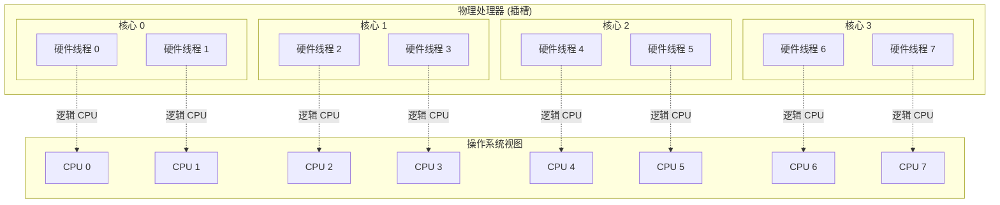
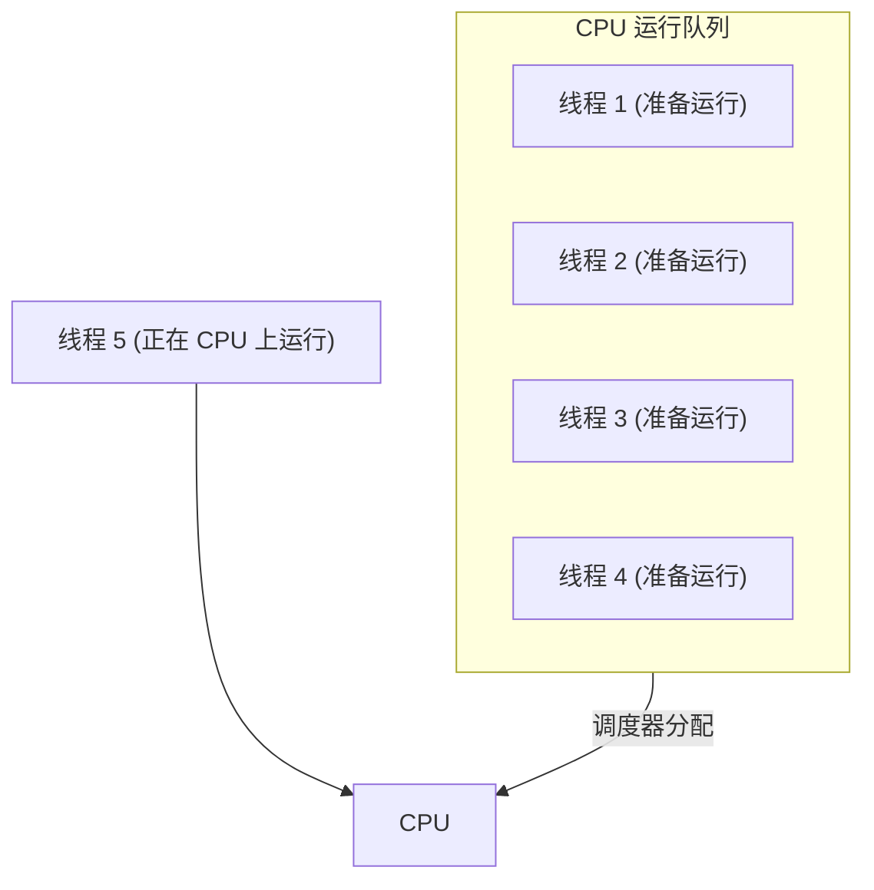
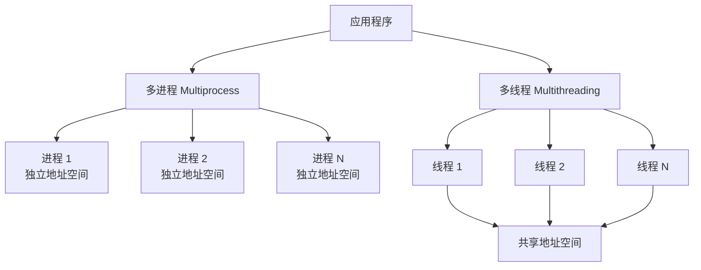
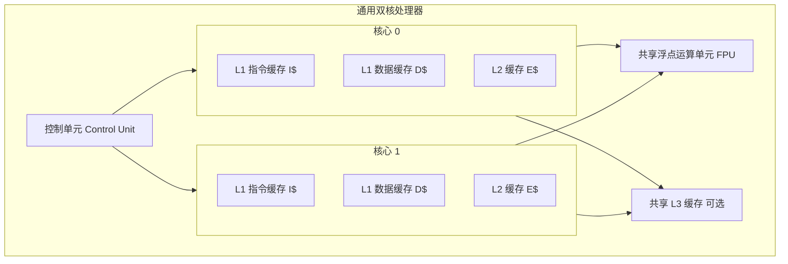
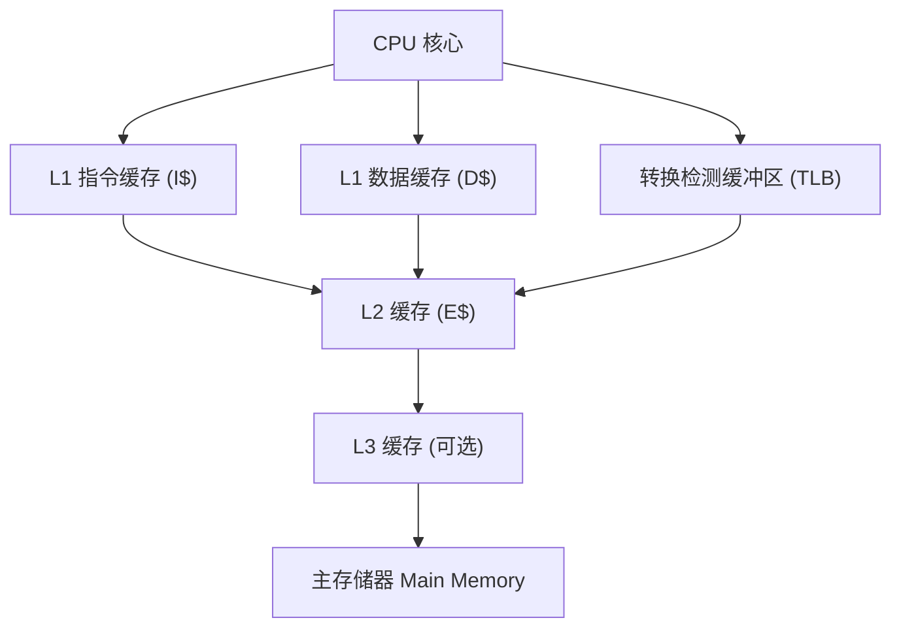
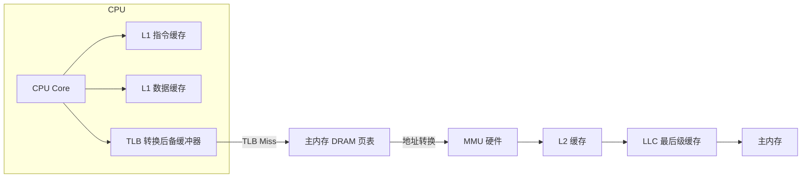
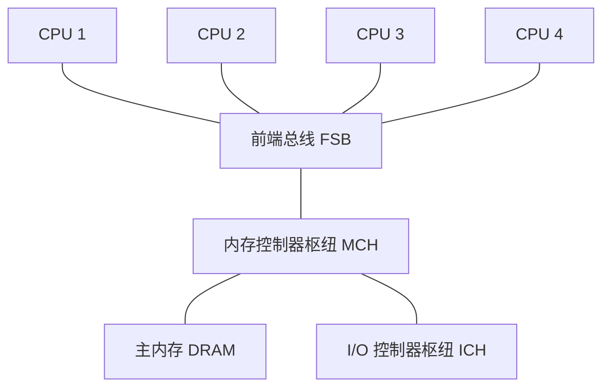
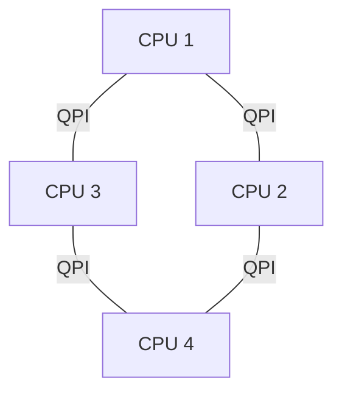
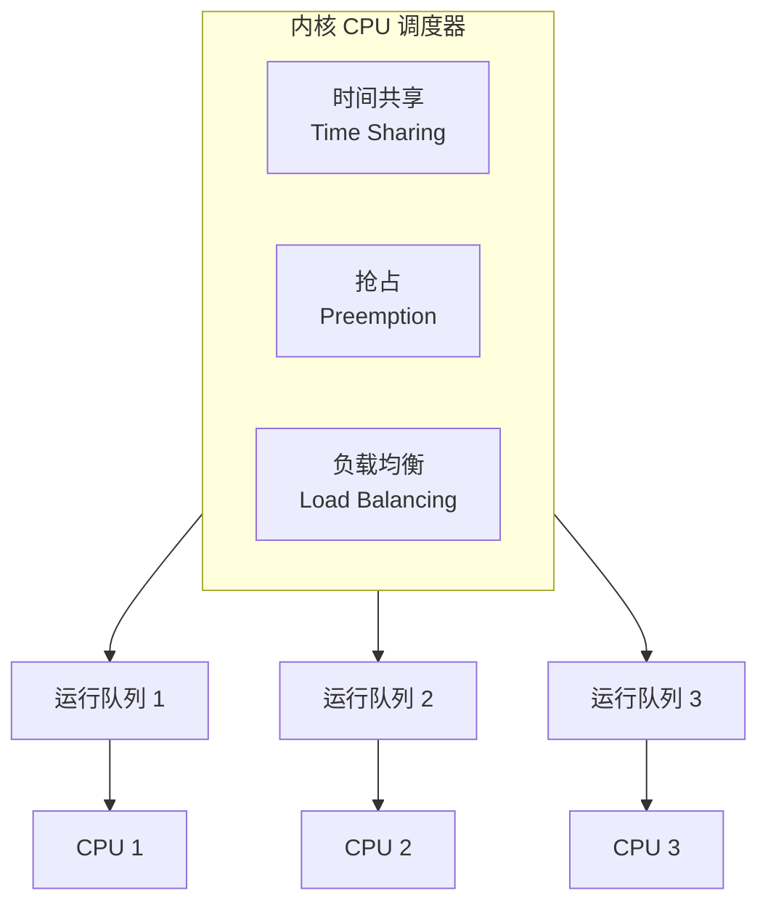
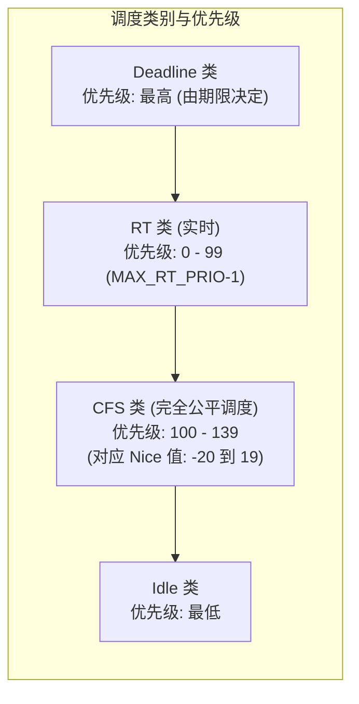

# 6.1 CPU：模型、概念与架构

CPUs 驱动着所有软件，并且通常是系统性能分析的第一个目标。本章将解释 CPU 的硬件和软件，并展示如何详细检查 CPU 使用情况以寻找性能提升的空间。

从宏观层面看，可以监控整个系统范围的 CPU 利用率，并检查进程或线程的使用情况。从微观层面看，可以对应用程序和内核中的代码路径进行分析和研究，以及中断导致的 CPU 使用情况。在最底层，可以分析 CPU 指令执行和周期行为。还可以研究其他行为，包括任务在 CPU 上排队等待时的调度器延迟，这会降低性能。

本章的学习目标如下：

- 理解 CPU 模型与概念。
- 熟悉 CPU 硬件内部结构。
- 熟悉 CPU 调度器内部结构。
- 遵循不同的 CPU 分析方法论。
- 解释[[Load Averages|负载均值]]与 [[PSI|PSI (Pressure Stall Information)]]。
- 表征系统范围和单个 CPU 的利用率。
- 识别并量化调度器延迟问题。
- 执行 CPU 周期分析以识别低效之处。
- 使用性能分析工具和 [[CPU Flame Graphs|CPU 火焰图]]调查 CPU 使用情况。
- 识别软中断和硬中断的 CPU 消耗者。
- 解释 CPU 火焰图和其他 CPU 可视化图表。
- 了解 CPU 可调参数。

本章分为六个部分。前三个部分提供了 CPU 分析的基础，后三个部分展示了其在基于 Linux 系统上的实际应用。这些部分分别是：

- **背景**：介绍与 CPU 相关的术语、CPU 的基本模型以及关键的 CPU 性能概念。
- **架构**：介绍处理器和内核调度器架构。
- **方法论**：描述性能分析方法论，包括观察性和实验性方法论。
- **可观测性工具**：描述基于 Linux 系统上的 CPU 性能分析工具，包括性能剖析、追踪和可视化。
- **实验**：总结 CPU 基准测试工具。
- **调优**：包括可调参数的示例。

内存 I/O 对 CPU 性能的影响也将被涵盖，包括在内存上停顿的 CPU 周期和 CPU 缓存的性能。第 7 章“内存”将继续讨论内存 I/O，包括 MMU、NUMA/UMA、系统互连和内存总线。

## 6.1 术语

作为参考，本章使用的与 CPU 相关的术语包括以下内容：

- **处理器**：插入系统或处理器板上的插槽中的物理芯片，包含一个或多个作为核心或硬件线程实现的 CPU。
- **核心**：多核处理器上的一个独立 CPU 实例。使用核心是处理器扩展的一种方式，称为芯片级多处理。
- **硬件线程**：一种支持在单个核心上并行执行多个线程（包括英特尔的超线程技术）的 CPU 架构，其中每个线程都是一个独立的 CPU 实例。这种扩展方法称为[[SMT|同步多线程]]。
- **CPU 指令**：来自其指令集的单个 CPU 操作。有用于算术运算、内存 I/O 和控制逻辑的指令。
- **逻辑 CPU**：也称为虚拟处理器，^1^ 一个操作系统的 CPU 实例（一个可调度的 CPU 实体）。这可以由处理器作为硬件线程实现（在这种情况下它也可以被称为虚拟核心）、一个核心或一个单核处理器实现。
- **调度器**：将线程分配到 CPU 上运行的内核子系统。
- **运行队列**：等待 CPU 服务的可运行线程队列。现代内核可能使用其他数据结构（例如红黑树）来存储可运行线程，但我们仍然经常使用运行队列这个术语。

本章还会介绍其他术语。词汇表包含了基本术语以供参考，包括 CPU、CPU 周期和栈。另请参阅第 2 章和第 3 章中的术语部分。

> [!NOTE] 脚注 1
> 它有时也被称为虚拟 CPU；然而，该术语更常用于指代由虚拟化技术提供的虚拟 CPU 实例。参见第 11 章“云计算”。

## 6.2 模型

以下简单模型说明了 CPU 和 CPU 性能的一些基本原理。第 6.4 节“架构”将更深入地挖掘，并包含特定于实现的细节。

### 6.2.1 CPU 架构

图 6.1 展示了一个 CPU 架构示例，这是一个拥有四个核心和总共八个硬件线程的单处理器。图中展示了其物理架构，以及操作系统如何看待它。^2^

**图 6.1 CPU 架构**



每个硬件线程都可以作为逻辑 CPU 寻址，因此该处理器呈现为 8 个 CPU。操作系统可能具有一些额外的拓扑知识来改进其调度决策，例如哪些 CPU 位于同一核心上以及 CPU 缓存是如何共享的。

> [!NOTE] 脚注 2
> Linux 有一个工具 `lstopo(1)`，可以为当前系统生成与此图类似的图表，示例见第 6.6.21 节“其他工具”。

### 6.2.2 CPU 内存缓存

处理器提供各种硬件缓存以提升内存 I/O 性能。图 6.2 显示了缓存大小的关系，越靠近 CPU，缓存容量越小但速度越快（这是一种权衡）。

目前存在的缓存，以及它们是位于处理器内部（集成）还是处理器外部，取决于处理器的类型。早期的处理器提供较少级别的集成缓存。

**图 6.2 CPU 缓存大小**


### 6.2.3 CPU 运行队列

图 6.3 显示了由内核调度器管理的 CPU 运行队列。

**图 6.3 CPU 运行队列**



图中显示的线程状态（准备运行和正在 CPU 上运行）在第 3 章“操作系统”的图 3.8 中有所涵盖。

排队并准备运行的软件线程数量是表示 CPU 饱和度的重要性能指标。在此图中（此时此刻）有四个线程，另外还有一个线程正在 CPU 上运行。在 CPU 运行队列上等待的时间有时被称为运行队列延迟或调度器派发队列延迟。在本书中，通常使用术语[[调度器延迟|调度器延迟]]，因为它适用于所有调度器，包括那些不使用队列的调度器（参见第 6.4.2 节“软件”中对 CFS 的讨论）。

对于多处理器系统，内核通常为每个 CPU 提供一个运行队列，并旨在将线程保持在同一个运行队列上。这意味着线程更有可能继续在已经缓存了其数据的相同 CPU 上运行。这些缓存被称为具有[[缓存热度]]，而这种将线程保持在相同 CPU 上运行的策略被称为[[CPU 亲和性]]。在 NUMA 系统上，每 CPU 运行队列也提高了内存局部性。这通过让线程在同一个内存节点上运行来提高性能（如第 7 章“内存”中所述），并避免了队列操作的线程同步（互斥锁）开销，如果运行队列是全局的并在所有 CPU 之间共享，这将损害可扩展性。

## 6.3 概念

以下是关于 CPU 性能的重要概念选编，首先从处理器内部原理的总结开始：CPU 时钟频率以及指令是如何执行的。这是后续性能分析的背景知识，特别是对于理解[[IPC|每周期指令数]]指标尤为关键。

### 6.3.1 时钟频率

时钟是驱动所有处理器逻辑的数字信号。每条 CPU 指令可能需要一个或多个时钟周期（称为 CPU 周期）来执行。CPU 以特定的时钟频率执行；例如，一个 4 GHz 的 CPU 每秒执行 40 亿个时钟周期。

一些处理器能够改变其时钟频率，提高频率以提升性能，或降低频率以减少功耗。该频率可以由操作系统请求更改，或者由处理器本身动态更改。例如，内核空闲线程可以请求 CPU 降频以节省电力。

时钟频率通常作为处理器的主要特性进行营销，但这可能有点误导。即使你系统中的 CPU 似乎已充分利用（成为瓶颈），更快的时钟频率也可能不会加速性能——这取决于那些快速的 CPU 周期实际上在做什么。如果它们主要是在等待内存访问的停顿周期，那么更快地执行它们实际上并不会提高 CPU 指令速率或工作负载吞吐量。

> [!WARNING] 性能误区
> 时钟频率（主频）并不总是等同于实际性能。如果 CPU 频繁因内存访问而停顿，单纯提高时钟频率无法改善指令执行速率，这也就是所谓的“内存墙”问题。

### 6.3.2 指令

CPU 执行从其指令集中选择的指令。一条指令包括以下步骤，每个步骤由 CPU 中称为功能单元的组件处理：

1. 指令获取
2. 指令解码
3. 执行
4. 内存访问
5. 寄存器写回

最后两个步骤是可选的，具体取决于指令。许多指令仅在寄存器上操作，不需要内存访问步骤。

这些步骤中的每一个都需要至少一个时钟周期来执行。内存访问通常是最慢的，因为读或写主内存可能需要几十个时钟周期，在此期间指令执行已经停顿（这些停顿时的周期被称为停顿周期）。这就是为什么 CPU 缓存如此重要，正如第 6.4.1 节“硬件”中所述：它可以显著减少内存访问所需的周期数。

### 6.3.3 指令流水线

指令流水线是一种 CPU 架构，它可以通过同时执行不同指令的不同组件来并行执行多条指令。它类似于工厂的装配线，其中生产的各个阶段可以并行执行，从而提高吞吐量。

考虑前面列出的指令步骤。如果每个步骤花费一个时钟周期，则完成该指令将需要五个周期。在该指令的每个步骤中，只有一个功能单元处于活动状态，而其他四个处于空闲状态。通过使用流水线技术，多个功能单元可以同时处于活动状态，处理流水线中的不同指令。理想情况下，处理器随后可以在每个时钟周期完成一条指令。

指令流水线可能涉及将一条指令分解为多个简单的步骤以并行执行。（取决于处理器，这些步骤可能会成为称为微操作的简单操作，由称为后端的处理器区域执行。此类处理器的前端负责获取指令和分支预测。）

#### 分支预测

现代处理器可以执行流水线的乱序执行，即较早的指令停顿时，较晚的指令可以完成，从而提高指令吞吐量。然而，条件分支指令带来了问题。分支指令将执行跳转到不同的指令，而条件分支基于测试执行此操作。对于条件分支，处理器不知道后面的指令将是什么。作为一种优化，处理器通常实现分支预测，即它们会猜测测试的结果并开始处理结果指令。如果后来的猜测证明是错误的，则指令流水线中的进度必须被丢弃，从而损害性能。为了提高猜测正确的几率，程序员可以在代码中放置提示（例如，Linux 内核源代码中的 `likely()` 和 `unlikely()` 宏）。

> [!TIP] 代码优化提示
> 在编写性能敏感的代码时，利用 `likely()` 和 `unlikely()` 宏向编译器和处理器提供分支预测提示，可以显著减少因分支预测失败而导致的流水线清空开销。

# 6.1 CPU：模型、概念与架构

## 6.3 概念

### 6.3.4 指令宽度

但我们还可以走得更快。可以包含多个相同类型的功能单元，这样即使在同一个时钟周期内，也能让更多的指令取得向前推进。这种 CPU 架构被称为[[超标量]]（superscalar），通常与流水线技术结合使用，以实现高指令吞吐量。

指令宽度描述了并行处理指令的目标数量。现代处理器是 3 发射（3-wide）或 4 发射（4-wide）的，这意味着它们每个周期最多可以完成三到四条指令。这具体如何工作取决于处理器，因为每个阶段可能有不同数量的功能单元。

### 6.3.5 指令大小

指令的另一个特征是指令大小：对于某些处理器架构来说，它是可变的。例如，被归类为复杂指令集计算机（[[CISC]]）的 x86 架构，允许最长 15 字节的指令。而被归类为精简指令集计算机（[[RISC]]）的 ARM 架构，对于 AArch32/A32 具有 4 字节对齐的 4 字节指令，而对于 ARM Thumb 则具有 2 字节或 4 字节的指令。

### 6.3.6 SMT

[[同时多线程]]（Simultaneous multithreading，SMT）利用超标量架构和（由处理器提供的）硬件多线程支持来提高并行性。它允许一个 CPU 核心运行多个线程，在指令之间有效地进行调度，例如，当某条指令因内存 I/O 而停顿时。内核将这些硬件线程呈现为虚拟 CPU，并像往常一样在它们上面调度线程和进程。这在 6.2.1 节“CPU 架构”中已经介绍并图示过。

一个典型的实现例子是 Intel 的超线程技术（Hyper-Threading Technology），其中每个核心通常有两个硬件线程。另一个例子是 POWER8，每个核心有八个硬件线程。

> [!NOTE] 硬件线程与核心性能
> 每个硬件线程的性能并不等同于一个独立的 CPU 核心，其性能取决于工作负载。为了避免性能问题，内核可能会将 CPU 负载分散到各个核心上，使得每个核心上只有一个硬件线程处于忙碌状态，从而避免硬件线程争用。停顿周期较多（低 IPC）的工作负载，其性能可能也会优于指令密集型（高 IPC）的工作负载，因为停顿周期减少了核心争用。

### 6.3.7 IPC, CPI

[[每周期指令数]]（Instructions per cycle，IPC）是描述 CPU 如何消耗其时钟周期以及理解 CPU 利用率性质的重要高级指标。该指标也可以表示为[[每指令周期数]]（cycles per instruction，CPI），即 IPC 的倒数。Linux 社区和 Linux `perf(1)` 性能分析器更常使用 IPC，而 Intel 及其他地方更常使用 CPI。^[3]^

> [!TIP] IPC/CPI 的指导意义
> - **低 IPC** 表明 CPU 经常处于停顿状态，通常是为了等待内存访问。
> - **高 IPC** 表明 CPU 经常不停顿，且具有高指令吞吐量。
> 
> 这些指标指出了性能调优工作最应投入的方向。

例如，对于内存密集型工作负载，可以通过安装更快的内存（DRAM）、改善内存局部性（软件配置）或减少内存 I/O 数量来提升性能。安装具有更高时钟频率的 CPU 可能无法如预期那样提升性能，因为 CPU 可能需要等待相同的时间才能完成内存 I/O。换言之，更快的 CPU 可能意味着更多的停顿周期，但每秒完成指令的速率是相同的。

> [!EXAMPLE] IPC/CPI 实际数值示例
> 高或低 IPC 的实际值取决于处理器及其特性，可以通过运行已知工作负载由实验确定。例如，您可能会发现低 IPC 工作负载的 IPC 在 0.2 或更低运行，而高 IPC 工作负载的 IPC 超过 1.0（由于前述的指令流水线和宽度，这是可能的）。
> 
> 在 Netflix，云工作负载的 IPC 范围从 0.2（被认为是慢的）到 1.5（被认为是好的）。表示为 CPI，这个范围是 5.0 到 0.66。

需要注意的是，IPC 显示的是指令处理的效率，而不是指令本身的效率。考虑一个软件更改，它添加了一个低效的软件循环，该循环主要在 CPU 寄存器上操作（没有停顿周期）：这种更改可能会导致整体 IPC 升高，但同时也会导致更高的 CPU 使用率和利用率。

^[3]: 在本书的第一版中我使用了 CPI；后来我转向在 Linux 上做更多工作，包括转而使用 IPC。

### 6.3.8 利用率

CPU 利用率是通过一个 CPU 实例在时间间隔内执行工作的时间来衡量的，以百分比表示。它可以衡量为 CPU 未运行内核空闲线程，而是运行用户级应用程序线程或其他内核线程，或处理中断的时间。

> [!INFO] 高利用率的含义
> 高 CPU 利用率未必是一个问题，而可能是系统正在执行工作的标志。有些人也将其视为投资回报率（ROI）指标：高利用率的系统被认为具有良好的 ROI，而空闲的系统被认为是浪费的。
> 
> 与其他资源类型（磁盘）不同，在高利用率下性能不会急剧下降，因为内核支持优先级、抢占和时间共享。这些机制共同使内核能够识别具有更高优先级的内容，并确保其优先运行。

CPU 利用率的衡量涵盖了所有合格活动的时钟周期，包括内存停顿周期。这可能会产生误导：CPU 可能具有很高的利用率，是因为它经常停顿等待内存 I/O，而不仅仅是在执行指令，如上一节所述。Netflix 云就是这种情况，其 CPU 利用率主要是内存停顿周期 [Gregg 17b]。

CPU 利用率通常被拆分为独立的内核时间和用户时间指标。

### 6.3.9 用户时间/内核时间

执行用户级软件所花费的 CPU 时间称为**用户时间**（user time），执行内核级软件的时间称为**内核时间**（kernel time）。内核时间包括系统调用、内核线程和中断期间的时间。在整个系统范围内进行测量时，用户时间/内核时间的比率指示了所执行工作负载的类型。

- **计算密集型应用程序**：可能几乎将所有时间都花在执行用户级代码上，用户/内核比率接近 99/1。示例包括图像处理、机器学习、基因组学和数据分析。
- **I/O 密集型应用程序**：具有很高的系统调用率，通过执行内核代码来执行 I/O。例如，执行网络 I/O 的 Web 服务器的用户/内核比率可能约为 70/30。

> [!NOTE] 
> 这些数值取决于许多因素，此处包含它们仅为了表达预期的比率类型。

### 6.3.10 饱和度

利用率达到 100% 的 CPU 处于饱和状态，线程在等待运行在 CPU 上时会遇到调度器延迟，从而降低整体性能。此延迟是在 CPU [[运行队列]]或其他用于管理线程的结构上等待所花费的时间。

CPU 饱和的另一种形式涉及 CPU 资源控制，这在多租户云计算环境中可能会被强制执行。虽然 CPU 可能未达到 100% 的利用率，但已达到施加的限制，可运行的线程必须等待轮到它们。这对系统用户的可见程度取决于所使用的虚拟化类型；参见第 11 章“云计算”。

> [!TIP]
> 与其他资源类型相比，在饱和状态下运行的 CPU 问题较小，因为更高优先级的工作可以抢占当前线程。

### 6.3.11 抢占

在第 3 章“操作系统”中介绍的[[抢占]]（Preemption），允许更高优先级的线程抢占当前正在运行的线程，并代替其开始执行。这消除了更高优先级工作的运行队列延迟，提高了其性能。

### 6.3.12 优先级反转

当低优先级线程持有资源并阻止高优先级线程运行时，就会发生[[优先级反转]]（Priority inversion）。这会降低高优先级工作的性能，因为它被阻塞在等待中。

这可以使用[[优先级继承]]方案来解决。以下是一个说明其如何工作的示例（基于真实案例）：

1. 线程 A 执行监控任务，具有低优先级。它获取了生产数据库的地址空间锁，以检查内存使用情况。
2. 线程 B 是执行系统日志压缩的例行任务，开始运行。
3. CPU 不足以同时运行两者。线程 B 抢占 A 并运行。
4. 线程 C 来自生产数据库，具有高优先级，并且一直在休眠等待 I/O。此 I/O 现在完成，使线程 C 回到可运行状态。
5. 线程 C 抢占 B，运行，但随后被线程 A 持有的地址空间锁阻塞。线程 C 离开 CPU。
6. 调度器选择下一个最高优先级的线程运行：B。
7. 随着线程 B 的运行，高优先级线程 C 实际上被阻塞在低优先级线程 B 上。这就是优先级反转。
8. 优先级继承赋予线程 A 线程 C 的高优先级，抢占 B，直到它释放锁。线程 C 现在可以运行了。

> [!INFO] Linux 中的优先级继承
> 自 2.6.18 以来，Linux 提供了支持优先级继承的用户级互斥锁（mutex），专用于实时工作负载 [Corbet 06a]。

### 6.3.13 多进程与多线程

大多数处理器提供某种形式的多个 CPU。应用程序要利用它们，需要独立的执行线程以便并行运行。例如，对于一个 64 CPU 的系统，这可能意味着如果应用程序能够并行利用所有 CPU，其执行速度最高可提升 64 倍，或者处理 64 倍的负载。应用程序随 CPU 数量增加而有效扩展的程度，就是[[可扩展性]]的衡量标准。

跨 CPU 扩展应用程序的两种技术是多进程和多线程，如图 6.4 所示。（请注意，这是软件多线程，而不是前面提到的基于硬件的 SMT。）

**图 6.4 软件 CPU 可扩展性技术**



在 Linux 上，多进程和多线程模型都可以使用，并且都是通过任务来实现的。

多进程和多线程之间的差异如表 6.1 所示。

**表 6.1 多进程和多线程属性**

| 属性 | 多进程 | 多线程 |
| :--- | :--- | :--- |
| **开发** | 可能更容易。使用 `fork(2)` 或 `clone(2)`。 | 使用线程 API（pthreads）。 |
| **内存开销** | 每个进程独立的地址空间会消耗一些内存资源（通过页面级的写时拷贝在某种程度上减少）。 | 小。仅需要额外的栈和寄存器空间，以及线程本地数据的空间。 |
| **CPU 开销** | `fork(2)`/`clone(2)`/`exit(2)` 的成本，包括管理地址空间的 MMU 工作。 | 小。API 调用。 |
| **通信** | 通过 IPC。这会产生 CPU 成本，包括在地址空间之间移动数据的上下文切换，除非使用共享内存区域。 | 最快。直接访问共享内存。通过同步原语（例如互斥锁）保证完整性。 |
| **崩溃弹性** | 高，进程是独立的。 | 低，任何错误都可能导致整个应用程序崩溃。 |
| **内存使用** | 虽然可能会重复一些内存，但独立的进程可以 `exit(2)` 并将所有内存返回给系统。 | 通过系统分配器。这可能会因多线程引起一些 CPU 争用，并在内存被重用之前产生碎片。 |

> [!NOTE] 多进程 vs 多线程
> 尽管多线程如表中所示具有诸多优势，通常被认为是更优越的方案，但对开发者而言实现起来更为复杂。多线程编程在 [Stevens 13] 中有详细论述。

无论使用哪种技术，重要的是创建足够多的进程或线程以覆盖所需数量的 CPU——为了获得最大性能，这可能是所有可用的 CPU。某些应用程序在较少数量的 CPU 上运行时性能可能更好，因为线程同步和降低的内存局部性（NUMA）的成本超过了跨更多 CPU 运行的收益。

并行架构也在第 5 章“应用程序”的第 5.2.5 节“并发与并行”中进行了讨论，该节还总结了协程。

# 6.1 CPU：模型、概念与架构

## 6.3.14 字长

处理器是围绕最大字长（32位或64位）设计的，这也就是整数大小和寄存器大小。根据处理器的不同，字长也通常用于表示地址空间大小和数据路径宽度（有时被称为位宽）。

更大的字长可能意味着更好的性能，尽管这并不像听起来那么简单。更大的字长可能会导致某些数据类型中未使用比特位的内存开销。当指针大小（字长）增加时，数据占用空间也会随之增加，这可能需要更多的内存I/O。对于x86 64位架构，这些开销通过增加寄存器数量和更高效的寄存器调用约定得到了补偿，因此64位应用程序很可能比其32位版本运行得更快。

处理器和操作系统可以支持多种字长，并且可以同时运行为不同字长编译的应用程序。如果软件是为较小的字长编译的，它可能会成功执行，但性能相对较差。

## 6.3.15 编译器优化

通过编译器选项（包括设置字长）和优化，可以显著改善应用程序的CPU运行时间。编译器也经常更新，以利用最新的CPU指令集并实现其他优化。有时，仅仅使用更新的编译器就能显著提升应用程序性能。

此主题在[[Chapter 5 应用程序]]，第5.2.5节“[[编译语言]]”中有更详细的介绍。

## 6.4 架构

本节介绍硬件和软件的CPU架构与实现。简单的CPU模型已在第6.2节“模型”中介绍，通用概念则在上一节中介绍。

> [!INFO] 背景信息]
> 这里我将总结这些主题，作为性能分析的背景。有关更多详细信息，请参阅供应商处理器手册和操作系统内部原理的相关文档。本章末尾列出了一些参考资料。

### 6.4.1 硬件

CPU硬件包括处理器及其子系统，以及多处理器系统中的CPU互连。

#### 处理器

通用双核处理器的组件如图6.5所示。

**图6.5 通用双核处理器组件**



控制单元是CPU的心脏，负责执行指令获取、解码、管理执行和存储结果。

此示例处理器描绘了一个共享浮点单元和（可选的）共享三级缓存。您所使用的处理器中的实际组件将因其类型和型号而异。可能存在的其他与性能相关的组件包括：

- **P-cache**：预取缓存（每个CPU核心独有）
- **W-cache**：写缓存（每个CPU核心独有）
- **时钟**：CPU时钟的信号发生器（或由外部提供）
- **时间戳计数器**：用于高分辨率时间，由时钟递增
- **微代码 ROM (Microcode ROM)**：快速将指令转换为电路信号
- **温度传感器**：用于热监控
- **网络接口**：如果存在片上网络接口（用于高性能）

某些类型的处理器使用温度传感器作为单个核心动态超频（包括Intel Turbo Boost技术）的输入，在核心保持在其温度范围内的同时提高时钟频率。可能的时钟频率可以由P-states定义。

#### P-States 和 C-States

Intel处理器使用的高级配置与电源接口（ACPI）标准定义了处理器性能状态和处理器电源状态[ACPI 17]。

> [!TIP] P-states 解释]
> P-states通过改变CPU频率在正常执行期间提供不同级别的性能：P0是最高频率（对于某些Intel CPU，这是最高的“turbo boost”级别），P1...N是较低频率的状态。这些状态可以由硬件（例如，基于处理器温度）或通过软件（例如，内核节能模式）控制。当前运行频率和可用状态可以使用特定型号寄存器（MSR）观察（例如，使用第6.6.10节“showboost”中的`showboost(8)`工具）。

C-states在执行停止时提供不同的空闲状态，以节省电量。C-states如表6.2所示：C0用于正常操作，C1及更高版本用于空闲状态：数字越大，状态越深。

**表6.2 处理器电源状态**

| C-state | 描述 |
| :--- | :--- |
| **C0** | 正在执行。CPU完全开启，正在处理指令。 |
| **C1** | 停止执行。由`hlt`指令进入。缓存被维持。从此状态唤醒的延迟最低。 |
| **C1E** | 增强停止，功耗更低（由某些处理器支持）。 |
| **C2** | 停止执行。由硬件信号进入。这是具有较高唤醒延迟的更深层睡眠状态。 |
| **C3** | 比C1和C2更深的睡眠状态，节电效果更好。缓存可以维持状态，但停止窥探（缓存一致性），将其推迟给操作系统处理。 |

> [!NOTE] 更深层的 C-states]
> 处理器制造商可以定义C3以外的其他状态。某些Intel处理器定义了高达C10的附加级别，其中更多的处理器功能被断电，包括缓存内容。

#### CPU 缓存

各种硬件缓存通常包含在处理器内部（此时被称为片上、管芯上、嵌入式或集成）或与处理器在一起（外部）。它们通过使用更快的内存类型来缓存读取和缓冲写入，从而提高内存性能。通用处理器的缓存访问级别如图6.6所示。

**图6.6 CPU缓存层次结构**



它们包括：

- **一级指令缓存 (Level 1 instruction cache, I$)**
- **一级数据缓存 (Level 1 data cache, D$)**
- **转换检测缓冲区**
- **二级缓存 (Level 2 cache, E$)**
- **三级缓存 (Level 3 cache, 可选)**

> [!INFO] 术语演变]
> E$中的E最初代表外部缓存，但随着二级缓存的集成，它后来被巧妙地称为嵌入式缓存。如今通常使用“Level”术语而不是“E$”风格的表示法，从而避免了这种混淆。

通常需要引用主存之前的最后一级缓存，它可能是也可能不是三级缓存。Intel使用术语**末级缓存**来表示它，也称为最长延迟缓存。

每个处理器上可用的缓存取决于其类型和型号。随着时间的推移，这些缓存的数量和大小一直在增加。表6.3说明了这一点，其中列出了自1978年以来的Intel处理器示例，包括缓存的演进[Intel 19a][Intel 20a]。

**表6.3 1978年至2019年Intel处理器缓存大小示例**

| 处理器 | 年份 | 最大时钟频率 | 核心/线程数 | 晶体管数 | 数据总线 (位) | L1 缓存 | L2 缓存 | L3 缓存 |
| :--- | :--- | :--- | :--- | :--- | :--- | :--- | :--- | :--- |
| 8086 | 1978 | 8 MHz | 1/1 | 29 K | 16 | — | — | — |
| Intel 286 | 1982 | 12.5 MHz | 1/1 | 134 K | 16 | — | — | — |
| Intel 386 DX | 1985 | 20 MHz | 1/1 | 275 K | 32 | — | — | — |
| Intel 486 DX | 1989 | 25 MHz | 1/1 | 1.2 M | 32 | 8 KB | — | — |
| Pentium | 1993 | 60 MHz | 1/1 | 3.1 M | 64 | 16 KB | — | — |
| Pentium Pro | 1995 | 200 MHz | 1/1 | 5.5 M | 64 | 16 KB | 256/512 KB | — |
| Pentium II | 1997 | 266 MHz | 1/1 | 7 M | 64 | 32 KB | 256/512 KB | — |
| Pentium III | 1999 | 500 MHz | 1/1 | 8.2 M | 64 | 32 KB | 512 KB | — |
| Intel Xeon | 2001 | 1.7 GHz | 1/1 | 42 M | 64 | 8 KB | 512 KB | — |
| Pentium M | 2003 | 1.6 GHz | 1/1 | 77 M | 64 | 64 KB | 1 MB | — |
| Intel Xeon MP 3.33 | 2005 | 3.33 GHz | 1/2 | 675 M | 64 | 16 KB | 1 MB | 8 MB |
| Intel Xeon 7140M | 2006 | 3.4 GHz | 2/4 | 1.3 B | 64 | 16 KB | 1 MB | 16 MB |
| Intel Xeon 7460 | 2008 | 2.67 GHz | 6/6 | 1.9 B | 64 | 64 KB | 3 MB | 16 MB |
| Intel Xeon 7560 | 2010 | 2.26 GHz | 8/16 | 2.3 B | 64 | 64 KB | 256 KB | 24 MB |
| Intel Xeon E7-8870 | 2011 | 2.4 GHz | 10/20 | 2.2 B | 64 | 64 KB | 256 KB | 30 MB |
| Intel Xeon E7-8870v2 | 2014 | 3.1 GHz | 15/30 | 4.3 B | 64 | 64 KB | 256 KB | 37.5 MB |
| Intel Xeon E7-8870v3 | 2015 | 2.9 GHz | 18/36 | 5.6 B | 64 | 64 KB | 256 KB | 45 MB |
| Intel Xeon E7-8870v4 | 2016 | 3.0 GHz | 20/40 | 7.2 B | 64 | 64 KB | 256 KB | 50 MB |
| Intel Platinum 8180 | 2017 | 3.8 GHz | 28/56 | 8.0 B | 64 | 64 KB | 1 MB | 38.5 MB |
| Intel Xeon Platinum 9282 | 2019 | 3.8 GHz | 56/112 | 8.0 B | 64 | 64 KB | 1 MB | 77 MB |

对于多核和多线程处理器，某些缓存可能在核心和线程之间共享。对于表6.3中的示例，自Intel Xeon 7460（2008年）以来的所有处理器都具有多个一级和二级缓存，通常每个核心一个（表中的大小指的是每个核心的缓存大小，而不是总大小）。

除了CPU缓存数量和大小的不断增加外，还有一种趋势是将这些缓存提供在片上，从而将访问延迟降至最低，而不是在处理器外部提供它们。

#### 延迟

多级缓存用于提供大小和延迟的最佳配置。一级缓存的访问时间通常是几个CPU时钟周期，而更大的二级缓存大约需要十几个时钟周期。主存访问可能需要大约60 ns（对于4 GHz处理器大约是240个周期），并且MMU的地址转换也会增加延迟。

您的处理器的CPU缓存延迟特性可以通过微基准测试实验确定[Ruggiero 08]。图6.7显示了此操作的结果，绘制了使用LMbench [McVoy 12]在不断增加的内存范围上测试的Intel Xeon E5620 2.4 GHz的内存访问延迟。

两个轴均是对数刻度。图中的阶梯表示超出了某一级缓存，访问延迟变为下一级（较慢）缓存的结果。

**图6.7 内存访问延迟测试**

```mermaid
xychart-beta
    title "内存访问延迟测试 (对数坐标轴)"
    x-axis "内存访问范围" [0..1K, 1K..32K, 32K..256K, 256K..4M, 4M..128M, >128M]
    y-axis "访问延迟 (ns)" 0 --> 100
    line [4, 4, 12, 12, 50, 80]
```
*(注：上图为此处提及的阶梯状内存延迟曲线的近似表达，X轴与Y轴均为对数增长，在跨越缓存层级边界时延迟呈阶梯状上升)*

#### 相联度

相联度是一种缓存特性，描述了在缓存中放置新条目的约束条件。类型包括：

- **全相联**：缓存可以在任何位置放置新条目。例如，可以在整个缓存中使用最近最少使用（LRU）算法进行驱逐。
- **直接映射**：每个条目在缓存中只有一个有效位置，例如，内存地址的哈希，使用地址位的子集在缓存中形成地址。
- **组相联**：通过映射（例如，哈希）识别缓存的子集，在其内部可以执行另一种算法（例如，LRU）。它根据子集大小进行描述；例如，四路组相联将地址映射到四个可能的位置，然后从这四个中挑选最佳位置（例如，最近最少使用的位置）。

> [!INFO] 平衡选择]
> CPU缓存通常使用组相联作为全相联（执行成本高）和直接映射（命中率低）之间的平衡。

#### 缓存行

CPU缓存的另一个特征是它们的缓存行大小。这是作为单元存储和传输的一系列字节，可提高内存吞吐量。x86处理器的典型缓存行大小为64字节。编译器在优化性能时会考虑到这一点。程序员有时也会这么做；参见第5章“应用程序”，第5.2.5节“并发与并行”中的哈希表部分。

#### 缓存一致性

内存可能同时缓存在不同处理器的多个CPU缓存中。当一个CPU修改内存时，所有缓存都需要知道它们缓存的副本现在已经过时并应被丢弃，以便任何未来的读取都将检索到新修改的副本。这个过程称为缓存一致性，确保CPU始终访问内存的正确状态。

缓存一致性的影响之一是LLC访问惩罚。以下示例作为粗略指南提供（这些来自[Levinthal 09]）：

# 6.1 CPU：模型、概念与架构

> [!NOTE] 文档分段说明
> 本文档为第 4/5 部分。内容涵盖从缓存一致性、内存管理单元（MMU）、互连架构、硬件计数器（PMCs）到图形处理单元（GPUs）及其他加速器的硬件架构细节。

■ LLC 命中，行未共享：约 40 个 CPU 周期
 
■ LLC 命中，行在另一个核心中共享：约 65 个 CPU 周期
 
■ LLC 命中，行在另一个核心中已修改：约 75 个 CPU 周期

缓存一致性是设计可扩展多处理器系统最大的挑战之一，因为内存可能会被快速修改。

## MMU

[[内存管理单元|内存管理单元（MMU）]]负责虚拟地址到物理地址的转换。


*图 6.8 内存管理单元与 CPU 缓存（Mermaid 示意图）*

图 6.8 展示了一个通用的 MMU 以及 CPU 缓存类型。该 MMU 使用片上[[转换后备缓冲器|转换后备缓冲器（TLB）]]来缓存地址转换。缓存未命中由主存（DRAM）中的转换表来满足，这些表被称为[[页表|页表]]，它们由 MMU（硬件）直接读取，并由内核维护。

这些因素取决于具体的处理器。一些（较老的）处理器使用内核软件来处理 TLB 未命中（遍历页表），然后用请求的映射填充 TLB。此类软件可能会维护自己的、更大的、内存中的转换缓存，称为[[转换存储缓冲器|转换存储缓冲器（TSB）]]。较新的处理器可以在硬件中处理 TLB 未命中，大大降低了其开销。

## 互连

对于多处理器架构，处理器使用共享系统总线或专用互连进行连接。这与系统的内存架构——统一内存访问（[[UMA]]）或[[NUMA|非统一内存访问（NUMA）]]——有关，这将在第 7 章“内存”中讨论。

早期 Intel 处理器使用的共享系统总线被称为前端总线（FSB），图 6.9 的四处理器示例对此进行了说明。


*图 6.9 示例 Intel 前端总线架构，四处理器（Mermaid 示意图）*

当处理器数量增加时，由于对共享总线资源的争用，使用系统总线存在可扩展性问题。现代服务器通常是多处理器、NUMA 架构，并使用 CPU 互连取而代之。

互连可以连接处理器以外的组件，例如 I/O 控制器。典型的互连技术包括 Intel 的快速通道互连（[[QPI]]）、Intel 的超级通道互连（[[UPI]]）、AMD 的 HyperTransport（[[HT]]）、ARM 的 CoreLink 互连（有三种不同类型）以及 IBM 的相干加速器处理器接口（[[CAPI]]）。图 6.10 展示了一个四处理器系统的 Intel QPI 架构示例。


*图 6.10 示例 Intel QPI 架构，四处理器（Mermaid 示意图）*

处理器之间的私有连接允许无争用访问，并且允许比共享系统总线更高的带宽。表 6.4 展示了 Intel FSB 和 QPI 的一些示例速度 [Intel 09][Mulnix 17]。

表 6.4 Intel CPU 互连示例带宽

| Intel | 传输速率 | 宽度 | 带宽 |
| :--- | :--- | :--- | :--- |
| FSB (2007) | 1.6 GT/s | 8 字节 | 12.8 Gbytes/s |
| QPI (2008) | 6.4 GT/s | 2 字节 | 25.6 Gbytes/s |
| UPI (2017) | 10.4 GT/s | 2 字节 | 41.6 Gbytes/s |

为了解释传输速率如何与带宽相关，我将解释 QPI 的示例，它是针对 3.2 GHz 时钟的。QPI 是双泵送的，在时钟的上升沿和下降沿都执行数据传输。^4^ 这使得传输速率翻倍（3.2 GHz × 2 = 6.4 GT/s）。25.6 Gbytes/s 的最终带宽是针对发送和接收两个方向的（6.4 GT/s × 2 字节宽度 × 2 个方向 = 25.6 Gbytes/s）。

> [!TIP] QPI 缓存一致性模式
> QPI 的一个有趣细节是，其缓存一致性模式可以在 BIOS 中进行调整，选项包括：
> - **Home Snoop**：优化内存带宽
> - **Early Snoop**：优化内存延迟
> - **Directory Snoop**：提高可扩展性（涉及跟踪共享状态）
> 
> 正在取代 QPI 的 UPI 仅支持 Directory Snoop。

除了外部互连，处理器还有用于核心通信的内部互连。

互连通常是为高带宽设计的，这样它们就不会成为系统级瓶颈。如果成为瓶颈，当 CPU 指令遇到涉及互连的操作（例如远程内存 I/O）的停顿周期时，性能将会下降。一个关键指标是 [[IPC]] 的下降。可以使用 CPU 性能计数器来分析 CPU 指令、周期、IPC、停顿周期和内存 I/O。

## 硬件计数器

性能监控计数器在[[硬件计数器（PMC）|第 4 章“可观测性工具”第 4.3.9 节“硬件计数器”]]中作为可观测性统计数据的来源进行了总结。本节将更详细地描述它们的 CPU 实现，并提供额外的示例。

PMC 是在硬件中实现的处理器寄存器，可以编程以计数低级 CPU 活动。它们通常包括以下计数器：

- **CPU 周期**：包括停顿周期及停顿周期的类型
- **CPU 指令**：已引退（已执行）的
- **1、2、3 级缓存访问**：命中、未命中
- **浮点单元**：操作
- **内存 I/O**：读、写、停顿周期
- **资源 I/O**：读、写、停顿周期

> [!INFO] 脚注 4
> 还有四泵送，即在时钟周期的上升沿、峰值、下降沿和谷值传输数据。Intel FSB 使用了四泵送技术。

每颗 CPU 都有少量寄存器，通常在 2 到 8 个之间，可以编程来记录类似这样的事件。可用的事件取决于处理器类型和型号，并记录在处理器手册中。

作为一个相对简单的例子，Intel P6 系列处理器通过四个特定型号寄存器（[[MSR|MSR]]）提供性能计数器。两个 MSR 是计数器，且是只读的。另外两个 MSR，称为事件选择 MSR，用于对计数器进行编程，是可读写的。性能计数器是 40 位寄存器，事件选择 MSR 是 32 位寄存器。事件选择 MSR 的格式如图 6.11 所示。


*图 6.11 示例 Intel 性能事件选择 MSR（Mermaid 位域结构示意图）*

计数器由事件选择和 UMASK 标识。事件选择标识要计数的事件类型，UMASK 标识子类型或子类型组。可以设置 OS 和 USR 位，以便计数器仅在内核模式（OS）或用户模式（USR）下根据处理器保护环进行递增。CMASK 可以设置为一个事件阈值，必须达到该阈值后计数器才会递增。

Intel 处理器手册（卷 3B [Intel 19b]）列出了数十种可以通过其事件选择和 UMASK 值进行计数的事件。表 6.5 中选定的示例提供了对可能可观测的不同目标（处理器功能单元）的概念，包括来自手册的描述。您需要查阅您当前的处理器手册以查看您实际拥有的情况。

表 6.5 Intel CPU 性能计数器选定示例

| Event Select | UMASK | 单元 | 名称 | 描述 |
| :--- | :--- | :--- | :--- | :--- |
| 0x43 | 0x00 | 数据缓存 | DATA_MEM_REFS | 所有从任何内存类型的加载。所有到任何内存类型的存储。拆分的每一部分单独计数。...不包括 I/O 访问或其他非内存访问。 |
| 0x48 | 0x00 | 数据缓存 | DCU_MISS_OUTSTANDING | DCU 未命中未决期间的加权周期数，按任何特定时间未决的缓存未命中数递增。仅考虑可缓存的读请求。... |
| 0x80 | 0x00 | 指令获取单元 | IFU_IFETCH | 指令获取的数量，包括可缓存和不可缓存的，包括 UC（不可缓存）获取。 |
| 0x28 | 0x0F | L2 缓存 | L2_IFETCH | L2 指令获取的数量。... |
| 0xC1 | 0x00 | 浮点单元 | FLOPS | 已引退的计算浮点操作数量。... |
| 0x7E | 0x00 | 外部总线逻辑 | BUS_SNOOP_STALL | 总线处于探听停顿状态时的时钟周期数。 |
| 0xC0 | 0x00 | 指令解码和引退 | INST_RETIRED | 已引退的指令数量。 |
| 0xC8 | 0x00 | 中断 | HW_INT_RX | 接收到的硬件中断数量。 |
| 0xC5 | 0x00 | 分支 | BR_MISS_PRED_RETIRED | 已引退的预测错误分支数量。 |
| 0xA2 | 0x00 | 停顿 | RESOURCE_STALLS | 在每个存在与资源相关停顿的周期内加 1 递增。... |
| 0x79 | 0x00 | 时钟 | CPU_CLK_UNHALTED | 处理器未停顿时的周期数。 |

还有非常多其他的计数器，特别是对于较新的处理器。

另一个需要注意的处理器细节是它提供了多少硬件计数器寄存器。例如，Intel Skylake 微架构为每个硬件线程提供三个固定计数器，并为每个核心提供额外的八个可编程计数器（“通用”）。读取时这些是 48 位计数器。

有关 PMC 的更多示例，请参见第 4.3.9 节中的表 4.4 以了解 Intel 架构集。第 4.3.9 节还提供了 AMD 和 ARM 处理器供应商的 PMC 参考。

## GPU

[[图形处理单元|图形处理单元（GPU）]]最初是为支持图形显示而创建的，现在正被用于其他工作负载，包括人工智能、机器学习、分析、图像处理和加密货币挖矿。对于服务器和云实例，GPU 是一种类似处理器的资源，可以执行一部分适合高度并行数据处理（如矩阵变换）的工作负载，称为计算内核。使用其统一计算设备架构（[[CUDA]]）的 Nvidia 通用 GPU 已经得到了广泛采用。CUDA 提供了使用 Nvidia GPU 的 API 和软件库。

虽然处理器（CPU）可能包含十几个核心，但 GPU 可能包含数百或数千个称为[[流处理器|流处理器（SPs）]]的更小核心，^5^ 每个都可以执行一个线程。由于 GPU 工作负载高度并行，可以并行执行的线程被分组为[[线程块|线程块]]，它们可以在彼此之间协作。这些线程块可以由称为[[流多处理器|流多处理器]]的 SP 组执行，SM 还提供包括内存缓存在内的其他资源。表 6.6 进一步比较了处理器（CPU）与 GPU [Ather 19]。

> [!INFO] 脚注 5
> Nvidia 也称这些为 CUDA 核心 [Verma 20]。

表 6.6 CPU 与 GPU 对比

| 属性 | CPU | GPU |
| :--- | :--- | :--- |
| **封装** | 处理器封装插入系统板上的插槽，直接连接到系统总线或 CPU 互连。 | GPU 通常作为扩展卡提供，并通过扩展总线（例如 PCIe）连接。它们也可以嵌入在系统板上或处理器封装中（片上）。 |
| **封装可扩展性** | 多路插槽配置，通过 CPU 互连（例如 Intel UPI）连接。 | 可以配置多 GPU，通过 GPU 到 GPU 互连（例如 NVIDIA 的 NVLink）连接。 |
| **核心** | 当今典型的处理器包含 2 到 64 个核心。 | GPU 可能有类似数量的流多处理器。 |
| **线程** | 典型的核心可以执行两个（或更多，取决于处理器）硬件线程。 | 一个 SM 可能包含数十或数百个流处理器。每个 SP 只能执行一个线程。 |
| **缓存** | 每个核心有 L1 和 L2 缓存，并可能共享 L3 缓存。 | 每个 SM 有一个缓存，并且它们之间可能共享 L2 缓存。 |
| **时钟** | 较高（例如 3.4 GHz）。 | 相对较低（例如 1.0 GHz）。 |

必须使用自定义工具进行 GPU 可观测性。可能的 GPU 性能指标包括每周期指令数（IPC）、缓存命中率和内存总线利用率。

## 其他加速器

除了 GPU，请注意可能存在其他[[加速器]]，用于将 CPU 工作卸载到更快的[[专用集成电路|专用集成电路]]。这些包括[[现场可编程门阵列|现场可编程门阵列（FPGAs）]]和[[张量处理单元|张量处理单元]]。如果在使用中，它们的使用和性能应该与 CPU 一起分析，尽管它们通常需要自定义工具。

GPU 和 FPGA 被用于提高加密货币挖矿的性能。

# 6.1 CPU：模型、概念与架构

## 6.4 架构

### 6.4.2 软件

支持 CPU 的内核软件包括调度器、调度类别和空闲线程。

#### 调度器

内核 CPU 调度器的关键功能如图 6.12 所示。

**图 6.12 内核 CPU 调度器功能**



这些功能是：

- **时间共享**：在可运行的线程之间进行多任务处理，优先执行具有最高优先级的线程。
- **抢占**：对于已经变为高优先级可运行状态的线程，调度器可以抢占当前正在运行的线程，以便高优先级线程的执行可以立即开始。
- **负载均衡**：将可运行的线程移动到空闲或较不繁忙的 CPU 的运行队列中。

> [!NOTE] 演进说明
> 图 6.12 展示了运行队列，这是调度最初实现的方式。该术语和心理模型仍用于描述等待中的任务。然而，Linux CFS 调度器实际上使用的是一棵基于未来任务执行时间的红黑树。

在 Linux 中，时间共享由系统定时器中断通过调用 `scheduler_tick()` 驱动，该函数会调用调度类函数来管理优先级和称为时间片的 CPU 时间单位的过期。当线程变为可运行状态并调用调度类的 `check_preempt_curr()` 函数时，会触发抢占。线程切换由 `__schedule()` 管理，它通过 `pick_next_task()` 选择最高优先级的线程来运行。负载均衡由 `load_balance()` 函数执行。

Linux 调度器还使用逻辑来避免迁移，当预期迁移成本超过收益时，它更倾向于让繁忙的线程留在 CPU 缓存可能仍然是热的（[[CPU 亲和性|CPU affinity]]）同一个 CPU 上运行。在 Linux 源代码中，可以参考 `idle_balance()` 和 `task_hot()` 函数。

> [!TIP] 函数名变动提示
> 请注意，所有这些函数名可能会发生变化；有关更多详细信息，请参阅 Linux 源代码，包括 `Documentation` 目录中的文档。

#### 调度类别

调度类别管理可运行线程的行为，特别是它们的优先级、它们的 CPU 时间是否被分时切片，以及这些时间片的持续时间（也称为时间量子）。还有通过调度策略提供的额外控制，这些策略可以在调度类别内选择，并可以控制相同优先级线程之间的调度。图 6.13 描绘了 Linux 中的调度类别以及线程优先级范围。

**图 6.13 Linux 线程调度器优先级**



用户级线程的优先级受用户定义的 nice 值影响，该值可以设置为降低不重要工作的优先级（以便对其他系统用户“友好”）。在 Linux 中，nice 值设置线程的静态优先级，这与调度器计算的动态优先级是分开的。

对于 Linux 内核，调度类别有：

- **RT**：为实时工作负载提供固定的高优先级。内核支持用户级和内核级抢占，允许以低延迟调度 RT 任务。优先级范围是 0–99（`MAX_RT_PRIO-1`）。
- **O(1)**：O(1) 调度器在 Linux 2.6 中作为用户进程的默认时间共享调度器引入。该名称源于 O(1) 的算法复杂度（关于大 O 符号的摘要，参见第 5 章应用程序）。之前的调度器包含遍历所有任务的例程，使其复杂度为 O(n)，这成为了一个可扩展性问题。O(1) 调度器动态地提高了 I/O 密集型工作负载相对于 CPU 密集型工作负载的优先级，以减少交互式和 I/O 工作负载的延迟。
- **CFS**：完全公平调度作为用户进程的默认时间共享调度器添加到 Linux 2.6.23 内核中。该调度器在以任务 CPU 时间为键的红黑树上管理任务，而不是传统的运行队列。这允许轻松找到低 CPU 消耗者并优先于 CPU 密集型工作负载执行，从而提高交互式和 I/O 密集型工作负载的性能。
- **Idle**：以尽可能低的优先级运行线程。
- **Deadline**：添加到 Linux 3.14 中，使用三个参数应用最早截止时间优先（EDF）调度：运行时间、周期和截止时间。一个任务应该在每个周期微秒内获得运行时间微秒的 CPU 时间，并在截止时间内完成。

要选择调度类别，用户级进程使用 `sched_setscheduler(2)` 系统调用或 `chrt(1)` 工具选择映射到该类别的调度策略。

调度策略有：

- **RR**：`SCHED_RR` 是循环调度。一旦线程用完了其时间量子，它就会被移动到该优先级级别的运行队列末尾，允许同优先级的其他线程运行。使用 RT 调度类别。
- **FIFO**：`SCHED_FIFO` 是先进先出调度，它继续运行运行队列头部的线程，直到它自愿离开，或者直到更高优先级的线程到达。即使运行队列上有其他相同优先级的线程，该线程也会继续运行。使用 RT 类别。
- **NORMAL**：`SCHED_NORMAL`（以前称为 `SCHED_OTHER`）是时间共享调度，是用户进程的默认策略。调度器根据调度类别动态调整优先级。对于 O(1)，时间片持续时间是根据静态优先级设置的：更高优先级的工作具有更长的持续时间。对于 CFS，时间片是动态的。使用 CFS 调度类别。
- **BATCH**：`SCHED_BATCH` 类似于 `SCHED_NORMAL`，但预期该线程将是 CPU 密集型的，并且不应被调度来中断其他 I/O 密集型的交互式工作。使用 CFS 调度类别。
- **IDLE**：`SCHED_IDLE` 使用 Idle 调度类别。
- **DEADLINE**：`SCHED_DEADLINE` 使用 Deadline 调度类别。

> [!INFO] 扩展与演进
> 随着时间的推移，可能会添加其他类别和策略。目前已经研究了支持超线程感知 [[SMT]] 的调度算法 [Bulpin 05] 和温度感知的调度算法 [Otto 06]，它们通过考虑额外的处理器因素来优化性能。

当没有线程可运行时，会执行一个特殊的空闲任务（也称为空闲线程）作为占位符，直到另一个线程变为可运行状态。