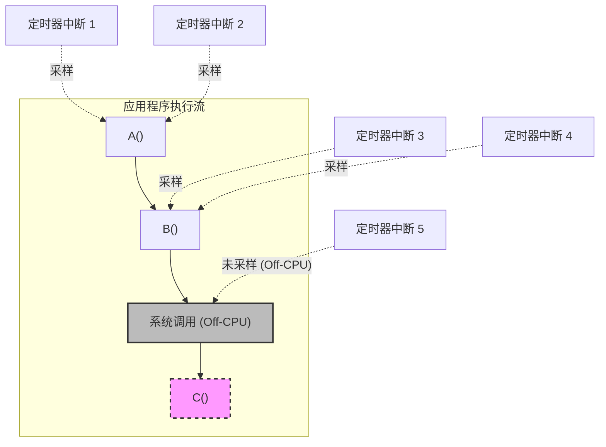
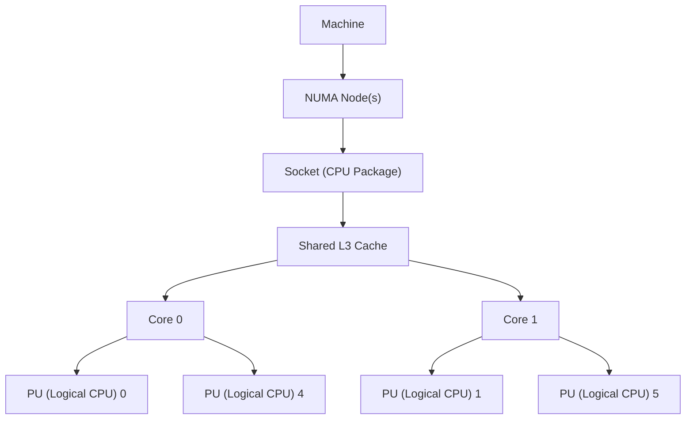
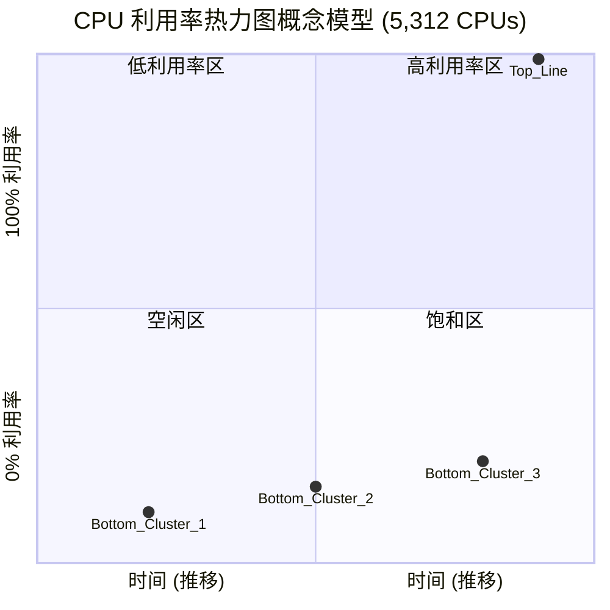
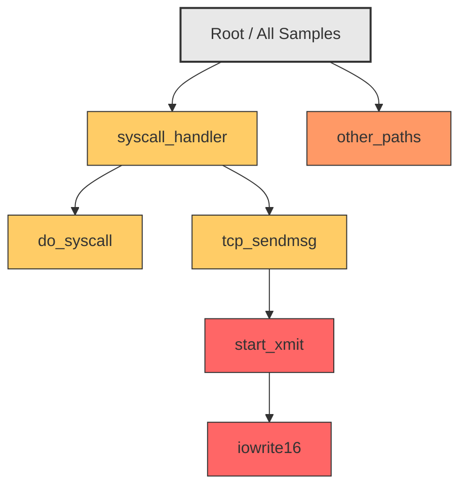
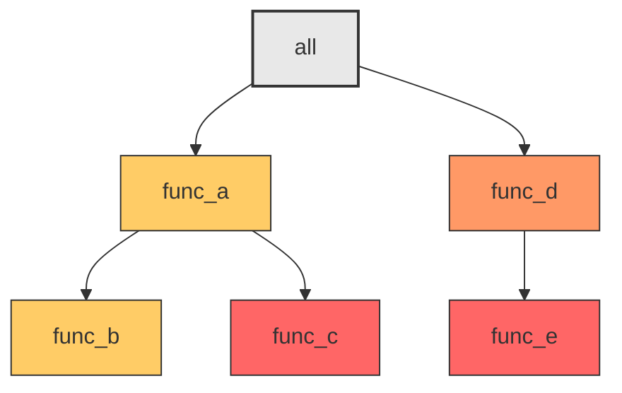

# 6.2 CPU：方法论与可观察性

## 空闲线程

如第3章所述，内核“空闲”线程（或空闲任务）在没有其他可运行线程时会在 CPU 上运行，并且具有最低的可能优先级。它通常被编程为通知处理器 CPU 执行可以被停止（halt 指令）或减速以节省功耗。CPU 将在下一个硬件中断时唤醒。

## NUMA 分组

通过使内核具备 NUMA 感知能力，从而做出更好的调度和内存放置决策，可以显著提高 NUMA 系统的性能。这可以自动检测并创建本地化的 CPU 和内存资源组，并将它们组织成反映 NUMA 架构的拓扑。这种拓扑允许估计任何内存访问的成本。

在 Linux 系统上，这些被称为调度域，它们位于从根域开始的拓扑中。

系统管理员可以执行手动形式的分组，方法是绑定进程使其仅在一个或多个 CPU 上运行，或者为进程创建独占的 CPU 集合来运行。参见第 6.5.10 节，CPU 绑定。

## 处理器资源感知

内核也可以理解 CPU 资源拓扑，以便它可以为电源管理、硬件缓存使用和负载均衡做出更好的调度决策。

---

## 6.5 方法论

本节描述了 CPU 分析和调优的各种方法和练习。表 6.7 总结了这些主题。

**表 6.7 CPU 性能方法论**

| 节 | 方法论 | 类型 |
| :--- | :--- | :--- |
| 6.5.1 | 工具法 | 观测分析 |
| 6.5.2 | USE 方法 | 观测分析 |
| 6.5.3 | 工作负载特征归纳 | 观测分析，容量规划 |
| 6.5.4 | 剖析 | 观测分析 |
| 6.5.5 | 周期分析 | 观测分析 |
| 6.5.6 | 性能监控 | 观测分析，容量规划 |
| 6.5.7 | 静态性能调优 | 观测分析，容量规划 |
| 6.5.8 | 优先级调优 | 调优 |
| 6.5.9 | 资源控制 | 调优 |
| 6.5.10 | CPU 绑定 | 调优 |
| 6.5.11 | 微基准测试 | 实验分析 |

> [!TIP] 更多方法论
> 参见第 2 章，方法论，以获取更多方法论以及对其中许多方法论的介绍。您不需要使用所有这些方法；可以将其视为一本食谱，可以单独遵循或组合使用。
> 
> 我的建议是按以下顺序使用：性能监控、USE 方法、剖析、微基准测试和静态性能调优。
> 
> 第 6.6 节，可观察性工具，以及后面的章节，展示了应用这些方法论的操作系统工具。

### 6.5.1 工具法

工具法是一个遍历可用工具并检查它们提供的关键指标的过程。虽然这是一种简单的方法论，但它可能会忽略那些工具提供差可见性或无可见性的问题，而且执行起来可能很耗时。

对于 CPU，工具法可以包括检查以下内容：

- **uptime/top**：检查[[平均负载|负载平均值]]以查看负载随时间是增加还是减少。在使用以下工具时请牢记这一点，因为在您的分析期间负载可能正在变化。
- **vmstat**：以一秒的间隔运行 `vmstat(1)` 并检查系统范围的 CPU 利用率（“us” + “sy”）。利用率接近 100% 会增加调度器延迟的可能性。
- **mpstat**：检查每个 CPU 的统计信息，并查找个别热点（繁忙）CPU，识别可能的线程可扩展性问题。
- **top**：查看哪些进程和用户是最大的 CPU 消耗者。
- **pidstat**：将最大的 CPU 消耗者分解为用户时间和系统时间。
- **perf/profile**：对用户态或内核态的 CPU 使用堆栈跟踪进行剖析，以识别 CPU 被使用的原因。
- **perf**：测量 IPC 作为基于周期的效率低下的指标。
- **showboost/turboboost**：检查当前的 CPU 时钟频率，以防它们异常低。
- **dmesg**：检查 CPU 温度停顿消息（“cpu clock throttled”）。

> [!INFO] 上下文深化
> 如果发现问题，请检查可用工具的所有字段以了解更多上下文。有关每个工具的更多信息，请参见第 6.6 节，可观察性工具。

### 6.5.2 USE 方法

USE 方法可用于在性能调查的早期，在尝试更深入、更耗时的策略之前，识别所有组件的瓶颈和错误。

对于每个 CPU，检查：

- **利用率**：CPU 忙碌的时间（不在空闲线程中）
- **饱和度**：可运行线程排队等待其 CPU 运行机会的程度
- **错误**：CPU 错误，包括可纠正错误

您可以先检查错误，因为它们通常检查起来很快且最容易解释。某些处理器和操作系统会感知到可纠正错误（纠错码，ECC）的增加，并会在不可纠正错误导致 CPU 故障之前作为预防措施将 CPU 下线。检查这些错误可能只需检查是否所有 CPU 仍在线。

利用率通常可从操作系统工具中轻松获取，表示为忙碌百分比。此指标应按每个 CPU 进行检查，以排查可扩展性问题。高 CPU 和核心利用率可以通过使用剖析和周期分析来理解。

对于实施了 CPU 限制或配额（资源控制；例如，Linux tasksets 和 cgroups）的环境，这在云计算环境中很常见，除了物理限制外，CPU 利用率还应根据施加的限制来衡量。您的系统可能会在物理 CPU 达到 100% 利用率之前很久就耗尽其 CPU 配额，比预期更早遇到饱和。

饱和度指标通常在全系统范围内提供，包括作为负载平均值的一部分。此指标量化了 CPU 过载的程度，或者如果存在 CPU 配额，则量化了配额用完的程度。

如果在使用 GPU 和其他加速器，您可以根据可用指标遵循类似的过程来检查它们的健康状况。

### 6.5.3 工作负载特征归纳

对施加的负载进行特征归纳在容量规划、基准测试和模拟工作负载中非常重要。它也可以通过识别可以消除的不必要工作来带来一些最大的性能提升。

用于归纳 CPU 工作负载的基本属性有：

- CPU 负载平均值（利用率 + 饱和度）
- 用户时间与系统时间比率
- 系统调用率
- 自愿上下文切换率
- 中断率

目的是对施加的负载进行特征归纳，而不是对交付的性能进行归纳。某些操作系统（例如，Solaris）上的负载平均值仅显示 CPU 需求，使其成为 CPU 工作负载特征归纳的主要指标。然而，在 Linux 上，负载平均值包括其他负载类型。参见第 6.6.1 节，uptime 中的示例和进一步解释。

> [!NOTE] 速率指标的解释
> 速率指标有点难以解释，因为它们反映了施加的负载以及某种程度上反映了交付的性能，而交付的性能可能会限制它们的速率。^6^
> 
> ^6^ 例如，假设发现某个给定的批处理计算工作负载在更快的 CPU 上运行时具有更高的系统调用率，即使工作负载是相同的。它只是完成得更快！

用户时间与系统时间的比率显示了施加的负载类型，如前面第 6.3.9 节，用户时间/内核时间中所介绍的。高用户时间率是由于应用程序花费时间执行自己的计算。高系统时间则显示时间花费在内核中，这可以通过系统调用率和中断率进一步理解。与 CPU 密集型工作负载相比，I/O 密集型工作负载具有更高的系统时间、系统调用和更高的自愿上下文切换，因为线程会阻塞等待 I/O。

以下是一个工作负载描述示例，旨在展示如何将这些属性表达在一起：

> [!EXAMPLE] 工作负载描述示例
> 在一台平均的 48 CPU 应用服务器上，白天的负载平均值在 30 到 40 之间变化。用户/系统比率为 95/5，因为这是一个 CPU 密集型工作负载。大约有 325K syscalls/s，以及大约 80K 自愿上下文切换/s。

这些特征可能会随着遇到不同的负载而随时间变化。

#### 高级工作负载特征归纳/检查清单

可以包含额外的细节来归纳工作负载。这里将它们列为供考虑的问题，在深入研究 CPU 问题时也可以作为检查清单：

- 系统范围的 CPU 利用率是多少？每个 CPU？每个核心？
- CPU 负载的并行度如何？是单线程的吗？有多少线程？
- 哪些应用程序或用户正在使用 CPU？使用了多少？
- 哪些内核线程正在使用 CPU？使用了多少？
- 中断的 CPU 使用率是多少？
- CPU 互连利用率是多少？
- 为什么使用 CPU（用户态和内核态调用路径）？
- 遇到了什么类型的停顿周期？

参见第 2 章，方法论，以获取此方法论和要测量的特征（谁、为什么、什么、如何）的更高级别总结。以下各节将扩展此列表中的最后两个问题：如何使用剖析分析调用路径，以及如何使用周期分析停顿周期。

### 6.5.4 剖析

剖析为研究目标构建一幅图像。CPU 剖析可以以不同的方式执行，通常如下：

- **基于定时器的采样**：收集当前运行函数或堆栈跟踪的基于定时器的样本。通常使用的速率是每个 CPU 99 Hertz（每秒样本数）。这提供了 CPU 使用的粗略视图，具有足够的细节来发现大大小小的问题。使用 99 是为了避免可能以 100 Hertz 发生的步进式采样（lock-step sampling），这会产生有偏倚的剖面。如果需要，可以降低定时器速率并扩大时间跨度，直到开销可以忽略不计并适合生产环境使用。
- **函数追踪**：检测所有或部分函数调用以测量其持续时间。这提供了细粒度的视图，但开销对于生产环境使用可能过高，通常为 10% 或更多，因为函数追踪为每个函数调用添加了插桩。

> [!INFO] 生产环境中的剖析器
> 生产环境中使用的大多数剖析器，以及本书中的剖析器，都使用基于定时器的采样。如图 6.14 所示，其中一个应用程序调用函数 A()，A() 调用函数 B()，依此类推，同时收集堆栈跟踪样本。有关堆栈跟踪及如何阅读它们的解释，请参见第 3 章，操作系统，第 3.2.7 节，栈。

**图 6.14 基于采样的 CPU 剖析**



> [!NOTE] 图 6.14 解析
> 图 6.14 显示了如何仅当进程在 CPU 上时才收集样本：两个样本显示函数 A() 在 CPU 上，两个样本显示由 A() 调用的函数 B() 在 CPU 上。系统调用期间离开 CPU 的时间未被采样。此外，短寿命的函数 C() 完全被采样遗漏了。

内核通常为进程维护两个堆栈跟踪：用户态堆栈和在内核上下文（例如，系统调用）中的内核栈。为了获得完整的 CPU 剖面，剖析器必须在可用时记录这两个堆栈。

除了采样堆栈跟踪之外，剖析器还可以仅记录指令指针，这显示了在 CPU 上的函数和指令偏移量。有时这足以解决问题，而无需收集堆栈跟踪的额外开销。

#### 样本处理

如第 5 章所述，Netflix 的典型 CPU 剖析以 49 Hertz 跨（大约）32 个 CPU 收集用户和内核堆栈跟踪，持续 30 秒：这产生了总共 47,040 个样本，并带来了两个挑战：

1. **存储 I/O**：剖析器通常将样本写入剖面文件，然后可以以不同的方式读取和检查。然而，将如此多的样本写入文件系统会产生存储 I/O，这会干扰生产应用程序的性能。

基于 BPF 的 `profile(8)` 工具通过在内核内存中汇总样本，并且仅输出汇总结果，解决了存储 I/O 问题。它不使用中间剖析文件。

2. **理解问题**：逐条阅读 47,040 个多行堆栈跟踪是不切实际的：必须使用汇总和可视化手段来理解剖析结果。一种常用的堆栈跟踪可视化方式是[[火焰图]]，在前面的章节（第 1 章和第 5 章）中已经展示了一些示例；本章还会有更多示例。

图 6.15 展示了从 `perf(1)` 和 `profile` 生成 CPU 火焰图的整体步骤，解决了理解问题。它也展示了存储 I/O 问题是如何解决的：`profile(8)` 不使用中间文件，从而节省了开销。使用的具体命令列在 6.6.13 节 `perf` 中。


虽然基于 BPF 的方法开销更低，但 `perf(1)` 方法保存了原始样本（带有时间戳），可以使用不同的工具重新处理，包括 FlameScope（6.7.4 节）。

#### 剖析结果解读

一旦你收集并汇总或可视化了 CPU 剖析结果，你的下一个任务就是理解它并寻找性能问题。图 6.16 展示了一个 CPU 火焰图的摘录，阅读这种可视化的说明在 6.7.3 节“火焰图”中。你该如何总结这个剖析结果呢？


> [!TIP] 我在 CPU 火焰图中寻找性能收益的方法如下：
> 
> 1. **自顶向下（从叶子到根）寻找大的“平顶”**。这表明单个函数在许多样本期间都处于 on-CPU 状态，这可能会带来一些快速收益。在图 6.16 中，右侧有两个平顶，分别是 `unmap_page_range()` 和 `page_remove_rmap()`，两者都与内存页面有关。也许一个快速的收益是将应用程序切换为使用大页。
> 
> 2. **自底向上以理解代码层次结构**。在这个例子中，`bash(1)` shell 调用了 `execve(2)` 系统调用，后者最终调用了页面函数。也许更大的收益是以某种方式避免使用 `execve(2)`，例如使用 bash 内建命令代替外部进程，或者切换到另一种语言。
> 
> 3. **更仔细地自顶向下寻找分散但常见的 CPU 使用情况**。可能有许多与同一问题相关的小帧，例如锁竞争。反转火焰图的合并顺序，使它们从叶子到根合并并变成冰柱图，可以帮助揭示这些情况。

> [!INFO] 补充信息
> 另一个解读 CPU 火焰图的示例在第 5 章“应用程序”的 5.4.1 节“CPU 剖析”中提供。

CPU 剖析和火焰图的命令在 6.6 节“可观察性工具”中提供。另请参阅 5.4.1 节关于应用程序的 CPU 分析，以及 5.6 节“陷阱”，该节描述了缺少堆栈跟踪和符号的常见剖析问题。

对于特定 CPU 资源（如缓存和互连）的使用情况，剖析可以使用基于 PMC 的事件触发，而不是定时间隔。这将在下一节中描述。

---

### 6.5.5 周期分析

你可以使用[[性能监控计数器]]（PMCs）来理解周期级别的 CPU 利用率。这可能会揭示周期是花费在一级、二级或三级缓存未命中、内存或资源 I/O 的停顿上，还是花费在浮点运算或其他活动上。这些信息可能会显示通过调整编译器选项或更改代码可以实现的性能收益。

> [!IMPORTANT] 开始周期分析
> 首先测量 [[IPC]]（CPI 的倒数）。如果 IPC 较低，则继续调查停顿周期的类型。如果 IPC 较高，则在代码中寻找减少执行指令的方法。“高”或“低”IPC 的值取决于你的处理器：低可能小于 0.2，高可能大于 1。你可以通过执行内存 I/O 密集型或指令密集型的已知工作负载，并测量每种工作负载产生的 IPC 来了解这些值。

除了测量计数器值之外，PMC 还可以配置为在给定值溢出时中断内核。例如，每发生 10,000 次三级缓存未命中，就可以中断内核以收集堆栈回溯。随着时间的推移，内核会构建一个导致三级缓存未命中的代码路径剖析，而无需测量每一次未命中的高昂开销。这通常被集成开发环境（IDE）软件使用，以使用导致内存 I/O 和停顿周期的位置来注释代码。

> [!WARNING] PMC 挑战
> 如第 4 章“可观察性工具”4.3.9 节“PMC 挑战”中所述，由于滑动和乱序执行，溢出采样可能会漏记正确的指令。在 Intel 上，解决方案是 PEBS，Linux 的 `perf(1)` 工具支持该技术。

周期分析是一项高级活动，使用命令行工具可能需要数天时间才能完成，如 6.6 节“可观察性工具”中所示。你还应该准备花一些高质量的时间阅读 CPU 供应商的处理器手册。诸如 Intel vTune [Intel 20b] 和 AMD uprof [AMD 20] 等性能分析器可以节省时间，因为它们已被编程为查找你感兴趣的 PMC。

---

### 6.5.6 性能监控

性能监控可以识别随着时间的推移出现的活跃问题和行为模式。CPU 的关键指标是：

- **利用率**：繁忙百分比
- **饱和度**：运行队列长度或调度器延迟

> [!NOTE]
> 利用率应以每个 CPU 为基础进行监控，以识别线程可扩展性问题。对于实施了 CPU 限制或配额（资源控制）的环境，例如云计算环境，还应记录与这些限制相比的 CPU 使用情况。

选择正确的间隔来测量和归档是监控 CPU 使用情况的一个挑战。一些监控工具使用 5 分钟的间隔，这可能会隐藏较短时间的 CPU 利用率突发的存在。每秒测量是更可取的，但你应该意识到即使在一秒钟内也可能发生突发。这些可以从饱和度中识别，并使用 FlameScope（6.7.4 节）进行检查，该工具就是为亚秒级分析而创建的。

---

### 6.5.7 静态性能调优

静态性能调优关注已配置环境的问题。对于 CPU 性能，检查静态配置的以下方面：

- 有多少 CPU 可用？它们是核心吗？硬件线程吗？
- 是否有 GPU 或其他加速器可用且正在使用？
- CPU 架构是单处理器还是多处理器？
- CPU 缓存的大小是多少？它们是共享的吗？
- CPU 时钟频率是多少？它是动态的（例如，Intel Turbo Boost 和 SpeedStep）吗？这些动态功能在 BIOS 中启用了吗？
- 在 BIOS 中还启用或禁用了哪些其他与 CPU 相关的功能？例如：turboboost、总线设置、节能设置？
- 此处理器型号是否存在性能问题（错误）？它们是否列在处理器勘误表中？
- 微码版本是什么？它是否包含针对安全漏洞（例如 Spectre/Meltdown）的影响性能的缓解措施？
- 此 BIOS 固件版本是否存在性能问题（错误）？
- 是否存在软件强加的 CPU 使用限制（资源控制）？它们是什么？

> [!TIP]
> 这些问题的答案可能会揭示以前被忽视的配置选择。最后一个问题对于云计算环境尤其如此，因为云计算中的 CPU 使用通常受到限制。

---

### 6.5.8 优先级调优

Unix 一直提供 `nice(2)` 系统调用来调整进程优先级，它设置一个 nice 值。正的 nice 值导致较低的进程优先级（更友好），而负值——只能由超级用户设置^[7]^——导致较高的优先级。后来出现了 `nice(1)` 命令，用于以 nice 值启动程序，随后（在 BSD 中）添加了 `renice(1M)` 命令，用于调整已运行进程的 nice 值。Unix 第 4 版的手册页提供了这个示例 [TUHS 73]：

> 建议希望执行长时间运行的程序而不受管理部门干扰的用户使用 16 这个值。

如今，nice 值对于调整进程优先级仍然很有用。当存在 CPU 争用，导致高优先级工作出现调度器延迟时，这最有效。你的任务是识别低优先级工作，其中可能包括监控代理和计划备份，可以修改它们以使用 nice 值启动。还可以进行分析以检查调优是否有效，以及高优先级工作的调度器延迟是否保持较低。

^[7]^ 自 Linux 2.6.12 起，可以按进程修改“nice 上限”，允许非 root 进程具有更低的 nice 值。例如，使用：`prlimit --nice=-19 -p PID`。

> [!WARNING] 后果评估
> 除了 nice 之外，操作系统还可能提供更高级的进程优先级控制，例如更改调度器类和调度器策略，以及可调参数。Linux 包含一个实时调度类，它可以允许进程抢占所有其他工作。虽然这可以消除调度器延迟（除了其他实时进程和中断），但请确保你了解其后果。如果实时应用程序遇到多个线程进入无限循环的错误，它可能导致所有 CPU 对所有其他工作不可用——包括手动修复问题所需的管理 shell。^[8]^

^[8]^ 自 Linux 2.6.25 起，针对此问题有了一个解决方案：`RLIMIT_RTTIME`，它设置了实时线程在进行阻塞系统调用之前可能消耗的 CPU 时间上限（以微秒为单位）。

---

### 6.5.9 资源控制

操作系统可能提供细粒度的控制，用于将 CPU 周期分配给进程或进程组。这些可能包括 CPU 利用率的固定限制和用于更灵活方法的份额——允许根据份额值消耗空闲的 CPU 周期。这些如何工作是与实现相关的，并在 6.9 节“调优”中讨论。

---

### 6.5.10 CPU 绑定

调优 CPU 性能的另一种方法涉及将进程和线程绑定到单个 CPU 或 CPU 集合。这可以提高进程的 CPU 缓存热度，改善其内存 I/O 性能。对于 NUMA 系统，它还提高了内存局部性，进一步提高了性能。

通常有两种执行此操作的方法：

- **CPU 绑定**：将进程配置为仅在单个 CPU 上运行，或仅在定义的集合中的一个 CPU 上运行。
- **独占 CPU 集**：划分一组只能由分配给它们的进程使用的 CPU。这可以进一步提高 CPU 缓存热度，因为当进程空闲时，其他进程不能使用那些 CPU。

在基于 Linux 的系统上，独占 CPU 集方法可以使用 cpusets 实现。配置示例在 6.9 节“调优”中提供。

---

### 6.5.11 微基准测试

用于 CPU 微基准测试的工具通常测量多次执行简单操作所花费的时间。该操作可以基于：

- **CPU 指令**：整数算术、浮点运算、内存加载和存储、分支和其他指令
- **内存访问**：用于调查不同 CPU 缓存的延迟和主存吞吐量
- **高级语言**：类似于 CPU 指令测试，但用高级解释型或编译型语言编写

# 6.2 CPU：方法论与可观察性

■操作系统操作：测试受限于CPU的系统库和系统调用函数，如 `getpid(2)` 和进程创建

CPU基准测试的一个早期例子是由英国国家物理实验室开发的 Whetstone，它于1972年用 Algol 60 编写，旨在模拟科学工作负载。Dhrystone 基准测试开发于1984年，用于模拟当时的整数工作负载，并成为比较CPU性能的流行手段。这些基准测试以及包括进程创建和管道吞吐量在内的各种Unix基准测试，被收录在一个名为 UnixBench 的集合中，该集合最初来自莫纳什大学，由 BYTE 杂志发表 [Hinnant 84]。为了测试压缩速度、质数计算、加密和编码，近年来已经创建了更新的CPU基准测试。

无论您使用哪种基准测试，在比较系统之间的结果时，重要的是要了解真正被测试的是什么。像前面列出的那些基准测试往往最终测试的是编译器版本之间编译器优化的差异，而不是基准测试代码或CPU速度。许多基准测试是单线程执行的，其结果在具有多个CPU的系统中会失去意义。（一个四CPU系统的基准测试结果可能略快于一个八CPU系统，但后者在有足够多的可并行运行线程的情况下，可能会提供大得多的吞吐量。）

有关基准测试的更多信息，请参阅第12章，基准测试。

## 6.6 可观察性工具

本节介绍基于Linux操作系统的CPU性能可观察性工具。使用这些工具时应遵循的方法论请参见上一节。

本节中的工具列在表6.8中。

**表6.8 Linux CPU可观察性工具**

| 小节 | 工具 | 描述 |
|---|---|---|
| 6.6.1 | `uptime` | [[负载均值\|负载均值]] (Load averages) |
| 6.6.2 | `vmstat` | 包含系统级CPU均值 |
| 6.6.3 | `mpstat` | 每CPU统计信息 |
| 6.6.4 | `sar` | 历史统计信息 |
| 6.6.5 | `ps` | 进程状态 |
| 6.6.6 | `top` | 监控每进程/线程的CPU使用率 |
| 6.6.7 | `pidstat` | 每进程/线程的CPU细分 |
| 6.6.8 | `time`, `ptime` | 计时命令，包含CPU细分 |
| 6.6.9 | `turboboost` | 显示CPU时钟频率及其他状态 |
| 6.6.10 | `showboost` | 显示CPU时钟频率及睿频加速 |
| 6.6.11 | `pmcarch` | 显示高级CPU周期使用情况 |
| 6.6.12 | `tlbstat` | 汇总TLB周期 |
| 6.6.13 | `perf` | CPU剖析与PMC分析 |
| 6.6.14 | `profile` | 采样CPU栈跟踪 |
| 6.6.15 | `cpudist` | 汇总ON-CPU（在CPU上执行）时间 |
| 6.6.16 | `runqlat` | 汇总CPU运行队列延迟 |
| 6.6.17 | `runqlen` | 汇总CPU运行队列长度 |
| 6.6.18 | `softirqs` | 汇总软中断时间 |
| 6.6.19 | `hardirqs` | 汇总硬中断时间 |
| 6.6.20 | `bpftrace` | 用于CPU分析的跟踪程序 |

这是一组支持第6.5节方法论的精选工具和功能。我们从传统的CPU统计工具开始，然后深入到使用代码路径剖析、CPU周期分析和跟踪工具进行更深层次分析的工具。一些传统工具可能（有时最初就是）在其他类Unix操作系统上可用，包括：`uptime(1)`、`vmstat(8)`、`mpstat(1)`、`sar(1)`、`ps(1)`、`top(1)` 和 `time(1)`。跟踪工具基于BPF及其BCC和bpftrace前端（第15章），包括：`profile(8)`、`cpudist(8)`、`runqlat(8)`、`runqlen(8)`、`softirqs(8)` 和 `hardirqs(8)`。

请参阅每个工具的文档，包括其手册页（man pages），以获取其功能的完整参考。

### 6.6.1 uptime

`uptime(1)` 是打印系统负载均值的几个命令之一：

```bash
$ uptime
  9:04pm  up 268 day(s), 10:16,  2 users,  load average: 7.76, 8.32, 8.60
```

最后三个数字分别是1分钟、5分钟和15分钟的负载均值。通过比较这三个数字，您可以确定在过去15分钟（左右）内负载是在增加、减少还是保持稳定。了解这一点可能很有用：如果您正在响应生产环境的性能问题，发现负载正在下降，您可能已经错过了问题发生的高峰；如果负载正在增加，问题可能正在恶化！

以下部分将更详细地解释负载均值，但它们只是一个起点，因此您不应在考虑它们上花费超过五分钟的时间，然后应转向其他指标。

#### 负载均值 (Load Averages)

负载均值表示对系统资源的需求：越高意味着需求越大。在某些操作系统（如Solaris）上，负载均值显示CPU需求，早期版本的Linux也是如此。但在1993年，Linux改变了负载均值以显示系统级需求：CPU、磁盘和其他资源。^9 这一改变是通过将处于 `TASK_UNINTERRUPTIBLE` 线程状态的线程包含在内来实现的，某些工具将此状态显示为状态“D”（此状态在第5章应用程序的5.4.5节线程状态分析中提到过）。

负载被测量为当前资源使用率（利用率，utilization）加上排队的请求（饱和度，saturation）。想象一个汽车收费站：您可以通过计算正在接受服务的汽车数量（利用率）加上排队的汽车数量（饱和度）来测量一天中不同时间的负载。

该平均值是一个指数衰减移动平均值，它反映了超过1、5和15分钟时间之外的负载（这些时间实际上是指数移动求和中使用的常数 [Myer 73]）。图6.17显示了一个简单实验的结果，其中启动了一个受CPU限制的线程，并绘制了负载均值。

**图6.17 指数衰减的负载均值**

```mermaid
xychart-beta
    title "指数衰减的负载均值 (单个CPU密集型线程启动后)"
    x-axis "时间 (分钟)" 0 --> 15
    y-axis "负载均值" 0 --> 1.0
    line [0, 0.61, 0.8, 0.9, 0.95, 0.97, 0.98]
    note "1分钟时达到约0.61"
```

*（注：原图为折线图，展示了单CPU负载从0上升至1.0的过程中，由于指数衰减移动平均的特性，1分钟、5分钟和15分钟时的负载均值分别仅达到已知负载1.0的约61%左右。）*

到了1、5和15分钟的节点，负载均值已经达到了已知负载1.0的大约61%。

负载均值在早期BSD中被引入Unix，并基于早期操作系统（CTSS、Multics [Saltzer 70]、TENEX [Bobrow 72]）常用的调度器平均队列长度和负载均值。它们在RFC 546 [Thomas 73]中被描述为：

> [!QUOTE] RFC 546 摘录
> [1] TENEX的负载均值是CPU需求的度量。负载均值是在给定时间段内可运行进程数量的平均值。例如，小时负载均值为10意味着（对于单CPU系统）在该小时内的任何时刻，人们可以预期看到1个进程正在运行，9个其他进程准备好运行（即没有被I/O阻塞）等待CPU。

^9 这次改变发生在很久以前，以至于改变的原因已经被遗忘且未被记录在案，早于git和其他资源中的Linux历史；我最终在一个旧邮件系统存档的在线tar包中找到了原始补丁。Matthias Urlichs做了那个改变，他指出如果需求从CPU转移到磁盘，那么负载均值应该保持不变，因为需求并没有改变 [Gregg 17c]。我给他发了电子邮件（有史以来第一次）询问他24年前的改动，一小时内就收到了回复！

作为一个现代的例子，考虑一个具有128负载均值的64 CPU系统。如果负载仅仅是CPU，这就意味着平均而言每个CPU上总有一个线程在运行，且每个CPU都有一个线程在等待。同一个系统如果CPU负载均值为20，则表明有显著的余量，因为在所有CPU繁忙之前它还可以再运行44个受CPU限制的线程。（一些公司监控归一化的负载均值指标，即自动除以CPU数量，从而无需知道CPU数量即可对其进行解释。）

#### 压力失速信息 (Pressure Stall Information, PSI)

在本书的第一版中，我描述了如何为每种资源类型提供负载均值以辅助解释。现在Linux 4.20中添加了一个提供这种细分的接口：压力失速信息（PSI），它提供了CPU、内存和I/O的平均值。该平均值显示某事物在资源上停滞的时间百分比（仅饱和度）。这与负载均值的比较见表6.9。

**表6.9 Linux负载均值 vs 压力失速信息**

| 属性 | 负载均值 | 压力失速信息 (PSI) |
|---|---|---|
| 资源 | 系统级 | cpu, memory, io（各自独立） |
| 指标 | 繁忙和排队的任务数量 | 停滞（等待）的时间百分比 |
| 时间 | 1分钟, 5分钟, 15分钟 | 10秒, 60秒, 300秒 |
| 平均算法 | 指数衰减移动求和 | 指数衰减移动求和 |

表6.10显示了不同场景下指标的显示情况：

**表6.10 Linux负载均值示例 vs 压力失速信息**

| 示例场景 | 负载均值 | 压力失速信息 (PSI) |
|---|---|---|
| 2个CPU，1个繁忙线程 | 1.0 | 0.0 |
| 2个CPU，2个繁忙线程 | 2.0 | 0.0 |
| 2个CPU，3个繁忙线程 | 3.0 | 50.0 |
| 2个CPU，4个繁忙线程 | 4.0 | 100.0 |
| 2个CPU，5个繁忙线程 | 5.0 | 100.0 |

例如，展示2个CPU有3个繁忙线程的场景：

```bash
$ uptime
 07:51:13 up 4 days,  9:56,  2 users,  load average: 3.00, 3.00, 2.55
$ cat /proc/pressure/cpu
some avg10=50.00 avg60=50.00 avg300=49.70 total=1031438206
```

这个50.0的值意味着某个线程（"some"）有50%的时间处于停滞状态。`io` 和 `memory` 指标包括第二行，用于显示当所有非空闲线程都停滞时的情况（"full"）。PSI最能回答这个问题：一个任务必须在资源上等待的可能性有多大？

> [!TIP] 下一步行动
> 无论您使用负载均值还是PSI，您都应该迅速转向更详细的指标来理解负载，例如 `vmstat(1)` 和 `mpstat(1)` 提供的指标。

### 6.6.2 vmstat

虚拟内存统计命令 `vmstat(8)`，在最后几列打印系统级的CPU平均值，并在第一列打印可运行线程的数量。以下是Linux版本的示例输出：

```bash
$ vmstat 1
procs -----------memory---------- ---swap-- -----io---- -system-- ------cpu-----
 r  b   swpd   free   buff  cache   si   so    bi    bo   in   cs us sy id wa st
15  0      0 451732  70588 866628    0    0     1    10   43   38  2  1 97  0  0
15  0      0 450968  70588 866628    0    0     0   612 1064 2969 72 28  0  0  0
15  0      0 450660  70588 866632    0    0     0     0  961 2932 72 28  0  0  0
15  0      0 450952  70588 866632    0    0     0     0 1015 3238 74 26  0  0  0
[...]
```

输出的第一行应该是自启动以来的摘要。但是，在Linux上，`procs` 和 `memory` 列开始时显示的是当前状态。（也许有一天它们会被修复。）

与CPU相关的列是：

- **r**：运行队列长度——可运行线程的总数
- **us**：用户态时间百分比
- **sy**：系统态（内核）时间百分比
- **id**：空闲百分比
- **wa**：等待I/O百分比，测量当线程被磁盘I/O阻塞时的CPU空闲时间
- **st**：被盗百分比，对于虚拟化环境，显示用于服务其他租户的CPU时间

> [!INFO] 关于 r 列与平均值的说明
> 所有这些值都是跨所有CPU的系统级平均值，除了 `r`，它是总数。
> 
> 在Linux上，`r` 列是等待的任务数加上正在运行的任务数的总和。对于其他操作系统（例如Solaris），`r` 列仅显示等待的任务，而不包括正在运行的任务。Bill Joy 和 Ozalp Babaoglu 于1979年为3BSD编写的原始 `vmstat(1)` 以一个 `RQ` 列开始，用于显示可运行和正在运行的进程数量，正如Linux的 `vmstat(8)` 目前所做的那样。

### 6.6.3 mpstat

多处理器统计工具 `mpstat(1)` 可以报告每个CPU的统计信息。以下是Linux版本的示例输出：

```bash
$ mpstat -P ALL 1
Linux 5.3.0-1009-aws (ip-10-0-239-218)  02/01/20        _x86_64_        (2 CPU)
18:00:32  CPU   %usr  %nice   %sys %iowait   %irq  %soft %steal %guest %gnice  %idle
18:00:33  all  32.16   0.00  61.81    0.00   0.00   0.00   0.00   0.00   0.00   6.03
18:00:33    0  32.00   0.00  64.00    0.00   0.00   0.00   0.00   0.00   0.00   4.00
18:00:33    1  32.32   0.00  59.60    0.00   0.00   0.00   0.00   0.00   0.00   8.08
18:00:33  CPU   %usr  %nice   %sys %iowait   %irq  %soft %steal %guest %gnice  %idle
18:00:34  all  33.83   0.00  61.19    0.00   0.00   0.00   0.00   0.00   0.00   4.98
18:00:34    0  34.00   0.00  62.00    0.00   0.00   0.00   0.00   0.00   0.00   4.00
18:00:34    1  33.66   0.00  60.40    0.00   0.00   0.00   0.00   0.00   0.00   5.94
[...]
```

使用了 `-P ALL` 选项来打印每个CPU的报告。默认情况下，`mpstat(1)` 仅打印系统范围的摘要行（all）。各列分别是：

■ **CPU**: 逻辑 CPU ID，或者汇总的 `all`

■ **%usr**: 用户态时间（User-time），不包括 `%nice`

■ **%nice**: 具有调整过优先级（nice’d priority）的进程的用户态时间

■ **%sys**: 系统态时间（内核）

■ **%iowait**: I/O 等待时间

■ **%irq**: 硬件中断 CPU 使用率

■ **%soft**: 软件中断 CPU 使用率

■ **%steal**: 花费在服务其他租户的时间

■ **%guest**: 在客户虚拟机中花费的 CPU 时间

■ **%gnice**: 运行一个调整过优先级的客户机所花费的 CPU 时间

■ **%idle**: 空闲时间

关键的列是 `%usr`、`%sys` 和 `%idle`。它们标识了每个 CPU 的 CPU 使用率，并显示了用户态时间与内核态时间的比率（参见第 6.3.9 节，用户态时间/内核态时间）。这还可以用来识别“热点”CPU——即那些以 100% 利用率（`%usr` + `%sys`）运行而其他 CPU 则没有的 CPU——这可能是由于单线程应用程序工作负载或设备中断映射引起的。

> [!NOTE] 统计准确性
> 请注意，此工具以及源自相同内核统计数据（`/proc/stat` 等）的其他工具所报告的 CPU 时间，以及这些统计数据的准确性取决于内核配置。请参阅第 4 章“可观察性工具”第 4.3.1 节 `/proc` 中的“CPU 统计准确性”标题。

---

## 6.6.4 sar

系统活动报告器 `sar(1)` 可用于观察当前活动，也可以配置为归档和报告历史统计数据。它已在第 4 章“可观察性工具”第 4.4 节 `sar` 中介绍过，并在其他相关章节中也会被提及。

Linux 版本提供了以下用于 CPU 分析的选项：

■ **-P ALL**: 与 `mpstat -P ALL` 相同

■ **-u**: 与 `mpstat(1)` 的默认输出相同：仅系统范围的平均值

■ **-q**: 包含运行队列大小 `runq-sz`（等待加上运行的线程数，与 `vmstat(1)` 的 `r` 列相同）以及负载平均值

可以启用 `sar(1)` 数据收集，以便能够观察过去的这些指标。更多细节请参见第 4.4 节 `sar`。

---

## 6.6.5 ps

进程状态命令 `ps(1)` 可以列出所有进程的详细信息，包括 CPU 使用率统计。例如：

```bash
$ ps aux
USER       PID %CPU %MEM    VSZ   RSS TTY      STAT START   TIME COMMAND
root         1  0.0  0.0  23772  1948 ?        Ss    2012   0:04 /sbin/init
root         2  0.0  0.0      0     0 ?        S     2012   0:00 [kthreadd]
root         3  0.0  0.0      0     0 ?        S     2012   0:26 [ksoftirqd/0]
root         4  0.0  0.0      0     0 ?        S     2012   0:00 [migration/0]
root         5  0.0  0.0      0     0 ?        S     2012   0:00 [watchdog/0]
[...]
web      11715 11.3  0.0 632700 11540 pts/0    Sl   01:36   0:27 node indexer.js
web      11721 96.5  0.1 638116 52108 pts/1    Rl+  01:37   3:33 node proxy.js
[...]
```

这种操作风格起源于 BSD，可以通过 `aux` 选项前没有破折号（`-`）来识别。这些选项列出所有用户（`a`），包含扩展的用户详细信息（`u`），并包括没有终端的进程（`x`）。终端显示在电传打字机（TTY）列中。

另一种来自 SVR4 的风格，使用前面带破折号的选项：

```bash
$ ps -ef
UID        PID  PPID  C STIME TTY          TIME CMD
root         1     0  0 Nov13 ?        00:00:04 /sbin/init
root         2     0  0 Nov13 ?        00:00:00 [kthreadd]
root         3     2  0 Nov13 ?        00:00:00 [ksoftirqd/0]
root         4     2  0 Nov13 ?        00:00:00 [migration/0]
root         5     2  0 Nov13 ?        00:00:00 [watchdog/0]
[...]
```

这将列出每个进程（`-e`）及其完整详细信息（`-f`）。`ps(1)` 还有各种其他可用选项，包括 `-o` 用于自定义输出和显示的列。

与 CPU 使用率相关的关键列是 `TIME` 和 `%CPU`（如先前示例所示）。

`TIME` 列显示进程自创建以来消耗的总 CPU 时间（用户态 + 系统态），格式为小时:分钟:秒。

在 Linux 上，第一个示例中的 `%CPU` 列显示的是进程生命周期内的平均 CPU 利用率，并在所有 CPU 上求和。一个一直受 CPU 限制（CPU-bound）的单线程进程将报告 100%。一个受 CPU 限制的双线程进程将报告 200%。其他操作系统可能会将 `%CPU` 对 CPU 数量进行归一化处理，使其最大值为 100%，并且它们可能只显示最近或当前的 CPU 使用情况，而不是生命周期内的平均值。在 Linux 上，要查看进程的当前 CPU 使用情况，可以使用 `top(1)`。

---

## 6.6.6 top

`top(1)` 由 William LeFebvre 于 1984 年为 BSD 创建。他的灵感来自 VMS 命令 `MONITOR PROCESS/TOPCPU`，该命令显示了消耗 CPU 最多的作业及其 CPU 百分比和 ASCII 条形图直方图（但没有数据列）。

`top(1)` 命令监控顶层运行进程，并定期更新屏幕。例如，在 Linux 上：

```bash
$ top
top - 01:38:11 up 63 days,  1:17,  2 users,  load average: 1.57, 1.81, 1.77
Tasks: 256 total,   2 running, 254 sleeping,   0 stopped,   0 zombie
Cpu(s):  2.0%us,  3.6%sy,  0.0%ni, 94.2%id,  0.0%wa,  0.0%hi,  0.2%si,  0.0%st
Mem:  49548744k total, 16746572k used, 32802172k free,   182900k buffers
Swap: 100663292k total,        0k used, 100663292k free, 14925240k cached
  PID USER      PR  NI  VIRT  RES  SHR S %CPU %MEM    TIME+  COMMAND
11721 web       20   0  623m  50m 4984 R   93  0.1   0:59.50 node    
11715 web       20   0  619m  20m 4916 S   25  0.0   0:07.52 node     
   10 root      20   0     0    0    0 S    1  0.0 248:52.56 ksoftirqd/2
   51 root      20   0     0    0    0 S    0  0.0   0:35.66 events/0
11724 admin     20   0 19412 1444  960 R    0  0.0   0:00.07 top    
    1 root      20   0 23772 1948 1296 S    0  0.0   0:04.35 init    
```

系统范围的汇总信息位于顶部，进程/任务列表位于底部，默认按最高 CPU 消耗者排序。系统范围的汇总包括负载平均值和 CPU 状态：`%us`, `%sy`, `%ni`, `%id`, `%wa`, `%hi`, `%si`, `%st`。这些状态与前面描述的 `mpstat(1)` 打印的状态等效，并且是所有 CPU 的平均值。

CPU 使用情况由 `TIME` 和 `%CPU` 列显示。`TIME` 是进程消耗的总 CPU 时间，精度为百分之一秒。例如，“1:36.53”表示总共 1 分钟 36.53 秒的运行在 CPU 上的时间。某些版本的 `top(1)` 提供了可选的“累计时间”模式，其中包括已退出的子进程的 CPU 时间。

`%CPU` 列显示当前屏幕更新间隔内的总 CPU 利用率。在 Linux 上，这没有按 CPU 数量进行归一化，因此一个受 CPU 限制的双线程进程将报告 200%；`top(1)` 将此称为“Irix 模式”，源自其在 IRIX 上的行为。这可以切换为“Solaris 模式”（通过按 `I` 键在模式之间切换），该模式将 CPU 使用率除以 CPU 数量。在这种情况下，在 16 个 CPU 的服务器上，双线程进程将报告 CPU 使用率为 12.5%。

> [!WARNING] 工具自身开销
> 尽管 `top(1)` 通常是初级性能分析师的工具，但您应该注意，`top(1)` 自身的 CPU 使用率可能会变得很显著，并将 `top(1)` 置为消耗 CPU 最多的顶层进程！这通常是由于它用来读取 `/proc` 的系统调用——`open(2)`、`read(2)`、`close(2)`——以及对许多进程调用这些系统调用所致。其他操作系统上某些版本的 `top(1)` 通过保持文件描述符打开并调用 `pread(2)` 来减少了开销。

有一个 `top(1)` 的变体叫做 `htop(1)`，它提供了更多交互功能、自定义选项以及用于 CPU 使用率的 ASCII 条形图。但它调用的系统调用数量也是前者的四倍，从而对系统的干扰更大。我很少使用它。

由于 `top(1)` 是对 `/proc` 进行快照，因此它可能会遗漏在快照拍摄之前已退出的短命进程。这种情况通常发生在软件构建期间，此时 CPU 可能会被构建过程中的许多短命工具重度加载。Linux 上有一个 `top(1)` 的变体叫做 `atop(1)`，它使用进程记账来捕获短命进程的存在，并将其包含在其显示中。

---

## 6.6.7 pidstat

Linux 的 `pidstat(1)` 工具按进程或线程打印 CPU 使用情况，包括用户态和系统时间的细分。默认情况下，滚动输出仅打印活动进程。例如：

```bash
$ pidstat 1
Linux 2.6.35-32-server (dev7)   11/12/12        _x86_64_        (16 CPU)

22:24:42          PID    %usr %system  %guest    %CPU   CPU  Command
22:24:43         7814    0.00    1.98    0.00    1.98     3  tar
22:24:43         7815   97.03    2.97    0.00  100.00    11  gzip

22:24:43          PID    %usr %system  %guest    %CPU   CPU  Command
22:24:44          448    0.00    1.00    0.00    1.00     0  kjournald
22:24:44         7814    0.00    2.00    0.00    2.00     3  tar
22:24:44         7815   97.00    3.00    0.00  100.00    11  gzip
22:24:44         7816    0.00    2.00    0.00    2.00     2  pidstat
[...]
```

此示例捕获了系统备份过程，涉及读取文件系统中文件的 `tar(1)` 命令，以及压缩这些文件的 `gzip(1)` 命令。`gzip(1)` 的用户态时间很高，正如预期那样，因为它在压缩代码中变成了受 CPU 限制的状态。`tar(1)` 命令则将更多时间花在内核中，从文件系统读取数据。

`-p ALL` 选项可用于打印所有进程，包括那些处于空闲状态的进程。`-t` 打印每个线程的统计信息。其他 `pidstat(1)` 选项包含在本书的其他章节中。

---

## 6.6.8 time, ptime

`time(1)` 命令可用于运行程序并报告 CPU 使用情况。它在操作系统中以 `/usr/bin/time` 的形式提供，同时也作为 shell 内置命令提供。

此示例对 `cksum(1)` 命令运行了两次 `time`，计算一个大文件的校验和：

```bash
$ time cksum ubuntu-19.10-live-server-amd64.iso
1044945083 883949568 ubuntu-19.10-live-server-amd64.iso

real     0m5.590s
user     0m2.776s
sys      0m0.359s

$ time cksum ubuntu-19.10-live-server-amd64.iso 
1044945083 883949568 ubuntu-19.10-live-server-amd64.iso

real     0m2.857s
user     0m2.733s
sys      0m0.114s
```

第一次运行花费了 5.6 秒，其中 2.8 秒处于用户模式，计算校验和。有 0.4 秒处于系统态时间，涵盖了读取文件所需的系统调用。还有缺失的 2.4 秒（5.6 – 2.8 – 0.4），这很可能是由于该文件仅被部分缓存而阻塞在磁盘 I/O 读取上的时间。第二次运行完成得更快，耗时 2.9 秒，几乎没有阻塞时间。这是预料之中的，因为在第二次运行时文件可能已完全缓存在主存中。

在 Linux 上，`/usr/bin/time` 版本支持详细输出。例如：

```bash
$ /usr/bin/time -v cp fileA fileB
        Command being timed: "cp fileA fileB"
        User time (seconds): 0.00
        System time (seconds): 0.26
        Percent of CPU this job got: 24%
        Elapsed (wall clock) time (h:mm:ss or m:ss): 0:01.08
        Average shared text size (kbytes): 0
        Average unshared data size (kbytes): 0
        Average stack size (kbytes): 0
        Average total size (kbytes): 0
        Maximum resident set size (kbytes): 3792
        Average resident set size (kbytes): 0
        Major (requiring I/O) page faults: 0
        Minor (reclaiming a frame) page faults: 294
        Voluntary context switches: 1082
        Involuntary context switches: 1
        Swaps: 0
        File system inputs: 275432
        File system outputs: 275432
        Socket messages sent: 0
        Socket messages received: 0
        Signals delivered: 0
        Page size (bytes): 4096
        Exit status: 0
```

`-v` 选项通常不在 shell 内置版本中提供。

---

## 6.6.9 turbostat

`turbostat(1)` 是一个基于特定型号寄存器（[[MSR|Model-Specific Register]]）的工具，用于显示 CPU 的状态，通常可以在 `linux-tools-common` 软件包中找到。[[MSR]] 已在第 4 章“可观察性工具”第 4.3.10 节“其他可观察性来源”中提及。以下是一些示例输出：

# 6.2 CPU：方法论与可观察性

## 6.6.9 turbostat

[[turbostat]](1) 是一个基于特定型号寄存器（MSR）的工具，用于显示 CPU 的状态，通常可以在 `linux-tools-common` 软件包中找到。MSRs 在第 4 章“可观察性工具”的第 4.3.10 节“其他可观察性来源”中已经提及。以下是一些示例输出：

```bash
# turbostat
turbostat version 17.06.23 - Len Brown <lenb@kernel.org>
CPUID(0): GenuineIntel 22 CPUID levels; family:model:stepping 0x6:8e:a (6:142:10)
CPUID(1): SSE3 MONITOR SMX EIST TM2 TSC MSR ACPI-TM TM
CPUID(6): APERF, TURBO, DTS, PTM, HWP, HWPnotify, HWPwindow, HWPepp, No-HWPpkg, EPB
cpu0: MSR_IA32_MISC_ENABLE: 0x00850089 (TCC EIST No-MWAIT PREFETCH TURBO)
CPUID(7): SGX
cpu0: MSR_IA32_FEATURE_CONTROL: 0x00040005 (Locked SGX)
CPUID(0x15): eax_crystal: 2 ebx_tsc: 176 ecx_crystal_hz: 0
TSC: 2112 MHz (24000000 Hz * 176 / 2 / 1000000)
CPUID(0x16): base_mhz: 2100 max_mhz: 4200 bus_mhz: 100
[...]
Core    CPU     Avg_MHz  Busy%   Bzy_MHz  TSC_MHz  IRQ     SMI     C1      C1E      
        C3      C6       C7s     C8       C9       C10     C1%     C1E%    C3%
        C6%     C7s%     C8%     C9%      C10%     CPU%c1  CPU%c3  CPU%c6  CPU%c7
        CoreTmp PkgTmp   GFX%rc6 GFXMHz   Totl%C0  Any%C0  GFX%C0  CPUGFX% Pkg%pc2
        Pkg%pc3 Pkg%pc6  Pkg%pc7 Pkg%pc8  Pkg%pc9  Pk%pc10 PkgWatt CorWatt GFXWatt
        RAMWatt PKG_%    RAM_%
[...]
0       0       97       2.70    3609     2112     1370    0       41      293
        41      453      0       693      0        311     0.24    1.23    0.15
        5.35    0.00     39.33   0.00     50.97    7.50    0.18    6.26    83.37
        52      75       91.41   300      118.58   100.38  8.47    8.30    0.00
        0.00    0.00     0.00    0.00     0.00     0.00    17.69   14.84   0.65
        1.23    0.00     0.00
[...]
```

[[turbostat]](8) 首先打印有关 CPU 和 MSR 的信息，这部分输出可能会超过 50 行，此处已截断。然后，它以默认 5 秒的间隔打印所有 CPU 和每个 CPU 的指标间隔摘要。在此示例中，此间隔摘要输出的宽度达到了 389 个字符，并且行自动换行了五次，导致阅读困难。这些列包括 CPU 编号（CPU）、以 MHz 为单位的平均时钟频率（Avg_MHz）、C 状态信息、温度（*Tmp）和功率（*Watt）。

## 6.6.10 showboost

在 Netflix 云上可以使用 [[turbostat]](8) 之前，我开发了 [[showboost]](1) 来显示带有每次间隔摘要的 CPU 时钟频率。[[showboost]](1) 是“show turbo boost”的简称，它同样使用了 MSR。一些示例输出：

```bash
# showboost
Base CPU MHz : 3000
Set CPU MHz  : 3000
Turbo MHz(s) : 3400 3500
Turbo Ratios : 113% 116%
CPU 0 summary every 1 seconds...
TIME       C0_MCYC      C0_ACYC        UTIL  RATIO    MHz
21:41:43   3021819807   3521745975     100%   116%   3496
21:41:44   3021682653   3521564103     100%   116%   3496
21:41:45   3021389796   3521576679     100%   116%   3496
[...]
```

此输出显示 CPU0 上的时钟频率为 3496 MHz。CPU 基础频率为 3000 MHz：它是通过 Intel 涡轮加速（turbo boost）达到 3496 的。可能的涡轮加速级别，即“步进”，也列在了输出中：3400 和 3500 MHz。

[[showboost]](8) 位于我的 `msr-cloud-tools` 代码库中 [Gregg 20d]，之所以这样命名，是因为我开发这些工具是为了在云中使用。因为我只让它在 Netflix 环境中保持可用，所以由于 CPU 差异，它可能在其他地方无法工作，这种情况下可以尝试使用 `turboboost`(1)。

## 6.6.11 pmcarch

[[pmcarch]](8) 展示了 CPU 周期性能的高层视图。它是一个基于 Intel PMC“架构集”的基于 PMC 的工具，因此得名（PMC 在第 4 章“可观察性工具”的第 4.3.9 节“硬件计数器 (PMCs)”中进行了解释）。在某些云环境中，这些架构 PMC 是唯一可用的（例如，某些 AWS EC2 实例）。一些示例输出：

```bash
# pmcarch
K_CYCLES   K_INSTR    IPC BR_RETIRED   BR_MISPRED  BMR% LLCREF    LLCMISS     LLC%
96163187   87166313  0.91 19730994925  679187299   3.44 656597454 174313799  73.45
93988372   87205023  0.93 19669256586  724072315   3.68 666041693 169603955  74.54
93863787   86981089  0.93 19548779510  669172769   3.42 649844207 176100680  72.90
93739565   86349653  0.92 19339320671  634063527   3.28 642506778 181385553  71.77
[...]
```

该工具打印原始计数器以及一些以百分比表示的比率。各列包括：

- **K_CYCLES**：CPU 周期数 × 1000
- **K_INSTR**：CPU 指令数 × 1000
- **IPC**：每周期指令数
- **BMR%**：分支预测错误率，以百分比表示
- **LLC%**：末级缓存命中率，以百分比表示

[[IPC]] 在第 6.3.7 节“IPC, CPI”中进行了解释，并附有示例值。提供的其他比率 BMR% 和 LLC%，提供了一些关于为什么 IPC 可能较低以及停顿周期可能发生在何处的洞察。

我为我的 `pmc-cloud-tools` 代码库开发了 [[pmcarch]](8)，该代码库中还有用于更多 CPU 缓存统计信息的 `cpucache`(8) [Gregg 20e]。这些工具采用了变通方法并使用了处理器特定的 PMC，以便它们能在 AWS EC2 云上运行，并且在其他地方可能无法工作。即使它对你永远不起作用，它也提供了有用的 PMC 示例，你可以使用 [[perf]](1) 直接对这些 PMC 进行检测（第 6.6.13 节，perf）。

## 6.6.12 tlbstat

[[tlbstat]](8) 是 `pmc-cloud-tools` 中的另一个工具，它显示 TLB 缓存统计信息。示例输出：

```bash
# tlbstat -C0 1
K_CYCLES   K_INSTR      IPC DTLB_WALKS ITLB_WALKS K_DTLBCYC  K_ITLBCYC  DTLB% ITLB%
2875793    276051      0.10 89709496   65862302   787913     650834     27.40 22.63
2860557    273767      0.10 88829158   65213248   780301     644292     27.28 22.52
2885138    276533      0.10 89683045   65813992   787391     650494     27.29 22.55
2532843    243104      0.10 79055465   58023221   693910     573168     27.40 22.63
[...]
```

> [!NOTE] 关于 KPTI 与 Meltdown 漏洞
> 此特定输出显示了针对 KPTI 补丁的最坏情况，该补丁用于解决 Meltdown CPU 漏洞（KPTI 的性能影响在第 3 章“操作系统”的第 3.4.3 节“KPTI (Meltdown)”中进行了总结）。KPTI 在系统调用和其他事件上刷新 TLB 缓存，导致 TLB 遍历期间的停顿周期：这显示在最后两列中。在此输出中，CPU 大约将其一半的时间花费在 TLB 遍历上，预计运行应用程序工作负载的速度大约会慢一半。

各列包括：

- **K_CYCLES**：CPU 周期数 × 1000
- **K_INSTR**：CPU 指令数 × 1000
- **IPC**：每周期指令数
- **DTLB_WALKS**：数据 TLB 遍历（计数）
- **ITLB_WALKS**：指令 TLB 遍历（计数）
- **K_DTLBCYC**：至少一个 PMH 处于活动状态且伴随数据 TLB 遍历的周期数 × 1000
- **K_ITLBCYC**：至少一个 PMH 处于活动状态且伴随指令 TLB 遍历的周期数 × 1000
- **DTLB%**：数据 TLB 活跃周期占总周期的比率
- **ITLB%**：指令 TLB 活跃周期占总周期的比率

与 [[pmcarch]](8) 一样，由于处理器差异，此工具可能无法在你的环境中运行。尽管如此，它仍是实用思路的有用来源。

## 6.6.13 perf

[[perf]](1) 是官方的 Linux 性能剖析器，是一个具有多种功能的多功能工具。第 13 章提供了 [[perf]](1) 的摘要。本节介绍其在 CPU 分析中的用法。

### 单行命令

以下单行命令既实用，又演示了用于 CPU 分析的不同 [[perf]](1) 功能。部分命令将在以下各节中详细解释。

- 以 99 赫兹对指定命令的占用 CPU 的函数进行采样：
  ```bash
  perf record -F 99 command
  ```
- 系统范围地采样 CPU 栈跟踪（通过帧指针），持续 10 秒：
  ```bash
  perf record -F 99 -a -g -- sleep 10
  ```
- 针对指定 PID 采样 CPU 栈跟踪，使用 dwarf（调试信息）展开栈：
  ```bash
  perf record -F 99 -p PID --call-graph dwarf -- sleep 10
  ```
- 通过 exec 记录新进程事件：
  ```bash
  perf record -e sched:sched_process_exec -a
  ```
- 记录上下文切换事件 10 秒，并附带栈跟踪：
  ```bash
  perf record -e sched:sched_switch -a -g -- sleep 10
  ```
- 采样 CPU 迁移 10 秒：
  ```bash
  perf record -e migrations -a -- sleep 10
  ```
- 记录所有 CPU 迁移 10 秒：
  ```bash
  perf record -e migrations -a -c 1 -- sleep 10
  ```
- 将 perf.data 显示为文本报告，合并数据并显示计数和百分比：
  ```bash
  perf report -n --stdio
  ```
- 列出所有 perf.data 事件，带数据头（推荐）：
  ```bash
  perf script --header
  ```
- 显示整个系统的 PMC 统计信息，持续 5 秒：
  ```bash
  perf stat -a -- sleep 5
  ```
- 显示命令的 CPU 末级缓存（LLC）统计信息：
  ```bash
  perf stat -e LLC-loads,LLC-load-misses,LLC-stores,LLC-prefetches command
  ```
- 每秒系统范围地显示内存总线吞吐量：
  ```bash
  perf stat -e uncore_imc/data_reads/,uncore_imc/data_writes/ -a -I 1000
  ```
- 显示每秒上下文切换的速率：
  ```bash
  perf stat -e sched:sched_switch -a -I 1000
  ```
- 显示每秒非自愿上下文切换的速率（前一个状态为 TASK_RUNNING）：
  ```bash
  perf stat -e sched:sched_switch --filter 'prev_state == 0' -a -I 1000
  ```
- 显示每秒的模式切换和上下文切换速率：
  ```bash
  perf stat -e cpu_clk_unhalted.ring0_trans,cs -a -I 1000
  ```
- 记录调度器性能剖析 10 秒：
  ```bash
  perf sched record -- sleep 10
  ```
- 从调度器性能剖析中显示每个进程的调度器延迟：
  ```bash
  perf sched latency
  ```
- 从调度器性能剖析中列出每个事件的调度器延迟：
  ```bash
  perf sched timehist
  ```

有关更多 [[perf]](1) 单行命令，请参见第 13 章“perf”的第 13.2 节“单行命令”。

### 系统范围 CPU 性能剖析

[[perf]](1) 可用于剖析 CPU 调用路径，总结 CPU 时间在内核空间和用户空间中的分配情况。这由 `record` 命令执行，该命令将样本捕获到 `perf.data` 文件中。然后可以使用 `report` 命令查看文件的内容。它的工作原理是使用可用的最精确的计时器：如果可用，则基于 CPU 周期，否则基于软件（`cpu-clock` 事件）。

> [!INFO] 性能剖析工作流示意
> 以下 Mermaid 图展示了 `perf record` 到 `perf report` 的基本工作流：
> ```mermaid
> flowchart LR
>     A[perf record 采样] --> B[(perf.data 文件)]
>     B --> C[perf report 分析]
> ```

在以下示例中，所有 CPU（`-a`^[10]^）以 99 Hz（`-F 99`）的频率带调用栈（`-g`）被采样 10 秒（`sleep 10`）。`report` 的 `--stdio` 选项用于打印所有输出，而不是在交互模式下运行。

```bash
# perf record -a -g -F 99 -- sleep 10
[ perf record: Woken up 20 times to write data ]
[ perf record: Captured and wrote 5.155 MB perf.data (1980 samples) ]
# perf report --stdio
[...]
# Children      Self  Command          Shared Object              Symbol 
# ........  ........  ...............  .........................  ...................
...................................................................
#
    29.49%     0.00%  mysqld           libpthread-2.30.so         [.] start_thread
            |
            ---start_thread
               0x55dadd7b473a
               0x55dadc140fe0
               |          
                --29.44%--do_command
                          |          
                          |--26.82%--dispatch_command
                          |          |          
                          |           --25.51%--mysqld_stmt_execute
                          |                     |          
                          |                      --25.05%--
Prepared_statement::execute_loop
                          |                                |          
                          |                                 --24.90%--
Prepared_statement::execute
                          |                                           |          
                          |                                            --24.34%--
mysql_execute_command
                          |                                                      |
[...]
```

完整输出长达数页，按样本计数降序排列。这些样本计数以百分比形式给出，显示了 CPU 时间的花费位置。在此示例中，29.44% 的时间花费在 `do_command()` 及其子级（包括 `mysql_execute_command()`）中。这些内核和进程符号仅在其 debuginfo 文件可用时才可用；否则，将显示十六进制地址。

^[10]: `-a` 选项在 Linux 4.11 中成为了默认选项。

在 Linux 4.4 中，栈的排序从被调用者（从占用 CPU 的函数开始并向上列出祖先）改为了调用者（从父函数开始并列出子级）。你可以使用 `-g` 切换回被调用者模式：

# perf report -g callee --stdio
[...]
    19.75%     0.00%  mysqld           mysqld                     [.] 
Sql_cmd_dml::execute_inner
            |
            ---Sql_cmd_dml::execute_inner
               Sql_cmd_dml::execute
               mysql_execute_command
               Prepared_statement::execute
               Prepared_statement::execute_loop
               mysqld_stmt_execute
               dispatch_command
               do_command
               0x55dadc140fe0
               0x55dadd7b473a
               start_thread
[...]

在 Linux 4.4 中，调用栈的顺序从被调用者（callee，从正在 CPU 上运行的函数开始并列出其祖先）变更为调用者（caller，从父函数开始并列出子函数）。你可以使用 `-g` 切换回被调用者顺序：

> [!NOTE] 调用栈顺序
> 为了理解一份剖析报告，你可以尝试两种排序方式。如果你在命令行下无法快速理清其含义，可以尝试使用诸如火焰图等可视化方式。

### CPU 火焰图

通过使用 Linux 5.8 中新增的火焰图报告，可以从相同的 `perf.data` 剖析文件生成 CPU 火焰图 [11]。例如：

```bash
# perf record -F 99 -a -g -- sleep 10
# perf script report flamegraph
```

这会使用位于 `/usr/share/d3-flame-graph/d3-flamegraph-base.html` 的 d3-flame-graph 模板文件创建一个火焰图（如果你没有这个文件，可以通过 d3-flame-graph 软件构建 [Spier 20b]）。这些步骤也可以合并为一条命令：

```bash
# perf script flamegraph -a -F 99 sleep 10
```

对于旧版本的 Linux，你可以使用我最初的 flamegraph 软件来可视化 `perf script` 报告的采样。具体步骤（也包含在第 5 章中）如下：

```bash
# perf record -F 99 -a -g -- sleep 10
# perf script --header > out.stacks
```

[11] 感谢 Andreas Gerstmayr 添加了此选项。

```bash
$ git clone https://github.com/brendangregg/FlameGraph; cd FlameGraph
$ ./stackcollapse-perf.pl < ../out.stacks | ./flamegraph.pl --hash > out.svg
```

`out.svg` 文件就是 CPU 火焰图，可以在 Web 浏览器中加载。它包含用于交互的 JavaScript：点击可缩放，Ctrl-F 可搜索。参见 6.5.4 节“剖析”，其在图 6.15 中展示了这些步骤。

你可以修改这些步骤，将 `perf script` 通过管道直接传递给 `stackcollapse-perf.pl`，从而避免生成 `out.stacks` 文件。然而，我发现这些文件对于存档以供日后参考和供其他工具（如 FlameScope）使用非常有用。

#### 选项

`flamegraph.pl` 支持多种选项，包括：

- `--title TEXT`：设置标题。
- `--subtitle TEXT`：设置副标题。
- `--width NUM`：设置图像宽度（默认 1200 像素）。
- `--countname TEXT`：更改计数标签（默认为“samples”）。
- `--colors PALETTE`：设置栈帧颜色的调色板。其中一些使用搜索词或注释，为不同的代码路径使用不同的色调。选项包括 `hot`（默认）、`mem`、`io`、`java`、`js`、`perl`、`red`、`green`、`blue`、`yellow`。
- `--bgcolors COLOR`：设置背景颜色。渐变选项有 `yellow`（默认）、`blue`、`green`、`grey`；对于平面（非渐变）颜色，请使用“#rrggbb”。
- `--hash`：颜色通过函数名哈希来映射，以保持一致性。
- `--reverse`：生成栈反转的火焰图，从叶子到根节点合并。
- `--inverted`：翻转 y 轴以生成冰柱图。
- `--flamechart`：生成火焰图表（x 轴为时间）。

例如，这是我用于 Java CPU 火焰图的选项集：

```bash
$ ./flamegraph.pl --colors=java --hash \
    --title="CPU Flame Graph, $(hostname), $(date)" < ...
```

这会在火焰图中包含主机名和日期。

关于如何解读火焰图，请参见 6.7.3 节“火焰图”。

### 进程 CPU 剖析

除了跨所有 CPU 进行剖析外，还可以使用 `-p PID` 针对单个进程进行目标剖析，并且 `perf(1)` 可以直接执行命令并对其进行剖析：

```bash
# perf record -F 99 -g command
```

通常会在命令前插入“--”以阻止 `perf(1)` 将命令行中的后续选项作为自身的选项处理。

### 调度器延迟

`sched` 命令记录并报告调度器统计信息。例如：

```bash
# perf sched record -- sleep 10
[ perf record: Woken up 63 times to write data ]
[ perf record: Captured and wrote 125.873 MB perf.data (1117146 samples) ]
# perf sched latency 
-------------------------------------------------------------------------------------
Task                 | Runtime ms  | Switches | Average delay ms | Maximum delay ms |
-------------------------------------------------------------------------------------
jbd2/nvme0n1p1-:175  |    0.209 ms |        3 | avg:    0.549 ms | max:    1.630 ms |
kauditd:22           |    0.180 ms |        6 | avg:    0.463 ms | max:    2.300 ms |
oltp_read_only.:(4)  | 3969.929 ms |   184629 | avg:    0.007 ms | max:    5.484 ms |
mysqld:(27)          | 8759.265 ms |    96025 | avg:    0.007 ms | max:    4.133 ms |
bash:21391           |    0.275 ms |        1 | avg:    0.007 ms | max:    0.007 ms |
[...]
-------------------------------------------------------------------------------------
TOTAL:               |  12916.132 ms |   281395 |
-------------------------------------------------
```

该延迟报告汇总了每个进程的平均和最大调度器延迟（即运行队列延迟）。虽然 `oltp_read_only` 和 `mysqld` 进程有许多上下文切换，但它们的平均和最大调度器延迟仍然很低。（为了适应此处的输出宽度，我省略了最后的“Maximum delay at”列。）

> [!WARNING] 开销警告
> 调度器事件非常频繁，因此这种跟踪会产生显著的 CPU 和存储开销。在这个例子中，仅仅 10 秒的跟踪就产生了 125 MB 的 `perf.data` 文件。调度器事件的速率可能会使 `perf(1)` 的每 CPU 环形缓冲区溢出，导致事件丢失：如果发生这种情况，报告将在结尾处说明。请注意此开销，因为它可能会干扰生产环境应用程序。

`perf(1) sched` 还有 `map` 和 `timehist` 报告，用于以不同方式显示调度器概况。`timehist` 报告显示每个事件的详细信息：

```bash
# perf sched timehist
Samples do not have callchains.
          time    cpu  task name                     wait time  sch delay   run time
                       [tid/pid]                        (msec)     (msec)     (msec)
-------------- ------  ----------------------------  ---------  ---------  ---------
 437752.840756 [0000]  mysqld[11995/5187]                0.000      0.000      0.000   
 437752.840810 [0000]  oltp_read_only.[21483/21482]      0.000      0.000      0.054   
 437752.840845 [0000]  mysqld[11995/5187]                0.054      0.000      0.034   
 437752.840847 [0000]  oltp_read_only.[21483/21482]      0.034      0.002      0.002
[...]
 437762.842139 [0001]  sleep[21487]                  10000.080      0.004      0.127
```

此报告显示了每次上下文切换事件，包括休眠时间（等待时间）、调度器延迟（sch delay）以及在 CPU 上花费的时间（运行时间），单位均为毫秒。最后一行显示了用于设置 `perf record` 持续时间的虚拟 `sleep(1)` 命令，它休眠了 10 秒。

### PMC（硬件事件）

`stat` 子命令对事件进行计数并生成摘要，而不是将事件记录到 `perf.data` 中。默认情况下，`perf stat` 会计算多个 PMC（性能监视计数器），以显示 CPU 周期的高层摘要。例如，对一个 `gzip(1)` 命令进行汇总：

```bash
$ perf stat gzip ubuntu-19.10-live-server-amd64.iso 
 Performance counter stats for 'gzip ubuntu-19.10-live-server-amd64.iso':
      25235.652299      task-clock (msec)         #    0.997 CPUs utilized          
               142      context-switches          #    0.006 K/sec                  
                25      cpu-migrations            #    0.001 K/sec                  
               128      page-faults               #    0.005 K/sec                  
    94,817,146,941      cycles                    #    3.757 GHz                    
   152,114,038,783      instructions              #    1.60  insn per cycle         
    28,974,755,679      branches                  # 1148.167 M/sec                  
     1,020,287,443      branch-misses             #    3.52% of all branches        
      25.312054797 seconds time elapsed
```

统计信息包括周期数、指令数和 IPC（每周期指令数）。如前所述，这是用于确定发生的周期类型以及其中有多少是停顿周期的一个极其有用的高层指标。在这种情况下，1.6 的 IPC 是“良好”的。

以下是一个测量 IPC 的系统级示例，这次来自一个 Shopify 基准测试，用于调查 [[NUMA]] 调优，最终将应用程序吞吐量提高了 20-30%。这些命令在所有 CPU 上测量 30 秒。

调优前：

```bash
# perf stat -a -- sleep 30
[...]
      404,155,631,577      instructions              #    0.72  insns per cycle         
[100.00%]
[...]
```

NUMA 调优后：

```bash
# perf stat -a -- sleep 30
[...]
   490,026,784,002      instructions              #    0.89  insns per cycle         
[100.00%]
[...]
```

IPC 从 0.72 提升至 0.89：提升了 24%，与最终的收益相匹配。（有关测量 IPC 的另一个生产环境示例，请参见第 16 章，案例研究。）

### 硬件事件选择

还有更多可以计数的硬件事件。你可以使用 `perf list` 列出它们：

```bash
# perf list
[...]
  branch-instructions OR branches                    [Hardware event]
  branch-misses                                      [Hardware event]
  bus-cycles                                         [Hardware event]
  cache-misses                                       [Hardware event]
  cache-references                                   [Hardware event]
  cpu-cycles OR cycles                               [Hardware event]
  instructions                                       [Hardware event]
  ref-cycles                                         [Hardware event]
[...]
  LLC-load-misses                                    [Hardware cache event]
  LLC-loads                                          [Hardware cache event]
  LLC-store-misses                                   [Hardware cache event]
  LLC-stores                                         [Hardware cache event]
[...]
```

请同时查找“Hardware event”和“Hardware cache event”。对于某些处理器，你还会发现额外的 PMC 组；第 13 章 perf 的 13.3 节 perf 事件中提供了一个更长的示例。哪些可用取决于处理器架构，并记录在处理器手册中（例如 Intel 软件开发者手册）。

可以使用 `-e` 指定这些事件。例如（这来自 Intel Xeon 处理器）：

```bash
$ perf stat -e instructions,cycles,L1-dcache-load-misses,LLC-load-misses,dTLB-load-misses gzip ubuntu-19.10-live-server-amd64.iso
 Performance counter stats for 'gzip ubuntu-19.10-live-server-amd64.iso':
   152,226,453,131      instructions              #    1.61  insn per cycle         
    94,697,951,648      cycles                                                      
     2,790,554,850      L1-dcache-load-misses                                       
         9,612,234      LLC-load-misses                                             
           357,906      dTLB-load-misses
```

25.275276704 seconds time elapsed

除了指令和周期之外，此示例还测量了以下内容：

- **L1-dcache-load-misses**：一级数据缓存加载未命中。这为您提供了应用程序引起的内存负载度量（在部分加载已从一级缓存返回之后）。可以将其与其他 L1 事件计数器进行比较，以确定缓存命中率。
- **LLC-load-misses**：末级缓存加载未命中。在末级之后，这将访问主存，因此这是主存负载的度量。此值与 L1-dcache-load-misses 之间的差异可以让您了解一级以上 CPU 缓存的有效性，但需要其他计数器才能获得完整信息。
- **dTLB-load-misses**：数据转换后备缓冲区未命中。这显示了 MMU 为工作负载缓存页面映射的有效性，并可以测量内存工作负载（工作集）的大小。

可以检查许多其他计数器。`perf(1)` 支持描述性名称（如本示例中使用的名称）和十六进制值。对于在处理器手册中找到的深奥计数器，可能必须使用十六进制值，因为这些计数器没有提供描述性名称。

### 软件追踪

`perf` 还可以记录和计数软件事件。列出一些与 CPU 相关的事件：

```bash
# perf list
[...]
  context-switches OR cs                             [Software event]
  cpu-migrations OR migrations                       [Software event]
[...]
  sched:sched_kthread_stop                           [Tracepoint event]
  sched:sched_kthread_stop_ret                       [Tracepoint event]
  sched:sched_wakeup                                 [Tracepoint event]
  sched:sched_wakeup_new                             [Tracepoint event]
  sched:sched_switch                                 [Tracepoint event]
[...]
```

以下示例使用上下文切换软件事件来追踪应用程序离开 CPU 的时间，并收集一秒钟的调用栈：

```bash
# perf record -e sched:sched_switch -a -g -- sleep 1
[ perf record: Woken up 46 times to write data ]
[ perf record: Captured and wrote 11.717 MB perf.data (50649 samples) ]
```

```bash
# perf report --stdio
[...]
    16.18%    16.18%  prev_comm=mysqld prev_pid=11995 prev_prio=120 prev_state=S ==> 
next_comm=swapper/1 next_pid=0 next_prio=120
            |
            ---__sched_text_start
               schedule
               schedule_hrtimeout_range_clock
               schedule_hrtimeout_range
               poll_schedule_timeout.constprop.0
               do_sys_poll
               __x64_sys_ppoll
               do_syscall_64
               entry_SYSCALL_64_after_hwframe
               ppoll
               vio_socket_io_wait
               vio_read
               my_net_read
               Protocol_classic::read_packet
               Protocol_classic::get_command
               do_command
               start_thread
[...]
```

此截断的输出显示 `mysql` 上下文切换以通过 `poll(2)` 在套接字上阻塞。要进一步调查，请参阅第 5 章，应用程序，第 5.4.2 节，[[离开 CPU 分析 (Off-CPU Analysis)]]，以及第 5.5.3 节，`offcputime` 中的支持工具。

第 9 章，磁盘，包含了使用 `perf(1)` 进行静态追踪的另一个示例：块 I/O 跟踪点。第 10 章，网络，包含了针对 `tcp_sendmsg()` 内核函数使用 `perf(1)` 进行动态插桩的示例。

### 硬件追踪

如果处理器支持，`perf(1)` 还能够使用硬件追踪进行逐指令分析。这是一种此处未涵盖的低级高级活动，但在第 13 章，`perf`，第 13.13 节，其他命令中再次提及。

### 文档

有关 `perf(1)` 的更多信息，请参阅第 13 章，`perf`。另请参阅其 man 手册页、Linux 内核源码中 `tools/perf/Documentation` 下的文档、我的“perf Examples”页面 [Gregg 20f]、“Perf Tutorial” [Perf 15] 和“The Unofficial Linux Perf Events Web-Page” [Weaver 11]。

---

## 6.6.14 profile

`profile(8)` 是一个 BCC 工具，它按时间间隔采样栈跟踪并报告频率计数。这是 BCC 中用于了解 CPU 消耗的最有用工具，因为它汇总了几乎所有消耗 CPU 资源的代码路径。（有关更多 CPU 消费者，请参阅第 6.6.19 节中的 `hardirqs(8)` 工具。）`profile(8)` 的开销低于 `perf(1)`，因为只有栈跟踪摘要被传递到用户空间。这种开销差异如图 6.15 所示。`profile(8)` 也在第 5 章，应用程序，第 5.5.2 节，`profile` 中作为应用程序剖析器进行了总结。

> [!INFO] 默认行为
> 默认情况下，`profile(8)` 在所有 CPU 上以 49 赫兹的频率对用户和内核栈跟踪进行采样。这可以使用选项进行自定义，并在输出的开头打印设置。例如：

```bash
# profile
Sampling at 49 Hertz of all threads by user + kernel stack... Hit Ctrl-C to end.
^C
[...]
    finish_task_switch
    __sched_text_start
    schedule
    schedule_hrtimeout_range_clock
    schedule_hrtimeout_range
    poll_schedule_timeout.constprop.0
    do_sys_poll
    __x64_sys_ppoll
    do_syscall_64
    entry_SYSCALL_64_after_hwframe
    ppoll
    vio_socket_io_wait(Vio*, enum_vio_io_event)
    vio_read(Vio*, unsigned char*, unsigned long)
    my_net_read(NET*)
    Protocol_classic::read_packet()
    Protocol_classic::get_command(COM_DATA*, enum_server_command*)
    do_command(THD*)
    start_thread
    -                mysqld (5187)
        151
```

输出将栈跟踪显示为函数列表，后跟一个破折号（“-”）和括号中的进程名及 PID，最后是该栈跟踪的计数。栈跟踪按频率计数顺序打印，从最少到最多。

> [!NOTE] 输出说明
> 此示例中的完整输出长达 8,261 行，此处已截断以仅显示最后的、最频繁的栈跟踪。它显示调度器函数在 CPU 上，从 `poll(2)` 代码路径调用。在追踪期间，此特定栈跟踪被采样了 151 次。

`profile(8)` 支持各种选项，包括：

- `-U`：仅包含用户级栈
- `-K`：仅包含内核级栈
- `-a`：包含栈帧注释（例如，内核栈帧的“_[k]”）
- `-d`：在内核/用户栈之间包含分隔符
- `-f`：以折叠格式提供输出
- `-p PID`：仅剖析此进程
- `--stack-storage-size SIZE`：唯一栈跟踪的数量（默认 16,384）

如果 `profile(8)` 打印此类警告：

```text
WARNING: 5 stack traces could not be displayed.
```

这意味着超出了栈存储容量。您可以使用 `--stack-storage-size` 选项增加它。

### profile CPU 火焰图

`-f` 选项提供的输出适合我的火焰图软件导入。示例说明：

```bash
# profile -af 10 > out.stacks
# git clone https://github.com/brendangregg/FlameGraph; cd FlameGraph
# ./flamegraph.pl --hash < out.stacks > out.svg
```

然后可以在 Web 浏览器中加载 `out.svg` 文件。

`profile(8)` 及以下工具（`runqlat(8)`、`runqlen(8)`、`softirqs(8)`、`hardirqs(8)`）是来自 BCC 存储库的基于 BPF 的工具，这将在第 15 章中介绍。

---

## 6.6.15 cpudist

`cpudist(8)`^12 是一个 BCC 工具，用于显示每次线程唤醒的在 CPU 上时间的分布。这可以帮助表征 CPU 工作负载，为后续的调优和设计决策提供细节。例如，来自一个 2 CPU 的数据库实例：

```bash
# cpudist 10 1
Tracing on-CPU time... Hit Ctrl-C to end.
     usecs               : count     distribution
         0 -> 1          : 0        |                                        |
         2 -> 3          : 135      |                                        |
         4 -> 7          : 26961    |********                                |
         8 -> 15         : 123341   |****************************************|
        16 -> 31         : 55939    |******************                      |
        32 -> 63         : 70860    |**********************                  |
        64 -> 127        : 12622    |****                                    |
       128 -> 255        : 13044    |****                                    |
       256 -> 511        : 3090     |*                                       |
       512 -> 1023       : 2        |                                        |
      1024 -> 2047       : 6        |                                        |
      2048 -> 4095       : 1        |                                        |
      4096 -> 8191       : 2        |                                        |
```

输出显示数据库在 CPU 上的时间通常在 4 到 63 微秒之间。这相当短。

选项包括：

- `-m`：以毫秒为单位打印输出
- `-O`：显示离开 CPU 时间而不是在 CPU 上时间
- `-P`：按进程打印直方图
- `-p PID`：仅追踪此进程 ID

> [!TIP] 结合 profile 使用
> 这可以与 `profile(8)` 结合使用，以汇总应用程序在 CPU 上运行了多长时间以及它正在做什么。

^12 **起源**：Sasha Goldshtein 于 2016 年 6 月 29 日开发了 BCC `cpudist(8)`。我在 2005 年为 Solaris 开发了一个 `cpudists` 直方图工具。

---

## 6.6.16 runqlat

`runqlat(8)`^13 是一个 BCC 和 bpftrace 工具，用于测量 CPU 调度器延迟，通常称为运行队列延迟（即使不再使用运行队列来实现）。它对于识别和量化 CPU 饱和问题很有用，在这种情况下，对 CPU 资源的需求超过了它们可以提供服务的能力。`runqlat(8)` 测量的指标是每个线程（任务）等待其在 CPU 上轮次所花费的时间。

以下显示了在一个系统范围 CPU 利用率约为 15% 的 2 CPU MySQL 数据库云实例上运行的 BCC `runqlat(8)`。`runqlat(8)` 的参数是“10 1”，以设置 10 秒的间隔并且仅输出一次：

```bash
# runqlat 10 1
Tracing run queue latency... Hit Ctrl-C to end.
     usecs               : count     distribution
         0 -> 1          : 9017     |*****                                   |
         2 -> 3          : 7188     |****                                    |
         4 -> 7          : 5250     |***                                     |
         8 -> 15         : 67668    |****************************************|
        16 -> 31         : 3529     |**                                      |
        32 -> 63         : 315      |                                        |
        64 -> 127        : 98       |                                        |
       128 -> 255        : 99       |                                        |
       256 -> 511        : 9        |                                        |
       512 -> 1023       : 15       |                                        |
      1024 -> 2047       : 6        |                                        |
      2048 -> 4095       : 2        |                                        |
      4096 -> 8191       : 3        |                                        |
      8192 -> 16383      : 1        |                                        |
     16384 -> 32767      : 1        |                                        |
     32768 -> 65535      : 2        |                                        |
     65536 -> 131071     : 88       |                                        |
```

对于这样一个轻载系统，输出可能令人惊讶：似乎存在高调度器延迟，在 65 到 131 毫秒范围内有 88 个事件。事实证明，此实例被虚拟机管理程序限制 CPU（CPU throttled），从而注入了调度器延迟。

选项包括：

- `-m`：以毫秒为单位打印输出
- `-P`：按进程 ID 打印直方图
- `--pidnss`：按 PID 命名空间打印直方图
- `-p PID`：仅追踪此进程 ID

^13 **起源**：我于 2016 年 2 月 7 日开发了 BCC `runqlat` 版本，并于 2018 年 9 月 17 日开发了 bpftrace 版本，灵感来自我早期的 Solaris `dispqlat.d` 工具（调度器队列延迟：运行队列延迟的 Solaris 术语）。

■-T：在输出中包含时间戳

`runqlat(8)` 的工作原理是对调度器唤醒和上下文切换事件进行插桩，从而确定从唤醒到运行的时间。在繁忙的生产系统中，这些事件可能非常频繁，每秒超过一百万个事件。尽管 BPF 已经做了优化，但在这样的速率下，即使每个事件只增加一微秒的开销，也会导致明显的性能损耗。请谨慎使用，并考虑改用 `runqlen(8)`。

### 6.6.17 runqlen

`runqlen(8)`^14 是一个 BCC 和 bpftrace 工具，用于对 CPU 运行队列的长度进行采样，计算有多少任务正在排队等待，并将结果以线性直方图的形式呈现。这可用于进一步表征运行队列延迟的问题，或者作为一种开销更低的近似方法。由于它在所有 CPU 上以 99 赫兹的频率进行采样，因此其开销通常可以忽略不计。相反，`runqlat(8)` 会对每次上下切换进行采样，这可能会产生每秒数百万个事件。

> [!NOTE] 脚注 14
> 来源：我受早期开发的 `dispqlen.d` 工具启发，于 2016 年 12 月 12 日开发了 BCC 版本，并于 2018 年 10 月 7 日开发了 bpftrace 版本。

下面展示了一个在一个 2 CPU 的 MySQL 数据库实例上运行 BCC 版 `runqlen(8)` 的输出，该实例的全系统 CPU 利用率约为 15%（与前面展示 `runqlat(8)` 时使用的是同一个实例）。`runqlen(8)` 的参数设置为 “10 1”，表示间隔 10 秒采样且仅输出一次：

```text
# runqlen 10 1
Sampling run queue length... Hit Ctrl-C to end.
     runqlen       : count     distribution
        0          : 1824     |****************************************|
        1          : 158      |***                                     |
```

该输出显示，在大部分时间里运行队列长度为零，而大约有 8% 的时间运行队列长度为一，这意味着线程需要排队等待。

选项包括：

■-C：按每个 CPU 打印直方图
■-O：打印运行队列占用率
■-T：在输出中包含时间戳

运行队列占用率是一个单独的指标，它显示了有线程在等待的时间百分比。当需要一个单一指标用于监控、告警和绘图时，这通常很有用。

### 6.6.18 softirqs

`softirqs(8)`^15 是一个 BCC 工具，用于显示处理软中断所花费的时间。系统范围内花费在软中断上的时间可以很容易地从不同的工具中获取。例如，`mpstat(1)` 将其显示为 `%soft`。还有 `/proc/softirqs` 用于显示软中断事件的计数。BCC 的 `softirqs(8)` 工具的不同之处在于，它可以显示每种软中断花费的时间，而不仅仅是事件计数。

例如，来自一个 2 CPU 数据库实例的 10 秒追踪结果：

```text
# softirqs 10 1
Tracing soft irq event time... Hit Ctrl-C to end.
SOFTIRQ          TOTAL_usecs
net_tx                     9
rcu                      751
sched                   3431
timer                   5542
tasklet                11368
net_rx                 12225
```

> [!NOTE] 脚注 15
> 来源：我于 2015 年 10 月 20 日开发了 BCC 版本。

该输出显示，大部分时间花费在 `net_rx` 上，总计 12 毫秒。这为那些在典型的 CPU 剖析中可能不可见的 CPU 消耗者提供了洞察，因为这些例程可能无法被 CPU 剖析器中断。

选项包括：

■-d：以直方图形式显示 IRQ 时间
■-T：在输出中包含时间戳

`-d` 选项可用于显示每次 IRQ 事件的时间分布。

### 6.6.19 hardirqs

`hardirqs(8)`^16 是一个 BCC 工具，用于显示处理硬中断所花费的时间。系统范围内花费在硬中断上的时间可以很容易地从不同的工具中获取。例如，`mpstat(1)` 将其显示为 `%irq`。还有 `/proc/interrupts` 用于显示硬中断事件的计数。BCC 的 `hardirqs(8)` 工具的不同之处在于，它可以显示每种硬中断花费的时间，而不仅仅是事件计数。

例如，来自一个 2 CPU 数据库实例的 10 秒追踪结果：

```text
# hardirqs 10 1
Tracing hard irq event time... Hit Ctrl-C to end.
HARDIRQ                    TOTAL_usecs
nvme0q2                             35
ena-mgmnt@pci:0000:00:05.0          72
ens5-Tx-Rx-1                       326
nvme0q1                            878
ens5-Tx-Rx-0                      5922
```

> [!NOTE] 脚注 16
> 来源：我受早期开发的 `inttimes.d` 工具启发，于 2015 年 10 月 19 日开发了 BCC 版本，而 `inttimes.d` 本身又是基于另一个 `intr.d` 工具。

输出显示，在追踪期间有 5.9 毫秒用于处理 `ens5-Tx-Rx-0` IRQ（网络）。与 `softirqs(8)` 一样，它可以显示通常不包含在 CPU 剖析中的 CPU 消耗者。

`hardirqs(8)` 具有与 `softirqs(8)` 类似的选项。

### 6.6.20 bpftrace

[[bpftrace]] 是一个基于 BPF 的追踪器，它提供了一种高级编程语言，允许创建强大的单行命令和短脚本。它非常适合基于其他工具提供的线索进行自定义应用程序分析。在 bpftrace 代码库 [Iovisor 20a] 中，有前述工具 `runqlat(8)` 和 `runqlen(8)` 的 bpftrace 版本。

bpftrace 将在第 15 章中详细解释。本节展示一些用于 CPU 分析的单行命令示例。

#### 单行命令

以下单行命令非常有用，并展示了 bpftrace 的不同功能。

追踪新进程及其参数：
```text
bpftrace -e 'tracepoint:syscalls:sys_enter_execve { join(args->argv); }'
```

按进程统计系统调用：
```text
bpftrace -e 'tracepoint:raw_syscalls:sys_enter { @[pid, comm] = count(); }'
```

按系统调用探针名称统计系统调用：
```text
bpftrace -e 'tracepoint:syscalls:sys_enter_* { @[probe] = count(); }'
```

以 99 赫兹频率采样正在运行的进程名称：
```text
bpftrace -e 'profile:hz:99 { @[comm] = count(); }'
```

在全系统范围内以 49 赫兹频率采样用户态和内核栈，并附带进程名：
```text
bpftrace -e 'profile:hz:49 { @[kstack, ustack, comm] = count(); }'
```

针对 PID 189，以 49 赫兹频率采样用户态栈：
```text
bpftrace -e 'profile:hz:49 /pid == 189/ { @[ustack] = count(); }'
```

针对 PID 189，以 49 赫兹频率采样深度为 5 帧的用户态栈：
```text
bpftrace -e 'profile:hz:49 /pid == 189/ { @[ustack(5)] = count(); }'
```

针对名为 “mysqld” 的进程，以 49 赫兹频率采样用户态栈：
```text
bpftrace -e 'profile:hz:49 /comm == "mysqld"/ { @[ustack] = count(); }'
```

统计内核 CPU 调度器追踪点：
```text
bpftrace -e 'tracepoint:sched:* { @[probe] = count(); }'
```

统计上下文切换事件的离开 CPU 内核栈：
```text
bpftrace -e 'tracepoint:sched:sched_switch { @[kstack] = count(); }'
```

统计以 “vfs_” 开头的内核函数调用：
```text
bpftrace -e 'kprobe:vfs_* { @[func] = count(); }'
```

通过 `pthread_create()` 追踪新线程：
```text
bpftrace -e 'u:/lib/x86_64-linux-gnu/libpthread-2.27.so:pthread_create {
    printf("%s by %s (%d)\n", probe, comm, pid); }'
```

> [!WARNING] 
> 原文中的 `tracepont:sched:*` 和 `tracepont:sched:sched_switch` 存在拼写错误，正确的追踪点类型应为 `tracepoint`，上述代码块中已予以保留原样，实际执行时请注意修正。

#### 示例

以下展示了使用 bpftrace 以 49 赫兹对 MySQL 数据库服务器进行剖析，并仅收集用户栈的前三层：

```text
# bpftrace -e 'profile:hz:49 /comm == "mysqld"/ { @[ustack(3)] = count(); }'
Attaching 1 probe...
^C
[...]
@[
    my_lengthsp_8bit(CHARSET_INFO const*, char const*, unsigned long)+32
    Field::send_to_protocol(Protocol*) const+194
    THD::send_result_set_row(List<Item>*)+203
]: 8
@[
    ppoll+166
    vio_socket_io_wait(Vio*, enum_vio_io_event)+22
    vio_read(Vio*, unsigned char*, unsigned long)+236
]: 10
[...]
```

输出已被截断，仅包含两个栈，分别被采样了 8 次和 10 次。这两者似乎都显示了花费在网络上的 CPU 时间。

#### 调度器内部机制

如果需要，你可以开发自定义工具来显示 CPU 调度器的行为。首先尝试使用追踪点。列出它们：

```text
# bpftrace -l 'tracepoint:sched:*'
tracepoint:sched:sched_kthread_stop
tracepoint:sched:sched_kthread_stop_ret
tracepoint:sched:sched_waking
tracepoint:sched:sched_wakeup
tracepoint:sched:sched_wakeup_new
tracepoint:sched:sched_switch
tracepoint:sched:sched_migrate_task
tracepoint:sched:sched_process_free
[...]
```

每个追踪点都有参数，可以使用 `-lv` 列出。如果追踪点不够用，可以考虑使用 kprobes 进行动态插桩。列出以 “sched” 开头的内核函数的 kprobe 目标：

```text
# bpftrace -lv 'kprobe:sched*'
kprobe:sched_itmt_update_handler
kprobe:sched_set_itmt_support
kprobe:sched_clear_itmt_support
kprobe:sched_set_itmt_core_prio
kprobe:schedule_on_each_cpu
kprobe:sched_copy_attr
kprobe:sched_free_group
[...]
```

在这个内核版本（5.3）上，有 24 个 `sched` 追踪点和 104 个以 “sched” 开头的可能的 kprobe。

由于调度器事件可能非常频繁，对它们进行插桩可能会消耗大量开销。请谨慎使用，并寻找降低开销的方法：使用映射来汇总统计数据，而不是打印每个事件的细节，并尽可能追踪最少的事件。

### 6.6.21 其他工具

本书其他章节以及《BPF Performance Tools》[Gregg 19] 中包含的 CPU 可观测性工具列在表 6.11 中。

**表 6.11 其他 CPU 可观测性工具**

| 章节 | 工具 | 描述 |
| :--- | :--- | :--- |
| 5.5.3 | [[offcputime]] | 使用调度器追踪进行离开 CPU 剖析 |
| 5.5.5 | [[execsnoop]] | 列出新的进程执行 |
| 5.5.6 | [[syscount]] | 按类型和进程统计系统调用 |
| [Gregg 19] | [[runqslower]] | 打印超过阈值的运行队列等待 |
| [Gregg 19] | [[cpufreq]] | 按进程采样 CPU 频率 |
| [Gregg 19] | [[smpcalls]] | 计算 SMP 远程 CPU 调用的时间 |
| [Gregg 19] | [[llcstat]] | 按进程汇总 LLC 命中率 |

其他 Linux CPU 可观测性工具和信息源包括：

■ **oprofile**：由 John Levon 开发的原始 CPU 剖析工具。
■ **atop**：包含更多系统范围的统计信息，并使用进程记账来捕获短生命周期进程的存在。
■ **/proc/cpuinfo**：可以读取此文件以查看处理器详细信息，包括时钟速度和特性标志。
■ **lscpu**：显示 CPU 架构信息。
■ **lstopo**：显示硬件拓扑（由 hwloc 包提供）。
■ **cpupower**：显示处理器电源状态。
■ **getdelays.c**：这是一个延迟记账可观测性的示例，包含每个进程的 CPU 调度器延迟。在第 4 章“可观测性工具”中进行了演示。
■ **valgrind**：一个内存调试和剖析工具包 [Valgrind 20]。它包含 `callgrind`，一个用于追踪函数调用并收集调用图的工具，可以使用 `kcachegrind` 对其进行可视化；以及 `cachegrind`，用于分析给定程序的硬件缓存使用情况。

图 6.18 展示了一个 `lstopo(1)` 输出为 SVG 的示例。

**图 6.18 lstopo(1) SVG 输出**

> [!INFO] 图像描述
> 该图展示了一个典型的 `lstopo` 输出的系统硬件拓扑结构。图中通常以不同颜色的嵌套矩形表示 Machine、NUMA Node、Socket (CPU 包)、L3 Cache、L2/L1 Cache 以及 Core 等层级。在最底层的 Core 模块内，通常会列出逻辑 CPU (PU) 的编号，例如 PUs 0 和 4 位于 Core 0 中，以此直观显示逻辑 CPU 到物理核心的映射关系。



这个 `lstopo(1)` 可视化显示了哪些逻辑 CPU 被映射到哪些 CPU 核心（例如，CPU 0 和 4 被映射到核心 0）。

另一个值得展示的工具是 `cpupower(1)` 的以下输出：

```text
# cpupower idle-info
CPUidle driver: intel_idle
CPUidle governor: menu
analyzing CPU 0:
Number of idle states: 9
Available idle states: POLL C1 C1E C3 C6 C7s C8 C9 C10
 
POLL:
Flags/Description: CPUIDLE CORE POLL IDLE
Latency: 0
Usage: 80442
Duration: 36139954
C1:
Flags/Description: MWAIT 0x00
Latency: 2
Usage: 3832139
Duration: 542192027
C1E:
Flags/Description: MWAIT 0x01
Latency: 10
Usage: 10701293
Duration: 1912665723
[...]
C10:
Flags/Description: MWAIT 0x60
Latency: 890
Usage: 7179306
Duration: 48777395993
```

这不仅列出了处理器的电源状态，还提供了一些统计信息：`Usage` 显示进入该状态的次数，`Duration` 是在该状态下花费的时间（以微秒为单位），而 `Latency` 是退出延迟（以微秒为单位）。这里仅显示了 CPU 0 的信息：你可以从它们的 `/sys` 文件中查看所有 CPU 的信息，例如，持续时间可以从 `/sys/devices/system/cpu/cpu*/cpuidle/state0/time` 中读取 [Wysocki 19]。

此外，还有一些用于 CPU 性能分析的复杂产品，特别是 Intel vTune [22] 和 AMD uprof [23]。

#### GPU

目前还没有一套全面的标准工具用于 GPU 分析。GPU 供应商通常会发布仅适用于其自家产品的特定工具。例如：

■ **nvidia-smi**、**nvperf** 和 **Nvidia Visual Profiler**：用于 Nvidia GPU
■ **intel_gpu_top** 和 **Intel vTune**：用于 Intel GPU

■ radeontop：用于 Radeon GPU
这些工具提供了基本的可观测性统计信息，例如指令速率和 GPU 资源利用率。其他可能的可观测性来源包括 PMC（性能监控计数器）和跟踪点（可以尝试 `perf list | grep gpu`）。

GPU 剖析与 CPU 剖析不同，因为 GPU 没有显示代码路径祖先关系的[[栈跟踪|堆栈跟踪]]（Stack Trace）。相反，剖析器可以插桩 API 和内存传输调用及其耗时。

---
# 6.2 CPU：方法论与可观测性

## 6.7 可视化

从历史上看，CPU 使用率通常被可视化为利用率或[[负载均值|平均负载]]（Load Average）的折线图，包括最初的 X11 负载工具 `xload(1)`。这种折线图是显示变化的有效方式，因为幅度可以在视觉上进行比较。它们还可以显示随时间变化的模式，正如第 2 章 方法论 第 2.9 节 监控 中所展示的那样。

然而，逐 CPU 利用率的折线图无法随我们当今所见的 CPU 数量进行扩展，特别是对于涉及数以万计 CPU 的云计算环境而言——一张 10,000 条线的图可能会变成一团乱麻。

绘制为折线图的其他统计数据，包括平均值、标准差、最大值和百分位数，提供了一些价值并且确实可以扩展。然而，CPU 利用率通常是[[双峰分布|双峰的]]（Bimodal）——由一些空闲或接近空闲的 CPU，以及一些 100% 利用率的 CPU 组成——这无法通过这些统计数据进行有效传达。通常需要研究完整的分布。利用率热力图使其成为可能。

以下各节介绍了 CPU 利用率热力图、CPU 亚秒偏移热力图、火焰图和 FlameScope。我创建这些可视化类型是为了解决企业和云性能分析中的问题。

### 6.7.1 利用率热力图

利用率与时间的关系可以作为热力图呈现，每个像素的饱和度（暗度）显示在该利用率和时间范围内的 CPU 数量 [Gregg 10a]。热力图已在第 2 章 方法论 中介绍过。

图 6.19 显示了运行公有云环境的整个数据中心的 CPU 利用率。它包含超过 300 台物理服务器和 5,312 个 CPU。

**图 6.19 CPU 利用率热力图，5,312 个 CPU**



> [!NOTE] 图像说明
> 原书图 6.19 展示了一个坐标轴，X 轴为时间，Y 轴为 0-100% 的 CPU 利用率。图底部颜色较深，表示大量 CPU 集中在低利用率区间；顶部有一条实线，表示始终有 CPU 处于 100% 满载状态。

此热力图底部较深的阴影表明大多数 CPU 的运行利用率在 0% 到 30% 之间。然而，顶部的实线表明，随着时间的推移，也有一些 CPU 处于 100% 利用率。该线条颜色较深这一事实表明有多个 CPU 处于 100% 利用率，而不仅仅是一个。

### 6.7.2 亚秒偏移热力图

这种热力图类型允许检查一秒钟内的活动。CPU 活动通常以微秒或毫秒为单位进行测量；将此数据作为整个一秒钟的平均值进行报告可能会抹去有用的信息。亚秒偏移热力图将亚秒偏移量放在 y 轴上，每个偏移量处的非空闲 CPU 数量由饱和度显示。这将每一秒可视化为一个列，从下到上“绘制”它。

图 6.20 显示了云数据库（Riak）的 CPU 亚秒偏移热力图。

**图 6.20 CPU 亚秒偏移热力图**


> [!NOTE] 图像说明
> 原书图 6.20 展示了一个 X 轴为时间（秒），Y 轴为一秒内偏移量（0-999ms）的热力图。图中大部分列有深色色块（表示 CPU 繁忙），但存在几个全白的列（空白间隙），表示某些整秒时间段内数据库线程完全未在 CPU 上运行。

这张热力图有趣的地方不在于 CPU 忙于为数据库提供服务的时间，而在于它们未忙于服务的时间，由白色列指示。这些间隙的持续时间也很有趣：长达数百毫秒期间，没有任何数据库线程在 CPU 上运行。这导致发现了一个[[锁|锁定]]问题，即整个数据库一次被阻塞了数百毫秒。

如果我们使用折线图检查这些数据，每秒 CPU 利用率的下降可能会被当作可变负载而被忽略，不会进行进一步调查。

### 6.7.3 火焰图

剖析[[栈跟踪|堆栈跟踪]]（Stack Traces）是解释 CPU 使用率的有效方法，可以显示哪些内核级或用户级代码路径是负责者。然而，它可能会产生数千页的输出。CPU 火焰图将剖析的栈帧可视化，以便可以更快速、更清晰地理解 CPU 使用率 [Gregg 16b]。图 6.21 中的示例显示了使用 `perf(1)` 剖析的 Linux 内核作为 CPU 火焰图的效果。

**图 6.21 Linux 内核火焰图**



> [!NOTE] 图像说明
> 原书图 6.21 是一张典型的火焰图。X 轴代表样本总数，Y 轴代表栈深度。每个矩形块代表一个栈帧（函数）。越宽的块表示该函数在 CPU 上出现的时间越多。图中高亮了 `start_xmit()` 函数。

火焰图可以从任何包含栈跟踪的 CPU 剖析中构建，包括来自 `perf(1)`、`profile(8)`、`bpftrace` 等的剖析。火焰图还可以可视化 CPU 剖析以外的剖析。本节介绍由 `flamegraph.pl` 生成的 CPU 火焰图 [Gregg 20g]。（还有许多其他实现，包括由我的同事 Martin Spier 创建的 d3 火焰图 [Spier 20a]。）

#### 特征

CPU 火焰图具有以下特征：

- 每个方块代表栈中的一个函数（一个“栈帧”）。
- y 轴显示栈深度（栈上的帧数）。最顶部的方块显示正在 CPU 上运行的函数。其下方的所有内容都是祖先。函数下方的函数是其父函数，就像前面显示的栈跟踪一样。
- x 轴跨越样本总体。它不像大多数图表那样显示从左到右的时间流逝。从左到右的顺序没有意义（它是按字母顺序排序的）。
- 方块的宽度显示函数在 CPU 上的总时间，或是作为在 CPU 上的祖先部分的总时间（基于样本数）。较宽的方块函数可能比较窄的方块函数慢，或者它们可能只是被更频繁地调用。调用计数未显示（也无法通过采样获知）。

> [!TIP] 多线程采样
> 如果多个线程并行运行并被采样，样本数可能会超过流逝时间。

#### 颜色

帧可以基于不同的方案进行着色。图 6.21 中显示的默认值为每个帧使用随机的暖色调，这有助于在视觉上区分相邻的塔楼。多年来我添加了更多的配色方案。我发现以下方案对火焰图最终用户最有用：

- **色调**：色调指示代码类型。^17 例如，红色可以表示原生用户级代码，橙色表示原生内核级代码，黄色表示 C++，绿色表示解释型函数，水色表示内联函数，等等，具体取决于您使用的语言。洋红色用于突出显示搜索匹配项。一些开发人员定制了火焰图，以便始终以特定色调突出显示他们自己的代码，使其脱颖而出。
- **饱和度**：饱和度是根据函数名进行散列计算的。它提供了一些颜色差异，有助于区分相邻的塔楼，同时为函数名保留相同的颜色，以便更容易比较多个火焰图。
- **背景色**：背景色提供了火焰图类型的视觉提醒。例如，您可以将黄色用于 CPU 火焰图，蓝色用于脱离 CPU 或 I/O 火焰图，绿色用于内存火焰图。

> [!INFO] IPC 火焰图配色
> 另一个有用的配色方案是用于 IPC（每周期指令数）火焰图的方案，其中附加维度 IPC 通过使用从蓝色到白色再到红色的渐变为每个帧着色来可视化。

#### 交互性

火焰图是交互式的。我最初的 `flamegraph.pl` 生成了一个带有嵌入式 JavaScript 例程的 SVG，在浏览器中打开时，允许您将鼠标悬停在元素上以在底部显示详细信息，以及其他交互功能。在图 6.21 示例中，高亮显示了 `start_xmit()`，这表明它出现在 72.55% 的采样栈中。

您还可以点击进行缩放^18，并使用 Ctrl-F 搜索^19 术语。搜索时，还会显示一个累积百分比，以指示包含该搜索词的栈跟踪出现的频率。这使得计算特定代码区域在剖析中占多少比例变得轻而易举。例如，您可以搜索“tcp_”以显示内核 TCP 代码占多少比例。

#### 解读

为了详细解释如何解读火焰图，请考虑图 6.22 中所示的简单合成 CPU 火焰图。

**图 6.22 合成 CPU 火焰图**



> [!NOTE] 图像说明
> 原书图 6.22 是一个简化的合成火焰图。顶部边缘被一条线高亮显示，这代表了直接在 CPU 上运行的函数。其中 `func_c()` 占据了最大的宽度，其次是 `func_b()` 和 `func_e()`。

顶部边缘用一条线高亮显示：这显示了直接在 CPU 上运行的函数。`func_c()` 直接在 CPU 上的时间为 70%，`func_b()` 在 CPU 上的时间为 20%，`func_e()` 在 CPU 上的时间为 10%。其他函数，`func_a()` 和 `func_d()`，从未直接在 CPU 上被采样到。

要阅读火焰图，请寻找最宽的塔楼并首先理解它们。在图 6.22 中，它是代码路径 `func_a() -> func_b() -> func_c()`。在图 6.21 火焰图中，它是结束于 `iowrite16()` 平台的代码路径。

对于数千个样本的大型剖析，可能存在仅被采样几次的代码路径，并且打印在如此窄的塔楼中，以至于没有空间包含函数名。这原来是一个好处：您的注意力会自然地被吸引到具有清晰函数名的较宽塔楼上，查看它们有助于您首先理解剖析的绝大部分。

> [!NOTE] 递归函数
> 请注意，对于递归函数，每一级都由一个单独的帧显示。

第 6.5.4 节 剖析 包含更多解读技巧，第 6.6.13 节 perf 展示了如何使用 `perf(1)` 创建它们。

### 6.7.4 FlameScope

FlameScope 是 Netflix 开发的一个开源工具，它结合了前两种可视化：亚秒偏移热力图和火焰图 [Gregg 18b]。亚秒偏移热力图显示 CPU 剖析，并且可以选择包括亚秒范围在内的范围，以仅显示该范围的火焰图。图 6.23 显示了带有注释和说明的 FlameScope 热力图。

**图 6.23 FlameScope 热力图及注释说明**


> [!NOTE] 图像说明
> 原书图 6.23 显示了 FlameScope 的界面。它是一个亚秒偏移热力图，X 轴为时间，Y 轴为亚秒偏移量。图中可以观察到一些垂直的深色条纹（扰动），用户可以通过框选这些条纹区域，下方会生成仅限于该时间范围的 CPU 火焰图。

FlameScope 适合研究问题、扰动和方差。这些在 CPU 剖析中可能太小而无法看到，因为 CPU 剖析一次显示完整的剖析：在 30 秒剖析期间发生的 100 毫秒 CPU 扰动仅占火焰图宽度的 0.3%。在 FlameScope 中，100 毫秒的扰动将显示为占热力图高度 1/10 的垂直条纹。在图 6.23 示例中可以看到几个这样的扰动。选中时，将仅显示那些时间范围的 CPU 火焰图，展示负责的代码路径。

---

**脚注：**
^17 这是我同事 Amer Ather 向我建议的。我的第一个版本是一个五分钟的正则表达式 hack。
^18 Adrien Mahieux 为火焰图开发了水平缩放功能。
^19 Thorsten Lorenz 首先在他的火焰图实现中添加了搜索功能。