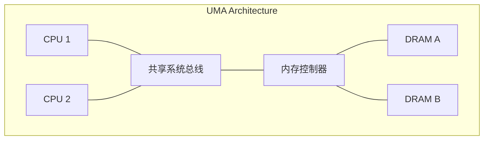
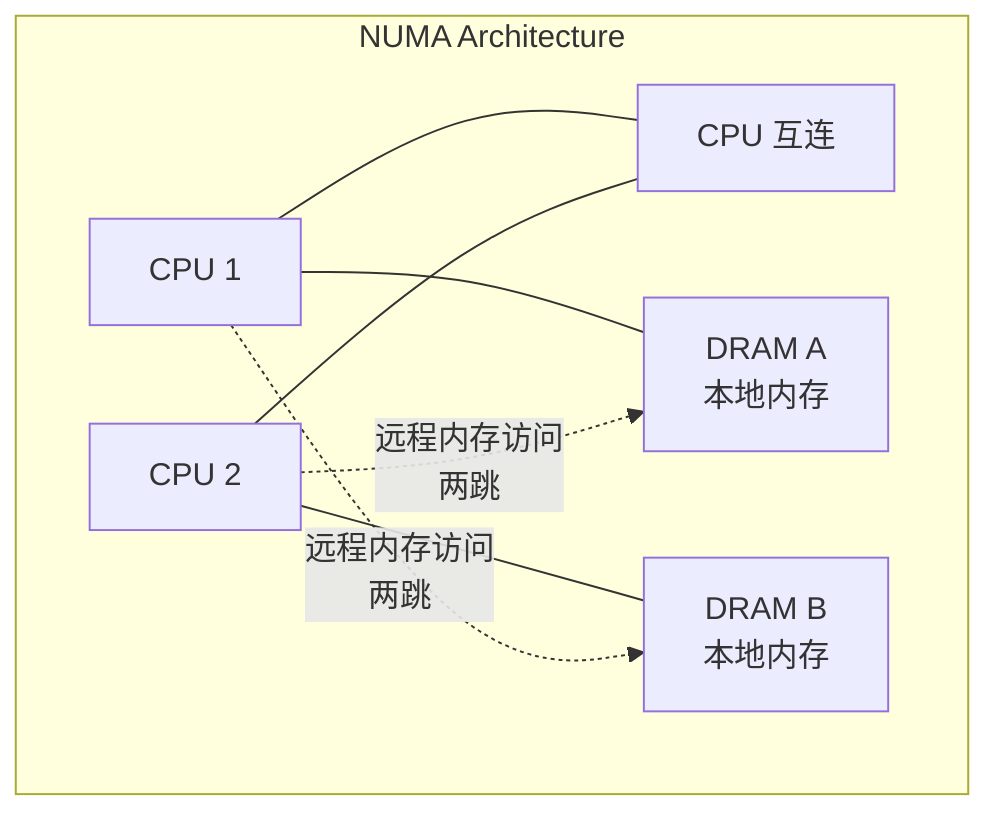
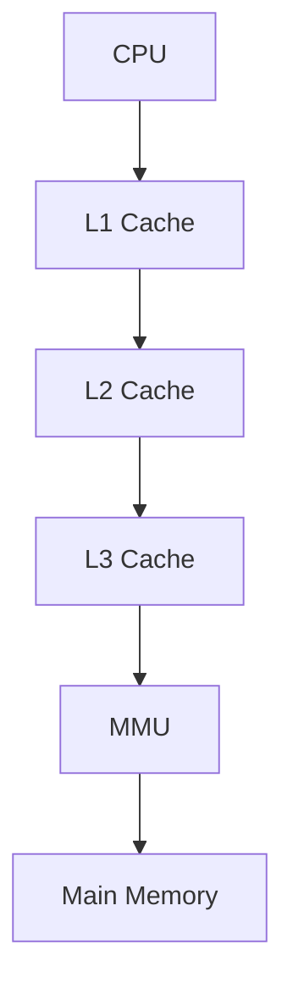
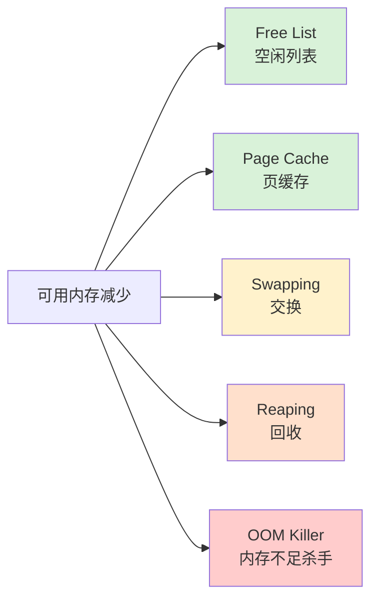
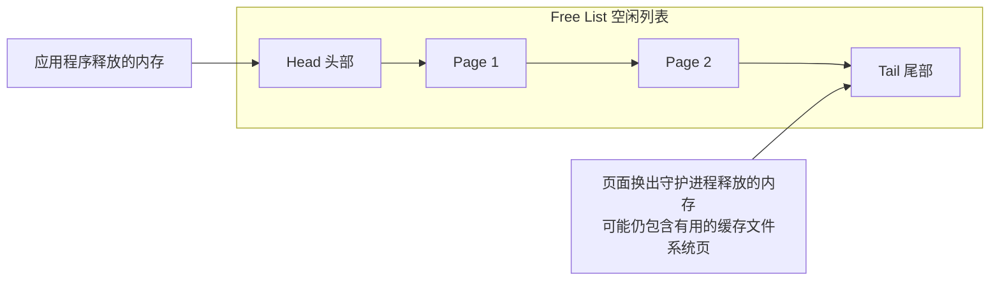
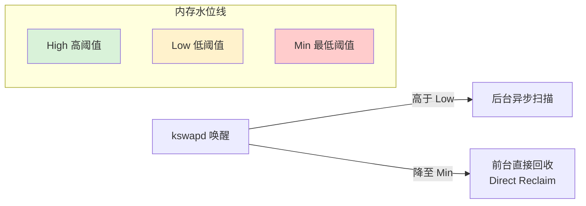
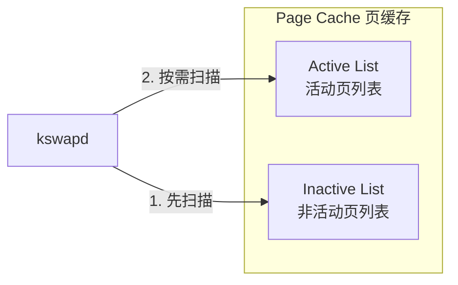

# 第7章 内存

系统主存储器存储应用程序和内核指令、它们的工作数据以及文件系统缓存。这些数据的辅助存储通常是存储设备——磁盘——其运行速度要慢几个数量级。一旦主存被填满，系统可能会开始在主存和存储设备之间交换数据。这是一个缓慢的过程，通常会成为系统瓶颈，极大地降低性能。系统也可能终止消耗内存最大的进程，从而导致应用程序中断。

其他需要考虑的性能因素包括分配和释放内存、复制内存以及管理内存地址空间映射的 CPU 开销。在多路架构（multisocket architectures）上，内存局部性（memory locality）也可能成为一个影响因素，因为连接到本地插槽的内存比远程插槽的内存具有更低的访问延迟。

本章的学习目标如下：

- 理解内存概念。
- 熟悉内存硬件内部结构。
- 熟悉内核和用户态分配器内部结构。
- 掌握 [[MMU]] 和 [[TLB]] 的工作知识。
- 遵循不同的内存分析方法论。
- 表征系统级和进程级的内存使用情况。
- 识别由可用内存不足引起的问题。
- 在进程地址空间和内核 [[Slab]] 中定位内存使用情况。
- 使用性能剖析器（profilers）、跟踪器（tracers）和火焰图（flame graphs）调查内存使用情况。
- 了解内存的可调参数。

本章分为五个部分，前三部分提供内存分析的基础，后两部分展示其在基于 Linux 系统上的实际应用。各部分内容如下：

- **背景知识**：介绍与内存相关的术语和关键内存性能概念。
- **架构**：提供硬件和软件内存架构的通用描述。
- **方法论**：解释性能分析方法论。
- **可观测性工具**：描述用于内存分析的性能工具。
- **调优**：解释调优及可调参数示例。

CPU 上的内存缓存（一级/二级/三级缓存，TLB）已在第6章 CPU 中介绍。

## 7.1 术语

作为参考，本章使用的与内存相关的术语包括以下内容：

- **主存**：也称为物理内存，描述计算机的快速数据存储区域，通常由 DRAM 提供。
- **虚拟内存**：对主存的抽象，它是（几乎）无限且非竞争的。虚拟内存不是真实的内存。
- **驻留内存**：当前驻留在主存中的内存。
- **匿名内存**：没有文件系统位置或路径名的内存。它包括进程地址空间的工作数据，称为堆。
- **地址空间**：一个内存上下文。每个进程和内核都有各自的虚拟地址空间。
- **段**：为特定目的而标记的虚拟内存区域，例如用于存储可执行页或可写页。
- **指令文本**：指内存中的 CPU 指令，通常位于一个段中。
- **OOM**：内存不足，当内核检测到可用内存较低时发生。
- **页**：操作系统和 CPU 使用的内存单位。历史上通常是 4 或 8 Kbytes。现代处理器支持多种更大的页面尺寸。
- **缺页**：无效的内存访问。在使用按需虚拟内存时，这些是正常发生的事件。
- **换页**：在主存和存储设备之间传输页面。
- **交换**：Linux 使用术语“交换”来指代到交换设备的匿名换页（交换页面的传输）。在 Unix 和其他操作系统中，交换是指在主存和交换设备之间传输整个进程。本书使用 Linux 版本的术语。
- **交换区**：用于分页匿名数据的磁盘区域。它可以是存储设备上的区域，也称为物理交换设备；也可以是文件系统文件，称为交换文件。一些工具使用术语“交换”来指代虚拟内存（这令人困惑且是不正确的）。

其他术语将在本章中陆续介绍。词汇表包含了供参考的基本术语，包括地址、缓冲区和 DRAM。另请参阅第2章和第3章中的术语部分。

## 7.2 概念

以下是关于内存和内存性能的重要概念选编。

### 7.2.1 虚拟内存

虚拟内存是一种抽象，为每个进程和内核提供其自己的大型、线性且私有的地址空间。它简化了软件开发，将物理内存的放置交由操作系统管理。它还支持多任务处理（虚拟地址空间在设计上是分离的）和过度提交（正在使用的内存可以超出主存）。虚拟内存已在第3章操作系统中的 3.2.8 虚拟内存一节中介绍。有关历史背景，请参阅 [Denning 70]。

图 7.1 显示了在带有交换设备（辅助存储）的系统上，虚拟内存对于进程的作用。图中展示了内存页，因为大多数虚拟内存实现都是基于页的。

> [!NOTE] 图 7.1 进程虚拟内存
> 以下 Mermaid 图展示了图 7.1 中进程虚拟内存与主存及交换设备之间的映射关系：
> 
> ```mermaid
> graph LR
>     subgraph Process ["进程虚拟地址空间"]
>         VP ["虚拟页"]
>     end
>     
>     subgraph SecondaryStorage ["辅助存储 (交换设备)"]
>         Swap ["交换页"]
>     end
> 
>     subgraph MainMemory ["主存 (物理内存)"]
>         Phys ["物理页"]
>     end
> 
>     VM["虚拟内存子系统"]
> 
>     VP -->|映射| VM
>     VM <-->|移动页面| MainMemory
>     VM <-->|移动页面| SecondaryStorage
> ```

进程地址空间由虚拟内存子系统映射到主存和物理交换设备。内存页可以根据需要由内核在它们之间移动，Linux 将此过程称为交换（而其他操作系统称为匿名换页）。这允许内核过度提交主存。

内核可能会对过度提交施加限制。常用的限制是主存大小加上物理交换设备的大小。内核可以使尝试超过此限制的分配失败。这种“虚拟内存不足”的错误乍一看可能令人困惑，因为虚拟内存本身是一种抽象资源。

Linux 还允许其他行为，包括对内存分配不设上限。这被称为[[过度提交]]（overcommit），将在接下来的关于换页和按需换页的章节之后进行描述，因为过度提交的运行需要依赖这些机制。

### 7.2.2 换页

换页是指页面移入和移出主存的过程，分别称为换入和换出。它最早由 Atlas 计算机于 1962 年引入 [Corbató 68]，它允许：

- 部分加载的程序执行
- 大于主存的程序执行
- 程序在主存和存储设备之间的高效移动

这些能力在今天依然适用。与早期将整个程序换出的技术不同，换页是一种管理和释放主存的细粒度方法，因为页面大小单位相对较小（例如，4 Kbytes）。

带有虚拟内存的换页（分页虚拟内存）通过 BSD 引入 Unix [Babaoglu 79] 并成为标准。

随着后来添加用于共享文件系统页面的页缓存（见第8章文件系统），出现了两种不同类型的换页：文件系统换页和匿名换页。

#### 文件系统换页

文件系统换页是由内存映射文件的读写页面引起的。对于使用文件内存映射（`mmap(2)`）的应用程序和使用页缓存的文件系统（大多数都使用；见第8章文件系统）来说，这是正常行为。它被称为“好”的换页 [McDougall 06a]。

当需要时，内核可以通过换出一些页面来释放内存。这就是术语变得有点棘手的地方：如果文件系统页在主存中被修改过（称为脏页），换出将需要将其写入磁盘。相反，如果文件系统页没有被修改（称为干净页），换出仅仅是为了立即重用而释放内存，因为磁盘上已经存在一个副本。因此，术语换出意味着页面被移出内存——这可能包括也可能不包括对存储设备的写入（您可能会在其他文本中看到对换出的不同定义）。

#### 匿名换页（交换）

匿名换页涉及进程私有的数据：进程堆和栈。它之所以被称为匿名，是因为它在操作系统中没有命名位置（即没有文件系统路径名）。匿名换出需要将数据移动到物理交换设备或交换文件。Linux 使用术语“交换”来指代这种类型的换页。

> [!WARNING] 性能影响
> 匿名换页会损害性能，因此被称为“坏”的换页 [McDougall 06a]。当应用程序访问已被换出的内存页时，它们会阻塞在将其读回主存所需的磁盘 I/O 上[^1]。这是一种匿名换入，它给应用程序引入了同步延迟。匿名换出可能不会直接影响应用程序性能，因为它们可以由内核异步执行。
> 
> 性能最好的情况是没有匿名换页（交换）。这可以通过配置应用程序使其保持在可用主存范围内，以及通过监控页面扫描、内存利用率和匿名换页来确保没有内存短缺的指标来实现。

[^1]: 如果使用更快的存储设备作为交换设备，例如延迟低于 10 μs 的 3D XPoint，交换可能不再是过去的“坏”换页，而是成为一种有意扩展主存的简单方法，且拥有成熟的内核支持。

### 7.2.3 按需换页

支持按需换页的操作系统（大多数都支持）在需求发生时才将虚拟内存页映射到物理内存，如图 7.2 所示。这将创建映射的 CPU 开销推迟到实际需要和访问时，而不是在首次分配内存范围时。

> [!NOTE] 图 7.2 缺页示例
> 以下 Mermaid 图展示了图 7.2 中按需换页及缺页处理的序列流程：
> 
> ```mermaid
> sequenceDiagram
>     participant App as 应用程序
>     participant Libc as C库 (malloc)
>     participant MMU as MMU
>     participant Kernel as 内核
>     participant Disk as 交换设备 (磁盘)
> 
>     App->>Libc: 1. malloc() 分配内存
>     Libc-->>App: 返回分配的虚拟内存
>     App->>App: 2. 执行存储指令 访问新分配内存
>     App->>MMU: 3. 虚拟到物理查找
>     MMU-->>App: 4. 查找失败 (缺页)
>     App->>Kernel: 触发缺页中断
>     Kernel->>Kernel: 5. 创建按需映射
>     Kernel-->>App: 映射建立，继续执行
>     Note over Kernel,Disk: 一段时间后...
>     Kernel->>Disk: 6. 内存页换出到交换设备以释放内存
> ```

图 7.2 中所示的序列以提供已分配内存的 `malloc()`（步骤 1）开始，然后是对该新分配内存的存储指令（步骤 2）。为了使 MMU 确定存储的主存位置，它对该内存页执行虚拟到物理的查找（步骤 3），该查找失败，因为尚不存在映射。这种失败被称为缺页（步骤 4），它触发内核创建按需映射（步骤 5）。一段时间后，该内存页可能被换出到交换设备以释放内存（步骤 6）。

在映射文件的情况下，步骤 2 也可以是加载指令，该文件应该包含数据但尚未映射到此进程地址空间。

> [!INFO] 缺页类型
> - **次要缺页**：如果映射可以由内存中的另一个页面满足，则称为次要缺页。这可能发生在从可用内存映射新页面时，在进程内存增长期间（如图所示）。它也可能发生在映射到另一个现有页面时，例如从映射的共享库中读取页面。
> - **主要缺页**：需要存储设备访问的缺页（此图中未显示），例如访问未缓存的内存映射文件，被称为主要缺页。

虚拟内存模型和按需分配的结果是，任何虚拟内存页都可能处于以下状态之一：

- **A. 未分配**
- **B. 已分配，但未映射**（未填充且尚未发生缺页异常）
- **C. 已分配，并映射到主存 (RAM)**
- **D. 已分配，并映射到物理交换设备 (磁盘)**

如果页面由于系统内存压力而被换出，则达到状态 (D)。从 (B) 到 (C) 的转换是缺页。如果它需要磁盘 I/O，则是主要缺页；否则，是次要缺页。

从这些状态中，还可以定义两个内存使用术语：

- **驻留集大小 (RSS)**：已分配的主存页面大小 (C)
- **虚拟内存大小**：所有已分配区域的大小 (B + C + D)

按需换页与分页虚拟内存一起通过 BSD 添加到 Unix 中。它已成为标准并被 Linux 使用。

# 7.1 内存：概念与架构

## 7.2.4 过度提交

Linux 支持过度提交的概念，该机制允许系统分配比其可能存储的容量更多的内存——即超过物理内存与交换设备容量之和。它依赖于按需换页以及应用程序通常不会大量使用其所分配内存的倾向。

在过度提交机制下，应用程序的内存请求（例如 `malloc(3)`）在原本会失败的情况下将会成功。应用程序程序员无需为了保持在虚拟内存限制内而保守地分配内存，而是可以慷慨地分配内存，随后再根据需求稀疏地使用它。

在 Linux 上，过度提交的行为可以通过可调参数进行配置。详情请参见第 7.6 节“调优”。过度提交的后果取决于内核如何管理内存压力；请参见第 7.3 节“架构”中关于 OOM killer 的讨论。

## 7.2.5 进程交换

进程交换是指在主内存与物理交换设备或交换文件之间移动整个进程。这是 Unix 管理主内存的原始技术，也是术语“交换”的由来 [Thompson 78]。

为了换出一个进程，其所有的私有数据都必须写入交换设备，包括进程堆（匿名数据）、其打开文件表以及其他仅在该进程处于活动状态时才需要的元数据。源自文件系统且未被修改的数据可以被丢弃，并在需要时再次从原始位置读取。

进程交换会严重损害性能，因为一个被换出的进程需要大量的磁盘 I/O 才能再次运行。在早期的 Unix 上，对于当时的机器（例如最大进程大小为 64 Kbytes 的 PDP-11）来说，这种做法更有意义 [Bach 86]。（现代系统允许以 Gbytes 为单位衡量的进程大小。）

> [!INFO] 历史背景
> 此描述仅作为历史背景提供。Linux 系统根本不进行进程交换，而是完全依赖换页。

## 7.2.6 文件系统缓存使用

系统启动后内存使用量增加是正常现象，因为操作系统会使用可用内存来缓存文件系统，从而提高性能。其原则是：如果有空闲的主内存，就将其用于有用的事情。这可能会让一些天真的用户感到恐慌，因为他们看到启动后不久可用空闲内存就缩减到接近零。但这并不会对应用程序造成问题，因为当应用程序需要时，内核应该能够快速从文件系统缓存中释放内存。

关于可能消耗主内存的各种文件系统缓存的更多信息，请参见第 8 章“文件系统”。

## 7.2.7 利用率与饱和度

主内存利用率可以计算为已使用内存与总内存的比率。文件系统缓存使用的内存可以视为未使用，因为它可供应用程序重用。

如果对内存的需求超过了主内存的容量，主内存就会达到饱和。此时，操作系统可能会通过采用换页、进程交换（如果支持）以及在 Linux 上的 OOM killer（稍后描述）来释放内存。这些活动中的任何一种都是主内存饱和的指标。

如果系统对愿意分配的虚拟内存量施加了限制（Linux 的过度提交则不然），虚拟内存也可以从容量的角度来研究其利用率。如果是这样，一旦虚拟内存耗尽，内核将使分配失败；例如，`malloc(3)` 会失败，并设置 `errno` 为 `ENOMEM`。

> [!NOTE] 术语注意
> 请注意，系统上当前可用的虚拟内存有时会被（令人困惑地）称为可用交换。

## 7.2.8 分配器

虽然虚拟内存处理物理内存的多任务，但虚拟地址空间内的实际分配和放置通常由分配器处理。这些分配器要么是用户态库，要么是基于内核的例程，它们为软件程序员提供了易于使用的内存使用接口（例如 `malloc(3)`、`free(3)`）。

分配器会对性能产生显著影响，并且一个系统可能会提供多个用户级分配器库以供选择。它们可以通过使用诸如每线程对象缓存等技术来提高性能，但如果分配变得碎片化和浪费，它们也会损害性能。具体示例将在第 7.3 节“架构”中介绍。

## 7.2.9 共享内存

内存可以在进程之间共享。这通常用于系统库，通过与所有使用它的进程共享其只读指令文本的单个副本来节省内存。

这给显示每个进程主内存使用情况的观测工具带来了困难。在报告进程的总内存大小时，是否应该包括共享内存？Linux 使用的一种技术是提供一个额外的度量，即比例集大小，它包括私有内存（非共享）加上共享内存除以共享用户数。请参见第 7.5.9 节“pmap”，了解可以显示 PSS 的工具。

## 7.2.10 工作集大小

工作集大小（WSS）是进程频繁使用以执行工作的主内存量。这是内存性能调优的一个有用概念：如果 WSS 能容纳在 CPU 缓存中而不是主内存中，性能将大大提高。此外，如果 WSS 超过了主内存大小，并且应用程序必须进行交换才能执行工作，性能将大幅下降。

虽然作为一个概念很有用，但在实践中很难测量：观测工具中没有 WSS 统计信息（它们通常报告 RSS，而不是 WSS）。第 7.4.10 节“内存收缩”描述了一种用于 WSS 估算的实验性方法，第 7.5.12 节“wss”展示了一个实验性的工作集大小估算工具 `wss(8)`。

## 7.2.11 字长

正如第 6 章“CPU”中所介绍的，处理器可能支持多种字长，例如 32 位和 64 位，允许为任一字长编译的软件运行。由于地址空间大小受限于字长可寻址的范围，因此需要超过 4 Gbytes 内存的应用程序对于 32 位地址空间来说太大了，需要编译为 64 位或更高。^2

根据内核和处理器的不同，部分地址空间可能保留给内核地址，应用程序无法使用。一个极端的例子是使用 32 位字长的 Windows，默认情况下为内核保留 2 Gbytes，留给应用程序的只有 2 Gbytes [Hall 09]。在 Linux 上（或启用了 `/3GB` 选项的 Windows 上），内核预留量为 1 Gbyte。使用 64 位字长时（如果处理器支持），地址空间要大得多，内核预留不应成为问题。

根据 CPU 架构的不同，使用更大的位宽也可以提高内存性能，因为指令可以操作更大的字长。在较大的位宽下，如果数据类型存在未使用的位，可能会浪费少量内存。

> [!TIP] 脚注说明
> ^2 x86 还有一种物理地址扩展（PAE）特性（权宜之计），允许 32 位处理器访问更大的内存范围（但不能在单个进程中实现）。

---

# 7.3 架构

本节介绍内存架构，包括硬件和软件，以及处理器和操作系统的细节。

这些主题已作为性能分析和调优的背景进行了总结。有关更多详细信息，请参阅本章末尾列出的供应商处理器手册和操作系统内部原理相关文献。

## 7.3.1 硬件

内存硬件包括主内存、总线、CPU 缓存和 MMU。

### 主内存

当今使用的主内存常见类型是动态随机存取存储器（DRAM）。这是一种易失性存储器——断电时其内容会丢失。DRAM 提供高密度存储，因为每个位仅使用两个逻辑组件实现：一个电容器和一个晶体管。电容器需要周期性刷新以维持电荷。

企业级服务器根据其用途配置不同容量的 DRAM，通常范围从 1 Gbyte 到 1 Tbyte 甚至更大。云计算实例通常较小，范围在 512 Mbytes 到 256 Gbytes 之间。^3 然而，云计算旨在将负载分散到实例池上，因此它们可以集体为分布式应用程序提供远超单机的 DRAM 容量，尽管这会带来高得多的[[缓存一致性|一致性]]成本。

> [!NOTE] 脚注说明
> ^3 例外情况包括 AWS EC2 高内存实例，其内存可达到 24 Tbytes [Amazon 20]。

### 延迟

主内存的访问时间可以用列地址选通脉冲延迟来衡量：从向内存模块发送所需地址（列）到数据可供读取之间的时间。这因内存类型而异（对于 DDR4，大约为 10 到 20ns [Crucial 18]）。对于内存 I/O 传输，对于内存总线（例如 64 位宽）传输一个缓存行（例如 64 字节宽），这种延迟可能会发生多次。CPU 和 MMU 在随后读取新可用数据时也会涉及其他延迟。读指令在从 CPU 缓存返回时可以避免这些延迟；如果处理器支持写回缓存（例如 Intel 处理器），写指令也可以避免这些延迟。

### 主内存架构

通用双处理器统一内存访问（UMA）系统的主内存架构示例如图 7.3 所示。

每个 CPU 通过共享的系统总线对所有内存具有统一的访问延迟。当由一个在所有处理器上统一运行的单个操作系统内核实例管理时，这也是一种对称多处理（SMP）架构。

*图 7.3 示例 UMA 主内存架构，双处理器*



作为对比，双处理器非统一内存访问（NUMA）系统的架构示例如图 7.4 所示，该架构使用了成为内存架构一部分的 CPU 互连。对于这种架构，主内存的访问时间因其相对于 CPU 的位置而异。

*图 7.4 示例 NUMA 主内存架构，双处理器*



CPU 1 可以通过其内存总线直接对 DRAM A 执行 I/O。这被称为本地内存。CPU 1 通过 CPU 2 和 CPU 互连（两跳）对 DRAM B 执行 I/O。这被称为远程内存，并具有较高的访问延迟。

连接到每个 CPU 的内存组被称为内存节点，或简称为节点。操作系统可以根据处理器提供的信息感知内存节点拓扑。这使得它能够基于内存局部性来分配内存和调度线程，尽可能优先使用本地内存以提高性能。

### 总线

主内存如何物理连接到系统取决于主内存架构，如前图所示。实际实现可能涉及 CPU 和内存之间的额外控制器和总线。主内存可以通过以下方式之一进行访问：

- **共享系统总线**：单处理器或多处理器，通过共享系统总线、内存桥接控制器，最后是内存总线。这如前面的 UMA 示例图 7.3 所示，以及第 6 章“CPU”中的 Intel 前端总线示例图 6.9 所示。该示例中的内存控制器是北桥。
- **直接连接**：单处理器，通过内存总线直接连接内存。
- **互连**：多处理器，每个处理器通过内存总线直接连接内存，处理器之间通过 CPU 互连连接。这如前面的 NUMA 示例图 7.4 所示；CPU 互连在第 6 章“CPU”中讨论。

> [!TIP] 故障排查提示
> 如果您怀疑您的系统不属于上述任何一种，请找到系统功能框图，并追踪 CPU 和内存之间的数据路径，记录沿途的所有组件。

# 7.1 内存：概念与架构

## 7.3 架构

### 7.3.1 硬件

#### DDR SDRAM

对于任何架构，内存总线的速度通常取决于处理器和系统主板支持的内存接口标准。自 1996 年以来广泛使用的一个通用标准是双倍数据速率同步动态随机存取存储器（DDR SDRAM）。术语“双倍数据速率”是指在时钟信号的上升沿和下降沿都传输数据（也称为双泵技术）。术语“同步”是指内存与 CPU 同步时钟驱动。

示例 DDR SDRAM 标准如表 7.1 所示。

**表 7.1 示例 DDR 带宽**

| 标准 | 规范年份 | 内存时钟 | 数据速率 | 峰值带宽 |
|---|---|---|---|---|
| DDR-200 | 2000 | 100 | 200 | 1,600 |
| DDR-333 | 2000 | 167 | 333 | 2,667 |
| DDR2-667 | 2003 | 167 | 667 | 5,333 |
| DDR2-800 | 2003 | 200 | 800 | 6,400 |
| DDR3-1333 | 2007 | 167 | 1,333 | 10,667 |
| DDR3-1600 | 2007 | 200 | 1,600 | 12,800 |
| DDR4-3200 | 2012 | 200 | 3,200 | 25,600 |
| DDR5-4800 | 2020 | 200 | 4,800 | 38,400 |
| DDR5-6400 | 2020 | 200 | 6,400 | 51,200 |

JEDEC 固态技术协会预计将在 2020 年期间发布 DDR5 标准。这些标准也使用“PC-”后跟以兆字节每秒为单位的数据传输速率来命名，例如 PC-1600。

#### 多通道

系统架构可能支持并行使用多条内存总线，以提高带宽。常见的倍数有双通道、三通道和四通道。例如，Intel Core i7 处理器支持高达四通道的 DDR3-1600，最大内存带宽为 51.2 Gbytes/s。

#### CPU 缓存

处理器通常包含片上硬件缓存以提高内存访问性能。缓存可能包含以下级别，速度递减而容量递增：

- **1 级（Level 1）：** 通常分为独立的指令缓存和数据缓存
- **2 级（Level 2）：** 同时缓存指令和数据
- **3 级（Level 3）：** 另一层更大的缓存

根据处理器的不同，1 级缓存通常由虚拟内存地址寻址，而 2 级及以后则由物理内存地址寻址。

这些缓存在第 6 章“CPU”中进行了更深入的讨论。另一种类型的硬件缓存，即 TLB，将在本章中讨论。

#### MMU

MMU（内存管理单元）负责虚拟到物理地址的转换。这些转换是按页进行的，页内的偏移量直接映射。MMU 在第 6 章“CPU”中，在靠近 CPU 缓存的上下文中已经介绍过。

通用的 MMU 如图 7.5 所示，包含了多级 CPU 缓存和主存。

**图 7.5 内存管理单元**



#### 多种页面大小

现代处理器支持多种页面大小，这允许操作系统和 MMU 使用不同的页面大小（例如 4 Kbytes、2 Mbytes、1 Gbyte）。Linux 的大页（huge pages）功能支持更大的页面大小，例如 2 Mbytes 或 1 Gbyte。

#### TLB

图 7.5 中所示的 MMU 使用 TLB（转换后备缓冲器）作为地址转换缓存的第一级，随后是主存中的页表。TLB 可以划分为指令页和数据页的独立缓存。

> [!NOTE] TLB 与页面大小
> 因为 TLB 用于映射的条目数量有限，使用更大的页面大小会增加可以从其缓存（其覆盖范围）转换的内存范围，从而减少 TLB 未命中并提高系统性能。TLB 可以进一步为这些页面大小分别划分为独立的缓存，从而提高在缓存中保留较大映射的概率。

作为 TLB 大小的一个例子，典型的 Intel Core i7 处理器提供了如表 7.2 所示的四个 TLB [Intel 19a]。

**表 7.2 典型 Intel Core i7 处理器的 TLB**

| 类型 | 页面大小 | 条目数 |
|---|---|---|
| 指令 | 4 K | 每线程 64，每核 128 |
| 指令 | 大页面 | 每线程 7 |
| 数据 | 4 K | 64 |
| 数据 | 大页面 | 32 |

该处理器有一级数据 TLB。Intel Core 微架构支持两级，类似于 CPU 提供多级主存缓存的方式。

TLB 的具体构成特定于处理器类型。有关处理器中 TLB 的详细信息及其操作的更多信息，请参阅供应商的处理器手册。

### 7.3.2 软件

用于内存管理的软件包括虚拟内存系统、地址转换、交换、分页和分配。与性能最相关的主题包含在本节中：释放内存、空闲列表、页面扫描、交换、进程地址空间和内存分配器。

#### 释放内存

当系统上的可用内存变低时，内核可以使用各种方法来释放内存，将其添加到页面的空闲列表中。针对 Linux，这些方法如图 7.6 所示，按可用内存减少时使用的一般顺序排列。

这些方法是：

- **空闲列表：** 未使用（也称为空闲内存）且可立即分配的页面列表。这通常实现为多个空闲页面列表，每个局部性组（NUMA）一个。
- **页缓存：** 文件系统缓存。一个名为 `swappiness` 的可调参数设置了系统应该倾向于从页缓存中释放内存而不是进行交换的程度。
- **交换：** 这是由页面换出守护进程（page-out daemon，kswapd）进行的分页，它查找最近未使用的页面以添加到空闲列表中，包括应用程序内存。这些页面被换出，这可能涉及写入基于文件系统的交换文件或交换设备。自然地，这仅在配置了交换文件或设备时才可用。
- **回收：** 当跨越低内存阈值时，可以指示内核模块和内核 slab 分配器立即释放任何可以轻松释放的内存。这也被称为收缩。
- **OOM killer：** 内存不足杀手将通过寻找并杀死牺牲进程来释放内存，该进程使用 `select_bad_process()` 找到，然后通过调用 `oom_kill_process()` 杀死。这可能会作为“Out of memory: Kill process”消息记录在系统日志（`/var/log/messages`）中。

**图 7.6 Linux 内存可用性管理**



> [!INFO] Linux swappiness 参数
> Linux 的 `swappiness` 参数控制是倾向于通过换出应用程序来释放内存，还是通过从页缓存中回收来释放内存。它是一个介于 0 和 100 之间的数字（默认值为 60），其中较高的值倾向于通过分页释放内存。控制这些内存释放技术之间的平衡，可以通过在换出冷应用程序内存的同时保留温暖的文件系统缓存来提高系统吞吐量 [Corbet 04]。

> [!WARNING] 没有配置交换空间的情况
> 如果没有配置交换设备或交换文件会发生什么也很有趣。这限制了虚拟内存的大小，因此如果禁用了过度提交，内存分配将更早失败。在 Linux 上，这也可能意味着会更快地使用 OOM killer。
> 
> 考虑一个存在无限内存增长问题的应用程序。有了交换空间，这很可能首先由于分页而成为性能问题，这是一个实时调试该问题的机会。没有交换空间，就没有分页的宽限期，因此应用程序要么遇到“内存不足”错误，要么被 OOM killer 终止。如果该问题仅在使用数小时后才出现，这可能会延迟调试。
> 
> 在 Netflix 云中，实例通常不使用交换空间，因此如果应用程序耗尽内存，就会被 OOM 杀死。应用程序分布在一个庞大的实例池中，一个实例被 OOM 杀死会导致流量立即重定向到其他健康的实例。这被认为比允许一个实例因为交换而运行缓慢更可取。

> [!NOTE] Cgroups 与内存释放
> 当使用内存 cgroups 时，可以使用与图 7.6 所示类似的方法来管理 cgroup 内存释放。系统可能有大量的空闲内存，但因为容器耗尽了其 cgroup 控制的限制而发生交换或遇到 OOM killer [Evans 17]。有关 cgroups 和容器的更多信息，请参见第 11 章“云计算”。

以下小节描述空闲列表、回收和页面换出守护进程。

#### 空闲列表

最初的 Unix 内存分配器使用内存图和首次适配扫描。随着 BSD 中分页虚拟内存的引入，添加了空闲列表和页面换出守护进程 [Babaoglu 79]。如图 7.7 所示的空闲列表，允许立即定位可用内存。

**图 7.7 空闲列表操作**



释放的内存被添加到列表的头部以供将来分配。由页面换出守护进程释放的内存——并且可能仍然包含有用的缓存文件系统页面——被添加到尾部。如果在对这些页面之一发生未来请求时，有用的页面尚未被重用，则可以回收该页面并将其从空闲列表中移除。

一种形式的空闲列表仍在基于 Linux 的系统中使用，如图 7.6 所示。空闲列表通常通过分配器消耗，例如用于内核的 slab 分配器和用于用户空间的 `libc malloc()`（它有自己的空闲列表）。这些分配器依次消耗页面，然后通过其分配器 API 暴露它们。

Linux 使用伙伴分配器来管理页面。这为不同大小的内存分配提供了多个空闲列表，遵循 2 的幂次方案。术语“伙伴”是指寻找空闲内存的相邻页面，以便它们可以一起分配。有关历史背景，请参见 [Peterson 77]。

伙伴空闲列表位于以下层次结构的底部，从每个内存节点的 `pg_data_t` 开始：

- **节点：** 内存库，NUMA 感知
- **区域：** 用于特定目的的内存范围（直接内存访问 [DMA]，4 常规，高端内存）
- **迁移类型：** 不可移动、可回收、可移动等
- **大小：** 2 的幂次方数量的页面

> [!TIP] ZONE_DMA 状态
> 4 尽管 `ZONE_DMA` 可能会被移除 [Corbet 18a]。

在节点空闲列表内分配可改善内存局部性和性能。对于最常见的分配——单页面，伙伴分配器为每个 CPU 保留单页面列表，以减少 CPU 锁争用。

#### 回收

回收主要涉及从内核 slab 分配器缓存中释放内存。这些缓存包含 slab 大小块中未使用的内存，准备好被重用。回收将这些内存返回给系统用于页面分配。

在 Linux 上，内核模块也可以调用 `register_shrinker()` 来注册特定函数以回收它们自己的内存。

#### 页面扫描

通过分页释放内存由内核页面换出守护进程管理。当空闲列表中的可用主存降至阈值以下时，页面换出守护进程开始页面扫描。页面扫描仅在需要时发生。正常平衡的系统可能不经常进行页面扫描，并且可能仅以短脉冲形式进行。

在 Linux 上，页面换出守护进程称为 `kswapd`，它扫描非活动和活动内存的 LRU 页面列表以释放页面。它是基于空闲内存和两个提供滞回作用的阈值被唤醒的，如图 7.8 所示。

**图 7.8 kswapd 唤醒和模式**



一旦空闲内存达到最低阈值，`kswapd` 就会在前台运行，在请求内存页面时同步释放它们，这种方法有时被称为直接回收 [Gorman 04]。这个最低阈值是可调的（`vm.min_free_kbytes`），其他阈值基于它进行缩放（低水位线乘以 2 倍，高水位线乘以 3 倍）。对于分配突发率高且超过 `kswap` 回收速度的工作负载，Linux 提供了额外的可调参数以实现更积极的扫描：`vm.watermark_scale_factor` 和 `vm.watermark_boost_factor`：参见 7.6.1 节“可调参数”。

页缓存有针对非活动页和活动页的单独列表。它们以 LRU 方式运作，允许 `kswapd` 快速找到空闲页面。它们如图 7.9 所示。

**图 7.9 kswapd 列表**



`kswapd` 首先扫描非活动列表，然后如果需要，再扫描活动列表。术语“扫描”是指在遍历列表时检查页面：如果页面被锁定/脏，则可能不符合释放条件。`kswapd` 所用的术语“扫描”与原始 UNIX 页面换出守护进程所做的扫描具有不同的含义，后者扫描整个内存。

# 7.1 内存：概念与架构

### 7.3.3 进程虚拟地址空间

进程虚拟地址空间由硬件和软件共同管理，它是一系列根据需要映射到物理页面的虚拟页面范围。这些地址被划分为称为**段**的区域，用于存储线程栈、进程可执行文件、库和堆。图 7.10 展示了 Linux 上 32 位进程的示例，包括 x86 和 SPARC 处理器的情况。

在 SPARC 上，内核驻留在一个独立的完整地址空间中（图 7.10 中未显示）。请注意，在 SPARC 上，仅凭指针值是无法区分用户地址和内核地址的；而 x86 采用了不同的方案，其用户地址和内核地址是不重叠的。^5^

程序可执行段包含独立的文本段和数据段。库也由独立的可执行文本段和数据段组成。这些不同的段类型如下：

- **可执行文本**：包含进程的可执行 CPU 指令。这是从文件系统上二进制程序的文本段映射而来的。它是只读的，并具有执行权限。
- **可执行数据**：包含从二进制程序的数据段映射而来的已初始化变量。它具有读/写权限，以便在程序运行时可以修改变量。它还有一个私有标志，使得修改不会刷写到磁盘。
- **堆**：这是程序的工作内存，属于匿名内存（没有文件系统位置）。它会根据需要增长，并通过 `malloc(3)` 进行分配。
- **栈**：运行中线程的栈，映射为可读/写。

> [!NOTE] 脚注 5
> 请注意，对于 64 位地址，处理器可能不支持完整的 64 位范围：AMD 规范允许实现仅支持 48 位地址，其中未使用的高位被设置为最后一位的值：这创建了两个可用的地址范围，称为规范地址，即 `0` 到 `0x00007fffffffffff`（用于用户空间），以及 `0xffff800000000000` 到 `0xffffffffffffffff`（用于内核空间）。这就是为什么 x86 内核地址以 `0xffff` 开头的原因。

---

**图 7.10 示例进程虚拟内存地址空间**


*（注：上图仅为 x86 架构下进程虚拟内存地址空间的概念性展示，展示了从低地址的文本段到高地址的内核空间的典型布局。）*

---

库的文本段可以被使用相同库的其他进程共享，而每个进程都拥有该库数据段的私有副本。

#### 堆的增长

一个常见的令人困惑的问题是堆的无尽增长。这是内存泄漏吗？对于简单的分配器，`free(3)` 并不会将内存归还给操作系统；相反，内存会被保留以服务于未来的分配。这意味着进程的常驻内存只能增长，这是正常现象。进程减少系统内存使用的方法包括：

- **重新执行**：调用 `execve(2)` 从一个空的地址空间重新开始
- **内存映射**：使用 `mmap(2)` 和 `munmap(2)`，这会将内存归还给系统

内存映射文件将在第 8 章“文件系统”的第 8.3.10 节“内存映射文件”中描述。

Linux 上常用的 Glibc 是一个高级分配器，它支持 `mmap` 操作模式，以及一个用于向系统释放空闲内存的 `malloc_trim(3)` 函数。当堆顶的空闲内存变得足够大时^6^，`free(3)` 会自动调用 `malloc_trim(3)`，并通过 `sbrk(2)` 系统调用释放内存。

> [!NOTE] 脚注 6
> 大于 `M_TRIM_THRESHOLD` `mallopt(3)` 参数，该参数默认为 128 KB。

#### 分配器

用于内存分配的用户级和内核级分配器有多种。图 7.11 展示了分配器的作用，包括一些常见的类型。

---

**图 7.11 用户级和内核级内存分配器**


*（注：上图展示了从用户应用程序通过用户级分配器、系统调用、内核级分配器、页面分配器最终到达硬件物理内存的层次关系。）*

---

页面管理已在前面第 7.3.2 节“软件”中的“空闲链表”部分做过描述。

内存分配器的特性可以包括：

- **简单的 API**：例如 `malloc(3)`、`free(3)`。
- **高效的内存使用**：在为各种大小的内存分配提供服务时，内存使用可能会变得碎片化，即存在许多浪费内存的未使用区域。分配器可以努力合并这些未使用的区域，以便更大的分配可以利用它们，从而提高效率。
- **性能**：内存分配可能非常频繁，而在多线程环境中，由于同步原语的竞争，它们的性能可能会很差。分配器可以设计为尽量少用锁，也可以利用每线程或每 CPU 缓存来改善内存局部性。
- **可观测性**：分配器可以提供统计信息和调试模式，以显示其使用情况以及哪些代码路径负责分配。

以下各节将描述内核级分配器——slab 和 SLUB，以及用户级分配器——glibc、TCMalloc 和 jemalloc。

##### Slab

内核 slab 分配器管理特定大小对象的缓存，允许它们被快速回收，而无需页面分配的开销。这对内核分配特别有效，因为内核分配通常是针对固定大小的结构体。

作为一个内核示例，以下两行来自 ZFS 的 `arc.c`^7^：

```c
df = kmem_alloc(sizeof (l2arc_data_free_t), KM_SLEEP);          
head = kmem_cache_alloc(hdr_cache, KM_PUSHPAGE);                        
```

> [!NOTE] 脚注 7
> 这些能作为例子被想起的唯一原因是我开发了这些代码。

第一行 `kmem_alloc()` 展示了传统风格的内核分配，其大小作为参数传递。内核根据该大小将其映射到一个 slab 缓存（非常大的大小由超大方区域以不同方式处理）。第二行 `kmem_cache_alloc()` 直接操作自定义的 slab 分配器缓存，在这个例子中是 `(kmem_cache_t *)hdr_cache`。

slab 分配器最初是为 Solaris 2.4 开发的 [Bonwick 94]，后来通过称为 **magazine**（弹匣）的每 CPU 缓存进行了增强 [Bonwick 01]：

> 我们的基本方法是给每个 CPU 一个包含 M 个对象的缓存，称为“弹匣”，这与自动武器的弹匣类比。每个 CPU 的弹匣可以满足 M 次分配，之后 CPU 才需要重新装填——即，用满弹匣交换其空弹匣。

除了高性能之外，原始的 slab 分配器还具有调试和分析功能，包括用于跟踪分配细节和栈跟踪的审计功能。

Slab 分配已被各种操作系统采用。BSD 有一个称为通用内存分配器（UMA）的内核 slab 分配器，它既高效又对 NUMA 敏感。Linux 也在 2.2 版本中引入了 slab 分配器，多年来它一直是默认选项。Linux 后来转向将 SLUB 作为一个选项或默认设置。

##### SLUB

Linux 内核 SLUB 分配器基于 slab 分配器，旨在解决各种问题，特别是 slab 分配器的复杂性问题。改进包括移除了对象队列和每 CPU 缓存——将 NUMA 优化留给了页面分配器（参见前面的“空闲链表”部分）。

SLUB 分配器在 Linux 2.6.23 中成为默认选项 [Lameter 07]。

##### glibc

用户级的 GNU libc 分配器基于 Doug Lea 的 dlmalloc。其行为取决于分配请求的大小。小型分配由内存箱提供服务，这些箱包含相似大小的单元，可以使用类似伙伴系统的算法进行合并。较大的分配可以使用树查找来高效地寻找空间。非常大的分配则切换为使用 `mmap(2)`。最终的结果是一个得益于多种分配策略的高性能分配器。

##### TCMalloc

TCMalloc 是用户级的线程缓存 malloc，它使用每线程缓存来处理小型分配，从而减少了锁竞争并提高了性能 [Ghemawat 07]。定期的垃圾回收会将内存迁移回中央堆以供分配。

##### jemalloc

libjemalloc 最初是作为 FreeBSD 的用户级 libc 分配器出现的，现在也可用于 Linux。它使用多种技术，如多arena、每线程缓存和小对象 slab，以提高可扩展性并减少内存碎片。它可以同时使用 `mmap(2)` 和 `sbrk(2)` 来获取系统内存，但更倾向于使用 `mmap(2)`。Facebook 使用 jemalloc，并添加了性能分析和其他优化 [Facebook 11]。