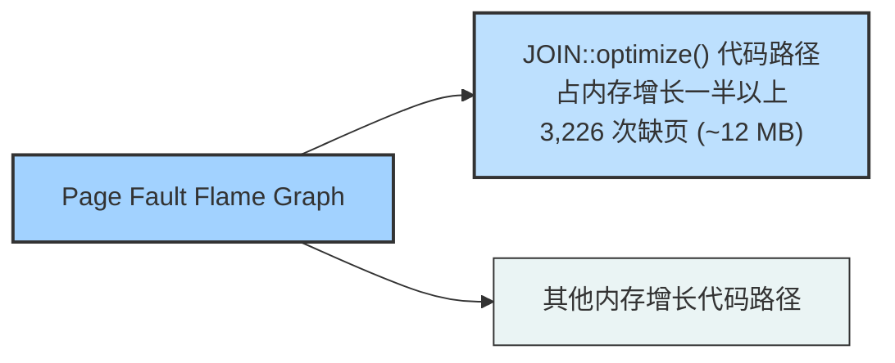

# 7.2 内存：方法、工具与调优

## 7.4 方法论

本节介绍用于内存分析和调优的各种方法论和实践练习。这些主题总结在表 7.3 中。

**表 7.3 内存性能方法论**

| 小节 | 方法论 | 类型 |
| :--- | :--- | :--- |
| 7.4.1 | 工具法 | 观测分析 |
| 7.4.2 | USE 方法 | 观测分析 |
| 7.4.3 | 使用特征刻画 | 观测分析，容量规划 |
| 7.4.4 | 周期分析 | 观测分析 |
| 7.4.5 | 性能监控 | 观测分析，容量规划 |
| 7.4.6 | 泄漏检测 | 观测分析 |
| 7.4.7 | 静态性能调优 | 观测分析，容量规划 |
| 7.4.8 | 资源控制 | 调优 |
| 7.4.9 | 微基准测试 | 实验分析 |
| 7.4.10 | 内存收缩 | 实验分析 |

> [!INFO] 参考
> 更多策略以及其中许多方法的介绍，请参见第 2 章，方法论。

这些方法可以单独遵循，也可以组合使用。在排查内存问题时，我的建议是按以下顺序从这些策略开始：性能监控、USE 方法和使用特征刻画。

第 7.5 节，可观测性工具，展示了应用这些方法的操作系统工具。

### 7.4.1 工具法

工具法是一个遍历可用工具并检查它们提供的关键指标的过程。这是一种简单的方法论，可能会忽略那些你碰巧可用的工具无法提供良好可见性或完全没有可见性的问题，并且执行起来可能很耗时。

对于内存，在 Linux 上，工具法可以包括检查以下内容：

- **页面扫描**：寻找持续的页面扫描（超过 10 秒）作为内存压力的标志。这可以使用 `sar -B` 并检查 `pgscan` 列来完成。
- **压力失速信息**：执行 `cat /proc/pressure/memory`（Linux 4.20+）以检查内存压力（饱和度）统计数据及其随时间变化的情况。
- **交换**：如果配置了交换空间，内存页的换出换入（Linux 对 swapping 的定义）是系统内存不足的进一步指示。你可以使用 `vmstat(8)` 并检查 `si` 和 `so` 列。
- **vmstat**：运行 `vmstat 1` 并检查 `free` 列以查看可用内存。
- **OOM killer**：这些事件可以在系统日志 `/var/log/messages` 中看到，或者从 `dmesg(1)` 中看到。搜索 “Out of memory”。
- **top**：查看哪些进程和用户是物理内存（常驻）和虚拟内存的最大消费者（有关列的名称，请参见手册页，因版本而异）。`top(1)` 也会汇总可用内存。
- **perf(1)/BCC/bpftrace**：通过栈跟踪追踪内存分配，以识别内存使用的原因。请注意，这可能会产生相当大的开销。一种开销较低但较粗略的解决方案是执行 CPU 性能分析（定时栈采样）并搜索分配代码路径。

> [!TIP] 延伸阅读
> 有关每个工具的更多信息，请参见第 7.5 节，可观测性工具。

### 7.4.2 USE 方法

USE 方法用于在性能调查的早期，在采用更深入、更耗时的策略之前，识别所有组件的瓶颈和错误。

在系统范围内检查：

- **利用率**：有多少内存正在使用，有多少可用。物理内存和虚拟内存都应该被检查。
- **饱和度**：为缓解内存压力而执行的页面扫描、换页、交换以及 Linux OOM killer 牺牲的程度。
- **错误**：软件或硬件错误。

你可能希望首先检查饱和度，因为持续的饱和度是内存问题的标志。这些指标通常很容易从操作系统工具中获得，包括用于交换统计的 `vmstat(8)` 和 `sar(1)`，以及用于 OOM killer 牺牲的 `dmesg(1)`。对于配置了独立磁盘交换设备的系统，到交换设备的任何活动都是内存压力的另一个标志。Linux 还将内存饱和度统计信息作为压力失速信息 (PSI) 的一部分提供。

> [!WARNING] 注意
> 不同的工具对物理内存利用率的报告可能有所不同，这取决于它们是否将未引用的文件系统缓存页或非活动页计算在内。一个系统可能报告它只有 10 MB 的可用内存，而实际上它有 10 GB 的文件系统缓存，在需要时应用程序可以立即回收这些缓存。请检查工具文档以查看包含了哪些内容。

虚拟内存利用率也可能需要检查，这取决于系统是否执行内存过量使用。对于不执行过量使用的系统，一旦虚拟内存耗尽，内存分配将失败——这是一种内存错误。

内存错误可能由软件引起，例如内存分配失败或 Linux OOM killer，也可能由硬件引起，例如 ECC 错误。从历史上看，内存分配错误一直留给应用程序报告，尽管并非所有应用程序都会这样做（而且，在 Linux 过量使用的情况下，开发人员可能认为没有必要）。硬件错误也很难诊断。当使用 ECC 内存时，一些工具可以报告 ECC 可纠正错误（例如，在 Linux 上，`dmidecode(8)`、`edac-utils`、`ipmitool sel`）。这些可纠正的错误可以用作 USE 方法的错误指标，并且可能预示着即将发生不可纠正的错误。对于实际（不可纠正）的内存错误，你可能会经历任意应用程序无法解释、无法重现的崩溃（包括段错误和总线错误信号）。

对于实施内存限制或配额（资源控制）的环境，如某些云计算环境，内存利用率和饱和度可能需要以不同的方式测量。你的操作系统实例可能已经达到了其软件内存限制并正在交换，即使主机上有大量可用的物理内存。请参阅第 11 章，云计算。

### 7.4.3 使用特征刻画

刻画内存使用情况是容量规划、基准测试和工作负载模拟时的一项重要实践。它也可以通过发现和纠正错误配置带来一些最大的性能提升。例如，数据库缓存可能配置得太小而导致命中率低，或者配置得太大而导致系统换页。

对于内存，使用特征刻画涉及识别内存在哪里被使用以及使用了多少：

- 系统范围的物理和虚拟内存利用率
- 饱和度：交换和 OOM 杀死
- 内核和文件系统缓存内存使用情况
- 每个进程的物理和虚拟内存使用情况
- 内存资源控制的使用情况（如果存在）

这个示例描述展示了如何将这些属性表达在一起：

> [!EXAMPLE] 使用特征刻画示例
> 该系统有 256 GB 主存，其中 1% 被进程使用（利用），30% 在文件系统缓存中。最大的进程是一个数据库，消耗了 2 GB 主存 (RSS)，这是它从先前迁移过来的系统继承的配置限制。

随着更多的内存被用于缓存工作数据，这些特征可能会随时间而变化。除了常规的缓存增长外，内核或应用程序内存也可能由于内存泄漏（一种软件错误）而随时间不断增长。

#### 高级使用分析/检查清单

此处列出了额外的特征作为需要考虑的问题，这在深入研究内存问题时也可以作为检查清单：

- 应用程序的[[工作集大小]] (WSS) 是多少？
- 内核内存用在了哪里？按 [[Slab]] 分配器分列？
- 文件系统缓存中有多少是活动的，多少是非活动的？
- 进程内存用在了哪里（指令、缓存、缓冲区、对象等）？
- 进程为什么分配内存（调用路径）？
- 内核为什么分配内存（调用路径）？
- 进程库映射是否有异常（例如，随时间变化）？
- 哪些进程正在被积极换出？
- 哪些进程先前已被换出？
- 进程或内核是否有内存泄漏？
- 在 [[NUMA]] 系统中，内存跨内存节点的分布情况如何？
- [[IPC]] 和内存停顿周期率是多少？
- 内存总线的负载均衡情况如何？
- 执行了多少本地内存 I/O，相对地，执行了多少远程内存 I/O？

> [!INFO] 参考
> 接下来的小节可以帮助回答其中一些问题。有关此方法论和要测量的特征（谁、为什么、什么、如何）的更高级别总结，请参见第 2 章，方法论。

### 7.4.4 周期分析

内存总线负载可以通过检查 CPU 性能监控计数器 ([[PMC|PMCs]]) 来确定，这些计数器可以编程为计算内存停顿周期、内存总线使用情况等。一个可以入手的指标是每周期指令数 ([[IPC]])，它反映了 CPU 负载对内存的依赖程度。请参阅第 6 章，CPU。

### 7.4.5 性能监控

性能监控可以识别随时间变化的活动问题和行为模式。内存的关键指标是：

- **利用率**：使用百分比，这可以从可用内存推断出来
- **饱和度**：交换、OOM 杀死

对于实施内存限制或配额（资源控制）的环境，可能还需要收集与施加的限制相关的统计数据。

错误也可以被监控（如果可用），如第 7.4.2 节 USE 方法中结合利用率和饱和度所描述的那样。

随时间监控内存使用情况，特别是按进程监控，可以帮助识别内存泄漏的存在和泄漏速率。

### 7.4.6 泄漏检测

当应用程序或内核模块无休止地增长，从空闲列表、文件系统缓存以及最终从其他进程消耗内存时，就会出现这种问题。这可能首先被注意到，因为系统开始交换或某个应用程序被 OOM 杀死，以响应无休止的内存压力。

这种类型的问题由以下两种原因之一引起：

- **内存泄漏**：一种软件缺陷，即内存不再使用但从未被释放。这可以通过修改软件代码，或通过应用补丁或升级（修改代码）来修复。
- **内存增长**：软件正常消耗内存，但速率远高于系统所期望的。这可以通过更改软件配置，或由软件开发人员更改应用程序消耗内存的方式来修复。

> [!WARNING] 常见误判
> 内存增长问题经常被误认为是内存泄漏。首先要问的问题是：**它本该这样吗？** 检查内存使用情况、应用程序的配置及其分配器的行为。应用程序可能被配置为填充内存缓存，而观察到的增长可能只是缓存预热。

如何分析内存泄漏取决于软件和语言类型。一些分配器提供调试模式来记录分配细节，然后可以对这些细节进行事后分析以识别负责的调用路径。一些运行时有执行堆转储分析的方法，以及其他用于内存泄漏调查的工具。

Linux BCC 跟踪工具包括用于增长和泄漏分析的 `memleak(8)`：它跟踪分配并记录那些在某个时间间隔内未被释放的分配，以及分配代码路径。它无法判断这些是泄漏还是正常增长，因此你的任务是分析代码路径以确定是哪种情况。（请注意，该工具在分配率高的情况下也会产生很高的开销。）BCC 将在第 15 章 BPF 的第 15.1 节 BCC 中介绍。

# 7.2 内存：方法、工具与调优

## 7.4.7 静态性能调优

静态性能调优侧重于已配置环境的问题。对于内存性能，请检查静态配置的以下方面：

- 总共有多少主存？
- 应用程序配置使用了多少内存（它们自身的配置）？
- 应用程序使用了哪些内存分配器？
- 主存的速度是多少？是否是可用的最快类型（DDR5）？
- 主存是否经过全面测试（例如，使用 Linux 的 `memtester`）？
- 系统架构是什么？[[NUMA]] 还是 [[UMA]]？
- 操作系统是否感知 NUMA？是否提供了 NUMA 调优参数？
- 内存是连接在同一个 CPU 插槽上，还是分布在多个插槽上？
- 存在多少条内存总线？
- CPU 缓存的数量和大小是多少？[[TLB]] 呢？
- BIOS 设置是什么？
- 是否配置并使用了大页？
- 是否可用并配置了内存过度提交？
- 正在使用哪些其他的系统内存调优参数？
- 是否存在软件施加的内存限制（资源控制）？

> [!TIP] 静态调优的核心价值
> 回答这些问题可能会揭示出之前被忽略的配置选择。

## 7.4.8 资源控制

操作系统可能提供精细化的控制，用于为进程或进程组分配内存。这些控制可能包括对主存和虚拟内存使用量的固定限制。它们的具体工作方式取决于实现，将在第 7.6 节“调优”和第 11 章“云计算”中讨论。

## 7.4.9 微基准测试

微基准测试（Micro-Benchmarking）可用于确定主存的速度以及 CPU 缓存和缓存行大小等特征。在分析系统之间的差异时，这可能会很有帮助，因为根据应用程序和工作负载的不同，内存访问速度对性能的影响可能比 CPU 时钟速度更大。

在第 6 章“CPU”中，CPU 缓存下的延迟部分（第 6.4.1 节“硬件”）展示了通过对内存访问延迟进行微基准测试来确定 CPU 缓存特征的结果。

## 7.4.10 内存收缩

这是一种使用负面实验的[[工作集大小]]（WSS）估计方法，需要配置交换设备才能执行该实验。应用程序可用的主存被逐步减少，同时测量性能和交换情况：性能急剧下降且交换大幅增加的临界点，表明 WSS 已经无法容纳在可用内存中。

> [!WARNING] 生产环境慎用
> 虽然值得将其作为负面实验的例子提及，但不建议在生产环境中使用，因为它会故意损害性能。有关其他 WSS 估计技术，请参阅第 7.5.12 节 `wss` 中的实验性 `wss(8)` 工具，以及我关于 WSS 估计的网站 [Gregg 18c]。

## 7.5 可观测性工具

本节介绍基于 Linux 操作系统的内存可观测性工具。使用这些工具时应遵循的方法论请参见上一节。

本节介绍的工具如表 7.4 所示。

**表 7.4 Linux 内存可观测性工具**

| 小节 | 工具 | 描述 |
| :--- | :--- | :--- |
| 7.5.1 | `vmstat` | 虚拟和物理内存统计信息 |
| 7.5.2 | PSI | 内存压力失速信息 |
| 7.5.3 | `swapon` | 交换设备使用情况 |
| 7.5.4 | `sar` | 历史统计信息 |
| 7.5.5 | `slabtop` | 内核 Slab 分配器统计信息 |
| 7.5.6 | `numastat` | NUMA 统计信息 |
| 7.5.7 | `ps` | 进程状态 |
| 7.5.8 | `top` | 监控每个进程的内存使用情况 |
| 7.5.9 | `pmap` | 进程地址空间统计信息 |
| 7.5.10 | `perf` | 内存 PMC 和跟踪点分析 |
| 7.5.11 | `drsnoop` | 直接回收追踪 |
| 7.5.12 | `wss` | 工作集大小估计 |
| 7.5.13 | `bpftrace` | 用于内存分析的跟踪程序 |

> [!INFO] 工具选择说明
> 这是一组旨在支持第 7.4 节“方法论”的工具和功能选择。我们将从系统级内存使用统计工具开始，然后深入到每进程和分配跟踪。一些传统工具可能也可用于其他类 Unix 操作系统（它们的发源地），包括：`vmstat(8)`、`sar(1)`、`ps(1)`、`top(1)` 和 `pmap(1)`。`drsnoop(8)` 是来自 BCC 的 BPF 工具（第 15 章）。
> 
> 请参阅每个工具的文档（包括其 man 手册页），以获取有关其功能的完整参考。

### 7.5.1 vmstat

虚拟内存统计命令 `vmstat(8)` 提供了系统内存健康状况的高级视图，包括当前的空闲内存和分页统计信息。其中也包括 CPU 统计信息，如第 6 章“CPU”所述。

当 Bill Joy 和 Ozalp Babaoglu 于 1979 年为 BSD 引入该命令时，原始的 man 手册页中包含这样一句话：

> **缺陷 (BUGS)**：打印出来的数字太多了，以至于有时很难弄清楚该看什么。

以下是 Linux 版本的示例输出：

```bash
$ vmstat 1
procs -----------memory---------- ---swap-- -----io---- -system-- ----cpu----
 r  b   swpd   free   buff  cache   si   so    bi    bo   in   cs us sy id wa
 4  0      0 34454064 111516 13438596   0   0    0    5    2    0  0  0 100  0
 4  0      0 34455208 111516 13438596   0   0    0    0 2262 15303 16 12 73  0
 5  0      0 34455588 111516 13438596   0   0    0    0 1961 15221 15 11 74  0
 4  0      0 34456300 111516 13438596   0   0    0    0 2343 15294 15 11 73  0
[...]
```

此版本的 `vmstat(8)` 不会在输出的第一行打印自启动以来的摘要值（对于 procs 或 memory 列），而是立即显示当前状态。各列默认以千字节为单位，含义如下：

- **swpd**：换出的内存量
- **free**：空闲可用内存
- **buff**：缓冲区缓存中的内存
- **cache**：页缓存中的内存
- **si**：换入的内存（分页）
- **so**：换出的内存（分页）

> [!NOTE] 缓存与空闲内存
> 缓冲区缓存和页缓存在第 8 章“文件系统”中有所描述。系统启动后空闲内存下降并被这些缓存使用以提高性能是正常现象。在需要时，这些内存可以被释放供应用程序使用。

如果 `si` 和 `so` 列持续非零，说明系统正处于内存压力之下，并正在向交换设备或文件进行交换（参见 `swapon(8)`）。可以使用其他工具，包括按进程显示内存的工具（例如 `top(1)`、`ps(1)`），来调查是什么消耗了内存。

在具有大量内存的系统上，各列可能会变得不对齐，有点难以阅读。您可以尝试使用 `-S` 选项将输出单位更改为兆字节（使用 `m` 表示 1000000，使用 `M` 表示 1048576）：

```bash
$ vmstat -Sm 1
procs -----------memory---------- ---swap-- -----io---- -system-- ----cpu----
 r  b   swpd   free   buff  cache   si   so    bi    bo   in   cs us sy id wa
 4  0      0  35280    114  13761    0    0     0     5    2    1  0  0 100  0
 4  0      0  35281    114  13761    0    0     0     0 2027 15146 16 13 70  0
[...]
```

还有一个 `-a` 选项，用于打印页缓存中非活跃和活跃内存的细分情况：

```bash
$ vmstat -a 1
procs -----------memory---------- ---swap-- -----io---- -system-- ----cpu----
 r  b   swpd   free  inact active   si   so    bi    bo   in   cs us sy id wa
 5  0      0 34453536 10358040 3201540   0   0    0    5    2    0  0  0 100  0
 4  0      0 34453228 10358040 3200648   0   0    0    0 2464 15261 16 12 71  0
[...]
```

这些内存统计信息可以使用小写的 `-s` 选项以列表形式打印。

### 7.5.2 PSI

Linux 压力失速信息（PSI，Pressure Stall Information）在 Linux 4.20 中加入，包含了内存饱和度的统计信息。这些信息不仅显示了是否存在内存压力，还显示了在过去五分钟内压力是如何变化的。示例输出：

```bash
# cat /proc/pressure/memory
some avg10=2.84 avg60=1.23 avg300=0.32 total=1468344
full avg10=1.85 avg60=0.66 avg300=0.16 total=702578
```

> [!INFO] PSI 输出解读
> 此输出显示内存压力正在增加，10 秒平均值（2.84）高于 300 秒平均值（0.32）。这些平均值是任务因内存而停滞的时间百分比。`some` 行显示了当部分任务（线程）受到影响时的情况，而 `full` 行显示了当所有可运行任务都受到影响时的情况。

PSI 统计信息也按 cgroup2 进行跟踪（cgroups 在第 11 章“云计算”中介绍）[Facebook 19]。

### 7.5.3 swapon

`swapon(1)` 可以显示是否配置了交换设备以及它们的卷有多少正在被使用。例如：

```bash
$ swapon
NAME      TYPE      SIZE   USED PRIO
/dev/dm-2 partition 980M 611.6M   -2
/swap1    file       30G  10.9M   -3
```

此输出显示了两个交换设备：一个 980 MB 的物理磁盘分区，和一个名为 `/swap1` 的 30 GB 文件。输出还显示了两者正在使用的数量。如今的许多系统没有配置交换空间；在这种情况下，`swapon(1)` 将不会打印任何输出。

如果交换设备有活动的 I/O，可以在 `vmstat(1)` 的 `si` 和 `so` 列中看到，并作为设备 I/O 显示在 `iostat(1)` 中（第 9 章）。

### 7.5.4 sar

系统活动报告器 `sar(1)` 可用于观察当前活动，也可以配置为存档和报告历史统计信息。在本书的各个章节中都提到了它提供的不同统计信息，并在第 4 章“可观测性工具”的第 4.4 节“sar”中进行了介绍。

Linux 版本通过以下选项提供内存统计信息：

- **-B**：分页统计信息
- **-H**：大页统计信息
- **-r**：内存利用率
- **-S**：交换空间统计信息
- **-W**：交换统计信息

这些选项涵盖了内存使用、后台页换出守护进程的活动以及大页的使用。有关这些主题的背景知识，请参见第 7.3 节“架构”。

提供的统计信息包括表 7.5 中列出的内容。

**表 7.5 Linux sar 内存统计信息**

| 选项 | 统计项 | 描述 | 单位 |
| :--- | :--- | :--- | :--- |
| -B | `pgpgin/s` | 页换入 | Kbytes/s |
| -B | `pgpgout/s` | 页换出 | Kbytes/s |
| -B | `fault/s` | 主缺页和次缺页总数 | 次/秒 |
| -B | `majflt/s` | 主缺页 | 次/秒 |
| -B | `pgfree/s` | 添加到空闲列表的页 | 次/秒 |
| -B | `pgscank/s` | 由后台页换出守护进程（[[kswapd]]）扫描的页 | 次/秒 |
| -B | `pgscand/s` | 直接页扫描 | 次/秒 |
| -B | `pgsteal/s` | 页和交换缓存回收 | 次/秒 |
| -B | `%vmeff` | 页窃取/页扫描的比率，显示页回收效率 | 百分比 |
| -H | `hbhugfree` | 空闲大页内存（大页尺寸） | Kbytes |
| -H | `hbhugused` | 已使用大页内存 | Kbytes |
| -H | `%hugused` | 大页使用率 | 百分比 |
| -r | `kbmemfree` | 空闲内存（完全未使用） | Kbytes |
| -r | `kbavail` | 可用内存，包括可从页缓存中随时释放的页 | Kbytes |
| -r | `kbmemused` | 已使用内存（不含内核） | Kbytes |
| -r | `%memused` | 内存使用率 | 百分比 |
| -r | `kbbuffers` | 缓冲区缓存大小 | Kbytes |
| -r | `kbcached` | 页缓存大小 | Kbytes |
| -r | `kbcommit` | 已提交的主存：为当前工作负载提供服务所需内存量的估计值 | Kbytes |
| -r | `%commit` | 为当前工作负载提交的主存，估计值 | 百分比 |
| -r | `kbactive` | 活跃列表内存大小 | Kbytes |
| -r | `kbinact` | 非活跃列表内存大小 | Kbytes |
| -r | `kbdirtyw` | 待写入磁盘的已修改内存 | Kbytes |
| -r ALL | `kbanonpg` | 进程匿名内存 | Kbytes |
| -r ALL | `kbslab` | 内核 Slab 缓存大小 | Kbytes |
| -r ALL | `kbkstack` | 内核栈空间大小 | Kbytes |
| -r ALL | `kbpgtbl` | 最底层页表大小 | Kbytes |

# 7.2 内存：方法、工具与调优

## 7.5 观测工具

| 选项 | 统计项 | 描述 | 单位 |
| :--- | :--- | :--- | :--- |
| -r ALL | kbvmused | 已使用的虚拟地址空间 | Kbytes |
| -S | kbswpfree | 空闲交换空间 | Kbytes |
| -S | kbswpused | 已使用交换空间 | Kbytes |
| -S | %swpused | 已使用交换空间占比 | 百分比 |
| -S | kbswpcad | 缓存的交换空间：同时驻留在主内存和交换设备中，因此可以在不产生磁盘 I/O 的情况下换出 | Kbytes |
| -S | %swpcad | 缓存交换空间与已使用交换空间的比率 | 百分比 |
| -W | pswpin/s | 换入（Linux 称为 “swap-ins”） | 页/秒 |
| -W | pswpout/s | 换出（Linux 称为 “swap-outs”） | 页/秒 |

许多统计项名称包含了测量的单位：`pg` 表示页，`kb` 表示千字节，`%` 表示百分比，`/s` 表示每秒。完整列表请参见手册页，其中包含一些额外的基于百分比的统计项。

> [!INFO] 深入分析内存子系统
> 重要的是要记住，在需要时，您可以获得关于高级内存子系统使用和操作的如此详细的细节信息。为了更深入地理解这些细节，您可能需要使用追踪器来检测内存追踪点和内核函数，例如后续章节中的 `perf(1)` 和 `bpftrace`。您还可以浏览 `mm` 中的源代码，特别是 `mm/vmscan.c`。linux-mm 邮件列表中有许多帖子提供了更深入的见解，因为开发者们会讨论这些统计项应该代表什么。

`%vmeff` 指标是衡量页面回收效率的有用指标。高值意味着页面成功从非活跃列表中被剥夺（健康的）；低值意味着系统在苦苦挣扎。手册页将接近 100% 描述为高，低于 30% 描述为低。

另一个有用的指标是 `pgscand`，它实际上显示了应用程序在内存分配上阻塞并进入直接回收的速率（越高越糟糕）。要查看应用程序在直接回收事件期间花费的时间，您可以使用追踪工具：参见第 7.5.11 节，[[drsnoop]]。

### 7.5.5 slabtop

Linux 的 `slabtop(1)` 命令从 slab 分配器打印内核 slab 缓存的使用情况。与 `top(1)` 一样，它实时刷新屏幕。

以下是一些示例输出：

```bash
# slabtop -sc
 Active / Total Objects (% used)    : 686110 / 867574 (79.1%)
 Active / Total Slabs (% used)      : 30948 / 30948 (100.0%)
 Active / Total Caches (% used)     : 99 / 164 (60.4%)
 Active / Total Size (% used)       : 157680.28K / 200462.06K (78.7%)
 Minimum / Average / Maximum Object : 0.01K / 0.23K / 12.00K
  OBJS ACTIVE  USE OBJ SIZE  SLABS OBJ/SLAB CACHE SIZE NAME                   
 45450  33712  74%    1.05K   3030       15     48480K ext4_inode_cache
161091  81681  50%    0.19K   7671       21     30684K dentry
222963 196779  88%    0.10K   5717       39     22868K buffer_head
 35763  35471  99%    0.58K   2751       13     22008K inode_cache
 26033  13859  53%    0.57K   1860       14     14880K radix_tree_node
 93330  80502  86%    0.13K   3111       30     12444K kernfs_node_cache
  2104   2081  98%    4.00K    263        8      8416K kmalloc-4k
   528    431  81%    7.50K    132        4      4224K task_struct
[...]
```

输出顶部有一个摘要，下面是 slab 列表，包括它们的对象计数（OBJS）、有多少处于活跃状态（ACTIVE）、使用百分比（USE）、对象大小（OBJ SIZE，字节）和缓存的总大小（CACHE SIZE，字节）。在此示例中，使用了 `-sc` 选项按缓存大小排序，最大的排在顶部：`ext4_inode_cache`。

> [!TIP] Slab 统计信息来源
> slab 统计信息来自 `/proc/slabinfo`，也可以通过 `vmstat -m` 打印。

### 7.5.6 numastat

`numastat(8)`[^1] 工具提供非一致性内存访问（[[NUMA]]）系统的统计信息，通常是具有多 CPU 插槽的系统。以下是来自双插槽系统的示例输出：

```bash
# numastat
                           node0           node1
numa_hit            210057224016    151287435161
numa_miss             9377491084       291611562
numa_foreign           291611562      9377491084
interleave_hit             36476           36665
local_node          210056887752    151286964112
other_node            9377827348       292082611
```

该系统有两个 [[NUMA]] 节点，分别对应连接到每个插槽的内存库。Linux 尝试在最近的 NUMA 节点上分配内存，`numastat(8)` 显示了这种策略的成功程度。关键统计项为：

- **numa_hit**：在预期 NUMA 节点上的内存分配。
- **numa_miss + numa_foreign**：不在首选 NUMA 节点上的内存分配。（`numa_miss` 显示本应在他处分配的本地分配，`numa_foreign` 显示本应在本地分配的远程分配。）
- **other_node**：进程在其他地方运行时在此节点上的内存分配。

示例输出显示 NUMA 分配策略表现良好：与其他统计项相比，命中数很高。如果命中率低得多，您可以考虑在 `sysctl(8)` 中调整 NUMA 调优参数，或使用其他方法来改善内存局部性（例如，对工作负载或系统进行分区，或者选择具有较少 NUMA 节点的不同系统）。如果无法改善 NUMA，`numastat(8)` 至少有助于解释糟糕的内存 I/O 性能。

> [!INFO] numastat 选项与可用性
> `numastat(8)` 支持 `-n` 以 Mbytes 打印统计信息，以及 `-m` 以 `/proc/meminfo` 的风格打印输出。根据您的 Linux 发行版不同，`numastat(8)` 可能位于 `numactl` 软件包中。

### 7.5.7 ps

进程状态命令 `ps(1)` 列出所有进程的详细信息，包括内存使用统计。其用法已在第 6 章 CPU 中介绍过。

例如，使用 BSD 风格的选项：

```bash
$ ps aux
USER       PID %CPU %MEM    VSZ   RSS TTY  STAT START   TIME COMMAND
[...]
bind      1152  0.0  0.4 348916 39568 ?    Ssl  Mar27  20:17 /usr/sbin/named -u bind
root      1371  0.0  0.0  39004  2652 ?    Ss   Mar27  11:04 /usr/lib/postfix/master
root      1386  0.0  0.6 207564 50684 ?    Sl   Mar27   1:57 /usr/sbin/console-kit-daemon --no-daemon
rabbitmq  1469  0.0  0.0  10708   172 ?    S    Mar27   0:49 /usr/lib/erlang/erts-5.7.4/bin/epmd -daemon
rabbitmq  1486  0.1  0.0 150208  2884 ?    Ssl  Mar27 453:29 /usr/lib/erlang/erts-5.7.4/bin/beam.smp -W w -K true -A30 ...
```

此输出包括以下列：

- **%MEM**：主内存使用量（物理内存，RSS）占系统总量的百分比
- **RSS**：驻留集大小（Kbytes）
- **VSZ**：虚拟内存大小

> [!WARNING] RSS 与共享内存的重复计算
> 虽然 RSS 显示主内存使用量，但它包含了共享内存段（如系统库），这些库可能被数十个进程映射。如果您将 RSS 列相加，您可能会发现它超过了系统中可用的内存，这是因为共享内存被重复计算了。有关共享内存的背景知识，请参见第 7.2.9 节共享内存；有关共享内存使用情况的分析，请参见稍后的 `pmap(1)` 命令。

这些列可以使用 SVR4 风格的 `-o` 选项来选择，例如：

```bash
# ps -eo pid,pmem,vsz,rss,comm
  PID %MEM  VSZ  RSS COMMAND
[...]
13419  0.0 5176 1796 /opt/local/sbin/nginx
13879  0.1 31060 22880 /opt/local/bin/ruby19
13418  0.0 4984 1456 /opt/local/sbin/nginx
15101  0.0 4580   32 /opt/riak/lib/os_mon-2.2.6/priv/bin/memsup
10933  0.0 3124 2212 /usr/sbin/rsyslogd
[...]
```

Linux 版本还可以打印主缺页和次缺页的列（`maj_flt`, `min_flt`）。

`ps(1)` 的输出可以按内存列进行后排序，以便快速识别最大的内存消耗者。或者，尝试使用 `top(1)`，它提供交互式排序。

### 7.5.8 top

`top(1)` 命令监控顶部运行进程，并包括内存使用统计。它已在第 6 章 CPU 中介绍过。例如，在 Linux 上：

```bash
$ top -o %MEM
top - 00:53:33 up 242 days,  2:38,  7 users,  load average: 1.48, 1.64, 2.10
Tasks: 261 total,   1 running, 260 sleeping,   0 stopped,   0 zombie
Cpu(s):  0.0%us,  0.0%sy,  0.0%ni, 99.9%id,  0.0%wa,  0.0%hi,  0.0%si,  0.0%st
Mem:   8181740k total,  6658640k used,  1523100k free,   404744k buffers
Swap:  2932728k total,   120508k used,  2812220k free,  2893684k cached
  PID USER      PR  NI  VIRT  RES  SHR S %CPU %MEM    TIME+  COMMAND
29625 scott     20   0 2983m 2.2g 1232 S   45 28.7  81:11.31 node  
 5121 joshw     20   0  222m 193m  804 S    0  2.4 260:13.40 tmux 
 1386 root      20   0  202m  49m 1224 S    0  0.6   1:57.70 console-kit-dae
 6371 stu       20   0 65196  38m  292 S    0  0.5  23:11.13 screen   
 1152 bind      20   0  340m  38m 1700 S    0  0.5  20:17.36 named   
15841 joshw     20   0 67144  23m  908 S    0  0.3 201:37.91 mosh-server 
18496 root      20   0 57384  16m 1972 S    3  0.2   2:59.99 python    
 1258 root      20   0  125m 8684 8264 S    0  0.1   2052:01 l2tpns   
16295 wesolows  20   0 95752 7396  944 S    0  0.1   4:46.07 sshd     
23783 brendan   20   0 22204 5036 1676 S    0  0.1   0:00.15 bash  
[...]
```

顶部的摘要显示了主内存和虚拟内存的总量、已使用和空闲量。还显示了缓冲区缓存和页缓存的大小。

在此示例中，进程输出已使用 `-o` 设置排序列按 `%MEM` 排序。此示例中最大的进程是 `node`，使用了 2.2 Gbytes 的主内存和近 3 Gbytes 的虚拟内存。

主内存百分比列（%MEM）、虚拟内存大小（VIRT）和驻留集大小（RES）的含义与前面描述的 `ps(1)` 中的等效列相同。有关 `top(1)` 内存统计信息的更多详细信息，请参阅 `top(1)` 手册页中的“Linux Memory Types”部分，该部分解释了每个可能的内存列显示的内存类型。您也可以在使用 `top(1)` 时键入“?”以查看其交互命令的内置摘要。

### 7.5.9 pmap

`pmap(1)` 命令列出进程的内存映射，显示它们的大小、权限和映射对象。这允许更详细地检查进程内存使用情况，并量化共享内存。

例如，在基于 Linux 的系统上：

```bash
# pmap -x 5187
5187:   /usr/sbin/mysqld
Address           Kbytes     RSS   Dirty Mode  Mapping
000055dadb0dd000   58284   10748       0 r-x-- mysqld
000055dade9c8000    1316    1316    1316 r---- mysqld
000055dadeb11000    3592     816     764 rw--- mysqld
000055dadee93000    1168    1080    1080 rw---   [ anon ]
000055dae08b5000    5168    4836    4836 rw---   [ anon ]
00007f018c000000    4704    4696    4696 rw---   [ anon ]
00007f018c498000   60832       0       0 -----   [ anon ]
00007f0190000000     132      24      24 rw---   [ anon ]
[...]
00007f01f99da000       4       4       0 r---- ld-2.30.so
00007f01f99db000     136     136       0 r-x-- ld-2.30.so
00007f01f99fd000      32      32       0 r---- ld-2.30.so
00007f01f9a05000       4       0       0 rw-s- [aio] (deleted)
00007f01f9a06000       4       4       4 r---- ld-2.30.so
00007f01f9a07000       4       4       4 rw--- ld-2.30.so
00007f01f9a08000       4       4       4 rw---   [ anon ]
00007ffd2c528000     132      52      52 rw---   [ stack ]
00007ffd2c5b3000      12       0       0 r----   [ anon ]
00007ffd2c5b6000       4       4       0 r-x--   [ anon ]
ffffffffff600000       4       0       0 --x--   [ anon ]
---------------- ------- ------- ------- 
total kB         1828228  450388  434200
```

这显示了 MySQL 数据库服务器的内存映射，包括虚拟内存、主内存（RSS）、私有匿名内存和权限。对于许多映射来说，很少有内存是匿名的，并且许多映射是只读的（`r-...`），允许这些页面与其他进程共享。系统库尤其如此。在这个例子中，消耗的大部分内存位于堆中，显示为第一波 `[ anon ]` 段（在此输出中被截断）。

`-x` 选项打印扩展字段。还有 `-X` 用于提供更多细节，以及 `-XX` 用于提供内核提供的“所有信息”。仅显示这些模式的标题：

---
[^1]: 来源：Andi Kleen 在 2003 年左右将原始的 numastat 工具编写为 perl 脚本；Bill Gray 在 2012 年编写了```bash
# pmap -X 5187 | head -1
Address           Kbytes     RSS   Dirty Mode  Mapping
# pmap -XX 5187 | head -1
Address           Kbytes     RSS   Dirty Mode  Mapping
```

（注意：`-X` 和 `-XX` 输出的实际标题行可能包含更多内核提供的特定字段列，此处保留原文展示的标题行结构。）

这些不同级别的详细输出允许你根据需要深入分析进程的内存映射构成，特别是在排查内存泄漏或分析共享库内存占比时非常有用。

`-x` 选项会打印扩展字段。此外还有 `-X` 选项用于显示更多细节，以及 `-XX` 选项用于显示内核提供的“所有”信息。以下是这些模式的标头展示：

```
# pmap -X $(pgrep mysqld) | head -2
5187:   /usr/sbin/mysqld
         Address Perm   Offset Device   Inode    Size    Rss    Pss Referenced 
Anonymous LazyFree ShmemPmdMapped Shared_Hugetlb Private_Hugetlb Swap SwapPss Locked 
THPeligible ProtectionKey Mapping
[...]
# pmap -XX  $(pgrep mysqld) | head -2
5187:   /usr/sbin/mysqld
         Address Perm   Offset Device   Inode    Size KernelPageSize MMUPageSize    
Rss    Pss Shared_Clean Shared_Dirty Private_Clean Private_Dirty Referenced Anonymous 
LazyFree AnonHugePages ShmemPmdMapped Shared_Hugetlb Private_Hugetlb Swap SwapPss 
Locked THPeligible ProtectionKey                 VmFlags Mapping
[...]
```

这些额外字段取决于内核版本。它们包括大页使用的详细信息、交换区使用情况，以及映射的比例集大小（Pss，已高亮显示）。[[PSS]] 显示了映射拥有多少私有内存，加上共享内存除以用户数量的值。这为主内存使用量提供了一个更切合实际的数值。

### 7.5.10 perf

[[perf|perf(1)]] 是 Linux 官方的性能分析工具，是一个具有多种功能的多合一工具。第 13 章提供了 perf(1) 的摘要。本节介绍其在内存分析方面的用法。关于使用 perf(1) 分析内存 PMCs 的内容，另请参见第 6 章。

#### 单行命令

以下单行命令既实用，又展示了用于内存分析的不同 perf(1) 功能。

- 在系统范围内采样缺页异常（RSS 增长）及栈跟踪，直到按下 Ctrl-C：
```bash
perf record -e page-faults -a -g
```

- 记录 PID 为 1843 的进程在 60 秒内的所有缺页异常及栈跟踪：
```bash
perf record -e page-faults -c 1 -p 1843 -g -- sleep 60
```

- 通过 brk(2) 记录堆增长，直到按下 Ctrl-C：
```bash
perf record -e syscalls:sys_enter_brk -a -g
```

- 记录 NUMA 系统上的页面迁移：
```bash
perf record -e migrate:mm_migrate_pages -a
```

- 统计所有 kmem 事件，每秒打印一次报告：
```bash
perf stat -e 'kmem:*' -a -I 1000
```

- 统计所有 vmscan 事件，每秒打印一次报告：
```bash
perf stat -e 'vmscan:*' -a -I 1000
```

- 统计所有内存规整事件，每秒打印一次报告：
```bash
perf stat -e 'compaction:*' -a -I 1000
```

- 跟踪 kswapd 唤醒事件及栈跟踪，直到按下 Ctrl-C：
```bash
perf record -e vmscan:mm_vmscan_wakeup_kswapd -ag
```

- 对给定命令的内存访问进行性能分析：
```bash
perf mem record command
```

- 汇总内存性能分析结果：
```bash
perf mem report
```

对于记录或采样事件的命令，可以使用 `perf report` 来汇总性能分析结果，或使用 `perf script --header` 将它们全部打印出来。

更多 perf(1) 单行命令请参见第 13 章 perf 第 13.2 节“单行命令”，以及第 7.5.13 节 bpftrace，后者在许多相同的事件上构建可观测性程序。

#### 缺页异常采样

perf(1) 可以记录缺页异常发生时的栈跟踪，显示触发此事件的代码路径。由于缺页异常是在进程增加其常驻集大小（[[RSS]]）时发生的，因此分析它们可以解释进程的主内存为何增长。关于缺页异常在内存使用中的作用，请参见图 7.2。

在下面的示例中，缺页异常软件事件在所有 CPU 上（`-a`^9）被跟踪，并带有栈跟踪（`-g`），持续 60 秒，然后打印栈信息：

```
# perf record -e page-faults -a -g -- sleep 60
[ perf record: Woken up 4 times to write data ]
[ perf record: Captured and wrote 1.164 MB perf.data (2584 samples) ]
# perf script
[...]
sleep  4910 [001] 813638.716924:          1 page-faults: 
        ffffffff9303f31e __clear_user+0x1e ([kernel.kallsyms])
        ffffffff9303f37b clear_user+0x2b ([kernel.kallsyms])
        ffffffff92941683 load_elf_binary+0xf33 ([kernel.kallsyms])
        ffffffff92941683 search_binary_handler+0x8b ([kernel.kallsyms])
        ffffffff928d38ae __do_execve_file.isra.0+0x4fe ([kernel.kallsyms])
        ffffffff928d3e09 __x64_sys_execve+0x39 ([kernel.kallsyms])
        ffffffff926044ca do_syscall_64+0x5a ([kernel.kallsyms])
        ffffffff9320008c entry_SYSCALL_64_after_hwframe+0x44 ([kernel.kallsyms])
            7fb53524401b execve+0xb (/usr/lib/x86_64-linux-gnu/libc-2.30.so)
[...]
mysqld  4918 [000] 813641.075298:          1 page-faults: 
            7fc6252d7001 [unknown] (/usr/lib/x86_64-linux-gnu/libc-2.30.so)
            562cacaeb282 pfs_malloc_array+0x42 (/usr/sbin/mysqld)
            562cacafd582 PFS_buffer_scalable_container<PFS_prepared_stmt, 1024, 1024, 
PFS_buffer_default_array<PFS_prepared_stmt>, 
PFS_buffer_default_allocator<PFS_prepared_stmt> >::allocate+0x262 (/usr/sbin/mysqld)
            562cacafd820 create_prepared_stmt+0x50 (/usr/sbin/mysqld)
            562cacadbbef [unknown] (/usr/sbin/mysqld)
            562cab3719ff mysqld_stmt_prepare+0x9f (/usr/sbin/mysqld)
            562cab3479c8 dispatch_command+0x16f8 (/usr/sbin/mysqld)
            562cab348d74 do_command+0x1a4 (/usr/sbin/mysqld)
            562cab464fe0 [unknown] (/usr/sbin/mysqld)
            562cacad873a [unknown] (/usr/sbin/mysqld)
            7fc625ceb669 start_thread+0xd9 (/usr/lib/x86_64-linux-gnu/libpthread-
2.30.so)
[...]
```

这里仅包含了两段栈信息。第一段来自 perf(1) 调用的虚拟 sleep(1) 命令，第二段来自 MySQL 服务器。在进行系统级跟踪时，您可能会看到许多来自短生命周期进程的栈信息，这些进程在退出前短暂地增加了内存，从而触发了缺页异常。您可以使用 `-p PID` 代替 `-a` 来匹配特定进程。

完整的输出有 222,582 行；`perf report` 将代码路径以层级结构汇总，但输出仍有 7,592 行。火焰图可以更有效地将整个性能分析结果可视化。

#### 缺页异常火焰图

图 7.12 显示了根据之前的性能分析结果生成的缺页异常火焰图。

图 7.12 的火焰图显示，MySQL 服务器中超过一半的内存增长来自于 `JOIN::optimize()` 代码路径（左侧的大塔楼）。将鼠标悬停在 `JOIN::optimize()` 上显示，它及其子调用共负责了 3,226 次缺页异常；按 4 Kbyte 的页面计算，这相当于大约 12 Mbytes 的主内存增长。




用于生成此火焰图的命令，包括记录缺页异常的 perf(1) 命令，如下所示：

```bash
# perf record -e page-faults -a -g -- sleep 60
# perf script --header > out.stacks
$ git clone https://github.com/brendangregg/FlameGraph; cd FlameGraph
$ ./stackcollapse-perf.pl < ../out.stacks | ./flamegraph.pl --hash \
    --bgcolor=green --count=pages --title="Page Fault Flame Graph" > out.svg
```

我将背景色设置为绿色，作为一种视觉提醒，表示这不是典型的 CPU 火焰图（黄色背景），而是内存火焰图（绿色背景）。

### 7.5.11 drsnoop

[[drsnoop|drsnoop(8)]]^10 是一个 BCC 工具，用于跟踪释放内存的直接回收方法，显示受影响的进程及延迟：即回收所用的时间。它可用于量化内存受限系统对应用程序性能的影响。例如：

```
# drsnoop -T
TIME(s)       COMM           PID     LAT(ms) PAGES
0.000000000   java           11266      1.72    57
0.004007000   java           11266      3.21    57
0.011856000   java           11266      2.02    43
0.018315000   java           11266      3.09    55
0.024647000   acpid          1209       6.46    73
[...]
```

此输出显示了 Java 的一些直接回收操作，耗时在 1 到 7 毫秒之间。在量化对应用程序的影响时，可以考虑这些回收的频率及其持续时间（以毫秒为单位的 LAT(ms)）。

> [!INFO] 工作原理
> 此工具通过跟踪 `vmscan:mm_vmscan_direct_reclaim_begin` 和 `vmscan:mm_vmscan_direct_reclaim_end` 跟踪点来工作。这些预计是低频事件（通常以突发形式发生），因此开销应该可以忽略不计。

drsnoop(8) 支持 `-T` 选项以包含时间戳，以及 `-p PID` 选项以匹配单个进程。

^10 来源：由 Wenbo Zhang 于 2019 年 2 月 10 日创建。

### 7.5.12 wss

[[wss|wss(8)]] 是我开发的一个实验性工具，展示了如何使用页表项（[[PTE]]）“访问”位来测量进程工作集大小（[[WSS]]）。这是一项更长时间研究的一部分，旨在总结确定工作集大小的不同方法 [Gregg 18c]。我在此包含 wss(8) 是因为工作集大小（频繁访问的内存量）是理解内存使用情况的重要指标，而且有一个带警告的实验性工具总比没有工具好。

以下输出显示了 wss(8) 测量 MySQL 数据库服务器（mysqld）的 WSS，每秒打印一次累积 WSS：

```
# ./wss.pl $(pgrep -n mysqld) 1
Watching PID 423 page references grow, output every 1 seconds...
Est(s)     RSS(MB)    PSS(MB)    Ref(MB)
1.014       403.66     400.59      86.00
2.034       403.66     400.59      90.75
3.054       403.66     400.59      94.29
4.074       403.66     400.59      97.53
5.094       403.66     400.59     100.33
6.114       403.66     400.59     102.44
7.134       403.66     400.59     104.58
8.154       403.66     400.59     106.31
9.174       403.66     400.59     107.76
10.194      403.66     400.59     109.14
```

输出显示，到第 5 秒时，mysqld 已经触碰了大约 100 Mbytes 的内存。mysqld 的 RSS 为 400 Mbytes。输出还包括间隔的估计时间，包括设置和读取访问位所花费的时间（Est(s)），以及比例集大小（[[PSS]]），它考虑了与其他进程共享的页面。

> [!INFO] 工作原理
> 此工具的工作原理是重置进程中每个页面的 PTE 访问位，暂停一个间隔，然后检查这些位以查看哪些已被设置。由于这是基于页面的，因此分辨率是页面大小，通常为 4 Kbytes。请将其报告的数字视为已向上取整到页面大小。

> [!WARNING] 警告
> 此工具使用 `/proc/PID/clear_refs` 和 `/proc/PID/smaps`，这可能会在内核遍历页面结构时导致略高的应用程序延迟（例如 10%）。对于大型进程（> 100 Gbytes），这种较高延迟的持续时间可能超过一秒，在此期间此工具会消耗系统 CPU 时间。请牢记这些开销。
> 
> 此工具还会重置已引用标志，这可能会使内核混淆应该回收哪些页面，特别是在启用了交换分区的情况下。此外，它还会激活一些您的环境中以前可能未使用过的旧内核代码。请首先在实验室环境中进行测试，以确保您了解这些开销。

### 7.5.13 bpftrace

[[bpftrace]] 是一个基于 BPF 的跟踪器，它提供了一种高级编程语言，允许创建强大的单行命令和短脚本。它非常适合基于其他工具的线索进行自定义应用程序分析。bpftrace 代码库包含用于内存分析的额外工具，包括 oomkill.bt [Robertson 20]。

bpftrace 将在第 15 章 BPF 中进行解释。本节展示一些用于内存分析的示例。

#### 单行命令

以下单行命令既实用，又展示了 bpftrace 的不同功能。

- 按用户栈和进程汇总 libc malloc() 请求的字节数（高开销）：
```bash
bpftrace -e 'uprobe:/lib/x86_64-linux-gnu/libc.so.6:malloc {
    @[ustack, comm] = sum(arg0); }'
```

- 针对 PID 181，按用户栈汇总 libc malloc() 请求的字节数（高开销）：
```bash
bpftrace -e 'uprobe:/lib/x86_64-linux-gnu/libc.so.6:malloc /pid == 181/ {
    @[ustack] = sum(arg0); }'
```

# 7.2 内存：方法、工具与调优

展示 PID 181 按用户栈追踪的 libc `malloc()` 请求字节数的 2 的幂次直方图（高开销）：

```bash
bpftrace -e 'uprobe:/lib/x86_64-linux-gnu/libc.so.6:malloc /pid == 181/ {
    @[ustack] = hist(arg0); }'
```

按内核栈追踪汇总内核 kmem 缓存分配字节数：

```bash
bpftrace -e 't:kmem:kmem_cache_alloc { @bytes[kstack] = sum(args->bytes_alloc); }'
```

按代码路径统计进程堆扩展（`brk(2)`）次数：

```bash
bpftrace -e 'tracepoint:syscalls:sys_enter_brk { @[ustack, comm] = count(); }'
```

按进程统计缺页异常次数：

```bash
bpftrace -e 'software:page-fault:1 { @[comm, pid] = count(); }'
```

按用户级栈追踪统计用户态缺页异常次数：

```bash
bpftrace -e 't:exceptions:page_fault_user { @[ustack, comm] = count(); }'
```

按 tracepoint 统计 vmscan 操作次数：

```bash
bpftrace -e 'tracepoint:vmscan:* { @[probe] = count(); }'
```

按进程统计换入（swapins）次数：

```bash
bpftrace -e 'kprobe:swap_readpage { @[comm, pid] = count(); }'
```

统计页面迁移次数：

```bash
bpftrace -e 'tracepoint:migrate:mm_migrate_pages { @ = count(); }'
```

追踪内存规整（compaction）事件：

```bash
bpftrace -e 't:compaction:mm_compaction_begin { time(); }'
```

列出 libc 中的 USDT 探针：

```bash
bpftrace -l 'usdt:/lib/x86_64-linux-gnu/libc.so.6:*'
```

列出内核 kmem tracepoints：

```bash
bpftrace -l 't:kmem:*'
```

列出所有内存子系统 的 tracepoints：

```bash
bpftrace -l 't:*:mm_*'
```

---

## 7.5 可观测性工具

### 用户分配栈

用户级分配可以通过所使用的分配函数进行追踪。在此示例中，追踪了 PID 4840（一个 MySQL 数据库服务器）的 libc 中的 `malloc(3)` 函数。分配请求的大小被记录为以用户级栈追踪为键的直方图：

```bash
# bpftrace -e 'uprobe:/lib/x86_64-linux-gnu/libc.so.6:malloc /pid == 4840/ {
    @[ustack] = hist(arg0); }'
Attaching 1 probe...
^C
[...]
    __libc_malloc+0
    Filesort_buffer::allocate_sized_block(unsigned long)+52
    0x562cab572344
    filesort(THD*, Filesort*, RowIterator*, Filesort_info*, Sort_result*, unsigned 
long long*)+4017
    SortingIterator::DoSort(QEP_TAB*)+184
    SortingIterator::Init()+42
    SELECT_LEX_UNIT::ExecuteIteratorQuery(THD*)+489
    SELECT_LEX_UNIT::execute(THD*)+266
    Sql_cmd_dml::execute_inner(THD*)+563
    Sql_cmd_dml::execute(THD*)+1062
    mysql_execute_command(THD*, bool)+2380
    Prepared_statement::execute(String*, bool)+2345
    Prepared_statement::execute_loop(String*, bool)+172
    mysqld_stmt_execute(THD*, Prepared_statement*, bool, unsigned long, PS_PARAM*)
+385
    dispatch_command(THD*, COM_DATA const*, enum_server_command)+5793
    do_command(THD*)+420
    0x562cab464fe0
    0x562cacad873a
    start_thread+217
]: 
[32K, 64K)           676 |@@@@@@@@@@@@@@@@@@@@@@@@@@@@@@@@@@@@@@@@@@@@@@@@@@@@|
[64K, 128K)          338 |@@@@@@@@@@@@@@@@@@@@@@@@@@                          |
```

输出显示，在追踪期间，此代码路径有 676 次 `malloc()` 请求的大小在 32 到 64 Kbytes 之间，以及 338 次请求的大小在 64 Kbytes 到 128 Kbytes 之间。

### `malloc()` 字节火焰图

前述单行命令的输出长达数页，因此将其可视化为火焰图会更容易理解。可以通过以下步骤生成火焰图：

```bash
# bpftrace -e 'u:/lib/x86_64-linux-gnu/libc.so.6:malloc /pid == 4840/ {
    @[ustack] = hist(arg0); }' > out.stacks
$ git clone https://github.com/brendangregg/FlameGraph; cd FlameGraph
$ ./stackcollapse-bpftrace.pl < ../out.stacks | ./flamegraph.pl --hash \
    --bgcolor=green --count=bytes --title="malloc() Bytes Flame Graph" > out.svg
```

> [!WARNING] 高开销风险
> 用户级分配请求可能是一种非常频繁的活动，每秒可能发生数百万次。虽然插桩的开销很小，但乘以高频速率后，在追踪期间可能会导致显著的 CPU 开销，使目标程序的速度减慢两倍或更多——请谨慎使用。因为这种开销相对较低，我通常会首先使用栈追踪的 CPU 性能分析来掌握分配路径，或者使用下一节展示的缺页异常追踪。

### 缺页异常火焰图

追踪缺页异常可以显示进程在何时增加了内存大小。之前的 `malloc()` 单行命令追踪的是分配路径。缺页异常追踪已在前面第 7.5.10 节 `perf` 中执行过，并从中生成了火焰图。使用 bpftrace 的一个优势是，栈追踪可以在内核空间中进行聚合以提高效率，并且只将唯一的栈和计数写入用户空间。

以下命令使用 bpftrace 收集缺页异常栈追踪，然后从中生成火焰图：

```bash
# bpftrace -e 't:exceptions:page_fault_user { @[ustack, comm] = count(); }
    ' > out.stacks
$ git clone https://github.com/brendangregg/FlameGraph; cd FlameGraph
$ ./stackcollapse-bpftrace.pl < ../out.stacks | ./flamegraph.pl --hash \
    --bgcolor=green --count=pages --title="Page Fault Flame Graph" > out.svg
```

有关缺页异常栈追踪和火焰图的示例，请参见第 7.5.10 节 `perf`。

### 内存内部机制

如果需要，你可以开发自定义工具来更深入地探索内存分配和内部机制。首先尝试使用内核内存事件的 tracepoints，以及库分配器（如 libc）的 USDT 探针。列出 tracepoints：

```bash
# bpftrace -l 'tracepoint:kmem:*'
tracepoint:kmem:kmalloc
tracepoint:kmem:kmem_cache_alloc
tracepoint:kmem:kmalloc_node
tracepoint:kmem:kmem_cache_alloc_node
tracepoint:kmem:kfree
 
tracepoint:kmem:kmem_cache_free
[...]
# bpftrace -l 't:*:mm_*'
tracepoint:huge_memory:mm_khugepaged_scan_pmd
tracepoint:huge_memory:mm_collapse_huge_page
tracepoint:huge_memory:mm_collapse_huge_page_isolate
tracepoint:huge_memory:mm_collapse_huge_page_swapin
tracepoint:migrate:mm_migrate_pages
tracepoint:compaction:mm_compaction_isolate_migratepages
tracepoint:compaction:mm_compaction_isolate_freepages
[...]
```

这些 tracepoints 中的每一个都有参数，可以使用 `-lv` 列出。在此内核（5.3）上，有 12 个 kmem tracepoints，以及 47 个以“mm_”开头的 tracepoints。

列出 Ubuntu 上 libc 的 USDT 探针：

```bash
# bpftrace -l 'usdt:/lib/x86_64-linux-gnu/libc.so.6'
usdt:/lib/x86_64-linux-gnu/libc.so.6:libc:setjmp
usdt:/lib/x86_64-linux-gnu/libc.so.6:libc:longjmp
usdt:/lib/x86_64-linux-gnu/libc.so.6:libc:longjmp_target
usdt:/lib/x86_64-linux-gnu/libc.so.6:libc:lll_lock_wait_private
usdt:/lib/x86_64-linux-gnu/libc.so.6:libc:memory_mallopt_arena_max
usdt:/lib/x86_64-linux-gnu/libc.so.6:libc:memory_mallopt_arena_test
usdt:/lib/x86_64-linux-gnu/libc.so.6:libc:memory_tunable_tcache_max_bytes
[...]
```

对于此 libc 版本（6），共有 33 个 USDT 探针。

如果 tracepoints 和 USDT 探针不足以满足需求，请考虑使用 [[kprobes]] 和 [[uprobes]] 进行动态插桩。

此外还有用于内存观察点的 `watchpoint` 探针类型：当指定的内存地址被读取、写入或执行时触发事件。

> [!WARNING] 插桩开销
> 由于内存事件可能非常频繁，对它们进行插桩可能会消耗大量开销。用户空间的 `malloc(3)` 函数每秒可能被调用数百万次，考虑到当前的 uprobes 开销（参见第 4 章 可观测性工具，第 4.3.7 节 uprobes），追踪它们可能会使目标程序速度减慢两倍或更多。请谨慎使用，并寻找降低此开销的方法，例如使用映射（maps）来汇总统计数据而不是打印每个事件的详细信息，以及追踪尽可能少的事件。

### 7.5.14 其他工具

本书其他章节以及《BPF Performance Tools》[Gregg 19] 中包含的内存可观测性工具列在表 7.6 中。

**表 7.6 其他内存可观测性工具**

| 章节 | 工具 | 描述 |
| :--- | :--- | :--- |
| 6.6.11 | [[pmcarch]] | CPU 周期使用情况，包括 LLC 未命中 |
| 6.6.12 | [[tlbstat]] | 汇总 TLB 周期 |
| 8.6.2 | [[free]] | 缓存容量统计 |
| 8.6.12 | [[cachestat]] | 页缓存统计 |
| [Gregg 19] | [[oomkill]] | 显示 OOM kill 事件的额外信息 |
| [Gregg 19] | [[memleak]] | 显示可能的内存泄漏代码路径 |
| [Gregg 19] | [[mmapsnoop]] | 系统范围追踪 `mmap(2)` 调用 |
| [Gregg 19] | [[brkstack]] | 显示带有用户栈追踪的 `brk()` 调用 |
| [Gregg 19] | [[shmsnoop]] | 追踪共享内存调用及详细信息 |
| [Gregg 19] | [[faults]] | 显示缺页异常，按用户栈追踪 |
| [Gregg 19] | [[ffaults]] | 显示缺页异常，按文件名 |
| [Gregg 19] | [[vmscan]] | 测量 VM 扫描器收缩和回收时间 |
| [Gregg 19] | [[swapin]] | 按进程显示换入操作 |
| [Gregg 19] | [[hfaults]] | 显示大页缺页异常，按进程 |

其他 Linux 内存可观测性工具和来源包括：

- **dmesg**：检查来自 OOM killer 的“Out of memory”消息。
- **dmidecode**：显示内存组的 BIOS 信息。
- **tiptop**：一个按进程显示 PMC 统计信息的 `top(1)` 版本。
- **valgrind**：一个性能分析套件，包括 memcheck，这是一个用于用户级分配器的封装，用于包括泄漏检测在内的内存使用分析。这会消耗大量开销；手册建议它可能导致目标运行速度减慢 20 到 30 倍 [Valgrind 20]。
- **iostat**：如果交换设备是物理磁盘或切片，可以使用 `iostat(1)` 观察设备 I/O，这表明系统正在分页。
- **/proc/zoneinfo**：内存区域（DMA 等）的统计信息。
- **/proc/buddyinfo**：内核伙伴分配器的页面统计信息。
- **/proc/pagetypeinfo**：内核空闲内存页统计信息；可用于帮助调试内核内存碎片问题。
- **/sys/devices/system/node/node*/numastat**：NUMA 节点的统计信息。
- **SysRq m**：Magic SysRq 有一个“m”键可以将内存信息转储到控制台。

以下是 `dmidecode(8)` 的示例输出，显示了一个内存组：

```bash
# dmidecode
[...]
Memory Device
        Array Handle: 0x0003
        Error Information Handle: Not Provided
        Total Width: 64 bits
        Data Width: 64 bits
        Size: 8192 MB
        Form Factor: SODIMM
        Set: None
        Locator: ChannelA-DIMM0
        Bank Locator: BANK 0
        Type: DDR4
        Type Detail: Synchronous Unbuffered (Unregistered)
        Speed: 2400 MT/s
        Manufacturer: Micron
        Serial Number: 00000000
        Asset Tag: None
        Part Number: 4ATS1G64HZ-2G3A1    
        Rank: 1
        Configured Clock Speed: 2400 MT/s
        Minimum Voltage: Unknown
        Maximum Voltage: Unknown
        Configured Voltage: 1.2 V
[...]
```

> [!TIP] 静态调优参考
> 此输出对于静态性能调优是有用的信息（例如，它显示类型是 DDR4 而不是 DDR5）。不幸的是，云租户通常无法获取此信息。

以下是 SysRq “m” 触发器的一些示例输出：

```bash
# echo m > /proc/sysrq-trigger
# dmesg
[...]
[334849.389256] sysrq: Show Memory
[334849.391021] Mem-Info:
[334849.391025] active_anon:110405 inactive_anon:24 isolated_anon:0
                 active_file:152629 inactive_file:137395 isolated_file:0
                 unevictable:4572 dirty:311 writeback:0 unstable:0
                 slab_reclaimable:31943 slab_unreclaimable:14385
                 mapped:37490 shmem:186 pagetables:958 bounce:0
                 free:37403 free_pcp:478 free_cma:2289

[334849.391028] Node 0 active_anon:441620kB inactive_anon:96kB active_file:610516kB 
inactive_file:549580kB unevictable:18288kB isolated(anon):0kB isolated(file):0kB 
mapped:149960kB dirty:1244kB writeback:0kB shmem:744kB shmem_thp: 0kB 
shmem_pmdmapped: 0kB anon_thp: 2048kB writeback_tmp:0kB unstable:0kB 
all_unreclaimable? no
[334849.391029] Node 0 DMA free:12192kB min:360kB low:448kB high:536kB ...
[...]
```

> [!INFO] 系统挂起时的调试
> 如果系统已经锁定，这可能很有用，因为如果控制台键盘可用，可能仍然可以使用 SysRq 键序列请求此信息 [Linux 20g]。

应用程序和虚拟机（例如 Java VM）也可能提供它们自己的内存分析工具。请参见第 5 章 应用程序。

# 7.2 内存：方法、工具与调优

## 7.6 调优

你能做的最重要的内存调优就是确保应用程序保留在主内存中，并且不频繁发生换页和交换。识别此问题的方法已在 7.4 节（方法学）和 7.5 节（可观测性工具）中介绍过。本节讨论其他内存调优：内核可调参数、配置大页面、分配器和资源控制。

> [!INFO] 调优的特定细节
> 调优的具体细节——可用的选项及其设置值——取决于操作系统版本和预期的工作负载。以下按调优类型组织的各个小节，提供了关于哪些可调参数可能可用以及为何需要调优它们的示例。

### 7.6.1 可调参数

本节描述最新 Linux 内核的可调参数示例。

各种内存可调参数在内核源码文档 `Documentation/sysctl/vm.txt` 中有描述，可以使用 `sysctl(8)` 进行设置。表 7.7 中的示例来自 5.3 内核，默认值取自 Ubuntu 19.10（本书第一版中列出的那些参数自那时起没有发生变化）。

**表 7.7 Linux 内存可调参数示例**

| 选项 | 默认值 | 描述 |
| :--- | :--- | :--- |
| `vm.dirty_background_bytes` | 0 | 触发 pdflush 后台写回的脏内存量（字节） |
| `vm.dirty_background_ratio` | 10 | 触发 pdflush 后台写回的脏系统内存百分比 |
| `vm.dirty_bytes` | 0 | 导致写进程开始写回的脏内存量（字节） |
| `vm.dirty_ratio` | 20 | 导致写进程开始写回的脏系统内存比例 |
| `vm.dirty_expire_centisecs` | 3,000 | 脏内存符合 pdflush 处理条件的最短时间（促进写取消） |
| `vm.dirty_writeback_centisecs` | 500 | pdflush 唤醒间隔（0 表示禁用） |
| `vm.min_free_kbytes` | 动态 | 设置期望的空闲内存量（某些内核原子分配会消耗此内存） |
| `vm.watermark_scale_factor` | 10 | 控制 kswapd 唤醒和休眠的水位线（min, low, high）之间的距离（单位为万分之几，例如 10 表示系统内存的 0.1%） |
| `vm.watermark_boost_factor` | 5000 | 当内存发生碎片化（最近发生了碎片化事件）时，kswapd 越过高水位线扫描的距离；单位为万分之几，因此 5000 表示 kswapd 最多可提升至高水位线的 150%；设为 0 表示禁用 |
| `vm.percpu_pagelist_fraction` | 0 | 这可以覆盖分配给每 CPU 页列表的最大页面比例默认值（值为 10 表示限制为页面的 1/10） |
| `vm.overcommit_memory` | 0 | 0 = 使用启发式算法允许合理的过度提交；1 = 总是过度提交；2 = 不过度提交 |
| `vm.swappiness` | 60 | 倾向于通过交换（换页）释放内存而不是从页缓存中回收的程度 |
| `vm.vfs_cache_pressure` | 100 | 回收缓存的目录和 inode 对象的程度；较低的值会更多地保留它们；0 表示从不回收——这很容易导致内存不足（OOM）情况 |
| `kernel.numa_balancing` | 1 | 启用自动 NUMA 页面平衡 |
| `kernel.numa_balancing_scan_size_mb` | 256 | 每次 NUMA 平衡扫描扫描多少兆字节的页面 |

> [!TIP] 命名约定与互斥关系
> 这些可调参数使用包含单位的一致命名方案。请注意，`dirty_background_bytes` 和 `dirty_background_ratio` 是互斥的，`dirty_bytes` 和 `dirty_ratio` 也是如此（设置其中一个将覆盖另一个）。

`vm.min_free_kbytes` 的大小是作为主内存的一部分动态设置的。选择该值的算法是非线性的，因为对空闲内存的需求不会随主内存大小线性缩放。（作为参考，这记录在 Linux 源码的 `mm/page_alloc.c` 中。）可以降低 `vm.min_free_kbytes` 以释放一些内存给应用程序，但这也会导致内核在内存压力期间不堪重负，并更早地诉诸使用 OOM。增加它则有助于避免 OOM 终止。

另一个避免 OOM 的参数是 `vm.overcommit_memory`，可以将其设置为 2 以禁用过度提交，从而避免由此导致的 OOM 情况。如果你想在每个进程的基础上控制 OOM killer，请检查你的内核版本中是否有 `/proc` 可调参数，例如 `oom_adj` 或 `oom_score_adj`。这些在 `Documentation/filesystems/proc.txt` 中有描述。

如果 `vm.swappiness` 在早于预期的时间开始交换应用程序内存，则可能会显著影响性能。此可调参数的值可以在 0 到 100 之间，较高的值倾向于交换应用程序，从而保留页缓存。可能希望将其设置为零，以便以牺牲页缓存为代价，尽可能长时间地保留应用程序内存。当仍然存在内存短缺时，内核仍然可以使用交换。

在 Netflix，早期内核（大约 Linux 3.13）的 `kernel.numa_balancing` 被设置为零，因为过于激进的 NUMA 扫描消耗了过多的 CPU [Gregg 17d]。这在后来的内核中得到了修复，并且还有其他可调参数（包括 `kernel.numa_balancing_scan_size_mb`）用于调整 NUMA 扫描的激进程度。

### 7.6.2 多种页面大小

大页面大小可以通过提高 [[TLB]] 缓存的命中率（增加其覆盖范围）来改善内存 I/O 性能。大多数现代处理器支持多种页面大小，例如默认的 4 KB 和 2 MB 的大页面。

在 Linux 上，大页面（称为 [[Huge Pages|大页面/huge pages]]）可以通过多种方式配置。作为参考，请参阅 `Documentation/vm/hugetlbpage.txt`。

这些通常从创建大页面开始：

```bash
# echo 50 > /proc/sys/vm/nr_hugepages
# grep Huge /proc/meminfo 
AnonHugePages:         0 kB
HugePages_Total:      50
HugePages_Free:       50
HugePages_Rsvd:        0
HugePages_Surp:        0
Hugepagesize:       2048 kB
```

应用程序使用大页面的一种方式是通过共享内存段，以及 `shmget(2)` 的 `SHM_HUGETLBS` 标志。另一种方式涉及创建一个基于大页面的文件系统，供应用程序从中映射内存：

```bash
# mkdir /mnt/hugetlbfs
# mount -t hugetlbfs none /mnt/hugetlbfs -o pagesize=2048K
```

其他方式包括向 `mmap(2)` 传递 `MAP_ANONYMOUS|MAP_HUGETLB` 标志，以及使用 `libhugetlbfs` API [Gorman 10]。

最后，[[透明大页面|透明大页面]] 是另一种使用大页面的机制，它通过自动将普通页面提升和降级为大页面来实现，而无需应用程序指定大页面 [Corbet 11]。在 Linux 源码中，请参阅 `Documentation/vm/transhuge.txt` 和 `admin-guide/mm/transhuge.rst`。

> [!NOTE] 透明大页面的历史性能问题
> 需要注意的是，历史上透明大页面存在一些性能问题，从而阻碍了它的使用。希望这些问题现在已经被修复。

### 7.6.3 分配器

可以使用不同的用户级分配器，为多线程应用程序提供改进的性能。这些可以在编译时选择，或者在执行时通过设置 `LD_PRELOAD` 环境变量来选择。

例如，可以使用以下命令选择 `libtcmalloc` 分配器：

```bash
export LD_PRELOAD=/usr/lib/x86_64-linux-gnu/libtcmalloc_minimal.so.4
```

这可以放在其启动脚本中。

### 7.6.4 NUMA 绑定

在 [[NUMA]] 系统上，可以使用 `numactl(8)` 命令将进程绑定到 NUMA 节点。这可以提高不需要超过单个 NUMA 节点主内存的应用程序的性能。示例用法：

```bash
# numactl --membind=0 3161
```

这会将 PID 3161 绑定到 NUMA 节点 0。如果该进程未来的内存分配不能从此节点满足，则将会失败。使用此选项时，你还应该研究使用 `--physcpubind` 选项，从而将 CPU 使用也限制为连接到该 NUMA 节点的 CPU。我通常同时使用 NUMA 和 CPU 绑定来将进程限制在单个插槽上，以避免 CPU 互连访问的性能损失。

使用 `numastat(8)`（7.5.6 节）可列出可用的 NUMA 节点。

### 7.6.5 资源控制

基本资源控制，包括设置主内存限制和虚拟内存限制，可以使用 `ulimit(1)` 实现。

对于 Linux，容器组 的内存子系统提供了各种额外的控制。这些包括：

- **`memory.limit_in_bytes`**：允许的最大用户内存（包括文件缓存使用量），以字节为单位
- **`memory.memsw.limit_in_bytes`**：允许的最大内存和交换空间（当使用交换时），以字节为单位
- **`memory.kmem.limit_in_bytes`**：允许的最大内核内存，以字节为单位
- **`memory.tcp.limit_in_bytes`**：允许的最大 TCP 缓冲区内存，以字节为单位
- **`memory.swappiness`**：类似于前面描述的 `vm.swappiness`，但可以为特定 cgroup 设置
- **`memory.oom_control`**：可以设置为 0，以允许此 cgroup 的 OOM killer；或设置为 1，以禁用它

Linux 还允许在 `/etc/security/limits.conf` 中进行系统范围的配置。

有关资源控制的更多信息，请参见第 11 章“云计算”。

## 7.7 练习

1. 回答以下关于内存术语的问题：
   - 什么是内存页？
   - 什么是常驻内存？
   - 什么是虚拟内存？
   - 使用 Linux 术语，换页和交换有什么区别？
2. 回答以下概念性问题：
   - 按需换页的目的是什么？
   - 描述内存利用率和饱和度。
   - [[MMU]] 和 [[TLB]] 的作用是什么？
   - 页换出守护进程的作用是什么？
   - OOM killer 的作用是什么？
3. 回答以下更深层的问题：
   - 什么是匿名换页，为什么分析它比分析文件系统换页更重要？
   - 描述在基于 Linux 的系统上，当空闲内存耗尽时，内核为释放更多内存所采取的步骤。
   - 描述基于 Slab 分配的性能优势。
4. 为你的操作系统开发以下程序：
   - 内存资源的 [[USE 方法]] 检查清单。包括如何获取每个指标（例如，执行哪个命令）以及如何解释结果。在安装或使用其他软件产品之前，尽量使用现有的 OS 可观测性工具。
   - 创建内存资源的工作负载特征分析检查清单。包括如何获取每个指标，并优先尝试使用现有的 OS 可观测性工具。
5. 执行以下任务：
   - 选择一个应用程序，并总结导致内存分配（`malloc(3)`）的代码路径。
   - 选择一个具有一定内存增长（调用 `brk(2)` 或 `sbrk(2)`）的应用程序，并总结导致此增长的代码路径。
   - 描述仅在以下 Linux 输出中可见的内存活动：

```markdown
# vmstat 1
procs -----------memory-------- ---swap-- -----io---- --system-- -----cpu-----
 r  b   swpd   free  buff cache   si   so    bi    bo   in   cs us sy id wa st
 2  0 413344  62284    72  6972    0    0    17    12    1    1  0  0 100  0  0
 2  0 418036  68172    68  3808    0 4692  4520  4692 1060 1939 61 38  0  1  0
 2  0 418232  71272    68  1696    0  196 23924   196 1288 2464 51 38  0 11  0
 2  0 418308  68792    76  2456    0   76  3408    96 1028 1873 58 39  0  3  0
 1  0 418308  67296    76  3936    0    0  1060     0 1020 1843 53 47  0  0  0
 1  0 418308  64948    76  3936    0    0     0     0 1005 1808 36 64  0  0  0
 1  0 418308  62724    76  6120    0    0  2208     0 1030 1870 62 38  0  0  0
 1  0 422320  62772    76  6112    0 4012     0  4016 1052 1900 49 51  0  0  0
 1  0 422320  62772    76  6144    0    0     0     0 1007 1826 62 38  0  0  0
 1  0 422320  60796    76  6144    0    0     0     0 1008 1817 53 47  0  0  0
 1  0 422320  60788    76  6144    0    0     0     0 1006 1812 49 51  0  0  0
 3  0 430792  65584    64  5216    0 8472  4912  8472 1030 1846 54 40  0  6  0
 1  0 430792  64220    72  6496    0    0  1124    16 1024 1857 62 38  0  0  0
 2  0 434252  68188    64  3704    0 3460  5112  3460 1070 1964 60 40  0  0  0
 2  0 434252  71540    64  1436    0    0 21856     0 1300 2478 55 41  0  4  0
 1  0 434252  66072    64  3912    0    0  2020     0 1022 1817 60 40  0  0  0
[...]
```

> [!QUESTION] 练习 5（续）
> 仅根据上述 Linux 输出，描述其中可见的内存活动。

> [!NOTE] 内存活动分析提示
> - 观察第一行之后的 `swpd` 列持续增长，表明系统正在将内存页换出至交换空间。
> - `si`（swap in，换入）列保持为 0，而 `so`（swap out，换出）列出现突发的高值（如 4692, 196, 76, 4012, 8472, 3460），证实了存在持续的换出活动。
> - `free` 列的值相对较低且波动，结合 `buff` 和 `cache` 列的波动，说明系统内存资源紧张，正在回收缓冲区和缓存以满足需求。

6. **（可选，高级）** 找到或开发指标，以展示内核 [[NUMA]] 内存局部性策略在实际中的运行效果。开发具有良好或较差内存局部性的“已知”工作负载，用于测试这些指标。

---

## 7.8 参考文献

[Corbató 68] Corbató, F. J., *A Paging Experiment with the Multics System*, MIT Project MAC Report MAC-M-384, 1968. 

[Denning 70] Denning, P., “Virtual Memory,” *ACM Computing Surveys (CSUR)* 2, no. 3, 1970.

[Peterson 77] Peterson, J., and Norman, T., “Buddy Systems,” *Communications of the ACM*, 1977. 

[Thompson 78] Thompson, K., *UNIX Implementation*, Bell Laboratories, 1978.

[Babaoglu 79] Babaoglu, O., Joy, W., and Porcar, J., *Design and Implementation of the Berkeley Virtual Memory Extensions to the UNIX Operating System*, Computer Science Division, Deptartment of Electrical Engineering and Computer Science, University of California, Berkeley, 1979. 

[Bach 86] Bach, M. J., *The Design of the UNIX Operating System*, Prentice Hall, 1986. 

[Bonwick 94] Bonwick, J., “The Slab Allocator: An Object-Caching Kernel Memory Allocator,” USENIX, 1994.

[Bonwick 01] Bonwick, J., and Adams, J., “Magazines and Vmem: Extending the Slab Allocator to Many CPUs and Arbitrary Resources,” USENIX, 2001.

[Corbet 04] Corbet, J., “2.6 swapping behavior,” LWN.net, http://lwn.net/Articles/83588, 2004

[Gorman 04] Gorman, M., *Understanding the Linux Virtual Memory Manager*, Prentice Hall, 2004. 

[McDougall 06a] McDougall, R., Mauro, J., and Gregg, B., *Solaris Performance and Tools: DTrace and MDB Techniques for Solaris 10 and OpenSolaris*, Prentice Hall, 2006.

[Ghemawat 07] Ghemawat, S., “TCMalloc : Thread-Caching Malloc,” https://gperftools.github.io/gperftools/tcmalloc.html, 2007.

[Lameter 07] Lameter, C., “SLUB: The unqueued slab allocator V6,” Linux kernel mailing list, http://lwn.net/Articles/229096, 2007.

[Hall 09] Hall, A., “Thanks for the Memory, Linux,” Andrew Hall, https://www.ibm.com/developerworks/library/j-nativememory-linux, 2009.

[Gorman 10] Gorman, M., “Huge pages part 2: Interfaces,” LWN.net, http://lwn.net/Articles/375096, 2010.

[Corbet 11] Corbet, J., “Transparent huge pages in 2.6.38,” LWN.net, http://lwn.net/Articles/423584, 2011.

[Facebook 11] “Scalable memory allocation using jemalloc,” Facebook Engineering, https://www.facebook.com/notes/facebook-engineering/scalable-memory-allocation-using-jemalloc/480222803919, 2011.

[Evans 17] Evans, J., “Swapping, memory limits, and cgroups,” https://jvns.ca/blog/2017/02/17/mystery-swap, 2017.

[Gregg 17d] Gregg, B., “AWS re:Invent 2017: How Netflix Tunes EC2,” http://www.brendangregg.com/blog/2017-12-31/reinvent-netflix-ec2-tuning.html, 2017.

[Corbet 18a] Corbet, J., “Is it time to remove ZONE_DMA?” LWN.net, https://lwn.net/Articles/753273, 2018.

[Crucial 18] “The Difference between RAM Speed and CAS Latency,” https://www.crucial.com/articles/about-memory/difference-between-speed-and-latency, 2018.

[Gregg 18c] Gregg, B., “Working Set Size Estimation,” http://www.brendangregg.com/wss.html, 2018.

[Facebook 19] “Getting Started with PSI,” Facebook Engineering, https://facebookmicrosites.github.io/psi/docs/overview, 2019.

[Gregg 19] Gregg, B., *BPF Performance Tools: Linux System and Application Observability*, Addison-Wesley, 2019.

[Intel 19a] *Intel 64 and IA-32 Architectures Software Developer’s Manual, Combined Volumes: 1, 2A, 2B, 2C, 3A, 3B and 3C*, Intel, 2019. 

[Amazon 20] “Amazon EC2 High Memory Instances,” https://aws.amazon.com/ec2/instance-types/high-memory, accessed 2020.

[Linux 20g] “Linux Magic System Request Key Hacks,” Linux documentation, https://www.kernel.org/doc/html/latest/admin-guide/sysrq.html, accessed 2020.

[Robertson 20] Robertson, A., “bpftrace,” https://github.com/iovisor/bpftrace, last updated 2020.

[Valgrind 20] “Valgrind Documentation,” http://valgrind.org/docs/manual, May 2020.

---

> [!INFO] 页面图像上下文 (Page 380)
> 此处对应原书第 380 页的图像上下文。该页面主要包含本章节结尾部分的练习题说明、以及 7.8 参考文献的起始列表。图像中可视内容即为上述文本所还原的命令行输出示例与文献条目。