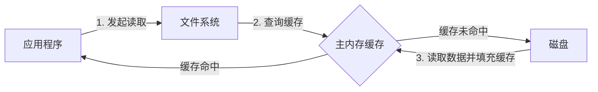
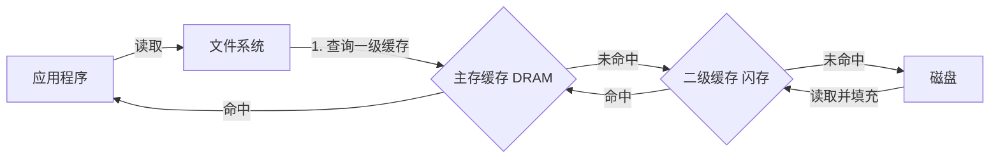
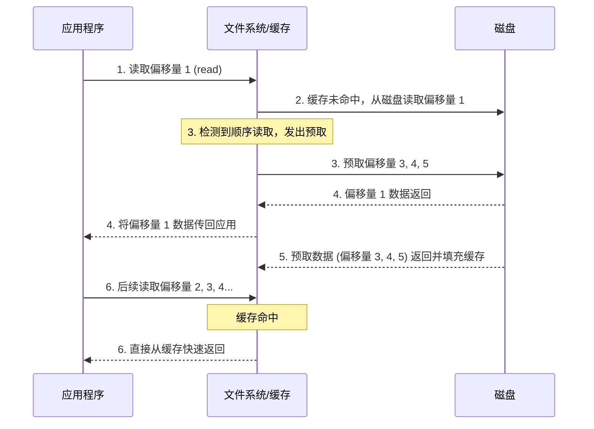
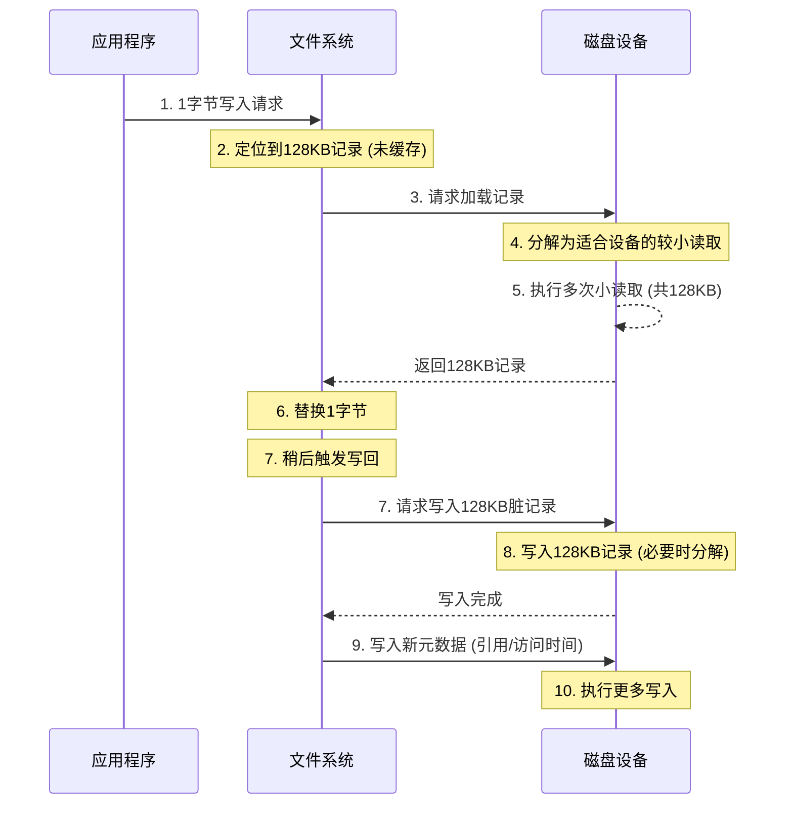
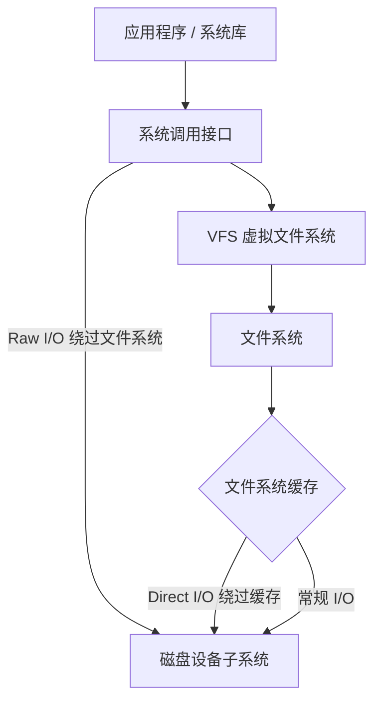
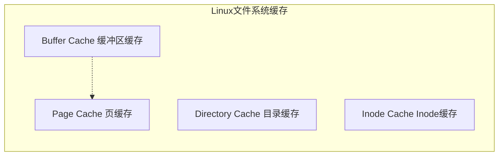
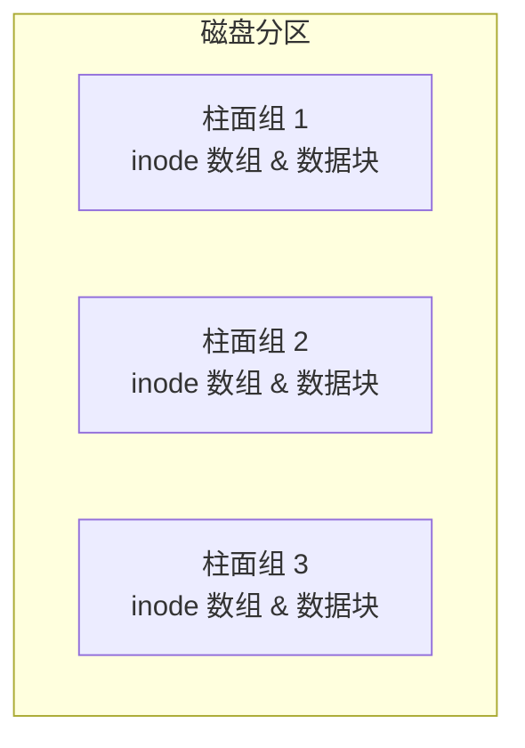
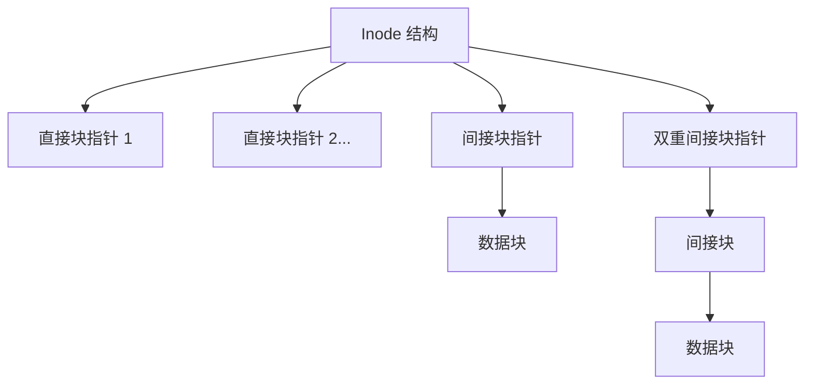
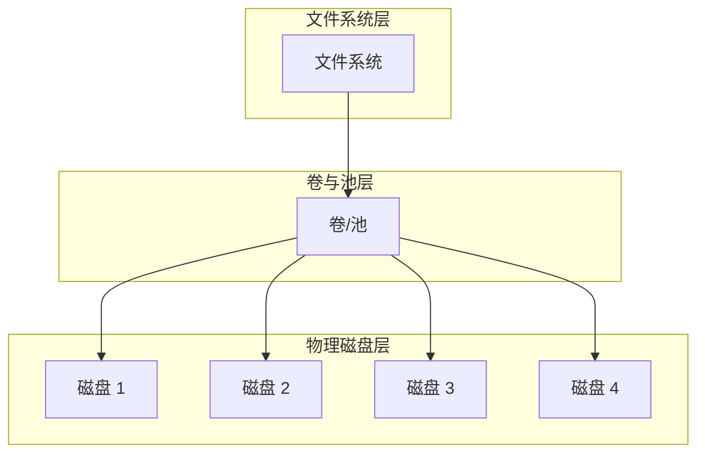

# 8.1 文件系统：概念与架构

> [!INFO] 章节概述
> 文件系统性能往往比磁盘或存储设备性能对应用程序的影响更大，因为应用程序直接交互和等待的是文件系统。文件系统可以使用[[缓存]]（caching）、[[缓冲]]（buffering）和[[异步I/O]]（asynchronous I/O）来避免让应用程序承受磁盘级（或远程存储系统）的延迟。

系统性能分析和监控工具在历史上一直侧重于磁盘性能，导致文件系统性能成为盲区。本章将照亮文件系统这一领域，展示它们的工作原理以及如何测量它们的延迟和其他细节。这通常可以帮助排除文件系统及其底层磁盘设备作为性能不佳根源的可能性，从而使调查转向其他领域。

本章的学习目标如下：

- 理解文件系统模型与概念。
- 理解文件系统工作负载如何影响性能。
- 熟悉文件系统缓存。
- 熟悉文件系统内部原理与性能特性。
- 遵循各种文件系统分析方法论。
- 测量文件系统延迟以识别模式和异常值。
- 使用追踪工具调查文件系统使用情况。
- 使用微基准测试测试文件系统性能。
- 了解文件系统可调参数。

本章由六部分组成，前三部分提供文件系统分析的基础，后三部分展示其在基于 Linux 系统上的实际应用。各部分内容如下：

- **背景**：介绍文件系统相关术语和基本模型，说明文件系统原理和关键文件系统性能概念。
- **架构**：介绍通用和特定的文件系统架构。
- **方法论**：描述性能分析方法论，包括观察性和实验性方法论。
- **可观测性工具**：展示基于 Linux 系统的文件系统可观测性工具，包括静态和动态插桩。
- **实验**：总结文件系统基准测试工具。
- **调优**：描述文件系统可调参数。

---

## 8.1 术语

作为参考，本章使用的文件系统相关术语包括：

- **文件系统**：一种将数据组织为文件和目录的结构，提供基于文件的接口来访问它们，并通过文件权限控制访问。其他内容可能包括用于设备、套接字和管道的特殊文件类型，以及包括文件访问时间戳在内的[[元数据]]。
- **文件系统缓存**：主内存（通常是 DRAM）中用于缓存文件系统内容的区域，可能包含用于各种数据和元数据类型的不同缓存。
- **操作**：文件系统操作是对文件系统的请求，包括 `read(2)`、`write(2)`、`open(2)`、`close(2)`、`stat(2)`、`mkdir(2)` 以及其他操作。
- **I/O**：输入/输出。文件系统 I/O 可以用多种方式定义；在此它仅指直接进行读写的操作（执行 I/O），包括 `read(2)`、`write(2)`、`stat(2)`（读取统计信息）和 `mkdir(2)`（写入新目录项）。I/O 不包括 `open(2)` 和 `close(2)`（尽管这些调用会更新元数据并可能导致间接的磁盘 I/O）。
- **逻辑 I/O**：应用程序向文件系统发出的 I/O。
- **物理 I/O**：文件系统直接向磁盘发出的 I/O（或通过原始 I/O）。
- **块大小**：也称为记录大小，是文件系统磁盘上数据分组的大小。参见 8.4.4 节“文件系统特性”中的“块 vs 区段”。
- **吞吐量**：应用程序与文件系统之间的当前数据传输速率，以字节/秒为单位测量。
- **inode**：索引节点是一个数据结构，包含文件系统对象的元数据，包括权限、时间戳和数据指针。
- **VFS**：[[虚拟文件系统]]，一种用于抽象和支持不同文件系统类型的内核接口。
- **卷**：提供比使用整个存储设备更具灵活性的存储实例。一个卷可以是一个设备的一部分，也可以是多个设备。
- **卷管理器**：以灵活方式管理物理存储设备的软件，创建供操作系统使用的虚拟卷。

> [!TIP] 其他术语
> 其他术语将在本章中陆续介绍。词汇表包含了基本术语供参考，包括 fsck、IOPS、操作速率和 POSIX。另见第 2 章和第 3 章的术语部分。

---

## 8.2 模型

以下简单模型说明了文件系统及其性能的一些基本原理。

### 8.2.1 文件系统接口

图 8.1 从接口的角度展示了文件系统的基本模型。

*图 8.1 文件系统接口*

> [!NOTE] 图表说明
> 图 8.1 中还标注了逻辑和物理操作发生的位置。有关这些内容的更多信息，请参见 8.3.12 节“逻辑 I/O 与物理 I/O”。

图 8.1 显示了通用的对象操作。内核可能会实现额外的变体：例如，Linux 提供了 `readv(2)`、`writev(2)`、`openat(2)` 等。

研究文件系统性能的一种方法是将其视为黑盒，专注于对象操作的延迟。这在 8.5.2 节“延迟分析”中有更详细的解释。

### 8.2.2 文件系统缓存

图 8.2 描绘了存储在主内存中的通用文件系统缓存，为一个读操作提供服务。

*图 8.2 文件系统主存缓存*

读取操作要么从缓存返回数据（缓存命中），要么从磁盘返回数据（缓存未命中）。缓存未命中的数据会被存入缓存，从而填充缓存（使其变暖/预热）。

文件系统缓存还可以缓冲写入，以便稍后写入（刷入）。执行此操作的机制因文件系统类型而异，这将在 8.4 节“架构”中描述。

> [!INFO] 绕过缓存
> 如果需要，内核通常提供绕过缓存的方法。参见 8.3.8 节“原始与直接 I/O”。

### 8.2.3 二级缓存

二级缓存可以是任何内存类型；图 8.3 将其展示为闪存。这种缓存类型是由我本人在 2007 年为 ZFS 首次开发的。

*图 8.3 文件系统二级缓存*

---

## 8.3 概念

以下是一些重要的文件系统性能概念选编。

### 8.3.1 文件系统延迟

[[文件系统延迟]]是文件系统性能的主要指标，测量为从逻辑文件系统请求发出到其完成的时间。它包括在文件系统和磁盘 I/O 子系统中花费的时间，以及在磁盘设备上等待的时间——即物理 I/O。应用程序线程在发出应用程序请求期间通常会阻塞，以等待文件系统请求完成——因此，文件系统延迟直接且按比例地影响应用程序性能。

> [!EXAMPLE] 应用程序不受直接影响的情况
> 应用程序可能不受直接影响的情况包括使用非阻塞 I/O、预取（8.3.4 节），以及从异步线程（例如，后台刷盘线程）发出 I/O。如果应用程序提供了其文件系统使用的详细指标，可能可以从应用程序识别这些情况。如果不能，一种通用的方法是使用能够显示导致逻辑文件系统 I/O 的用户级栈追踪的内核追踪工具。然后可以研究该栈追踪，查看是哪些应用程序例程发出了 I/O。

操作系统在历史上并未让文件系统延迟变得易于观察，而是提供磁盘设备级别的统计信息。但在许多情况下，此类统计信息与应用程序性能无关，甚至会产生误导。一个例子是文件系统对写入数据执行后台刷盘，这可能表现为突发的高延迟磁盘 I/O。从磁盘设备级统计信息来看，这很令人担忧；然而，没有应用程序在等待这些操作完成。有关更多情况，请参见 8.3.12 节“逻辑 I/O 与物理 I/O”。

### 8.3.2 缓存

文件系统通常会使用主内存（RAM）作为缓存来提高性能。对于应用程序，此过程是透明的：应用程序逻辑 I/O 延迟变得低得多（更好），因为它可以从主内存提供服务，而不是从慢得多的磁盘设备提供服务。

随着时间的推移，缓存不断增长，而操作系统的可用内存不断减少。这可能会引起新用户的恐慌，但这完全正常。其原则是：**如果有空闲的主内存，就用它做点有用的事**。当应用程序需要更多内存时，内核应该迅速从文件系统缓存中释放内存以供使用。

文件系统使用缓存来提高读取性能，并使用缓冲（在缓存中）来提高写入性能。文件系统和块设备子系统通常使用多种类型的缓存，可能包括表 8.1 中列出的那些。

**表 8.1 缓存类型示例**

| 缓存 | 示例 |
| :--- | :--- |
| 页缓存 | 操作系统页缓存 |
| 文件系统主缓存 | ZFS ARC |
| 文件系统二级缓存 | ZFS L2ARC |
| 目录缓存 | dentry cache |
| inode 缓存 | inode cache |
| 设备缓存 | ZFS vdev |
| 块设备缓存 | 缓冲区缓存 |

特定的缓存类型将在 8.4 节“架构”中描述，而第 3 章“操作系统”则包含缓存的完整列表（包括应用程序级和设备级）。

### 8.3.3 随机与顺序 I/O

一系列逻辑文件系统 I/O 可以根据每个 I/O 的文件偏移量被描述为随机的或顺序的。对于顺序 I/O，每个 I/O 的偏移量从前一个 I/O 的末尾开始。随机 I/O 之间没有明显的关联，偏移量随机变化。随机文件系统工作负载也可以指随机访问许多不同的文件。

*图 8.4 顺序和随机文件 I/O*

图 8.4 说明了这些访问模式，展示了一系列有序的 I/O 和示例文件偏移量。

由于某些存储设备的性能特征（在第 9 章“磁盘”中描述），文件系统在历史上一直试图通过将文件数据在磁盘上顺序且连续地放置来减少随机 I/O。术语[[碎片化]]描述了文件系统在此方面做得不好时发生的情况，导致文件分散在驱动器上，从而使顺序的逻辑 I/O 产生随机的物理 I/O。

文件系统可以测量逻辑 I/O 访问模式，以便识别顺序工作负载，然后使用预取或预读来提高其性能。这对旋转磁盘有帮助；对闪存驱动器帮助较小。

### 8.3.4 预取

常见的文件系统工作负载涉及顺序读取大量文件数据，例如文件系统备份。这些数据可能太大而无法放入缓存，或者可能只被读取一次而不太可能保留在缓存中（取决于缓存逐出策略）。这种工作负载的性能会相对较差，因为它的缓存命中率很低。

[[预取]]是解决此问题的常见文件系统功能。它可以根据当前和先前的文件 I/O 偏移量检测顺序读取工作负载，然后在应用程序请求之前预测并发出磁盘读取。这会填充文件系统缓存，以便如果应用程序确实执行了预期的读取，就会导致缓存命中（所需的数据已经在缓存中）。一个示例场景如下：

1. 应用程序发出文件 `read(2)`，将执行权传递给内核。
2. 数据未缓存，因此文件系统向磁盘发出读取请求。
3. 将先前的文件偏移指针与当前位置进行比较，如果它们是顺序的，文件系统会发出额外的读取（预取）。
4. 第一次读取完成，内核将数据和执行权传回应用程序。
5. 任何预取读取完成，为未来的应用程序读取填充缓存。
6. 未来的顺序应用程序读取通过 RAM 中的缓存快速完成。

*图 8.5 预取场景示例*

此场景也在图 8.5 中进行了说明，其中应用程序对偏移量 1 然后是偏移量 2 的读取触发了对接下来三个偏移量的预取。

# 8.1 文件系统：概念与架构

> [!INFO] 连续性说明
> 本部分为文档的第 2/5 部分，接续预读相关内容的后续流程。

任何预读操作的完成，都会填充缓存以供应用程序未来的读取使用。
6. 未来的顺序应用程序读取通过 RAM 中的缓存快速完成。

此场景也在图 8.5 中得到了说明，其中应用程序读取偏移量 1 然后读取偏移量 2 触发了接下来三个偏移量的预读。

当预读检测运行良好时，应用程序的顺序读取性能会得到显著提升；磁盘始终保持领先于应用程序的请求（前提是磁盘有足够的带宽来做到这一点）。当预读检测运行不佳时，会发出应用程序不需要的不必要 I/O，这不仅会污染缓存，还会消耗磁盘和 I/O 传输资源。文件系统通常允许根据需要调整预读。

## 8.3.5 提前读取

从历史上看，预读也被称为提前读取。Linux 使用 read-ahead 这一术语来命名一个系统调用 `readahead(2)`，该系统调用允许应用程序显式地预热文件系统缓存。

## 8.3.6 写回缓存

写回缓存通常被文件系统用于提高写入性能。它的工作方式是：在数据传输到主存后即将写入视为已完成，并在稍后的某个时间异步地将数据写入磁盘。文件系统将这种“脏”数据写入磁盘的过程称为刷盘。一个示例顺序如下：

1. 应用程序发起文件 `write(2)`，将执行权传递给内核。
2. 来自应用程序地址空间的数据被复制到内核。
3. 内核将 `write(2)` 系统调用视为已完成，将执行权交还回应用程序。
4. 稍后，一个异步内核任务找到已写入的数据并发起磁盘写入。

> [!WARNING] 权衡：可靠性与速度
> 这种机制的代价是可靠性。基于 DRAM 的主存是易失性的，在发生电源故障时，脏数据可能会丢失。数据也可能写入磁盘不完整，从而留下损坏的磁盘状态。

如果文件系统元数据损坏，文件系统可能无法再加载。这种状态可能只能从系统备份中恢复，从而导致长时间的停机。更糟糕的是，如果损坏影响了应用程序读取和使用的文件内容，业务可能会面临危险。

为了平衡速度和可靠性的需求，文件系统可以默认提供写回缓存，并提供同步写入选项以绕过此行为，直接写入持久存储设备。

## 8.3.7 同步写入

同步写入仅在完全写入持久存储（例如磁盘设备）后才算完成，这包括写入任何必要的文件系统元数据更改。这比异步写入（写回缓存）慢得多，因为同步写入会带来磁盘设备 I/O 延迟（并且由于文件系统元数据的缘故，可能会产生多次 I/O）。某些应用程序使用同步写入，例如数据库日志写入器，在这些应用中，异步写入带来的数据损坏风险是不可接受的。

同步写入有两种形式：单独同步写入的 I/O，以及同步提交的一组先前的写入。

### 单独同步写入

当使用标志 `O_SYNC` 或其变体 `O_DSYNC` 和 `O_RSYNC`（自 Linux 2.6.31 起，glibc 将它们映射到 `O_SYNC`）打开文件时，写入 I/O 是同步的。某些文件系统具有挂载选项，可以强制所有文件的所有写入 I/O 都是同步的。

### 同步提交先前的写入

应用程序可以不采用同步写入单独 I/O 的方式，而是使用 `fsync(2)` 系统调用，在其代码的检查点处同步提交先前的异步写入。这可以通过对写入进行分组来提高性能，还可以通过写入取消来避免多次元数据更新。

> [!TIP] 其他触发提交的情况
> 还有其他情况也会提交先前的写入，例如关闭文件句柄，或者当文件上有太多未提交的缓冲区时。前者通常表现为解压包含许多文件的归档文件时出现的长时间停顿，尤其是在 NFS 上。

## 8.3.8 裸 I/O 与直接 I/O

这些是应用程序可以使用的其他 I/O 类型（如果内核或文件系统支持）：

- **裸 I/O（Raw I/O）**：直接向磁盘偏移量发出 I/O，完全绕过文件系统。某些应用程序（尤其是数据库）一直在使用它，这些应用程序能够比文件系统缓存更好地管理和缓存自己的数据。缺点是增加了软件的复杂性，以及管理上的困难：无法使用常规的文件系统工具集进行备份/恢复或可观测性。
- **直接 I/O（Direct I/O）**：允许应用程序使用文件系统但绕过文件系统缓存，例如，在 Linux 上使用 `open(2)` 的 `O_DIRECT` 标志。这类似于同步写入（但没有 `O_SYNC` 提供的保证），并且它也适用于读取。它不如裸设备 I/O 那样直接，因为文件偏移量到磁盘偏移量的映射仍必须由文件系统代码执行，并且 I/O 的大小可能会被重新调整以匹配文件系统用于磁盘布局的大小（其记录大小），否则可能会报错（`EINVAL`）。根据文件系统的不同，它不仅可能禁用读取缓存和写入缓冲，还可能禁用预读。

## 8.3.9 非阻塞 I/O

通常，文件系统 I/O 要么立即完成（例如，从缓存中），要么在等待后完成（例如，等待磁盘设备 I/O）。如果需要等待，应用程序线程将阻塞并让出 CPU，允许其他线程在它等待时执行。虽然被阻塞的线程无法执行其他工作，但这通常不是问题，因为多线程应用程序可以创建额外的线程，以便在某些线程被阻塞时执行。

在某些情况下，非阻塞 I/O 是 desirable（期望/必要）的，例如在避免线程创建的性能或资源开销时。非阻塞 I/O 可以通过对 `open(2)` 系统调用使用 `O_NONBLOCK` 或 `O_NDELAY` 标志来执行，这会导致读取和写入返回 `EAGAIN` 错误而不是阻塞，告诉应用程序稍后再试。（对此的支持取决于文件系统，文件系统可能仅针对建议性或强制性文件锁兑现非阻塞请求。）

操作系统还可以提供单独的异步 I/O 接口，例如 `aio_read(3)` 和 `aio_write(3)`。Linux 5.1 增加了一个名为 `io_uring` 的新异步 I/O 接口，具有更高的易用性、效率和性能 [Axboe 19]。

非阻塞 I/O 也在第 5 章“应用程序”的第 5.2.6 节“非阻塞 I/O”中讨论过。

## 8.3.10 内存映射文件

对于某些应用程序和工作负载，可以通过将文件映射到进程地址空间并直接访问内存偏移量来提高文件系统 I/O 性能。这避免了在调用 `read(2)` 和 `write(2)` 系统调用访问文件数据时产生的系统调用执行和上下文切换开销。如果内核支持将文件数据缓冲区直接映射到进程地址空间，它还可以避免数据的双重复制。

内存映射是使用 `mmap(2)` 系统调用创建的，并使用 `munmap(2)` 删除。可以使用 `madvise(2)` 调整映射，这将在第 8.8 节“调优”中总结。某些应用程序在其配置中提供了使用 `mmap` 系统调用的选项（可能称为“mmap 模式”）。例如，Riak 数据库可以为其内存数据存储使用 mmap。

> [!CAUTION] 避免盲目使用 mmap
> 我注意到一种倾向，即试图使用 `mmap(2)` 来解决文件系统性能问题，而没有首先对它们进行分析。如果问题是由磁盘设备引起的高 I/O 延迟，那么用 `mmap(2)` 避免微小的系统调用开销可能收效甚微，因为高磁盘 I/O 延迟仍然存在并占据主导地位。

在多处理器系统上使用映射的一个缺点可能是保持每个 CPU [[MMU]] 同步的开销，特别是用于删除映射的 CPU 交叉调用（TLB 击落）。取决于内核和映射，这些开销可以通过延迟 TLB 更新（惰性击落）来最小化 [Vahalia 96]。

## 8.3.11 元数据

虽然数据描述了文件和目录的内容，但元数据描述了关于它们的信息。元数据可以指可以从文件系统接口（POSIX）读取的信息，或者在磁盘上实现文件系统布局所需的信息。它们分别被称为逻辑元数据和物理元数据。

### 逻辑元数据

逻辑元数据是消费者（应用程序）对文件系统进行读写的信息，包括：

- **显式地**：读取文件统计信息（`stat(2)`），创建和删除文件（`creat(2)`、`unlink(2)`）和目录（`mkdir(2)`、`rmdir(2)`），设置文件属性（`chown(2)`、`chmod(2)`）
- **隐式地**：文件系统访问时间戳更新，目录修改时间戳更新，已用块位图更新，可用空间统计信息

> [!EXAMPLE] 元数据密集型工作负载
> “元数据密集型”工作负载通常指的是逻辑元数据，例如，Web 服务器使用 `stat(2)` 检查文件以确保自缓存以来它们未被更改，这种操作的频率远高于读取文件数据内容的频率。

### 物理元数据

物理元数据是指记录所有文件系统信息所必需的磁盘布局元数据。正在使用的元数据类型取决于文件系统，可能包括[[超级块]]、[[Inode]]、数据指针块（一级、二级……）和空闲列表。

逻辑和物理元数据是导致逻辑 I/O 和物理 I/O 之间存在差异的原因之一。

## 8.3.12 逻辑 I/O 与物理 I/O

虽然这可能看起来有悖直觉，但应用程序向文件系统请求的 I/O（逻辑 I/O）可能与磁盘 I/O（物理 I/O）不匹配，原因有以下几点。

文件系统的作用远不止将持久存储（磁盘）呈现为基于文件的接口。它们缓存读取、缓冲写入、将文件映射到地址空间，并创建额外的 I/O 来维护它们需要记录所有内容位置的磁盘物理布局元数据。与应用程序 I/O 相比，这可能导致磁盘 I/O 是不相关的、间接的、隐式的、膨胀的或缩减的。示例如下。

### 不相关

这是指与应用程序无关的磁盘 I/O，可能由于：

- 其他应用程序
- 其他租户：磁盘 I/O 来自另一个云租户（在某些虚拟化技术下可通过系统工具看到）。
- 其他内核任务：例如，当内核正在重建软件 RAID 卷或执行异步文件系统校验和验证时（参见第 8.4 节“架构”）。
- 管理任务：例如备份。

# 8.1 文件系统：概念与架构

## 8.3 概念

### 间接 I/O (Indirect)

这是由应用程序引起的磁盘 I/O，但没有立即对应的应用程序 I/O。这可能是由于：

- **文件系统预读**：添加了额外的 I/O，这些 I/O 可能会被应用程序使用，也可能不会。
- **文件系统缓冲**：使用回写缓存来推迟和合并写入，以便稍后刷新到磁盘。某些系统可能会缓冲写入数十秒后才写入磁盘，这随后表现为大型但不频繁的突发写入。

### 隐式 I/O (Implicit)

这是由应用程序事件直接触发的磁盘 I/O，而不是通过显式的文件系统读写，例如：

- **内存映射加载/存储**：对于内存映射（`mmap(2)`）文件，加载和存储指令可能会触发磁盘 I/O 来读取或写入数据。写入可能会被缓冲并在稍后写入。当分析文件系统操作（`read(2)`，`write(2)`）却找不到 I/O 的来源时（因为它是被指令触发而不是系统调用触发的），这可能会让人感到困惑。

### 缩减 I/O (Deflated)

磁盘 I/O 小于应用程序 I/O，甚至不存在。这可能是由于：

- **文件系统缓存**：从主内存而不是磁盘满足读取请求。
- **文件系统写入取消**：相同的字节偏移量在一次性刷新到磁盘之前被多次修改。
- **压缩**：将数据量从逻辑 I/O 减少到物理 I/O。
- **合并**：在将顺序 I/O 发送到磁盘之前将它们合并（这减少了 I/O 计数，但没有减少总大小）。
- **内存文件系统**：可能永远不会写入磁盘的内容（例如，`tmpfs`[^1]）。

[^1]: 尽管 tmpfs 也可以写入交换设备。

### 膨胀 I/O (Inflated)

磁盘 I/O 大于应用程序 I/O。这是典型的情况，原因是：

- **文件系统元数据**：添加了额外的 I/O。
- **文件系统记录大小**：向上舍入 I/O 大小（膨胀字节数），或分片 I/O（膨胀计数）。
- **文件系统日志**：如果使用日志，这可能会使磁盘写入翻倍，一次写入日志，另一次写入最终目的地。
- **卷管理器奇偶校验**：读-修改-写周期，添加了额外的 I/O。
- **RAID 膨胀**：写入额外的奇偶校验数据，或将数据写入镜像卷。

### 示例

为了展示这些因素是如何协同发生的，以下示例描述了 1 字节应用程序写入可能发生的情况：

1. 应用程序对现有文件执行 1 字节的写入。
2. 文件系统将该位置识别为 128 KB 文件系统记录的一部分，该记录未被缓存（但引用它的元数据已缓存）。
3. 文件系统请求从磁盘加载该记录。
4. 磁盘设备层将 128 KB 的读取分解为适合设备的较小读取。
5. 磁盘执行多次较小的读取，总计 128 KB。
6. 文件系统现在用新字节替换记录中的 1 个字节。
7. 稍后，文件系统或内核请求将 128 KB 的脏记录写回磁盘。
8. 磁盘写入 128 KB 记录（如果需要则分解）。
9. 文件系统写入新的元数据，例如，更新引用（用于写时复制）或访问时间。
10. 磁盘执行更多写入。

> [!EXAMPLE] I/O 膨胀效应示例
> 因此，虽然应用程序仅执行了单次 1 字节的写入，但磁盘却执行了多次读取（总计 128 KB）和更多写入（超过 128 KB）。

### 8.3.13 操作并不对等

从前面的章节可以清楚地看出，文件系统操作会根据其类型表现出不同的性能。单凭“500 次操作/秒”的速率，你无法了解工作负载的太多信息。某些操作可能会以主内存速度从文件系统缓存返回；其他操作可能会从磁盘返回，并且慢几个数量级。其他决定因素包括操作是随机的还是顺序的、是读还是写、是同步写还是异步写、它们的 I/O 大小、是否包括其他操作类型、它们的 CPU 执行成本（以及系统的 CPU 负载程度）以及存储设备特性。

通常的做法是对不同的文件系统操作进行微基准测试，以确定这些性能特征。例如，表 8.2 中的结果来自 ZFS 文件系统，运行在一个空闲的 Intel Xeon 2.4 GHz 多核处理器上。

**表 8.2 文件系统操作延迟示例**

| 操作 | 平均延迟 (μs) |
| :--- | :--- |
| `open(2)` (已缓存[^2]) | 2.2 |
| `close(2)` (干净[^3]) | 0.7 |
| `read(2)` 4 KB (已缓存) | 3.3 |
| `read(2)` 128 KB (已缓存) | 13.9 |
| `write(2)` 4 KB (异步) | 9.3 |
| `write(2)` 128 KB (异步) | 55.2 |

[^2]: 文件 inode 已缓存。
[^3]: 没有需要刷新到磁盘的脏数据。

> [!NOTE] 测试背景
> 这些测试不涉及存储设备，而是对文件系统软件和 CPU 速度的测试。某些特殊的文件系统从不访问持久性存储设备。
> 
> 这些测试也是单线程的。并行 I/O 性能可能受所使用的文件系统锁的类型和组织方式的影响。

### 8.3.14 特殊文件系统

文件系统的目的通常是持久存储数据，但 Linux 上有一些特殊文件系统类型用于其他目的，包括临时文件（`/tmp`）、内核设备路径（`/dev`）、系统统计信息（`/proc`）和系统配置（`/sys`）[^4]。

[^4]: 要列出 Linux 上不使用存储设备的特殊文件系统类型，可以使用命令：`grep '^nodev' /proc/filesystems`

### 8.3.15 访问时间戳

许多文件系统支持访问时间戳，记录每个文件和目录被访问（读取）的时间。这导致每当读取文件时都会更新文件元数据，从而产生消耗磁盘 I/O 资源的写入工作负载。第 8.8 节“调优”展示了如何关闭这些更新。

一些文件系统通过推迟和分组访问时间戳写入来优化它们，以减少对活动工作负载的干扰。

### 8.3.16 容量

当文件系统填满时，性能可能会由于几个原因而下降。首先，在写入新数据时，可能需要更多的 CPU 时间和磁盘 I/O 才能在磁盘上找到空闲块[^5]。其次，磁盘上的空闲空间区域可能更小且位置更分散，由于较小的 I/O 或随机 I/O 导致性能下降。

这个问题的严重程度取决于文件系统类型、其磁盘上的布局、其对写时复制（[[Copy-on-Write|写时复制]]）的使用及其存储设备。各种文件系统类型将在下一节中描述。

[^5]: 例如，ZFS 在池存储超过阈值（最初为 80%，后来为 99%）时，会切换到不同且较慢的空闲块查找算法。参见“Pool performance can degrade when a pool is very full” [Oracle 12]。

## 8.4 架构

本节介绍通用和特定的文件系统架构，从 I/O 栈、[[VFS]]、文件系统缓存和特性、常见文件系统类型、卷和池开始。在确定要分析和调优哪些文件系统组件时，这些背景知识非常有用。

有关更深入的内部机制和其他文件系统主题，请参考源代码（如果可用）和外部文档。其中一些列在本章末尾。

### 8.4.1 文件系统 I/O 栈

图 8.6 描绘了文件系统 I/O 栈的一般模型，重点关注文件系统接口。具体的组件、层和 API 取决于操作系统类型、版本和使用的文件系统。更高级别的 I/O 栈图包含在第 3 章“操作系统”中，另一张更详细显示磁盘组件的图在第 9 章“磁盘”中。

> [!INFO] 图 8.6 通用文件系统 I/O 栈
> *(此处原图展示了从应用程序到系统调用，经 VFS/文件系统与缓存，最终到达设备子系统的逻辑栈结构)*

这显示了 I/O 从应用程序和系统库到系统调用并穿过内核的路径。从系统调用直接到磁盘设备子系统的路径是原始 I/O（[[Raw I/O]]）。通过 VFS 和文件系统的路径是文件系统 I/O，包括跳过文件系统缓存的直接 I/O（[[Direct I/O]]）。

### 8.4.2 VFS

[[VFS]]（虚拟文件系统接口）为不同的文件系统类型提供了一个通用接口。它的位置如图 8.7 所示。

> [!INFO] 图 8.7 虚拟文件系统接口
> *(此处原图展示了 VFS 位于系统调用与具体文件系统实现之间的位置)*

VFS 起源于 SunOS，已成为文件系统的标准抽象。

Linux VFS 接口使用的术语可能有点令人困惑，因为它重用了术语 inode 和超级块来指代 VFS 对象——这些术语起源于 Unix 文系统在磁盘上的数据结构。用于 Linux 磁盘数据结构的术语通常以其文件系统类型为前缀，例如 `ext4_inode` 和 `ext4_super_block`。VFS inode 和 VFS 超级块仅存在于内存中。

> [!TIP] 性能观测点
> VFS 接口也可以作为测量任何文件系统性能的公共位置。使用操作系统提供的统计信息，或静态或动态检测（[[Tracing|动态追踪]]）可能实现这一点。

### 8.4.3 文件系统缓存

Unix 最初只有缓冲区缓存（[[Buffer Cache]]）来提高块设备访问的性能。如今，Linux 有多种不同类型的缓存。图 8.8 概述了 Linux 上的文件系统缓存，显示了标准文件系统类型可用的通用缓存。

> [!INFO] 图 8.8 Linux 文件系统缓存
> *(此处原图展示了 Page Cache 包含 Buffer Cache，以及 Directory Cache 和 Inode Cache 之间的关系)*

#### 缓冲区缓存

Unix 在块设备接口处使用缓冲区缓存来缓存磁盘设备块。这是一个独立的、固定大小的缓存，随着后来页缓存的加入，在平衡它们之间的不同工作负载时出现了调优问题，以及双重缓存和同步的开销。通过使用页缓存来存储缓冲区缓存，这些问题在很大程度上得到了解决，这种方法由 SunOS 引入，称为统一缓冲区缓存。

Linux 最初像 Unix 一样使用缓冲区缓存。自 Linux 2.4 以来，缓冲区缓存也被存储在页缓存中（因此图 8.8 中有虚线边框），避免了双重缓存和同步的开销。缓冲区缓存功能仍然存在，提高了块设备 I/O 的性能，并且该术语仍然出现在 Linux 可观测性工具中（例如 `free(1)`）。

缓冲区缓存的大小是动态的，可以从 `/proc` 中观察。

#### 页缓存

页缓存最早在 1985 年虚拟内存重写期间引入 SunOS，并添加到 SVR4 Unix 中 [Vahalia 96]。它缓存虚拟内存页，包括映射的文件系统页，提高了文件和目录 I/O 的性能。它比缓冲区缓存更高效地用于文件访问，后者每次查找都需要从文件偏移量转换为磁盘偏移量。多种文件系统类型可以使用页缓存，包括最初的消费者 UFS 和 NFS。其大小是动态的：页缓存会增长以使用可用内存，并在应用程序需要时再次释放它。

Linux 具有相同属性的页缓存。Linux 页缓存的大小也是动态的，带有一个可调参数用于设置从页缓存驱逐与交换之间的平衡（swappiness；参见第 7 章，内存）。

文件系统所需的脏（已修改）内存页由内核线程刷新到磁盘。在 Linux 2.6.32 之前，有一个页脏数据刷新（`pdflush`）线程池，根据需要在 2 到 8 个之间。这些后来被刷新线程（命名为 `flush`）取代，这些线程是按设备创建的，以更好地平衡每个设备的工作负载并提高吞吐量。页面被刷新到磁盘的原因如下：

- 间隔时间后（30 秒）
- `sync(2)`，`fsync(2)`，`msync(2)` 系统调用
- 脏页过多（`dirty_ratio` 和 `dirty_bytes` 可调参数）
- 页缓存中没有可用页

> [!NOTE] 内存不足时的行为
> 如果存在系统内存不足，另一个内核线程，即页面换出守护进程（`kswapd`，也称为页面扫描器），也可能找到脏页并安排将其写入磁盘，以便它可以释放内存页以供重用（参见第 7 章，内存）。为了可观测性，`kswapd` 和 `flush` 线程作为内核任务在操作系统性能工具中可见。

有关页面扫描器的更多详细信息，请参见第 7 章，内存。

# 8.1 文件系统：概念与架构

## 8.4 架构

### 目录项缓存

目录项缓存（Dentry cache，亦称 Dcache）记录了从目录项（`struct dentry`）到 VFS inode 的映射关系，这类似于早期 Unix 中的目录名查找缓存（DNLC）。Dcache 提升了路径名查找（例如通过 `open(2)`）的性能：当遍历一个路径名时，每一次名称查找都可以直接在 Dcache 中检查 inode 映射，而无需逐步遍历目录内容。Dcache 的条目存储在一个哈希表中，以实现快速且可扩展的查找（以父目录项和目录项名称进行哈希）。

这些年来，其性能得到了进一步提升，包括引入了读-拷贝-更新-遍历（RCU-walk）算法 [Corbet 10]。该算法试图在遍历路径名时不更新目录项的引用计数，因为在多 CPU 系统上，高速率的路径名查找会因缓存一致性而导致可扩展性问题。如果遇到不在缓存中的目录项，RCU-walk 会退回到较慢的引用计数遍历，因为在文件系统查找和阻塞期间，引用计数是必不可少的。对于繁忙的工作负载，目录项数据很可能已被缓存，此时 RCU-walk 方式将会成功。

Dcache 还执行负缓存，即记住那些查找不存在的条目的记录。这提升了失败查找的性能，这种情况在搜索共享库时经常发生。

Dcache 会动态增长，当系统需要更多内存时，会通过 LRU（最近最少使用）算法进行收缩。它的大小可以通过 `/proc` 查看。

### Inode 缓存

该缓存包含 VFS inode（`struct inodes`），每个 inode 描述了一个文件系统对象的属性，其中许多属性可以通过 `stat(2)` 系统调用返回。这些属性在文件系统工作负载中被频繁访问，例如在打开文件时检查权限，或在修改期间更新时间戳。这些 VFS inode 存储在一个哈希表中，以实现快速且可扩展的查找（以 inode 号和文件系统超级块进行哈希），尽管大多数查找将通过 Dentry 缓存完成。

inode 缓存会动态增长，至少会保留所有由 Dcache 映射的 inode。当系统存在内存压力时，inode 缓存将会收缩，丢弃那些没有关联目录项的 inode。它的大小可以通过 `/proc/sys/fs/inode*` 文件查看。

### 8.4.4 文件系统特性

影响性能的其他关键文件系统特性描述如下。

#### 块与区段

基于块的文件系统将数据存储在固定大小的块中，通过存储在元数据块中的指针进行引用。对于大文件，这可能需要许多块指针和元数据块，并且块的放置可能会变得分散，从而导致随机 I/O。一些基于块的文件系统试图连续地放置块以避免这种情况。另一种方法是使用可变块大小，以便在文件增长时可以使用更大的块大小，这也减少了元数据的开销。

基于区段的文件系统为文件预分配连续的空间（区段），并根据需要增长。这些区段的长度是可变的，表示一个或多个连续的块。

> [!INFO] 区段的优势
> 这提高了流式传输性能，并且由于文件数据被局部化，也可以提高随机 I/O 性能。它还提高了元数据性能，因为需要跟踪的对象更少，同时不会牺牲区段中未使用块的空间。

#### 日志

文件系统日志记录了对文件系统的更改，以便在系统崩溃或断电的情况下，更改可以被原子地重放——要么全部成功，要么全部失败。这使得文件系统能够快速恢复到一致的状态。非日志文件系统在系统崩溃期间可能会损坏，因为与更改相关的数据和元数据可能被不完整地写入。从这种崩溃中恢复需要遍历所有文件系统结构，对于大型（太字节）文件系统来说，这可能需要数小时。

日志同步写入磁盘，对于某些文件系统，可以将其配置为使用单独的设备。一些日志同时记录数据和元数据，这会消耗更多的存储 I/O 资源，因为所有的 I/O 都被写了两次。其他日志仅写入元数据，并通过采用写时复制来维护数据完整性。

还有一种仅由日志组成的文件系统类型：日志结构文件系统，其中所有的数据和元数据更新都被写入到一个连续且循环的日志中。这优化了写性能，因为写入总是顺序的，并且可以合并以使用更大的 I/O 尺寸。

#### 写时复制

写时复制文件系统不会覆盖现有块，而是遵循以下步骤：

1. 将块写入新位置（一个新副本）。
2. 更新对新块的引用。
3. 将旧块添加到空闲列表中。

这有助于在系统发生故障时保持文件系统的完整性，并通过将随机写入转换为顺序写入来提高性能。

> [!WARNING] 容量接近极限时的性能风险
> 当文件系统接近满容量时，COW 可能会导致文件在磁盘上的数据布局变得碎片化，从而降低性能（特别是对于 HDD）。文件系统碎片整理（如果可用）可能有助于恢复性能。

#### 数据擦洗

这是一种文件系统特性，它异步读取所有数据块并校验校验和，以便尽早检测到失败的驱动器，最理想的情况是在由于 RAID 导致故障仍然可恢复时检测到。然而，数据擦洗的读取 I/O 会损害性能，因此应该在低优先级或工作负载较低的时候发出。

#### 其他特性

其他可能影响性能的文件系统特性包括快照、压缩、内置冗余、去重、TRIM 支持等。下一节将描述特定文件系统的各种此类特性。

### 8.4.5 文件系统类型

本章的大部分内容描述了适用于所有文件系统类型的通用特征。以下各节总结了常用文件系统的特定性能特性。它们的分析和调优将在后面的章节中介绍。

#### FFS

许多文件系统最终都是基于伯克利快速文件系统（FFS）的，它是为了解决原始 Unix 文件系统的问题而设计的 ^6。了解一些背景知识有助于解释当今文件系统的状况。

原始 Unix 文件系统的磁盘布局由一个 inode 表、512 字节的存储块以及分配资源时使用的信息超级块组成 [Ritchie 74][Lions 77]。inode 表和存储块将磁盘分区划分为两个范围，这在它们之间寻道时引起了性能问题。另一个问题是使用了小的固定块大小（512 字节），这限制了吞吐量并增加了存储大文件所需的元数据（指针）量。将此大小翻倍至 1024 字节的实验，以及随后遇到的瓶颈由 [McKusick 84] 描述如下：

> [!QUOTE] 空闲列表碎片化问题
> 尽管吞吐量翻倍了，但旧文件系统仍然只使用了大约百分之四的磁盘带宽。主要问题是，尽管空闲列表最初是按最佳访问顺序排列的，但随着文件的创建和删除，它很快就会变得混乱。最终，空闲列表变得完全随机，导致文件的块在磁盘上被随机分配。这迫使在每次块访问之前都要进行一次寻道。尽管旧文件系统在刚创建时提供了高达 175 KB/秒的传输速率，但在几周的适度使用后，由于数据块放置的随机化，该速率下降到了 30 KB/秒。

这段摘录描述了空闲列表碎片化，随着文件系统的使用，它会随着时间的推移降低性能。

*图 8.9 柱面组*

^6：原始 Unix 文件系统不要与后来称为 UFS 的文件系统混淆，后者是基于 FFS 的。

FFS 通过将分区划分为多个柱面组来提高性能，如图 8.9 所示，每个柱面组都有自己的 inode 数组和数据块。如 图 8.9 所示，文件的 inode 和数据尽可能保存在同一个柱面组内，从而减少了磁盘寻道。其他相关数据也被放置在附近，包括目录及其条目的 inode。inode 的设计与此类似，具有指针和数据块的层次结构，如图 8.10 所示（三级间接块，即具有三级指针的块，此处未显示）[Bach 86]。

*图 8.10 Inode 数据结构*

块大小增加到最小 4 KB，从而提高了吞吐量。这减少了存储文件所需的数据块数量，因此也减少了引用这些数据块所需的间接块数量。由于所需间接指针块本身也变大了，所需的间接指针块数量进一步减少。为了提高小文件的空间效率，每个块可以拆分为 1 KB 的碎片。

FFS 的另一个性能特性是块交错：在磁盘上放置顺序文件块时，在它们之间留出一个或多个块的间距 [Doeppner 10]。这些额外的块为内核和处理器提供了发出下一个顺序文件读取的时间。如果没有交错，下一个块可能在准备好发出读取之前就已经转过了（旋转）磁盘磁头，从而导致等待完整旋转一圈的延迟。

#### ext3

Linux 扩展文件系统于 1992 年开发，是 Linux 及其 VFS 的第一个文件系统，基于原始 Unix 文件系统。第二个版本 ext2（1993）包含了来自 FFS 的多个时间戳和柱面组。第三个版本 ext3（1999）包含了文件系统增长和日志功能。

关键性能特性（包括自其发布以来添加的特性）如下：

- **日志**：可以是仅用于元数据的有序模式，或者用于元数据和数据的日志模式。日志提高了系统崩溃后的启动性能，避免了运行 `fsck` 的需要。它还可以通过合并元数据写入来提高某些写入工作负载的性能。
- **日志设备**：可以使用外部日志设备，从而使日志工作负载不会与读取工作负载发生竞争。
- **Orlov 块分配器**：这会将顶层目录分散到不同的柱面组中，使得子目录及其内容更有可能被共置，从而减少随机 I/O。
- **目录索引**：这些向文件系统添加了哈希 B 树，用于更快的目录查找。

可配置的特性记录在 `mke2fs(8)` 手册页中。

#### ext4

Linux ext4 文件系统于 2008 年发布，通过新功能和性能改进扩展了 ext3：区段、大容量、通过 `fallocate(2)` 预分配、延迟分配、日志校验和、更快的 `fsck`、多块分配器、纳秒级时间戳和快照。

关键性能特性（包括自其发布以来添加的特性）如下：

- **区段**：区段改善了连续放置，减少了随机 I/O 并增加了顺序 I/O 的 I/O 大小。它们在 8.4.4 节“文件系统特性”中介绍。
- **预分配**：通过 `fallocate(2)` 系统调用，这允许应用程序预分配可能是连续的空间，从而提高后续的写入性能。
- **延迟分配**：块分配被延迟直到刷盘时，允许写入分组（通过多块分配器），从而减少碎片。
- **更快的 `fsck`**：未分配的块和 inode 条目被标记，从而减少了 `fsck` 时间。

某些特性的状态可以通过 `/sys` 文件系统查看。例如：

# cd /sys/fs/ext4/features
# grep . *
batched_discard:supported
casefold:supported
encryption:supported
lazy_itable_init:supported
meta_bg_resize:supported
metadata_csum_seed:supported

可配置的特性记录在 `mke2fs(8)` 手册页中。某些特性（如 [[Extents|extents]]）也可以应用于 ext3 文件系统。

### XFS

XFS 由 Silicon Graphics 于 1993 年为其 IRIX 操作系统创建，旨在解决先前 IRIX 文件系统 EFS（基于 FFS）中的可扩展性限制 [Sweeney 96]。XFS 补丁在 2000 年代初期被合并到 Linux 内核中。如今，XFS 受到大多数 Linux 发行版的支持，并可用作根文件系统。例如，Netflix 由于 XFS 在其工作负载下的高性能，将其用于 [[Cassandra]] 数据库实例（并使用 ext4 作为根文件系统）。

关键的性能特性（包括自发布以来添加的特性）如下：

> [!TIP] XFS 关键性能特性
> - **分配组：** 分区被划分为等大小的分配组，这些组可以并行访问。为了限制争用，每个 AG 的元数据（如 [[Inodes|inodes]] 和空闲块列表）被独立管理，而文件和目录可以跨越多个 AG。
> - **区段：** （参见前面 ext4 中的描述。）
> - **日志：** 日志功能改善了系统崩溃后的启动性能，避免了运行 `fsck(8)` 的需要。它还可以通过合并元数据写入来提高某些写入工作负载的性能。
> - **日志设备：** 可以使用外部日志设备，从而使日志工作负载不与数据工作负载发生争用。
> - **条带化分配：** 如果文件系统创建在条带化 [[RAID]] 或 [[LVM]] 设备上，可以为数据和日志提供条带单元，以确保数据分配针对底层硬件进行了优化。
> - **延迟分配：** 区段分配会延迟到数据刷盘时进行，从而允许写入分组并减少碎片。内存中会为文件预留块，以确保在刷盘发生时有可用空间。
> - **在线碎片整理：** XFS 提供了一个碎片整理实用程序，可以在文件系统被积极使用的同时对其进行操作。虽然 XFS 使用区段和延迟分配来防止碎片化，但某些工作负载和条件仍可能导致文件系统碎片化。

可配置的特性记录在 `mkfs.xfs(8)` 手册页中。XFS 的内部性能数据可以通过 `/prov/fs/xfs/stat` 查看。这些数据专为高级分析而设计：更多信息请参见 XFS 网站 [XFS 06][XFS 10]。

### ZFS

ZFS 由 Sun Microsystems 开发并于 2005 年发布，它将文件系统与卷管理器结合在一起，并包含众多企业级特性，使其成为文件服务器的高吸引力选择。ZFS 作为开源发布，并被多个操作系统使用，尽管通常作为附加组件，因为 ZFS 使用 CDDL 许可证。大部分开发工作正在 OpenZFS 项目中进行，该项目于 2019 年宣布支持以 Linux 作为主要操作系统 [Ahrens 19]。虽然它在 Linux 中的支持和使用正在增长，但由于源代码许可证的问题，仍然存在阻力，包括来自 Linus Torvalds 的反对 [Torvalds 20a]。

关键的 ZFS 性能特性（包括自发布以来添加的特性）如下：

> [!TIP] ZFS 关键性能特性
> - **池化存储：** 所有分配的存储设备都被放置在一个池中，文件系统从中创建。这允许所有设备并行使用，以实现最大吞吐量和 [[IOPS]]。可以使用不同的 RAID 类型：0、1、10、Z（基于 RAID-5）、Z2（双奇偶校验）和 Z3（三奇偶校验）。
> - **COW (写时复制)：** 复制修改的块，然后将它们分组并顺序写入。
> - **日志：** ZFS 将更改的事务组（TXGs）作为批次刷盘，这些批次作为一个整体成功或失败，从而确保磁盘上的格式始终一致。
> - **[[ARC]] (自适应替换缓存)：** 自适应替换缓存通过同时使用多种缓存算法来实现高缓存命中率：最近使用（MRU）和最频繁使用（MFU）。主内存根据它们的性能在这两者之间进行平衡，这是通过维护额外的元数据（幽灵列表 ghost lists）来了解如果每种算法统治所有主内存时各自的表现来实现的。
> - **智能预取：** ZFS 根据需要应用不同类型的预取：用于元数据、用于 znodes（文件内容）以及用于 vdevs（虚拟设备）。
> - **多预取流：** 一个文件上的多个流式读取器可能会产生随机的 [[I/O]] 工作负载，因为文件系统需要在它们之间寻道。ZFS 跟踪单个预取流，允许新流加入其中。
> - **快照：** 由于 COW 架构，可以几乎瞬时创建快照，将新块的复制推迟到需要时进行。
> - **ZIO 管道：** 设备 I/O 由一系列阶段的管道处理，每个阶段由线程池服务以提高性能。
> - **压缩：** 支持多种算法，由于 CPU 开销通常会降低性能。`lzjb`（Lempel-Ziv Jeff Bonwick）选项是轻量级的，可以通过减少 I/O 负载（因为它被压缩了）来略微提高存储性能，代价是消耗一些 CPU。
> - **SLOG：** ZFS 独立意图日志允许同步写入被写入单独的设备，避免了与池磁盘工作负载的争用。只有在系统发生故障进行重放时，才会读取写入 SLOG 的数据。
> - **L2ARC：** 二级 ARC 是主内存之后的第二级缓存，用于在基于闪存的固态硬盘（[[SSD]]）上缓存随机读取工作负载。它不缓冲写入工作负载，仅包含已驻留在存储池磁盘上的干净数据。它也可以复制 ARC 中的数据，以便在发生主内存刷新扰动时系统能更快地恢复。
> - **数据去重：** 一种文件系统级的功能，可避免记录同一数据的多个副本。此功能具有显著的性能影响，既有好的（减少设备 I/O），也有坏的（当哈希表不再适合主内存时，设备 I/O 会膨胀，可能非常严重）。初始版本仅适用于预期哈希表始终适合主内存的工作负载。

> [!WARNING] ZFS 默认行为对性能的影响
> ZFS 有一种行为可能会降低与其他文件系统相比的性能：默认情况下，ZFS 会向存储设备发出缓存刷新命令，以确保在发生断电时写入已完成。这是 ZFS 完整性特性之一；然而，它是有代价的：它可能会为必须等待缓存刷新的 ZFS 操作引入延迟。

### btrfs

B 树文件系统基于写时复制 B 树。这是一种结合了现代文件系统和卷管理器的架构，类似于 ZFS，预计最终将提供类似的功能集。当前功能包括池化存储、大容量、区段、COW、卷增长和收缩、子卷、块设备添加和移除、快照、克隆、压缩以及各种校验和（包括 `crc32c`、`xxhash64`、`sha256` 和 `blake2b`）。开发工作由 Oracle 于 2007 年开始。

关键性能特性包括：

> [!TIP] btrfs 关键性能特性
> - **池化存储：** 存储设备被放置在一个组合卷中，文件系统从中创建。这允许所有设备并行使用，以实现最大吞吐量和 IOPS。可以使用 RAID 0、1 和 10。
> - **COW：** 将数据分组并顺序写入。
> - **在线均衡：** 对象可以在存储设备之间移动以平衡其工作负载。
> - **区段：** 改善顺序布局和性能。
> - **快照：** 由于 COW 架构，可以几乎瞬时创建快照，将新块的复制推迟到需要时进行。
> - **压缩：** 支持 zlib 和 LZO。
> - **日志：** 可以创建每个子卷的日志树来记录同步 COW 工作负载。

计划中与性能相关的特性包括 RAID-5 和 6、对象级 RAID、增量转储和数据去重。

## 8.4.6 卷与池

历史上，文件系统构建在单个磁盘或磁盘分区之上。卷和池允许文件系统构建在多个磁盘之上，并且可以使用不同的 RAID 策略进行配置（参见第 9 章，磁盘）。

*图 8.11 卷与池*

卷将多个磁盘呈现为一个虚拟磁盘，文件系统在此之上构建。当构建在整个磁盘（而不是切片或分区）之上时，卷可以隔离工作负载，从而减少争用引起的性能问题。