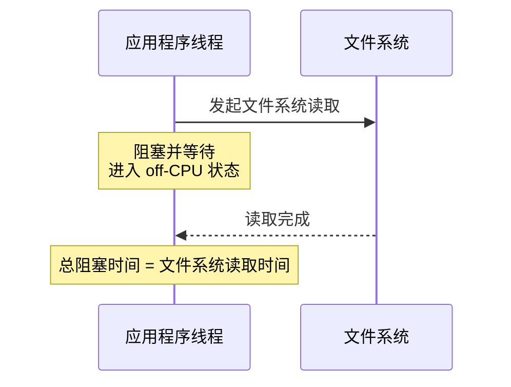
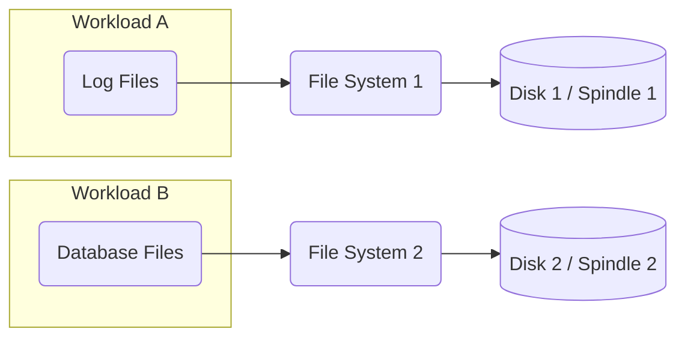

# 8.2 文件系统：方法、工具与调优

## 8.5 方法论

卷管理软件包括基于 Linux 系统的逻辑卷管理器（[[LVM|Logical Volume Manager]]）。卷，或称虚拟磁盘，也可以由硬件 RAID 控制器提供。

池化存储包含存储池中的多个磁盘，可以从该存储池中创建多个文件系统。图 8.11 展示了池化存储，并与卷进行了对比。池化存储比卷存储更灵活，因为文件系统的扩容和缩容不受底层设备的限制。现代文件系统（包括 ZFS 和 btrfs）使用了这种方式，使用 LVM 也可以实现池化存储。

池化存储可以让所有文件系统使用所有的磁盘设备，从而提高性能。工作负载之间没有隔离；在某些情况下，可以使用多个池来分离工作负载，但这需要牺牲一部分灵活性，因为磁盘设备必须在最初就分配到某一个池中。请注意，池化磁盘可以是不同类型和不同大小的，而卷则可能被限制为卷内的统一磁盘。

使用软件卷管理器或池化存储时，其他额外的性能考量包括：

- **条带宽度（Stripe width）**：使其与工作负载相匹配。
- **可观察性**：虚拟设备的利用率可能会令人困惑；应检查独立的物理设备。
- **CPU 开销**：特别是在执行 RAID 奇偶校验计算时。随着现代更快的 CPU 出现，这已不再是一个大问题。（奇偶校验计算也可以卸载到硬件 RAID 控制器。）
- **重建**：也称为重银化（resilvering），这是指将一个空磁盘添加到 RAID 组（例如，替换发生故障的磁盘）时，通过写入必要的数据使其加入该组的过程。这会显著影响性能，因为它会消耗 I/O 资源，并且可能持续数小时甚至数天。

> [!WARNING] 重建问题日益严重
> 重建是一个日益严重的问题，因为存储设备容量增长的速度快于其吞吐量增长的速度，导致重建时间增加，并使得在重建期间发生故障或介质错误的风险更大。在可能的情况下，对未挂载的驱动器进行离线重建可以缩短重建时间。

## 8.5 方法论

本节介绍用于文件系统分析和调优的各种方法论和实践。这些主题总结在表 8.3 中。

**表 8.3 文件系统性能方法论**

| 小节 | 方法论 | 类型 |
|---|---|---|
| 8.5.1 | 磁盘分析 | 观测分析 |
| 8.5.2 | 延迟分析 | 观测分析 |
| 8.5.3 | 工作负载特征归纳 | 观测分析，容量规划 |
| 8.5.4 | 性能监控 | 观测分析，容量规划 |
| 8.5.5 | 静态性能调优 | 观测分析，容量规划 |
| 8.5.6 | 缓存调优 | 观测分析，调优 |
| 8.5.7 | 工作负载分离 | 调优 |
| 8.5.8 | 微基准测试 | 实验分析 |

> [!TIP] 补充阅读
> 更多策略及其中许多方法的介绍，请参见第 2 章 方法论。

这些方法可以单独使用，也可以组合使用。笔者的建议是按以下顺序开始使用这些策略：延迟分析、性能监控、工作负载特征归纳、微基准测试和静态性能调优。您可能会找到在您的环境中效果最佳的另一种组合和排序方式。

第 8.6 节可观察性工具，展示了应用这些方法的操作系统工具。

### 8.5.1 磁盘分析

一种常见的排障策略一直是忽略文件系统，而将重点放在磁盘性能上。这种做法假设最差的 I/O 就是磁盘 I/O，因此通过仅分析磁盘，您可以方便地将注意力集中在预期的问题来源上。

在文件系统较简单且缓存较小的情况下，这通常行得通。然而在当今，这种方法会让人感到困惑，并且会遗漏整类问题（参见第 8.3.12 节 逻辑 I/O 与物理 I/O）。

### 8.5.2 延迟分析

对于延迟分析，首先要测量文件系统操作的延迟。这应该包括所有对象操作，而不仅仅是 I/O（例如，包括 `sync(2)`）。

> [!INFO] 操作延迟计算公式
> 操作延迟 = 时间（操作完成） - 时间（操作请求）

这些时间可以从四个层次之一进行测量，如表 8.4 所示。

**表 8.4 分析文件系统延迟的目标（层次）**

| 层次 | 优点 | 缺点 |
|---|---|---|
| **应用程序** | 最接近地衡量了文件系统延迟对应用程序的影响；还可以检查应用程序上下文，以确定延迟是发生在应用程序的主要功能期间，还是异步发生的。 | 技术因应用程序和应用程序软件版本的不同而有所差异。 |
| **系统调用接口** | 文档齐全的接口。通常可通过操作系统工具和静态跟踪进行观察。 | 系统调用会捕获所有文件系统类型，包括非存储文件系统（统计信息、套接字），除非经过过滤，否则可能会令人困惑。更令人困惑的是，同一个文件系统功能可能存在多个系统调用。例如，对于读取，可能有 `read(2)`、`pread64(2)`、`preadv(2)`、`preadv2(2)` 等，所有这些都需要被测量。 |
| **VFS** | 所有文件系统的标准接口；文件系统操作对应单一调用（例如，`vfs_write()`）。 | VFS 会跟踪所有文件系统类型，包括非存储文件系统，除非经过过滤，否则可能会令人困惑。 |
| **文件系统顶部** | 仅跟踪目标文件系统类型；提供一些文件系统内部上下文以获取扩展详情。 | 特定于文件系统；跟踪技术可能因文件系统软件版本而异（尽管文件系统可能具有映射到 VFS 的类似 VFS 的接口，因此不常更改）。 |

选择哪个层次可能取决于工具的可用性。请检查以下内容：

- **应用程序文档**：某些应用程序已经提供了文件系统延迟指标，或者提供了启用其收集的功能。
- **操作系统工具**：操作系统也可能提供指标，理想情况下是每个文件系统或应用程序的单独统计信息。
- **动态插桩**：如果您的系统具有动态插桩功能（Linux kprobes 和 uprobes，由各种跟踪器使用），则可以通过自定义跟踪程序检查所有层次，而无需重新启动任何东西。

延迟可以表示为每个时间间隔的平均值、分布（例如，直方图或热力图：参见第 8.6.18 节），或每个操作及其延迟的列表。对于具有高缓存命中率（超过 99%）的文件系统，每间隔平均值可能会被缓存命中延迟所主导。当存在需要识别但难以从平均值中看出的孤立高延迟实例（异常值）时，这可能会带来遗憾。检查完整的分布或每次操作的延迟可以调查此类异常值，以及不同延迟层级（包括文件系统缓存命中和未命中）的影响。

一旦发现高延迟，继续对文件系统进行下钻分析以确定其来源。

#### 事务成本

呈现文件系统延迟的另一种方式是应用程序事务（例如，数据库查询）期间等待文件系统所花费的总时间：

> [!INFO] 事务时间占比公式
> 文件系统时间百分比 = 100 * 总阻塞文件系统延迟 / 应用程序事务时间

这允许从应用程序性能的角度量化文件系统操作的成本，并预测性能改进。该指标可以表示为时间间隔内所有事务的平均值，或者单个事务的平均值。

图 8.12 显示了服务于事务的应用程序线程所花费的时间。该事务发出单个文件系统读取；应用程序阻塞并等待其完成，转换为 [[Off-CPU|离CPU]] 状态。在这种情况下，总的阻塞时间就是单次文件系统读取的时间。如果在事务期间调用了多个阻塞 I/O，则总时间是它们的总和。

*图 8.12 应用程序与文件系统延迟*



作为一个具体的例子，一个应用程序事务耗时 200 毫秒，在此期间它等待多个文件系统 I/O 的总时间为 180 毫秒。应用程序被文件系统阻塞的时间占比为 90%（100 * 180 毫秒 / 200 毫秒）。消除文件系统延迟可能会将性能提高多达 10 倍。

作为另一个例子，如果一个应用程序事务耗时 200 毫秒，而在文件系统中只花费了 2 毫秒，则文件系统——以及整个磁盘 I/O 堆栈——对事务运行时间的贡献仅为 1%。这个结果极其有用，因为它可以将性能调查引向真正的延迟来源。

如果应用程序以非阻塞方式发出 I/O，则应用程序可以在文件系统响应时继续在 [[On-CPU|CPU上]] 执行。在这种情况下，阻塞文件系统延迟仅测量应用程序阻塞离 CPU 的时间。

### 8.5.3 工作负载特征归纳

在容量规划、基准测试和模拟工作负载时，对施加的负载进行特征归纳是一项重要的实践。它还可以通过识别可以消除的不必要工作，带来一些最大的性能收益。

以下是表征文件系统工作负载的基本属性：

- 操作速率和操作类型
- 文件 I/O 吞吐量
- 文件 I/O 大小
- 读/写比率
- 同步写入比率
- 随机与顺序文件偏移量访问

> [!NOTE] 术语参考
> 操作速率和吞吐量在 8.1 节术语中定义。同步写入以及随机与顺序在 8.3 节概念中描述。

这些特征可能每秒都在变化，特别是对于按间隔执行的定时应用程序任务。为了更好地表征工作负载，除了平均值外，还应捕获最大值。更好的做法是，检查数值随时间变化的完整分布。

以下是一个工作负载描述的示例，展示了如何将这些属性表达在一起：

> [!EXAMPLE] 工作负载描述示例
> 在一个金融交易数据库上，文件系统具有随机读取工作负载，平均 18,000 次读取/秒，平均读取大小为 4 KB。总操作速率为 21,000 ops/s，其中包括读取、stat、打开、关闭以及大约 200 次同步写入/秒。写入速率稳定，而读取速率变化不定，最高可达 39,000 次读取/秒的峰值。

这些特征可以从单个文件系统实例的角度来描述，也可以从同一类型系统上的所有实例的角度来描述。

#### 高级工作负载特征归纳/检查清单

可以包含更多细节来表征工作负载。这里将它们列为需要考虑的问题，在深入研究文件系统问题时，这些问题也可以作为检查清单：

- 文件系统缓存命中率是多少？未命中率呢？
- 文件系统缓存容量和当前使用情况是多少？
- 还存在哪些其他缓存（目录、inode、缓冲区），它们的统计数据是什么？
- 过去是否尝试过调优文件系统？是否有任何文件系统参数被设置为非默认值？
- 哪些应用程序或用户正在使用文件系统？
- 正在访问、创建和删除哪些文件和目录？
- 是否遇到了任何错误？这是由于无效请求，还是文件系统的问题？
- 为什么会发出文件系统 I/O（用户级调用路径）？
- 应用程序在多大程度上直接（同步地）请求文件系统 I/O？
- I/O 到达时间的分布情况如何？

> [!TIP] 分析维度
> 其中许多问题可以针对每个应用程序或每个文件提出。它们中的任何一个也可以随时间进行检查，以寻找最大值、最小值和基于时间的变化。另请参见第 2 章方法论中的第 2.5.10 节工作负载特征归纳，其中提供了要测量特征的更高级别摘要（谁、为什么、什么、如何）。

# 8.2 文件系统：方法、工具与调优

## 性能特征刻画

前述的工作负载特征刻画检查的是施加的负载情况。以下则检查由此产生的性能表现：

- 平均文件系统操作延迟是多少？
- 是否存在高延迟的异常值？
- 操作延迟的完整分布情况如何？
- 是否存在针对文件系统或磁盘 I/O 的系统资源控制，且当前处于活动状态？

前三个问题可以针对每种操作类型单独提出。

## 事件追踪

追踪工具可用于将所有文件系统操作及详细信息记录到日志中，以便后续分析。这可以包括每次 I/O 的操作类型、操作参数、文件路径名、开始和结束时间戳、完成状态，以及进程 ID 和名称。虽然这可能是进行工作负载特征刻画的终极工具，但在实际应用中，由于文件系统操作的频率极高，它可能会带来显著的开销，通常除非经过重度过滤（例如，日志中仅包含慢速 I/O：参见 8.6.14 节中的 `ext4slower(8)` 工具），否则往往难以付诸实践。

> [!TIP]
> 事件追踪能提供最详尽的数据，但务必注意其高昂的开销。在生产环境中，强烈建议使用带有过滤条件的追踪工具（如 `ext4slower`），仅捕获超出延迟阈值的操作。

## 8.5.4 性能监控

性能监控可以识别当前存在的问题以及随时间变化的行为模式。文件系统性能的关键指标包括：

- 操作速率
- 操作延迟

操作速率是所施加工作负载最基本的特征，而延迟则是产生的性能结果。正常或糟糕延迟的阈值取决于您的工作负载、环境和延迟要求。如果您不确定，可以对已知良好与糟糕的工作负载执行微基准测试来调查延迟（例如，通常命中文件系统缓存的工作负载与通常未命中的工作负载进行对比）。参见 8.7 节，实验。

操作延迟指标可以作为每秒平均值进行监控，还可以包含最大值和标准差等其他值。理想情况下，应该能够检查延迟的完整分布情况，例如使用直方图或热力图，以寻找异常值和其他模式。

速率和延迟也可以针对每种操作类型（读、写、stat、open、close 等）进行记录。这样做将通过识别特定操作类型的差异，极大地帮助对工作负载和性能变化进行调查。

对于实施了基于文件系统的资源控制的系统，可以包含统计信息以显示是否以及何时使用了限流。

遗憾的是，在 Linux 中，通常没有现成的文件系统操作统计信息（例外情况包括 NFS，可通过 `nfsstat(8)` 获取）。

## 8.5.5 静态性能调优

静态性能调优侧重于已配置环境中的问题。对于文件系统性能，请检查静态配置的以下方面：

- 挂载了多少文件系统且正在活跃使用？
- 文件系统[[记录大小|记录大小]]是多少？
- 是否启用了访问时间戳？
- 启用了哪些其他文件系统选项（压缩、加密……）？
- 文件系统缓存是如何配置的？最大大小是多少？
- 其他缓存（目录、inode、缓冲区）是如何配置的？
- 是否存在并正在使用二级缓存？
- 存在多少存储设备且正在使用？
- 存储设备配置是什么？RAID？
- 使用了哪些文件系统类型？
- 文件系统（或内核）的版本是什么？
- 是否存在需要考虑的文件系统 Bug/补丁？
- 是否有针对文件系统 I/O 使用的资源控制？

回答这些问题可以揭示那些被忽视的配置选择。有时系统是为一种工作负载配置的，后来又被改作他用。这种方法将提醒您重新审视这些选择。

> [!INFO] 静态调优的核心
> 静态调优的关键在于“审视当前配置是否匹配当前工作负载”。系统复用、默认配置未优化等往往是潜在的巨大性能陷阱。

## 8.5.6 缓存调优

内核和文件系统可能会使用多种不同的缓存，包括缓冲区缓存、目录缓存、inode 缓存和文件系统（页）缓存。8.4 节架构中已经描述了各种缓存。根据可用的可调选项，可以对它们进行检查并通常进行调优。

## 8.5.7 工作负载隔离

某些类型的工作负载在配置为使用独占的文件系统和磁盘设备时性能更好。这种方法被称为使用“独立主轴”，因为在两个不同的工作负载位置之间寻道会产生随机 I/O，这对旋转磁盘尤其不利（参见第 9 章，磁盘）。

例如，数据库可能会从将日志文件和数据库文件分别放在不同的文件系统和磁盘上获益。数据库的安装指南通常包含有关其数据存储位置的建议。


*图：工作负载隔离示意图——“独立主轴”策略将不同 I/O 特性的工作负载分发到不同的物理磁盘，以避免寻道干扰*

## 8.5.8 微基准测试

用于文件系统和磁盘基准测试的基准测试工具（数量很多）可用于测试给定工作负载下不同文件系统类型或文件系统内设置的性能。可以测试的典型因素包括：

- **操作类型**：读、写和其他文件系统操作的速率
- **I/O 大小**：从 1 字节到 1 兆字节及更大
- **文件偏移模式**：随机或顺序
- **随机访问模式**：均匀、随机或帕累托分布
- **写入类型**：异步或同步（`O_SYNC`）
- **工作集大小**：在文件系统缓存中的适配程度
- **并发度**：并行 I/O 的数量或执行 I/O 的线程数
- **内存映射**：通过 `mmap(2)` 访问文件，而不是 `read(2)`/`write(2)`
- **缓存状态**：文件系统缓存是“冷”（未填充）还是“暖”
- **文件系统可调参数**：可能包括压缩、数据去重等

常见的组合包括随机读、顺序读、随机写和顺序写。我没有在此列表中包含直接 I/O，因为微基准测试中直接 I/O 的意图是绕过文件系统并测试磁盘设备性能（参见第 9 章，磁盘）。

微基准测试文件系统时的一个关键因素是[[工作集大小|工作集大小]]（WSS）：被访问的数据量。根据基准测试的不同，这可能是正在使用的文件的总大小。除非使用直接 I/O 标志，否则较小的工作集大小可能完全从主内存（DRAM）中的文件系统缓存返回。较大的工作集大小可能大部分从存储设备（磁盘）返回。性能差异可能达到多个数量级。对新挂载的文件系统运行基准测试，然后在缓存被填充后第二次运行，比较两者的结果，通常是展示 WSS 影响的极佳示例。（另请参见 8.7.3 节，缓存刷新。）

考虑不同基准测试的一般预期，其中包括文件的总大小（WSS），如表 8.5 所示。

**表 8.5 文件系统基准测试预期**

| 系统内存 | 总文件大小 (WSS) | 基准测试 | 预期 |
| :--- | :--- | :--- | :--- |
| 128 Gbytes | 10 Gbytes | 随机读 | 100% 缓存命中 |
| 128 Gbytes | 10 Gbytes | 随机读，直接 I/O | 100% 磁盘读取（由于直接 I/O） |
| 128 Gbytes | 1,000 Gbytes | 随机读 | 大部分磁盘读取，约 12% 缓存命中 |
| 128 Gbytes | 10 Gbytes | 顺序读 | 100% 缓存命中 |
| 128 Gbytes | 1,000 Gbytes | 顺序读 | 缓存命中（大部分由于预取）和磁盘读取的混合 |
| 128 Gbytes | 10 Gbytes | 缓冲写入 | 大部分缓存命中（缓冲），根据文件系统行为部分写入可能阻塞 |
| 128 Gbytes | 10 Gbytes | 同步写入 | 100% 磁盘写入 |

一些文件系统基准测试工具并没有清楚地说明它们正在测试什么，可能暗示是磁盘基准测试，但使用的总文件大小很小，完全从缓存返回，因此并没有测试磁盘。参见 8.3.12 节，逻辑 I/O 与物理 I/O，以了解测试文件系统（逻辑 I/O）和测试磁盘（物理 I/O）之间的区别。

一些磁盘基准测试工具通过使用直接 I/O 避免缓存和缓冲，从而通过文件系统进行操作。文件系统仍然起着次要作用，增加了代码路径开销以及文件与磁盘上放置位置之间的映射差异。

关于这个通用主题的更多信息，请参见第 12 章，基准测试。

---

## 8.6 可观察性工具

本节介绍基于 Linux 操作系统的文件系统可观察性工具。使用这些工具时请遵循上一节中的策略。

本节中的工具列在表 8.6 中。

**表 8.6 文件系统可观察性工具**

| 章节 | 工具 | 描述 |
| :--- | :--- | :--- |
| 8.6.1 | `mount` | 列出文件系统及其挂载标志 |
| 8.6.2 | `free` | 缓存容量统计 |
| 8.6.3 | `top` | 包含内存使用摘要 |
| 8.6.4 | `vmstat` | 虚拟内存统计 |
| 8.6.5 | `sar` | 各种统计信息，包括历史数据 |
| 8.6.6 | `slabtop` | 内核 slab 分配器统计 |
| 8.6.7 | `strace` | 系统调用追踪 |
| 8.6.8 | `fatrace` | 使用 fanotify 追踪文件系统操作 |
| 8.6.9 | `latencytop` | 显示系统范围的延迟来源 |
| 8.6.10 | `opensnoop` | 追踪打开的文件 |
| 8.6.11 | `filetop` | 按 IOPS 和字节排出的最活跃文件 |
| 8.6.12 | `cachestat` | 页缓存统计 |
| 8.6.13 | `ext4dist` (xfs, zfs, btrfs, nfs) | 显示 ext4 操作延迟分布 |
| 8.6.14 | `ext4slower` (xfs, zfs, btrfs, nfs) | 显示慢速 ext4 操作 |
| 8.6.15 | `bpftrace` | 自定义文件系统追踪 |

这是支持 8.5 节方法论的工具和功能选择。它从传统工具开始，然后涵盖基于追踪的工具。一些传统工具可能可在其他起源于它们的类 Unix 操作系统上使用，包括：`mount(8)`、`free(1)`、`top(1)`、`vmstat(8)` 和 `sar(1)`。许多追踪工具是基于 BPF 的，并使用 BCC 和 `bpftrace` 前端（第 15 章）；它们是：`opensnoop(8)`、`filetop(8)`、`cachestat(8)`、`ext4dist(8)` 和 `ext4slower(8)`。

请参阅每个工具的文档，包括其 man 手册页，以获取其功能的完整参考。

### 8.6.1 mount

Linux `mount(1)` 命令列出已挂载的文件系统及其挂载标志：

```bash
$ mount
/dev/nvme0n1p1 on / type ext4 (rw,relatime,discard)
devtmpfs on /dev type devtmpfs (rw,relatime,size=986036k,nr_inodes=246509,mode=755)
sysfs on /sys type sysfs (rw,nosuid,nodev,noexec,relatime)
proc on /proc type proc (rw,nosuid,nodev,noexec,relatime)
securityfs on /sys/kernel/security type securityfs (rw,nosuid,nodev,noexec,relatime)
tmpfs on /dev/shm type tmpfs (rw,nosuid,nodev)
[...]
```

第一行显示存储在 `/dev/nvme0n1p1` 上的 ext4 文件系统挂载在 `/` 上，挂载标志为 `rw`、`relatime` 和 `discard`。`relatime` 是一个提高性能的选项，它通过仅在修改或更改时间也被更新时，或者上次更新超过一天时才更新访问时间，从而减少 inode 访问时间的更新以及随后的磁盘 I/O 开销。

> [!INFO] relatime 的作用
> 传统上，每次读取文件都会更新 inode 的访问时间，这在高频读取场景下会产生大量无谓的写磁盘 I/O。`relatime` 极大地缓解了这一问题，目前多为现代系统的默认挂载参数。

### 8.6.2 free

Linux `free(1)` 命令显示内存和交换空间统计信息。以下两个命令显示了常规和宽模式（`-w`）输出，均以兆字节（`-m`）为单位：

```bash
$ free -m
            total      used      free    shared  buff/cache   available
Mem:         1950       568       163         0        1218        1187
Swap:           0         0         0
$ free -mw
            total      used      free    shared     buffers       cache   available
Mem:         1950       568       163         0          84        1133        1187
Swap:           0         0         0
```

宽模式输出显示了一个 `buffers` 列（表示缓冲区缓存大小）和一个 `cache` 列（表示页缓存大小）。默认输出将这两者合并为 `buff/cache`。

一个重要的列是 `available`（这是 `free(1)` 的新增功能），它显示了应用程序在不需交换的情况下可用的内存量。它考虑了无法立即回收的内存。

> [!TIP] available 与 free 的区别
> `free` 列仅表示当前完全未使用的内存，而 `available` 列包含了 `free` 内存加上可以被内核随时回收的缓存内存（如未修改的页缓存），因此 `available` 更能真实反映系统当前可分配给新应用的内存容量。

这些字段也可以从 `/proc/meminfo` 中读取，该文件以千字节为单位提供这些信息。

# 8.2 文件系统：方法、工具与调优

## 8.6 可观察性工具

### 8.6.3 top

某些版本的 `top(1)` 命令包含文件系统缓存细节。以下来自 Linux 版本 `top(1)` 的这些行包含了 `free(1)` 打印的 `buff/cache` 和 `available`（`avail Mem`）统计信息：

```text
MiB Mem :   1950.0 total,    161.2 free,    570.3 used,   1218.6 buff/cache
MiB Swap:      0.0 total,      0.0 free,      0.0 used.   1185.9 avail Mem 
```

有关 `top(1)` 的更多信息，请参见第 6 章，[[CPUs|CPU]]。

### 8.6.4 vmstat

`vmstat(1)` 命令与 `top(1)` 类似，也可能包含有关文件系统缓存的细节。有关 `vmstat(1)` 的更多细节，请参见第 7 章，[[Memory|内存]]。

以下以 1 秒为间隔运行 `vmstat(1)`，以提供每秒的更新：

```bash
$ vmstat 1
procs -----------memory---------- ---swap-- -----io---- -system-- ------cpu-----
 r  b   swpd   free   buff  cache   si   so    bi    bo   in   cs us sy id wa st
 0  0      0 167644  87032 1161112    0    0     7    14   14    1  4  2 90  0  5
 0  0      0 167636  87032 1161152    0    0     0     0  162  376  0  0 100  0  0
[...]
```

`buff` 列显示缓冲区缓存大小，`cache` 显示页缓存大小，两者均以千字节为单位。

### 8.6.5 sar

系统活动报告器 `sar(1)` 提供各种文件系统统计信息，并可以配置为定期记录这些信息。本书的各个章节都提到了 `sar(1)`，以介绍它提供的不同统计信息，并在第 4.4 节 sar 中进行了介绍。

以一秒为间隔执行 `sar(1)` 以报告当前活动：

```bash
# sar -v 1
Linux 5.3.0-1009-aws (ip-10-1-239-218)     02/08/20       _x86_64_  (2 CPU)
21:20:24    dentunusd   file-nr  inode-nr    pty-nr
21:20:25        27027      1344     52945         2
21:20:26        27012      1312     52922         2
21:20:27        26997      1248     52899         2
[...]
```

`-v` 选项提供以下列：

- **dentunusd**：目录项缓存未使用计数（可用条目数）
- **file-nr**：正在使用的文件句柄数
- **inode-nr**：正在使用的 inode 数
- **pty-nr**：正在使用的伪终端数

还有一个 `-r` 选项，它打印 `kbbuffers` 和 `kbcached` 列，分别用于显示缓冲区缓存和页缓存大小，以千字节为单位。

### 8.6.6 slabtop

Linux 的 `slabtop(1)` 命令打印有关内核 slab 缓存的信息，其中一些用于文件系统缓存：

```bash
# slabtop -o
 Active / Total Objects (% used)    : 604675 / 684235 (88.4%)
 Active / Total Slabs (% used)      : 24040 / 24040 (100.0%)
 Active / Total Caches (% used)     : 99 / 159 (62.3%)
 Active / Total Size (% used)       : 140593.95K / 160692.10K (87.5%)
 Minimum / Average / Maximum Object : 0.01K / 0.23K / 12.00K
  OBJS ACTIVE  USE OBJ SIZE  SLABS OBJ/SLAB CACHE SIZE NAME                   
165945 149714  90%    0.10K   4255       39     17020K buffer_head            
107898  66011  61%    0.19K   5138       21     20552K dentry                 
 67350  67350 100%    0.13K   2245       30      8980K kernfs_node_cache      
 41472  40551  97%    0.03K    324      128      1296K kmalloc-32             
 35940  31460  87%    1.05K   2396       15     38336K ext4_inode_cache       
 33514  33126  98%    0.58K   2578       13     20624K inode_cache            
 24576  24576 100%    0.01K     48      512       192K kmalloc-8          
[...]
```

在输出中可以看到一些与文件系统相关的 slab 缓存：`dentry`、`ext4_inode_cache` 和 `inode_cache`。如果不使用 `-o`（单次输出）模式，`slabtop(1)` 将刷新并更新屏幕。

Slab 可能包括：

- **buffer_head**：由缓冲区缓存使用
- **dentry**：dentry 缓存（目录项缓存）
- **inode_cache**：inode 缓存
- **ext3_inode_cache**：ext3 的 inode 缓存
- **ext4_inode_cache**：ext4 的 inode 缓存
- **xfs_inode**：XFS 的 inode 缓存
- **btrfs_inode**：btrfs 的 inode 缓存

> [!INFO] 底层机制
> `slabtop(1)` 使用 `/proc/slabinfo`，该文件在启用了 `CONFIG_SLAB` 的情况下存在。

### 8.6.7 strace

文件系统延迟可以在系统调用接口使用包括 Linux 的 `strace(1)` 在内的跟踪工具进行测量。然而，当前基于 `ptrace(2)` 实现的 `strace(1)` 可能会严重损害性能，可能仅适用于在性能开销可接受且没有其他方法分析延迟的情况下使用。有关 `strace(1)` 的更多信息，请参见第 5 章，第 5.5.4 节，strace。

此示例显示 `strace(1)` 在 ext4 文件系统上对读取操作进行计时：

```bash
$ strace -ttT -p 845
[...]
18:41:01.513110 read(9, "\334\260/\224\356k..."..., 65536) = 65536 <0.018225>
18:41:01.531646 read(9, "\371X\265|\244\317..."..., 65536) = 65536 <0.000056>
18:41:01.531984 read(9, "\357\311\347\1\241..."..., 65536) = 65536 <0.005760>
18:41:01.538151 read(9, "*\263\264\204|\370..."..., 65536) = 65536 <0.000033>
18:41:01.538549 read(9, "\205q\327\304f\370..."..., 65536) = 65536 <0.002033>
18:41:01.540923 read(9, "\6\2738>zw\321\353..."..., 65536) = 65536 <0.000032>
```

`-tt` 选项在左侧打印相对时间戳，`-T` 在右侧打印系统调用时间。每次 `read(2)` 读取 64 Kbytes，第一次耗时 18 ms，随后是 56 μs（可能已缓存），然后是 5 ms。这些读取操作针对文件描述符 9。要检查这是否针对文件系统（而不是套接字），要么在早期的 `strace(1)` 输出中可以看到 `open(2)` 系统调用，要么可以使用另一个工具如 `lsof(8)`。你还可以在 `/proc` 文件系统中找到有关 FD 9 的信息：`/proc/845/fd{,info}/9`。

> [!WARNING] 观测者效应
> 考虑到 `strace(1)` 当前的开销，测量出的延迟可能会因观测者效应而产生偏差。请参阅更新的跟踪工具，包括 `ext4slower(8)`，它们使用每 CPU 缓冲跟踪和 [[BPF]] 极大地降低了开销，提供了更准确的延迟测量。

### 8.6.8 fatrace

`fatrace(1)` 是一个使用 Linux `fanotify` API（文件访问通知）的专用跟踪器。示例输出：

```bash
# fatrace
sar(25294): O /etc/ld.so.cache
sar(25294): RO /lib/x86_64-linux-gnu/libc-2.27.so
sar(25294): C /etc/ld.so.cache
sar(25294): O /usr/lib/locale/locale-archive
sar(25294): O /usr/share/zoneinfo/America/Los_Angeles
sar(25294): RC /usr/share/zoneinfo/America/Los_Angeles
sar(25294): RO /var/log/sysstat/sa09
sar(25294): R /var/log/sysstat/sa09
[...]
```

每行显示进程名、PID、事件类型、完整路径和可选状态。事件类型可以是打开（O）、读取（R）、写入（W）和关闭（C）。`fatrace(1)` 可用于工作负载特征分析：了解访问的文件，并寻找可以消除的不必要工作。

> [!CAUTION] 性能开销
> 但是，对于繁忙的文件系统工作负载，`fatrace(1)` 每秒可能产生数万行输出，并会消耗大量 CPU 资源。通过过滤为单一事件类型，这种情况可能会有所缓解。基于 BPF 的跟踪工具，包括 `opensnoop(8)`（第 8.6.10 节），也极大地降低了开销。

### 8.6.9 LatencyTOP

LatencyTOP 是一个用于报告延迟来源的工具，可按系统范围和按进程进行聚合。文件系统延迟由 LatencyTOP 报告。例如：

```text
Cause                                                Maximum     Percentage
Reading from file                                 209.6 msec         61.9 %
synchronous write                                  82.6 msec         24.0 %
Marking inode dirty                                 7.9 msec          2.2 %
Waiting for a process to die                        4.6 msec          1.5 %
Waiting for event (select)                          3.6 msec         10.1 %
Page fault                                          0.2 msec          0.2 %
Process gzip (10969)                       Total: 442.4 msec
Reading from file                                 209.6 msec         70.2 %
synchronous write                                  82.6 msec         27.2 %
Marking inode dirty                                 7.9 msec          2.5 %
```

上半部分是系统范围的摘要，下半部分是针对单个 `gzip(1)` 进程的，该进程正在压缩文件。`gzip(1)` 的大部分延迟是由 Reading from file（读取文件）引起的，占 70.2%，而在写入新的压缩文件时，同步写入（synchronous write）占 27.2%。

LatencyTOP 由 Intel 开发，但已经有一段时间没有更新了，其网站也不再上线。它还需要通常未启用的内核选项。[7] 你可能会发现使用 BPF 跟踪工具来测量文件系统延迟更容易：请参见第 8.6.13 到 8.6.15 节。

> [!NOTE] 脚注 7
> 7 `CONFIG_LATENCYTOP` 和 `CONFIG_HAVE_LATENCYTOP_SUPPORT`

### 8.6.10 opensnoop

`opensnoop(8)`[8] 是一个 BCC 和 bpftrace 工具，用于跟踪文件打开操作。它有助于发现数据文件、日志文件和配置文件的位置。它还可以发现由频繁打开引起的性能问题，或帮助排查由文件缺失引起的问题。以下是一些示例输出，带有 `-T` 以包含时间戳：

```bash
# opensnoop -T
TIME(s)       PID    COMM               FD ERR PATH
0.000000000   26447  sshd                5   0 /var/log/btmp
[...]
1.961686000   25983  mysqld              4   0 /etc/mysql/my.cnf
1.961715000   25983  mysqld              5   0 /etc/mysql/conf.d/
1.961770000   25983  mysqld              5   0 /etc/mysql/conf.d/mysql.cnf
1.961799000   25983  mysqld              5   0 /etc/mysql/conf.d/mysqldump.cnf
1.961818000   25983  mysqld              5   0 /etc/mysql/mysql.conf.d/
1.961843000   25983  mysqld              5   0 /etc/mysql/mysql.conf.d/mysql.cnf
1.961862000   25983  mysqld              5   0 /etc/mysql/mysql.conf.d/mysqld.cnf
[...]
2.438417000   25983  mysqld              4   0 /var/log/mysql/error.log
[...]
2.816953000   25983  mysqld             30   0 ./binlog.000024
2.818827000   25983  mysqld             31   0 ./binlog.index_crash_safe
2.820621000   25983  mysqld              4   0 ./binlog.index
[...]
```

此输出包括 MySQL 数据库的启动，`opensnoop(2)` 揭示了配置文件、日志文件、数据文件（二进制日志）等。

`opensnoop(8)` 的工作原理是仅跟踪 `open(2)` 变体系统调用：`open(2)` 和 `openat(2)`。由于打开操作通常不频繁，预计其开销可以忽略不计。

BCC 版本的选项包括：

- **-T**：包含时间戳列
- **-x**：仅显示失败的打开
- **-p PID**：仅跟踪此进程
- **-n NAME**：仅当进程名包含 NAME 时显示打开操作

`-x` 选项可用于故障排查：专注于应用程序无法打开文件的情况。

> [!NOTE] 脚注 8
> 8 来源：我于 2004 年创建了第一个 opensnoop，BCC 版本于 2015 年 9 月 17 日创建，bpftrace 版本于 2018 年 9 月 8 日创建。

### 8.6.11 filetop

`filetop(8)`[9] 是一个 BCC 工具，类似于针对文件的 `top(1)`，显示最频繁读取或写入的文件名。示例输出：

```bash
# filetop
Tracing... Output every 1 secs. Hit Ctrl-C to end
19:16:22 loadavg: 0.11 0.04 0.01 3/189 23035
TID    COMM             READS  WRITES R_Kb    W_Kb    T FILE
23033  mysqld           481    0      7681    0       R sb1.ibd
23033  mysqld           3      0      48      0       R mysql.ibd
23032  oltp_read_only.  3      0      20      0       R oltp_common.lua
23031  oltp_read_only.  3      0      20      0       R oltp_common.lua
23032  oltp_read_only.  1      0      19      0       R Index.xml
23032  oltp_read_only.  4      0      16      0       R openssl.cnf
23035  systemd-udevd    4      0      16      0       R sys_vendor
[...]
```

默认情况下，显示前 20 个文件，按读取字节数列排序。第一行显示 `mysqld` 对 `sb1.ibd` 文件执行了 481 次读取，总计 7,681 Kbytes。

此工具用于工作负载特征分析和常规文件系统可观察性。正如你可以使用 `top(1)` 发现意外的消耗 CPU 的进程一样，这可能会帮助你发现意外的 I/O 繁忙文件。

> [!INFO] 默认行为与选项
> 默认情况下，`filetop` 也仅显示常规文件。`-a` 选项显示所有文件，包括 TCP 套接字和设备节点：

`filetop` 默认也只显示常规文件。`-a` 选项可以显示所有文件，包括 TCP 套接字和设备节点：

```bash
# filetop -a
[...]
TID    COMM             READS  WRITES R_Kb    W_Kb    T FILE
21701  sshd             1      0      16      0       O ptmx
23033  mysqld           1      0      16      0       R sbtest1.ibd
23335  sshd             1      0      8       0       S TCP
1      systemd          4      0      4       0       R comm
[...]
```

现在的输出中包含了其他类型（O，other）和套接字类型（S，socket）的文件。在这个例子中，类型为其他的文件 ptmx 是位于 `/dev` 下的一个字符特殊文件。

选项包括：

- **-C**：不清除屏幕：滚动输出
- **-a**：显示所有文件类型

> [!NOTE] 起源
> 9 我于 2016 年 2 月 6 日受 William LeFebvre 的 `top(1)` 启发，为 BCC 创建了此工具。

---

- **-r ROWS**：打印这么多行（默认 20）
- **-p PID**：仅跟踪此进程

除非使用 `-C`，否则屏幕会每秒刷新一次（类似 `top(1)`）。我更喜欢使用 `-C`，这样输出就会留在终端的滚动缓冲区中，以备我以后需要查阅。

### 8.6.12 cachestat

`cachestat(8)`[^10] 是一个 BCC 工具，用于显示[[页缓存|页缓存]]命中和未命中的统计信息。这可用于检查页缓存的命中率和效率，并在调查系统和应用程序调优时运行，以获取关于缓存性能的反馈。示例输出：

```bash
$ cachestat -T 1
TIME         HITS   MISSES  DIRTIES HITRATIO   BUFFERS_MB  CACHED_MB
21:00:48      586        0     1870  100.00%          208        775
21:00:49      125        0     1775  100.00%          208        776
21:00:50      113        0     1644  100.00%          208        776
21:00:51       23        0     1389  100.00%          208        776
21:00:52      134        0     1906  100.00%          208        777
[...]
```

该输出显示了一个完全被缓存的读工作负载（HITS 为 100% HITRATIO）以及一个更高的写工作负载（DIRTIES）。理想情况下，命中率接近 100%，这样应用程序的读取就不会阻塞在磁盘 I/O 上。

> [!TIP] 调优建议
> 如果您遇到可能损害性能的低命中率，您可以尝试将应用程序的内存大小调小一点，从而为页缓存留出更多空间。如果配置了[[交换设备|交换设备]]，还可以通过 `swappiness` 可调参数来优先选择从页缓存中驱逐页面，而不是进行交换。

选项包括 `-T` 用于打印时间戳。

虽然此工具为页缓存命中率提供了关键洞察，但它也是一个实验性工具，它使用 [[kprobes]] 跟踪某些内核函数，因此需要维护才能在不同的内核版本上工作。更好的情况是，如果添加了跟踪点或 `/proc` 统计信息，此工具可以重写为使用它们并变得稳定。它目前最好的用途可能仅仅是证明这样的工具是可行的。

### 8.6.13 ext4dist (xfs, zfs, btrfs, nfs)

`ext4dist(8)`[^11] 是一个 BCC 和 [[bpftrace]] 工具，用于检测 ext4 文件系统，并以直方图的形式显示常见操作（读取、写入、打开和 fsync）的[[延迟|延迟]]分布。其他文件系统也有相应的版本：`xfsdist(8)`、`zfsdist(8)`、`btrfsdist(8)` 和 `nfsdist(8)`。示例输出：

```bash
# ext4dist 10 1
Tracing ext4 operation latency... Hit Ctrl-C to end.

21:09:46:
operation = read
     usecs               : count     distribution
         0 -> 1          : 783      |***********************                 |
         2 -> 3          : 88       |**                                      |
         4 -> 7          : 449      |*************                           |
         8 -> 15         : 1306     |****************************************|
        16 -> 31         : 48       |*                                       |
        32 -> 63         : 12       |                                        |
        64 -> 127        : 39       |*                                       |
       128 -> 255        : 11       |                                        |
       256 -> 511        : 158      |****                                    |
       512 -> 1023       : 110      |***                                     |
      1024 -> 2047       : 33       |*                                       |
operation = write
     usecs               : count     distribution
         0 -> 1          : 1073     |****************************            |
         2 -> 3          : 324      |********                                |
         4 -> 7          : 1378     |************************************    |
         8 -> 15         : 1505     |****************************************|
        16 -> 31         : 183      |****                                    |
        32 -> 63         : 37       |                                        |
        64 -> 127        : 11       |                                        |
       128 -> 255        : 9        |                                        |
operation = open
     usecs               : count     distribution
         0 -> 1          : 672      |****************************************|
         2 -> 3          : 10       |                                        |
operation = fsync
     usecs               : count     distribution
       256 -> 511        : 485      |**********                              |
       512 -> 1023       : 308      |******                                  |
      1024 -> 2047       : 1779     |****************************************|
      2048 -> 4095       : 79       |*                                       |
      4096 -> 8191       : 26       |                                        |
      8192 -> 16383      : 4        |                                        |
```

这里使用了 10 秒的间隔和 1 的计数来显示单次 10 秒的跟踪。它显示了一个双峰的读取[[延迟分布|延迟分布]]：一个模式在 0 到 15 微秒之间，可能是[[内存缓存|内存缓存]]命中；另一个在 256 到 2048 微秒之间，可能是磁盘读取。其他操作的分布也可以同样进行研究。写入速度很快，可能是由于缓冲，稍后使用较慢的 `fsync` 操作刷新到磁盘。

> [!IMPORTANT] 测量层级
> 此工具及其配套的 `ext4slower(8)`（下一节）显示了应用程序可能经历的延迟。在磁盘级别测量延迟是可能的，并将在第 9 章中展示，但应用程序可能不会直接阻塞在磁盘 I/O 上，这使得这些测量结果更难解释。在可能的情况下，我优先使用 `ext4dist(8)`/`ext4slower(8)` 工具，而不是磁盘 I/O 延迟工具。有关此工具测量的到文件系统的逻辑 I/O 与到磁盘的物理 I/O 之间的差异，请参见第 8.3.12 节。

选项包括：

- **-m**：以毫秒为单位打印输出
- **-p PID**：仅跟踪此进程

来自此工具的输出可以可视化为[[延迟热力图|延迟热力图]]。有关慢速文件系统 I/O 的更多信息，请运行 `ext4slower(8)` 及其变体。

### 8.6.14 ext4slower (xfs, zfs, btrfs, nfs)

`ext4slower(8)`[^12] 跟踪常见的 ext4 操作，并为超过给定阈值的操作打印每个事件的详细信息。跟踪的操作包括读取、写入、打开和 fsync。示例输出：

```bash
# ext4slower
Tracing ext4 operations slower than 10 ms
TIME     COMM           PID    T BYTES   OFF_KB   LAT(ms) FILENAME
21:36:03 mysqld         22935  S 0       0          12.81 sbtest1.ibd
21:36:15 mysqld         22935  S 0       0          12.13 ib_logfile1
21:36:15 mysqld         22935  S 0       0          10.46 binlog.000026
21:36:15 mysqld         22935  S 0       0          13.66 ib_logfile1
21:36:15 mysqld         22935  S 0       0          11.79 ib_logfile1
[...]
```

各列显示了时间（TIME）、进程名（COMM）和 pid（PID）、操作类型（T：R 是读取，W 是写入，O 是打开，S 是同步）、以千字节为单位的偏移量（OFF_KB）、以毫秒为单位的操作延迟（LAT(ms)）以及文件名（FILENAME）。

输出显示了许多超过 10 毫秒（`ext4slower(8)` 的默认阈值）的同步操作（S）。阈值可以作为参数提供；选择 0 毫秒将显示所有操作：

```bash
# ext4slower 0
Tracing ext4 operations
21:36:50 mysqld         22935  W 917504  2048        0.42 ibdata1
21:36:50 mysqld         22935  W 1024    14165       0.00 ib_logfile1
21:36:50 mysqld         22935  W 512     14166       0.00 ib_logfile1
21:36:50 mysqld         22935  S 0       0           3.21 ib_logfile1
21:36:50 mysqld         22935  W 1746    21714       0.02 binlog.000026
21:36:50 mysqld         22935  S 0       0           5.56 ibdata1
21:36:50 mysqld         22935  W 16384   4640        0.01 undo_001
21:36:50 mysqld         22935  W 16384   11504       0.01 sbtest1.ibd
21:36:50 mysqld         22935  W 16384   13248       0.01 sbtest1.ibd
21:36:50 mysqld         22935  W 16384   11808       0.01 sbtest1.ibd
21:36:50 mysqld         22935  W 16384   1328        0.01 undo_001
21:36:50 mysqld         22935  W 16384   6768        0.01 undo_002
[...]
```

在输出中可以看到一个模式：`mysqld` 先对文件执行写入，随后执行同步操作。

> [!WARNING] 开销警告
> 跟踪所有操作可能会产生大量输出并带来相关的开销。我只在短时间内（例如十秒）这样做，以了解在其他汇总（`ext4dist(8)`）中不可见的文件系统操作模式。

选项包括 `-p PID` 用于仅跟踪单个进程，以及 `-j` 用于生成可解析的（CSV）输出。

### 8.6.15 bpftrace

`bpftrace` 是一个基于 [[BPF]] 的跟踪器，它提供了一种高级编程语言，允许创建强大的单行程序和短脚本。它非常适合基于其他工具的线索进行自定义文件系统分析。

`bpftrace` 将在第 15 章 BPF 中进行解释。本节展示了一些用于文件系统分析的示例：单行程序、系统调用跟踪、[[VFS]] 跟踪和文件系统内部机制。

#### 单行程序 (One-Liners)

以下单行程序非常有用，并演示了不同的 `bpftrace` 功能。

通过 `openat(2)` 跟踪打开的文件，并显示进程名：

```bash
bpftrace -e 't:syscalls:sys_enter_openat { printf("%s %s\n", comm, \
    str(args->filename)); }'
```

按系统调用类型统计读取系统调用：

```bash
bpftrace -e 'tracepoint:syscalls:sys_enter_*read* { @[probe] = count(); }'
```

按系统调用类型统计写入系统调用：

```bash
bpftrace -e 'tracepoint:syscalls:sys_enter_*write* { @[probe] = count(); }'
```

显示 `read()` 系统调用请求大小的分布：

```bash
bpftrace -e 'tracepoint:syscalls:sys_enter_read { @ = hist(args->count); }'
```

显示 `read()` 系统调用读取字节数（及错误）的分布：

```bash
bpftrace -e 'tracepoint:syscalls:sys_exit_read { @ = hist(args->ret); }'
```

按错误码统计 `read()` 系统调用错误：

```bash
bpftrace -e 't:syscalls:sys_exit_read /args->ret < 0/ { @[- args->ret] = count(); }'
```

统计 VFS 调用：

```bash
bpftrace -e 'kprobe:vfs_* { @[probe] = count(); }'
```

统计 PID 181 的 VFS 调用：

```bash
bpftrace -e 'kprobe:vfs_* /pid == 181/ { @[probe] = count(); }'
```

统计 ext4 跟踪点：

```bash
bpftrace -e 'tracepoint:ext4:* { @[probe] = count(); }'
```

统计 xfs 跟踪点：

```bash
bpftrace -e 'tracepoint:xfs:* { @[probe] = count(); }'
```

按进程名和用户级栈统计 ext4 文件读取：

```bash
bpftrace -e 'kprobe:ext4_file_read_iter { @[ustack, comm] = count(); }'
```

跟踪 ZFS `spa_sync()` 时间：

```bash
bpftrace -e 'kprobe:spa_sync { time("%H:%M:%S ZFS spa_sync()\n"); }'
```

按进程名和 PID 统计 dcache 引用：

```bash
bpftrace -e 'kprobe:lookup_fast { @[comm, pid] = count(); }'
```

#### 系统调用跟踪 (Syscall Tracing)

系统调用是跟踪的绝佳目标，也是许多跟踪工具的插桩来源。然而，一些系统调用缺乏文件系统上下文，使得它们在使用时容易让人困惑。我将提供一个正常工作（`openat(2)` 跟踪）和不工作（`read(2)` 跟踪）的例子，并提供建议的补救措施。

---

[^10]: 起源：我于 2014 年 12 月 28 日将其创建为一个实验性的 Ftrace 工具。Allan McAleavy 于 2015 年 11 月 6 日将其移植到了 BCC。
[^11]: 起源：我于 2016 年 2 月 12 日创建了 BCC 工具，并于 2019 年 2 月 2 日为 [Gregg 19] 创建了 bpftrace 版本。这些基于我在 2012 年开发的一个早期的 ZFS 工具。
[^12]: 起源：我于 2016 年 2 月 11 日开发了此工具，基于我在 2011 年开发的一个早期 ZFS 工具。

# 8.2 文件系统：方法、工具与调优

> [!NOTE] 延续说明
> 本部分为文档第 5/8 部分，接续前文关于系统调用追踪的讨论。

系统调用是极佳的追踪目标，也是许多追踪工具的插桩来源。然而，某些系统调用缺乏文件系统上下文，这使得它们在使用时容易引起混淆。我将提供一个成功（`openat(2)` 追踪）和失败（`read(2)` 追踪）的示例，并给出相应的补救建议。

### openat(2)

追踪 `open(2)` 系列系统调用可以显示正在被打开的文件。如今，`openat(2)` 变体更为常用。追踪它：

```bash
# bpftrace -e 't:syscalls:sys_enter_openat { printf("%s %s\n", comm,
    str(args->filename)); }'
Attaching 1 probe...
sa1 /etc/sysstat/sysstat
sadc /etc/ld.so.cache
sadc /lib/x86_64-linux-gnu/libsensors.so.5
sadc /lib/x86_64-linux-gnu/libc.so.6
sadc /lib/x86_64-linux-gnu/libm.so.6
sadc /sys/class/i2c-adapter
sadc /sys/bus/i2c/devices
sadc /sys/class/hwmon
sadc /etc/sensors3.conf
[...]
```

这段输出捕获了 `sar(1)` 执行归档统计信息的动作，以及它所打开的文件。`bpftrace` 使用了来自 [[tracepoint]] 的 `filename` 参数；所有参数可以使用 `-lv` 列出：

```bash
# bpftrace -lv t:syscalls:sys_enter_openat
tracepoint:syscalls:sys_enter_openat
    int __syscall_nr;
    int dfd;
    const char * filename;
    int flags;
    umode_t mode;
```

这些参数分别是系统调用号、文件描述符、文件名、打开标志和打开模式：这些信息足以供单行程序和工具使用，例如 `opensnoop(8)`。

### read(2)

`read(2)` 本应成为理解文件系统读取延迟的有效追踪目标。然而，请考虑其 [[tracepoint]] 参数（看看你能否发现问题所在）：

```bash
# bpftrace -lv t:syscalls:sys_enter_read
tracepoint:syscalls:sys_enter_read
    int __syscall_nr;
    unsigned int fd;
    char * buf;
    size_t count;
```

`read(2)` 可以针对文件系统、套接字、`/proc` 及其他目标调用，而这些参数并不能区分它们。为了展示这有多令人困惑，以下代码按进程名统计了 `read(2)` 系统调用的次数：

```bash
# bpftrace -e 't:syscalls:sys_enter_read { @[comm] = count(); }'
Attaching 1 probe...
^C
@[systemd-journal]: 13
@[sshd]: 141
@[java]: 3472
```

在追踪期间，Java 执行了 3,472 次 `read(2)` 系统调用，但它们是来自文件系统、套接字还是其他什么？（`sshd` 的读取很可能是套接字 I/O。）

`read(2)` 确实提供了作为整数的文件描述符（FD），但它仅仅是一个数字，并没有显示 FD 类型（而且 `bpftrace` 运行在受限制的内核模式下：它无法在 `/proc` 中查找 FD 信息）。针对这个问题，至少有四种解决方案：

> [!TIP] 解决 read(2) 追踪缺乏上下文的四种方案
> - **方案 1**：从 `bpftrace` 打印 PID 和 FD，随后使用 `lsof(8)` 或 `/proc` 查找这些 FD 以确认其类型。
> - **方案 2**：即将推出的 BPF 辅助函数 `get_fd_path()`，可以返回 FD 的路径名。这将有助于区分文件系统读取（具有路径名）与其他类型。
> - **方案 3**：改为从 [[VFS]] 追踪，那里有更多的数据结构可用。
> - **方案 4**：直接追踪文件系统函数，这会排除其他 I/O 类型。此方法被 `ext4dist(8)` 和 `ext4slower(8)` 所采用。

下一节关于 [[VFS]] 延迟追踪将展示基于 [[VFS]] 的解决方案。

---

## VFS 追踪

由于虚拟文件系统（[[VFS]]）抽象了所有文件系统（及其他设备），追踪其调用提供了一个单一的观测点，从中可以观察所有文件系统。

### VFS 计数

对 [[VFS]] 调用进行计数可以提供正在使用的操作类型的高级概览。以下使用 [[kprobes]] 统计以 “vfs_” 开头的内核函数：

```bash
# bpftrace -e 'kprobe:vfs_* { @[func] = count(); }'
Attaching 65 probes...
^C
[...]
@[vfs_statfs]: 36
@[vfs_readlink]: 164
@[vfs_write]: 364
@[vfs_lock_file]: 516
@[vfs_iter_read]: 2551
@[vfs_statx]: 3141
@[vfs_statx_fd]: 4214
@[vfs_open]: 5271
@[vfs_read]: 5602
@[vfs_getattr_nosec]: 7794
@[vfs_getattr]: 7795
```

这显示了系统范围内发生的不同操作类型。在追踪期间，共有 7,795 次 `vfs_read()` 调用。

### VFS 延迟

与系统调用一样，[[VFS]] 读取也可以是针对文件系统、套接字和其他目标的。以下 `bpftrace` 程序从内核结构（[[inode]] 超级块名称）中获取类型，提供了按类型细分的微秒级 `vfs_read()` 延迟直方图：

```bash
# vfsreadlat.bt
Tracing vfs_read() by type... Hit Ctrl-c to end.
^C
[...] 
@us[sockfs]: 
[0]                  141 |@@@@@@@@@@@@@@@@@@@@@@@@@@@@@@@@@@@@@@@@@@@@@@@@@@@@|
[1]                   91 |@@@@@@@@@@@@@@@@@@@@@@@@@@@@@@@@@                   |
[2, 4)                57 |@@@@@@@@@@@@@@@@@@@@@                               |
[4, 8)                53 |@@@@@@@@@@@@@@@@@@@                                 |
[8, 16)               86 |@@@@@@@@@@@@@@@@@@@@@@@@@@@@@@@                     |
[16, 32)               2 |                                                    |
[...]
@us[proc]: 
[0]                  242 |@@@@@@@@@@@@@@@@@@@@@@@@@@@@@@@@@@@@@@@@@@@@@@@@@@@@|
[1]                   41 |@@@@@@@@                                            |
[2, 4)                40 |@@@@@@@@                                            |
[4, 8)                61 |@@@@@@@@@@@@@                                       |
[8, 16)               44 |@@@@@@@@@                                           |
[16, 32)              40 |@@@@@@@@                                            |
[32, 64)               6 |@                                                   |
[64, 128)              3 |                                                    |

@us[ext4]: 
[0]                  653 |@@@@@@@@@@@@@@@@@@@@@@@@@@@@@@@@@@@@@@@@@@@         |
[1]                  447 |@@@@@@@@@@@@@@@@@@@@@@@@@@@@@@                      |
[2, 4)                70 |@@@@                                                |
[4, 8)               774 |@@@@@@@@@@@@@@@@@@@@@@@@@@@@@@@@@@@@@@@@@@@@@@@@@@@@|
[8, 16)              417 |@@@@@@@@@@@@@@@@@@@@@@@@@@@@                        |
[16, 32)              25 |@                                                   |
[32, 64)               7 |                                                    |
[64, 128)            170 |@@@@@@@@@@@                                         |
[128, 256)            55 |@@@                                                 |
[256, 512)            59 |@@@                                                 |
[512, 1K)            118 |@@@@@@@                                             |
[1K, 2K)               3 |@@                                                  |
```

输出（截断部分）还包含了以下文件系统的延迟直方图：`sysfs`、`devpts`、`pipefs`、`devtmpfs`、`tmpfs` 和 `anon_inodefs`。

其源代码为：

```bash
#!/usr/local/bin/bpftrace
#include <linux/fs.h>

BEGIN
{
        printf("Tracing vfs_read() by type... Hit Ctrl-C to end.\n");
}

kprobe:vfs_read
{
        @file[tid] = ((struct file *)arg0)->f_inode->i_sb->s_type->name;
        @ts[tid] = nsecs;
}

kretprobe:vfs_read
/@ts[tid]/
{
        @us[str(@file[tid])] = hist((nsecs - @ts[tid]) / 1000);
        delete(@file[tid]); delete(@ts[tid]);
}

END
{
        clear(@file); clear(@ts);
}
```

你可以扩展此工具以包含其他操作，例如 `vfs_readv()`、`vfs_write()`、`vfs_writev()` 等。要理解这段代码，可以从第 15.2.4 节“编程”开始，那里解释了为 `vfs_read()` 计时的基础知识。

> [!WARNING] 延迟与性能的关联性
> 请注意，如第 8.3.1 节“文件系统延迟”中所述，此延迟可能直接影响应用程序性能，也可能不影响。这取决于该延迟是在应用程序请求期间遇到的，还是发生在异步后台任务期间。为了解答这个问题，你可以将用户栈追踪（`ustack`）作为额外的直方图键包含进来，这可能会揭示 `vfs_read()` 调用是否发生在应用程序请求期间。

---

## 文件系统内部机制

如果需要，你可以开发自定义工具来显示文件系统内部的行为。首先尝试使用 [[tracepoint]]（如果可用）。列出 `ext4` 的 [[tracepoint]]：

```bash
# bpftrace -l 'tracepoint:ext4:*'
tracepoint:ext4:ext4_other_inode_update_time
tracepoint:ext4:ext4_free_inode
tracepoint:ext4:ext4_request_inode
tracepoint:ext4:ext4_allocate_inode
tracepoint:ext4:ext4_evict_inode
tracepoint:ext4:ext4_drop_inode
[...]
```

其中每一个都有参数，可以使用 `-lv` 列出。如果 [[tracepoint]] 不够用（或者对于你的文件系统类型不可用），请考虑使用 [[kprobes]] 进行动态插桩。列出 `ext4` 的 [[kprobes]] 目标：

```bash
# bpftrace -lv 'kprobe:ext4_*'
kprobe:ext4_has_free_clusters
kprobe:ext4_validate_block_bitmap
kprobe:ext4_get_group_number
kprobe:ext4_get_group_no_and_offset
kprobe:ext4_get_group_desc
kprobe:ext4_wait_block_bitmap
[...]
```

在此内核版本（5.3）中，有 105 个 `ext4` [[tracepoint]] 和 538 个可能的 `ext4` [[kprobes]]。

---

## 8.6.17 其他工具

本书其他章节以及《BPF Performance Tools》[Gregg 19] 中包含的文件系统可观察性工具列于表 8.7 中。

**表 8.7 其他文件系统可观察性工具**

| 章节 | 工具 | 描述 |
| :--- | :--- | :--- |
| 5.5.6 | `syscount` | 统计包括文件系统相关的系统调用 |
| [Gregg 19] | `statsnoop` | 追踪 `stat(2)` 系列调用 |
| [Gregg 19] | `syncsnoop` | 追踪 `sync(2)` 及相关变体调用并带时间戳 |
| [Gregg 19] | `mmapfiles` | 统计 `mmap(2)` 的文件 |
| [Gregg 19] | `scread` | 统计 `read(2)` 的文件 |
| [Gregg 19] | `fmapfault` | 统计文件映射缺页 |
| [Gregg 19] | `filelife` | 追踪短命文件及其生存期（以秒为单位） |
| [Gregg 19] | `vfsstat` | 常见 VFS 操作统计 |
| [Gregg 19] | `vfscount` | 统计所有 VFS 操作 |
| [Gregg 19] | `vfssize` | 显示 VFS 读/写大小 |
| [Gregg 19] | `fsrwstat` | 按文件系统类型显示 VFS 读/写 |
| [Gregg 19] | `fileslower` | 显示慢速文件读/写 |
| [Gregg 19] | `filetype` | 按文件类型和进程显示 VFS 读/写 |
| [Gregg 19] | `ioprofile` | 统计 I/O 上的栈以显示代码路径 |
| [Gregg 19] | `writesync` | 按 sync 标志显示常规文件写入 |
| [Gregg 19] | `writeback` | 显示回写事件和延迟 |
| [Gregg 19] | `dcstat` | 目录缓存命中统计 |
| [Gregg 19] | `dcsnoop` | 追踪目录缓存查找 |
| [Gregg 19] | `mountsnoop` | 系统范围内追踪 mount 和 umount |
| [Gregg 19] | `icstat` | Inode 缓存命中统计 |
| [Gregg 19] | `bufgrow` | 按进程和字节的缓冲区缓存增长 |
| [Gregg 19] | `readahead` | 显示预读命中和效率 |

其他与 Linux 文件系统相关的工具包括：

- **`df(1)`**：报告文件系统使用量和容量统计
- **`inotify`**：一个用于监控文件系统事件的 Linux 框架

某些文件系统类型除了操作系统提供的工具外，还有其自己特定的性能工具，例如 [[ZFS]]。

### ZFS

[[ZFS]] 自带 `zpool(1M)` 命令，该命令具有用于观察 ZFS 池统计信息的 `iostat` 子选项。它报告池操作速率（读取和写入）和吞吐量。

一个受欢迎的附加工具是 `arcstat.pl`，它报告 [[ARC]] 和 L2ARC 的大小以及命中和未命中率。例如：

```bash
$ arcstat 1
    time  read  miss  miss%  dmis  dm%  pmis  pm%  mmis  mm%  arcsz     c
04:45:47     0     0      0     0    0     0    0     0    0    14G   14G
04:45:49   15K    10      0    10    0     0    0     1    0    14G   14G
04:45:50   23K    81      0    81    0     0    0     1    0    14G   14G
04:45:51   65K    25      0    25    0     0    0     4    0    14G   14G
[...]
```

这些统计信息是每个间隔的，含义如下：

- **read, miss**：总的 [[ARC]] 访问次数，未命中次数
- **miss%, dm%, pm%, mm%**：[[ARC]] 未命中百分比（总计、需求、预取、元数据）
- **dmis, pmis, mmis**：需求、预取、元数据的未命中次数
- **arcsz, c**：[[ARC]] 大小，[[ARC]] 目标大小

`arcstat.pl` 是一个从 `kstat` 读取统计信息的 Perl 程序。

### 8.6.18 可视化

施加在文件系统上的负载可以随时间绘制为折线图，以帮助识别基于时间的使用模式。分别为读、写和其他文件系统操作绘制单独的图表可能会很有帮助。

文件系统延迟的分布预计是双峰的：一个模式是文件系统缓存命中的低延迟，另一个是缓存未命中的高延迟（存储设备 I/O）。因此，将分布表示为单个值（例如均值、众数或中位数）会产生误导。

解决此问题的一种方法是使用显示完整分布的可视化方法，例如热力图。热力图已在第 2 章 方法论 第 2.10.3 节 热力图中介绍过。图 8.13 展示了一个文件系统延迟热力图的示例：它在 x 轴上显示时间的推移，在 y 轴上显示 I/O 延迟 [Gregg 09a]。

此热力图显示了启用 [[L2ARC]] 设备对 NFSv3 延迟产生的影响。L2ARC 设备是主内存之后的二级 ZFS 缓存，通常使用闪存（在第 8.3.2 节 缓存 中曾提及）。图 8.13 中的系统具有 128 Gbytes 的主内存（DRAM）和 600 Gbytes 的 L2ARC（读优化 SSD）。热力图的左半部分显示没有 L2ARC 设备（L2ARC 被禁用），右半部分显示带有 L2ARC 设备的延迟。


> [!INFO] 图 8.13 文件系统延迟热力图
> 左半部分为未启用 L2ARC 的延迟分布，右半部分为启用 L2ARC 后的延迟分布。

对于左半部分，文件系统延迟要么低，要么高，中间被一个间隔分开。低延迟是底部的蓝线，大约在 0 毫秒左右，这很可能是主内存缓存命中。高延迟从大约 3 毫秒开始一直延伸到顶部，呈现为“云状”，这很可能是旋转磁盘的延迟。这种双峰延迟分布是由旋转磁盘提供支撑时文件系统延迟的典型特征。

对于右半部分，L2ARC 被启用，延迟现在通常低于 3 毫秒，并且较高的磁盘延迟更少。你可以看到 L2ARC 的延迟是如何填补了热力图左侧存在间隔的范围，从而整体上降低了文件系统延迟。

### 8.7 实验

本节介绍用于主动测试文件系统性能的工具。关于应遵循的策略建议，请参见第 8.5.8 节 微基准测试。

使用这些工具时，最好让 `iostat(1)` 持续运行，以确认工作负载是否按预期到达磁盘，这可能意味着完全没有到达磁盘。例如，当测试一个应该很容易放入文件系统缓存的工作集大小时，对于读工作负载的期望是 100% 的缓存命中率，因此 `iostat(1)` 不应显示大量的磁盘 I/O。`iostat(1)` 将在第 9 章 磁盘中介绍。

#### 8.7.1 临时测试

`dd(1)` 命令（设备到设备复制）可用于执行顺序文件系统性能的临时测试。以下命令以 1 Mbyte 的 I/O 大小写入然后读取一个名为 `file1` 的 1 Gbyte 文件：

- **写入**: `dd if=/dev/zero of=file1 bs=1024k count=1k`
- **读取**: `dd if=file1 of=/dev/null bs=1024k`

Linux 版本的 `dd(1)` 在完成时会打印统计信息。例如：

```bash
$ dd if=/dev/zero of=file1 bs=1024k count=1k
1024+0 records in
1024+0 records out
1073741824 bytes (1.1 GB, 1.0 GiB) copied, 0.76729 s, 1.4 GB/s
```

这显示了 1.4 Gbytes/s 的文件系统写入吞吐量（正在使用回写缓存，因此这仅仅是弄脏了内存，稍后将根据 `vm.dirty_*` 可调参数设置刷新到磁盘：参见第 7 章 内存 第 7.6.1 节 可调参数）。

#### 8.7.2 微基准测试工具

有许多可用的文件系统基准测试工具，包括 Bonnie、Bonnie++、iozone、tiobench、SysBench、[[fio]] 和 FileBench。这里将按复杂度递增的顺序讨论其中几个。另请参阅第 12 章 基准测试。我个人推荐使用 fio。

##### Bonnie, Bonnie++

Bonnie 工具是一个简单的 C 程序，用于从单线程测试单个文件上的多种工作负载。它最初由 Tim Bray 于 1989 年编写 [Bray 90]。使用很简单，不需要参数（将使用默认值）：

```bash
$ ./Bonnie
File './Bonnie.9598', size: 104857600
[...]
              -------Sequential Output-------- ---Sequential Input-- --Random--
              -Per Char- --Block--- -Rewrite-- -Per Char- --Block--- --Seeks---
Machine    MB K/sec %CPU K/sec %CPU K/sec %CPU K/sec %CPU K/sec %CPU  /sec %CPU
          100 123396 100.0 1258402 100.0 996583 100.0 126781 100.0 2187052 100.0 
164190.1 299.0
```

输出包括每次测试期间的 CPU 时间，达到 100% 表明 Bonnie 从未在磁盘 I/O 上阻塞，而是始终命中缓存并保持在 CPU 上。原因是目标文件大小为 100 Mbytes，在此系统上完全被缓存了。你可以使用 `-s size` 更改文件大小。

有一个名为 Bonnie-64 的 64 位版本，允许测试更大的文件。还有一个由 Russell Coker 用 C++ 重写的版本，称为 Bonnie++ [Coker 01]。

> [!WARNING] 潜在误导
> 不幸的是，像 Bonnie 这样的文件系统基准测试工具可能会产生误导，除非你清楚地了解正在测试的是什么。第一个结果，一个 `putc(3)` 测试，可能会根据系统库的实现而有所不同，此时测试目标就变成了系统库而不是文件系统。参见第 12 章 基准测试 第 12.3.2 节 主动基准测试中的示例。

##### fio

由 Jens Axboe 开发的 Flexible IO Tester ([[fio]]) 是一个可定制的文件系统基准测试工具，具有许多高级功能 [Axboe 20]。促使我使用它而不是其他基准测试工具的两个功能是：

- **非均匀随机分布**，可以更准确地模拟真实世界的访问模式（例如，`-random_distribution=pareto:0.9`）
- **延迟百分位数报告**，包括 99.00、99.50、99.90、99.95、99.99

以下是一个示例输出，显示了具有 8 Kbyte I/O 大小、5 Gbyte 工作集大小和非均匀访问模式 (pareto:0.9) 的随机读工作负载：

```bash
# fio --runtime=60 --time_based --clocksource=clock_gettime --name=randread \
--numjobs=1 --rw=randread --random_distribution=pareto:0.9 --bs=8k --size=5g \
--filename=fio.tmp
randread: (g=0): rw=randread, bs=8K-8K/8K-8K/8K-8K, ioengine=sync, iodepth=1
fio-2.0.13-97-gdd8d
Starting 1 process
Jobs: 1 (f=1): [r] [100.0% done] [3208K/0K/0K /s] [401 /0 /0  iops] [eta 00m:00s]
randread: (groupid=0, jobs=1): err= 0: pid=2864: Tue Feb  5 00:13:17 2013
  read : io=247408KB, bw=4122.2KB/s, iops=515 , runt= 60007msec
    clat (usec): min=3 , max=67928 , avg=1933.15, stdev=4383.30
     lat (usec): min=4 , max=67929 , avg=1934.40, stdev=4383.31
    clat percentiles (usec):
     |  1.00th=[    5],  5.00th=[    5], 10.00th=[    5], 20.00th=[    6],
     | 30.00th=[    6], 40.00th=[    6], 50.00th=[    7], 60.00th=[  620],
     | 70.00th=[  692], 80.00th=[ 1688], 90.00th=[ 7648], 95.00th=[10304],
     | 99.00th=[19584], 99.50th=[24960], 99.90th=[39680], 99.95th=[51456],
     | 99.99th=[63744]
    bw (KB/s)  : min= 1663, max=71232, per=99.87%, avg=4116.58, stdev=6504.45
    lat (usec) : 4=0.01%, 10=55.62%, 20=1.27%, 50=0.28%, 100=0.13%
    lat (usec) : 500=0.01%, 750=15.21%, 1000=4.15%
    lat (msec) : 2=3.72%, 4=2.57%, 10=11.50%, 20=4.57%, 50=0.92%
    lat (msec) : 100=0.05%
  cpu          : usr=0.18%, sys=1.39%, ctx=13260, majf=0, minf=42
  IO depths    : 1=100.0%, 2=0.0%, 4=0.0%, 8=0.0%, 16=0.0%, 32=0.0%, >=64=0.0%
     submit    : 0=0.0%, 4=100.0%, 8=0.0%, 16=0.0%, 32=0.0%, 64=0.0%, >=64=0.0%
     complete  : 0=0.0%, 4=100.0%, 8=0.0%, 16=0.0%, 32=0.0%, 64=0.0%, >=64=0.0%
     issued    : total=r=30926/w=0/d=0, short=r=0/w=0/d=0
```

延迟百分位数（`clat`）显示直到第 50 个百分位的延迟非常低，根据延迟（5 到 7 微秒），我推测这是缓存命中。其余的百分位数显示了缓存未命中的影响，包括队列的尾部；在这种情况下，第 99.99 个百分位数显示了 63 毫秒的延迟。

> [!NOTE] 百分位数的局限性
> 虽然这些百分位数缺乏真正理解可能是多峰分布的信息，但它们确实关注了最有趣的部分：较慢模式（磁盘 I/O）的尾部。

对于类似但更简单的工具，你可以尝试 [[SysBench]]（在第 6 章 第 6.8.2 节 SysBench 中有一个使用 SysBench 进行 CPU 分析的示例）。另一方面，如果你想要更多的控制，请尝试 FileBench。

##### FileBench

FileBench 是一个可编程的文件系统基准测试工具，其中应用程序工作负载可以通过在其工作负荷模型语言（Workload Model Language）中进行描述来模拟。这允许模拟具有不同行为的线程，并指定同步线程行为。它附带了各种此类配置，称为“个性（personalities）”，包括一个用于模拟 Oracle 数据库 I/O 模型的配置。不幸的是，FileBench 不是一个容易学习和使用的工具，可能只有那些全职从事文件系统工作的人才会对它感兴趣。

#### 8.7.3 缓存刷新

Linux 提供了一种刷新（丢弃条目）文件系统缓存的方法，这对于从一致且“冷”的缓存状态（如系统启动后的状态）基准测试性能可能很有用。此机制在内核源码文档（`Documentation/sysctl/vm.txt`）中描述得非常简单：

```bash
# 释放页缓存：
echo 1 > /proc/sys/vm/drop_caches
# 释放可回收的 slab 对象（包括 dentries 和 inodes）：
echo 2 > /proc/sys/vm/drop_caches
# 释放 slab 对象和页缓存：
echo 3 > /proc/sys/vm/drop_caches
```

> [!TIP] 基准测试建议
> 在其他基准测试运行之前释放所有内容（3）可能特别有用，这样系统就可以以一致的状态（冷缓存）开始，有助于提供一致的基准测试结果。

### 8.8 调优

许多调优方法已在第 8.5 节 方法论中介绍，包括缓存调优和工作负载特征描述。后者可以通过识别和消除不必要的工作来带来最高的调优收益。本节包括特定的调优参数（可调参数）。

调优的具体细节——可用的选项以及应将它们设置为什么——取决于操作系统版本、文件系统类型和预期的工作负载。以下各节提供了可能可用的选项以及为何可能需要调优它们的示例。我将介绍应用程序调用和两种示例文件系统类型：[[ext4]] 和 [[ZFS]]。有关页缓存的调优，请参见第 7 章 内存。

#### 8.8.1 应用程序调用

第 8.3.7 节 同步写入 提到了如何通过使用 `fsync(2)` 刷新一组逻辑写入，而不是在使用 `O_DSYNC/O_RSYNC` `open(2)` 标志时单独刷新，来提高同步写工作负载的性能。

其他可以提高性能的调用包括 `posix_fadvise()` 和 `madvise(2)`，它们为缓存资格提供提示。

##### posix_fadvise()

此库调用（`fadvise64(2)` 系统调用的包装器）作用于文件的一个区域，并具有以下函数原型：

```c
int posix_fadvise(int fd, off_t offset, off_t len, int advice);
```

其建议（advice）可以如表 8.8 所示。

**表 8.8 Linux `posix_fadvise()` 建议标志**

| 建议参数 | 描述 |
| :--- | :--- |
| `POSIX_FADV_SEQUENTIAL` | 指定的数据范围将被顺序访问。 |
| `POSIX_FADV_RANDOM` | 指定的数据范围将被随机访问。 |
| `POSIX_FADV_NOREUSE` | 数据将不会被重复使用。 |
| `POSIX_FADV_WILLNEED` | 数据在不久的将来将再次被使用。 |
| `POSIX_FADV_DONTNEED` | 数据在不久的将来将不再被使用。 |

内核可以利用这些信息来提高性能，帮助它决定何时最好地预取数据，以及何时最好地缓存数据。如应用程序所建议的，这可以提高高优先级数据的缓存命中率。有关建议参数的完整列表，请参阅系统上的 man 手册页。

##### madvise()

此系统调用作用于内存映射，并具有以下概要：

```c
int madvise(void *addr, size_t length, int advice);
```

其建议（advice）可以如表 8.9 所示。

*(注：表 8.9 内容将在下文继续)*

# 8.2 文件系统：方法、工具与调优

> [!NOTE] 延续说明
> 本部分为文档的第 7/8 部分，内容涵盖文件系统调优（ext4, ZFS）、练习题及参考文献。

## 8.8.2 ext4

在 Linux 上，ext2、ext3 和 ext4 文件系统可以通过以下四种方式之一进行调优：

- [[挂载选项|mount options]]
- `tune2fs(8)` 命令
- `/sys/fs/ext4` 属性文件
- `e2fsck(8)` 命令

### mount 和 tune2fs

挂载选项可以在挂载时设置，既可以使用 `mount(8)` 命令手动设置，也可以在引导时通过 `/boot/grub/menu.lst` 和 `/etc/fstab` 设置。可用的选项记录在 `mount(8)` 的 man 手册页中。一些示例选项如下：

```bash
# man mount
[...]
FILESYSTEM-INDEPENDENT MOUNT OPTIONS
[...]
       atime  Do not use the noatime feature, so the inode access time is con-
              trolled  by  kernel  defaults.  See also the descriptions of the
              relatime and strictatime mount options.
       noatime
              Do not update inode access times on this  filesystem  (e.g.  for
              faster access on the news spool to speed up news servers).  This
[...]
       relatime
              Update  inode  access  times  relative to modify or change time.
              Access time is only updated if the previous access time was ear-
              lier  than  the  current modify or change time.  (Similar to
              noatime, but it doesn't break mutt or  other  applications  that
              need  to know if a file has been read since the last time it was
              modified.)
 
              Since Linux 2.6.30, the kernel defaults to the behavior provided
              by   this   option  (unless  noatime  was  specified),  and  the
              strictatime option is required to obtain traditional  semantics.
              In  addition, since Linux 2.6.30, the file's last access time is
              always updated if it is more than 1 day old.
[...]
```

`noatime` 选项在历史上一直用于通过避免访问时间戳更新及其相关的磁盘 I/O 来提高性能。正如这段输出所描述的，现在 `relatime` 已成为默认选项，它同样减少了这些更新。

`mount(8)` man 手册页涵盖了通用挂载选项和特定于文件系统的挂载选项；然而，对于 ext4，特定于文件系统的挂载选项有自己独立的 man 手册页 `ext4(5)`：

```bash
# man ext4
[...]
Mount options for ext4
[...]
       The  options  journal_dev, journal_path, norecovery, noload, data, com-
       mit, orlov, oldalloc, [no]user_xattr, [no]acl, bsddf,  minixdf,  debug,
       errors,  data_err,  grpid,  bsdgroups, nogrpid, sysvgroups, resgid, re-
       suid, sb, quota, noquota, nouid32, grpquota, usrquota,  usrjquota,  gr-
       pjquota, and jqfmt are backwardly compatible with ext3 or ext2.
       journal_checksum | nojournal_checksum
              The  journal_checksum option enables checksumming of the journal
              transactions.  This will allow the recovery code in  e2fsck  and
[...]
```

可以使用 `tune2fs -l device` 和 `mount`（不带选项）查看当前的挂载设置。`tune2fs(8)` 可以设置或清除各种挂载选项，如其自身的 man 手册页所述。

一个常用的用于提高性能的挂载选项是 `noatime`：它避免了文件访问时间戳的更新，如果文件系统用户不需要这些时间戳，这将减少后端 I/O。

### /sys/fs 属性文件

一些额外的可调参数可以通过 `/sys` 文件系统实时设置。对于 ext4：

```bash
# cd /sys/fs/ext4/nvme0n1p1
# ls
delayed_allocation_blocks  last_error_time        msg_ratelimit_burst
err_ratelimit_burst        lifetime_write_kbytes  msg_ratelimit_interval_ms
err_ratelimit_interval_ms  max_writeback_mb_bump  reserved_clusters
errors_count               mb_group_prealloc      session_write_kbytes
extent_max_zeroout_kb      mb_max_to_scan         trigger_fs_error
first_error_time           mb_min_to_scan         warning_ratelimit_burst
inode_goal                 mb_order2_req          warning_ratelimit_interval_ms
inode_readahead_blks       mb_stats
journal_task               mb_stream_req
# cat inode_readahead_blks
32
```

此输出显示 ext4 最多将预读 32 个 inode 表块。并非所有这些文件都是可调参数：有些仅用于提供信息。它们记录在 Linux 源码的 `Documentation/admin-guide/ext4.rst` [Linux 20h] 中，该文档也记录了挂载选项。

### e2fsck

最后，`e2fsck(8)` 命令可用于重建 ext4 文件系统中的目录索引，这可能有助于提高性能。例如：

```bash
e2fsck -D -f /dev/hdX
```

`e2fsck(8)` 的其他选项与检查和修复文件系统有关。

## 8.8.3 ZFS

ZFS 支持每个文件系统有大量可调参数（称为属性），同时也有较少数量的系统级全局可调参数。可以使用 `zfs(1)` 命令列出这些参数。例如：

```bash
# zfs get all zones/var
NAME       PROPERTY              VALUE                  SOURCE
[...]
zones/var  recordsize            128K                   default
zones/var  mountpoint            legacy                 local
zones/var  sharenfs              off                    default
zones/var  checksum              on                     default
zones/var  compression           off                    inherited from zones
zones/var  atime                 off                    inherited from zones
[...]
```

（截断的）输出包含属性名称、当前值和来源的列。来源显示了它是如何被设置的：是从更高级别的 ZFS 数据集继承的、默认值，还是为该文件系统本地设置的。

这些参数也可以使用 `zfs(1M)` 命令进行设置，并在其 man 手册页中有详细描述。与性能相关的关键参数列于表 8.10 中。

**表 8.10 关键 ZFS 数据集可调参数**

| 参数 | 选项 | 描述 |
| :--- | :--- | :--- |
| `recordsize` | 512 到 128 K | 建议的文件块大小 |
| `compression` | on \| off \| lzjb \| gzip \| gzip-[1–9] \| zle \| lz4 | 轻量级算法（如 lzjb）在某些情况下可以通过缓解后端 I/O 拥塞来提高性能 |
| `atime` | on \| off | 访问时间戳更新（会导致读后写） |
| `primarycache` | all \| none \| metadata | [[ARC]] 策略；通过使用“none”或“metadata”（仅元数据），可以减少由低优先级文件系统（如归档文件）引起的缓存污染 |
| `secondarycache` | all \| none \| metadata | [[L2ARC]] 策略 |
| `logbias` | latency \| throughput | 同步写入建议：“latency”使用日志设备，而“throughput”使用池设备 |
| `sync` | standard \| always \| disabled | 同步写入行为 |

通常需要调优的最重要的参数是记录大小（record size），以匹配应用程序的 I/O。它通常默认为 128 KB，这对于小型随机 I/O 来说可能效率低下。请注意，这不适用于小于记录大小的文件，这些文件将使用等于其文件长度的动态记录大小保存。如果不需要访问时间戳，禁用 `atime` 也可以提高性能。

ZFS 还提供了系统级的可调参数，包括用于调整事务组（TXG）同步时间的参数（`zfs_txg_synctime_ms`、`zfs_txg_timeout`），以及用于元数据块切换到基于空间而非基于时间优化分配的阈值（`metaslab_df_free_pct`。将 TXG 调小可以通过减少与其他 I/O 的争用和排队来提高性能。

与其他内核可调参数一样，请查阅其文档以获取完整的列表、描述和警告。

## 8.9 练习

1. 回答以下关于文件系统术语的问题：
   - [[逻辑 I/O]] 与 [[物理 I/O]] 有什么区别？
   - 随机 I/O 与顺序 I/O 有什么区别？
   - 什么是[[直接 I/O]]？
   - 什么是非阻塞 I/O？
   - 什么是[[工作集大小]]？

2. 回答以下概念性问题：
   - [[VFS]] 的作用是什么？
   - 描述文件系统延迟，特别是可以从哪里测量它。
   - 预取（读前）的目的是什么？
   - 直接 I/O 的目的是什么？

3. 回答以下更深入的问题：
   - 描述使用 `fsync(2)` 相对于 `O_SYNC` 的优势。
   - 描述 `mmap(2)` 相对于 `read(2)/write(2)` 的优缺点。
   - 描述逻辑 I/O 在变为物理 I/O 时为什么会发生膨胀（膨胀）的原因。
   - 描述逻辑 I/O 在变为物理 I/O 时为什么会发生缩减（缩减）的原因。
   - 解释文件系统[[写时复制]]如何提高性能。

4. 为您的操作系统开发以下流程：
   - 一份文件系统缓存调优检查清单。这应该列出存在的文件系统缓存、如何检查它们当前的大小和使用情况以及命中率。
   - 一份文件系统操作的工作负载特征描述检查清单。包括如何获取每个细节，并尝试首先使用现有的 OS 可观察性工具。

5. 执行以下任务：
   - 选择一个应用程序，并测量文件系统操作和延迟。包括：
     - 文件系统操作延迟的完整分布，而不仅仅是平均值。
     - 每秒钟应用程序每个线程在文件系统操作中所花费的时间比例。
   - 使用微基准测试工具，通过实验确定文件系统缓存的大小。在使用该工具时解释您的选择。同时展示当工作集不再被缓存时的性能下降（使用任何指标）。

6. （可选，高级）开发一个可观察性工具，提供同步与异步文件系统写入的指标。这应该包括它们的速率和延迟，并且能够识别发出它们的进程 ID，使其适合用于工作负载特征描述。

7. （可选，高级）开发一个工具，提供间接和膨胀的文件系统 I/O 的统计信息：应用程序未直接发出的额外字节和 I/O。该工具应将此额外 I/O 分解为不同类型以解释其原因。

## 8.10 参考文献

- [Ritchie 74] Ritchie, D. M., and Thompson, K., “The UNIX Time-Sharing System,” Communications of the ACM 17, no. 7, pp. 365–75, July 1974
- [Lions 77] Lions, J., A Commentary on the Sixth Edition UNIX Operating System, University of New South Wales, 1977.

# 8.2 文件系统：方法、工具与调优

> [!INFO] 章节信息
> **页码范围**：422-461
> **内容概述**：文件系统延迟与工作负载分析方法、可观察性工具（strace, cachestat, bpftrace等）、微基准测试及调优技巧。
> **文档部分**：8/8

---

## 8.10 参考文献

[Ritchie 74] Ritchie, D. M., and Thompson, K., “The UNIX Time-Sharing System,” Communications of the ACM 17, no. 7, pp. 365–75, July 1974

[Lions 77] Lions, J., A Commentary on the Sixth Edition UNIX Operating System, University of New South Wales, 1977.

[McKusick 84] McKusick, M. K., Joy, W. N., Leffler, S. J., and Fabry, R. S., “A Fast File System for UNIX.” ACM Transactions on Computer Systems (TOCS) 2, no. 3, August 1984.

[Bach 86] Bach, M. J., The Design of the UNIX Operating System, Prentice Hall, 1986.

[Bray 90] Bray, T., “Bonnie,” http://www.textuality.com/bonnie, 1990.

[Sweeney 96] Sweeney, A., “Scalability in the XFS File System,” USENIX Annual Technical Conference, https://www.cs.princeton.edu/courses/archive/fall09/cos518/papers/xfs.pdf, 1996.

[Vahalia 96] Vahalia, U., UNIX Internals: The New Frontiers, Prentice Hall, 1996.

[Coker 01] Coker, R., “bonnie++,” https://www.coker.com.au/bonnie++, 2001.

[XFS 06] “XFS User Guide,” https://xfs.org/docs/xfsdocs-xml-dev/XFS_User_Guide/tmp/en-US/html/index.html, 2006.

[Gregg 09a] Gregg, B., “L2ARC Screenshots,” http://www.brendangregg.com/blog/2009-01-30/l2arc-screenshots.html, 2009.

[Corbet 10] Corbet, J., “Dcache scalability and RCU-walk,” LWN.net, http://lwn.net/Articles/419811, 2010.

[Doeppner 10] Doeppner, T., Operating Systems in Depth: Design and Programming, Wiley, 2010.

[XFS 10] “Runtime Stats,” https://xfs.org/index.php/Runtime_Stats, 2010.

[Oracle 12] “ZFS Storage Pool Maintenance and Monitoring Practices,” Oracle Solaris Administration: ZFS File Systems, https://docs.oracle.com/cd/E36784_01/html/E36835/storage-9.html, 2012.

[Ahrens 19] Ahrens, M., “State of OpenZFS,” OpenZFS Developer Summit 2019, https://drive.google.com/file/d/197jS8_MWtfdW2LyvIFnH58uUasHuNszz/view, 2019.

[Axboe 19] Axboe, J., “Efficient IO with io_uring,” https://kernel.dk/io_uring.pdf, 2019.

[Gregg 19] Gregg, B., BPF Performance Tools: Linux System and Application Observability, Addison-Wesley, 2019.

[Axboe 20] Axboe, J., “Flexible I/O Tester,” https://github.com/axboe/fio, last updated 2020.

[Linux 20h] “ext4 General Information,” Linux documentation, https://www.kernel.org/doc/html/latest/admin-guide/ext4.html, accessed 2020.

[Torvalds 20a] Torvalds, L., “Re: Do not blame anyone. Please give polite, constructive criticism,” https://www.realworldtech.com/forum/?threadid=189711&curpostid=189841, 2020.

> [!NOTE] 
> 本页 intentionally left blank（原书留白页）

---

## 附注：图像上下文说明

> [!INFO] 原书图像参考
> 以下记录了原书此部分包含的图像位置及上下文，供参考：
> 
> - **[Image 2383 on Page 425]**：位于第 425 页的图像 2383。
> - **[Image 2462 on Page 450]**：位于第 450 页的图像 2462。