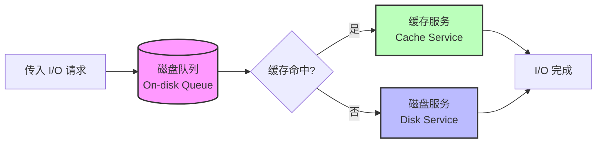
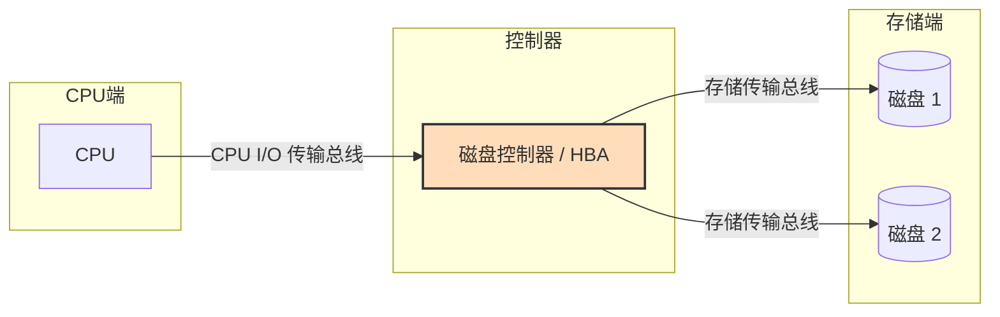
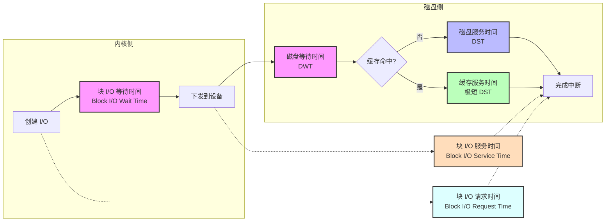
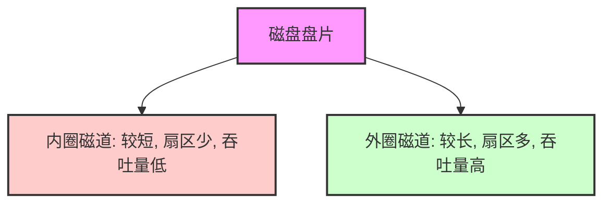
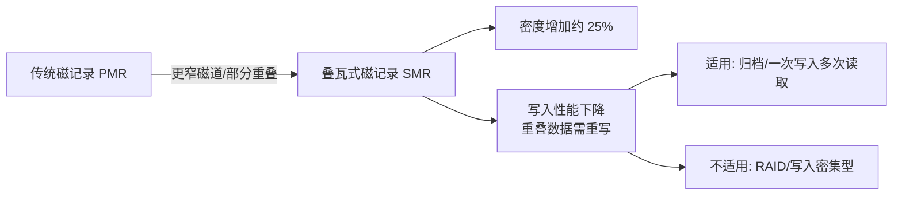
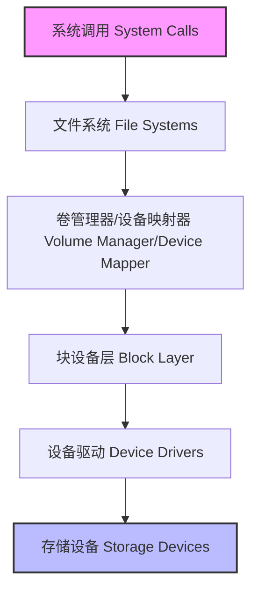
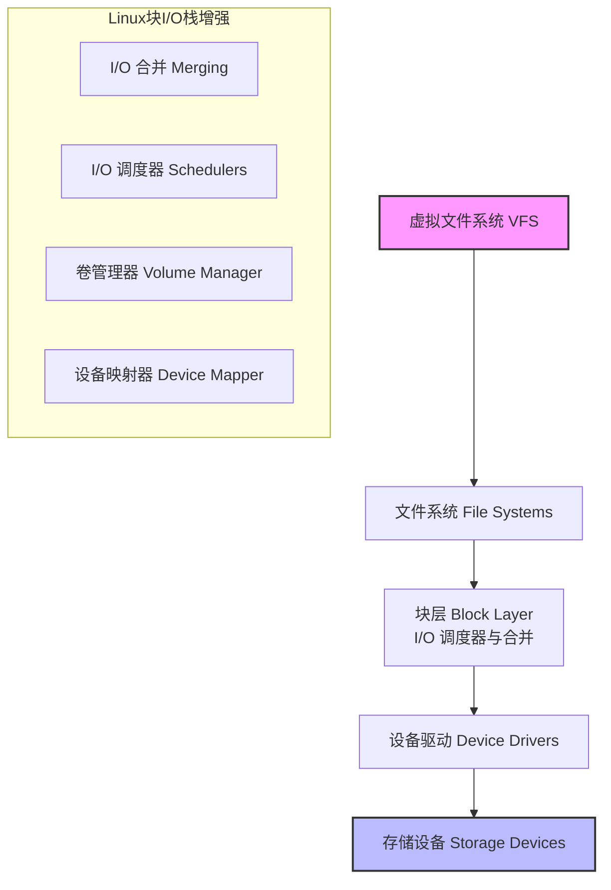
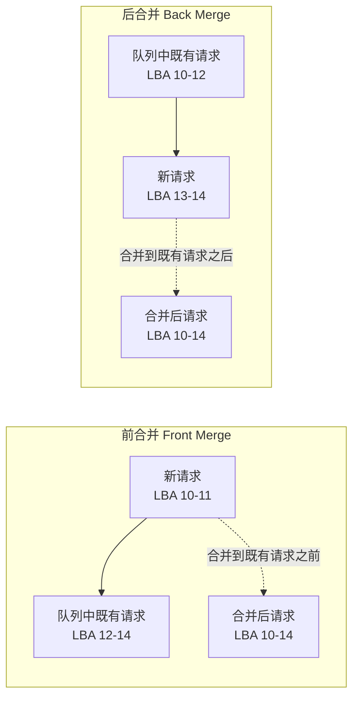

# 9.1 磁盘：概念与架构

磁盘 I/O 可能会导致显著的应用程序延迟，因此是系统性能分析的重要目标。在高负载下，磁盘会成为瓶颈，当系统等待磁盘 I/O 完成时，CPU 会处于空闲状态。识别并消除这些瓶颈，可以将性能和应用吞吐量提升数个数量级。

术语“磁盘”指的是系统的主要存储设备。它们包括基于闪存的固态硬盘（SSD）和磁性旋转磁盘。引入 SSD 主要是为了改善磁盘 I/O 性能，它们也确实做到了这一点。然而，对容量、I/O 速率和吞吐量的需求也在不断增加，因此闪存设备同样无法对性能问题免疫。

本章的学习目标是：

- 理解磁盘模型与概念。
- 理解磁盘访问模式如何影响性能。
- 理解解释磁盘利用率的风险。
- 熟悉磁盘设备特性与内部结构。
- 熟悉从文件系统到设备的内核路径。
- 理解 [[RAID]] 级别及其性能。
- 遵循不同的磁盘性能分析方法论。
- 表征系统级和进程级的磁盘 I/O。
- 测量磁盘 I/O 延迟分布并识别异常值。
- 识别请求磁盘 I/O 的应用程序和代码路径。
- 使用跟踪器详细调查磁盘 I/O。
- 了解磁盘可调参数。

本章由六个部分组成，前三部分提供磁盘 I/O 分析的基础，后三部分展示其在基于 Linux 系统上的实际应用。各部分内容如下：

- **背景**：介绍与存储相关的术语、磁盘设备的基本模型以及关键的磁盘性能概念。
- **架构**：提供存储硬件和软件架构的通用描述。
- **方法论**：描述性能分析方法论，包括观察法和实验法。
- **可观测性工具**：展示基于 Linux 系统的磁盘性能可观测性工具，包括跟踪和可视化。
- **实验**：总结磁盘基准测试工具。
- **调优**：描述磁盘可调参数示例。

上一章涵盖了建立在磁盘之上的文件系统性能，它是理解应用程序性能更好的研究对象。

---

## 9.1 术语

本章使用的与磁盘相关的术语包括：

- **虚拟磁盘 (Virtual disk)**：存储设备的模拟。它在系统中表现为单个物理磁盘，但它可能由多个磁盘构建，也可能是磁盘的一部分。
- **传输总线 (Transport)**：用于通信的物理总线，包括数据传输（I/O）和其他磁盘命令。
- **扇区 (Sector)**：磁盘上的一个存储块，传统上大小为 512 字节，但现在通常是 4 KB。
- **I/O**：严格来说，I/O 仅包括磁盘读取和写入，不包括其他磁盘命令。I/O 至少可以通过方向（读或写）、磁盘地址（位置）和大小（字节）来描述。
- **磁盘命令 (Disk commands)**：可以命令磁盘执行其他非数据传输命令（例如，缓存刷新）。
- **吞吐量 (Throughput)**：在磁盘中，吞吐量通常指当前的数据传输速率，以字节/秒为单位测量。
- **带宽 (Bandwidth)**：这是存储传输总线或控制器的最大可能数据传输速率；它受硬件限制。
- **I/O 延迟 (I/O latency)**：I/O 操作从开始到结束的时间。第 9.3.1 节“时间度量”定义了更精确的时间术语。请注意，网络中使用“延迟”一词是指发起 I/O 所需的时间，随后才是数据传输时间。
- **延迟异常值 (Latency outliers)**：具有异常高延迟的磁盘 I/O。

> [!NOTE] 其他术语
> 本章还将介绍其他术语。词汇表包含了供参考的基础术语，包括磁盘 ([[Disk]])、磁盘控制器 ([[Disk Controller]])、存储阵列 ([[Storage Array]])、本地磁盘 ([[Local Disks]])、远程磁盘 ([[Remote Disks]]) 和 [[IOPS]]。另请参阅第 2 章和第 3 章中的术语部分。

---

## 9.2 模型

以下简单模型说明了磁盘 I/O 性能的一些基本原理。

### 9.2.1 简单磁盘

现代磁盘包含一个用于 I/O 请求的片上队列，如图 9.1 所示。

**图 9.1 带有队列的简单磁盘**


磁盘接受的 I/O 可能正在队列中等待或正在被服务。这个简单的模型类似于杂货店的结账，顾客排队等待服务。它也非常适合使用排队论进行分析。

虽然这可能暗示这是一个先到先服务（FCFS）的队列，但片上磁盘控制器可以应用其他算法来优化性能。这些算法可能包括用于旋转磁盘的电梯寻道（参见第 9.4.1 节“磁盘类型”的讨论），或者用于读和写 I/O 的单独队列（特别是对于基于闪存的磁盘）。

### 9.2.2 缓存磁盘

添加片上缓存允许某些读取请求从更快的内存类型中得到满足，如图 9.2 所示。这可以实现为包含在物理磁盘设备内的小容量内存（DRAM）。

虽然缓存命中会以非常低（好）的延迟返回，但缓存未命中仍然频繁发生，并以较高的磁盘设备延迟返回。

片上缓存还可以用于提高写入性能，方法是将其用作写回缓存 ([[Write-back Cache]])。这在数据传输到缓存之后、在较慢的传输到持久性磁盘存储之前，就发出写入已完成的信号。相对的概念是直写缓存 ([[Write-through Cache]])，它仅在完全传输到下一级之后才完成写入。

在实践中，存储写回缓存通常与电池耦合，以便在发生电源故障时，缓冲的数据仍然可以被保存。这种电池可以位于磁盘或磁盘控制器上。

**图 9.2 带有片上缓存的简单磁盘**



### 9.2.3 控制器

一种简单类型的磁盘控制器如图 9.3 所示，它连接 CPU I/O 传输总线与存储传输总线及连接的磁盘设备。这些也被称为主机总线适配器 ([[HBA|Host Bus Adapters, HBAs]])。

**图 9.3 简单磁盘控制器和连接的传输总线**



性能可能受到这两种总线中的任何一种、磁盘控制器或磁盘的限制。有关磁盘控制器的更多信息，请参见第 9.4 节“架构”。

---

## 9.3 概念

以下是磁盘性能中的重要概念。

### 9.3.1 时间度量

I/O 时间可以测量为：

- **I/O 请求时间**（也称为 I/O 响应时间）：从发出 I/O 到其完成的全部时间
- **I/O 等待时间**：在队列上等待所花费的时间
- **I/O 服务时间**：处理 I/O 的时间（未等待）

这些如图 9.4 所示。

**图 9.4 I/O 时间术语（通用）**


> [!INFO] 术语来源
> 术语“服务时间”起源于磁盘是由操作系统直接管理的简单设备的时候，因此操作系统知道磁盘何时在主动服务 I/O。现在磁盘有自己的内部排队，操作系统的服务时间包括了在内核队列中等待的时间。

在可能的情况下，我使用澄清性的术语来说明正在测量的是什么，从哪个开始事件到哪个结束事件。开始和结束事件可以是基于内核的或基于磁盘的，基于内核的时间是从磁盘设备的块 I/O 接口测量的（如图 9.7 所示）。

**从内核角度看：**

- **块 I/O 等待时间**（也称为 OS 等待时间）：从创建新 I/O 并将其插入内核 I/O 队列，到它离开最后一个内核队列并向磁盘设备下发所花费的时间。这可能跨越多个内核级队列，包括块 I/O 层队列和磁盘设备队列。
- **块 I/O 服务时间**：从向设备下发请求到设备发出完成中断的时间。
- **块 I/O 请求时间**：块 I/O 等待时间和块 I/O 服务时间之和：从创建 I/O 到其完成的全部时间。

**从磁盘角度看：**

- **磁盘等待时间**：在片上队列上花费的时间。
- **磁盘服务时间**：离开片上队列后，I/O 被主动处理所需的时间。
- **磁盘请求时间**（也称为磁盘响应时间和磁盘 I/O 延迟）：磁盘等待时间和磁盘服务时间之和，等于块 I/O 服务时间。

这些如图 9.5 所示，其中 DWT 是磁盘等待时间 (Disk Wait Time)，DST 是磁盘服务时间 (Disk Service Time)。该图还显示了片上缓存，以及磁盘缓存命中如何导致更短的磁盘服务时间 (DST)。

**图 9.5 内核和磁盘时间术语**



> [!TIP] 术语语境
> I/O 延迟是另一个常用的术语，在第 1 章中介绍过。与其他术语一样，它的含义取决于测量的位置。单独的“I/O 延迟”可能指块 I/O 请求时间：整个 I/O 时间。应用程序和性能工具通常使用术语“磁盘 I/O 延迟”来指代磁盘请求时间：设备上的全部时间。如果你从设备的角度与硬件工程师交谈，他们可能使用术语“磁盘 I/O 延迟”来指代磁盘等待时间。

块 I/O 服务时间通常被视为当前磁盘性能的度量标准（这是旧版 `iostat(1)` 显示的内容）；但是，您应该意识到这是一种简化。在图 9.7 中，描绘了一个通用 I/O 栈，它显示了块设备接口下方的三个可能的驱动层。这些层中的任何一个都可以实现自己的队列，或者可能阻塞在互斥锁 ([[Mutex]]) 上，从而给 I/O 增加延迟。此延迟包含在块 I/O 服务时间中。

#### 计算时间

内核统计数据通常无法直接观察到磁盘服务时间，但可以使用 [[IOPS]] 和利用率 ([[Utilization]]) 来推断平均磁盘服务时间：

$$ \text{disk service time} = \frac{\text{utilization}}{\text{IOPS}} $$

例如，利用率为 60% 且 IOPS 为 300 时，得出平均服务时间为 2 ms（600 ms / 300 IOPS）。这假设利用率反映的是单个设备（或服务中心），它一次只能处理一个 I/O。磁盘通常可以并行处理多个 I/O，这使得此计算不准确。

与其使用内核统计数据，不如使用事件跟踪 ([[Event Tracing]])，通过测量磁盘 I/O 下发和完成的高分辨率时间戳来提供准确的磁盘服务时间。这可以使用本章后面描述的工具来完成（例如，第 9.6.6 节中的 `biolatency(8)`）。

### 9.3.2 时间尺度

磁盘 I/O 的时间尺度可能相差数个数量级，从几十微秒到数千毫秒不等。在尺度最慢的一端，糟糕的应用程序响应时间可能是由单个慢速磁盘 I/O 引起的；在最快的一端，磁盘 I/O 可能仅在数量巨大时才成为问题（许多快速 I/O 的总和等于一个慢速 I/O）。

作为背景，表 9.1 提供了磁盘 I/O 延迟可能范围的一般概念。要获取精确和最新的值，请查阅磁盘供应商文档，并执行您自己的微基准测试。另请参阅第 2 章“方法论”，了解磁盘 I/O 以外的时间尺度。

为了更好地说明所涉及的数量级，“缩放”列显示了基于假设片上缓存命中延迟为一秒的比较。

**表 9.1 磁盘 I/O 延迟的时间尺度示例**

| 事件 | 延迟 | 缩放比例 (若缓存命中=1秒) |
| :--- | :--- | :--- |
| 片上缓存命中 | < 100 μs ¹ | 1 秒 |
| 闪存读取（从小到大 I/O） | ~100 到 1,000 μs | 1 到 10 秒 |
| 旋转磁盘顺序读取 | ~1 ms | 10 秒 |
| 旋转磁盘随机读取 (7,200 rpm) | ~8 ms | 1.3 分钟 |
| 旋转磁盘随机读取（慢速，排队中） | > 10 ms | 1.7 分钟 |
| 旋转磁盘随机读取（队列中有数十个） | > 100 ms | 17 分钟 |
| 最坏情况虚拟磁盘 I/O（硬件控制器，RAID-5，排队中，随机 I/O） | > 1,000 ms | 2.8 小时 |

> [!NOTE] 脚注
> ¹ 对于非易失性内存 express ([[NVMe]]) 存储设备，该值为 10 到 20 μs：这些设备通常是连接 via PCIe 总线卡的闪存。

# 9.1 磁盘：概念与架构

这些延迟的解读可能因环境要求而异。在企业级存储行业工作时，我认为任何超过 10 ms 的磁盘 I/O 都属于异常缓慢，是潜在的性能问题源。而在云计算行业，对高延迟的容忍度更高，尤其是在那些本身就已经预期到网络与客户端浏览器之间存在高延迟的面向 Web 的应用中。在这些环境中，磁盘 I/O 可能只有超过 50 ms 时才会成为问题（单次 I/O，或应用程序请求期间的总耗时）。

该表还说明，磁盘可以返回两种类型的延迟：一种是磁盘缓存命中（小于 100 μs），另一种是缓存未命中（1–8 ms 及以上，取决于访问模式和设备类型）。由于磁盘会返回这两者的混合结果，将它们一起表示为平均延迟（正如 `iostat(1)` 所做的那样）可能会产生误导，因为这实际上是一个具有双峰的分布。有关磁盘 I/O 延迟分布直方图的示例，请参见第 2 章[[方法论]]中的图 2.23。

## 9.3.3 缓存

最好的磁盘 I/O 性能就是完全没有磁盘 I/O。软件栈的许多层都试图通过缓存读取和缓冲写入来避免磁盘 I/O，一直到磁盘本身。这些缓存的完整列表在第 3 章[[操作系统]]的表 3.2 中，其中包括应用程序级和文件系统缓存。在磁盘设备驱动层及以下，它们可能包含表 9.2 中列出的缓存。

**表 9.2 磁盘 I/O 缓存**

| 缓存 | 示例 |
| :--- | :--- |
| 设备缓存 | ZFS vdev |
| 块缓存 | 缓冲区缓存 |
| 磁盘控制器缓存 | RAID 卡缓存 |
| 存储阵列缓存 | 阵列缓存 |
| 磁盘内置缓存 | 磁盘数据控制器 (DDC) 附带的 DRAM |

基于块的缓冲区缓存已在第 8 章[[文件系统]]中描述过。这些磁盘 I/O 缓存对于提高随机 I/O 工作负载的性能尤为重要。

## 9.3.4 随机 vs. 顺序 I/O

磁盘 I/O 工作负载可以使用术语**随机**和**顺序**来描述，这是基于 I/O 在磁盘上的相对位置（磁盘偏移量）。这些术语在第 8 章[[文件系统]]中讨论文件访问模式时已经提及。

顺序工作负载也称为**流式**工作负载。术语“流式”通常在应用程序级别使用，用于描述“到磁盘”（文件系统）的流式读取和写入。

在磁性旋转磁盘时代，研究随机与顺序磁盘 I/O 模式非常重要。对于这些磁盘，随机 I/O 会产生额外的延迟，因为磁盘磁头需要寻道，并且盘片在两次 I/O 之间需要旋转。如图 9.6 所示，磁头在扇区 1 和扇区 2 之间移动时，寻道和旋转都是必要的（实际采取的路径将尽可能直接）。性能调优包括识别随机 I/O 并尝试通过多种方式消除它，包括缓存、将随机 I/O 隔离到单独的磁盘，以及通过磁盘放置来减少寻道距离。

> [!INFO] 图 9.6 旋转磁盘
> 以下 Mermaid 图表概念性地展示了磁头在旋转盘片上的不同扇区之间移动时所需的寻道和旋转过程：
> 
> ```mermaid
> flowchart LR
>     subgraph Disk_Platte[旋转盘片]
>         direction LR
>         S1[扇区 1] --> Seek[磁头寻道\n与盘片旋转] --> S2[扇区 2]
>     end
>     Head[磁盘磁头] -.-> S1
>     Head -.-> S2
> ```

其他类型的磁盘，包括基于闪存的 SSD，在随机和顺序读取模式下的表现通常没有差异。根据驱动器的不同，可能会由于其他因素而产生微小差异，例如，地址查找缓存可以跨越顺序访问但不能跨越随机访问。小于块大小的写入可能会由于读-改-写周期而遇到性能损失，特别是对于随机写入。

> [!NOTE] 
> 请注意，从操作系统看到的磁盘偏移量可能与物理磁盘上的偏移量不匹配。例如，硬件提供的虚拟磁盘可能会跨多个磁盘映射连续范围的偏移量。磁盘可能以自己的方式重新映射偏移量（通过磁盘数据控制器）。有时无法通过检查偏移量来识别随机 I/O，但可以通过测量增加的磁盘服务时间来推断。

## 9.3.5 读写比

除了识别随机与顺序工作负载外，另一个特征度量是读取与写入的比率，涉及 IOPS 或吞吐量。这可以表示为一段时间内的比率或百分比，例如，“系统自启动以来一直以 80% 的读取率运行。”

理解这个比率有助于设计和配置系统。读取率高的系统可能最能从添加缓存中受益。写入率高的系统可能最能从增加更多磁盘以增加最大可用吞吐量和 IOPS 中受益。

读取和写入本身可能表现出不同的工作负载模式：读取可能是随机 I/O，而写入可能是顺序的（特别是对于[[写时复制]]文件系统）。它们也可能表现出不同的 I/O 大小。

## 9.3.6 I/O 大小

平均 I/O 大小（字节）或 I/O 大小的分布是另一个工作负载特征。较大的 I/O 大小通常提供较高的吞吐量，尽管每次 I/O 的延迟也会更长。

I/O 大小可能会被磁盘设备子系统更改（例如，量化为 512 字节的扇区）。自从 I/O 在应用程序级别发出后，其大小也可能被内核组件（如文件系统、卷管理器和设备驱动程序）膨胀或缩小。参见第 8 章[[文件系统]]第 8.3.12 节“逻辑 vs. 物理 I/O”中的膨胀和缩小部分。

某些磁盘设备，特别是基于闪存的设备，在不同读取和写入大小下的表现差异非常大。例如，基于闪存的磁盘驱动器可能在 4 KB 读取和 1 MB 写入时性能最佳。理想的 I/O 大小可能由磁盘供应商记录，或者可以通过微基准测试来识别。当前使用的 I/O 大小可以使用观察工具找到（参见第 9.6 节，观察工具）。

## 9.3.7 IOPS 并不等价

由于上述最后三个特征，IOPS 并不是等同创造的，不能在不同设备和工作负载之间直接比较。单独的 IOPS 值并没有太大意义。

例如，对于旋转磁盘，5,000 顺序 IOPS 的工作负载可能比 1,000 随机 IOPS 的工作负载快得多。基于闪存的 IOPS 也很难比较，因为它们的 I/O 性能通常与 I/O 大小和方向（读或写）相关。

IOPS 甚至可能对应用程序工作负载没那么重要。由随机请求组成的工作负载通常对延迟敏感，在这种情况下，高 IOPS 速率是可取的。流式（顺序）工作负载对吞吐量敏感，这可能使得具有较大 I/O 的较低 IOPS 速率更为理想。

> [!TIP] 
> 要使 IOPS 有意义，请包含其他细节：随机或顺序、I/O 大小、读/写、缓冲/直接，以及并行 I/O 数量。还应考虑使用基于时间的指标，如利用率和[[服务时间]]，这些指标反映最终的性能并且更容易比较。

## 9.3.8 非数据传输磁盘命令

除了 I/O 读取和写入之外，磁盘还可以接收其他命令。例如，带有磁盘内置缓存的磁盘可能会收到将缓存刷新到磁盘的命令。这样的命令不是数据传输；数据先前已通过写入发送到磁盘。

另一个命令示例用于丢弃数据：ATA TRIM 命令，或 SCSI UNMAP 命令。这告诉驱动器某个扇区范围不再需要，可以帮助 SSD 驱动器维持写入性能。

这些磁盘命令会影响性能，并可能导致磁盘在处理这些命令时处于忙碌状态，而其他 I/O 只能等待。

## 9.3.9 利用率

利用率可以计算为在某个时间间隔内磁盘忙碌地主动执行工作的时间。

利用率为 0% 的磁盘是“空闲”的，而利用率为 100% 的磁盘持续忙于执行 I/O（和其他磁盘命令）。100% 利用率的磁盘很可能是性能问题的来源，特别是如果它们长时间保持在 100%。然而，任何比率的磁盘利用率都可能导致性能下降，因为磁盘 I/O 通常是一项缓慢的活动。

在 0% 和 100% 之间可能还存在一个点（比如 60%），由于排队（无论是在磁盘队列还是在操作系统中）的可能性增加，磁盘的性能不再令人满意。成为问题的确切利用率值取决于磁盘、工作负载和延迟要求。参见第 2 章[[方法论]]第 2.6.5 节排队理论中的 M/D/1 和 60% 利用率部分。

要确认高利用率是否导致了应用程序问题，请研究磁盘响应时间以及应用程序是否在此 I/O 上阻塞。应用程序或操作系统可能正在异步执行 I/O，因此缓慢的 I/O 并不会直接导致应用程序等待。

> [!WARNING] 
> 请注意，利用率是一个区间汇总指标。磁盘 I/O 可能是突发发生的，特别是由于写回刷新，这在较长时间间隔内汇总时可能会被掩盖。有关利用率指标类型的进一步讨论，请参见第 2 章[[方法论]]第 2.3.11 节，利用率。

### 虚拟磁盘利用率

对于由硬件（例如磁盘控制器或网络附加存储）提供的虚拟磁盘，操作系统可能知道虚拟磁盘何时忙碌，但对其底层构建的实际磁盘的性能一无所知。这导致了操作系统报告的虚拟磁盘利用率与实际磁盘上发生的情况显著不同（且违反直觉）的场景：

- 一个 100% 繁忙且构建在多个物理磁盘之上的虚拟磁盘，可能仍然能够接受更多工作。在这种情况下，100% 可能意味着某些磁盘一直繁忙，但并非所有磁盘一直繁忙，因此仍有部分磁盘是空闲的。
- 包含写回缓存的虚拟磁盘在写入工作负载期间可能显得不那么繁忙，因为磁盘控制器会立即返回写入完成信号，即使底层磁盘在此后的一段时间内仍然繁忙。
- 磁盘可能由于硬件 RAID 重建而繁忙，而操作系统却没有看到相应的 I/O。

出于同样的原因，解释由操作系统软件（软件 RAID）创建的虚拟磁盘的利用率也可能很困难。但是，操作系统应该也会公开物理磁盘的利用率，可以对其进行检查。

一旦物理磁盘达到 100% 利用率并且有更多 I/O 请求，它就会变得饱和。

## 9.3.10 饱和度

饱和度是衡量超出资源可提供能力而排队的工作量。对于磁盘设备，它可以计算为操作系统中设备等待队列的平均长度（假设它执行排队）。

这提供了超越 100% 利用率点的性能度量。100% 利用率的磁盘可能没有饱和（排队），也可能有大量饱和，这会由于 I/O 排队而显著影响性能。

您可能会假设利用率低于 100% 的磁盘没有饱和，但这实际上取决于利用率的计算间隔：在一个间隔内 50% 的磁盘利用率可能意味着该间隔一半的时间利用率是 100%，而另一半时间是空闲的。任何区间汇总都可能遇到类似的问题。当需要确切了解发生了什么时，可以使用跟踪工具来检查 I/O 事件。

# 9.1 磁盘：概念与架构

## 9.3.11 I/O Wait（I/O 等待）

I/O wait 是一个按 CPU 统计的性能指标，它显示了 CPU 处于空闲状态的时间，在此期间 CPU 调度器队列中存在因磁盘 I/O 而阻塞的线程（处于睡眠状态）。这将 CPU 空闲时间划分为无事可做的时间，以及因等待磁盘 I/O 而阻塞的时间。单个 CPU 上较高的 I/O wait 比率表明磁盘可能成为了瓶颈，导致 CPU 在等待磁盘时处于空闲状态。

> [!WARNING] 易混淆的指标
> I/O wait 可能是一个非常令人困惑的指标。如果出现另一个极度消耗 CPU 的进程，I/O wait 的值可能会下降：因为 CPU 现在有事情可做，而不是处于空闲状态。然而，尽管 I/O wait 指标下降了，相同的磁盘 I/O 依然存在并阻塞着线程。反之亦然，系统管理员在升级应用软件时有时也会遇到这种情况：新版本效率更高，使用的 CPU 周期更少，从而暴露了 I/O wait。这可能会让系统管理员误以为是升级导致了磁盘问题并使性能变差，而实际上磁盘性能并未改变，只是 CPU 性能得到改善而已。

一个更可靠的指标是应用程序线程在磁盘 I/O 上阻塞的时间。这能反映出应用程序线程因磁盘而承受的痛苦，无论 CPU 同时还在做哪些其他工作。该指标可以使用静态或动态插桩技术来测量。

I/O wait 在 Linux 系统上仍然是一个流行的指标，尽管其性质容易让人混淆，但它已被成功用于识别一类磁盘瓶颈：磁盘繁忙，CPU 空闲。解读该指标的一种方式是：将任何 I/O wait 视为系统瓶颈的迹象，然后对系统进行调优以将其降至最低——即使该 I/O 依然与 CPU 利用率并发发生。并发 I/O 更有可能是非阻塞 I/O，不太可能造成直接问题。而由 I/O wait 识别出的非并发 I/O，更有可能是应用程序阻塞型 I/O，也就是瓶颈所在。

## 9.3.12 同步与异步（Synchronous vs. Asynchronous）

理解磁盘 I/O 延迟可能不会直接影响应用程序性能这一点非常重要，前提是应用程序 I/O 与磁盘 I/O 是异步操作的。这通常发生在[[Write-Back Caching|写回缓存]]的情况下，此时应用程序 I/O 提前完成，而磁盘 I/O 稍后才发出。

应用程序可能会使用[[Read-Ahead|预读]]来执行异步读取，这样在磁盘完成 I/O 时就不会阻塞应用程序。文件系统也可能自行发起预读以预热缓存（Prefetch）。

即使应用程序正在同步等待 I/O，该应用程序代码路径也可能并非关键路径，且相对于客户端应用程序的请求是异步的。它可能是一个应用程序的 I/O 工作线程，专门创建用于管理 I/O，而其他线程则继续处理工作。

> [!INFO] 内核异步 I/O 支持
> 内核通常也支持异步或非阻塞 I/O，即提供一个 API 供应用程序请求 I/O，并在稍后的某个时间得到完成的通知。有关这些主题的更多信息，请参见第 8 章[[File Systems|文件系统]]的第 8.3.9 节[[Non-Blocking I/O|非阻塞 I/O]]；第 8.3.5 节[[Read-Ahead|预读]]；第 8.3.4 节[[Prefetch|预取]]；以及第 8.3.7 节[[Synchronous Writes|同步写入]]。

## 9.3.13 磁盘 I/O 与应用程序 I/O

磁盘 I/O 是各种内核组件（包括文件系统和设备驱动程序）作用的最终结果。这种磁盘 I/O 的速率和容量与应用程序发出的 I/O 不匹配的原因有很多，包括：

- **文件系统膨胀、收缩及无关 I/O。** 参见第 8 章文件系统，第 8.3.12 节逻辑 I/O 与物理 I/O。
- **系统内存不足导致的换页。** 参见第 7 章内存，第 7.2.2 节[[Paging|换页]]。
- **设备驱动程序 I/O 大小：** 向上取整 I/O 大小，或者对 I/O 进行分片。
- **RAID：** 写入镜像或校验和块，或者验证读取的数据。

这种不匹配在出乎意料时可能会令人困惑。可以通过学习系统架构并进行分析来理解它。

---

## 9.4 架构

本节描述磁盘架构，这通常在容量规划期间进行研究，以确定不同组件和配置选择的极限。在调查后续性能问题时也应予以核查，以防问题源于架构选择而非当前的负载和调优。

### 9.4.1 磁盘类型

目前最常用的两种磁盘类型是磁性旋转磁盘和基于闪存的 [[SSD|固态硬盘（SSD）]]。这两种磁盘都提供永久性存储；与易失性存储器不同，它们存储的内容在断电重启后依然可用。

#### 9.4.1.1 磁性旋转磁盘

这种磁盘也称为[[HDD|硬盘驱动器]]，由一个或多个涂有氧化铁颗粒的圆盘（称为盘片）组成。这些颗粒的一小块区域可以在两个方向之一上被磁化；这种方向被用来存储一个比特。盘片旋转，而带有读写数据电路的机械臂跨越盘片表面移动。该电路包含磁头，一个机械臂可能有多个磁头，允许它同时读写多个比特。数据以圆形磁道的形式存储在盘片上，每个磁道又被划分为扇区。

作为机械设备，它们的执行速度相对较慢，尤其是对于随机 I/O。随着基于闪存技术的进步，SSD 正在取代旋转磁盘，可以想象有一天旋转磁盘将被淘汰（连同其他较老的存储技术：磁鼓磁盘和磁芯存储器）。与此同时，旋转磁盘在某些场景中仍然具有竞争力，例如经济型高密度存储（每兆字节成本低），特别是用于数据仓库。^2^

> [!TIP] 旋转磁盘性能因素
> 以下主题总结了影响旋转磁盘性能的因素。

**寻道与旋转**

磁性旋转磁盘的缓慢 I/O 通常是由磁头的寻道时间和磁盘盘片的旋转时间引起的，这两者都可能耗费数毫秒。最好的情况是下一个请求的 I/O 位于当前正在服务的 I/O 的末尾，这样磁头就不需要寻道或等待额外的旋转。如前所述，这被称为[[Sequential I/O|顺序 I/O]]，而需要磁头寻道或等待旋转的 I/O 被称为[[Random I/O|随机 I/O]]。

有许多策略可以减少寻道和旋转等待时间，包括：

- **缓存：** 彻底消除 I/O。
- **文件系统放置和行为：** 包括[[Copy-on-Write|写时复制]]（这会使写入变为顺序，但可能会使后续读取变为随机）。
- **将不同的工作负载分离到不同的磁盘：** 以避免在工作负载 I/O 之间进行寻道。
- **将不同的工作负载迁移到不同的系统：** （某些云计算环境可以执行此操作以减少多租户效应）。
- **电梯寻道：** 由磁盘自身执行。
- **更高密度的磁盘：** 以收紧工作负载的位置。
- **分区（或“切片”）配置：** 例如，短行程。

减少旋转等待时间的另一个策略是使用更快的磁盘。磁盘具有不同的转速，包括 5400、7200、10K 和 15K 转/分钟。请注意，由于热量和磨损的增加，较高的速度可能会导致磁盘寿命缩短。

**理论最大吞吐量**

如果已知磁盘每条磁道的最大扇区数，可以使用以下公式计算磁盘吞吐量：

$$ \text{最大吞吐量} = \text{每磁道最大扇区数} \times \text{扇区大小} \times \frac{\text{rpm}}{60 \text{ s}} $$

> [!NOTE] 现代磁盘的公式适用性
> 这个公式对于能准确暴露这些信息的旧磁盘更为有用。现代磁盘向操作系统提供磁盘的虚拟映像，并且仅为这些属性暴露合成值。

**短行程**

[[Short-Stroking|短行程]]是指仅将磁盘的外部磁道用于工作负载；其余部分要么未使用，要么用于低吞吐量的工作负载（例如，归档）。这减少了寻道时间，因为磁头移动被限制在较小的范围内，并且磁盘可能会让磁头停在外部边缘，从而减少空闲后的第一次寻道。由于扇区分区（见下一节），外部磁道通常也具有更好的吞吐量。在查看已发布的磁盘基准测试时，请留意短行程，特别是那些不包含价格的基准测试，其中可能使用了多个短行程磁盘。

**扇区分区**

磁盘磁道的长度各不相同，中心最短，外边缘最长。与每磁道的扇区数（和比特数）固定不同，[[Sector Zoning|扇区分区]]（也称为多区域记录）增加了较长磁道的扇区数量，因为物理上可以写入更多的扇区。由于旋转速度是恒定的，较长的外边缘磁道比内部磁道提供更高的吞吐量（兆字节/秒）。



**扇区大小**

存储行业为磁盘设备开发了一种称为[[Advanced Format|高级格式化]]的新标准，以支持更大的扇区大小，特别是 4 KB。这降低了 I/O 计算开销，提高了吞吐量，并减少了磁盘每个扇区存储元数据的开销。磁盘固件仍然可以通过一种称为高级格式化 512e 的模拟标准来提供 512 字节的扇区。取决于具体的磁盘，这可能会增加写入开销，引发读-改-写周期以将 512 字节映射到 4 KB 扇区。其他需要注意的性能问题包括未对齐的 4 KB I/O，它们跨越了两个扇区，从而为了服务它们而膨胀了扇区 I/O。

**磁盘上的缓存**

这些磁盘的一个常见组件是一小部分内存（RAM），用于缓存读取结果和缓冲写入。该内存还允许 I/O（命令）在设备上排队并更高效地重新排序。在 SCSI 中，这称为[[Tagged Command Queueing|标记命令排队（TCQ）]]；在 SATA 中，称为[[Native Command Queueing|原生命令排队（NCQ）]]。

**电梯寻道**

电梯算法（也称为电梯寻道）是命令队列提高效率的一种方式。它根据 I/O 在磁盘上的位置对其进行重新排序，以最小化磁头的移动。其结果类似于大楼的电梯，电梯并不是按照按下楼层按钮的顺序来服务楼层，而是在大楼内上下扫掠，在当前请求的楼层停靠。

当检查磁盘 I/O 跟踪记录并发现按完成时间排序的 I/O 与按开始时间排序的 I/O 不一致时，这种行为就会变得很明显：I/O 是乱序完成的。

---
^2^ 托管流媒体视频的 Netflix Open Connect Appliances (OCA) 听起来像是 HDD 的另一个用例，但支持每台服务器同时服务大量客户可能会导致随机 I/O。一些 OCA 已经切换到了闪存驱动器 [Netflix 20]。

# 9.1 磁盘：概念与架构

> [!NOTE] 延续上下文说明
> 上一部分探讨了磁盘 I/O 调度算法（类似于电梯调度）如何通过排序请求来优化性能，但也可能导致 I/O 完成顺序与起始顺序不一致的现象。

虽然这看起来像是一次显而易见的性能提升，但请思考以下场景：一块磁盘收到了一批靠近偏移量 1,000 的 I/O，以及一个在偏移量 2,000 处的单个 I/O。磁盘磁头当前位于 1,000 处。偏移量 2,000 处的 I/O 何时会被服务？现在考虑这样一种情况：在服务靠近 1,000 的 I/O 时，又有更多靠近 1,000 的 I/O 到达，越来越多——持续不断的 I/O 足以让磁盘在偏移量 1,000 附近忙碌 10 秒钟。偏移量 2,000 的 I/O 何时会被服务，其最终的 I/O 延迟是多少？

## 数据完整性

磁盘在每个扇区的末尾存储纠错码（ECC）以保证数据完整性，这样驱动器就能验证数据是否被正确读取，或者纠正可能发生的任何错误。如果扇区未能正确读取，磁盘磁头可能会在下一次旋转时重试读取（并且可能会重试多次，每次略微改变磁头的位置）。这可能是异常缓慢 I/O 的解释原因。驱动器可能会向操作系统提供软错误以解释发生了什么。监控软错误率可能是有益的，因为软错误的增加可能表明驱动器即将发生故障。

业界从 512 字节扇区切换到 4 千字节扇区的一个好处是，相同数据量所需的 ECC 位更少，因为 ECC 对于更大的扇区尺寸效率更高 [Smith 09]。

> [!INFO] 其他校验和
> 请注意，可能还有其他校验和正在用于验证数据。例如，循环冗余校验（CRC）可用于验证到主机的数据传输，而文件系统也可能使用其他校验和。

## 振动

虽然磁盘设备厂商很清楚振动问题，但业界并没有普遍认识或认真对待这些问题。2008 年，在调查一个神秘的性能问题时，我进行了一项诱发振动的实验：在磁盘阵列执行写入基准测试时对着它大喊，这导致了一阵非常缓慢的 I/O 爆发。我的实验立刻被拍成视频并放到了 YouTube 上，随后疯传，它被描述为首次证明振动对磁盘性能影响的演示 [Turner 10]。该视频的观看次数已超过 1,700,000 次，提升了对磁盘振动问题的认识 [Gregg 08]。根据我收到的电子邮件，我似乎还意外催生了一个数据中心隔音行业：你现在可以聘请专业人员来分析数据中心的噪音水平，并通过减震来提高磁盘性能。

## 懒惰磁盘

当前某些旋转磁盘存在的一个性能问题是发现了所谓的懒惰磁盘。这些磁盘有时会返回非常缓慢的 I/O，超过一秒钟，而没有任何报告的错误。这比基于 ECC 的重试所应花费的时间要长得多。如果这类磁盘返回一个失败，而不是花费这么长时间，可能会更好，这样操作系统或磁盘控制器就可以采取纠正措施，例如在冗余环境中将磁盘下线并报告故障。懒惰磁盘是一个令人头疼的问题，特别是当它们是存储阵列提供的虚拟磁盘的一部分时，操作系统没有直接的可见性，使得它们更难被识别。^3

^3 如果使用了 Linux 分布式复制块设备（DRBD）系统，它确实提供了一个“disk-timeout”参数。

## 叠瓦式磁记录 (SMR)

叠瓦式磁记录驱动器通过使用更窄的磁道来提供更高的密度。这些磁道对于写入磁头来说太窄而无法记录，但对于（更小的）读取磁头来说并不窄，因此它通过部分重叠其他磁道来写入它们，其风格类似于屋顶的瓦片（因此得名）。使用 SMR 的驱动器密度增加了约 25%，代价是写入性能下降，因为重叠的数据会被破坏，必须重新写入。这些驱动器适用于写入一次后大部分时间都在读取的归档工作负载，但不适用于 RAID 配置中的写入密集型工作负载 [Mellor 20]。



## 磁盘数据控制器

机械磁盘向系统呈现了一个简单的接口，暗示了固定的每磁道扇区比率和连续的可寻址偏移量范围。磁盘上实际发生的事情由磁盘数据控制器决定——这是一个由固件编程的磁盘内部微处理器。磁盘可以实现包括扇区分区在内的算法，从而影响偏移量的布局方式。这是需要了解的一点，但很难分析——操作系统无法看透磁盘数据控制器。

### 9.4.1.2 固态驱动器

这些也被称为固态磁盘。术语“固态”是指它们使用了固态电子器件，提供可编程的非易失性存储器，其性能通常比旋转磁盘好得多。由于没有活动部件，这些磁盘在物理上也更耐用，并且不易受到由振动引起的性能问题的影响。

这种磁盘类型的性能通常在不同的偏移量上是一致的（没有旋转或寻道延迟），并且对于给定的 I/O 大小是可预测的。工作负载的随机或顺序特性对它们的影响远小于旋转磁盘。所有这些都使得它们更容易进行研究和服务容量规划。然而，如果它们确实遇到了性能病理现象，由于它们内部的操作方式，理解它们可能和旋转磁盘一样复杂。

一些 SSD 使用非易失性 DRAM（NV-DRAM）。大多数使用闪存。

#### 闪存

基于闪存的 SSD 提供了极高的读取性能，特别是随机读取性能，可以比旋转磁盘高出几个数量级。大多数是使用 NAND 闪存构建的，它使用基于电子的俘获电荷存储介质，可以在无电源状态下持久^4存储电子 [Cornwell 12]。名称“闪存”与数据的写入方式有关，这需要一次擦除整个内存块（包括多个页，通常每页 8 或 64 KB）并重写内容。由于这些写入开销，闪存具有不对称的读/写性能：读取快，写入慢。驱动器通常使用回写缓存来缓解这一点以提高写入性能，并使用一个小电容作为电池备份，以防发生断电。

^4 但并非无限期。现代 MLC 在断电时可能仅仅几个月就会发生数据保留错误 [Cassidy 12][Cai 15]。

闪存有以下不同类型：

- **单阶存储单元 (SLC)**：在单个单元中存储数据位。
- **多阶存储单元 (MLC)**：每个单元存储多个位（通常是两个，这需要四个电压级别）。
- **企业级多阶存储单元**：带有旨在用于企业级应用的高级固件的 MLC。
- **三阶存储单元 (TLC)**：存储三个位（八个电压级别）。
- **四阶存储单元 (QLC)**：存储四个位。
- **3D NAND / 垂直 NAND (V-NAND)**：这堆叠了多层闪存（例如 TLC）以增加密度和存储容量。

> [!TIP] 闪存类型演进
> 上述列表大致按时间顺序排列，最新技术列在最后：3D NAND 自 2013 年起已商业化。

与其他类型相比，SLC 往往具有更高的性能和可靠性，尽管成本较高，但曾备受企业级应用青睐。MLC 现在常用于企业级应用以获得更高的密度，尽管其可靠性较低。闪存的可靠性通常以驱动器预期支持的块写入（编程/擦除周期）次数来衡量。对于 SLC，这一预期约为 50,000 到 100,000 次循环；对于 MLC 约为 5,000 到 10,000 次循环；对于 TLC 约为 3,000 次循环；对于 QLC 约为 1,000 次循环 [Liu 20]。

| 闪存类型 | 每单元存储位数 | 预期编程/擦除周期 (P/E Cycles) | 备注 |
| :--- | :--- | :--- | :--- |
| SLC | 1 | 50,000 - 100,000 | 最高性能与可靠性，成本高 |
| MLC | 2 | 5,000 - 10,000 | 较高密度，企业级应用逐渐普及 |
| eMLC | 2 | (高于普通 MLC) | 搭载企业级高级固件的 MLC |
| TLC | 3 | ~3,000 | 更高密度，寿命较短 |
| QLC | 4 | ~1,000 | 密度最高，寿命最短 |

#### 控制器

SSD 的控制器有以下任务 [Leventhal 13]：

- **输入**：读取和写入按页发生（通常为 8 KB）；写入只能发生在已擦除的页上；页面以 32 到 64（256–512 KB）的块为单位擦除。
- **输出**：模拟硬盘块接口：任意扇区（512 字节或 4 KB）的读取或写入。

输入和输出之间的转换由控制器的闪存转换层（FTL）执行，它还必须跟踪空闲块。它本质上使用自己的文件系统来执行此操作，例如日志结构文件系统。

写入特性对于写入工作负载可能是一个问题，特别是当写入的 I/O 大小小于闪存块大小（可能高达 512 KB）时。这可能导致写入放大，即在擦除之前将块的剩余部分复制到其他地方，以及至少在擦除-写入周期中产生延迟。一些闪存驱动器通过提供由电池支持的片上缓冲区（基于 RAM）来缓解延迟问题，以便即使在发生断电的情况下，写入也可以被缓冲并在稍后执行。

> [!EXAMPLE] 最优 I/O 大小
> 我使用过的最常见的企业级闪存驱动器在 4 KB 读取和 1 MB 写入时性能最佳，这是由于其闪存布局所致。这些值因驱动器而异，可以通过 I/O 大小的微基准测试来发现。

鉴于闪存原生操作与暴露的块接口之间的差异，操作系统及其文件系统还有改进的空间。TRIM 命令就是一个例子：它通知 SSD 某个区域不再使用，允许 SSD 更容易地汇集其空闲块池，从而减少写入放大。（对于 SCSI，这可以使用 UNMAP 或 WRITE SAME 命令来实现；对于 ATA，则使用 DATA SET MANAGEMENT 命令。Linux 支持包括 discard 挂载选项和 fstrim(8) 命令。）

#### 使用寿命

NAND 闪存作为存储介质存在各种问题，包括烧毁、数据衰减和读取干扰 [Cornwell 12]。这些问题可以由 SSD 控制器解决，控制器可以移动数据以避免问题。它通常会采用磨损均衡，将写入分散到不同的块上以减少单个块上的写入周期；以及内存预留空间，保留额外的内存，可以在需要时映射投入使用。

虽然这些技术提高了使用寿命，但 SSD 每个块的写入周期数仍然有限，具体取决于闪存的类型和驱动器采用的缓解功能。企业级驱动器使用内存预留空间和最可靠的闪存类型 SLC，以实现 100 万及更高的写入周期率。基于 MLC 的消费级驱动器可能仅提供低至 1,000 次的循环。

#### 病理现象

以下是一些需要注意的闪存 SSD 病理现象：

- 由于老化以及 SSD 更努力地提取正确数据（使用 ECC 检查）而导致的延迟异常值。
- 由于碎片化导致的更高延迟（重新格式化可以通过清理 FTL 块映射来修复此问题）。
- 如果 SSD 实现了内部压缩，则吞吐量性能会降低。

> [!WARNING] 持续关注
> 请持续关注 SSD 性能特征及遇到的问题的其他进展。

# 9.1 磁盘：概念与架构

## 9.4 架构

### 9.4.1.3 持久内存

持久内存，以电池供电5的 DRAM 形式存在，被用作存储控制器的回写缓存。这种类型的性能比闪存快了几个数量级，但其高昂的成本和有限的电池寿命限制了它只能用于特定的专业场景。

一种名为 [[3D XPoint]] 的新型持久内存（由 Intel 和 Micron 联合开发），将以介于 DRAM 和闪存之间、极具吸引力的性价比，使持久内存能够应用于更多的场景。3D XPoint 通过在可堆叠的交叉网格数据访问阵列中存储比特位来工作，并且是字节可寻址的。一份 Intel 的性能对比报告指出，3D XPoint 的访问延迟为 14 微秒，而 3D NAND SSD 的访问延迟为 200 微秒 [Hady 18]。3D XPoint 在其测试中还表现出一致的延迟，而 3D NAND 则具有更宽的延迟分布，最高可达 3 毫秒。

3D XPoint 自 2017 年起已商业化。Intel 使用 [[Optane]] 作为其品牌名称，并将其作为封装在 DIMM 接口上的 Intel Optane 持久内存，以及 Intel Optane SSD 进行发布。

> [!NOTE] 脚注
> 5 即电池或超级电容。

---

### 9.4.2 接口

接口是驱动器支持的用于与系统通信的协议，通常通过磁盘控制器进行。以下是 SCSI、SAS、SATA、FC 和 NVMe 接口的简要总结。您需要查阅当前的接口及其支持的带宽，因为随着新规范的开发和采用，它们会随时间而改变。

#### SCSI

小型计算机系统接口最初是一种并行传输总线，使用多个电连接器并行传输比特位。第一个版本，即 1986 年的 SCSI-1，具有 8 位的数据总线宽度，允许每个时钟周期传输一个字节，并提供 5 MB/s 的带宽。这使用 50 针的 Centronics C50 进行连接。后来的并行 SCSI 版本使用了更宽的数据总线和更多针脚的连接器（多达 80 针），带宽达到数百兆字节。

由于并行 SCSI 是共享总线，它可能会因总线争用而出现性能问题，例如当计划内的系统备份用低优先级 I/O 使总线饱和时。临时的解决方法包括将低优先级设备放置在它们自己的 SCSI 总线或控制器上。

并行总线的时钟同步在更高速度下也会成为问题，这与其他问题（包括设备数量受限以及需要 SCSI 终端器）一起，导致了向串行版本：[[SAS]] 的转变。

#### SAS

串行连接 SCSI 接口被设计为高速点对点传输，避免了并行 SCSI 的总线争用问题。最初的 SAS-1 规范为 3 Gbit/s（2003 年发布），随后是支持 6 Gbit/s 的 SAS-2（2009 年）、支持 12 Gbit/s 的 SAS-3（2012 年）和支持 22.5 Gbit/s 的 SAS-4（2017 年）。支持链路聚合，因此多个端口可以组合以提供更高的带宽。由于采用 8b/10b 编码，实际数据传输速率为带宽的 80%。

SAS 的其他特性包括用于冗余连接器和架构的驱动器双端口、I/O 多路径、SAS 域、热插拔以及对 SATA 设备的兼容性支持。这些特性使得 SAS 在企业应用中非常受欢迎，特别是在冗余架构中。

#### SATA

出于与 SCSI 和 SAS 类似的原因，并行 ATA（又称 IDE）接口标准已演变为串行 ATA 接口。SATA 1.0 创建于 2003 年，支持 1.5 Gbit/s；后续的主要版本有支持 3.0 Gbit/s 的 SATA 2.0（2004 年）和支持 6.0 Gbit/s 的 SATA 3.0（2008 年）。在主要和次要版本中添加了其他功能，包括原生命令队列支持。SATA 使用 8b/10b 编码，因此数据传输速率为带宽的 80%。

SATA 常用于消费级台式机和笔记本电脑。

#### FC

光纤通道是一种用于数据传输的高速接口标准，最初仅适用于光纤电缆（因此得名），后来也支持铜缆。FC 通常用于企业环境中创建[[存储区域网络|存储区域网络]]，其中多个存储设备可以通过光纤通道网络结构连接到多个服务器。这提供了比其他接口更好的可扩展性和可访问性，类似于通过网络连接多个主机。而且，与网络一样，FC 可以涉及使用交换机来连接多个本地端点（服务器和存储）。光纤通道标准的开发始于 1988 年，第一个版本于 1994 年被 ANSI 批准 [FICA 20]。此后出现了许多变体和速度改进，最近的第七代 256GFC 标准全双工速率高达 51,200 MB/s [FICA 18]。

#### NVMe

非易失性内存快速规范是用于存储设备的 PCIe 总线规范。NVMe 设备不是将存储设备连接到存储控制器卡，而是一张直接连接到 PCIe 总线的卡。NVMe 创建于 2011 年，第一个 NVMe 规范是 1.0e（2013 年发布），最新的是 1.4（2019 年）[NVMe 20]。较新的规范增加了各种功能，例如，热管理功能以及用于自检、验证数据和数据净化（使数据恢复变得不可能）的命令。NVMe 卡的带宽受 PCIe 总线限制；目前常用的 PCIe 4.0 版本，对于 x16 卡（链路宽度）具有 31.5 Gbytes/s 的单向带宽。

> [!TIP] NVMe 的队列优势
> NVMe 相对于传统 SAS 和 SATA 的一个优势是它支持多个硬件队列。这些队列可以从同一 CPU 使用，以促进缓存热度（并且通过 Linux 的多队列支持，也避免了共享内核锁）。这些队列还允许大得多的缓冲，每个队列最多支持 64,000 个命令，而典型的 SAS 和 SATA 分别限制为 256 个和 32 个命令。

NVMe 还支持 SR-IOV，以提高虚拟机的存储性能（参见第 11 章“云计算”，第 11.2 节“硬件虚拟化”）。

NVMe 用于低延迟闪存设备，其预期的 I/O 延迟小于 20 微秒。

---

### 9.4.3 存储类型

可以通过多种方式向服务器提供存储；以下部分描述了四种通用架构：磁盘设备、RAID、存储阵列和网络附加存储（NAS）。

#### 磁盘设备

最简单的架构是带有内部磁盘的服务器，由操作系统单独控制。磁盘连接到磁盘控制器，这是主板或扩展卡上的电路，它使磁盘设备能够被系统看到和访问。在这种架构中，磁盘控制器仅仅充当中介通道，以便系统可以与磁盘通信。典型的个人电脑或笔记本电脑就是以这种方式连接磁盘作为主存储的。

> [!INFO] 可观测性优势
> 这种架构最容易使用性能工具进行分析，因为操作系统知道每个磁盘，并且可以单独观察它们。

某些磁盘控制器支持这种架构，此时它被称为 JBOD（Just a Bunch Of Disks，磁盘堆叠）。

#### RAID

高级磁盘控制器可以为磁盘设备提供独立磁盘冗余阵列架构（最初是廉价磁盘冗余阵列 [Patterson 88]）。RAID 可以将多个磁盘呈现为一个容量大、速度快且可靠的虚拟磁盘。这些控制器通常包含板载缓存（RAM）以提高读写性能。

通过磁盘控制器卡提供 RAID 称为硬件 RAID。RAID 也可以由操作系统软件实现，但硬件 RAID 一直更受青睐，因为 CPU 开销昂贵的校验和和奇偶校验计算可以在专用硬件上更快地执行，此外此类硬件可以包含电池备份单元（BBU）以提高弹性。然而，处理器的进步产生了具有过剩周期和核心的 CPU，减少了卸载奇偶校验计算的需求。许多存储解决方案已经回归到软件 RAID（例如，使用 ZFS），这降低了复杂性和硬件成本，并提高了从操作系统的可观测性。在发生重大故障时，软件 RAID 可能也比硬件 RAID 更容易修复（想象一下损坏的 RAID 卡）。

以下部分描述了 RAID 的性能特征。术语条带经常被使用：这是指将数据分组为块并写入跨多个驱动器的情况（就像在它们之间画了一条条纹一样）。

##### 类型

可以使用各种 RAID 类型来满足对容量、性能和可靠性的不同需求。本总结侧重于表 9.3 中所示的性能特征。

**表 9.3 RAID 类型**

| 级别 | 描述 | 性能 |
| :--- | :--- | :--- |
| **0 (concat.)** | 一次填满一个驱动器。 | 当多个驱动器可以参与时，最终会提高随机读取性能。 |
| **0 (stripe)** | 驱动器并行使用，将 I/O 拆分（条带化）跨多个驱动器。 | 预期最佳的随机和顺序 I/O 性能（取决于条带大小和工作负载模式）。 |
| **1 (mirror)** | 多个驱动器（通常为两个）分组，存储相同内容以实现冗余。 | 良好的随机和顺序读取性能（可同时从所有驱动器读取，取决于实现）。写入受镜像中最慢磁盘的限制，且吞吐量开销翻倍（两个驱动器）。 |
| **10** | 跨 RAID-1 驱动器组的 RAID-0 条带的组合，提供容量和冗余。 | 性能特征类似于 RAID-1，但允许更多驱动器组参与，如 RAID-0，增加了带宽。 |
| **5** | 数据作为条带存储在多个磁盘上，并带有额外的奇偶校验信息以实现冗余。 | 由于读-改-写周期和奇偶校验计算，写入性能较差。 |
| **6** | 每个条带带有两个奇偶校验磁盘的 RAID-5。 | 类似于 RAID-5，但性能更差。 |

# 9.1 磁盘：概念与架构

## 9.4 架构

虽然 RAID-0 条带化性能最好，但它没有冗余能力，这使得它对大多数生产环境来说并不实用。可能的例外包括不存储关键数据且故障实例会被自动替换的容错云计算环境，以及仅用于缓存的存储服务器。

### 可观测性

如前面关于虚拟磁盘利用率的章节所述，使用硬件提供的虚拟磁盘设备会使操作系统中的可观测性变得更加困难，因为操作系统不知道物理磁盘正在做什么。如果 RAID 是通过软件提供的，则通常可以观察单个磁盘设备，因为操作系统直接管理它们。

### 读-改-写

当数据以包含校验信息的条带形式存储时（如 RAID-5），写 I/O 可能会产生额外的读 I/O 和计算时间。这是因为小于条带大小的写入可能需要读取整个条带，修改字节，重新计算校验信息，然后重写该条带。RAID-5 可能会使用一种优化来避免这种情况：不是读取整个条带，而是只读取包含修改数据的条带部分（条带块，strips）以及校验信息。通过一系列 XOR（异或）操作，可以计算出更新后的校验信息，并与修改后的条带块一起写入。

跨越整个条带的写入可以直接覆盖之前的内容，而无需先读取它们。在这种环境中，通过将条带大小与写入的平均 I/O 大小相平衡，可以减少额外的读取开销，从而提高性能。

### 缓存

实现 RAID-5 的磁盘控制器可以通过使用回写缓存来缓解读-改-写的性能问题。这些缓存必须有电池备份，以便在发生电源故障时，它们仍然可以完成缓冲的写入。

> [!NOTE] 电池备份缓存
> 由于回写缓存在确认写入之前并未将数据实际写入持久化介质，因此电池备份（BBU，Battery Backup Unit）或其他非易失性保护机制是必不可少的，以防断电导致数据丢失。

### 附加功能

请注意，高级磁盘控制器卡可以提供可能影响性能的高级功能。最好浏览供应商文档，这样您至少可以了解哪些功能可能会发挥作用。例如，以下是 Dell PERC 5 卡的几个功能 [Dell 20]：

- **巡逻读**：每隔几天，读取所有磁盘块并验证其校验和。如果磁盘忙于服务请求，则分配给巡逻读功能的资源会减少，以避免与系统工作负载竞争。
- **缓存刷新间隔**：将缓存中的脏数据刷新到磁盘的时间间隔（以秒为单位）。较长的时间可能由于写取消和更好的聚合写入而减少磁盘 I/O；然而，它们也可能在较大刷新期间导致更高的读取延迟。

这两者都可能对性能产生重大影响。

---

## 存储阵列

存储阵列允许将许多磁盘连接到系统。它们使用高级磁盘控制器以便配置 RAID，并且通常提供大容量缓存（吉字节级别）以提高读写性能。这些缓存通常也有电池备份，允许它们以回写模式运行。一个常见的策略是，如果电池发生故障，则切换到写穿透模式，这可能会因为等待读-改-写周期而被察觉为写入性能的突然下降。

另一个性能考虑因素是存储阵列如何连接到系统——通常通过外部存储控制器卡。该卡及其与存储阵列之间的传输通道都将有 IOPS 和吞吐量的限制。为了提高性能和可靠性，存储阵列通常是双连接的，这意味着它们可以使用两根物理电缆连接到一个或两个不同的存储控制器卡。

## 网络附加存储

NAS 通常通过来自专用系统（称为 NAS 设备）的网络协议（如 NFS、SMB/CIFS 或 iSCSI）在现有网络上提供给系统。这些是独立的系统，应作为独立系统进行分析。一些性能分析可以在客户端完成，以检查应用的工作负载和 I/O 延迟。网络的性能也成为了一个因素，网络拥塞和多跳延迟可能会引发问题。

> [!INFO] NAS 协议与设备
> 常见的 NAS 协议包括基于文件共享的 NFS (Network File System) 和 SMB/CIFS (Server Message Block/Common Internet File System)，以及基于块共享的 iSCSI (Internet Small Computer System Interface)。分析 NAS 性能时，需同时考量客户端、网络与 NAS 设备三端。

---

## 9.4.4 操作系统磁盘 I/O 栈

磁盘 I/O 栈中的组件和层取决于操作系统、版本以及所使用的软硬件技术。图 9.7 描绘了一个通用模型。有关包含应用程序的类似模型，请参见第 3 章，操作系统。

**图 9.7 通用磁盘 I/O 栈**



### 块设备接口

块设备接口是在早期的 Unix 中创建的，用于以 512 字节的块为单位访问存储设备，并提供缓冲区缓存以提高性能。该接口存在于 Linux 中，尽管随着其他文件系统缓存的引入，缓冲区缓存的作用已经减弱，如第 8 章文件系统所述。

Unix 提供了一条绕过缓冲区缓存的路径，称为原始块设备 I/O（或简称为原始 I/O），可以通过字符特殊设备文件访问（参见第 3 章，操作系统）。在 Linux 中，这些文件默认已不再普遍可用。原始块设备 I/O 与第 8 章文件系统中描述的“直接 I/O”文件系统功能不同，但在某些方面相似。

块 I/O 接口通常可以从操作系统性能工具（`iostat(1)`）中观察。它也是静态插桩的常见位置，最近也可以通过动态插桩进行探索。Linux 通过附加功能增强了内核的这一区域。

### Linux

Linux 块 I/O 栈的主要组件如图 9.8 所示。

**图 9.8 Linux I/O 栈**



Linux 通过添加用于提高性能的 I/O 合并和 I/O 调度器、用于将多个设备分组的卷管理器，以及用于创建虚拟设备的设备映射器，增强了块 I/O。

#### I/O 合并

当创建 I/O 请求时，Linux 可以将它们合并和聚合，如图 9.9 所示。

**图 9.9 I/O 合并类型**



这将对 I/O 进行分组，减少了内核存储栈中每个 I/O 的 CPU 开销以及磁盘上的开销，从而提高了吞吐量。这些前合并和后合并的统计数据可以在 `iostat(1)` 中获取。

合并之后，I/O 随后会被调度以交付给磁盘。

#### I/O 调度器

I/O 在块层中排队和调度，可以由经典调度器（仅存在于 5.0 之前的 Linux 版本中）或由较新的多队列调度器进行。这些调度器允许对 I/O 进行重新排序（或重新调度）以优化交付。这可以提高并更公平地平衡性能，特别是对于具有高 I/O 延迟的设备（旋转磁盘）。

经典调度器包括：

- **Noop**：不执行调度（noop 在 CPU 术语中表示无操作），可以在认为调度开销不必要时使用（例如，在 RAM 磁盘中）。
- **Deadline**：尝试强制执行延迟截止时间；例如，可以选择以毫秒为单位的读写过期时间。这对于需要确定性的实时系统非常有用。它还可以解决饥饿问题：即一个 I/O 请求因新发出的 I/O 插队而缺乏磁盘资源，导致延迟异常值。饥饿可能由于写入使读取饥饿，以及由于电梯寻道和磁盘某一区域的重度 I/O 使另一区域的 I/O 饥饿而发生。Deadline 调度器通过使用三个独立的 I/O 队列部分地解决了这个问题：读 FIFO、写 FIFO 和排序队列 [Love 10]。

> [!TIP] I/O 饥饿与 Deadline 调度器
> 在传统的电梯算法调度中，为了减少寻道时间，I/O 请求常按扇区顺序处理。这会导致远离当前磁头位置或长时间未被访问的请求一直得不到服务（即“饥饿”）。Deadline 调度器通过为每个请求设定过期时间，确保了即使在大量连续写入的情况下，读请求也能在规定时间内得到响应。