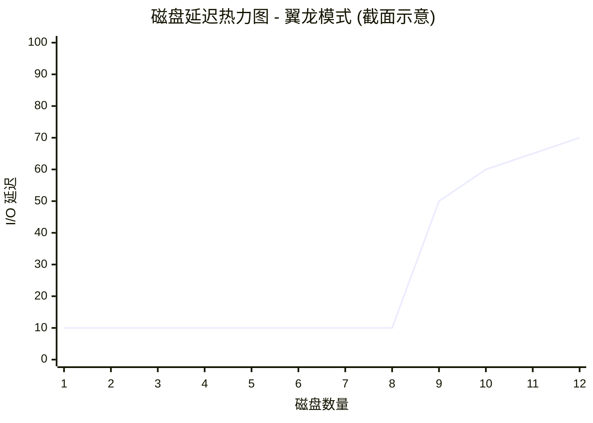

# 9.2 磁盘：方法、工具与可视化

## 9.5 方法论

■ **CFQ**：完全公平排队调度器为进程分配 I/O 时间片，类似于 CPU 调度，以实现磁盘资源的公平使用。它还允许通过 `ionice(1)` 命令为用户进程设置优先级和类别。

经典调度器的一个问题是它们使用受单个锁保护的单个请求队列，这在高 I/O 速率下成为了性能瓶颈。多队列驱动程序（`blk-mq`，在 Linux 3.13 中添加）通过为每个 CPU 使用独立的提交队列，并为设备使用多个分发队列来解决此问题。与经典调度器相比，这提供了更好的 I/O 性能和更低的延迟，因为请求可以并行处理，并且在发起 I/O 的同一 CPU 上处理。这对于支持基于闪存和其他能够处理数百万 IOPS 的设备类型是必要的 [Corbet 13b]。

多队列调度器包括：

■ **None**：无排队。

■ **BFQ**：预算公平排队调度器，类似于 CFQ，但不仅分配 I/O 时间，还分配带宽。它为每个执行磁盘 I/O 的进程创建一个队列，并为每个队列维护以扇区为度量的预算。还有一个系统范围的预算超时，以防止某个进程占用设备过长时间。BFQ 支持 cgroups。

■ **mq-deadline**：deadline 调度器的 blk-mq 版本（前文已述）。

■ **Kyber**：一种根据性能调整读写分发队列长度的调度器，以便满足目标的读或写延迟。它是一个简单的调度器，只有两个可调参数：目标读延迟（`read_lat_nsec`）和目标同步写延迟（`write_lat_nsec`）。Kyber 在 Netflix 云环境中展示了改善的存储 I/O 延迟，并在那里被设为默认调度器。

自 Linux 5.0 起，多队列调度器成为默认选项（经典调度器不再包含在内）。

I/O 调度器的详细信息记录在 Linux 源码的 `Documentation/block` 目录下。

在 I/O 调度之后，请求被放置在块设备队列上，以便发出给设备。

---

## 9.5 方法论

本节介绍磁盘 I/O 分析和调优的各种方法和实践。这些主题总结在表 9.4 中。

**表 9.4 磁盘性能方法论**

| 小节 | 方法论 | 类型 |
| :--- | :--- | :--- |
| 9.5.1 | 工具法 | 观测分析 |
| 9.5.2 | USE 方法 | 观测分析 |
| 9.5.3 | 性能监控 | 观测分析，容量规划 |
| 9.5.4 | 工作负载特征归纳 | 观测分析，容量规划 |
| 9.5.5 | 延迟分析 | 观测分析 |
| 9.5.6 | 静态性能调优 | 观测分析，容量规划 |
| 9.5.7 | 缓存调优 | 观测分析，调优 |
| 9.5.8 | 资源控制 | 调优 |
| 9.5.9 | 微基准测试 | 实验分析 |
| 9.5.10 | 扩展性 | 容量规划，调优 |

> [!INFO] 参考延伸
> 更多方法论及其中许多方法的介绍，请参见第 2 章“方法论”。

这些方法可以单独遵循，也可以组合使用。在调查磁盘问题时，我建议按以下顺序使用这些策略：USE 方法、性能监控、工作负载特征归纳、延迟分析、微基准测试、静态分析以及事件追踪。

第 9.6 节“可观测性工具”展示了应用这些方法的操作系统工具。

### 9.5.1 工具法

工具法是一个遍历可用工具并检查它们提供的关键指标的过程。虽然这是一种简单的方法论，但它可能会忽略那些工具提供较差可见性或根本无法可见的问题，而且执行起来可能很耗时。

对于磁盘，工具法可以包括检查以下内容（针对 Linux）：

■ **iostat**：使用扩展模式查找繁忙的磁盘（利用率超过 60%）、高平均服务时间（例如，超过 10 毫秒）和高 IOPS（视情况而定）

■ **iotop/biotop**：识别哪个进程正在导致磁盘 I/O

■ **biolatency**：以直方图形式检查 I/O 延迟的分布，寻找多模分布和延迟异常值（例如，超过 100 毫秒）

■ **biosnoop**：检查单个 I/O

■ **perf(1)/BCC/bpftrace**：用于自定义分析，包括查看发起 I/O 的用户态和内核态栈

■ **特定磁盘控制器的工具**（由供应商提供）

如果发现问题，请检查可用工具的所有字段以了解更多上下文。关于每个工具的更多信息，请参见第 9.6 节“可观测性工具”。也可以使用其他方法论，它们可以识别更多类型的问题。

### 9.5.2 USE 方法

USE 方法用于在性能调查的早期识别所有组件的瓶颈和错误。以下各节描述了如何将 USE 方法应用于磁盘设备和控制器，而第 9.6 节“可观测性工具”展示了用于测量特定指标的工具。

#### 磁盘设备

对于每个磁盘设备，检查：

■ **利用率**：设备忙碌的时间

■ **饱和度**：I/O 在队列中等待的程度

■ **错误**：设备错误

> [!TIP] 优先检查错误
> 错误可以优先检查。它们有时会被忽视，因为尽管磁盘发生故障，系统仍然能正常运行——尽管速度较慢：磁盘通常配置在旨在容忍某些故障的冗余磁盘池中。除了操作系统的标准磁盘错误计数器外，磁盘设备可能支持更多种类的错误计数器，这些计数器可以通过特殊工具检索（例如，SMART 数据^6）。

如果磁盘设备是物理磁盘，利用率应该很容易找到。如果它们是虚拟磁盘，利用率可能无法反映底层物理磁盘正在做的工作。有关此内容的更多讨论，请参见第 9.3.9 节“利用率”。

#### 磁盘控制器

对于每个磁盘控制器，检查：

■ **利用率**：当前与最大吞吐量之比，以及操作速率的相同比较

■ **饱和度**：由于控制器饱和导致 I/O 等待的程度

■ **错误**：控制器错误

> [!NOTE] 控制器利用率的定义
> 这里的利用率指标不是按时间定义的，而是按磁盘控制器卡的限制定义的：吞吐量（字节/秒）和操作速率（操作/秒）。操作包括读/写和其他磁盘命令。吞吐量或操作速率也可能受连接磁盘控制器与系统的传输总线限制，就像它也可能受从控制器到各个磁盘的传输限制一样。每条传输链路都应以相同的方式进行检查：错误、利用率、饱和度。

您可能会发现可观测性工具（例如 Linux 的 `iostat(1)`）不提供每个控制器的指标，而是仅按磁盘提供。对此有一些变通方法：如果系统只有一个控制器，您可以通过汇总所有磁盘的这些指标来确定控制器的 IOPS 和吞吐量。如果系统有多个控制器，您需要确定哪些磁盘属于哪个控制器，并相应地汇总指标。

磁盘控制器和传输的性能经常被忽视。幸运的是，它们通常不是系统瓶颈的来源，因为它们的容量通常超过所连接磁盘的容量。如果总磁盘吞吐量或 IOPS 总是在某个速率下趋于平稳，即使在不同工作负载下也是如此，这可能是一个线索，表明磁盘控制器或传输实际上正在引发问题。

^6 在 Linux 上，请参阅诸如 MegaCLI 和 smartctl（将在后文介绍）、cciss-vol-status、cpqarrayd、varmon 和 dpt-i2o-raidutils 等工具。

### 9.5.3 性能监控

性能监控可以识别主动问题和随时间变化的行为模式。磁盘 I/O 的关键指标是：

■ **磁盘利用率**

■ **响应时间**

> [!WARNING] 利用率的阈值
> 磁盘利用率连续数秒达到 100% 很可能是出现问题了。根据您的环境，超过 60% 的利用率也可能由于队列增加而导致性能下降。“正常”或“糟糕”的值取决于您的工作负载、环境和延迟要求。如果您不确定，可以对已知良好与糟糕的工作负载执行微基准测试，以展示如何通过磁盘指标发现这些问题。请参见第 9.8 节“实验”。

这些指标应在每个磁盘的基础上进行检查，以寻找不平衡的工作负载和单个性能不佳的磁盘。响应时间指标可以作为每秒平均值进行监控，并可以包含其他值，例如最大值和标准差。理想情况下，应该能够检查响应时间的完整分布，例如通过使用直方图或热力图，以寻找延迟异常值和其他模式。

如果系统实施了磁盘 I/O 资源控制，也可以收集显示这些控制是否以及何时被使用的统计信息。磁盘 I/O 成为瓶颈可能是由于施加的限制造成的，而不是磁盘本身的活动。

利用率和响应时间显示了磁盘性能的结果。可以添加更多指标来表征工作负载，包括 IOPS 和吞吐量，为容量规划提供重要数据（见下一节和第 9.5.10 节“扩展性”）。

### 9.5.4 工作负载特征归纳

特征化所施加的负载是容量规划、基准测试和模拟工作负载的一项重要实践。它还可以通过识别可以消除的不必要工作，带来一些最大的性能提升。

以下是表征磁盘 I/O 工作负载的基本属性：

■ **I/O 速率**

■ **I/O 吞吐量**

■ **I/O 大小**

■ **读写比例**

■ **随机与顺序**

> [!INFO] 概念参考
> 随机与顺序、读写比例和 I/O 大小在第 9.3 节“概念”中描述。I/O 速率（IOPS）和 I/O 吞吐量在第 9.1 节“术语”中定义。

这些特征可能每秒都在变化，特别是对于定期缓冲和刷新写入的应用程序和文件系统。为了更好地表征工作负载，请捕获最大值以及平均值。更好的做法是，检查值随时间变化的完整分布。

以下是一个工作负载描述示例，展示如何将这些属性表达在一起：

> [!EXAMPLE] 工作负载描述示例
> 系统磁盘具有较轻的随机读工作负载，平均 350 IOPS，吞吐量为 3 Mbytes/s，读操作占 96%。偶尔会有短暂的顺序写突发，持续 2 到 5 秒，将磁盘驱动到最大 4,800 IOPS 和 560 Mbytes/s。读取大小约为 8 Kbytes，写入大小约为 128 Kbytes。

除了在系统范围内描述这些特征外，它们还可用于描述每个磁盘和每个控制器的 I/O 工作负载。

#### 高级工作负载特征归纳/检查清单

可以包含额外的细节来表征工作负载。这里将它们列为需要考虑的问题，在深入研究磁盘问题时也可以作为检查清单：

■ 系统范围的 IOPS 速率是多少？每个磁盘呢？每个控制器呢？

■ 系统范围的吞吐量是多少？每个磁盘呢？每个控制器呢？

■ 哪些应用程序或用户正在使用磁盘？

■ 正在访问哪些文件系统或文件？

■ 是否遇到了任何错误？它们是由于无效请求，还是磁盘上的问题？

■ I/O 在可用磁盘上的平衡程度如何？

■ 涉及的每条传输总线的 IOPS 是多少？

■ 涉及的每条传输总线的吞吐量是多少？

■ 正在发出哪些非数据传输的磁盘命令？

■ 为什么会发出磁盘 I/O（内核调用路径）？

■ 磁盘 I/O 在多大程度上是应用同步的？

■ I/O 到达时间的分布是什么？

> [!NOTE] 
> IOPS 和吞吐量问题可以分别针对读和写提出。这些指标中的任何一个也可以随时间进行检查，以寻找最大值、最小值和基于时间的变化。另见

# 9.2 磁盘：方法、工具与可视化

第2章《方法论》，第2.5.11节《[[工作负载特征归纳|工作负载特征归纳]]》提供了关于测量特征（谁、为什么、什么、如何）的更高层级总结，也可供参考。

## 性能特征归纳

前面的工作负载特征归纳列表检查的是施加的负载。以下则检查由此产生的性能：

- 每个磁盘有多忙（[[磁盘利用率|利用率]]）？
- 每个磁盘的 I/O 饱和度如何（等待排队）？
- 平均 I/O [[服务时间]]是多少？
- 平均 I/O [[等待时间]]是多少？
- 是否存在高延迟的 I/O 异常值？
- I/O [[延迟]]的完整分布是怎样的？
- 系统资源控制（如 I/O 节流）是否存在并处于活动状态？
- 非数据传输磁盘命令的延迟是多少？

## 事件追踪

追踪工具可用于将所有文件系统操作及细节记录到日志中以供后续分析（例如，第9.6.7节的 biosnoop）。这可以包括磁盘设备 ID、I/O 或命令类型、偏移量、大小、发起和完成时间戳、完成状态，以及源进程 ID 和名称（在可能的情况下）。利用发起和完成时间戳，可以计算 I/O 延迟（或者也可以直接将其包含在日志中）。通过研究请求和完成时间戳的序列，还可以识别设备对 I/O 的重排序。虽然这可能是工作负载特征归纳的终极工具，但在实践中，根据磁盘操作的速率不同，捕获和保存可能会产生显著的开销。如果事件追踪产生的磁盘写入也被包含在追踪中，不仅会污染追踪数据，还可能产生反馈循环并引发性能问题。

## 9.5.5 延迟分析

[[延迟分析]]涉及深入系统内部以寻找延迟的来源。对于磁盘，这通常会在磁盘接口处终止：即 I/O 请求与完成中断之间的时间。如果这与应用层的 I/O 延迟相符，通常可以安全地假设 I/O 延迟源自磁盘，从而将调查重点放在磁盘上。如果延迟不同，则在操作系统栈的不同层级进行测量将确定其来源。

图9.10描绘了一个通用 I/O 栈，并展示了两个 I/O 异常值（A 和 B）在不同层级的延迟。

> [!NOTE] 图9.10 栈延迟分析
> *此处为图片占位符，展示了通用 I/O 栈中两个 I/O 异常值 A 和 B 在不同层级的延迟分布。*
> 
> ```mermaid
> graph TD
>     subgraph IO_Stack["通用 I/O 栈"]
>         App["应用程序"]
>         FS["文件系统"]
>         VFS["卷/块层"]
>         Driver["磁盘驱动"]
>         Disk["磁盘设备"]
>     end
>     
>     App -.->|I/O A: 高延迟| FS
>     FS -.->|I/O A: 高延迟| VFS
>     VFS -.->|I/O A: 高延迟| Driver
>     Driver -.->|I/O A: 高延迟| Disk
> 
>     App ==>|I/O B: 高延迟| FS
>     FS ==>|I/O B: 高延迟 (锁定/排队?)| VFS
>     VFS -.->|I/O B: 低延迟| Driver
>     Driver -.->|I/O B: 低延迟| Disk
> ```

I/O A 的延迟从应用程序向下到磁盘驱动程序，每一层都相似。这种相关性指出磁盘（或磁盘驱动程序）是延迟的原因。如果各层是独立测量的，基于它们之间相似的延迟值，也可以推断出这一点。

I/O B 的延迟似乎起源于文件系统层级（锁定或排队？），而较低层级的 I/O 延迟贡献的时间要少得多。请注意，堆栈的不同层可能会扩大或缩小 I/O，这意味着大小、数量和延迟会因层而异。示例 B 可能是这种情况：在较低层级仅观察到一个 I/O（10 毫秒），但未考虑到为服务同一文件系统 I/O 而发生的其他相关 I/O（例如，元数据）。

每一层级的延迟可以表示为：

- **按时间间隔的 I/O 平均值**：由操作系统工具通常报告的指标。
- **完整的 I/O 分布**：如直方图或热力图；参见第9.7.3节《延迟热力图》。
- **每次 I/O 的延迟值**：参见前面的事件追踪部分。

后两者对于追踪异常值的来源非常有用，并有助于识别 I/O 被拆分或合并的情况。

## 9.5.6 静态性能调优

[[静态性能调优]]侧重于已配置环境的问题。对于磁盘性能，请检查静态配置的以下方面：

- 存在多少个磁盘？什么类型（例如，SMR、MLC）？容量多大？
- 磁盘固件版本是什么？
- 存在多少个磁盘控制器？什么接口类型？
- 磁盘控制卡是否连接到高速插槽？
- 每个主机总线适配器 (HBA) 连接了多少个磁盘？
- 如果存在磁盘/控制器电池备份，其电量水平是多少？
- 磁盘控制器固件版本是什么？
- 是否配置了 RAID？具体如何配置，包括条带宽度？
- 多路径是否可用且已配置？
- 磁盘设备驱动程序版本是什么？
- 服务器主存大小是多少？被页缓存和缓冲区缓存使用了多少？
- 是否存在针对任何存储设备驱动程序的操作系统错误/补丁？
- 磁盘 I/O 是否使用了资源控制？

> [!WARNING] 固件与驱动性能缺陷
> 请注意，设备驱动程序和固件中可能存在性能缺陷，理想情况下应由供应商提供的更新来修复。

回答这些问题可以揭示被忽视的配置选择。有时系统是为一种工作负载配置的，后来又被改作他用。这种策略将重新审视这些选择。

> [!TIP] 实战经验：配置先行
> 在担任 Sun 公司 ZFS 存储产品的性能负责人时，我收到的最常见的性能投诉是由配置错误引起的：使用了半 JBOD（12 块磁盘）的 RAID-Z2（宽条带）。这种配置提供了良好的可靠性，但性能平平，类似于单块磁盘的性能。我学会了（通常是通过电话）首先询问配置细节，然后再花时间登录系统检查 I/O 延迟。

## 9.5.7 缓存调优

系统中可能存在许多不同的缓存，包括应用层级、文件系统、磁盘控制器以及磁盘本身的缓存。第9.3.3节《缓存》中包含了这些缓存的列表，可以按照第2章《方法论》第2.5.18节《[[缓存调优]]》中的描述进行调优。总之，检查存在哪些缓存，检查它们是否在工作，检查它们工作得有多好，然后针对缓存调优工作负载，并针对工作负载调优缓存。

## 9.5.8 资源控制

操作系统可能提供控件，用于将磁盘 I/O 资源分配给进程或进程组。这些可能包括 IOPS 和吞吐量的固定限制，或者用于更灵活方法的份额。这些机制的具体工作方式因实现而异，将在第9.9节《调优》中讨论。

## 9.5.9 微基准测试

磁盘 I/O [[微基准测试]]已在第8章《文件系统》中介绍过，其中解释了测试文件系统 I/O 与测试磁盘 I/O 之间的区别。在这里，我们要测试的是磁盘 I/O，这通常意味着通过操作系统的设备路径进行测试，特别是原始设备路径（如果可用），以避免所有文件系统行为（包括缓存、缓冲、I/O 拆分、I/O 合并、代码路径开销和偏移量映射差异）。

微基准测试的因素包括：

- **方向**：读或写
- **磁盘偏移模式**：随机或顺序
- **偏移范围**：全盘或紧凑范围（例如，仅偏移量0）
- **I/O 大小**：从 512 字节（典型的最小值）到 1 MB
- **并发度**：在途 I/O 数量，或执行 I/O 的线程数
- **设备数量**：单盘测试，或多盘测试（以探索控制器和总线限制）

接下来的两节展示了如何组合这些因素来测试磁盘和磁盘控制器的性能。关于可用于执行这些测试的具体工具的详细信息，请参见第9.8节《实验》。

### 磁盘

可以在每个磁盘的基础上执行微基准测试，以确定以下内容，以及建议的工作负载：

- **最大磁盘吞吐量（MB/秒）**：128 KB 或 1 MB 读取，顺序
- **最大磁盘操作率（IOPS）**：512 字节读取，仅偏移量 0 7
- **最大磁盘随机读取（IOPS）**：512 字节读取，随机偏移
- **读取延迟概况（平均微秒）**：顺序读取，分别重复 512 字节、1K、2K、4K 等测试
- **随机 I/O 延迟概况（平均微秒）**：512 字节读取，分别重复完整偏移跨度、仅起始偏移、仅结束偏移测试

> [!NOTE] 脚注 7
> 7 此大小旨在匹配最小的磁盘块大小。现在的许多磁盘使用 4 KB。

这些测试可以针对写入重复进行。使用“仅偏移量 0”旨在将数据缓存在磁盘内置缓存中，以便可以测量缓存访问时间 8。

> [!NOTE] 脚注 8
> 8 我听说有传言称，一些驱动器制造商拥有用于加速扇区 0 I/O 的固件例程，从而夸大了此类测试的性能。您可以通过测试扇区 0 与测试扇区 `your_favorite_number` 来验证。

### 磁盘控制器

可以通过向多个磁盘施加工作负载来对磁盘控制器进行微基准测试，旨在触及控制器的限制。可以使用以下方法执行这些测试，以及针对磁盘的建议工作负载：

- **最大控制器吞吐量（MB/秒）**：128 KB，仅偏移量 0
- **最大控制器操作率（IOPS）**：512 字节读取，仅偏移量 0

将工作负载逐一施加到磁盘上，观察是否达到限制。可能需要超过十几个磁盘才能找到磁盘控制器的限制。

## 9.5.10 扩展

磁盘和磁盘控制器具有吞吐量和 IOPS 限制，这可以通过前面所述的微基准测试来证明。调优只能将性能提高到这些限制之内。如果需要更多的磁盘性能，并且缓存等其他策略不起作用，则需要对磁盘进行扩展。

以下是基于资源容量规划的简单方法：

1. 确定目标磁盘工作负载，包括吞吐量和 IOPS。如果这是一个新系统，请参阅第2章《方法论》第2.7节《容量规划》。如果系统已有工作负载，则根据当前磁盘吞吐量和 IOPS 表示用户群体，并将这些数字缩放到目标用户群体。（如果缓存未同时扩展，磁盘工作负载可能会增加，因为每用户缓存比变小。）
2. 计算支持此工作负载所需的磁盘数量。考虑 RAID 配置因素。不要使用每磁盘的最大吞吐量和 IOPS 值，因为这将导致磁盘在 100% 利用率下运行，从而由于饱和和排队立即引发性能问题。选择一个目标利用率（例如 50%）并相应地调整数值。
3. 计算支持此工作负载所需的磁盘控制器数量。
4. 检查是否未超出传输限制，如有必要则扩展传输层。
5. 计算每次磁盘 I/O 消耗的 CPU 周期，以及所需的 CPU 数量（这可能需要多 CPU 和并行 I/O）。

所使用的每磁盘最大吞吐量和 IOPS 数值将取决于其类型和磁盘类型。参见第9.3.7节《IOPS 并不相等》。微基准测试可用于查找给定 I/O 大小和 I/O 类型的具体限制，而工作负载特征归纳可用于现有工作负载，以查看哪些大小和类型更为重要。

为了满足磁盘工作负载需求，服务器需要数十个通过存储阵列连接的磁盘的情况并不少见。我们过去常说：“增加更多主轴。”我们现在可能会说：“增加更多闪存。”

## 9.6 可观测性工具

本节介绍基于 Linux 操作系统的磁盘 I/O [[可观测性工具]]。使用这些工具时请遵循上一节中的策略。

本节中的工具列于表9.5中。

**表9.5 磁盘可观测性工具**

| 小节 | 工具 | 描述 |
| :--- | :--- | :--- |
| 9.6.1 | [[iostat]] | 各种按磁盘统计的信息 |
| 9.6.2 | [[sar]] | 历史磁盘统计信息 |
| 9.6.3 | [[PSI]] | 磁盘压力失速信息 |
| 9.6.4 | [[pidstat]] | 按进程统计的磁盘 I/O 使用情况 |
| 9.6.5 | [[perf]] | 记录块 I/O 追踪点 |
| 9.6.6 | [[biolatency]] | 将磁盘 I/O 延迟汇总为直方图 |
| 9.6.7 | [[biosnoop]] | 追踪带有 PID 和延迟的磁盘 I/O |
| 9.6.8 | [[iotop, biotop]] | 磁盘 top：按进程汇总磁盘 I/O |
| 9.6.9 | [[biostacks]] | 显示带有初始化堆栈的磁盘 I/O |
| 9.6.10 | [[blktrace]] | 磁盘 I/O 事件追踪 |
| 9.6.11 | [[bpftrace]] | 自定义磁盘追踪 |
| 9.6.12 | [[MegaCli]] | LSI 控制器统计信息 |

# 9.2 磁盘：方法、工具与可视化

### 9.6.13 smartctl
磁盘控制器统计信息
 
## 9.6 可观察性工具 
> 459

这里精选了一系列工具来支持第 9.5 节（方法论），从传统工具和统计信息开始，接着是追踪工具，最后是磁盘控制器统计信息。其中一些传统工具很可能在它们起源的其他类 Unix 操作系统上也可用，包括：`iostat(8)` 和 `sar(1)`。许多追踪工具是基于 BPF 的，并使用 BCC 和 bpftrace 前端（第 15 章）；它们是：`biolatency(8)`、`biosnoop(8)`、`biotop(8)` 和 `biostacks(8)`。

请参阅每个工具的文档，包括其 man 帮助页，以获取其功能的完整参考。

### 9.6.1 iostat

`iostat(1)` 汇总每个磁盘的 I/O 统计信息，提供用于[[工作负载特征分析|工作负载表征]]、[[利用率]]和[[饱和度]]的指标。它可以由任何用户执行，通常是在命令行调查磁盘 I/O 问题时使用的第一个命令。它提供的统计信息通常也会由监控软件显示，因此详细学习 `iostat(1)` 以加深对监控统计信息的理解是值得的。这些统计信息由内核默认启用 [^9]，因此该工具的开销可以忽略不计。

> [!NOTE] 名称混淆
> “iostat”这个名字是“I/O statistics”的缩写，尽管把它叫作“diskiostat”可能更好，以反映它报告的 I/O 类型。这偶尔会导致混淆：用户知道应用程序正在（向文件系统）执行 I/O，但想知道为什么通过 `iostat(1)`（磁盘层）看不到它。

`iostat(1)` 于 20 世纪 80 年代初为 Unix 编写，在不同的操作系统上有不同的版本。在基于 Linux 的系统上，可以通过 `sysstat` 软件包添加它。以下描述的是 Linux 版本。

#### iostat 默认输出

在没有任何参数或选项的情况下，将打印自启动以来的 CPU 和磁盘统计信息摘要。这里作为该工具的介绍涵盖此内容；但是，不建议您使用此模式，因为稍后介绍的扩展模式更有用。

```bash
$ iostat
Linux 5.3.0-1010-aws (ip-10-1-239-218)    02/12/20        _x86_64_  (2 CPU)
avg-cpu:  %user   %nice %system %iowait  %steal   %idle
           0.29    0.01    0.18    0.03    0.21   99.28
Device             tps    kB_read/s    kB_wrtn/s    kB_read    kB_wrtn
loop0             0.00         0.05         0.00       1232          0
[...]
nvme0n1           3.40        17.11        36.03     409902     863344
```

第一行输出是系统的摘要，包括内核版本、主机名、日期、架构和 CPU 数量。后续行显示自启动以来的 CPU 统计信息摘要（`avg-cpu`；这些统计信息在第 6 章 CPU 中介绍过）和磁盘设备（在 `Device:` 下）的统计信息摘要。

> 460 
> 第 9 章 磁盘

每个磁盘设备显示为一行，列中包含基本详细信息。我已将列标题加粗显示；它们是：

- **tps**: 每秒事务数 (IOPS)
- **kB_read/s, kB_wrtn/s**: 每秒读取的千字节数，和每秒写入的千字节数
- **kB_read, kB_wrtn**: 读取和写入的总千字节数

> [!INFO] 设备可见性说明
> 某些 SCSI 设备，包括 CD-ROM，可能不会被 `iostat(1)` 显示。SCSI 磁带驱动器可以使用同样在 `sysstat` 软件包中的 `tapestat(1)` 来检查。另请注意，虽然 `iostat(1)` 报告块设备的读写，但根据内核的不同，它可能会排除某些其他类型的磁盘设备命令（参见内核函数 `blk_do_io_stat()` 中的逻辑）。`iostat(1)` 扩展模式包含这些设备命令的额外字段。

#### iostat 选项

`iostat(1)` 可以带有各种选项执行，后跟可选的间隔和计数。例如：

```bash
# iostat 1 10
```
将打印一秒钟的摘要十次。而：

```bash
# iostat 1
```
将无休止地打印一秒钟的摘要（直到键入 Ctrl-C）。

常用的选项有：

- **-c**: 显示 CPU 报告
- **-d**: 显示磁盘报告
- **-k**: 使用千字节而不是（512 字节）块
- **-m**: 使用兆字节而不是（512 字节）块
- **-p**: 包含每个分区的统计信息
- **-t**: 打印时间戳
- **-x**: 扩展统计信息
- **-s**: 短（窄）输出
- **-z**: 跳过显示零活动的摘要

还有一个环境变量 `POSIXLY_CORRECT=1`，用于输出块（每块 512 字节）而不是千字节。一些旧版本包含 NFS 统计信息的选项 `-n`。自 `sysstat` 9.1.3 版本起，这被移到了单独的 `nfsiostat` 命令中。

#### iostat 扩展短输出

扩展输出 (`-x`) 提供了额外的列，对前面介绍的方法论很有用。这些额外的列包括用于工作负载表征的 IOPS 和吞吐量指标，用于 [[USE 方法]] 的利用率和队列长度，以及用于性能表征和延迟分析的磁盘响应时间。

多年来，扩展输出获得了越来越多的字段，最新版本（12.3.1，2019 年 12 月）产生的输出宽度达 197 个字符。这不仅无法放入本书，也无法放入许多宽屏终端，使得输出因自动换行而难以阅读。2017 年增加了一个解决方案，即 `-s` 选项，以提供旨在适应 80 字符宽度的“短”或窄输出。

以下是短 (`-s`) 扩展 (`-x`) 统计信息并跳过零活动设备 (`-z`) 的示例：

```bash
$ iostat -sxz 1
[...]
avg-cpu:  %user   %nice %system %iowait  %steal   %idle
          15.82    0.00   10.71   31.63    1.53   40.31
Device             tps      kB/s    rqm/s   await aqu-sz  areq-sz  %util
nvme0n1        1642.00   9064.00   664.00    0.44   0.00     5.52 100.00
[...]
```

磁盘列包括：

- **tps**: 每秒发出的事务数 (IOPS)
- **kB/s**: 每秒千字节数
- **rqm/s**: 每秒排队和合并的请求数
- **await**: 平均 I/O 响应时间，包括在操作系统中排队的时间和设备的 I/O 响应时间 (ms)
- **aqu-sz**: 在驱动程序请求队列中等待和在设备上活动的平均请求数
- **areq-sz**: 以千字节为单位的平均请求大小
- **%util**: 设备忙于处理 I/O 请求的时间百分比（利用率）

> [!TIP] 核心指标解读
> 对于交付性能而言最重要的指标是 `await`，它显示了 I/O 的平均总等待时间。什么构成“好”或“坏”取决于您的需求。在示例输出中，`await` 为 0.44 毫秒，对于此数据库服务器来说令人满意。它可能由于多种原因而增加：排队（负载）、更大的 I/O 尺寸、旋转设备上的随机 I/O 以及设备错误。
>
> 对于资源使用和容量规划，`%util` 很重要，但请记住，它仅仅是忙碌度（非空闲时间）的度量，对于由多个磁盘支持的虚拟设备可能意义不大。这些设备最好通过施加的负载来理解：`tps` (IOPS) 和 `kB/s`（吞吐量）。
>
> `rqm/s` 列中的非零计数表明连续的请求在交付给设备之前被合并，以提高性能。此指标也是顺序工作负载的标志。
>
> 由于 `areq-sz` 是合并后的大小，小尺寸（8 KB 或更小）是无法合并的随机 I/O 工作负载的指标。大尺寸可能是大 I/O 或合并的顺序工作负载（由前面的列指示）。

> 462 
> 第 9 章 磁盘

#### iostat 扩展输出

如果不带 `-s` 选项，`-x` 会打印更多列。以下是 `sysstat` 12.3.2 版本（2020 年 4 月）自启动以来的摘要（无间隔或计数）：

```bash
$ iostat -x
[...]
Device            r/s     rkB/s   rrqm/s  %rrqm r_await rareq-sz     w/s     wkB/s   
wrqm/s  %wrqm w_await wareq-sz     d/s     dkB/s   drqm/s  %drqm d_await dareq-sz     
f/s f_await  aqu-sz  %util
nvme0n1          0.23      9.91     0.16  40.70    0.56    43.01    3.10     33.09     
0.92  22.91    0.89    10.66    0.00      0.00     0.00   0.00    0.00     0.00    
0.00    0.00    0.00   0.12
```

这些列将许多 `-sx` 指标细分为读和写组件，并且还包括丢弃和刷新。

额外的列包括：

- **r/s, w/s, d/s, f/s**: 每秒从磁盘设备完成的读、写、丢弃和刷新请求数（合并后）
- **rkB/s, wkB/s, dkB/s**: 每秒从磁盘设备读取、写入和丢弃的千字节数
- **%rrqm/s, %wrqm/s, %drqm/s**: 排队和合并的读、写和丢弃请求占该类型总请求的百分比
- **r_await, w_await, d_await, f_await**: 读、写、丢弃和刷新的平均响应时间，包括在操作系统中排队的时间和来自设备的响应时间 (ms)
- **rareq-sz, wareq-sz, dareq-sz**: 读、写和丢弃的平均大小 (Kbytes)

> [!IMPORTANT] 读写分离分析
> 分别检查读写非常重要。应用程序和文件系统通常使用技术来缓解写入延迟（例如，回写缓存），因此应用程序不太可能被磁盘写入阻塞。这意味着任何将读和写分组的指标都会被一个可能不直接重要的组件（写入）所扭曲。通过拆分它们，您可以开始检查 `r_wait`，它显示平均读取延迟，并且很可能是应用程序性能最重要的指标。
>
> 作为 IOPS (`r/s`, `w/s`) 和吞吐量 (`rkB/s`, `wkB/s`) 的读写对于工作负载表征很重要。
>
> 丢弃和刷新统计信息是 `iostat(1)` 的新增内容。丢弃操作释放驱动器上的块（ATA TRIM 命令），其统计信息在 Linux 4.19 内核中添加。刷新统计信息在 Linux 5.5 中添加。这些有助于缩小磁盘延迟的原因范围。

以下是另一个有用的 `iostat(1)` 组合：

```bash
$ iostat -dmstxz -p ALL 1
Linux 5.3.0-1010-aws (ip-10-1-239-218)    02/12/20        _x86_64_  (2 CPU)
 
> 9.6 可观察性工具 
> 463

02/12/20 17:39:29
Device             tps      MB/s    rqm/s   await  areq-sz  aqu-sz  %util
nvme0n1           3.33      0.04     1.09    0.87    12.84    0.00   0.12
nvme0n1p1         3.31      0.04     1.09    0.87    12.91    0.00   0.12
02/12/20 17:39:30
Device             tps      MB/s    rqm/s   await  areq-sz  aqu-sz  %util
nvme0n1        1730.00     14.97   709.00    0.54     8.86    0.02  99.60
nvme0n1p1      1538.00     14.97   709.00    0.61     9.97    0.02  99.60
[...]
```

第一个输出是自启动以来的摘要，随后是一秒间隔的摘要。`-d` 仅关注磁盘统计信息（无 CPU），`-m` 表示兆字节，`-t` 表示时间戳，这在将输出与其他带时间戳的源进行比较时很有用，`-p ALL` 包含每个分区的统计信息。

> [!WARNING] 局限性
> 遗憾的是，当前版本的 `iostat(1)` 不包含磁盘错误；否则所有的 [[USE 方法]] 指标都可以从一个工具中检查！

### 9.6.2 sar

系统活动报告器 `sar(1)` 可用于观察当前活动，也可配置为归档和报告历史统计信息。它在第 4.4 节 sar 中介绍过，并在本书的不同章节中针对它提供的不同统计信息被提及。

`sar(1)` 磁盘摘要使用 `-d` 选项打印，在以下示例中以一秒的间隔演示。输出很宽，因此此处分为两部分包含（sysstat 12.3.2）：

```bash
$ sar -d 1
Linux 5.3.0-1010-aws (ip-10-0-239-218)    02/13/20        _x86_64_  (2 CPU)
09:10:22          DEV       tps     rkB/s     wkB/s     dkB/s   areq-sz \ ...
09:10:23     dev259-0   1509.00  11100.00  12776.00      0.00     15.82 / ...
[...]
```

以下是剩余的列：

```bash
$ sar -d 1
09:10:22     \ ... \  aqu-sz     await     %util
09:10:23     / ... /    0.02      0.60     94.00
[...]
```

这些列也出现在 `iostat(1) -x` 输出中，并在上一节中进行了描述。此输出显示了一个混合读/写工作负载，`await` 为 0.6 毫秒，将磁盘驱动至 94% 的利用率。

> 464

[^9]: 统计信息可以通过 `/sys/block/<dev>/queue/iostats` 文件禁用。我不知道有谁曾经这样做过。

# 9.2 磁盘：方法、工具与可视化

以往版本的 `sar(1)` 包含一个 `svctm`（服务时间）列：平均（推断的）磁盘响应时间，以毫秒为单位。关于服务时间的背景知识，请参见第 9.3.1 节“测量时间”。由于这种简单的计算方式对于现代执行并行 I/O 的磁盘已不再准确，因此在后续版本中 `svctm` 已被移除。

## 9.6.3 PSI

> [!INFO] PSI (Pressure Stall Information)
> Linux 压力失速信息（PSI），在 Linux 4.20 中加入，包含了 I/O 饱和度的统计信息。这些信息不仅显示了是否存在 I/O 压力，还显示了在过去五分钟内它是如何变化的。

示例输出：

```bash
# cat /proc/pressure/io
some avg10=63.11 avg60=32.18 avg300=8.62 total=667212021
full avg10=60.76 avg60=31.13 avg300=8.35 total=622722632
```

此输出表明 I/O 压力正在增加，10 秒平均值（63.11）高于 300 秒平均值（8.62）。这些平均值是任务因 I/O 而停顿的时间百分比。

- `some` 行显示了当部分任务（线程）受到影响时的情况；
- `full` 行显示了当所有可运行任务均受到影响时的情况。

> [!TIP] 作为高级指标的 PSI
> 与[[负载平均值|负载平均值]]类似，这可以作为一个用于告警的高级指标。一旦你意识到存在磁盘性能问题，你可以使用其他工具来查找根本原因，包括使用 `pidstat(8)` 按进程查看磁盘统计信息。

## 9.6.4 pidstat

Linux 的 `pidstat(1)` 工具默认打印 CPU 使用情况，并包含一个 `-d` 选项用于显示磁盘 I/O 统计信息。该选项在 2.6.20 及更高版本的内核中可用。例如：

```bash
$ pidstat -d 1
Linux 5.3.0-1010-aws (ip-10-0-239-218)    02/13/20        _x86_64_  (2 CPU)
09:47:41      UID       PID   kB_rd/s   kB_wr/s kB_ccwr/s iodelay  Command
09:47:42        0      2705  32468.00      0.00      0.00       5  tar
09:47:42        0      2706      0.00   8192.00      0.00       0  gzip
[...]
09:47:56      UID       PID   kB_rd/s   kB_wr/s kB_ccwr/s iodelay  Command
09:47:57        0       229      0.00     72.00      0.00       0  systemd-journal
09:47:57        0       380      0.00      4.00      0.00       0  auditd
09:47:57        0      2699      4.00      0.00      0.00      10  kworker/u4:1-flush-259:0
09:47:57        0      2705  15104.00      0.00      0.00       0  tar
09:47:57        0      2706      0.00   6912.00      0.00       0  gzip
```

各列含义包括：

- **kB_rd/s**：每秒读取的千字节数
- **kB_wd/s**：每秒发出的写入千字节数
- **kB_ccwr/s**：每秒取消的写入千字节数（例如，在刷新前被覆盖或删除）
- **iodelay**：进程在磁盘 I/O 上被阻塞的时间（时钟滴答数），包括交换

> [!EXAMPLE] 工作负载分析
> 输出中看到的工作负载是一个 `tar` 命令将文件系统读取到管道，以及 `gzip` 读取管道并写入压缩归档文件的过程。`tar` 的读取导致了 `iodelay`（5 个时钟滴答），而 `gzip` 的写入则没有，这是由于页缓存中的写回缓存机制。一段时间后，页缓存被刷新，这可以在第二个时间间隔的输出中由 `kworker/u4:1-flush-259:0` 进程看出来，该进程经历了 `iodelay`。

`iodelay` 是最近新增的列，它显示了性能问题的严重程度：应用程序等待了多长时间。其他列则显示了施加的工作负载。

> [!WARNING] 权限要求
> 请注意，只有超级用户才能访问他们不拥有的进程的磁盘统计信息。这些信息是通过 `/proc/PID/io` 读取的。

## 9.6.5 perf

Linux 的 `perf(1)` 工具（第 13 章）可以记录块设备跟踪点。列出它们：

```bash
# perf list 'block:*'
List of pre-defined events (to be used in -e):
  block:block_bio_backmerge                          [Tracepoint event]
  block:block_bio_bounce                             [Tracepoint event]
  block:block_bio_complete                           [Tracepoint event]
  block:block_bio_frontmerge                         [Tracepoint event]
  block:block_bio_queue                              [Tracepoint event]
  block:block_bio_remap                              [Tracepoint event]
  block:block_dirty_buffer                           [Tracepoint event]
  block:block_getrq                                  [Tracepoint event]
  block:block_plug                                   [Tracepoint event]
  block:block_rq_complete                            [Tracepoint event]
  block:block_rq_insert                              [Tracepoint event]
  block:block_rq_issue                               [Tracepoint event]
  block:block_rq_remap                               [Tracepoint event]
  block:block_rq_requeue                             [Tracepoint event]
  block:block_sleeprq                                [Tracepoint event]
  block:block_split                                  [Tracepoint event]
  block:block_touch_buffer                           [Tracepoint event]
  block:block_unplug                                 [Tracepoint event]
```

例如，以下命令记录带有调用栈的块设备发行事件。提供了一个 `sleep 10` 命令作为跟踪的持续时间。

```bash
# perf record -e block:block_rq_issue -a -g sleep 10
[ perf record: Woken up 22 times to write data ]
[ perf record: Captured and wrote 5.701 MB perf.data (19267 samples) ]
# perf script --header
[...]
mysqld  1965 [001] 160501.158573: block:block_rq_issue: 259,0 WS 12288 () 10329704 + 24 [mysqld]
        ffffffffb12d5040 blk_mq_start_request+0xa0 ([kernel.kallsyms])
        ffffffffb12d5040 blk_mq_start_request+0xa0 ([kernel.kallsyms])
        ffffffffb1532b4c nvme_queue_rq+0x16c ([kernel.kallsyms])
        ffffffffb12d7b46 __blk_mq_try_issue_directly+0x116 ([kernel.kallsyms])
        ffffffffb12d87bb blk_mq_request_issue_directly+0x4b ([kernel.kallsyms])
        ffffffffb12d8896 blk_mq_try_issue_list_directly+0x46 ([kernel.kallsyms])
        ffffffffb12dce7e blk_mq_sched_insert_requests+0xae ([kernel.kallsyms])
        ffffffffb12d86c8 blk_mq_flush_plug_list+0x1e8 ([kernel.kallsyms])
        ffffffffb12cd623 blk_flush_plug_list+0xe3 ([kernel.kallsyms])
        ffffffffb12cd676 blk_finish_plug+0x26 ([kernel.kallsyms])
        ffffffffb119771c ext4_writepages+0x77c ([kernel.kallsyms])
        ffffffffb10209c3 do_writepages+0x43 ([kernel.kallsyms])
        ffffffffb1017ed5 __filemap_fdatawrite_range+0xd5 ([kernel.kallsyms])
        ffffffffb10186ca file_write_and_wait_range+0x5a ([kernel.kallsyms])
        ffffffffb118637f ext4_sync_file+0x8f ([kernel.kallsyms])
        ffffffffb1105869 vfs_fsync_range+0x49 ([kernel.kallsyms])
        ffffffffb11058fd do_fsync+0x3d ([kernel.kallsyms])
        ffffffffb1105944 __x64_sys_fsync+0x14 ([kernel.kallsyms])
        ffffffffb0e044ca do_syscall_64+0x5a ([kernel.kallsyms])
        ffffffffb1a0008c entry_SYSCALL_64_after_hwframe+0x44 ([kernel.kallsyms])
            7f2285d1988b fsync+0x3b (/usr/lib/x86_64-linux-gnu/libpthread-2.30.so)
            55ac10a05ebe Fil_shard::redo_space_flush+0x44e (/usr/sbin/mysqld)
            55ac10a06179 Fil_shard::flush_file_redo+0x99 (/usr/sbin/mysqld)
            55ac1076ff1c [unknown] (/usr/sbin/mysqld)
            55ac10777030 log_flusher+0x520 (/usr/sbin/mysqld)
            55ac10748d61 
std::thread::_State_impl<std::thread::_Invoker<std::tuple<Runnable, void (*)(log_t*), 
log_t*> > >::_M_run+0xc1 (/usr/sbin/mysql
            7f228559df74 [unknown] (/usr/lib/x86_64-linux-gnu/libstdc++.so.6.0.28)
            7f226c3652c0 [unknown] ([unknown])
            55ac107499f0 
std::thread::_State_impl<std::thread::_Invoker<std::tuple<Runnable, void (*)(log_t*), 
log_t*> > >::~_State_impl+0x0 (/usr/sbin/
        5441554156415741 [unknown] ([unknown])
[...]
```

输出是每个事件的单行摘要，随后是导致该事件的调用栈。单行摘要以 `perf(1)` 的默认字段开始：进程名、线程 ID、CPU ID、时间戳和事件名（参见第 13 章 perf，第 13.11 节 perf script）。其余字段特定于跟踪点：对于此 `block:block_rq_issue` 跟踪点，它们及其字段内容如下：

- **磁盘主次设备号**：259,0
- **I/O 类型**：WS（同步写）
- **I/O 大小**：12288（字节）
- **I/O 命令字符串**：()
- **扇区地址**：10329704
- **扇区数**：24
- **进程**：mysqld

> [!INFO] 跟踪点格式来源
> 这些字段来自跟踪点的格式字符串（参见第 4 章“可观测性工具”，第 4.3.5 节“跟踪点”中的“跟踪点参数与格式字符串”）。

调用栈可以帮助解释磁盘 I/O 的性质。在这个例子中，它来自调用 `fsync(2)` 的 `mysqld` `log_flusher()` 例程。内核代码路径显示它由 ext4 文件系统处理，并通过 `blk_mq_try_issue_list_directly()` 变成了一个磁盘 I/O 发行事件。

通常，I/O 会先排队，然后由内核线程稍后发行，此时跟踪 `block:block_rq_issue` 跟踪点将不会显示原始进程或用户级调用栈。在这些情况下，你可以尝试跟踪 `block:block_rq_insert`，它是针对队列插入的。请注意，这会遗漏未排队的 I/O。

### One-Liners (单行命令)

以下单行命令演示了如何将过滤器与块设备跟踪点结合使用。

跟踪所有大小至少为 100 Kbytes 的块完成事件，直到按 Ctrl-C¹⁰：

```bash
perf record -e block:block_rq_complete --filter 'nr_sector > 200'
```

跟踪所有块完成事件，仅限同步写，直到按 Ctrl-C：

```bash
perf record -e block:block_rq_complete --filter 'rwbs == "WS"'
```

跟踪所有块完成事件，所有类型的写操作，直到按 Ctrl-C：

```bash
perf record -e block:block_rq_complete --filter 'rwbs ~ "*W*"'
```

> [!NOTE] 10
> 在扇区大小为 512 字节的情况下，100 Kbytes 意味着 200 个扇区。

### 磁盘 I/O 延迟

磁盘 I/O 延迟（前面描述为磁盘请求时间）也可以通过同时记录磁盘发行事件和完成事件以供后续分析来确定。以下命令记录它们 60 秒，然后将事件写入 `out.disk01.txt` 文件：

```bash
perf record -e block:block_rq_issue,block:block_rq_complete -a sleep 60
perf script --header > out.disk01.txt
```

你可以使用任何方便的工具对输出文件进行后处理：`awk(1)`、Perl、Python、R、Google Spreadsheets 等。将发行事件与完成事件关联起来，并使用记录的时间戳来计算延迟。

接下来的工具，`biolatency(8)` 和 `biosnoop(8)`，使用 BPF 程序在内核空间高效地计算磁盘 I/O 延迟，并在输出中直接包含延迟信息。

## 9.6.6 biolatency

`biolatency(8)`¹¹ 是一个 BCC 和 bpftrace 工具，用于以直方图形式显示磁盘 I/O 延迟。此处使用的术语 I/O 延迟是指从向设备发出请求到其完成的时间（即磁盘请求时间）。

以下展示了来自 BCC 的 `biolatency(8)` 跟踪块 I/O 10 秒的输出：

# biolatency 10 1
```text
Tracing block device I/O... Hit Ctrl-C to end.
     usecs               : count     distribution
         0 -> 1          : 0        |                                        |
         2 -> 3          : 0        |                                        |
         4 -> 7          : 0        |                                        |
         8 -> 15         : 0        |                                        |
        16 -> 31         : 2        |                                        |
        32 -> 63         : 0        |                                        |
        64 -> 127        : 0        |                                        |
       128 -> 255        : 1065     |*****************                       |
       256 -> 511        : 2462     |****************************************|
       512 -> 1023       : 1949     |*******************************         |
      1024 -> 2047       : 373      |******                                  |
      2048 -> 4095       : 1815     |*****************************           |
      4096 -> 8191       : 591      |*********                               |
      8192 -> 16383      : 397      |******                                  |
     16384 -> 32767      : 50       |                                        |
```

该输出显示了一个[[双峰分布]]（bi-modal distribution），其中一个峰值位于 128 到 1023 微秒之间，另一个峰值位于 2048 到 4095 微秒之间（即 2.0 到 4.1 毫秒）。既然我知道设备延迟呈现双峰分布，探究其背后的原因可能会引导我们进行调优，从而将更多的 I/O 转移到更快的模式上。例如，较慢的 I/O 可能是随机 I/O 或大尺寸 I/O（这可以使用其他 [[BPF]] 工具来确定），或者是不同的 I/O 标志（使用 `-F` 选项显示）。该输出中最慢的 I/O 达到了 16 到 32 毫秒的范围：这听起来像是设备上的排队现象。

BCC 版本的 `biolatency(8)` 支持的选项包括：

- `-m`：以毫秒为单位输出
- `-Q`：包含操作系统排队的 I/O 时间（OS 请求时间）
- `-F`：为每个 I/O 标志集合显示单独的直方图
- `-D`：为每个磁盘设备显示单独的直方图

使用 `-Q` 会使 `biolatency(8)` 报告从内核队列上创建并插入开始，直到设备完成处理的完整 I/O 时间，即前文所描述的[[块 I/O 请求时间]]。

BCC 的 `biolatency(8)` 还接受可选的间隔和计数参数，单位为秒。

### 按标志分类

`-F` 选项特别有用，它可以为每种 I/O 标志单独分解分布情况。例如，结合 `-m` 生成毫秒级的直方图：

```text
# biolatency -Fm 10 1
Tracing block device I/O... Hit Ctrl-C to end.
flags = Sync-Write
     msecs               : count     distribution
         0 -> 1          : 2        |****************************************|
flags = Flush
     msecs               : count     distribution
         0 -> 1          : 1        |****************************************|
flags = Write
     msecs               : count     distribution
         0 -> 1          : 14       |****************************************|
         2 -> 3          : 1        |**                                      |
         4 -> 7          : 10       |****************************            |
         8 -> 15         : 11       |*******************************         |
        16 -> 31         : 11       |*******************************         |
flags = NoMerge-Write
     msecs               : count     distribution
         0 -> 1          : 95       |**********                              |
         2 -> 3          : 152      |*****************                       |
         4 -> 7          : 266      |******************************          |
         8 -> 15         : 350      |****************************************|
        16 -> 31         : 298      |**********************************      |
```

```text
flags = Read
     msecs               : count     distribution
         0 -> 1          : 11       |****************************************|
flags = ReadAhead-Read
     msecs               : count     distribution
         0 -> 1          : 5261     |****************************************|
         2 -> 3          : 1238     |*********                               |
         4 -> 7          : 481      |***                                     |
         8 -> 15         : 5        |                                        |
        16 -> 31         : 2        |                                        |
```

存储设备可能会以不同的方式处理这些标志；将它们分开可以让我们独立地研究它们。之前的输出显示写操作比读操作慢，这就可以解释早先观察到的双峰分布。

`biolatency(8)` 汇总了磁盘 I/O 延迟。要逐个 I/O 地进行检查，请使用 `biosnoop(8)`。

## 9.6.7 biosnoop

`biosnoop(8)`^12 是一个 BCC 和 bpftrace 工具，用于为每个磁盘 I/O 打印一行摘要信息。例如：

```text
# biosnoop
TIME(s)        COMM           PID    DISK    T  SECTOR    BYTES   LAT(ms)
0.009165000    jbd2/nvme0n1p1 174    nvme0n1 W  2116272   8192       0.43
0.009612000    jbd2/nvme0n1p1 174    nvme0n1 W  2116288   4096       0.39
0.011836000    mysqld         1948   nvme0n1 W  10434672  4096       0.45
0.012363000    jbd2/nvme0n1p1 174    nvme0n1 W  2116296   8192       0.49
0.012844000    jbd2/nvme0n1p1 174    nvme0n1 W  2116312   4096       0.43
0.016809000    mysqld         1948   nvme0n1 W  10227712  262144     1.82
0.017184000    mysqld         1948   nvme0n1 W  10228224  262144     2.19
0.017679000    mysqld         1948   nvme0n1 W  10228736  262144     2.68
0.018056000    mysqld         1948   nvme0n1 W  10229248  262144     3.05
0.018264000    mysqld         1948   nvme0n1 W  10229760  262144     3.25
0.018657000    mysqld         1948   nvme0n1 W  10230272  262144     3.64
0.018954000    mysqld         1948   nvme0n1 W  10230784  262144     3.93
0.019053000    mysqld         1948   nvme0n1 W  10231296  131072     4.03
0.019731000    jbd2/nvme0n1p1 174    nvme0n1 W  2116320   8192       0.49
0.020243000    jbd2/nvme0n1p1 174    nvme0n1 W  2116336   4096       0.46
0.020593000    mysqld         1948   nvme0n1 R  4495352   4096       0.26
[...]
```

> 12 来源：我于 2015 年 9 月 16 日创建了 BCC 版本，并于 2017 年 11 月 15 日创建了 bpftrace 版本，它们是基于我早在 2003 年开发的一个工具。完整的起源描述见 [Gregg 19]。

该输出显示了对磁盘 nvme0n1 的写入工作负载，主要来自进程 PID 174 的 `mysqld`，且 I/O 大小各不相同。各列含义如下：

- **TIME(s)**：I/O 完成时间，单位为秒
- **COMM**：进程名称（如果该工具能识别）
- **PID**：进程 ID（如果该工具能识别）
- **DISK**：存储设备名称
- **T**：类型：R == 读，W == 写
- **SECTOR**：磁盘上的地址，以 512 字节扇区为单位
- **BYTES**：I/O 请求的大小
- **LAT(ms)**：从向设备发出请求到设备完成处理的 I/O 持续时间（[[磁盘请求时间]]）

在示例输出的中间部分，有一系列 262,144 字节的写入，其延迟从 1.82 ms 开始，随后的每个 I/O 延迟逐渐增加，最后以 4.03 ms 结束。这是我常见的一种模式，可能的原因可以通过输出中的另一列计算出来：TIME(s)。如果你从 TIME(s) 列中减去 LAT(ms) 列，就可以得到 I/O 的起始时间，而这些 I/O 几乎是同时开始的。这看起来像是一组同时发出的写入，它们在设备上排队，然后依次完成，因此每个 I/O 的延迟逐渐增加。

通过仔细检查开始和结束时间，还可以识别出设备上的重新排序现象。由于输出可能多达数千行，我经常使用 R 统计软件将输出绘制为[[散点图]]，以帮助识别这些模式（参见第 9.7 节，可视化）。

### 异常值分析

以下是使用 `biosnoop(8)` 查找和分析延迟异常值的方法。

1. **将输出写入文件：**
```bash
# biosnoop > out.biosnoop01.txt
```

2. **按延迟列对输出进行排序，并打印最后五条记录（即延迟最高的那些）：**
```bash
# sort -n -k 8,8 out.biosnoop01.txt | tail -5
31.344175   logger         10994  nvme0n1 W 15218056   262144   30.92
31.344401   logger         10994  nvme0n1 W 15217544   262144   31.15
31.344757   logger         10994  nvme0n1 W 15219080   262144   31.49
31.345260   logger         10994  nvme0n1 W 15218568   262144   32.00
46.059274   logger         10994  nvme0n1 W 15198896   4096     64.86
```

3. **在文本编辑器中打开输出文件（例如 `vi(1)` 或 `vim(1)`）：**
```bash
# vi out.biosnoop01.txt
```

4. **从最慢到最快排查异常值，在第一列中搜索相应的时间。最慢的是 64.86 毫秒，完成时间为 46.059274（秒）。搜索 46.059274：**
```text
[...]
45.992419   jbd2/nvme0n1p1 174    nvme0n1 W 2107232    8192      0.45
45.992988   jbd2/nvme0n1p1 174    nvme0n1 W 2107248    4096      0.50
46.059274   logger         10994  nvme0n1 W 15198896   4096     64.86
[...]
```

5. **查看在异常值之前发生的事件，看它们是否具有相似的延迟，从而判断这是否是排队的结果（类似于第一个 `biosnoop(8)` 示例输出中看到的 1.82 到 4.03 ms 的爬升），或者寻找任何其他线索。但在这里并非如此：前一个事件大约在 6 ms 前，延迟为 0.5 ms。设备可能对事件进行了重新排序，并先完成了其他事件。如果前一个完成事件大约发生在 64 ms 前，那么设备完成事件的间隙可能由其他因素解释：例如，该系统是一个虚拟机实例，在 I/O 期间可能被[[Hypervisor]]取消调度，从而将这段时间计入到了 I/O 时间中。**

### 排队时间

BCC `biosnoop(8)` 的 `-Q` 选项可用于显示从 I/O 创建到向设备发出之间所花费的时间（前文称之为[[块 I/O 等待时间]]或 OS 等待时间）。这段时间主要花在操作系统队列上，但也可能包括内存分配和锁获取的时间。

例如：

```text
# biosnoop -Q
TIME(s)     COMM           PID    DISK    T SECTOR     BYTES  QUE(ms) LAT(ms)
0.000000    kworker/u4:0   9491   nvme0n1 W 5726504    4096      0.06    0.60
0.000039    kworker/u4:0   9491   nvme0n1 W 8128536    4096      0.05    0.64
0.000084    kworker/u4:0   9491   nvme0n1 W 8128584    4096      0.05    0.68
0.000138    kworker/u4:0   9491   nvme0n1 W 8128632    4096      0.05    0.74
0.000231    kworker/u4:0   9491   nvme0n1 W 8128664    4096      0.05    0.83
[...]
```

排队时间显示在 `QUE(ms)` 列中。

## 9.6.8 iotop, biotop

我在 2005 年为基于 Solaris 的系统编写了第一个 `iotop` [McDougall 06a]。现在有许多版本，包括基于内核统计信息的 Linux `iotop(1)` 工具^13 [Chazarain 13]，以及我自己的基于 BPF 的 `biotop(8)`。

> [!NOTE] 脚注 13
> `iotop(1)` 需要 `CONFIG_TASK_DELAY_ACCT`、`CONFIG_TASK_IO_ACCOUNTING`、`CONFIG_TASKSTATS` 和 `CONFIG_VM_EVENT_COUNTERS` 内核配置选项。

### iotop

`iotop` 通常可以通过 `iotop` 软件包安装。不带参数运行时，它每秒刷新一次屏幕，显示磁盘 I/O 最多的进程。批处理模式（`-b`）可用于提供滚动输出（不清屏）；这里结合仅显示有 I/O 的进程（`-o`）和 5 秒的间隔（`-d5`）进行演示：

```text
# iotop -bod5
Total DISK READ:       4.78 K/s | Total DISK WRITE:      15.04 M/s
  TID  PRIO  USER     DISK READ  DISK WRITE  SWAPIN      IO    COMMAND
22400 be/4 root        4.78 K/s    0.00 B/s  0.00 % 13.76 % [flush-252:0]
  279 be/3 root        0.00 B/s 1657.27 K/s  0.00 %  9.25 % [jbd2/vda2-8]
22446 be/4 root        0.00 B/s   10.16 M/s  0.00 %  0.00 % beam.smp -K true ...
Total DISK READ:       0.00 B/s | Total DISK WRITE:      10.75 M/s
```

TID  PRIO  USER     DISK READ  DISK WRITE  SWAPIN      IO    COMMAND
  279 be/3 root        0.00 B/s    9.55 M/s  0.00 %  0.01 % [jbd2/vda2-8]
22446 be/4 root        0.00 B/s   10.37 M/s  0.00 %  0.00 % beam.smp -K true ...
  646 be/4 root        0.00 B/s  272.71 B/s  0.00 %  0.00 % rsyslogd -n -c 5
[...]
输出显示了 `beam.smp` 进程（Riak）正在执行约 10 Mbytes/s 的磁盘写入工作负载。各列含义包括：
 
- **DISK READ**：读取 Kbytes/s
- **DISK WRITE**：写入 Kbytes/s
- **SWAPIN**：线程等待换入（swap-in）I/O 所花费的时间百分比
- **IO**：线程等待 I/O 所花费的时间百分比

`iotop(8)` 支持各种其他选项，包括 `-a` 用于累计统计（而非每次间隔统计）、`-p PID` 用于匹配特定进程，以及 `-d SEC` 用于设置时间间隔。

> [!TIP]
> 建议您使用已知的工作负载测试 `iotop(8)`，并检查数字是否匹配。我刚刚尝试了（iotop 版本 0.6），发现它严重少算了写入工作负载。您也可以使用 [[biotop]](8)，它使用了不同的检测源，并且与我的测试工作负载相匹配。

### biotop

`biotop(8)` 是一个 BCC 工具，也是另一种用于磁盘的 `top(1)`。示例输出：

```
# biotop
Tracing... Output every 1 secs. Hit Ctrl-C to end
08:04:11 loadavg: 1.48 0.87 0.45 1/287 14547
PID    COMM             D MAJ MIN DISK       I/O  Kbytes  AVGms
14501  cksum            R 202 1   xvda1      361   28832   3.39
6961   dd               R 202 1   xvda1     1628   13024   0.59
13855  dd               R 202 1   xvda1     1627   13016   0.59
326    jbd2/xvda1-8     W 202 1   xvda1        3     168   3.00
1880   supervise        W 202 1   xvda1        2       8   6.71
1873   supervise        W 202 1   xvda1        2       8   2.51
1871   supervise        W 202 1   xvda1        2       8   1.57
1876   supervise        W 202 1   xvda1        2       8   1.22
[...]
```

这显示了正在执行读取的 `cksum(1)` 和 `dd(1)` 命令，以及执行一些写入的 `supervise` 进程。这是识别谁正在执行磁盘 I/O 及其数量的快速方法。各列含义为：
 
- **PID**：缓存的进程 ID（尽力而为）
- **COMM**：缓存的进程名（尽力而为）
- **D**：方向（R == 读取，W == 写入）
- **MAJ MIN**：磁盘主次设备号（内核标识符）
- **DISK**：磁盘名称
- **I/O**：间隔期间的磁盘 I/O 数量
- **Kbytes**：间隔期间的总磁盘吞吐量（Kbytes）
- **AVGms**：I/O 的平均时间（延迟），从向设备发出请求到完成（毫秒）

> [!INFO]
> 当磁盘 I/O 发出到设备时，请求进程可能已经不在 CPU 上运行，因此识别它可能会很困难。`biotop(8)` 采用了尽力而为的方法：PID 和 COMM 列通常会匹配正确的进程，但这并不能保证。

`biotop(8)` 支持可选的间隔和计数列（默认间隔为 1 秒），`-C` 用于不清屏，以及 `-r MAXROWS` 用于指定要显示的顶部进程数量。

### 9.6.9 biostacks

`biostacks(8)`^14 是一个 `bpftrace` 工具，用于跟踪块 I/O 请求时间（从操作系统入队到设备完成）以及 I/O 初始化栈跟踪。例如：

```
# biostacks.bt
Attaching 5 probes...
Tracing block I/O with init stacks. Hit Ctrl-C to end.
^C
[...]
@usecs[
    blk_account_io_start+1
    blk_mq_make_request+1069
    generic_make_request+292
    submit_bio+115
    submit_bh_wbc+384
    ll_rw_block+173
    ext4_bread+102
    __ext4_read_dirblock+52
    ext4_dx_find_entry+145
    ext4_find_entry+365
    ext4_lookup+129
    lookup_slow+171
    walk_component+451
    path_lookupat+132
    filename_lookup+182
    user_path_at_empty+54
    sys_access+175
    do_syscall_64+115
    entry_SYSCALL_64_after_hwframe+61
]: 
[2K, 4K)               2 |@@                                                  |
[4K, 8K)              37 |@@@@@@@@@@@@@@@@@@@@@@@@@@@@@@@@@@@@@@@@@@@@@@@@@@@@|
[8K, 16K)             15 |@@@@@@@@@@@@@@@@@@@@@                               |
[16K, 32K)             9 |@@@@@@@@@@@@                                        |
[32K, 64K)             1 |@                                                   |
```

输出显示了磁盘 I/O 的延迟直方图（以微秒为单位），以及请求 I/O 的栈：通过 `access(2)` 系统调用、`filename_lookup()` 和 `ext4_lookup()`。此 I/O 是由文件权限检查期间查找路径名引起的。输出中包含许多此类栈，这些栈表明 I/O 是由读取和写入以外的活动引起的。

> [!NOTE]
> 我曾遇到过没有任何应用程序引起的神秘磁盘 I/O 的情况。结果原因是后台文件系统任务。（在一个案例中，是 ZFS 的后台 scrubber，它定期校验校验和。）`biostacks(8)` 可以通过显示内核栈跟踪来识别磁盘 I/O 的真正原因。

14 来源：我于 2019 年 3 月 19 日为 [Gregg 19] 创建了它。

### 9.6.10 blktrace

`blktrace(8)` 是 Linux 上用于块设备 I/O 事件的自定义跟踪工具，它使用内核 `blktrace` 跟踪器。这是一个专用的跟踪器，通过向磁盘设备文件发送 `BLKTRACE ioctl(2)` 系统调用来控制。前端工具包括 `blktrace(8)`、`blkparse(1)` 和 `btrace(8)`。

`blktrace(8)` 启用内核块驱动程序跟踪并检索原始跟踪数据，这些数据可以使用 `blkparse(1)` 进行处理。为方便起见，`btrace(8)` 工具同时运行 `blktrace(8)` 和 `blkparse(1)`，因此以下命令是等效的：

```bash
# blktrace -d /dev/sda -o - | blkparse -i -
# btrace /dev/sda
```

`blktrace(8)` 是一个底层工具，每个 I/O 会显示多个事件。

#### 默认输出

以下显示了 `btrace(8)` 的默认输出，并通过 `cksum(1)` 命令捕获了单个磁盘读取事件：

```
# btrace /dev/sdb
  8,16   3        1     0.429604145 20442  A   R 184773879 + 8 <- (8,17) 184773816
  8,16   3        2     0.429604569 20442  Q   R 184773879 + 8 [cksum]
  8,16   3        3     0.429606014 20442  G   R 184773879 + 8 [cksum]
  8,16   3        4     0.429607624 20442  P   N [cksum]
  8,16   3        5     0.429608804 20442  I   R 184773879 + 8 [cksum]
  8,16   3        6     0.429610501 20442  U   N [cksum] 1
  8,16   3        7     0.429611912 20442  D   R 184773879 + 8 [cksum]
  8,16   1        1     0.440227144     0  C   R 184773879 + 8 [0]
[...]
```

为这个单一的磁盘 I/O 报告了八行输出，显示了涉及块设备队列和设备的每个动作（事件）。

默认情况下，有七列：
1. 设备主、次设备号
2. CPU ID
3. 序列号
4. 动作时间，以秒为单位
5. 进程 ID
6. 动作标识符：事件类型（参见“动作标识符”部分）
7. RWBS 描述：I/O 标志（参见“RWBS 描述”部分）

这些输出列可以使用 `-f` 选项进行自定义。它们后面是基于动作的自定义数据。

最终的数据取决于动作。例如，`184773879 + 8 [cksum]` 表示在块地址 `184773879` 处的 I/O，大小为 8（扇区），来自名为 `cksum` 的进程。

#### 动作标识符 (Action Identifiers)

这些在 `blkparse(1)` 手册页中有描述：

```
       A      IO was remapped to a different device  (I/O 被重新映射到不同的设备)
       B      IO bounced                             (I/O 弹回)
       C      IO completion                          (I/O 完成)
       D      IO issued to driver                    (I/O 发出至驱动程序)
       F      IO front merged with request on queue  (I/O 在队列中前向合并)
       G      Get request                            (获取请求)
       I      IO inserted onto request queue         (I/O 插入请求队列)
       M      IO back merged with request on queue   (I/O 在队列中后向合并)
       P      Plug request                           (插入请求)
       Q      IO handled by request queue code       (I/O 由请求队列代码处理)
       S      Sleep request                          (休眠请求)
       T      Unplug due to timeout                  (因超时拔出请求)
       U      Unplug request                         (拔出请求)
       X      Split                                  (拆分)
```

包含此列表是因为它还显示了 `blktrace` 框架可以观察到的事件。

#### RWBS 描述

为了跟踪可观察性，内核提供了一种使用名为 `rwbs` 的字符串来描述每个 I/O 类型的方法。`rwbs` 被 `blktrace(8)` 和其他磁盘跟踪工具使用。它在内核的 `blk_fill_rwbs()` 函数中定义，并使用以下字符：
 
- **R**：读取 (Read)
- **W**：写入 (Write)
- **M**：元数据 (Metadata)
- **S**：同步的 (Synchronous)
- **A**：预读 (Read-ahead)
- **F**：刷新或强制单元访问 (Flush or force unit access)
- **D**：丢弃 (Discard)
- **E**：擦除 (Erase)
- **N**：无 (None)

这些字符可以组合。例如，“WM”表示元数据的写入。

#### 动作过滤 (Action Filtering)

`blktrace(8)` 和 `btrace(8)` 命令可以过滤动作，仅显示感兴趣的事件类型。例如，要仅跟踪 D 动作（I/O 发出），请使用过滤选项 `-a issue`：

```
# btrace -a issue /dev/sdb
  8,16   1        1     0.000000000   448  D   W 38978223 + 8 [kjournald]
  8,16   1        2     0.000306181   448  D   W 104685503 + 24 [kjournald]
  8,16   1        3     0.000496706   448  D   W 104685527 + 8 [kjournald]
  8,16   1        1     0.010441458 20824  D   R 184944151 + 8 [tar]
[...]
```

`blktrace(8)` 手册页中描述了其他过滤器，包括仅跟踪读取（`-a read`）、写入（`-a write`）或同步操作（`-a sync`）的选项。

#### 分析 (Analyze)

`blktrace` 软件包包含 `btt(1)` 用于分析 I/O 跟踪。以下是调用示例，现在在 `/dev/nvme0n1p1` 上使用 `blktrace(8)` 写入跟踪文件（由于这些命令会创建多个文件，因此使用了一个新目录）：

```bash
# mkdir tracefiles; cd tracefiles
# blktrace -d /dev/nvme0n1p1 -o out -w 10
=== nvme0n1p1 ===
  CPU  0:                20135 events,      944 KiB data
  CPU  1:                38272 events,     1795 KiB data
  Total:                 58407 events (dropped 0),     2738 KiB data
# blkparse -i out.blktrace.* -d out.bin
259,0    1        1     0.000000000  7113  A  RM 161888 + 8 <- (259,1) 159840
259,0    1        1     0.000000000  7113  A  RM 161888 + 8 <- (259,1) 159840
[...]
# btt -i out.bin
==================== All Devices ====================
            ALL           MIN           AVG           MAX           N
--------------- ------------- ------------- ------------- -----------
Q2Q               0.000000001   0.000365336   2.186239507       24625
Q2A               0.000037519   0.000476609   0.001628905        1442
Q2G               0.000000247   0.000007117   0.006140020       15914
G2I               0.000001949   0.000027449   0.000081146         602
Q2M               0.000000139   0.000000198   0.000021066        8720
I2D               0.000002292   0.000008148   0.000030147         602
M2D               0.000001333   0.000188409   0.008407029        8720
D2C               0.000195685   0.000885833   0.006083538       12308
Q2C               0.000198056   0.000964784   0.009578213       12308
[...]
```

这些统计信息的单位是秒，显示了 I/O 处理每个阶段的时间。值得关注的时间包括：
 
- **Q2C**：从 I/O 请求到完成的总时间（块层中的时间）
- **D2C**：从设备发出到完成的时间（磁盘 I/O 延迟）
- **I2D**：从设备队列插入到设备发出的时间（请求队列时间）
- **M2D**：从 I/O 合并到发出的时间

输出显示平均 D2C 时间为 0.86 毫秒，最大 M2D 为 8.4 毫秒。诸如此类的最大值可能会导致 I/O 延迟异常值。

有关更多信息，请参阅 `btt` 用户指南 [Brunelle 08]。

#### 可视化 (Visualizations)

`blktrace(8)` 工具可以将事件记录到跟踪文件中，这些文件可以使用同样在 `blktrace` 软件包中提供的 `iowatcher(1)` 进行可视化，也可以使用 Chris Mason 的 `seekwatcher` [Mason 08] 进行可视化。

# 9.2 磁盘：方法、工具与可视化

## 9.6.11 bpftrace

[[bpftrace]] 是一个基于 BPF 的跟踪器，它提供了一种高级编程语言，允许创建强大的单行命令和短脚本。它非常适合基于其他工具提供的线索进行自定义磁盘分析。

bpftrace 将在第 15 章中详细解释。本节展示一些用于磁盘分析的示例：单行命令、磁盘 I/O 大小和磁盘 I/O 延迟。

### 单行命令

以下单行命令非常有用，并演示了 bpftrace 的不同功能。

统计块 I/O 跟踪点事件：

```bash
bpftrace -e 'tracepoint:block:* { @[probe] = count(); }'
```

以直方图汇总块 I/O 大小：

```bash
bpftrace -e 't:block:block_rq_issue { @bytes = hist(args->bytes); }'
```

统计块 I/O 请求的用户态栈跟踪：

```bash
bpftrace -e 't:block:block_rq_issue { @[ustack] = count(); }'
bpftrace -e 't:block:block_rq_insert { @[ustack] = count(); }'
```

统计块 I/O 类型标志：

```bash
bpftrace -e 't:block:block_rq_issue { @[args->rwbs] = count(); }'
```

跟踪块 I/O 错误及其设备和 I/O 类型：

```bash
bpftrace -e 't:block:block_rq_complete /args->error/ {
    printf("dev %d type %s error %d\n", args->dev, args->rwbs, args->error); }'
```

统计 SCSI 操作码：

```bash
bpftrace -e 't:scsi:scsi_dispatch_cmd_start { @opcode[args->opcode] =
    count(); }'
```

统计 SCSI 结果码：

```bash
bpftrace -e 't:scsi:scsi_dispatch_cmd_done { @result[args->result] = count(); }'
```

统计 SCSI 驱动程序函数：

```bash
bpftrace -e 'kprobe:scsi* { @[func] = count(); }'
```

### 磁盘 I/O 大小

有时磁盘 I/O 很慢仅仅是因为它很大，特别是对于 SSD 驱动器而言。另一个基于大小的问题是，当应用程序请求许多小的 I/O 时，这些 I/O 本来可以聚合为更大的大小，以减少 I/O 栈的开销。这两种问题都可以通过检查 I/O 大小分布来调查。

使用 bpftrace，以下命令显示了按请求进程名称细分的磁盘 I/O 大小分布：

```bash
# bpftrace -e 't:block:block_rq_issue /args->bytes/ { @[comm] = hist(args->bytes); }'
Attaching 1 probe...
^C
[...]
@[kworker/3:1H]: 
[4K, 8K)               1 |@@@@@@@@@@                                          |
[8K, 16K)              0 |                                                    |
[16K, 32K)             0 |                                                    |
[32K, 64K)             0 |                                                    |
[64K, 128K)            0 |                                                    |
[128K, 256K)           0 |                                                    |
[256K, 512K)           0 |                                                    |
[512K, 1M)             5 |@@@@@@@@@@@@@@@@@@@@@@@@@@@@@@@@@@@@@@@@@@@@@@@@@@@@|
[1M, 2M)               3 |@@@@@@@@@@@@@@@@@@@@@@@@@@@                       |

@[dmcrypt_write]: 
[4K, 8K)             103 |@@@@@@@@@@@@@@@@@@@@@@@@@@@@@@@@@@@@@@@@@@@@@@@@@@@@|
[8K, 16K)             46 |@@@@@@@@@@@@@@@@@@@@@@@                             |
[16K, 32K)            11 |@@@@@                                               |
[32K, 64K)             0 |                                                    |
[64K, 128K)            1 |                                                    |
[128K, 256K)           1 |                                                    |
```

输出显示名为 `dmcrypt_write` 的进程正在执行小型 I/O，主要在 4 到 32 KB 范围内。

> [!INFO] 跟踪点与进程名称的准确性
> 跟踪点 `block:block_rq_issue` 显示了 I/O 何时被发送到设备驱动程序以传递给磁盘设备。并不能保证发起进程仍在 CPU 上，特别是如果 I/O 是由调度程序排队的，因此显示的进程名称可能是稍后从队列中读取 I/O 以进行设备传递的内核工作线程。您可以将跟踪点切换为 `block:block_rq_insert` 以从队列插入处进行测量，这可能会提高进程名称的准确性，但也可能遗漏绕过排队的 I/O 插桩（这在第 9.6.5 节 perf 中也曾提到）。

如果将 `args->rwbs` 添加为直方图键，输出将按 I/O 类型进一步细分：

```bash
# bpftrace -e 't:block:block_rq_insert /args->bytes/ { @[comm, args->rwbs] =
    hist(args->bytes); }'
Attaching 1 probe...
^C
[...]
@[dmcrypt_write, WS]: 
[4K, 8K)               4 |@@@@@@@@@@@@@@@@@@@@@@@@@@@@@@@@@@@@@@@@@@@@@@@@@@@@|
[8K, 16K)              1 |@@@@@@@@@@@@@                                       |
[16K, 32K)             0 |                                                    |
[32K, 64K)             1 |@@@@@@@@@@@@@                                       |
[64K, 128K)            1 |@@@@@@@@@@@@@                                       |
[128K, 256K)           1 |@@@@@@@@@@@@@                                       |
@[dmcrypt_write, W]: 
[512K, 1M)             8 |@@@@@@@@@@                                          |
[1M, 2M)              38 |@@@@@@@@@@@@@@@@@@@@@@@@@@@@@@@@@@@@@@@@@@@@@@@@@@@@|
```

输出现在包含 `W`（表示写入）和 `WS`（表示同步写入）等。有关这些字母的解释，请参见前面的 RWBS 描述部分。

### 磁盘 I/O 延迟

磁盘响应时间，通常被称为磁盘 I/O 延迟，可以通过对设备发出到完成事件进行插桩来测量。`biolatency.bt` 工具就是这样做的，以直方图形式显示磁盘 I/O 延迟。例如：

```bash
# biolatency.bt
Attaching 4 probes...
Tracing block device I/O... Hit Ctrl-C to end.
^C
@usecs: 
[32, 64)               2 |@                                                   |
[64, 128)              1 |                                                    |
[128, 256)             1 |                                                    |
[256, 512)            27 |@@@@@@@@@@@@@@@@@@@@@@@@@@                          |
[512, 1K)             43 |@@@@@@@@@@@@@@@@@@@@@@@@@@@@@@@@@@@@@@@@@           |
[1K, 2K)              54 |@@@@@@@@@@@@@@@@@@@@@@@@@@@@@@@@@@@@@@@@@@@@@@@@@@@@|
[2K, 4K)              41 |@@@@@@@@@@@@@@@@@@@@@@@@@@@@@@@@@@@@@@@             |
[4K, 8K)              47 |@@@@@@@@@@@@@@@@@@@@@@@@@@@@@@@@@@@@@@@@@@@@@       |
[8K, 16K)             16 |@@@@@@@@@@@@@@@                                     |
[16K, 32K)             4 |@@@                                                 |
```

此输出表明 I/O 通常在 256 微秒到 16 毫秒（16K 微秒）之间完成。

其源代码如下：

```bash
#!/usr/local/bin/bpftrace
BEGIN
{
        printf("Tracing block device I/O... Hit Ctrl-C to end.\n");
}
tracepoint:block:block_rq_issue
{
        @start[args->dev, args->sector] = nsecs;
}
tracepoint:block:block_rq_complete
/@start[args->dev, args->sector]/
{
        @usecs = hist((nsecs - @start[args->dev, args->sector]) / 1000);
        delete(@start[args->dev, args->sector]);
}
END
{
        clear(@start);
}
```

> [!TIP] 测量 I/O 延迟的关键机制
> 测量 I/O 延迟需要为每个 I/O 的开始存储一个自定义时间戳，然后在 I/O 完成时引用它以计算经过的时间。在第 8 章“文件系统”第 8.6.15 节 bpftrace 中测量 VFS 延迟时，开始时间戳存储在以线程 ID 为键的 BPF 映射中：这之所以有效，是因为同一线程 ID 在开始和完成事件期间都在 CPU 上。磁盘 I/O 则不是这种情况，因为完成事件将中断 CPU 上正在运行的任何其他内容。`biolatency.bt` 中的唯一 ID 由设备和扇区号构成：它假定在给定扇区上一次只有一个 I/O 在进行中。

与 I/O 大小单行命令一样，您可以将 `args->rwbs` 添加到映射键中，以按 I/O 类型进行细分。

### 磁盘 I/O 错误

I/O 错误状态是 `block:block_rq_complete` 跟踪点的一个参数，以下 `bioerr(8)` 工具^15 使用它来打印出错的 I/O 操作的详细信息（前面已经包含了它的单行命令版本）：

```bash
#!/usr/local/bin/bpftrace
BEGIN
{
        printf("Tracing block I/O errors. Hit Ctrl-C to end.\n");
}
tracepoint:block:block_rq_complete
/args->error != 0/
{
        time("%H:%M:%S ");
        printf("device: %d,%d, sector: %d, bytes: %d, flags: %s, error: %d\n",
            args->dev >> 20, args->dev & ((1 << 20) - 1), args->sector,
            args->nr_sector * 512, args->rwbs, args->error);
}
```

要查找有关磁盘错误的更多信息，可能需要更低级别的磁盘工具，例如接下来的三个（MegaCli、smartctl、SCSI 日志记录）。

^15 来源：我于 2019 年 3 月 19 日为 BPF 书籍创建 [Gregg 19]。

## 9.6.12 MegaCli

磁盘控制器（主机总线适配器）由系统外部的硬件和固件组成。操作系统分析工具，甚至动态跟踪器，都无法直接观察其内部。有时可以通过仔细观察输入和输出（包括通过内核静态或动态插桩）来推断其工作原理，以查看磁盘控制器如何响应一系列 I/O。

有一些针对特定磁盘控制器的分析工具，例如 LSI 的 MegaCli。以下显示了最近的控制器事件：

```bash
# MegaCli -AdpEventLog -GetLatest 50 -f lsi.log -aALL
# more lsi.log
seqNum: 0x0000282f
Time: Sat Jun 16 05:55:05 2012
Code: 0x00000023
Class: 0
Locale: 0x20
Event Description: Patrol Read complete
Event Data:
===========
None
seqNum: 0x000027ec
Time: Sat Jun 16 03:00:00 2012
Code: 0x00000027
Class: 0
Locale: 0x20
Event Description: Patrol Read started
[...]
```

最后两个事件显示在凌晨 3:00 到 5:55 之间发生了一次巡逻读取（这可能影响性能）。巡逻读取在第 9.4.3 节“存储类型”中提到过；它们读取磁盘块并验证其校验和。

MegaCli 还有许多其他选项，可以显示适配器信息、磁盘设备信息、虚拟设备信息、机箱信息、电池状态和物理错误。这些有助于识别配置和错误问题。即使有了这些信息，某些类型的问题也不容易分析，例如为什么特定的 I/O 花费了数百毫秒的确切原因。

请查看供应商文档，以了解是否存在用于磁盘控制器分析的接口。

## 9.6.13 smartctl

磁盘具有控制磁盘操作的逻辑，包括排队、缓存和错误处理。与磁盘控制器类似，操作系统能无法直接观察磁盘的内部行为，而是通常通过观察 I/O 请求及其延迟来推断。

许多现代驱动器提供 [[SMART]]（Self-Monitoring, Analysis and Reporting Technology，自监测、分析及报告技术）数据，该数据提供了各种运行状况统计信息。以下 Linux 上 `smartctl(8)` 的输出显示了可用的数据类型（这是使用 `-d megaraid,0` 访问虚拟 RAID 设备中的第一个磁盘）：

# 9.2 磁盘：方法、工具与可视化

```bash
# smartctl --all -d megaraid,0 /dev/sdb
smartctl 5.40 2010-03-16 r3077 [x86_64-unknown-linux-gnu] (local build)
Copyright (C) 2002-10 by Bruce Allen, http://smartmontools.sourceforge.net
Device: SEAGATE  ST3600002SS      Version: ER62
Serial number: 3SS0LM01
Device type: disk
Transport protocol: SAS
Local Time is: Sun Jun 17 10:11:31 2012 UTC
Device supports SMART and is Enabled
Temperature Warning Disabled or Not Supported
SMART Health Status: OK
Current Drive Temperature:     23 C
Drive Trip Temperature:        68 C
Elements in grown defect list: 0
Vendor (Seagate) cache information
  Blocks sent to initiator = 3172800756
  Blocks received from initiator = 2618189622
  Blocks read from cache and sent to initiator = 854615302
  Number of read and write commands whose size <= segment size = 30848143
  Number of read and write commands whose size > segment size = 0
Vendor (Seagate/Hitachi) factory information
  number of hours powered up = 12377.45
  number of minutes until next internal SMART test = 56
Error counter log:
           Errors Corrected by         Total  Correction   Gigabytes   Total
               ECC        rereads/    errors  algorithm    processed uncorrected
           fast | delayed rewrites  corrected invocations [10^9 bytes] errors
read:    7416197        0       0   7416197   7416197     1886.494          0
write:         0        0       0         0         0     1349.999          0
verify: 142475069        0       0  142475069  142475069   22222.134         0
Non-medium error count:     2661
SMART Self-test log
Num  Test              Status     segment  LifeTime  LBA_first_err [SK ASC ASQ]
     Description                  number   (hours)
# 1  Background long   Completed      16       3                 - [-   -    -]
# 2  Background short  Completed      16       0                 - [-   -    -]
Long (extended) Self Test duration: 6400 seconds [106.7 minutes]
```

> [!INFO] SMART 数据的局限性
> 虽然这些信息非常有用，但它无法像内核追踪框架那样，具有回答关于单个缓慢磁盘 I/O 问题的分辨率。已纠正的错误信息对于监控应该是有用的，可以帮助在磁盘发生故障之前预测故障，以及确认磁盘已经发生故障或正在发生故障。

### 9.6.14 SCSI 日志记录

Linux 具有用于 SCSI 事件日志记录的内置设施。可以通过 `sysctl(8)` 或 `/proc` 启用它。例如，以下两个命令都将所有事件类型的日志记录设置为最大值（警告：取决于您的磁盘工作负载，这可能会使您的系统日志泛洪）：

```bash
# sysctl -w dev.scsi.logging_level=03333333333
# echo 03333333333 > /proc/sys/dev/scsi/logging_level
```

该数字的格式是一个位域（bitfield），为 10 种不同的事件类型设置从 1 到 7 的日志记录级别（此处以八进制写入；十六进制表示为 `0x1b6db6db`）。该位域在 `drivers/scsi/scsi_logging.h` 中定义。`sg3-utils` 软件包提供了一个 `scsi_logging_level(8)` 工具来设置这些级别。例如：

```bash
# scsi_logging_level -s --all 3
```

事件示例如下：

```bash
# dmesg
[...]
[542136.259412] sd 0:0:0:0: tag#0 Send: scmd 0x0000000001fb89dc
[542136.259422] sd 0:0:0:0: tag#0 CDB: Test Unit Ready 00 00 00 00 00 00
[542136.261103] sd 0:0:0:0: tag#0 Done: SUCCESS Result: hostbyte=DID_OK 
driverbyte=DRIVER_OK
[542136.261110] sd 0:0:0:0: tag#0 CDB: Test Unit Ready 00 00 00 00 00 00
[542136.261115] sd 0:0:0:0: tag#0 Sense Key : Not Ready [current] 
[542136.261121] sd 0:0:0:0: tag#0 Add. Sense: Medium not present
[542136.261127] sd 0:0:0:0: tag#0 0 sectors total, 0 bytes done.
[...]
```

> [!TIP] 用途与限制
> 这可用于帮助调试错误和超时。虽然提供了时间戳（第一列），但在没有唯一标识细节的情况下，使用它们来计算 I/O 延迟是很困难的。

### 9.6.15 其他工具

本书其他章节以及《BPF Performance Tools》[Gregg 19] 中包含的磁盘工具列于表 9.6 中。

**表 9.6 其他磁盘可观察性工具**

| 章节 | 工具 | 描述 |
| :--- | :--- | :--- |
| 7.5.1 | [[vmstat]] | 虚拟内存统计信息，包括交换 |
| 7.5.3 | [[swapon]] | 交换设备使用情况 |
| [Gregg 19] | [[seeksize]] | 显示请求的 I/O 寻道距离 |
| [Gregg 19] | [[biopattern]] | 识别随机/顺序磁盘访问模式 |
| [Gregg 19] | [[bioerr]] | 追踪磁盘错误 |
| [Gregg 19] | [[mdflush]] | 追踪 md 刷新请求 |
| [Gregg 19] | [[iosched]] | 汇总 I/O 调度器延迟 |
| [Gregg 19] | [[scsilatency]] | 显示 SCSI 命令延迟分布 |
| [Gregg 19] | [[scsiresult]] | 显示 SCSI 命令结果代码 |
| [Gregg 19] | [[nvmelatency]] | 汇总 NVME 驱动程序命令延迟 |

其他 Linux 磁盘可观察性工具和来源包括：

- **`/proc/diskstats`**：高级别每磁盘统计信息
- **`seekwatcher`**：可视化磁盘访问模式 [Mason 08]

> [!NOTE] 硬件厂商特定工具
> 磁盘供应商可能会有额外的工具来访问固件统计数据，或者通过安装调试版本的固件来获取信息。

---

## 9.7 可视化

有许多类型的可视化可以帮助分析磁盘 I/O 性能。本节通过各种工具的屏幕截图来演示这些内容。关于可视化的总体讨论，请参见第 2 章 方法论，第 2.10 节 可视化。

### 9.7.1 折线图

性能监控解决方案通常将磁盘 IOPS、吞吐量和利用率测量值随时间的变化绘制成折线图。这有助于说明基于时间的模式，例如白天负载的变化，或重复发生的事件（如文件系统刷新间隔）。

> [!WARNING] 注意所绘制的指标
> 请注意绘制出的指标。平均延迟可能会隐藏多模态分布（multi-modal distributions）和异常值。所有磁盘设备的平均值可能会隐藏不平衡的行为，包括单设备异常值。长时间段内的平均值也可能隐藏短期波动。

### 9.7.2 延迟散点图

散点图对于可视化每个事件的 I/O 延迟非常有用，这可能包含数千个事件。x 轴可以显示完成时间，y 轴显示 I/O 响应时间（延迟）。图 9.11 中的示例绘制了来自生产 MySQL 数据库服务器的 1,400 个 I/O 事件，使用 `iosnoop(8)` 捕获并使用 R 绘制。

*图 9.11 磁盘读写延迟散点图*

```mermaid
quadrantChart
    title 磁盘读写延迟散点图 (示意图)
    x-axis "完成时间 (更早)" --> "完成时间 (更晚)"
    y-axis "I/O 延迟 (低)" --> "I/O 延迟 (高)"
    quadrant-1 "高延迟 (后半段)"
    quadrant-2 "高延迟 (前半段)"
    quadrant-3 "低延迟 (前半段)"
    quadrant-4 "低延迟 (后半段)"
    Reads: [0.2, 0.15], [0.35, 0.1], [0.5, 0.12], [0.65, 0.85], [0.8, 0.2], [0.9, 0.9]
    Writes: [0.1, 0.05], [0.25, 0.08], [0.4, 0.06], [0.55, 0.07], [0.7, 0.09], [0.85, 0.05]
```

该散点图以不同方式显示了读取（`+`）和写入（`°`）。还可以绘制其他维度，例如在 y 轴上绘制磁盘块地址而不是延迟。

> [!EXAMPLE] 散点图揭示的异常值根因分析
> 在这里可以看到几个读取异常值，延迟超过 150 ms。以前不知道这些异常值的原因。这张散点图以及其他包含类似异常值的散点图表明，它们发生在写入突发之后。写入具有低延迟，因为它们是从 RAID 控制器写回缓存返回的，该缓存在返回完成信息之后才会将它们写入设备。我怀疑读取在设备写入之后排队。

此散点图仅显示了单台服务器几秒钟的情况。多台服务器或更长的时间间隔可能会捕获更多事件，这些事件在绘制时会合并在一起，变得难以阅读。到那时，请考虑使用延迟热力图。

### 9.7.3 延迟热力图

热力图可用于可视化延迟，将时间流逝放在 x 轴，I/O 延迟放在 y 轴，在特定时间和延迟范围内的 I/O 数量放在 z 轴，通过颜色显示（越暗表示越多）。热力图在第 2 章 方法论，第 2.10.3 节 热力图中已介绍。图 9.12 显示了一个有趣的磁盘示例。

可视化的工作负载是实验性的：我正在逐个向多个磁盘应用顺序读取，以探索总线和控制器限制。产生的热力图出乎意料（它被描述为一只翼龙），并显示了仅考虑平均值时会遗漏的信息。看到的每个细节都有技术原因：例如，“喙”在八个磁盘处结束，等于连接的 SAS 端口数（两个 x4 端口），而“头”在九个磁盘处开始，此时这些端口开始遭受争用。

> [!INFO] 延迟热力图的发明背景
> 我发明延迟热力图是为了可视化随时间变化的延迟，灵感来自下一节中描述的 `taztool`。图 9.12 来自 Sun Microsystems ZFS 存储设备中的 Analytics [Gregg 10a]：我收集了这个以及其他有趣的延迟热力图，以便公开分享并推广它们的使用。

*图 9.12 磁盘延迟翼龙*



x 轴和 y 轴与延迟散点图相同。热力图的主要优点是它们可以扩展到数百万个事件，而散点图则会变成一团“颜料”。这个问题在第 2.10.2 节 散点图和第 2.10.3 节 热力图中已经讨论过。

### 9.7.4 偏移量热力图

I/O 位置（或偏移量）也可以可视化为热力图（并且在计算中早于延迟热力图出现）。图 9.13 显示了一个示例。

*图 9.13 DTraceTazTool*

```mermaid
quadrantChart
    title DTraceTazTool 偏移量热力图 (示意图)
    x-axis "时间 (更早)" --> "时间 (更晚)"
    y-axis "磁盘偏移量 (低)" --> "磁盘偏移量 (高)"
    quadrant-1 "高偏移量 (后半段)"
    quadrant-2 "高偏移量 (前半段)"
    quadrant-3 "低偏移量 (前半段)"
    quadrant-4 "低偏移量 (后半段)"
    Sequential_Access: [0.2, 0.15], [0.3, 0.18], [0.4, 0.21], [0.5, 0.25]
    Random_Access: [0.6, 0.7], [0.7, 0.2], [0.8, 0.9], [0.9, 0.4]
```