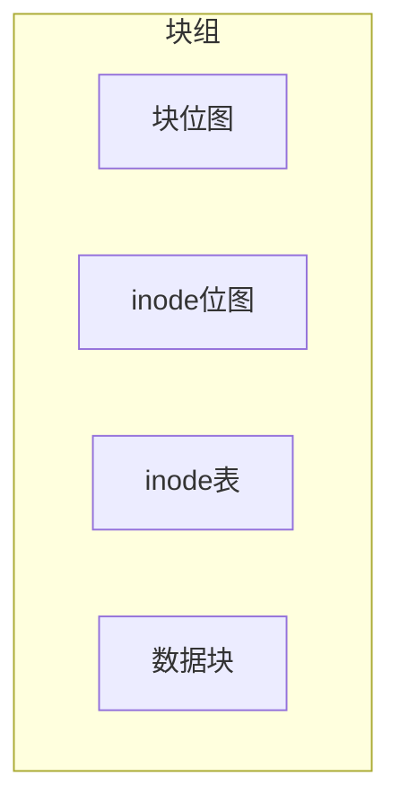
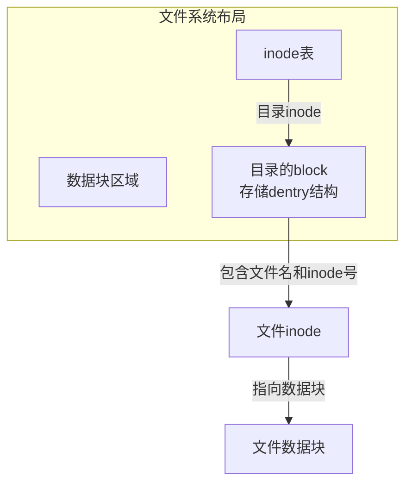

## 第二章 理解文件系统

### 2.1 理解格式化原理

在前文《磁盘开篇：扒开机械硬盘坚硬的外壳！》和《拆解固态硬盘结构》中，我们了解到了硬盘基本单位是扇区。在《磁盘分区也是隐含了技术技巧的》中我们也了解了磁盘分区是怎么回事，但刚分完区的硬盘也是不能直接被操作系统使用的，必须还得要经过格式化。那么今天我们就简单聊一聊，Linux下的格式化到底都干了些什么。

Linux下的格式化命令是 `mkfs`，`mkfs` 在格式化的时候需要制定分区以及文件系统类型。该命令其实就是把我们的连续的磁盘空间进行划分和管理。我在我的机器上执行了一下，输出如下：

```bash
# mkfs -t ext4 /dev/vdb
mke2fs 1.42.9 (28-Dec-2013)
文件系统标签=
OS type: Linux
块大小=4096 (log=2)
分块大小=4096 (log=2)
Stride=0 blocks, Stripe width=0 blocks
6553600 inodes, 26214400 blocks
1310720 blocks (5.00%) reserved for the super user
第一个数据块=0
Maximum filesystem blocks=2174746624
800 block groups
32768 blocks per group, 32768 fragments per group
```

接下来让我们深入理解一下上面输出里携带的信息。

#### inode 与 block

在上面结果中我们看到了几个重要信息：

- **块大小**：4096 字节
- **inode 数量**：6553600
- **block 数量**：26214400

块大小设置的是 4096 字节，我们来分析两种场景：

- 假如你的文件系统全部都用来存储 1KB 以下的小文件，这个时候你的磁盘 1/3 的空间将会被浪费无法使用。
- 假如你的文件全都是 GB 以上的大文件，这个时候你的 inode 索引节点里就需要直接或间接维护许许多多的 block 索引号。

很明显，以上这两种情况下 4096 字节的块大小是不合适的。你需要自己根据情况选择自己的块大小进行重新格式化。

我们再看另外两个数据，inode 数量和 block 数量。我们用 block 数量除以下 inode：`26214400 / 6553600 = 4`，也就是说平均 4 个 block 会有一个 inode。再举两个极端的例子：

- 第一种情况：假如说我们的文件都是 4KB 以下的，那么我们的文件系统用到最后出现的情况就是 inode 全部用光了，还有 1/3 的 block 空闲，而且再也没有办法创建新文件了。
- 第二种情况：假如我们的文件都特别大，每一个文件需要 1000 个 block，最后的情况就是 block 全部都用光了，但是 inode 又都空闲下来了，这个时候也是没办法再建文件的。

这些情况下，block 和 inode 的配比也都是不符合你使用的，你需要根据自己的业务重新配置。mkfs 傻瓜格式出来的结果无法满足你的业务需求，你就需要使用另外一些格式化命令了，比如 `mke2fs`，这个命令允许你输入更详细的格式化选项，demo 如下：

```bash
mke2fs -j -L "卷标" -b 2048 -i 8192 /dev/sdb1
```

#### 块组

我们再回头看格式化后的结果，结果中显示了和一些 `groups` 相关的东西，如下：

```
800 block groups
32768 blocks per group, 32768 fragments per group
8192 inodes per group
Superblock backups stored on blocks:
  32768, 98304, 163840, 229376, 294912, 819200, 884736, 1605632, 2654208,
  4096000, 7962624, 11239424, 20480000, 23887872
```

那么这个 `groups` 到底说的是什么呢？其实呀，格式化后的所有 inode 并不是挨着一起放的，同样 block 也不是。而是分成了一个个的 group，每一个 group 里都有一些 inode 和 block。逻辑图如下：



这个块组一般是多大呢？注意每个块中的数据块位图只有一个，假如你的块大小为 4KB，这样一个 bit 代表一个数据块，4KB 可以有 32K 个 bit，可以管理 `32K * 4K = 128M` 的数据块。让我们来实际动手验证一下，如下：

```bash
# dumpe2fs /dev/vdb
......
Block size:               4096
Inode size:               256
Inode count:              6553600
Block count:              26214400
......
Group 16: (Blocks 524288-557055) [INODE_UNINIT, ITABLE_ZEROED]
  Checksum 0xe838, unused inodes 8192
  Block bitmap at 524288 (+0), Inode bitmap at 524304 (+16)
  Inode表位于 524320-524831 (+32)
  24544 free blocks, 8192 free inodes, 0 directories, 8192个未使用的inodes
  可用块数: 532512-557055
  可用inode数: 131073-139264
......
Group 799: (Blocks 26181632-26214399) [INODE_UNINIT, ITABLE_ZEROED]
......
```

上述结果中包含信息如下：

- 该分区总共格式化好了 800 个块组
- 块组 16 共有 32K 个 block（第 524288-557055），
- block 位图在 524288 这个块上
- inode 位图在 524304 这个块上
- inode table 占用了 612 个 block（524320-524831）
- 剩下的其它的 block（32K-1-1-612）就都真的是给用户准备的了，目前空闲未分配的在 Free blocks 可以查看到。

#### 再次理解目录

好了，了解了以上原理以后，让我们回头再看看目录使用的数据是怎么在磁盘上组织的。创建目录的时候，操作系统会在 inode 位图上寻找尚未使用的 inode 编号，找到后把 inode 分配给你。目录会默认分配一个 block，所以还需要查询 block 位图，找到后分配一个 block。在 block 里面，存储的就是文件系统自己定义的 `dentry` 结构了，每一个结构里会保存其下的文件名、文件的 inode 编号等信息。某个实际文件夹在磁盘上最终使用的空间如下图所示：



目录的 block 中保存的是其下面的文件和子目录的 `dentry` 结构体，保存着它们的文件名和 inode 号。理解了目录，对于文件也是一样的。也需要消耗 inode，当有数据写入的时候，再去申请 block。

#### 结论

硬盘就是一个扇区组成的大数组，是无法被我们使用的，需要经过**分区**、**格式化**和**挂载**三个步骤。分区是把所有的扇区按照柱面分割成不同的大块，格式化就把原始的扇区数组变成了可被 Linux 文件系统使用的 inode、block 等基本元素了。感觉格式化程序有点像是厨师团队里的那个切墩的，把原材料变成了可被厨师直接使用的葱花、肉段。格式化完后再经过最后一步挂载，对应的命令是 `mount`，然后你就可以在它下面创建和保存文件了。

再扩展一下其实刚分完区的设备也是可以使用的，这个时候的分区叫**裸分区**，也叫**裸设备**。比如 Oracle 就是绕开操作系统直接使用裸设备的。但是这个时候你就无法利用 Linux 文件系统里为你封装好的 inode、block 组成的文件与目录了，开发工作量会增加。

### 2.2 新建一个空文件占用多少磁盘空间

今天我们来思考一个简单的问题。在 Linux 下你用 `touch` 命令新建一个空文件：

```bash
# touch empty_file.txt
```

操作完成后，是否要消耗掉我们的一些磁盘空间？需要的话，大概能消耗多少？嗯，是的，这个问题简单的超乎你的想象，但是不知道你能否给你自己一个满意的答案。

我前面的几篇文章都是介绍的磁盘物理层面的构成，但这对于理解文件相关的问题帮助可能还不够。从今天开始让我们从物理层往上走，到 Linux 文件系统原理里去寻找答案。

#### 实践出真知

我觉得可能先丢开内核原理，直接动手操作来实验更有意思一些。你一定知道 `ls` 这个命令你可以查看文件大小，那么就让我们用它来看一下。

```bash
# ls -l
total 0
-rw-r--r-- 1 root root 0 Aug 17 17:49 empty.file
```

额，`ls` 命令告诉我这个空文件占用的是 0。文件的大小确实是 0，因为我们还没有为该文件写入任何内容。但是我们现在要思考的是，一个空文件是否占用磁盘空间。所以直觉告诉我们这绝对不可能，磁盘上多出来一个文件，怎么可能一点空间开销都没有！

为了解开这个谜底，还需要借助 `df` 命令。输入 `df -i`：

```bash
# df -i
Filesystem            Inodes   IUsed   IFree IUse% Mounted on
......
/dev/sdb1            2147361984 12785019 2134576965    1% /search
```

这个输出帮我们展示了我们文件系统中 inode 的使用情况。注意 `IUsed` 是 12785019。我们继续新建一个空文件：

```bash
# touch abcdefghigklmn.txt
# df -i
Filesystem            Inodes   IUsed   IFree IUse% Mounted on
......
/dev/sdb1            2147361984 12785020 2134576964    1% /search
```

注意 `IUsed` 变成了 12785020。

哈哈，我们的一个结论就出来了。**新建一个空文件会占用一个 Inode。**

#### 细说 inode

那么 inode 里都存了哪些和文件相关的信息呢？我们再稍微看一下内核的源代码。大家可以下载一份 Linux 的源代码。以 ext2 文件系统为例，在我下载的 linux-2.6 里的文件 `fs/ext2/ext2.h` 中，可以找到内核对于 inode 结构体的定义。该结构体较为复杂，主要存储除了文件内容以外的一些其他数据，我们选一些比较关键的截取出来：

```c
struct ext2_inode {
        __le16  i_mode;             # 文件权限
        __le16  i_uid;              # 文件所有者ID
        __le32  i_size;             # 文件字节数大小
        __le32  i_atime;            # 文件上次被访问的时间
        __le32  i_ctime;            # 文件创建时间
        __le32  i_mtime;            # 文件被修改的时间
        __le32  i_dtime;            # 文件被删除的时间
        __le16  i_gid;              # 文件所属组ID
        __le16  i_links_count;      # 此文件的inode被连接的次数
        __le32  i_blocks;           # 文件的block数量
    ......
        __le32  i_block[EXT2_N_BLOCKS]; # 指向存储文件数据的块的数组
```

可以看到和文件相关的所属用户、访问时间等都是存在 inode 中的。另外在 `include/linux/fs.h` 中，还有个 VFS 层面的 inode 的定义，这里咱就不发散了。使用 `stat` 命令就可以直接看到文件 inode 中的数据：

```bash
# stat test
  File: `test'
  Size: 0               Blocks: 0          IO Block: 1024   regular empty file
Device: 801h/2049d      Inode: 26          Links: 1
Access: (0644/-rw-r--r--)  Uid: (    0/    root)   Gid: (    0/    root)
Access: 2020-03-01 12:14:31.000000000 +0800
Modify: 2020-03-01 12:14:31.000000000 +0800
Change: 2020-03-01 12:14:31.000000000 +0800
```

每个 inode 到底是多大呢？`dumpe2fs` 可以告诉你（XFS 的话使用 `xfs_info`）：

```bash
# dumpe2fs -h /dev/mapper/vgroot-lvroot
dumpe2fs 1.41.12 (17-May-2010)
......
Inode size:               256
```

`Inode size` 表示每个 Inode 的大小。我的这台机器上，每个 inode 都是 256 字节。两个 inode 的大小正好对齐到磁盘扇区的 512 字节。

#### 文件名存到哪里了

inode 结构体都看完了，搞了半天不知道有没有发现一个问题，inode 里并没有存储文件名！！那么，文件名到底跑哪儿去了？

在 `fs/ext2/ext2.h` 中，我找到了如下文件夹相关的结构体：

```c
struct ext2_dir_entry {
         __le32  inode;                  /* Inode number */
         __le16  rec_len;                /* Directory entry length */
         __le16  name_len;               /* Name length */
         char    name[];                 /* File name, up to EXT2_NAME_LEN */
};
```

这个结构体就是我们司空见惯的**文件夹**。没错，**文件名是存在其所属的文件夹数据结构中的**，就是其中的 `char name[]` 字段。和文件名一起，文件夹里还记录了该文件的 inode 等信息。

#### 结论

1. 新建一个空文件需要消耗掉一个 inode，用来保存用户、创建时间等元数据。
2. 新建一个空文件还需要消耗掉其所有目录的 block 中一定的空间，这些空间用来保存文件名、权限、时间等信息。

所以，看起来新建一个空文件而已，只要你想挖，真的能挖出很多知识的。最后分享一个我们团队里同学遇到的一个故障。我们的一台离线任务机直接歇菜了，重启后排查原因是 inode 被消耗光了。再追查发现一个进程创建了太多的空日志文件。虽然文件都是空文件，但是 inode 却被浪费光了。后来让负责的同学修改了创建日志文件的逻辑，删掉了多出来的空文件，该机器恢复正常。

### 2.3 只写入一个字节的文件占用多少磁盘空间

在前面我们了解到了一个空文件的磁盘开销。今天我们再思考另外一个问题，假如我们给文件里只写入 1 个字节，那么这个文件实际的磁盘占用也是 1 个字节吗？

#### 查看 1 个字节的文件

和前文一样，先不谈原理，直接动手操作。

在一个目录中创建了一个空的文件以后，通过 `du` 命令看到的该文件夹的占用空间并没有发生变化。这倒是符合我们之前的认识，因为空文件只占用 inode。好，那让我们修改文件，添加一个字母：

```bash
# mkdir tempDir
# cd tempDir
# du -h
0    .
# touch test
# du -h
0    .
echo "a" > test
# du -h
4.0K    .
```

保存后再次查看该目录的空间占用。我们发现由原来的 0 增加到了 4K。

所以说，**文件里的内容不论多小，哪怕是一个字节，其实操作系统也会给你分配 4K 的**。哦，当然了还得再算前文中说的 inode 和文件夹数据结构中存储的文件名等所用的空间。

所以，**不要在你的系统里维护一大堆的碎文件。文件再小，占用磁盘其实一点都不少！**

> [!NOTE]
> 注意我的实验环境是在 ext 文件系统下进行的。如果是 XFS 可能表现会些许出入。

#### 继续讨论这个 4K

再把 Linux 源代码文件 `fs/ext2/ext2.h` 里关于 inode 的定义翻出来，我们找到结构体中定义的指向数据节点用的 block 数组：

```c
struct ext2_inode {
        ......
        __le32  i_block[EXT2_N_BLOCKS]; # 指向存储文件数据的块的数组
        ......
```

当文件没有数据需要存储的时候，这个数组都是空值。而当我们写入了 1 个字节以后，文件系统就需要申请 block 去存储了，申请完后，指针放在这个数组里。哪怕文件内容只有一个字节，仍然会分配一个整的 Block，因为这是文件系统的最小工作单位。那么这个 block 大小是多大呢，ext 下可以通过 `dumpe2fs` 查看：

```bash
#dumpe2fs -h /dev/mapper/vgroot-lvroot
......
Block size:               4096
```

在我的机器上，一个 Block 是 4KB。

#### 文件内容再大了怎么办

不知道你留意没，inode 中定义的 block 数组大小呢，只有 `EXT2_N_BLOCKS#### 文件内容再大了怎么办

不知道你留意没，inode 中定义的 block 数组大小呢，只有 `EXT2_N_BLOCKS` 个。我们再查看一下这个常量的定义，发现它是 15，相关内核中定义如下：

```c
#define EXT2_NDIR_BLOCKS               12
#define EXT2_IND_BLOCK                  EXT2_NDIR_BLOCKS
#define EXT2_DIND_BLOCK                 (EXT2_IND_BLOCK + 1)
#define EXT2_TIND_BLOCK                 (EXT2_DIND_BLOCK + 1)
#define EXT2_N_BLOCKS                   (EXT2_TIND_BLOCK + 1)
```

就按 4K 的 block size 来看，15 个 block 只够存的下 `15 * 4 = 60K` 的文件。这个文件大小相信你一定不满意，你存一个 avi 大片都得上 G 了。那 Linux 是怎么实现大文件存储的呢？嗯，其实上面宏的定义过程已经告诉你了，就是只有 12 个数组元素直接存 block 指针，其余的用来做间接索引（`EXT2_IND_BLOCK`），二级间接索引（`EXT2_DIND_BLOCK`）和三级索引（`EXT2_TIND_BLOCK`）。

这样，一个文件可以使用的空间就指数倍的扩展了。文件小的时候，都用直接索引，磁盘 IO 少，性能好。文件大的时候，访问一个 block 可能得先进行三次的 IO，性能略慢，不过有 OS 层面的页缓存、目录项缓存的加持，也还好。

#### 结论

文件系统是按照块来管理的，所以不管你的文件多小，哪怕只有一个字节，都会消耗掉整整一个块。这个块大小可以通过 `dumpe2fs` 等命令来查看。如果想改变这个块大小怎么办？对不起，只能重新格式化。

---

至此，第一段内容（格式化原理、空文件与单字节文件占用的磁盘空间）已完成输出。下一段将涉及“文件过多时 ls 命令卡住的原因”。

## 2.2 新建一个空文件占多少磁盘空间

> [!question] 思考
> 在Linux下用 `touch` 命令新建一个空文件，是否会消耗磁盘空间？消耗多少？

### 实践验证

```bash
# touch empty_file.txt
# ls -l
total 0
-rw-r--r-- 1 root root 0 Aug 17 17:49 empty.file
# df -i
Filesystem            Inodes   IUsed   IFree IUse% Mounted on
/dev/sdb1            2147361984 12785019 2134576965    1% /search
```

`ls` 显示文件大小为0，但用 `df -i` 查看 inode 使用情况。创建第二个空文件后：

```bash
# touch empty_file2.txt
# df -i
Filesystem            Inodes   IUsed   IFree IUse% Mounted on
/dev/sdb1            2147361984 12785020 2134576964    1% /search
```

**结论**：新建一个空文件会占用一个 [[inode]]。

### inode 内部结构

以 ext2 文件系统为例（源码 `fs/ext2/ext2.h`），`struct ext2_inode` 主要字段：

```c
struct ext2_inode {
    __le16  i_mode;          // 文件权限
    __le16  i_uid;           // 所有者ID
    __le32  i_size;          // 文件大小
    __le32  i_atime;         // 上次访问时间
    __le32  i_ctime;         // 创建时间
    __le32  i_mtime;         // 修改时间
    __le32  i_dtime;         // 删除时间
    __le16  i_gid;           // 组ID
    __le16  i_links_count;   // 硬链接计数
    __le32  i_blocks;        // 块数量
    __le32  i_block[EXT2_N_BLOCKS]; // 指向数据块的指针数组
};
```

每个 inode 的大小可通过 `dumpe2fs` 查看：

```bash
# dumpe2fs -h /dev/mapper/vgroot-lvroot
Inode size:              256
```

### 文件名存在哪里？

文件名并不存储在 inode 中，而是存储在**目录**的数据结构中。

```c
struct ext2_dir_entry {
    __le32  inode;          // 文件inode号
    __le16  rec_len;        // 目录项长度
    __le16  name_len;       // 文件名长度
    char    name[];         // 文件名
};
```

目录项保存在其父目录的 data block 中。

### 小结

1. 新建一个空文件消耗一个 inode（256字节）。
2. 同时在其父目录的 block 中新增一个 `ext4_dir_entry_2` 项，消耗一定空间（文件名越长，消耗越多）。

> [!warning] 生产事故
> 某团队离线任务机因创建太多空日志文件导致 inode 耗尽，机器无法创建新文件。删除多余空文件后恢复。

---

## 2.3 只写入一个字节的文件占用多少磁盘空间

### 实验

```bash
# mkdir tempDir
# cd tempDir
# du -h
0    .
# touch test
# du -h
0    .
# echo "a" > test
# du -h
4.0K    .
```

即使只写一个字节，文件也会占用一个完整的 Block（4KB）。

### 原因

inode 中的 `i_block[]` 数组指向数据块。当文件有内容时，文件系统分配一个完整的 Block，即使只有1字节。Block 大小可通过 `dumpe2fs` 查看：

```bash
# dumpe2fs -h /dev/mapper/vgroot-lvroot
Block size:              4096
```

### 大文件如何存储？

`i_block[]` 数组只有15个元素（`EXT2_N_BLOCKS`），前12个直接索引，后3个为间接索引（一级、二级、三级），可支持更大文件。

- 小文件：使用直接索引，性能好。
- 大文件：需多次间接索引，但借助 [[Page Cache]] 和 [[目录项缓存]]，影响可控。

### 结论

- 文件系统按块分配空间，即使1字节也占用一个完整 Block（默认4KB）。
- 块大小只能在格式化时设定，后期无法修改。

---

## 2.4 文件过多时 ls 命令为什么会卡住

### 问题现象

当目录下文件数量极大（例如数万至数十万），执行 `ls` 会长时间卡住。

### 原因分析

#### 1. 目录本身也消耗 inode

创建空目录：

```bash
# mkdir temp
# df -i
```

空目录分配一个 inode（256字节）。

#### 2. 目录的 block 消耗

目录的 block 中存储 `ext4_dir_entry_2` 数组，每个子文件/子目录对应一项。

```bash
# mkdir test
# cd test
# du -h
4.0K    .
# touch aaaaaaaaaaaaaaaaaaaaaaaaaaaaaaab
# touch aaaaaaaaaaaaaaaaaaaaaaaaaaaaaaaa
# du -h
4.0K    .
```

创建100个32字节文件后：

```bash
# for i in $(seq 1 100); do touch tempDir/$(printf "%032d" $i); done
# du -h
12K    .
```

创建10000个文件后：

```bash
# du -h
548K    .
```

每个目录项约54字节（32字节文件名 + 其他元数据）。当文件数量巨大时，目录的 block 越来越多。

#### 3. ls 命令的工作方式

`ls` 需要**遍历**目录的所有 block，读取所有 `ext4_dir_entry_2`，然后对每个文件调用 `stat` 获取元数据（inode 信息）。如果目录块不在 [[Page Cache]] 中，就会触发磁盘 IO，大量随机读导致性能极差。

### 解决方案

- **多级目录散列**：将文件分布到多个子目录中，控制单目录文件数量（如 <10万）。
- 常用做法：用一级或二级哈希路径，例如 `hash($name)/$name`。

### 一个 ext 的“Bug”：删除文件后目录空间不释放

```bash
# rm -f *
# du -h
72K    .
```

这是因为 `ext4_dir_entry_2` 中的 `rec_len` 用于链表遍历，删除文件时只是将 `inode` 设为0，并不回收该目录项（假删除）。新文件可复用这些空闲槽位，但如果文件全部删除，目录的 block 不会自动缩小。XFS 文件系统已无此问题。

### 检查当前目录的 block 大小

```bash
# stat -f .
  Block size: 4096
```

### 结论

- 目录下的文件/子目录越多，目录的 block 越多。
- 遍历目录时若命中 [[Page Cache]] 则快，否则触发磁盘 IO，造成 `ls` 卡顿。
- 实际工程中应通过多级目录散列控制单目录文件数量。

> [!tip] 实践建议
> 使用 `dumpe2fs` 或 `stat` 查看文件系统的 Block 大小、inode 大小等信息，合理规划文件分布。