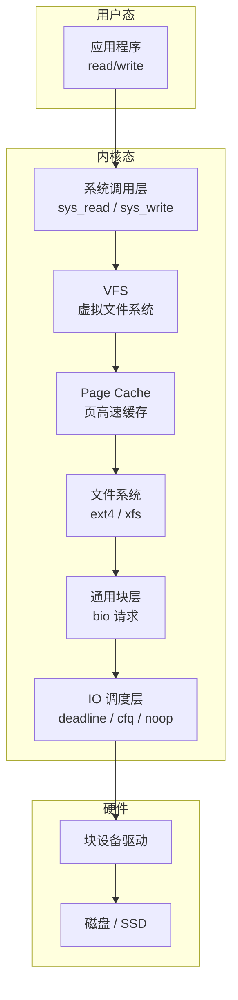
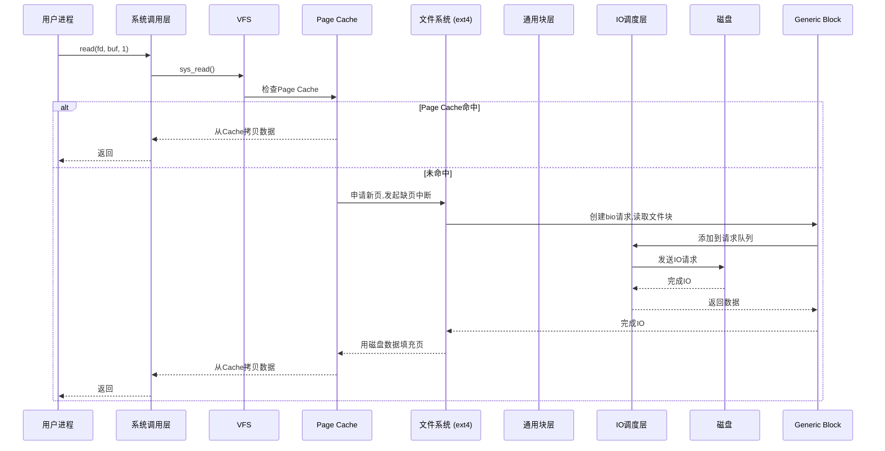
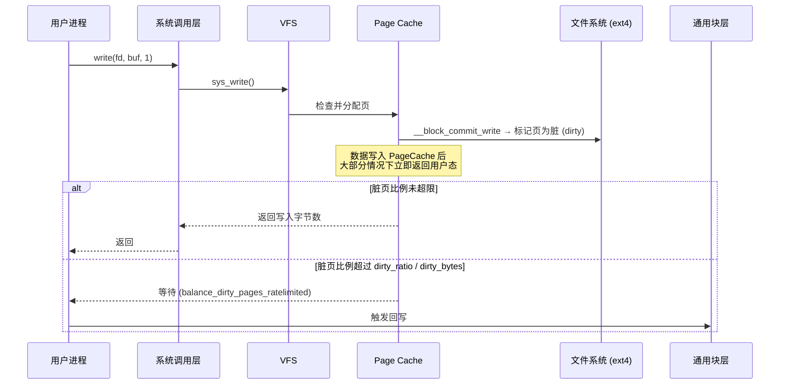

# 1.4 文件读写过程与性能

## 1.4.1 read 文件一个字节会发生多大的磁盘 IO

在日常开发中一些看似司空见惯的问题上，我觉得可能大多数人其实并没有真正理解，或者理解的不够透彻。不信我们来看以下一段简单的读取文件的代码：

```c
// 示例读取一个字节的代码
char c;
int fd = open("file.txt", O_RDONLY);
read(fd, &c, 1);
```

基于这个代码片段我们来思考：
1. 读取文件 1 个字节是否会导致磁盘 IO？
2. 如果发生了磁盘 IO，那发生的是多大的 IO 呢？

平时用的各种语言 C++、PHP、Java、Go 等封装层次都比较高，把很多细节都给屏蔽的比较彻底。如果想把上面问题搞清楚，需要剖开 Linux 的内部来看 Linux 的 IO 栈。

### 大话 Linux IO 栈

以下是一个 Linux IO 栈的简化版本（官方 IO 栈参考 `Linux.IO.stack_v1.0.pdf`）。



通过 IO 栈可以看到，我们在应用层简单的一次 `read` 而已，内核就需要 IO 引擎、VFS、Page Cache、通用块管理层、IO 调度层等许多个组件来进行复杂配合才能完成。

这些组件都是干什么的呢？我们挨个简单过一遍。

#### IO 引擎

开发同学想要读写文件的话，在 lib 库层有很多套函数可以选择，比如 `read` & `write`，`pread` & `pwrite`。这事实上就是在选择 Linux 提供的 IO 引擎。

常见的 IO 引擎种类如下：

- **sync**：同步阻塞 IO（如 `read` / `write`）
- **sync with async notification**：同步 + 异步通知
- **async / aio**：异步 IO（如 `libaio`）
- **mmap**：内存映射 IO
- **splice / sendfile**：零拷贝 IO

我们开篇中代码片用的 `read` 函数就属于 sync 引擎。IO 引擎仍然处于上层，它需要内核层提供的系统调用、VFS、通用块层等更底层组件的支持才能实现。

#### 系统调用

当进入到系统调用以后，也就进入到了内核层。系统调用将内核中其它组件的功能进行封装，然后通过接口的形式暴露给用户进程来访问。

对于我们的读取文件的需求，系统调用需要依赖 VFS 内核组件。

#### VFS 虚拟文件系统

VFS 的思想就是在 Linux 上抽象一个通用的文件系统模型，对我们开发人员或者是用户提供一组通用的接口，让我们不用 care 具体文件系统的实现。VFS 提供的核心数据结构有四个，它们定义在内核源代码的 `include/linux/fs.h` 和 `include/linux/dcache.h` 中。

- **superblock**：Linux 用来标注具体已安装的文件系统的有关信息。
- **inode**：Linux 中的每一个文件/目录都有一个 inode，记录其权限、修改时间等信息。
- **dentry**：目录项，是路径中的一部分，所有的目录项对象串起来就是一棵 Linux 下的目录树。
- **file**：文件对象，用来和打开它的进程进行交互。

围绕这四个核心数据结构，VFS 也都定义了一系列的操作方法。比如，inode 的操作方法定义 `inode_operations`，在它的里面定义了我们非常熟悉的 `mkdir` 和 `rename` 等。对于 file 对象，定义了对应的操作方法 `file_operations`，如下：

```c
// include/linux/fs.h
struct file {
    ......
    const struct file_operations *f_op;
};

struct file_operations {
    ......
    ssize_t (*read) (struct file *, char __user *, size_t, loff_t *);
    ssize_t (*write) (struct file *, const char __user *, size_t, loff_t *);
    ......
    int (*mmap) (struct file *, struct vm_area_struct *);
    int (*open) (struct inode *, struct file *);
    int (*flush) (struct file *, fl_owner_t id);
};
```

注意 VFS 是抽象的，所以它的 `file_operations` 里定义的 read、write 都只是函数指针，实际中需要具体的文件系统来实现，例如 [[ext4]] 等等。

#### Page Cache

Page Cache，它的中文译名叫页高速缓存。它是 Linux 内核使用的主要磁盘高速缓存，是一个纯内存的工作组件。Linux 内核使用搜索树来高效管理大量的页面。

有了它，Linux 就可以把一些磁盘上的文件数据保留在内存中，然后来给访问相对比较慢的磁盘来进行访问加速。

当用户要访问的文件的时候，如果要访问的文件 block 正好存在于 Page Cache 内，那么 Page Cache 组件直接把数据从内核态拷贝到用户进程的内存中就可以了。如果不存在，那么会申请一个新页，发出缺页中断，然后用磁盘读取到的 block 内容来填充它，下次直接使用。

看到这里，开篇的问题可能你就明白一半了，如果你要访问的文件近期访问过，那么 Linux 大概率就是从 Page cache 内存中的拷贝给你就完事，并不会有实际的磁盘 IO 发生。

不过有一种情况下，Page Cache 不会生效，那就是你设置了 `O_DIRECT` 标志。

#### 文件系统

Linux 下支持的文件系统有很多，常用的有 ext2/3/4、XFS、ZFS 等。

要用哪种文件系统是在格式化的时候指定的。因为每一个分区都可以单独进行格式化，所以一台 Linux 机器下可以同时使用多个不同的文件系统。

文件系统里提供对 VFS 的具体实现。除了数据结构，每个文件系统还会定义自己的实际操作函数。例如在 ext4 中定义的 `ext4_file_operations`，其中包含 VFS 中定义的 read 函数的具体实现：`do_sync_read` 和 `do_sync_write`。

```c
const struct file_operations ext4_file_operations = {
    .llseek         = ext4_llseek,
    .read           = do_sync_read,
    .write          = do_sync_write,
    .aio_read       = generic_file_aio_read,
    .aio_write      = ext4_file_write,
    ......
};
```

和 VFS 不同的是，这里的函数就是实实在在的实现了。

#### 通用块层

文件系统还要依赖更下层的通用块层。

对上层的文件系统，通用块层提供一个统一的接口让供文件系统实现者使用，而不用关心不同设备驱动程序的差异，这样实现出来的文件系统就能用于任何的块设备。通过对设备进行抽象后，不管是磁盘还是机械硬盘，对于文件系统都可以使用相同的接口对逻辑数据块进行读写操作。

对下层，I/O 请求添加到设备的 I/O 请求队列。它定义了一个叫 `bio` 的数据结构来表示一次 IO 操作请求（`include/linux/bio.h`）。

#### IO 调度层

当通用块层把 IO 请求实际发出以后，并不一定会立即被执行。因为调度层会从全局出发，尽量让整体磁盘 IO 性能最大化。

- 对于机械硬盘来说，调度层会尽量让磁头类似电梯那样工作，先往一个方向走，到头再回来，这样整体效率会比较高一些。具体的算法有 `deadline` 和 `cfq`，算法细节就不展开了。
- 对于固态硬盘来说，随机 IO 的问题已经被很大程度地解决了，所以可以直接使用最简单的 `noop` 调度器。

在你的机器上，通过 `dmesg | grep -i scheduler` 来查看你的 Linux 支持的调度算法。

通用块层和 IO 调度层一起为上层文件系统屏蔽了底层各种不同的硬盘、U 盘的设备差异。

### 读文件过程

我们已经把 Linux IO 栈里的各个内核组件都简单介绍一遍了。现在我们再从头整体过一下读取文件的过程（图中源代码基于 Linux 3.10）。



### 回顾开篇问题

回到开篇的第一个问题：**读取文件 1 个字节是否会导致磁盘 IO？**

从上述流程中可以看到，如果 Page Cache 命中的话，根本就没有磁盘 IO 产生。

所以，大家不要觉得代码里出现几个读写文件的逻辑就觉得性能会慢的不行。操作系统已经替你优化了很多很多，内存级别的访问延迟大约是 ns 级别的，比机械磁盘 IO 快了好几个数量级。如果你的内存足够大，或者你的文件被访问的足够频繁，其实这时候的 read 操作极少有真正的磁盘 IO 发生。

假如 Page Cache 没有命中，那么一定会有传动到机械轴上进行磁盘 IO 吗？

其实也不一定，为什么，因为现在的磁盘本身就会带一块缓存。另外现在的服务器都会组建磁盘阵列，在磁盘阵列里的核心硬件 Raid 卡里也会集成 RAM 作为缓存。只有所有的缓存都不命中的时候，机械轴带着磁头才会真正工作。

再看开篇的第二个问题：**如果发生了磁盘 IO，那发生的是多大的 IO 呢？**

如果所有的 Cache 都没有兜住 IO 读请求，那么我们来看看实际 Linux 会读取多大。真的按我们的需求来，只去读一个字节吗？

整个 IO 过程中涉及到了好几个内核组件。而每个组件之间都是采用不同长度的块来管理磁盘数据的。

- Page Cache 是以页为单位的，Linux 页大小一般是 4KB
- 文件系统是以块(block)为单位来管理的。使用 `dumpe2fs` 可以查看，一般一个块默认是 4KB
- 通用块层是以段为单位来处理磁盘 IO 请求的，一个段为一个页或者是页的一部分
- IO 调度程序通过 DMA 方式传输 N 个扇区到内存，扇区一般为 512 字节
- 硬盘也是采用“扇区”的管理和传输数据的

可以看到，虽然我们从用户角度确实是只读了 1 个字节。但是在整个内核工作流中，最小的工作单位是磁盘的扇区，为 512 字节，比 1 个字节要大的多。

另外 block、page cache 等高层组件工作单位更大。其中 Page Cache 的大小是一个内存页 4KB。所以一般一次磁盘读取是多个扇区（512 字节）一起进行的。假设通用块层 IO 的段就是一个内存页的话，一次磁盘 IO 就是 4 KB（8 个 512 字节的扇区）一起进行读取。

另外我们没有讲到的是还有一套复杂的预读取的策略。所以，在实践中，可能比 8 更多的扇区来一起被传输到内存中。

### 最后，啰嗦几句

操作系统的本意是做到让你简单可依赖，让你尽量把它当成一个黑盒。你想要一个字节，它就给你一个字节，但是自己默默干了许许多多的活儿。

我们虽然国内绝大多数开发都不是搞底层的，但如果你十分关注你的应用程序的性能，你应该明白操作系统的什么时候悄悄提高了你的性能，是怎么来提高的。以便在将来某一个时候你的线上服务器扛不住快要挂掉的时候，你能迅速找出问题所在。

---

## 1.4.2 Write 文件一个字节后何时发起写磁盘 IO

在前文《read 文件一个字节实际会发生多大的磁盘 IO？》写完之后，本来想着偷个懒，只通过读操作来让大家了解下 Linux IO 栈的各个模块就行了。但很多同学表示再让我写一篇关于写操作的。既然不少人都有这个需求，那我就写一下吧。

Linux 内核真的是太复杂了，源代码的行数已经从 1.0 版本时的几万行，到现在已经是千万行的一个庞然大物了。直接钻进去的话，很容易在各种眼花缭乱的各种调用中迷失了自己，再也钻不出来了。我分享给大家一个我在琢磨内核的方法。一般我自己先想一个自己很想搞清楚的问题。不管在代码里咋跳来跳去，时刻都要记得自己的问题，无关的部分尽量少去发散，只要把自己的问题搞清楚了就行了。

现在我想搞明白的问题是，在最常用的方式下，不开 `O_DIRECT`、不开 `O_SYNC`（写文件的方法有很多，有 sync 模式、direct 模式、mmap 内存映射模式），write 是怎么写的。C 的代码示例如下：

```c
#include <fcntl.h>
int main()
{
    char c = 'a';
    int out;
    out = open("out.txt", O_WRONLY | O_CREAT | O_TRUNC);
    write(out, &c, 1);
    // ...
}
```

进一步细化我的问题，我们对打开的文件写入一个字节后：
- write 函数在内核里是怎么执行的？
- 数据在什么时机真正能写入到磁盘上？

我们在讨论的过程中不可避免地要涉及到内核代码，我使用的内核版本是 3.10.1。如果有需要，你可以到这里来下载：[https://mirrors.edge.kernel.org/pub/linux/kernel/v3.x/](https://mirrors.edge.kernel.org/pub### write 函数实现剖析

我花了不短的时候跟踪 write 写到 ext4 文件系统时的各种调用和返回，大致理出来了一个交互图。当然为了突出重点，我抛弃了不少细节，比如 Direct IO、ext4 日志记录啥的都没有体现出来，只抽取出来了一些我认为关键的调用。



在上面的流程图里，所有的写操作最终到哪儿了呢？在最后面的 `__block_commit_write` 中，只是 make dirty。然后大部分情况下你的函数调用就返回了（稍后再说 `balance_dirty_pages_ratelimited`）。数据现在还在内存中的 PageCache 里，并没有真正写到硬盘。

为什么要这样实现，不直接写硬盘呢？原因就在于硬盘——尤其是机械硬盘，性能是在是太慢了。一块服务器级别的万转盘，最坏随机访问平均延迟都是毫秒级别的，换算成 IOPS 只有 100 多不到 200。设想一下，假如你的后端接口里每个用户来访问都需要一次随机磁盘 IO，不管你多牛的服务器，每秒 200 的 qps 都将直接打爆你的硬盘，相信作为为百万/千万/过亿用户提供接口的你，这个是你绝对不能忍的。

Linux 这么搞也是有副作用的，如果接下来服务器发生掉电，内存里东西全丢。所以 Linux 还有另外一个“补丁”——延迟写，帮我们缓解这个问题。注意下，我说的是缓解，并没有彻底解决。

再说下 `balance_dirty_pages_ratelimited`，虽然绝大部分情况下，都是直接写到 Page Cache 里就返回了。但在一种情况下，用户进程必须得等待写入完成才可以返回，那就是对 `balance_dirty_pages_ratelimited` 的判断如果超出限制了。该函数判断当前脏页是否已经超过脏页上限 `dirty_bytes`、`dirty_ratio`，超过了就必须得等待。这两个参数只有一个会生效，另外一个是 0。拿 `dirty_ratio` 来说，如果设置的是 30，就说明如果脏页比例超过内存的 30%，则 write 函数调用就必须等待写入完成才能返回。可以在你的机器下的 `/proc/sys/vm/` 目录来查看这两个配置。

```bash
# cat /proc/sys/vm/dirty_bytes
0
# cat /proc/sys/vm/dirty_ratio
30
```

### 内核延迟写

内核是什么时候真正把数据写到硬盘中呢？为了快速摸清楚全貌，我想到的办法是用 systemtap 工具，找到内核写 IO 过程中的一个关键函数，然后在其中把函数调用堆栈打出来。查了半天资料以后，我决定用 `do_writepages` 这个函数。

```bash
#!/usr/bin/stap
probe kernel.function("do_writepages")
{
    printf("--------------------------------------------------------\n"); 
    print_backtrace(); 
    printf("--------------------------------------------------------\n"); 
}
```

systemtap 跟踪以后，打印信息如下：

```
 0xffffffff8118efe0 : do_writepages+0x0/0x40 [kernel]
 0xffffffff8122d7d0 : __writeback_single_inode+0x40/0x220 [kernel]
 0xffffffff8122e414 : writeback_sb_inodes+0x1c4/0x490 [kernel]
 0xffffffff8122e77f : __writeback_inodes_wb+0x9f/0xd0 [kernel]
 0xffffffff8122efb3 : wb_writeback+0x263/0x2f0 [kernel]
 0xffffffff8122f35c : bdi_writeback_workfn+0x1cc/0x460 [kernel]
 0xffffffff810a881a : process_one_work+0x17a/0x440 [kernel]
 0xffffffff810a94e6 : worker_thread+0x126/0x3c0 [kernel]
 0xffffffff810b098f : kthread+0xcf/0xe0 [kernel]
 0xffffffff816b4f18 : ret_from_fork+0x58/0x90 [kernel]
```

从上面的输出我们可以看出，真正的写文件过程操作是由 worker 内核线程发出来的（和我们自己的应用程序进程没有半毛钱关系，此时我们的应用程序的 write 函数调用早就返回了）。这个 worker 线程写回是周期性执行的，它的周期取决于内核参数 `dirty_writeback_centisecs` 的设置，根据参数名也大概能看出来，它的单位是百分之一秒。

```bash
# cat /proc/sys/vm/dirty_writeback_centisecs
500
```

我查看到我的配置是 500，就是说每 5 秒会周期性地来执行一遍。回顾我们的问题，我们最关心的问题的啥时候写入的，围绕这个思路不过多发散。于是沿着这个调用栈不断地跟踪，跳转，终于找到了下面的代码。如下代码里我们看到，如果是 `for_background` 模式，且 `over_bground_thresh` 判断成功，就会开始回写了。

```c
static long wb_writeback(struct bdi_writeback *wb,
                         struct wb_writeback_work *work)
{
    work->older_than_this = &oldest_jif;
    ...
    if (work->for_background && !over_bground_thresh(wb->bdi))
        break;
    ...
    if (work->for_kupdate) {
        oldest_jif = jiffies -
                msecs_to_jiffies(dirty_expire_interval * 10);
    } else ...
}

static long wb_check_background_flush(struct bdi_writeback *wb)
{
    if (over_bground_thresh(wb->bdi)) {
        ...
        return wb_writeback(wb, &work);
    }
}
```

那么 `over_bground_thresh` 函数判断的是啥呢？其实就是判断当前的脏页是不是超过内核参数里 `dirty_background_ratio` 或 `dirty_background_bytes` 的配置，没超过的话就不写了（代码位于 `fs/fs-writeback.c:1440`，限于篇幅我就不贴了）。这两个参数只有一个会真正生效，其中 `dirty_background_ratio` 配置的是比例、`dirty_background_bytes` 配置的是字节。

在我的机器上的这两个参数配置如下，表示脏页比例超过 10% 就开始回写。

```bash
# cat /proc/sys/vm/dirty_background_bytes
0
# cat /proc/sys/vm/dirty_background_ratio
10
```

那如果脏页一直都不超过这个比例怎么办呢，就不写了吗？不是的。在上面的 `wb_writeback` 函数中我们看到了，如果是 `for_kupdate` 模式，会记录一个过期标记到 `work->older_than_this`，再往后面的代码中把符合这个条件的页面也写回了。`dirty_expire_interval` 这个变量是从哪儿来的呢？在 `kernel/sysctl.c` 里，我们发现了蛛丝马迹。哦，原来它是来自 `/proc/sys/vm/dirty_expire_centisecs` 这个配置。

```c
1158         {
1159                 .procname       = "dirty_expire_centisecs",
1160                 .data           = &dirty_expire_interval,
1161                 .maxlen         = sizeof(dirty_expire_interval),
1162                 .mode           = 0644,
1163                 .proc_handler   = proc_dointvec_minmax,
1164                 .extra1         = &zero,
1165         },
```

在我的机器上，它的值是 3000。单位是百分之一秒，所以就是脏页过了 30 秒就会被内核线程认为需要写回到磁盘了。

```bash
# cat /proc/sys/vm/dirty_expire_centisecs
3000
```

### 结论

我们 demo 代码中的写入，其实绝大部分情况都是写入到 Page Cache 中就返回了，这时并没有真正写入磁盘。我们的数据会在如下三个时机下被真正发起写磁盘 IO 请求：

1. **第一种情况**：如果 write 系统调用时，发现 Page Cache 中脏页占比太多，超过了 `dirty_ratio` 或 `dirty_bytes`，write 就必须等待了。
2. **第二种情况**：write 写到 Page Cache 就已经返回了。worker 内核线程异步运行的时候，再次判断脏页占比，如果超过了 `dirty_background_ratio` 或 `dirty_background_bytes`，也发起写回请求。
3. **第三种情况**：这时同样 write 调用已经返回了。worker 内核线程异步运行的时候，虽然系统内脏页一直没有超过 `dirty_background_ratio` 或 `dirty_background_bytes`，但是脏页在内存中呆的时间超过 `dirty_expire_centisecs` 了，也会发起回写。

如果对以上配置不满意，你可以自己通过修改 `/etc/sysctl.conf` 来调整，修改完了别忘了执行 `sysctl -p`。

最后我们要认识到，这套 write pagecache + 回写的机制第一目标是性能，不是保证不丢失我们写入的数据的。如果这时候掉电，脏页时间未超过 `dirty_expire_centisecs` 的就真的丢了。如果你做的是和钱相关非常重要的业务，必须保证落盘完成才能返回，那么你就可能需要考虑使用 `fsync`。

---

## 1.4.3 机械硬盘性能数据实测

大家都知道硬盘的随机 IO 很慢，但是比顺序 IO 慢多少呢，不知道你是否有过数字上的直接对比。今天我来实际压测对比一下磁盘在顺序 IO 和随机 IO 不同场景下的性能数据表现。通过今天的实验数据，你将能深刻理解数据库事务中为什么要用日志的方式来实现，为什么索引中要用节点更大的 B+ 树。

### 测试环境

对于任何存储系统，性能指标无非就是带宽、延迟或 IOPS。我的测试机器的硬盘配置是一个由 7 块 300G 万转机械磁盘组成的 RAID 5，压测工具使用的 fio，压测过程中，我们固定几个参数：

- IO 引擎选择 libaio
- 为了避免操作系统管理的 Page Cache 内存对测试结果的干扰，使用 direct 参数绕开
- 打开 `unified_rw_reporting`，让结果中分别显示读和写
- 为了保证测试相对准确，我们运行时间设置为 300s
- 由于服务器敏感性，压测对象没有选择裸设备，用文件，会有一点文件系统额外开销
- 测试文件尺寸定义为 100G，RAID 卡缓存是 1G，目的是让它的命中率别太高
- 调度策略选择最最常用的 noop
- 打开 `refill_buffers`，每次 I/O 提交后都重新生成测试文件数据片段，保证随机性
- 按照 RAID 使用配置建议，关闭掉磁盘自带缓存
- 然后再对另外的参数进行动态调整，然后进行多次对比测试
- 读写模式上，使用顺序读和随机读进行分别验证
- 磁盘 IO 单位使用扇区的整数倍：512, 1K, 2K, ...
- RAID 卡预读策略，分别设置 NORA（不开启预读）和 RA（开启预读）来独立测试

fio 测试文件的示例如下：

```ini
[global]
ioengine=libaio  #IO引擎选择libaio
direct=1 #绕开PageCache
filename=/search/odin/test.log #测试文件
size=100G #测试文件大小定义为 100G
ioscheduler=noop #选择调度策略为常用的noop
refill_buffers #每次I/O提交后都重新生成测试文件数据片段
unified_rw_reporting=0
time_based
runtime=300

[test-read-512]
rw=read  #分别为read、randread、write、randwrite
bs=512b #分别为512b、1k、2k、4k、...、32m

[test-read-1k]
rw=read
bs=1k
...... # 类似地定义其他块大小
```

具体实验源码参见：[https://github.com/yanfeizhang/coder-kung-fu/tree/main/tests/disk/test01](https://github.com/yanfeizhang/coder-kung-fu/tree/main/tests/disk/test01)

### 顺序读取测试

我们先来看一下顺序读取情况下，在该磁盘阵列的带宽表现，见下图：

**图1：顺序读取带宽 vs IO Size**

（此处原文档有图，描述如下：横轴为 IO Size，纵轴为带宽（MB/s）。NORA 模式下，IO Size 从 512B 到 32M，带宽从不到 20MB/s 逐渐上升到 1.2GB/s 左右。注意在 128K 到 256K 之间有一个明显的跳跃，因为 RAID 条带大小为 128K，超过条带大小才能发挥多盘并行优势。RA 预取模式下，64K 时就能达到 1.2GB/s。）

总结：顺序 IO 时，RAID 卡缓存命中率很高，机械轴很少真正工作。带宽随 IO Size 增大而增大，最大可达 1.2GB/s 以上。

**图2：顺序读取延迟 vs IO Size**

（横轴 IO Size，纵轴延迟（微秒 us）。IO Size 为 512B 时延迟约 30us，随着 IO Size 增大，延迟略有上升，但始终在几十 us 级别，远低于理论上的寻道时间 + 旋转延迟（毫秒级）。因为大多数请求被 RAID 卡缓存命中。）

**图3：顺序读取 IOPS vs IO Size**

（IO Size 为 512B 时 IOPS 最高约 3W 次/秒，随着 IO Size 增大，IOPS 下降，但吞吐量上升。）

汇总一下，磁盘阵列在顺序 IO 的情况下表现还是很不错的，原因有三个：
1. 顺序 IO 的情况下，RAID 卡的命中率高，尤其是设置了 RAID 预取
2. 单盘本身顺序 IO 也是磁盘工作最舒服的状态，因为节约了寻道的延时
3. 当 IO 超过 RAID 条带大小的时候，IO 会分散到多块盘上并行处理

### 随机读取测试

我们作为开发者使用磁盘的时候，可能不一定能保证永远都能让它工作在最舒服的状态，有些时候可能也必须得让它进行随机访问。所以我们今天也试一下我的磁盘阵列在随机情况下的表现，对于 fio 工具来说只需要设置 rw 参数为 randread 即可。不过 IO Size 我只测试到了 128K 就停了，因为再大了就越像顺序 IO 了。

**图4：随机读取带宽 vs IO Size**

（横轴 IO Size，纵轴带宽（MB/s）。IO Size 很小时，带宽只有零点几 MB/s。注意 RAID 卡缓存对随机 IO 几乎无效，因为访问地址不连续。）

机械硬盘即使是组成了 RAID 阵列，而且还有缓存，貌似对随机 IO 也无可奈何。在随机 IO 的情况下，带宽吞吐糟糕透了，在 IO Size 比较小的时候，竟然只有零点几兆每秒。

**图5：随机读取延迟 vs IO Size**

（延迟基本在 5ms 左右，和理论计算吻合。因为随机访问导致更多请求真正穿透到了机械轴上。）

**图6：随机读取 IOPS vs IO Size**

（IOPS 大约 200 左右，与延迟 5ms 呼应：1s / 5ms = 200。）

所以硬盘厂家们天天给你吹风，说他家磁盘 IOPS 能达到几万几万。但是他们从来闭口不提随机 IO 情况下，其实特么的只有 200。

### 结论

从上表的测试数据中我们看到了机械硬盘在顺序 IO 和随机 IO 下的巨大性能差异。在顺序 IO 情况下，磁盘是最擅长的顺序 IO，再加上 Raid 卡缓存命中率也高。这时带宽表现有几十、几百 MB，最好条件下甚至能达到 1GB。IOPS 这时候能有 2-3W 左右。到了随机 IO 的情形下，机械轴也被逼的跳来跳去寻道，RAID 卡缓存也失效了。带宽跌到了 1MB 以下，最低只有 100K，IOPS 也只有可怜巴巴的 200 左右。

如果你真正理解了以上实验中的数据，就能理解很多工程实践中的许多的事情：

- **复制文件夹**：我们都知道，在复制一个文件夹的时候，如果这个文件夹里面包含了许多堆碎文件，这时候复制起来非常慢。原因就是这时候机械硬盘大概率都是在随机 IO。怎么提高复制速度呢？很简单，就是把它们先打一个包。打包之后这个文件夹就变成一个大的文件了，这时候再复制的话，磁盘就是执行的最擅长的顺序 IO 了，所以会快很多。
- **数据库事务**：所有的数据库在实现事务的时候，都要保证写数据落盘成功才能返回。但为什么他们几乎都是落盘到自己的事务日志文件里去就返回成功的，而不是直接写入到数据表文件里。这背后的原因还是磁盘读写性能问题，事务只需要保证数据落地成功就可以，至于写到哪里并不重要。写到数据文件中的话大概率就变成随机IO了。如果写到一个日志文件中，就是地地道道的顺序 IO，性能就发挥到极致。

- **Mysql 的 B+ 树**：在上面的数据中大家还可以看到，无论是顺序 IO 还是随机 IO，只要增加每次 IO 的单位，性能都会上涨。理解了这个，你就能真正理解为什么 Mysql 是采用 B+ 树当索引，而不是用其它的树了（比如二叉树）。因为 B+ 树的节点更大，IO 起来会让磁盘工作更舒服一些。

最后结尾我想分享一个 5 年前我在工程中实际性能优化的案例。当时接手了一个系统，要用数以百万级的用户 imei，到 Mysql 中去查询用户的另一个字符串 id（clientid）数据。前开发的实现方式是传统的分批进行 Mysql 语句查询。这种实现下，且不说多次的网络 RTT 耗时，单说 Mysql 查询，即使是有索引这时候也得需要进行大量的随机 IO，因为用户 imei 是随机分布的。我采用的优化方式也非常简单，直接把 Mysql 用户整张用户表一次性通过顺序 IO 的方式读出来，load 到内存中。在内存中用 HashTable 组织好，通过 Hash 的方式进行快速查询。最终耗时优化掉了 90% 以上。

---

## 1.4.4 固态硬盘性能数据实测

相信大家都知道固态硬盘（SSD）的优势在于速度比传统的机械硬盘（HDD）要快，所以现在线上服务器里越来越多看到固态硬盘的出现。不过作为一个对性能数字斤斤计较的开发，我想更精确地弄明白搭载 SSD 的服务器在 IO 性能上比搭载 HDD 的究竟快多少，顺序 IO 情况下快多少，随机 IO 情况下又能快多少？终于在最近抽空搞了一次性能测试对比。

### 测试环境

分别找了两台服务器，其磁盘都是 RAID 阵列，分别是搭载 SSD 和 HDD，更详细的配置如下：

- **HDD 实机**：
  - RAID 卡型号：PERC H730 Mini，1GB RAM 缓存
  - 磁盘：7 块 300G HDD 硬盘组成的 RAID 5，可用容量 1.6T

- **SSD 实机**：
  - RAID 卡型号：同上（PERC H730 Mini）
  - 磁盘：4 块 500GB SSD 组成的 RAID 5，可用容量 1.3T

好了，比赛选手已经就位，再选择压测工具 fio。指定比赛规则如下：

- IO 引擎：为了给硬盘充分施压，选用异步方式 libaio
- Page Cache：为了更接近磁盘本身性能，开启 Direct 参数绕开 Linux 系统的内存缓存
- 压测对象：稳妥起见，没有使用裸设备，用的文件
- 文件大小：100GB，因为我的 RAID 卡缓存是 1G，保证远远大于缓存
- 调度策略：选择常见的 noop
- 对比测试正式开始

### 顺序读取 PK

我们首先进行顺序访问下的测试，因为这个环境下无论是机械硬盘，还是固态硬盘，性能都将会是最优的。IO 大小从 512K 一直到 1M。

先来看一下机械硬盘：

| IO Size | 带宽（MB/s） |
|---------|--------------|
| 512     | ...          |
| 1K      | ...          |
| 2K      | ...          |
| 4K      | ...          |
| ...     | ...          |
| 1M      | ≈1200        |

在固态硬盘下：

| IO Size | 带宽（MB/s） |
|---------|--------------|
| 512     | ...          |
| 1K      | ...          |
| ...     | ...          |
| 1M      | ...          |

这个数据看来，在顺序 IO 情况下，其实搭载 HDD 的服务器 IO 性能并没有被搭载 SSD 的落下太多。这是因为：
- 顺序 IO 的情况下，RAID 卡的命中率高，尤其是设置了 RAID 预取
- 本身顺序 IO 也是机械磁盘工作最擅长的状态

所以，现代在服务器领域里，SSD 只是应用越来越多了，但并没有能够全面替代 HDD。原因之一是因为机械硬盘的顺序 IO 其实并不慢，再加上 RAID 的加持，所以还有很大的市场占比。

比较完了顺序 IO，我们再来比较另外一个应用场景——随机 IO。

### 随机读取 PK

还记得开头的 fio 压测参数中我们把 Page Cache 给禁用了，再加上测试文件的大小定的是 100GB，这个大大超过了 RAID 卡的缓存大小。所以基于这个前提下的随机 IO，各级缓存基本都失去用武之地了，IO 表现速度就完全看硬盘自身了。

在《机械硬盘随机 IO 慢的超乎你的想象》中，我们看到机械硬盘的随机 IO 的表现真的是太糟糕了。

再来看搭载 SSD 的服务器 IO 表现：

| IO Size | 带宽（MB/s） | 延迟（us） |
|---------|--------------|------------|
| 4K      | 32           | 120        |
| ...     | ...          | ...        |

对比来看，机械硬盘的随机 IO 的速度可真的不是一般的慢，我们挑选上述结果中最被业务认可的 4K IO size 来看：
- 带宽角度看，只有不到 1M 的吞吐
- 延迟角度看，在 4.4ms 左右

再看固态硬盘下的 4K IO Size 下的表现，同等条件下的 SSD 可有 32M：
- 带宽角度看，仍然有 32M，比 HDD 能快几十倍
- 延迟角度看，大约 120us 左右，比 HDD 的 4400us，也是几十倍的提升

### 总结

在顺序 IO 的情况下，因为有 RAID 卡缓存的加持，基于 HDD 组成的 RAID 阵列服务器在 IO 性能上并没有太落下风。但是在随机读取的场景下，无论带宽还是延迟指标，SSD 都要比 HDD 快几十倍以上。

所以在服务器中应用 SSD，更主要解决的是随机 IO 的问题。所以如果你的服务器里存在过多的 Page Cache、RAID 卡缓存都兜不住的随机 IO 请求，那么请把 HDD 更换成 SSD 吧。

---

> **相关链接：**
> - [[1.1 机械硬盘物理结构]]
> - [[1.2 磁盘分区方法]]
> - [[1.3 硬盘阵列]]
> - [[1.4.1 read 文件一个字节实际会发生多大的磁盘 IO]]
> - [[1.4.2 write 文件一个字节后何时发起写磁盘 IO]]
> - [[1.4.3 机械硬盘性能数据实测]]
> - [[1.4.4 固态硬盘性能数据实测]]

> [!INFO] 性能关键点
> 1. 顺序 IO 与随机 IO 的性能差异巨大，机械硬盘可达 1000 倍以上，SSD 也有 10 倍以上
> 2. RAID 缓存对顺序 IO 非常有效，但对随机 IO 几乎无效
> 3. IO Size 越大，每字节的传输效率越高——这是 B+ 树设计的重要依据
> 4. 理解这些底层原理，能帮助我们设计出更高效的数据存储方案

## 3.3 机械硬盘性能数据实测

大家都知道硬盘的随机 IO 很慢，但是比顺序 IO 慢多少呢？今天我来实际压测对比一下磁盘在顺序 IO 和随机 IO 不同场景下的性能数据表现。通过今天的实验数据，你将能深刻理解数据库事务中为什么要用日志的方式来实现，为什么索引中要用节点更大的 B+ 树。

对于任何存储系统，性能指标无非就是带宽、延迟或 IOPS。我的测试机器的硬盘配置是一个由 7 块 300G 万转机械磁盘组成的 RAID5，压测工具使用的 fio。压测过程中，我们固定几个参数：

- IO 引擎选择 libaio
- 为了避免操作系统管理的 PageCache 内存对测试结果的干扰，使用 direct 参数绕开
- 打开 unified\_rw\_reporting，让结果中分别显示读和写
- 为了保证测试相对准确，我们运行时间设置为 300s
- 由于服务器敏感性，压测对象没有选择裸设备，用的文件，会有一点文件系统额外开销
- 测试文件尺寸定义为 100G，我的 RAID 卡缓存是 1G，目的就是让它的命中率别太高
- 调度策略我们选择最最常用的 noop
- 打开 refill\_buffers，每次 I/O 提交后都重新生成测试文件数据片段，保证随机性
- 按照 RAID 使用配置建议，关闭掉磁盘自带缓存
- 然后再对另外的参数进行动态调整，然后进行多次对比测试
- 读写模式上，使用顺序读和随机读进行分别验证
- 磁盘 IO 单位我们使用扇区的整数倍，512 1K 2K ...
- RAID 卡预读策略，分别设置 NORA（不开启预读）和 RA（开启预读）来独立测试

fio 测试文件示例如下：

```ini
[global] 
ioengine=libaia  # IO引擎选择libaio
direct=1 # 绕开PageCache
filename=/search/odin/test.log # 测试文件
size=100G # 测试文件大小定义为 100G
ioscheduler=noop # 选择调度策略为常用的noop
refill_buffers # 每次I/O提交后都重新生成测试文件数据片段
unified_rw_reporting=0
time_based
runtime=300
[test-read-512] # 自定义section name
ioengine=libaia # IO引擎选择libaio
rw=read  # 分别为read、randread、write、randwrite
bs=512b # 分别为512b、1k、2k、4k、...、32m
[test-read-1k] # 自定义section name
ioengine=libaia # IO引擎选择libaio
rw=read  # 分别为read、randread、write、randwrite
bs=1k # 分别为512b、1k、2k、4k、...、32m
......
```

具体实验源码参见：https://github.com/yanfeizhang/coder-kung-fu/tree/main/tests/disk/test01

### 顺序读取测试

我们先来看一下顺序读取情况下，在该磁盘阵列的带宽表现，见图 1：


可以看到，当 IO size 比较小的时候，即使是顺序发起连续 IO 请求，带宽表现也不算给力，只有不到 20MB/s。随着 IO size 增加的时候，带宽也上来了，最大能够达到 1.2GB 多。

> [!TIP] 注意：在 NORA 情况下，从 128K 增加到 256K 的时候，带宽突然增加了很多，这是因为我的 RAID 阵列里的条带大小是 128 KB，当 IO size 为 256K 的时候，磁盘阵列才开始真正并行工作。IO size 小的时候，并不能发挥多盘优势。

另外对于顺序 IO 的情况，RA 预取也能起到一些作用，在 IO size 在 64k 的时候就能够达到 1.2GB 的带宽。

我们再来看延迟，见图 2：


我们图中的单位是微秒-us，在[[磁盘分区]]中，我对磁盘耗时进行过理论上的估算，磁盘耗时主要在以下两个地方：

- 寻道时间：3-15ms，这个耗时可以通过合理分区优化
- 旋转延迟：万转磁盘这个延迟大概 0-6ms

为什么在图2实验结果里，延时却都很低，在 IO size 为 512 的时候，平均竟然只有 30us 左右？其实顺序 IO 的情况下，RAID 卡缓存命中率很高，其实绝大多数的读请求并没有穿透到让磁盘的机械轴来工作。

我们再来看 IOPS，见图 3：


在 IO 请求 size 正好为 1 个扇区大小的时候，磁盘阵列的 IOPS 表现最高，达到了 3W 多次每秒。当 IO size 增加的时候，IOPS 在逐步下降，但这时候，其实磁盘的吞吐是在增加的。

汇总一下，磁盘阵列在顺序 IO 的情况下表现还是很不错的，原因有三个：

1. 顺序 IO 的情况下，RAID 卡的命中率高，尤其是设置了 RAID 预取
2. 单盘本身顺序 IO 也是磁盘工作最舒服的状态，因为节约了寻道的延时
3. 当 IO 超过 RAID 条带大小的时候，IO 会分散到多块盘上并行处理

### 随机读取测试

我们作为开发者使用磁盘的时候，可能不一定能保证永远都能让它工作在最舒服的状态，有些时候可能也必须得让它进行随机访问。所以我们今天也试一下我的磁盘阵列在随机情况下的表现，对于 fio 工具来说只需要设置 rw 参数为 randread 即可。不过 IO size 我只测试到了 128K 就停了，因为再大了就越像顺序 IO 了。

我们还是先来看带宽，见图 4：


机械硬盘即使是组成了 RAID 阵列，而且还有缓存，貌似对随机 IO 也无可奈何。在随机 IO 的情况下，带宽吞吐糟糕透了，在 IO size 比较小的时候，竟然只有零点几兆每秒。

我们再来看延迟，见图 5：


随机情况下延时基本都 5ms 左右，这就和我们前面的理论计算结果对上了。随机访问导致更多的请求真正穿透到了机械轴上。

再来看 IOPS，这个指标也很差，也就是 200 左右吧。这个数据和图5的延迟形成了呼应，处理一次请求 5ms 左右，那么 1 秒可不就是只能处理 200 次左右么。所以硬盘厂家们天天给你吹风，说他家磁盘 IOPS 能达到几万几万。但是他们从来闭口不提随机 IO 情况下，其实特么的只有 200。

大家看到了我的万转机械硬盘组成 RAID5 阵列，在顺序条件最好的情况下，带宽可以达到 1GB/s 以上，平均延时也非常低，最低只有 20 多 us。但是在随机 IO 的情况下，机械硬盘的短板就充分暴露了，零点几兆的带宽，将近 5ms 的延迟，IOPS 只有 200 左右。其原因是因为：

- 随机访问直接让 RAID 卡缓存成了个摆设
- 磁盘不能并行工作，因为我的机器 RAID 宽度 Strip Size 为 128 KB
- 机械轴也得在各个磁道之间跳来跳去

理解了磁盘顺序 IO 时候的几十 M 甚至一个 GB 的带宽，随机 IO 这个真的是太可怜了。

### 结论

从上面的测试数据中我们看到了[[机械硬盘]]在顺序 IO 和随机 IO 下的巨大性能差异。在顺序 IO 情况下，磁盘是最擅长的顺序 IO，再加上 Raid 卡缓存命中率也高。这时带宽表现有几十、几百 M，最好条件下甚至能达到 1GB。IOPS 这时候能有 2-3W 左右。到了随机 IO 的情形下，机械轴也被逼的跳来跳去寻道，RAID 卡缓存也失效了。带宽跌到了 1MB 以下，最低只有 100K，IOPS 也只有可怜巴巴的 200 左右。

如果你真正理解了以上实验中的数据，就能理解很多工程实践中的许多的事情：

- **复制文件夹**：我们都知道，在复制一个文件夹的时候，如果这个文件夹里面包含了许多堆碎文件，这时候复制起来非常慢。原因就是这时候机械硬盘大概率都是在随机 IO。怎么提高复制速度呢？很简单，就是把它们先打一个包。打包之后这个文件夹就变成一个文件了，这时候再复制的话，磁盘就是执行的最擅长的顺序 IO 了，所以会快很多。

- **数据库事务**：所有的数据库在实现事务的时候，都要保证写数据落盘成功才能返回。但为什么他们几乎都是落盘到自己的事务日志文件里去就返回成功的，而不是直接写入到数据表文件里。这背后的原因还是磁盘读写性能问题，事务只需要保证数据落地成功就可以，至于写到哪里并不重要。写到数据文件中的话大概率就变成随机 IO 了。如果写到一个日志文件中，就是地地道道的顺序 IO，性能就发挥到极致。

- **Mysql 的 B+ 树**：在上面的数据中大家还可以看到，无论是顺序 IO 还是随机 IO，只要增加每次 IO 的单位，性能都会上涨。理解了这个，你就能真正理解为什么 Mysql 是采用 B+ 树当索引，而不用其它的树了（比如二叉树）。因为 B+ 树的节点更大，IO 起来会让磁盘工作更舒服一些。

最后结尾我想分享一个 5 年前我在工程中实际性能优化的案例。当时接手了一个系统，要用数以百万级的用户 imei，到 Mysql 中去查询用户的另一个字符串 id（clientid）数据。前开发的实现方式是传统的分批进行 Mysql 语句查询。这种实现下，且不说多次的网络 RTT 耗时，单说 Mysql 查询，即使是有索引这时候也得需要进行大量的随机 IO，因为用户 imei 是随机分布的。我采用的优化方式也非常简单，直接把 Mysql 用户整张用户表一次性通过顺序 IO 的方式读出来，load 到内存中。在内存中用 HashTable 组织好，通过 Hash 的方式进行快速查询。最终耗时优化掉了 90% 以上。

## 3.4 固态硬盘性能数据实测

相信大家都知道[[固态硬盘]]（SSD）的优势在于速度比传统的机械硬盘（HDD）要快，所以现在线上服务器里越来越多看到固态硬盘的出现。不过作为一个对性能数字斤斤计较的开发，我想更精确地弄明白搭载 SSD 的服务器在 IO 性能上比搭载 HDD 的究竟快多少，顺序 IO 情况下快多少，随机 IO 情况下又能快多少？终于在最近抽空搞了一次性能测试对比。

### 测试环境

分别找了两台服务器，其磁盘都是 Raid 阵列，分别是搭载 SSD 和 HDD，更详细的配置如下：

- **HDD 实机**：
  - Raid 卡型号是 PERC H730 Mini，1GB RAM 缓存
  - 4 块 500GB SSD 组成的 raid5，可用容量 1.3T

- **SSD 实机**：
  - Raid 卡型号同上
  - 7 块 300G HDD 硬盘组成的 Raid5，可用容量 1.6T

好了，比赛选手已经就位，再选择压测工具 fio。指定比（压）赛（测）规（参）则（数）如下：

- IO 引擎：为了给硬盘充分施压，选用异步方式 libaio
- PageCache：为了更接近磁盘本身性能，开启 Direct 参数绕开 Linux 系统的内存缓存
- 压测对象：稳妥起见，没有使用裸设备，用的文件
- 文件大小：100GB，因为我的 Raid 卡缓存是 1G，保证远远大于缓存
- 调度策略：选择常见的 noop

对比测试正式开始。

### 顺序读取 PK

我们进行顺序访问下的测试，因为这个环境下无论是机械硬盘，还是固态硬盘，性能都将会是最优的。IO 大小从 512K 一直到 1M。

**先来看一下机械硬盘：**

- 512K：约 1.2 GB/s
- 1M：约 1.2 GB/s（数据稳定）

**在固态硬盘下：**

- 512K：约 1.2 GB/s
- 1M：约 1.2 GB/s（数据稳定）

这个数据看来，在顺序 IO 情况下，其实搭载 HDD 的服务器 IO 性能并没有被搭载 ssd 的落下太多。这是因为：

1. 顺序 IO 的情况下，RAID 卡的命中率高，尤其是设置了 RAID 预取
2. 本身顺序 IO 也是机械磁盘工作最擅长的状态

所以，现代在服务器领域里，SSD 只是应用越来越多了，但并没有能够全面替代 HDD。原因之一是因为机械硬盘的顺序 IO 其实并不慢，再加上 Raid 的加持，所以还有很大的市场占比。

比较完了顺序 IO，我们再来比较另外一个应用场景——随机 IO。

### 随机读取 PK

还记得开头的 fio 压测参数中我们把 Page Cache 给禁用了，再加上测试文件的大小定的是 100GB，这个大大超过了 Raid 卡的缓存大小。所以基于这个前提下的随机 IO，各级缓存基本都失去用武之地了，IO 表现速度就完全看硬盘自身了。

在[[机械硬盘随机IO慢的超乎你的想象]]中，我们看到了机械硬盘的随机 IO 的表现真的是太糟糕了。

**机械硬盘随机读取（4K IO size）：**

- 带宽：不到 1M
- 延迟：约 4.4ms

**再来看搭载 SSD 的服务器 IO 表现（4K IO size）：**

- 带宽：仍有 32M
- 延迟：约 120us

对比来看，机械硬盘的随机 IO 的速度可真的不是一般的慢。我们挑选上述结果中最被业务认可的 4K IO size 来看。从带宽角度看，只有不到 1M 的吞吐；延迟角度看，在 4.4ms 左右。而同等条件下的 SSD 带宽 32M，延迟 120us。比 HDD，就是 4400:120，也是几十倍的提升。

### 总结

在顺序 IO 的情况下，因为有 Raid 卡缓存的加持，基于 HDD 组成的 Raid 阵列服务器在 IO 性能上并没有太落下风。但是在随机读取的场景下，无论带宽还是延迟指标，SSD 都要比 HDD 快几十倍以上。

所以在服务器中应用 SSD，更主要解决的是随机 IO 的问题。所以如果你的服务器里存在过多的 Page Cache、Raid 卡缓存都兜不住的随机 IO 请求，那么请把 HDD 更换成 SSD 吧。

---
Github：https://github.com/yanfeizhang/coder-kung-fu  
欢迎关注个人公众号“开发内功修炼”，了解你的每一比特，用好你的每一纳秒。