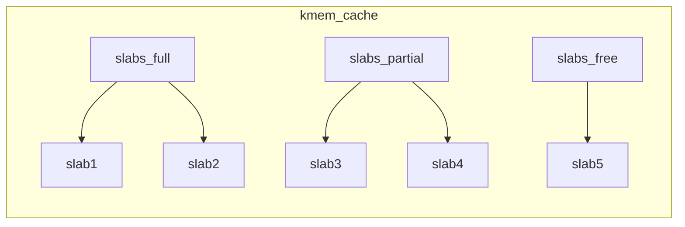

## 2.2 内核内存管理

### NODE 划分

在现代服务器上，内存和 CPU 普遍采用 [[NUMA]] 架构。CPU 通常不止一颗，通过 `dmidecode` 命令可以查看主板上插着的 CPU 详细信息：

```
Processor Information  //第一颗CPU
    SocketDesignation: CPU1
    Version: Intel(R) Xeon(R) CPU E5-2630 v3 @ 2.40GHz
    Core Count: 8
    Thread Count: 16
Processor Information  //第二颗CPU
    Socket Designation: CPU2
    Version: Intel(R) Xeon(R) CPU E5-2630 v3 @ 2.40GHz
    Core Count: 8
```

内存也不只是一条，`dmidecode` 同样可以查看服务器上插着的所有内存条，以及它与哪个 CPU 直接连接：

```
//CPU1 上总共插着四条内存
Memory Device
    Size: 16384 MB
    Locator: CPU1 DIMM A1
Memory Device
    Size: 16384 MB
    Locator: CPU1 DIMM A2
......
//CPU2 上也插着四条
Memory Device
    Size: 16384 MB
    Locator: CPU2 DIMM E1
Memory Device
    Size: 16384 MB
    Locator: CPU2 DIMM F1
......
```

每一个 CPU 以及与其直连的内存条组成了一个 **node**（节点）。在你的机器上，可以使用 `numactl` 查看每个 node 的情况：

```
# numactl --hardware
available: 2 nodes (0-1)
node 0 cpus: 0 1 2 3 4 5 6 7 16 17 18 19 20 21 22 23
node 0 size: 65419 MB
node 1 cpus: 8 9 10 11 12 13 14 15 24 25 26 27 28 29 30 31
node 1 size: 65536 MB
```

### ZONE 划分

每个 node 又会划分成若干个 **zone**（区域）。zone 表示内存中的一块范围：

*   **ZONE_DMA**：地址段最低的一块内存区域，用于 ISA (Industry Standard Architecture) 设备的 DMA 访问。
*   **ZONE_DMA32**：该 Zone 用于支持 32-bit 地址总线的 DMA 设备，只在 64-bit 系统里才有效。
*   **ZONE_NORMAL**：在 x86-64 架构下，DMA 和 DMA32 之外的内存全部在 NORMAL 的 Zone 里管理。

> [!INFO] ZONE_HIGHMEM
> 之所以没有提 `ZONE_HIGHMEM`，因为这是 32 位机时代的产物，现在应该没人在用这种古董了。

在每个 zone 下，都包含了许许多多个 **Page**（页面），在 Linux 下一个 Page 的大小一般是 4 KB。

在你的机器上，可以通过 `zoneinfo` 查看到机器上 zone 的划分，以及每个 zone 下所管理的页面数量：

```
# cat /proc/zoneinfo
Node 0, zone      DMA
    pages free     3973
        managed  3973
Node 0, zone    DMA32
    pages free     390390
        managed  427659
Node 0, zone   Normal
    pages free     15021616
        managed  15990165
Node 1, zone   Normal
    pages free     16012823
        managed  16514393
```

每个页面大小是 4K，可以计算出每个 zone 的大小。例如，对于上面 Node1 的 Normal：`16514393 * 4K = 66 GB`。

### 基于伙伴系统管理空闲页面

每个 zone 下面有非常多的页面，Linux 使用 **[[伙伴系统]]** 对这些页面进行高效管理。在内核中，表示 zone 的数据结构是 `struct zone`。其下面的数组 `free_area` 管理了绝大部分可用的空闲页面，这是伙伴系统实现的重要数据结构。

```
//file: include/linux/mmzone.h
#define MAX_ORDER 11

struct zone {
    free_area   free_area[MAX_ORDER];
    ......
}
```

`free_area` 是一个 11 个元素的数组，在每个数组元素中，分别代表空闲可分配连续 4K、8K、16K、……、4M 内存的链表。

通过 `cat /proc/pagetypeinfo`，你可以看到当前系统里伙伴系统里各个尺寸的可用连续内存块数量。

内核提供分配器函数 `alloc_pages` 到上面的多个链表中寻找可用连续页面。

`alloc_pages` 是如何工作的？我们举一个简单的例子——假设要申请 8K（连续两个页框）的内存。为描述方便，先忽略 `UNMOVEABLE`、`RECLAIMABLE` 等不同类型。

```
struct page * alloc_pages(gfp_t gfp_mask, unsigned int order)
```

伙伴系统中的“伙伴”指的是两个内存块：大小相同、地址连续、同属于一个大块区域。

基于伙伴系统的内存分配中，有可能需要将大块内存拆分成两个小伙伴；在释放中，可能会将两个小伙伴合并，再次组成更大块的连续内存。

### SLAB 管理器

到目前为止，介绍的内存分配都是以页面（4KB）为单位的。

对于各个内核运行中实际使用的对象来说，对象大小各异——有的对象有 1K 多，有的只有几百甚至几十字节。如果都直接分配一个 4K 的页面来存储，太浪费了，因此伙伴系统并不能直接使用。

在伙伴系统之上，内核又为自己搞了一个专用的内存分配器，叫 **slab** 或 **slub**。这两个词常混用，为省事，接下来统称为 **slab**。

这个分配器最大的特点是：一个 slab 内只分配特定大小、甚至是特定的对象。这样当一个对象释放内存后，另一个同类对象可以直接使用这块内存，从而极大降低碎片发生的几率。

slab 相关的内核对象定义如下：

```
//file: include/linux/slab_def.h
struct kmem_cache {
    struct kmem_cache_node **node
    ......
}

//file: mm/slab.h
struct kmem_cache_node {
    struct list_head slabs_partial;
    struct list_head slabs_full;
    struct list_head slabs_free;
    ......
}

//file: mm/slab.c
static void *kmem_getpages(struct kmem_cache *cachep,
         gfp_t flags, int nodeid)
{
    ......
    flags |= cachep->allocflags;
    if (cachep->flags & SLAB_RECLAIM_ACCOUNT)
        flags |= __GFP_RECLAIMABLE;
    page = alloc_pages_exact_node(nodeid, ...);
    ......
}
```

每个 cache 都有满、半满、空三个链表。每个链表节点对应一个 slab，一个 slab 由 1 个或多个内存页组成。在每个 slab 内保存的都是同等大小的对象。一个 cache 的组成示意图如下：



当 cache 中内存不够时，会调用基于伙伴系统的分配器（`__alloc_pages` 函数）请求整页连续内存的分配：

```
//file: include/linux/gfp.h
static inline struct page *alloc_pages_exact_node(int nid,
        gfp_t gfp_mask,unsigned int order)
{
    return __alloc_pages(gfp_mask, order, node_zonelist(nid, gfp_mask));
}
```

内核中会有很多个 `kmem_cache` 存在，它们是在 Linux 初始化或运行过程中分配出来的，有的专用，有的通用。例如，`socket_alloc` 内核对象存在于 TCP 的专用 `kmem_cache` 中。

通过查看 `/proc/slabinfo` 可以查看到所有的 kmem cache：

```
# cat /proc/slabinfo | grep TCP
TCP                 288   384  1984   16    8
```

另外 Linux 还提供了一个特别方便的命令 `slabtop`，按照占用内存从大到小排列，用于分析 slab 内存开销非常方便。

无论是 `/proc/slabinfo` 还是 `slabtop` 的输出，都包含了每个 cache 中 slab 的两个关键信息：

*   **objsize**：每个对象的大小。
*   **objperslab**：一个 slab 里存放的对象数量。

在 `/proc/slabinfo` 中还多输出了一个 `pagesperslab`，展示了一个 slab 占用的页面数量（每个页面 4K），从而能算出每个 slab 占用的内存大小。

slab 管理器组件提供了若干接口函数，方便使用。举三个例子：

*   **`kmem_cache_create`**：方便地创建一个基于 slab 的内核对象管理器。
*   **`kmem_cache_alloc`**：快速为某个对象申请内存。
*   **`kmem_cache_free`**：归还对象占用的内存给 slab 管理器。

在内核源码中，可以大量见到以 `kmem_cache` 开头的函数使用。

> [!NOTE] 关于 slab 的内存浪费
> 虽然采用 slab 的分配机制极大减少了内存碎片的发生，但也不能完全避免。
>
> 举例：以本机上的 TCP 对象的 slab 信息为例（内核版本 3.10.0）：
> ```
> # cat /proc/slabinfo | grep TCP
> TCP                 288   384  1984   16    8
> ```
> 可以看到 TCP cache 下每个 slab 占用 8 个 Page，即 `8 * 4096 = 32768` 字节。
> 该对象的单个大小是 1984 字节，每个 slab 内放了 16 个对象，`1984 * 16 = 31744` 字节。
> 此时再多放一个 TCP 对象放不下，剩下的 1K 内存就“浪费”掉了。但鉴于 slab 机制整体提供的高性能以及低碎片效果，这一点额外开销还是值得的。

### 总结

通过以上几个步骤，内核高效地把内存用了起来：

1.  把所有的内存条和 CPU 划分成 [[node]]。
2.  把每一个 node 划分成 [[zone]]。
3.  每个 zone 下都用 [[伙伴系统]] 管理空闲页面。
4.  内核提供 [[slab]] 分配器为自己专用。

前三步是基础模块，为应用程序分配内存时的请求调页组件也能用到。第四步则是内核的“小灶”——内核根据自身使用场景，量身打造的一套自用的高效内存分配管理机制。