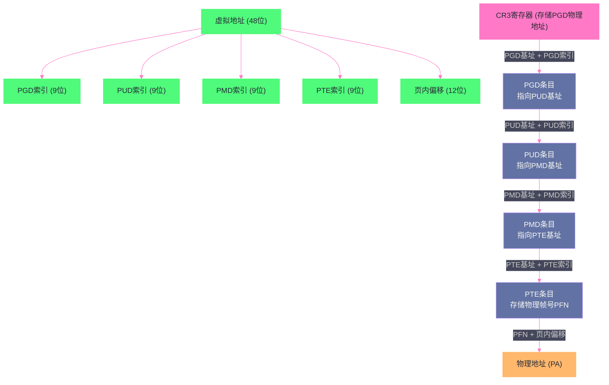
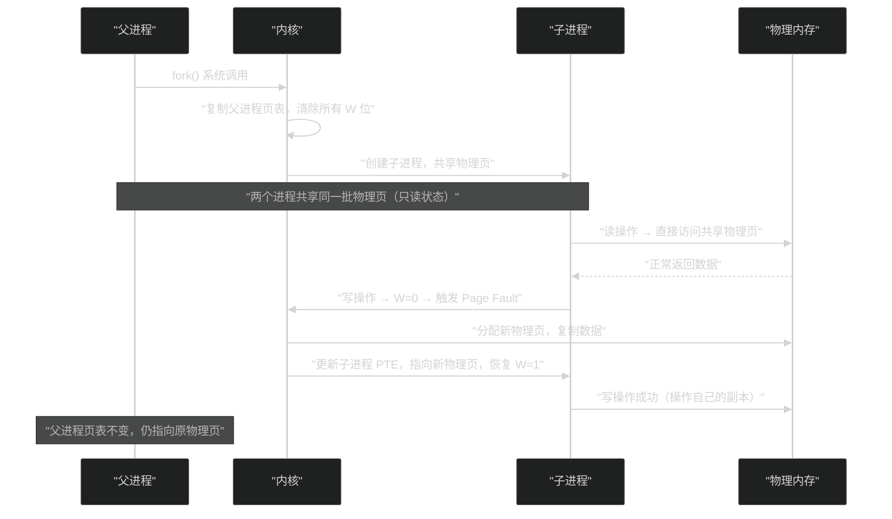

# 虚拟内存：为什么每个进程都以为自己独占内存

**摘要：**

虚拟内存是现代操作系统中最重要的抽象之一。它让每个进程都相信自己独占整个地址空间，彻底解决了多进程内存保护、地址冲突、内存碎片等一系列棘手问题。本文从"没有虚拟内存的世界会怎样"出发，逐步拆解虚拟内存的设计动机，深入分析分页机制的演进（单级→多级→四级页表），解剖 MMU 的硬件翻译过程，以及 TLB 存在的根本原因与 ASID 机制。最终落脚到 Linux 内核对进程地址空间的具体管理方式，以及工程师在实际工作中需要关注的边界与陷阱。

---

## 第 1 章 没有虚拟内存的世界

### 1.1 直接使用物理内存的噩梦

要真正理解虚拟内存的价值，最好的方式是先设想一个没有它的世界。

在早期的计算机系统（比如 DOS 时代），程序直接操作物理内存地址。一个程序在编译时，它的代码段、数据段的地址就已经写死了——比如代码从物理地址 `0x10000` 开始，数据在 `0x20000`。这套模型在单任务时代运行得还算顺畅，但一旦你想同时运行多个程序，麻烦就接踵而至。

**问题一：地址冲突**。程序 A 被编译时假设自己从 `0x10000` 开始加载，程序 B 也被编译成从 `0x10000` 开始加载。两个程序无法同时驻留内存，因为它们的地址空间会直接撞在一起，互相覆盖对方的数据。

**问题二：内存保护缺失**。即使通过某种方式把 A 加载到 `0x10000`，把 B 加载到 `0x50000`，两个程序在运行时都能直接读写对方的内存区域。程序 B 中一个野指针，就能把程序 A 的数据全部破坏掉。更可怕的是，用户程序可以直接修改内核的数据结构，整个系统随时面临崩溃风险。

**问题三：内存碎片**。假设物理内存共 64MB，程序 A 占了 10MB，程序 B 占了 20MB，程序 A 退出后留下一个 10MB 的空洞。现在来了一个需要 15MB 的程序 C，即便总空闲内存有 44MB，但由于没有一块连续的 15MB，程序 C 就是没法加载。这就是外部碎片问题（External Fragmentation）。

**问题四：程序大小受限于物理内存**。如果你只有 64MB 物理内存，就跑不了一个需要 128MB 的程序。这个限制在今天看来匪夷所思，但在 1960-1970 年代，内存极其昂贵，这是真实存在的工程困境。

这四个问题，是驱动虚拟内存技术诞生的最本质动力。

### 1.2 早期的妥协方案：基址-界限寄存器

在虚拟内存成熟之前，工程师们尝试了一种叫做**基址-界限寄存器（Base and Bound）**的折中方案。

这个方案的思路很直接：CPU 中增加两个特殊寄存器，`base` 寄存器存储当前进程加载到物理内存的起始地址，`bound` 寄存器存储进程占用的内存大小。程序中所有内存访问都是相对地址（逻辑地址），CPU 在访问内存时自动把逻辑地址加上 `base`，并检查是否超过 `bound`。

这样，程序 A 可以安心地认为自己从地址 `0` 开始，程序 B 也认为自己从地址 `0` 开始，但实际上 A 的物理起始地址是 `base_A`，B 的是 `base_B`，两者互不干扰。

这个方案解决了地址冲突和基本的越界保护，但它有一个致命缺陷：**进程必须连续占用一块物理内存**。进程的代码段、数据段、栈不能分散存放，这意味着外部碎片问题依然存在，程序也依然被物理内存大小所限制。

### 1.3 分段（Segmentation）：更精细的尝试

进一步的尝试是**分段机制**。既然进程的地址空间天然地分成代码段（code）、数据段（data）、栈（stack）等几个逻辑区域，为什么不给每个段单独分配一对 base-bound 呢？

x86 处理器就是这样演进的。早期的 x86 保护模式下，CPU 维护一张**全局描述符表（GDT, Global Descriptor Table）**，每个段（代码段、数据段等）在 GDT 中都有一个描述符，记录着该段的基地址、大小限制和访问权限。程序通过段选择子（Segment Selector）来指定使用哪个段，再加上段内偏移量，拼出一个线性地址。

分段让不同段可以在物理内存中分开存放，也能给不同段设置不同的访问权限（比如代码段只读）。但它仍然有两个核心问题没有解决：

1. **段依然是连续的**：每个段在物理内存中还是必须占用一块连续区域，外部碎片依旧存在。
2. **无法支持比物理内存更大的地址空间**：段的大小无法超过物理内存的实际容量。

分页机制的出现，才真正彻底解决了这两个问题。

> [!note] 设计哲学
> 分段和分页代表了两种不同的抽象哲学。**分段**是程序员视角的抽象——代码、数据、栈本来就是不同的逻辑实体，给它们各自的地址空间是很自然的想法；**分页**是操作系统视角的抽象——把物理内存切成等大的块来统一管理，是物理资源管理的最优解。现代 Linux x86-64 实际上启用了分页但基本废弃了分段（所有段的 base 都设为 0），因为分页已经足够强大，分段的额外复杂性反而是负担。

---

## 第 2 章 分页机制：虚拟内存的根基

### 2.1 分页的核心思想

分页机制（Paging）的核心思想异常简单，却产生了极其深远的影响：**把虚拟地址空间和物理地址空间都切成等大的固定块（页，Page），通过一张映射表来记录虚拟页和物理页之间的对应关系。**

具体来说：
- 虚拟地址空间被切成等大的**虚拟页（Virtual Page）**，大小通常是 4KB
- 物理内存被切成等大的**物理页帧（Physical Page Frame）**，同样大小 4KB
- 内核为每个进程维护一张**页表（Page Table）**，记录每个虚拟页对应哪个物理页帧

当 CPU 要访问虚拟地址 `VA` 时，首先把 `VA` 拆成两部分：高位是**虚拟页号（VPN, Virtual Page Number）**，低位是**页内偏移（Offset）**。用 VPN 查页表，得到对应的**物理帧号（PFN, Physical Frame Number）**，再拼上 Offset，就得到了真实的物理地址（PA）。

> [!info] 核心概念：为什么页大小是 4KB？
> 4KB 这个选择是一个工程上的权衡。页太小，管理开销大（页表条目多，TLB 压力大）；页太大，内部碎片严重（一个进程只需要 100 字节，却要占用整个大页）。4KB 在 x86 处理器诞生时就确立，后来虽有 2MB 大页和 1GB 大页的扩展，但 4KB 依然是默认选择，沿用至今。

分页机制一举解决了此前所有问题：

- **地址冲突**：每个进程有独立的页表，虚拟地址相同也没关系，它们对应的物理帧完全不同。
- **内存保护**：页表条目中有权限位（读/写/执行），CPU 在翻译地址时自动检查权限，违规立刻触发缺页异常（Page Fault）。
- **外部碎片**：物理内存被切成等大的 4KB 页帧，不存在"有空间但装不下"的情况。任何空闲页帧都可以被分配给任何虚拟页。
- **超出物理内存的程序**：不是所有虚拟页都必须有对应的物理帧，可以把不常用的页临时存到磁盘（这就是 [[Swap机制]] 的基础），需要时再换入。

### 2.2 单级页表的致命缺陷

分页机制的思路很完美，但原始的单级页表有一个严重的工程问题：**页表本身太大了**。

来算一笔账。32 位系统的虚拟地址空间是 4GB，页大小 4KB，那么一张页表需要多少条目？

```
4GB / 4KB = 1,048,576 = 2^20 个虚拟页
```

每个页表条目（PTE, Page Table Entry）通常需要 4 字节，所以一张完整的页表需要：

```
2^20 × 4 字节 = 4MB
```

4MB，乍一看好像不多。但关键在于：**每个进程都需要一张独立的页表**。如果系统上同时跑 1000 个进程，光是页表就要占用 4GB 内存。这显然无法接受。

更糟糕的是，到了 64 位系统，虚拟地址空间理论上是 2^64 字节（约 16EB），单级页表根本无法实现——所需内存将是天文数字。

### 2.3 多级页表：用稀疏性换空间

解决方案是**多级页表（Multi-level Page Table）**，其核心洞察是：**大多数进程只用到了极小一部分虚拟地址空间**。

一个普通的 Linux 进程，代码段在低地址区，栈在高地址区，中间大量的虚拟地址根本没有使用。单级页表必须为整个虚拟地址空间分配页表条目，包括那些从未被使用的部分。多级页表则是"按需分配"——只有实际使用的虚拟地址范围，才会创建对应的页表节点。

以经典的二级页表为例（32 位 x86）：

虚拟地址被分成三段：
```
[ 页目录索引(10位) | 页表索引(10位) | 页内偏移(12位) ]
```

- **页目录（Page Directory）**：顶级，包含 2^10 = 1024 个条目，每个条目指向一个页表。整个进程只有一个页目录，大小 4KB，**始终存在内存中**。
- **页表（Page Table）**：二级，每张页表也包含 1024 个条目，大小也是 4KB。**只有当对应的虚拟地址范围被实际使用时，才需要分配这张页表**。

对于一个只使用了少量虚拟地址的进程，它的页目录中大量条目的"存在位"是 0（表示对应的页表根本不存在）。这意味着那些页表根本不需要占用内存。

一个只使用了 4MB 虚拟地址的进程，实际上只需要：
- 1 个页目录（4KB）
- 1~4 个页表（4KB 每个）

总共 **20KB 左右**，而不是单级页表所需的 4MB。节省了 200 倍内存。

### 2.4 x86-64 的四级页表

到了 64 位时代，两级页表已经不够用了。当前 x86-64 Linux 使用的是**四级页表**，虚拟地址的结构如下：

```
[ 符号扩展(16位) | PGD索引(9位) | PUD索引(9位) | PMD索引(9位) | PTE索引(9位) | 页内偏移(12位) ]
```

四个级别的名称分别是：
- **PGD（Page Global Directory）**：全局页目录，顶级
- **PUD（Page Upper Directory）**：上级页目录
- **PMD（Page Middle Directory）**：中间页目录
- **PTE（Page Table Entry）**：最终的页表条目

> [!info] 为什么不是 64 位全用？
> 理论上 64 位地址空间是 2^64，约 16EB。但目前没有任何硬件需要这么大的地址空间，x86-64 实际只使用 48 位虚拟地址（高 16 位做符号扩展，所以实际可寻址范围是 256TB）。这 256TB 已经远超现有内存容量，足够用了。最新的 x86-64 处理器支持 **5 级页表**（LA57 特性），可将虚拟地址扩展到 57 位（128PB），但 Linux 默认仍使用 4 级。

四级页表的地址翻译过程如下图所示：



这个翻译过程意味着，每次内存访问最坏情况下需要 **5 次内存读取**（读 PGD、读 PUD、读 PMD、读 PTE，最后读数据）。这个开销是不可接受的——如果每次内存访问都需要 5 次内存读取，程序的速度会慢 5 倍。这就引出了 TLB。

### 2.5 页表条目（PTE）的结构

了解多级页表的架构之后，值得深入看一下页表中最终的条目（PTE）到底存了什么信息。以 x86-64 的 PTE 为例（64 位宽）：

```
 63  62  ...  52  51  ...  12  11  9  8  7  6  5  4  3  2  1  0
┌───┬────────────┬───────────┬───┬──┬──┬──┬──┬──┬──┬──┬──┬──┬──┐
│ XD│  Reserved  │   PFN     │   │  │ D│ A│ u│ w│ S│ U│ W│ P│  │
└───┴────────────┴───────────┴───┴──┴──┴──┴──┴──┴──┴──┴──┴──┴──┘
```

关键位的含义：
- **P（Present，位0）**：该页是否在物理内存中。P=0 表示这个虚拟页不在内存（可能在磁盘上，或者从未分配），访问时触发 [[缺页异常]]（Page Fault）。
- **W（Writable，位1）**：该页是否可写。W=0 表示只读，写操作触发 Page Fault。这是写保护的基础，也是 Copy-on-Write 机制的实现关键。
- **U（User，位2）**：用户态是否可访问。U=0 表示只有内核态才能访问，用户程序访问触发 Page Fault（SIGSEGV 信号）。
- **A（Accessed，位5）**：该页是否被访问过（硬件自动设置）。内核内存回收时通过这个位判断页的"热度"。
- **D（Dirty，位6）**：该页是否被写过（硬件自动设置）。脏页需要在被换出或回收前写回磁盘。
- **PFN（Physical Frame Number，位12-51）**：物理页帧号，这是翻译的核心结果。
- **XD（Execute Disable，位63）**：该页是否禁止执行。这是 NX 位，用于防止数据页被当成代码执行（防止栈溢出攻击）。

这几个标志位，是操作系统实现**内存保护、COW（写时复制）、内存回收、安全防护**等一系列高级功能的物理基础。后续文章中我们会反复回到这些标志位。

---

## 第 3 章 MMU 与 TLB：硬件加速的地址翻译

### 3.1 MMU 是什么，它解决了什么问题

[[MMU]]（Memory Management Unit，内存管理单元）是处理器中负责虚拟地址到物理地址翻译的硬件模块。在现代处理器上，MMU 集成在 CPU 芯片内部。

MMU 存在的根本原因是：**地址翻译必须由硬件来做，软件做不了**。

设想一下，如果地址翻译由软件（操作系统内核）来完成：CPU 执行一条 `MOV RAX, [0x400000]` 指令，需要先调用内核的翻译函数，内核查页表、返回物理地址，然后 CPU 再去物理地址取数据。但问题是，**调用内核函数本身就涉及内存访问**——获取函数指针、读函数代码、读栈帧……这些内存访问又需要翻译，陷入无解的鸡生蛋蛋生鸡问题。

因此，地址翻译必须在不触发软件介入的情况下自动完成，这只能由硬件来实现。MMU 就是专门为此而生的硬件电路。

MMU 的工作流程：
1. CPU 产生一个虚拟地址（VA）
2. MMU 先查 TLB（快速缓存），如果命中，直接返回物理地址，**不需要访问内存**
3. TLB 未命中（TLB Miss），MMU 通过**页表遍历（Page Table Walk）**查找多级页表，得到物理地址
4. 将翻译结果填入 TLB，供下次快速查找
5. 如果页表遍历发现页不存在（P 位为 0）或权限不足，触发**Page Fault 异常**，交给内核处理

### 3.2 TLB 的本质：为什么需要这个缓存

TLB（Translation Lookaside Buffer，翻译后备缓冲器）是一个极小的、速度极快的硬件缓存，专门缓存最近使用的虚拟→物理地址翻译结果。

TLB 存在的原因，源于多级页表的一个根本性性能问题：**每次内存访问都要进行多次内存访问**。

四级页表翻译一个地址，需要从内存中依次读取 PGD、PUD、PMD、PTE 四个条目，然后才能访问目标数据。也就是说，一次"内存访问"实际上消耗了 5 次内存访问。这意味着，如果没有 TLB，程序的实际内存吞吐量只有理论值的 1/5。

TLB 的工作原理很简单：它就是一个小型的**全关联缓存（Fully Associative Cache）**，每个条目存储一对 `(虚拟页号 VPN → 物理帧号 PFN)` 的映射。CPU 产生虚拟地址后，先把 VPN 部分在 TLB 中并行查找：

- **TLB 命中（Hit）**：直接取到 PFN，加上页内偏移，得到物理地址。整个过程**不需要任何内存访问**，只需要几个 CPU 时钟周期。
- **TLB 未命中（Miss）**：触发页表遍历，遍历结果填入 TLB，再返回物理地址。代价是多次内存访问。

> [!info] TLB 有多快？
> 现代 x86 处理器的 L1 TLB 通常只有 64 个条目（指令 TLB）和 64 个条目（数据 TLB），但命中延迟只有 **0~1 个时钟周期**。L2 TLB（STLB）可能有 1024~4096 个条目，延迟约 7-12 个周期。相比之下，L1 Data Cache 命中约 4 周期，L2 约 12 周期，L3 约 40 周期，主存 DRAM 约 200 周期。TLB 是最快的存储层级之一。

TLB 的高效性建立在**局部性原理（Principle of Locality）**之上：程序在某一段时间内倾向于重复访问同一块内存区域（时间局部性），或者访问地址连续的内存（空间局部性）。有了局部性，少量 TLB 条目就能覆盖大量内存访问。

### 3.3 TLB 刷新（TLB Flush）：被忽视的性能杀手

TLB 的存在带来了一个不容忽视的复杂性：**缓存一致性问题**。

当操作系统修改了页表（比如进程退出、mmap、munmap、mprotect），TLB 中缓存的旧翻译结果就失效了。如果 CPU 继续用旧的 TLB 条目翻译地址，就会访问到错误的物理地址，或者错误地认为某个地址是可写的。

因此，每次修改页表后，操作系统必须主动使对应的 TLB 条目失效，这个操作叫做 **TLB Flush（TLB 刷新）**。在 x86 上，执行 `INVLPG` 指令可以使单个虚拟地址的 TLB 条目失效；如果整个页表都变了（比如进程切换），就需要写 `CR3` 寄存器，这会清空整个 TLB。

**进程切换时清空 TLB 是一个巨大的性能问题**。想象一下：进程 A 刚刚建立了 64 个 TLB 条目，记录了它最频繁访问的内存位置。现在内核把 CPU 切换给进程 B，因为 B 有自己的页表，A 的那 64 个 TLB 条目对 B 毫无用处，必须全部清空。当 A 再次被调度上来时，它的 TLB 是空的，需要重新预热。对于上下文切换频繁的系统（比如高并发服务器），这个 TLB 抖动（TLB Thrashing）会严重拖累性能。

### 3.4 ASID：用 ID 标签避免 TLB 全清

TLB 在进程切换时必须全清这个问题，工程师们提出了一个优雅的解决方案：**ASID（Address Space Identifier，地址空间标识符）**。

ASID 的思路非常简单：**在 TLB 条目中额外存储一个 ID，标记这个条目属于哪个地址空间（进程）**。TLB 查找时，除了匹配虚拟页号，还要匹配 ASID。这样，不同进程的 TLB 条目可以共存于 TLB 中，进程切换时不需要清空 TLB，只需要更新当前的 ASID 寄存器即可。

ARM 处理器是 ASID 的经典实现者。ARM 的 ASID 通常是 8 位或 16 位，即最多同时缓存 256 或 65536 个进程的地址翻译。

在 x86 上，类似的机制叫做 **PCID（Process Context Identifier）**，从 Westmere 架构（约 2010 年）开始引入，Linux 从 4.14 版本开始默认启用。有了 PCID，x86 的进程切换不再需要清空整个 TLB，而是只切换 PCID，旧的 TLB 条目依然有效。

> [!warning] 生产避坑
> ASID/PCID 位数有限，当系统上的活跃进程数超过 ASID/PCID 的表示范围时，内核必须回收 ASID，被回收 ASID 对应的 TLB 条目将全部失效。这在进程创建销毁非常频繁的场景（如 Serverless 函数计算）下会造成明显的 TLB 抖动。这也是为什么减少进程/线程的创建销毁频率、尽量复用进程池，在高性能场景下仍然是重要的优化手段。

---

## 第 4 章 Linux 进程地址空间的结构

### 4.1 64 位 Linux 进程的地址空间布局

有了分页机制和 MMU，操作系统可以给每个进程一个独立的、完整的虚拟地址空间。在 64 位 Linux 系统上，进程看到的虚拟地址空间布局如下（x86-64）：

```
虚拟地址（64位，实际使用48位）

0xFFFFFFFFFFFFFFFF ┬───────────────────────────────────────┐
                  │     内核空间 (128TB)                    │
                  │  （用户态不可访问）                      │
                  │  - 内核代码、内核数据                    │
                  │  - 直接内存映射区域 (physmap)            │
                  │  - vmalloc 区域                         │
0xFFFF800000000000 ┴───────────────────────────────────────┘
     (128TB 空洞)
0x00007FFFFFFFFFFF ┬───────────────────────────────────────┐
                  │     用户空间 (128TB)                    │
                  │                                         │
0x00007FFF00000000 │  栈 (Stack) ↓                         │
                  │  （向低地址生长）                        │
                  │                                         │
                  │  mmap 区域 ↕                            │
                  │  （动态库、匿名映射、文件映射）            │
                  │                                         │
                  │  堆 (Heap) ↑                            │
                  │  （向高地址生长）                        │
0x0000000000400000 │                                         │
                  │  BSS 段（未初始化数据）                  │
                  │  数据段 (Data)（已初始化数据）            │
                  │  代码段 (Text)（只读可执行）              │
0x0000000000000000 ┴───────────────────────────────────────┘
```

注意到中间有一个巨大的"空洞"（从 `0x00007FFFFFFFFFFF` 到 `0xFFFF800000000000`）。这是 x86-64 的规范形式地址（Canonical Form Address）要求：合法的虚拟地址，高 16 位要么全 0，要么全 1，否则 CPU 会触发 General Protection Fault。这个空洞隔离了用户空间（低半部分）和内核空间（高半部分），是一种简单有效的安全边界。

### 4.2 内核用 vm_area_struct 管理用户地址空间

操作系统不可能真的为每个进程 128TB 的虚拟地址空间都维护一张页表——大部分地址根本没有被使用。Linux 内核的解决方案是用 **VMA（Virtual Memory Area，虚拟内存区域）** 来描述已经分配的虚拟地址范围。

`vm_area_struct` 是内核中最核心的数据结构之一，每个 VMA 描述进程地址空间中一段**连续的虚拟地址区间**，以及这段区间的属性：

```c
/* 内核源码 include/linux/mm_types.h（简化版） */
struct vm_area_struct {
    unsigned long vm_start;    /* VMA 起始虚拟地址（包含）*/
    unsigned long vm_end;      /* VMA 结束虚拟地址（不含）*/

    struct vm_area_struct *vm_next;  /* 链表中的下一个 VMA */
    struct vm_area_struct *vm_prev;  /* 链表中的上一个 VMA */
    struct rb_node vm_rb;            /* 红黑树节点，用于快速查找 */

    pgprot_t vm_page_prot;   /* 该区域的访问权限（读/写/执行）*/
    unsigned long vm_flags;  /* 标志位（MAP_SHARED/MAP_PRIVATE 等）*/

    struct file *vm_file;    /* 如果是文件映射，指向对应的文件 */
    unsigned long vm_pgoff;  /* 文件映射的页偏移 */

    const struct vm_operations_struct *vm_ops; /* VMA 操作函数表（处理 fault 等）*/
};
```

每个进程通过 `mm_struct`（进程内存描述符）来统一管理其所有 VMA：

```c
struct mm_struct {
    struct vm_area_struct *mmap;    /* VMA 链表头（按地址排序）*/
    struct rb_root mm_rb;           /* VMA 红黑树根（快速查找）*/
    pgd_t *pgd;                     /* 顶级页目录的物理地址（写入 CR3）*/
    unsigned long start_code;       /* 代码段起始地址 */
    unsigned long end_code;         /* 代码段结束地址 */
    unsigned long start_data;       /* 数据段起始地址 */
    unsigned long end_data;         /* 数据段结束地址 */
    unsigned long start_brk;        /* 堆起始地址 */
    unsigned long brk;              /* 堆当前末尾（sbrk 修改此值）*/
    unsigned long start_stack;      /* 栈起始地址 */
    // ...
};
```

> [!info] 为什么同时用链表和红黑树？
> VMA 同时组织在一个**有序链表**和一个**红黑树**中。链表便于遍历所有 VMA（比如进程退出时释放所有内存）；红黑树（O(log n) 查找）用于快速定位给定虚拟地址属于哪个 VMA（比如 Page Fault 处理时需要快速找到对应的 VMA）。这是一个典型的以空间换时间、读多写少场景下的数据结构选型。

用 `cat /proc/<pid>/maps` 可以看到一个进程所有的 VMA：

```bash
$ cat /proc/self/maps
55a3b2e00000-55a3b2e01000 r--p 00000000 fd:01 1234567  /usr/bin/cat
55a3b2e01000-55a3b2e07000 r-xp 00001000 fd:01 1234567  /usr/bin/cat
55a3b2e07000-55a3b2e09000 r--p 00007000 fd:01 1234567  /usr/bin/cat
55a3b2e09000-55a3b2e0a000 r--p 00008000 fd:01 1234567  /usr/bin/cat
55a3b2e0a000-55a3b2e0b000 rw-p 00009000 fd:01 1234567  /usr/bin/cat
...
7f8b4a000000-7f8b4a200000 rw-p 00000000 00:00 0        [heap]
7ffd12345000-7ffd12367000 rw-p 00000000 00:00 0        [stack]
7ffd12399000-7ffd1239d000 r--p 00000000 00:00 0        [vvar]
7ffd1239d000-7ffd1239f000 r-xp 00000000 00:00 0        [vdso]
ffffffffff600000-ffffffffff601000 --xp 00000000 00:00 0 [vsyscall]
```

每一行就是一个 VMA，包含：起始地址-结束地址、权限（r/w/x + 私有/共享）、文件偏移、设备号、inode、文件路径（或特殊名称）。

### 4.3 VMA 与页表的关系：两层抽象

很多工程师第一次接触 VMA 时会有困惑：VMA 和页表都在管理虚拟内存，它们是什么关系？

这是一个关键问题，理解它能帮助你彻底搞清楚 Linux 内存管理的分层架构：

**VMA 描述的是"权限和意图"，页表描述的是"实际映射"**。

具体来说：
- VMA 只是告诉内核"从地址 X 到地址 Y 的区间是合法的，它的权限是 rw，对应文件 F 的第 N 页"。但 VMA 的存在**不代表物理内存已经分配**。
- 页表才是实际的虚拟→物理映射。只有当物理内存真正被分配并建立映射后，对应的 PTE 才会有效（P 位=1）。

因此，一个进程可以有一个很大的堆 VMA（比如 `mmap` 了 1GB 的内存），但如果程序只实际访问了其中 10MB，那么只有这 10MB 对应的 PTE 是有效的，其余 990MB 的 PTE P 位都是 0。当程序访问到那些 P 位=0 的地址时，就会触发 **Page Fault**，内核在 Page Fault 处理程序中检查 VMA（确认这个地址是合法的），然后才分配物理页、建立 PTE 映射，程序无感知地继续运行。

这种机制叫做**按需分页（Demand Paging）**，是 Linux 内存管理中极其重要的优化——只有真正被访问的内存才会占用物理页帧，极大地减少了内存浪费。

> [!note] 设计哲学
> VMA + 按需分页体现了一种"先承诺、后兑现"的设计思想。`malloc(1GB)` 的调用几乎瞬间返回，内核只创建了一个 VMA，并没有分配任何物理内存。物理内存的分配被推迟到真正访问时（Page Fault）。这种懒惰分配（Lazy Allocation）策略让 Linux 能够高效地处理"分配了很多但只用了一点"的典型应用模式，比如 JVM 的 `-Xmx` 指定最大堆内存，但实际使用的堆内存通常远小于最大值。

---

## 第 5 章 进程地址空间的关键操作

### 5.1 fork() 与写时复制（Copy-on-Write）

`fork()` 是 Unix 系统中创建新进程的系统调用，它要求子进程获得父进程地址空间的一份"完整拷贝"。

如果每次 `fork()` 都真的复制父进程的所有物理页，那么一个占用 1GB 内存的进程 `fork()` 一次就需要额外的 1GB 物理内存，速度极慢。这对于 `fork()` + `exec()` 的典型 Unix 进程模型（先 fork，马上 exec 运行新程序）来说是极大的浪费，因为 exec 之后父进程的内存拷贝完全没有用。

**COW（Copy-on-Write，写时复制）** 是这个问题的经典解决方案：

`fork()` 时，内核**不复制物理页**，而是让父子进程共享同一批物理页。但同时，把父子进程页表中这些页的 **W（Writable）位全部清除**（即使原来是可写的）。两个进程继续运行，读操作可以正常进行（读共享物理页）。

当某个进程（父或子）试图**写**一个被 COW 保护的页时，MMU 检测到 W 位为 0，触发 Page Fault。内核在 Page Fault 处理程序中识别出这是一个 COW 写错误（而非真正的权限错误），于是：
1. 分配一个新的物理页
2. 把原物理页的内容复制到新页
3. 更新写操作进程的页表，让对应的 PTE 指向新页，并恢复 W 位
4. 另一个进程的页表还指向原来的物理页，不受影响

这就是"写时复制"：复制动作被推迟到写操作真正发生时，只复制实际需要的页。对于 `fork()` + `exec()` 的场景，几乎不会有任何页真正被复制，性能极佳。



COW 不仅用于 `fork()`，在 Linux 中还广泛用于 `mmap` 的私有文件映射（MAP_PRIVATE）：多个进程映射同一文件，共享 Page Cache 中的物理页；当任何一个进程写该映射时，触发 COW，产生私有副本。

### 5.2 mmap()：统一的内存映射接口

`mmap()` 是 Linux 中最强大的内存管理系统调用之一，它的本质是：**在进程地址空间中创建一个新的 VMA，并建立这段虚拟地址与某个"后端"（文件或匿名内存）之间的映射关系**。

```c
void *mmap(void *addr, size_t length, int prot, int flags, int fd, off_t offset);
```

mmap 的主要用途：

**1. 匿名映射（Anonymous Mapping）**：`flags` 含 `MAP_ANONYMOUS`，不关联任何文件。这是 `malloc` 对于大内存分配（通常 >128KB）的实现方式——glibc 的 `malloc` 直接调用 `mmap` 获取匿名页。

**2. 文件映射（File Mapping）**：将一个文件的内容映射到虚拟地址空间。读写这块内存就等同于读写文件，由内核在后台同步到 [[Page Cache]]，再由 Page Cache 同步到磁盘。这比 `read()`/`write()` 少一次内核→用户空间的数据拷贝，是高性能 I/O 的常用手段（比如 RocketMQ、Kafka 的 mmap 零拷贝）。

**3. 共享内存（Shared Memory）**：`flags` 含 `MAP_SHARED`，多个进程 mmap 同一文件或同一匿名内存段（通过 `shm_open`），可以直接通过内存地址进行进程间通信。

**4. 动态库加载**：程序加载器（`ld.so`）通过 `mmap` 将动态库的各个段（.text、.data、.bss 等）映射到进程地址空间中。这也是为什么 `/proc/<pid>/maps` 中能看到大量 `.so` 文件的 VMA 条目。

> [!warning] 生产避坑
> `mmap` 映射的内存并不会立即占用物理内存（得益于按需分页）。但当程序真正访问时，才会触发 Page Fault 并分配物理页。这意味着用 `/proc/<pid>/status` 看到的 `VmRSS`（实际驻留内存）可能远小于 `VmSize`（虚拟内存大小）。监控内存使用时，**必须关注 RSS（Resident Set Size）而非 VSZ（Virtual Size）**，RSS 才是真正占用物理内存的量。

### 5.3 brk() 与堆的增长

小对象的内存分配（比如 `malloc` 几十字节）通常不走 `mmap`，而是通过 `brk()` 系统调用来管理。

`brk()` 的工作非常简单：它调整进程堆的末尾（`mm->brk`），扩大或缩小堆区的 VMA。`glibc` 的 `malloc` 内部维护了一个**内存池（Heap）**，当池中的内存不够时，调用 `brk()` 或 `sbrk()` 向内核申请更多堆空间；当堆末尾有足够的空闲空间时，`free()` 可以通过 `brk()` 归还内存给内核。

glibc 的 malloc 策略：
- **小对象（< 128KB）**：从 brk 管理的堆区分配，使用空闲链表（bins）管理碎片
- **大对象（>= 128KB）**：直接通过 `mmap` 分配匿名页，`free` 时直接 `munmap`，归还给内核

---

## 第 6 章 内核地址空间与用户地址空间的边界

### 6.1 内核空间的布局

在 x86-64 Linux 上，内核空间占据虚拟地址的高半部分（从 `0xFFFF800000000000` 开始），主要分为以下几个区域：

| 区域名称 | 地址范围（示意） | 用途 |
|---------|--------------|------|
| **直接映射区（physmap）** | `0xFFFF880000000000` 起 | 整个物理内存的 1:1 线性映射，内核访问物理内存的主要方式 |
| **vmalloc 区** | 动态分配 | 非连续物理页的虚拟地址连续映射（`vmalloc()`） |
| **模块映射区** | 靠近内核代码 | 内核模块（.ko 文件）加载位置 |
| **内核代码段** | `_text` ~ `_etext` | 内核可执行代码（只读可执行） |
| **内核数据段** | `_data` ~ `_edata` | 已初始化内核数据 |
| **内核 BSS 段** | `_bss` ~ `_end` | 未初始化内核数据 |

**直接映射区（physmap）** 是理解内核内存访问的关键。Linux 启动时，把整个物理内存（或其中大部分）都映射到了这个区域，映射关系是线性的：物理地址 `PA` 对应虚拟地址 `PA + PAGE_OFFSET`（x86-64 上 `PAGE_OFFSET = 0xFFFF880000000000`）。这意味着内核要访问任意一个物理地址，只需要加一个固定偏移量就能得到虚拟地址，不需要动态建立页表，极为高效。

### 6.2 内核态与用户态的切换代价

每次系统调用（`syscall`）或中断发生时，CPU 从用户态（Ring 3）切换到内核态（Ring 0），这个切换的代价包括：

1. **保存用户态寄存器**：RSP、RIP、RFLAGS 等寄存器保存到内核栈
2. **切换栈指针**：从用户栈切换到内核栈（每个进程都有一个专用的内核栈）
3. **权限级别切换**：从 Ring 3 切换到 Ring 0，获得访问内核地址空间的权限
4. **KPTI（Kernel Page Table Isolation）带来的 CR3 切换**：2018 年 Meltdown 漏洞被曝光后，Linux 引入了 KPTI，用户态和内核态使用不同的 CR3（页表根目录），切换时需要写 CR3，导致 TLB 全刷，这是一个显著的性能回退（对系统调用密集型程序，性能损失可达 5~30%）

> [!warning] 生产避坑
> 这也是 **vDSO（Virtual Dynamic Shared Object）** 存在的原因。对于 `gettimeofday()`、`clock_gettime()` 这类频繁调用但实际上不需要访问敏感内核资源的系统调用，Linux 通过 vDSO 机制把对应的内核代码和数据映射到用户地址空间，使得这些调用可以在用户态直接完成，避免了切换内核态的开销。这在高频时钟调用场景下（如分布式追踪系统、高频交易系统）有显著的性能收益。

---

## 第 7 章 边界与工程实践

### 7.1 /proc/pid/maps 与 /proc/pid/smaps 实战解读

理解了虚拟内存的理论体系，最重要的工程落地能力是能够读懂进程内存布局。

`/proc/<pid>/maps` 展示每个 VMA 的基本信息，而 `/proc/<pid>/smaps` 则提供更详细的每个 VMA 的内存统计：

```bash
# 查看一个 Java 进程的内存区域
$ cat /proc/$(pgrep java)/smaps | grep -A 15 "heap"

# smaps 关键字段解释：
# Size:        该 VMA 的虚拟地址范围大小（包含未实际分配的部分）
# Rss:         实际驻留物理内存大小
# Pss:         按共享比例摊分后的驻留内存（Proportional Share Size）
# Shared_Clean: 共享的干净页（未被修改，可直接丢弃）
# Shared_Dirty: 共享的脏页（被修改过，需要回写）
# Private_Clean: 私有的干净页
# Private_Dirty: 私有的脏页（COW 后的私有副本等）
# Anonymous:   匿名页数量
# Swap:        已被换出到 Swap 的页数量
```

**PSS（Proportional Set Size）** 是比 RSS 更公平的内存占用指标。对于被多个进程共享的动态库页，RSS 会在每个进程上都完整计入，造成虚报；PSS 则按共享进程数等分摊，是"该进程实际消耗了多少内存"的更准确度量。

### 7.2 地址空间随机化（ASLR）

ASLR（Address Space Layout Randomization，地址空间随机化）是 Linux 的一个重要安全特性，通过随机化进程地址空间中各段（栈、堆、mmap 区域、动态库）的加载地址，使攻击者无法预知内存布局，从而大幅提高栈溢出、堆溢出等漏洞的利用难度。

在 Linux 上，ASLR 由 `/proc/sys/kernel/randomize_va_space` 控制：
- `0`：关闭 ASLR
- `1`：随机化栈、mmap、vDSO
- `2`（默认）：在 1 的基础上，还随机化堆（brk）

> [!warning] 生产避坑
> 对于需要使用 HugePage 的场景（数据库、JVM 大堆），ASLR 可能导致 HugePage 映射失败（因为 HugePage 需要地址对齐到 2MB 边界，随机化可能破坏这个对齐）。某些老版本的 Oracle Database 会因此要求关闭 ASLR。现代内核已经基本解决了这个兼容性问题，但在遇到 HugePage 相关报错时，ASLR 是需要排查的因素之一。

### 7.3 VSZ 虚高的常见原因分析

生产环境中经常遇到 Java 进程 VSZ（虚拟内存大小）高达几十 GB，但 RSS（实际物理内存）只有几 GB 的情况，这通常让运维团队非常困惑。

理解了虚拟内存机制，这个问题就很自然：VSZ 只是 VMA 区间的大小之和，不代表实际物理内存消耗。Java 进程 VSZ 虚高的常见原因：

1. **JVM `-Xmx` 大堆**：JVM 启动时通过 `mmap` 预留了大堆的虚拟地址空间，但物理内存按需分配，只有被 GC 实际使用的堆空间才占用物理内存
2. **大量 mmap 文件**：RocketMQ、Kafka 等消息队列通过 mmap 映射大量消息文件到虚拟地址空间，实际访问的只是最近活跃的部分
3. **glibc 的 malloc arena**：多线程环境下，glibc 为每个线程维护独立的 malloc arena（内存池），每个 arena 都有自己的 mmap 区域。线程数多时，VSZ 会随之膨胀
4. **JVM 的 CodeCache 和 Metaspace**：这两个区域以 mmap 方式分配，大小随 JVM 运行动态变化

监控原则：**告警阈值应基于 RSS（或 PSS）而非 VSZ；VSZ 的异常增长才值得关注（可能意味着内存泄漏在 VMA 层面的体现）**。

---

## 第 8 章 总结

虚拟内存是一个分层的、软硬件协同的精密系统。从本文的分析中，可以提炼出以下几个核心认知：

**1. 虚拟内存是解决物理内存管理三大矛盾的根本方案**：多进程共存（地址冲突）、内存保护（安全）、物理内存限制（容量），三个问题由虚拟内存一并解决。

**2. 多级页表是稀疏性的艺术**：进程实际使用的地址空间远小于虚拟地址空间，多级页表利用这种稀疏性，把页表的内存开销从"与虚拟地址空间成正比"降低到"与实际使用内存成正比"。

**3. TLB 是虚拟内存可用的关键**：没有 TLB，多级页表带来的多次内存访问开销会使系统慢得无法接受。TLB 的设计依赖局部性原理，ASID/PCID 机制进一步优化了进程切换的 TLB 代价。

**4. VMA 是"承诺"，页表是"履行"**：`mmap` 只创建 VMA，不分配物理内存；Page Fault 触发时才真正分配物理内存、建立 PTE。按需分页是 Linux 内存效率的核心机制。

**5. COW 是 fork() 高效的秘密**：父子进程共享物理页，写时才复制，把内存复制的代价分摊到实际发生写操作的时刻，彻底规避了 `fork()` + `exec()` 场景下的内存浪费。

理解了这些基础，我们就为深入理解后续的[[物理内存管理：Buddy System 与 Slab 分配器的设计哲学]]、[[缺页异常：一次内存访问的完整旅程]]等更高级的话题打好了地基。

---

## 参考资料

- Linux Kernel Documentation: [Memory Management](https://www.kernel.org/doc/html/latest/admin-guide/mm/concepts.html)
- Robert Love, *Linux Kernel Development, 3rd Edition*, Chapter 15: The Process Address Space
- Mel Gorman, *Understanding the Linux Virtual Memory Manager*, Chapter 4: Process Address Space
- Intel® 64 and IA-32 Architectures Software Developer's Manual, Volume 3A, Chapter 4: Paging
- Ulrich Drepper, *What Every Programmer Should Know About Memory*, 2007

---

> [!note] 思考题
> 1. x86-64 使用四级页表，每次地址翻译需要 4 次内存访问。TLB 缓存了最近的映射以加速翻译。进程切换时 TLB 需要刷新——ASID（Address Space ID）如何避免全量刷新？Meltdown 漏洞利用了推测执行访问内核映射——KPTI 补丁如何修复？修复带来了多大的性能开销？
> 2. 32 位系统虚拟地址空间只有 4GB。64 位系统的 128TB 用户地址空间看似用不完，但在什么场景下虚拟地址空间仍然可能耗尽（提示：大量小 mmap 映射和 VMA 管理开销）？`/proc/<pid>/maps` 中 VMA 数量过多会导致什么性能问题？
> 3. 每个进程看到的虚拟地址空间中，内核态映射是所有进程共享的。如果内核在运行时动态加载了一个模块并分配了 vmalloc 区域的内存，所有进程的页表是否需要同步更新？内核如何实现这种'懒同步'（lazy synchronization）？
