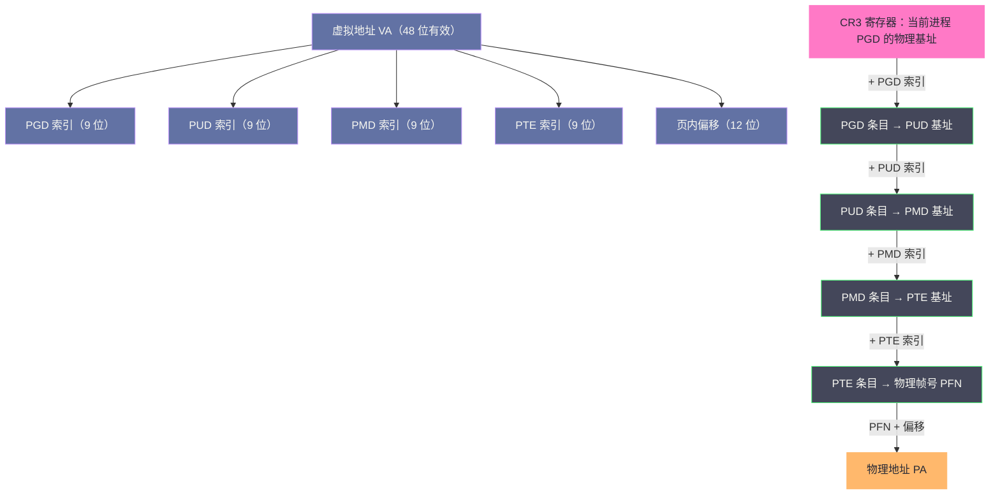
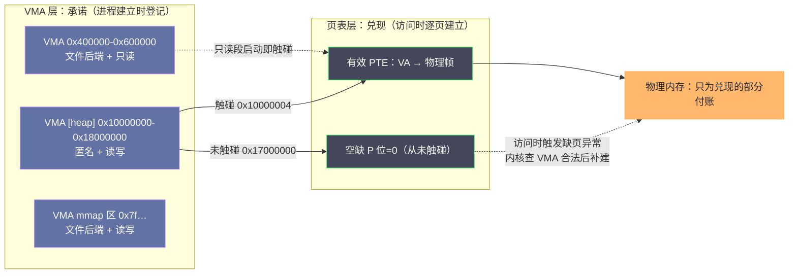
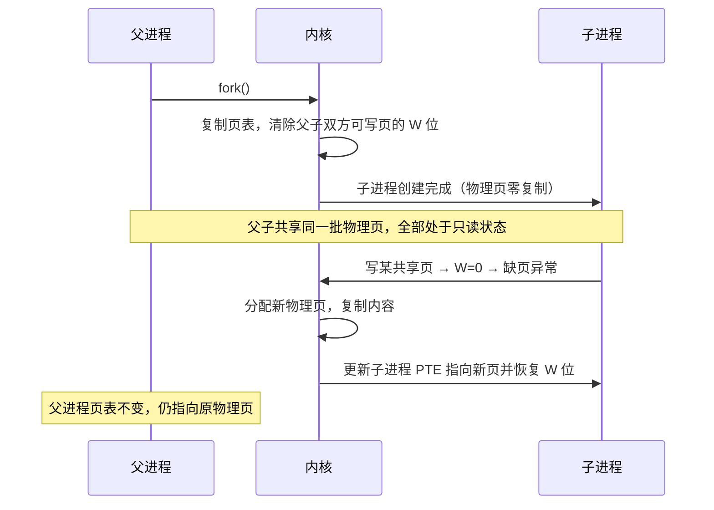

# 虚拟内存：为什么每个进程都以为自己独占内存

**摘要：**

虚拟内存（Virtual Memory）是现代操作系统最核心的一个"谎言"：每个进程都坚信自己从地址 0 开始、独占一片连续的巨大空间，而物理内存的真实面貌——零散、被瓜分、随时被回收——被硬件与内核合谋遮在了幕后。本文沿这条主线做一次完整回溯：先回到 1960 年代，看直接使用物理内存的四个死结（地址冲突、保护缺失、碎片、容量上限）如何在 Atlas 的"一级存储"中第一次被解开；再拆解分页机制如何用"等分加映射"的朴素思路统摄全局，多级页表如何用稀疏性把页表开销降下来，四级页表与 48 位地址的算术如何算出 256TB 的幻觉；随后进入硬件层，解释 MMU 与 TLB 为什么是虚拟内存能够"感觉不到开销"的前提，以及 PCID、KPTI 这些真实生产环境绕不开的开关；最后落到 Linux 的进程地址空间——VMA 的"承诺"与页表的"兑现"、fork 的写时复制、mmap 的统一接口，以及 VSZ 与 RSS 这对最常被误读的监控指标。读完全文你应当能回答两个问题：虚拟内存为什么长成今天这个样子，以及工程师该如何与这套机制打交道而不被它的表象欺骗。

---

## 第 1 章 一切从"装不下"开始

### 1.1 直接使用物理内存的四个死结

要理解虚拟内存的价值，最好的办法不是先背定义，而是回到它诞生之前的那个世界，看看工程师们被什么问题逼进了墙角。

1940 至 1950 年代的计算机程序，从诞生那一刻起就与物理内存绑死。编译器在产出指令时，会把每一条内存访问都翻译成确切的物理地址——程序假定自己从某个地址开始加载，这个假定被硬编码进指令流。在单任务批处理的年代，这套模型勉强够用：机器一次只跑一个作业，内存里除了操作系统常驻部分就是这个幸运儿。但一旦你想在同一台机器上同时跑两个程序，四个死结就同时收紧了。

**第一个死结是地址冲突。**程序 A 与程序 B 都被编译成"从 0x10000 开始"，它们无法同时驻留内存，因为加载谁，谁的地址就与其他人重叠。这不是配置问题，而是编译模型本身没有给"共存"留任何余地。

**第二个死结是保护缺失。**即便用手工方式把 A 和 B 安排到互不重叠的地址，两个程序在运行时仍然可以直接读写对方的任何内存。一个失控的指针足以破坏另一个程序的数据，更危险的是用户程序可以直通内核的数据结构——整个系统的可靠性建立在"所有程序都不犯错"这个不可兑现的假设上。

**第三个死结是碎片。**设想 64MB 的物理内存，程序 A 占 10MB，程序 B 占 20MB，A 退出后留下一个 10MB 的空洞；此时来了一个需要 15MB 的程序 C，总空闲明明有 44MB，却没有一块连续的 15MB，C 就是装不进去。这类"总量够、位置不对"的问题被称为外部碎片（External Fragmentation），它在连续分配模型下无解，只会随时间越积越糟。

**第四个死结是容量上限。**程序的大小不可能超过物理内存的实际容量。在内存以 KB 计价、1MB 内存价值数十万美元的 1960 年代，这条上限不是理论推演，而是每天都要面对的采购单。

四个死结指向同一个病根：**程序的地址视图与物理内存的物理视图是同一个东西**。只要编译出来的地址直接就是物理地址，共存、保护、碎片、容量就都是无解的。解药只有一种——把这两个视图拆开，让程序生活在自己的地址世界里，由另一个机制负责把这个世界"翻译"到物理内存上。

### 1.2 Atlas 与"一级存储"：1962 年的第一次作答

历史上第一次完整作答发生在英国曼彻斯特大学。

1962 年，Kilburn 等人发表了论文《One-Level Storage System》，描述了 Atlas 计算机上运行的"一级存储系统"：程序只看到一层统一的地址空间，至于数据此刻在磁鼓还是磁芯内存里，程序既不知道也不需要知道；系统自动把近期要用的数据搬到磁芯内存，把冷数据挪回磁鼓，地址转换由硬件与 Supervisor（Atlas 上操作系统层的称呼）协同完成。这套机制包含了现代虚拟内存的三个基本要素——分页、按需调页（Demand Paging）与地址转换——比"虚拟内存"这个术语本身还要早。学界随后在 1970 年由 Peter Denning 在《ACM Computing Surveys》上系统总结了虚拟内存的模型与性能问题，让它成为教科书里的标准概念。

打个比方，Atlas 的做法如同闭架图书馆：阅览室（磁芯内存）的座位永远不够，但书库（磁鼓）足够大；管理员保证读者"书架上永远有你正要读的那本"，代价是后台要有专人不停地在库房与阅览室之间搬运书籍。读者眼里只有一层"所有书都能随手取"的空间——这正是"一级存储"这个名字的含义。

这条路线在此后二十年里被反复验证与加固，用一张时间线收拢这段早期史：

| 年份 | 系统/事件 | 对虚拟内存的贡献 |
|------|----------|----------------|
| 1962 | Manchester Atlas | 首个完整实现：分页 + 按需调页 + 一级存储 |
| 1965-1967 | IBM CP-40 / CP-67 | 虚拟内存支撑虚拟机实验，分时共享的先声 |
| 1964-1969 | MIT Multics | 虚拟内存进入分时系统地基，影响 Unix 的直接先祖 |
| 1977 | DEC VAX-11/780 | 虚拟内存成为小型机标配，VMS 的设计反馈影响了后续 Windows |
| 1985 | Intel 80386 | 分页单元进入 PC 处理器，32 位四级保护 + 两级页表 |
| 2003 | AMD Opteron（x86-64） | 64 位长模式 + 四级页表，沿用至今的形态定型 |
| 2017 | Intel LA57 规范 / 内核 4.14 | 五级分页规范与内核支持，地址空间再扩一档 |

DEC 的 VMS 值得单独一句：它的内存管理设计深刻影响了后来 Windows NT 的内核，而 NT 又哺育了整整一代工程师——虚拟内存这条技术线，最终几乎以不同面孔流进了所有主流操作系统。到了 1985 年，Intel 的 80386 把分页单元装进了个人计算机的处理器里，虚拟内存从此不再是大型机的特权。今天你在任何一台 Linux 机器上观察到的全部内存行为，都是从这条线上延续下来的。

### 1.3 基址-界限与分段：两次不彻底的尝试

在"一级存储"成熟之前与普及的过程中，工程师们还尝试过两种更简单的方案，理解它们为什么不够，才能理解分页为什么最终胜出。

第一种是**基址-界限寄存器（Base and Bound）**。CPU 增加两个寄存器：`base` 记录当前进程在物理内存中的起始地址，`bound` 记录它的长度上限；程序内的地址全部是相对地址，CPU 访问内存时自动加上 `base` 并检查是否越界。两个程序都以为自己从 0 开始，物理上却各归各位，地址冲突与基本保护就此解决。但它有一个先天缺陷：**进程必须占据一块连续的物理内存**。外部碎片问题原封不动地留着，容量上限也没有任何松动——方案只是把问题从"编译期"推到了"加载期"。

第二种是**分段（Segmentation）**，思路是顺着程序的逻辑结构切：代码、数据、栈本来就是不同的逻辑实体，那就给每个段单独配一对"基址+界限"。x86 保护模式下体现为一张**全局描述符表（GDT, Global Descriptor Table）**，每个段的描述符记录基地址、长度限制与读写执行权限，程序用段选择子（Segment Selector）加上段内偏移得到线性地址。分段允许各段分散存放、允许给代码段设置只读与可执行属性，权限模型比 base-bound 精细得多，x86 的段权限机制至今仍在发挥作用。但两个根本问题它依然无解：每个段在物理内存中仍要连续，碎片只是被切碎了而未被消除；段的总和仍受物理容量约束，"装不下"没有被回答。

> [!note] 设计哲学
> 分段与分页代表两种抽象哲学的分野：分段是程序员视角——按逻辑意义切块，块与块不等长；分页是资源管理视角——按物理约束切块，块块等长。哲学的分野最终以一边倒收场：x86-64 上的 Linux 把所有段基址统一设为 0、界限设为最大，分段机制被彻底架空，只保留段的权限位（Ring、可执行性）作安全用途。逻辑上更"自然"的抽象输给了物理上更"可管理"的抽象，原因很朴素——**等长的块才能被统一分配、统一回收、统一换出**。

---

## 第 2 章 分页：把连续的问题拆成离散的答案

### 2.1 核心思想：等分、映射、按需

分页机制（Paging）的思想朴素到近乎平淡：把虚拟地址空间与物理内存都切成同样大小的块——虚拟侧叫页（Page），物理侧叫页帧（Page Frame），x86-64 上默认 4KB——然后在进程与物理内存之间维护一张映射表，也就是**页表（Page Table）**。

CPU 要访问虚拟地址 VA 时，把它拆成两段：高位是**虚拟页号（VPN, Virtual Page Number）**，低位是页内偏移（Offset）。用 VPN 查页表得到**物理帧号（PFN, Physical Frame Number）**，再拼上偏移，就是物理地址 PA。翻译之外，页表条目里还带着权限位与状态位，硬件在翻译的同时顺带完成保护检查。

一个映射表就同时解开了第 1 章的四个死结：每个进程一张独立页表，虚拟地址相同也互不相干，地址冲突消失；权限位在翻译时逐条检查，野指针越界立刻变成硬件异常，保护落地；物理内存被切成等大的页帧，任何空闲帧都能服务任何虚拟页，外部碎片在定义上就不复存在；至于容量上限——页表里"不存在"的映射根本不占物理内存，冷页还可以搬到磁盘（这正是后续 [[06 Swap机制：磁盘充当内存的代价与边界]] 的基础），程序因此可以大于物理内存。

这里有一个容易被一带而过的深层好处值得单独说：**分页把一个全局优化问题变成了一个局部决策问题**。连续分配时代，为程序 C 找 15MB 是一个需要通盘考虑全内存布局的难题；分页之后，分配退化成"从空闲帧池里拿一个 4KB"，回收退化成"还回去一个 4KB"，决策的尺度从整个内存缩小到单页。工程上绝大多数"把难题变简单"的瞬间，都来自这类粒度的统一。

### 2.2 单级页表的算术题

分页的代价立刻出现在页表自身。32 位系统、4KB 页、每个页表条目（PTE, Page Table Entry）4 字节，一笔简单的算术：

```
虚拟地址空间：4GB ÷ 4KB = 2^20 个虚拟页
页表大小：    2^20 × 4B = 4MB（每个进程一张）
1000 个进程： 4MB × 1000 = 4GB —— 页表吃掉了全部物理内存
```

4MB 看似不大，问题在于它是**每个进程的固定税**，而且税基是虚拟地址空间的总大小，与进程实际用了多少内存毫无关系——一个只碰了 100KB 的小工具，也要为它永远用不到的 4GB 缴纳同样的页表。到了 64 位，这道算术题彻底荒谬化：2^64 字节的理论空间对应天文数字级的页表，任何单级方案当场出局。

### 2.3 多级页表：为稀疏性付费

破局点是一个被单级页表完全浪费掉的事实：**进程对地址空间的使用是极度稀疏的**。一个普通 Linux 进程，代码和数据蜷缩在低地址区，栈悬在高地址区，中间的绝大部分虚拟地址从未被触碰。单级页表的问题本质是"为稠密结构付出全量代价"，而空间既然是稀疏的，就应该用稀疏的结构来存它。

多级页表（Multi-level Page Table）因此而生，做法是把一张大表切成多级小表，逐级索引、按需存在。以 32 位 x86 的二级页表为例，虚拟地址被分成三段：

```
[ 页目录索引 10位 | 页表索引 10位 | 页内偏移 12位 ]
```

顶级的页目录（Page Directory）只有 1024 项、恰好占 4KB，常驻内存；每个目录项指向一张同样 4KB 的二级页表，而二级页表**只有当对应的 4MB 虚拟区间真的被使用时才会被创建**。一个实际只使用 4MB 虚拟地址的进程，付出的代价是 1 张页目录加 1 到 4 张页表，总计约 20KB——相比单级方案的 4MB，省了两个数量级。

值得诚实地记录这笔交易的两面。多级页表省的是**空间**，付的是**时间**：地址翻译从查一张表变成逐级查表，32 位二级要两次访存，64 位四级要四次。这笔时间债随后会由第 3 章的 TLB 偿还，但在理解 TLB 之前请先记住一个不对称的事实——空间开销随进程实际用量线性增长，时间开销却对"正在运行的进程"是每次访问都要付的。虚拟内存的性能故事，有一半是这个不对称引发的。

### 2.4 x86-64 的四级页表与 48 位地址

进入 64 位时代，两级不够了。当前 x86-64 Linux 使用**四级页表**，48 位虚拟地址被切成五段：

```
[ 16位符号扩展 | PGD 9位 | PUD 9位 | PMD 9位 | PTE 9位 | 页内偏移 12位 ]
```

四个级别的名称沿用了 Linux 源码的叫法：PGD（Page Global Directory）、PUD（Page Upper Directory）、PMD（Page Middle Directory）、PTE（Page Table Entry），每级都是 512 项（9 位索引），每张表恰为一个 4KB 物理页。完整的翻译路径如下图：



有两条边角事实值得放进你的工具箱。其一，48 位之外的高 16 位并非随意填充：合法地址的高 16 位必须与第 47 位相同（全 0 或全 1），称为规范形式地址（Canonical Form Address），否则 CPU 直接抛出通用保护异常。这条规则把地址空间劈成低半区（用户空间，128TB）与高半区（内核空间，128TB），中间是一道 16EB 量级的"无人区"，恰好构成一道天然的用户/内核隔离带。其二，四级页表已经是历史方案与未来方案之间的过渡态：Intel 在 2017 年公布了五级分页（LA57）规范，把虚拟地址扩展到 57 位、容量升至 128PB，Linux 内核 4.14 已合入对应支持，硬件则到 AMD Zen 4 与 Intel 后续服务器世代的处理器上才逐步落地。128PB 对今天的应用仍然像 256TB 对昨天一样"用不完"，所以发行版默认仍以四级运行——每次扩容都比应用的真实需求早到一个数量级，这本身就是分页体系弹性的一条注脚。

### 2.5 PTE 的每一个比特都有用途

页表体系真正的工作单元是最后一级的页表条目。以 x86-64 的 64 位 PTE 为例，除去物理帧号（第 12 到 51 位），其余比特各自承担明确职责：

| 位段 | 名称 | 含义与作用 |
|------|------|-----------|
| 第 0 位 | **P（Present）** | 页是否在物理内存中；为 0 时访问触发缺页异常，是按需调页的总开关 |
| 第 1 位 | **W（Writable）** | 是否可写；为 0 时写入触发异常，写保护与 COW 的物理基础 |
| 第 2 位 | **U（User）** | 用户态是否可访问；为 0 时用户态访问即异常，划出用户/内核边界 |
| 第 5 位 | **A（Accessed）** | 硬件在页被访问时自动置位，内核回收算法据此判断冷热 |
| 第 6 位 | **D（Dirty）** | 硬件在页被写入时自动置位，脏页回写与换出的判定依据 |
| 第 12-51 位 | **PFN** | 物理帧号，翻译的结果本体 |
| 第 63 位 | **XD（NX）** | 禁止执行位，让数据页无法被当作代码执行，是栈溢出攻击的重要防线 |

这份表里最值得咀嚼的是 A 与 D 两个比特——它们是**硬件对软件的承诺**：CPU 在访问页的同时免费更新这两个状态位，操作系统于是不必插桩任何代码就能知道每页的冷热与脏净。后续文章里，内存回收靠 A 位识别冷页，Page Cache 回写靠 D 位识别脏页，整套机制的地基就埋在这两个比特里。NX 位的历史也值得一提：它由 AMD 在 2003 年随 x86-64 引入（PAE 模式下 2004 年进入 Intel 平台），在此之前数据页天然可执行，"栈上注入代码"曾是溢出攻击的标准手法——一个比特的加入，显著抬高了整类攻击的门槛。

### 2.6 页表的真实开销：跟随"跨度"而非"数据量"

多级页表省空间的结论容易让人产生"页表开销可以忽略"的错觉，值得单独算一笔分档账。关键在于认清开销的记账对象：**页表占用的内存跟随"被实际触碰过的地址跨度"扩张，而不是跟随"存了多少数据"**。一个 PTE 表页（4KB）覆盖 2MB 虚拟区间，一个 PMD 表页覆盖 1GB——只要这个区间里有一个页被触碰，对应级别的表页就必须完整存在。

用两个极端算给你看。其一，进程映射并完整填满 2GB 连续区间：需要 2 个 PMD 表页加 1024 个 PTE 表页，加上路径上的零头，页表总计约 4MB，约为数据量的 0.2%。其二，同样的 1GB 数据，却稀疏地撒在 512GB 的虚拟区间里——每 2MB 的区间碰一个页，这在"巨型稀疏 arena"式的应用（各类内存池、有偏移空洞的映射文件）里并不罕见：512GB 除以 2MB 得到 262144 个区间，每个都要一张 PTE 表，4KB 乘上去恰好约 1GB——**页表开销与数据量打平甚至反超**。生产上大内存主机 `/proc/meminfo` 里的 `PageTables` 字段动辄数百 MB，正是这笔账的显现。

所以"多级页表按需伸缩"的准确表述是：它把开销从"与虚拟空间总量成正比"降到了"与触碰过的地址跨度成正比"，而**跨度与数据量的比值，取决于应用的访存拓扑**。监控里如果发现 PageTables 异常增长而 RSS 平稳，第一嫌疑就该是某种稀疏触达的模式。

这台机器上的账单随时可以翻阅：

```bash
$ grep -E "PageTables|HugePages_Total" /proc/meminfo
PageTables:        312544 kB        ← 全系统页表占用，大内存 DB 机器可达数百 MB
HugePages_Total:       0

$ cat /proc/<pid>/status | grep -E "VmSize|VmRSS"    # 单进程的两本账
VmSize:  62184432 kB      ← VSZ：承诺的总量
VmRSS:    4083672 kB      ← RSS：兑现的部分
```

### 2.7 页粒度的权衡：为什么偏偏是 4KB

4KB 不是被推导出来的最优解，而是 1985 年 80386 落下的历史决策——更早的 VAX 用 512 字节的页，SPARC 用 8KB，ARMv8 则允许 4KB、16KB、64KB 三种选择。但这个尺寸能沿用四十年，是因为它在五股相互拉扯的力量之间恰好站住了平衡点：

| 维度 | 4KB 页 | 2MB 大页 | 1GB 巨页 |
|------|--------|---------|---------|
| 页表路径开销 | 逐级都有，随跨度走 | 少一级（PMD 直接指向 2MB 页） | 再少一级（PUD 直接指向 1GB 页） |
| TLB 覆盖能力 | 千余项约覆盖 6MB | 同样项数覆盖 3GB | 一项即 1GB |
| 内部碎片 | 极小 | 平均浪费约 1MB | 极大，必须整块预留 |
| 缺页/调页代价 | 4KB 一页，灵活 | 一次 2MB，冷热混装 | 一次 1GB，几乎不可承受 |
| 回收与迁移粒度 | 细，适合通用负载 | 粗，可能为了 1KB 热数据拖着 2MB 不可回收 | 预留即锁定，基本不参与回收 |

把表里的数连起来读：二级 TLB 千余项乘 4KB，覆盖能力只有约 6MB——而现代应用的工作集动辄数百 MB，**4KB 页下 TLB 的覆盖天然不足，命中率的每一分都要靠局部性硬挣回来**。这就是大页存在的根本理由，也是第 [[08 大页内存 HugePage：TLB Miss的终极解法|8 篇]] 整章的序言；反过来，大页在碎片与回收灵活性上付出的代价同样真实。4KB 的选择本质上是一个"通用默认值"：它在所有维度上都不最好，但在所有维度上都过得去——这恰是默认值该有的品格。

---

## 第 3 章 MMU 与 TLB：让翻译快到没有感觉

### 3.1 翻译为什么必须交给硬件

MMU（Memory Management Unit，内存管理单元）是处理器内部负责地址翻译的硬件模块，它存在的原因可以用一个循环论证说清楚：假如翻译由内核软件完成，那么执行一条访存指令就要先陷入内核查页表，而陷入内核本身要读内核代码、压内核栈——这些操作自己也需要地址翻译，鸡生蛋蛋生鸡。翻译因此必须发生在任何软件介入之前，这是纯硬件的职责，没有退路。

现代 MMU 的完整工作流：CPU 产生虚拟地址后，MMU 先查 TLB；命中则直接得到物理地址，全程不访存；未命中则由页表遍历器（Page Table Walker）按第 2 章的路径逐级读内存，把结果填入 TLB 并返回物理地址；若遍历时发现 P 位为 0 或权限不符，则触发缺页异常（Page Fault），控制权交给内核——这部分的完整旅程留给 [[03 缺页异常：一次内存访问的完整旅程]]。

### 3.2 TLB：一问一答的速记本

TLB（Translation Lookaside Buffer）是一块极小、极快的缓存，专门记录最近用过的"虚拟页号 → 物理帧号"映射。它存在的理由在第 2 章已经埋下：多级页表把翻译变成了四次访存，而一次访存按几百个时钟周期计，不除掉这笔开销，虚拟内存就会把整个机器拖慢数倍。TLB 命中时翻译只要一两个周期——相当于把四次访存的账单打折成一次寄存器读取。

以 Intel 服务器级处理器为典型量级：一级数据 TLB 通常只有几十到一百项左右，二级 TLB 一千余项；一级命中约一两个周期，二级约十个周期，而一次主存访问按数百周期计。把整条访存阶梯放在一起看，翻译这条"隐形通道"的相对位置就清楚了：

| 访问对象 | 典型延迟（周期量级） | 说明 |
|---------|-------------------|------|
| L1 数据 TLB 命中 | 1-2 | 与 L1 数据缓存同速甚至更快 |
| L2 TLB（STLB）命中 | ~10 | 仍是纯片内查找 |
| L1 数据缓存命中 | ~4 | 数据本身的访问 |
| L2 / L3 缓存命中 | ~12 / ~40 | 数据访问的常态区间 |
| 主存（DRAM）访问 | 数百 | 数据最坏情形 |
| TLB 未命中 + 页表遍历 | 4 次访存起步 | 不命中时的惩罚叠加在数据访问之上 |

请把这几个数字和"四级页表每次翻译四次访存"放在一起感受：**TLB 命中率每掉一个百分点，系统实际付出的代价都远超直觉**。这也是所有调优文章反复强调"局部性"的底层原因——程序的访存越集中，千余个 TLB 条目就越够用。

不妨把 TLB 想象成一位老前台接待员手边的速记卡：四层的档案室（多级页表）查一个人要跑四趟，但接待员把最近常找的人记在卡片上，问一句抬头就答。卡片虽小，可谁也不会一天到晚都在换访客——卡片的有效性完全建立在访客的重复性上，这重复性就是局部性原理（Principle of Locality）。

实际的 TLB 组织比"一块缓存"更精巧。它与数据缓存一样分了级：一级 TLB 按指令与数据分离、容量最小最快，二级 TLB（STLB）容量大一两个数量级、兼收并蓄；部分微架构还在页表遍历器内部放了遍历缓存（Page Walk Cache），把中间层页表项（PUD、PMD）也缓存起来——即便最终 PTE 未命中，上层结构命中也能省掉一两次访存。另一个关键事实是大页条目可以驻留在任何一级 TLB 里：一个 2MB 页条目覆盖的地址是 4KB 条目的 512 倍，这就是第 8 篇大页优化全部收益的微观来源。观测这些结构的成本，可以借硬件事件计数完成（perf 事件 `dTLB-load-misses` 与 `page-walks` 族），具体用法在第 [[Linux/性能优化/00 专栏导览|性能优化专栏]] 与第 [[10 内存性能分析与调优：从 free 到 perf 的工具链|10 篇]] 展开。

### 3.3 TLB Flush、PCID 与 KPTI 的三角关系

TLB 缓存的映射必须与页表保持一致，于是任何页表变更——进程退出、mmap、mprotect、回收页——都要求内核使对应条目失效：单条目用 `INVLPG` 指令定点清除，整张页表更换（进程切换）则重写 CR3，代价是整个 TLB 清空。进程切换因此成为 TLB 的头号杀手：进程 A 积攒的所有翻译在切到 B 的瞬间作废，切回来时又是一场冷启动。高并发服务器上成百上千线程来回切换，TLB 反复清空重热的损耗叠加起来相当可观，这类抖动被称为 TLB Thrashing。

工程师给这个问题的答案是给 TLB 条目贴标签：条目里多存一个**地址空间标识符（ASID）**，查找时同时匹配虚拟页号与 ASID，不同进程的条目便能和平共居于同一个 TLB，切换进程只需换一下"当前 ASID"而不再清空。ARM 体系长期内置 ASID；x86 上的对应物是 PCID（Process Context Identifier），Intel 自 2010 年前后的 Westmere 微架构引入，而 Linux 内核直到 4.14 才真正把它用起来。硬件提供了能力，内核却等了七年才启用，这段空窗期本身就是一个工程教训：**机制与政策的成熟并不同步**，内核要解决 ASID 竞争、刷新语义、与既有优化的兼容等一揽子问题，才敢在生产内核里打开这扇门。

PCID 的真正高光时刻在 2018 年 1 月。Meltdown 漏洞披露，攻击者可借推测执行窥探内核地址空间，Linux 以 KPTI（Kernel Page Table Isolation）紧急应对——用户态与内核态各用一套页表，进出系统调用时切换 CR3。若没有 PCID，每次 CR3 切换都意味着 TLB 全清，系统调用密集的负载当时公开测试的损失区间大体在几个百分点到两三成；PCID 让两套页表的翻译各自常驻 TLB，把这场安全补丁的性能风暴压到了可接受的范围。一个沉睡七年的硬件特性在最意外的地方救了场，这大概是基础设施演进史里最有戏剧性的一笔。

> [!warning] 生产避坑：把 TLB 压力纳入容量评估
> 排查"CPU 利用率不高但吞吐上不去"的负载时，TLB 是容易被漏掉的嫌疑人。两个低成本检查：其一，`perf stat -e dTLB-load-misses,context-switches` 看每千条指令的 TLB 未命中与每秒上下文切换次数，双高的组合几乎总在提示"翻译开销+切换开销"的叠加；其二，确认系统已启用 PCID（`grep pcid /proc/cpuinfo` 且内核 ≥ 4.14），KPTI 时代没有 PCID 的机器等于每次系统调用都在白付一轮 TLB 清空。多线程服务尽量用线程池压住切换频率，这套建议在虚拟内存语境下的学名叫"保护 TLB 的热度"。

---

## 第 4 章 Linux 如何描述一个进程的地址空间

### 4.1 布局：从代码段到栈

四级页表理论上可以描述 256TB 的地址空间，但 Linux 给每个进程画好了一张固定的版图。x86-64 用户空间（低半区）从低到高依次是：

```
0x0000000000000000 ─ 代码段（Text，只读可执行）
                     数据段（Data，已初始化）与 BSS（未初始化）
                     堆（Heap，brk 管理，向高地址生长）
0x00007F…          mmap 区域（动态库、匿名映射、文件映射，方向可配置）
                     栈（Stack，向低地址生长，含环境变量与命令行）
0x00007FFFFFFFFFFF ─ 用户空间上限
        （规范形式空洞：16EB 量级不可用区间）
0xFFFF800000000000 ─ 内核空间（高半区，128TB，用户态不可访问）
0xFFFFFFFFFFFFFFFF
```

版图上每个区域的职责在后续文章都会重逢，这里先建立空间感：**代码与数据贴地，栈悬天，中间留给 mmap 与堆自由生长**；用户态与内核态之间那道巨大的空洞是规范形式地址的要求，也是一道无需任何页表项的天然防线。

### 4.2 VMA：权限与意图的账本

128TB 的空间不可能逐字节登记，Linux 也不需要——它只登记"实际使用过"的区间。每一段连续的、属性一致的虚拟地址区间用一个**虚拟内存区域（VMA, Virtual Memory Area）**描述，内核结构 `vm_area_struct` 记录区间的起止地址、读写执行权限、映射类型（私有/共享）、关联文件与页偏移等：

```c
/* include/linux/mm_types.h，节选简化 */
struct vm_area_struct {
    unsigned long vm_start;      /* 区间起始地址（含） */
    unsigned long vm_end;        /* 区间结束地址（不含） */
    pgprot_t vm_page_prot;       /* 区间默认权限 */
    unsigned long vm_flags;      /* VM_READ/VM_WRITE/VM_MAYSHARE 等标志 */
    struct file *vm_file;        /* 文件映射时的后端文件，匿名映射为空 */
    unsigned long vm_pgoff;      /* 文件内的页偏移 */
    const struct vm_operations_struct *vm_ops;  /* 缺页时的回调函数表 */
};
```

进程的全部 VMA 挂在 `mm_struct`（内存描述符）之下。组织方式是一段值得玩味的演进史：内核长期同时用**有序双向链表**（便于顺序遍历，如进程退出时逐个释放）与**红黑树**（O(log n) 定位地址所属 VMA，缺页处理的热路径）双结构索引；2022 年底合入的 6.1 内核将红黑树替换为专为"大量动态区间"设计的 **maple tree**，读侧甚至可以无锁；而 2023 年的 6.4 内核又引入 per-VMA 锁，把长期成为多线程应用瓶颈的 `mmap_lock` 竞争进一步打散。一套三十年历史的结构仍在被持续重造，说明地址空间管理远非"已经定型"的领域。

这个结构对一个真实进程的呈现，直接可读：

```bash
$ cat /proc/self/maps
5621c8a21000-5621c8a23000 r--p 00000000 fd:01 262182  /usr/bin/cat   ← 只读段
5621c8a23000-5621c8a27000 r-xp 00002000 fd:01 262182  /usr/bin/cat   ← 代码段
5621c8a27000-5621c8a29000 r--p 00006000 fd:01 262182  /usr/bin/cat   ← 只读数据
5621c8a2a000-5621c8a2b000 rw-p 00009000 fd:01 262182  /usr/bin/cat   ← 数据段
5621ca3b0000-5621ca3d1000 rw-p 00000000 00:00 0       [heap]         ← brk 堆
7f1e5d5a0000-7f1e5d5a4000 r--p 00000000 fd:01 295102  /lib64/libm.so.6 ← 库映射
7ffd2e3a9000-7ffd2e3ca000 rw-p 00000000 00:00 0       [stack]        ← 栈
7ffd2e3e9000-7ffd2e3ed000 r--p 00000000 00:00 0       [vvar]         ← vDSO 数据
7ffd2e3ed000-7ffd2e3ef000 r-xp 00000000 00:00 0       [vdso]         ← vDSO 代码
```

注意代码段 `r-xp`、数据段 `rw-p` 的权限切分与同名文件的连续映射——一个可执行文件在地址空间里被拆成权限各异的若干 VMA，正是 `ld.so` 逐段 mmap 的痕迹。

顺带一提观察工具：`cat /proc/<pid>/maps` 输出的每一行就是一个 VMA，从左到右是地址区间、权限、文件偏移、设备、inode 与路径。花一分钟看一眼自己某个进程的 maps，找出 [heap]、[stack]、[vdso] 和那些 .so 文件，是理解本章内容最便宜的实验。其中几个无名氏值得点名：`[vdso]` 与 `[vvar]` 是内核把少数高频系统调用的实现与其只读数据页直接映射进用户空间形成的特殊区域（第 6 章会再讲它的动机）；早已废弃的 `[vsyscall]` 则是它的前辈，因固定地址被安全团队视为软肋，现代系统上多已禁用。

### 4.3 VMA 与页表：承诺与兑现的两层

初学者最常见的困惑是：VMA 和页表都在管虚拟内存，它们究竟是什么关系？答案是一句话——**VMA 记录承诺，页表记录兑现**。

VMA 说的是"从 X 到 Y 这段地址是合法的，权限如此，后端如此"，它的存在不代表任何物理内存已就位；页表里的 PTE 才是"某个虚拟页此刻真的对应某个物理帧"的事实。两层结构的关系与协作方式如下图：



一个进程可以 `mmap` 了 1GB 的区间，若只访问过其中 10MB，则只有 10MB 的 PTE 有效，其余 990MB 连页表节点都不存在。当程序第一次触碰某个 P 位为 0 的地址，MMU 抛出缺页异常，内核查 VMA 确认"这个地址确实在承诺范围内"，然后才分配物理页、填 PTE、恢复执行——程序全程无感。这套**按需分页（Demand Paging）**机制，是 Linux 内存效率的第一支柱。

> [!note] 设计哲学
> "先承诺、后兑现"让资源的申领与消耗彻底解耦。`malloc(1GB)` 几乎瞬间返回，因为内核只画了一张 1GB 的空头支票（一个 VMA）；真正的付账发生在每一页第一次被访问的瞬间。这个设计对"申请很多、使用很少"的应用模式（譬如按 `-Xmx` 预留的 JVM 大堆）近乎完美，但它的另一面同样真实：**内存申请成功不等于内存存在**，系统的真实水位要看兑现了多少，这直接引出第 7 章 VSZ 与 RSS 的分野。

### 4.4 布局的两个开关：栈上限与 mmap 生长方向

版图并非铁板一块，有两个影响日常行为的配置开关值得知道。第一个是栈的上限：内核默认给每个进程的栈预留 8MB 虚拟地址（`ulimit -s` 可见，按需分页意味着这 8MB 并不真实占用），创建线程时每条线程的栈默认也按这个值预约——这就是千线程进程 VSZ 轻松膨胀数 GB 的主要来源，也解释了为什么修改线程栈大小的常见参数最终都落在对 `ulimit -s` 或 `pthread_attr_setstacksize` 的调用上。

第二个是 mmap 区域的生长方向。新式布局（topdown）下 mmap 区域从栈底向低地址生长，给堆留出最大的连续空间；老式布局（legacy）下 mmap 紧跟在堆后面向上长，这是为依赖"堆后紧跟库"假设的老程序保留的兼容开关（`sysctl vm.legacy_va_layout`）。两者对绝大多数现代应用只有审美差异，但在做地址布局敏感的调优（譬如手工指定大页映射地址）时，方向问题会直接决定对齐策略。

---

## 第 5 章 三个改变世界的操作：fork、mmap、brk

### 5.1 fork 与 COW：复制被推迟到写入那一刻

`fork()` 在语义上要求子进程获得父进程地址空间的完整副本。字面执行这个语义的代价是灾难性的：一个占 1GB 的进程 fork 一次就多花 1GB 物理内存与一整轮拷贝时间，而对 Unix "fork 后立刻 exec" 的标准用法来说，这份拷贝九成九是白抄的。

**写时复制（COW, Copy-on-Write）**把这个代价拆到了最细的粒度。fork 时，内核不复制任何物理页，只为子进程复制一份页表，并把父子两份页表中所有可写页的 **W 位同时清零**——两个进程开始共享同一批只读的物理页。此后任何一方第一次写某个页，MMU 发现 W 为 0 触发异常，内核识别出这是 COW 型异常而非权限错误，才分配新页、复制内容、更新写入方的 PTE 并恢复 W 位。完整时序如下：



这笔设计的精妙在于代价的分摊方式：**复制的成本不是在 fork 时一次性支付，而是被拆成"每个页第一次被写时支付一小笔"**。对 fork+exec 场景，绝大多数页永远等不到那笔支出。即便如此，工程界仍在追问"能不能连页表都不复制"，于是有了 vfork（子进程直接借用父进程地址空间直到 exec）与后来标准化为 posix_spawn 的组合调用；进程管理专栏的 [[03 进程的诞生——fork 的内核之旅]] 会从进程视角把这条谱系讲全。COW 与缺页异常的内核细节，第 03 篇会用一整章展开。另有一个常被忽略的事实：COW 同样服务于 `mmap` 的私有文件映射（MAP_PRIVATE）——多个进程共享文件页，谁写谁获得私有副本，这一语义是 glibc 写时复制共享库数据段等机制的物理基础。

### 5.2 mmap：一个接口统一四种用途

如果说 fork 解决的是"复制"，mmap 解决的则是"后端选择"。它的本质是**在地址空间里登记一段 VMA，并指定这段虚拟地址背后由谁供货**——匿名内存、普通文件，还是与其他进程共享的对象：

| 用途 | 关键参数 | 典型场景 |
|------|---------|---------|
| 匿名映射 | `MAP_ANONYMOUS` | glibc malloc 分配大块内存（默认阈值 128KB 以上）的底层实现 |
| 私有文件映射 | `MAP_PRIVATE` + 文件描述符 | 加载动态库与可执行文件的各段；写入触发 COW |
| 共享文件映射 | `MAP_SHARED` + 文件描述符 | 修改内存即修改 Page Cache，少一次拷贝的文件读写（Page Cache 的完整故事见 [[04 Page Cache：Linux 为什么要用内存来缓存磁盘|第 04 篇]]） |
| 共享匿名/内存对象 | `MAP_SHARED` + `shm_open` | 进程间通信的共享内存通道 |

映射建立之后的生命周期由一族姊妹调用接管：`mprotect` 修改已存在映射的权限（JIT 引擎先映射为可写、写入后翻转为可执行的"双映射"手法即基于它），`munmap` 撤销映射并把虚拟地址还回地址空间，`madvise` 则以建议的口吻告诉内核"这段我接下来会随机访问/不会再用了"——内核可以据此预建页表或提前回收。另有三个控制激进度的高频旗标：`MAP_POPULATE` 要求映射时立刻把页全部兑现（以启动延迟换后续访问的平顺），`MAP_LOCKED` 要求兑现并钉住防止被回收（配合 mlock 用于延迟敏感区），`MAP_NORESERVE` 声明"只许愿不储备"——内核不再为这段映射预留紧急时刻的兑换能力，超大稀疏映射的常用选项，代价是把风险转移给了未来的缺页时刻（超额提交的完整博弈见 [[07 OOM Killer：内存耗尽时内核如何做出生死抉择|第 7 篇]]）。

四种用途共用一个系统调用，这是接口设计的教科书案例：**mmap 的抽象不是"申请内存"，而是"把一段虚拟地址与某个后端建立映射"**——后端可以换，映射语义（私有/共享）可以换，地址翻译与权限检查的机制完全不变。动态库加载是这条设计最直观的受益者：`ld.so` 把 .so 的代码段映射为私有只读、数据段映射为私有可能写，几十个进程共享同一份库的物理页，全靠 mmap 加 COW 组合完成。

### 5.3 brk 与堆：小分配的常驻账户

malloc 对大块内存直接 mmap，对小块（默认 128KB 以下）则走另一条路：**brk**。brk 系统调用只做一件事——移动堆区 VMA 的上边界，把堆拉长或缩回。glibc 的 malloc 在堆内自建一套空闲链表（bin）管理细碎的分配与释放，只在池子不够用时才向内核要新地盘。两条路线的分工像零售与批发：brk 堆是常驻仓库，零散取用不打扰内核；mmap 是直接向工厂下的大宗订单，用完整单退回。值得注意的是 glibc 的动态阈值策略——当 mmap 分配的大块被释放时，阈值会被上调以鼓励后续复用仓库，这意味着**同一个程序两次分配同样大小的内存，走的路径可能不同**，排查内存行为时不能想当然。

多线程让"常驻账户"进一步分户。glibc 为避免所有线程在同一个堆上争锁，会给线程陆续开设独立的 arena，数量上限默认是"8 乘以核数"；每个 arena 都有自己的堆地盘。这个设计换来了分配的并发度，代价是每个 arena 各留各的空闲边角——高线程数服务（网关、代理类动辄数百线程）的 RSS 中常有相当比例是散落在各 arena 里的碎片，可通过环境变量 `MALLOC_ARENA_MAX` 压低分户数来折中。应用视角的分配路径速查如下：

| 应用行为 | 底层路径 | 物理内存兑现时机 | 归还内核方式 |
|---------|---------|----------------|-------------|
| `malloc` 小于 128KB | brk 扩堆 + glibc 空闲链表 | 首次触碰逐页兑现 | 堆顶腾空时 brk 回缩或 malloc_trim |
| `malloc` 大于 128KB | mmap 匿名映射 | 首次触碰逐页兑现 | free 时 munmap 直接归还 |
| 线程栈创建 | mmap 匿名（默认 8MB 预约） | 触碰多少兑现多少 | 线程退出 munmap |
| 加载动态库 | mmap 私有文件映射 | 代码段随执行触碰 | 进程退出批量撤销 |

> [!warning] 生产避坑：free 了，RSS 为什么不降
> 最经典的误报场景：应用释放了大批对象，RSS 曲线却纹丝不动，被误判为内存泄漏。真实机制通常有两层——其一，glibc 出于复用考虑只把空闲块挂回 bin，并不通知内核，堆顶不动则 RSS 不动，直到碎片足够多、堆顶恰好腾空时才借 brk 回缩或由 `malloc_trim` 显式收敛；其二，即便通过 `madvise` 通知内核，回收的也只是部分页。排查时的判据是：RSS 平稳且不持续增长，基本可断定是分配器的保留行为而非泄漏；真正危险的是**单调爬升不封顶**。把这两条写进内存告警的判读手册，能拦下大量无效排障。

---

## 第 6 章 内核空间：同一张页表里的另一个世界

### 6.1 直接映射区：内核的直通车道

每个进程的页表同时覆盖用户空间与内核空间：低半区各不相同，高半区的内核映射却是全体进程一致的。内核空间中最重要的区域是**直接映射区（physmap）**——内核在启动时把绝大部分物理内存按 1:1 的线性关系映射进这个固定区间，物理地址加一个常量偏移即得虚拟地址。它的意义是效率：内核每天要访问海量的物理页（分配器、页表、页缓存），有了这条直通车道，访问任何一个已知物理地址都不需要临时建映射，一个加法搞定。其余区域各有分工，用一张表收拢：

| 区域 | 职责 | 典型分配者 |
|------|------|-----------|
| 直接映射区（physmap） | 物理内存的线性映射，内核访存主通道 | 页分配器、Slab（见 [[02 物理内存管理：Buddy System 与 Slab 分配器的设计哲学]]） |
| vmalloc 区 | 物理不连续、虚拟连续的大块分配 | 内核模块的大数组、加载器 |
| 模块映射区 | 可执行内核模块的加载位置 | .ko 文件 |
| 内核代码/数据段 | 内核自身的静态映像 | 启动期固定 |

> [!info] 直接映射区为什么能覆盖全部物理内存
> 64 位地址空间"大得任性"的第一次兑现就在 physmap：128TB 的窗口对今天动辄数 TB 的物理内存绰绰有余，所以内核可以放心地把全部 RAM 线性映射进来——32 位时代高内存（HIGHMEM）需要反复建立临时映射的痛苦，正是被这道窗口终结的。理解了这一点，就理解了为什么内核代码里大量访存只是"一个常数偏移"的加法。

### 6.2 穿越边界要付多少过路费

用户态与内核态共用页表，但权限位把两者隔开：用户态触碰内核映射立即异常。系统调用发生的每一次穿越，都要付出保存现场、切换内核栈、权限翻转的固定成本；而 2018 年 KPTI 落地后，这份成本清单上又多了一项最重的——切换 CR3，亦即第 3 章分析的 TLB 副作用。对每秒发起数十万次系统调用的负载（高频时钟读取、海量小 IO），这些微秒级的固定成本会在 profile 里汇成可见的大项。

内核对"最频繁却最无害"的调用给了免检通道：**vDSO（Virtual Dynamic Shared Object）**把 `clock_gettime` 等少数无风险的实现直接映射进用户地址空间，调用在用户态内完成，连系统调用指令都不执行。这个设计同样贯彻了本专栏反复出现的主旨——**基础设施为高频路径消除固定开销**，与其优化每一次穿越，不如让最频繁的访问根本不穿越。

### 6.3 KASLR：内核给自己也上的随机化

第 7 章要讲的 ASLR 随机的是用户进程的布局，内核长期把固定的内核映像、固定的 physmap 暴露在所有进程的页表里——对攻击者来说这等于拿着一张内核的平面图。2016 年合入主线（4.8 前后）的内核基址随机化（KASLR, Kernel Address Space Layout Randomization）改变了这一点：每次开机把内核映像与模块加载基址随机偏移数个 TB 量级的候选位，`/proc/kallsyms` 里的符号地址从此每次启动都不同，且普通用户读到的都是清零后的假地址。不过要诚实地记录它的边界：physmap 这条直通车道因承担 1:1 映射的全部职责而难以随机，KASLR 的保护是不完整的，安全社区将其定位为"抬高门槛"而非"关上大门"——与 ASLR 一样，它是纵深防御的一层，而不是全部。

---

## 第 7 章 边界、误区与工程实践

### 7.1 VSZ 与 RSS：监控该看哪一个

理解了按需分页，VSZ（Virtual Size，虚拟内存量）与 RSS（Resident Set Size，驻留集）的巨大落差就不再神秘。VSZ 是所有 VMA 区间长度之和——一堆未兑现的承诺；RSS 是已被访问过、真正占据物理内存的部分——兑现了的账单。Java 进程 VSZ 高达数十 GB 而 RSS 只有几 GB，是生产环境里最常见的"虚惊"，成因可以按本章机制逐条对号入座：`-Xmx` 预留的大堆只画了 VMA；mmap 映射的消息文件（Kafka、RocketMQ 类系统动辄映射数十 GB）只有热区真正驻留；glibc 为多线程进程创建的多个 malloc arena 各自占据成片虚拟地址；JVM 的 CodeCache 与 Metaspace 也在 mmap 区域随运行动态生长。

由此得出两条监控纪律：**容量告警必须基于 RSS（或更公平的 PSS）而非 VSZ**，前者才是对物理内存的真实索取；但 VSZ 也不是全无信息量——它的异常增长（尤其是线性爬升）往往意味着 VMA 在持续堆积，典型如 `vm.max_map_count`（默认 65530）触顶导致的映射失败，这在长期运行的服务上并不罕见。

> [!warning] 生产避坑：给 VSZ 告警"降级但不除名"
> 把 VSZ 从容量告警里剔除是对的，把它从监控里删掉是错的。推荐的做法是分级：RSS/PSS 驱动容量告警，VSZ 驱动趋势告警——只在"VSZ 周环比增长显著且 RSS 同步增长"时才拉响，这能同时抓住真泄漏（RSS 跟涨）与映射堆积（VMA 涨而 RSS 平稳，譬如被反复 mmap 而未munmap 的资源）两类病。

### 7.2 PSS：共享时代的公平账本

RSS 还有一层失真：共享页被完整计入每一个映射它的进程。一百个进程共用 200MB 的动态库，RSS 总和凭空多出 19.8GB，任何按 RSS 汇总的容量核算都会被这种重复计数击穿。**PSS（Proportional Set Size）**按共享者数量等分共享页（200MB 除以 100，每进程计 2MB），把"这个进程的消亡将真实释放多少内存"量化出来。来源是 `/proc/<pid>/smaps` 的逐 VMA 统计，完整的解读方法与工具链是第 [[10 内存性能分析与调优：从 free 到 perf 的工具链|10 篇]] 的主题，这里只需建立立场：**谈进程级内存占用，PSS 优先于 RSS，RSS 优先于 VSZ**。

### 7.3 ASLR：把布局变成谜题

**地址空间随机化（ASLR, Address Space Layout Randomization）**在每次进程启动时随机偏移栈、mmap 区域、堆与库的加载地址，让攻击者无法对着固定布局构造溢出跳转。Linux 由 `/proc/sys/kernel/randomize_va_space` 控制：0 关闭，1 随机化栈与 mmap，2（默认）再随机化堆。它几乎不影响性能，却显著抬高漏洞利用的难度，属于少见的"免费的午餐"。唯一的边角矛盾在于对齐：2MB 大页要求地址按 2MB 对齐，与随机化存在微妙冲突，个别老旧数据库版本会要求关闭 ASLR 才能稳定使用 HugePage——遇到大页映射报错时，ASLR 值得进入排查清单。

### 7.4 虚拟地址空间也会"耗尽"

"128TB 怎么可能用完"是这一章最该破除的直觉。地址空间的稀缺资源不是字节数而是**区间数**：每个 mmap 至少占一个 VMA，VMA 的元数据、查找结构与页表节点都有开销，64 位平台上每页光页表项就占 8 字节（4KB 页仅页表就带来约 0.2% 的固定开销，叠加多级结构后更高）；更现实的约束是 `vm.max_map_count` 这类每进程上限。Java 应用是重灾区——类元数据、JIT 代码缓存、每线程栈（动辄上千线程、每线程 1MB 预约）加上大量 mmapped 资源，VMA 数量轻松上万。当 `mmap` 开始返回 `ENOMEM` 而物理内存明明充裕时，先查 VMA 数量与 `max_map_count`，这是"虚拟内存之墙"撞上应用层的标准姿势。

这个坑有一条写在官方文档里的知名案例：Elasticsearch 的安装手册明确要求把节点的 `vm.max_map_count` 提高到 262144，因为 Lucene 每个分片、每个段都要占用数个 mmap 区间，分片数一多默认的 65530 就告急。一个搜索引擎公司被迫在部署文档里写内核参数，本身就是"虚拟内存的墙长在应用面前"的最佳注脚。

与 VMA 数量相关还有一个常被误诊的现象：进程"看似在读自己的内存"，实际走的是**页表自省**的路径。`/proc/<pid>/pagemap` 把进程页表逐位暴露给用户态（每 8 字节一个条目，含存在位与物理帧号），`mincore` 系统调用则能回答"这段映射里哪些页真的驻留"——排查稀疏映射与 RSS 构成时它们是最锋利的手术刀，但都各有门槛：出于安全考虑，4.0 之后的内核要求特权才能读到 pagemap 里的物理帧号，防止用户态借它窥探内核的物理布局。

---

## 第 8 章 小结：复杂性没有消失，只是被藏进了硬件

开篇承诺过回答两个问题，先交付第一份答案的速查表——本章机制最常被误读的五个地方，按出处章节归位：

| 常见误读 | 真实机制 | 出处 |
|---------|---------|------|
| "malloc 成功 = 内存已就位" | 只建立了 VMA 承诺，物理页在首次触碰时兑现 | 第 4、5 章 |
| "进程切换只是换几个寄存器" | 页表根（CR3）更换引发 TLB 冷启动，PCID 才能缓解 | 第 3 章 |
| "VSZ 大 = 内存泄漏" | VSZ 是承诺总量，线程栈预约与 mmap 预留即可撑大它 | 第 7 章 |
| "free 掉了内存就该还回来" | glibc 保留空闲块复用，RSS 平稳不是泄漏 | 第 5 章 |
| "64 位地址空间用不完，VMA 随便建" | 稀缺的是区间数与页表节点，max_map_count 会触顶 | 第 2、7 章 |

行文至此，可以把主线合拢。直接用物理内存的四个死结，在 1962 年的 Atlas 上被"一级存储"的构想第一次解开；分页用等分与映射把共存、保护、碎片、容量一并收纳，多级页表用稀疏性把页表的固定税改成了用量税，TLB 用一块小速记本偿清了多级查表的时间债；Linux 再用 VMA 的承诺与页表的兑现、按需分页与 COW，把这套机制运转成每天支撑亿万进程的日常。回望全程，最有解释力的仍是那句话：**复杂性不会消失，只会转移**——它从应用程序转移进了硬件翻译路径，从加载时刻转移进了缺页异常，从系统全局决策转移进了每一页的局部记账，最终让每个进程可以心安理得地相信那个从未为真的幻觉：我独占内存。

转移的代价同样需要记在账上。4KB 的固定粒度对绝大多数负载是甜点，对 TLB 压力巨大的场景却是瓶颈（第 [[08 大页内存 HugePage：TLB Miss的终极解法|8 篇]] 的议题）；按需分页让申请近乎免费，却让"内存申请成功"失去了字面意义，为第 [[07 OOM Killer：内存耗尽时内核如何做出生死抉择|7 篇]] 的超额提交悲剧埋下伏笔；翻译的每一次加速都以另一处的复杂性为代价，PCID 与 KPTI 的恩怨情仇只是其中一幕。判断这些权衡向哪边倾斜，靠的不是对"先进机制"的信仰，而是对自身负载访存模式的度量——这正是虚拟内存教给系统工程师的第一课：**先理解机制为什么存在，再评价它好不好**。

下一篇我们进入物理侧：虚拟页终究要住在真实的页帧里，那些 4KB 的帧由谁分配、如何避免碎片、小对象又该如何安放——[[02 物理内存管理：Buddy System 与 Slab 分配器的设计哲学]] 将回答"物理内存的物业管家是怎么干活的"。若想先纵览整个专栏的行进路线，[[00 专栏导览]] 提供了从虚拟内存到容器内存的全景地图。

---

## 参考资料

1. T. Kilburn, D. B. G. Edwards, M. J. Lanigan, F. H. Sumner. One-Level Storage System. IRE Transactions on Electronic Computers, EC-11, 1962-04.
2. Peter J. Denning. Virtual Memory. ACM Computing Surveys, Vol. 2, No. 3, 1970-09.
3. Robert Love. Linux Kernel Development, 3rd Edition. Addison-Wesley, 2010.（第 15 章 The Process Address Space）
4. Mel Gorman. Understanding the Linux Virtual Memory Manager. Prentice Hall, 2004.
5. Ulrich Drepper. What Every Programmer Should Know About Memory. Red Hat, 2007-11.
6. Intel. Intel 64 and IA-32 Architectures Software Developer's Manual, Volume 3A, Chapter 4: Paging.
7. Jonathan Corbet. Maple trees for 6.1. LWN.net, 2022-09. https://lwn.net/Articles/906580/
8. Jonathan Corbet. Mitigations for COVID-19（含 per-VMA locks 讨论）. LWN.net, 2023-02. https://lwn.net/Articles/924656/
9. Jonathan Corbet. The current state of kernel page-table isolation. LWN.net, 2017-12. https://lwn.net/Articles/741878/
10. Linux Kernel Documentation. Memory Management Concepts. https://www.kernel.org/doc/html/latest/admin-guide/mm/concepts.html
11. Jonathan Corbet. Setting up PCID-based TLB flushing. LWN.net, 2017-06. https://lwn.net/Articles/728208/
12. GNU C Library. Malloc Tunable Parameters（M_MMAP_THRESHOLD、M_ARENA_MAX 等）. https://www.gnu.org/software/libc/manual/html_node/Malloc-Tunable-Parameters.html

---

> [!note] 思考题
> 1. 多级页表用"逐级查表"的额外访存换取了空间，而 TLB 用局部性偿清了这笔时间债。设想一个几乎每次访存都命中不同页的负载（譬如大规模图遍历），这笔交易还成立吗？你会从哪个硬件计数器（perf 事件）入手量化它的代价？
> 2. 本篇的按需分页让 `malloc(1GB)` 瞬间返回。若你的服务依赖"malloc 成功即内存可用"的假设来做资源规划，在 `vm.overcommit_memory=2` 的机器上行为会有什么不同？这暴露了虚拟内存抽象的哪条边界？
> 3. PCID 在 2010 年随硬件而来，内核 2017 年才启用，真正的高光是在 2018 年的 KPTI 危机中。你还知道哪些"基础设施等了多年才等到用武之地"的机制？这件事对平台团队评估"硬件新特性何时值得跟进"有什么启发？
