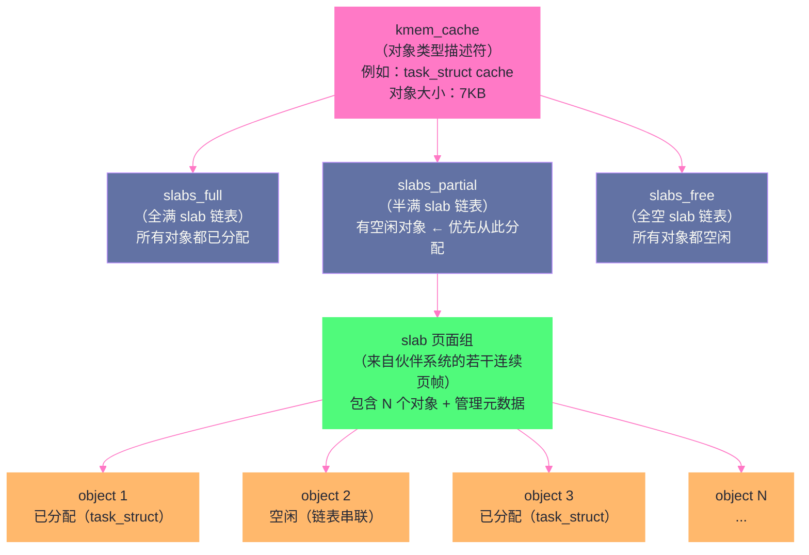

# 物理内存管理：Buddy System 与 Slab 分配器的设计哲学

**摘要：**

上一篇文章讨论的虚拟内存，解决了"进程看到什么地址"的问题。本文要深入的，是更底层的问题：当 [[缺页异常]] 触发、内核必须真正分配一个物理页时，它是怎么管理那数以亿计的物理页帧的？Linux 内核用**伙伴系统（Buddy System）**管理以页为单位的物理内存分配，用 **Slab/SLUB 分配器**解决字节级别的小对象分配问题。这两层分配器各司其职，共同构成了 Linux 物理内存管理的核心。本文深入剖析伙伴系统如何通过 2 的幂次方分组来规避外部碎片、如何用 `free_area` 数组组织空闲链表、Slab 分配器为什么必须存在（伙伴系统的内部碎片问题）、以及 SLUB 如何通过架构简化解决 Slab 的实现复杂性。最后落脚到 `kmalloc`、`vmalloc`、`get_free_pages` 三套分配接口的适用边界，以及生产环境中内存碎片问题的诊断与应对。

---

## 第 1 章 物理内存的组织方式

### 1.1 从 page 结构体开始：每个物理页帧的"身份证"

在深入分配器之前，我们需要先理解 Linux 内核如何在数据结构层面表示物理内存。

物理内存由大量等大的**页帧（Page Frame）**组成，每个页帧 4KB。Linux 内核为系统中**每一个**物理页帧都维护着一个 `struct page` 数据结构，这是整个物理内存管理体系的基础数据单元。

```c
/* include/linux/mm_types.h（高度简化，聚焦核心字段）*/
struct page {
    unsigned long flags;        /* 页标志位，如 PG_locked, PG_dirty,
                                   PG_uptodate, PG_lru, PG_active 等 */
    union {
        struct {
            /* 当此页在伙伴系统中时 */
            struct list_head lru;   /* LRU 链表节点 或 伙伴系统空闲链表节点 */
            unsigned long private;  /* 在伙伴系统中：存储该块的 order 值 */
        };
        struct {
            /* 当此页作为 Slab 缓存页时 */
            struct kmem_cache *slab_cache;  /* 指向所属的 kmem_cache */
            void *freelist;                 /* 指向该 page 中的空闲对象链表 */
        };
        /* 还有文件页（page cache）、匿名页（anonymous page）等多种用途 */
    };
    atomic_t _refcount;         /* 引用计数，降为 0 时才可以被回收 */
    atomic_t _mapcount;         /* 有多少个页表条目（PTE）映射了这个物理页 */
    struct mem_cgroup *mem_cgroup; /* 该页属于哪个 cgroup，用于内存隔离计费 */
    /* ... */
};
```

`struct page` 的 union 设计体现了 Linux 内核对内存的极度节俭：同一个物理页帧在不同的"生命周期阶段"有不同的含义——它可能是伙伴系统中的一个空闲块，也可能是 Slab 缓存的一部分，还可能是 Page Cache 中缓存着某个文件内容的数据页。union 确保这些互斥的状态共用同一块内存，而不是为每种可能性都单独分配字段。

> [!info] struct page 有多大？
> 在 64 位 Linux 上，`struct page` 大约占 64 字节。一台拥有 128GB 物理内存的服务器，物理页帧数量为 `128GB / 4KB = 32,768,000` 个，对应的 `struct page` 数组大小约为 `32M × 64B = 2GB`。也就是说，**系统内存的约 1.5% 永远被 `struct page` 数组占用**，这是物理内存管理不可避免的元数据开销。这也是为什么内核开发者对 `struct page` 的大小极度敏感，任何一个新字段的加入都需要反复权衡。

### 1.2 NUMA 架构与 Node/Zone/Page 三级层次

现代服务器大多是 NUMA（Non-Uniform Memory Access，非统一内存访问）架构：系统有多个处理器插槽（Socket），每个插槽有自己本地的内存，访问本地内存比访问远端内存要快（典型差距 2~3 倍）。

Linux 内核用三个层级来组织物理内存，完美匹配了 NUMA 架构：

```
Node（NUMA 节点）
  └── Zone（内存区域）
        └── Page（物理页帧）
```

**Node（pglist_data）**：对应一个 NUMA 节点，即"物理上属于同一个 CPU 插槽的内存"。每个 Node 有自己的内存分配器，内核尽量在发出内存请求的 CPU 所在的 Node 上分配内存，以降低跨 Node 访问的延迟。

**Zone（mem_zone）**：一个 Node 内部，内存被进一步划分为若干 Zone。这是因为不同硬件地址范围的内存有不同的使用限制：

| Zone 名称 | 地址范围（x86-64） | 用途与限制 |
|-----------|------------------|-----------|
| **ZONE_DMA** | 0 ~ 16MB | 早期 ISA 设备 DMA 只能访问 16MB 以内的内存，现代系统已基本无用 |
| **ZONE_DMA32** | 0 ~ 4GB | 32 位 PCI 设备 DMA 只能访问 4GB 以内的内存，现代系统仍有需求 |
| **ZONE_NORMAL** | 4GB ~ 物理内存上限 | 普通内核和用户态内存，占绝大多数 |
| **ZONE_HIGHMEM** | 仅 32 位系统存在 | 32 位系统中超过 896MB 的内存，内核需特殊方式访问，64 位系统不存在此 Zone |
| **ZONE_MOVABLE** | 配置相关 | 专门存放可迁移的页，配合内存热插拔和透明大页使用 |

**Page**：Zone 内的实际物理页帧，由伙伴系统管理其分配与回收。

理解这个三级层次，对于分析生产环境中的内存问题很有帮助。比如，用 `numactl --hardware` 可以看到每个 Node 的内存大小；用 `cat /proc/zoneinfo` 可以看到每个 Zone 的空闲页数量和水位线状态——后者是判断内存压力是否已经触发 kswapd 的重要依据（详见[[内存回收：kswapd、LRU与直接回收的博弈]]）。

---

## 第 2 章 伙伴系统（Buddy System）：物理页帧的大管家

### 2.1 核心问题：外部碎片

设想你现在要管理一块 1GB 的物理内存，里面有 256,000 个 4KB 的页帧。进程们不断地申请和释放内存，经过一段时间后，内存可能变成这样一幅"千疮百孔"的景象：

```
[已用][空闲][已用][已用][空闲][已用][空闲][已用][空闲][已用]...
```

空闲页帧散布在各处，每个"空洞"都只有几个页大的零散内存。现在内核需要分配 64 个连续的物理页帧（比如某个驱动需要一个 256KB 的 DMA 缓冲区），虽然总空闲量可能远超 256KB，但找不到 64 个**连续**的空闲页帧。这就是**外部碎片（External Fragmentation）**问题。

外部碎片在物理内存层面比虚拟内存层面更棘手：虚拟地址空间是无限的（对每个进程都是 128TB），可以随意找一块连续的虚拟地址范围；但物理内存是有限的实体资源，一旦碎片化严重，大块连续物理内存就真的分配不出来。而某些硬件（DMA 设备、部分驱动、HugePage）**必须**要求物理连续内存。

### 2.2 伙伴系统的核心思想

**伙伴系统（Buddy System）**是解决外部碎片的经典算法，其核心思想是：**将内存按 2 的幂次方大小分组管理，合并时只允许大小相等的"伙伴"合并**。

具体规则：
- 系统维护 11 个（order 0 到 order 10）空闲链表，分别管理 2^0、2^1、2^2 ... 2^10 个连续页帧的空闲块
- 2^0 = 1 个页帧（4KB），2^10 = 1024 个页帧（4MB）
- 每个空闲块都有一个唯一对应的"伙伴"：相邻且大小相同的块

**分配过程**（申请 order=N 的块，即 2^N 个连续页帧）：
1. 查看 order=N 的空闲链表，如果有空闲块，直接取出，完成
2. 如果没有，向上找 order=N+1 的链表，取出一个 2^(N+1) 大小的块
3. 将这个大块**对半拆分**：一半满足请求，另一半作为 order=N 的空闲块放入对应链表
4. 如果 order=N+1 也没有，继续向上找 order=N+2，拆分两次，以此类推

**释放过程**（释放一个 order=N 的块）：
1. 计算该块的"伙伴"的地址（见下文）
2. 检查伙伴是否也在空闲链表中，且 order 也等于 N
3. 如果是，将两个伙伴从 order=N 链表中取出，合并成一个 order=N+1 的块，放入 order=N+1 链表
4. 递归检查新合并的块的伙伴，如果也空闲则继续合并，直到 order=10 或伙伴不空闲为止

> [!info] 核心概念：如何计算伙伴地址？
> 伙伴系统的精妙之处在于：**给定一个 order=N 的块的起始页帧号（PFN），其伙伴的 PFN 可以通过简单的位运算算出**：
> ```c
> buddy_pfn = pfn ^ (1 << order);  // 翻转 PFN 的第 order 位
> ```
> 例如，一个 order=3（8个页帧）的块，PFN 为 24（二进制 `011000`），其伙伴 PFN = `011000 ^ 001000 = 010000` = 16。如果 PFN=16 的块也是 order=3 的空闲块，则两者可合并为 PFN=16 的 order=4 块。这个位运算的简洁性是伙伴系统实现高效的关键——O(1) 计算，不需要任何额外查找。

### 2.3 free_area 数组：伙伴系统的核心数据结构

Linux 内核中，每个 Zone 都维护一个 `free_area` 数组来实现伙伴系统：

```c
/* include/linux/mmzone.h */
struct zone {
    /* ... */
    struct free_area free_area[MAX_ORDER]; /* MAX_ORDER = 11，共 11 个 order */
    /* ... */
};

struct free_area {
    struct list_head free_list[MIGRATE_TYPES]; /* 按迁移类型分组的空闲链表 */
    unsigned long nr_free;                     /* 该 order 的空闲块总数 */
};
```

注意 `free_list` 不是单一链表，而是按**迁移类型（Migrate Type）**分为多个子链表：

| 迁移类型 | 名称 | 含义 |
|---------|------|------|
| `MIGRATE_UNMOVABLE` | 不可移动 | 内核代码、内核数据结构等，分配后不能迁移 |
| `MIGRATE_MOVABLE` | 可移动 | 用户态匿名页，可以通过更新页表映射来迁移到其他物理位置 |
| `MIGRATE_RECLAIMABLE` | 可回收 | Page Cache、Slab 缓存等，不能迁移但可以回收然后重新分配 |
| `MIGRATE_PCPTYPES` | 每CPU页池 | 每个 CPU 有独立的单页缓存（per-CPU page cache），减少锁竞争 |
| `MIGRATE_HIGHATOMIC` | 高优先级原子分配 | 为原子上下文（不可睡眠场景）预留的内存 |

为什么要区分迁移类型？这是为了解决**内存碎片化的长期问题**。不可移动的内存块如果散布在各处，会永久地分割可用内存，阻止大块内存的合并。通过把不可移动页聚集在一起（`MIGRATE_UNMOVABLE` 链表），把可移动页聚集在另一处（`MIGRATE_MOVABLE`），系统在需要分配大块连续内存时，可以把可移动页迁移走，从而腾出一块完整的物理内存。这个机制叫做**内存紧缩（Memory Compaction）**，是解决长期运行系统内存碎片化的重要手段。

### 2.4 一次 order=3 分配的完整示意

下面用一个具体例子，直观感受伙伴系统的工作过程。假设我们有一块 16 个页帧（order=4）的内存，初始状态全部空闲：

```
初始状态（16个页帧全空闲，作为一个 order=4 的块）：
free_area[4]: [PFN 0~15]
free_area[3]: (空)
free_area[2]: (空)
free_area[1]: (空)
free_area[0]: (空)

申请 order=2（4个页帧）：
1. free_area[2] 为空，向上找
2. free_area[3] 为空，继续向上找
3. free_area[4] 有一个块 [0~15]，取出
4. 对半拆分：[0~7] 放入 free_area[3]，[8~15] 满足请求? 不对，
   应该继续拆分 [0~7]：
   - [0~3] 放入 free_area[2]，作为保留
   - [4~7] 放入 free_area[2]，满足请求，返回 PFN=4 的块

分配 order=2 后的状态：
free_area[4]: (空)
free_area[3]: [PFN 8~15]
free_area[2]: [PFN 0~3]  ← 拆分剩余的伙伴
free_area[1]: (空)
free_area[0]: (空)
已分配：[PFN 4~7]

释放 PFN=4 的 order=2 块：
1. PFN=4 的 order=2 块，伙伴 = 4 ^ (1<<2) = 4 ^ 4 = 0，即 PFN=0
2. 检查 free_area[2]：PFN=0 在链表中，且 order=2，可以合并！
3. 合并 [PFN 0~3] + [PFN 4~7] = [PFN 0~7]，放入 free_area[3]
4. [PFN 0~7] 的伙伴 = 0 ^ (1<<3) = 8，即 PFN=8
5. 检查 free_area[3]：PFN=8 在链表中，可以继续合并！
6. 合并 [PFN 0~7] + [PFN 8~15] = [PFN 0~15]，放入 free_area[4]

释放后恢复初始状态：
free_area[4]: [PFN 0~15]  ← 完全还原！
```

这个示例展示了伙伴系统的**自动合并**能力：只要两个伙伴都空闲，就会不断向上合并，最终尽可能恢复大块连续内存。这是伙伴系统抵抗外部碎片的核心机制。

### 2.5 伙伴系统的局限性：内部碎片

伙伴系统很好地解决了外部碎片问题，但它自身引入了另一个问题：**内部碎片（Internal Fragmentation）**。

由于伙伴系统只能分配 2^N 个页帧，如果你需要 5 个页帧，实际上会分配 order=3（8个页帧）的块，多分配了 3 个页帧。这 3 个页帧被"锁"在分配出去的块里，白白浪费了。

但伙伴系统更根本的局限性在于：**它的最小分配单位是 1 个页帧（4KB）**。内核中有大量对象只有几十、几百字节，比如 `task_struct`（进程描述符，约 7KB）、`inode`（文件节点，约 600 字节）、`dentry`（目录项，约 192 字节）、`sock`（套接字，约 1KB）。如果每个这样的小对象都分配一个完整的 4KB 页帧，浪费率会高得惊人——一个 192 字节的 `dentry`，如果用一个 4KB 页帧来存，浪费率是 95%。

这就是 **Slab 分配器（Slab Allocator）**诞生的根本原因：**在伙伴系统之上，建立一层专门服务于小对象分配的缓存系统，将内部碎片控制在可接受范围内**。

---

## 第 3 章 Slab 分配器：小对象分配的艺术

### 3.1 Slab 的设计动机：不只是减少碎片

Sun Microsystems 的工程师 Jeff Bonwick 在 1994 年发表了奠基性论文 *"The Slab Allocator: An Object-Caching Kernel Memory Allocator"*，提出了 Slab 分配器的设计思想，并在 Solaris 2.4 中首次实现。Linux 2.2 引入了 Slab 分配器的实现，沿用多年。

Slab 分配器的设计目标不只是减少内存碎片，它同时解决了另一个重要问题：**内核对象的反复初始化开销**。

内核中的某些对象（比如 `task_struct`、`inode`）创建时需要大量初始化工作：清零内存、初始化各种链表头、设置锁……当这个对象被释放时，如果直接把内存还给伙伴系统，下次再需要同类型对象时，又要重新申请内存、重新做一遍初始化。这是一笔不小的 CPU 开销，在高频创建/销毁进程或文件的系统上尤为明显。

Slab 的核心洞察是：**对象释放时，不必真的"销毁"它，可以把它缓存起来，保留初始化好的状态，下次需要同类对象时直接取出来用，省去重新初始化的开销**。这就是 Slab 名字中"Cache"的核心含义——`kmem_cache`，内核内存对象缓存。

### 3.2 三层结构：kmem_cache、slab、object

Slab 分配器由三个层级构成，理解这三层是理解 Slab 工作原理的关键：



**kmem_cache（缓存描述符）**：代表一种特定类型（或特定大小）的对象的缓存。比如，`task_struct` 有一个专属的 `kmem_cache`，`inode` 有一个，`dentry` 有一个。每个 `kmem_cache` 记录了：
- 该缓存的对象大小
- 对象的对齐要求
- 构造函数（ctor）和析构函数（dtor）指针（用于首次创建和最终销毁时的初始化）
- 三条 slab 链表（full、partial、free）
- 每个 CPU 的本地缓存（local cache）

**slab（slab 页面组）**：`kmem_cache` 中的每个 slab 是向伙伴系统申请的若干连续物理页（通常 1~8 页，由对象大小决定）。这些页面被切分成等大的**对象槽（slot）**，空闲的对象槽通过内嵌指针串成一条空闲链表。

**object（对象）**：实际分配给调用者的内存单元。每个对象大小固定（对应该 `kmem_cache` 的对象大小），被分配时从空闲链表摘取，释放时放回空闲链表（而非真正"销毁"）。

### 3.3 分配与释放的流程

**分配一个 `task_struct` 的过程**：

1. 调用 `kmem_cache_alloc(task_struct_cachep, GFP_KERNEL)`
2. 检查当前 CPU 的**本地缓冲池（array cache）**，如果有空闲对象，直接取出——**不需要任何锁操作**，这是 Slab 的高性能秘诀之一
3. 本地缓冲池空了，去 `slabs_partial` 链表取一个 slab，从其空闲对象链表取出一个对象，同时更新 CPU 本地缓冲池
4. 如果 `slabs_partial` 也空了，去 `slabs_free` 取一整个 slab
5. 如果连 `slabs_free` 都空了，向伙伴系统申请若干新页帧，创建一个新的 slab，切分成对象槽，放入 `slabs_free`，然后执行步骤 4

**释放一个 `task_struct` 的过程**：

1. 调用 `kmem_cache_free(task_struct_cachep, ptr)`
2. 将对象放回当前 CPU 的本地缓冲池——同样**不需要锁**
3. 如果本地缓冲池满了，批量将一批对象还给对应的 slab（可能需要加锁操作 partial/full 链表）
4. **注意**：对象本身的内存**不归还给伙伴系统**，只是放回空闲链表，等待下次重用

这个机制让 `kmem_cache_alloc`/`free` 的常路径（CPU 本地缓冲池命中）几乎不涉及锁，在高并发场景下性能极佳。

> [!warning] 生产避坑
> Slab 缓存会持续持有从伙伴系统申请来的内存页，即使对象都被释放了，这些页面也不会立即归还给伙伴系统（因为 `kmem_cache_free` 把它们放回了 `slabs_free` 链表）。这意味着：**`free` 命令显示的 `buff/cache` 部分包含了大量 Slab 缓存占用的内存**，在进程频繁创建销毁（比如 Web 服务器 fork 大量子进程）后，Slab 缓存可能占用大量内存而不释放。可以通过 `cat /proc/slabinfo` 或 `slabtop` 命令查看 Slab 的具体占用情况；通过 `echo 2 > /proc/sys/vm/drop_caches` 可以释放所有 Slab 缓存（**生产环境慎用，会导致短暂的性能抖动**）。

### 3.4 通用 Slab：kmalloc 的实现基础

`kmem_cache` 是为特定内核对象类型定制的缓存。但内核还有大量"随机大小"的内存分配需求，比如 `kmalloc(37, GFP_KERNEL)` 这样的调用。

为此，内核在初始化时预先创建了一系列**通用 Slab 缓存（General Slab Cache）**，对应不同的大小类别：`kmalloc-8`、`kmalloc-16`、`kmalloc-32`、`kmalloc-64`、`kmalloc-128`、`kmalloc-256`、`kmalloc-512`、`kmalloc-1024`、`kmalloc-2048`、`kmalloc-4096`、`kmalloc-8192`……每个 `kmalloc-N` 缓存专门分配 N 字节大小的对象。

`kmalloc(size, flags)` 的实现逻辑：
1. 找到满足 `size` 的最小 `kmalloc-N` 缓存（即 `N >= size` 的最小 N）
2. 从该 `kmem_cache` 分配一个对象，返回给调用者

由于 N 是 2 的幂次方，最坏情况的内部碎片率不超过 50%（比如申请 33 字节，分配 64 字节的槽，浪费 31/64 ≈ 48%）。这比直接用伙伴系统（申请 33 字节分配 4096 字节，浪费 99%）已经好很多了。

---

## 第 4 章 SLUB：Slab 的简化继承者

### 4.1 Slab 的工程复杂性问题

尽管 Slab 分配器在设计上很精妙，但经过十多年的演进，它的实现变得越来越复杂：

- 三条 slab 链表（full/partial/free）的维护涉及大量锁操作
- 每个 CPU 的本地缓冲池（array cache）需要精细调优
- 大量调试支持代码（poison、red zone 等）使代码路径更长
- NUMA 感知的缓存层次（Node 级缓存 + CPU 级缓存）实现极为复杂
- `slabinfo` 导出的统计信息数量庞大，难以理解

这些复杂性导致 Slab 在 Linux 内核中维护困难，且在某些场景下（特别是高 CPU 数、NUMA 系统）表现不如预期。

### 4.2 SLUB 的核心简化

2007 年，Christoph Lameter 提出了 **SLUB 分配器**，并最终在 Linux 2.6.23 中成为默认分配器（取代 Slab）。SLUB 的设计哲学是：**以减少结构复杂性为代价，在几乎不损失性能的情况下大幅简化实现**。

SLUB 的核心简化：

**1. 废除三条链表，只保留 partial 链表**

在 Slab 中，每个 `kmem_cache` 维护三条链表（full/partial/free）。SLUB 观察到 `slabs_full` 其实没什么用——满的 slab 不需要参与分配，不放在链表里没关系；`slabs_free` 完全空的 slab 可以在第一次有对象释放时归还给伙伴系统，不必保留。因此 SLUB 只维护一条 `partial` 链表（有空闲槽的 slab），大幅减少链表操作。

**2. slab 元数据直接存在 struct page 里**

Slab 需要额外的管理结构（`struct slab`）来记录每个 slab 的状态。SLUB 把这些信息直接塞进了 `struct page` 的 union 字段（`freelist`、`inuse`、`objects` 等），省去了额外的元数据空间。

**3. 每 CPU 的"当前活跃 slab"（cpu_slab）**

SLUB 给每个 CPU 分配一个**当前活跃 slab（cpu_slab）**。分配对象时，直接从当前 CPU 的 `cpu_slab` 中取空闲对象，完全无锁（使用原子 cmpxchg 操作）。释放时，如果释放的对象属于当前 CPU 的活跃 slab，同样无锁操作。只有在当前 slab 用完需要换新 slab，或释放的对象不属于当前活跃 slab 时，才需要涉及锁操作。

**4. 统一 SMP 和 NUMA 路径**

Slab 的 NUMA 支持是通过额外的缓存层（节点级缓冲）实现的，代码路径分叉严重。SLUB 通过让 `partial` 链表本身感知 NUMA（优先从本地 Node 的 slab 分配）来统一处理，代码更简洁。

```c
/* SLUB 分配对象的核心路径（高度简化）*/
static inline void *slab_alloc_node(struct kmem_cache *s, gfp_t gfpflags,
                                    int node, unsigned long addr)
{
    struct kmem_cache_cpu *c;
    void *object;

    /* 禁用抢占，获取当前 CPU 的 per-CPU 指针 */
    c = raw_cpu_ptr(s->cpu_slab);

    /* 快路径：直接从当前 CPU 的活跃 slab 取对象 */
    object = c->freelist;
    if (unlikely(!object || !node_match(c, node))) {
        /* 慢路径：当前 slab 用完，或 NUMA node 不匹配，需要换 slab */
        object = __slab_alloc(s, gfpflags, node, addr, c);
    } else {
        /* 无锁地更新 freelist 指针（使用 this_cpu_cmpxchg_double 保证原子性）*/
        c->freelist = get_freepointer_safe(s, object);
    }
    return object;
}
```

### 4.3 SLOB：嵌入式场景的极简方案

除了 Slab 和 SLUB，Linux 还有第三个分配器：**SLOB（Simple List Of Blocks）**。

SLOB 是为内存极度受限的嵌入式系统设计的，它用一个非常简单的空闲块链表来管理内存，实现只有几百行代码。代价是在多核 SMP 系统上性能和并发性很差（全局锁）。在普通服务器 Linux 上，SLOB 不会被使用；它存在的意义是为 `CONFIG_SLOB` 配置的嵌入式 Linux（如路由器、IoT 设备）提供更小的内核体积。

三种分配器的横向对比：

| 特性 | Slab | SLUB（现代默认）| SLOB |
|-----|------|----------------|------|
| **适用场景** | 通用服务器（历史方案）| 通用服务器（当前默认）| 嵌入式/内存极限场景 |
| **核心结构** | 三条链表 + array cache | partial 链表 + cpu_slab | 全局空闲块链表 |
| **实现复杂度** | 高 | 中 | 极低 |
| **多核性能** | 好（per-CPU 缓存）| 更好（更少锁竞争）| 差（全局锁）|
| **NUMA 支持** | 有（复杂）| 有（简洁）| 无 |
| **调试工具** | `slabinfo`（字段多）| `slabinfo`（简化）| 极简 |
| **内核版本** | 2.2~2.6.22 为默认 | 2.6.23+ 为默认 | 配置可选 |

---

## 第 5 章 内存分配接口全景：该用哪个？

### 5.1 三大分配接口

Linux 内核提供了多套内存分配接口，分别适用于不同的场景：

**1. `__get_free_pages()` / `alloc_pages()`：直接调用伙伴系统**

```c
/* 分配 2^order 个连续物理页 */
unsigned long __get_free_pages(gfp_t gfp_mask, unsigned int order);
struct page *alloc_pages(gfp_t gfp_mask, unsigned int order);
```

这是最底层的接口，直接向伙伴系统申请连续物理页帧。适用于：
- 需要大块连续物理内存的驱动（如 DMA 缓冲区）
- 需要操作 `struct page` 指针（如 Page Cache 管理）
- 特殊内存分配（高优先级、原子上下文等）

**2. `kmalloc()` / `kfree()`：通过 SLUB 分配小对象**

```c
/* 分配 size 字节的内核内存，物理连续 */
void *kmalloc(size_t size, gfp_t flags);
void kfree(const void *ptr);
```

通过通用 SLUB 缓存（`kmalloc-N`）分配，物理内存**连续**。适用于：
- 小于 8KB 的内核对象分配（最高效）
- 需要物理连续内存（如某些 DMA 小缓冲区）
- 内核驱动、数据结构的常规内存分配

**3. `vmalloc()` / `vfree()`：虚拟连续但物理不连续**

```c
/* 分配 size 字节的内核内存，虚拟地址连续，物理不连续 */
void *vmalloc(unsigned long size);
void vfree(const void *addr);
```

`vmalloc` 不调用伙伴系统分配连续物理页，而是逐页分配（每次 order=0），然后在内核的 `vmalloc` 地址区域中建立虚拟→物理的映射，使得虚拟地址连续。适用于：
- 大块内存分配（几 MB 以上），物理连续难以保证时
- 加载内核模块（`.ko` 文件就是用 `vmalloc` 区域加载的）
- 不需要物理连续的大缓冲区

> [!warning] 生产避坑
> `vmalloc` 的代价是每次访问时需要经过额外的页表映射，而且因为每个 CPU 只有一份 vmalloc 区域的页表（不像 physmap 是全局映射），在多 CPU 系统上可能触发**页表同步（vmalloc fault）**开销。不要用 `vmalloc` 分配频繁访问的小对象，`vmalloc` 最适合那种"一次分配、长期持有"的大块内存场景。

### 5.2 GFP（Get Free Pages）标志位

分配内存时的 `gfp_t flags` 参数极为重要，它控制着分配器的行为：

| 标志 | 含义 | 典型使用场景 |
|-----|------|-------------|
| `GFP_KERNEL` | 可睡眠的普通内核分配，允许内存回收和 swap | 进程上下文中的大多数分配 |
| `GFP_ATOMIC` | 不可睡眠，失败时直接返回 NULL（不等待） | 中断处理程序、spinlock 持有时 |
| `GFP_USER` | 用户态进程内存分配，最低优先级 | 用户页帧分配 |
| `GFP_NOIO` | 不允许触发 I/O 操作（防止死锁）| 磁盘驱动程序、文件系统 |
| `GFP_NOFS` | 不允许进入文件系统 | 文件系统代码自身 |
| `GFP_HIGHUSER_MOVABLE` | 可迁移的用户内存 | 匿名页、文件页的典型分配 |
| `__GFP_ZERO` | 分配后清零内存 | 需要初始化为零的场景 |
| `__GFP_NOWARN` | 分配失败时不打印警告日志 | 尝试性分配，失败有备用路径 |

`GFP_ATOMIC` 是生产问题的高频来源之一。中断上下文或持有 spinlock 时，不能调用可能睡眠的函数（`GFP_KERNEL` 可能因内存不足而睡眠等待回收），必须用 `GFP_ATOMIC`。但 `GFP_ATOMIC` 分配失败时直接返回 NULL，驱动代码如果没有正确处理 NULL 返回，就会引发空指针崩溃。这是内核驱动开发中的经典陷阱。

---

## 第 6 章 内存碎片的诊断与生产应对

### 6.1 /proc/buddyinfo：伙伴系统碎片诊断

```bash
$ cat /proc/buddyinfo
Node 0, zone      DMA      0      0      0      1      2      1      1      0      1      1      3
Node 0, zone    DMA32   2442   1312    872    513    285    162     89     43     22     13    204
Node 0, zone   Normal  19385  12460   5973   2821   1275    591    276    137     67     38   1234
```

每行的 11 个数字分别代表 order 0~10 的空闲块数量。从右往左，order 越大，代表连续物理内存越多。

如何判断碎片化程度？关注**高 order（8、9、10）的空闲块数量**。如果高 order 的空闲块很少，而低 order 有大量碎片（很多 order 0、1、2 的块），说明物理内存已经严重碎片化，此时分配大块连续内存会很困难，内核可能触发 Memory Compaction。

### 6.2 /proc/slabinfo 与 slabtop：Slab 占用诊断

```bash
# slabtop 实时查看 Slab 占用（类似 top）
$ slabtop

# 或者静态查看
$ cat /proc/slabinfo | head -20
slabinfo - version: 2.1
# name            <active_objs> <num_objs> <objsize> <objperslab> <pagesperslab>
kmalloc-8192           128      128     8192        4          8
kmalloc-4096           384      384     4096        8          8
kmalloc-2048           576      576     2048       16          8
task_struct            348      360     7424        4          8
mm_struct              126      126     1600       20          8
inode_cache           8192     8192      608       26          4
dentry               32768    32768      192       42          2
```

关键字段：
- **active_objs**：当前正在使用的对象数
- **num_objs**：总对象槽数（包含空闲的）
- **objsize**：每个对象的大小（字节）
- **pagesperslab**：每个 slab 占用的页帧数

当 `dentry` 或 `inode_cache` 占用量异常高时，通常说明文件操作非常频繁（或有大量目录遍历），VFS 层的 dcache/icache 保留了大量已访问的文件元数据。这通常是正常的内存复用行为，不是内存泄漏，内存不足时内核会自动回收这部分缓存。

### 6.3 内存碎片压缩（Memory Compaction）

当伙伴系统高 order 空闲块不足时，内核会触发**内存紧缩（Memory Compaction）**：把可移动的页帧迁移到内存的一端，腾出另一端的连续空间供大块分配使用。

触发方式：
- 自动触发：分配大 order 内存失败时，内核自动尝试 Compaction
- 手动触发：`echo 1 > /proc/sys/vm/compact_memory`（仅用于诊断）

Compaction 的代价是显著的 CPU 开销和内存带宽消耗（需要拷贝大量页帧内容）。如果 Compaction 频繁触发，说明系统内存碎片化已经严重，需要考虑：
- 减少长期持有不可移动内存的内核模块
- 配置 HugePage（详见[[大页内存 HugePage：TLB Miss的终极解法]]），提前预留连续物理内存
- 通过 `vm.min_free_kbytes` 调高内存水位线，让内核更早触发回收，预防极端碎片化

> [!warning] 生产避坑
> 在 NUMA 系统上，碎片化通常是"区域性"的——某个 Node 的某个 Zone 碎片严重，而另一个 Node 还有大量连续空闲内存。内核默认不会跨 Node 分配内存（NUMA 本地性优先）。这时候 `buddyinfo` 可能显示 Node 0 高度碎片化，但 Node 1 还有大量高 order 空闲块，整体 `free` 内存充足，却不断出现大内存分配失败。解决方案：通过 `numactl` 绑定进程到特定 Node，或适当调整 `vm.zone_reclaim_mode` 允许跨 Zone 回收。

---

## 第 7 章 总结

物理内存管理是 Linux 内存体系中最接近硬件的一层，本文的核心认知可以归纳为：

**1. 三级层次（Node/Zone/Page）与硬件紧密对应**：NUMA 架构驱动了 Node 的划分，历史遗留硬件限制驱动了 Zone 的划分，每个物理页帧对应一个 `struct page`，是所有内存操作的原子单元。

**2. 伙伴系统解决外部碎片，但引入内部碎片**：按 2 的幂次方分组管理、利用伙伴关系自动合并是伙伴系统的精华。它保证了物理内存不会因为细碎的分配释放而永久碎片化，但最小分配单位是 4KB，不适合小对象。

**3. Slab/SLUB 解决小对象的内部碎片和初始化开销**：通过缓存已初始化的对象、用 per-CPU 本地池减少锁竞争，Slab/SLUB 让内核小对象分配接近零开销。SLUB 通过大幅简化实现，成为现代 Linux 的默认选择。

**4. 接口选择原则**：`kmalloc` < 8KB 且需要物理连续；`alloc_pages` 需要大块物理连续或直接操作 `struct page`；`vmalloc` 需要大块内存但不要求物理连续。不要滥用 `vmalloc` 分配频繁访问的小对象。

**5. GFP 标志的正确使用至关重要**：中断上下文/spinlock 持有时必须用 `GFP_ATOMIC`，需要处理 NULL 返回；进程上下文普通场景用 `GFP_KERNEL`。

理解了物理内存是如何被分配的，下一步自然要追问：当一个用户态进程访问了一个虚拟地址，而对应的物理页帧还没有被分配时，内核是怎么处理的？这就是[[缺页异常：一次内存访问的完整旅程]]要深入探讨的内容。

---

## 参考资料

- Jeff Bonwick, *"The Slab Allocator: An Object-Caching Kernel Memory Allocator"*, USENIX 1994
- Mel Gorman, *Understanding the Linux Virtual Memory Manager*, Chapter 8: Slab Allocator
- Christoph Lameter, *"SLUB: The unqueued slab allocator"*, Linux Kernel Documentation
- Linux Kernel Source: `mm/buddy.c`, `mm/slub.c`, `include/linux/mmzone.h`
- [Physical Page Allocation - Kernel Documentation](https://www.kernel.org/doc/gorman/html/understand/understand009.html)
- [The Slab Allocator in the Linux kernel](https://hammertux.github.io/slab-allocator)

---

> [!note] 思考题
> 1. Buddy System 分配 5 个页面时会分配 8 个（2^3），浪费 3 个页面。长时间运行后高阶空闲页减少导致外部碎片。在什么场景下外部碎片会导致实际问题（如 HugePage 分配失败、DMA 缓冲区分配失败）？`/proc/buddyinfo` 如何帮助诊断碎片化程度？
> 2. Slab 分配器的'对象复用'对安全性有什么影响？如果释放的内核对象内存被另一个类型的对象复用（Use-After-Free），可能导致什么安全漏洞？SLUB 的 `CONFIG_SLAB_FREELIST_HARDENED` 和 `CONFIG_SLAB_FREELIST_RANDOM` 是如何防御的？
> 3. 内核中 `kmalloc` 使用 Slab 分配器分配小内存（物理连续），`vmalloc` 使用页表映射分配虚拟连续但物理不连续的大内存。网络驱动的 DMA 缓冲区为什么必须用 `kmalloc`？在什么场景下 `vmalloc` 更合适？`kvmalloc` 的自动选择策略是什么？
