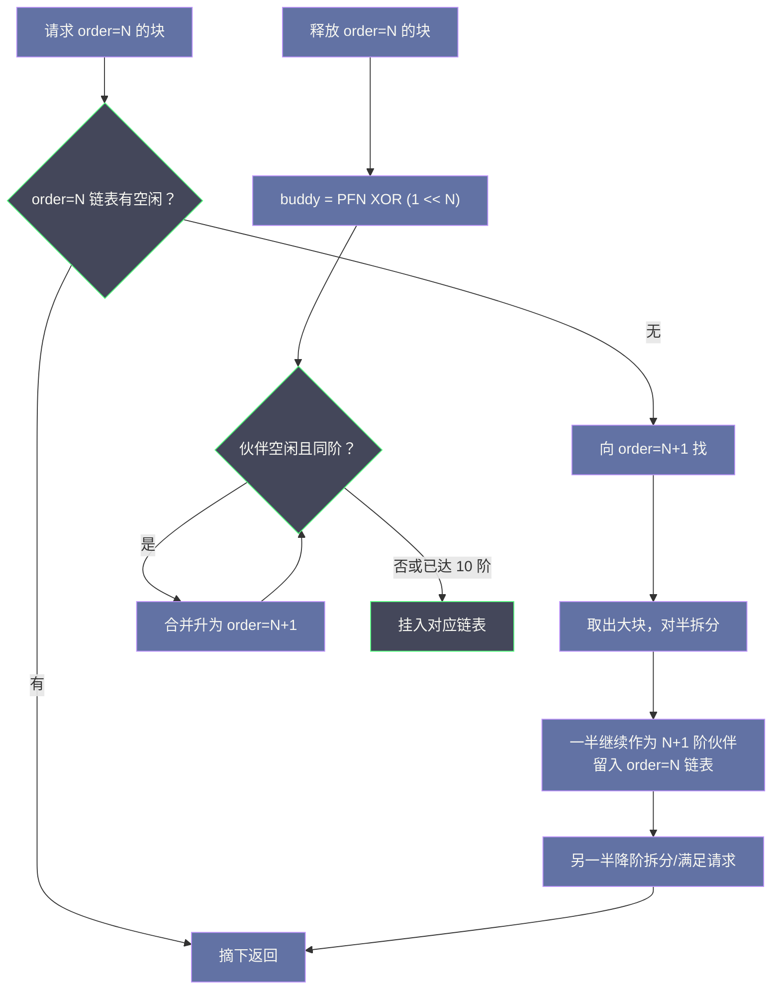
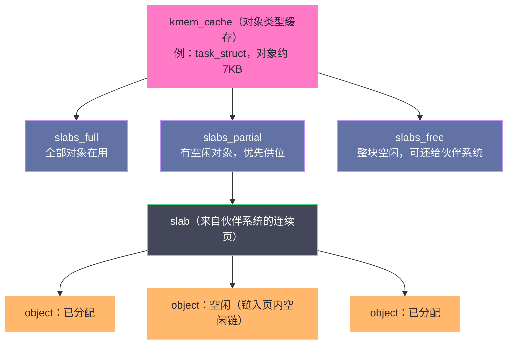

# 物理内存管理：Buddy System 与 Slab 分配器的设计哲学

**摘要：**

上一篇 [[01 虚拟内存：为什么每个进程都以为自己独占内存|虚拟内存]] 说明了进程看到的地址世界是被虚构出来的，本文要回答的是虚构背后的事实：当缺页异常触发、内核真的要掏出一个物理页时，数以亿计的 4KB 页帧由谁登记、由谁分配、如何避免碎片、小到几百字节的对象又该怎样安放。文章分两条主线展开：其一是**伙伴系统（Buddy System）**，它把物理内存按 2 的幂分组、以"伙伴异或"一步定位合并对象，用最小的算法代价对抗外部碎片，却把最小分配粒度定格在 4KB；其二是**Slab/SLUB 分配器**，它在伙伴系统之上叠了一层对象缓存，同时吃掉两个问题——小对象的内部碎片，以及内核对象反复初始化的 CPU 开销。随后落到工程师真正会用的东西：`kmalloc`、`vmalloc`、`alloc_pages` 三套接口的适用边界，GFP 标志的语义陷阱，以及 `/proc/buddyinfo`、`slabtop`、内存紧缩（Compaction）这条碎片诊断与治理的完整链路。读完全文你应当能回答两个问题：物理内存的分配为什么必须分成两层，以及当生产系统出现大块连续内存分配失败时，诊断与处置的路径是什么。

---

## 第 1 章 舞台：物理内存的登记制度

### 1.1 page 结构体：每个页帧的户口本

在第 1 篇里，物理内存被切成等大的页帧（Page Frame），每个 4KB。Linux 的做法朴素而彻底：**为系统中每一个物理页帧登记一个 `struct page`**，作为它唯一的身份证。这个结构是整个物理内存管理体系的基本单元，值得先看清它的体格：

```c
/* include/linux/mm_types.h，大幅简化 */
struct page {
    unsigned long flags;        /* PG_dirty、PG_lru、PG_active 等状态位 */
    union {
        struct {                /* 空闲页：挂在伙伴系统的空闲链表上 */
            struct list_head lru;
            unsigned long private;   /* 记录所在块的 order */
        };
        struct {                /* Slab 页：正在充当对象容器 */
            struct kmem_cache *slab_cache;
            void *freelist;          /* 页内空闲对象链 */
        };
        /* 文件页、匿名页等用途共用同一块 union 空间 */
    };
    atomic_t _refcount;         /* 引用计数，归零才有资格回收 */
    atomic_t _mapcount;         /* 被多少个页表项映射 */
};
```

最值得咀嚼的是这个 union 设计：同一个物理页帧的一生里，它可能先后是伙伴系统里的空闲块、Slab 容器的一部分、Page Cache 中缓存文件内容的数据页——这些身份互斥但轮替，union 让它们共用同一份存储。这体现了内核对元数据近乎苛刻的节俭，理由马上就能算出来：64 位平台上一个 `struct page` 约占 64 字节，一台 128GB 的服务器拥有 3200 万个页帧，光户口本就要吃掉约 2GB——**总内存的 1.5% 左右是登记制度的固定税**。这笔税解释了两件事：为什么每个新字段挤进 `struct page` 都要在邮件列表里反复拉锯；以及为什么内核社区从 2021 年的 5.16 起力推**复合页（folio）**抽象，把管理粒度从"单页"升级为"一组页"，让成批页共用一份元数据，把每页的登记开销摊薄。

户口本本身放在哪里也有讲究。Linux 用 `mem_map`（或稀疏模型下的多段 `vmemmap`）数组把所有 page 结构连续存放，数组下标与物理页帧号（PFN）存在固定的换算关系——给定任意物理地址，内核一步算出它的 page 结构地址，反之亦然。这个"数组即登记簿"的设计让绝大多数页查找是纯算术而非遍历；而 64 位机器上甚至专门辟出一段虚拟地址（vmemmap 区域）映射这张数组，使其在所有进程的页表里保持一致。分配一个页、检查一个页的状态、修改一个页的标志，全部落在这张数组上——**物理内存管理的一切操作，本质都是对这张 64 字节条目数组的增删改查**。

flags 字段值得多看一眼，它是页状态的位图总汇：`PG_locked` 表示页正被 IO 操作锁定，`PG_dirty` 表示内容被改过尚待回写，`PG_lru` 与 `PG_active` 标记页正在回收体系的哪条链表上，`PG_slab` 声明它正充当对象容器。前面第 1 篇讲过页表项里的 A/D 位是硬件记录的访问痕迹，而这里的 flags 是软件对这些痕迹的加工结果——**硬件记一笔，内核记一笔，两本账合起来才是页的完整履历**。这个设计的深层意义在于：任何涉及页的策略（回收谁、迁移谁、回收后归谁）都不需要额外查找，读一个字的位图就有答案。

### 1.2 Node / Zone / Page：为硬件现实画的三级地图

物理页帧并非生而平等，Linux 用三级层次把硬件的不平等翻译成管理结构。顶层是 **Node**，对应 NUMA（Non-Uniform Memory Access）架构下的一个内存节点——每颗物理 CPU 自带本地内存，访问本地快、跨插槽访问慢，差距通常以倍数计。于是每个 Node 配一套独立的分配器，分配尽量就近完成。中间层是 **Zone**，同一 Node 内按硬件可寻址限制分区：

| Zone | 范围（x86-64 典型） | 存在的原因 |
|------|-------------------|-----------|
| ZONE_DMA | 0-16MB | 1980 年代 ISA 设备只能寻址 16MB，历史包袱但必须保留 |
| ZONE_DMA32 | 0-4GB | 32 位 PCI 设备只能访问 4GB 以内 |
| ZONE_NORMAL | 其余常规内存 | 内核与用户页帧的主要来源 |
| ZONE_MOVABLE | 可配置 | 只收可迁移页，为内存热插拔与大页预留腾挪空间 |

底层是 Page 本身。这个三级地图与用户的日常工作直接相关：`numactl --hardware` 展示 Node 拓扑，`/proc/zoneinfo` 展示每个 Zone 的空闲页与水位线——后者是判断内存压力的权威依据，第 [[05 内存回收：kswapd、LRU与直接回收的博弈|5 篇]] 会展开。

NUMA 的"慢多少"有一个可以直接读到的量化：节点距离（distance）。

```bash
$ numactl --hardware
available: 2 nodes (0-1)
node 0 cpus: 0 1 2 3 ...
node 0 size: 257952 MB
node 1 cpus: 4 5 6 7 ...
node 1 size: 257952 MB
node distances:
node   0   1
  0:  10  21
  1:  21  10
```

距离 10 是基准（本地访问），21 意味着跨节点访问的代价约为本地的两倍。这个数字直接来自主板布线（CPU 间互连的跳数），是调度器做负载均衡、分配器做就近分配的共同依据。对内存敏感的应用，`numactl --membind` 绑定内存节点是标准的调优动作；反过来，若把进程绑在 Node 0 而让它频繁访问 Node 1 的内存，等于亲手把每一次访存都变成"跨省快递"。

> [!note] 设计哲学
> Node 划分服务于性能（就近访问），Zone 划分服务于兼容（硬件寻址限制），页服务于统一（一切皆 4KB）。三级结构各自回应一种现实约束，没有一个是为"理论优雅"而设——读内核结构图时先问"它在替哪种硬件现实挡枪"，比背结构本身有用得多。

### 1.3 本章主线的两个对手

物理内存分配器要对付的敌人有两个，名字都带"碎片"。**外部碎片（External Fragmentation）**：空闲内存总量充足，却被切得七零八落，凑不出一块连续的大内存；**内部碎片（Internal Fragmentation）**：为了满足一个小请求，整块发放，块内剩余空间被锁死浪费。Linux 的答案是两层分工——伙伴系统在外部碎片上做文章，Slab/SLUB 在内部碎片上收尾。接下来两章各自展开。

还有一个不在名字里、却贯穿全章的第三方约束：**多核争用**。分配器是所有 CPU 共享的服务，两条独立的核心同时分配内存，最终都会挤到同一份数据结构前排队——分配越快，争用越烈，瓶颈从"算法复杂度"转移到"锁的临界区"。Linux 分配器三十年演进的另一半剧本，正是围绕这第三个约束展开的：per-CPU 页池、每 CPU 对象缓存、无锁的 cmpxchg 快路径，全是它的注脚。带着这三个约束（外部碎片、内部碎片、争用）读后面几章，每一层机制的"为什么"都会自己浮现。

---

## 第 2 章 伙伴系统：用二的幂对抗外部碎片

### 2.1 问题的形状：为什么物理连续这么难

先看这个问题的严峻性在哪里。虚拟地址空间的"连续"是页表虚构的——相邻虚拟页完全可以散落在天南海北的物理帧上；可**物理连续**没有造假空间：DMA 设备不做地址翻译（传统 DMA 如此）、大页要求地址对齐的整块页帧、某些驱动与硬件就认一块连续内存。而进程们经年累月地申请释放，物理内存迟早被切成分散的零头：总空闲 40GB，最大的连续块却只剩 8MB，一笔 256KB 的 DMA 缓冲区请求都可能失败。外部碎片在物理内存层面之所以比虚拟层面致命，就在于这里的连续是真金白银的稀缺品。

这个问题比 Linux 年长得多。把空闲空间按 2 的幂分组、以"伙伴"为合并单位的**伙伴系统（Buddy System）**思想可以追溯到 1960 年代，Knuth 在《计算机程序设计艺术》第一卷（1968 年初版）中将其系统化。Linux 自诞生起就采用它管理物理页帧，三十多年未换过地基，变的是上面的修饰。

值得花半段话看看它取代了什么。更早的分配器是朴素的"空闲链表 + 首次适配"：把空闲区间串成链表，分配时找第一块够大的切下来。这种做法实现简单，却有两个致命倾向——切分让碎片越切越细，而合并要求遍历整条链表找相邻区间，代价高到不敢经常做，于是碎片一旦产生就倾向永久化。伙伴系统用"二的幂"这个约束同时解决了两头：切分只产生标准尺寸的块，合并只发生在标准尺寸的伙伴之间，两者都是 O(1) 操作。**用约束换取可逆性**——这是它比任何"聪明启发式"都长寿的原因：约束让最坏情况可控，启发式只让平均情况好看。

### 2.2 核心规则：11 个阶梯与一次异或

规则的骨架极简。每个 Zone 维护 11 条空闲链表（order 0 到 10），分别管理 2⁰ 到 2¹⁰ 个连续页帧的空闲块——即 4KB 到 4MB。上限 4MB 是一个写死在代码里的常数（`MAX_ORDER = 11`），它本身就是一次权衡：上限再抬高，单个空闲块的"整存整取"代价与紧缩的搬家成本都会上升，而 4MB 恰好覆盖了最常见的连续需求（大页 2MB、多数 DMA 缓冲）；超过它的连续请求走的是"预留"路线而非"分配"路线（第 6 章的 CMA 与大页预留）。每个空闲块有唯一的"伙伴"：相邻且同阶的那个块。分配与释放围绕这对结构展开：



整个机制的点睛之笔是"找伙伴"不需要任何查找：给定 order=N 块的起始页帧号 PFN，伙伴的 PFN 就是 `PFN ^ (1 << order)`——异或翻转第 N 位，一条指令完成。譬如 PFN=24 的 order=3 块，伙伴就是 `24 ^ 8 = 16`；若 16 也是空闲的同阶块，两者合并为 order=4 的块。**O(1) 的伙伴定位加上自动向上滚雪球的合并**，让"碎片化"在数学上始终处于可逆状态——只要匹配的伙伴还空着，裂开的大块总能自己长回去。这里还藏着一个值得回味的算术事实：异或能一步定位伙伴，前提是块大小恒为 2 的幂——**算法的优雅与数据的形状互为因果**，换一种尺寸制度（譬如按 3 的幂），同样的思路立刻失效。

### 2.3 一次分配与释放的完整推演

用 16 个页帧（order=4）的小内存走一遍全流程，感受拆分与合并的对偶性：

```
初始：free_area[4] = {0~15}，其余为空

── 分配 order=2（4 页）──
free_area[2]、[3] 均空 → 上溯到 free_area[4]，取 {0~15}
对半拆：{0~7} 降入 free_area[3]，{8~15} 继续处理
再对半拆：{0~3} 留在 free_area[2]（拆分副产物），{4~7} 交付请求

分配后：free_area[3]={8~15}，free_area[2]={0~3}，已分配={4~7}

── 释放 {4~7}（order=2）──
伙伴 = 4 XOR (1<<2) = 0 → {0~3} 空闲且同阶 → 合并为 {0~7} 升入 order=3
伙伴 = 0 XOR (1<<3) = 8 → {8~15} 空闲且同阶 → 合并为 {0~15} 升入 order=4
伙伴已达最高阶 → 停

释放后：free_area[4] = {0~15}，与初始状态完全一致
```

请注意结尾：**一轮分配释放之后，内存恢复了初始的整块状态**。这不是巧合而是构造——只要伙伴匹配，合并会一路滚到顶。伙伴系统用这种"可逆性"承诺了一件更值钱的事：碎片只是暂时的排布，不是永久的伤疤。

把同样的逻辑写成伪码，两个函数各不超过十行——算法之美常以这种"小到装得进脑子"的形式出现：

```c
/* 分配：找不到就拆大块 */
struct page *buddy_alloc(order) {
    for (o = order; o <= 10; o++)
        if (!list_empty(&free_area[o]))
            break;
    if (o > 10) return NULL;          /* 全部阶位都空手 */
    block = take_from(free_area[o]);
    while (o-- > order)
        split_and_enqueue(block, o);  /* 对半拆，一半挂回低一阶 */
    return block;
}

/* 释放：找得到伙伴就一直合并 */
void buddy_free(block, order) {
    while (order < 10) {
        buddy = block->pfn ^ (1 << order);   /* 一条异或定伙伴 */
        if (!is_free(buddy, order)) break;
        remove_from(free_area[order], buddy);
        block = merge(block, buddy);
        order++;
    }
    put_into(free_area[order], block);
}
```

### 2.4 迁移类型：给可逆性上的一道保险

纯粹的伙伴系统有一个理论软肋：空闲块的合并依赖"伙伴恰好空闲"，可一旦一个不可移动的内核结构（比如 DMA 缓冲）卡在内存中段，两侧的空闲块就永远无法跨越它合并——长期运行后，这类"钉子户"会把物理内存切割成无法愈合成大块的格子。Linux 2.6 时代的应对是把每个 order 的空闲链表按**迁移类型（Migrate Type）**再分组：

| 迁移类型 | 收容对象 | 特性 |
|---------|---------|------|
| MIGRATE_UNMOVABLE | 内核结构、DMA 缓冲 | 不可迁移，集中安置避免扩散 |
| MIGRATE_MOVABLE | 用户匿名页 | 换个物理帧、改页表即可"搬家" |
| MIGRATE_RECLAIMABLE | Page Cache、可重建的缓存 | 不可搬家但可丢弃重建 |
| MIGRATE_HIGHATOMIC | 高优先级原子预留 | 关键时刻的应急库存 |

思路是把"钉子户"圈在一个街区里，让可搬家的住户住成整片。当需要大块连续内存而链表里没有时，内核启动**内存紧缩（Memory Compaction）**：把可移动页整体迁到一端，扫出另一端的连续空间。这个机制 2010 年合入 2.6.35，6.1 起由专门的 kcompactd 内核线程执行——它是第 6 章诊断链路的主角，这里先记住分工：**伙伴系统保证碎片可逆，迁移类型与紧缩保证"可逆"在实践中真的会发生**。

迁移类型的落地粒度是**页块（pageblock）**：物理内存被划成 2MB 一块（512 个页帧，恰好是一个大页的大小），每块登记一个主导迁移类型，分配时"同区同类"优先——不可移动的请求尽量落在 Unmovable 页块里。这个粒度的选择暗藏与大页的联动：2MB 的页块尺寸意味着每个大页恰好占满一个页块，**一个页块内只要混入一个不可移动页，整个块就产不出 2MB 大页**——迁移类型制度因此不只服务紧缩，也直接决定大页的"矿藏"分布，第 8 篇会再次回到这个事实。

页块的类型并非一成不变。当 Unmovable 页块里的对象全部释放、整块变空时，内核会把它重新标记为 Movable——这个"改性质"的动作是把制度从静态分区变成动态调度的关键。观测它同样有据可查：`/proc/pagetypeinfo` 里各类型的页块数量随时间漂移，漂移的方向就是碎片演化或愈合的方向。

### 2.5 per-CPU 页池：分配快路径的最后一环

伙伴系统全局链表有锁，而内核最高频的请求恰恰是"给我一页"（order=0）。为此每个 Zone 给每个 CPU 维护一个**页池（per-CPU pageset）**：批量从全局链表取一叠单页囤在本地，分配时无锁取用，攒多了再批量归还。这个设计与 Slab 的每 CPU 缓存（第 3 章）是同一个思想的两次落地——**把全局结构的临界区，换成每 CPU 的私有货架**。顺带解释一个日常现象：`/proc/zoneinfo` 里每个 CPU 的 pageset 高低阈值，决定这个"货架"的补货与清仓节奏，调大它会减少锁竞争但让本地囤积更多页——又是经典的空间换时间。

### 2.6 代价：4KB 起步与内部碎片

伙伴系统的账单同样要如实记录。其一，分配粒度是 2 的幂，要 5 个页帧就得给 8 个，多出的 3 个锁死在块内——这是它自己制造的内部碎片。其二，也是更根本的：**最小单位就是一个页帧，4KB**。内核里遍地是 `task_struct`（约 7KB 倒还罢）、`inode`（约 600 字节）、`dentry`（约 192 字节）这样的小对象，若都按页发放，一个 192 字节的 dentry 占 4KB，浪费率 95%——不可接受。内部碎片这个敌人，伙伴系统自己打不了，于是下一层登场。

---

## 第 3 章 Slab：为小对象而生的对象缓存

### 3.1 Bonwick 1994：一个机制吃掉两个问题

1994 年，Sun Microsystems 的 Jeff Bonwick 发表论文《The Slab Allocator: An Object-Caching Kernel Memory Allocator》，设计的 Slab 分配器首先用于 Solaris 2.4，Linux 在 1996 年前后将其移植进内核并沿用了近三十年。论文的高明之处在于同时锁定了两个问题，而它们共享同一个解法。

第一个是上文的小对象内部碎片。第二个不那么直观：**内核对象的初始化开销**。`task_struct`、`inode` 这类对象创建时要清零、挂链表头、初始化锁，销毁时这些工作全部作废；高频创建销毁的场景里（文件服务器每秒成千次分配 inode），反复初始化是纯 CPU 浪费。Slab 的核心洞察是：**对象释放时不必真的"销毁"，把初始化好的状态缓存起来，下次同类对象直接取用**——分配器因此从"内存管理"升格为"对象缓存"，这正是结构名 `kmem_cache` 的来历。

打个比方，伙伴系统像建筑公司的砌墙服务，最小单位是一整车砖；Slab 则是标准间工厂：盖好一栋楼（slab），隔成标准尺寸的房间（object），客人退房不拆墙，打扫（重置状态）后迎接下一位同类型的客人。客人要的是"一个房间"而不是"多少砖"，初始化的成本被一次浇筑摊销到无数次入住。

### 3.2 三层结构与三条链表

Slab 体系的三层结构如下：



- **kmem_cache** 是"一种对象"的缓存描述符：每种内核对象一个专属缓存（`task_struct`、`inode`、`dentry` 各有各的），记录对象大小、对齐、构造回调与三条 slab 链表。
- **slab** 是从伙伴系统批量租来的几页连续内存（1 到 8 页，视对象大小），被切成等大的对象槽。
- **object** 是分配给调用者的实际单元，释放时链回页内空闲链而非归还物理内存。

三条链表的名字可以翻译成一句日常节律：`slabs_free` 是"空房待租"，`slabs_partial` 是"部分空房优先安排"，`slabs_full` 是"满员在住"。分配尽量在 partial 完成，实在不够才把 free 的整楼开出来；释放若让某栋楼彻底空了，它先留在 free 名单观望，库存压力上来才整体退租给伙伴系统。这套节律的目标是让**对象层的精细操作尽量不惊动物理层**——与 glibc malloc 把小块分配留在堆里、不轻易惊动内核（第 1 篇）是同一个缓冲思想在内核内部的再现。

分层的好处一眼可见：对象层的碎片被切分粒度控制住（对象槽只与对象大小差半格以内），物理层的批量租借让伙伴系统只面对"几页连续"这种它最擅长的请求。

一个具体数字能把三层装进直觉。`dentry` 对象 192 字节，slab 选 2 页（8KB）作为容器：一页切 21 个对象（4096 ÷ 192 取整），两页共 42 个槽，其余空间充当对齐与着色余量——这就是 `slabtop` 输出里 `obj/slab = 42`、`pages/slab = 2` 的来历。对象越小，单页能切的槽越多，缓存越"薄"；对象越大（`task_struct` 约 7KB），一个槽就要占两页，slab 的页数随之增加。切分方案由内核在创建缓存时自动计算，对齐要求（譬如硬件缓存行）会被一并考虑。

### 3.3 热路径：为什么 Slab 分配几乎无锁

分配流程的精妙集中在**每 CPU 缓存（array cache）**上。分配一个 `task_struct` 的完整路径：

1. 先看当前 CPU 的本地缓存，有空闲对象就直接取——**全程无锁**，这是高频路径；
2. 本地缓存空了，从 `slabs_partial` 的某个 slab 补一批对象进来（需要锁）；
3. `slabs_partial` 也空，从 `slabs_free` 拿一整个 slab；
4. 连 `slabs_free` 都空，向伙伴系统申请新页、切分、入库。

释放走镜像路径：对象回当前 CPU 本地缓存（无锁），攒满一批再批量归位。这个设计的观察基础是多核系统的分配局部性——**同一 CPU 刚释放的对象，很快会被同一 CPU 再次需要**（譬如释放锁之后立刻重新加锁），把这一层局部性截留在无锁的 CPU 本地缓存里，剩余流量才下沉到全局结构。同一思想后来在 2001 年 Bonwick 的后续论文《Magazines and Vmem》中被发展成更精细的 magazine 模型，per-CPU 缓存自此成为内核分配器的标准配置。

补货与回流的批量尺寸是这套机制的隐形参数。本地缓存按"批量"（batch size）与对象大小联动补货，攒满一整批才与全局结构交换一次——批太小，锁竞争频繁；批太大，CPU 之间的库存失衡加剧。SLUB 之后干脆用"活跃 slab 本身就是缓存"的方案消掉了这个参数，但无论形态如何，**批量化是所有分配器抵御锁竞争的通用武器**：把 N 次临界区访问折叠成 1 次，性能问题的解法与业务系统里"攒批写入"殊途同归。

> [!warning] 生产避坑：Slab 的内存"只借不还"
> Slab 缓存扩出去的物理页不会随对象释放立刻归还伙伴系统——`slabs_free` 里的空 slab 会被保留以备复用。其观测后果是：Web 服务器高峰期 fork 海量子进程、或应用频繁遍历目录之后，`free` 看到的内存大幅增长且迟迟不回落，`slabtop` 里 `dentry`、`inode_cache` 高居榜首。这绝大多数是**正常的对象缓存行为而非泄漏**，内核在内存压力下会回收（第 5 篇的回收机制会处理它们）。应急手段 `echo 2 > /proc/sys/vm/drop_caches` 可清 Slab，但它会让后续访问全部重新冷启动，生产环境慎用。

### 3.4 Slab 着色：一段被硬件说服的历史插曲

早期 Slab 还有个如今少见但极能体现其设计态度的机制——**着色（cache coloring）**。问题的根源在 CPU 硬件：缓存的映射是按物理地址低位对齐的，若两个不同对象恰好落在同一缓存行的相同位置，访问时会互相挤出对方（缓存冲突）。Slab 的应对是把每个对象槽的起始地址错开几个"颜色"（若干缓存行偏移），让同类型对象均匀摊到缓存的各个集合上。这个机制在物理索引缓存年代收益可观，随着现代缓存改为物理标记、多路组相联度大幅提高，收益趋于消失，SLUB 随之把它删去。留下的是方法论：**分配器不只是内存资源的管理者，还必须对硬件缓存的脾气敏感**——这一课在 NUMA、大页与 per-CPU 设计里反复重演。

### 3.5 kmalloc：通用对象的批发柜台

定制缓存覆盖知名对象，但内核还有海量"随手一提"的分配需求，譬如 `kmalloc(37, GFP_KERNEL)`。内核为此预建了一组**通用缓存**：`kmalloc-8`、`kmalloc-16`、…、`kmalloc-8192`，大小按 2 的幂排列。`kmalloc` 的实现就是把请求向上取整到最近的档位（37 字节进 `kmalloc-64`），然后走标准 Slab 路径。最坏内部碎片率因此被钉在 50% 以内（33 字节占用 64 字节槽），对比直接用伙伴系统的 99% 浪费（33 字节占 4KB 页），两个数量级的改善。

反过来，当某类"随手分配"成为热点并需要特殊语义（更大的对象、对齐要求、构造回调）时，工程师可以用 `kmem_cache_create` 自建缓存：声明对象大小与构造函数，内核把它并入统一的 Slab 体系。这是内核模块开发中的常见优化——**先证明分配是热点，再为它开专柜**；专柜与通柜共享同一套底层设施，建店成本远低于自造轮子。

```c
/* 为自定义对象建立专属缓存：构造回调只在对象首次进池时执行一次 */
my_cachep = kmem_cache_create("my_obj",
                              sizeof(struct my_obj),  /* 对象大小 */
                              0,                      /* 对齐：0 表示按缓存行 */
                              SLAB_HWCACHE_ALIGN,     /* 与硬件缓存行对齐 */
                              my_obj_ctor);           /* 初始化回调 */
void *obj = kmem_cache_alloc(my_cachep, GFP_KERNEL);
/* ... 使用完毕，对象回到池中保留初始化状态 ... */
kmem_cache_free(my_cachep, obj);
```

构造回调（ctor）的语义要精确理解：它不针对"某一次分配"，而是针对"对象第一次进入池子"——此后每次取用拿到的都是保留着初始化骨架的半成品，调用者只需重置业务字段。对于初始化成本高（长链表、多把锁、复杂状态机）的对象，这一招把 N 次初始化压成 1 次，是 Slab 原始论文里与碎片问题并列的另一半贡献。

---

## 第 4 章 SLUB 与 SLOB：简化是更深的功力

### 4.1 Slab 的复杂性问题

Slab 在 Linux 上跑了十多年，实现越滚越重：三条链表加每 CPU 数组缓存加 NUMA 节点缓存的层次叠加，锁的粒度与路径的分叉都到了难以维护的地步；`slabinfo` 的统计字段多到读不完；调试特性（poison、red zone）把代码路径进一步拉长。复杂性本身开始成为缺陷来源——这为继任者提供了明确的方向。

一个常被引用的佐证是代码规模：老 Slab 的实现（`mm/slab.c`）数以千计行，而 SLUB 初版把核心路径压进了一千余行，却在不牺牲快路径性能的前提下支持了更大的 NUMA 机器。功能更少、性能更好、代码更短，三者同时成立在软件工程里并不多见——SLUB 靠的是识别出"哪些结构从未真正承载信息"。

### 4.2 SLUB 的四刀简化

2007 年，Christoph Lameter 提出的 **SLUB** 在 2.6.23 合入并很快成为默认。它对 Slab 下了四刀：

- **砍掉两条链表**：`slabs_full` 没有存在必要（满的 slab 不参与分配，放着即可）；`slabs_free` 在第一个对象释放前也不用登记。只留 `partial` 一条链。
- **元数据搬进 `struct page`**：slab 的空闲链指针、在用对象数直接塞进 page 结构的 union 空间，零额外元数据开销。
- **以"当前活跃 slab"替代数组缓存**：每个 CPU 持有一个正在切分的 slab（cpu_slab），分配就是"取空闲链头 + 指针后移"，用无锁的 cmpxchg 原子操作完成；释放落在当前 slab 上同样无锁。缓存与工作对象合一，少一层间接。
- **NUMA 感知并入 partial 链**：不再另设节点缓存，而是分配时优先取本 Node 的 slab。

```c
/* SLUB 快路径（mm/slub.c，高度简化） */
c = raw_cpu_ptr(s->cpu_slab);          /* 取当前 CPU 的活跃 slab */
object = c->freelist;
if (likely(object && node_match(c, node)))
    c->freelist = get_freepointer(s, object);  /* cmpxchg：无锁摘头 */
else
    object = __slab_alloc(...);        /* 慢路径：换 slab、补货 */
```

这九行代码里的并发控制值得单独拆解。`freelist` 指针的更新用的是 cmpxchg（比较并交换）而非加锁：读出当前指针、算出新指针、原子地"若指针仍是我读到的旧值才写入"。若中途被其他 CPU 抢先修改，交换失败，重读重试。在"每个 CPU 只操作自己的活跃 slab"的前提下，竞争几乎不会发生，这条无锁路径因此以最低的同步成本获得了接近单线程的延迟。**先靠数据结构隔离消灭竞争，再对残余竞争用乐观重试**——这个次序反过来（先上锁再优化）几乎是所有内核并发设计的通用配方。

四刀的共同逻辑值得单独一句：**Slab 靠加层换性能，SLUB 靠减层换性能**——发现数组缓存与活跃 slab 是同一件事，发现满链表不承载信息，就把冗余结构拆掉，让快路径短到没有锁可争。2024 年合入的 6.8 内核干脆删除了老 Slab 的代码，SLUB 成为唯一的通用选择，这场始于 2007 年的简化以"对手退场"告终。

### 4.3 安全加固：把释放后的内存变成陷阱

分配器还有一张较少被普通工程师看见的面孔：安全攻防的前线。内核对象被释放后，若指针仍被误用（Use-After-Free），攻击者可以让新对象"入住"同一块内存并借此篡改旧结构——这是内核漏洞利用的经典套路。SLUB 为此提供了一组加固配置：`CONFIG_SLAB_FREELIST_HARDENED` 给页内空闲链指针加混淆（防止攻击者伪造链表跳转）、`CONFIG_SLAB_FREELIST_RANDOM` 打乱新 slab 内对象的初始顺序（破坏"sprayed 对象必然相邻"的利用模型）、`CONFIG_INIT_ON_ALLOC_DEFAULT_ON` 与 `CONFIG_INIT_ON_FREE_DEFAULT_ON` 则在分配与释放时强制清零或填充毒值（poison），让"旧对象的尸体"在调试器里原形毕露。这些开关各收一点性能税，暴露面大的系统（多租户、跑不可信代码的机器）值得付出。分配器的边界由此又宽了一层：**它不仅是性能设施，也是漏洞利用的第一现场与第一道绊马索**。

性能税的量级也值得如实记录：freelist 加固与随机化几乎免费，而 `INIT_ON_FREE`/`INIT_ON_ALLOC` 这类全量填充操作在高频分配路径上会有个位数百分比的系统开销——正因为如此，它们做成可配置项而非默认强制。安全加固的取舍在这里呈现得非常典型：**防护的粒度越细、覆盖面越宽，与性能的冲突就越直接**，最终选择权交给部署者，而不是替所有人做同一个决定。

### 4.4 SLOB 与三种实现的终局

第三位玩家 SLOB（Simple List Of Blocks，2.6.14 引入）走的是另一极：一条全局空闲链表管一切，代码几百行，为内存以 MB 计的嵌入式设备存在，代价是全局锁导致多核性能不可用。它只在裁剪过的内核配置里出现。三者放在一起，正好构成一张"规模与复杂度换算表"：

| 维度 | Slab（已退役） | SLUB（现行默认） | SLOB（裁剪场景） |
|------|--------------|----------------|----------------|
| 出场 | 1996 移植进 Linux | 2.6.23（2007） | 2.6.14（2005） |
| 核心结构 | 三链表 + 数组缓存 + 节点缓存 | partial 链 + cpu_slab | 全局空闲链 |
| 快路径 | 有锁竞争少 | 无锁 cmpxchg | 全局锁 |
| 目标规模 | 大型 SMP | 大型 SMP | 单核/微内存 |

SLOB 后来也随内核演进淡出主线（6.4 移除），三种实现的兴衰共同验证了同一命题：**分配器没有"最先进"只有"最合适"，连"合适"本身都随硬件规模漂移**。

---

## 第 5 章 分配接口全景与 GFP 语义

### 5.1 三条路线：页、对象、虚拟连续

把前两章的机制翻译成工程师每天调用的接口，内核提供了三条路线：

| 接口 | 底层 | 物理连续性 | 典型场景 |
|------|------|-----------|---------|
| `alloc_pages` / `__get_free_pages` | 伙伴系统 | 连续（2ⁿ 页） | DMA 缓冲、需操作 `struct page` 的子系统 |
| `kmalloc` / `kfree` | SLUB | 连续 | 常规小对象（数千字节以下） |
| `vmalloc` / `vfree` | 伙伴系统逐页 + 页表拼接 | 不连续，虚拟连续 | 大块（MB 级以上）缓冲、内核模块加载 |

`vmalloc` 值得多说一句：它绕开了"物理连续"这个稀缺条件——每次只要一页（order=0），再在 vmalloc 虚拟区间里把页表拼成虚拟连续。代价是**每一次访问都走多级页表翻译**，不像 `kmalloc` 的内存已躺在直接映射区（第 1 篇的 physmap 直通车道）里。此外逐页分配加建页表的启动成本也更高。顺带一提 4.12 起提供的 `kvmalloc`：先试 `kmalloc`、失败再退 `vmalloc` 的自动选择，把"优先快路径、容忍物理不连续"的决策自动化了——接口设计在向"让调用者少做权衡"的方向演进。

三个接口的函数原型放在一起，参数的密度差别本身就是语义差别：

```c
/* 页分配：调用者拿到的是"页"而非"地址"，最适合内核子系统操作 struct page */
struct page *alloc_pages(gfp_t gfp, unsigned int order);

/* 对象分配：调用者拿到可直接使用的地址，大小被取整到 2 的幂档位 */
void *kmalloc(size_t size, gfp_t flags);

/* 虚拟连续分配：物理页逐页申请，页表现场拼装，访问走完整翻译路径 */
void *vmalloc(unsigned long size);
```

还有一个边界值得交代：`kmalloc` 并非只到 8KB。它能走到单次 4MB 的量级（受 MAX_ORDER 约束），但代价随尺寸陡增——超过单页的分配要找连续块，块越大越依赖碎片状况。所以内核习惯把 8KB（两个页）当作心理分界：以下是"便宜货"，再往上就该掂量 vmalloc 或 kvmalloc 了。这组数字随配置浮动，但"对象走 Slab、大块走页分配、超大连块走虚拟映射"的阶梯关系是稳定的。

### 5.2 GFP 标志：分配器的行为开关

每个分配调用的 `gfp_t` 参数（Get Free Pages 的缩写）决定分配器在内存不足时的行为方式，几个高频成员：

| 标志 | 语义 | 使用场景 |
|------|------|---------|
| `GFP_KERNEL` | 可睡眠等待回收与换出 | 进程上下文的常规分配 |
| `GFP_ATOMIC` | 绝不睡眠，失败即返回 NULL | 中断、spinlock 临界区 |
| `GFP_NOIO` / `GFP_NOFS` | 回收时不得触发块 IO / 不得重入文件系统 | 存储栈自身的内存请求 |
| `__GFP_ZERO` | 分配后清零 | 需要确定性初值 |
| `__GFP_NOWARN` | 失败不告警 | 有备用路径的试探性分配 |

标志位的真正含义是**划定回收器可以动用的手段**。`GFP_KERNEL` 说"内存不足时你可以做任何事"：回收 Page Cache、换出匿名页、紧缩甚至杀进程；`GFP_NOFS` 说"别进文件系统"——因为调用者自己就在文件系统的代码里，重入会自锁；`GFP_NOIO` 更苛刻，连块设备 IO 都不许碰，给的是磁盘驱动这类位于 IO 路径底层的调用者。这三个标志共同构成一条防自锁的语义阶梯，是内核"谁在调用我、我敢做多大的事"这一上下文自觉的体现。

> [!warning] 生产避坑：GFP_ATOMIC 与静默的 NULL
> `GFP_KERNEL` 在内存紧张时可以睡眠等待回收，但中断上下文与持锁期间睡眠会直接 deadlock，于是只能用 `GFP_ATOMIC`——它不等待，也意味着内存紧张的瞬间它就返回 NULL。驱动里没检查这个 NULL 的代码，会在压力测试的最后一轮变成空指针崩溃，且崩溃点远离真正的病根（分配器早已打出的警告里）。读内核告警时，`page allocation failure: order:N` 后面的调用栈，比 oops 本身更能定位问题。

### 5.3 分配的失败阶梯：从回收到 OOM

`GFP_KERNEL` 分配顺利时走快路径，困难时则沿一条定义好的阶梯逐级加码：先唤醒本 Zone 的页回收线程（kswapd，第 [[05 内存回收：kswapd、LRU与直接回收的博弈|5 篇]] 的主角）；唤醒不够则同步回收——调用者亲自下场腾内存；回收后连续块仍不足，追加内存紧缩（Compaction）；全部用尽仍失败，才轮到 OOM Killer 动手（第 [[07 OOM Killer：内存耗尽时内核如何做出生死抉择|7 篇]] 的舞台）或返回 NULL。理解这条阶梯对读日志至关重要：**"page allocation failure" 之前的每一行回收、紧缩日志都是病因，failure 本身只是病程的终点**。生产排查时顺着阶梯倒着看，通常能在 OOM 或失败发生前几分钟找到压力的起点。

对那些"失败不可接受"又"不能睡眠"的调用者，内核还提供了一道保险——内存池（mempool）：启动时预先分配 N 个对象囤起来，常规分配失败时从池里支取，用后归还。代价是这批库存平时闲置，换来的是关键路径（块 IO 的请求结构、SCSI 命令等）在任何压力下都有底线供给。mempool 与 `GFP_ATOMIC` 的组合，把"绝不能失败"的语义从祈祷变成了工程保障——基础设施对关键路径的做法从来如此：**用冗余换确定性，而不是把希望寄托在运气上**。

### 5.4 percpu 分配器：为计数器与统计量而生

还有一条易被忽视的路线：`alloc_percpu`。它为"每个 CPU 一份副本"的变量分配存储，让计数、统计这类高频写操作完全无锁——各写各的副本，读取时求和。虚拟内存统计、网络包计数、各处的系统统计量几乎都走这条路。它与前两种分配器的分工清晰：伙伴系统管页、Slab 管对象、percpu 管的是**按 CPU 分片的语义**，最后这层把多核争用问题在数据结构的形状层面直接消解。三层合起来，是内核"多核友好"的完整答案。

### 5.5 一次 kmalloc 的完整旅程

把三层机制串成一条线：`kmalloc(600, GFP_KERNEL)` 进入 `kmalloc-1024` 通用缓存；SLUB 从当前 CPU 的活跃 slab 摘一个空闲对象，无锁返回——这条热路径全程不碰伙伴系统。只有当某 CPU 的 slab 耗尽、partial 链又空时，SLUB 才以 order=1（1KB 对象每 slab 约占 2 页）向伙伴系统申请；而伙伴系统的快路径也从 per-CPU 页池取页，同样无锁。**两层分配器、两次 per-CPU 截流**，这是"高频小分配"在多核机器上能做到纳秒级的完整原因——性能不是某一个机制的功劳，而是每一层都为局部性留了通道。

再往下一层看，这次分配还有两个容易忽略的受益者。其一是 GFP 标志本身：它从 `kmalloc` 传入、由 SLUB 转交伙伴系统，"可不可以睡、可不可以回收"的语义贯穿两层而不丢——接口设计里语义的保真传递，比参数本身重要。其二是 NUMA：SLUB 优先在当前 Node 取页，伙伴系统再在当前 Zone 取页，两层各自就近，最终的内存几乎必然与 CPU 同区。一个看似简单的 `kmalloc`，实则是四道设计决策（缓存选型、无锁摘取、批量补货、就近分配）的合力，这也是为什么内核开发者坚持"分配路径上没有小事"。

---

## 第 6 章 碎片的诊断与治理

### 6.1 /proc/buddyinfo：给碎片化程度拍 X 光

```bash
$ cat /proc/buddyinfo
Node 0, zone      DMA      0  0  0  1  2  1  1  0  1  1  3
Node 0, zone    DMA32   2442  1312  872  513  285  162  89  43  22  13  204
Node 0, zone   Normal  19385  12460  5973  2821  1275  591  276  137  67  38  1234
```

每行 11 个数字对应 order 0-10 的空闲块数。读法的关键在**右端**：order 8-10 的块就是 1MB、2MB、4MB 的连续内存存量。上面这台机器 Normal 区还有 38 个 order-9 与 1234 个 order-10 块，状态健康；反之若右端趋零、左端高耸，碎片化已实质发生，大页分配与 DMA 缓冲都将开始困难。把 buddyinfo 纳入监控的价值正在于此——它是**碎片化的领先指标**，比"分配失败"这个滞后报警早得多。

想看更细一层，`/proc/pagetypeinfo` 把每个 order 再按迁移类型拆开：

```bash
$ cat /proc/pagetypeinfo | head -15
Page block order: 9
Pages per block:  512
Free pages count per migrate type at order       0    1    2    3    4    5 ...
Node    0, zone      DMA, type  Unmovable      0    0    0    1    2    1 ...
Node    0, zone      DMA, type    Movable      0    0    0    1    2    0 ...
Node    0, zone   Normal, type  Unmovable    512    89   12    4    1    0 ...
Node    0, zone   Normal, type    Movable  19385 12460 5973 2821 1275 591 ...
```

它回答的是 buddyinfo 回答不了的问题：**碎片是哪种类型的页造成的**。上例中 Unmovable 的 order-0 堆了 512 个而 Movable 依旧健康，说明零散的内核小对象分配在蚕食连续内存——如果 Unmovable 与 Movable 同时在低 order 上高企、高 order 上枯竭，那就是整体碎片化，紧缩也无能为力。区分"哪类页在碎"，直接决定处置手段是紧缩（Movable 可搬）还是只能等待重启（Unmovable 不可搬）。

观测节奏上有一个实用建议：碎片化是慢变量，逐秒告警没有意义，但**周环比的趋势**极有价值。把 buddyinfo 的高 order 合计做成周趋势曲线，能在"分配开始失败"前数周看到下行拐点，把一次被动救火变成一次从容的变更窗口——这类慢变量的监控价值，几乎全部藏在趋势里而不是阈值里。

### 6.2 slabtop：看清内核对象的库存

```bash
$ slabtop -o | head -8
 OBJS  ACTIVE  USE OBJ SIZE  SLABS OBJ/SLAB CACHE SIZE  NAME
32768   32000  97%    0.19K    780     42      6240K  dentry
 8192    8000  97%    0.59K    315     26      5040K  inode_cache
  360     348  96%    7.25K     45      8      2880K  task_struct
 576     576 100%    2.00K     36     16      1152K  kmalloc-2k
```

判读原则与第 3 章的机制一一对应：`dentry`、`inode_cache` 占大头通常是文件元数据缓存的正常行为（内核压力下可回收）；真正的异常信号是**某个定制缓存的 OBJS 与 ACTIVE 长期背离**（大量对象被分配后不再释放）或总 Slab 随业务增长线性爬升——那才是 Slab 层面的疑似泄漏，配合 `/proc/slabinfo` 的历史对比可以锁定具体缓存名。

两个进阶技巧让这张表更有用。其一，抓两个时间点的快照做差：间隔十分钟各执行一次 `slabtop -o`，对齐缓存名求增量，增长最快的缓存往往直指病灶——某个网络缓存在流量低谷仍增长，几乎必然是连接没释放；某个文件系统缓存在无业务时增长，嫌疑在目录遍历任务。其二，注意 `kmalloc-*` 系列通用缓存的异常：它们不区分调用者，膨胀说明"有人在按这个尺寸漏"，此时可以用内核的 `slab_trace` 或 kmemleak（内核态泄漏检测器，`/sys/kernel/debug/kmemleak`）追到分配栈——用户态工程师未必用得上，但知道这把工具存在，能在内核团队排查时说对话。

### 6.3 紧缩、预留与预防：三条治理路线

碎片化一旦发生，内核的自动应对是紧缩（Compaction）：迁移可移动页腾出连续空间，代价是显著的 CPU 与内存带宽消耗——`/proc/vmstat` 里 `compact_stall`（分配同步等待紧缩的次数）持续增长就是紧缩在拖慢业务的直接证据。工程上有两条更主动的路线：其一是**预留**，对确定需要大页或大块 DMA 的系统，在启动早期物理内存未碎化时预先圈定（第 [[08 大页内存 HugePage：TLB Miss的终极解法|8 篇]] 的大页预留正是这个思路），或启用 CMA（Contiguous Memory Allocator，3.5 引入）——预留区域平时借给可移动分配用，需要时再迁移腾出，把"专属连续区"与"日常利用率"这对矛盾调和在一块内存上；其二是**预防**，调高 `vm.min_free_kbytes` 让内核更早开始回收与紧缩，避免碎片演化到不可逆。

NUMA 机器还有一层区域性的复杂度。内核默认的分配策略是"本地优先"：进程在哪个 Node 上跑，内存就尽量从那个 Node 出——本地访问快，这是对的；但副作用是某个 Node 的 Zone 被榨干时，内核宁愿跨 Node 借内存也不愿动隔壁的缓存页，`vm.zone_reclaim_mode` 就是这个策略的总开关：0 表示本区不足直接去别处借（适合缓存敏感、NUMA 拓扑松散的机器），1 表示先回收本区的页再分配（适合数据库这类强本地性应用）。这个参数没有普适答案，判断依据是应用对"本地性"与"缓存保有量"哪个更敏感——又一次，参数背后是权衡而非对错。NUMA 机器还有一层区域性的复杂度：碎片常集中在个别 Node，`buddyinfo` 按 Node 分行输出的意义就在于此——全局 free 充足但 Node 0 的连续块枯竭时，跨 Node 分配策略与 `numactl` 绑定是要考虑的处置项。

> [!warning] 生产避坑：大内存机器反而分配不出连续内存
> 一个反直觉的现象值得记住：512GB 内存的机器运行数月后，4MB 连续内存的分配成功率可能低于一台刚开机的 64GB 机器。碎片化与内存总量无关、与**运行的时长和分配模式**有关。对这类系统，"重启可以解决"背后是真实机制（重启清零碎片），但正确的工程做法是把预留提前到开机脚本（大页）或依赖 CMA，而不是把重启写进运维手册。

把本章的诊断与治理串成一张可执行的清单，生产上遇到"连续内存分配失败/大页申请不到"时按序推进：

```bash
# 1. 看总量与形态：高 order 空闲是否枯竭？哪个 Node/Zone？
cat /proc/buddyinfo

# 2. 看类型：是 Unmovable 页钉住了连续区，还是 Movable 也碎了？
cat /proc/pagetypeinfo

# 3. 看紧缩是否已在挣扎：compact_stall 增长快 = 分配在同步等紧缩
grep -E "compact_stall|compact_fail" /proc/vmstat

# 4. 看对象层：Slab 是否异常膨胀挤占了伙伴系统库存？
slabtop -o | head

# 5. 处置：临时手段 drop_caches/重启；长效手段开机预留大页或启用 CMA
```

---

## 第 7 章 小结：两层分配器的分工哲学

把全篇收拢成一张速查表：

| 常见误读 | 真实机制 | 出处 |
|---------|---------|------|
| "物理内存空闲多 = 大块连续内存充足" | 总量与连续性是两本账，看 buddyinfo 右端 | 第 2、6 章 |
| "slabtop 里 dentry 巨大 = 内存泄漏" | 对象缓存是设计行为，压力下可回收 | 第 3 章 |
| "vmalloc 是 kmalloc 的通用替代" | 代价是每次访问走页表翻译，适合低频大块 | 第 5 章 |
| "GFP_ATOMIC 失败是小概率可忽略" | 内存紧张瞬间必然 NULL，必须处理 | 第 5 章 |
| "内存大就不会碎片化" | 碎片与时长和分配模式相关，与总量无关 | 第 6 章 |

这张表背后还有一层更值得带走的思维方式。本章介绍的两层分配器，处理的是三个彼此独立的难题：伙伴系统解外部碎片、Slab 解内部碎片与初始化浪费、每 CPU 缓存解多核争用——**每个难题都有专属的一层，层与层之间只通过最简单的接口对话**（伙伴系统对上只承诺"给几页连续内存"，Slab 对上只承诺"给一个对象"）。判断一个系统分层设计的好坏，有个朴素标准：每一层是否能用自己的语言完整回答上层的问题。伙伴系统若被迫理解"对象大小"，Slab 若被迫理解"NUMA 拓扑"，复杂度就会在错误的层里爆炸；而 Linux 把 NUMA 感知同时下沉进两层、把每 CPU 缓存做成共享模式的安排，展示了分层的另一种弹性——**层不是牢笼，接口才是契约**。

容量规划者还可以从本章带走一个估算习惯。任何长期运行的服务，其内存构成大致可以拆成三块：匿名页（应用数据，由应用语言运行时主导）、Slab（内核对象库存，随连接数、文件数、进程数线性变化）、页表与元数据（随地址跨度与页数变化）。`free` 里的 shared/buff/cache 与 `slabtop` 的合计大致圈定了后两块——**内存问题不一定是应用泄漏，内核为业务规模付出的"结构性内存"同样会增长**。把这三块拆开看，多数"内存 mystery"会当场失去悬念。

回望主线，本章最有解释力的仍是权衡二字。伙伴系统没有消灭碎片——它只是把碎片变成**始终可逆的暂时状态**，为此付出的代价是 4KB 的最小粒度与 2 的幂的取整浪费；SLUB 没有发明新算法——它把 Slab 十年的补丁拆回一个无锁热路径，为此付出的代价是功能上的克制；三层结构（伙伴系统、Slab、每 CPU 缓存）不是过度设计，而是把"外部碎片、内部碎片、多核竞争"三个独立问题各自隔离在各自的一层里解决。**复杂性不会消失，只会转移**——优秀的分配器设计，是把复杂性转移到可以局部解决它的那一层。这个"分层吃掉问题"的手法，下一篇会在更动态的场景里再见：当一个虚拟页第一次被触碰、整条链路（VMA → 页表 → 伙伴系统 → Slab）真的运转起来时会发生什么——[[03 缺页异常：一次内存访问的完整旅程]] 将以一次缺页异常为线索，把前两篇的机制全部串起来。

---

## 参考资料

1. Jeff Bonwick. The Slab Allocator: An Object-Caching Kernel Memory Allocator. USENIX Summer 1994 Technical Conference.
2. Jeff Bonwick, Jonathan Adams. Magazines and Vmem: Extending the Slab Allocator to Many CPUs and Arbitrary Resources. USENIX Annual Technical Conference, 2001.
3. Donald E. Knuth. The Art of Computer Programming, Volume 1: Fundamental Algorithms（伙伴系统）. Addison-Wesley, 1968（初版）.
4. Mel Gorman. Understanding the Linux Virtual Memory Manager. Prentice Hall, 2004.（第 6-8 章：Zone、页分配与 Slab）
5. Christoph Lameter. SLUB: The Unqueued Allocator. Linux Symposium, 2007.
6. Robert Love. Linux Kernel Development, 3rd Edition. Addison-Wesley, 2010.（第 12 章 Memory Management）
7. Jonathan Corbet. Memory compaction（kcompactd 相关讨论）. LWN.net, 2012-2016 相关篇目.
8. Linux Kernel Documentation. https://docs.kernel.org/mm/ 与源码 `mm/slub.c`、`include/linux/mmzone.h`.
9. Matthew Wilcox. Folios for 5.15（复合页抽象系列邮件与文档）. 2021.
10. Jonathan Corbet. A hardening of slab allocators. LWN.net, 2021 相关篇目（freelist 加固与对象随机化讨论）.

---

> [!note] 思考题
> 1. 伙伴系统的合并依赖"伙伴恰好空闲"，而迁移类型把不可移动页圈起来做保障。设想一个长期运行的数据库服务器，开机即分配大量 DMA 与内核结构，运行数月后大页分配开始失败：请用 `/proc/buddyinfo` 与 `/proc/vmstat` 的哪些字段区分"碎片化"与"单纯内存不足"？分别对应什么处置？
> 2. SLUB 把 slab 元数据藏进 `struct page` 的 union 空间，等于让"页的身份"多占一种含义。这种"一物多用"的节俭在什么情况下会变成负担（譬如调试 Use-After-Free 时）？`CONFIG_SLAB_FREELIST_HARDENED` 与 `CONFIG_SLAB_FREELIST_RANDOM` 又是在防什么？
> 3. `kmalloc` 要求物理连续、`vmalloc` 只求虚拟连续、`kvmalloc` 自动降级。若让你为"高频读写的 64MB 视频帧缓冲"选型，你会选哪个、为什么？这个选择的性能账本里，页表翻译成本与紧缩（Compaction）成本各占什么位置？
