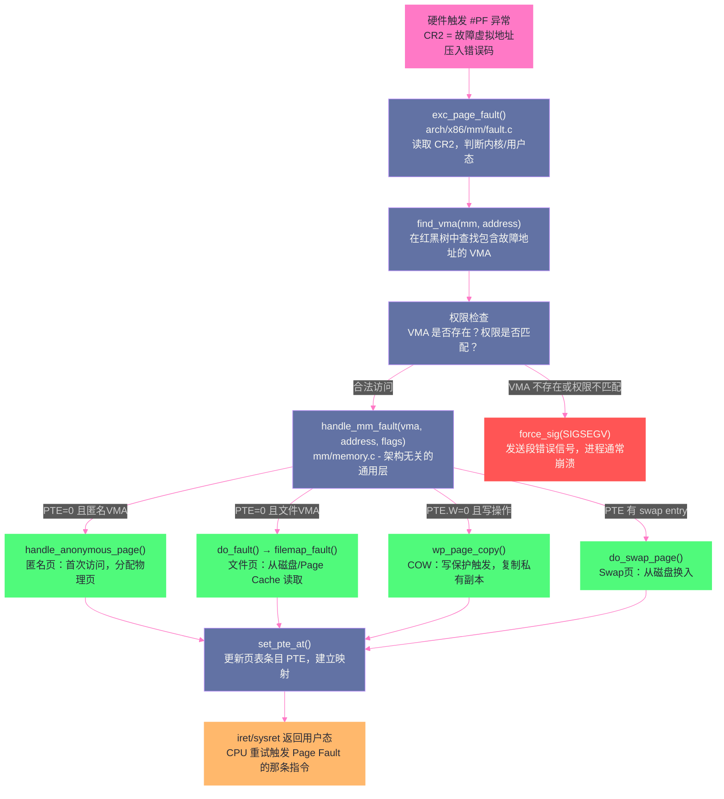

# 缺页异常：一次内存访问的完整旅程

**摘要：**

[[虚拟内存：为什么每个进程都以为自己独占内存|虚拟内存]]告诉我们，`mmap` 和 `malloc` 只是创建了 VMA（虚拟内存区域），并没有真正分配物理内存。那么物理内存究竟是在什么时候、以什么方式分配的？答案是：**缺页异常（Page Fault）触发时**。Page Fault 是整个 Linux 内存管理体系中最核心的运行时机制，几乎所有内存的"真实落地"都要经过它。本文从硬件异常触发开始，完整追踪一次内存访问的全链路：MMU 检测到无效 PTE → 硬件压栈保护现场 → 进入 `do_page_fault` → 查找 VMA 判断合法性 → 根据页类型（匿名页/文件页/COW）走不同的处理路径 → 分配物理页帧、填充内容 → 更新 PTE → 返回用户态重试指令。同时深入分析几个重要的特殊场景：零页优化、写保护错误（非 COW 的非法访问）、栈自动增长、以及 mmap 文件的 major/minor fault 区别。

---

## 第 1 章 为什么需要缺页异常

### 1.1 按需分配：推迟到最后一刻

在[[虚拟内存：为什么每个进程都以为自己独占内存|第01篇]]中，我们讲到了 Linux 的**按需分配（Demand Paging）**机制：`malloc` 或 `mmap` 调用时，内核只创建 VMA，不分配物理内存，对应的页表条目（PTE）P 位为 0（不存在）。当程序真正访问这块内存时，MMU 发现 PTE 无效，触发 Page Fault，内核才在 Page Fault 处理程序中真正分配物理页帧。

这种"懒惰策略"有几个重要的工程价值：

**价值一：消除启动延迟**。一个 JVM 进程启动时用 `-Xmx8g` 指定了 8GB 最大堆，如果在启动时就立即分配 8GB 物理内存，启动时间会增加几秒（在内存慢的机器上甚至更长）。按需分配让 JVM 几乎瞬间启动，物理内存在 GC 真正需要时才一点点分配。

**价值二：节省物理内存**。进程往往分配了比实际使用多得多的虚拟内存（尤其是 Java、Python 这类有 GC 的运行时）。按需分配确保只有真正被访问过的内存才占用物理页帧，未访问过的虚拟地址范围不消耗任何物理内存。

**价值三：支持超额分配（Overcommit）**。Linux 默认允许所有进程分配的虚拟内存总量超过物理内存（Overcommit），原因正是按需分配——内核赌大多数进程分配了内存但不会真的全部使用，物理内存在绝大多数情况下够用（通过 Swap 兜底）。这是 Linux 与 Windows 在内存管理哲学上的一个重要差异。

### 1.2 Page Fault 的三种类型

在深入处理流程之前，需要明确 Page Fault 的分类，因为不同类型对应完全不同的处理路径：

**Minor Page Fault（软缺页）**：PTE 无效，但对应的物理页**已经在内存中**，只是还没有建立映射。典型场景：
- 匿名页首次访问（物理页还没分配，需要从[[物理内存管理：Buddy System 与 Slab 分配器的设计哲学|伙伴系统]]申请一个新页）
- COW 写保护触发（物理页已存在，但需要复制一份新副本）
- 进程 fork 后子进程首次读共享页（直接建立映射即可，无需 I/O）

**Major Page Fault（硬缺页）**：PTE 无效，且对应的物理页**不在内存中**，需要从磁盘（Swap 空间或文件）读取数据进来。这是最昂贵的 Page Fault，涉及磁盘 I/O，延迟可能达到毫秒级。典型场景：
- mmap 文件后首次读取文件内容（需要从磁盘读入 [[Page Cache]]）
- 被 Swap 换出的页再次被访问（需要从 Swap 空间读回）

**Invalid Page Fault（非法访问）**：访问的虚拟地址根本不在任何 VMA 范围内，或者违反了 VMA 的权限（比如写一个只读 VMA）。这类 Page Fault 是真正的错误，内核的处理结果是向进程发送 **SIGSEGV 信号**（Segmentation Fault），通常导致进程崩溃。

了解这个分类对生产问题诊断很有用：通过 `/proc/<pid>/stat` 的 `minflt`（minor fault 次数）和 `majflt`（major fault 次数）字段，可以判断进程的内存访问模式——`majflt` 持续高企通常意味着内存压力极大，大量页面被 swap 换出再换入。

---

## 第 2 章 硬件层面：异常是如何触发的

### 2.1 MMU 的检测时刻

Page Fault 的触发发生在 CPU 执行任何涉及内存访问的指令时：`MOV`、`PUSH`、`CALL`、加载指令、存储指令……任何一条指令，只要其执行过程中需要访问一个虚拟地址，MMU 就会进行地址翻译。

MMU 的地址翻译过程（已在[[虚拟内存：为什么每个进程都以为自己独占内存|第01篇]]详细描述）：
1. 查 TLB，命中则直接得到物理地址
2. TLB 未命中，执行页表遍历（Page Table Walk）
3. 在页表遍历过程中，如果发现某级页表不存在、或最终 PTE 的 P（Present）位为 0、或访问权限不满足（比如向 W=0 的只读页写入），MMU 停止翻译，触发 **Page Fault 异常**

x86 上的 Page Fault 异常号是 **14号异常（#PF）**。

### 2.2 硬件的异常处理机制

MMU 触发 Page Fault 后，CPU 硬件做以下事情：

1. **填写 CR2 寄存器**：将触发 Page Fault 的**虚拟地址**写入 CR2 寄存器。这是内核处理 Page Fault 时最重要的输入——内核必须知道是哪个虚拟地址触发了异常。

2. **生成错误码（Error Code）**：CPU 在栈上压入一个 32 位错误码，描述这次 Page Fault 的性质：
   ```
   错误码各位含义（低3位最重要）：
   位0 (P)  : 0=页不存在（Present=0），1=权限违规（权限不满足）
   位1 (W/R): 0=读操作触发，1=写操作触发
   位2 (U/S): 0=内核态触发，1=用户态触发
   位3 (RSVD): 保留位被置位（页表项损坏，通常是严重内核bug）
   位4 (I/D): 0=数据访问，1=指令取指（执行了不可执行的页）
   ```

3. **压栈保护现场**：CPU 自动将当前 CS、RIP（下一条指令地址）、RFLAGS、SS、RSP 压入**内核栈**，确保异常处理完后可以正确返回用户态重试。

4. **切换到内核态**：CPU 从 Ring 3（用户态）切换到 Ring 0（内核态），并跳转到 IDT（中断描述符表）中第 14 号条目指向的异常处理函数入口。

整个过程是纯硬件完成的，不需要任何软件介入，速度极快（纳秒级）。

---

## 第 3 章 内核的 Page Fault 处理：全链路解析

### 3.1 入口：arch_do_page_fault 到 handle_mm_fault

x86 的 Page Fault 入口函数是 `exc_page_fault()`（新内核）或 `do_page_fault()`（老内核），位于 `arch/x86/mm/fault.c`。这个函数首先做一些架构相关的处理（比如判断是内核态还是用户态触发，读取 CR2 寄存器获取故障地址），然后调用通用的内存管理层函数 `handle_mm_fault()`。

整个调用链路如下：



### 3.2 关键步骤一：find_vma —— 合法性的第一道门

内核拿到故障虚拟地址后，第一件事是调用 `find_vma(mm, address)` 在当前进程的红黑树中查找**包含或紧跟该地址之后**的 VMA。

```c
/* mm/mmap.c（简化）*/
struct vm_area_struct *find_vma(struct mm_struct *mm, unsigned long addr)
{
    struct vm_area_struct *vma;
    
    /* 先查 per-mm 的 VMA 缓存（vmacache），命中则直接返回 */
    vma = vmacache_find(mm, addr);
    if (likely(vma))
        return vma;
    
    /* 缓存未命中，在红黑树中查找 */
    vma = rb_entry(mm->mm_rb.rb_node, struct vm_area_struct, vm_rb);
    /* ... 红黑树查找逻辑 ... */
    return vma;
}
```

`find_vma` 返回的是**起始地址 >= addr 的第一个 VMA，或者包含 addr 的 VMA**。拿到 VMA 后，内核需要验证：

1. **VMA 是否存在**：如果 `find_vma` 返回 NULL，或返回的 VMA 起始地址 > 故障地址（说明 addr 落在任何 VMA 之外的"空洞"中），这是非法访问，送 SIGSEGV。

2. **特殊情况：栈增长**：如果故障地址比找到的 VMA 起始地址小一点，且该 VMA 是栈（`VM_GROWSDOWN` 标志），内核会尝试调用 `expand_stack()` 向下扩展栈 VMA（栈是向低地址生长的）。这就是 Linux 栈**自动增长**的实现机制——不需要预先知道程序会用多大的栈，只需预留一个栈 VMA 的"上界"，内核会在栈溢出时自动扩展（直到 `ulimit -s` 设置的上限）。

3. **权限检查**：找到合法 VMA 后，检查本次访问是否符合 VMA 的权限：
   - 写操作 (`flags & FAULT_FLAG_WRITE`) 但 VMA 没有 `VM_WRITE` → SIGSEGV
   - 执行操作 (`flags & FAULT_FLAG_INSTRUCTION`) 但 VMA 没有 `VM_EXEC` → SIGSEGV（NX 位保护）
   - 用户态访问但 VMA 是内核专属区域 → SIGSEGV

> [!note] 设计哲学
> 注意这里有一个微妙的区分：`FAULT_FLAG_WRITE` 表示这次 Page Fault 是写操作触发的；而 `VM_WRITE` 是 VMA 的权限标志，表示这段虚拟地址允许写入。写操作触发 Page Fault 且 VMA 允许写，这两个条件同时满足时，才是合法的写 Page Fault（可能是 COW、也可能是匿名页首次写入）。写操作触发 Page Fault 但 VMA 不允许写，才是真正的权限错误（SIGSEGV）。

### 3.3 关键步骤二：handle_mm_fault —— 分发到各条处理路径

通过合法性检查后，`handle_mm_fault()` 根据 PTE 的当前状态，将处理分发到不同的子函数。核心逻辑（大幅简化）：

```c
vm_fault_t handle_mm_fault(struct vm_area_struct *vma, unsigned long address,
                            unsigned int flags, struct pt_regs *regs)
{
    vm_fault_t ret;
    struct vm_fault vmf = {
        .vma = vma,
        .address = address & PAGE_MASK,
        .flags = flags,
        /* ... */
    };
    
    /* 逐级遍历/创建页表节点（PGD→PUD→PMD），确保页表路径存在 */
    pgd = pgd_offset(mm, address);
    /* ... 类似地处理 PUD、PMD ... */
    
    /* 到达最终的 PTE 层，调用核心处理函数 */
    ret = handle_pte_fault(&vmf);
    return ret;
}

static vm_fault_t handle_pte_fault(struct vm_fault *vmf)
{
    pte_t entry;
    
    if (unlikely(pmd_none(*vmf->pmd))) {
        /* PMD 不存在，需要先创建 PMD 和 PTE 页表页 */
    }
    
    vmf->pte = pte_offset_map(vmf->pmd, vmf->address);
    entry = *vmf->pte;
    
    if (!pte_present(entry)) {
        /* PTE.P = 0 */
        if (pte_none(entry)) {
            /* PTE 全零：这个虚拟地址从未被分配过物理页 */
            if (vma_is_anonymous(vmf->vma))
                return do_anonymous_page(vmf);   /* 匿名页首次分配 */
            else
                return do_fault(vmf);             /* 文件页，触发 filemap_fault */
        }
        /* PTE 不为零但 P=0：说明页已被 swap 换出，PTE 里存的是 swap entry */
        return do_swap_page(vmf);
    }
    
    /* PTE.P = 1 但触发了 Page Fault：说明是写保护错误（W=0 但尝试写入）*/
    if (vmf->flags & FAULT_FLAG_WRITE) {
        if (!pte_write(entry))
            return do_wp_page(vmf);  /* 写保护：可能是 COW */
    }
    /* ... */
}
```

---

## 第 4 章 匿名页的处理：内存从哪来

### 4.1 什么是匿名页

"匿名页（Anonymous Page）"这个名字听起来有点奇怪。它的意思是：**这个物理页帧的内容不对应任何磁盘上的文件**——它是纯粹的内存，生命周期与进程相同，没有"文件后端"。

典型的匿名页：
- 进程的**堆内存**（`malloc` 分配的内存）
- 进程的**栈**（局部变量、函数调用帧）
- 通过 `mmap(MAP_ANONYMOUS | MAP_PRIVATE)` 分配的私有匿名映射

与之对应的是**文件页（File-backed Page）**：内容来自某个文件的 Page Cache，这类页可以根据文件内容重新生成（脏了就写回磁盘），不需要 Swap 即可回收。

### 4.2 do_anonymous_page：匿名页的首次分配

当一个匿名 VMA 中的虚拟地址首次被访问时，调用 `do_anonymous_page()`：

```c
static vm_fault_t do_anonymous_page(struct vm_fault *vmf)
{
    struct vm_area_struct *vma = vmf->vma;
    struct page *page;
    pte_t entry;

    /* 关键优化：如果是读操作，直接映射到"零页"，不分配真实物理页 */
    if (!(vmf->flags & FAULT_FLAG_WRITE)) {
        entry = pte_mkspecial(pfn_pte(my_zero_pfn(vmf->address),
                                       vma->vm_page_prot));
        /* 设置 PTE 指向零页，但不设置 W 位（只读映射到零页）*/
        set_pte_at(vma->vm_mm, vmf->address, vmf->pte, entry);
        return VM_FAULT_NOPAGE;  /* 不计入 minor fault 统计 */
    }

    /* 写操作触发：必须分配真实的物理页 */
    /* 从伙伴系统分配一个新的物理页帧，flags 控制分配行为 */
    page = alloc_zeroed_user_highpage_movable(vma, vmf->address);
    if (!page)
        goto oom;   /* 内存不足，触发 OOM 流程 */

    /* 将新分配的物理页加入 LRU 链表（内存回收时会用到）*/
    __lru_cache_add_inactive_or_unevictable(page, vma);

    /* 构造新的 PTE：指向新物理页，设置对应权限 */
    entry = mk_pte(page, vma->vm_page_prot);
    if (vma->vm_flags & VM_WRITE)
        entry = pte_mkwrite(pte_mkdirty(entry));  /* 设置 W=1，D=1 */
    
    /* 将新 PTE 写入页表 */
    set_pte_at(vma->vm_mm, vmf->address, vmf->pte, entry);
    
    return VM_FAULT_MINOR;  /* 计入 minor fault 统计 */
}
```

### 4.3 零页优化（Zero Page Optimization）

上面代码中有一个非常重要的优化值得深入讨论：**当匿名页首次被读（而非写）时，内核不分配真实物理页，而是把 PTE 映射到一个全局共享的"零页（Zero Page）"**。

为什么要这样做？考虑以下场景：

```c
char *buf = malloc(1024 * 1024);  // 分配 1MB
// 不做任何初始化，直接读取：
printf("%d\n", buf[0]);  // 第一次读访问
```

`malloc` 后，buf 对应的 VMA 已建立，但没有物理内存。第一次读 `buf[0]` 触发 Page Fault。如果此时去分配一个物理页，清零，建立映射，返回——这个物理页的内容是全零，和零页完全一样。这次物理页的分配完全是浪费！

零页优化：内核维护一个**全局共享的物理零页**（`ZERO_PAGE`），它永远是只读的，内容永远是全零。首次读匿名页时，直接建立 `VA → 全局零页` 的只读映射，完全不分配新物理页。

当这块内存**第一次被写入**时，写操作触发 Page Fault（因为零页是只读的，PTE W=0）。这次 Page Fault 才真正分配一个新的物理页（内容初始化为零），建立 `VA → 新物理页` 的可写映射。这个过程在原理上和 COW 完全一样。

> [!info] 核心概念：零页优化的实际影响
> 对于典型的服务器应用，这个优化效果相当显著。比如一个 JVM 进程，`-Xmx8g` 申请了 8GB 堆，但启动时只有几百 MB 的真实数据。没有零页优化，每个被读过但未写的页（比如 GC 元数据页的初始读取）都要分配一个新物理页；有了零页优化，大量只读零内存的读操作完全不消耗物理内存，只有真正写入数据的堆页才占用物理页帧。这使得 JVM 的实际内存占用（RSS）比声明的堆大小（`-Xmx`）小得多，是 Linux 内存效率极高的重要原因之一。

### 4.4 匿名页的内存设置：alloc_zeroed_user_highpage_movable

真正分配匿名页时，内核使用 `alloc_zeroed_user_highpage_movable()`，这个函数名其实精确描述了它的行为：
- `alloc`：向伙伴系统分配
- `zeroed`：分配后清零内存内容（安全要求：不能把上一个进程的数据暴露给新进程）
- `user`：用于用户态
- `highpage`：优先从 `ZONE_HIGHMEM` 分配（32位系统专有，64位无此区别）
- `movable`：从 `MIGRATE_MOVABLE` 类型分配，将来可以被内存紧缩迁移

新分配的匿名页会被立即加入 **LRU（Least Recently Used）链表**。LRU 链表是内存回收系统的基础数据结构——内核通过 LRU 判断哪些页"最不活跃"，优先回收它们（详见[[内存回收：kswapd、LRU与直接回收的博弈]]）。

---

## 第 5 章 文件页的处理：从磁盘到内存的搬运

### 5.1 文件页与 Page Cache 的关系

当程序通过 `mmap` 映射一个文件，或者通过 `read()` 系统调用读取文件时，内核不会每次都从磁盘读取——而是维护一个叫做 **[[Page Cache]]** 的全局缓存，将文件内容缓存在内存中。

对于 `mmap` 映射的文件：
- `mmap` 调用只创建 VMA，建立"虚拟地址区间 ↔ 文件区域"的映射关系，不立即读取文件
- 当程序真正访问映射地址时，触发 Page Fault
- 内核检查 Page Cache：如果文件对应的页**已在 Page Cache**（另一个进程读过这个文件），直接建立 `VA → Page Cache 页` 的映射，这是一次 **Minor Page Fault**（不需要 I/O）
- 如果文件对应的页**不在 Page Cache**（冷启动，第一次读），需要从磁盘读取到 Page Cache，这是一次 **Major Page Fault**（需要 I/O，代价高）

### 5.2 do_fault：文件页 Page Fault 的处理路径

文件页的 Page Fault 由 `do_fault()` 处理，它会进一步根据访问类型分支：

```c
static vm_fault_t do_fault(struct vm_fault *vmf)
{
    struct vm_area_struct *vma = vmf->vma;
    
    if (!(vmf->flags & FAULT_FLAG_WRITE)) {
        /* 读 Page Fault：从 Page Cache 读取文件页 */
        return do_read_fault(vmf);
    } else if (!(vma->vm_flags & VM_SHARED)) {
        /* 写 Page Fault + 私有映射（MAP_PRIVATE）：COW 语义，需要私有副本 */
        return do_cow_fault(vmf);
    } else {
        /* 写 Page Fault + 共享映射（MAP_SHARED）：直接写 Page Cache */
        return do_shared_fault(vmf);
    }
}
```

**do_read_fault** 的核心是调用 VMA 的 `vm_ops->fault()` 函数，对于普通文件映射，这最终会调用 `filemap_fault()`：

```c
vm_fault_t filemap_fault(struct vm_fault *vmf)
{
    struct file *file = vmf->vma->vm_file;
    struct address_space *mapping = file->f_mapping;
    pgoff_t offset = vmf->pgoff;  /* 文件内页偏移 */
    struct page *page;
    
    /* 在 Page Cache 中查找这个文件页 */
    page = find_get_page(mapping, offset);
    
    if (!page) {
        /* Page Cache 未命中：需要从磁盘读取（Major Fault）*/
        page = do_async_mmap_readahead(vmf, page);  /* 预读 */
        if (!page) {
            /* 同步读取：分配新页、触发磁盘 I/O、等待完成 */
            page = page_cache_alloc(mapping);
            /* 向块设备层提交读 I/O 请求，等待数据到来 */
            error = mapping->a_ops->readpage(file, page);
            wait_on_page_locked(page);  /* 阻塞等待 I/O 完成 */
        }
        ret = VM_FAULT_MAJOR;  /* 计入 major fault 统计 */
    } else {
        /* Page Cache 命中：Minor Fault，直接使用缓存页 */
        do_sync_mmap_readahead(vmf);  /* 仍然触发预读（但不阻塞）*/
        ret = VM_FAULT_MINOR;
    }
    
    /* 建立 VA → Page Cache 页 的映射 */
    vmf->page = page;
    return ret | VM_FAULT_LOCKED;
}
```

### 5.3 预读（Readahead）机制

细心的读者会注意到上面代码里有 `do_async_mmap_readahead` 和 `do_sync_mmap_readahead`——这是 Linux 的**预读（Readahead）**机制。

预读的逻辑非常朴素：程序刚刚访问了文件第 N 页，大概率接下来会访问第 N+1、N+2……页。与其等到第 N+1 页被访问时再触发 Major Fault（磁盘 I/O），不如现在就预先把后续几页读进 Page Cache，这样后续访问时直接命中 Page Cache（Minor Fault），完全避免了磁盘 I/O 等待。

Linux 的预读窗口是自适应的：
- 预读窗口初始较小（几个页），根据访问模式动态调整
- 如果确认是顺序读（每次 Page Fault 都紧跟上次），预读窗口快速扩大（最大 128KB 或更多）
- 如果发现随机读（Page Fault 地址跳跃），减小或关闭预读

这个机制让 `mmap` 顺序读文件的性能接近 `read()` 全缓冲读，而随机读时避免了无谓的预读浪费内存带宽。

---

## 第 6 章 COW（写时复制）Page Fault：最精妙的路径

### 6.1 回顾 COW 的触发场景

[[虚拟内存：为什么每个进程都以为自己独占内存|第01篇]]已经介绍了 COW 的概念：`fork()` 之后，父子进程共享物理页，但 PTE 的 W 位被清零（变成只读）。当任意一方尝试写这块内存时，触发写保护型 Page Fault，内核识别为 COW 事件，分配新物理页并复制，然后更新写方的 PTE 指向新页。

除了 `fork()`，以下场景也会触发 COW：
- `mmap(MAP_PRIVATE)` 映射文件后发生写操作（私有文件映射需要私有副本）
- 匿名页第一次读（映射到零页，只读）然后发生写操作（需要从零页复制出私有副本）

### 6.2 do_wp_page：写保护 Page Fault 的处理

写操作触发 Page Fault（PTE 存在但 W=0）时，调用 `do_wp_page()`（Write Protect Page）：

```c
static vm_fault_t do_wp_page(struct vm_fault *vmf)
{
    struct vm_area_struct *vma = vmf->vma;
    
    /* 获取当前 PTE 指向的物理页 */
    old_page = vm_normal_page(vma, vmf->address, vmf->orig_pte);
    
    /* 检查是否只有一个引用者（引用计数是否为1）*/
    if (reuse_swap_page(old_page, NULL)) {
        /* 只有这一个映射，不需要复制，直接提升为可写 */
        /* （例如 fork 后子进程立即 exec 了，父进程对共享页发起写，
           此时子进程页表已指向新地址空间，引用计数已降为1）*/
        wp_page_reuse(vmf);
        return VM_FAULT_WRITE;
    }
    
    /* 引用计数 > 1，需要 COW：复制物理页内容到新页 */
    return wp_page_copy(vmf);
}

static vm_fault_t wp_page_copy(struct vm_fault *vmf)
{
    struct vm_area_struct *vma = vmf->vma;
    struct page *old_page = vmf->page;
    struct page *new_page = NULL;
    
    /* 分配一个新的物理页帧 */
    new_page = alloc_page_vma(GFP_HIGHUSER_MOVABLE, vma, vmf->address);
    if (!new_page)
        goto oom;
    
    /* 将原物理页的内容完整复制到新页 */
    cow_user_page(new_page, old_page, vmf);
    
    /* 构造新的 PTE，指向新物理页，恢复 W=1 */
    new_pte = mk_pte(new_page, vma->vm_page_prot);
    new_pte = pte_mkwrite(pte_mkdirty(new_pte));
    
    /* 更新页表，让这个虚拟地址指向新的私有物理页 */
    set_pte_at_notify(vma->vm_mm, vmf->address, vmf->pte, new_pte);
    
    /* 将新页加入 LRU 链表 */
    lru_cache_add_inactive_or_unevictable(new_page, vma);
    
    /* 减少旧页的 mapcount（引用它的 PTE 减少了一个）*/
    page_remove_rmap(old_page, false);
    put_page(old_page);
    
    return VM_FAULT_WRITE;
}
```

COW 的精妙之处在于 `reuse_swap_page` 的判断：如果物理页的 `_mapcount`（有多少 PTE 映射了这个页）已经降为 1（只有当前进程在用），那就不必复制，直接把这个页变成可写的就行——这个优化在 `fork()` + `exec()` 的场景下很常见，exec 后子进程丢弃了父进程的所有页表，很多共享页的引用计数已经降为 1。

### 6.3 区分 COW 和真正的权限错误

内核如何区分"写保护 Page Fault 是 COW"还是"真正的权限错误（应该发送 SIGSEGV）"？

答案在于 VMA 的权限：
- 如果 `vma->vm_flags` 有 `VM_WRITE`（VMA 本来就允许写），但 PTE W=0（暂时设为只读是为了 COW），这是 COW 场景，正常处理
- 如果 `vma->vm_flags` 没有 `VM_WRITE`（VMA 本来就不可写，比如 mmap 了一个只读文件的区域），写操作触发 Page Fault 后，发现 VMA 根本不允许写，SIGSEGV

这个判断发生在更早的权限检查阶段（`find_vma` 之后），所以 `do_wp_page` 到达时，已经确认 VMA 允许写，到这里就一定是 COW 场景了。

---

## 第 7 章 Swap 页的处理：从磁盘换回内存

### 7.1 Swap Entry：PTE 里藏着的秘密

当内存紧张时，内核的 kswapd 会把不活跃的物理页换出到 [[Swap机制|Swap 空间]]（磁盘），并把对应的 PTE P 位清零（Present=0）。但清零 PTE 之前，内核会把 Swap 的位置信息（Swap 设备号 + 页槽位置）编码进 PTE，这个非零但 P=0 的 PTE 叫做 **Swap Entry**。

Swap Entry 的格式（x86-64）：
```
位63（符号位）: 0（确保不是合法虚拟地址格式）
位11-1: swap type（使用哪个 swap 设备，最多 32 个）
位61-12: swap offset（在 swap 设备中的页号）
位0 (P): 0（表示不 Present，是 swap entry 的关键标志）
```

当程序再次访问被换出的页时：
1. MMU 看到 PTE.P=0，触发 Page Fault
2. 内核在 `handle_pte_fault` 中发现 PTE 不为零但 P=0，识别为 Swap Entry
3. 调用 `do_swap_page()` 处理

### 7.2 do_swap_page：从磁盘换回内存

```c
static vm_fault_t do_swap_page(struct vm_fault *vmf)
{
    struct vm_area_struct *vma = vmf->vma;
    swp_entry_t entry;       /* 解码后的 swap entry */
    struct page *page = NULL;
    vm_fault_t ret = 0;
    
    /* 从 PTE 中解码 swap entry */
    entry = pte_to_swp_entry(vmf->orig_pte);
    
    /* 先查 swap cache：如果另一个进程已经把这页换回来了，
       swap cache 中可能已经有这页的内容 */
    page = lookup_swap_cache(entry, vma, vmf->address);
    
    if (!page) {
        /* Swap cache 未命中：必须从磁盘读取（Major Fault）*/
        page = swapin_readahead(entry, GFP_HIGHUSER_MOVABLE, vmf);
        if (!page)
            goto out_page;  /* I/O 失败 */
        ret = VM_FAULT_MAJOR;
    }
    
    /* 等待页面 I/O 完成（页可能已在 I/O 中）*/
    wait_on_page_locked(page);
    
    /* 构造新的 PTE，指向换回来的物理页 */
    pte = mk_pte(page, vma->vm_page_prot);
    if ((vmf->flags & FAULT_FLAG_WRITE) && reuse_swap_page(page, NULL)) {
        pte = pte_mkwrite(pte_mkdirty(pte));
        vmf->flags &= ~FAULT_FLAG_WRITE;
    }
    
    /* 更新页表，替换 swap entry 为真实的 PTE */
    set_pte_at(vma->vm_mm, vmf->address, vmf->pte, pte);
    
    /* 如果 swap 引用计数降为 0，释放 swap 空间 */
    swap_free(entry);
    
    return ret;
}
```

Swap 换入是所有 Page Fault 类型中代价最高的。磁盘随机读的延迟是内存访问的 10 万倍级别（NVMe SSD 约 100μs，机械硬盘约 10ms，而内存约 100ns）。`majflt` 计数持续升高，是系统内存严重不足、开始大量 Swap I/O 的强烈信号。

---

## 第 8 章 Page Fault 的完整时序与性能数据

### 8.1 各类型 Page Fault 的典型延迟

| Page Fault 类型 | 触发场景 | 典型延迟 | 主要开销 |
|---------------|---------|---------|---------|
| Minor（匿名页，零页读）| malloc 后首次读 | < 1μs | VMA 查找、PTE 设置 |
| Minor（匿名页，写触发分配）| malloc 后首次写 | 1~5μs | 伙伴系统分配页帧、清零 |
| Minor（COW）| fork 后子进程写 | 2~10μs | 页内容复制（4KB memcpy）|
| Minor（文件页 Page Cache 命中）| mmap 文件，Page Cache 已有 | 1~3μs | 建立 PTE 映射 |
| Major（文件页 Page Cache 未命中，SSD）| mmap 文件首次读 | 100μs~1ms | NVMe I/O |
| Major（文件页 Page Cache 未命中，HDD）| mmap 文件首次读 | 5ms~20ms | 机械盘 I/O |
| Major（Swap 换入，SSD）| 被换出的页重新访问 | 100μs~1ms | NVMe I/O |
| Major（Swap 换入，HDD）| 被换出的页重新访问 | 10ms~50ms | 机械盘随机 I/O |

> [!warning] 生产避坑
> Major Page Fault 在延迟敏感型服务（如 API 服务、实时报表）上是性能杀手。一次 Major Fault 的延迟（毫秒级）可能超过正常请求的处理时间（微秒级）。监控方法：通过 `perf stat -e major-faults,minor-faults ./your_program` 可以直接统计程序运行期间的 Major/Minor Fault 次数；通过 `sar -B 1` 可以按秒查看系统级别的 pgfault（minor）和 pgmajfault（major）速率。如果 pgmajfault 持续 > 0，必须重视。

### 8.2 mlock：锁定内存，禁止 Page Fault 和 Swap

对于对延迟极度敏感的场景（高频交易、实时音频处理等），可以用 `mlock()` 系统调用**锁定一段内存**，告诉内核这些页不能被换出或回收：

```c
/* 将当前进程的所有内存锁定，禁止换出 */
mlockall(MCL_CURRENT | MCL_FUTURE);

/* 或者只锁定特定区域 */
mlock(addr, length);
```

`mlock` 的效果：
- 锁定区域内的所有页必须在物理内存中（内核保证不换出）
- 对锁定区域内未访问的页，内核会立即触发 Page Fault 把它们分配和预热（而不是等到程序访问时再 fault）
- 需要 `CAP_IPC_LOCK` 权限（或者 `ulimit -l` 允许足够的锁定内存量）

> [!warning] 生产避坑
> JVM 有一个对应的 JVM 参数：`-XX:+AlwaysPreTouch`，它在 JVM 启动时对所有堆内存做一次写操作（`memset`），提前分配所有物理页，避免运行时的匿名页分配 Page Fault。代价是 JVM 启动变慢（正比于 `-Xmx` 大小），但运行时的 GC 暂停更稳定（不会因为大量 Page Fault 造成 STW 延长）。这是大堆 Java 服务（尤其是低延迟场景）的标准配置之一。

---

## 第 9 章 总结

Page Fault 是 Linux 内存管理运转的"发动机"——它连接了虚拟内存的承诺与物理内存的兑现，是按需分配、COW、Swap 等所有高级机制的实际执行者。

本文的核心认知链路：

**1. 硬件触发，软件处理**：MMU 检测到无效 PTE 自动触发 #PF 异常，CPU 压栈保护现场并跳转到内核处理程序。CR2 寄存器记录故障地址，错误码描述访问类型。

**2. VMA 是合法性的第一道防线**：`find_vma` 查找对应 VMA，不在 VMA 范围内或权限不符则立即 SIGSEGV；在 VMA 范围内的才进入物理内存分配流程。

**3. 四条处理路径**：
- **匿名页（首次读）** → 映射到全局零页，不分配物理内存（零页优化）
- **匿名页（首次写）** → 伙伴系统分配新页，清零，建立映射
- **文件页** → 查 Page Cache，命中则建立映射（Minor Fault），未命中则磁盘 I/O（Major Fault）
- **COW** → 分配新页，复制内容，更新 PTE（`fork`/私有映射写时触发）
- **Swap 换入** → 从磁盘读回，更新 PTE（最昂贵的路径）

**4. 性能感知**：Minor Fault 开销微小（微秒级），Major Fault（文件页冷启动或 Swap 换入）开销巨大（毫秒级）。监控 `majflt` 是判断内存压力的核心指标。

理解了物理内存是如何被按需分配的，接下来我们要深入探讨一个重要问题：Linux 为什么要用大量内存来缓存磁盘上的文件？这就是[[Page Cache：Linux 为什么要用内存来缓存磁盘]]将要回答的核心问题。

---

## 参考资料

- Robert Love, *Linux Kernel Development, 3rd Edition*, Chapter 15: The Process Address Space
- Mel Gorman, *Understanding the Linux Virtual Memory Manager*, Chapter 9: Page Fault Handling
- Daniel P. Bovet & Marco Cesati, *Understanding the Linux Kernel, 3rd Ed.*, Chapter 9: Page Fault Exception Handler
- Linux Kernel Source: `mm/memory.c` (`handle_mm_fault`, `do_anonymous_page`, `do_fault`, `do_swap_page`)
- Linux Kernel Source: `arch/x86/mm/fault.c` (`exc_page_fault`)
- Ulrich Drepper, *What Every Programmer Should Know About Memory*, Section 3: Virtual Memory
