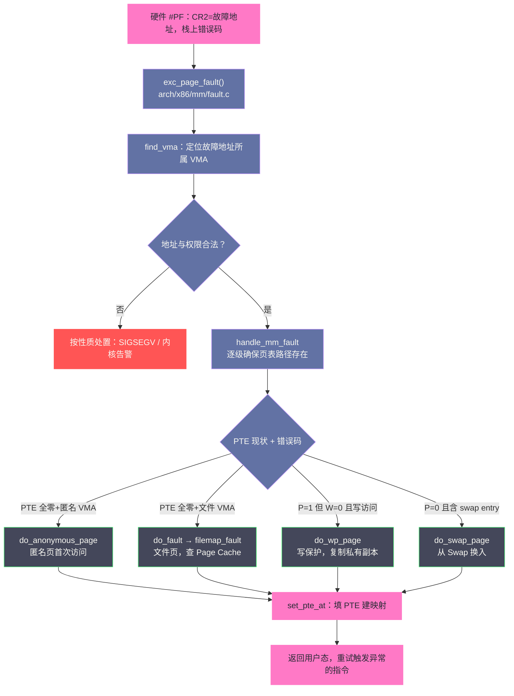

# 缺页异常：一次内存访问的完整旅程

**摘要：**

前两篇分别交代了"进程看到的地址世界"与"物理页帧的管理制度"，本文要讲的是两者相遇的现场——**缺页异常（Page Fault）**。它是 Linux 内存体系中最忙碌的运行时机制：mmap 画出的空头支票在它手里兑现，fork 的写时复制在它手里触发，Page Cache 的命中与穿透由它判定，Swap 换出的页面靠它请回，就连段错误（SIGSEGV）也是它发出的最后通牒。本文以一次内存访问为线索完整走完全程：先看硬件层——MMU 如何在翻译失败的瞬间抛出 14 号异常、CR2 与错误码如何把现场信息递给内核；再看内核层——合法性审查（VMA 查找、栈自动增长、权限核对）如何把"事故"分诊成合法请求或段错误；随后深入四条处理路径：匿名页的零页优化与首次写、文件页的 Page Cache 命中与预读、COW 的私有副本、Swap 页的换入；最后落到用户态视角——minflt 与 majflt 的统计含义、哪些场景下缺页会变成性能事故，以及 dmesg 里一段 segfault 日志的完整解读方法。读完全文你应当能回答两个问题：物理内存的"兑现"为什么必须以异常的形式发生，以及当生产环境出现缺页相关的异常与性能问题时，如何按图索骥。

---

## 第 1 章 兑现时刻：缺页异常为什么必须存在

### 1.1 三个角色等一个机制

把前两篇的结论摆在桌面上，会看到三个角色共同等着一个机制。**VMA** 记录承诺：mmap 已声明"这 1GB 地址归你"；**页表**记录兑现：只有真正分配过物理页的条目才有效，其余 P 位为 0；**物理页帧**是稀缺资源：由伙伴系统管理，不能浪费在没人用的地址上。三者之间的空隙——承诺已立、兑现未至的状态——需要一个事件来弥合：当 CPU 的指针落在一个 P 位为 0 的虚拟页上时，翻译失败，硬件抛出异常，内核入场补票。这个事件就是缺页异常，这套"先承诺、后兑现"的机制叫**按需分配（Demand Paging）**。

打个比方：VMA 是酒店的前台预订系统，页表是客房门锁的授权名单，物理页是真实的房间。预订（malloc）可以瞬间完成，但房间是客人真正到店（第一次访问内存）时才打扫、才发卡。缺页异常就是"客人到店"这个事件本身——它是预订系统与真实房间之间唯一的桥梁。

这种设计买到了三样东西。**启动速度**：JVM 用 `-Xmx8g` 预约 8GB 堆，启动耗时不会因此多一秒；**物理内存效率**：申请了而没访问的地址不占页帧，"多申请少使用"的应用模式不再造成浪费；**超额提交（Overcommit）**：既然兑现是逐页的，内核就敢让全体进程的承诺总量超过物理内存——这是 Linux 与很多其他操作系统的哲学分野，它赌的是"多数人不会用满"，赌输时的代价由 [[07 OOM Killer：内存耗尽时内核如何做出生死抉择|OOM Killer]] 承担。

还要回答一个更根本的问题：**兑现为什么要以"异常"的形式发生，而不是内核主动盯着？**答案是"主动"在工程上不存在。内存访问发生在每条指令之间，内核若是主动方，就要么逐指令插桩（开销不可承受），要么预测访问（不可能准确）；而硬件的地址翻译天然处于每个访存的必经之路上——让翻译失败这个"必然出现的错误"充当触发器，是最便宜也最准确的兑现时机。异常在这里的角色不是"出错"，而是**硬件与软件之间约定好的控制权交接点**：用户态无法自行调用内核（没有机会），但访存失败天然把控制权交到内核手里。理解了这一点，就理解了为什么从按需分页到 COW 再到 userfaultfd，所有内存机制都长在异常的骨架上。

### 1.2 三类缺页：同一名目下的三种性质

不是所有缺页都是一回事。按"PTE 无效背后的原因"分类，缺页异常分三种性质，处理代价天差地别：

| 类型 | 触发条件 | 典型场景 | 代价量级 |
|------|---------|---------|---------|
| Minor（软缺页） | 页在内存里，只是还没建映射 | fork 后子进程首次触碰共享页、COW 复制 | 微秒级，纯 CPU 操作 |
| Major（硬缺页） | 页不在内存，要从磁盘读入 | mmap 冷文件首次读、被换出的页回访 | 毫秒级，含磁盘 I/O |
| Invalid（非法） | 地址不在任何 VMA 内或权限不符 | 空指针、写只读段、执行数据页 | 直接 SIGSEGV |

Minor 与 Major 的分野在监控里直接可见：`/proc/<pid>/stat` 的 minflt 与 majflt 两个字段分别累计两者的次数，`ps -o minflt,majflt` 随时可看。**majflt 持续增长几乎总是坏消息**——它意味着进程在反复等待磁盘来兑现内存，要么是文件访问太冷，要么是页面被回收与换出的速度赶上了使用的速度。第三类则根本不是"请求"，而是"罪证"：内核的分诊会直接终结它，第 6 章专门讲如何从现场日志鉴别它的成因。还有一点让分类更立体：三类之间可以转化——同一个虚拟页，冷启动时是 Major（从磁盘读入），回访时是 Minor（缓存命中），被换出后再回访又变回 Major；**类别是访问历史的函数，不是地址的固有属性**。

> [!note] 设计哲学
> 三类缺页共用同一个入口、同一套硬件检测，却在内核里被彻底分流——这是"机制与策略分离"的又一次亮相：硬件只负责"翻译失败"这个中性事实，如何解读这个事实（补票、搬运还是处决）完全由软件决定。也正因为入口统一，内核才能用一个异常号支撑起从纳秒级零页映射到毫秒级磁盘换入的巨大成本跨度。

### 1.3 一场缺页的时间线：从纳秒到毫秒

在展开细节前，先把全程的"时间账"摆出来，后文每一步都能对号入座：

| 阶段 | 动作 | 典型耗时 | 成本来源 |
|------|------|---------|---------|
| 硬件检测 | MMU 翻译失败，抛 #PF | 纳秒级 | 纯硬件 |
| 现场保护与切入内核 | 压栈、切栈、跳 IDT | 亚微秒 | 上下文切换固定成本 |
| 合法性审查 | find_vma + 权限核对 | 亚微秒 | 内存内查找 |
| 快路径兑现 | 零页映射 / Page Cache 命中建映射 | 微秒级 | 填页表 + TLB 刷新 |
| COW 复制 | 分配新页 + 复制 4KB | 数微秒 | 内存拷贝 |
| 慢路径兑现 | 磁盘读入（文件页/Swap 页） | 0.1-10 毫秒 | 块设备 I/O |

这张表的真正信息量在于跨度：最便宜与最贵的缺页相差**五个数量级**，而它们在用户态看是同一个事件。所以"系统缺页率高吗"是个没有意义的问题，"哪一类缺页、以什么速率"才是——这个立场在第 5 章的观测方法里会反复用到。

时间线还暗示了优化的分层策略。纳秒与亚微秒层的成本（硬件、入口、审查）属于内核与硬件工程师的战场，应用层无力也无需干预；微秒层的成本（零页、COW、映射）取决于应用的分配与 fork 模式，架构评审时值得过一遍；毫秒层的成本（磁盘读入）则是运维与容量规划的主战场，预热、驻留、限流都在这一层发力。**把优化火力对准自己能动的最高成本层**，是面对这张时间线时最不浪费的打法。

---

## 第 2 章 硬件层：异常诞生的 0.1 微秒

### 2.1 MMU 的检测时刻

缺页的起点平淡无奇：任何一条访存指令——MOV、PUSH、CALL、取指——只要它访问的虚拟地址在翻译时出问题，MMU 就停止工作。具体来说，页表遍历途中若发现某级页表条目不存在、最终 PTE 的 P 位为 0、或者权限位与本次访问冲突（譬如向 W=0 的页写入），MMU 当场放弃翻译并触发 x86 的 **14 号异常（#PF, Page Fault）**。注意检测与"TLB 未命中"的区别：TLB 未命中只是缓存没货，遍历页表多半能解决；#PF 是遍历本身得出了"此路不通"的结论。

### 2.2 硬件交给内核的三件现场物证

异常触发到内核接管之间是纯硬件动作，速度在纳秒量级。硬件留下三样"现场物证"：

- **CR2 寄存器**：写入触发异常的虚拟地址。这是内核处理缺页最重要的输入——不知道是哪个地址出了问题，后面一切无从谈起。
- **错误码（Error Code）**：压入栈上的 32 位值，低几位浓缩了本次异常的性质：

  ```
  位 0（P）  ：0 = 页不存在；1 = 页存在但权限不满足
  位 1（W/R）：1 = 写操作触发；0 = 读操作触发
  位 2（U/S）：1 = 用户态触发；0 = 内核态触发
  位 3（RSVD）：保留位被写 1，意味着页表项损坏，几乎必然是内核 bug
  位 4（I/D） ：1 = 取指触发（执行了不可执行的页）
  ```

- **保护现场**：CS、RIP、RFLAGS、SS、RSP 等寄存器压入内核栈，随后 CPU 切到内核态，按中断描述符表（IDT）第 14 号条目跳入内核处理函数。被中断的那条指令"原地待命"——处理完成后 CPU 会**重新执行它**，这是整个机制的精妙之处：用户程序对刚才发生的一切毫无感知，它只是发现"这条指令多花了一点时间"。

> [!info] 错误码是"事故简报"，越早学会读它越好
> 位 0 与位 1 的组合已经能预判处理路径：P=0 意味着"页不在"，大概率走按需分配（零页、文件页或 Swap 换入）；P=1 且 W=1 意味着"页在但不让写"，大概率是 COW。内核拿到错误码的第一件事就是据此分流，我们在第 4 章会看到这个分流如何落实。

### 2.3 从 IDT 到 C 函数：进入内核的完整一跳

"跳入 IDT 第 14 号条目"这个动作值得拆开，因为它是理解所有内核异常入口的模板。IDT（Interrupt Descriptor Table）由内核在启动时登记，14 号槽位挂的不是 C 函数而是一段汇编存根（stub）：它先按异常是否压了错误码调整栈对齐，把通用寄存器按 `pt_regs` 的内存布局逐个压栈——这份"手工排版"的寄存器快照随后以 C 结构体的形式传遍整个异常处理链，最后在返回时原样弹回。压栈顺序与结构体字段顺序严格对应，这种"汇编与 C 的接缝"是内核代码里最讲究对齐的地方之一。

存根随后调用 C 层入口 `exc_page_fault()`（老内核名 do_page_fault），它做的第一件事是分辩**这次异常来自用户态还是内核态**（错误码位 2）——两者走完全不同的审查逻辑。从这里开始，代码脱离架构细节，进入通用内存管理层（mm/ 目录），fault 处理的主体逻辑得以在 x86、ARM、RISC-V 之间共享：**架构相关层负责"把现场翻译成标准结构"，通用层负责"决定怎么办"**——又是分层。

这条接缝上还有一段值得敬佩的工程纪律：异常处理的入口代码运行在"内核尚未完全就绪"的微妙环境里——内核栈可能刚切换、部分寄存器语义随微架构版本而异、 speculate（推测执行）带来的安全加固（如 KPTI 的切换）也要在这里完成。因此内核对这段代码有不成文的规矩：能不做的事就不做，尽快把控制权交给 C 层。读内核源码时若发现异常入口附近密密麻麻的汇编与条件分支，那不是风格问题，而是这段代码必须同时对"正确、快速、安全"三个约束负责。

### 2.4 内核态也会缺页：异常表与 fixup

缺页不只是用户态的遭遇，内核自己也可能踩到：最常见的是 `copy_from_user` 这类"把用户态数据搬进内核"的操作——用户态传入的指针可能是坏的、指向未映射区域甚至指向内核区域。内核不会事先逐页验证这些指针（太慢），而是**直接访问，让缺页异常来做校验**：内核在编译期把所有"可能踩空"的访问指令登记进一张异常表（exception table），每条指令配上一个修复点（fixup）；若异常确实发生且 fault 地址恰来自用户指针访问，处理函数查表发现"这是登记过的冒险"，就跳到修复点——`copy_from_user` 返回"未复制的字节数"，调用者从容处理错误。

这套设计把"防御性编程"从运行时检查改成了**异常驱动的乐观路径**：正常情况零开销，异常情况有表可查。它与用户态的"先判断再访问"哲学相反，却更快——因为内核假设用户传来的指针绝大多数是好的。顺带一提，内核态访问自身数据结构时若出现非法地址（譬如踩了已释放的页表），异常表帮不上忙，等待它的是 kernel oops——这也解释了为什么 dmesg 里内核崩溃总是伴随着一条 fault 信息：**同样的硬件机制，既给用户进程当补票员，也给内核自己当验票员**。

---

## 第 3 章 内核层：分诊台上的合法性审查

### 3.1 全景路线图

进入内核后的处理链路如下图——先审查、后分诊、再处理、最后返回重试：



### 3.2 find_vma：先确认"这里是不是你的地盘"

内核拿到的第一个问题是合法性的地理问题：故障地址落在本进程地址空间的哪个 VMA 里？`find_vma(mm, addr)` 在按地址组织的 VMA 索引中查找，返回起始地址大于等于 addr 的第一个 VMA（或恰好包含 addr 的那个）。这个查找在缺页热路径上每秒可能执行百万次，数据结构因此持续演进：从红黑树到 6.1 内核的 **maple tree**（为"大量动态区间"优化的 RCU 友好结构），再到前置的 vmacache 小缓存（进程的访存高度局部，同一 VMA 往往连续命中）。

查到 VMA 之后是三连问：**存在吗**——若返回的 VMA 起始地址高于故障地址，说明 addr 落在 VMA 之间的空洞里，非法；**权限对吗**——写访问撞上只读 VMA、执行访问撞上不可执行的 VMA，均属非法，送 SIGSEGV；**要不要特殊放行**——最典型的是栈自动增长：故障地址若恰好紧贴在栈 VMA（VM_GROWSDOWN）的下缘之下，内核不判死刑，而是把栈 VMA 的下界往下扩一段，然后在 `RLIMIT_STACK`（默认 8MB）处封顶。程序从来没有"申请过栈"，栈却在需要时一页一页长出来——这就是按需分配在地址空间边界上的延续。

```c
/* mm/memory.c（简化）：审查三连问的代码形态 */
vma = find_vma(mm, address);          /* maple tree / vmacache 查找 */
if (unlikely(!vma || address < vma->vm_start)) {
    if (expand_stack(vma, address))   /* 贴着栈下缘？尝试扩展 */
        goto bad_area;                /* 扩不动（超 RLIMIT）或无 VMA */
}
if (unlikely(access_error(error_code, vma)))
    goto bad_area;                    /* 权限不匹配：SIGSEGV 等着 */
```

这段审查代码的运行频率值得体会：它是每秒百万次级的热路径，任何一次多余的锁操作或缓存未命中都会被放大成全局开销。内核为它做的优化——vmacache 单项缓存、maple tree 的无锁读、访问位（access error）的位运算判定——全是"热路径上没有小事"的具体注脚，与第 2 篇分配器的优化思路一脉相承。

> [!warning] 生产避坑：栈增长不是无限的善举
> 自动增长依赖"故障地址与栈 VMA 足够近"的启发式判定，目的在于放行正常的函数调用压栈，而不是放行野指针——事实上，距离栈太远（老内核以 64KB 附近为经验界限的启发式判断）的"疑似压栈"会直接按非法处理。生产上一个经典事故组合是：深递归把 8MB 栈打满，栈增长的封顶让下一次压栈变成 SIGSEGV，而进程通常没有为栈溢出准备信号处理，崩溃现场只剩一段 error 码。排查"莫名崩溃且崩溃点在函数序言（push 指令）附近"时，第一反应应当是递归过深或栈帧过大，而不是内存损坏。
>
> 与栈增长配套还有一道安全栅栏：栈与相邻 VMA 之间保留了一段不可访问的间隙（guard gap），野指针哪怕越过了栈顶也不会顺滑地长进别人的地盘。历史上这道栅栏的宽度与相邻 mmap 的布局多次交锋（ CVE 相关的栈冲突攻击迫使内核加宽了间隙），理解它的存在有助于解释一个现象：把栈打满的崩溃点，有时并非压栈指令本身，而是对"贴着栈的下一块区域"的访问。

### 3.3 handle_mm_fault：从地址到路径的分诊

合法性通过后，`handle_mm_fault` 进入分诊。它先逐级检查并补建 PGD、PUD、PMD 各级页表节点（缺页不仅是"页"缺，中间层结构也可能缺），随后在 PTE 层根据两个信息源完成分流——**PTE 的当前状态**与**错误码**：

```c
/* mm/memory.c（简化）：PTE 层的分诊逻辑 */
static vm_fault_t handle_pte_fault(struct vm_fault *vmf)
{
    pte_t entry = vmf->orig_pte;      /* fault 发生时的 PTE 快照 */

    if (pte_none(entry)) {            /* PTE 全零：从未分配 */
        if (vma_is_anonymous(vmf->vma))
            return do_anonymous_page(vmf);  /* 匿名页：零页/真分配 */
        else
            return do_fault(vmf);           /* 文件页：查 Page Cache */
    }
    if (!pte_present(entry))          /* P=0 但 PTE 非零：藏有 swap entry */
        return do_swap_page(vmf);

    if (vmf->flags & FAULT_FLAG_WRITE) {
        if (!pte_write(entry))
            return do_wp_page(vmf);   /* P=1、W=0、写访问：COW 或越权 */
        entry = pte_mkdirty(entry);   /* 合法写：顺手置脏 */
    }
    /* ... */
}
```

三个分支的判定全部基于"PTE 现状 + 本次访问意图"两个因子，没有第三种信息源——分诊的全部智慧浓缩在两三个位测试里。

- PTE 全零（P=0 且从未有过映射）：按 VMA 类型分流——匿名 VMA 走 `do_anonymous_page`，文件 VMA 走 `do_fault`；
- PTE 非零但 P=0：页曾存在、已被换出，PTE 里藏着一个 swap entry，走 `do_swap_page`；
- PTE 在内存但 W=0 且本次是写访问：写保护路径 `do_wp_page`，大概率是 COW。

一个容易混淆的细节值得点破：**FAULT_FLAG_WRITE 与 VM_WRITE 不是一回事**。前者来自错误码，说的是"这次访问是写"；后者来自 VMA，说的是"这段地址允许写"。两者同时成立才是合法的写缺页；前者成立而后者不成立，就是真的越权，进程会收到 SIGSEGV。分诊台的分寸感全在这一对标志的交叉验证里。

### 3.4 重试的艺术：VM_FAULT_RETRY 与可中断的缺页

分诊结果并不总是"当场解决"。处理路径若需要做慢速 I/O（读文件页、Swap 换入），早期内核会让线程持着 mmap_lock 睡眠等待——持有大锁睡在磁盘上，等于让进程内所有并发访存都陪着等待，这是多线程性能的经典杀手。2010 年前后的重构引入了**可重试语义**：慢路径先原子地解除映射判断（或放弃锁）、发起异步 I/O，返回 `VM_FAULT_RETRY` 告诉入口"这次没办成"；入口配合 `FAULT_FLAG_ALLOW_RETRY` 标志释放 mmap_lock 睡眠等待 I/O，完成后**从头再走一遍 fault 流程**——此时数据多半已进 Page Cache，第二趟走的是快路径。

"失败后重跑"看似浪费，实则是一笔精心计算的交易：**用一次廉价的重复审查，换取 mmap_lock 在慢速 I/O 期间不被持有**。这个机制还有一个意外的受益者——主动内存回收：管理工具可以对进程地址发起"回收并等待缺页"的惰性操作（配合 userfaultfd 或 reclaim hints），其可行性正是建立在 fault 可重试、可并发的基础上。从这一节回看第 1 篇的"承诺与兑现"模型，可以再加一行注脚：兑现这个动作本身，也要为并发而让路。

---

## 第 4 章 四条路径：内存兑现的四种方式

### 4.1 匿名页：零页的精打细算

匿名页（Anonymous Page）是"没有文件后端"的页——堆、栈、`MAP_ANONYMOUS` 的私有映射都是它，其内容只属于进程、生命周期与进程一致。它的首次访问处理里藏着 Linux 最漂亮的一个优化：**零页（Zero Page）**。

设想 `malloc(1MB)` 之后程序先读后写。第一次读时，内核本来要分配一个物理页、清零、建映射——但这个页的内容注定是全零，而全零这件事有一个全局共享的样板：内核维护着一个所有进程共用的物理零页，永远只读、永远是零。首次读匿名页，PTE 直接指向零页，**一次物理分配都省下了**。直到第一次写，只读的零页映射触发写保护缺页，内核才分配真实页、复制"全零"内容、翻转 PTE 为可写。这个流程在机制上与 COW 完全同构——零页相当于"所有进程共享的最后一份母本"。

这个优化的收益面比直觉大。glibc 的 calloc、BSS 段、运行时的初始化数组、各类"分配了但还没填"的缓冲区，都先落在零页上；JVM 的堆预热阶段、数据库的缓冲池初始化，大量页面在真正写入前只消耗一个 PTE 而不是一个页帧。判断一个进程有没有吃到这份红利也简单：`/proc/pid/smaps` 中匿名区域的 `Private_Dirty` 远小于 `Rss` 时，零页共享正在生效。

一个最小实验能把零页从概念变成手感：

```c
#include <stdio.h>
#include <stdlib.h>
#include <string.h>

int main(void)
{
    /* calloc 1GB：若 calloc 内部对全零页有专门处理，RSS 几乎不涨 */
    size_t n = 1UL << 30;
    char *p = calloc(1, n);
    printf("after calloc : RSS 看起来远小于 1GB\n");  /* 空闲页栈上多为零页 */
    getchar();

    memset(p, 1, n);                  /* 全量写入：1GB 物理内存此刻才真实到位 */
    printf("after memset  : RSS ≈ 1GB\n");
    getchar();
    return 0;
}
```

实验里"calloc 后 RSS 很小"有两层机制的叠加——calloc 对"明显是全零"的申请直接映射零页，即便退化为普通 malloc 路径，也至少吃到按需分页的红利。观察工具用 `ps -o rss` 或 `/proc/pid/status` 的 VmRSS 即可，两个 getchar 之间的差值就是"兑现"的直观刻度。

反模式也顺带立此存照：**"分配后立刻 memset 清零"的防御性写法**会把零页、按需分页的红利一次性烧光——分配 1GB 立刻写满 1GB，RSS 当场到位，等效于强制预分配。写这个 memset 的人通常担心"内存不够早死早好"，但正确的早死机制是 overcommit 策略（`/proc/sys/vm/overcommit_memory=2`）而不是自我阉割延迟分配。**把"要不要预留"的决策交给系统参数，把"何时使用"留给真实负载**，两层职责各归其位。

真正发生写入时，`do_anonymous_page` 才动真格：向伙伴系统申请页帧（第 [[02 物理内存管理：Buddy System 与 Slab 分配器的设计哲学|2 篇]] 的机制在此兑现），**清零**（安全要求——绝不能把上一个进程的残留数据泄漏给新进程），挂入 LRU 链表供回收系统（第 [[05 内存回收：kswapd、LRU与直接回收的博弈|5 篇]]）管理，最后填 PTE、置 W 位与 D 位，返回用户态。把这条路径的代码骨架读一遍，前面三章的所有概念都会落位：

```c
/* mm/memory.c，大幅简化 */
static vm_fault_t do_anonymous_page(struct vm_fault *vmf)
{
    struct vm_area_struct *vma = vmf->vma;

    if (!(vmf->flags & FAULT_FLAG_WRITE)) {
        /* 读缺页：映射全局零页，零物理分配（special 映射，不进回收体系） */
        entry = pte_mkspecial(pfn_pte(my_zero_pfn(vmf->address),
                                      vma->vm_page_prot));
        goto setpte;                      /* 只读 PTE，W=0 */
    }

    /* 写缺页：真分配。名字里的每个词都是行为 */
    page = alloc_zeroed_user_highpage_movable(vma, vmf->address);
    /*   alloc  → 向伙伴系统要页帧                */
    /*   zeroed → 清零，杜绝跨进程数据泄漏        */
    /*   movable→ 走 MIGRATE_MOVABLE，可被紧缩迁移 */
    if (!page)
        return VM_FAULT_OOM;              /* 伙伴系统彻底没货，交给 OOM */

    __SetPageUptodate(page);
    lru_cache_add_inactive_or_unevictable(page, vma);  /* 进入回收视野 */

    entry = mk_pte(page, vma->vm_page_prot);
    entry = pte_sw_mkyoung(entry);
    if (vma->vm_flags & VM_WRITE)
        entry = pte_mkwrite(pte_mkdirty(entry));  /* 首写即脏：D=1 免得回收时白跑 */

setpte:
    set_pte_at(vma->vm_mm, vmf->address, vmf->pte, entry);
    return 0;                             /* 用户态重试指令，这次必中 */
}
```

代码里有一处细节常被追问：为什么写缺页分配的页要**立即标记脏（D=1）**？因为新匿名页的内容"本来就该写"，若不置脏，回收器会把它当干净页直接丢弃——内容凭空蒸发。置脏等于告诉回收器"这是数据，回收前必须写入 Swap"，一句话的代价换回内容的安全性。

### 4.2 文件页：Page Cache 的命中与预读

文件 VMA 的缺页走 `do_fault`，按读写与映射语义三分：读访问进 `do_read_fault`，私有映射的写进 `do_cow_fault`，共享映射的写进 `do_shared_fault`。读路径的核心判断只有一个问题：**这个文件页已经在 Page Cache 里了吗？**

- 命中（别的进程读过、或本进程读过后来被映射拆除）：直接建立 `VA → Page Cache 页` 的映射，一次 **Minor Fault** 完事，全程无 I/O；
- 未命中（冷文件）：向 Page Cache 分配页、向块设备提交读请求、睡眠等待 I/O 完成——一次 **Major Fault**，毫秒级起步。

这段判定的代码骨架比想象中短，短得几乎朴素：

```c
/* mm/filemap.c（大幅简化） */
vm_fault_t filemap_fault(struct vm_fault *vmf)
{
    page = pagecache_get_page(mapping, vmf->pgoff, FGP_ENTRY, 0);

    if (likely(page) && PageUptodate(page)) {
        /* 命中：顺手做 fault-around，把相邻已缓存的页一并映射 */
        filemap_map_pages(vmf, ...);
        return VM_FAULT_MINOR;          /* 零 I/O，微秒级 */
    }

    /* 未命中：先发异步预读，再同步读入目标页 */
    do_async_mmap_readahead(vmf, page);
    page = pagecache_get_page(mapping, vmf->pgoff,
                              FGP_CREAT | FGP_LOCK, gfp_mask);
    /* ... 提交读 IO 并等待 ... */
    return VM_FAULT_MAJOR;              /* 毫秒级 */
}
```

判定逻辑只有一问"缓存里有没有"，两臂的代价却相差三个数量级——**这个不对称就是 Page Cache 全部价值的技术表述**，下一篇将以整章展开它。

细读这条路径会注意到一个名字——预读（Readahead）。内核在处理本次缺页的同时，会"顺手"把后续几页也读进 Page Cache：程序刚访问了文件第 N 页，接下来大概率访问 N+1、N+2，与其让它们各自触发一次昂贵的 Major Fault，不如趁 I/O 在路上把它们捎回来。预读窗口是自适应的：连续顺序访问会让窗口指数扩大（默认上限 128KB，`/sys/block/<dev>/queue/read_ahead_kb` 可调），随机访问则让窗口萎缩——**预读赌的是局部性，赌赢则后续访问全变 Minor，赌输则浪费带宽**。这一机制与第 [[04 Page Cache：Linux 为什么要用内存来缓存磁盘|4 篇]] 的读写路径是同一套设施的两面，届时还会再讲。

调优预读有一条务实的判据链：吞吐型负载（日志扫描、备份、分析查询）若观测到"Major Fault 高且 I/O 呈小而碎的形态"，把 read_ahead_kb 从默认 128 上调至 512 甚至更大常有一到两成的吞吐收益；反过来，随机读为主且缓存紧张的机器，下调预读反而能省出带宽与内存。**预读参数没有全局最优，它是对"访问模式"下注的筹码**——筹码押多大，取决于你对负载形状的把握。

文件页路径还有一层与匿名页不同的"批量智慧"——**fault-around（环绕映射）**：处理一次读缺页时，内核不满足于映射当前这页，而是把该 VMA 内相邻的 16 页（PTE 表页内的同组页）里已在 Page Cache 的页一并建好映射。道理与预读同源：程序若访问了文件的某页，同组相邻页大概率很快访问；此时它们已在缓存，逐个映射只是填 PTE 的便宜事。fault-around 把 N 次 Minor Fault 合并成 1 次 Major 加 15 次免费，在数据库、日志这类按块扫描的负载上收益立竿见影。它的边界同样清晰：随机访问的负载会被"白映射"的 PTE 占用页表内存，好在映射的页仍由 LRU 管理，压力之下照常回收。

### 4.3 COW：只复制真正被写的那一页

写保护路径 `do_wp_page` 是 fork 高效的全部秘密所在（第 1 篇埋下的伏笔在此兑现）。内核拿到"P=1、W=0、写访问"的三元组后，先做一件容易被忽略的甄别：**这是 COW 还是真正的权限违规？**判断依据是 VMA 本身可写（VM_WRITE）而 PTE 被临时收走了写权——fork 或共享映射机制干的。确认是 COW 后：分配新物理页、复制原页内容、更新写方 PTE 指向新页并恢复 W 位、原页引用计数减一。若全进程只剩这一个引用（没有其他共享者），内核甚至懒得复制，直接把写权还回去——**COW 的终点是不复制**。

若是 VMA 本身就只读而页也只读，则是货真价实的越权写（往字符串常量里写的经典笔误），路径直接转向 SIGSEGV。同一个硬件信号，背后是两个截然相反的故事，分水岭只是一次 VMA 权限的核对——这也是为什么调试段错误时必须同时看错误码与 VMA 状态，单看任何一个都会误诊。

COW 还有一个容易被忽视的放大器场景：**fork 炸弹之后的连锁**。父进程持有 4GB 匿名内存时 fork，虽然物理页零复制，但子进程立刻继承 4GB 的承诺额度——若干个子进程再各自 fork，承诺额度按指数累积，而物理内存纹丝未动。监控看一切正常，直到任何一家真的开始写页，兑现的雪崩才到来。这解释了为什么容器时代的进程数与内存额度要一起管（第 [[09 CGroups 内存子系统：容器内存隔离的底层实现|9 篇]] 的主题），也解释了为什么 `RLIMIT_NPROC` 与内存水位属于同一张防护网。

复制之外还有一个值得知道的细节：**复制的单位是页，而不是对象**。两个进程若频繁交替写同一个物理页的不同字节，COW 会让页副本来回翻倍（每次写都是一次 fault 一次复制），观测上是 minflt 疯涨、内存翻倍、CPU 全在内核态——这就是第 5 章要展开的 COW 风暴。理解"单位是页"还能解释另一个现象：fork 后父子各自写同一个页的**不同半段**，也会各自持有完整副本——按需复制救的是"不写"，救不了"都写"。

### 4.4 Swap 页：把冷页请回来

PTE 非零但 P=0 时，PTE 的剩余位存的不是页帧号而是 **swap entry**——页在 Swap 空间的"门牌号"。`do_swap_page` 按门牌找到位置，分配一个新物理页，从 Swap 分区或文件读回内容，重建映射并更新页表。整个过程的主要成本是一次数百微秒到毫秒级的读 I/O——这就是 Swap 回访之所以著名的性能代价的微观形态。Swap 侧的完整机制（换出怎么发生、swappiness 如何权衡、SSD 时代的边界何在）属于 [[06 Swap机制：磁盘充当内存的代价与边界|第 6 篇]] 的议程，这里只需确立事实：**每一次 Swap 回访都是一条 Major Fault，而 Major Fault 的代价通常让"内存"与"慢"在同一行日志里出现**。

换入路径里还有一道减少重复 I/O 的细节：**swap cache**。页从 Swap 读回后先登记进一个以 swap entry 为键的缓存层——若多个进程的页表里存着同一个 swap entry（fork 出来的进程共享被换出的页），第一笔读 I/O 之后，其余进程的同址缺页直接在缓存命中，无需重复搬运。回写的方向也有对应设计：尚未修改的页再次换出时，若 Swap 里那份副本仍然有效（页没有被第二次写过），直接作废映射即可，连写 I/O 都省了。Swap 的性能上限，很大程度上取决于这类"少搬一次是一次"的细节密度。

PTE 能塞进一个"门牌号"这件事本身值得驻足一秒。页表条目只有 64 位，PFN 占掉大半，但 P=0 的条目整块空间都闲着——内核把高位当作类型标签、其余位当作 Swap 空间编号加槽位偏移，硬是造出一个合法的"离线地址"。**同一个字段在不同状态下有不同语义**，这是页表作为数据结构最极限的空间利用，也是第 1 篇 union 设计思想的再次登场。

### 4.5 第五条路径：大页的缺页

前四条路径都以 4KB 页为默认粒度，但大页（2MB）同样会缺页——`do_huge_pmd_anonymous_page` 处理匿名大页的首次访问：一步分配 512 个连续页帧（order=9）、一次填一个 PMD 级条目。它的特殊性在于对伙伴系统库存的要求陡增：order=9 的连续块在碎片化的机器上并不总有货，分配可能触发紧缩甚至失败回退到 4KB 模式。THP（透明大页）的默认行为、回退策略与性能争议，第 [[08 大页内存 HugePage：TLB Miss的终极解法|8 篇]] 整章展开；这里把它记进缺页路径的全家福，是为了说明**缺页异常的框架对粒度是开放的**——同一个入口，既能服务最小单位，也能服务 512 倍的复合单位，分诊逻辑不变，变化的是每个路径内部的分配策略。

顺手再记一个"另类缺页"：NUMA 自动均衡（3.8 引入）会周期性地把远端页的 PTE 改成 PROT_NONE——页在内存里却故意不可访问，下一次触碰产生的 fault 成了"这页确实还热"的探针，内核据此把页迁移到访问它的 CPU 本地节点。用缺页当**访问热度的探测器**，是这个机制最富想象力的用法：错误不仅是恢复的时机，还能是采样的手段。

---

## 第 5 章 用户态视角：把缺页放进监控与排障

### 5.1 两个计数器与一条告警纪律

缺页对用户态是完全透明的，但内核把账记在了明面上。进程级的 minflt/majflt 之外，系统级还有 `/proc/vmstat` 的 `pgfault`（缺页总数）、`pgmajfault`（Major 总数），`sar -B` 与 `vmstat` 则给出速率视角：

```bash
$ sar -B 2 3                       # 页活动速率：pgfault/pgmajfault 是核心两列
$ vmstat 2 3                       # si/so 列非零 = Swap 在动，对应 majflt 的头号来源
$ grep -E "pgfault|pgmajfault" /proc/vmstat
pgfault 4912537601                 # 开机以来的累计值，做差才能算速率
pgmajfault 82344
```

三条观测纪律值得写进告警手册：其一，**minflt 高通常不可怕**——它包含零页映射与 COW 这类廉价的正常操作，GC 活跃的 JVM 每分钟数十万次 minflt 属于健康状态；其二，**majflt 的绝对值与趋势都要看**——偶发的 majflt 是冷启动或 Swap 的正常余波，持续的非零 majflt 才是"内存或访问模式出了问题"的信号；其三，**缺页速率要和业务速率对齐看**——每笔订单 1 次 majflt 和每千笔订单 1 次 majflt 是两个世界。

### 5.2 缺页什么时候变成性能事故

绝大多数缺页在纳秒到微秒间消解，但有四类场景会让它成为事故主角。**其一，GC 后的 RSS 爬坡**：JVM 全量回收后重新触碰堆，数 GB 的页面以 Minor Fault 逐页重建映射，CPU 在内核态的耗时可观测地抬升——这是"分配很便宜、触碰有单价"的直接体现。**其二，冷启动风暴**：进程重启后 Page Cache 冷却，mmap 的索引文件在头几秒集中触发 Major Fault，启动耗时里一半在等磁盘——预热脚本或 `MAP_POPULATE` 是对症药。**其三，COW 风暴**：fork 之后立刻大规模写内存（而非 exec）的编程模式，会让"写时复制"退化成"边写边复制"，观测上是 minflt 飙升加 RSS 翻倍。**其四，Swap 回访**：第 6 篇的主角，majflt 持续非零的最常见元凶。

四类场景有一个共同的识别框架，值得内化成条件反射：先看 fault 的**类型**（minflt 还是 majflt），再看与之**同步变化的伙伴指标**——RSS、块设备读吞吐、fork 次数、GC 日志。每类事故都有自己独特的指标组合：GC 爬坡是"minflt 升 + GC 日志对齐"；冷启动是"majflt 升 + 磁盘读吞吐升 + 启动期对齐"；COW 风暴是"minflt 升 + RSS 升 + fork 次数对齐"；Swap 回访是"majflt 升 + si/so 非零"。**单指标报警、组合指标定因**——这是把缺页观测从"看数字"提升到"读病情"的关键一步。

工程上的应对不是"消灭缺页"——那等于退回预分配时代——而是**识别哪些缺页本可避免**：可预热的文件用预读和 MAP_POPULATE，可复用的进程别反复 fork，可驻留的热数据别让回收器反复搬家（mlock 或调高活跃度）。缺页是机制的成本，管理它而不是咒骂它。

### 5.3 缺页与多核：mmap_lock 的教训

缺页处理要读写 VMA 结构与页表，历史上靠每进程一把大锁（mmap_lock）兜底，代价是多线程进程里"一个线程缺页，全体线程的 mmap/fault 排队"。这个瓶颈在近年才被系统性拆解：6.1 的 maple tree 让查找可以无锁读，6.4 引入 per-VMA 锁让不同 VMA 的缺页并行处理。这段历史给应用侧的启示朴素而深刻：**超多线程进程的内存热点（大堆、高频 mmap）在老内核上会被这把大锁放大**，升级内核对这类负载是真实的性能变更，而不仅是版本更替。放大效应还有一个隐蔽的形态：锁的持有者若在慢速 I/O 里睡眠（4.3 节的旧时代行为），排队的不只是 fault，连 mmap、munmap、brk 这些地址空间操作一起堵死——线程数越多的进程，堵死的绝对代价越大。诊断它的工具是 `perf` 里的 `mmap_lock` 相关 tracepoint 与 off-CPU 分析（第 [[Linux/性能优化/09 全栈性能诊断——BPF 工具链与 OFF-CPU 分析|性能优化专栏]] 有专门方法论），症状关键词是"多线程、内核态占比高、且栈里反复出现 mmap_lock"。

### 5.4 观测实战：从计数器到缺页的显微镜

计数器回答"多少"，要回答"哪里、为什么"需要显微镜级别的工具。三件套覆盖了从粗到细的全部档位：

```bash
# 1. 进程级速率：谁在大量缺页（-c 显示计数，top 的 CNARS 列同源）
ps -eo pid,comm,minflt,majflt --sort=-majflt | head

# 2. 缺页事件归因：perf 直接挂在 fault 事件上采样调用栈
perf record -e faults -e majfault -a -- sleep 10 && perf report

# 3. 单次缺页的现场：bpftrace 打印每个 Major Fault 的进程、文件与延迟
bpftrace -e 'kprobe:filemap_fault /comm=="java"/ {
    @start[tid] = nsecs; }
kretprobe:filemap_fault /@start[tid]/ {
    printf("%s file=%s lat=%dus\n", comm, str($(arg0)), (nsecs-@start[tid])/1000);
    delete(@start[tid]); }'
```

三档工具的分工值得记住：`ps` 是"哨兵"，负责在日常监控里发现异常速率；`perf` 是"探伤仪"，把缺页计数还原成具体函数与调用栈——GC 后 minflt 突增能精确定位到内存管理函数的哪一段；bpftrace 是"手术台"，可以给每一次缺页量延迟、标来源，冷启动风暴里"哪些文件最拖后腿"这类问题只有它能答。第 [[10 内存性能分析与调优：从 free 到 perf 的工具链|10 篇]] 会把这套工具放进完整的内存排障流程，这里先建立"缺页可观测、可归因"的信心。

工具之外还有一条纯文本的轻量路径：`/proc/pid/stat` 的 minflt/majflt 适合纳入监控采集，`/proc/pid/smaps` 的 per-VMA `Rss`、`Anonymous`、`Swap` 适合离线深挖——把进程的每段地址空间摊开看哪段在涨。轻与重的配合原则和所有观测体系一样：**高频采集用便宜的，深度归因用贵的，两者不要互相顶替**。

---

## 第 6 章 边界与误区：从 SIGSEGV 日志回到现场

### 6.1 一段 segfault 日志的完整解读

应用程序的崩溃现场，最终都会汇成 dmesg 里这样一行：

```
traps: worker[23145] general protection fault ... or segfault ... error:6 in worker[55a3b2e00000+25000]
```

日志前半段的 `segfault at <地址>` 也值得会读：`at 0x0` 或 `at 0x8` 之类的小整数地址，几乎可以确诊为空指针（或空指针加偏移——结构体成员访问的笔误）；`at` 后是一个与栈区间或堆区间吻合的大地址，则要结合 error 码判断性质。读懂这一行的钥匙是第 2 章的错误码。`error:6`（二进制 110）拆开是：U=1 用户态、W=1 写访问、P=0 页不存在——**一次用户态的写，目标页不在内存**，典型的野指针写入。常见的组合可以列成速查表：

| error 值 | 二进制 | 解读 | 典型成因 |
|---------|--------|------|---------|
| 4 | 100 | 用户态、读、页不存在 | 空指针解引用（读） |
| 6 | 110 | 用户态、写、页不存在 | 野指针写入、栈溢出后的压栈 |
| 7 | 111 | 用户态、写、页存在但只读 | 写字符串常量、篡改只读数据段 |
| 14 | 1110 | 用户态、取指、页不存在 | 函数指针损坏、跳到未映射地址 |
| 15 | 1111 | 用户态、取指、页存在但不可执行 | NX 保护生效（数据被当代码执行） |

再往后是地址与加载基址：`in worker[55a3b2e00000+25000]` 告诉你进程的加载基址，故障地址减去基址就是**二进制内的偏移**，配合符号表（`addr2line -e worker <偏移>`）可以直接定位到源码行。把错误码、偏移、addr2line 三步连起来，是所有语言运行时之外的原生崩溃（native crash）的通用破案流程——它不依赖任何调试符号在崩溃现场的留存，事后拿着日志就能完成。这套流程还有一个容易被低估的价值：它对**所有语言一视同仁**。无论进程是 C、Go 还是 Rust 写的，只要不是被运行时提前拦下（Go 的 panic 有自己的栈打印），硬件与内核留下的证据链是完全相同的——调试方法学的底座不随语言栈漂移。

把三步走成一个完整例子，破案流程的质感会更具体：

```
1. dmesg 抓到：worker[23145]: segfault at 7f0a1c2b3ff8 ... error:6 in worker[55a3b2e00000+25000]
2. 偏移换算：segfault 的 ip 字段（崩溃指令地址）减基址 55a3b2e00000 → 得 0x1a3f7
3. 源码定位：addr2line -e worker -f -C 0x1a3f7
   → config_load /app/src/config.c:112
4. 回看 error:6（用户态写、页不存在）与地址 7f0a1c2b3ff8（栈区间附近）：
   结论指向"config.c:112 附近发生栈上大对象写入，疑似栈溢出"
   ——而不是空指针（那会是 error:4 且地址为 0 或小整数）
```

第 4 步的"地址性质判断"是最容易被省略也最不该省略的一步：同样一条 error:6，故障地址落在栈区、堆区还是 unmapped 区间，指向的诊断完全不同。`/proc/<pid>/maps`（若进程还活着）或 core dump 的内存布局是比对参照——**崩溃日志从不单独说话，它总是和地址空间布局一起说话**。

### 6.2 三种"似 fault 而非 fault"的边界

三组容易混淆的情形值得划清。**其一，非法访问不是"分配器问题"**：空指针与越界在 VMA 审查就被终结，根本没走到物理分配那一步，"内存够不够"与这类崩溃无关。**其二，缺页不是"中断"**：中文资料常说"缺页中断"，严格说它是异常（Exception）——由当前指令同步产生、当前指令负责重试，与异步的外部中断性质完全不同；同步性正是"重试被中断指令"安全的前提。**其三，fault 不等于慢**：表里 Minor 的代价是微秒级，健康服务的百万级 minflt 每分钟也只占去几十毫秒的 CPU；真正的慢点永远是 Major（磁盘）与异常放大（COW 风暴、Swap 回访），监控要盯的是这两类而非缺页总量。

### 6.3 SIGSEGV 能不能被捕获：信号处理的边界

缺页发出的 SIGSEGV 在技术上可以安装信号处理器接住（各类 GC 用它实现保护页哨兵、数据库用它探测栈深），但工程上的忠告是**能不接就不接**。原因在语义的模糊性：同一个信号既可能来自"可恢复的哨兵页触碰"，也可能来自"真越权写"，处理器内部必须自己再判断 fault 地址与 si_code 才能决定"恢复执行还是恢复失败"——判断错了，程序会陷入"信号、恢复、再信号"的死循环。老老实实的做法仍是：让非法访问崩溃、留 core、事后归因；只在哨兵页这类**访问点完全可控**的场景里使用信号恢复。机制允许的，不等于工程上该做的——这大概是本章最实用的一条边界。

还要提防一类"接住之后"的次生灾害：信号处理器里调用的函数必须是异步信号安全的，而多数内存操作（包括 malloc）不在其列——处理器里若分配内存又触发了缺页，就是信号嵌套的深渊。这也是为什么严肃的哨兵实现，处理器里只做极简的页填充与上下文切换。**捕获异常的代码，自身必须处于比异常更可靠的地基上**——这条原则放到任何系统的错误处理设计里都成立。

### 6.4 把缺页交给应用：userfaultfd 与自动化运维

一条少有人走的路值得知道：4.3 起内核提供 **userfaultfd**，把"某区域发生缺页"这个事件通过文件描述符通知用户态程序，由应用自己决定填什么内容、何时恢复执行。QEMU 的热迁移用它把虚拟机内存页按需从源机拉到目标机（访问到哪里、搬到哪里），这是"缺页处理策略可编程化"的代表作。它存在的意义超出技巧层面——**当内核内置的策略（零页、预读、Swap）不能满足某种后端时，内核不必扩代码，把决策点暴露出来就够了**。这类"机制下沉、策略上浮"的接口思路，正在内核的更多角落重现。

顺带一提它与第 3.4 节可重试语义的配合：userfaultfd 的处理线程可能要跑几毫秒才能填好页，期间的 fault 线程必须以"可重试"姿态等待，否则进程内其他访存会被阻塞在锁上——**慢策略得以落地，靠的正是快机制预留的并发余地**。内核接口的设计往往如此：真正决定上限的，是那些看起来与功能无关的并发语义。

---

## 第 7 章 小结：异常是设计的常态

全文沿一次访存走完：硬件在 0.1 微秒内留下 CR2 与错误码两件物证；内核先审地理（VMA）、再审权限，把"事故"分诊成合法请求或 SIGSEGV；四条路径各按 PTE 现状兑现——零页的精打细算、Page Cache 的命中与预读、COW 的延迟复制、Swap 的昂贵回访；最后账目落在 minflt/majflt 两个计数器上，成为监控与排障的抓手。收拢成一张速查表：

| 现象 | 最可能的机制 | 处置方向 |
|------|-------------|---------|
| majflt 持续非零 | Swap 回访或冷文件访问 | 查内存压力；预热热数据 |
| 重启后首分钟慢 | Page Cache 冷、Major 风暴 | 预热脚本、MAP_POPULATE |
| minflt 飙升且 RSS 翻倍 | COW 风暴（fork 后大规模写） | 改用 posix_spawn / vfork 模式 |
| GC 后 CPU 内核态占比升高 | 大量页重建映射的 Minor Fault | 降低堆触达频率、关注 per-VMA 锁内核版本 |
| dmesg error:7 崩溃 | 写只读数据段 | 修代码，与内存容量无关 |
| dmesg error:6 崩溃点在函数序言 | 栈溢出 | 查递归深度与栈帧大小，调 ulimit -s |

回望全程，最有解释力的仍是那个命题：**出错是必然，可靠系统由"会出错也会恢复"的部件构成**。缺页异常本质上是把"翻译失败"这个必然事件纳入了设计——它不阻止失败，而是为每一类失败准备好确定性的恢复路径，让失败变成机制的一部分而非系统的敌人。按需分配、零页、COW、预读，全是"在失败发生时才做昂贵的事"这一思想的落地。这套思想下一篇还会出现：Page Cache 把"缓存未命中"变成了常态化的填充机制——[[04 Page Cache：Linux 为什么要用内存来缓存磁盘]] 将回答"内核为什么要用宝贵的内存来缓存磁盘，以及脏页如何安全地回家"。

最后留一句给架构师的话。缺页机制教会我们的是一种"成本地形图"：内存这条路上没有均价的通行费，零页几乎免费、Minor 微秒、Major 毫秒，而地形图的边界（VMA）与收费站的全部规则都是公开的。**应用设计能做的最高性价比优化，不是绕过机制，而是让热点数据住在便宜的档位上**——预读、预热、驻留、少 fork，全是这一句话的展开。

---

## 参考资料

1. Robert Love. Linux Kernel Development, 3rd Edition. Addison-Wesley, 2010.（第 12 章 Memory Management：fault 处理框架）
2. Mel Gorman. Understanding the Linux Virtual Memory Manager. Prentice Hall, 2004.（第 13 章 Page Fault Handling）
3. Intel. Intel 64 and IA-32 Architectures Software Developer's Manual, Volume 3A, Chapter 4（Page Fault 异常与错误码）.
4. Linux Kernel Source. `arch/x86/mm/fault.c`、`mm/memory.c`（handle_mm_fault 与各 do_* 路径）.
5. Jonathan Corbet. Page fault locking: the story so far（per-VMA locks 系列）. LWN.net, 2023. https://lwn.net/Articles/930251/
6. Jonathan Corbet. Transparent page cache?（fault-around 机制讨论）. LWN.net, 2013. https://lwn.net/Articles/548106/
7. Linux Kernel Documentation. userfaultfd. https://www.kernel.org/doc/html/latest/admin-guide/mm/userfaultfd.html
8. Man core（core 文件与 SIGSEGV 现场）、man signal（信号语义）.
9. Andrea Arcangeli. AutoNUMA 相关讨论（以缺页探测访问热度的原型思想）. LKML, 2012.

---

> [!note] 思考题
> 1. 零页优化让"读了但没写"的匿名页不占物理内存。设想一个监控程序周期性 `memset` 扫描并读回 100GB 的 MAP_ANONYMOUS 预留区，RSS 与 minflt 会呈现什么形态？如果换成每页写一个字节，形态又如何变化？
> 2. dmesg 的 error 码能区分"读不存在的页"与"写只读的页"，却不能告诉你指针为什么坏。结合 ASLR 与地址随机化，`addr2line` 定位到的行离真正的病灶（越界的写入点）可能很远——你会怎样组合 core dump、ASan 与这段日志流程完成归因？
> 3. per-VMA 锁在 6.4 之前，一个线程的缺页可以阻塞全体线程的 mmap。设想你的 128 线程 Java 服务在大堆上频繁 GC，这条历史瓶颈如何解释"同版本 JVM 换新内核后 GC 停顿变小"？要验证归因，你会看哪些指标？
