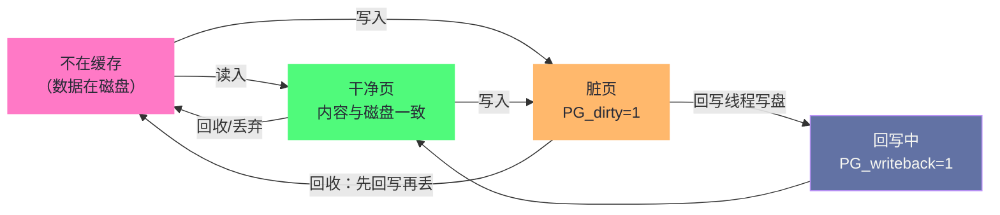
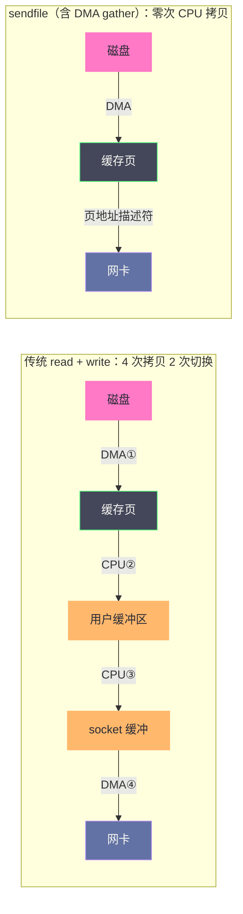

# Page Cache：Linux 为什么要用内存来缓存磁盘

**摘要：**

打开任何一台运行了一段时间的 Linux 服务器，`free` 命令里的 `buff/cache` 几乎总是吃掉绝大部分内存——外行看到会以为泄漏了，内行知道这是内核的 deliberate 设计：**空闲的内存就是浪费的内存，全部拿来做磁盘缓存**。Page Cache 是 Linux 存储 I/O 路径的中枢，`read()`/`write()` 与 `mmap` 的几乎全部流量都要经过它，它的读写策略直接决定了一个系统的 I/O 性能与断电安全性。本文沿读写两条主线做完整拆解：先算清存储层级的延迟鸿沟，回答"为什么必须用内存装磁盘"；再进入数据结构层——`address_space` 与 XArray 如何让"文件第 N 页在不在缓存"变成一次树查询，buffer cache 与 page cache 又如何在 2.4 时代合流；随后走完读路径（查询、未命中、预读）与写路径（写缓存即返回、脏页、四参量回写策略、flusher 线程的演进），并把 `sync`/`fsync`/`fdatasync` 的语义差别与断电窗口讲透；最后覆盖零拷贝三兄弟（sendfile、splice、mmap）与 `O_DIRECT` 的取舍逻辑，以及 free、cachestat、`posix_fadvise` 组成的监控治理工具箱。读完全文你应当能回答两个问题：Linux 为什么敢把"写"做成异步的，以及当你需要绕过或清理缓存时，正确的工具与姿势是什么。

---

## 第 1 章 缓存的经济学：为什么用内存装磁盘

### 1.1 五个数量级的鸿沟

Page Cache 存在的全部理由，浓缩在一张延迟表里：

| 存储层级 | 典型延迟 | 量级参照 |
|---------|---------|---------|
| L1/L2/L3 缓存 | 1-40 纳秒 | CPU 家门口 |
| DRAM（内存） | 约 100 纳秒 | Page Cache 所在地 |
| NVMe SSD | 约 100 微秒 | 比内存慢三个数量级 |
| SATA SSD | 约 500 微秒 | 接口瓶颈明显 |
| 机械硬盘（顺序） | 约 5 毫秒 | 寻道时代的老将 |
| 机械硬盘（随机） | 约 10 毫秒 | 最坏情形，比内存慢五个数量级 |

把数万条 `read()` 的调用摊在这张表上，结论不言自明：**只要同一个磁盘块会被访问第二次，把它留在内存里就是稳赚的生意**。而"同一块被访问第二次"——代码被反复加载、配置被反复读取、数据库的热点行被反复查询——正是绝大多数服务的常态。Page Cache 做的就是这门生意：文件内容以 4KB 页为单位缓存在内存里，第一次读从磁盘取，此后命中即从内存返回。

不妨把磁盘想成城市的中央仓库，内存想成街角的便利店：仓库的存货再全，顾客也不会为了买一瓶水跑一趟郊区；便利店把"最可能被要的货"备在货架上，卖掉多少补多少。Page Cache 就是内核为整个系统经营的这家便利店——而且它最动人的地方在于，**货架上卖不掉的货可以随时退回仓库（干净页直接丢弃），退回的成本近乎为零**。

### 1.2 一个量化例子：决定性的收益差距

量化一下收益的"决定性"。设想一个 Web 服务器，每个请求读取 3 个常用静态文件。没有缓存时，机械盘随机读 10 毫秒一次，单请求纯 I/O 延迟 30 毫秒，单核每秒撑死 33 个请求；缓存命中后，同样的读取走内存，3 次访问合计亚微秒级，单核吞吐跃升四个数量级。这个对比里最值得注意的不是倍数之大，而是**收益的来源完全不同**：缓存前的瓶颈是物理延迟，缓存后的瓶颈变成了 CPU 与内存带宽——前者靠花钱升级硬件改善有限，后者随内核与应用优化持续提升。对于访问模式有重复性的负载（Web、数据库热点、编译系统），Page Cache 不是锦上添花，而是"这台机器能不能用"的分水岭。

第二个例子换个行业。持续集成（CI）机器每天编译几十个项目：源码、头文件、中间对象文件被反复读写。缓存冷掉的 CI 节点上，一次全量构建可能要 40 分钟，其中一半时间在等磁盘；缓存热的节点上，同样的构建 12 分钟收工——**构建提速的大头不是编译器变快了，而是第二次编译时几乎所有输入输出都命中了缓存**。运维上由此派生出一门"缓存调度"的实践：把同一项目的构建尽量调度到同一台（或缓存已热的）节点上，比单纯加机器划算得多。缓存的收益从来属于"第二次"，而调度决定了"第二次"发生在哪里。

### 1.3 缓存的贪婪与慷慨

Linux 的缓存策略可以用两个字概括：**贪婪**。只要有空闲页帧，就拿来缓存文件；内存吃紧时，再按第 [[05 内存回收：kswapd、LRU与直接回收的博弈|5 篇]] 的规则把冷页让出去——干净页直接丢弃（数据反正在磁盘上），脏页先回写再让位。这套策略在观测上制造了一个著名的"错觉"：`free` 显示可用内存常年趋零。理解其机制后应当反过来读这个数字——**cache 高而 available 充足，是系统健康且有活力的标志；cache 低而 available 告急，才需要警惕**。

贪婪策略的适用边界同样要划清，那就是 Page Cache 管什么、不管什么：

| I/O 类型 | 是否经过 Page Cache | 说明 |
|---------|-------------------|------|
| 普通文件 `read()`/`write()` | 是 | 主干道 |
| `mmap` 文件映射 | 是 | 与文件共享同一批缓存页（第 [[03 缺页异常：一次内存访问的完整旅程|3 篇]] 的文件页路径） |
| 可执行文件与动态库加载 | 是 | 通过 mmap 走文件页路径 |
| `sendfile`/`splice`/`copy_file_range` | 是 | 零拷贝接口的源头仍是缓存页 |
| `O_DIRECT` 的读写 | 否 | 绕过缓存直达磁盘 |
| Socket 收发 | 否 | 走 socket 缓冲区，但 sendfile 可从缓存页直接发出 |
| Swap 换出换入 | 否（独立通道） | 匿名页走 Swap，不走文件缓存 |

需要强调的是，这张表的"管"与"不管"是**流量路径**意义上的——Page Cache 是文件数据进出的必经通道；而它占用的内存从来不是"预留"的，只是暂时驻留的空闲页帧。这个区别是理解第 1.2 节贪婪策略的钥匙：缓存不是先划走一块内存再慢慢用，而是"闲置的页帧我先用着，谁要用立刻还"。所以严格地说，Page Cache 没有"占用"内存，只有"借用"——归还的响应速度，取决于要回收的页脏不脏。

这张表里最容易被误读的是最后两行。网络包不走 Page Cache，所以"网络慢"不能怪缓存；Swap 与 Page Cache 是两个平行的世界——匿名页的换出在第 [[06 Swap机制：磁盘充当内存的代价与边界|6 篇]] 展开，两者的内存账都要在 `free` 的输出里分门别类地看（第 6 章详解）。

### 1.4 缓存的版图：不只文件数据

"Page Cache"这个名字容易被理解窄了——它管理的远不止"文件的内容"。完整的缓存版图至少包括四类居民：

| 居民 | 内容 | 观测位置 |
|------|------|---------|
| 文件数据页 | `read`/`mmap`/sendfile 的内容本体 | Cached |
| 块层元数据 | 超级块、位图等裸块数据（原 buffer cache） | Cached |
| 目录项与索引节点 | dentry cache、inode cache（slab 层） | SReclaimable（slab 的可回收部分） |
| tmpfs/共享内存 | 纯内存文件系统、shm、进程间共享段 | Cached + Shmem，无磁盘后端 |

认识版图的价值在诊断时立刻显现：`dentry` 暴涨不是文件内容被读得多，而是**目录树被遍历得广**（第 2 篇 slabtop 一节的结论）；`Shmem` 涨上去的不是"缓存"而是"正在使用的数据"，它不能像普通缓存那样直接丢弃；`SReclaimable` 与 `Cached` 合在一起才是"可回收内存"的完整口径。把四类居民混为一谈，是缓存相关故障误诊的第一大来源。版图还有一个时间维度的特点：前三类居民随 I/O 活动自然涨落，第四类只随使用方（挂载的 tmpfs、memfd、共享段）的生命周期变化——**如果 cache 里的"存货"查不到任何磁盘来源，多半是第四类居民在悄悄置办家产**，此时该查的是哪段代码在往 tmpfs 或共享内存里写东西。

---

## 第 2 章 数据结构：文件如何被"地址空间"接管

### 2.1 address_space：文件内容的账本

Page Cache 的组织中枢是 `address_space`——每个被缓存的文件都有一个对应的账本（挂在 `inode->i_mapping` 上）。它要回答的核心问题是："**这个文件的第 N 页，现在缓存在哪块内存里？**"：

```c
/* include/linux/fs.h（节选简化） */
struct address_space {
    struct inode        *host;         /* 账本属于哪个文件 */
    struct xarray       i_pages;       /* 核心：页偏移 → struct page 的索引 */
    gfp_t               gfp_mask;      /* 分配缓存页时的 GFP 标志 */
    unsigned long       nrpages;       /* 账本上的页数 */
    pgoff_t             writeback_index; /* 上次回写停在哪，下次接着转 */
    const struct address_space_operations *a_ops; /* 文件系统回调：readahead、writepages 等 */
};
```

账本的钥匙是 `i_pages` 这棵索引树：以**文件内页偏移**为键、物理页指针为值。老内核用基数树（Radix Tree），4.20 起换成接口更现代的 XArray（底层仍是多叉基数结构）。每次读写文件，第一件事就是拿偏移查这棵树——O(1) 到 O(log n) 的内存内查询，命中则零磁盘开销。账本还带着一页"文件系统回调表"（a_ops）：缓存层不认识 ext4 或 XFS，它只说"这一页要从你那里读出来/写回去"，具体怎么做是文件系统的事——**缓存与文件系统之间是标准的接口编程**，这也是 Page Cache 能统一服务所有文件系统的原因。

`a_ops` 的设计值得多看一眼，它是理解"缓存如何与文件系统协作"的钥匙。回调表里的成员不多：`readahead` 负责"给我把一段页读进来"（预读的入口），`read_folio`/`writepage` 负责单页的读写，`dirty_folio` 在标记脏时通知文件系统记账。所有文件系统实现同一张表，所有缓存路径只调这张表——ext4 的日志、XFS 的 extent 查找、NFS 的远程读取，在缓存层看来只是同一批回调的不同实现。顺带一个有趣的例子：NFS 挂载的"远程文件"也走 Page Cache，`writepage` 回调里做的不是磁盘 I/O 而是网络请求——**缓存的机制层与"存储在哪"完全解耦**，这套抽象的生命力由此可鉴。

> [!info] XArray：一次接口层的换代
> 4.20 的 XArray 更换常被误解为性能升级，实际主要是**接口与并发语义的现代化**：旧基数树的 API 要求调用者手工处理锁与"影子条目"等边角，新接口把锁定语义、迭代器、异常值统一封装。底层数据结构变化不大——这也是一次值得记住的工程案例：数据结构没换，接口换掉之后，全内核十几个子系统的代码都变简单了。

账本之外还有一本"影子账"值得知道：XArray 的条目里可以存放**影子条目（shadow entry）**——页被回收后留下的占位记录，内核借此记住"这个位置曾经有页、且最近被访问过"。它的作用是回收算法的"前科档案"：某位置的页反复被读入又反复被回收（refault），影子条目让内核能识别这种抖动模式并调整策略。一条缓存页的完整履历因此横跨"在册"与"离册"两个世界——**缓存系统的记忆比缓存本身更长寿**，这个设计在第 5 篇的回收机制里会再度登场。

### 2.2 合流：buffer cache 并入 page cache 的历史

今天的"Page Cache 管一切文件数据"并非从来如此。2.4 之前的内核有两套平行缓存：page cache 缓存文件的内存映射内容，buffer cache（以 buffer head 为单位）缓存裸块设备的块数据，两套体系各持一份可能互相矛盾的副本，同步逻辑成了长期的 bug 温床。2.4 内核（2001 年）完成合流：块层的块数据也统一放在页缓存里，buffer head 降格为页内的块映射辅助结构。这段历史的价值在于它验证了一条架构规律——**两套做同一件事的机制，成本必然高于一套做得慢一点的机制**，因为一致性本身就是最昂贵的隐性开销。现代内核里"元数据缓存"（dentry cache、inode cache，第 2 篇在 slabtop 里见过它们）虽然名义独立，底层页也统一由页缓存管理。

合流的故事还有一个观察角度：为什么早期的分裂是"合理的错误"？因为在引入之初，两种缓存的粒度确实不同——文件页 4KB、块设备块 512B，看起来是两个世界的问题。但"文件内容也是块数据"这个事实迟早要被正视，粒度的鸿沟最终由页内 buffer head 这层胶水抹平。**架构的分裂往往始于粒度的不同，而统一往往始于意识到粒度可以被适配层吸收**——这个模式在存储系统的演进里反复出现。

### 2.3 缓存页的三种身份

账本上的每一页，按内容状态分三种身份，转换关系构成一条单向的环形轨道：



三种身份对应完全不同的处置代价：干净页是"随叫随走"的免费劳动力（第 1 篇页表 D 位的软件版，脏净记账在这里落到 page 标志上）；脏页必须先写盘才能让位；回写中的页处于锁定状态，防止两个写入方同时撞车。第 1 篇讲过 PTE 的 D 位由硬件设置，而缓存页的脏标记（PG_dirty）由内核在写路径设置——两个"脏"字，一个管页表层、一个管缓存层，链条的终点都是"这个内容与磁盘不一致，丢弃前必须写回"。

值得把"干净页丢弃的代价"再拆细一层，因为它是理解回收成本的基础：丢弃一个干净页，内核只做两件事——从缓存树摘掉节点、把页帧还给伙伴系统，全程纯内存操作，纳秒级；而丢弃一个脏页要经历"申请回写、排队、等待磁盘确认"的完整流程，毫秒级起步。**同一块内存，是否含污带脏，回收代价相差六个数量级**——第 5 篇回收机制的多数复杂性（主动回写、水位管理、脏页比例控制），都是在为"让回收尽量碰到干净页"服务。

把三种身份落到 page 标志位上，是一组值得认识的位：

| 标志 | 含义 | 与谁联动 |
|------|------|---------|
| PG_uptodate | 内容已读完整、可用 | 读路径完成后置位，未置位时访问会等待 |
| PG_dirty | 内容新于磁盘，待回写 | 由写路径置位，回写完成后清除 |
| PG_writeback | 正在回写中 | 回写线程置位，防止并发写与提前回收 |
| PG_locked | 页被某操作独占 | 读入、回写、迁移都要先拿锁 |

这组标志构成一个隐式的**状态机协议**：任何动页内容的操作（读入、写、回写）都要先过 PG_locked，任何改状态的操作（置脏、开始回写）都要按协议顺序置位清位。用户态看不到这些位，但它们的行为会透过观测面显形——`/proc/meminfo` 的 `Dirty` 与 `Writeback` 就是全部脏页与回写中页的实时合计。

---

## 第 3 章 读路径：一次 read() 的完整旅程

### 3.1 主干道上的三岔口

用户调用 `read(fd, buf, count)` 之后，内核的旅程分三段。第一段是**查询**：拿文件偏移算页号，在 `i_pages` 树上找缓存页。第二段分岔——命中则第三段直接把页内容拷贝到用户缓冲区（`copy_to_user`）返回；未命中则先做一次"补货"：向伙伴系统要页、交给文件系统从磁盘读入、挂进缓存树，然后同样拷贝返回。这条主干道上的两个高频优化，前几篇都已埋下伏笔：补货动作与文件页缺页异常共享同一套实现（第 3 篇的 `filemap_fault`），而"顺手多读几页"的预读则是这里的主角。

把主干道写成代码骨架，三段旅程的形态一目了然：

```c
/* mm/filemap.c（大幅简化）：read() 的主干道 */
ssize_t generic_file_read_iter(struct kiocb *iocb, struct iov_iter *to)
{
    struct address_space *mapping = iocb->ki_filp->f_mapping;
    pgoff_t index = iocb->ki_pos >> PAGE_SHIFT;   /* 文件偏移 → 页号 */

    while (iov_iter_count(to)) {
        page = filemap_get_folio(mapping, index); /* 第一段：查账本 */
        if (IS_ERR(page)) {
            page = filemap_create_folio(...);     /* 未命中：补货 */
            a_ops->readahead(...);                /* 顺手预读后续窗口 */
        }
        copied = copy_page_to_iter(page, offset, to); /* 第三段：拷给用户 */
        folio_put(page);
        index++;                                  /* 下一页 */
    }
    return iocb->ki_pos;
}
```

注意未命中分支里"补货"与"预读"是同一段代码——补货读的是当前页，预读读的是窗口内的后续页，两者共用一次 I/O 提交的固定成本。**把固定成本摊给更多数据**，这个简单的经济学贯穿了整个读路径设计。

### 3.2 预读：赌局部性的算法

预读（Readahead）的设计要解决一个两难：一次读太少，顺序访问会反复踩磁盘；一次读太多，随机访问会浪费带宽。Linux 的解法是**自适应窗口**：维护每个文件当前读到的位置与窗口大小，连续的顺序访问（本次请求紧贴上次结束位置）触发窗口指数扩张，最高到 `read_ahead_kb`（默认 128KB）；请求跳到别处则窗口收缩。窗口内的页在处理当前请求时被异步批量读入，后续请求大概率直接命中。

算法的赌注逻辑值得单独说一句：**预读的成本是"多读了没用的页"，收益是"少等了会用的页"**。两边的期望值取决于访问模式——顺序流（日志、备份、视频、全表扫描）的收益是数量级级别的；真正随机的负载（点查数据库）则是纯亏。这也是第 3 篇调优判据的机制根源：调 `read_ahead_kb` 不是调"缓存大小"，而是在调整对局部性的下注额。

窗口的三个行为细节让这张牌更有可玩性。其一，**扩张是指数级的**：连续命中的顺序流让窗口从 4 页起步快速翻倍，这意味着预读系统的自我校准很快——几轮访问就能摸清你的模式。其二，**窗口有记忆**：同一个文件连续两次按窗口读，第二次直接按"当前窗口 × 2"发预读（同步预读升级），顺序流的 I/O 次数以对数级增长。其三，**异步优先**：预读请求尽量挂在后台异步队列，只有当前请求页本身未命中才同步等待——应用感知到的延迟通常只是"当前页"的 I/O，窗口内的货在后台陆续上架。

用一个具体数收尾：128KB 窗口意味着一次预读搬 32 个页。若程序以 4KB 步长顺序读 1GB 文件，关闭预读需要 26 万次缺页与 26 万次 I/O 提交；开到 128KB 窗口后，I/O 提交次数被压缩到八千余次，且大部分与计算重叠进行——**同一个应用、同一块盘，参数内建的行为差异就已经是两个数量级**，这也是为什么"操作系统不用调"这句话在 I/O 领域总是不能全信。

预读的活动可以随时观测：

```bash
$ sar -B 2 5                     # 带宽视角：pread 相关字段与 majflt/s
$ grep read_ahead_kb /sys/block/sda/queue/read_ahead_kb
128                              # 默认 128KB；顺序吞吐型负载可试 512-2048

$ /usr/bin/time -v dd if=/data/big of=/dev/null bs=1M count=2048
   ... Minor (reclaiming a frame): 0        # 命中缓存：majflt 应为 0
```

判读的要领是把" majflt 速率"与"块设备读吞吐"放在一起：顺序读的负载若 majflt 高居不下、吞吐上不去，说明预读窗口与访问模式错配——增大窗口或换顺序化访问模式；反之 majflt 归零而吞吐达标，缓存与预读已尽职。

### 3.3 mmap 读：同一条路的另一个入口

通过 `mmap` 读文件的旅程与 `read()` 只在最后一站不同：`read()` 是拷贝到用户缓冲区，mmap 则是建立页表映射，让用户代码直接访问缓存页——少一次拷贝，代价是多一次缺页异常的处理。两条入口指向**同一批物理缓存页**，这是合流后架构最优雅的副产品：无论应用用哪种方式读写，内核看到的都是同一份缓存，一致性问题在架构上就不存在。第 3 篇已经走过 mmap 的分支（零页、fault-around），此处只需记得它们共享这条主干道。

选 `read()` 还是 mmap 读文件，有一条务实的决策线。顺序批量读取（拷贝文件、扫描日志）用 `read()`：拷贝成本摊薄后可忽略，省去缺页异常与页表管理的固定开销。随机访问大文件的稀疏位置（数据库页、索引探测）用 mmap：免拷贝的收益超过缺页的成本，且天然共享缓存页。介于两者之间的场景没有标准答案，值得用各自的负载实测——**接口的优劣是负载形状的函数，不是抽象评分的函数**。

---

## 第 4 章 写路径：write-back 的收益与风险

### 4.1 写缓存即返回：Linux 最激进的一个决定

读路径好理解，写路径才见胆识。Linux 的文件写入是 **write-back（写回）**模式：`write()` 系统调用把数据放进缓存页、标记为脏，**立即返回成功**——此时数据只在内存里，磁盘上还是旧内容。真正的落盘由回写机制异步完成，可能晚数百毫秒到数十秒。历史上这不是 Linux 一家的发明——VMS、NT 家族的延迟写都是同族思想，差异只在于窗口参数与默认激进程度，Linux 选择了其中相当激进的一档。

先算收益：写磁盘的同步等待从写路径上整体消失，应用的写入吞吐被解放到内存带宽的水平——数据库事务、日志追加、消息落盘的延迟大幅下降；多个写操作还能合并成批量 I/O，一页被反复改写只落盘最后一次。这笔收益的量级，足以解释为什么主流操作系统都选择了 write-back 家族。

合并收益值得用一个场景说透。设想一个计数器被每秒改写十万次，每次只改 8 字节。没有写回机制时，这意味着每秒十万次磁盘写——任何磁盘当场阵亡。有了 write-back：十万次改写落在**同一块缓存页**上，最终只有一页 4KB 的最终状态需要落盘。**磁盘看到的写压力与应用发出的写压力之间，可以隔着一个巨大的衰减器**——这是 write-back 比单纯"异步"更深的含义：它不仅推迟写，还通过缓存层的合并与去重，让许多写根本不需要发生。

再算风险，风险一目了然：**返回成功与数据落盘之间存在一个不可控的时间窗**。窗口内断电或宕机，用户以为已经写入的数据消失——这就是"write() 返回了，数据却没了"这一经典事故的全部机制。窗口的存在不是缺陷而是交易的一半，工程上的正确姿势不是抱怨它，而是掌握两个工具：其一，知道窗口有多大（第 4.3 节的参数）；其二，知道哪些数据必须跳过窗口（第 4.5 节的 fsync 家族）。这两个工具背后其实是一条清晰的契约线：**write() 的语义是"我收到了"，不是"它存好了"**——就像餐厅收银台的小票证明的是"钱付了"，不是"钱进了金库"。凡是需要"存好了"级别的保证（订单、账本、配置变更、消息标记），都要在契约上升级一级；凡是小票就够的（访问日志、指标采样），享受 write-back 的全部速度红利。把数据按这条契约线分级，是所有持久化架构设计的第一课，而它的物理基础，就是本节的断电窗口。

打个比方，write-back 像收银员收到现金后先给你收据，现金晚些入保险柜——大多数时候效率极高；但收据不等于保险柜，重要交易你会盯着柜员当场入柜（fsync），并拿到盖章的入柜凭证（fsync 返回）。

### 4.2 脏页的四种归宿

内核不会让脏页无限堆积，四个触发条件构成一套"到期即办"的机制，任一命中就启动回写：

| 触发条件 | 参数（默认值） | 触发动作 |
|---------|--------------|---------|
| 脏页太老 | `vm.dirty_expire_centisecs`（3000 = 30 秒） | 过期脏页周期性写盘 |
| 周期检查 | `vm.dirty_writeback_centisecs`（500 = 5 秒） | flusher 每 5 秒醒来巡逻 |
| 后台水位 | 脏页占总内存超过 `vm.dirty_background_ratio`（10%） | 后台线程开始异步回写 |
| 硬性水位 | 脏页超过 `vm.dirty_ratio`（20%） | **写 `write()` 的进程自己被卡住**，同步回写 |

四个条件的分工很讲究：前两个管"新鲜度"（数据不能在内存里待太久，控制断电窗口），后两个管"库存量"（脏页不能挤占正常内存）。尤其注意硬性水位的语义——它触发时卡住的是**正在写数据的应用进程本身**，这是"磁盘突然抖动，所有写入服务同时卡顿"这一现象的内核解释：不是应用出问题，是所有进程在硬性水位前集体排队。

> [!warning] 生产避坑：脏页水位与突发写入
> 硬性水位的百分比形式有个隐蔽陷阱：在大内存机器上它是绝对值惊人的数字——512GB 内存的 20% 意味着 100GB 脏页额度，而普通 NVMe 盘把 100GB 落盘需要数十秒。突发批量写入（备份、批量导入）恰好会把这么多的脏页一次性堆出来，之后系统进入长达几十秒的"回写洪峰"，期间所有 I/O 延迟数倍恶化。**大内存机器应当把比例参数换成绝对值参数**（`vm.dirty_background_bytes` 与 `vm.dirty_bytes`），把脏页额度钉在"一块盘几分钟能落完"的量级，而不是随内存膨胀的水位线。

> [!warning] 生产避坑：硬性水位触顶的应急识别
> 监控里还有一个直接反映"回写是否吃紧"的信号：`/proc/meminfo` 的 `Writeback` 与块层指标里持续非零的 in-flight 写请求，配合 `iostat` 里逼近 1 的设备利用率。收到这个信号说明某块盘的回写已经跑不赢脏页的产生速度，处置按顺序看三件事：这块盘最近是否新增了写入密集的服务；脏页参数是否适合当前的内存/盘速组合；flusher 是否被调度或设备级瓶颈卡住。**它意味着包括 SSH 会话在内的所有本机写操作都在同一列队里**——这种"整台机器所有写操作一起慢"的现象，是回写阻塞区别于其他 I/O 问题（单服务、单文件慢）的标志性特征。

### 4.3 回写的时间线与零头参数

把默认参数连成时间线，能看清一个写入的"保险之旅"：第 0 秒 `write()` 返回；第 5 秒 flusher 巡逻发现它；若它已满 30 秒则被写盘——**默认断电窗口的上界是"30 秒的年龄"加上"发现与落盘的延迟"**。三个最常被调整的旋钮：把 `dirty_background_ratio` 与 `dirty_ratio` 调小（譬如 5/15），断电窗口收窄、写入高峰的卡顿提前但更浅；把 `dirty_expire` 调短，数据更"新鲜"但 I/O 更碎。它们没有普适值——日志型应用可以容忍大窗口换吞吐，交易型系统宁可小窗口多写盘。另有一个常被忽略的变体：SSD 与机械盘混布时，参数是全局的，而两块盘的"最佳断电窗口"并不相同——参数体系的全局性是它的一处时代局限。

参数调整之外，还有一个"写入者的自我修养"视角：同一组参数下，**应用写法直接决定脏页曲线的形状**。同样是落 10GB 数据，一把梭的顺序大块写会让脏页水位直线冲顶；切成每 512MB 一次小批量、批间稍作喘息的写法，水位被控制在后台回写的消化能力之内，全程无卡顿。参数是固定的河床，应用的写入节奏才是水流——**调不了河床时先调水流**。

### 4.4 回写的执行者：从 pdflush 到 per-BDI

谁在执行写盘？答案经历过一次重要重构。早期内核用一组全局的 pdflush 线程巡逻所有磁盘——磁盘一多、负载一偏，全局线程池就成了串行瓶颈。2.6.32（2009 年，Jens Axboe 的 writeback 重构）起，改为**每个块设备（backing device，BDI）一组专属 flusher 线程**：慢盘的积压不再拖累快盘，线程数随设备数伸缩，NUMA 亲和也能对齐。观测上对应的进程名是 `flush-8:0` 或内核 5.x 时代的 `kworker` 系列——在 `ps` 里看到它们偶尔忙碌属正常，**长期打满 CPU 则说明某块盘的回写已经跟不上了**，这是"写入吞吐到顶"的内核侧信号。

重构的动因值得记一笔：pdflush 时代的典型故障是"一块慢盘拖垮全机回写"——全局线程池里，最慢的设备定义了整体节奏，快盘的脏页陪着慢盘排队。per-BDI 化本质上是把"全局共享资源"拆成"按设备分片"，与第 2 篇的 per-CPU 页池、第 3 篇的 per-VMA 锁是同一味药：**哪里有全局池化，哪里就有最慢成员定义整体的诅咒，哪里就该考虑分片**。

### 4.5 fsync 家族：把落盘的决定权拿回手里

对断电不可接受的数据（事务日志、账本、消息队列的持久化标记），必须显式同步。三个接口的语义差异是高频考点，值得用一张表钉死：

| 接口 | 刷什么 | 典型用途 |
|------|-------|---------|
| `fsync(fd)` | 该文件的所有脏页 + 元数据（大小、时间戳等） | 最强的单文件落盘保证 |
| `fdatasync(fd)` | 只刷数据；**除非大小变化**，跳过元数据 | 日志追加（追加改变大小，仍会刷元数据）、高频写场景的性价比之选 |
| `sync()` | 全部脏页与元数据（全系统） | 停机前的大扫除，代价最高 |

`fdatasync` 的"除非大小变化"是精妙的折中：追加写会改变文件大小（元数据），所以日志型场景它省不了太多；而原地改写（更新文件中某个固定位置的记录）时，它跳过元数据刷新，比 fsync 少一次元数据 I/O——**同一个接口，在不同写模式下省的金额不同**。另有 `msync` 服务于 mmap 映射的脏页（共享映射的写要靠它强制落盘，匿名私有映射除外），以及 `O_SYNC`/`O_DSYNC` 打开标志：前者等于"每次 write 自带 fsync"，后者等于"每次 write 自带 fdatasync"——把同步决策从调用序列挪到了打开文件的那一刻，适合"从头到尾都必须同步写"的场景，譬如旁路审计日志。

一组工程上常见的安全落盘序列，把上面的语义串成实践：

```c
/* 追加写一条关键日志并确保落盘 */
int fd = open(path, O_WRONLY | O_APPEND);
write(fd, record, len);
fsync(fd);                    /* 数据 + 因追加而变的元数据，一步到位 */
close(fd);

/* mmap 写共享数据的落盘 */
void *p = mmap(NULL, len, PROT_READ | PROT_WRITE, MAP_SHARED, fd, 0);
p[0] = 42;
msync(p, len, MS_SYNC);       /* MAP_SHARED 的写靠 msync 落盘 */
```

两个细节容易踩坑：其一，`close()` 与 fsync 的顺序——先 close 后 fsync 已经没得 fsync 了，**落盘保证必须在关闭描述符之前取得**；其二，fsync 只保证"本文件"落盘，**目录项的持久化需要单独 fsync 目录描述符**——新建文件后只 fsync 文件不 fsync 目录，断电后可能出现"内容在、文件名没了"的诡异现场（这是文件系统接口的真实语义，不是玄学）。

> [!warning] 生产避坑：fsync 的代价要进预算
> fsync 的成本是"等磁盘真正确认落盘"：机械盘上一次毫秒级的等待，加上文件系统日志的双重开销，热点路径上每笔事务 fsync 一次，吞吐立刻被磁盘 IOPS 封顶（一块 SATA 盘约 200 IOPS 意味着每秒最多 200 笔）。工程上的出路有三个方向：**分组提交**（攒一批事务共用一次 fsync，消息队列与数据库的标配）、**顺序追加化**（把随机写整理成顺序写，SSD 与 HDD 都受益）、**换更快的持久层**（NVMe、带电容保护的 RAID 卡）。选哪条取决于业务能容忍多大的"批量延迟"——落盘保证与吞吐的权衡没有银弹，但账必须先算。

### 4.6 回写与容器：配额下的脏页管理

容器化部署给回写添了一层"记账到户"。cgroup v2 之前，脏页水位是全机一本账：某个容器疯狂写文件，堆出来的脏页算在全机头上，触达 `dirty_ratio` 时全机写入一起卡顿，"罪魁"却难以指认。**per-cgroup writeback**（4.2 起逐步落地，v2 完整化）改变了记账方式：每个 cgroup 的脏页单独计数、单独触发回写、甚至可以单独限制吞吐（`writeback` 相关的 io 控制器）。容器的内存限额因此能真正管住缓存——限额触顶时先回收这个容器自己的缓存页，而不是让全机的回写机制陪葬。第 [[09 CGroups 内存子系统：容器内存隔离的底层实现|9 篇]] 会展开记账细节，这里先记住结论：**多租户的写隔离，靠的不是全局参数调小，而是账本分户**。

---

## 第 5 章 零拷贝：把"拷贝"从路径上拆掉

### 5.1 传统传输的四次拷贝与两次切换

零拷贝（Zero Copy）讨论的问题是：把文件发给网络，数据究竟要被搬多少次？传统 `read()` + `write()` 的答案是四次拷贝、两次用户/内核切换：

1. `read()`：磁盘 → 内核缓存页（DMA 拷贝）；
2. `read()`：缓存页 → 用户缓冲区（CPU 拷贝）；
3. `write()`：用户缓冲区 → socket 发送缓冲（CPU 拷贝）；
4. `write()`：发送缓冲 → 网卡缓冲（DMA 拷贝）。

其中两次 CPU 拷贝纯属"数据路过用户态"的形式主义——应用在这两步里什么都不做，只是让数据在它家客厅歇了个脚。CPU 拷贝是四次里最贵的（占 CPU 与内存带宽），且速度受限于内存带宽；DMA 拷贝虽然不占 CPU，但搬运时间照样发生。零拷贝技术的目标就是**把"路过用户态"这个环节整个拆掉**。

拆掉之前的账还要算全：除了四次拷贝，路径上还有两轮用户/内核态切换（每次系统调用一对）、若干次系统调用的固定开销，以及应用侧缓冲区的管理成本。高吞吐网关这类每秒转发数万文件的服务器上，这些成本合计可以吃掉一半以上的 CPU——零拷贝不是抠门，而是**把 CPU 从数据搬运工的岗位上解放出来去干正事**。这也是为什么评价零拷贝收益时，看的不只是"拷贝少了多少纳秒"，而是"同样一台机器现在能多接多少流量"。两种路径放在一起对比，削减的环节一目了然：



### 5.2 sendfile 与 splice：数据不再进客厅

`sendfile(out_fd, in_fd, ...)` 在内核内直接把缓存页"挂"到 socket 的发送队列上：磁盘到缓存页的 DMA 照旧，缓存页到网卡的传输也照旧，**中间两次 CPU 拷贝消失**，系统调用从两次降为一次。若网卡支持 scatter-gather（DMA 分散聚合，2003 年后的主流网卡都有），数据甚至不用在内核里再拼一次——缓存页的物理地址直接交给网卡 DMA 引擎，连"内核内的搬运"都没有，这才配得上"零拷贝"三字。

这条路径的时间线：sendfile 于 2.2 内核（1999 年）引入，最初就是为 Apache 这类静态文件服务器设计；Kafka 把它用成了教科书——消费者拉取消息时，Broker 用 sendfile 把日志段的缓存页直送网卡，磁盘顺序读的吞吐几乎无损地变成网络吞吐；Nginx 的 `sendfile on;`、Java 的 `FileChannel.transferTo`，底层全是它。另一个同族接口 splice（2.6.17，2006 年）走"管道"抽象，能连接任意两个文件描述符（包括 socket 与管道），灵活性更高，代价是多一次内核缓冲的接力——**sendfile 是专线直达，splice 是可以中转的货运系统**。

Kafka 的案例还藏着一层架构启示：sendfile 的收益上限，取决于**数据在服务端被加工的次数**。Kafka 有意把消息格式设计成"Broker 不解包、不校验、不加工"——压缩与校验交给生产者和消费者，Broker 只做日志追加与转发，于是数据从磁盘到网卡全程不需要进用户态，零拷贝的收益被吃到满格。反过来，一个要在服务端逐条解密、改写、过滤消息的设计，sendfile 就没了用武之地。**零拷贝的收益不是调优调出来的，是架构设计出来的**——数据路径上每一次"顺便加工"，都在重新引入一次拷贝。

### 5.3 mmap + write：另一种减法

`mmap` 文件后直接 `write` 到 socket，是零拷贝的前身方案：省掉了"缓存页到用户缓冲区"的一次 CPU 拷贝（用户直接读映射内存），但写 socket 那次 CPU 拷贝仍在，还要背上缺页异常与页表管理的开销。它的真正适用域是**需要原地加工数据**的场景——读入后要改几个字节再发出，sendfile 的纯传输管线就不如 mmap 灵活。三种方案的取舍归纳成一句话：**纯转发用 sendfile，要加工用 mmap，语义复杂用 splice**。

还有一种常被列进零拷贝家族的方案值得单独澄清：`vmsplice` 与 `MSG_ZEROCOPY`（socket 的用户态页直传）。它们能把用户态内存直接挂到内核的传输路径上，省掉"用户到内核"的拷贝，但用户页因此被内核借用——应用在传输完成前不得改写这页内容，否则发出的是"半新半旧"的脏数据。**零拷贝省下的每一次拷贝，都要用"数据在这个环节不可变"的承诺来换**；承诺兑现不了（数据还要加工），拷贝就得老老实实回来。这也是为什么零拷贝的天堂是网关与代理（纯转发），而不是应用服务器（总要在传输前动数据）。

### 5.4 O_DIRECT：另一种哲学的登场

`O_DIRECT` 打开标志让读写完全绕开 Page Cache，直达块设备。选择它通常出于两种动机。**其一，应用自带缓存**：数据库引擎（Oracle、InnoDB 可选、各类自研存储）已经维护了精细的缓存与淘汰策略，内核再缓一份是浪费内存、双重淘汰、彼此不知情；让它们直连磁盘，缓存策略收敛到一处。**其二，可控性**：Direct I/O 的落盘时机、I/O 大小、队列深度全部显式可控，基准测试与存储引擎开发依赖这一点。

代价同样明确：每次读写都真实落盘/读盘，不再有内核替你挡住重复访问；**对齐要求苛刻**（缓冲区地址、文件偏移、长度通常都要对齐到逻辑块大小，否则返回 EINVAL）；小 I/O 的性能因失去合并而显著下降。因此 O_DIRECT 的正确姿势从来不是"全局打开"（那等于自废 Page Cache 的武功），而是"特定文件、特定引擎、配套自己的缓存"。它与第 3 篇的按需分配、第 4 章的 write-back 形成一组对照：**内核默认替你做决定，O_DIRECT 是把决定权全部收回的合同**——收回决定权的前提，是你真的有更好的决定可做。

三种读写模式放在一张表里，选择逻辑就完整了：

| 维度 | 缓存读 + write-back | 缓存读 + fsync | O_DIRECT |
|------|--------------------|---------------|----------|
| 读性能（重复访问） | 最优 | 最优 | 每次都走磁盘 |
| 写吞吐 | 最高 | 视 fsync 频率 | 取决于磁盘与队列深度 |
| 断电保证 | 无（窗口内丢数据） | fsync 点之后有 | **write 本身即落盘**（对齐前提下） |
| 内存占用 | 大 | 大 | 小 |
| 适用负载 | 通用缓存型 | 事务日志型 | 自带缓存的存储引擎 |

表里最容易被忽视的是中间一列：很多场景"缓存 + 定期 fsync"是比 O_DIRECT 更好的折中——既留住缓存的合并与读加速，又在关键点取得持久性。O_DIRECT 是工具箱里的一件重器，不是默认答案。

把选择流程整理成一份可执行的清单，面对"这个文件该用什么方式读写"时依次自问：

1. 数据落盘丢失会造成资损吗？——是：fsync/fdatasync 进入路径设计，或直接 O_SYNC；
2. 同一块数据会被重复读吗？——是：留在缓存体系里，别用 O_DIRECT；
3. 应用是否自带成熟缓存与淘汰策略？——是：考虑 O_DIRECT，把缓存策略收敛到一处；
4. 是纯转发（文件 → 网络）吗？——是：sendfile/transferTo；
5. 转发前要加工数据吗？——是：mmap + write 或传统 read/write；
6. 单文件超大且顺序扫描一次？——配合 POSIX_FADV_DONTNEED，读完即弃。

---

## 第 6 章 监控、治理与误区

### 6.1 读懂 free：buff/cache、available 与两本账

`free -h` 的输出里，与本章直接相关的是三列：

```
               total   used   free   shared  buff/cache   available
Mem:            126Gi  8.2Gi  1.1Gi   0.4Gi       117Gi       117Gi
```

- **buff/cache**：Page Cache（含块层元数据缓存）的合计。117Gi 在这里不是"被占用"，而是"正在工作"——任何应用需要内存时，干净页立刻让路，脏页回写后让路。
- **available**：估算的"不触发 Swap 的前提下还能分配多少"。它由内核 3.14（2014 年）引入（`MemAvailable`），算法是从空闲页、可回收的缓存与 slab 中扣除保留水位——**available 才是容量告警的正确依据**，free 列早就没有监控价值。
- **shared**：tmpfs/共享内存的占用，属于"既是缓存、又是数据"的灰色地带——tmpfs 的页也走 Page Cache 记账，但它们**没有磁盘后端可回退**（只能换出），监控时要从 cache 里把这部分单拎出来。

三列的优先级排序值得变成肌肉记忆：容量决策看 available，故障诊断看 Dirty/Writeback 与 Shmem，free 与 buff/cache 只用来观察内核"贪婪"的程度。值得一提的是这个字段体系的历史——2014 年之前的 procps 版本里没有 available，运维们发明了"+buffers+cache"的经验公式来凑答案，直到内核把它做成第一手指标。**观测口径的每一步演进，背后都是一次"大家到底想问什么"的重新对齐**——这个字段的出现，本质上是全行业对"我还有多少可用内存"这个问题的标准答案。

`shared` 的灰色性质值得展开半段。tmpfs 的页在记账上归入 Cached（第 1.4 节的版图里有它），但它与普通文件页有三点本质差异：内容不属于任何磁盘文件，回收时不能丢弃只能换出（走 Swap 通道，第 6 篇）；容量可以由 tmpfs 挂载时的 size 参数或 `memfd` 限额控制；对容器而言它是 `memory.max` 的直接组成部分。实践中常见的误判是"机器 cache 很大但盘上找不到对应文件"——多半就是 tmpfs（/dev/shm、/tmp 挂成 tmpfs、或应用用 memfd 建的匿名共享段）在装东西。**凡是"缓存"里找不到磁盘来源的部分，问一句 tmpfs，答案十有八九在那里**。

一条成熟的告警纪律：cache 增长本身永远不告警；**available 告急、或 swap 开始动用（si/so 非零）才是告警点**。第 [[10 内存性能分析与调优：从 free 到 perf 的工具链|10 篇]] 会把这一纪律并进完整的监控体系。

### 6.2 看清缓存的构成与命中

知道总量之外，三个工具负责"透视"。`/proc/meminfo` 的 `Cached` 与 `Dirty` 字段给出脏页实时水位，配合第 4 章的参数可以直接判断当前离硬性水位多远：

```bash
$ grep -E "^(Cached|Dirty|Writeback|Shmem):" /proc/meminfo
Cached:          118903824 kB     # 缓存总量（含 tmpfs）
Dirty:              812544 kB     # 待落盘的脏页水位
Writeback:              64 kB     # 正在回写中的页
Shmem:             2048000 kB     # tmpfs/共享内存——无磁盘后端的部分

$ watch -n1 "grep -E 'Dirty|Writeback' /proc/meminfo"   # 批量写入时盯脏页曲线
```

观察脏页曲线是诊断写入问题的直接手法：批量导入时若 Dirty 快速逼近 `dirty_bytes`/`dirty_ratio` 的换算值，随后回落缓慢，说明落盘速度跟不上——答案要么在盘上（IOPS/带宽到顶），要么在写入者身上（写入节奏过猛）。观测节奏上建议分层：常规监控采集分钟级的 Dirty/Writeback 快照，批处理任务执行时临时开秒级 watch，故障复盘时用历史曲线对齐写入时间线。2023 年的 6.5 内核合入了 **cachestat** 系统调用：给定文件偏移区间，返回其中的缓存驻留页与脏页计数——这是内核历史上第一次让应用能**程序化地查询自己的缓存命中率**，对缓存敏感的存储引擎（判断某段索引是否还热）是精准的手术刀。老牌的第三方工具 `vmtouch` 仍是最快的诊断法：一条命令显示某文件的缓存驻留比例，还能加 `-l` 把文件钉进内存。

### 6.3 治理：清理与驱逐的正确姿势

需要主动清理缓存时（压测前归零、跑内存敏感任务前腾地），有一套从粗到细的工具箱：

```bash
# 1. 全局粗清：1 清页缓存，2 清 slab（含 dentry/inode），3 都清
echo 3 > /proc/sys/vm/drop_caches        # 生产慎用：清完就是冷缓存，短期性能塌方

# 2. 文件级精清：把热过头的文件从缓存里请出去
vmtouch -e /data/hotfile                  # 或应用内 posix_fadvise(fd, ..., POSIX_FADV_DONTNEED)

# 3. 应用级驱逐：按区间告知内核"这段不会再读/不再需要"
posix_fadvise(fd, off, len, POSIX_FADV_NOREUSE);  # 流式处理一次读完的场景

# 4. 主动落盘：不清缓存只收脏页
sync                                      # 全系统；文件级用 syncfs(fd) 或 fsync
```

选择哪一档清理工具，取决于三问：**清理的对象**是全机还是某文件（drop_caches 只能全局）；**清理的时机**是受控窗口还是运行中（全局清理必然带来冷缓存抖动）；**清理的目标**是腾内存还是收脏页（后者用 sync 系列，前者才用 drop 系）。压测前归零缓存的经典组合是 `echo 3 > drop_caches` 加一次 sync——先把脏页落盘再清理，避免"清了脏页等于丢了数据"的误操作风险。

```c
/* 流式处理大文件的教科书姿势：读完即弃，不占缓存额度 */
int fd = open(bigfile, O_RDONLY);
char buf[1 << 20];
while (read(fd, buf, sizeof(buf)) > 0)
    process(buf);
posix_fadvise(fd, 0, 0, POSIX_FADV_DONTNEED);  /* 把刚扫过的页请出缓存 */
close(fd);
```

工具箱的关键是**粒度对齐需求**：全局清理是"用冷启动的代价换瞬时余量"，只该在受控窗口做；`fadvise` 系列是应用把自己的访问知识告诉内核——譬如扫描完一个大文件就知道不会再读，一句 DONTNEED 就能避免它把热数据挤出缓存。**内核的缓存策略再聪明，也聪明不过应用对自己访问模式的自知之明**，这组接口正是让自知之明起作用的管道。

### 6.4 容器里的缓存：谁的 Page Cache

容器时代给缓存治理增加了一个"归属"问题：同一个文件的缓存页被十个容器读写，它算谁的内存？cgroup v2 的答案是**按首次创建归属记账，按脏页归属回写**——谁第一个把页读进来，账就记在谁的 cgroup 上；容器内的写入产生的脏页，回写也由该容器的配额驱动。这让"容器内存限额"（第 [[09 CGroups 内存子系统：容器内存隔离的底层实现|9 篇]] 的主题）能够约束缓存行为：限额触顶时，内核优先回收该容器的缓存页，而不是让它借缓存之名突破限额。运维上的推论很实际：**宿主机上的全局缓存水位，在容器化后是"每个容器水位之和"**，容量规划与告警都要跟着换口径。

### 6.5 三个高频误区

收拢三个最常见的误区，与机制一一对号。**误区一："cache 占满内存 = 内存不足"**：正好相反，cache 是 available 的蓄水池，只看 used 列做容量规划会系统性误判。**误区二："write 返回就是落盘"**：第 4 章的断电窗口，断电、宕机、甚至某些存储卡的掉盘场景都会把窗口暴露出来，关键数据必须 fsync。**误区三："O_DIRECT 一定更快"**：它省的是缓存管理的开销，付的是失去缓存收益的代价——小 I/O、随机访问、无自有缓存的场景里，O_DIRECT 几乎总是更慢。三个误区的共性是把"缓存的存在"当成了默认背景，而**性能问题的答案往往藏在"哪条路径没走缓存"或"哪次写入还没落盘"里**。

再补一个更隐蔽的误区四：**"缓存与回收无关"**。很多工程师把 Page Cache 当作独立于内存管理的一层，其实它就住在第 2 篇讲的物理页帧上、挂在第 5 篇要讲的 LRU 链表里——回收机制削缓存就是削它。由此产生的连锁反应也顺理成章：应用突然申请大块匿名内存时，内核回收缓存来腾地方，观测上是"cache 突然下降而匿名内存上升"，这一升一降不是事故，是仲裁机制在正常工作。把缓存、匿名页、回收放在同一张图上理解，第 5 篇的机制就有了坐标系。

---

## 第 7 章 小结：缓存是内核与应用的合谋

全篇的主线可以收拢成三句话。**读的经济学**：五个数量级的延迟鸿沟让"第二次访问走内存"成为稳赚的生意，`address_space` 与预读算法把这门生意做成了主干道。**写的契约**：write-back 用断电窗口换取写入吞吐，四个参数划定窗口、flusher 线程执行契约，而 fsync 家族是应用拿回落盘决定权的正式渠道。**路径的选择**：sendfile 拆掉形式主义的拷贝，O_DIRECT 收回缓存的决定权——两条都是"把默认行为换成更贴身的策略"的方式。

按惯例收一张速查表：

| 现象 | 机制根源 | 处置 |
|------|---------|------|
| free 显示 cache 巨大 | 贪婪缓存策略，正常 | 改看 available 做告警 |
| 写入高峰服务集体卡顿 | 脏页触达 `dirty_ratio` 硬水位 | 降脏页占比、分散写入、加快盘 |
| 断电后数据消失但 write 成功过 | write-back 窗口 | 关键路径 fsync/fdatasync |
| 静态文件服务 CPU 高在 copy | 走了 read+write 四拷贝 | sendfile / transferTo |
| 数据库 + 文件缓存双份占用内存 | 应用有缓存还走 Page Cache | 引擎层启用 O_DIRECT |
| 压测数据异常好/坏 | 缓存冷热不一致 | vmtouch 预热或 drop_caches 归零 |

回望全程，本章的落点仍是权衡：Page Cache 不是"越多越好"——它与应用的缓存、与匿名页争夺同一池内存，第 [[05 内存回收：kswapd、LRU与直接回收的博弈|5 篇]] 的回收机制就是这场争夺的仲裁者；write-back 不是"越晚越好"——断电窗口的每一秒都是风险敞口；O_DIRECT 不是"越快越好"——决定权只在配得上它的手里。**缓存策略的本质，是内核与应用就"谁知道访问模式、谁承担落盘风险"达成的分工协议**，读懂协议条款（参数、接口、语义），才谈得上按自己的业务重新谈判。

这个分工协议还有一个不断被重新谈判的动态版本值得留下：io_uring 时代（5.1 起，2019 年）的异步 I/O 框架让"直读直写"的编程成本大幅下降，应用自管 I/O 的比例在上升；而内核的 MGLRU 等新回收算法又在让缓存管理变得更聪明。两边的绳索同时收紧，中间地带的边界——"哪些数据交给内核、哪些应用自管"——没有收敛，反而更依赖工程师对自身负载的理解。下一篇进入这场内存争夺战的正面战场：当匿名页与缓存页一起把内存撑满，内核如何排序、如何裁决、如何优雅地让步——内存回收的全套机制将在 [[05 内存回收：kswapd、LRU与直接回收的博弈]] 展开。

---

## 参考资料

1. Robert Love. Linux Kernel Development, 3rd Edition. Addison-Wesley, 2010.（第 16 章 The Page Cache and Page Writeback）
2. Mel Gorman. Understanding the Linux Virtual Memory Manager. Prentice Hall, 2004.（第 15 章 Page Cache）
3. Jonathan Corbet. Improving writeback（per-BDI flusher 重构系列）. LWN.net, 2008-2009 相关篇目.
4. Matthew Wilcox. The XArray data structure（radix tree 的继任者）. LWN.net, 2017-2018. https://lwn.net/Articles/747040/
5. Linux Kernel Documentation. Page Cache / Writeback 相关. https://docs.kernel.org/admin-guide/sysctl/vm.html（vm.dirty_* 参数官方文档）
6. Linus Torvalds 及社区. Page cache 与 buffer cache 合流（2.4 内核）相关邮件讨论与发布记录. 2001.
7. IBM Developerworks. Zero Copy I: User-Mode Perspective（零拷贝综述）. 2003.
8. Linux Kernel Documentation. cachestat(2) 手册页与相关合并记录. 2023.
9. Martin Kleppmann. Designing Data-Intensive Applications（fsync 与持久性工程实践）. O'Reilly, 2017.
10. Man 2 mmap、man 2 fsync、man 2 posix_fadvise、man 2 sendfile.
11. Jens Axboe. io_uring：异步 I/O 的新框架（与 Page Cache/DIO 的新关系）. LWN.net, 2019. https://lwn.net/Articles/776703/
12. Andrew Morton 与内核社区. MemAvailable 字段的引入与算法说明. Linux 内核邮件列表与合并记录, 2014.

---

> [!note] 思考题
> 1. 把 `vm.dirty_background_ratio` 从 10 降到 2，写入密集的日志服务会同时观测到哪些指标的变化（吞吐、I/O 形态、卡顿分布、断电窗口）？若该机器跑的是带 UPS 的存储节点，这个参数还应该降吗？
> 2. Kafka 用 sendfile 后，Broker 进程的 CPU 使用率下降但网络吞吐不变。请推演：如果把消费者改为"服务端解压后再发送"（数据必须进用户态加工），哪些拷贝回来了、瓶颈会转移到哪里？这对"传输层零拷贝"的适用边界说明了什么？
> 3. cachestat 让应用第一次能查询自己的缓存命中率。设想你负责一个 LSM-Tree 存储引擎，会用它优化哪三个决策（譬如 compaction 的时机与读取路径选择）？这类"应用查询内核状态"的接口，会不会带来新的耦合风险？
