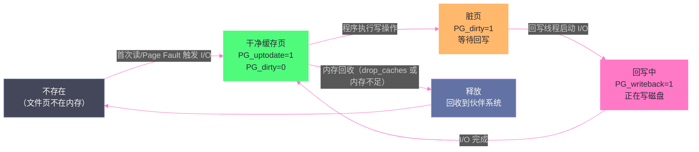

# Page Cache：Linux 为什么要用内存来缓存磁盘

**摘要：**

打开任何一台 Linux 服务器，`free` 命令显示的 `buff/cache` 往往占据了绝大部分内存——这并不是"内存泄漏"，而是 Linux 有意为之的设计：**用空闲内存换取 I/O 性能**。Page Cache 是 Linux 存储 I/O 的核心基础设施，所有文件读写（无论是 `read()`/`write()` 系统调用还是 `mmap` 文件映射）几乎都要经过它。本文从 Page Cache 存在的根本动机出发，深入剖析其核心数据结构 `address_space`，追踪读路径（`read()` → Page Cache → 磁盘）和写路径（`write()` → 脏页 → 回写线程 → 磁盘）的完整流程，详解脏页管理的四个关键内核参数，以及 `sync()`/`fsync()`/`fdatasync()` 的语义差异。最后分析零拷贝技术（`sendfile`、`mmap`）为何能大幅减少 CPU 开销，以及 `O_DIRECT` 绕过 Page Cache 的适用场景。

---

## 第 1 章 为什么需要 Page Cache

### 1.1 存储层级的速度鸿沟

理解 Page Cache 存在的必要性，要从存储层级的速度差异说起。现代计算机的存储层级在延迟上存在数量级的差距：

| 存储层级 | 典型延迟 | 典型带宽 |
|---------|---------|---------|
| L1 Cache | ~1ns | ~1TB/s |
| L2 Cache | ~4ns | ~500GB/s |
| L3 Cache | ~40ns | ~200GB/s |
| DRAM（内存）| ~100ns | ~50GB/s |
| NVMe SSD（顺序）| ~100μs | ~7GB/s |
| NVMe SSD（随机）| ~100μs | ~1GB/s（IOPS 受限）|
| SATA SSD | ~500μs | ~500MB/s |
| 机械硬盘（顺序）| ~5ms | ~200MB/s |
| 机械硬盘（随机）| ~10ms | ~1MB/s |

内存与磁盘之间存在**3~5 个数量级**的延迟差距。如果每次文件读写都直接访问磁盘，哪怕是最快的 NVMe SSD，延迟也是内存的 1000 倍。

在这种背景下，Page Cache 的逻辑是不言而喻的：**把磁盘上的文件数据缓存在内存中，之后的重复读取直接从内存返回，彻底绕过磁盘 I/O**。这是一个以空间换时间的经典设计，在"内存廉价、磁盘 I/O 昂贵"的时代背景下，性价比极高。

### 1.2 不用 Page Cache 的世界会怎样

让我们具体量化一下 Page Cache 带来的收益。考虑一个 Web 服务器，它频繁地读取几个常用的静态文件（HTML、CSS、图片）来响应请求：

**没有 Page Cache 的场景**：每次请求都触发磁盘 I/O。假设机械硬盘随机读延迟 10ms，每个请求读 3 个文件，单个请求的 I/O 延迟就是 30ms。这意味着每个 CPU 核每秒最多处理 33 个请求（如果 I/O 是瓶颈）。

**有 Page Cache 的场景**：第一次请求后，这些文件的内容已在内存中。后续请求直接从 Page Cache 返回，内存延迟约 100ns，3 个文件合计约 300ns——比磁盘快了 **10 万倍**，每个 CPU 核每秒可以处理数万个请求。

这个例子说明，对于访问模式有重复性的工作负载（Web 服务、数据库热点数据、日志分析），Page Cache 的收益是决定性的。

> [!note] 设计哲学
> Linux 的 Page Cache 策略是极度"贪婪"的：只要有空闲内存，就用来缓存文件数据。当程序需要更多内存时，内核按需回收 Page Cache（干净页直接丢弃，脏页先回写再丢弃）。这就是为什么长时间运行的 Linux 系统上，`free` 看到的"空闲内存"往往接近于零——空闲内存在 Linux 眼中是"浪费的内存"，全部应该被 Page Cache 利用起来。这种哲学与 Windows 的保守缓存策略形成鲜明对比。

### 1.3 Page Cache 的范围：哪些 I/O 经过它

明确 Page Cache 的覆盖范围，有助于理解何时可以、何时不可以用 Page Cache 的统计数据来推断 I/O 行为：

**经过 Page Cache 的 I/O**：
- 普通文件的 `read()`/`write()` 系统调用
- `mmap()` 文件映射的读写
- `sendfile()` 零拷贝传输
- 可执行文件和动态库的加载（通过 mmap）
- `splice()`、`copy_file_range()` 等零拷贝接口

**不经过 Page Cache 的 I/O（Direct I/O）**：
- 使用 `O_DIRECT` 标志打开文件后的 `read()`/`write()`
- 直接对块设备（`/dev/sda`）进行操作
- 某些数据库（如 Oracle、InnoDB 可配置）使用 Direct I/O 管理自己的缓存

**不完全相同的情况（网络 I/O）**：
- 套接字（Socket）的 `read()`/`write()` **不经过** Page Cache，而是通过专门的内核 socket 缓冲区
- 但 `sendfile()` 可以把 Page Cache 中的文件直接发送到 socket，避免一次数据拷贝

---

## 第 2 章 Page Cache 的核心数据结构

### 2.1 address_space：文件与内存的桥梁

Page Cache 的核心数据结构是 `address_space`。每个被缓存的文件，在内核中都有一个 `address_space` 对象与之关联（通过 `inode->i_mapping` 指针）。`address_space` 是连接"文件系统层"和"内存管理层"的核心桥梁。

```c
/* include/linux/fs.h（简化）*/
struct address_space {
    struct inode        *host;           /* 关联的 inode（文件节点）*/
    
    struct xarray       i_pages;         /* 核心！存储所有缓存页的基数树/XArray
                                           key = 页在文件中的偏移（以页为单位）
                                           value = struct page * */
    
    gfp_t               gfp_mask;        /* 分配页时使用的 GFP 标志 */
    unsigned long       nrpages;         /* 当前缓存的页面总数 */
    unsigned long       nrexceptional;   /* 异常条目数（swap entry、shadow entry 等）*/
    
    pgoff_t             writeback_index; /* 上次回写的位置，用于轮转回写 */
    
    const struct address_space_operations *a_ops;  /* 文件系统提供的操作函数表
                                                      包括 readpage、writepage、
                                                      readahead、write_begin 等 */
    
    unsigned long       flags;           /* AS_EIO、AS_ENOSPC 等错误标志 */
    struct rw_semaphore invalidate_lock; /* 保护缓存失效操作的读写锁 */
    
    spinlock_t          private_lock;
    struct list_head    private_list;    /* 私有数据链表（文件系统专用）*/
};
```

`address_space` 中最核心的字段是 `i_pages`（老内核是 `page_tree`，一棵**基数树 Radix Tree**；新内核换成了 **XArray**，底层仍是基数树，但接口更现代）。这棵树以**文件内页偏移量（page offset）**为键，以 `struct page *` 为值，存储了该文件当前缓存在内存中的所有页面。

通过这棵树，内核可以在 O(log n)（或接近 O(1)）的时间内回答："文件的第 N 页是否在 Page Cache 中？"——这个查询在每次文件读写时都要发生，性能至关重要。

### 2.2 Page Cache 页的生命周期

一个文件页在 Page Cache 中的生命周期如下：



`struct page` 的 `flags` 字段中有几个关键标志位跟踪页的状态：

| 标志位 | 名称 | 含义 |
|--------|------|------|
| `PG_locked` | 已锁定 | 该页正在被 I/O 操作使用，其他访问者需等待 |
| `PG_uptodate` | 内容有效 | 页内容与磁盘同步（读 I/O 完成后设置）|
| `PG_dirty` | 脏页 | 页内容已被修改，尚未写回磁盘 |
| `PG_writeback` | 回写中 | 页正在被异步写回磁盘（I/O 进行中）|
| `PG_lru` | 在 LRU | 页在 LRU 链表中（参与内存回收）|
| `PG_active` | 活跃页 | 在 active LRU 链表（详见内存回收章节）|
| `PG_referenced` | 已引用 | 近期被访问过（影响 LRU 位置）|

---

## 第 3 章 读路径：从系统调用到数据返回

### 3.1 read() 系统调用的完整路径

当用户程序调用 `read(fd, buf, count)` 读取文件时，完整的内核路径如下：

```
用户程序                内核 VFS 层              Page Cache              磁盘
    │                       │                       │                     │
    │  read(fd, buf, n)     │                       │                     │
    ├──────────────────────>│                       │                     │
    │                       │  sys_read()           │                     │
    │                       │  → vfs_read()         │                     │
    │                       │  → file->f_op->read() │                     │
    │                       │  → generic_file_read_iter()                 │
    │                       │                       │                     │
    │                       │  find_get_page(mapping, page_offset)        │
    │                       │──────────────────────>│                     │
    │                       │  [Page Cache 命中]    │                     │
    │                       │<──────────────────────│                     │
    │                       │                       │                     │
    │  copy_to_user(buf)    │                       │                     │
    │  内核→用户空间拷贝     │                       │                     │
    │<──────────────────────│                       │                     │
    │                       │                       │                     │
    │  （Page Cache 未命中时）                       │                     │
    │                       │  alloc_page()         │                     │
    │                       │  add_to_page_cache()  │                     │
    │                       │  → submit_bio()       │                     │
    │                       │───────────────────────────────────────────> │
    │                       │  [等待 I/O 完成]      │                     │
    │                       │<─────────────────────────────────────────── │
    │                       │  page->PG_uptodate=1  │                     │
    │  copy_to_user(buf)    │                       │                     │
    │<──────────────────────│                       │                     │
```

关键点：**即使 Page Cache 命中，数据仍然需要一次内存拷贝**（`copy_to_user`）——把 Page Cache 中内核地址空间的数据，拷贝到用户程序提供的 `buf` 缓冲区（用户地址空间）。这次拷贝是不可避免的，因为内核不能让用户程序直接访问 Page Cache 的内核地址（安全原因），且用户缓冲区 `buf` 不一定与 Page Cache 页对齐。

### 3.2 预读的更多细节

`generic_file_read_iter` 在访问 Page Cache 时，不是只读一页，而是会触发**预读（readahead）机制**，提前把后续几页读入 Page Cache。

Linux 的预读算法（`page_cache_sync_readahead` / `page_cache_async_readahead`）：

1. **同步预读**：第一次访问某个文件偏移时，除了读取当前页，还会同步预读接下来的若干页（初始窗口大小通常是 128KB）
2. **异步预读**：当程序访问到预读页的最后几页时，内核在后台异步预读下一批页，确保程序不会因等待 I/O 而阻塞
3. **自适应**：如果检测到随机访问模式（访问偏移跳跃），减小或停止预读，避免浪费内存带宽

预读是 Page Cache 对顺序读性能至关重要的优化。Kafka 之所以能达到极高的消费吞吐量，很大程度上依赖于 Page Cache 的顺序预读机制。

---

## 第 4 章 写路径：脏页的诞生与归宿

### 4.1 write() 系统调用：写到 Page Cache 就返回

与读路径不同，`write()` 系统调用**不等待数据落盘就返回**。这是 Linux I/O 性能的重要设计决策。

`write(fd, buf, count)` 的完整路径：

1. `vfs_write()` → `generic_file_write_iter()` → `generic_perform_write()`
2. 调用 `a_ops->write_begin()` 定位或分配 Page Cache 中对应的页（如果页不在 Page Cache，先读入）
3. `copy_from_user()`：将用户缓冲区的数据**拷贝到 Page Cache 页**（内核地址空间）
4. 调用 `a_ops->write_end()`，将该页标记为**脏页**（`PG_dirty=1`）
5. **立即返回**，不等待数据写入磁盘

这意味着：**`write()` 返回成功，不代表数据已经写入磁盘**。数据仅在 Page Cache 的脏页中，如果此时系统断电，**数据会丢失**。

这个设计的理由：
- 写入磁盘的延迟（毫秒级）远大于用户程序可以接受的系统调用延迟（微秒级）
- 多次小写入可以合并为大块回写，大幅提升磁盘 I/O 效率（尤其是机械硬盘）
- 对于大多数应用，操作系统崩溃是小概率事件，牺牲部分持久性换取大幅性能提升是合理的

> [!warning] 生产避坑
> 这个设计是很多数据丢失事故的根源。Redis AOF 的 `appendfsync always` vs `everysec` vs `no` 的选择、MySQL InnoDB 的 `innodb_flush_log_at_trx_commit` 参数、Kafka 的 `flush.messages`/`flush.ms` 参数，本质上都是在控制"多久强制把 Page Cache 中的脏页刷到磁盘"。对于绝对不能丢数据的场景，每次写操作后必须调用 `fsync()`。

### 4.2 脏页的回写：谁来把脏页写回磁盘

Linux 用一套**异步回写（writeback）**机制，在后台将脏页写回磁盘，而不是等到脏页太多时才突击写入。负责这个工作的是内核线程 **`bdi-flush`（BDI Flush Threads，块设备接口刷新线程）**。

> [!info] 核心概念：BDI（Backing Device Info）
> BDI 是内核对"块设备后端"的抽象，每个挂载的文件系统（或块设备）都有对应的 BDI。内核为每个 BDI 维护一个独立的 `bdi-flush` 内核线程，避免一个设备的回写阻塞另一个设备的回写。在老内核（2.6.32 之前）中，这个工作由单一的 `pdflush` 线程完成，在大量脏数据时容易成为瓶颈；新内核的每设备独立线程设计解决了这个问题。

**触发回写的三个条件**：

**条件一：脏页比例超过阈值（`dirty_ratio`）**：
当进程的脏页占总内存的比例超过 `vm.dirty_ratio`（默认 20%），写操作的进程本身会被阻塞（**同步回写**），直到脏页比例降下来。这是防止脏页过多的最后防线，但会导致写进程的明显卡顿。

**条件二：脏页比例超过后台阈值（`dirty_background_ratio`）**：
当脏页比例超过 `vm.dirty_background_ratio`（默认 10%），内核唤醒 `bdi-flush` 线程进行**后台异步回写**，但不阻塞写操作的进程。这是正常情况下的回写触发机制。

**条件三：脏页存在时间超过阈值（`dirty_expire_centisecs`）**：
`bdi-flush` 线程定期运行（间隔由 `dirty_writeback_centisecs` 控制，默认 500 = 5秒），检查所有脏页的"脏龄"，将超过 `dirty_expire_centisecs`（默认 3000 = 30秒）的脏页强制回写。这确保了即使系统脏页比例不高，脏数据也不会在内存中永久驻留。

### 4.3 四个关键内核参数详解

| 参数 | 默认值 | 含义 | 调优方向 |
|-----|--------|------|---------|
| `vm.dirty_ratio` | 20 | 进程被**阻塞**回写的脏页占总内存比例（%）| 数据库：调低（如 5-10%），防止突发大量脏页积压；低延迟服务：调低 |
| `vm.dirty_background_ratio` | 10 | 唤醒后台线程开始回写的脏页比例（%）| 通常设为 `dirty_ratio` 的一半 |
| `vm.dirty_expire_centisecs` | 3000 | 脏页最长存活时间（百分之一秒），超过则强制回写 | 需要更强持久性：调低（如 100 = 1秒）；允许更多缓冲：调高 |
| `vm.dirty_writeback_centisecs` | 500 | `bdi-flush` 线程的唤醒间隔（百分之一秒）| 调低使回写更及时，调高减少唤醒开销 |

还有两个绝对值版本（与比例版本取其小者生效）：
- `vm.dirty_bytes`：`dirty_ratio` 的绝对值版本
- `vm.dirty_background_bytes`：`dirty_background_ratio` 的绝对值版本

> [!warning] 生产避坑
> 在内存很大（如 256GB）的服务器上，`dirty_ratio=20%` 意味着允许 **51GB** 的脏页积压！当回写触发时，需要一次性写入 51GB 数据，对磁盘 I/O 造成极大冲击，可能导致数秒甚至数十秒的 I/O 停顿，影响所有依赖磁盘的应用。**大内存服务器务必改用绝对值参数**（`dirty_bytes`/`dirty_background_bytes`），将脏页上限控制在合理范围（如 dirty_background_bytes=1GB，dirty_bytes=2GB）。

### 4.4 回写的顺序与 writeback_index

`bdi-flush` 线程回写脏页时，并不是随机选择脏页，而是按 `address_space->writeback_index` 记录的位置顺序回写，下次回写从上次停止的地方继续（**轮转式回写**）。

这样做的好处是：避免总是回写文件的前几页而忽略后面的脏页，保证所有脏页最终都能被写回（公平性）。同时，顺序回写对于机械硬盘友好（顺序写比随机写快一个数量级）。

---

## 第 5 章 sync/fsync/fdatasync 的语义差异

### 5.1 三种强制刷盘接口

当应用程序不信任 Page Cache 的异步回写，需要**确认数据已经持久化**时，有三个系统调用可用：

**`sync()`**：请求内核把**所有文件系统**的所有脏页回写到磁盘，并等待所有 I/O 完成后返回。影响系统全局，适合系统维护操作（如系统关机前）。

**`fsync(fd)`**：将 `fd` 对应文件的所有脏数据**和元数据**（文件大小、时间戳、inode 等）都写入磁盘。fsync 返回后，可以确信即使断电，该文件的数据和元数据都是安全的。

**`fdatasync(fd)`**：只将 `fd` 对应文件的**数据部分**写入磁盘，**元数据不保证写入**（除非元数据更新是数据访问所必需的，比如文件大小变化）。比 `fsync` 少一次 I/O（不需要回写 inode），性能略高。

| 操作 | 数据持久化 | 元数据持久化 | 适用场景 |
|------|-----------|------------|---------|
| `write()` | 否（仅写到 Page Cache）| 否 | 普通写操作，允许数据丢失 |
| `fdatasync()` | 是 | 仅必要时 | 日志文件、数据库 WAL |
| `fsync()` | 是 | 是 | 需要完整元数据一致性时 |
| `sync()` | 是（全局）| 是（全局）| 系统级操作 |

> [!info] 核心概念：为什么需要元数据同步？
> 设想你用 `write()` 向文件末尾追加了 1MB 数据，然后调 `fdatasync()`。这 1MB 数据写入磁盘了，但文件大小（inode 中的字段）还在 Page Cache 里没有持久化。如果此时断电，下次挂载文件系统时，inode 里的文件大小还是旧值，这 1MB 数据虽然在磁盘上，但文件系统认为它不属于文件。这就是需要 `fsync()` 同步元数据的原因。但如果你只是在原地覆写文件内容（不改变文件大小），`fdatasync()` 就足够了，文件大小没变，不需要更新 inode。

### 5.2 O_SYNC 和 O_DSYNC 标志

除了事后调 `fsync`，还可以在 `open()` 时传入标志：
- `O_SYNC`：等价于每次 `write()` 后自动调 `fsync()`，保证数据和元数据同步
- `O_DSYNC`：等价于每次 `write()` 后自动调 `fdatasync()`，只保证数据同步

这两个标志会导致每次 `write()` 都同步到磁盘，性能开销极大，只在极度关注持久性的场景（如数据库的 redo log）中使用。

---

## 第 6 章 零拷贝技术：减少 CPU 的数据搬运

### 6.1 传统文件传输的拷贝次数

理解零拷贝，先要数清楚传统方式（`read()` + `write()`）发送文件时，数据经历了几次拷贝。以 Web 服务器发送静态文件为例：

```c
// 传统方式：
int fd = open("file.html", O_RDONLY);
read(fd, kernel_buf, file_size);  // 磁盘 → Page Cache → 用户缓冲区
send(socket_fd, user_buf, file_size, 0);  // 用户缓冲区 → Socket 内核缓冲区 → NIC
```

数据经历了以下拷贝：
1. **磁盘 → Page Cache**：DMA 拷贝（不占用 CPU）
2. **Page Cache → 用户缓冲区**：CPU 拷贝（`read()` 的 `copy_to_user`）
3. **用户缓冲区 → Socket 内核缓冲区**：CPU 拷贝（`send()` 的 `copy_from_user`）
4. **Socket 内核缓冲区 → NIC（网卡）**：DMA 拷贝（不占用 CPU）

其中步骤 2 和 3 是 CPU 参与的内存拷贝，完全没有必要——Page Cache 的数据根本不需要经过用户空间，可以直接"发"到 Socket 缓冲区。

### 6.2 sendfile：减少两次 CPU 拷贝

`sendfile(out_fd, in_fd, offset, count)` 系统调用在内核中直接把 `in_fd` 对应文件的 Page Cache 数据传输到 `out_fd`（通常是 socket），**完全在内核态完成，数据不经过用户空间**：

```
磁盘 → Page Cache（DMA 拷贝）→ Socket 缓冲区（CPU 拷贝 或 DMA gather）→ NIC（DMA 拷贝）
```

如果网卡支持 **scatter-gather DMA**（SG-DMA），连 Page Cache → Socket 缓冲区这次 CPU 拷贝也可以省掉，直接用 DMA gather 操作——网卡 DMA 控制器直接从 Page Cache 的物理地址读取数据发送出去，不需要 CPU 参与任何数据搬运。这是真正的**零 CPU 拷贝（Zero-Copy）**。

Nginx、Kafka（消费者）、Netty 等高性能网络框架都大量使用 `sendfile` 来实现高效的文件传输。

### 6.3 mmap + write：另一种减少拷贝的方式

```c
void *addr = mmap(NULL, file_size, PROT_READ, MAP_SHARED, fd, 0);
write(socket_fd, addr, file_size);
```

`mmap` 让用户程序直接映射 Page Cache，`write` 到 socket 时，内核从用户映射地址（实际上就是 Page Cache）拷贝数据到 socket 缓冲区，比传统方式少了一次从 Page Cache 到用户缓冲区的拷贝：

- 传统方式：Page Cache → 用户 buf → Socket buf（2次 CPU 拷贝）
- mmap + write：Page Cache（直接读，映射地址）→ Socket buf（1次 CPU 拷贝）

mmap + write 比 `sendfile` 多一次 CPU 拷贝，但比传统方式少一次，适合需要在发送前对数据做一些处理的场景。

### 6.4 O_DIRECT：完全绕过 Page Cache

有些应用（数据库是典型代表）有自己的内存缓存层，不希望 OS 的 Page Cache 参与：
- Page Cache 可能与数据库自己的 buffer pool 造成**双重缓存**，浪费内存
- 数据库希望**精确控制 I/O 的时机**（事务提交时同步 fsync），而不是依赖 OS 的异步回写
- 数据库自己的缓存替换策略（基于数据库语义）比 OS 的通用 LRU 更优

`O_DIRECT` 标志让 `read()`/`write()` 直接在用户缓冲区和磁盘之间传输，完全绕过 Page Cache：
- `read()`：DMA 直接把磁盘数据写到用户提供的缓冲区
- `write()`：DMA 直接从用户缓冲区写到磁盘，`write()` 返回时数据已在磁盘

> [!warning] 生产避坑
> `O_DIRECT` 有严格的对齐要求：**用户缓冲区的地址必须对齐到文件系统块大小（通常 512 字节或 4096 字节），读写的偏移和长度也必须对齐**。不满足对齐要求会返回 `EINVAL` 错误。这是 O_DIRECT 使用中最常见的踩坑点。另外，`O_DIRECT` 写操作不保证数据持久化（只是绕过了 Page Cache，但磁盘内部可能还有写缓存），对于必须持久化的场景，`O_DIRECT` 需要与 `O_SYNC` 组合使用，或者写完后调用 `fsync()`。

---

## 第 7 章 Page Cache 的监控与调优

### 7.1 /proc/meminfo 中的 Page Cache 字段

```bash
$ cat /proc/meminfo
MemTotal:       131072000 kB   # 物理内存总量
MemFree:          1234567 kB   # 真正空闲的内存（未被任何用途使用）
MemAvailable:    45678901 kB   # 可用内存（Free + 可回收的 Page Cache/Slab）
Buffers:           234567 kB   # 块设备的元数据缓冲（/proc/sys/fs 等）
Cached:          87654321 kB   # Page Cache 大小（不含 Buffers）
SwapCached:         12345 kB   # 已经换出又换回、但 swap 空间条目还保留的页
Active(anon):    23456789 kB   # 匿名页 active LRU
Inactive(anon):   5678901 kB   # 匿名页 inactive LRU（换出候选）
Active(file):    34567890 kB   # 文件页 active LRU
Inactive(file):  12345678 kB   # 文件页 inactive LRU（回收候选）
Dirty:             345678 kB   # 脏页总量
Writeback:          12345 kB   # 正在回写中的页面大小
WritebackTmp:           0 kB   # FUSE 文件系统的临时回写缓冲
```

关键监控指标：
- **`Dirty`**：脏页总量，正常情况下应远低于 `vm.dirty_bytes`。持续接近上限说明磁盘 I/O 跟不上写入速度。
- **`Writeback`**：正在进行回写的量。高值说明有大量 I/O 正在进行。
- **`Inactive(file)`**：文件页的 inactive LRU 量。这是内存不足时最先被回收的对象，较高的值是健康的。

### 7.2 page cache 命中率监控

Linux 没有直接提供 Page Cache 命中率的统计，但可以通过以下方式间接观察：

```bash
# 观察 major page fault 速率（需要磁盘 I/O 的 Page Cache 未命中）
$ sar -B 1 10
# 关注 pgmajflt/s 字段，正常系统该值应接近 0

# 使用 cachestat（BCC 工具）直接观察缓存命中率
$ cachestat 1
    TOTAL   MISSES     HITS  DIRTIES   BUFFERS_MB  CACHED_MB
     8192       32     8160     1024          234      87654
    # HITS/(TOTAL-DIRTIES) ≈ 命中率

# 使用 fincore 检查特定文件有多少内容在 Page Cache
$ fincore /path/to/large/file
```

### 7.3 drop_caches：主动释放 Page Cache

```bash
# 回收所有干净的 Page Cache（不回收脏页）
echo 1 > /proc/sys/vm/drop_caches

# 回收 Slab 缓存（dentry、inode 等）
echo 2 > /proc/sys/vm/drop_caches

# 同时回收 Page Cache 和 Slab
echo 3 > /proc/sys/vm/drop_caches
```

> [!warning] 生产避坑
> 在生产环境执行 `drop_caches` 会清空所有 Page Cache，导致之后一段时间内所有文件读取都要从磁盘重新加载，**造成严重的性能抖动**（可能持续数分钟）。**禁止在高负载生产服务器上随意执行 drop_caches**。它的正确使用场景是：性能基准测试前清空缓存（确保测试公平性）、诊断 Page Cache 是否异常占用内存。

---

## 第 8 章 总结

Page Cache 是 Linux 存储 I/O 的核心优化层，本文的关键认知：

**1. Page Cache 是"贪婪"的**：空闲内存全部用于文件缓存，只有程序需要更多内存时才回收。`free` 看到的 `cached` 很高是正常的，`MemAvailable` 才是真实可用内存的指标。

**2. `address_space` 是核心**：每个文件对应一个 `address_space`，它的 `i_pages`（基数树/XArray）是快速查找"文件的第 N 页是否在缓存"的数据结构。

**3. write() 返回 ≠ 数据已落盘**：`write()` 只是写到脏页，脏页由后台回写线程异步刷盘。`dirty_ratio`、`dirty_background_ratio`、`dirty_expire_centisecs` 控制回写行为，大内存服务器必须用绝对值参数限制脏页上限。

**4. fsync/fdatasync 的语义差别**：`fdatasync` 只保证数据落盘，`fsync` 还保证元数据。数据库 WAL 通常用 `fdatasync` 即可；需要完整原子性的场景需要 `fsync`。

**5. 零拷贝减少 CPU 开销**：`sendfile`（尤其是结合 SG-DMA）是文件传输的最优路径；`mmap + write` 减少一次拷贝；`O_DIRECT` 完全绕过 Page Cache，适合有自己缓存层的数据库。

Page Cache 虽然对 I/O 性能贡献巨大，但它同样是内存压力的来源之一。当系统内存不足时，内核的内存回收机制将不得不回收 Page Cache，这涉及复杂的 LRU 算法和 kswapd 调度逻辑，这正是下一篇[[内存回收：kswapd、LRU与直接回收的博弈]]的主题。

---

## 参考资料

- Robert Love, *Linux Kernel Development, 3rd Ed.*, Chapter 15: The Page Cache and Page Writeback
- Mel Gorman, *Understanding the Linux Virtual Memory Manager*, Chapter 11: Page Frame Reclamation
- Brendan Gregg, *BPF Performance Tools*, Chapter 8: File Systems
- [Linux Page Cache Basics - Thomas Krenn Wiki](https://www.thomas-krenn.com/en/wiki/Linux_Page_Cache_Basics)
- [The Linux Page Cache and pdflush](http://web.archive.org/web/20160518040713/http://www.westnet.com/~gsmith/content/linux-pdflush.htm)
- Linux Kernel Source: `mm/filemap.c`, `mm/page-writeback.c`, `fs/sync.c`
