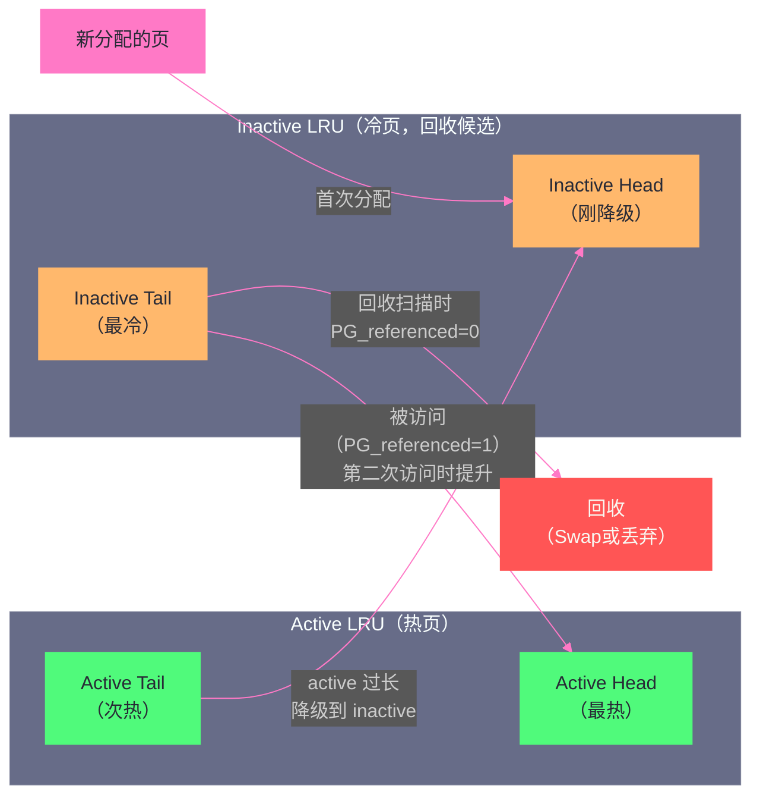

# 内存回收：kswapd、LRU与直接回收的博弈

**摘要：**

在[[Page Cache：Linux 为什么要用内存来缓存磁盘|上一篇]]中我们看到，Linux 贪婪地把所有空闲内存用于 Page Cache。但这带来了一个必须解决的问题：**当真正需要内存时，如何从 Page Cache 和其他缓存中有效地回收？** 内存回收是 Linux 内存管理中最复杂、对系统性能影响最大的机制之一。本文深入分析 Linux 内存回收的完整体系：首先讲清楚**水位线（Watermark）**机制——内核用三条水位线划定"安全区"与"警戒区"，驱动两种不同模式的回收；然后深入 **LRU（Least Recently Used）双链表**的设计——为什么是两条链表而非一条，`active/inactive` 分离如何避免扫描一次就被回收的悲剧；再分析**kswapd 异步回收**的工作模式与触发逻辑；最后剖析**直接回收（Direct Reclaim）**——当异步回收来不及时，分配内存的进程本身被迫进入回收流程，这对系统延迟的破坏性影响，以及如何通过参数调优来缓解。

---

## 第 1 章 内存压力的来源与回收的必要性

### 1.1 内存的三种消耗者

一台运行中的 Linux 服务器，内存主要被三类"消费者"占用：

**第一类：用户态进程内存（Anonymous Memory）**
进程的堆、栈、匿名 mmap 映射等，这些内存不对应任何文件，内容只在进程生命周期内有意义。如果需要回收，只能通过 [[Swap机制|Swap 换出]]到磁盘保存，代价高昂。

**第二类：文件缓存（Page Cache / File-backed Memory）**
[[Page Cache：Linux 为什么要用内存来缓存磁盘|Page Cache]] 中的文件页、可执行文件的代码段、动态库等。干净的文件页（未被修改）可以直接丢弃（下次需要时从磁盘重新读取）；脏文件页需要先回写磁盘再释放。相比匿名页，文件页的回收代价通常更低。

**第三类：内核内存（Kernel Memory）**
Slab 缓存（`dentry`、`inode` 等内核数据结构）、内核栈、驱动缓冲区等。内核内存的回收相对复杂，需要各子系统主动参与（如 Slab Shrinker 机制）。

当系统内存不足时，内核需要从这三类消费者中回收足够的内存。回收的顺序和策略，就是本篇的核心主题。

### 1.2 为什么回收不是"内存满了再回收"

一个直觉上的设计是：等到内存真的耗尽时再开始回收。但这个策略会造成严重问题：

设想系统内存仅剩 10MB，此时一个进程发起 `malloc(50MB)` 请求。内核必须立刻回收 40MB 内存才能满足这个请求。如果回收过程涉及磁盘 I/O（脏页回写或 Swap 换出），可能需要数百毫秒甚至数秒。在这段时间内，发起 `malloc` 的进程被完全阻塞，造成严重的延迟抖动。

正确的策略是**提前回收**：在内存还不算紧张时，就在后台悄悄地把不太重要的内存（比如最近没被访问的 Page Cache 页）回收掉，始终维持一定数量的空闲内存作为"缓冲"，让绝大多数内存分配请求能立即满足，不需要等待回收。

这正是 Linux 水位线机制和 kswapd 的设计初衷。

---

## 第 2 章 水位线机制：内核的内存"预警系统"

### 2.1 三条水位线的定义

Linux 内核对每个 [[物理内存管理：Buddy System 与 Slab 分配器的设计哲学|Zone]] 都维护三条内存水位线，它们是触发不同回收行为的阈值：

```
可用内存（页帧数）
│
│ ████████████████████████  High Watermark（高水位）
│                            ↑ 超过此线：内存充裕，kswapd 可以睡眠
│
│ ░░░░░░░░░░░░░░░░░░░░░░░░  Low Watermark（低水位）
│                            ↑ 低于此线：kswapd 被唤醒，开始后台回收
│                            ↓ 直到可用内存恢复到 High 以上才停止
│
│ ▒▒▒▒▒▒▒▒▒▒▒▒▒▒▒▒▒▒▒▒▒▒  Min Watermark（最低水位）
│                            ↑ 低于此线：直接回收（Direct Reclaim）开始
│                            ↑ 进程分配内存时被迫自己参与回收
│
│ ▄▄▄▄▄▄▄▄▄▄▄▄▄▄▄▄▄▄▄▄▄▄  Emergency Reserve（紧急保留区，Min 以下）
│                            ↑ 只有 GFP_ATOMIC（原子分配）才能使用
│                            ↑ 普通分配即使直接回收也无法分配此区域
│
0
```

三条水位线的计算基础都是 `min_free_kbytes`（可通过 `/proc/sys/vm/min_free_kbytes` 调整）：

- **Min**：= `min_free_kbytes` 直接转换为页帧数
- **Low**：= Min × 1.25（约）
- **High**：= Min × 1.5（约）

`min_free_kbytes` 的默认值由内核根据物理内存大小自动计算（通常是总内存的 0.4%~1%，最小 128KB，最大 65536KB）。

### 2.2 水位线的触发逻辑

每次内存分配时，内核都会检查当前 Zone 的可用内存是否满足水位线要求：

```c
/* mm/page_alloc.c（简化）*/
static inline bool zone_watermark_ok(struct zone *z, unsigned int order,
                                     unsigned long mark, int highest_zoneidx,
                                     unsigned int alloc_flags)
{
    long free_pages = zone_page_state(z, NR_FREE_PAGES);
    
    /* 基本检查：可用页数必须超过 mark（watermark） */
    if (free_pages <= mark + z->lowmem_reserve[highest_zoneidx])
        return false;
    
    /* 对于 order > 0 的分配，还需要检查伙伴系统中的大块可用性 */
    /* ... */
    
    return true;
}
```

**分配路径上的水位线检查**：
- 可用内存 ≥ High：正常分配，无需触发任何回收
- High > 可用内存 ≥ Low：正常分配（当前仍够用），但 kswapd 应该开始工作了
- Low > 可用内存 ≥ Min：**kswapd 被唤醒**（如果还没在运行），仍然允许普通分配通过
- 可用内存 < Min：**Direct Reclaim 触发**，分配请求的进程本身必须先参与回收，才能继续分配

> [!info] 核心概念：lowmem_reserve
> 水位线检查中还有一个 `lowmem_reserve` 参数。它为每个 Zone 保留了一部分内存，专供"更高优先级 Zone"分配失败时的后备。例如，当 ZONE_DMA32 内存不足时，系统可能尝试从 ZONE_NORMAL 分配；但为了防止 ZONE_NORMAL 被耗尽，它会保留 `lowmem_reserve` 数量的内存拒绝来自低优先级 Zone 的"备用请求"。这是保证高优先级分配（如内核本身的分配）不受低优先级分配挤占的安全机制。

### 2.3 如何查看当前水位线状态

```bash
$ cat /proc/zoneinfo | grep -A 10 "zone Normal"
Node 0, zone   Normal
  pages free     2345678
        min      12345
        low      15431
        high     18518
        spanned  4194304
        present  3932160
        managed  3850240
  ...
  nr_free_pages  2345678
  nr_zone_inactive_anon   567890
  nr_zone_active_anon    1234567
  nr_zone_inactive_file  2345678
  nr_zone_active_file    3456789
```

如果 `pages free` 接近 `min` 水位线，说明系统处于严重内存压力下，直接回收很可能已经在发生。通过 `vmstat 1` 的 `si`（swap in）和 `so`（swap out）列，以及 `pgscand`（直接回收扫描的页数）也可以判断回收活跃程度。

---

## 第 3 章 LRU 双链表：回收候选的排队机制

### 3.1 朴素 LRU 的问题

LRU（Least Recently Used，最近最少使用）是缓存替换的经典算法：当缓存满时，优先淘汰最久没有被访问的数据。用于内存回收时，逻辑是：优先把最久没有被进程使用的物理页回收掉。

最简单的 LRU 实现是维护一条链表，每次访问一个页时把它移到链表头，链表尾部就是最不常用的候选。但这个朴素实现对 Linux 来说有一个致命问题：

**流扫描污染（Scan Pollution）问题**。想象一个大文件被 `find` 命令或备份程序做了一次全量扫描，这次扫描会访问文件的每一页，把所有页都移到 LRU 链表的"最近使用"端，而把原来活跃的热点页（比如数据库的热点数据）挤到"最不常用"端——即使那些热点页每秒都被访问几百次。结果，下次内存不足时，真正的热点页会被错误地回收，系统性能急剧下降。

这就是为什么 Linux 不使用朴素的单链表 LRU，而是**双链表 LRU**。

### 3.2 Active/Inactive 双链表：两次机会算法

Linux 的 LRU 实现使用**两条链表**：**Active LRU（活跃链表）**和 **Inactive LRU（非活跃链表）**。同时，匿名页和文件页分开管理（各自有 active/inactive 两条链表），共 4 条（加上不可回收链表共 5 条）：

| 链表名称 | 缩写 | 内容 |
|---------|------|------|
| `LRU_INACTIVE_ANON` | 匿名页 inactive | 匿名页（最近很少访问，回收候选）|
| `LRU_ACTIVE_ANON` | 匿名页 active | 匿名页（最近访问过，暂时保护）|
| `LRU_INACTIVE_FILE` | 文件页 inactive | 文件页（最近很少访问，回收候选）|
| `LRU_ACTIVE_FILE` | 文件页 active | 文件页（最近访问过，暂时保护）|
| `LRU_UNEVICTABLE` | 不可回收 | `mlock` 锁定的页，永不回收 |

这套机制被称为**两次机会算法（Second Chance Algorithm）**或 **Clock-Replacement 变体**：

**基本流程**：
1. 新分配的页（首次 Page Fault）进入 **inactive** 链表尾部
2. 当这个页被**再次访问**时，将其 `PG_referenced` 标志位置 1（第一次引用）
3. 如果后续扫描时发现 `PG_referenced=1`，将其**提升**到 **active** 链表（说明真的被用了两次，是"热页"）
4. active 链表过长时，从 active 链表尾部"降级"一些页到 inactive 链表头部（维持 active/inactive 的平衡）
5. 内存回收时，从 **inactive 链表尾部**开始扫描，优先回收这些"冷页"



### 3.3 双链表如何抵御流扫描污染

回到之前的流扫描问题：`find` 命令扫描大文件，每个页都被访问了一次。

在双链表机制下：
- 这些文件页首次被读入时，进入 **inactive** 链表（因为是文件 Page Cache 的首次加载）
- `find` 扫描访问它们，`PG_referenced` 被置为 1
- **但**，被 `find` 访问过的页**并不会立即提升到 active 链表**，要提升需要被访问第二次（内存回收扫描时看到 `PG_referenced=1` 才提升，然后清零）
- `find` 扫描是一次性的，这些页之后不会再被访问，于是停留在 inactive 链表，作为回收候选

而数据库的热点页，每秒被访问几百次，早就在 active 链表的头部稳坐钓鱼台。流扫描的新页无法轻易把热点页挤出 active 链表。

> [!note] 设计哲学
> 双链表 LRU 的核心思想是：**一次访问不足以证明一个页是"热页"**。只有在不同时间点被访问至少两次，才能被认定为"真正活跃"的页，才值得保护在 active 链表中免于回收。这个"两次验证"的机制，有效过滤了一次性批量 I/O（备份、扫描、排序）造成的噪音。

### 3.4 文件页与匿名页的分离策略

为什么文件页和匿名页要分开维护 LRU？

这是因为两类页的**回收代价不同**：
- **文件页**（干净的）：直接丢弃即可，下次需要时从磁盘重新读取。**回收代价低**。
- **文件页**（脏的）：需要先写回磁盘，再丢弃。**回收代价中等**。
- **匿名页**：必须换出到 Swap 才能回收，涉及磁盘 I/O。**回收代价高**。

如果混用同一条 LRU 链表，可能出现：为了回收内存，内核把热点匿名页（数据库 buffer pool）换出到 Swap，却保留了大量冷的文件页（很久没访问的日志文件缓存）——代价高的被回收，代价低的却被保留，非常不合理。

分离管理允许内核根据内存压力程度**选择性地优先回收文件页**（代价低）而保护匿名页，或者在内存极度紧张时不得不回收匿名页（通过 Swap）。这个选择由 `vm.swappiness` 参数控制（详见[[Swap机制：磁盘充当内存的代价与边界]]）。

---

## 第 4 章 kswapd：异步回收的守护神

### 4.1 kswapd 是什么

**kswapd**（kernel swap daemon）是 Linux 内核的内存回收守护线程。每个 NUMA Node 都有一个专属的 kswapd 线程（`kswapd0`、`kswapd1` 等），负责该 Node 的异步后台内存回收。

kswapd 的核心职责：**在内存还没到紧急程度时，提前进行后台回收，将可用内存维持在 High 水位线以上，避免直接回收的触发**。

kswapd 的触发条件：某个 Zone 的可用内存低于 **Low 水位线**时，内存分配路径会唤醒 kswapd（通过 `wakeup_kswapd()` 函数）。

kswapd 的停止条件：回收到所有 Zone 的可用内存都高于 **High 水位线**时，kswapd 再次进入睡眠（`schedule()`）。

### 4.2 kswapd 的工作循环

kswapd 的核心工作循环可以简化为：

```c
/* mm/vmscan.c（kswapd 主循环，高度简化）*/
static int kswapd(void *p)
{
    pg_data_t *pgdat = (pg_data_t *)p;  /* 本 Node 的数据 */
    
    for (;;) {
        /* 等待被唤醒（可用内存低于 Low 水位线时）*/
        wait_event_freezable(pgdat->kswapd_wait,
                             kswapd_condition_is_met(pgdat));
        
        /* 被唤醒，开始回收，目标：将所有 Zone 回收到 High 水位线以上 */
        do {
            /* 扫描 LRU 链表，回收页面 */
            balance_pgdat(pgdat, high_priority, &classzone_idx);
            
            /* 检查是否已经达到 High 水位线 */
        } while (!all_zones_above_high(pgdat));
        
        /* 达到目标，回到睡眠 */
    }
}
```

`balance_pgdat()` 是 kswapd 的核心函数，它：
1. 调用 `shrink_node()` 遍历 Node 的所有 Zone，对每个 Zone 执行 LRU 扫描
2. 调用 `shrink_lruvec()` 扫描指定 Zone 的 LRU 链表，回收页面
3. 调用 `shrink_slab()` 回收 Slab 缓存中不活跃的对象（如 dentry、inode 缓存）

### 4.3 kswapd 的扫描压力与优先级

kswapd 不是一次把所有 LRU 页面全扫描完，而是按**优先级**分批扫描：优先级越低（priority 数值越大），每次扫描的页面越多，回收越激进。

kswapd 的优先级从 `DEF_PRIORITY`（默认值 12）开始，如果扫描了大量页面却没有回收到足够内存（比如大量页面都有 `PG_referenced`），优先级降低（数值减小），下一轮扫描更多的页面。

**LRU 扫描的基本规则**：

扫描的比例 ≈ `(Zone 中 LRU 总页数 / 2^priority)`

- priority=12（默认）：每次扫描 1/4096 的 LRU 页面（很温和）
- priority=8：每次扫描 1/256（开始有压力）
- priority=0：每次扫描全部 LRU 页面（最激进，极度紧张时）

这种渐进式加压的设计，让 kswapd 在内存压力较轻时做"轻量级打扫"，只在内存压力严重时才大规模扫描，减少了对系统的干扰。

### 4.4 kswapd 的 CPU 占用异常诊断

正常情况下，kswapd 应该几乎不消耗 CPU（大部分时间在睡眠）。如果 `top` 里看到 `kswapd0` CPU 占用率很高（> 1~5%），说明系统长期处于内存压力状态，kswapd 在持续工作：

```bash
# 查看 kswapd 是否活跃
$ top
# 如果 kswapd0 CPU% > 1%，是警报信号

# 查看内存回收活动详情
$ vmstat 1
procs -----------memory---------- ---swap-- -----io---- -system-- ------cpu-----
 r  b   swpd   free   buff  cache   si   so    bi    bo   in   cs us sy id wa st
 1  0      0 456789  12345 8765432    0    0     0     0 1234 5678  5  2 93  0  0
 0  0      0 456789  12345 8765432    0    0    50    30 1345 5890  5  2 93  0  0

# 关键列：
# si（swap in）：从 Swap 换入的页速率（KB/s），> 0 说明内存严重不足
# so（swap out）：换出到 Swap 的页速率，持续 > 0 是严重内存压力信号
# bi（block in）：块设备读 I/O，高值可能是 Page Cache 大量 miss 或 Swap 换入
```

---

## 第 5 章 直接回收（Direct Reclaim）：最糟糕的情况

### 5.1 直接回收的触发条件

当内存分配路径上的检查发现可用内存**低于 Min 水位线**时，或者 kswapd 已经在运行但仍然无法及时满足分配需求时，内核会让**发出内存分配请求的进程本身**进入回收流程，这称为**直接回收（Direct Reclaim）**。

与 kswapd 的异步后台回收不同，直接回收是**同步**的：进程调用 `alloc_pages()` 或 `kmalloc()` 申请内存，如果触发了直接回收，该进程必须**等待回收完成**才能得到内存，整个期间进程被完全阻塞。

```c
/* mm/page_alloc.c（简化）*/
static struct page *__alloc_pages_slowpath(gfp_t gfp_mask, unsigned int order, ...)
{
    /* 快速分配路径失败（可用内存低于水位线），进入慢速路径 */
    
    /* 1. 尝试唤醒 kswapd（如果还没唤醒）*/
    wake_all_kswapds(order, gfp_mask, ac);
    
    /* 2. 重试快速分配路径 */
    page = get_page_from_freelist(gfp_mask, order, alloc_flags, ac);
    if (page)
        goto out;
    
    /* 3. 快速路径仍然失败，开始直接回收 */
    page = __alloc_pages_direct_reclaim(gfp_mask, order, alloc_flags, ac,
                                         &did_some_progress);
    if (page)
        goto out;
    
    /* 4. 直接回收后仍然失败，尝试内存紧缩（Compaction）*/
    page = __alloc_pages_direct_compact(gfp_mask, order, alloc_flags, ac, ...);
    if (page)
        goto out;
    
    /* 5. 所有手段都失败：触发 OOM Killer */
    if (out_of_memory(...))
        goto retry;
    
    /* 彻底失败，返回 NULL */
    return NULL;
}
```

### 5.2 直接回收对延迟的破坏

直接回收对系统延迟的影响是灾难性的。设想一个处理 HTTP 请求的 Web 服务进程：

- 正常情况下，处理一个请求需要 1ms
- 触发直接回收时，这个进程在 `malloc()` 中被阻塞，等待内存回收完成
- 内存回收可能涉及脏页回写（磁盘 I/O，毫秒级）或 Swap 换出（磁盘 I/O，毫秒级）
- 最坏情况下，这个请求的响应时间从 1ms 变成 100ms 甚至数秒

更糟糕的是，**直接回收的发生通常具有传染性**：一个进程触发直接回收，在它阻塞期间，其他进程也可能遇到同样的内存不足问题，纷纷进入直接回收，形成一种"内存风暴"，系统整体性能急剧下降。

```bash
# 检测直接回收是否发生
$ sar -B 1 10
09:00:01     pgpgin/s pgpgout/s   fault/s  majflt/s  pgfree/s pgscank/s pgscand/s pgsteal/s    %vmeff
09:00:02     1234.56   567.89  34567.89      0.00  45678.90  12345.00      0.00  12345.00    100.00
09:00:03      234.56  4567.89  23456.78      5.67  34567.89  23456.00    567.00  23456.00     95.23

# 关键字段：
# pgscand/s：直接回收（Direct Reclaim）每秒扫描的页数
#            > 0 意味着直接回收正在发生，是严重警报！
# pgscank/s：kswapd 每秒扫描的页数（后台回收，正常现象）
# %vmeff：回收效率（回收到的页 / 扫描的页），低值说明大量扫描但回收很少
```

`pgscand` 指标是判断直接回收是否发生的最直接指标，**任何生产监控系统都应该对 `pgscand > 0` 设置告警**。

### 5.3 回收的优先级：先回收什么

当回收发生时（无论是 kswapd 还是直接回收），内核按以下优先级选择回收对象：

**最优先回收：干净的文件页（Page Cache Clean Pages）**
直接丢弃，代价最低，不需要任何 I/O。在 inactive file LRU 链表尾部。

**次优先回收：Slab 缓存（dentry、inode 等）**
通过 Slab Shrinker 机制回收内核对象缓存，`shrink_slab()` 函数调用各子系统注册的 shrinker 函数。

**再次：脏文件页**
需要先触发回写（写磁盘），等回写完成后才能释放。代价中等（涉及 I/O）。

**最后：匿名页（需要 Swap）**
换出到 Swap 空间。代价最高（磁盘 I/O + 后续换回的 I/O）。是否优先回收匿名页还是文件页，由 `vm.swappiness` 参数控制。

> [!note] 设计哲学
> Linux 回收优先级的设计体现了"最小代价原则"：先回收代价最低的（干净文件页，只需要丢弃），再回收代价中等的（脏文件页，需要回写），最后才是代价最高的（匿名页，需要 Swap）。这与人类的直觉一致：先扔垃圾（干净缓存），再清理不常用的东西放到储物间（脏页回写），最后才不得不把常用物品搬到仓库（匿名页 Swap）。

---

## 第 6 章 Slab Shrinker：内核缓存的主动回收

### 6.1 为什么 Slab 缓存需要单独的回收机制

[[物理内存管理：Buddy System 与 Slab 分配器的设计哲学|Slab 分配器]]分配的内核对象（`dentry`、`inode`、`sock` 等）不在 LRU 链表中，无法通过普通的 LRU 扫描来回收。这些内核对象的缓存可能占用大量内存（通过 `slabtop` 可以看到 `dentry` 或 `inode_cache` 动辄占用几 GB），必须有一套独立的回收机制。

Linux 提供了 **Slab Shrinker** 接口：内核各子系统（VFS、网络、文件系统等）可以注册一个 shrinker 回调函数，当内存压力触发时，内核调用这些回调函数，子系统自行决定回收哪些对象、回收多少。

### 6.2 Shrinker 的工作方式

每个注册的 shrinker 包含两个函数：
- `count_objects()`：返回当前可以回收的对象数量（供内核评估回收潜力）
- `scan_objects()`：实际执行回收，参数指定目标回收数量，返回实际回收数量

VFS 层的 `dentry` 缓存 shrinker 就是典型例子：
- `prune_dcache()` 函数遍历 LRU 链表（VFS 为 dentry 自己维护了一条 LRU），回收最不活跃的 dentry
- 回收一个 `dentry` 时，如果对应的 `inode` 引用计数降为 0，顺带回收 `inode`

```bash
# 查看系统中注册的 shrinker 及其回收统计
$ cat /proc/meminfo | grep Slab
Slab:            2345678 kB  # Slab 总占用
SReclaimable:    1234567 kB  # 可回收的 Slab（dentry、inode 等，内存不足时会回收）
SUnreclaim:       234567 kB  # 不可回收的 Slab（内核核心数据结构）
```

`SReclaimable` 这部分 Slab 内存，在内存压力大时会被 shrinker 回收，所以 `MemAvailable` 的计算中会把它计入可用内存。

---

## 第 7 章 内存回收调优

### 7.1 调整 min_free_kbytes

`min_free_kbytes` 是影响水位线最直接的参数，适当调大可以让 kswapd 更早介入，减少直接回收的发生：

```bash
# 查看当前值
$ cat /proc/sys/vm/min_free_kbytes
67584

# 对于大内存服务器（如 256GB），可以适当调大
$ echo 524288 > /proc/sys/vm/min_free_kbytes  # 512MB
# 使永久生效（加入 /etc/sysctl.conf）
```

调大 `min_free_kbytes` 的代价：这些内存会被"锁定"为保留区，不能被 Page Cache 或用户进程使用，实际上是减少了可用内存。调整原则：

- **内存 < 8GB 的系统**：保持默认值或适当调大至 256MB
- **内存 8~64GB 的系统**：256MB~512MB
- **内存 > 64GB 的系统**：512MB~1GB

> [!warning] 生产避坑
> `min_free_kbytes` 不能调得过大。如果设置为总内存的 5% 以上，可能导致系统频繁触发 kswapd（因为阈值过高，稍微有些分配就会低于 Low 水位线），反而增加 kswapd 的工作量，适得其反。另外，`min_free_kbytes` 过大会导致 HugePage 分配失败（HugePage 需要连续的大块内存，而大量保留内存会使连续空闲内存减少）。

### 7.2 vm.vfs_cache_pressure：影响 Slab 回收力度

```bash
# 默认值 100：Slab 缓存与 Page Cache 以相同压力回收
$ cat /proc/sys/vm/vfs_cache_pressure
100

# > 100：更激进地回收 dentry/inode 缓存（倾向于保留 Page Cache）
# < 100：保留更多 dentry/inode 缓存，更激进地回收 Page Cache
```

对于**文件服务器或数据库服务器**（大量文件操作，需要保留 dentry/inode 缓存）：
- 可以适当降低 `vfs_cache_pressure`（如 50），减少 dentry/inode 的回收频率，减少目录查找的 I/O

对于**内存非常紧张、dentry/inode 缓存占用过多**的系统：
- 提高 `vfs_cache_pressure`（如 200），让内核更激进地释放这部分缓存

### 7.3 NUMA 相关：vm.zone_reclaim_mode

在 NUMA 系统上，内核默认优先在本地 Node 分配内存。当本地 Node 内存不足时，`zone_reclaim_mode` 控制行为：

```bash
$ cat /proc/sys/vm/zone_reclaim_mode
0  # 默认值 0：内存不足时允许从其他 NUMA Node 分配（跨 Node 分配）
   # 1：尝试从本地 Node 回收文件页，而非跨 Node 分配
   # 2：本地 Node 回收，允许写回脏页
   # 4：本地 Node 回收，允许 Swap 换出匿名页
```

`zone_reclaim_mode=0`（默认）对大多数场景是最优的：允许跨 Node 分配，避免因本地 Node 内存回收引入的 I/O 延迟。但对于**数据局部性要求极高的 NUMA 感知应用**（如 HPC 计算），开启 `zone_reclaim_mode=1` 可以保证内存访问的 NUMA 本地性，避免跨 Node 内存访问的延迟增加。

---

## 第 8 章 总结

内存回收是 Linux 内存管理中最需要细心调优的环节，本文的核心认知：

**1. 水位线是回收的触发器**：Min/Low/High 三条水位线划定了"安全区"。Low 以下唤醒 kswapd（异步回收），Min 以下触发直接回收（同步阻塞）。`min_free_kbytes` 是调整水位线的最直接参数。

**2. 双链表 LRU 抵御流扫描污染**：Active/Inactive 双链表 + 两次机会算法，确保真正的热点页不被一次性批量 I/O 挤出缓存。文件页和匿名页分开管理，允许根据回收代价差异制定不同策略。

**3. kswapd 是性能保障**：正常系统 kswapd 应大部分时间睡眠。kswapd CPU 持续高企，`pgscank` 持续升高，是内存长期不足的信号，需要关注。

**4. 直接回收是生产事故根源**：`pgscand > 0` 是严重告警，说明系统已无法通过后台回收应对内存压力，应用进程正被迫参与内存回收，延迟抖动在所难免。

**5. 回收的代价梯度**：干净文件页（最廉价）→ Slab 缓存 → 脏文件页 → 匿名页（最昂贵）。`swappiness` 控制匿名页与文件页回收的平衡点（详见下篇）。

理解了内存回收的机制，下一步自然要深入探讨回收的"终极后备"：当内存实在不够用时，[[Swap机制：磁盘充当内存的代价与边界|Swap]] 是如何工作的，它的代价是什么，以及为什么数据库系统对 Swap 深恶痛绝。

---

## 参考资料

- Mel Gorman, *Understanding the Linux Virtual Memory Manager*, Chapter 10: Page Frame Reclamation
- Brendan Gregg, *Systems Performance, 2nd Ed.*, Chapter 7: Memory
- Linux Kernel Documentation: [Memory Management Documentation](https://www.kernel.org/doc/html/latest/admin-guide/mm/)
- Linux Kernel Source: `mm/vmscan.c`（kswapd、shrink_lruvec、direct reclaim）
- [Overview of Memory Reclaim in Linux Kernel](https://lpc.events/event/11/contributions/896/attachments/793/1493/slides-r2.pdf)
- [Linux Kernel vs. Memory Fragmentation - TiDB Blog](https://www.pingcap.com/blog/linux-kernel-vs-memory-fragmentation-2/)

---

> [!note] 思考题
> 1. 当可用内存低于阈值时 kswapd 后台回收。如果回收跟不上分配速度，进入'直接回收'导致进程阻塞。在延迟敏感的 Java 应用中，直接回收可能导致秒级抖动。如何通过 `vm.min_free_kbytes` 和 `vm.watermark_scale_factor` 来预防？设置过大有什么代价？
> 2. `vm.swappiness` 控制回收文件页与匿名页的偏好。Redis 官方建议设为 1 而非 0——为什么？设为 0 在内核 3.5+ 意味着'除非内存极度紧张否则不 Swap'，但仍有极端场景会触发 Swap。在什么场景下即使 swappiness=0 仍然会发生 Swap？
> 3. 脏页回写是内存回收的瓶颈。`vm.dirty_ratio` 和 `vm.dirty_background_ratio` 控制脏页阈值。在 SSD 服务器上这些参数的最优值与 HDD 有什么不同？为什么在高写入场景中降低 `dirty_ratio` 反而可能提升应用的延迟稳定性？
